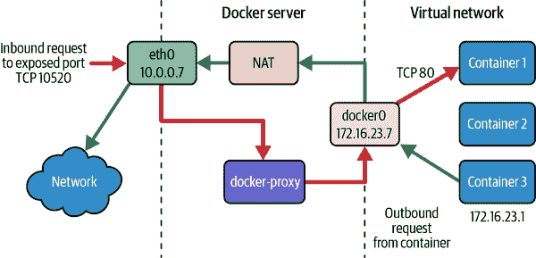
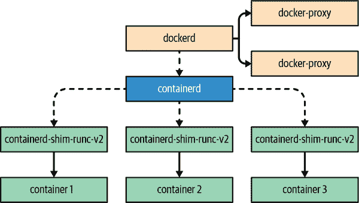

# 第十一章. 高级主题

在这一章中，我们将快速浏览一些更高级的主题。我们假设您对 Docker 已经有了相当好的掌握，并且已经将其投入生产或者至少是常规用户。我们将详细讨论容器的工作原理以及 Docker 安全性、Docker 网络、Docker 插件、可交换运行时以及其他高级配置的一些方面。

本章的一部分涵盖了您可以对 Docker 安装进行的可配置更改。这些可能很有用，但 Docker 有良好的默认设置，所以像大多数软件一样，除非您有足够的理由更改它们并且已经了解这些更改对您意味着什么，否则应该坚持使用操作系统的默认设置。为了使您的环境中的安装正确，可能需要一些试验、调整和随时间的调整。然而，在充分理解它们之前修改默认设置并不建议。

# 容器详解

尽管我们通常将 Linux 容器称为一个单一实体，它们实际上是通过几个内建于 Linux 内核中的单独机制实现的，这些机制共同工作：控制组（cgroups）、命名空间、安全计算模式（`seccomp`）以及 SELinux 或 AppArmor，它们都用于*限制*进程。cgroups 提供资源限制，命名空间允许进程使用相同命名的资源并将它们从系统其他部分的视图中隔离出来，安全计算模式限制进程可以使用哪些系统调用，而 SELinux 或 AppArmor 则为进程提供了额外的强安全隔离。那么，首先，cgroups 和命名空间为您做了什么？

在我们进入详细内容之前，类比可能有助于您理解这些子系统如何影响容器工作方式。想象一下，典型的计算机就像是一个大型的开放仓库，充满了工人（进程）。仓库充满了空间和资源，但工人很容易互相干扰，大多数资源只是由先得到它们的人使用。

当您运行 Docker 并使用 Linux 容器来处理工作负载时，就像那个仓库已经被转换成一个办公楼，每个工人现在都有自己的独立办公室。每个办公室都有工人完成工作所需的所有正常事物，总体上，他们现在可以在不太担心其他人（进程）正在做什么的情况下工作。

命名空间构成了办公室的隔离墙，并确保进程不能以任何未经特别允许的方式与相邻进程交互。控制组有点像支付租金以获取公共设施。当进程首次启动时，它被分配在 CPU 和存储子系统上的时间，每个周期都会被允许使用，在任何时刻都可以使用的内存量。这有助于确保工作者（进程）拥有所需的资源，而不允许它们使用为他人保留的资源或空间。想象一下最糟糕的吵闹邻居，你会突然真正欣赏到良好而坚固的办公室隔离。最后，安全计算模式、SELinux 和 AppArmor 有点像办公室安全，确保即使发生意外或不良事件，也不太可能引起更多麻烦，只是填写文书工作和提交事故报告的头痛。

## cgroups

传统的分布式系统设计要求将每个密集型任务分配到自己的虚拟服务器上运行。例如，您不会在数据库服务器上运行应用程序，因为它们具有竞争的资源需求，它们的资源使用可能会无限增长，并开始主导服务器，从而使数据库的性能受到影响。

在实际硬件系统上，这可能非常昂贵，因此像虚拟服务器这样的解决方案非常诱人，部分原因是您可以在竞争应用程序之间共享昂贵的硬件，而虚拟化层将处理您的资源分区。但是虽然可以节省成本，如果不需要虚拟化提供的所有其他隔离，这仍然是一种相当昂贵的方法，因为运行多个内核会对应用程序产生合理的额外开销。维护 VM 也不是最便宜的解决方案。尽管如此，云计算已经证明了它的强大性，并且在正确的工具支持下非常有效。

但是，如果您需要的唯一隔离方式是资源分区，那么如果您可以在同一内核上获得这些功能而无需运行另一个操作系统实例，那不是很棒吗？多年来，您可以为进程分配“亲和性”值，这将为调度程序提供有关您希望如何处理此进程与其他进程关系的提示。但是，不可能像使用 VM 那样强制实施硬限制。而且亲和性并不是非常精细：您不能使某些进程在 I/O 方面比其他进程更多，而在 CPU 方面更少。当然，这种精细控制是 Linux 容器的承诺之一，它们用来提供此功能的机制是 cgroups，早在 Docker 出现之前就已经发明，目的就是解决这个问题。

*控制组* 允许您为进程及其子进程设置资源限制。这是 Linux 内核用于控制内存、交换、CPU、存储和网络 I/O 资源限制的机制。cgroups 已经内建于内核中，并最早在 Linux 2.6.24 中发布于 2007 年。官方的 [内核文档](https://www.kernel.org/doc/Documentation/cgroup-v2.txt) 将其定义为“一种按层次结构组织进程并以受控和可配置的方式分配系统资源的机制。” 需要注意的是，这个设置适用于一个进程及其所有的子进程。这正是容器的结构所在。

###### 注意

值得一提的是，Linux 控制组至少已经有两个主要版本发布：[v1](https://www.kernel.org/doc/Documentation/cgroup-v1/cgroups.txt) 和 [v2](https://www.kernel.org/doc/Documentation/cgroup-v2.txt)。确保您知道正在生产中使用的版本，以便充分利用其提供的所有功能。

每个 Linux 容器都被分配了一个唯一的 cgroup。容器中的所有进程将位于同一组中。这意味着可以轻松地为每个容器作为整体控制资源，而无需担心其中可能运行的内容。如果重新部署一个容器并添加了新进程，您可以让 Docker 分配相同的策略，并且它将适用于整个容器及其内部的所有进程容器。

我们之前谈到了 Docker 通过其 API 公开的 cgroups 钩子。该接口允许您控制内存、交换和磁盘使用情况。但是，还有许多其他可以使用 cgroups 管理的东西，包括标记容器的网络数据包，以便您可以使用这些标记来优先处理流量。您可能会发现，在您的环境中，您需要使用这些杠杆来控制您的容器，有几种方法可以做到这一点。由于 cgroups 的本质，它们需要对每个组使用的资源进行大量的资源核算。这意味着当您使用它们时，内核有关于每个进程使用多少 CPU、RAM、磁盘 I/O 等方面的有趣统计数据。因此，Docker 不仅使用 cgroups 限制资源，还用于报告这些资源。例如，这些指标中的许多是您在 `docker` `container stats` 输出中看到的。

### 文件系统 /sys

控制 cgroups 的主要方式是以精细的方式控制，即使您已经通过 Docker 进行了配置，也可以自行管理它们。这是最强大的方法，因为更改不仅发生在容器创建时，还可以在运行时进行。

在带有`systemd`的系统上，有像`systemctl`这样的命令行工具可以用来执行此操作。但由于 cgroups 内建于内核中，适用于所有地方的方法是通过*/sys*文件系统直接与内核交互。如果您对*/sys*不熟悉，它是一个直接公开几个内核设置和输出的文件系统。您可以使用它来告诉内核您希望它如何行动的简单命令行工具。

仅在 Docker 服务器上直接使用此方法配置容器的 cgroups 控制才有效，因此不通过任何 API 远程使用。如果您使用此方法，您需要找出如何为您的环境编写脚本。

###### 警告

在任何 Docker 配置之外自行更改 cgroups 值会破坏 Docker 部署的某些可重复性。除非您在部署过程中实施更改，否则容器替换时设置将恢复为其默认值。一些调度程序会为您处理这些事务，因此如果您在生产中运行一个调度程序，您可能需要查看文档以了解如何最好地重复应用这些更改。

让我们使用一个例子来改变我们刚刚启动的容器的 CPU cgroups 设置。我们需要获取容器的长 ID，然后我们需要在*/sys*文件系统中找到它。这是它的样子：

```
$ docker container run -d spkane/train-os \
  stress -v --cpu 2 --io 1 --vm 2 --vm-bytes 128M --timeout 360s

dcbb…8e86f1dc0a91e7675d3c93895cb6a6d83371e25b7f0bd62803ed8e86
```

在这里，我们已经让`docker container run`在输出中给我们长 ID，并且我们想要的 ID 是`dcbb…8e86f1dc0a91e7675d3c93895cb6a6d83371e25b7f0bd62803ed8e86`。你可以看到为什么 Docker 通常会截断这个 ID。

###### 注意

在示例中，我们可能需要截断 ID 以使其适应标准页面的约束条件。但请记住，你需要使用长 ID！

现在我们有了 ID，我们可以在*/sys*文件系统中找到我们容器的 cgroup。*/sys*布局使得每种类型的设置都被分组到一个模块中，而该模块可能在*/sys*文件系统中的不同位置暴露。因此，当我们查看 CPU 设置时，例如我们不会看到`blkio`设置。你可以在*/sys*周围看看还有什么。但现在我们对 CPU 控制器感兴趣，所以让我们检查一下这给我们带来了什么。你需要在系统上有`root`权限来执行此操作，因为你正在操作内核设置。

###### 提示

记住我们最初在第三章中讨论的`nsenter`技巧。你可以运行`docker container run --rm -it --privileged --pid=host debian nsenter -t 1 -m -u -n -i sh`来访问 Docker 主机，即使无法通过 SSH 连接到服务器。

```
$ ls /sys/fs/cgroup/docker/dcbb…8e86

cgroup.controllers        cpuset.cpus.partition     memory.high
cgroup.events             cpuset.mems               memory.low
cgroup.freeze             cpuset.mems.effective     memory.max
cgroup.max.depth          hugetlb.2MB.current       memory.min
cgroup.max.descendants    hugetlb.2MB.events        memory.oom.group
cgroup.procs              hugetlb.2MB.events.local  memory.stat
cgroup.stat               hugetlb.2MB.max           memory.swap.current
cgroup.subtree_control    hugetlb.2MB.rsvd.current  memory.swap.events
cgroup.threads            hugetlb.2MB.rsvd.max      memory.swap.high
cgroup.type               io.bfq.weight             memory.swap.max
cpu.max                   io.latency                pids.current
cpu.stat                  io.max                    pids.events
cpu.weight                io.stat                   pids.max
cpu.weight.nice           memory.current            rdma.current
cpuset.cpus               memory.events             rdma.max
cpuset.cpus.effective     memory.events.local
```

###### 注意

此处的确切路径可能会有所变化，这取决于您的 Docker 服务器运行的 Linux 发行版以及您的容器的哈希值。

你可以看到，在 cgroups 下，有一个包含此主机上所有正在运行的 Linux 容器的 *docker* 目录。你不能为未运行的东西设置 cgroups，因为它们只适用于正在运行的进程。这是一个你应该考虑的重要点。Docker 在启动和停止容器时会重新应用 cgroup 设置。没有这种机制，你会有些自己摸索。

让我们来检查一下这个容器的 [CPU 权重](https://docs.kernel.org/admin-guide/cgroup-v2.html#cpu-interface-files)。请记住，我们在 第五章 中通过 `docker container run` 的 `--cpus` 命令行参数探索了设置一些 CPU 值。但对于一个没有传递任何设置的普通容器，这个设置是默认的：

```
$ cat /sys/fs/cgroup/docker/dcbb…8e86/cpu.weight
100
```

`100` CPU 权重意味着我们完全没有限制。让我们告诉内核，这个容器应该被限制在这一半：

```
$ echo 50 > /sys/fs/cgroup/docker/dcbb…8e86/cpu.weight
$ cat /sys/fs/cgroup/docker/dcbb…8e86/cpu.weight
50
```

###### 警告

在生产环境中，不应该使用此方法动态调整 cgroups，但我们在这里演示它，以便你了解使所有这些工作的底层机制。如果你想要在运行中的容器上调整这些设置，请查看 [`docker container update`](https://dockr.ly/2PPC4P1)。你可能还会发现 `docker container run` 的 [`--cgroup-parent`](https://dockr.ly/2PTLaKK) 选项很有趣。

就是这样。我们已经在运行中动态更改了容器的设置。这种方法非常强大，因为它允许你为容器设置任何 cgroups 设置。但正如我们之前提到的，它完全是暂时的。当容器停止并重新启动时，设置会恢复为默认值：

```
$ docker container stop dcbb…8e86
dcbb…8e86

$ cat /sys/fs/cgroup/docker/dcbb…8e86/cpu.weight
cat: /sys/fs/…/cpu.weight: No such file or directory
```

你可以看到，由于容器已经停止，目录路径甚至不复存在。当我们重新启动它时，目录会回来，但设置会回到 `100`：

```
$ docker container start dcbb…8e86
dcbb…8e86

$ cat /sys/fs/cgroup/docker/dcbb…8e86/cpu.weight
100
```

如果你要直接通过 */sys* 文件系统在生产系统中更改这些设置，你需要直接管理它。例如，可以通过监听 `docker system events` 流并在容器启动时更改设置的守护进程。

###### 注意

可以在 Docker 外部创建自定义的 cgroups，然后使用 `docker container create` 的 `--cgroup-parent` 参数将新容器附加到该 cgroup。这种机制也被调度程序用于在同一个 cgroup 中运行多个容器（例如 Kubernetes pods）。

## 命名空间

在每个容器内部，你会看到一个文件系统、网络接口、磁盘和其他资源，尽管与系统上所有其他进程共享内核，但它们都看起来是唯一的容器。例如，实际机器上的主要网络接口是一个共享资源。但在你的容器内部，它看起来像是拥有整个网络接口。这是一个非常有用的抽象：它使你的容器感觉像是一个独立的机器。这是通过 Linux 命名空间在内核中实现的。命名空间将传统上的全局资源提供给容器，使其拥有自己独特且不共享的版本。

###### 注意

命名空间不能像 cgroups 那样在文件系统上轻松探索，但大多数细节可以在 */proc/*/ns/** 和 */proc/*/task/*/ns/** 层次结构下找到。在较新的 Linux 发行版中，`lsns` 命令也可能非常有用。

然而，默认情况下，容器不仅仅有一个命名空间，而是在内核中当前命名空间的每个资源上都有一个命名空间：挂载、UTS、IPC、PID、网络和用户命名空间，还有部分实现的时间命名空间。基本上，当你谈论一个容器时，你在谈论 Docker 为你设置的几个不同的命名空间。那么它们都做什么呢？

挂载命名空间

Linux 主要用这些来使你的容器看起来像拥有自己的整个文件系统。如果你曾经使用过 `chroot` 狱，那么这是其更强大的相对。它看起来很像 `chroot` 狱，但是它深入到内核的最深层，甚至 `mount` 和 `unmount` 系统调用也是命名空间的。如果你使用 `docker container exec` 或 `nsenter` 来进入容器，你会看到一个以 */* 根目录为根的文件系统。但我们知道这并不是系统的实际根分区。是挂载命名空间使这一切成为可能。

UTS 命名空间

以其命名空间命名的内核结构，UTS（Unix Time Sharing System）命名空间为你的容器提供了自己的主机名和域名。这也被旧系统如 NIS 使用来确定主机属于哪个域。当你进入一个容器并看到一个与其运行的机器不同的主机名时，正是这个命名空间让这种情况发生。

###### 提示

要使容器使用其主机的 UTS 命名空间，可以在使用 `docker container run` 启动容器时指定 `--uts=host` 选项。其他命名空间也有类似的命令用于共享。

IPC 命名空间

这些将你的容器的 System V IPC 和 POSIX 消息队列系统与主机的隔离开来。一些 IPC 机制使用像命名管道这样的文件系统资源，这些资源由挂载命名空间覆盖。IPC 命名空间涵盖的是诸如共享内存和信号量这样的不是文件系统资源但不应越过容器墙的东西。

PID 命名空间

我们已经展示了您可以在主机 Linux 服务器上通过 Linux 的 `ps` 输出看到容器中的所有进程。但在容器内部，进程具有不同的 PID。这是 PID 命名空间的作用。进程在每个命名空间中都有一个唯一的 PID。如果在容器内部查看 */proc* 或运行 `ps`，您只会看到容器 PID 命名空间内的进程。

网络命名空间

这就是使您的容器拥有自己的网络设备、端口等的原因。当您运行 `docker container ls` 并查看容器的绑定端口时，您会看到来自两个命名空间的端口。在容器内部，您的 `nginx` 可能绑定到端口 80，但这是在命名空间网络接口上。这个命名空间使得容器的网络堆栈看起来是完全独立的成为可能。

用户命名空间

这些提供了在容器内部用户和组 ID 与 Linux 主机上的用户和组 ID 之间的隔离。早些时候，当我们在容器外部和容器内部分别查看 `ps` 输出时，我们看到了不同的用户 ID；这就是它发生的方式。容器内的新用户不是 Linux 主机主命名空间上的新用户，反之亦然。不过，这里有一些微妙之处。例如，在用户命名空间中，UID 0（`root`）并不等同于主机上的 UID 0，尽管在容器内作为 `root` 运行会增加潜在的安全漏洞风险。关于安全泄露的问题我们稍后会讨论，这也是像无根容器之类的东西变得越来越受欢迎的原因。

控制组命名空间

此命名空间于 2016 年的 Linux 内核 4.6 中引入，旨在隐藏进程所属的控制组的身份。检查任何进程属于哪个控制组时，会看到一个相对于创建时设置的控制组路径，隐藏了其真实的控制组位置和身份。

时间命名空间

由于时间对 Linux 内核如此重要，因此历史上它并没有被命名空间化，提供完整的命名空间化将非常复杂。然而，随着 2020 年 Linux 内核 5.6 的发布，支持添加了一个[时间命名空间](https://man7.org/linux/man-pages/man7/time_namespaces.7.html)，允许容器具有自己独特的时钟偏移。

###### 注意

在撰写本文时，Docker 仍然不直接支持设置时间偏移，但像其他所有内容一样，如果需要，可以直接设置。

因此，通过结合所有这些命名空间，Linux 可以提供视觉上的以及在许多情况下的功能隔离，使得容器看起来像是在同一个内核上运行的虚拟机。让我们更详细地探讨刚刚描述的一些命名空间是什么样子。

###### 注意

目前有大量的工作致力于使容器更加安全。社区正在积极寻找改进支持[无根容器](https://rootlesscontaine.rs)（允许普通用户在本地创建、运行和管理容器而无需特殊权限）的方法。在 Docker 中，可以通过[无根模式](https://docs.docker.com/engine/security/rootless)实现。新的容器运行时如[Google gVisor](https://github.com/google/gvisor)也在探索更安全地创建容器沙盒的方式，同时保留容器化工作流程的大部分优势。

### 探索命名空间

最容易演示的命名空间之一是 UTS，所以让我们使用 `docker container exec` 进入容器并查看一下。在 Docker 服务器内运行以下命令：

```
$ hostname

docker-desktop
```

###### 提示

同样要记住，即使无法通过 SSH 连接到服务器，你仍然可以使用我们在第三章讨论过的命令 `docker container run --rm -it --privileged --pid=host debian nsenter -t 1 -m -u -n -i sh` 来访问 Docker 主机。

然后在你的本地系统上运行以下命令：

```
$ docker container run -ti --rm ubuntu \
    bash -c 'echo "Container hostname: $(hostname)"'

Container hostname: 4cdb66d4495b
```

那个 `docker container run` 命令行让我们进入一个交互式会话（`-ti`），然后通过 `/bin/bash` 在容器内执行 `hostname` 命令。由于 `hostname` 命令在容器的命名空间内运行，我们会得到默认的短容器 ID 作为主机名。这是一个相当简单的例子，但它应该清楚地表明我们不在与主机相同的命名空间中。

另一个易于理解和演示的例子涉及 PID 命名空间。让我们创建一个新的容器：

```
$ docker container run -d --rm --name pstest spkane/train-os sleep 240
6e005f895e259ed03c4386b5aeb03e0a50368cc173078007b6d1beaa8cd7dded

$ docker container exec -ti pstest ps -ef

UID        PID  PPID  C STIME TTY          TIME CMD
root         1     0  0 15:33 ?        00:00:00 sleep 240
root        13     0  0 15:33 pts/0    00:00:00 ps -ef
```

现在让 Docker 显示我们从主机视角看到的进程 ID：

```
$ docker container top pstest

UID   PID    PPID   C  STIME  TTY  TIME      CMD
root  31396  31370  0  15:33 ?     00:00:00  sleep 240
```

我们可以看到，在我们的容器内部，由 Docker 启动的原始命令是 `sleep 240`，并且它在容器内被分配了 PID `1`。你可能还记得，在 Unix 系统上，这是 `init` 进程通常使用的 PID。在这种情况下，我们用来启动容器的 `sleep 240` 命令是第一个进程，所以它获得了 PID `1`。但在 Docker 服务器的主命名空间中，我们可以看到那里的 PID 不是 `1`，而是 `31396`，并且它是进程 ID `31370` 的子进程。

如果你感兴趣，你可以运行像这样的命令来确定 PID `31370` 是什么：

```
$ docker container run --pid=host ubuntu ps -p 31370
PID    TTY  TIME      CMD
31370  ?    00:00:00  containerd-shim
```

现在我们可以继续通过运行以下命令来删除上一个示例中启动的容器：

```
 $ docker container rm -f pstest
```

其他命名空间基本上以相同的方式工作，到这里你可能已经理解了。值得指出的是，当我们首次在第三章讨论使用 `nsenter` 时，我们在运行它以从 Docker 服务器进入容器时，不得不传递一些看起来相当深奥的参数。让我们继续看看命令 `docker container run --rm -it --privileged --pid=host debian nsenter -t 1 -m -u -n -i sh` 中的 `nsenter` 部分。

结果发现，`nsenter -t 1 -m -u -n -i sh`与`nsenter --target 1 --mount --uts --net -ipc sh`完全相同。因此，这个命令实际上是说，查看 PID 为`1`的进程，然后在该进程的`mount`、`uts`、`net`和`ipc`命名空间中打开一个 shell。

现在我们已经详细解释了命名空间，这可能对您来说更加清晰了。使用`nsenter`尝试进入一次性容器中的不同命名空间集合来查看您可以得到什么，简单地探索更多细节也可能会增长您的见识。

当谈到容器时，命名空间是使容器看起来像容器的主要因素。结合控制组，您可以在同一内核上实现相对强大的进程隔离。

# 安全性

现在我们花了不少篇幅讨论 Docker 如何为应用程序提供容器化，允许您限制资源利用，并使用命名空间为容器提供独特的视角。我们还简要提到了像安全计算模式、SELinux 和 AppArmor 这样的技术的必要性。容器的一个优势是能够在多种用例中替代虚拟机。因此，让我们看看我们默认获得了哪些隔离以及哪些没有。

您现在无疑已经意识到，容器提供的隔离不如虚拟机强大。从本书开始我们一直强调容器只是在 Linux 服务器上运行的进程。尽管命名空间提供了隔离，但容器的安全性并不如您想象的那么高，特别是如果您仍然在精神上将它们与轻量级虚拟机进行比较的话。

对于容器的性能显著提升之一，以及使其轻量化的因素之一，是它们共享 Linux 服务器的内核。这也是围绕 Linux 容器最大的安全关注点。这种关注的主要原因在于内核中并非所有内容都有命名空间。我们已经讨论了所有存在的命名空间及容器对世界视角的限制是如何运作的。然而，内核中仍有许多地方没有真正的隔离，而命名空间只有在容器没有权限要求内核让其访问不同命名空间时才对其进行约束。

容器化应用比非容器化应用更安全，因为控制组（cgroups）和标准命名空间（namespaces）提供了对主机核心资源的重要隔离。但是，你不应认为容器可以替代良好的安全实践。如果你考虑如何在生产系统上运行应用程序，那么你在所有容器中的运行方式应该与此相同。如果你的应用程序在服务器上通常以非特权用户身份运行，那么它在容器内部也应以相同方式运行。告诉 Docker 以非特权用户身份运行容器进程非常简单，在几乎所有情况下，这都是你应该做的。

###### 提示

`--userns-remap`参数传递给`dockerd`命令以及无根模式都使得所有容器都可以在主机系统上非特权的用户和组上下文中运行。这些方法有助于保护主机免受许多潜在的安全漏洞的影响。

有关`userns-remap`的更多信息，请阅读官方[功能](https://dockr.ly/2BYfWze)和[Docker 守护程序](https://dockr.ly/2LE9gG2)文档。

您可以在“无根模式”部分了解更多关于无根模式的信息。

让我们看一些常见的安全风险和控制措施。

## UID 0

容器中的第一个和最普遍的安全风险是，除非你使用了无根模式（rootless mode）或者 Docker 守护程序中的`userns-remap`功能，否则容器中的`root`用户实际上是系统中的`root`用户。在容器中，`root`用户有额外的约束条件，并且命名空间可以很好地将容器中的`root`与*/proc*和*/sys*文件系统中最危险的部分隔离开来。但是，如果你的 UID 是 0，你就有`root`访问权限，因此如果你以某种方式访问了文件挂载或者命名空间外的受保护资源，那么内核将把你视为`root`并且允许你访问该资源。除非另有配置，Docker 会以`root`用户身份启动所有容器中的服务，这意味着你需要像在任何标准 Linux 系统上一样管理应用程序的权限。让我们探讨一些`root`访问权限的限制，并看看一些明显的漏洞。这并不打算详尽阐述容器安全性的声明，而是试图让你对某些安全风险类别有一个健康的理解。

首先，让我们启动一个容器，并使用下面代码中显示的公共 Ubuntu 镜像获取一个`bash` shell。然后，我们将看看我们在安装了一些我们想要运行的工具之后拥有哪些访问权限：

```
$ docker container run --rm -ti ubuntu /bin/bash

root@808a2b8426d1:/# apt-get update
…
root@808a2b8426d1:/# apt-get install -y kmod
…
root@808a2b8426d1:/# lsmod
Module                             Size  Used by
xfrm_user                         36864  1
xfrm_algo                         16384  1 xfrm_user
shiftfs                           28672  0
grpcfuse                          16384  0
vmw_vsock_virtio_transport        16384  2
vmw_vsock_virtio_transport_common 28672  1 vmw_vsock_virtio_transport
vsock                             36864  9 vmw_vsock_virtio_transport_common…
```

在 Docker Desktop 中，你可能只能看到列表中的几个模块，但在普通的 Linux 系统上，这个列表可能非常长。使用`lsmod`，我们刚刚要求内核告诉我们加载了哪些模块。从容器内获取这个列表并不奇怪，因为普通用户总是可以这样做。如果你在 Docker 服务器本身上运行此列表，结果将是相同的，这加强了容器正在与服务器上运行的相同 Linux 内核交互的事实。因此，我们可以看到内核模块；如果我们尝试卸载`floppy`模块会发生什么？

```
root@808a2b8426d1:/# rmmod shiftfs

rmmod: ERROR: ../libkmod/libkmod-module.c:799 kmod_module_remove_module() …
rmmod: ERROR: could not remove module shiftfs: Operation not permitted

root@808a2b8426d1:/# exit
```

如果我们是非特权用户尝试告诉内核删除一个模块，我们将会得到相同的错误消息。这应该让你明白内核正在尽最大努力阻止我们做不应该做的事情。因为我们在有限的命名空间中，我们不能让内核让我们访问顶级命名空间。我们基本上是依赖于这样一个希望：内核中没有允许我们在容器内提升特权的漏洞。因为如果我们成功做到了，我们就是`root`，这意味着如果内核允许的话，我们将能够进行更改。

我们可以通过在容器中启动一个`bash` shell 来制造一个简单的错误示例，该容器已将 Docker 服务器的*/etc*绑定到容器的命名空间中。请记住，任何可以在你的 Docker 服务器上启动容器的人都可以随时像我们即将做的事情一样做，因为你无法配置 Docker 来阻止这种操作，所以你必须依赖像 SELinux 这样的外部工具来避免这样的漏洞利用。

###### 注意

此示例假定你在运行`docker` CLI 的 Linux 系统上，该系统有*/etc/shadow*文件。在运行 Docker Desktop 等 Windows 或 macOS 主机上，此文件将不存在。

```
$ docker container run --rm -it -v /etc:/host_etc ubuntu /bin/bash

root@e674eb96bb74:/# more /host_etc/shadow
root:!:16230:0:99999:7:::
daemon:*:16230:0:99999:7:::
bin:*:16230:0:99999:7:::
sys:*:16230:0:99999:7:::
…
irc:*:16230:0:99999:7:::
nobody:*:16230:0:99999:7:::
libuuid:!:16230:0:99999:7:::
syslog:*:16230:0:99999:7:::
messagebus:*:16230:0:99999:7:::
kmatthias:$1$aTAYQT.j$3xamPL3dHGow4ITBdRh1:16230:0:99999:7:::
sshd:*:16230:0:99999:7:::
lxc-dnsmasq:!:16458:0:99999:7:::

root@e674eb96bb74:/# exit
```

在这里，我们使用了`-v`开关告诉 Docker 将主机路径挂载到容器中。我们选择的路径是*/etc*，这是一件非常危险的事情。但这证明了一个观点：我们在容器中是`root`，而`root`在此路径下具有文件权限。因此，我们可以查看 Linux 服务器上的*/etc/shadow*文件，其中包含所有用户的加密密码。这里还有许多其他操作，但关键是，默认情况下你只受到部分限制。

###### 警告

使用 UID 0 来运行你的容器进程是一个不好的主意。这是因为任何允许进程以某种方式逃离其命名空间的漏洞都会使你的主机系统暴露给完全特权的进程。你应该始终以非特权 UID 运行标准容器。

处理在容器内使用 UID 0 可能带来的潜在问题最简单的方法是始终告诉 Docker 为你的容器使用不同的 UID。

您可以通过传递 `-u` 参数给 `docker container run` 来做到这一点。在下一个示例中，我们运行 `whoami` 命令以显示默认情况下我们是 `root`，并且我们可以读取此容器内部的 */etc/shadow* 文件：

```
$ docker container run --rm spkane/train-os:latest whoami
root

$ docker container run --rm spkane/train-os:latest cat /etc/shadow
root:!locked::0:99999:7:::
bin:*:18656:0:99999:7:::
daemon:*:18656:0:99999:7:::
adm:*:18656:0:99999:7:::
lp:*:18656:0:99999:7:::
…
```

在这个例子中，当您添加 `-u 500` 时，您会看到我们成为了一个新的非特权用户，不能再读取相同的 */etc/shadow* 文件：

```
$ docker container run --rm -u 500 spkane/train-os:latest whoami
user500

$ docker container run --rm -u 500 spkane/train-os:latest cat /etc/shadow
cat: /etc/shadow: Permission denied
```

另一个强烈推荐的方法是在您的 *Dockerfile* 中添加 `USER` 指令，以便从它们创建的容器将默认使用非特权用户启动：

```
FROM fedora:34
RUN useradd -u 500 -m myuser
USER 500:500
CMD ["whoami"]
```

如果您创建了这个 *Dockerfile*，然后构建并运行它，您将看到 `whoami` 返回的是 `myuser` 而不是 `root`：

```
$ docker image build -t user-test .

[+] Building 0.5s (6/6) FINISHED
 => [internal] load build definition from Dockerfile                      0.0s
 => => transferring dockerfile: 36B                                       0.0s
 => [internal] load .dockerignore                                         0.0s
 => => transferring context: 2B                                           0.0s
 => [internal] load metadata for docker.io/library/fedora:34              0.4s
 => [1/2] FROM docker.io/library/fedora:34@sha256:321d…2697               0.0s
 => CACHED [2/2] RUN useradd -u 500 -m myuser                             0.0s
 => exporting to image                                                    0.0s
 => => exporting layers                                                   0.0s
 => => writing image sha256:4727…30d5                                     0.0s
 => => naming to docker.io/library/user-test                              0.0s

$ docker container run --rm user-test
myuser
```

## 无根模式

容器的一个主要安全挑战是，它们通常需要一些特权进程来启动和管理。即使您使用 Docker 守护程序的 `--userns-remap` 功能，守护程序本身仍然作为特权进程运行，尽管它启动的容器不会。

使用 [无根模式](https://docs.docker.com/engine/security/rootless)，可以在不需要 root 权限的情况下运行守护程序和所有容器，这可以大大提高底层系统的安全性。

Rootless 模式需要一个 Linux 系统，Docker 推荐使用 Ubuntu，因此让我们通过一个新的 Ubuntu 22.04 系统的示例来运行。

###### 注意

这些步骤假定您正在以普通非特权用户登录，并且您已经安装了 [Docker Engine](https://docs.docker.com/engine/install/ubuntu)。

我们首先需要确保安装了 `dbus-user-session` 和 `uidmap`。如果尚未安装 `dbus-user-session`，则在运行以下命令后需要注销并重新登录：

```
$ sudo apt-get install -y dbus-user-session uidmap
…
dbus-user-session is already the newest version (1.12.20-2ubuntu4).
…
Setting up uidmap (1:4.8.1-2ubuntu2) …
…
```

尽管不是必须的，但如果系统范围内设置了 Docker 守护程序来运行，最好是将其禁用，然后重新启动：

```
$ sudo systemctl disable --now docker.service docker.socket

Synchronizing state of docker.service with SysV service script with
 /lib/systemd/systemd-sysv-install.
Executing: /lib/systemd/systemd-sysv-install disable docker
Removed /etc/systemd/system/sockets.target.wants/docker.socket.
Removed /etc/systemd/system/multi-user.target.wants/docker.service.

$ sudo shutdown -r now
```

系统恢复后，您可以作为普通用户 SSH 回到服务器，并确认 */var/run/docker.sock* 不再存在于系统上：

```
$ ls /var/run/docker.sock
ls: cannot access '/var/run/docker.sock': No such file or directory
```

下一步是运行无根模式安装脚本，该脚本由 Docker 安装程序安装在 */usr/bin* 中：

```
$ dockerd-rootless-setuptool.sh install

[INFO] Creating /home/me/.config/systemd/user/docker.service
[INFO] starting systemd service docker.service
+ systemctl --user start docker.service
+ sleep 3
+ systemctl --user --no-pager --full status docker.service
● docker.service - Docker Application Container Engine (Rootless)
 Loaded: loaded (/home/me/.config/systemd/user/docker.service; …)
…
+ DOCKER_HOST=unix:///run/user/1000/docker.sock /usr/bin/docker version
Client: Docker Engine - Community
 Version:           20.10.18
…
Server: Docker Engine - Community
 Engine:
 Version:          20.10.18
…
+ systemctl --user enable docker.service
Created symlink /home/me/.config/systemd/user/default.target.wants/
 docker.service → /home/me/.config/systemd/user/docker.service.
[INFO] Installed docker.service successfully.

[INFO] To control docker.service, run:
 `systemctl --user (start|stop|restart) docker.service`
[INFO] To run docker.service on system startup, run:
 `sudo loginctl enable-linger me`

[INFO] Creating CLI context "rootless"
Successfully created context "rootless"

[INFO] Make sure the following environment variables are set
 (or add them to ~/.bashrc):
export PATH=/usr/bin:$PATH
export DOCKER_HOST=unix:///run/user/1000/docker.sock
```

###### 注意

在这里 `DOCKER_HOST` 变量中的 `` UID` `` 应该与运行脚本的用户的 UID 匹配。在这种情况下，`UID` 是 `1000`。

此脚本运行了一些检查以确保我们的系统已准备就绪，然后安装并启动了一个用户范围的 `systemd` 服务文件到 `${HOME}/.config/systemd/user/docker.service`。系统上的每个用户都可以根据需要执行相同的操作。

用户 Docker 守护程序可以像大多数 `systemd` 服务一样进行控制。这里展示了一些基本示例：

```
$ systemctl --user restart docker.service
$ systemctl --user stop docker.service
$ systemctl --user start docker.service
```

要允许用户 Docker 守护程序在用户未登录时运行，用户需要使用 `sudo` 来启用 `systemd` 的一个名为 `linger` 的功能，然后还可以使 Docker 守护程序在系统启动时启动：

```
$ sudo loginctl enable-linger $(whoami)
$ systemctl --user enable docker
```

现在是时候继续将这些环境变量添加到我们的 shell 启动文件中了，但至少我们需要确保这两个环境变量在我们当前的终端中设置：

```
$ export PATH=/usr/bin:$PATH
$ export DOCKER_HOST=unix:///run/user/1000/docker.sock
```

我们可以轻松运行一个标准容器：

```
$ docker container run --rm hello-world

Hello from Docker!
This message shows that your installation appears to be working correctly.
…
For more examples and ideas, visit:
 https://docs.docker.com/get-started/
```

然而，您会注意到，在较早的章节中使用的某些更高特权的容器在这种环境下无法工作：

```
$ docker container run --rm -it --privileged --pid=host debian nsenter \
    -t 1 -m -u -n -i sh

docker: Error response from daemon: failed to create shim task: OCI runtime
create failed: runc create failed: unable to start container process: error
during container init: error mounting "proc" to rootfs at "/proc":
mount proc:/proc (via /proc/self/fd/7), flags: 0xe:
operation not permitted: unknown.
```

这是因为，在无根模式下，容器不能比运行容器的用户拥有更多的特权，即使在表面上，容器似乎仍然具有完整的`root`特权：

```
$ docker container run --rm spkane/train-os:latest whoami
root
```

让我们再深入探讨一下，通过启动一个运行`sleep 480s`的小型容器：

```
$ docker container run -d --rm --name sleep spkane/train-os:latest sleep 480s
1f8ccec0a834537da20c6e07423f9217efe34c0eac94f0b0e178fb97612341ef
```

如果我们查看容器内部的进程，我们会看到它们似乎都是以用户`root`运行的：

```
$ docker container exec sleep ps auxwww
USER         PID %CPU %MEM    VSZ   RSS TTY      STAT START   TIME COMMAND
root           1  0.1  0.0   2400   824 ?        Ss   17:51   0:00 sleep 480s
root           7  0.0  0.0   7780  3316 ?        Rs   17:51   0:00 ps auxwww
```

但是，如果我们查看 Linux 系统上的进程，我们会发现`sleep`命令实际上是由本地用户`me`而不是`root`来运行的：

```
$ ps auxwww | grep sleep
me   3509 0.0 0.0  2400  824 ?     Ss 10:51 0:00 sleep 480s
me   3569 0.0 0.0 17732 2360 pts/0 S+ 10:51 0:00 grep --color=auto sleep
```

在无根容器内部的`root`用户实际上映射到用户本身。容器进程无法使用守护程序运行用户尚未具有的任何特权，因此，这是允许多用户系统上的用户运行容器的非常安全方式，而无需在系统上授予他们任何提升的特权。

###### 小贴士

有关在 Docker 网站上[卸载无根模式](https://docs.docker.com/engine/security/rootless/#uninstall)的说明。

## 特权容器

有时您需要容器具有特殊的[内核功能](https://man7.org/linux/man-pages/man7/capabilities.7.html)，通常容器将被拒绝。这些功能可能包括挂载 USB 驱动器、修改网络配置或创建新的 Unix 设备。

在下面的代码中，我们尝试更改容器的 MAC 地址：

```
$ docker container run --rm -ti spkane/train-os /bin/bash

[root@280d4dc16407 /]# ip link ls
1: lo: <LOOPBACK,UP,LOWER_UP> mtu 65536 qdisc noqueue state UNKNOWN mode …
 link/loopback 00:00:00:00:00:00 brd 00:00:00:00:00:00
2: tunl0@NONE: <NOARP> mtu 1480 qdisc noop state DOWN mode DEFAULT …
 link/ipip 0.0.0.0 brd 0.0.0.0
3: ip6tnl0@NONE: <NOARP> mtu 1452 qdisc noop state DOWN mode DEFAULT …
 link/tunnel6 :: brd :: permaddr 12b5:6f1b:a7e9::
22: eth0@if23: <BROADCAST,MULTICAST,UP,LOWER_UP> mtu 1500 qdisc noqueue …
 link/ether 02:42:ac:11:00:02 brd ff:ff:ff:ff:ff:ff link-netnsid 0

[root@fc4589fb8778 /]# ip link set eth0 address 02:0a:03:0b:04:0c
RTNETLINK answers: Operation not permitted

[root@280d4dc16407 /]# exit
```

正如您所见，这是行不通的。这是因为底层的 Linux 内核阻止非特权容器执行此操作，这正是我们通常希望的。但是，假设我们需要此功能使容器按预期工作，通过使用`--privileged=true`参数启动容器是显著扩展容器特权的最简单方法。

###### 警告

我们不建议在下一个示例中运行`ip link set eth0 address`命令，因为这会更改容器网络接口的 MAC 地址。我们展示它是为了帮助你理解机制。请自行承担风险。

```
$ docker container run -ti --rm --privileged=true spkane/train-os /bin/bash

[root@853e0ef5dd63 /]# ip link ls
1: lo: <LOOPBACK,UP,LOWER_UP> mtu 65536 qdisc noqueue state UNKNOWN mode …
 link/loopback 00:00:00:00:00:00 brd 00:00:00:00:00:00
2: tunl0@NONE: <NOARP> mtu 1480 qdisc noop state DOWN mode DEFAULT …
 link/ipip 0.0.0.0 brd 0.0.0.0
3: ip6tnl0@NONE: <NOARP> mtu 1452 qdisc noop state DOWN mode DEFAULT …
 link/tunnel6 :: brd :: permaddr 12b5:6f1b:a7e9::
22: eth0@if23: <BROADCAST,MULTICAST,UP,LOWER_UP> mtu 1500 qdisc noqueue …
 link/ether 02:42:ac:11:00:02 brd ff:ff:ff:ff:ff:ff link-netnsid 0

[root@853e0ef5dd63 /]# ip link set eth0 address 02:0a:03:0b:04:0c

[root@853e0ef5dd63 /]# ip link show eth0
26: eth0@if27: <BROADCAST,MULTICAST,UP,LOWER_UP> mtu 1500 qdisc noqueue …
 link/ether 02:0a:03:0b:04:0c brd ff:ff:ff:ff:ff:ff link-netnsid 0

[root@853e0ef5dd63 /]# exit
```

在先前的输出中，您会注意到我们不再收到错误，并且`eth0`的`link/ether`条目已更改。

使用`--privileged=true`参数的问题在于，您为容器提供了非常广泛的特权，在大多数情况下，您可能只需要一两个内核功能就能完成工作。

如果我们进一步探索我们的特权容器，我们会发现我们拥有一些与更改 MAC 地址无关的能力。我们甚至可以执行可能导致 Docker 和主机系统出现问题的操作。在以下代码中，我们将从底层主机系统挂载一个磁盘分区，列出系统上所有基于 Docker 的 Linux 容器，并探索其中一些关键文件：

```
$ docker container run -ti --rm --privileged=true spkane/train-os /bin/bash

[root@664a896983d7 /]# mount /dev/vda1 /mnt && \
                         ls -F /mnt/docker/containers | \
                         head -n 10

047df420f6d1f227a26667f83e477f608298c25b0cdad2e149a781587aae5e11/
0888b9f97b1ecc4261f637404e0adcc8ef0c8df291b87c9160426e42dc9b5dea/
174ea3ec35cd3a576bed6f475b477b1a474d897ece15acfc46e61685abb3101d/
1eddad26ee64c4b29eb164b71d56d680739922b3538dc8aa6c6966fce61125b0/
22b2aa38a687f423522dd174fdd85d578eb21c9c8ec154a0f9b8411d08f6fd4b/
23879e3b9cd6a42a1e09dc8e96912ad66e80ec09949c744d1177a911322e7462/
266fe7da627d2e8ec5429140487e984c8d5d36a26bb3cc36a88295e38216e8a7/
2cb6223e115c12ae729d968db0d2f29a934b4724f0c9536e377e0dbd566f1102/
306f00e86122b69eeba9323415532a12f88360a1661f445fc7d64c07249eb0ce/
333b85236409f873d07cd47f62ec1a987df59f688a201df744f40f98b7e4ef2c/

[root@664a896983d7 /]# ls -F /mnt/docker/containers/047d…5e11/

047df420f6d1f227a26667f83e477f608298c25b0cdad2e149a781587aae5e11-json.log
checkpoints/
config.v2.json
hostconfig.json
hostname
hosts
mounts/
resolv.conf
resolv.conf.hash

[root@664a896983d7 /]# cat /mnt/docker/containers/047d…5e11/047…e11-json.log
```

```
{"log":"047df420f6d1\r\n","stream":"stdout","time":"2022-09-14T15:18:29.…"}
…
```

```
[root@664a896983d7 /]# exit
```

###### 警告

不要更改或删除这些文件。这可能会对容器或底层 Linux 系统产生不可预测的影响。

因此，正如我们所见，人们可以在完全特权的容器中运行命令并访问不应访问的内容。

要更改 MAC 地址，我们唯一需要的内核能力是`CAP_NET_ADMIN`。我们可以通过在启动 Linux 容器时使用`--cap-add`参数，给予容器这个特权，而不是给予它完整的特权集，如下所示：

```
$ docker container run -ti --rm --cap-add=NET_ADMIN spkane/train-os /bin/bash

[root@087c02a3c6e7 /]# ip link show eth0
36: eth0@if37: <BROADCAST,MULTICAST,UP,LOWER_UP> mtu 1500 qdisc noqueue …
 link/ether 02:42:ac:11:00:02 brd ff:ff:ff:ff:ff:ff link-netnsid 0

[root@087c02a3c6e7 /]# ip link set eth0 address 02:0a:03:0b:04:0c

[root@087c02a3c6e7 /]# ip link show eth0
36: eth0@if37: <BROADCAST,MULTICAST,UP,LOWER_UP> mtu 1500 qdisc noqueue …
 link/ether 02:0a:03:0b:04:0c brd ff:ff:ff:ff:ff:ff link-netnsid 0

[root@087c02a3c6e7 /]# exit
```

你还应该注意，尽管我们可以更改 MAC 地址，但我们无法在容器内部再使用`mount`命令：

```
$ docker container run -ti --rm --cap-add=NET_ADMIN spkane/train-os /bin/bash

[root@b84a06ddaa0d /]# mount /dev/vda1 /mnt
mount: /mnt: permission denied.

[root@b84a06ddaa0d /]# exit
```

也可以从容器中删除特定的能力。想象一下，你的安全团队要求在所有容器中禁用`tcpdump`，当你测试一些容器时，你发现`tcpdump`已安装并且可以轻松运行：

```
$ docker container run -ti --rm spkane/train-os:latest tcpdump -i eth0

dropped privs to tcpdump
tcpdump: verbose output suppressed, use -v[v]… for full protocol decode
listening on eth0, link-type EN10MB (Ethernet), snapshot length 262144 bytes
15:40:49.847446 IP6 fe80::23:6cff:fed6:424f > ff02::16: HBH ICMP6, …
15:40:49.913977 ARP, Request who-has _gateway tell 5614703ffee2, length 28
15:40:49.914048 ARP, Request who-has _gateway tell 5614703ffee2, length 28
15:40:49.914051 ARP, Reply _gateway is-at 02:49:9b:d9:49:4e (oui Unknown), …
15:40:49.914053 IP 5642703bbff2.45432 > 192.168.75.8.domain: 44649+ PTR? …
…
```

你可以从你的镜像中删除`tcpdump`，但很少有什么能阻止别人重新安装它。解决这个问题的最有效方法是确定`tcpdump`运行所需的能力，并从容器中移除。在这种情况下，你可以通过在`docker container run`命令中添加`--cap-drop=NET_RAW`来实现：

```
$ docker container run -ti --rm --cap-drop=NET_RAW spkane/train-os:latest \
  tcpdump -i eth0

tcpdump: eth0: You don't have permission to capture on that device
(socket: Operation not permitted)
```

通过在`docker container run`中使用`--cap-add`和`--cap-drop`参数，你可以精确控制容器的[Linux 内核能力](https://man7.org/linux/man-pages/man7/capabilities.7.html)。

###### 注意

请注意，除了提供系统调用的访问权限之外，启用特定的 Linux 能力实际上还可以提供其他一些功能。这可能包括查看系统上所有设备的可见性或更改系统时间的能力。

## 安全计算模式

当 Linux 内核版本 2.6.12 在 2005 年发布时，它包含了一个名为安全计算模式（Secure Computing Mode）的新安全特性，简称为`seccomp`。这个特性使得进程可以单向转换到一个特殊状态，在这种状态下，它只能执行系统调用`exit()`、`sigreturn()`，以及对已打开文件描述符的`read()`或`write()`。

作为`seccomp`的扩展，称为`seccomp-bpf`，利用 Linux 版本的[伯克利数据包过滤器（BPF）](https://www.kernel.org/doc/Documentation/networking/filter.txt)规则，允许你创建一个策略，明确列出一个进程在安全计算模式下可以使用的系统调用列表。Docker 对安全计算模式的支持使用`seccomp-bpf`，让用户可以创建非常精细化的配置文件，控制他们的容器化进程可以执行哪些内核系统调用。

###### 注意

默认情况下，所有容器都使用安全计算模式，并且附加了默认配置文件。你可以在文档中[了解更多安全计算模式的信息](https://docs.docker.com/engine/security/seccomp)，以及默认配置文件阻止哪些系统调用。你还可以查看[默认策略的 JSON 文件](https://github.com/moby/moby/blob/master/profiles/seccomp/default.json)来了解策略的具体定义。

要看看如何使用这个功能，让我们使用`strace`程序来跟踪在尝试使用`umount`命令卸载文件系统时进程所做的系统调用。

###### 警告

这些示例是为了证明一个观点，但显然你不应该在不确切知道会发生什么的情况下在容器中卸载文件系统。

```
$ docker container run -ti --rm spkane/train-os:latest umount /sys/fs/cgroup
umount: /sys/fs/cgroup: must be superuser to unmount.

$ docker container run -ti --rm spkane/train-os:latest \
  strace umount /sys/fs/cgroup

execve("/usr/bin/umount", ["umount", "/sys/fs/cgroup"], 0x7fff902ddbe8 …
…
umount2("/sys/fs/cgroup", 0)            = -1 EPERM (Operation not permitted)
write(2, "umount: ", 8umount: )                 = 8
write(2, "/sys/fs/cgroup: must be superuse"…,
 45/sys/fs/cgroup: must be superuser to unmount.) = 45
write(2, "\n", 1
)                       = 1
dup(1)                                  = 3
close(3)                                = 0
dup(2)                                  = 3
close(3)                                = 0
exit_group(32)                          = ?
+++ exited with 32 +++
```

我们已经知道，在标准权限的容器中，与挂载相关的命令不起作用，`strace`清楚地表明，在`umount`命令尝试使用`umount2`系统调用时，系统返回一个“操作不允许”的错误消息。

你可以通过给容器添加`SYS_ADMIN`能力来潜在地解决这个问题，如下所示：

```
$ docker container run -ti --rm --cap-add=SYS_ADMIN spkane/train-os:latest \
    strace umount /sys/fs/cgroup

execve("/usr/bin/umount", ["umount", "/sys/fs/cgroup"], 0x7ffd3e4452b8 …
…
umount2("/sys/fs/cgroup", 0)            = 0
dup(1)                                  = 3
close(3)                                = 0
dup(2)                                  = 3
close(3)                                = 0
exit_group(0)                           = ?
+++ exited with 0 +++
```

然而，请记住，使用`--cap-add=SYS_ADMIN`将使我们能够做很多其他事情，包括使用类似这样的命令来挂载系统分区：

```
$ docker container run -ti --rm --cap-add=SYS_ADMIN spkane/train-os:latest \
  mount /dev/vda1 /mnt
```

你可以通过使用更加专注的方法，使用一个`seccomp`配置文件来解决这个问题。与`seccomp`不同，`--cap-add`将启用一整套系统调用和一些额外的权限，你几乎肯定不需要它们全部。`CAP_SYS_ADMIN`特别强大，并提供了比任何一个能力应具有的权限更多。然而，使用`seccomp`配置文件，你可以非常明确地指定要启用或禁用的系统调用。

如果我们看一下默认的`seccomp`配置文件，会看到类似这样的内容：

```
{
    "defaultAction": "SCMP_ACT_ERRNO",
    "defaultErrnoRet": 1,
    "archMap": [
        {
            "architecture": "SCMP_ARCH_X86_64",
            "subArchitectures": [
                "SCMP_ARCH_X86",
                "SCMP_ARCH_X32"
            ]
        },
…
    ],
    "syscalls": [
        {
            "names": [
                "accept",
                "accept4",
                "access",
                "adjtimex",
…
                "waitid",
                "waitpid",
                "write",
                "writev"
            ],
            "action": "SCMP_ACT_ALLOW"
        },
        {
            "names": [
                "bpf",
                "clone",
…
                "umount2",
                "unshare"
            ],
            "action": "SCMP_ACT_ALLOW",
            "includes": {
                "caps": [
                    "CAP_SYS_ADMIN"
                ]
            }
        },
…
    ]
}
```

这个 JSON 文件提供了一个受支持的体系结构列表、一个默认的规则集和每个能力范围内的系统调用组。在这种情况下，默认操作是`SCMP_ACT_ERRNO`，如果尝试未指定的调用，将生成错误。

如果你详细检查默认配置文件，你会注意到`CAP_SYS_ADMIN`控制对 37 个系统调用的访问，这个数字相当巨大，甚至比大多数其他能力中包含的 4-6 个系统调用还要多。

在当前使用案例中，我们实际上需要 `CAP_SYS_ADMIN` 提供的一些特殊功能，但我们不需要所有这些系统调用。为确保只添加我们需要的一个额外系统调用，我们可以基于 Docker 提供的默认策略创建自己的安全计算模式策略。

首先，拉取默认策略并创建其副本：

```
$ wget https://raw.githubusercontent.com/moby/moby/master/\
profiles/seccomp/default.json

$ cp default.json umount2.json
```

###### 注意

URL 已经延续到下一行以适应页面边界。你可能需要重新组装 URL 并移除反斜杠，以使命令在你的环境中正常工作。

然后编辑文件并移除 `CAP_SYS_ADMIN` 通常提供的一堆系统调用。在这种情况下，我们实际上需要保留两个系统调用以确保 `strace` 和 `umount` 正常工作。

我们正在针对文件的这一部分，它以这个 JSON 块结束：

```
            "includes": {
                "caps": [
                    "CAP_SYS_ADMIN"
                ]
            }
```

这个 `diff` 显示了在这个使用案例中需要进行的确切更改：

```
$ diff -u -U5 default.json umount2.json
```

```
diff -u -U5 default.json umount2.json
--- default.json        2022-09-25 13:23:57.000000000 -0700
+++ umount2.json        2022-09-25 13:38:31.000000000 -0700
@@ -575,34 +575,12 @@
                                ]
                        }
                },
                {
                        "names": [
-                               "bpf",
                                "clone",
-                               "clone3",
-                               "fanotify_init",
-                               "fsconfig",
-                               "fsmount",
-                               "fsopen",
-                               "fspick",
-                               "lookup_dcookie",
-                               "mount",
-                               "mount_setattr",
-                               "move_mount",
-                               "name_to_handle_at",
-                               "open_tree",
-                               "perf_event_open",
-                               "quotactl",
-                               "quotactl_fd",
-                               "setdomainname",
-                               "sethostname",
-                               "setns",
-                               "syslog",
-                               "umount",
-                               "umount2",
-                               "unshare"
+                               "umount2"
                        ],
                        "action": "SCMP_ACT_ALLOW",
                        "includes": {
                                "caps": [
                                        "CAP_SYS_ADMIN"
```

现在，你已经准备好测试你的新调优的 `seccomp` 配置文件，确保它可以运行 `umount` 但不能运行 `mount`：

```
$ docker container run -ti --rm --security-opt seccomp=umount2.json \
  --cap-add=SYS_ADMIN spkane/train-os:latest /bin/bash

[root@15b8a26b6cfe /]# strace umount /sys/fs/cgroup
execve("/usr/bin/umount", ["umount", "/sys/fs/cgroup"], 0x7ffece9ebc38 …
close(3)                                = 0
exit_group(0)                           = ?
+++ exited with 0 +++

[root@15b8a26b6cfe /]# mount /dev/vda1 /mnt
mount: /mnt: permission denied.

[root@15b8a26b6cfe /]# exit
```

如果一切按计划进行，你对 `umount` 程序的 `strace` 应该已经完美运行，而 `mount` 命令应该已被阻止。在现实世界中，考虑重新设计你的应用程序，以避免需要这些特殊权限会更安全，但在无法避免时，你可以使用这些工具来帮助确保你的容器在尽可能保持安全的同时仍然能够正常工作。

###### 警告

可以通过设置 `--security-opt seccomp=unconfined` 完全禁用默认的安全计算模式配置；然而，通常来说在未限制的情况下运行容器是一个非常糟糕的主意，并且可能只在你试图确定在配置文件中需要定义哪些系统调用时才有用。

安全计算模式的优势在于它允许用户更加精确地选择容器在底层 Linux 内核上可以做什么和不能做什么。大多数容器不需要自定义配置文件，但在需要精心制作强大容器并确保系统整体安全性时，它们是非常有用的工具。

## SELinux 和 AppArmor

早些时候，我们讨论了容器主要利用 cgroups 和命名空间来实现其功能。[SELinux](https://www.redhat.com/en/topics/linux/what-is-selinux) 和 [AppArmor](https://apparmor.net) 是 Linux 生态系统中的安全层，可进一步增强容器的安全性。在本节中，我们将稍微讨论这两个系统。SELinux 和 AppArmor 允许您应用超出 Unix 系统正常支持的安全控制。SELinux 起源于美国国家安全局，得到了红帽公司的强力支持，并支持非常精细的控制。AppArmor 则是一个旨在实现许多相同目标的努力，比 SELinux 更加用户友好。

默认情况下，Docker 在支持这些系统的平台上默认启用合理的配置文件。您可以进一步配置这些配置文件以启用或阻止各种功能，如果您在生产环境中运行 Docker，则应进行风险分析，以确定是否有额外的考虑因素需要注意。我们将简要概述您从这些系统中获得的好处。

这两个系统都提供*强制访问控制*，这是一种安全系统类别，系统范围的安全策略授予用户（或“发起者”）对资源（或“目标”）的访问权限。这使您可以防止任何人，包括`root`，访问他们不应该访问的系统部分。您可以将策略应用于整个容器，以约束所有进程。为了清晰和详细地概述如何配置这些系统，需要涉及多个章节。默认配置文件执行的任务包括阻止访问容器中可能危险的*/proc*和*/sys*文件系统的部分，尽管它们出现在容器的命名空间中。默认配置文件还提供了更窄范围的挂载访问，以防止容器获取不应看到的挂载点。

如果您考虑在生产环境中使用 Linux 容器，值得认真考虑在这些系统上启用 AppArmor 或 SELinux。在很大程度上，这两个系统基本等效。但在 Docker 环境中，SELinux 的一个显著限制是它只在支持文件系统元数据的系统上完全工作，这意味着它不适用于所有 Docker 存储驱动程序。另一方面，AppArmor 不使用文件系统元数据，因此适用于所有 Docker 后端。您使用哪个系统在某种程度上取决于发行版，因此您可能被迫选择一个也支持您使用的安全系统的文件系统后端。

## Docker 守护程序

从安全的角度来看，Docker 守护程序及其组件是您引入基础设施的唯一完全新的风险。您的容器化应用程序并不比在容器之外部署时更不安全，至少它们比不运行 `dockerd` 的情况稍微安全一些。但是如果没有容器，您将无法运行 Docker 守护程序。您可以运行 Docker 以使其不在网络上暴露任何端口。这是极为推荐的，并且是大多数 Docker 安装的默认设置。

大多数发行版上，默认的 Docker 配置将 Docker 与网络隔离开来，只暴露一个本地 Unix 套接字。因此，当 Docker 配置为这种方式时，无法远程管理 Docker 是很常见的情况，通常人们会简单地将非加密端口 2375 添加到配置中。这对于开始使用 Docker 可能很有帮助，但在任何关心系统安全的环境中都不应该这样做。除非有非常好的理由，否则不应该完全向外界开放 Docker。如果确实需要这样做，还应该承诺要正确地保护它。大多数调度系统在每个节点上运行其服务，并期望通过 Unix 域套接字而不是网络端口与 Docker 进行通信。

如果确实需要将守护程序暴露给网络，您可以采取一些措施，在大多数生产环境中都是有意义的方式来加固 Docker。但无论您做什么，都依赖于 Docker 守护程序本身对抗缓冲区溢出和竞争条件等威胁的抵抗能力，这是任何网络服务的真实情况。Docker 守护程序的风险要高得多，因为它通常以 `root` 用户身份运行，可以在您的系统上运行任何内容，并且没有集成的基于角色的访问控制。

锁定 Docker 的基础知识与许多其他网络守护程序类似：加密您的流量并对用户进行身份验证。第一个方法在 Docker 上设置起来相对容易；第二个方法则不那么容易。如果您有 SSL 证书可用于保护主机的 HTTP 流量，例如您域的通配符证书，您可以打开 TLS 支持来加密所有到 Docker 服务器的流量，使用端口 2376。这是一个良好的第一步。[Docker 文档](https://docs.docker.com/engine/security/protect-access) 将指导您完成这一过程。

认证用户更加复杂。Docker 不提供任何细粒度的授权：您要么有权限，要么没有。但它提供的认证控制——签名证书——是相当强大的。不幸的是，这也意味着，如果需要，您不能从没有认证到部分认证实现廉价过渡，而不设置证书颁发机构。如果您的组织已经有一个，那么您很幸运。在任何组织中，证书管理都需要小心实施，既要保证证书安全，又要高效地分发它们。因此，这里是基本步骤：

1.  设置生成和签署证书的方法。

1.  为服务器和客户端生成证书。

1.  配置 Docker 使用 `--tlsverify` 要求证书。

包括在 [Docker 文档](https://docs.docker.com/engine/security/protect-access) 中的详细设置服务器和客户端的说明，以及简单的证书颁发机构。

###### 警告

由于它几乎总是以特权运行的守护程序，并且因为它直接控制您的应用程序，直接将 Docker 暴露在互联网上是一个坏主意。如果您需要从网络外部访问您的 Docker 主机，请考虑使用像 VPN 或者安全跳板主机的 SSH 隧道等方法。

# 高级配置

Docker 有一个非常干净的外部接口，在表面上看起来相当单块化。但实际上，后台有很多可以配置的事情，我们在 “日志” 中描述的日志后端就是一个很好的例子。您还可以做一些事情，例如更换整个守护程序的容器映像存储后端，使用完全不同的运行时，或者配置单独的容器以在不同的网络配置下运行。这些都是强大的开关，在打开它们之前，您需要了解它们的作用。首先，我们将讨论网络配置，然后我们将涵盖存储后端，最后，我们将尝试使用替换 Docker 默认提供的 `runc` 的完全不同的容器运行时。

## 网络配置

早些时候，我们描述了 Linux 容器与真实网络之间的网络层。让我们更仔细地看看它是如何工作的。Docker 支持丰富的网络配置，但让我们从默认设置开始。图 11-1 显示了典型 Docker 服务器的图示，在右侧显示了三个容器在它们的私有网络上运行。其中一个容器具有在 Docker 服务器上公开的公共端口（TCP 端口 10520）。我们将跟踪入站请求如何到达 Linux 容器，以及 Linux 容器如何建立与外部网络的出站连接。



###### 图 11-1\. 典型 Docker 服务器上的网络

如果我们在网络的某个地方有一个客户端想要与容器 1 内运行的 TCP 端口 80 上的`nginx`服务器进行通信，请求将进入 Docker 服务器上的`eth0`接口。因为 Docker 知道这是一个公共端口，它已经启动了一个`docker-proxy`实例来监听端口 10520。因此，我们的请求被传递给`docker-proxy`进程，然后转发到私有网络上正确的容器地址和端口。请求的返回流量通过相同的路径流动。

容器的出站流量遵循不同的路径，完全不涉及`docker-proxy`。在这种情况下，Container 3 希望联系公共互联网上的服务器。它在私有网络上有一个地址为 172.16.23.1，并且其默认路由是`docker0`接口 172.16.23.7。因此，它将流量发送到那里。Docker 服务器现在看到这个流量是出站的，并且启用了流量转发。由于虚拟网络是私有的，它希望使用其公共地址发送流量。因此，请求经过内核的网络地址转换（NAT）层，并通过服务器上的`eth0`接口放入外部网络。返回流量通过相同的路径。NAT 是单向的，因此虚拟网络上的容器将在响应数据包中看到真实的网络地址。

您可能已经注意到，这不是一个简单的配置。这是相当复杂的一部分，但它使得 Docker 看起来非常透明。它还有助于 Docker 堆栈的安全性姿态，因为容器被命名空间化到各自的网络命名空间中，位于各自的私有网络上，并且无法访问诸如主系统的 DBus（桌面总线）或 iptables 等内容。

让我们更详细地查看发生的情况。在 Linux 容器中，在`ifconfig`或`ip addr show`中显示的接口实际上是 Docker 服务器内核上的虚拟以太网接口。然后将它们映射到容器的网络命名空间，并赋予你在容器内看到的名称。让我们看一下在 Docker 服务器上运行`ip addr show`时可能看到的内容。为了清晰起见，我们将输出稍作缩短和调整，如下所示：

```
$ ip addr show

1: lo: <LOOPBACK,UP,LOWER_UP> mtu 65536 qdisc noqueue state UNKNOWN group …
 link/loopback 00:00:00:00:00:00 brd 00:00:00:00:00:00
 inet 127.0.0.1/8 brd 127.255.255.255 scope host lo
 valid_lft forever preferred_lft forever
 inet6 ::1/128 scope host
 valid_lft forever preferred_lft forever
2: eth0: <BROADCAST,MULTICAST,UP,LOWER_UP> mtu 1500 qdisc pfifo_fast state …
 link/ether 02:50:00:00:00:01 brd ff:ff:ff:ff:ff:ff
 inet 172.16.168.178/24 brd 192.168.65.255 scope global dynamic …
 valid_lft 4908sec preferred_lft 3468sec
 inet6 fe80::50:ff:fe00:1/64 scope link
 valid_lft forever preferred_lft forever
…
7: docker0: <BROADCAST,MULTICAST,UP,LOWER_UP> mtu 1500 qdisc noqueue …
 link/ether 02:42:9c:d2:89:4f brd ff:ff:ff:ff:ff:ff
 inet 172.17.42.1/16brd 172.17.255.255 scope global docker0
 valid_lft forever preferred_lft forever
 inet6 fe80::42:9cff:fed2:894f/64 scope link
 valid_lft forever preferred_lft forever
…
185: veth772de2a@if184: <BROADCAST,MULTICAST,UP,LOWER_UP> mtu 1500 qdisc …
 link/ether 9a:a9:24:b7:5a:31 brd ff:ff:ff:ff:ff:ff link-netnsid 1
 inet6 fe80::98a9:24ff:feb7:5a31/64 scope link
 valid_lft forever preferred_lft forever
```

这告诉我们有正常的回环接口，我们真实的以太网接口`eth0`，以及我们之前描述的 Docker 桥接口`docker0`。所有 Linux 容器的流量都从这里捕获并路由到虚拟网络之外。在这个输出中令人惊讶的是`veth772de2a`接口。当 Docker 创建一个容器时，它会创建两个虚拟接口，一个位于服务器端，附加到`docker0`桥接口，另一个附加到容器的命名空间。我们在这里看到的是服务器端的接口。你注意到它没有显示分配的 IP 地址吗？那是因为这个接口只是加入到了桥接接口。这个接口在容器的命名空间中也会有一个不同的名称。

就像 Docker 的许多部分一样，你可以用不同的实现来替换代理。为此，你可以使用`--userland-proxy-path=<path>`设置，但除非你有一个非常专业的网络，否则可能没有太多好的理由这样做。然而，将`--userland-proxy=false`标志传递给`dockerd`将完全禁用`userland-proxy`，而是依赖于 hairpin [NAT](https://www.geeksforgeeks.org/network-address-translation-nat) 功能来在本地容器之间路由流量。如果你需要更高吞吐量的服务，这可能适合你。

###### 注意

Hairpin NAT 通常用于描述位于 NAT 网络内部的服务，这些服务使用它们的公共 IP 地址相互寻址。这会导致来自源服务的流量路由到互联网，命中 NAT 路由器的外部接口，然后再被路由回原始网络到达目标服务。流量的形状类似字母 U 或标准的 hairpin。

### 主机网络

正如我们所指出的，默认实现涉及许多复杂性。但是，你可以在不使用 Docker 提供的整个网络配置的情况下运行容器。`docker-proxy`也可以通过要求所有网络流量通过`docker-proxy`进程传输后才传递给容器，来限制非常高流量数据服务的吞吐量。那么如果我们关闭 Docker 网络层，会出现什么情况呢？从一开始，Docker 就允许你在每个容器的基础上使用`--net=host`命令行开关来执行此操作。有时候，比如当你想运行高吞吐量应用程序时，你可能会想这么做。但是这样做会失去 Docker 的一些灵活性。让我们来看看这个机制是如何工作的。

###### 警告

就像我们在本章讨论的其他内容一样，这不是一个你应该轻率对待的设置。它具有可能超出你容忍水平的操作和安全影响。这可能是正确的做法，但你应该了解其后果。

让我们使用`--net=host`启动一个容器，看看会发生什么：

```
$ docker container run --rm -it --net=host spkane/train-os bash

[root@docker-desktop /]# docker container run --rm -it --net=host \
                         spkane/train-os ip addr show

1: lo: <LOOPBACK,UP,LOWER_UP> mtu 65536 qdisc noqueue state UNKNOWN group
 default qlen 1000
 link/loopback 00:00:00:00:00:00 brd 00:00:00:00:00:00
 inet 127.0.0.1/8 brd 127.255.255.255 scope host lo
 valid_lft forever preferred_lft forever
 inet6 ::1/128 scope host
 valid_lft forever preferred_lft forever
2: eth0: <BROADCAST,MULTICAST,UP,LOWER_UP> mtu 1500 qdisc pfifo_fast
 state UP group default qlen 1000
 link/ether 02:50:00:00:00:01 brd ff:ff:ff:ff:ff:ff
 inet 192.168.65.3/24 brd 192.168.65.255 scope global dynamic
 noprefixroute eth0
 valid_lft 4282sec preferred_lft 2842sec
 inet6 fe80::50:ff:fe00:1/64 scope link
 valid_lft forever preferred_lft forever
…
7: docker0: <NO-CARRIER,BROADCAST,MULTICAST,UP> mtu 1500 qdisc noqueue
 state DOWN group default
 link/ether 02:42:9c:d2:89:4f brd ff:ff:ff:ff:ff:ff
 inet 172.17.0.1/16 brd 172.17.255.255 scope global docker0
 valid_lft forever preferred_lft forever
 inet6 fe80::42:9cff:fed2:894f/64 scope link
 valid_lft forever preferred_lft forever
8: br-340323d07310: <NO-CARRIER,BROADCAST,MULTICAST,UP> mtu 1500 qdisc
 noqueue state DOWN group default
 link/ether 02:42:56:24:42:b8 brd ff:ff:ff:ff:ff:ff
 inet 172.22.0.1/16 brd 172.22.255.255 scope global br-340323d07310
 valid_lft forever preferred_lft forever
11: br-01f7537b9475: <NO-CARRIER,BROADCAST,MULTICAST,UP> mtu 1500 qdisc
 noqueue state DOWN group default
 link/ether 02:42:ed:14:67:61 brd ff:ff:ff:ff:ff:ff
 inet 172.18.0.1/16 brd 172.18.255.255 scope global br-01f7537b9475
 valid_lft forever preferred_lft forever
 inet6 fc00:f853:ccd:e793::1/64 scope global
 valid_lft forever preferred_lft forever
 inet6 fe80::42:edff:fe14:6761/64 scope link
 valid_lft forever preferred_lft forever
 inet6 fe80::1/64 scope link
 valid_lft forever preferred_lft forever
```

那看起来应该很熟悉。这是因为当我们使用主机网络选项运行容器时，容器同时在主机服务器的网络和 UTS 命名空间中运行。我们的服务器主机名是 `docker-desktop`，从 shell 提示符可以看出，我们的容器具有相同的主机名：

```
[root@docker-desktop /]# hostname
docker-desktop
```

运行 `mount` 命令查看已挂载的内容时，我们可以看到 Docker 仍在维护我们的 */etc/resolv.conf*、*/etc/hosts* 和 */etc/hostname* 目录。预期中，*/etc/hostname* 目录只包含服务器的主机名：

```
[root@docker-desktop /]# mount

overlay on / type overlay (rw,relatime,lowerdir=/var/lib/docker/overlay2/…)
…
/dev/vda1 on /etc/resolv.conf type ext4 (rw,relatime)
/dev/vda1 on /etc/hostname type ext4 (rw,relatime)
/dev/vda1 on /etc/hosts type ext4 (rw,relatime)
…

[root@docker-desktop /]# cat /etc/hostname
docker-desktop
```

为了证明我们可以看到 Docker 服务器上的所有正常网络，让我们查看 `ss` 的输出，看看是否可以看到 Docker 正在利用的套接字：

```
root@852d18f5c38d:/# ss | grep docker

u_str  ESTAB  0  0  /run/guest-services/docker.sock  18086  * 16860
…
u_str  ESTAB  0  0  /var/run/docker.sock             21430  * 21942
```

###### 注意

如果 Docker 守护程序正在监听 TCP 端口，比如 2375，你也可以查找该端口。请随意查找你知道正在使用的服务器端口上的另一个 TCP 端口。

如果在普通容器的输出中搜索 `docker`，您会注意到没有结果：

```
$ docker container run --rm -it spkane/train-os bash -c "ss | grep docker"
```

所以我们确实处于服务器的网络命名空间中。所有这些意味着，如果我们要启动一个高吞吐量的网络服务，我们可以期望它的网络性能基本上与本机相同。但这也意味着我们可能会尝试绑定与服务器上冲突的端口，因此如果您这样做，应该小心如何分配端口分配。

### 配置网络

网络配置不仅限于默认网络或主机网络。`docker network` 命令允许您创建由不同驱动程序支持的多个网络。它还允许您查看和操作 Docker 网络层及其如何附加到正在系统上运行的容器上。

使用以下命令轻松列出 Docker 视角中可用的网络：

```
$ docker network ls

NETWORK ID      NAME      DRIVER    SCOPE
5840a6c23373    bridge    bridge    local
1c22b4582189    host      host      local
c128bfdbe003    none      null      local
```

您可以使用 `docker network inspect` 命令和网络 ID 查找有关任何单个网络的更多详细信息：

```
$ docker network inspect 5840a6c23373
```

```
[
    {
        "Name": "bridge",
        "Id": "5840…fc94",
        "Created": "2022-09-23T01:21:55.697907958Z",
        "Scope": "local",
        "Driver": "bridge",
        "EnableIPv6": false,
        "IPAM": {
            "Driver": "default",
            "Options": null,
            "Config": [
                {
                    "Subnet": "172.17.0.0/16",
                    "Gateway": "172.17.0.1"
                }
            ]
        },
        "Internal": false,
        "Attachable": false,
        "Ingress": false,
        "ConfigFrom": {
            "Network": ""
        },
        "ConfigOnly": false,
        "Containers": {},
        "Options": {
            "com.docker.network.bridge.default_bridge": "true",
            "com.docker.network.bridge.enable_icc": "true",
            "com.docker.network.bridge.enable_ip_masquerade": "true",
            "com.docker.network.bridge.host_binding_ipv4": "0.0.0.0",
            "com.docker.network.bridge.name": "docker0",
            "com.docker.network.driver.mtu": "1500"
        },
        "Labels": {}
    }
]
```

Docker 网络可以使用 `network` 子命令创建和移除，并与单个容器附加和分离。

到目前为止，我们设置了一个桥接网络、无 Docker 网络以及一个具有 hairpin NAT 的桥接网络。还有一些其他驱动程序可用于使用 Docker 创建不同的拓扑，其中 `overlay` 和 `macvlan` 驱动程序最常见。让我们简要看看它们能为您做些什么：

`overlay`

此驱动程序用于 Swarm 模式，用于在 Docker 主机之间生成网络覆盖层，从而在实际网络之上为所有运行的容器创建私有网络。这对 Swarm 是有用的，但对于非 Swarm 容器的一般使用不适用。

`macvlan`

该驱动程序为每个容器创建一个真实的 MAC 地址，然后通过您选择的接口将它们暴露在网络上。这要求您在交换机上支持每个物理端口多个 MAC 地址。结果是所有容器直接出现在底层网络上。当您从传统系统转移到基于容器的系统时，这可能是一个非常有用的步骤。这里存在一些缺点，例如在调试时更难识别流量真正来自哪个主机，网络交换机中 MAC 表的溢出，容器主机的过多 ARP 请求以及其他底层网络问题。因此，除非您对底层网络有很好的理解并能有效地管理它，否则不建议使用`macvlan`驱动程序。

这里可能有几组配置选项，但基本设置很容易配置：

```
$ docker network create -d macvlan \
    --subnet=172.16.16.0/24 \
    --gateway=172.16.16.1  \
    -o parent=eth0 ourvlan

$ docker network ls
NETWORK ID     NAME            DRIVER    SCOPE
5840a6c23373   bridge          bridge    local
1c22b4582189   host            host      local
c128bfdbe003   none            null      local
8218c0ecc9e2   ourvlan         macvlan   local

$ docker network rm 8218c0ecc9e2
```

###### 提示

您可以通过将它们指定为命名的辅助地址来阻止 Docker 分配特定地址，`--aux-address="my-router=172.16.16.129"`。

Docker 网络层有很多可以配置的地方。但是，默认设置、主机网络和无代理用户空间模式是您最有可能使用或在实际应用中遇到的选项。您可以配置的其他一些选项包括容器的 DNS 名称服务器、解析器选项和默认网关，等等。Docker 文档的[网络部分](https://docs.docker.com/network)概述了如何进行部分配置。

###### 注意

对于 Docker 的高级网络配置，请查看[Weave](https://github.com/weaveworks/weave)——一个受到良好支持的覆盖网络工具，可以跨多个 Docker 主机扩展容器，类似于`overlay`驱动程序，但更可配置且无需 Swarm 要求。另一个选择是[Project Calico](https://www.tigera.io/project-calico)。如果您正在运行 Kubernetes，它有自己的网络配置，您可能还想熟悉[Container Network Interface (CNI)](https://www.cni.dev)，然后看看提供容器强大基于 eBPF 的网络功能的[Cilium](https://cilium.io)。

# 存储

在您的 Docker 服务器上支持所有镜像和容器的是处理所有这些数据的存储后端。Docker 对其存储后端有一些严格的要求：它必须支持分层，这是 Docker 跟踪更改并减少容器占用的磁盘空间以及部署新镜像所需传输的数据量的机制。使用写时复制策略，Docker 可以从现有镜像启动新容器，而无需复制整个镜像。存储后端支持这一点。存储后端使得将镜像导出为一组层次变化成为可能，并且还允许您保存运行中容器的状态。在大多数情况下，您需要内核的帮助才能高效地完成这些操作。这是因为容器中的文件系统视图通常是其下所有层次的联合，这些层次实际上并未复制到容器中。相反，它们对容器可见，只有在进行更改时才会将任何内容写入到容器的文件系统中。此分层机制向您公开的一个场景是从像 Docker Hub 这样的注册表上传或下载新镜像时。Docker 守护进程将单独推送或拉取每个层，并且如果某些层与其已存储的其他层相同，则会使用缓存层。在向注册表推送时，它有时甚至会告诉您它们从哪个镜像挂载而来。

Docker 依赖于一系列可能的内核驱动程序来处理分层。Docker 代码库包含能够处理与许多这些后端的交互的代码，您可以在守护进程重新启动时配置使用哪一个。所以让我们看看有哪些可用的选项以及每个选项的优缺点。

不同的后端具有可能使它们成为您最佳选择的不同限制。在某些情况下，您可以使用的后端选项受到 Linux 发行版支持的限制。始终使用与您发行版一起提供的内核中内置的驱动程序将是最简单的方法。通常最好保持在经过充分测试的路径上。自 Docker 发布以来，我们已经看到了各种各样的来自不同后端的奇特现象。通常情况下，常见情况总是得到最好的支持。不同的后端还通过 Docker 远程 API（*/info* 端点）报告不同的统计信息。这对于监视您的 Docker 系统非常有用。然而，并非所有后端都是平等的，因此让我们看看它们的区别：

*Overlay*

[Overlay](https://www.kernel.org/doc/html/latest/filesystems/overlayfs.html)（以前称为 OverlayFS）是一个联合文件系统，多个层被一起挂载，因此它们看起来像一个单一的文件系统。Overlay 文件系统是目前 Docker 存储的最推荐选择，在大多数主要发行版上都可以工作。如果你运行的是早于 4.0 版本的 Linux 内核（或者 RHEL 的 3.10.0-693 版本），那么你将无法利用这个后端。其可靠性和性能足够好，以至于可能值得更新你的操作系统以支持 Docker 主机，即使你公司的标准是较旧的发行版。Overlay 文件系统已成为主线 Linux 内核的一部分，并随着时间的推移变得越来越稳定。作为主线的一部分意味着长期支持几乎是有保证的，这是另一个很好的优势。Docker 支持 Overlay 后端的两个版本，`overlay`和`overlay2`。正如你所预期的那样，强烈建议使用`overlay2`，因为它更快速，更有效地使用 inode，并且更加稳健。

###### 注意

Docker 社区频繁改进对各种文件系统后端的支持。有关支持的文件系统的详细信息，请查看[官方文档](https://docs.docker.com/storage/storagedriver)。

*AuFS*

虽然在撰写本文时不再推荐使用，`aufs`是 Docker 的原始后端。[AuFS (Advanced multilayered unification filesystem)](https://aufs.sourceforge.net)是一个具有合理支持的联合文件系统驱动，在各种流行的 Linux 发行版上。然而，它从未被接受进入主线内核，这限制了它在各种发行版上的可用性。例如，它不支持最近版本的 Red Hat 或 Fedora。它没有在标准的 Ubuntu 发行版中提供，但在 Ubuntu 的`linux-image-extra`包中提供。

它作为内核中的二等公民的地位导致了现在可用的许多其他后端的开发。如果你运行支持 AuFS 的旧发行版，你可以考虑它，但是你应该升级到原生支持 Overlay 或 Btrfs 的内核版本，接下来会讨论 Btrfs。

*Btrfs*

[B-Tree 文件系统（Btrfs）](https://btrfs.wiki.kernel.org/index.php/Main_Page)基本上是一个写时复制文件系统，这意味着它非常适合 Docker 镜像模型。与`aufs`类似，但不同于`devicemapper`，Docker 在使用此后端时是按照其预期的方式使用的。这意味着在生产环境中非常稳定，性能也很好。它在同一系统上合理扩展到成千上万个容器。对于基于 Red Hat 的系统的一个缺点是，Btrfs 不支持 SELinux。如果可以使用`btrfs`后端，那么在`overlay2`驱动程序之后探索另一个选项是值得的。在 Linux 容器中运行`btrfs`后端的一种流行方式是，不必将整个卷交给此文件系统，而是在文件中创建 Btrfs 文件系统，并使用诸如`mount -o loop file.btrfs /mnt`之类的方法进行回环挂载。通过这种方法，即使在基于云的系统上，您也可以构建一个 50 GB 的 Linux 容器存储文件系统，而无需将所有宝贵的本地存储空间都交给 Btrfs。

*Device Mapper*

最初由 Red Hat 编写以支持其发行版，因 Docker 早期缺乏 AuFS 而成为所有基于 Red Hat 的 Linux 发行版的默认后端。根据您使用的 Red Hat Linux 版本，这可能是您唯一的选择。Device Mapper 本身已经内置于 Linux 内核中很长时间，并且非常稳定。然而，Docker 守护程序使用它的方式有点不寻常，过去这个后端并不太稳定。由于这种多舛的过去，我们建议尽可能选择其他后端。如果您的发行版仅支持`devicemapper`驱动程序，那么您可能会很满意。但是考虑到使用`overlay2`或`btrfs`也是值得的。默认情况下，`devicemapper`使用`loop-lvm`模式，它不需要任何配置，但非常慢，通常仅适用于开发环境。如果决定使用`devicemapper`驱动程序，则必须确保它配置为在所有非开发环境中使用`direct-lvm`模式。

###### 注意

使用 Docker 中的各种`devicemapper`模式的更多信息，请参阅[官方文档](https://docs.docker.com/storage/storagedriver/device-mapper-driver)。2014 年的[博客文章](https://developers.redhat.com/blog/2014/09/30/overview-storage-scalability-docker)还介绍了各种 Docker 存储后端的有趣历史。

*VFS*

在支持的驱动程序中，虚拟文件系统（`vfs`）驱动程序是启动最简单、但最慢的。它实际上不支持写时复制，而是创建一个新目录并复制所有现有数据。最初是用于测试和挂载主机卷。`vfs` 驱动程序在创建新容器时非常慢，但运行时性能是本地的，这是一个真正的优点。它的机制非常简单，意味着出错的可能性较小。Docker, Inc. 不建议在生产环境中使用它，因此如果您认为它适合您的生产环境，请谨慎使用。

*ZFS*

ZFS 是由 Sun Microsystems 创建的最先进的开源文件系统，在 Linux 上可用。由于许可限制，它不会随主线 Linux 发布。然而，[ZFS on Linux 项目](https://zfsonlinux.org) 已经让其安装变得相当容易。然后 Docker 可以在 ZFS 文件系统上运行，并使用其先进的写时复制功能实现分层。考虑到 ZFS 不在主线内核中，并且在主要商业发行版中不可用，选择这条路线需要一些额外的努力。然而，如果您已经在生产中运行 ZFS，这可能是您最好的选择。

###### 警告

存储后端对容器的性能有很大影响。如果在 Docker 服务器上切换后端，所有现有的映像将消失。它们并未丢失，但在切换驱动程序后将无法看到。建议谨慎操作。

您可以使用 `docker system info` 查看您的系统正在运行哪个存储后端：

```
$ docker system info
```

```
…
 Storage Driver: overlay2
  Backing Filesystem: extfs
  Supports d_type: true
  Native Overlay Diff: true
  userxattr: false
…
```

正如您所见，Docker 也会告诉您如果有底层或“后备”文件系统。因为我们在这里运行的是 `overlay2`，我们可以看到它是由 `ext` 文件系统支持的。在某些情况下，如在原始分区上的 `devicemapper` 或 `btrfs` 上，可能不会有不同的底层文件系统。

存储后端可以通过 `daemon-json` 配置文件或在启动时通过 `dockerd` 命令行参数进行交换。如果我们想要将我们的 Ubuntu 系统从 `aufs` 切换到 `devicemapper`，我们可以这样做：

```
$ dockerd --storage-driver=devicemapper
```

几乎任何能够支持 Docker 的 Linux 系统都可以使用 `devicemapper`，因为它几乎总是存在的。对于现代 Linux 内核上的 `overlay2` 也是如此。但是，您需要确保其他驱动程序的实际底层依赖项已经就位。例如，如果内核中没有 `aufs`（通常通过内核模块），Docker 将无法启动 `aufs` 作为存储驱动程序；对于 Btrfs 或 ZFS 也是如此。

在将 Docker 投入生产时，选择适合您系统和部署需求的适当存储驱动是其中更重要的技术点之一。要保守：确保您选择的路径在您的内核和发行版中得到良好支持。从历史上看，这曾是一个痛点，但大多数驱动程序已经达到了合理的成熟度。然而，在这个领域继续变化时，对于任何新出现的后端，仍需保持谨慎。根据我们的经验，使新的后端驱动程序在生产系统中可靠运行需要相当长的时间。

# nsenter

`nsenter`，即“命名空间进入”，允许您进入任何 Linux 命名空间，并且是来自[kernel.org](https://mirrors.edge.kernel.org/pub/linux/utils/util-linux)核心`util-linux`包的一部分。使用`nsenter`，我们可以从服务器本身进入 Linux 容器，即使在`dockerd`服务器无响应且无法使用`docker container exec`的情况下也可以。它还可以用作在服务器上以`root`身份操作容器中否则无法完成的操作的工具。在调试时，这非常有用。大多数情况下，`docker container exec`就足够了，但您应该在工具箱中备有`nsenter`。

大多数 Linux 发行版都提供了足够新的`util-linux`包，其中包含`nsenter`。如果您使用的发行版没有它，获取`nsenter`的最简单方法是通过第三方的[Linux 容器](https://github.com/jpetazzo/nsenter)进行安装。

此容器通过从 Docker Hub 注册表拉取 Docker 镜像，然后运行一个 Linux 容器，该容器将`nsenter`命令行工具安装到*/usr/local/bin*中。这乍一看可能有些奇怪，但这是一种聪明的方法，允许您远程使用仅仅使用`docker`命令将`nsenter`安装到任何 Docker 服务器中。

与可以远程运行的`docker container exec`不同，`nsenter`要求您直接在服务器上运行它，或通过容器间接运行。为了我们的目的，我们将使用一个特制的容器来运行`nsenter`。与`docker container exec`的示例类似，我们需要运行一个容器：

```
$ docker container run -d --rm  ubuntu:22.04 sleep 600
fd521174d66dc32650d165e0ce7dd97255c7b3624c34cb1d119d955284382ddf
```

`docker container exec`相当简单，但使用`nsenter`有些麻烦。它需要知道您容器中实际顶层进程的 PID，而这并不明显。让我们手动运行`nsenter`，看看发生了什么。

首先，我们需要找出正在运行的容器的 ID，因为`nsenter`需要知道这一点才能访问它。我们可以通过`docker container ls`轻松获取这个：

```
$ docker container ls

CONTAINER ID  IMAGE          COMMAND      …  NAMES
fd521174d66d   ubuntu:22.04  "sleep 1000" …  angry_albattani
```

我们想要的 ID 是第一个字段，`fd521174d66d`。有了这个，我们现在可以找到我们需要的 PID，就像这样：

```
$ docker container inspect --format \{{.State.Pid\}} fd521174d66d
2721
```

###### 提示

您还可以通过运行`docker container top`命令，后跟容器 ID，获取容器中进程的真实 PID。在我们的示例中，这将如下所示：

```
$ docker container top fd521174d66d

UID   PID   PPID  C  STIME  TTY  TIME      CMD
root  2721  2696  0  20:37  ?    00:00:00  sleep 600
```

确保在下面的命令中更新`--target`参数为前一个命令得到的进程 ID，然后继续调用`nsenter`：

```
$ docker container run --rm -it --privileged --pid=host debian \
    nsenter --target 2721 --all

# ps -ef

UID        PID  PPID  C STIME TTY          TIME CMD
root         1     0  0 20:37 ?        00:00:00 sleep 600
root        11     0  0 20:51 ?        00:00:00 -sh
root        15    11  0 20:51 ?        00:00:00 ps -ef
# exit
```

如果结果看起来很像`docker container exec`，那是因为它在底层几乎做了相同的事情！

命令行参数`--all`告诉`nsenter`我们想进入由`--target`指定的进程使用的所有命名空间。

## 调试无 Shell 的容器

如果你想调试一个没有 Unix Shell 的容器，那么事情就会变得有些棘手，但仍然是可能的。例如，我们可以运行一个只有单个可执行文件的容器：

```
$ docker container run --rm -d --name outyet-small \
    --publish mode=ingress,published=8090,target=8080 \
    spkane/outyet:1.9.4-small
4f6de24d4c9c794c884afa758ef5b33ea38c01f8ec9314dcddd9fadc25c1a443
```

让我们快速看一下运行在这个容器中的进程：

```
$ docker container top outyet-small

UID  PID   PPID  C STIME TTY TIME     CMD
root 61033 61008 0 22:43 ?   00:00:00 /outyet -version 1.9.4 -poll 600s …
```

如果你尝试在容器中启动 Unix Shell，你会收到一个错误：

```
$ docker container exec -it outyet-small /bin/sh

OCI runtime exec failed: exec failed: unable to start container process: exec:
 "/bin/sh": stat /bin/sh: no such file or directory: unknown
```

我们可以启动第二个包含 Shell 和其他一些有用工具的容器，这样新容器就可以看到第一个容器中的进程，使用与第一个容器相同的网络堆栈，并具有一些额外的权限，这对我们的调试将很有帮助：

```
$ docker container run --rm -it --pid=container:outyet-small \
  --net=container:outyet-small --cap-add sys_ptrace \
  --cap-add sys_admin spkane/train-os /bin/sh

sh-5.1#
```

如果你在这个容器中输入`ls`，你会在文件系统中看到`spkane/train-os`镜像，其中包含`/bin/sh`和所有我们的调试工具，但不包含任何`outyet-small`容器中的文件：

```
sh-5.1# ls

bin   dev  home  lib64       media  opt   root  sbin  sys  usr
boot  etc  lib   lost+found  mnt    proc  run   srv   tmp  var
```

但是，如果你输入`ps -ef`，你会注意到你看到了所有原始容器中的进程。这是因为我们告诉 Docker 附加到`outyet-small`容器的命名空间，通过传递`--pid=container:outyet-small`：

```
sh-5.1# ps -ef

UID  PID PPID C STIME TTY   TIME     CMD
root   1    0 0 22:43 ?     00:00:00 /outyet -version 1.9.4 -poll 600s …
root  29    0 0 22:47 pts/0 00:00:00 /bin/sh
root  36   29 0 22:49 pts/0 00:00:00 ps -ef
```

并且因为我们使用相同的网络堆栈，你甚至可以`curl`第一个容器中`outyet`服务绑定的端口：

```
sh-5.1# curl localhost:8080
```

```
<!DOCTYPE html><html><body><center>
  <h2>Is Go 1.9.4 out yet?</h2>
  <h1>

    <a href="https://go.googlesource.com/go/&#43;/go1.9.4">YES!</a>

  </h1>
  <p>Hostname: 155914f7c6cd</p>
</center></body></html>
```

此时，你可以使用`strace`或任何其他你想用来调试应用程序的工具，最后退出新的调试容器，保留你的原始容器在服务器上继续运行。

###### 警告

如果你运行`strace`，你需要输入 Ctrl-C 来退出`strace`进程。

```
sh-5.1# strace -p 1

strace: Process 1 attached
futex(0x963698, FUTEX_WAIT, 0, NULL^Cstrace: Process 1 detached
 <detached …>

sh-5.1# exit
exit
```

你会注意到在这种情况下我们无法看到文件系统。如果你需要查看或复制容器中的文件，你可以使用`docker container export`命令获取容器文件系统的 tarball：

```
$ docker container export outyet-small -o export.tar
```

然后你可以使用`tar`来查看或提取文件：

```
$ tar -tvf export.tar

-rwxr-xr-x  0 0   0         0 Jul 17 16:04 .dockerenv
drwxr-xr-x  0 0   0         0 Jul 17 16:04 dev/
-rwxr-xr-x  0 0   0         0 Jul 17 16:04 dev/console
drwxr-xr-x  0 0   0         0 Jul 17 16:04 dev/pts/
drwxr-xr-x  0 0   0         0 Jul 17 16:04 dev/shm/
drwxr-xr-x  0 0   0         0 Jul 17 16:04 etc/
-rwxr-xr-x  0 0   0         0 Jul 17 16:04 etc/hostname
-rwxr-xr-x  0 0   0         0 Jul 17 16:04 etc/hosts
lrwxrwxrwx  0 0   0         0 Jul 17 16:04 etc/mtab -> /proc/mounts
-rwxr-xr-x  0 0   0         0 Jul 17 16:04 etc/resolv.conf
drwxr-xr-x  0 0   0         0 Apr 24  2021 etc/ssl/
drwxr-xr-x  0 0   0         0 Apr 24  2021 etc/ssl/certs/
-rw-r--r--  0 0   0    261407 Mar 13  2018 etc/ssl/certs/ca-certificates.crt
-rwxr-xr-x  0 0   0   5640640 Apr 24  2021 outyet
drwxr-xr-x  0 0   0         0 Jul 17 16:04 proc/
drwxr-xr-x  0 0   0         0 Jul 17 16:04 sys/
```

完成后，继续删除`export.tar`，然后用`docker container stop outyet-small`停止`outyet-small`容器。

###### 注意

你可以通过直接导航到服务器存储系统上文件系统所在的位置，从 Docker 服务器探索容器的文件系统。这通常看起来像*/var/lib/docker/overlay/fd5…*，但会根据 Docker 设置、存储后端和容器哈希而变化。你可以通过运行`docker system info`来确定你的 Docker 根目录。

# Docker 的结构

我们所认为的 Docker 由五个主要的服务器端组件组成，通过 API 提供一个共同的前端。这些部分是 `dockerd`、`containerd`、`runc`、`containerd-shim-runc-v2`，以及我们在 “Networking” 中描述的 `docker-proxy`。我们花了很多时间与 `dockerd` 以及它呈现的 API 进行交互。事实上，它负责编排组成 Docker 的整套组件。但是当它启动一个容器时，Docker 依赖于 `containerd` 来处理容器的实例化。所有这些过去都是在 `dockerd` 进程本身中处理的，但这种设计存在几个缺点：

+   `dockerd` 承担了大量的工作。

+   一个单片运行时阻止了任何组件的轻松替换。

+   `dockerd` 必须监督容器本身的生命周期，而且如果没有丢失所有正在运行的容器，它就不能重新启动或升级。

另一个 `containerd` 的主要动机是，正如我们刚才所展示的，容器不仅仅是一个单一的抽象。在 Linux 平台上，它们是涉及命名空间、cgroups 和安全规则（如 AppArmor 或 SELinux）的进程。但 Docker 也可以运行在 Windows 上，未来可能会在其他平台上运行。`containerd` 的理念是向外界呈现一个标准层，在这个层面上，无论实现方式如何，开发人员都可以思考关于容器、任务和快照的高级概念，而不必担心特定的 Linux 系统调用。这极大地简化了 Docker 守护程序，并使得像 Kubernetes 这样的平台可以直接集成到 `containerd` 中，而不是使用 Docker API。多年来，Kubernetes 依赖于 Docker 的代理，但现在它直接使用 `containerd`。

让我们看看这些组件（显示在 图 11-2 中）并了解它们各自的作用：

`dockerd`

每台服务器一个。提供 API 服务，构建容器镜像，并进行高级网络管理，包括卷、日志、统计报告等。

`docker-proxy`

每个端口转发规则一个。每个实例处理从定义的主机 IP 和端口到定义的容器 IP 和端口的指定协议流量（TCP/UDP）的转发。

`containerd`

每台服务器一个。管理生命周期、执行、写时复制文件系统和低级网络驱动程序。

`containerd-shim-runc-v2`

每个容器一个。处理传递给容器的文件描述符（如 `stdin`/`out`）并报告退出状态。

`runc`

构建容器并执行它，收集统计信息，并报告生命周期事件。



###### 图 11-2\. Docker 结构

`dockerd` 和 `containerd` 通过一个套接字进行通信，通常是一个 Unix 套接字，使用 [gRPC API](https://grpc.io)。在这种情况下，`dockerd` 是客户端，而 `containerd` 是服务器！`runc` 是一个 CLI 工具，它从磁盘上的 JSON 配置中读取配置，并由 `containerd` 执行。

当我们启动一个新容器时，`dockerd` 将确保镜像存在或将其从镜像名中指定的仓库拉取（将来，这个责任可能会转移到已支持镜像拉取的 `containerd` 上）。Docker 守护进程还会处理大部分围绕容器的其他设置，比如启动 `docker-proxy` 来设置端口转发。然后它与 `containerd` 进行通信，并要求其运行容器。`containerd` 将获取镜像，并将从 `dockerd` 传递的容器配置应用于生成一个 [OCI bundle](https://www.opencontainers.org)，供 `runc` 执行。¹ 然后它将执行 `containerd-shim-runc-v2` 来启动容器。这将反过来执行 `runc` 来构建并启动容器。但是，`runc` 不会保持运行状态，`containerd-shim-runc-v2` 将成为新容器进程的实际父进程。

如果我们启动一个容器，然后查看 Docker 服务器上 `ps axlf` 命令的输出，我们可以看到各个进程之间的父子关系。PID 1 是 `/sbin/init`，是 `containerd`、`dockerd` 和 `containerd-shim-runc-v2` 的父进程。

###### 注意

Docker Desktop 的虚拟机包含大多数 Linux 工具的最小版本，其中一些命令的输出可能与使用标准 Linux 服务器作为 Docker 守护进程主机时不同。

```
$ docker container run --rm -d \
  --publish mode=ingress,published=8080,target=80 \
  --name nginx-test --rm nginx:latest
08b5cffed7baaf32b3af50498f7e5c5fa7ed35e094fa6045c205a88746fe53dd

$ ps axlf
… PID  PPID COMMAND
…
… 5171 1    /usr/bin/containerd
… 5288 1    /usr/bin/dockerd -H fd:// --containerd=/run/cont…/containerd.…
… 5784 5288 \_ /usr/bin/docker-proxy -proto tcp -host-ip … -host-port 8080
… 5791 5288 \_ /usr/bin/docker-proxy -proto tcp -host-ip :: -host-port …
… 5807 1    /usr/bin/containerd-shim-runc-v2 -namespace moby -id …
… 5829 5807  \_ nginx: master process nginx -g daemon off;
… 5880 5829      \_ nginx: worker process
… 5881 5829      \_ nginx: worker process
… 5882 5829      \_ nginx: worker process
… 5883 5829      \_ nginx: worker process
…
```

那么 `runc` 发生了什么？它的任务是构建容器并启动它运行，然后它离开并且它的子进程被其父进程 `containerd-shim-runc-v2` 继承。这样在内存中保留了管理文件描述符和 `containerd` 退出状态所需的最小代码量。

为了帮助您理解这里发生的情况，让我们深入了解启动容器时发生的情况。为此，我们将重复使用我们已经在运行的 `nginx` 容器，因为它非常轻量级且在后台运行时容器保持运行状态：

```
$ docker container ls

CONTAINER ID IMAGE        COMMAND        … PORTS                  NAMES
08b5cffed7ba nginx:latest "/docker-ent…" … 0.0.0.0:8080->80/tcp … nginx-test
```

让我们使用 `runc` 运行时 CLI 工具来查看系统的视图。我们可以从 `containerd` 的 CLI 客户端 `ctr` 中看到类似的视图，但 `runc` 更容易使用，并且它处于更低的层级上：

```
$ sudo runc --root /run/docker/runtime-runc/moby list

ID         PID   …  BUNDLE                                          … OWNER
08b5…53dd  5829  …  …/io.containerd.runtime.v2.task/moby/08b5…53dd  … root
```

我们通常需要 root 权限来运行这个命令。与 Docker CLI 不同，我们不能依赖 Docker 守护进程的权限来让我们访问更低级别的功能。使用 `runc`，我们需要直接访问这些权限。从 `runc` 的输出中我们能看到我们的容器！这是实际的 OCI 运行时捆绑包，代表我们的容器，并与之共享一个 ID。注意它还给出了容器的 PID；这是容器内运行的应用程序在主机上的 PID：

```
$ ps -edaf | grep 5829

root      5829  5807  …  nginx: master process nginx -g daemon off;
systemd+  5880  5829  …  nginx: worker process
systemd+  5881  5829  …  nginx: worker process
systemd+  5882  5829  …  nginx: worker process
systemd+  5883  5829  …  nginx: worker process
```

如果我们在捆绑包中查看，我们会看到一组命名管道用于我们的容器：

```
$ sudo ls -la /run/docker/containerd/08b5…53dd

total 0
drwxr-xr-x 2 root root 80 Oct  1 08:49 .
drwxr-xr-x 3 root root 60 Oct  1 08:49 ..
prwx------ 1 root root  0 Oct  1 08:49 init-stderr
prwx------ 1 root root  0 Oct  1 08:49 init-stdout
```

您可以在 */run/containerd/io.containerd.runtime.v2.task/moby* 下找到与您的容器相关的许多附加文件：

```
$ sudo ls -la /run/containerd/io.containerd.runtime.v2.task/moby/08b5…53dd/

total 32
drwx------ 3 root root  240 Oct  1 08:49 .
drwx--x--x 3 root root   60 Oct  1 08:49 ..
-rw-r--r-- 1 root root   89 Oct  1 08:49 address
-rw-r--r-- 1 root root 9198 Oct  1 08:49 config.json
-rw-r--r-- 1 root root    4 Oct  1 08:49 init.pid
prwx------ 1 root root    0 Oct  1 08:49 log
-rw-r--r-- 1 root root    0 Oct  1 08:49 log.json
-rw------- 1 root root   82 Oct  1 08:49 options.json
drwx--x--x 2 root root   40 Oct  1 08:49 rootfs
-rw------- 1 root root    4 Oct  1 08:49 runtime
-rw------- 1 root root   32 Oct  1 08:49 shim-binary-path
lrwxrwxrwx 1 root root  119 Oct  1 08:49 work -> /var/lib/containerd/io…
```

*config.json*文件是`docker container inspect`所显示内容的一个非常冗长的等价版本。由于尺寸较大，我们不会在这里进行复制，但我们鼓励你深入挖掘并查看配置文件中的内容。例如，你可能会注意到其中涉及到的所有关于“安全计算模式”的条目。

如果你想进一步探索`runc`，可以尝试使用其 CLI 工具进行实验。大部分功能在 Docker 中已经提供，通常在比`runc`更高级和更有用的层级上。但是，通过探索`runc`，你可以更好地理解容器和 Docker 堆栈是如何组合在一起的。此外，观察`runc`报告的运行容器事件也是很有趣的。我们可以使用`runc events`命令进行监听。在运行容器的正常操作过程中，事件流中并不会有太多的活动。但`runc`定期报告运行时统计信息，我们可以以 JSON 格式看到这些信息。

```
$ sudo runc --root /run/docker/runtime-runc/moby events 08b5…53dd
```

```
{"type":"stats","id":"08b5…53dd","data":{"cpu":{"usage":{"…"}}}}
```

为了节省空间，我们已经从前一个命令的输出中删除了大部分内容，但现在你可能已经很熟悉`docker container stats`所显示的内容了。猜猜 Docker 默认从哪里获取这些统计信息。没错，就是`runc`。

现在，你可以运行`docker container stop nginx-test`来停止示例容器。

# 切换运行时环境

如我们在第二章中提到的，还有一些其他本地的 OCI 兼容运行时可以替代`runc`。例如，有一个叫做[crun](https://github.com/containers/crun)的项目，它自称是“一个快速且低内存占用的 OCI 容器运行时，完全由 C 语言编写”。一些其他的本地运行时选择，如`railcar`和`rkt`，已经被弃用并基本被放弃。在接下来的章节中，我们将会讨论谷歌的一个沙箱运行时，称为[gVisor](https://gvisor.dev)，它为不受信任的代码提供了一个用户空间运行时环境。

###### 小贴士

[Kata Containers](https://github.com/kata-containers)是一个非常有趣的开源项目，它提供了一个能够利用虚拟机作为容器隔离层的运行时环境。截至目前，Kata 的第三版可以与 Kubernetes 一起使用，但无法与 Docker 兼容。Kata 的开发者正在与 Docker 的开发者合作（链接至[此处](https://github.com/kata-containers/kata-containers/issues/5321)），试图改善这种情况并创建更好的文档。当 Docker 22.06 公开发布时，这个问题可能会得到解决。

## gVisor

2018 年中期，Google 发布了 gVisor，这是一种全新的运行时方式。它符合 OCI 规范，因此也可以与 Docker 一起使用。但是，gVisor 也在用户空间运行，并通过在那里实现系统调用来隔离应用程序，而不是依赖于内核隔离机制。它不会将调用重定向到内核，而是使用内核调用自行实现。这种方法的最明显优势是安全隔离，因为 gVisor 本身运行在用户空间，因此与内核隔离开来。任何安全问题仍然被困在用户空间中，并且我们提到的所有内核安全控制仍然适用。缺点是它通常性能比基于内核或虚拟机的解决方案差。

如果您有一些不需要大规模扩展但需要高度安全隔离的流程，gVisor 可能是您的理想选择。gVisor 的一个常见用例是当您的容器将运行由最终用户提供的代码，且您无法保证该代码是良性的时候。让我们快速演示一下，这样您就可以看到 gVisor 的工作原理。

安装过程详见[gVisor 文档](https://gvisor.dev/docs/user_guide/quick_start/docker)。它是用 Go 语言编写的，作为一个单独的可执行文件提供，无需其他包。一旦安装完成，您可以使用`runsc`运行时启动容器。为了演示 gVisor 提供的不同隔离级别，我们将使用它运行一个 shell，并与使用标准容器运行的情况进行比较。

首先，让我们在 gVisor 上启动一个 shell，稍微查看一下：

```
$ docker container run --rm --runtime=runsc -it alpine /bin/sh
```

这将使我们进入一个运行在 Alpine Linux 容器中的 shell。当您查看`mount`命令的输出时，会发现一个非常明显的差异：

```
$ docker container run --rm --runtime=runsc -it alpine /bin/sh -c "mount"

none on / type 9p (rw,trans=fd,rfdno=4,wfdno=4,aname=/,…)
none on /dev type tmpfs (rw,mode=0755)
none on /sys type sysfs (ro,noexec,dentry_cache_limit=1000)
none on /proc type proc (rw,noexec,dentry_cache_limit=1000)
none on /dev/pts type devpts (rw,noexec)
none on /dev/shm type tmpfs (rw,noexec,mode=1777,size=67108864)
none on /etc/hosts type 9p (rw,trans=fd,rfdno=7,wfdno=7,…)
none on /etc/hostname type 9p (rw,trans=fd,rfdno=6,wfdno=6,…)
none on /etc/resolv.conf type 9p (rw,trans=fd,rfdno=5,wfdno=5,…)
none on /tmp type tmpfs (rw,mode=01777)
```

没有什么内容！与使用`runc`启动的传统容器的输出相比：

```
$ docker container run --rm -it alpine /bin/sh -c "mount"

overlay on / type overlay (rw,relatime,…)
proc on /proc type proc (rw,nosuid,nodev,noexec,relatime)
tmpfs on /dev type tmpfs (rw,nosuid,size=65536k,mode=755,inode64)
devpts on /dev/pts type devpts (rw,nosuid,noexec,relatime,gid=5,…)
sysfs on /sys type sysfs (ro,nosuid,nodev,noexec,relatime)
cgroup on /sys/fs/cgroup type cgroup2 (ro,nosuid,nodev,noexec,relatime)
mqueue on /dev/mqueue type mqueue (rw,nosuid,nodev,noexec,relatime)
shm on /dev/shm type tmpfs (rw,nosuid,nodev,noexec,relatime,…)
/dev/sda3 on /etc/resolv.conf type ext4 (rw,relatime,errors=remount-ro)
…
devpts on /dev/console type devpts (rw,nosuid,noexec,relatime,gid=5,…)
proc on /proc/bus type proc (ro,nosuid,nodev,noexec,relatime)
…
tmpfs on /proc/asound type tmpfs (ro,relatime,inode64)
…
```

此输出长达 24 行，因此我们对其进行了大幅截断。这里的系统细节非常丰富，它代表了以某种方式向容器暴露的内核足迹。与 gVisor 的非常短的输出形成鲜明对比，这应该可以让您了解到不同的隔离级别。我们不会花太多时间来深入讨论这一点，但查看`ip addr show`的输出也是值得的。在 gVisor 上：

```
$ docker container run --rm --runtime=runsc alpine ip addr show

1: lo: <LOOPBACK,UP,LOWER_UP> mtu 65522
 link/loopback 00:00:00:00:00:00 brd ff:ff:ff:ff:ff:ff
 inet 127.0.0.1/8 scope global dynamic
2: eth0: <UP,LOWER_UP> mtu 1500
 link/ether 02:42:ac:11:00:02 brd ff:ff:ff:ff:ff:ff
 inet 172.17.0.2/16 scope global dynamic
```

而在一个正常的 Linux 容器中：

```
$ docker container run --rm alpine ip addr show

1: lo: <LOOPBACK,UP,LOWER_UP> mtu 65536 qdisc noqueue state UNKNOWN qlen 1000
 link/loopback 00:00:00:00:00:00 brd 00:00:00:00:00:00
 inet 127.0.0.1/8 scope host lo
 valid_lft forever preferred_lft forever
44: eth0@if45: <BROADCAST,MULTICAST,UP,LOWER_UP,M-DOWN> mtu 1500 qdisc
 noqueue state UP
 link/ether 02:42:ac:11:00:02 brd ff:ff:ff:ff:ff:ff
 inet 172.17.0.2/16 brd 172.17.255.255 scope global eth0
 valid_lft forever preferred_lft forever
```

即使是 Linux 的*/proc*文件系统在 gVisor 容器中也会暴露得少得多：

```
$ docker container run --rm --runtime=runsc alpine ls -C /proc

1               filesystems     net             sys
cgroups         loadavg         self            thread-self
cmdline         meminfo         sentry-meminfo  uptime
cpuinfo         mounts          stat            version
```

再次将其与正常的 Linux 容器进行比较：

```
$ docker container run --rm alpine ls -C /proc

1                  fb                 mdstat             stat
acpi               filesystems        meminfo            swaps
asound             fs                 misc               sys
bootconfig         interrupts         modules            sysrq-trigger
buddyinfo          iomem              mounts             sysvipc
bus                ioports            mpt                thread-self
cgroups            irq                mtd                timer_list
cmdline            kallsyms           mtrr               tty
consoles           kcore              net                uptime
cpuinfo            key-users          pagetypeinfo       version
crypto             keys               partitions         version_signature
devices            kmsg               pressure           vmallocinfo
diskstats          kpagecgroup        schedstat          vmstat
dma                kpagecount         scsi               zoneinfo
driver             kpageflags         self
dynamic_debug      loadavg            slabinfo
execdomains        locks              softirqs
```

除了更加隔离之外，在 gVisor 容器内部的体验非常有趣，因为它看起来更像是您在一个隔离环境中期望看到的样子。像 gVisor 这样的沙箱运行时通过在应用程序和底层内核之间提供更强大的隔离屏障，为安全运行不受信任的工作负载提供了很多潜力。

# 总结

这只是 Docker 的一些更高级概念的快速导览。希望它扩展了你对幕后发生的事情的知识，并为你继续探索打开了一些途径。当你建立和维护一个生产平台时，这些背景知识应该为你提供足够广阔的视角，让你知道在需要自定义系统时从哪里开始。

¹ 引用 OCI 网站的话：“开放容器倡议（OCI）是一个轻量级的开放治理结构（项目），由 Linux 基金会支持，旨在围绕容器格式和运行时创建开放行业标准。OCI 由 Docker、CoreOS 和容器行业的其他领导者于 2015 年 6 月 22 日推出。”
