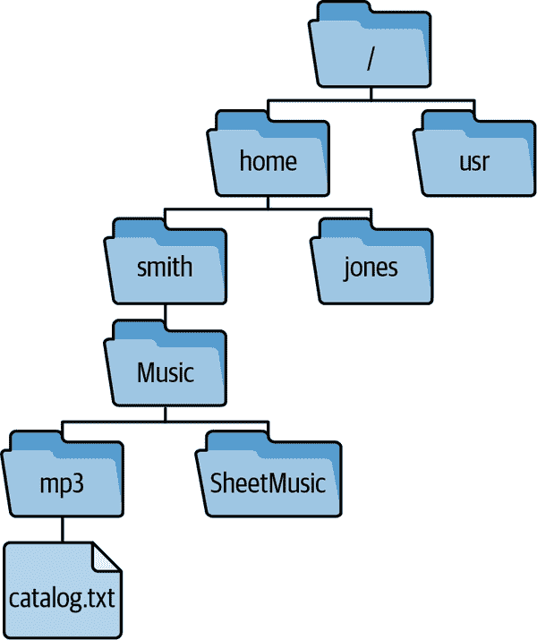
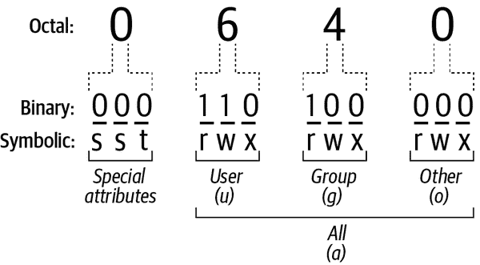

# 附录 A. Linux 复习

如果你的 Linux 技能有些生疏，这里是一些你需要了解的细节（如果你是完全初学者，这篇回顾可能太简略了。请查阅结尾处的推荐阅读）。

# 命令、参数和选项

要在命令行中运行 Linux 命令，请输入命令并按 Enter 键。要终止正在进行的命令，请按 Ctrl-C。

简单的 Linux 命令由一个单词组成，通常是程序的名称，后跟称为*参数*的其他字符串。例如，以下命令由程序名 `ls` 和两个参数组成：

```
$ ls -l /bin
```

以破折号开头的参数，如`-l`，被称为*选项*，因为它们改变命令的行为。其他参数可能是文件名、目录名、用户名、主机名或程序所需的任何其他字符串。选项通常（但并非总是）位于其余参数之前。

命令选项以各种形式出现，取决于你运行的程序：

+   单个字母，如 `-l`，有时跟随一个值，如 `-n 10`。通常可以省略字母和值之间的空格：`-n10`。

+   由两个破折号前导的单词，例如 `--long`，有时跟随一个值，如 `--block-size 100`。选项与其值之间的空格通常可以用等号替代：`--block-size=100`。

+   一个由一个破折号前导的单词，例如 `-type`，可选择跟随一个值，如 `-type f`。这种选项格式很少见；一个使用它的命令是 `find`。

+   没有破折号的单个字母。这种选项格式很少见；一个使用它的命令是 `tar`。

多个选项经常（根据命令而定）可以在单个破折号后组合。例如，命令 `ls -al` 等效于 `ls -a -l`。

选项不仅在外观上不同，而且在含义上也不同。在命令 `ls -l` 中，`-l` 表示“长输出”，但在命令 `wc -l` 中，它表示“文本行数”。两个程序也可能使用不同的选项表示相同的事物，例如 `-q` 表示“安静运行”，而 `-s` 表示“静默运行”。这些不一致性使 Linux 学习起来更加困难，但最终你会习惯的。

# 文件系统、目录和路径

Linux 文件存储在目录（文件夹）中，这些目录按树形结构组织，例如图 A-1 中的结构。树从一个名为*根*的目录开始，用单个斜线（`/`）表示，其中可能包含文件和其他目录，称为*子目录*。例如，目录*Music* 包含两个子目录，*mp3* 和 *SheetMusic*。我们称*Music* 为 *mp3* 和 *SheetMusic* 的父目录。具有相同父目录的目录称为*同级目录*。

树中的路径写成一系列由斜杠分隔的目录名，例如*/home/smith/Music/mp3*。路径也可能以文件名结尾，例如*/home/smith/Music/mp3/catalog.txt*。这些路径称为*绝对路径*，因为它们从根目录开始。如果你的当前目录是*/home/smith/Music*，那么一些相对路径包括*mp3*（一个子目录）和*mp3/catalog.txt*（一个文件）。甚至像*catalog.txt*这样的文件名本身也是相对于*/home/smith/Music/mp3*的相对路径。

两个特殊的相对路径是单个点（`.`），表示当前目录，以及连续的两个点（`..`），表示当前目录的父目录。¹ 这两者可以成为更大路径的一部分。例如，如果你的当前目录是*/home/smith/Music/mp3*，那么路径`..`指向*Music*，路径`../../../..`指向根目录，路径*../SheetMusic*指向*mp3*的一个同级目录。



###### 图 A-1\. Linux 目录树中的路径

在 Linux 系统上，你和其他每位用户都有一个指定的目录，称为*主目录*，你可以自由地在其中创建、编辑和删除文件和目录。其路径通常是*/home/*加上你的用户名，例如*/home/smith*。

# 目录移动

在任何时刻，你的命令行（shell）都在一个特定的目录中运行，称为你的*当前目录*、*工作目录*或*当前工作目录*。使用`pwd`（打印当前工作目录）命令查看当前目录的路径：

```
$ pwd
/home/smith                      *The home directory of user smith*
```

使用`cd`（更改目录）命令移动目录，提供路径（绝对或相对）到你想要的目的地：

```
$ cd /usr/local                *Absolute path*
$ cd bin                       *Relative path leading to /usr/local/bin*
$ cd ../etc                    *Relative path leading to /usr/local/etc*
```

# 创建和编辑文件

使用标准的 Linux 文本编辑器编辑文件，通过运行以下任何命令之一：

`emacs`

一旦启动 emacs，键入 Ctrl-h 然后按 t 查看教程。

`nano`

访问[nano 编辑器](https://nano-editor.org)获取文档。

`vim`或`vi`

运行命令`vimtutor`查看教程。

要创建文件，只需将文件名作为参数提供，编辑器将创建它：

```
$ nano newfile.txt
```

或者，使用`touch`命令创建空文件，提供所需的文件名作为参数：

```
$ touch funky.txt
$ ls
funky.txt
```

# 文件和目录处理

使用`ls`命令列出目录中的文件（默认为当前目录）：

```
$ ls
animals.txt
```

使用“长”列表（`ls -l`）查看文件或目录的属性：

```
$ ls -l
-rw-r--r-- 1 smith smith  325 Jul  3 17:44 animals.txt
```

从左到右，属性是文件权限（`-rw-r—r--`），描述在“文件权限”中，所有者（`smith`）和组（`smith`），文件大小（`325`字节），上次修改日期和时间（今年`7 月 3 日`，`17:44`），和文件名（`animals.txt`）。

默认情况下，`ls`不会打印以点开头的文件名。要列出这些文件（通常称为*点文件*或*隐藏文件*），添加`-a`选项：

```
$ ls -a
.bashrc    .bash_profile    animals.txt
```

使用`cp`命令复制文件，提供原始文件名和新文件名：

```
$ cp animals.txt beasts.txt
$ ls
animals.txt   beasts.txt
```

使用`mv`（移动）命令重命名文件，提供原始文件名和新文件名：

```
$ mv beasts.txt creatures.txt
$ ls
animals.txt   creatures.txt
```

使用`rm`（删除）命令删除文件：

```
$ rm creatures.txt
```

###### 警告

在 Linux 上删除不友好。`rm`命令不会问“你确定吗？”，也没有回收站来恢复文件。

使用`mkdir`创建目录，使用`mv`重命名它，并使用`rmdir`（如果为空）删除它：

```
$ mkdir testdir
$ ls
animals.txt   testdir
$ mv testdir newname
$ ls
animals.txt   newname
$ rmdir newname
$ ls
animals.txt
```

将一个或多个文件（或目录）复制到目录中：

```
$ touch file1 file2 file3
$ mkdir dir
$ ls
dir   file1   file2   file3
$ cp file1 file2 file3 dir
$ ls
dir   file1   file2   file3
$ ls dir
file1   file2   file3
$ rm file1 file2 file3
```

继续，将一个或多个文件（或目录）移动到目录中：

```
$ touch thing1 thing2 thing3
$ ls
dir   thing1   thing2   thing3
$ mv thing1 thing2 thing3 dir
$ ls
dir
$ ls dir
file1   file2   file3   thing1   thing2   thing3
```

使用`rm -rf`删除目录及其所有内容。在运行此命令之前，请小心，因为此操作不可逆。参见“永远不要再删除错误的文件（多亏了历史扩展）”获取安全提示。

```
$ rm -rf dir
```

# 文件查看

使用`cat`命令在屏幕上打印文本文件：

```
$ cat animals.txt
```

使用`less`命令逐屏查看文本文件：

```
$ less animals.txt
```

在运行`less`时，通过按空格键显示下一页。要退出`less`，请按 q。要获取帮助，请按 h。

# 文件权限

`chmod`命令将文件设置为你自己、指定用户组或所有人可读、可写和/或可执行。图 A-2 是文件权限的简要复习。



###### 图 A-2\. 文件权限位

这里是一些常见的`chmod`操作。使文件对你可读写，对其他人只可读：

```
$ chmod 644 animals.txt
$ ls -l
-rw-r--r-- 1 smith smith  325 Jul  3 17:44 animals.txt
```

保护它免受所有其他用户的影响：

```
$ chmod 600 animals.txt
$ ls -l
-rw------- 1 smith smith  325 Jul  3 17:44 animals.txt
```

使一个目录对所有人可读可进入，但只有你可写：

```
$ mkdir dir
$ chmod 755 dir
$ ls -l
drwxr-xr-x 2 smith smith  4096 Oct  1 12:44 dir
```

保护一个目录免受所有其他用户的影响：

```
$ chmod 700 dir
$ ls -l
drwx------ 2 smith smith  4096 Oct  1 12:44 dir
```

超级用户不受正常权限限制，可以读取和写入系统上的所有文件和目录。

# 进程

当你运行 Linux 命令时，它会启动一个或多个 Linux *进程*，每个进程都有一个称为*PID*的数字进程 ID。使用`ps`命令查看你的 shell 的当前进程：

```
$ ps
   PID TTY          TIME CMD
  5152 pts/11   00:00:00 bash
117280 pts/11   00:00:00 emacs
117273 pts/11   00:00:00 ps
```

或结束所有用户的所有正在运行的进程：

```
$ ps -uax
```

使用`kill`命令结束你自己的进程，提供 PID 作为参数。超级用户（Linux 管理员）可以结束任何用户的进程。

```
$ kill 117280
[1]+  Exit 15                 emacs animals.txt
```

# 查看文档

`man` 命令打印关于你的 Linux 系统上任何标准命令的文档。只需输入`man`，后跟命令的名称。例如，要查看`cat`命令的文档，运行以下命令：

```
$ man cat
```

显示的文档称为命令的*man 页面*。当有人说“查看 grep 的 man 页面”时，他们指的是运行`man grep`命令。

`man`使用程序`less`逐页显示文档，²因此`less`的标准按键适用。表 A-1 列出了一些常见的按键。

表 A-1\. 使用`less`查看 man 页面的一些按键

| 按键 | 动作 |
| --- | --- |
| h | 帮助——显示`less`的按键列表 |
| 空格键 | 查看下一页 |
| b | 查看上一页 |
| Enter | 向下滚动一行 |
| < | 跳转到文档的开头 |
| > | 跳转到文档的末尾 |
| / | 向前搜索文本（输入文本并按 Enter 键） |
| ? | 向后搜索文本（输入文本并按 Enter 键） |
| n | 定位搜索文本的下一个出现位置 |
| q | 退出 `man` 帮助页面 |

# Shell 脚本

要作为一个单元运行一组 Linux 命令，请按以下步骤操作：

1.  将命令放置在一个文件中。

1.  插入一个神奇的第一行。

1.  使用 `chmod` 将文件设置为可执行。

1.  执行该文件。

文件称为*脚本*或*shell 脚本*。神奇的第一行应该是符号 `#!`（发音为“shebang”），后面是读取并运行脚本的程序的路径：³

```
#!/bin/bash
```

这是一个显示问候并打印今天日期的 shell 脚本。以 `#` 开头的行是注释：

```
#!/bin/bash
# This is a sample script
echo "Hello there!"
date
```

使用文本编辑器将这些行存储在名为*howdy*的文件中。然后通过运行以下任意命令使文件可执行：

```
$ chmod 755 howdy     *Set all permissions, including execute permission*
$ chmod +x howdy      *Or, just add execute permission*
```

然后运行它：

```
$ ./howdy
Hello there!
Fri Sep 10 17:00:52 EDT 2021
```

前导的点和斜杠（`./`）表示脚本位于当前目录中。如果没有它们，Linux shell 将无法找到脚本：⁴

```
$ howdy
howdy: command not found
```

Linux shell 提供了一些在脚本中非常有用的编程语言特性。例如，`bash` 提供 `if` 语句、`for` 循环、`while` 循环和其他控制结构。本书中穿插了一些示例。有关语法，请参阅 `man bash`。

# 成为超级用户

一些文件、目录和程序对普通用户是受保护的，包括您自己：

```
$ touch /usr/local/avocado            *Try to create a file in a system directory*
touch: cannot touch '/usr/local/avocado': Permission denied
```

“权限被拒绝”通常意味着您尝试访问受保护的资源。它们只能由 Linux 超级用户（用户名为 `root`）访问。大多数 Linux 系统配备了一个名为 `sudo`（发音为“soo doo”）的程序，允许您在单个命令的持续时间内成为超级用户。如果您自己安装了 Linux，则您的帐户可能已经设置为运行 `sudo`。如果您是别人的 Linux 系统上的一个用户，您可能没有超级用户权限；如果不确定，请与系统管理员联系。

假设您已经正确设置，只需运行 `sudo`，并提供所需运行的命令以作为超级用户运行。系统将提示您输入登录密码以证明您的身份。正确输入密码后，命令将以 root 权限运行：

```
$ sudo touch /usr/local/avocado                   *Create the file as root*
[sudo] password for smith: *password here*
$ ls -l /usr/local/avocado                        *List the file*
-rw-r--r-- 1 root root 0 Sep 10 17:16 avocado
$ sudo rm /usr/local/avocado                      *Clean up as root*
```

`sudo` 可能会在一段时间内记住（缓存）您的密码短语，这取决于 `sudo` 的配置方式，因此它可能不会每次都提示您。

# 进一步阅读

要了解更多 Linux 使用的基础知识，请阅读我的前一本书[*Linux Pocket Guide*](https://oreil.ly/46N1v)（O’Reilly），或查找[在线教程](https://oreil.ly/KLTji)。

¹ 点和双点不是 shell 评估的表达式。它们是每个目录中存在的硬链接。

² 或者是另一个程序，如果你重新定义了 shell 变量 `PAGER` 的值。

³ 如果省略了 shebang 行，你的默认 shell 将运行该脚本。包含这行是一个良好的实践。

⁴ 这是因为当前目录通常会因安全原因而被省略在 shell 的搜索路径中。否则，攻击者可以在你的当前目录中放置一个恶意的可执行脚本，命名为 `ls`，当你运行 `ls` 时，这个脚本将会运行而不是真正的 `ls` 命令。
