# 第二章：索引和索引技术

许多因素决定了 MySQL 的性能，但索引是特殊的，因为没有它们无法实现性能。可以删除其他因素——查询、架构、数据等等，仍然可以实现性能，但删除索引会限制性能到粗暴力：依赖于硬件的速度和容量。如果这本书标题是*Brute Force MySQL Performance*，其内容就像标题一样长：“购买更好、更快的硬件。”你笑了，但就在几天前，我与一组开发人员会议时，他们一直通过购买更快的硬件来改善云端性能，直到成本飙升，迫使他们询问：“我们如何进一步提升性能？”

MySQL 在访问数据时利用硬件、优化和索引来提高性能。硬件是显而易见的杠杆，因为 MySQL 运行在硬件上：硬件越快，性能越好。而较不明显且可能更令人惊讶的是，硬件提供的*杠杆*最小。我马上会解释为什么。*优化*是指众多技术、算法和数据结构，使 MySQL 能够有效地利用硬件。优化使硬件的能力更加明显。而集中则是灯泡和激光之间的区别。因此，优化比硬件提供了更多的杠杆。如果数据库很小，硬件和优化将足以满足需求。但是增加数据规模会*减少*硬件和优化的好处。没有索引，性能将严重受限。

为了说明这些观点，将 MySQL 想象成一个杠杆，利用硬件、优化和索引来象征性地提升数据，如图 2-1 所示。


###### 图 2-1\. 没有索引的 MySQL 性能

没有索引（右侧），MySQL 在相对较小的数据集上的性能有限。但是添加索引到平衡中，如图 2-2 所示，MySQL 在大数据集上可以达到高性能。

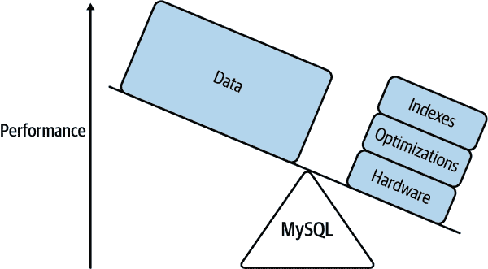

###### 图 2-2\. 有索引的 MySQL 性能

索引提供了最多*和最佳*的杠杆效应。对于任何非微不足道的数据量，它们都是必需的。MySQL 的性能需要适当的索引和索引，本章详细介绍了这两者的使用方法。

几年前，我设计并实现了一个存储大量数据的应用程序。最初，我估计最大的表不会超过一百万行。但由于数据存档代码中存在一个 bug，允许表达到十*亿*行。多年来，没有人注意到，因为响应时间一直很好。为什么？好的索引。

###### 注意

通常说 MySQL 每个表只使用一个索引，但这并不完全正确。例如，索引合并优化可以使用两个索引。在本书中，我专注于正常情况：一个查询、一个表、一个索引。

本章讲解 MySQL 索引和索引。它有五个主要部分。第一部分论述了为什么不应该被硬件或 MySQL 调优分心。这是一个必要的离题讨论，以便完全理解为什么硬件和 MySQL 调优不是提高 MySQL 性能的有效解决方案。第二部分是 MySQL 索引的视觉介绍：它们是什么以及它们如何工作。第三部分教授索引——通过像 MySQL 一样思考应用索引以获得最大的效益。第四部分涵盖索引失效（效益减少）的常见原因。第五部分简要介绍了 MySQL 表连接算法，因为有效的连接依赖于有效的索引。

# 性能的误导

*红鲱鱼*是一个指代分散注意力的习语。在追踪改善 MySQL 性能的解决方案时，两个常见的误导工具是更快的硬件和 MySQL 调优。

## 更好、更快的硬件！

当 MySQL 的性能不可接受时，*不要*立即通过升级（使用更好、更快的硬件）来“看看是否有帮助”。如果显著扩展，可能确实会有所帮助，但你不会学到任何东西，因为这只证明了你已经知道的事实：计算机在更快的硬件上运行更快。更好、更快的硬件是性能的一个误导，因为你会错过学习慢性能的真正原因和解决方案。

有两种合理的例外情况。首先，如果硬件明显不足，则升级到合理的硬件是必要的。例如，使用 1 GB 内存处理 500 GB 数据显然不足。升级到 32 GB 或 64 GB 内存是合理的。相比之下，升级到 384 GB 内存肯定有帮助，但是不合理。其次，如果应用正在经历*超级增长*（用户、使用率和数据的大幅增加），并且扩展是保持应用运行的权宜之计，那么就这样做。保持应用程序运行始终是合理的。

否则，为了改善 MySQL 的性能，扩展是*最后*的选择。专家们一致认为：*首先*优化查询、数据、访问模式和应用程序。如果所有这些优化都无法提供足够的性能，则才考虑扩展。扩展是最后发生的，原因如下。

通过扩展你不会学到任何东西，你只是用更快的硬件解决了问题。因为你是工程师，而不是住在洞穴里的原始人，你通过学习和理解*解决*问题——而不是简单地解决问题。诚然，学习和理解更加困难且耗时，但它们更加有效和可持续，这导致了下一个原因。

升级不是一种可持续的方法。升级物理硬件并不简单。有些升级相对快速且简单，但这取决于书籍范围之外的许多因素。然而，足以说，如果你频繁更换硬件，你会让自己或硬件工程师发疯。疯狂的工程师是不可持续的。此外，公司经常使用同样的硬件多年，因为采购过程漫长且复杂。因此，云端的易于扩展硬件是其吸引力之一。在云中，你可以在几分钟内扩展（或减少）CPU 核心、内存和存储。但这种便利比物理硬件显著*昂贵*。云成本可能会呈指数级增长。例如，亚马逊 RDS 的成本从一个实例大小翻倍到下一个实例大小——硬件加倍，价格也加倍。指数增长的成本是不可持续的。

一般来说，MySQL 可以充分利用其所获得的所有硬件。（在第四章中有相关限制。）真正的问题是：应用程序能否充分利用 MySQL？假设的答案是肯定的，但不能保证。更快的硬件有助于 MySQL，但它不会改变应用程序如何使用 MySQL。例如，增加内存可能不会提高性能，如果应用程序导致表扫描。只有当应用程序工作负载也可以扩展时，扩展才能有效提高性能。并非所有工作负载都可以扩展。

###### 注意

*工作负载*是查询、数据和访问模式的组合。

但让我们想象一下，你成功地将工作负载扩展到可以充分利用 MySQL 的最快硬件。当应用程序继续增长，其工作负载继续增加时会发生什么？这让我想起了一句禅宗谚语：“当你到达山顶时，继续攀登。”虽然我鼓励你在此上冥想，但对你的应用程序而言，这提出了一个不那么令人愉快的困境。没有其他地方可去，唯一的选择是做本应该首先做的事情：优化查询、数据、访问模式和应用程序。

## MySQL 调优

在电视系列*星际迷航*中，工程师们可以修改飞船以增加引擎、武器、护盾、传感器、传送器、牵引光束——所有设备的功率。MySQL 比星舰更难操作，因为没有这样的修改。但这并不能阻止工程师们尝试。

首先，让我们澄清三个术语。

调优

调优是为研究与开发（R&D）调整 MySQL 系统变量。这是具有特定目标和标准的实验性工作。常见的是基准测试：调整系统变量以测量对性能的影响。著名 MySQL 专家 Vadim Tkachenko 的博客文章 [“MySQL Challenge: 100k Connections”](https://oreil.ly/CGvrU) 是极端调优的一个例子。由于调优是研究与开发，结果不一定普遍适用；而是扩展我们对 MySQL 的集体知识和理解，尤其是在其当前限制方面。调优会影响未来 MySQL 的发展和最佳实践。

配置

配置是将系统变量设置为适合硬件和环境的值。目标是合理配置，相对于需要更改的几个默认值。配置 MySQL 通常在 MySQL 实例被提供或硬件变更时进行。例如，从 10 GB 到 100 GB 数据量增加一个数量级时，重新配置也是必要的。配置会影响 MySQL 的整体运行。

优化

优化是通过减少工作负载或使其更高效来提高 MySQL 的性能——通常是后者，因为应用程序使用往往会增加。目标是更快的响应时间和更大的容量利用现有硬件。优化会影响 MySQL 和应用程序的性能。

无疑你会在 MySQL 文献、视频、会议等中遇到这些术语。重要的是描述而不是术语本身。例如，如果你读到一个博客帖子使用了 *优化* 这个术语，但描述的是这里定义为 *调优* 的内容，那么这里是调优。

这些术语的区别很重要，因为工程师会做这三种工作，但只有优化（如此处定义）才是你时间的有效利用。¹

MySQL 的调优是性能的一个误导，有两个原因。首先，通常不作为受控实验室实验，这使得结果不可靠。总体而言，MySQL 的性能是复杂的，实验必须仔细控制。其次，结果不太可能对性能产生显著影响，因为 MySQL 已经高度优化。调优 MySQL 就像从萝卜中榨血一样。

回到本节的第一个段落，我意识到我们都钦佩《星际迷航：下一代》中的首席工程师乔迪·拉·福奇中尉。当舰长呼唤更多的能量时，我们感到有义务通过应用神秘的服务器参数使之成真。或者，在地球上，当应用程序需要更多能量时，我们希望通过精巧的 MySQL 重新配置来提升吞吐量和并发性能达到 50%。干得好，拉·福奇！不幸的是，MySQL 8.0 版本通过启用[`innodb_dedicated_server`](https://oreil.ly/niPGL)引入了自动配置。由于 MySQL 5.7 版本不久后即将到达生命周期末尾（EOL），让我们继续前进，建设未来。不过，拉·福奇的工作仍然值得称赞。

优化是你需要做的一切，因为调优是一个误导，而配置在 MySQL 8.0 版本后是自动的。本书的核心是优化。

# MySQL 索引：视觉介绍

索引是提升性能的关键，如果你回忆起“直接查询优化”，对查询和索引的修改能够解决*大量*的性能问题。优化查询的旅程需要对 MySQL 索引有扎实的理解，这正是本节详细展示的内容，配有大量插图。

尽管本节内容详细且相对较长，但我将其称为*介绍*，因为还有更多内容需要学习。但这一节是打开 MySQL 查询优化宝藏箱的关键。

下面九个章节仅适用于 InnoDB 表的标准索引——通过简单的`PRIMARY KEY`或`[UNIQUE] INDEX`表定义创建的索引类型。MySQL 支持其他专门的索引类型，但本书不涵盖它们，因为标准索引是性能的基础。

在深入探讨 MySQL 索引的细节之前，我首先揭示了关于 InnoDB 表的一个重要信息，这将改变你对索引以及大部分 MySQL 性能的看法。

## InnoDB 表就是索引

示例 2-1 展示了表`elem`（简称*元素*）的结构及其包含的 10 行内容。本章所有示例都涉及表`elem`——只有一个明确标注的例外——因此请花些时间来研究它。

##### 示例 2-1\. 表`elem`

```
CREATE TABLE `elem` (
  `id` int unsigned NOT NULL,
  `a` char(2) NOT NULL,
  `b` char(2) NOT NULL,
  `c` char(2) NOT NULL,
  PRIMARY KEY (`id`),
  KEY `idx_a_b` (`a`,`b`)
) ENGINE=InnoDB;

+----+------+------+------+
| id | a    | b    | c    |
+----+------+------+------+
|  1 | Ag   | B    | C    |
|  2 | Au   | Be   | Co   |
|  3 | Al   | Br   | Cr   |
|  4 | Ar   | Br   | Cd   |
|  5 | Ar   | Br   | C    |
|  6 | Ag   | B    | Co   |
|  7 | At   | Bi   | Ce   |
|  8 | Al   | B    | C    |
|  9 | Al   | B    | Cd   |
| 10 | Ar   | B    | Cd   |
+----+------+------+------+
```

表`elem`有两个索引：在列`id`上的主键索引和在列`a, b`上的非唯一次要索引。列`id`的值是单调递增的整数。列`a`, `b`和`c`的值是对应于列名字母的原子符号：“Ag”（银）对应列`a`，“B”（硼）对应列`b`，依此类推。行值是随机且无意义的；这只是一个用于示例的简单表格。

图 2-3 展示了表`elem`的典型视图——为了简洁起见，只显示了前四行。

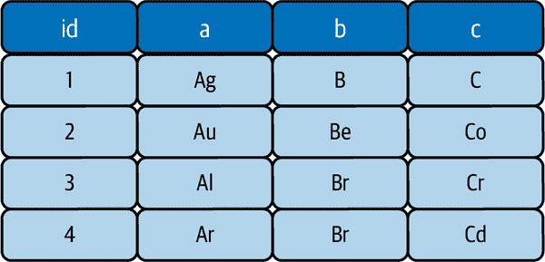

###### 图 2-3\. 表`elem`：视觉模型

表 `elem` 没什么特别的，对吧？它很简单，可以说是基本的。但如果我告诉你，它并不是一张表，而是一个索引呢？把“F”（氟）扔出去吧！图 2-4 显示了表 `elem` 的真实结构，作为一个 InnoDB 表。


###### 图 2-4\. 表 `elem`：InnoDB B 树索引

InnoDB 表是按主键组织的 B 树索引。行是存储在索引结构叶节点中的索引记录。每个索引记录都有元数据（用“…”表示），用于行锁定、事务隔离等。

图 2-4 是表 `elem` 的 B 树索引的高度简化描述。四个索引记录（在底部）对应于前四行。主键列值（`1`, `2`, `3`, 和 `4`）显示在每个索引记录的顶部。其他列值（“Ag,” “B,” “C,” 等）显示在每个索引记录的元数据下方。

你不需要了解 InnoDB B 树索引的技术细节，才能理解或达到出色的 MySQL 性能。只有两点是重要的：

+   主键查找非常快速和高效。

+   主键对于 MySQL 的性能至关重要。

第一个观点是正确的，因为 B 树索引本质上快速和高效，这也是为什么许多数据库服务器使用它们的原因之一。第二个观点在接下来的章节和章节中将变得越来越清晰。

想了解数据库内部的迷人世界，包括索引，请阅读 [*Database Internals*](https://oreil.ly/TDsCc) 一书，作者是 Alex Petrov（O’Reilly，2019 年出版）。要深入了解 InnoDB 内部，包括其 B 树实现，请取消所有会议并查看著名 MySQL 专家 [Jeremy Cole](https://oreil.ly/9sH9m) 的网站。

###### 注意

InnoDB 主键是一个聚簇索引。MySQL 手册偶尔将主键称为 *聚簇索引*。

索引提供了最大和最佳的杠杆，因为表 *就是* 一个索引。主键对性能至关重要。这一点尤其重要，因为二级索引包含主键值。图 2-5 显示了在列 `a, b` 上的二级索引。


###### 图 2-5\. 列 `a, b` 的二级索引

二级索引也是 B 树索引，但叶节点存储主键值。当 MySQL 使用二级索引查找行时，它会在主键上进行第二次查找，以读取完整行。让我们将这两者结合起来，以及通过查询 `SELECT * FROM elem WHERE a='Au' AND b='Be'` 进行二级索引查找的步骤：

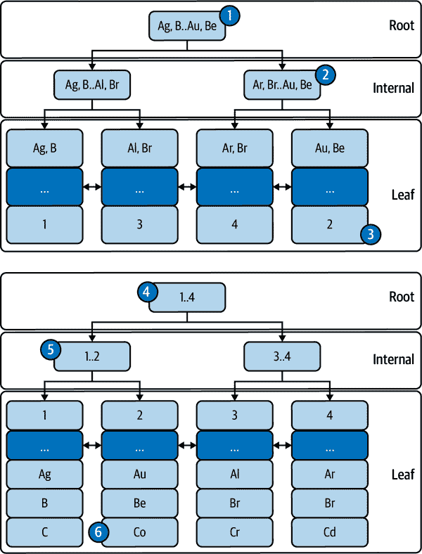

###### 图 2-6\. 值为 “Au, Be” 的二级索引查找

图 2-6 显示了顶部的二级索引（列 `a, b`）和底部的主键（列 `id`）。六个标注点（编号圆圈）显示了使用二级索引查找值“Au, Be”的过程：

1.  索引查找从根节点开始；分支右到内部节点，值为“Au, Be.”。

1.  在内部节点，向右分支到值为“Au, Be.”的叶节点。

1.  二级索引值为“Au, Be”的叶节点包含相应的主键值：2。

1.  从根节点开始主键查找；向左分支到值为 2 的内部节点。

1.  在内部节点，向右分支到值为 2 的叶节点。

1.  一级键值为 2 的叶节点包含匹配“Au, Be.”的完整行。

###### 注意

表只有一个主键。所有其他索引都是次要索引。

这一部分非常重要，因为正确的模型为理解索引*及更多*提供了基础。例如，如果你回想起“Lock time”，你可能会以新的视角看待它，因为行实际上是主键中的叶节点。知道 InnoDB 表是其主键等同于知道在太阳系中，日心说而不是地心说是正确的模型。在 MySQL 的世界中，一切围绕主键展开。

## 表访问方法

使用索引查找行是三种表访问方法之一。由于表是索引，*索引查找*是最好且最常见的访问方法。但有时，根据查询，索引查找是不可能的唯一选择，而唯一的补救方法是*索引扫描*或*表扫描*，即其他访问方法。了解 MySQL 用于查询的访问方法至关重要，因为性能要求索引查找。避免索引扫描和表扫描。“EXPLAIN：查询执行计划”展示了如何查看访问方法。但首先，让我们澄清并可视化每种方法。

###### 注意

MySQL 手册使用术语*访问方法*、*访问类型*和*连接类型*。`EXPLAIN`使用名为`type`或`access_type`的字段来指代这些术语。在 MySQL 中，这些术语密切相关但等效使用。

在本书中，为了精确性和一致性，我只使用两个术语：*访问方法*和*访问类型*。有三种访问方法：索引查找、索引扫描和表扫描。对于索引查找，有几种访问类型：`ref`、`eq_ref`、`range`等。

### 索引查找

通过利用索引的有序结构和算法访问，索引查找可以找到特定行或行范围。这是最快的访问方法，因为索引正是为此设计的：快速高效地访问大量数据。因此，索引查找对于直接查询优化至关重要。性能要求几乎每个查询都对每个表使用索引查找。索引查找的访问类型有几种，我将在接下来的章节中详细介绍，比如“WHERE”。

在前一节的图 2-6 中显示了使用次要索引进行索引查找。

### 索引扫描

当无法进行索引查找时，MySQL 必须使用蛮力方法查找行：读取所有行并过滤出不匹配的行。在 MySQL 采用读取每一行使用主键之前，它尝试使用次要索引读取行。这称为索引扫描。

有两种类型的索引扫描。第一种是*完整*索引扫描，意味着 MySQL 按索引顺序读取所有行。通常读取所有行对性能来说很糟糕，但当索引顺序与查询的 `ORDER BY` 匹配时，按顺序读取可以避免对行进行排序。

图 2-7 展示了查询 `SELECT * FROM elem FORCE INDEX (a) ORDER BY a, b` 的完整索引扫描。`FORCE INDEX` 子句是必需的，因为由于表 `elem` 很小，MySQL 更高效地扫描主键并对行进行排序，而不是扫描次要索引并按顺序获取行。 （有时候糟糕的查询可以作为好的例子。）

图 2-7 包含八个标注（编号圆圈），显示了行访问的顺序：

1.  读取次要索引（SI）的第一个值：“Ag, B.”

1.  查找主键（PK）中对应的行。

1.  读取 SI 的第二个值：“Al, Br.”

1.  查找主键中对应的行。

1.  读取 SI 的第三个值：“Ar, Br.”

1.  查找主键（PK）中对应的行。

1.  读取 SI 的第四个值：“Au, Be.”

1.  查找主键（PK）中对应的行。

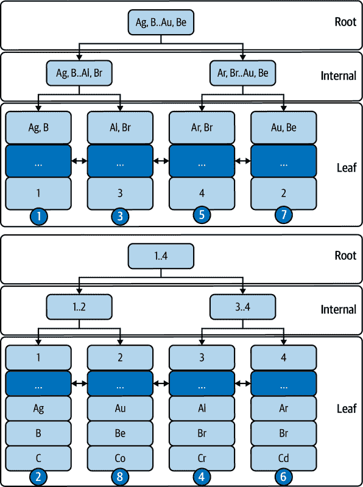

###### 图 2-7\. 次要索引的完整索引扫描

图 2-7 中有一个微妙但重要的细节：按顺序扫描次要索引可能是顺序读取，但主键查找几乎肯定是随机读取。按索引顺序访问行并不能保证顺序读取；很可能会产生随机读取。

###### 注意

顺序访问（读取和写入）比随机访问更快。

第二种索引扫描类型是*仅索引扫描*：MySQL 从索引中读取列值（而不是完整行）。这需要一个覆盖索引，稍后会介绍（这里的“覆盖索引”）。它应该比完整索引扫描更快，因为它不需要主键查找来读取完整行；它只从次要索引中读取列值，这也是为什么它需要一个覆盖索引的原因。

除非唯一的选择是全表扫描，否则不要优化为索引扫描。否则，避免索引扫描。

### 表扫描

（完整）表扫描按主键顺序读取*所有*行。当 MySQL 无法进行索引查找或索引扫描时，表扫描是唯一的选择。这通常对性能很差，但通常很容易修复，因为 MySQL 擅长使用索引并具有许多基于索引的优化。基本上每个带有 `WHERE`、`GROUP BY` 或 `ORDER BY` 子句的查询都可以使用索引——即使只是索引扫描——因为这些子句使用列，而列可以被索引。因此，几乎没有不可修复的表扫描的理由。

图 2-8 展示了一个全表扫描：按照主键顺序读取*所有*行。其中有四个标记显示了行访问的顺序。表 `elem` 很小，这里只显示了四行，但想象一下 MySQL 在真实表中处理成千上万行或百万行的情况。

一般建议和最佳实践是避免表扫描。但为了全面和平衡的讨论，有两种情况下表扫描可能是可接受的或（令人惊讶地）更好：

+   当表格很小且访问不频繁时

+   当表选择性非常低时（参见 “极端选择性”）

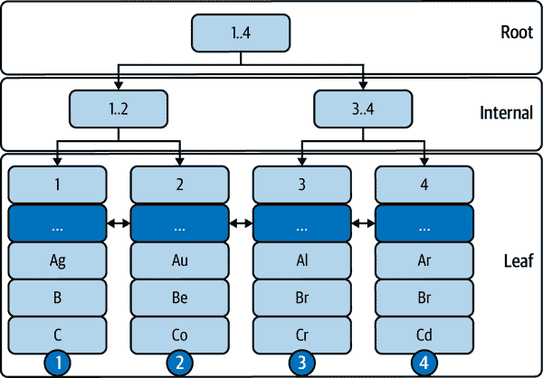

###### 图 2-8\. 全表扫描

但不要认为任何表扫描都是理所当然的：它们通常对性能不利。在极少数情况下，MySQL 可能会错误地选择表扫描，而实际上可以使用索引查找，详见 “陷阱！（当 MySQL 选择另一个索引）”。

## 最左前缀要求

要使用索引，查询必须使用索引的*最左前缀*：即索引定义中指定的最左边的一个或多个索引列。最左前缀是必需的，因为底层索引结构是按照索引列顺序排序的，只能按照这个顺序进行遍历（搜索）。

###### 注意

使用 [`SHOW CREATE TABLE`](https://oreil.ly/cwQZy) 或 [`SHOW INDEX`](https://oreil.ly/5wBhH) 查看索引定义。

图 2-9 展示了一个在列 `a, b, c` 上的索引和 `WHERE` 子句使用每个最左前缀的情况：列 `a`；列 `a, b`；和列 `a, b, c`。

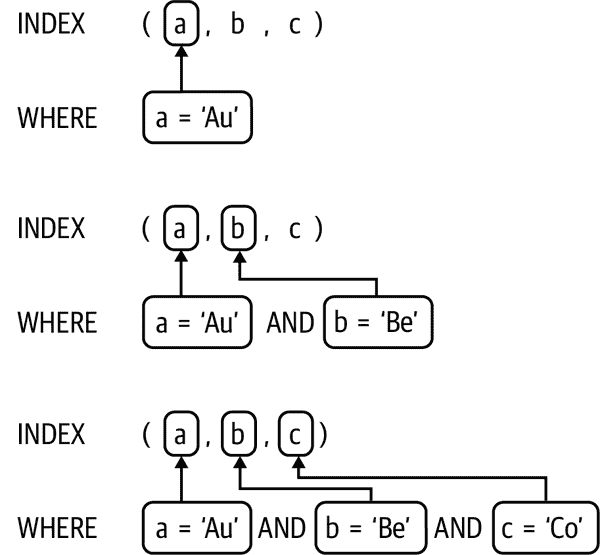

###### 图 2-9\. 三列索引的最左前缀

图 2-9 中的顶部 `WHERE` 子句使用了列 `a`，它是索引的最左列。中间的 `WHERE` 子句使用了列 `a` 和 `b`，它们一起形成了索引的最左前缀。底部的 `WHERE` 子句使用了整个索引：所有三列。使用索引列可以在其他 SQL 子句中使用，正如在接下来的几节中的许多示例所示。

###### 提示

要使用索引，查询必须使用索引的*最左前缀*。

最左前缀要求有两个逻辑结果：

1.  索引 `(a, b)` 和 `(b, a)` 是不同的索引。它们索引相同的列但顺序不同，导致了不同的最左前缀。然而，一个查询如果同时使用了两个列（例如 `WHERE a = 'Au' AND b = 'Be'`），可以选择使用任一索引，但这并不意味着这些索引在性能上是等效的。MySQL 会通过计算多个因素选择更好的一个。

1.  MySQL 很可能可以使用索引 `(a, b, c)` 替代索引 `(a)` 和 `(a, b)`，因为后两者是第一个索引的最左前缀。在这种情况下，索引 `(a)` 和 `(a, b)` 是重复的，可以被删除。使用 [pt-duplicate-key-checker](https://oreil.ly/EqtfV) 来查找并报告重复的索引。

每个辅助索引的末尾（最右端）隐藏着主键。对于表 `elem`（示例 2-1），辅助索引实际上是 `(a, b, id)`，但最右端的 `id` 是隐藏的。MySQL 不显示主键附加到辅助索引；你必须想象它。

###### 注意

主键附加到每个辅助索引：`(S, P)`，其中 `S` 是辅助索引列，`P` 是主键列。

在 MySQL 的术语中，我们说，“主键附加到辅助索引”即使实际上并非如此。（你可以通过创建索引 `(a, b, id)` 来实现这种“附加”，但最好不要这样做。）“附加到”实际上意味着辅助索引叶子节点包含主键值，正如前文 图 2-5 所示。这一点很重要，因为它增加了每个辅助索引的大小：主键值在辅助索引中重复出现。更大的索引需要更多的内存，这意味着更少的索引可以放入内存中。保持主键的大小小而辅助索引的数量合理。就在前几天，我的同事们正在帮助一个数据库团队，其数据库的辅助索引占据了 693 GB 的空间，而数据只有 397 GB（主键）。

最左前缀要求既是一种祝福，也是一种限制。限制相对容易通过额外的辅助索引来解决，但等到你读完 “过多、重复和未使用的索引” 之后再做决定。在面对连接表的特殊挑战时，最左前缀要求尤为重要，不过我在 “连接表” 中有所讨论。我鼓励你将最左前缀要求视为一种祝福。关于索引的查询优化并不简单，但最左前缀要求是旅程中一个简单且熟悉的起点。

## EXPLAIN：查询执行计划

MySQL 的 [`EXPLAIN`](https://oreil.ly/M99Gp) 命令显示了一个 *查询执行计划*（或者 *EXPLAIN 计划*），描述了 MySQL 计划如何执行查询：表的连接顺序、表的访问方法、索引使用以及其他重要细节。

`EXPLAIN` 输出非常广泛且多样化。此外，它完全依赖于查询本身。在查询中改变一个字符可以显著改变其 EXPLAIN 计划。例如，`WHERE id = 1` 和 `WHERE id > 1` 的查询计划显著不同。并且更复杂的是，`EXPLAIN` 继续发展演变。MySQL 手册中的 [“EXPLAIN 输出格式”](https://oreil.ly/IMCOJ) 是必读的，即使是对于专家来说也是如此。幸运的是，基本原理几十年来基本保持不变，这对我们的理解是有利的。

为了说明索引的使用情况，接下来的五个部分解释了 MySQL 可以使用索引的每种情况下的查询：

+   查找匹配的行：“WHERE”

+   分组行：“GROUP BY”

+   排序行：“ORDER BY”

+   避免读取行：“覆盖索引”

+   连接表：“连接表”

还有其他特定情况，如 `MIN()` 和 `MAX()`，但这五种情况是索引使用的基础。

但首先，我需要通过查看 示例 2-2 中显示的 `EXPLAIN` 输出字段的含义来设定舞台。

##### 示例 2-2\. `EXPLAIN` 输出（传统格式）

```
EXPLAIN SELECT * FROM elem WHERE id = 1\G

*************************** 1\. row ***************************
           id: 1
  select_type: SIMPLE
        table: elem
   partitions: NULL
         type: const
possible_keys: PRIMARY
          key: PRIMARY
      key_len: 4
          ref: const
         rows: 1
     filtered: 100.00
        Extra: NULL
```

在此介绍中，我们忽略 `id`、`select_type`、`partitions`、`key_len` 和 `filtered` 字段；但示例包含它们是为了让你习惯这些输出。其余的七个字段传达了组成查询执行计划的大量信息：

`table`

`table` 字段是表名（或别名）或子查询引用。表按照 MySQL 确定的连接顺序列出，而不是查询中出现的顺序。顶部表是第一个表，底部表是最后一个表。

`type`

`type` 字段是表访问方法或索引查找访问类型，详见 “表访问方法” 的第一个注释进行澄清。`ALL` 表示全表扫描（参见 “表扫描”）。`index` 表示索引扫描（参见 “索引扫描”）。其他任何值，如 `const`、`ref`、`range` 等，都是索引查找的访问类型（参见 “索引查找”）。

`possible_keys`

`possible_keys` 字段列出 MySQL 可以使用的索引，因为查询使用了最左前缀。如果一个索引没有列在这个字段中，则未满足最左前缀的要求。

`key`

`key` 字段是 MySQL 将使用的索引名称，如果无法使用索引则为 `NULL`。MySQL 根据多种因素选择最佳索引，其中一些因素在 `Extra` 字段中指示。在执行查询时，MySQL 很可能会使用该索引（`EXPLAIN` 不执行查询），但参见 “陷阱！（当 MySQL 选择另一个索引）”。

`ref`

`ref` 字段列出用于在索引中查找行的值来源（`key` 字段）。

对于单表查询或连接中的第一个表，`ref` 常常是 `const`，指的是一个或多个索引列上的常量条件。*常量条件* 是等号（`=` 或 `<=>` [NULL-safe equal]）与字面值相等。例如，`a = 'Au'` 是一个只等于一个值的常量条件。

对于连接多个表的查询，`ref` 是在连接顺序中前一个表的列引用。MySQL 使用索引来查找与前一个表中列 `ref` 中的值匹配的行，当前表（`table` 字段）通过 “连接表” 显示这一过程。

`rows`

`rows`字段是 MySQL 将检查以查找匹配行的估计行数。MySQL 使用索引统计信息来估计行数，因此实际数值——“检查的行数”——可能会接近但不同。

`Extra`

`Extra`字段提供了关于查询执行计划的额外信息。这个字段很重要，因为它指示了 MySQL 可以应用的查询优化。

###### 注意

本书中所有的`EXPLAIN`输出都采用*传统格式*：表格输出（`EXPLAIN query;`）或列表输出（`EXPLAIN query\G`）。其他格式包括*JSON*（`EXPLAIN FORMAT=JSON query`）以及从 MySQL 8.0.16 开始的*树形*（`EXPLAIN FORMAT=TREE query`）。JSON 和树形格式与传统格式完全不同，但所有格式都表达了查询执行计划。

不要期望在没有上下文的情况下从这些字段中获取太多信息：表、索引、数据和查询。在接下来的几节中，所有的插图都涉及到表`elem`（示例 2-1），它的两个索引以及它的十行数据。

## WHERE

MySQL 可以使用索引来查找与表条件在`WHERE`子句中匹配的行。我要小心地说 MySQL *可以* 使用索引，而不是 MySQL *将* 使用索引，因为索引的使用取决于几个因素，主要包括表条件、索引和最左前缀要求（参见“最左前缀要求”）。（还有其他因素，如索引统计信息和优化器成本，但超出了本书的范围。）

*表条件*是匹配、分组、聚合或排序行的列及其值（如果有）。在`WHERE`子句中，表条件也称为*谓词*。

图 2-10 展示了基于列`id`的主键和一个带有单个条件的`WHERE`子句：`id = 1`。

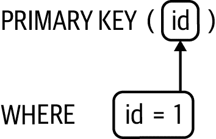

###### 图 2-10\. `WHERE`：主键查找

一个实心框划定了一个表条件和一个索引列（也称为*索引部分*），MySQL 可以使用它，因为前者（表条件）是后者（索引）的最左前缀。箭头从表条件指向它使用的索引列。稍后，我们将看到 MySQL 无法使用的表条件和索引列的示例。

在图 2-10 中，MySQL 可以使用主键列`id`查找满足条件`id = 1`的行。示例 2-3 是完整查询的 EXPLAIN 计划。

##### 示例 2-3\. 主键查找的 EXPLAIN 计划

```
EXPLAIN SELECT * FROM elem WHERE id = 1\G

*************************** 1\. row ***************************
           id: 1
  select_type: SIMPLE
        table: elem
   partitions: NULL
         type: const
possible_keys: PRIMARY
          key: PRIMARY
      key_len: 4
          ref: const
         rows: 1
     filtered: 100.00
        Extra: NULL
```

在示例 2-3 中，`key: PRIMARY`确认 MySQL 将使用主键——一个索引查找。相应地，访问类型（`type`字段）不是`ALL`（全表扫描）或`index`（索引扫描），这在简单的主键查找中是预期的。次要索引未列在`possible_keys`字段中，因为 MySQL 无法在此查询中使用它：列`id`不是列`a, b`上次要索引的最左前缀。

访问类型 `const` 是一个特例，只有当主键或唯一辅助索引的所有索引列上有常量条件 (`ref: const`) 时才会发生。结果是一个*常量行*。这对于入门来说有点深奥，但既然我们在这里，就让我们继续学习。考虑到表数据（示例 2-1）和列 `id` 是主键，标识为 `id = 1` 的行可以视为常量，因为在执行查询时，`id = 1` 只能匹配一行（或零行）。MySQL 读取那一行，并将其值视为常量，这对于响应时间非常有利：`const` 访问非常快速。

`Extra: NULL` 是比较罕见的，因为实际查询比这些示例更复杂。但在这里，`Extra: NULL` 表示 MySQL 不需要匹配行。为什么？因为常量行只能匹配一行（或零行）。但匹配行是正常情况，所以让我们通过将表条件更改为 `id > 3 AND id < 6 AND c = 'Cd'` 来看一个更现实的示例，如图 2-11 和相应的 EXPLAIN 计划中所示的 示例 2-4。


###### 图 2-11\. `WHERE`: 使用主键进行范围访问

##### Example 2-4\. 使用主键进行范围访问的解释计划

```
EXPLAIN SELECT * FROM elem WHERE id > 3 AND id < 6 AND c = 'Cd'\G

*************************** 1\. row ***************************
           id: 1
  select_type: SIMPLE
        table: elem
   partitions: NULL
>        type: range
possible_keys: PRIMARY
          key: PRIMARY
      key_len: 4
>         ref: NULL
>        rows: 2
     filtered: 10.00
>       Extra: Using where
```

###### 注

为了突出 EXPLAIN 计划的变化，我在发生变化的关键字段前面加上 `>` 字符。这些突出显示不是 `EXPLAIN` 的一部分。

通过将表条件更改为 `id > 3 AND id < 6 AND c = 'Cd'`，EXPLAIN 计划从示例 2-3 变更为更适合单表查询的 示例 2-4。查询仍然使用主键（`key: PRIMARY`），但访问类型更改为*范围扫描*（`type: range`）：使用索引读取值在 3 到 6 之间的行。`ref` 字段为 `NULL`，因为列 `id` 上的条件不是常量（这是单表查询，因此没有前置表可以引用）。条件 `c = 'Cd'` 是常量，但它不用于索引查找（范围扫描），因此 `ref` 不适用。MySQL 估计将在范围内检查两行（`rows: 2`）。对于这个简单的示例来说是正确的，但请记住：`rows` 是一个估算值。

“Using where” 在 `Extra` 字段中非常常见，这是预期的。它表示 MySQL 将使用 `WHERE` 条件来找到*匹配的行*：对于每一行读取，如果所有 `WHERE` 条件都为真，则行匹配。由于列 `id` 上的条件定义了范围，因此 MySQL 实际上只会使用列 `c` 上的条件来匹配范围内的行。回顾示例 2-1，一行匹配所有 `WHERE` 条件：

```
+----+------+------+------+
| id | a    | b    | c    |
+----+------+------+------+
|  4 | Ar   | Br   | Cd   |
+----+------+------+------+
```

具有 `id = 5` 的行在范围内，因此 MySQL 检查该行，但其列 `c` 的值（“Cd”）与 `WHERE` 子句不匹配，因此 MySQL 不返回该行。

为了说明其他查询执行计划，让我们使用次要索引的左前缀，如图 2-12 所示，并在示例 2-5 中使用相应的 EXPLAIN 计划。

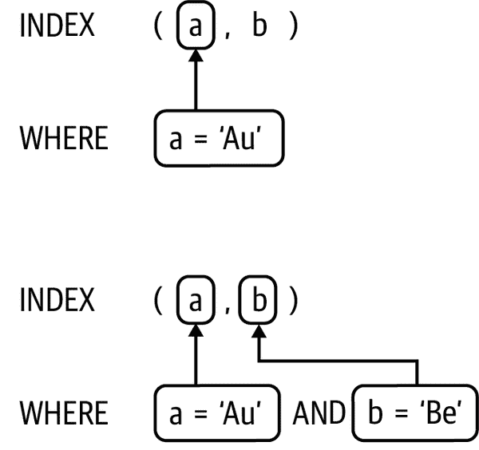

###### 图 2-12\. `WHERE`: 次要索引查找

##### 示例 2-5\. 次要索引查找的 EXPLAIN 计划

```
EXPLAIN SELECT * FROM elem WHERE a = 'Au'\G

*************************** 1\. row ***************************
           id: 1
  select_type: SIMPLE
        table: elem
   partitions: NULL
>        type: ref
possible_keys: idx_a_b
>         key: idx_a_b
      key_len: 3
          ref: const
         rows: 1
     filtered: 100.00
        Extra: NULL

EXPLAIN SELECT * FROM elem WHERE a = 'Au' AND b = 'Be'\G

*************************** 1\. row ***************************
           id: 1
  select_type: SIMPLE
        table: elem
   partitions: NULL
>        type: ref
possible_keys: idx_a_b
>         key: idx_a_b
      key_len: 6
          ref: const,const
         rows: 1
     filtered: 100.00
        Extra: NULL
```

对于示例 2-5 中的每个 EXPLAIN 计划，`key: idx_a_b`确认 MySQL 使用次要索引，因为条件满足左前缀要求。第一个`WHERE`子句仅使用第一个索引部分：列`a`。第二个`WHERE`子句使用两个索引部分：列`a`和`b`。仅使用列`b`不会满足左前缀要求—稍后我会展示这一点。

与以前的 EXPLAIN 计划相比，新的重要访问类型是：`ref`。简单来说，`ref`访问类型是索引左前缀（`key`字段）上的等值（`=`或`<=>`）查找。与任何索引查找一样，只要估计的要检查的行数（`rows`字段）合理，`ref`访问非常快速。

虽然条件是固定的，但由于索引（`key: idx_a_b`）不唯一，所以不可能使用`const`访问类型，因此查找可以匹配多行。即使 MySQL 估计每个`WHERE`子句只检查一行（`rows: 1`），在执行查询时可能会改变。

`Extra: NULL`再次出现，因为 MySQL 可以仅使用索引找到匹配的行，而没有非索引列的条件—因此让我们添加一个。图 2-13 展示了在列`a`和`c`上带有条件的`WHERE`子句，而示例 2-6 是相应的 EXPLAIN 计划。

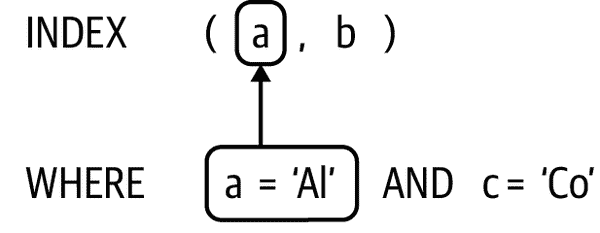

###### 图 2-13\. `WHERE`: 索引查找和非索引列

##### Example 2-6\. 索引查找和非索引列的解释计划

```
EXPLAIN SELECT * FROM elem WHERE a = 'Al' AND c = 'Co'\G

*************************** 1\. row ***************************
           id: 1
  select_type: SIMPLE
        table: elem
   partitions: NULL
         type: ref
possible_keys: idx_a_b
          key: idx_a_b
      key_len: 3
          ref: const
>        rows: 3
     filtered: 10.00
>       Extra: Using where
```

在图 2-13 中，条件`c = 'Co'`周围没有框，因为索引不覆盖列`c`。MySQL 仍然使用次要索引（`key: idx_a_b`），但是对列`c`的条件阻止 MySQL 仅使用索引匹配行。相反，MySQL 使用索引查找和读取列`a`的行，然后匹配列`c`的条件（`Extra: Using where`）。

再次回顾示例 2-1，你会注意到零行匹配此`WHERE`子句，但`EXPLAIN`报告`rows: 3`。为什么？在列`a`上的索引查找匹配了三行，其中`a = 'Al'`为真：行`id`值为 3、8 和 9。但这些行中没有一行同时匹配`c = 'Co'`。查询检查了三行但匹配了零行。

###### 提示

`EXPLAIN`输出的`rows`是 MySQL 执行查询时将检查的行数的估计值，而不是将匹配所有表条件的行数。

最后，作为索引、`WHERE` 和 `EXPLAIN` 的示例，让我们不满足左前缀的要求，正如 图 2-14 和 示例 2-7 所示。


###### 图 2-14\. 没有左前缀的 `WHERE`

##### 示例 2-7\. 没有左前缀的 `WHERE` 的 EXPLAIN 计划

```
EXPLAIN SELECT * FROM elem WHERE b = 'Be'\G

*************************** 1\. row ***************************
           id: 1
  select_type: SIMPLE
        table: elem
   partitions: NULL
>        type: ALL
possible_keys: NULL
>         key: NULL
      key_len: NULL
          ref: NULL
         rows: 10
     filtered: 10.00
        Extra: Using where
```

虚线框和缺少箭头标明了一个表条件和一个索引列，MySQL 无法使用它们，因为它们不满足左前缀的要求。

在 图 2-14 中，列 `a` 没有任何条件，因此索引不能用于列 `b` 的条件。EXPLAIN 计划 (示例 2-7) 证实了这一点：`possible_keys: NULL` 和 `key: NULL`。没有索引，MySQL 必须执行全表扫描：`type: ALL`。同样，`rows: 10` 反映了总行数，`Extra: Using where` 表明 MySQL 读取并过滤不符合 `b = 'Be'` 的行。

示例 2-7 是最糟糕的 EXPLAIN 计划的示例。每当你看到 `type: ALL`、`possible_keys: NULL` 或 `key: NULL`，请停下当前的工作并分析这个查询。

尽管这些示例很简单，它们代表了关于索引和 `WHERE` 子句的 `EXPLAIN` 的基础。实际查询可能有更多的索引和 `WHERE` 条件，但基础原理不会改变。

## GROUP BY

MySQL 可以使用索引优化 `GROUP BY`，因为值按照索引顺序隐式分组。对于二级索引 `idx_a_b`（在列 `a, b` 上），有五个不同的列 `a` 值分组，如 示例 2-8 所示。

##### 示例 2-8\. 列 `a` 值的不同分组

```
SELECT a, b FROM elem ORDER BY a, b;

+------+------+
| a    | b    |
+------+------+
| Ag   | B    | -- Ag group
| Ag   | B    |

| Al   | B    | -- Al group
| Al   | B    |
| Al   | Br   |

| Ar   | B    | -- Ar group
| Ar   | Br   |
| Ar   | Br   |

| At   | Bi   | -- At group

| Au   | Be   | -- Au group
+------+------+
```

我在 示例 2-8 中用空行分隔了分组，并对每组的第一行进行了注释。带有 `GROUP BY a` 的查询可以使用索引 `idx_a_b`，因为列 `a` 是左前缀，索引隐式地按列 `a` 的值分组。示例 2-9 是最简单类型的 `GROUP BY` 优化的代表性 EXPLAIN 计划。

##### 示例 2-9\. `GROUP BY a` 的 EXPLAIN 计划

```
EXPLAIN SELECT a, COUNT(*) FROM elem GROUP BY a\G

*************************** 1\. row ***************************
           id: 1
  select_type: SIMPLE
        table: elem
   partitions: NULL
>        type: index
possible_keys: idx_a_b
          key: idx_a_b
      key_len: 6
          ref: NULL
         rows: 10
     filtered: 100.00
>       Extra: Using index
```

`key: idx_a_b` 确认 MySQL 使用索引优化了 `GROUP BY`。由于索引是有序的，MySQL 可以确保每个新的列 `a` 值都是一个新的分组。例如，在读取最后一个 "Ag" 值后，索引顺序保证不会再读取更多的 "Ag" 值，因此 "Ag" 组是完整的。

在 `Extra` 字段中的 “Using index” 表示 MySQL 只从索引中读取列 `a` 值；它没有从主键读取完整的行。我在 “覆盖索引” 中介绍了这种优化。

此查询使用了索引，但不是为了索引查找：`type: index` 表示索引扫描（见 “索引扫描”）。由于没有 `WHERE` 子句来过滤行，MySQL 会读取所有行。如果添加了 `WHERE` 子句，MySQL 仍然可以用于 `GROUP BY`，但左前缀要求仍然适用。在这种情况下，查询正在使用左前缀索引部分（列 `a`），因此 `WHERE` 条件必须在列 `a` 或 `b` 上才能满足左前缀要求。让我们先在列 `a` 上添加一个 `WHERE` 条件，如 图 2-15 和 示例 2-10 所示。

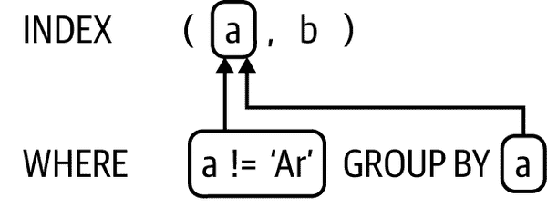

###### 图 2-15\. 在同一索引列上的 `GROUP BY` 和 `WHERE`

##### 示例 2-10\. 在同一索引列上的 `GROUP BY` 和 `WHERE` 的 EXPLAIN 计划

```
EXPLAIN SELECT a, COUNT(a) FROM elem WHERE a != 'Ar' GROUP BY a\G

*************************** 1\. row ***************************
           id: 1
  select_type: SIMPLE
        table: elem
   partitions: NULL
>        type: range
possible_keys: idx_a_b
          key: idx_a_b
      key_len: 3
          ref: NULL
         rows: 7
     filtered: 100.00
>       Extra: Using where; Using index
```

“Using where” 在 `Extra` 字段中指的是 `WHERE a != 'Ar'`。有趣的变化是 `type: range`。范围访问类型与不等操作符 (`!=` 或 `<>`) 一起工作。你可以将它想象成 `WHERE a < 'Ar' AND a > 'Ar'`，如 图 2-16 所示。

`WHERE` 子句中对列 `b` 的条件仍然可以使用索引，因为条件虽然在不同的 SQL 子句中，但仍满足左前缀要求。图 2-17 展示了这一点，而 示例 2-11 显示了 EXPLAIN 计划。


###### 图 2-16\. 不等号范围

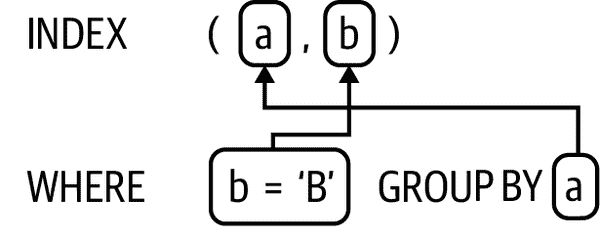

###### 图 2-17\. 不同索引列上的 `GROUP BY` 和 `WHERE`

##### 示例 2-11\. 不同索引列上的 `GROUP BY` 和 `WHERE` 的 EXPLAIN 计划

```
EXPLAIN SELECT a, b FROM elem WHERE b = 'B' GROUP BY a\G

*************************** 1\. row ***************************
           id: 1
  select_type: SIMPLE
        table: elem
   partitions: NULL
         type: range
possible_keys: idx_a_b
          key: idx_a_b
      key_len: 6
          ref: NULL
         rows: 6
     filtered: 100.00
>       Extra: Using where; Using index for group-by
```

示例 2-11 中的查询有两个重要细节：`WHERE` 子句中对列 `b` 的等式条件以及在 `SELECT` 子句中选择列 `a` 和 `b`。这些细节使得在 `Extra` 字段中揭示了特殊的“用于 `GROUP BY` 的索引优化”。例如，如果将等式 (`=`) 改为不等 (`!=`)，查询优化将丧失。在涉及到这样的查询优化时，细节至关重要。你必须阅读 MySQL 手册以了解和应用这些细节。MySQL 手册中的 [“GROUP BY 优化”](https://oreil.ly/ZknLf) 有详细说明。

在 图 2-18 和 示例 2-12 中的最终 `GROUP BY` 示例可能会让您感到惊讶。


###### 图 2-18\. 没有左前缀的 `GROUP BY`

##### 示例 2-12\. 没有左前缀的 `GROUP BY` 的 EXPLAIN 计划

```
EXPLAIN SELECT b, COUNT(*) FROM elem GROUP BY b\G

*************************** 1\. row ***************************
           id: 1
  select_type: SIMPLE
        table: elem
   partitions: NULL
>        type: index
possible_keys: idx_a_b
          key: idx_a_b
      key_len: 6
          ref: NULL
         rows: 10
     filtered: 100.00
>       Extra: Using index; Using temporary
```

注意 `key: idx_a_b`：尽管查询条件中没有涉及列 `a`，MySQL 仍然使用了索引。左前缀要求是怎么实现的？因为 MySQL 正在扫描列 `a` 上的索引 (`type: index`)。你可以想象一个条件，如 `a = a`，在列 `a` 上总是为真。

MySQL 对于 `GROUP BY c` 仍然会在列 `a` 上进行索引扫描吗？不会，它会执行全表扫描。图 2-18 之所以有效，是因为索引具有列 `b` 的值，而不具有列 `c` 的值。

在 `Extra` 字段中的“Using temporary”是没有严格的最左前缀条件的一个副作用。当 MySQL 从索引中读取列 `a` 的值时，它会在一个临时表中（内存中）收集列 `b` 的值。在读取所有列 `a` 的值后，它会扫描临时表以进行 `COUNT(*)` 的分组和聚合。

关于 `GROUP BY` 与索引以及查询优化还有很多内容需要学习，但这些示例是基础知识。与 `WHERE` 子句不同，`GROUP BY` 子句往往更简单。挑战在于创建一个能够优化 `GROUP BY` 加其他 SQL 子句的索引。当制定查询执行计划时，MySQL 面临相同的挑战，因此即使可能也不一定会优化 `GROUP BY`。MySQL 几乎总是选择最佳的查询执行计划，但如果您想尝试不同的计划，请阅读 MySQL 手册中的[“索引提示”](https://oreil.ly/mbBof)。

## ORDER BY

毫不奇怪，MySQL 可以使用有序索引来优化 `ORDER BY`。这种优化避免了对行进行排序，通过按顺序访问行来节省一点时间。如果没有这种优化，MySQL 将读取所有匹配行，对它们进行排序，然后返回排序后的结果集。当 MySQL 对行进行排序时，在 EXPLAIN 计划的 `Extra` 字段中会打印“Using filesort”。*Filesort* 意味着 *排序行*。这是一个历史悠久（现在有些误导性的）术语，但在 MySQL 术语中仍然很流行。

对于工程师来说，Filesort 是一个让人头疼的问题，因为它以慢速著称。排序行是额外的工作，因此它不会提高响应时间，但通常不是响应时间缓慢的根本原因。在本节的最后，我使用 `EXPLAIN` `ANALYZE`，这是自 MySQL 8.0.18 以来的新功能，来测量 Filesort 的实时性能影响。（剧透：排序行非常快。）但首先，让我们看看如何使用索引来优化 `ORDER BY`。

有三种方法可以使用索引来优化 `ORDER BY`。第一种和最简单的方法是使用索引的最左前缀来对 `ORDER BY` 子句进行排序。对于表 `elem`，即：

+   `ORDER BY id`

+   `ORDER BY a`

+   `ORDER BY a, b`

第二种方法是将索引的最左部分保持不变，并按照下一个索引列排序。例如，保持列 `a` 不变，并按列 `b` 排序，如图 2-19 所示，其对应的 EXPLAIN 计划见示例 2-13。

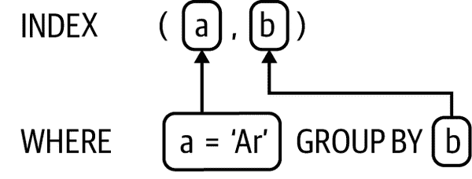

###### 图 2-19\. 不同索引列上的 `ORDER BY` 和 `WHERE`

##### 示例 2-13\. 不同索引列上的 `ORDER BY` 和 `WHERE` 的 EXPLAIN 计划

```
EXPLAIN SELECT a, b FROM elem WHERE a = 'Ar' ORDER BY b\G

*************************** 1\. row ***************************
           id: 1
  select_type: SIMPLE
        table: elem
   partitions: NULL
         type: ref
possible_keys: idx_a_b
          key: idx_a_b
      key_len: 3
          ref: const
         rows: 3
     filtered: 100.00
        Extra: Using index
```

`WHERE a = 'Ar' ORDER BY b` 可以使用索引 `(a, b)`，因为对第一个索引部分（列 `a`）的 `WHERE` 条件是常量，所以 MySQL 直接跳到 `a = 'Ar'` 的位置，然后按顺序读取列 `b` 的值。 示例 2-14 是结果集，虽然没有什么特别之处，但显示了列 `a` 是常量（值为“Ar”），而列 `b` 是排序的。

##### 示例 2-14\. `WHERE a = 'Ar' ORDER BY b` 的结果集

```
+------+------+
| a    | b    |
+------+------+
| Ar   | B    |
| Ar   | Br   |
| Ar   | Br   |
+------+------+
```

如果表 `elem` 在列 `a, b, c` 上有索引，那么像 `WHERE a = 'Au' AND b = 'Be' ORDER BY c` 这样的查询可以使用索引，因为对列 `a` 和 `b` 的条件满足了索引的最左前缀要求。

第三种方式是第二种的特例。在展示解释它的图之前，看看能否确定为什么 示例 2-15 的查询 *不* 导致文件排序（为什么 `Extra` 字段没有报告“Using filesort”）。

##### 示例 2-15\. `ORDER BY id` 的 EXPLAIN 计划

```
EXPLAIN SELECT * FROM elem WHERE a = 'Al' AND b = 'B' ORDER BY id\G

*************************** 1\. row ***************************
           id: 1
  select_type: SIMPLE
        table: elem
   partitions: NULL
         type: ref
possible_keys: idx_a_b
          key: idx_a_b
      key_len: 16
          ref: const,const
         rows: 2
     filtered: 100.00
>       Extra: Using index condition
```

可以理解查询使用索引 `idx_a_b`，因为 `WHERE` 条件是最左前缀，但是 `ORDER BY id` 不应该导致文件排序吗？图 2-20 揭示了答案。


###### 图 2-20\. 使用附加到次要索引的主键的 `ORDER BY`

“最左前缀要求” 开头的段落说：“在每个次要索引的末尾（最右端）潜藏着主键。” 这正是 图 2-20 中发生的：围绕索引列 `id` 的深色框显示了附加到次要索引的“隐藏”主键。这种 `ORDER BY` 优化在像 `elem` 这样的小表中可能看起来不那么有用，但在真实的表中却非常有用——值得记住。

为了证明“隐藏”的主键允许 `ORDER BY` 避免文件排序，让我们去除对列 `b` 的条件以使优化失效，如 图 2-21 中所示，并跟随结果的 EXPLAIN 计划在 示例 2-16 中展示。

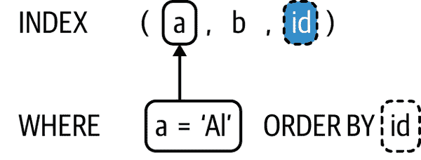

###### 图 2-21\. 没有最左前缀的 `ORDER BY`

##### 示例 2-16\. 没有最左前缀的 `ORDER BY` 的 EXPLAIN 计划

```
EXPLAIN SELECT * FROM elem WHERE a = 'Al' ORDER BY id\G

*************************** 1\. row ***************************
           id: 1
  select_type: SIMPLE
        table: elem
   partitions: NULL
         type: ref
possible_keys: idx_a_b
          key: idx_a_b
      key_len: 8
          ref: const
         rows: 3
     filtered: 100.00
>       Extra: Using index condition; Using filesort
```

通过移除列 `b` 的条件，次要索引上不再有最左前缀，MySQL 无法使用“隐藏”主键来优化 `ORDER BY`。因此，对于这个特定查询，“Using filesort” 出现在 `Extra` 字段中。

新的优化是“使用索引条件”，称为索引条件下推。*索引条件下推*意味着存储引擎使用索引来匹配`WHERE`条件的行。通常，存储引擎只读取和写入行，MySQL 处理匹配行的逻辑。这是关注点的清晰分离（这是软件设计的优点），但当行不匹配时效率低下：MySQL 和存储引擎都浪费时间读取非匹配的行。对于 示例 2-16 中的查询，索引条件下推意味着存储引擎（InnoDB）使用索引 `idx_a_b` 来匹配条件 `a = 'Al'`。索引条件下推有助于提高响应时间，但不必费力优化它，因为 MySQL 在可能时会自动使用它。要了解更多，请阅读 MySQL 手册中的 [“索引条件下推优化”](https://oreil.ly/L3Nzm)。

所有`ORDER BY`优化都受一个重要细节的影响：索引默认按升序排序，而`ORDER BY col`意味着升序：`ORDER BY col ASC`。对所有列只能进行一个方向的`ORDER BY`优化：`ASC`（升序）或`DESC`（降序）。因此，`ORDER BY a, b DESC`不起作用，因为列`a`是隐式的`ASC`排序，与`b DESC`不同。

###### 注意

MySQL 8.0 支持[降序索引](https://oreil.ly/FDTsN)。

文件排序的真正时间成本是多少？在 MySQL 8.0.18 之前，它既没有被测量也没有被报告。但从 MySQL 8.0.18 开始，[`EXPLAIN ANALYZE`](https://oreil.ly/DFPiF)对其进行了测量和报告。仅对 示例 2-17，我必须使用另一个表。

##### 示例 2-17\. Sysbench 表`sbtest`

```
CREATE TABLE `sbtest1` (
  `id` int NOT NULL AUTO_INCREMENT,
  `k` int NOT NULL DEFAULT '0',
  `c` char(120) NOT NULL DEFAULT '',
  `pad` char(60) NOT NULL DEFAULT '',
  PRIMARY KEY (`id`),
  KEY `k_1` (`k`)
) ENGINE=InnoDB;
```

那是一个标准的[`sysbench`表](https://oreil.ly/XAYX2)；我加载了 100 万行数据。让我们使用一个随机的、无意义的查询，带有大量结果集和`ORDER BY`：

```
SELECT c FROM sbtest1 WHERE k < 450000 ORDER BY id;
-- Output omitted
68439 rows in set (1.15 sec)
```

查询花费 1.15 秒来排序并返回超过 68,000 行。但这并不是一个糟糕的查询；看看它的 EXPLAIN 计划：

```
EXPLAIN SELECT c FROM sbtest1 WHERE k < 450000 ORDER BY id\G

*************************** 1\. row ***************************
           id: 1
  select_type: SIMPLE
        table: sbtest1
   partitions: NULL
         type: range
possible_keys: k_1
          key: k_1
      key_len: 4
          ref: NULL
         rows: 133168
     filtered: 100.00
        Extra: Using index condition; Using MRR; Using filesort
```

那个 EXPLAIN 计划中唯一的新信息是“使用 MRR”在`Extra`字段中，它指的是 [“多范围读取优化”](https://oreil.ly/QX1wJ)。否则，该 EXPLAIN 计划报告的信息已在本章中涵盖。

文件排序是否使得这个查询变慢？`EXPLAIN ANALYZE`揭示了答案，尽管是神秘的：

```
EXPLAIN ANALYZE SELECT c FROM sbtest1 WHERE k < 450000 ORDER BY id\G

*************************** 1\. row ***************************
1 -> Sort: sbtest1.id  (cost=83975.47 rows=133168)
2    (actual time=1221.170..1229.306 rows=68439 loops=1)
3    -> Index range scan on sbtest1 using k_1, with index condition: (k<450000)
4       (cost=83975.47 rows=133168) (actual time=40.916..1174.981 rows=68439)
```

`EXPLAIN ANALYZE` 的实际输出更宽，但我为打印的易读性和参考包装和编号了行。 `EXPLAIN ANALYZE` 的输出密集且需要实践才能理解；现在，让我们直奔主题——或尽可能直接，因为输出并非按顺序阅读。在第 4 行，`1174.981`（毫秒）表示索引范围扫描（第 3 行）花费了 1.17 秒（四舍五入）。在第 2 行，`1221.170..1229.306` 表示文件排序（第 1 行）*开始*于 1,221 毫秒，结束于 1,229 毫秒，这意味着文件排序花费了 8 毫秒。总执行时间为 1.23 秒：95% 的时间用于读取行，不到 1% 的时间用于排序行。剩下的 4%——大约 49 毫秒——花费在其他阶段：准备、统计、日志记录、清理等等。

答案是否定的：filesort *不会* 使得这个查询变慢。问题在于数据访问：68,439 行并不是一个小的结果集。对于必须遍历索引、管理事务等的关系数据库来说，读取 68,439 行是相当大的工作量。要优化这样的查询，重点放在 “数据访问” 上。

最后一个要解决的问题是：为什么 filesort 被认为是慢的？因为 MySQL 在排序数据超过 [`sort_buffer_size`](https://oreil.ly/x5mbN) 时使用磁盘上的临时文件，而硬盘比内存慢几个数量级。这在几十年前尤为明显，当时旋转硬盘是常态；但今天，SSD 是常态，总体存储速度相当快。对于高吞吐量（QPS）的查询，Filesort 可能是个问题，但使用 `EXPLAIN ANALYZE` 来测量和验证。

###### 警告

`EXPLAIN ANALYZE` 执行查询。为了安全起见，在只读复制品上使用 `EXPLAIN` `ANALYZE`，而不是源。

现在回到表 `elem`（示例 2-1）和 MySQL 可以使用索引的下一个案例：覆盖索引。

## 覆盖索引

*覆盖索引* 包括查询中引用的所有列。图 2-22 展示了一个用于 `SELECT` 语句的覆盖索引。


###### 图 2-22\. 覆盖索引

`WHERE` 条件的列 `a` 和 `b` 如往常一样指向相应的索引列，但这些索引列也指向 `SELECT` 子句中相应的列，表示这些列的值是从索引中读取的。

通常情况下，MySQL 从主键读取完整行（回顾 “InnoDB Tables Are Indexes”）。但是通过覆盖索引，MySQL 只能从索引中读取列值。这在处理次要索引时尤其有帮助，因为它避免了主键查找。

MySQL 自动使用覆盖索引优化，并在 `EXPLAIN` 中将其报告为“Using index”在 `Extra` 字段中。“Using index for group-by” 是一个类似于 `GROUP BY` 和 `DISTINCT` 的优化，如`GROUP BY`中演示的那样。但是，“Using index condition” 和 “Using index for skip scan” 是完全不同且无关的优化。

索引扫描（`type: index`）加上覆盖索引（`Extra: Using index`）是仅索引扫描（参见“索引扫描”）。在“GROUP BY”中有两个示例：示例 2-9 和 示例 2-12。

覆盖索引很吸引眼球，但实际上很少实用，因为现实查询涉及太多列、条件和子句，一个索引很难覆盖。不要花时间尝试创建覆盖索引。在设计或分析使用非常少列的简单查询时，可以考虑一下是否适合使用覆盖索引。如果适合，那么恭喜你。如果不适合，没关系；没有人期望有覆盖索引。

## 连接表格

MySQL 使用索引来连接表，这种用法与用索引做其他事情基本相同。主要区别在于每个表连接条件中使用的值的来源。当可视化后更加清晰，但首先我们需要第二个表进行连接。示例 2-18 显示了表 `elem_names` 的结构及其包含的 14 行。

##### 示例 2-18\. 表 `elem_names`

```
CREATE TABLE `elem_names` (
  `symbol` char(2) NOT NULL,
  `name` varchar(16) DEFAULT NULL,
  PRIMARY KEY (`symbol`)
) ENGINE=InnoDB;

+--------+-----------+
| symbol | name      |
+--------+-----------+
| Ag     | Silver    |
| Al     | Aluminum  |
| Ar     | Argon     |
| At     | Astatine  |
| Au     | Gold      |
| B      | Boron     |
| Be     | Beryllium |
| Bi     | Bismuth   |
| Br     | Bromine   |
| C      | Carbon    |
| Cd     | Cadmium   |
| Ce     | Cerium    |
| Co     | Cobalt    |
| Cr     | Chromium  |
+--------+-----------+
```

表 `elem_name` 有一个索引：在列 `symbol` 上的主键。列 `symbol` 中的值与表 `elem` 的列 `a`、`b` 和 `c` 中的值相匹配。因此，我们可以在这些列上连接表 `elem` 和 `elem_names`。

图 2-23 显示了一个连接表 `elem` 和 `elem_names` 的 `SELECT` 语句，以及每个表的条件和索引的视觉表示。

在前面的图表中，只有一个索引和 SQL 子句对，因为只有一个表。但是图 2-23 有两对，每个表用大右指向的尖括号分隔，并在每个表中注释表名：`/* elem */` 和 `/* elem_names */`。像 `EXPLAIN` 一样，这些图表按连接顺序列出表格：从上到下。表 `elem`（顶部）是连接顺序中的第一个表，表 `elem_names`（底部）是第二个表。

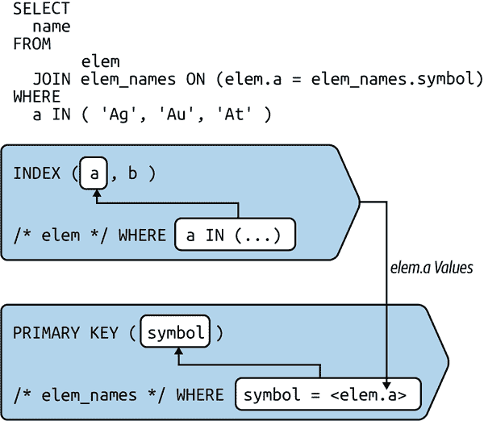

###### 图 2-23\. 在主键查找中连接表

在表 `elem` 上使用索引并不新鲜或特别：MySQL 使用索引来进行条件 `a IN (`…`)`。到目前为止，一切顺利。

表 `elem_names` 上的索引使用与前一张表连接基本相同，有两个小区别。首先，`WHERE` 子句是 `JOIN`…`ON` 子句的重写——稍后详细讨论。其次，列 `symbol` 条件的值来自前一张表 `elem`。为了表示这一点，箭头指向从前一张表到角括号中的列引用：`<elem.a>`。在连接时，MySQL 使用来自表 `elem` 中匹配行的列 `a` 值来查找表 `elem_names` 中的行，用于列 `symbol` 的连接条件。在 MySQL 的术语中，我们会说，“`symbol` 等于表 `elem` 中列 `a` 的值。”给定前一张表的值，对列 `symbol` 的主键查找没有什么新鲜或特别之处：如果匹配到行，则返回并与前一张表的行连接。

示例 2-19 展示了在 Figure 2-23 中 `SELECT` 语句的 EXPLAIN 计划。

##### 示例 2-19\. 主键查找连接表的 EXPLAIN 计划

```
EXPLAIN SELECT name
        FROM elem JOIN elem_names ON (elem.a = elem_names.symbol)
        WHERE a IN ('Ag', 'Au', 'At')\G

*************************** 1\. row ***************************
           id: 1
  select_type: SIMPLE
        table: elem
   partitions: NULL
         type: range
possible_keys: idx_a_b
          key: idx_a_b
      key_len: 3
          ref: NULL
         rows: 4
     filtered: 100.00
        Extra: Using where; Using index
*************************** 2\. row ***************************
           id: 1
  select_type: SIMPLE
        table: elem_names
   partitions: NULL
>        type: eq_ref
possible_keys: PRIMARY
          key: PRIMARY
      key_len: 2
>         ref: test.elem.a
         rows: 1
     filtered: 100.00
        Extra: NULL
```

在每张表的基础上，示例 2-19 中的**EXPLAIN 计划**并不新鲜，但连接在第二张表 `elem_names` 中揭示了两个新细节。第一个是 `eq_ref` 访问类型：使用主键或唯一非空的次要索引进行单行查找。（在此上下文中，*非空* 表示所有次要索引列都定义为 `NOT NULL`。）关于 `eq_ref` 访问类型的更多内容在下一段。第二个是 `ref: test.elem.a`，你可以理解为“参考列 `elem.a`”。（数据库名称为 `test`，因此带有 `test.` 前缀。）为了连接表 `elem_names`，通过参考列 `elem.a` 的值来通过主键（`key: PRIMARY`）查找行，这覆盖了连接列 `symbol`。这对应于 `JOIN` 条件：`ON (elem.a = elem_names.symbol)`。

###### 提示

在每张表的基础上，连接不会改变索引的使用方式。主要区别在于连接条件的值来自前一张表。

MySQL 可以使用任何访问方法连接表（参见 “表访问方法”），但是使用 `eq_ref` 访问类型的索引查找是最好且最快的，因为它仅匹配一行。`eq_ref` 访问类型有两个要求：主键或唯一非空次要索引 *和* 所有索引列上的等式条件。这两个要求一起保证了 `eq_ref` 查找最多匹配一行。如果这两个要求没有同时满足，则 MySQL 可能会使用 `ref` 索引查找，本质上与 `eq_ref` 相同，但匹配任意数量的行。

回到 Figure 2-23，我如何知道将 `JOIN`…`ON` 子句重写为 `elem_names` 表的 `WHERE` 子句？如果在 `EXPLAIN` 之后立即 `SHOW WARNINGS`，MySQL 将打印出它如何重写查询的输出。这是 `SHOW` `WARNINGS` 的摘要输出：

```
/* select#1 */ select
  `test`.`elem_names`.`name` AS `name`
from
       `test`.`elem`
  join `test`.`elem_names`
where
      ((`test`.`elem_names`.`symbol` = `test`.`elem`.`a`)
  and (`test`.`elem`.`a` in ('Ag','Au','At')))
```

现在你可以看到 Figure 2-23 中的 `/* elem_names */ WHERE symbol = <elem.a>` 是正确的。

有时，在 `EXPLAIN` 之后立即运行 `SHOW WARNINGS`，查看 MySQL 如何重写查询是必要的，以了解表连接顺序和 MySQL 选择的索引。

###### 注意

`SHOW WARNINGS` 显示的重写 SQL 语句并不打算是有效的。它们只是展示了 MySQL 如何解释和重写 SQL 语句。不要执行它们。

表连接顺序至关重要，因为 MySQL 以最佳可能的顺序连接表，*而不是* 查询中表的顺序。您必须使用 `EXPLAIN` 来查看表连接顺序。`EXPLAIN` 按从顶部（第一个表）到底部（最后一个表）的连接顺序打印表格。默认的连接算法，*嵌套循环连接*，遵循连接顺序。我在本章末尾概述了连接算法：“表连接算法”。

永远不要猜测或假设表连接顺序，因为查询的微小变化可能导致显著不同的表连接顺序或查询执行计划。为了证明这一点，在 图 2-24 中的 `SELECT` 语句几乎与 图 2-23 中的 `SELECT` 语句相同，只有一个微小的不同 — 你能找到它吗？

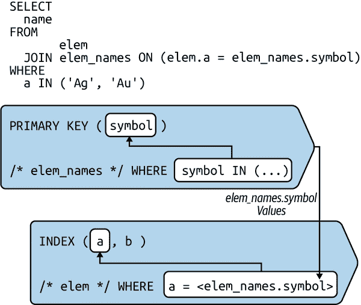

###### 图 2-24\. 二级索引查找连接表

这里有个提示：*它既不是黄金也不是银*. 微小的差异导致了一个显著不同的查询执行计划，如 例 2-20 所示。

##### 例 2-20\. 二级索引查找连接表的 EXPLAIN 计划

```
EXPLAIN SELECT name
        FROM elem JOIN elem_names ON (elem.a = elem_names.symbol)
        WHERE a IN ('Ag', 'Au')\G

*************************** 1\. row ***************************
           id: 1
  select_type: SIMPLE
        table: elem_names
   partitions: NULL
         type: range
possible_keys: PRIMARY
          key: PRIMARY
      key_len: 2
          ref: NULL
         rows: 2
     filtered: 100.00
        Extra: Using where
*************************** 2\. row ***************************
           id: 1
  select_type: SIMPLE
        table: elem
   partitions: NULL
         type: ref
possible_keys: idx_a_b
          key: idx_a_b
      key_len: 3
          ref: test.elem_names.symbol
         rows: 2
     filtered: 100.00
        Extra: Using index
```

语法上，图 2-23 和 2-24 中的 `SELECT` 语句是相同的，但执行计划（例 2-19 和 2-20）却有显著不同。发生了什么变化呢？在 图 2-24 中，从 `IN()` 列表中移除了一个单值：“At.” 这是一个很好的例子，展示了一个看似无害的变化如何触发 MySQL 查询执行计划器中的某些内容，然后，新的和不同的 EXPLAIN 计划就出来了。让我们一起分析 例 2-20 中的表格。

第一个表是 `elem_names`，与查询写法 `elem JOIN elem_names` 不同。MySQL 决定表的连接顺序，而不是 `JOIN` 子句。² `type` 和 `key` 字段表明了对主键的范围扫描，但值从哪里来呢？`ref` 字段为 `NULL`，在这个表上没有 `WHERE` 条件。MySQL 必须已经重写了查询；这是 `SHOW WARNINGS` 的摘要输出：

```
/* select#1 */ select
  `test`.`elem_names`.`name` AS `name`
from
  `test`.`elem` join `test`.`elem_names`
where
      ((`test`.`elem`.`a` = `test`.`elem_names`.`symbol`)
  and (`test`.`elem_names`.`symbol` in ('Ag','Au')))
```

是的，在最后一行看到了：MySQL 重写查询，使用 `IN()` 列表作为 `elem_names.symbol` 的值，而不是最初在查询中写的 `elem.a`。现在您可以看到（或者想象到），在 `elem_names.symbol` 表上的索引使用是一个范围扫描，用于查找两个值：“Ag” 和 “Au”。使用主键，这将是一个非常快速的索引查找，仅匹配 MySQL 将用于连接第二个表的两行。

第二个表是 `elem`，并且解释计划很熟悉：使用索引 `idx_a_b` 查找匹配条件（因为 `Extra: Using index`）的索引值，而不是行。该条件的值来自前一个表中匹配行，如 `ref: test.elem_names.symbol` 所示。

###### 提示

MySQL 会按照最佳顺序连接表，*而不是*查询中表的书写顺序。

尽管 MySQL 可以改变连接顺序并重写查询，但连接的索引使用基本上与本章中先前展示和解释的一样——在每个表的基础上。使用 `EXPLAIN` 和 `SHOW WARNINGS`，并逐个表从顶部到底部考虑执行计划。

MySQL 可以在没有索引的情况下连接表。这被称为*完全连接*，是查询中最糟糕的事情。单表查询的表扫描是糟糕的，但完全连接更糟，因为在连接表中，对连接表的表扫描不会发生一次，而是对前一个表的每个匹配行都会发生一次。示例 2-21 展示了第二个表的完全连接。

##### 示例 2-21\. 完全 `JOIN` 的 EXPLAIN 计划

```
EXPLAIN SELECT name
        FROM elem STRAIGHT_JOIN elem_names IGNORE INDEX (PRIMARY)
          ON (elem.a = elem_names.symbol)\G

*************************** 1\. row ***************************
           id: 1
  select_type: SIMPLE
        table: elem
   partitions: NULL
         type: index
possible_keys: idx_a_b
          key: idx_a_b
      key_len: 6
          ref: NULL
         rows: 10
     filtered: 100.00
        Extra: Using index
*************************** 2\. row ***************************
           id: 1
  select_type: SIMPLE
        table: elem_names
   partitions: NULL
         type: ALL
possible_keys: NULL
          key: NULL
      key_len: NULL
          ref: NULL
         rows: 14
     filtered: 7.14
        Extra: Using where; Using join buffer (hash join)
```

通常情况下，MySQL 不会选择这个查询执行计划，这就是为什么我不得不使用 `STRAIGHT_JOIN` 和 `IGNORE INDEX (PRIMARY)` 强制它执行。对第一个表 `elem` 进行的仅索引扫描返回了十行。³ 对于每一行，MySQL 通过执行全表扫描 (`type: ALL`) 来查找匹配行，从而将第二个表 `elem_names` 加入。因为这是一个连接表（不是连接顺序中的第一个表），所以表扫描被视为完全连接。完全连接是查询中最糟糕的事情，因为它发生在前一个表的每一行上：对表 `elem_names` 的十次全表扫描。每当在连接表中看到 `type: ALL` 时，立即停止当前操作并修复它。有一个关于完全连接的查询指标：“选择完全连接”。

“Using join buffer (hash join)” 在 `Extra` 字段中指的是哈希连接算法，自 MySQL 8.0.18 起推出。我在本章末尾概述了它（以及其他连接算法）：“表连接算法”。预览一下，简短的解释是：哈希连接构建一个内存中的哈希表来查找行，而不是进行重复的表扫描。哈希连接是巨大的性能提升。尽管如此，避免完全连接仍然是最佳实践。

###### 注意

在 MySQL 8.0 之前，示例 2-21 中的查询在 `Extra` 字段中报告“Using join buffer (Block Nested Loop)”，因为它使用了不同的连接算法：块嵌套循环。“表连接算法” 概述了这种连接算法。

乍一看，连接表似乎是一种不同类别的索引使用，但实际上并非如此。连接涉及更多的表和索引，但基于每个表，索引使用和要求是相同的。甚至左前缀要求也是相同的。主要区别在于，对于连接的表，连接条件的值来自前面的表。

自从第一个例子“WHERE”以来已经阅读了很长时间。现在你已经看到了许多完整的上下文示例，涵盖了 MySQL 索引、查询和 EXPLAIN 计划的技术细节和机制。这些信息是直接查询优化的基础，下一节将在此基础上展开。

# 索引：如何像 MySQL 一样思考

索引和索引是不同的主题。前一节介绍了索引：InnoDB 表的标准 B 树索引适用于 `WHERE`、`GROUP BY`、`ORDER BY`、覆盖索引和表连接。本节介绍了*索引*：应用索引以最大程度地发挥其作用。你不能简单地为每一列都创建索引以实现出色的性能。如果那样简单，就不会有 DBA 了。要实现最大的效益，你必须为 MySQL 在执行查询时可以访问的行数最少的列创建索引。用比喻的方式来说：最大的效益是一种索引，告诉 MySQL 究竟在哪里找到大海捞针。

根据我的经验，工程师在索引方面往往感到困惑，因为他们将如何思考查询与 MySQL 如何“思考”查询混淆了。作为工程师，我们在应用程序的上下文中思考查询：应用程序的哪个部分执行查询、为什么（业务逻辑）以及正确的结果集。但是 MySQL 不知道也不关心任何这些。MySQL 在一个更小、更简单的上下文中思考：索引和表条件。在幕后，MySQL 更复杂，但它成功隐藏了这种复杂性，这也是它迷人之处之一。

我们如何知道 MySQL 怎么考虑索引和表条件？ `EXPLAIN`。而 `EXPLAIN` 报告的主要信息是什么？表（按连接顺序）、表访问方法、索引以及与这些索引相关的`Extra`信息。

以 MySQL 的方式思考使索引更容易，因为它是一个确定性的机器——算法和启发式。人类的思维被琐碎的细节所缠绕。清理你的思绪，准备好像机器一样思考。接下来的四节将通过一个简单的四步过程进行讲解。

## 了解查询

学习像 MySQL 一样思考的第一步是了解你正在优化的查询的基本信息。首先收集每个表的以下元数据：

+   `SHOW CREATE TABLE`

+   `SHOW TABLE STATUS`

+   `SHOW INDEXES`

如果查询已经在生产中运行，请获取其查询报告（参见“Query report”）并熟悉当前的值。

然后回答以下问题：

查询

+   查询应该访问多少行？

+   查询应该返回多少行？

+   选择了哪些列（返回）？

+   `GROUP BY`、`ORDER BY`和`LIMIT`子句是什么？

+   是否有子查询？（如果有，请对每个子查询重复此过程。）

表访问（每个表）

+   表条件是什么？

+   查询应该使用哪个索引？

+   其他哪些索引可以查询使用？

+   每个索引的基数是多少？

+   表的大小有多大——数据大小和行数？

这些问题帮助您在脑中解析查询，因为这就是 MySQL 所做的：解析查询。这对于以更简单的术语看待复杂查询尤为有用：表、表条件、索引和 SQL 子句。

这些信息帮助您拼凑一个谜题，一旦完成，就能揭示查询响应时间。要改善响应时间，您需要更改一些部分。但在此之前，下一步是利用`EXPLAIN`组装当前的部分。

## 用`EXPLAIN`解释

第二步是理解`EXPLAIN`报告的当前查询执行计划。考虑每个表及其条件与其索引的关系，从 MySQL 选择的索引开始：`EXPLAIN`输出中的`key`字段。查看表条件，看它们如何满足此索引的最左前缀要求。如果`possible_keys`字段列出其他索引，请考虑 MySQL 如何使用这些索引访问行——始终牢记最左前缀要求。如果`Extra`字段有信息（通常有），则参考 MySQL 手册中的[“EXPLAIN 输出”](https://oreil.ly/GDF0g)以了解其含义。

###### 提示

总是要`EXPLAIN`查询。养成这个习惯，因为没有`EXPLAIN`就无法进行直接的查询优化。

查询及其响应时间是一个谜题，但您拥有所有的部分：执行计划、表条件、表结构、表大小、索引基数和查询指标。不断连接这些部分，直到谜题完成——直到您可以看到 MySQL 如何解释它的查询工作。查询执行计划总有其原因。[⁴] 有时 MySQL 非常聪明，使用了一个不明显的查询优化，通常在`Extra`字段中提到。如果您遇到`SELECT`语句的情况，请参阅 MySQL 手册中的[“优化 SELECT 语句”](https://oreil.ly/Bl4Ja)。

如果遇到困难，有三个不断增强的支持级别：

1.  自 MySQL 8.0.16 起，`EXPLAIN FORMAT=TREE`以树状输出打印更精确和描述性的查询执行计划。这是与传统格式完全不同的输出，因此您需要学习如何解释它，但这是值得的努力。

1.  使用[优化器跟踪](https://oreil.ly/Ump3C)报告一个极其详细的查询执行计划，包括成本、考虑因素和原因。这是一个非常高级的功能，学习曲线陡峭，所以如果您时间紧张，可能更喜欢第三个选项。

1.  询问您的 DBA 或聘请专家。

## 优化查询

第三步是直接查询优化：修改查询、其索引或两者。这是所有有趣的地方，而且目前没有风险，因为这些更改是在开发或测试环境中进行的，*不是*生产环境。确保你的开发或测试环境具有生产环境的代表性数据，因为数据大小和分布会影响 MySQL 选择索引的方式。

起初，可能会觉得查询不能修改，因为它检索了正确的行，所以查询写得正确。一个查询就是一个查询，对吧？不总是这样；不同的*方法*可以达到相同的*结果*。一个查询有一个结果——确切地说，一个结果集——和获取该结果的方法。这两者密切相关但独立。当考虑如何修改查询时，了解这一点非常有帮助。首先澄清查询的预期结果。清晰的结果可以让你探索写入查询的新方法，以达到相同的结果。

###### 提示

可以有多种方法编写查询，它们的执行方式不同但返回相同的结果。

例如，不久前我帮助一位工程师优化一个慢查询。他向我提出的问题很技术化——关于`GROUP BY`和索引的某些问题——但我问他：“这个查询做了什么？它应该返回什么？”他说：“哦！它返回每个组的最大值。”在澄清了查询的预期结果后，我意识到他并不需要每个组的最大值，他只需要整体的最大值。因此，查询完全被重写为使用`ORDER BY col DESC LIMIT 1`优化。

当一个查询非常简单，比如`SELECT col FROM tbl WHERE id = 1`，可能真的没有办法重写它。但查询越简单，就越不需要重写它。如果一个简单的查询很慢，解决方案很可能是改变索引而不是查询本身。（如果索引更改无法解决问题，那么旅程将继续：*间接*查询优化，在第三章和第四章中讨论。）

添加或修改索引是在访问方法和特定查询优化之间权衡的结果。例如，你会为了范围扫描交换`ORDER BY`优化吗？不要陷入权衡利弊的困境；MySQL 会为你处理。⁵ 你的任务很简单：添加或修改一个你认为会为 MySQL 提供更大优势的索引，然后使用`EXPLAIN`来查看 MySQL 是否通过使用新索引来达成一致意见。重复此过程，直到你和 MySQL 就写入、索引和执行查询的最优方式达成一致。

###### 警告

不要在生产环境中修改索引，直到你彻底验证了在测试环境中的更改。

## 部署和验证

最后一步是部署更改并验证其是否改善了响应时间。但首先要知道如何回滚部署——并且随时准备做到这一点——以防更改带来意外副作用。这发生的原因有很多；两个例子是：在生产中运行但在演示中未运行的查询使用了索引，或者生产数据与演示数据显著不同。大多数情况下都会没事，但要为*可能不好*做好准备。

###### 提示

总是要知道如何——并且随时准备——回滚到生产部署。

部署后，使用查询指标和 MySQL 服务器指标验证更改。如果查询优化有显著影响，MySQL 服务器指标将反映出来。（第六章详细讨论了 MySQL 服务器指标。）这种情况发生时非常棒，但如果没有发生也不要感到惊讶或灰心，因为最重要的改变是查询响应时间——回顾“北极星”。

等待五到十分钟（最好更长时间），然后在查询概要和查询报告中检查响应时间。 （参见“查询概要”和“查询报告”。）如果响应时间有所改善，那么恭喜你：你正在做和完成 MySQL 专家所做的事情；有了这个技能，你可以实现卓越的 MySQL 性能。如果响应时间没有改善，不要担心，也不要放弃：即使是 MySQL 专家也会遇到需要费力的查询。重复这个过程，并考虑寻求另一位工程师的帮助，因为有些查询需要费力解决。如果确定查询无法进一步优化，那么就该进行旅程的第二部分了：间接查询优化。第三章讨论了数据的变化，第四章讨论了应用的变化。

# 直到……依然是一个好的索引

如果*什么都不*改变，一个好的索引将一直是一个好的索引，直到时间的尽头。（但如果真的什么都不变，时间会结束吗？）现实情况是，总会有变化，使得一个好的索引变坏，并降低性能。以下是导致这种遗憾（但是可以避免和纠正的）下降的常见原因。

## 查询发生变化

当查询发生变化——这种情况经常发生——最左前缀需求可能会丢失。最糟糕的情况是 MySQL 没有其他可用的索引，因此退而求其次：全表扫描。但表通常有很多索引，MySQL 会努力使用一个索引，因此更可能的情况是查询响应时间因为其他索引不如原索引而明显变差。查询分析和 EXPLAIN 计划能够快速揭示这种情况。假设查询变更是必要的，这是一个合理的假设，解决方案是为新的查询变种重新建立索引。

## 过多、重复和未使用的

索引对于性能是必需的，但有时工程师们会过分依赖它们，导致过多的索引、重复的索引（*dupes*）和未使用的索引。

多少索引才算太多？比需要的多一个。过多的索引会引起两个问题。第一个问题已在“左前缀要求”中提到：增加了索引大小。更多的索引使用更多的 RAM，具有讽刺意味的是，这会减少每个索引可用的 RAM。第二个问题是写入性能的降低，因为当 MySQL 写入数据时，它必须检查、更新和可能重新组织（内部 B 树结构的）每个索引。过多的索引会严重降低写入性能。

当您创建重复索引时，用于创建它的`ALTER`语句会生成一个警告，但您必须`SHOW WARNINGS`来查看它。要查找现有的重复索引，使用[pt-duplicate-key-checker](https://oreil.ly/avm4L)：它安全地查找和报告重复索引。

未使用的索引更难识别，因为例如，如果索引每周只被长时间运行的分析查询使用一次，那么怎么办呢？除了这种边缘情况外，执行以下查询以列出未使用的索引：

```
SELECT * FROM sys.schema_unused_indexes
WHERE object_schema NOT IN ('performance_schema');
```

该查询使用[MySQL sys Schema](https://oreil.ly/xxsL3)，这是一组现成视图的集合，返回各种信息。视图`sys.schema_unused_indexes`查询性能模式和信息模式表，以确定自 MySQL 启动以来未使用的索引。 （执行`SHOW CREATE VIEW sys.schema_unused_indexes`以查看此视图的工作原理。）必须启用性能模式；如果尚未启用，请与您的 DBA（或管理 MySQL 的其他人员）联系，因为启用它需要重新启动 MySQL。

删除索引时要小心。从 MySQL 8.0 开始，请使用[invisible indexes](https://oreil.ly/Wx1xT)来验证是否在删除之前未使用或不需要该索引：将索引设为不可见，等待并验证性能是否受影响，然后再删除索引。不可见索引非常适合此目的，因为一旦犯错，使索引可见几乎是瞬间完成的，而重新添加索引可能需要数分钟（或数小时）在大表上，如果错误导致应用停机，这将感觉像是漫长的永恒。在 MySQL 8.0 之前，谨慎是唯一的解决方案：与团队讨论，搜索应用程序代码，并利用您对应用程序的了解仔细彻底地验证该索引是否未使用或不需要。

###### 警告

删除（移除）索引时要小心。如果一个被删除的索引被查询使用，并且 MySQL 无法使用另一个索引，则查询将返回到全表扫描。如果删除的索引影响多个查询，这并不罕见，它可能会导致性能下降的连锁反应，最终导致应用程序停机。

## 极端选择性

*基数* 是索引中唯一值的数量。在值为 `a, a, b, b` 的索引上，基数为 2：`a` 和 `b` 是两个唯一值。使用 [`SHOW INDEX`](https://oreil.ly/8hiGi) 查看索引基数。

*选择性* 是基数除以表中行数。使用相同的示例 `a, a, b, b`，每个值为一行，索引选择性为 2 / 4 = 0.5\. 选择性范围从 0 到 1，其中 1 是唯一索引：每行一个值。MySQL 不显示索引选择性；您必须使用 `SHOW INDEX` 获取基数和 `SHOW TABLE STATUS` 获取行数来手动计算它。

具有极低选择性的索引提供的影响很小，因为每个唯一值可能匹配大量行。经典示例是仅有两个可能值的列上的索引：是或否、真或假、咖啡或茶等等。如果表中有 100,000 行，则选择性几乎为零：2 / 100,000 = 0.00002\. 这是一个索引，但不是一个好的索引，因为每个值可能匹配许多行。有多少？反过来除：100,000 行 / 2 个唯一值 = 每个值 50,000 行。如果 MySQL 使用此索引（可能性很小），单个索引查找可能匹配 50,000 行。这假设值均匀分布，但如果 99,999 行的值为 `咖啡`，只有 1 行的值为 `茶` 呢？那么此索引对于茶来说效果很好，但对于咖啡则效果很差。

如果查询使用具有极低选择性的索引，请查看是否可以创建更好、更有选择性的索引；或者考虑重写查询以使用更有选择性的索引；或者考虑更改架构以更好地组织数据，以适应访问模式 —— 更多信息请参见第四章。

具有极高选择性的索引可能被过度利用。随着非唯一次要索引的选择性接近 1，这就开始提出是否应该使索引唯一，或者甚至更好的是是否可以重写查询以使用主键。这样的索引不会影响性能，但值得探索替代方案。

如果有许多具有极高选择性的次要索引，这可能表明访问模式通过不同的标准或维度查看或搜索整个表（假设索引被使用且不存在重复）。例如：想象一个产品库存表，应用程序通过许多不同的标准搜索，每个标准都需要满足最左前缀的索引要求。在这种情况下，[Elasticsearch](https://www.elastic.co) 可能比 MySQL 更好地服务访问模式。

## 这是一个陷阱！（当 MySQL 选择另一个索引时）

在非常罕见的情况下，MySQL 可能会选择错误的索引。这种情况很少见，如果 MySQL 使用了索引但查询响应时间不合理慢，这应该是最后怀疑的原因。这种情况可能发生的几个原因。一个常见的原因是，在更新大量行时，数值刚好未触发索引“stats”的自动更新。由于索引统计信息是影响 MySQL 选择索引的多种因素之一，如果索引统计信息与实际情况有显著偏差，可能会导致 MySQL 选择错误的索引。需要明确的是：索引本身永远不会不准确；只有索引的 *统计数据* 不准确。

索引统计信息是关于索引中数值分布的估计。MySQL 对索引进行随机深入，以对页面进行采样。 （*页面* 是逻辑存储的 16 KB 单元。几乎所有内容都存储在页面中。）如果索引值均匀分布，则少数随机深入能准确代表整个索引。

当 MySQL 更新表的索引统计信息时：

+   首次打开表

+   运行 `ANALYZE TABLE`

+   表自上次更新后修改了 1/16

+   `innodb_stats_on_metadata` 已启用并且发生以下情况之一：

    +   运行 `SHOW INDEX` 或 `SHOW TABLE STATUS`

    +   `INFORMATION_SCHEMA.TABLES` 或 `INFORMATION_SCHEMA.STATISTICS` 被查询

运行 `ANALYZE TABLE` 是安全且通常非常快速的，但在繁忙的服务器上要小心：它需要一个刷新锁（在 Percona Server 除外），可能会阻塞所有访问该表的查询。

# 表连接算法

简要介绍 MySQL 表连接算法可以帮助您在分析和优化 `JOIN` 时考虑索引和索引化。默认的表连接算法称为 *nested-loop join*（NLJ），它的操作类似于代码中的嵌套 `foreach` 循环。例如，假设查询使用 `JOIN` 子句连接三个表，如下：

```
FROM
  t1 JOIN t2 ON t1.A = t2.B
     JOIN t3 ON t2.B = t3.C
```

假设 `EXPLAIN` 报告连接顺序为 `t1`、`t2` 和 `t3`。嵌套循环连接算法的工作方式类似于 Example 2-22 中的伪代码。

##### 示例 2-22\. NLJ 算法

```
func find_rows(table, index, conditions) []rows {
    // Return array of rows in table matching conditions,
    // using index for lookup or table scan if NULL
}

foreach find_rows(t1, some_index, "WHERE ...") {
    foreach find_rows(t2, index_on_B, "WHERE B = <t1.A>") {
        return find_rows(t3, NULL, "WHERE C = <t2.B>")
    }
}
```

使用 NLJ 算法，MySQL 首先使用 `some_index` 在最外层表 `t1` 中查找匹配行：对于表 `t1` 中的每个匹配行，MySQL 使用连接列上的索引 `index_on_B` 查找与 `t1.A` 匹配的表 `t2` 中的行。对于表 `t2` 中的每个匹配行，MySQL 使用相同的过程连接表 `t3`，但是——只是为了好玩——假设连接列 `t3.C` 上没有索引：结果是一个完整连接。 （回顾 “Select full join” 和 Example 2-21。）

当表 `t3` 中没有更多行与表 `t2` 的连接列值匹配时，将使用表 `t2` 中下一个匹配行。当表 `t2` 中没有更多行与表 `t1` 的连接列值匹配时，将使用表 `t1` 中下一个匹配行。当表 `t1` 中没有更多行匹配时，查询完成。

嵌套循环连接算法简单有效，但存在一个问题：内部表访问非常频繁，完全连接使得该访问非常慢。 在这个例子中，表 `t3` 在每个匹配的 `t1` 行乘以每个匹配的 `t2` 行时都被访问。 如果 `t1` 和 `t2` 都有 10 行匹配，那么 `t3` 就会被访问 100 次。 *块嵌套循环* 连接算法解决了这个问题。 匹配行中的连接列值从 `t1` 和 `t2` 中保存在*连接缓冲区*中。 （连接缓冲区大小由系统变量[`join_buffer_size`](https://oreil.ly/r1NeH)设置。） 当连接缓冲区满时，MySQL 扫描 `t3` 并连接每个 `t3` 行，该行与连接缓冲区中的连接列值匹配。 虽然连接缓冲区被访问多次（对于每个 `t3` 行），但它很快因为它在内存中——比 NLJ 算法需要的 100 次表扫描要快得多。

自 MySQL 8.0.20 起，哈希连接算法取代了块嵌套循环连接算法。⁶ *哈希连接* 在内存中创建连接表的哈希表，就像本示例中的表 `t3` 一样。 MySQL 使用哈希表在连接表中查找行，这是非常快的，因为哈希表查找是常数时间操作。有关详细信息，请阅读 MySQL 手册中的[“哈希连接优化”](https://oreil.ly/uS0s3)。

###### 提示

`EXPLAIN`通过在`Extra`字段中打印“Using join buffer (hash join)”来指示哈希连接。

MySQL 连接还有更多细节和微妙之处，但这个简要概述帮助您像 MySQL 一样思考连接：一次处理一张表和每张表一次一个索引。

# 摘要

本章介绍了 MySQL 的索引和索引。 关键要点是：

+   索引提供了 MySQL 性能的最大和最佳杠杆。

+   在耗尽其他选项之前，不要扩展硬件以改善性能。

+   调整 MySQL 不是必要的，以合理的配置提高性能即可。

+   InnoDB 表是按主键组织的 B 树索引。

+   MySQL 通过索引查找、索引扫描或全表扫描来访问表—索引查找是最佳访问方法。

+   要使用索引，查询必须使用索引的最左前缀—*最左前缀要求*。

+   MySQL 使用索引查找匹配`WHERE`的行，为`GROUP BY`分组行，为`ORDER BY`排序行，避免读取行（覆盖索引）和连接表。

+   `EXPLAIN`打印一个*查询执行计划*（或*EXPLAIN 计划*），详细说明 MySQL 如何执行查询。

+   索引需要像 MySQL 一样思考来理解查询执行计划。

+   优秀的索引可能因多种原因失效。

+   MySQL 使用三种算法来连接表：NLJ、块嵌套循环和哈希连接。

下一章开始讨论关于数据的间接查询优化。

# 实践：查找重复索引

此实践的目标是使用[pt-duplicate-key-checker](https://oreil.ly/Oxvjr)来识别重复索引：一个命令行工具，打印重复索引。

这种练习简单而有用：下载并运行 `pt-duplicate-key-checker`。默认情况下，它会检查所有表，并打印每个重复索引的报告，如下所示：

```
# ####################################################################
# db_name.table_name
# ####################################################################

# idx_a is a left-prefix of idx_a_b
# Key definitions:
#   KEY `idx_a` (`a`),
#   KEY `idx_a_b` (`a`,`b`)
# Column types:
#         `a` int(11) default null
#         `b` int(11) default null
# To remove this duplicate index, execute:
ALTER TABLE `db_name`.`table_name` DROP INDEX `idx_a`;
```

对于每个索引及其重复，报告包括：

+   一个原因：为什么一个索引与另一个索引重复

+   两个索引定义

+   索引覆盖的列定义

+   一个 `ALTER TABLE` 语句以删除重复索引

`pt-duplicate-key-checker` 是成熟且经过充分测试的，但在删除索引之前，请务必深思熟虑，尤其是在生产环境中。

像 “练习：识别慢查询” 这样的练习很简单，但你会惊讶于有多少工程师从不检查重复索引。检查并移除重复索引是像专家一样练习 MySQL 性能的方法。

¹ 除非你是瓦迪姆·特卡琴科，如果是这样的话：请继续调优。

² 除非使用 `STRAIGHT_JOIN`，但不要使用这个。让 MySQL 查询优化器选择最佳的查询执行计划的连接顺序。

³ 严格来说，对 `elem` 表的仅索引扫描返回十个值，而不是行数，因为不需要完整的行：只需列 `a` 的值。

⁴ 即使存在极为罕见的查询优化器错误也是如此。

⁵ 如果你感到无聊，可以尝试智胜 MySQL，但不要期望能够赢。它曾在猎户座大熊座附近的黑暗中看见攻击船在肩上燃烧。它看着 C 梁在坦哈伊泽门附近的黑暗中闪烁。

⁶ 哈希连接自 MySQL 8.0.18 起存在，但从 MySQL 8.0.20 起替代块嵌套循环。
