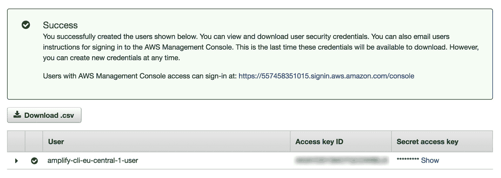
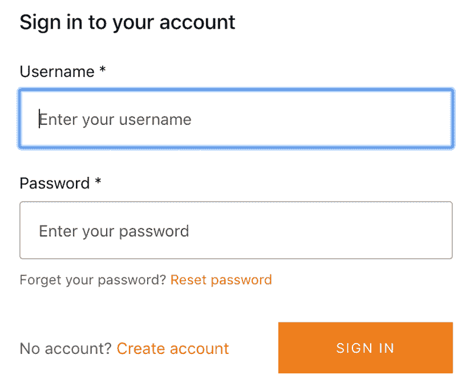

# 第一章：无服务器计算时代的全栈开发

人们通常将云计算与后端开发和 DevOps 联系起来。然而，在过去几年中，这一情况已经开始发生变化。随着*函数即服务*（FaaS）的兴起，以及托管服务形式的强大抽象，云提供商已经降低了对云计算新手以及传统前端开发者的准入门槛。

使用现代工具、框架和服务，如亚马逊网络服务（AWS）Amplify 和 Firebase（等等），单个开发者可以利用其现有的技能和对单一框架及生态系统（如 JavaScript）的知识，构建可扩展的全栈应用程序，其中包括以往需要高技能后端工程师和 DevOps 工程师团队才能构建和维护的所有特性。

本书专注于通过利用 Amplify 框架来缩小前端和后端开发之间的差距。在这里，您将学习如何使用 Amplify 命令行界面（CLI）直接从前端环境中构建可扩展的云应用程序。您将创建和与各种 API 和 AWS 服务进行交互，如使用 Amazon Cognito 进行身份验证，使用 Amazon S3 进行云存储，使用 Amazon API Gateway 和 AWS AppSync 进行 API 以及使用 Amazon DynamoDB 进行数据库操作。

到最后一章时，你将理解如何在云中利用 AWS 服务（后端）和 React（前端）构建真实的全栈应用程序。你还将学习如何使用 React 的现代 API，如 hooks 和函数式组件，以及 React Context 用于全局状态管理。

# 现代无服务器哲学

“无服务器”这个术语通常与 FaaS 联系在一起。尽管关于它的定义各有不同，但这个术语最近已经演变成一种哲学，而不仅仅是一个共享的定义。

当人们谈论无服务器时，他们实际上是在描述如何以最有效的方式交付业务价值，重点放在编写业务逻辑上，而不是为业务逻辑编写支持基础设施。通过采用无服务器思维方式，您可以通过有意识地努力寻找和利用 FaaS、托管服务和智能抽象来做到这一点，只有在现有服务尚不存在时才构建定制解决方案。

越来越多的公司和开发者采用这种方法，因为重新发明轮子是没有意义的。随着这一理念的普及，初创公司和云提供商也提供了大量简化后端复杂性的服务和工具。

对于学术界对于 *无服务器* 含义的看法，你可以阅读由加州大学伯克利分校的一个小组于 2019 年撰写的论文，“简化云编程：伯克利对无服务器计算的视角”，¹。在这篇论文中，作者扩展了 *无服务器* 的定义：

> 尽管云函数——作为 FaaS（函数即服务）的打包提供——代表了无服务器计算的核心，云平台也提供了专门的无服务器框架，以满足特定应用需求，作为 BaaS（后端即服务）的提供。简单来说，无服务器计算 = FaaS + BaaS。

*后端即服务*（BaaS）通常指像数据库（Firestore、Amazon DynamoDB）、认证服务（Auth0、Amazon Cognito）和人工智能服务（Amazon Rekognition、Amazon Comprehend）等托管服务。伯克利重新定义了无服务器的含义，强调了在这场讨论的更广泛范围内正在发生的事情，因为云提供商开始构建更多和更好的托管服务，并将它们放入无服务器的范畴中。

## 无服务器应用的特征

现在你对无服务器哲学有了一些了解，那么无服务器应用的一些特征是什么呢？虽然对于无服务器的定义可能会有不同的答案，但以下特征和特点通常是行业普遍认同的。

### 减少运维责任

无服务器架构通常允许你将更多的运维责任转移给云提供商或第三方。

当你决定实施 FaaS 时，你唯一需要关心的是函数中运行的代码。所有服务器的修补、更新、维护和升级工作都不再是你的责任。这回归到了云计算的核心，以及无服务器试图提供的东西：一种花更少时间管理基础设施，更多时间构建功能并提供业务价值的方式。

### 大量使用托管服务

托管服务通常承担提供一组定义好的功能的责任。它们在无服务器的意义上能够无缝扩展，不需要任何服务器操作或管理运行时间，并且最重要的是，本质上是无需编写代码的。

## 无服务器架构的优势

如今有许多构建应用程序的方式。早期所做的决策不仅会影响应用程序的生命周期，还会影响开发团队，最终影响公司或组织。在本书中，我主张使用无服务器技术和方法构建你的应用程序，并提出了一些可以实现这一点的方式。但是，采用这种方式构建应用程序的优势是什么？为什么无服务器变得如此流行？

### 可扩展性

无服务器的主要优势之一是即插即用的可扩展性。在构建应用程序时，您不必担心应用程序变得极其流行，快速吸纳大量新用户会发生什么事情——云服务提供商会为您处理这些事情。

云服务提供商会自动扩展您的应用程序，根据每次交互运行代码。在无服务器函数中，您的代码并行运行并逐个处理每个触发器（相应地，随着工作负载的增加而扩展）。

无需担心扩展您的服务器和数据库是一个巨大的优势。在设计应用程序时，这是您无需担心的一件事。

### 成本

无服务器架构和传统基于云或本地基础设施的定价模型有很大不同。

在传统方法中，您通常不管是否使用计算资源都需要支付费用。这意味着，如果您希望确保应用程序可以扩展，您需要准备好应对您可能看到的最大工作负载，而不管您实际上是否达到了这一点。这种方法意味着在应用程序生命周期的大部分时间里，您都在为未使用的资源付费。

使用无服务器技术，您只支付所使用的费用。使用函数即服务（FaaS），您将根据对函数的请求次数、函数代码执行所需的时间以及每个函数的保留内存计费。使用像 Amazon Rekognition 这样的托管服务，您只需支付处理的图像和视频分钟数等费用——再次，仅支付所用之物。

这使您可以构建功能和应用程序，基本上无需预先投资基础设施成本。只有当您的应用程序开始受到更多采用并扩展时，您才需要支付服务费用。

从云服务提供商收到的账单只是云基础设施总成本的一部分——还有运营人员的薪资。如果操作资源较少，这些成本会减少。

此外，以这种方式构建应用程序通常有助于更快地进入市场，减少总体开发时间，从而降低开发成本。

### 开发速度

构建功能较少，开发速度加快。能够快速启动大多数应用程序的常见功能（例如数据库、身份验证、存储和 API）使您能够迅速专注于编写您希望交付的核心功能和业务逻辑。

### 实验

如果您不投入大量时间来构建重复的功能，您可以更轻松地进行实验，风险更小。

在推出新功能时，您经常需要评估风险（构建功能涉及的时间和金钱成本）与可能的投资回报（ROI）之间的关系。随着尝试新事物所涉及的风险减少，您可以自由地测试过去可能无法实现的想法。

*A/B 测试*（也称为*分桶测试*或*分割测试*）是一种比较应用程序多个版本以确定哪个性能最佳的方法。由于开发速度的增加，无服务器应用程序通常使您能够更快更轻松地对不同的想法进行 A/B 测试。

### 安全性和稳定性

因为你订阅的服务是服务提供商的核心竞争力所在，通常你得到的东西比你自己建立的要更加精细和安全。想象一下，一家公司多年来的核心业务模型一直是提供完善的认证服务，解决了成千上万家公司和客户的问题和边缘情况。

现在，想象一下在您自己的团队或组织内部复制这样的服务。虽然这完全可行，但选择使用由专门负责构建和维护该特定事物的人构建和维护的服务，是一种保险，最终将为您节省时间和金钱。

使用这些服务提供商的另一个优势是，它们将努力使停机时间最少。这意味着它们不仅承担了构建、部署和维护这些服务的负担，还尽一切可能确保它们的稳定性。

### 较少的代码

大多数工程师都会同意，到头来，代码是一种负担。有价值的是代码提供的功能，而不是代码本身。当你找到方法在限制需要维护的代码量的同时交付这些功能，甚至完全摒弃代码时，你正在减少应用程序的整体复杂性。

较少的复杂性意味着较少的错误，更容易让新工程师上手，并且对于维护和添加新功能的人员来说，认知负荷也会减少。开发人员可以接入这些服务并实现功能，而无需了解实际后端实现的细节，甚至可以几乎不编写任何后端代码。

## 无服务器的不同实现方式

让我们来看看构建无服务器应用程序的不同方法，以及它们之间的一些区别。

### 无服务器框架

第一个无服务器实现之一，Serverless Framework，是最受欢迎的。它是一个免费且开源的框架，于 2015 年 10 月以 JAWS 的名义发布，并使用 Node.js 编写。最初，Serverless Framework 仅支持 AWS，但随后还添加了对 Google 和 Microsoft Azure 等云提供商的支持。

Serverless Framework 利用配置文件（*serverless.yml*）、CLI 和函数代码的组合，为希望将无服务器函数和其他 AWS 服务从本地环境部署到云中的人提供了良好的体验。使用 Serverless Framework 进行快速上手可能对于新手来说有一定的学习曲线，特别是对于对云计算不熟悉的开发人员来说。需要学习很多术语，以及理解如何构建除了“Hello World”应用程序之外的其他内容。

总体而言，Serverless Framework 是一个不错的选择，如果您在某种程度上理解云基础设施的工作原理，并且希望寻找能够与 AWS 以外的其他云提供商一起使用的解决方案。

### AWS 无服务器应用模型

[AWS 无服务器应用模型](https://oreil.ly/ApIoW)（AWS SAM）是一个开源框架，由 AWS 和社区共同开发和维护，于 2016 年 11 月 18 日发布。该框架仅支持 AWS。

SAM 允许您通过在 YAML 文件中定义 API Gateway API、AWS Lambda 函数和无服务器应用程序所需的 Amazon DynamoDB 表来构建无服务器应用程序。它使用 YAML 配置、函数代码和 CLI 的组合来创建、管理和部署无服务器应用程序。

SAM 的一个优势是它是 AWS CloudFormation 的扩展，后者非常强大，允许您在 AWS 中几乎做任何事情。这也可能是对于云计算新手而言的一个缺点，如果不熟悉 AWS 服务、权限、角色和术语，则必须事先了解服务的工作方式、设置它们的命名约定以及如何将它们全部连接在一起。

如果您熟悉 AWS 并且只将您的无服务器应用部署到 AWS，SAM 是一个不错的选择。

### Amplify Framework

Amplify Framework 是 CLI、客户端库、工具链和 Web 托管平台的组合。Amplify 的目的是为开发人员提供一种简单的方式来构建和部署利用云的全栈 Web 和移动应用程序。它不仅支持无服务器函数和认证功能，还支持 GraphQL API、机器学习（ML）、存储、分析、推送通知等。

Amplify 通过摒弃对于 AWS 新手可能不熟悉的术语和缩写，并使用类别名称方法来引用服务，为云计算提供了一个简单的入门点。例如，认证服务不再称为 Amazon Cognito，而是简称为 *auth*，框架在内部使用 Amazon Cognito。

### 其他选择

越来越多的公司开始提供对无服务器函数的抽象，通常旨在改善直接与 AWS Lambda 一起工作时传统上关联的负面用户体验。在这些选项中，一些流行的选择包括 Apex、Vercel、Cloudflare Workers 和 Netlify Functions。

许多这些工具和框架实际上仍然使用 AWS 或其他云提供商的基础设施，因此你基本上会因为他们声称提供更好的用户体验而支付更多费用。大多数这些工具并不提供 AWS 或其他云提供商可用的其他服务套件；像身份验证、AI 和 ML 服务、复杂对象存储和分析可能会或可能不会包含在它们的服务中。

如果你有兴趣学习其他开发无服务器应用程序的方式，我建议你查看这些选项。

# AWS 简介

在本节中，我将概述 AWS，并讨论为什么像 Amplify 框架这样的东西存在。

## 关于 AWS

AWS，亚马逊的子公司，是第一家为开发者提供按需云计算平台的公司。它于 2004 年首次推出，只有一个服务：Amazon Simple Queue Service（Amazon SQS）。2006 年，他们正式重新推出，总共有三个服务：Amazon SQS、Amazon S3 和 Amazon EC2。自 2006 年以来，AWS 不断增长，并仍然是全球最大的云计算提供商，每年继续增加服务。AWS 现在提供超过两百种服务。

随着当前云计算技术向无服务器技术发展，入门门槛正在降低。然而，对于前端开发人员或云计算新手来说，入门仍然往往是困难的。

随着这种新的无服务器范式，AWS 看到了一个机会，创建一个框架，专注于帮助那些传统前端开发人员和新手开发者开始构建云应用程序。

## AWS 上的全栈无服务器

*全栈无服务器*是为了给开发者提供堆栈两端所需的一切，以尽可能快速地构建可扩展的应用程序。在这里，我们将看看如何使用 AWS 工具和服务以这种方式构建应用程序。

## Amplify CLI

如果你刚开始使用 AWS，服务的数量可能会让你感到不知所措。除了要在许多服务中进行选择外，每个服务通常都有自己的陡峭学习曲线。为了帮助缓解这一点，AWS 创建了*Amplify CLI*。

Amplify CLI 为希望在 AWS 上构建应用程序的开发者提供了一个简单的入门点。CLI 允许开发者直接从他们的前端环境创建、配置、更新和删除云服务。

相比于 AWS 控制台和许多其他工具（如 CloudFormation）使用的服务名方法，CLI 采用了分类名方法。AWS 有许多服务名称（例如，Amazon S3，Amazon Cognito 和 Amazon Pinpoint），这对新开发者来说可能会有些混淆。CLI 不再使用服务名称来创建和配置这些服务，而是使用类似*storage*（Amazon S3）、*auth*（Amazon Cognito）和*analytics*（Amazon Pinpoint）这样的名称，帮助你理解服务的实际功能，而不仅仅是服务名称。

CLI 有大量命令，允许您在不离开前端环境的情况下创建、更新、配置和删除服务。您还可以使用 CLI 快速启动和部署新环境，以便测试新功能而不影响主环境。

一旦您使用 CLI 创建和部署了功能，您就可以使用 Amplify 客户端库开始与客户端应用程序中的服务进行交互。

### Amplify 客户端

构建全栈应用程序需要结合客户端工具和后端服务。过去，与 AWS 服务交互的主要方式是使用 AWS 软件开发工具包（SDK），如 Java、.NET、Node.js 和 Python。这些 SDK 工作得很好，但对于客户端开发来说并不特别适用。在 Amplify 出现之前，没有简单的方法可以使用 AWS 构建客户端应用程序。如果您查看 AWS Node.js SDK 的文档，您还会注意到对于新接触 AWS 的开发者来说，它具有陡峭的学习曲线。

Amplify 客户端是一个专门为需要与 AWS 服务交互的 JavaScript 应用程序提供易于使用的 API 的库。Amplify 还为 React Native、本机 iOS 和本机 Android 提供了客户端 SDK。

Amplify 客户端采取的方法是提供更高层次的抽象，并内置最佳实践，以提供声明式、易于使用的 API。同时，它允许您完全控制与后端的交互。它还特别针对客户端构建，具有诸如 WebSocket 和 GraphQL 订阅支持的功能。它利用 localStorage 存储浏览器中的安全令牌，而在 React Native 中则使用 AsyncStorage 来持久化用户认证的`IdTokens`和`AccessTokens`。

Amplify 还为流行的前端和移动框架提供 UI 组件，包括 React、React Native、Vue、Angular、Ionic、本机 Android 和本机 iOS。这些特定于框架的组件允许您快速启动常见功能，如身份验证和复杂对象的存储和检索，而无需构建前端 UI 和处理状态。

Amplify Framework 不支持 AWS 服务的整套功能；相反，它支持其中的一个子集，几乎所有这些功能都属于无服务器类别。使用 Amplify，支持与 EC2 互动不是很有意义，但支持与表述性状态传输（REST）和 GraphQL API 互动非常合理。

Amplify 被创建为一种端到端解决方案，以填补以前未填补的空白，但它还涵盖了构建全栈云应用程序的新方法。

### AWS AppSync

AWS AppSync 是一个管理的*API 层*，使用 GraphQL 使应用程序能够与任何数据源、REST API 或微服务进行交互。

API 层是应用程序中最重要的部分之一。现代应用程序通常与大量的后端服务和 API 进行交互，例如数据库、托管服务、第三方 API 和存储解决方案等。*微服务架构*是指使用模块化组件或服务组合构建的大型应用程序的常用术语。

大多数服务和 API 将具有不同的实现细节，这在使用微服务架构时会带来挑战。这导致前端开发人员在向这些 API 发出请求时，代码不一致，有时混乱，并增加了认知负荷。

处理微服务架构的一个良好方法是提供一致的 API 网关层，然后将所有请求转发到后端服务。这使得客户端与之交互的交互层保持一致，从而简化了前端的开发工作。

GraphQL 是 Facebook 创建并开源的技术，特别适合创建 API 网关。GraphQL 引入了一种定义和一致的规范，以三种操作的形式与 API 进行交互：*查询*（读取）、*变更*（写入/更新）和*订阅*（实时数据）。这些操作作为主要*模式*的一部分定义，并提供了客户端与服务器之间的合同形式，即 GraphQL 类型。GraphQL 操作不绑定于任何特定的数据源，因此作为开发人员，您可以自由地使用它们与数据库、HTTP 端点、微服务甚至无服务器函数进行交互。

通常，在构建 GraphQL API 时，您需要处理构建、部署、维护和配置自己的 API。使用 AWS AppSync，您可以将服务器和 API 管理以及安全性外包给 AWS。

现代应用程序通常还涉及实时和离线支持等问题。AppSync 的另一个好处是它内置了对离线（Amplify 客户端 SDK）和实时（GraphQL 订阅）的支持，使开发人员能够构建这些类型的应用程序。

在本书中，您将使用 AWS AppSync 以及各种数据源（如 DynamoDB 用于 NoSQL 和 AWS Lambda 用于无服务器函数）作为主要的 API 层。

# AWS Amplify CLI 介绍

您将在本书中始终使用 Amplify CLI 来创建和管理您的云服务。为了了解它的工作原理，在本节中您将使用 CLI 创建和部署一个服务。服务部署完成后，您还将学习如何删除它以及删除与部署相关的任何后端资源。让我们看看如何创建您的第一个服务。

## 安装和配置 Amplify CLI

要开始使用，您首先需要安装并配置 Amplify CLI：

```
~ npm install -g @aws-amplify/cli
```

###### 注意

要使用 CLI，您首先需要在计算机上安装 Node.js 版本 10.x 或更高版本以及 npm 版本 5.x 或更高版本。要安装 Node.js，我建议访问 [Node.js 安装页面](https://nodejs.org/en) 并按照安装说明操作，或者使用 [Node Version Manager](https://github.com/nvm-sh/nvm) (NVM)。

安装完成 CLI 后，您需要使用 AWS 帐户中的身份和访问管理（IAM）用户配置它。为此，您将使用一组用户凭据（访问密钥 ID 和秘密访问密钥）配置 CLI。使用这些凭据，您将能够直接从 CLI 代表此用户创建 AWS 服务。

要创建新用户并配置 CLI，您将运行 `configure` 命令：

```
~ amplify configure
```

这将引导您完成以下步骤：

1.  *指定 AWS 区域。*

    这将允许您选择要创建用户的区域（以及由此用户关联的服务）。选择距离您最近或首选的区域。

1.  *指定用户名。*

    此名称将成为您在 AWS 帐户中创建的用户的本地引用。我建议使用一个您以后在引用时能够识别的名称，例如 *amplify-cli-us-east-1-user* 或 *mycompany-cli-admin*。

输入您的名称后，CLI 将打开 AWS IAM 仪表板。从这里，您可以通过点击“下一步：权限”、“下一步：标签”、“下一步：审核”和“创建用户”接受默认设置来创建 IAM 用户。

在下一个屏幕中，您将获得 IAM 用户凭据：访问密钥 ID 和秘密访问密钥。请参见 图 1-1。



###### 图 1-1\. AWS IAM 仪表板

回到 CLI，粘贴访问密钥 ID 和秘密访问密钥的值。现在您已成功配置 CLI，可以开始创建新服务。

## 初始化您的第一个 Amplify 项目

现在 CLI 已安装并配置完成，您可以创建您的第一个项目。这一步通常在客户端应用程序的根目录下完成。由于本书大部分时间您将使用 React，我们将从初始化一个新的 React 项目开始：

```
~ npx create-react-app amplify-app

# after creating the React app, change into the new directory
~ cd amplify-app
```

现在您需要安装 Amplify，这将在客户端上使用。您将使用的库是 AWS Amplify 和 AWS Amplify React，用于 React 特定的 UI 组件：

```
~ npm install aws-amplify @aws-amplify/ui-react
```

接下来，您可以创建一个 Amplify 项目。为此，您将运行 `init` 命令：

```
~ amplify init
```

这将引导您完成以下步骤：

1.  *输入项目名称。*

    这将是项目的本地名称，通常描述项目或其功能。

1.  *输入环境名称。*

    这将是您将要工作的初始环境的参考。在此工作流程中，典型的环境可能是 *dev*、*local* 或 *prod*，但可以是任何对您有意义的内容。

1.  *选择您的默认编辑器。*

    这将设置您的编辑器偏好。CLI 稍后将使用此偏好打开当前项目的文件。

1.  *选择您要构建的应用类型。*

    这将确定 CLI 是否应配置、构建和运行命令（如果使用 JavaScript）。在本例中，请选择 *javascript*。

1.  *您使用的 JavaScript 框架是什么？*

    这将确定一些基本的构建和启动命令。在本例中，请选择 *react*。

1.  *选择您的源代码目录路径。*

    这允许您设置源代码所在的目录。在本例中，请选择 *src*。

1.  *选择您的分发目录路径。*

    对于 Web 项目，这将是包含编译后的 JavaScript 源代码以及 favicon、HTML 和 CSS 文件的文件夹。在本例中，请选择 *build*。

1.  *选择您的构建命令。*

    这指定了编译和捆绑 JavaScript 代码的命令。在本例中，请使用 *npm run-script build*。

1.  *选择您的启动命令。*

    这指定了在本地服务器上提供应用程序的命令。在本例中，请使用 *npm run-script start*。

1.  *是否要使用 AWS 配置文件？*

    在这里，选择 *Y*，然后选择您运行 `amplify configure` 时创建的 AWS 配置文件。

现在，Amplify CLI 将初始化您的新 Amplify 项目。初始化完成后，在您的项目中会创建两个额外的资源：一个位于 *src* 目录下名为 *aws-exports* 的文件，以及一个位于根目录下名为 *amplify* 的文件夹。

aws-exports 文件

*aws-exports* 文件是 CLI 为您创建的资源类别及其凭据的键值对。

amplify 文件夹

此文件夹包含 Amplify 项目的所有代码和配置文件。在此文件夹中，您将看到两个子文件夹：*backend* 和 *#current-cloud-backend* 文件夹。

*backend* 文件夹

此文件包含项目中的所有本地代码，例如用于 AppSync API 的 GraphQL 模式、任何无服务器函数的源代码，以及代表 Amplify 项目当前本地状态的基础设施即代码。

*#current-cloud-backend* 文件夹

此文件夹保存反映最后一次 Amplify `push` 命令部署的云中资源的代码和配置。它帮助 CLI 区分云中已经提供的资源配置和当前在本地 *backend* 目录中的配置（反映了您的本地更改）。

现在您已初始化项目，可以添加第一个云服务：*authentication*。

## 创建并部署您的第一个服务

要创建新服务，可以使用 Amplify 的 `add` 命令：

```
~ amplify add auth
```

这将引导您完成以下步骤：

1.  *您是否想使用默认的认证和安全配置？*

    这为您提供了使用默认配置（注册时 MFA，登录时密码）、使用社交提供商创建认证配置或创建完全自定义认证配置的选项。对于本示例，请选择 *Default configuration*。

1.  *您希望用户如何进行登录？*

    这将允许您指定所需的登录属性。对于此示例，请选择默认选项 *Username*。

1.  *您是否要配置高级设置？*

    这将允许您进行进一步的高级设置，如额外的注册属性和 Lambda 触发器。对于本示例，您不需要这些设置，因此选择默认选项 *No, I am done*。

    现在，您已成功配置了认证服务，现在可以准备部署。要部署认证服务，可以运行 `push` 命令：

    ```
    ~ amplify push
    ```

1.  *您确定要继续吗？*

    选择 *Y*。

部署完成后，您的认证服务已成功创建。恭喜，您已部署了第一个功能。现在，让我们来测试一下。

在 React 应用程序中与认证服务交互有几种方法。您可以使用 Amplify 的 `Auth` 类，它提供了超过 30 个可用的方法（如 `signUp`、`signIn`、`signOut` 等），或者您可以使用框架特定的组件，如 `withAuthenticator`，它将为您提供一个完整的认证流程，包括预配置的用户界面。让我们试试 `withAuthenticator` 高阶组件。

首先，配置 React 应用程序以与 Amplify 协作。为此，请打开 *src/index.js* 并在最后一个 `import` 语句下添加以下代码：

```
import Amplify from 'aws-amplify'
import config from './aws-exports'
Amplify.configure(config)
```

现在，应用程序已配置完成，您可以开始与认证服务进行交互。接下来，打开 *src/App.js* 并使用以下代码更新文件：

```
import React from 'react'
import { withAuthenticator, AmplifySignOut } from '@aws-amplify/ui-react'

function App() {
  return (
    <div>
      <h1>Hello from AWS Amplify</h1>
      <AmplifySignOut />
    </div>
  )
}

export default withAuthenticator(App)
```

此时，您可以通过启动应用程序来测试它：

```
~ npm start
```

现在，你的应用程序应该使用预配置的认证流程启动。参见 图 1-2。



###### 图 1-2\. withAuthenticator 高阶组件

## 删除资源

一旦您不再需要某个功能或项目，可以使用 CLI 删除它。

若要移除单个功能，您可以运行`remove`命令：

```
~ amplify remove auth
```

若要删除整个 Amplify 项目以及在您的帐户中部署的所有相应资源，您可以运行`delete`命令：

```
~ amplify delete
```

# 摘要

云计算正在快速增长，越来越多的公司开始依赖云来处理大部分工作负载。随着使用量的增加，云计算的知识正在成为技能组合中的宝贵补充。

无服务器范式，作为云计算的一个子集，也在商业用户中迅速流行起来，因为它提供了云计算的所有优势，并具有自动扩展的特性，几乎不需要维护。

类似 Amplify 框架这样的工具正在帮助所有背景的开发人员轻松上手云和无服务器计算。在接下来的章节中，您将学习如何在云中构建真实的全栈无服务器应用程序，利用云服务和 Amplify 框架。

¹ Eric Jonas, Johann Schleier-Smith 等人，《云编程简化：关于无服务器计算的伯克利视角》（2019 年 2 月 10 日），[*http://www2.eecs.berkeley.edu/Pubs/TechRpts/2019/EECS-2019-3.html*](http://www2.eecs.berkeley.edu/Pubs/TechRpts/2019/EECS-2019-3.html)。
