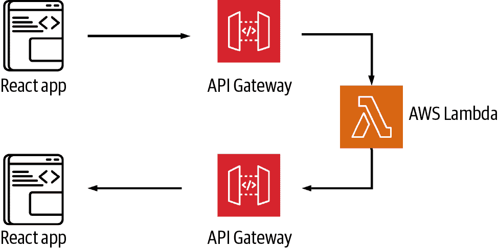
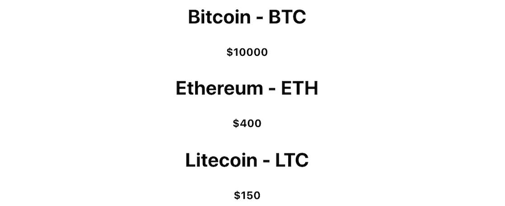

# 第二章：使用 AWS Amplify 入门

大多数应用程序的核心是数据/API 层。这一层可能有很多形式。在无服务器世界中，这通常将由一组 API 端点和无服务器函数组成。这些无服务器函数可以执行一些逻辑并返回数据，与某种数据库交互，甚至与另一个 API 端点交互。

使用 Amplify 创建 API 的两种主要方式有：

+   Amazon API Gateway 和 Lambda 函数的组合

+   与某种数据源（数据库、Lambda 函数或 HTTP 端点）连接的 GraphQL API

API 网关是 AWS 的一个服务，允许您创建 API 端点并将其路由到不同的服务，通常通过 Lambda 函数。当您发起 API 调用时，它将通过 API 网关路由请求，调用函数，并返回响应。使用 Amplify CLI，您可以创建 API 网关端点以及 Lambda 函数；CLI 将自动配置 API，以便通过 HTTP 请求调用 Lambda 函数。

创建 API 后，您需要一种与其交互的方式。使用 Amplify 客户端，您将能够使用 Amplify `API` 类向端点发送请求。`API` 类允许您与 GraphQL API 和 API 网关端点进行交互，如 图 2-1 所示。

在本章中，您将创建您的第一个全栈无服务器应用程序，该应用程序将通过 API 网关端点与无服务器函数进行交互。您将使用 CLI 创建一个 API 端点以及一个无服务器函数，然后使用 Amplify 客户端库与 API 进行交互。



###### 图 2-1\. 带 Lambda 的 API

首先，应用程序将从函数中获取一个硬编码的项目数组。然后，您将学习如何更新函数，以便发起异步 HTTP 请求到另一个 API 以检索数据并将其返回给客户端。

# 创建和部署无服务器函数

许多无服务器应用程序的核心是*无服务器函数*。无服务器函数在*无状态计算容器*中运行您的代码，这些容器是事件驱动的，短暂的（可能只持续一个调用），并由您选择的云提供商完全管理。这些函数可以无缝扩展，并且不需要任何服务器操作。

尽管大多数人认为无服务器函数是通过 API 调用触发的，但这些函数也可以通过各种不同的事件触发。除了 HTTP 请求之外，触发无服务器函数的几种常见方式包括通过向存储服务上传图像，数据库操作（如创建、更新或删除），甚至来自另一个无服务器函数。

无服务器函数会自动扩展，因此如果您的应用程序遇到大量流量，无需担心。当您首次调用函数时，服务提供商将创建函数实例并运行其处理程序方法来处理事件。函数完成并返回响应后，它将继续存在并处理额外的事件。如果第一个事件仍在处理时发生另一个调用，服务将创建另一个实例。

无服务器函数还有一个与传统基础设施不同的付款模型。使用像 AWS Lambda 这样的服务，您只需按实际使用付费，按照函数的请求次数和代码执行的时间计费。这与预配并支付服务器等基础设施形成对比，后者无论是否被使用都会收费。

现在您已了解了无服务器函数，让我们看看如何创建一个无服务器函数，并将其连接到一个 API，该 API 将从 HTTP 请求中调用它。

## 创建 React 应用程序并安装依赖项

要开始，您首先需要创建 React 应用程序。为此，您可以使用 `npx`：

```
~ npx create-react-app amplify-react-app
~ cd amplify-react-app
```

接下来，您需要安装依赖项。对于此应用程序，您只需要 AWS Amplify 库：

```
~ npm install aws-amplify
```

安装完依赖项后，您现在可以在 React 应用程序的根目录中初始化一个新的 Amplify 项目：

```
~ amplify init

? Enter a name for the project: cryptoapp
? Enter a name for the environment: local
? Choose your default editor: <your-preferred-editor>
? Choose the type of app that you're building: javascript
? What javascript framework are you using: react
? Source Directory Path: src
? Distribution Directory Path: build
? Build Command: npm run-script build
? Start Command: npm run-script start
? Do you want to use an AWS profile? Here, choose *Y* and pick the AWS
  profile you created when you ran `amplify configure`.
```

现在，Amplify 项目和 React 应用程序均已成功创建，您可以开始添加新功能。

## 使用 Amplify CLI 创建新的无服务器函数

在下一步中，我们将创建一个无服务器函数，您将在此应用程序中使用它。本章中构建的应用程序是一个加密货币应用程序。首先，您将在函数中硬编码一个加密货币信息数组，并将其返回给客户端。稍后在本章中，您将更新此函数以调用另一个 API（CoinLore），并异步获取和返回数据。

要创建函数，请运行以下命令：

```
~ amplify add function

? Select which capability you want to add: Lambda function
? Provide a friendly name for your resource to be used as a label for
  this category in the project: cryptofunction
? Provide the AWS Lambda function name: cryptofunction
? Choose the function runtime that you want to use: NodeJS
? Choose the function template that you want to use: Serverless express
  function (Integration with Amazon API Gateway)
? Do you want to access other resources created in this project from
  your Lambda function? No
? Do you want to invoke this function on a recurring schedule? No
? Do you want to configure Lambda layers for this function? No
? Do you want to edit the local Lambda function now? No
```

###### 提示

如果函数成功创建，您将看到一条消息：“已在本地成功添加资源 cryptofunction。”

您现在应该看到一个位于 *amplify* 目录中的新子文件夹 *amplify/backend/function/cryptofunction*。

## 代码解析

当您创建此资源时，将在 *amplify/backend* 中创建一个名为 *function* 的新文件夹。CLI 创建的所有函数都将存储在此文件夹中。目前，您只有一个单独的函数 `cryptofunction`。在 *cryptofunction* 文件夹中，您将看到一些配置文件以及一个 *src* 目录，其中包含主要函数代码。

无服务器函数本质上只是独立运行的封装应用程序。因为您创建的函数是 JavaScript，所以您会看到在任何 JavaScript 应用程序中通常看到的所有内容，包括*package.json*和*index.js*文件。

接下来，请查看位于*src/index.js*中的函数入口点，在*cryptofunction*文件夹中。在这个文件中，您将看到一个名为`exports.handler`的函数。这是函数调用的入口点。当调用函数时，此代码将被运行。

如果您愿意，您可以直接在此函数中处理事件，但由于您将使用 API，更有用的方法是将路径代理到具有路由的 express 应用程序中（即*http://yourapi/<somepath>*）。这样做可以为您提供单个函数中的多个路由以及每个路由的多个 HTTP 请求方法，如`get`、`put`、`post`和`delete`。*serverless express*框架为您提供了一种简便的方法来实现这一点，并已内置到函数的样板中。

在*index.js*中，您将看到一个类似于这样的代码行：

```
awsServerlessExpress.proxy(server, event, context);
```

此代码是将事件、上下文和路径代理到运行在*app.js*中的 express 服务器的地方。

在*app.js*中，然后您将能够针对您为 API 创建的任何路由创建 HTTP 请求（本示例为获取加密货币的`/coins`路由）。

## 创建/coins 路由

现在您已经了解了应用程序的结构，让我们在*app.js*中创建一个新的路由，并从中返回一些数据。您将创建的路由是`/coins`路由。此路由将返回一个包含 coins 数组的对象。

让我们添加新路由。在第一个`app.get('/items')`路由之前，添加以下代码：

```
/* amplify/backend/function/cryptofunction/src/app.js /*

app.get('/coins', function(req, res) {
  const coins = [
    { name: 'Bitcoin', symbol: 'BTC', price_usd: "10000" },
    { name: 'Ethereum', symbol: 'ETH', price_usd: "400" },
    { name: 'Litecoin', symbol: 'LTC', price_usd: "150" }
  ]
  res.json({
    coins
  })
})
```

这个新路由有一个硬编码的加密货币信息数组。当使用这个路由调用函数时，它将响应一个包含名为`coins`的单一属性的对象，该属性将包含 coins 数组。

# 添加 API

现在函数已经创建并配置好了，让我们在其前面放置一个 API，以便您可以使用 HTTP 请求触发它。

要做到这一点，您将使用 Amazon API Gateway。API Gateway 是一种全管理的服务，使开发人员能够创建、发布、维护、监控和安全地管理 REST 和 WebSocket API。API Gateway 是 Amplify CLI 和 Amplify 客户端库都支持的服务之一。

在本节中，您将创建一个新的 API Gateway 端点，并配置它来调用上一节中创建的 Lambda 函数。

## 创建新的 API

要创建 API，您可以使用 Amplify `add`命令。从项目的根目录，在您的终端中运行以下命令：

```
~ amplify add api

? Please select from one of the below mentioned services: REST
? Provide a friendly name for your resource to be used as a label for
  this category in the project: cryptoapi
? Provide a path: /coins
? Choose a Lambda source: Use a Lambda function already added in the
  current Amplify project
? Choose the Lambda function to invoke by this path: cryptofunction
? Restrict API access: N
? Do you want to add another path? N
```

## 部署 API 和 Lambda 函数

现在函数和 API 都已创建好，您需要将它们部署到您的账户以使其生效。为此，您可以运行 Amplify `push`命令：

```
~ amplify push

? Are you sure you want to continue? Y
```

部署成功后，服务即已启动并准备就绪。

您可以随时使用 Amplify CLI 的 `status` 命令查看项目的当前状态。`status` 命令将列出项目中当前配置的所有服务，并为每个服务提供状态：

```
 ~ amplify status

Current Environment: local

| Category | Resource name  | Operation | Provider plugin   |
| -------- | -------------- | --------- | ----------------- |
| Function | cryptofunction | No Change | awscloudformation |
| Api      | cryptoapi      | No Change | awscloudformation |
```

在此状态输出中需要注意的主要内容是 `Operation`。`Operation` 告诉您下次在项目中运行 `push` 时将发生什么。`Operation` 属性将设置为 `Create`、`Update`、`Delete` 或 `No Change`。

# 与新 API 交互

现在资源已经部署完成，您可以开始从 React 应用程序与 API 进行交互。

## 配置客户端应用以与 Amplify 配合使用

要在任何应用程序中使用 Amplify 客户端库，通常需要设置基本配置，通常在根级别。创建资源时，CLI 会使用关于资源的信息填充 *aws-exports.js* 文件。您将使用此文件来配置客户端应用程序以与 Amplify 配合使用。

要配置应用程序，请打开 *src/index.js* 并在最后一个导入语句下添加以下内容：

```
import Amplify from 'aws-amplify'
import config from './aws-exports'
Amplify.configure(config)
```

## Amplify 客户端 API 类别

客户端应用程序配置完成后，您可以开始与资源进行交互。

Amplify 客户端库有各种 API 类别，可以导入并用于各种功能，包括用于身份验证的 `Auth`、用于在 S3 中存储项目的 `Storage`，以及用于与 REST 和 GraphQL API 交互的 `API`。

在此部分，您将使用 `API` 类别。`API` 具有各种可用的方法，包括 `API.get`、`API.post`、`API.put` 和 `API.del`，用于与 REST API 交互，以及用于与 GraphQL API 交互的 `API.graphql`。

在使用 REST API 时，`API` 接受三个参数：

```
API.get(apiName: String, path: String, data?: Object)
```

`apiName`

在通过命令行创建 API 时给定的名称。在我们的示例中，该值将是 `cryptoapi`。

`path`

您希望与之交互的路径。在我们的示例中，我们创建了 `/coins`，因此路径将是 `/coins`。

`data`

这是一个可选对象，其中包含您希望传递给 API 的任何属性，包括头部、查询字符串参数或主体。

在我们的示例中，API 调用将如下所示：

```
API.get('cryptoapi', '/coins')
```

API 返回一个 promise，这意味着您可以使用 promise 或 `async` 函数来处理调用：

```
// promise
API.get('cryptoapi', '/coins')
  .then(data => console.log(data))
  .catch(error => console.log(error))

// async await
const data = await API.get('cryptoapi', '/coins')
```

在本书的示例中，我们将使用 `async` 函数来处理 promise。

## 调用 API 并在 React 中渲染数据

接下来，让我们调用 API 并渲染数据。在 *src/App.js* 中更新如下：

```
// Import useState and useEffect hooks from React
import React, { useState, useEffect } from 'react'

// Import the API category from AWS Amplify
import { API } from 'aws-amplify'

import './App.css';

function App() {
  // Create coins variable and set to empty array
  const [coins, updateCoins] = useState([])

  // Define function to all API
  async function fetchCoins() {
    const data = await API.get('cryptoapi', '/coins')
    updateCoins(data.coins)
  }

  // Call fetchCoins function when component loads
  useEffect(() => {
    fetchCoins()
  }, [])

  return (
    <div className="App">
      {
        coins.map((coin, index) => (
          <div key={index}>
            <h2>{coin.name} - {coin.symbol}</h2>
            <h5>${coin.price_usd}</h5>
          </div>
        ))
      }
    </div>
  );
}

export default App
```

然后，运行应用程序：

```
~ npm start
```

当应用程序加载时，您应该看到一个包含名称、符号和价格的硬币列表，如图 2-2 所示。



###### 图 2-2\. 从 API 获取数据

# 更新调用另一个 API 的功能

接下来，您将更新函数以调用另一个 API，即 CoinLore API，该 API 将从 CoinLore 服务返回动态数据。用户将能够添加类似 `limit` 和 `start` 的过滤器，以限制从 API 返回的项目数。

要开始，您首先需要一种方法与 Lambda 函数中的 HTTP 端点进行交互。本课程中您将使用的库是 Axios 库。Axios 是一个基于承诺的浏览器和 Node.js 的 HTTP 客户端。

## 安装 Axios

您需要做的第一件事是在函数文件夹中安装 Axios 包，以便从函数中发送 HTTP 请求。导航到 *amplify/backend/function/cryptofunction/src*，安装 Axios，然后返回应用程序的根目录：

```
~ cd amplify/backend/function/cryptofunction/src
~ npm install axios
~ cd ../../../../../
```

## 更新函数

接下来，更新位于 *amplify/backend/function/cryptofunction/src/app.js* 中的 `/coins` 路由如下：

```
// Import axios
const axios = require('axios')

app.get('/coins', function(req, res) {
  // Define base url
  let apiUrl = `https://api.coinlore.com/api/tickers?start=0&limit=10`

  // Check if there are any query string parameters
  // If so, reset the base url to include them
  if (req.apiGateway && req.apiGateway.event.queryStringParameters) {
   const { start = 0, limit = 10 } = req.apiGateway.event.queryStringParameters
   apiUrl = `https://api.coinlore.com/api/tickers/?start=${start}&limit=${limit}`
  }

  // Call API and return response
  axios.get(apiUrl)
    .then(response => {
      res.json({  coins: response.data.data })
    })
    .catch(err => res.json({ error: err }))
})
```

在前述函数中，我们导入了 Axios 库，然后使用它向 CoinLore API 发送了 API 调用。在 API 调用中，您可以传递 `start` 和 `limit` 参数到请求中，以定义返回的硬币数量，并定义起始点。

在 `req` 参数中，有一个 `apiGateway` 属性，其中包含 `event` 和 `context` 变量。在刚刚定义的函数中，有一个检查以查看是否存在此 `event`，以及 `event` 上的 `queryStringParameters` 属性。如果 `queryStringParameters` 属性存在，我们将使用这些值来更新基本 URL，并使用 `queryStringParameters`，用户可以在查询 CoinLore API 时指定 `start` 和 `limit` 值。

一旦函数更新完成，您可以通过在终端中运行 `push` 命令来部署更新：

```
~ amplify push

Current Environment: local

| Category | Resource name  | Operation | Provider plugin   |
| -------- | -------------- | --------- | ----------------- |
| Function | cryptofunction | Update    | awscloudformation |
| Api      | cryptoapi      | No Change | awscloudformation |

? Are you sure you want to continue? Y
```

## 更新客户端应用程序

现在，您已经更新了函数，让我们更新 React 应用程序，以便用户可以指定 `limit` 和 `start` 参数。

为此，您需要添加用户输入字段，并为用户提供一个按钮来触发新的 API 请求。

更新 *src/App.js* 如下所示：

```
// Create additional state to hold user input for limit and start properties
const [input, updateInput] = useState({ limit: 5, start: 0 })

// Create a new function to allow users to update the input values
function updateInputValues(type, value) {
  updateInput({ ...input, [type]: value })
}

// Update fetchCoins function to use limit and start properties
async function fetchCoins() {
  const { limit, start } = input
  const data = await API.get('cryptoapi', `/coins?limit=${limit}&start=${start}`)
  updateCoins(data.coins)
}

// Add input fields to the UI for user input
<input
  onChange={e => updateInputValues('limit', e.target.value)}
  placeholder="limit"
/>
<input
  placeholder="start"
  onChange={e => updateInputValues('start', e.target.value)}
/>

// Add button to the UI to give user the option to call the API
<button onClick={fetchCoins}>Fetch Coins</button>
```

接下来，运行应用程序：

```
~ npm start
```

# 摘要

恭喜！您已部署了您的第一个无服务器 API！

从本章中需要记住的几点是：

+   Lambda 函数可以通过各种事件触发。在本章中，我们通过 API Gateway 的 API 调用触发了该函数。

+   可以使用 Amplify CLI 通过 `amplify add function` 命令创建 Lambda 函数，并通过 `amplify add api` 命令创建 API。

+   单个 API Gateway 端点可以配置为与多个 Lambda 函数配合使用。在本章的示例中，我们仅将其连接到了单个函数。

+   Lambda 函数本质上是独立的 Node.js 应用程序。在本章的示例中，我们选择运行一个 express 应用程序以处理 `get`、`post` 和 `delete` 等 REST 方法，尽管到目前为止我们只使用了 `get` 调用。

+   Amplify 客户端库中的`API`类别可用于 GraphQL 和 REST API。
