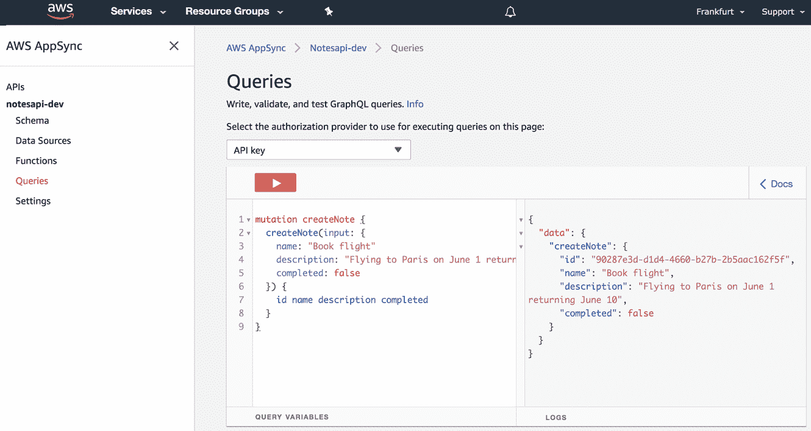

# 第三章：创建您的第一个应用程序

在 第二章 中，您使用 API Gateway 和无服务器函数创建了一个基本的 API 层。这种组合非常强大，但您尚未与真实数据库进行交互。

在本章中，您将创建一个与 DynamoDB NoSQL 数据库交互以执行 CRUD+L（创建、读取、更新、删除和列表）操作的 GraphQL API。您将了解 GraphQL 的定义、开发者为何采用它以及其工作原理。

我们将构建一个笔记应用程序，允许用户创建、更新和删除笔记。它还将启用 GraphQL 订阅功能，以便实时查看更新。如果另一个用户正在与应用程序交互并创建新的笔记，我们的应用程序将实时更新新值。

# GraphQL 简介

GraphQL 是 REST 的一种替代实现。让我们看看 GraphQL 是什么，GraphQL API 由什么组成，以及 GraphQL 的工作原理。

## GraphQL 是什么？

GraphQL 是一个 API 规范。它是一个用于 API 的查询语言，以及用于用您的数据来实现这些查询的运行时。它可以用作 REST 的替代方案，并与 REST 有一些相似之处。

GraphQL 是 Facebook 在 2015 年引入的，[尽管在 2012 年就在内部使用](https://oreil.ly/KtnOq)。GraphQL 允许客户端定义 API 调用所需的数据结构，以便他们可以准确地知道服务器将返回的数据结构。以这种方式请求数据使得客户端应用程序与后端 API 和服务的交互方式更加高效，减少了数据的不足提取、防止数据的过度提取和类型错误。

## GraphQL API 的组成部分是什么？

一个 GraphQL API 主要由三个部分组成：模式、解析器和数据源，如 图 3-1 所示。


###### 图 3-1\. GraphQL API 设计

用 GraphQL 模式定义语言（SDL）编写的模式定义了可以针对 API 执行的数据模型（类型）和操作。模式由基本类型（数据模型）和像查询（用于获取数据）、突变（用于创建、更新和删除数据）以及订阅（用于订阅实时数据更改）这样的 GraphQL 操作组成。

这是一个 GraphQL 模式的示例：

```
# base type
type Todo {
  id: ID
  name: String
  completed: Boolean
}

# Query definitions
type Query {
  getTodo(id: ID): Todo
  listTodos: [Todo]
}

# Mutation definitions
type Mutation {
  createTodo(input: Todo): Todo
}

# Subscription definitions
type Subscription {
  onCreateTodo: Todo
}
```

一旦模式被创建，您可以开始为在模式中定义的 GraphQL 操作编写解析器（查询、突变、订阅）。GraphQL 解析器告诉 GraphQL 操作在执行时该做什么，并通常会与某些数据源或另一个 API 进行交互，如 图 3-2 所示。


###### 图 3-2\. GraphQL 工作原理

## GraphQL 操作

GraphQL 操作是您与 API 数据源进行交互的方式。GraphQL 操作可以类似地映射到 RESTful API 的 HTTP 方法：

```
GET -> Query
PUT -> Mutation
POST -> Mutation
DELETE -> Mutation
PATCH -> Mutation
```

GraphQL 请求操作看起来类似于一个 JavaScript 对象，只有键没有值。键和值在 GraphQL 操作响应中返回。以下是典型的 GraphQL 查询示例，获取一个项目数组：

```
query {
  listTodos {
    id
    name
    completed
  }
}
```

此请求将返回以下响应：

```
{
  "data": {
    "listTodos": [
      { "id": "0", "name": "buy groceries", "completed": false },
      { "id": "1", "name": "exercise", "completed": true }
    ]
  }
}
```

您还可以将参数传递给 GraphQL 操作。以下操作是一个查询 `Todo` 的示例，传入我们想要获取的 `Todo` 的 ID：

```
query {
  getTodo(id: "0") {
    name
    completed
  }
}
```

此请求将返回以下响应：

```
{
  "data": {
    "getTodo": {
      "name": "buy groceries"
      "completed": false
    }
  }
}
```

虽然有许多实现 GraphQL 服务器的方法，但在本书中我们将使用 AWS AppSync。AppSync 是一种托管服务，允许我们使用 Amplify CLI 快速轻松地部署 GraphQL API、解析器和数据源。

# 创建 GraphQL API

现在您已经基本了解了 GraphQL 是什么，让我们继续使用它来构建 Notes 应用程序。

您需要做的第一件事是创建一个新的 React 应用程序并安装必要的依赖项。该应用程序将使用 AWS Amplify 库与 API 交互，`uuid` 用于创建唯一的 `id`，Ant Design 库用于样式：

```
~ npx create-react-app notesapp
~ cd notesapp
~ npm install aws-amplify antd uuid
```

现在，在新应用的根目录中，您可以创建 Amplify 项目：

```
~ amplify init

? Enter a name for the project: notesapp
? Enter a name for the environment: dev
? Choose your default editor: <your editor of choice>
? Choose the type of app that you're building: javascript
? What javascript framework are you using: react
? Source Directory Path: src
? Distribution Directory Path: build
? Build Command: npm run-script build
? Start Command: npm run-script start
? Do you want to use an AWS profile? Y
```

初始化 Amplify 项目后，我们可以添加 GraphQL API：

```
~ amplify add api

? Please select from one of the below mentioned services: GraphQL
? Provide API name: notesapi
? Choose the default authorization type for the API: API Key
? Enter a description for the API key: public (or some description)
? After how many days from now the API key should expire: 365 (or your
  preferred expiration)
? Do you want to configure advanced settings for the GraphQL API: N
? Do you have an annotated GraphQL schema? N
? Do you want a guided schema creation? Y
? What best describes your project: Single object with fields
? Do you want to edit the schema now? Y
```

接下来，在您的文本编辑器中打开基础 GraphQL 模式（由 CLI 生成），位于 *notesapp/amplify/backend/api/notesapi/schema.graphql*，更新模式如下，并保存：

```
type Note @model {
  id: ID!
  clientId: ID
  name: String!
  description: String
  completed: Boolean
}
```

此模式包含一个主要的 `Note` 类型，包含五个字段。字段可以是可空的（非必需的）或非可空的（必需的）。非可空字段用 `!` 字符指定。

此模式中的 `Note` 类型带有 `@model` 指令。该指令不是 GraphQL SDL 的一部分，而是 AWS Amplify GraphQL Transform 库的一部分。

GraphQL Transform 库允许您使用不同的指令（如 `@model`、`@connection`、`@auth` 等）对 GraphQL 模式进行注释。

在此模式中使用的 `@model` 指令将基础的 `Note` 类型转换为一个完整的 AWS AppSync GraphQL API，包括：

1.  针对查询和变异的额外模式定义（`Create`、`Read`、`Update`、`Delete` 和 `List` 操作）

1.  为 GraphQL 订阅添加额外的模式定义

1.  DynamoDB 数据库

1.  所有 GraphQL 操作的解析器代码映射到 DynamoDB 数据库

要部署 API，可以运行 `push` 命令：

```
~ amplify push

? Are you sure you want to continue? Yes
? Do you want to generate code for your newly created GraphQL API: Yes
? Choose the code generation language target: javascript
? Enter the file name pattern of graphql queries, mutations and
  subscriptions: src/graphql/**/*.js
? Do you want to generate/update all possible GraphQL operations -
  queries, mutations and subscriptions: Y
? Enter maximum statement depth [increase from default if your schema is
  deeply nested]: 2
```

一旦部署完成，API 和数据库已成功创建在您的账户中。接下来，让我们在 AWS 控制台中打开新创建的 AppSync API，并测试几个 GraphQL 操作。

# 查看和与 GraphQL API 交互

要随时在 AWS 控制台中打开 API，您可以使用以下命令：

```
- amplify console api

> Choose GraphQL
```

一旦打开了 AppSync 控制台，点击左侧菜单中的 Queries 打开查询编辑器。在这里，您可以使用您的 API 测试 GraphQL 查询、变异和订阅。

我们首先尝试的操作是执行变更以创建新的笔记。在查询编辑器中，执行以下变更（参见 图 3-3）：

```
mutation createNote {
  createNote(input: {
    name: "Book flight"
    description: "Flying to Paris on June 1 returning June 10"
    completed: false
  }) {
    id name description completed
  }
}
```



###### 图 3-3\. GraphQL 变更

现在，您已经创建了一个项目，可以尝试查询它。让我们尝试查询应用程序中的所有笔记：

```
query listNotes {
  listNotes {
    items {
      id
      name
      description
      completed
    }
  }
}
```

你也可以尝试使用其中一个笔记的 ID 查询单个笔记：

```
query getNote {
  getNote(id: "<NOTE_ID>") {
    id
    name
    description
    completed
  }
}
```

现在我们知道 GraphQL API 已部署并正常运行，让我们开始编写一些前端代码。

# 构建 React 应用程序

您需要做的第一件事是配置 React 应用程序以识别位于 *src/aws-exports.js* 的 Amplify 资源。为此，请打开 *src/index.js* 并在最后一个导入后添加以下内容：

```
import Amplify from 'aws-amplify'
import config from './aws-exports'
Amplify.configure(config)
```

## 列出笔记（GraphQL 查询）

现在应用程序已配置完成，您可以开始对 GraphQL API 进行调用。我们将要实现的第一个操作是查询以列出所有笔记。

查询将返回一个数组，我们将对数组中的所有项进行映射，显示笔记名称、描述以及是否已完成。

在 *src/App.js* 文件中，首先在文件顶部导入以下内容：

```
import React, {useEffect, useReducer} from 'react'
import { API } from 'aws-amplify'
import { List } from 'antd'
import 'antd/dist/antd.css'
import { listNotes } from './graphql/queries'
```

让我们来看一下上述内容中使用的一些术语：

`useEffect` 和 `useReducer`

React hooks

`API`

这是我们将用来与 AppSync 端点交互的 GraphQL 客户端（类似于 `fetch` 或 `axios`）

`列表`

使用 Ant Design 库的 UI 组件来渲染列表

`listNotes`

用于获取笔记数组的 GraphQL 查询操作

接下来，我们需要创建一个变量来保存我们的初始应用程序状态。因为我们的应用程序将持有并处理多个状态变量，我们将使用 React 中的 `useReducer` 钩子来管理状态。

`useReducer` 的 API 如下：

```
const [state, dispatch] = useReducer(reducer <function>, initialState <any>)
```

`useReducer` 接受一个形如 `(state, action) => newState` 的 reducer 函数和一个 initialState 作为参数：

```
/* Example of some basic state */
const initialState = { notes: [] }

/* Example of a basic reducer */
function reducer(state, action) {
  switch(action.type) {
    case 'SET_NOTES':
      return { ...state, notes: action.notes }
    default:
      return state
  }
}

/* Implementing useReducer */
const [state, dispatch] = useReducer(reducer: <function>, initialState: <any>)

/* Sending an update to the reducer */
const notes = [{ name: 'Hello World' }]
dispatch({ type: 'SET_NOTES', notes: notes })

/* Using the state in your app */
{
  state.notes.map(note => <p>{note.name}</p>)
}
```

调用 `useReducer` 钩子时，将返回一个包含两个项目的数组：

+   应用程序状态

+   `dispatch` 函数（此函数允许您更新应用程序状态）

Notes 应用程序的初始状态将包含笔记、表单值、错误和加载状态的数组。

在 *src/App.js* 文件中，在最后一个导入后添加以下 `initialState` 对象：

```
const initialState = {
  notes: [],
  loading: true,
  error: false,
  form: { name: '', description: '' }
}
```

然后创建 reducer。目前，reducer 只有用于设置笔记数组或设置错误状态的 case：

```
function reducer(state, action) {
  switch(action.type) {
    case 'SET_NOTES':
      return { ...state, notes: action.notes, loading: false }
    case 'ERROR':
      return { ...state, loading: false, error: true }
    default:
      return state
  }
}
```

接下来，更新主 `App` 函数以通过调用 `useReducer` 并传入 `reducer` 和 `initialState` 来创建状态和 dispatch 变量：

```
export default function App() {
  const [state, dispatch] = useReducer(reducer, initialState)
}
```

要获取笔记，请在主 `App` 函数中创建一个 `fetchNotes` 函数，该函数将调用 AppSync API，并在 API 调用成功后设置笔记数组：

```
async function fetchNotes() {
  try {
    const notesData = await API.graphql({
      query: listNotes
    })
    dispatch({ type: 'SET_NOTES', notes: notesData.data.listNotes.items })
  } catch (err) {
    console.log('error: ', err)
    dispatch({ type: 'ERROR' })
  }
}
```

现在，在主 `App` 函数中通过调用 `useEffect` 钩子来调用 `fetchNotes` 函数：

```
useEffect(() => {
  fetchNotes()
}, [])
```

###### 注意

`useEffect` 类似于 `componentDidMount`。`useEffect` 将在组件的初始渲染提交到屏幕后运行。`useEffect` 的第二个参数是一个值数组，其效果取决于是否在重新渲染期间再次调用它。如果数组为空，则不会在额外的渲染中调用它。如果数组包含值并且这些值发生变化，则组件将重新渲染。

您需要做的下一件事是在组件的主 UI 中返回主 UI。在主 `App` 函数中，添加以下内容：

```
return (
  <div style={styles.container}>
    <List
      loading={state.loading}
      dataSource={state.notes}
      renderItem={renderItem}
    />
  </div>
)
```

这里我们使用 Ant Design 中的 `List` 组件。该组件将遍历一个数组（`dataSource`），并通过调用 `renderItem` 函数为数组中的每个项目返回一个项目。接下来，在主 `App` 函数中定义 `renderItem`：

```
function renderItem(item) {
  return (
    <List.Item style={styles.item}>
      <List.Item.Meta
        title={item.name}
        description={item.description}
      />
    </List.Item>
  )
}
```

最后，创建应用程序将要使用的组件的样式：

```
const styles = {
  container: {padding: 20},
  input: {marginBottom: 10},
  item: { textAlign: 'left' },
  p: { color: '#1890ff' }
}
```

现在我们准备运行应用程序！在终端中运行 `start` 命令：

```
~ npm start
```

当应用程序加载时，您应该看到当前笔记列表呈现在屏幕上，如图 3-4 所示。


###### 图 3-4\. 笔记列表

## 创建笔记（GraphQL 变更）

现在您知道如何查询笔记列表了，接下来让我们看看如何*创建*一个新的笔记。为此，您需要以下内容：

1.  创建一个新笔记的表单

1.  一个函数，当用户在表单中输入时更新状态

1.  一个函数，将新笔记添加到 UI 并发送 API 调用以创建新笔记

首先，导入 UUID 库，以便为客户端创建唯一标识符。我们现在这样做是为了在以后实现订阅时能够识别创建笔记的客户端。我们还将从 Ant Design 导入 `Input` 和 `Button` 组件：

```
import { v4 as uuid } from 'uuid'
import { List, Input, Button } from 'antd'
```

接下来，您需要导入 `createNote` 变更定义：

```
import { createNote as CreateNote } from './graphql/mutations'
```

然后，在最后一个导入下面创建一个新的 `CLIENT_ID` 变量：

```
const CLIENT_ID = uuid()
```

更新 reducer 中的 switch 语句以添加三个新情况。我们将需要新情况来处理以下三个操作：

1.  将新笔记添加到本地状态

1.  重置表单状态以清除表单内容

1.  当用户输入时更新表单状态

```
case 'ADD_NOTE':
  return { ...state, notes: [action.note, ...state.notes]}
case 'RESET_FORM':
  return { ...state, form: initialState.form }
case 'SET_INPUT':
  return { ...state, form: { ...state.form, [action.name]: action.value } }
```

接下来，在主 `App` 函数中创建 `createNote` 函数：

```
async function createNote() {
  const { form } = state
  if (!form.name || !form.description) {
     return alert('please enter a name and description')
  }
  const note = { ...form, clientId: CLIENT_ID, completed: false, id: uuid() }
  dispatch({ type: 'ADD_NOTE', note })
  dispatch({ type: 'RESET_FORM' })
  try {
    await API.graphql({
      query: CreateNote,
      variables: { input: note }
    })
    console.log('successfully created note!')
  } catch (err) {
    console.log("error: ", err)
  }
}
```

在此函数中，在 API 调用成功之前更新本地状态。这称为*乐观响应*。这样做是因为我们希望 UI 反应迅速，并在用户添加新笔记后立即更新。如果 API 调用失败，您可以在 `catch` 块中实现一些功能来通知用户错误。

现在，在主 `App` 函数中创建一个 `onChange` 处理程序，以在用户与输入交互时更新表单状态：

```
function onChange(e) {
  dispatch({ type: 'SET_INPUT', name: e.target.name, value: e.target.value })
}
```

最后，我们将更新 UI 添加表单组件。在 `List` 组件之前，添加以下两个输入和一个按钮：

```
<Input
  onChange={onChange}
  value={state.form.name}
  placeholder="Note Name"
  name='name'
  style={styles.input}
/>
<Input
  onChange={onChange}
  value={state.form.description}
  placeholder="Note description"
  name='description'
  style={styles.input}
/>
<Button
  onClick={createNote}
  type="primary"
>Create Note</Button>
```

现在，我们应该能够使用表单创建新的笔记，如图 3-5 所示。


###### 图 3-5\. 创建笔记

## 删除笔记（GraphQL Mutation）

接下来，让我们看看如何*删除*笔记。要做到这一点，我们将需要以下内容：

1.  一个 `deleteNote` 函数，从 UI 和 GraphQL API 中删除笔记

1.  每个笔记中的一个按钮来调用 `deleteNote` 函数

首先，导入 `deleteNote` mutation：

```
import {
  createNote as CreateNote,
  deleteNote as DeleteNote
} from './graphql/mutations'
```

接着，在主 `App` 函数中创建一个 `deleteNote` 函数：

```
async function deleteNote({ id }) {
  const index = state.notes.findIndex(n => n.id === id)
  const notes = [
    ...state.notes.slice(0, index),
    ...state.notes.slice(index + 1)];
  dispatch({ type: 'SET_NOTES', notes })
  try {
    await API.graphql({
      query: DeleteNote,
      variables: { input: { id } }
    })
    console.log('successfully deleted note!')
    } catch (err) {
      console.log({ err })
  }
}
```

在这个函数中，我们正在查找笔记的索引，并创建一个新的不包含已删除笔记的笔记数组。然后，我们分发 `SET_NOTES` 动作，传入新的笔记数组来更新本地状态并显示一个乐观的响应。接下来，我们调用 GraphQL API 来删除 AppSync API 中的笔记。

现在，在 `renderItem` 函数中更新 `List.Item` 组件，以添加一个删除按钮到 `actions` 属性，该按钮将调用 `deleteNote` 函数，传入该项：

```
<List.Item
  style={styles.item}
  actions={[
    <p style={styles.p} onClick={() => deleteNote(item)}>Delete</p>
  ]}
>
  <List.Item.Meta
   title={item.name}
   description={item.description}
  />
</List.Item>
```

现在，我们应该能够删除笔记（见 图 3-6）。


###### 图 3-6\. 删除笔记

## 更新笔记（GraphQL Mutation）

我们接下来想要添加的下一个功能是能够*更新*笔记为已完成。要做到这一点，您将需要以下内容：

1.  一个 `updateNote` 函数，在 UI 和 GraphQL API 中更新笔记

1.  每个笔记中的一个按钮来调用 `updateNote` 函数

首先，导入 `updateNote` mutation：

```
import {
  updateNote as UpdateNote,
  createNote as CreateNote,
  deleteNote as DeleteNote
} from './graphql/mutations'
```

接下来，在主 `App` 函数中创建一个 `updateNote` 函数：

```
async function updateNote(note) {
  const index = state.notes.findIndex(n => n.id === note.id)
  const notes = [...state.notes]
  notes[index].completed = !note.completed
  dispatch({ type: 'SET_NOTES', notes})
  try {
    await API.graphql({
      query: UpdateNote,
      variables: { input: { id: note.id, completed: notes[index].completed } }
    })
    console.log('note successfully updated!')
  } catch (err) {
    console.log('error: ', err)
  }
}
```

在这个函数中，我们首先找到所选笔记的索引，然后创建一个笔记数组的副本。然后，我们将所选笔记的完成值更新为当前值的相反值。然后，我们用新版本的笔记更新笔记数组，设置本地状态中的笔记数组，并调用 GraphQL API，传入需要在 API 中更新的笔记。

最后，更新 `List.Item` 组件以添加一个更新按钮，调用 `updateNote` 函数，传入该项。该组件将根据项的 `completed` 布尔值（根据 `completed` 是 true 还是 false）渲染为 `completed` 或 `mark complete`：

```
<List.Item
  style={styles.item}
  actions={[
    <p style={styles.p} onClick={() => deleteNote(item)}>Delete</p>,
    <p style={styles.p} onClick={() => updateNote(item)}>
      {item.completed ? 'completed' : 'mark completed'}
    </p>
  ]}
>
```

现在，我们应该能够更新笔记为*已完成*或*未完成*（见 图 3-7）。


###### 图 3-7\. 更新笔记

## 实时数据（GraphQL 订阅）

我们将要实现的最后一个功能是能够*实时订阅更新*。我们希望订阅的更新是当新的笔记被添加时。当这种情况发生时，我们希望实现的功能是让我们的应用接收到新的笔记，用新的笔记更新笔记数组，并将更新后的笔记数组渲染到我们的屏幕上。

为此，您将实现一个 GraphQL 订阅。使用 GraphQL 订阅，您可以订阅不同的事件。这些事件通常是某种类型的变更操作（创建、更新、删除）。当其中一个事件发生时，事件数据将发送到初始化订阅的客户端。然后您需要处理客户端收到的数据。

要使其工作，您只需要在`useEffect`钩子中初始化订阅，并在订阅触发时与笔记数据一起调度`ADD_NOTE`类型。

首先，导入`onCreateNote`订阅：

```
import { onCreateNote } from './graphql/subscriptions'
```

接下来，使用以下代码更新`useEffect`钩子：

```
useEffect(() => {
  fetchNotes()
  const subscription = API.graphql({
    query: onCreateNote
  })
    .subscribe({
      next: noteData => {
        const note = noteData.value.data.onCreateNote
        if (CLIENT_ID === note.clientId) return
        dispatch({ type: 'ADD_NOTE', note })
      }
    })
    return () => subscription.unsubscribe()
}, [])
```

在这个订阅中，我们订阅了`onCreateNote`事件。当创建新的笔记时，此事件将被触发，并调用`next`函数，将`note`数据作为参数传入。

我们获取笔记数据，并检查我们的客户端是否是创建笔记的应用程序。如果我们的客户端创建了笔记，则直接返回而不进行进一步操作。如果我们不是创建笔记的客户端，则会分发`ADD_NOTE`动作，并传入订阅中的笔记数据。

# 摘要

祝贺你，你已经部署了你的第一个无服务器 GraphQL 应用程序！

这一章节需要记住的几个要点：

+   `useEffect`钩子类似于 React 生命周期方法中的`componentDidMount`，在组件首次渲染后运行。

+   `useReducer`钩子允许您管理应用程序状态，并且在具有更复杂应用逻辑时优于`useState`。

+   GraphQL *查询* 用于在 GraphQL API 中获取数据。

+   GraphQL *变更* 用于在 GraphQL API 中创建、更新或删除数据。

+   您可以通过使用 GraphQL *订阅* 在 GraphQL API 中订阅 API 实时事件。
