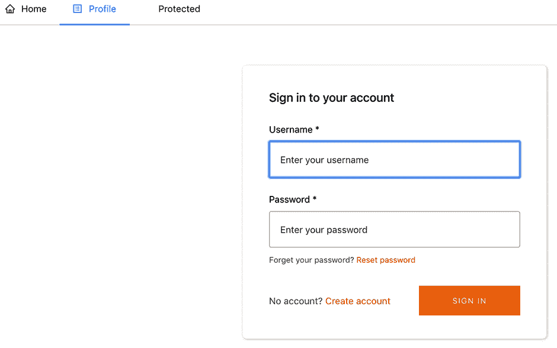

# 第四章：认证简介

*认证*和*身份*几乎是任何应用程序的重要组成部分。了解用户是谁、他们拥有哪些权限、是否已登录以及为当前已登录用户渲染正确视图和返回正确数据提供唯一标识符，这使得您的应用程序能够处理这些信息。

大多数应用程序需要机制来处理用户注册、用户登录、密码加密和更新，以及围绕身份管理的无数其他任务。现代应用程序通常需要像开放认证（OAUTH）、多因素认证（MFA）和基于时间的一次性密码（TOTP）等功能。

在过去，开发人员必须从头开始手动编写所有这些认证功能。单单完成这项任务可能需要一个开发团队数周，甚至数月的时间，并且必须确保安全性。今天有完全托管的认证服务，如 Auth0、Okta 和 Amazon Cognito，它们为我们处理了所有这些工作。

在本章中，您将学习如何在 React 应用程序中使用 Amazon Cognito 和 AWS Amplify 正确且安全地实现认证。

你将要构建的应用程序是一个基本应用程序，需要认证才能查看，并且还有一个显示登录用户个人资料信息的个人资料页面。如果用户已登录，则可以在*公共路由*、带有认证表单的*个人资料路由*以及仅对已登录用户可见的*受保护路由*之间导航。

如果用户未登录，则只能查看个人资料路由上的公共路由和认证表单。如果用户尝试在未登录时访问受保护路由，则我们希望将其重定向到认证表单，以便他们可以登录，然后在认证后访问路由。

该应用程序还将持续保留*用户状态*，因此如果他们刷新应用程序或离开并回到应用程序，他们将保持登录状态。

# 介绍 Amazon Cognito

Amazon Cognito 是 AWS 提供的一个完全托管的*身份服务*。Cognito 支持简单和安全的用户注册、登录、*访问控制*和*用户身份管理*。Cognito 可以扩展到数百万用户，并支持使用社交身份提供者（如 Facebook、Google 和 Amazon）进行登录。对于任何应用程序的前 50000 个用户，它还是免费的。

## Amazon Cognito 的工作原理

Cognito 主要由*用户池*和*身份池*两个组成部分：

用户池

这些提供了一个安全的用户目录，存储所有用户，并能够扩展到数亿用户。它是一个完全托管的服务。作为无服务器技术，用户池易于设置，无需担心搭建任何基础设施。用户池负责管理所有注册并登录账户的用户，这也是我们本章将重点关注的内容。

身份池

这些允许您授权已登录到应用程序的用户访问各种其他 AWS 服务。假设您希望允许用户访问 Lambda 函数以从另一个 API 获取数据；在创建身份池时，您可以指定这一点。用户池的作用在于，这些身份的来源可以是 Cognito 用户池，甚至是 Facebook 或 Google。

Cognito 用户池允许您的应用程序调用各种方法来管理用户身份的所有方面，包括以下项目：

+   注册用户

+   登录用户

+   登出用户

+   更改用户密码

+   重置用户密码

+   确认 MFA 验证码

## Amazon Cognito 与 AWS Amplify 集成

AWS Amplify 以多种方式支持 Amazon Cognito。首先，您可以直接从 Amplify CLI 创建和配置 Amazon Cognito 服务。一旦通过 CLI 创建了认证服务，您可以使用 Amplify JavaScript 客户端库从 JavaScript 应用程序中调用各种方法（如`signUp`、`signIn`和`signOut`）。

Amplify 还具有预配置的 UI 组件，可以让您仅需几行代码即可快速创建整个认证流程，适用于 React、React Native、Vue 和 Angular 等框架。

在本章中，您将使用 Amplify CLI、Amplify JavaScript 客户端和 Amplify React UI 组件的组合来构建一个演示*路由*、*认证*和*受保护路由*的应用程序。您还将使用 React Router 进行路由，并使用 Ant Design 为应用程序添加基本样式（参见图 4-1）。



###### 图 4-1\. 带有路由和认证的 React

# 创建 React 应用程序并添加 Amplify

您要做的第一件事是创建 React 应用程序，安装必要的依赖项，并创建 Amplify 项目。

要开始，请打开终端并创建一个新的 React 应用程序：

```
~ npx create-react-app basic-authentication
~ cd basic-authentication
```

然后安装 AWS Amplify、AWS Amplify React、React Router 和 Ant Design 库：

```
~ npm install aws-amplify @aws-amplify/ui-react antd react-router-dom
```

初始化一个新的 Amplify 项目：

```
~ amplify init

# Follow the steps to give the project a name, environment name, and set
  the default text editor.
# Accept defaults for everything else and choose your AWS Profile.
```

初始化了 Amplify 项目后，我们可以创建认证服务。要做到这一点，请运行以下命令：

```
~ amplify add auth

? Do you want to use the default authentication and security
  configuration? Default configuration
? How do you want users to be able to sign in? Username
? Do you want to configure advanced settings? No, I am done.
```

现在认证服务已配置完成，您可以使用`amplify push`命令部署它：

```
~ amplify push

? Are you sure you want to continue? Yes
```

认证服务已部署，现在让我们开始测试它。

## 客户端身份验证概述

使用 Amplify，在客户端实现身份验证的两种主要方式如下：

`Auth`类

Amplify 客户端库公开了一个`Auth`类，拥有超过 30 种不同的方法，允许您处理与用户管理相关的所有事务。一些可用方法的示例包括`Auth.signUp`、`Auth.signIn`和`Auth.signOut`。

使用此类，您可以根据应用程序的需求创建完全自定义的身份验证流程。为此，您必须自行管理所有的样式和应用程序状态。

特定于框架的身份验证组件

Amplify 中特定于框架的库为 React、React Native、Vue 和 Angular 暴露了用于管理身份验证的更高级抽象。这些组件将使用几行代码呈现整个（可定制的）身份验证流程。

在第一章中，您有机会尝试 AWS Amplify React 库中名为`withAuthenticator`的高阶组件（HOC）。在这里，您将使用此 HOC 以及路由来创建受保护的路由和仅在用户登录后才能查看的个人资料视图。

# 构建应用程序

下一步将是继续为应用程序创建文件和文件夹结构。

## 创建文件和文件夹结构

在您的应用程序中，在*src*目录中创建以下文件：

```
Container.js
Nav.js
Profile.js
Protected.js
Public.js
Router.js
```

这些文件执行以下操作：

*Container.js*

此文件将包含一个组件，您将使用它来为其他组件应用可重用的样式。

*Nav.js*

在这个组件中，您将创建一个导航界面。

*Profile.js*

此组件将呈现已登录用户的个人资料信息。这也是您将添加用于注册和登录的身份验证组件的组件。

*Protected.js*

这是我们将用作创建受保护路由示例的组件。如果用户已登录，则他们将能够查看此路由。如果他们未登录，则将被重定向到登录表单。

*Public.js*

这是一个基本路由，无论用户是否已登录，都可以查看。

*Router.js*

此文件将包含路由器和一些逻辑以确定当前路由名称。

现在这些文件已经创建好，您已经可以开始编写一些代码了。

## 创建第一个组件

首先，让我们创建用于应用程序的最简单的组件——`Container`组件。此组件将用于包装所有其他组件，以便我们可以在组件之间应用一些可重用的样式：

```
/* src/Container.js */
import React from 'react'

const Container = ({ children }) => (
  <div style={styles.container}>
    { children }
  </div>
)

const styles = {
  container: {
    margin: '0 auto',
    padding: '50px 100px'
  }
}

export default Container
```

使用此组件，您现在可以在整个应用程序中应用一致的样式，而无需重写样式。然后可以像这样使用它：

```
<Container>
  <h1>Hello World</h1>
</Container>
```

任何作为`Container`组件的子组件的内容都将使用`Container`组件中设置的样式进行渲染。这样做可以让您在一个地方控制样式。如果以后想要进行样式更改，只需调整一个组件即可。

## 公共组件

此组件简单地将路由名称渲染到 UI 中，并且无论用户是否已登录，都可以访问。在此组件中，您将使用`Container`组件添加一些填充和边距：

```
/* src/Public.js */
import React from 'react'
import Container from './Container'

function Public() {
  return (
    <Container>
      <h1>Public route</h1>
    </Container>
  )
}

export default Public
```

## 导航组件

`Nav`（导航）组件将利用 Ant Design 库和 React Router。Ant Design 将提供`Menu`和`Icon`组件以创建一个漂亮的菜单，而 React Router 将提供`Link`组件，以便我们可以链接并导航到应用程序的不同部分。

你还会注意到有一个传递给组件的`current`属性。该属性表示当前路由的名称。对于这个应用程序，该值将是`home`、`profile`或`protected`中的一个。`current`值将在`Router`组件中计算并作为属性传递给这个组件的`Menu`组件的`selectedKeys`数组中，用于突出显示导航栏中的当前路由。

```
/* src/Nav.js */
import React from 'react'
import { Link } from 'react-router-dom'
import { Menu } from 'antd'
import { HomeOutlined, ProfileOutlined, FileProtectOutlined } from
         '@ant-design/icons'

const Nav = (props) => {
  const { current } = props
  return (
    <div>
      <Menu selectedKeys={[current]} mode="horizontal">
        <Menu.Item key='home'>
          <Link to={`/`}>
            <HomeOutlined />Home
          </Link>
        </Menu.Item>
        <Menu.Item key='profile'>
          <Link to='/profile'>
          <ProfileOutlined />Profile
          </Link>
        </Menu.Item>
        <Menu.Item key='protected'>
          <Link to='/protected'>
            <FileProtectOutlined />Protected
          </Link>
        </Menu.Item>
      </Menu>
    </div>
  )
}

export default Nav
```

## Protected 组件

`Protected`组件将是受保护或私有的路由。如果尝试访问此路由的用户已登录，则他们将能够查看此路由。如果他们未登录，则将重定向到配置文件页面以注册或登录。

在这个组件中，你将会使用来自 React 的`useEffect`钩子和来自 AWS Amplify 的`Auth`类：

`useEffect`

这是一个 React 钩子，允许你在函数组件中执行副作用。该钩子接受一个函数，在函数第一次渲染时调用，可选择在每次额外渲染时再次调用。通过将空数组作为第二个参数传入，我们选择仅在组件加载时触发该函数。如果你曾在 React 类中使用过`componentDidMount`，`useEffect`具有类似的特性和用法。

`Auth`

这个 AWS Amplify 类处理用户身份管理。你可以使用这个类来完成从用户注册和登录到重置密码等所有操作。在这个组件中，我们将调用一个方法，`Auth.currentAuthenticatedUser`，来检查用户当前是否已登录，如果是，则返回有关已登录用户的数据。

```
/* src/Protected.js */
import React, { useEffect } from 'react';
import { Auth } from 'aws-amplify'
import Container from './Container'

function Protected(props) {
  useEffect(() => {
    Auth.currentAuthenticatedUser()
      .catch(() => {
        props.history.push('/profile')
      })
  }, [])
  return (
    <Container>
      <h1>Protected route</h1>
    </Container>
  );
}

export default Protected
```

当组件渲染时，我们通过在`useEffect`钩子中调用`Auth.currentAuthenticatedUser`来检查用户是否已登录应用程序。如果此 API 调用不成功，则意味着用户未登录，我们需要重定向他们。我们通过调用`props.history.push('/profile')`来重定向他们。

如果用户已登录，则我们不采取任何操作，并允许他们查看路由。

## Router 组件

`Router`组件将定义我们在应用程序中希望使用的组件和路由。

这个组件还将设置当前路由名称，该名称将根据`window.location.href`属性在`Nav`组件中使用，以突出显示当前路由。

你将从 React Router 中使用的组件是`HashRouter`、`Switch`和`Route`：

`HashRouter`

这是一个路由器，它使用 URL 的哈希部分（即*window.location.hash*）来保持 UI 与 URL 的同步。

`Switch`

`Switch`渲染与位置匹配的第一个子路由。这与仅使用路由器的默认功能不同，后者可能会渲染与位置匹配的多个路由。

`Route`

此组件允许您根据路径参数定义要渲染的组件：

```
/* src/Router.js */
import React, { useState, useEffect } from 'react'
import { HashRouter, Switch, Route } from 'react-router-dom'

import Nav from './Nav'
import Public from './Public'
import Profile from './Profile'
import Protected from './Protected'

const Router = () => {
  const [current, setCurrent] = useState('home')
  useEffect(() => {
    setRoute()
    window.addEventListener('hashchange', setRoute)
    return () =>  window.removeEventListener('hashchange', setRoute)
  }, [])
  function setRoute() {
    const location = window.location.href.split('/')
    const pathname = location[location.length-1]
    setCurrent(pathname ? pathname : 'home')
  }
  return (
    <HashRouter>
      <Nav current={current} />
      <Switch>
        <Route exact path="/" component={Public}/>
        <Route exact path="/protected" component={Protected} />
        <Route exact path="/profile" component={Profile}/>
        <Route component={Public}/>
      </Switch>
    </HashRouter>
  )
}

export default Router
```

在此组件的`useEffect`钩子内部，我们通过调用`setRoute`来设置路由名称。我们还设置了一个事件侦听器，以便在路由更改时调用`setRoute`。

在声明`Route`组件时，您可以将要渲染的组件作为`component`属性传递。

## 配置文件组件

完成应用程序的最后一个组件是`Profile`组件。此组件将执行以下几项任务：

+   如果用户未登录，则呈现身份验证表单。

+   提供注销按钮。

+   将用户的配置文件信息呈现到用户界面。

就像在第一章中一样，我们使用`withAuthenticator`高阶组件来通过包装默认导出的`Profile`组件来呈现认证流程。如果用户未登录，此流程将显示注册/登录表单；如果用户已登录，将显示带有用户配置文件详细信息的 UI。

要注销用户，我们使用`AmplifySignOut` UI 组件。此组件将注销用户并重新呈现 UI 以显示身份验证表单。

要显示用户配置文件数据，我们使用`Auth.currentAuthenticatedUser`方法。如果用户已登录，此方法将返回用户配置文件数据以及有关会话的信息。我们感兴趣的配置文件信息包括用户名和用户属性，例如电话号码、电子邮件以及用户注册时收集的其他信息：

```
/* src/Profile.js */
import React, { useState, useEffect } from 'react'
import { Auth } from 'aws-amplify'
import { withAuthenticator, AmplifySignOut } from '@aws-amplify/ui-react'
import Container from './Container'

function Profile() {
  useEffect(() => {
    checkUser()
  }, [])
  const [user, setUser] = useState({})
  async function checkUser() {
    try {
      const data = await Auth.currentUserPoolUser()
      const userInfo = { username: data.username, ...data.attributes, }
      setUser(userInfo)
    } catch (err) { console.log('error: ', err) }
  }
  return (
    <Container>
      <h1>Profile</h1>
      <h2>Username: {user.username}</h2>
      <h3>Email: {user.email}</h3>
      <h4>Phone: {user.phone_number}</h4>
      <AmplifySignOut />
    </Container>
  );
}

export default withAuthenticator(Profile)
```

## 样式化 UI 组件

在幕后，Amplify UI 组件是使用 Web 组件实现的。这意味着我们可以将它们作为一流的 HTML 元素进行 CSS 样式设置。我们希望我们的 UI 组件与应用程序中其余部分的蓝色匹配。为此，我们可以将以下 CSS 属性添加到*index.css*底部来定义我们想要使用的颜色：

```
/* src/index.css */

:root {
  --amplify-primary-color: #1890ff;
  --amplify-primary-tint: #1890ff;
  --amplify-primary-shade: #1890ff;
}
```

## 配置应用程序

现在应用程序已构建完成。我们唯一需要做的是更新*index.js*来导入路由器并添加 Amplify 配置。我们还要导入 Ant Design 库的必要 CSS：

```
/* src/index.js */
import React from 'react';
import ReactDOM from 'react-dom';
import './index.css';
import Router from './Router';
import 'antd/dist/antd.css';

import Amplify from 'aws-amplify'
import config from './aws-exports'
Amplify.configure(config)

ReactDOM.render(<Router />, document.getElementById('root'));
```

## 测试应用程序

要测试应用程序，我们现在可以运行`start`命令：

```
~ npm start
```

# 概述

恭喜，您已经使用路由和受保护路由构建了认证流程！

从本章中需要记住的一些事项如下：

+   使用`withAuthenticator`高阶组件快速启动和运行预配置的认证流程。

+   使用`Auth`类更精细地控制身份验证并获取有关当前已登录用户的数据。

+   Ant Design 帮助您使用预配置的设计快速启动，而无需编写任何特定于样式的代码。
