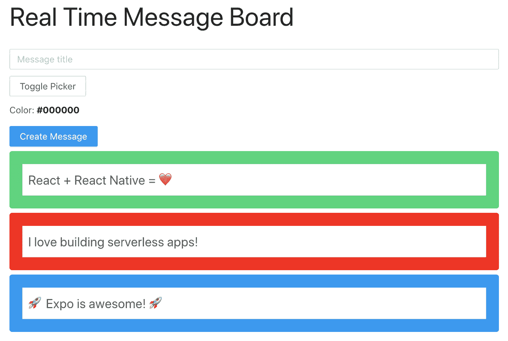

# 第九章：使用 Amplify DataStore 构建离线应用程序

到目前为止，在本书中，我们已经使用过 REST API 和 GraphQL API。在使用 GraphQL API 时，我们使用 API 类直接调用突变和查询。

Amplify 还支持与 AppSync 交互的另一种 API 类型：Amplify DataStore。DataStore 与传统的 GraphQL API 有所不同的方法。

与直接使用查询和突变与 GraphQL API 本身进行交互不同，DataStore 引入了一个客户端 SDK，允许您写入和从本地存储读取，并使用平台的本地存储引擎（例如，Web 使用 IndexDB，本地 iOS 和 Android 使用 SQLite）持久化此数据。随着本地和远程数据的更新，DataStore 会自动将本地数据同步到 GraphQL 后端。

使用 DataStore SDK，然后只需执行保存、更新和删除等操作，直接写入 DataStore 本身。当您连接到互联网时，DataStore 会同步您的数据到云端；如果您没有联网，则会将数据排队，等待下次连接时处理。

DataStore 还为您处理冲突检测和解决冲突，提供三种内置的冲突解决策略之一：

自动合并

在运行时检查对象上的 GraphQL 类型信息以执行合并操作（建议选项）。

乐观并发性

将最新写入的项目与传入记录的版本进行检查。

自定义

使用 Lambda 函数并写入任何自定义业务逻辑，以便在合并或拒绝更新时进行处理。

# 关于 Amplify DataStore

[Amplify DataStore](https://oreil.ly/Wv_TT) 是以下内容的结合：

+   AppSync GraphQL API

+   本地存储库和同步引擎，还可以离线持久化数据

+   用于与本地存储库交互的客户端 SDK

+   由 Amplify CLI 生成的特殊启用同步的 GraphQL 解析器，使服务器上的复杂冲突检测和冲突解决成为可能

## Amplify DataStore 概述

在开始使用 DataStore 时，您仍然会像在过去的章节中一样创建 API。主要区别在于，在创建 API 时，您将在 CLI 流程的高级设置中启用*冲突检测*。

从那里，要在客户端上启用 DataStore，我们需要为 DataStore 创建模型，以便与存储库进行交互。这可以通过使用您已有的 GraphQL 模式，并从 CLI 运行构建命令`amplify codegen models`轻松完成。

现在，您已经设置好了，可以开始与 DataStore 交互。

## Amplify DataStore 操作

要与 Store 进行交互，首先从 Amplify 导入`DataStore` API 和您想要使用的模型。从那里，您可以执行与存储相关的操作。

请参见表 9-1 了解一些可用操作。

表 9-1。Amplify DataStore 操作

| 操作 | 命令 |
| --- | --- |
| 导入模型和 DataStore API | `import { DataStore } from '@aws-amplify/datastore' import { Message} from './models'` |
| 保存数据 | `await DataStore.save( new Message({ title: 'Hello World', sender: 'Chris' }) ))` |
| 读取数据 | `const posts = await DataStore.query(Post)` |
| 删除数据 | `const message = await DataStore.query(Message, '123') DataStore.delete(message)` |
| 更新数据 | `const message = await DataStore.query(Message, '123') await DataStore.save( Post.copyOf(message, updated => { updated.title = 'My new title' }) )` |
| 观察/订阅数据变更以实现实时功能 | `const subscription = DataStore.observe(Message).subscribe(msg => { console.log(message.model, message.opType, message.element) });` |

## DataStore 谓词

您可以对 DataStore 应用谓词过滤器，使用在您的 GraphQL 类型上定义的字段，以及 DynamoDB 支持的以下条件：

```
Strings: eq | ne | le | lt | ge | gt | contains | notContains | beginsWith
            | between
Numbers: eq | ne | le | lt | ge | gt | between
Lists: contains | notContains
```

例如，如果您想要所有标题中包含“Hello”的消息列表：

```
const messages = await DataStore
  .query(Message, m =>
m.title('contains', 'Hello'))
```

您还可以将多个谓词链接为单个操作：

```
const message = await DataStore
  .query(Message, m => m.title('contains', 'Hello').sender('eq', 'Chris'))
```

这些谓词使您能够以许多方式从本地数据中检索不同的选择集。而不是在客户端检索整个集合并进行过滤，您可以精确地从存储中查询您需要的数据。

# 使用 Amplify DataStore 构建离线和实时应用程序

我们将构建一个实时和离线优先的消息板应用程序，如图 Figure 9-1 所示。



###### 图 9-1\. 实时消息板

应用程序的用户可以创建新消息，所有其他用户都将实时接收消息。如果用户离线，他们将继续能够创建消息。一旦上线，消息将与后端同步，并且其他用户创建的所有其他消息也将被获取并在本地同步。

我们的应用程序将针对 DataStore API 执行三种类型的操作：

`save`

在 DataStore 中创建新项目；在本地保存项目并在后台执行 GraphQL 变更。

`query`

从 DataStore 中读取；返回单个项目或列表（数组）并在后台执行 GraphQL 查询。

`observe`

监听数据变更（创建、更新、删除），并在后台执行 GraphQL 订阅。

让我们开始吧。

## 创建基础项目

要开始，我们将创建一个新的 React 项目，初始化一个 Amplify 应用程序并安装依赖项。

我们将首先创建 React 项目：

```
~ npx create-react-app rtmessageboard
~ cd rtmessageboard
```

接下来，我们将安装本地依赖项。

Amplify 支持全面安装 Amplify 和 *范围*（模块化）安装特定 API 的安装。范围化的包可以减少包大小，因为我们只安装正在使用的代码。由于我们只使用 DataStore API，我们可以安装范围化的 DataStore 包。

我们还将安装 Ant Design（`antd`）进行样式设计，React Color（`react-color`）用于易于使用的颜色选择器，并为 Amplify Core 配置创建作用域依赖项，以便仍然使用*aws-exports.js*配置 Amplify 应用：

```
~ npm install @aws-amplify/core @aws-amplify/datastore antd react-color
```

接下来，初始化一个新的 Amplify 项目：

```
~ amplify init

# Follow the steps to give the project a name, environment name, and set the
  default text editor.
# Accept defaults for everything else and choose your AWS Profile.
```

## 创建 API

现在我们将创建 AppSync GraphQL API：

```
~ amplify add api

? Please select from one of the below mentioned services: GraphQL
? Provide API name: rtmessageboard
? Choose the default authorization type for the API: API key
? Enter a description for the API key: public
? After how many days from now the API key should expire (1-365): 365 (or your
  preferred expiration)
? Do you want to configure advanced settings for the GraphQL API: Yes
? Configure additional auth types: N
? Configure conflict detection: Y
? Select the default resolution strategy: Auto Merge
? Do you have an annotated GraphQL schema: N
? Do you want a guided schema creation: Y
? What best describes your project: Single object with fields
? Do you want to edit the schema now: Y
```

使用以下类型更新模式：

```
type Message @model {
  id: ID!
  title: String!
  color: String
  image: String
  createdAt: String
}
```

现在我们已经创建了 GraphQL API，并且有一个 GraphQL 模式可以使用，我们可以为使用本地 DataStore API（基于 GraphQL 模式）的模型创建所需的模型：

```
~ amplify codegen models
```

这将在项目中创建一个名为*models*的新文件夹。使用此文件夹中的模型，我们可以开始与 DataStore API 交互。部署 API：

```
~ amplify push --y
```

后端部署完成后，我们可以开始编写客户端代码。

## 编写客户端代码

首先，在*src/index.js*中打开并在最后一个导入下方添加以下代码配置 Amplify 应用：

```
import 'antd/dist/antd.css'
import Amplify from '@aws-amplify/core'
import config from './aws-exports'
Amplify.configure(config)
```

注意，我们从`@aws-amplify/core`而不是`aws-amplify`进行导入。

接下来，在*App.js*中打开并使用以下代码更新它：

```
/* src/App.js */
import React, { useState, useEffect } from 'react'
import { SketchPicker } from 'react-color'
import { Input, Button } from 'antd'
import { DataStore } from '@aws-amplify/datastore'
import { Message} from './models'

const initialState = { color: '#000000', title: '' }
function App() {
  const [formState, updateFormState] = useState(initialState)
  const [messages, updateMessages] = useState([])
  const [showPicker, updateShowPicker] = useState(false)
  useEffect(() => {
    fetchMessages()
    const subscription = DataStore
      .observe(Message)
      .subscribe(() => fetchMessages())
    return () => subscription.unsubscribe()
  }, [])
  async function fetchMessages() {
    const messages = await DataStore.query(Message)
    updateMessages(messages)
  }
  function onChange(e) {
    if (e.hex) {
      updateFormState({ ...formState, color: e.hex})
    } else { updateFormState({ ...formState, [e.target.name]: e.target.value}) }
  }
  async function createMessage() {
    if (!formState.title) return
    await DataStore.save(new Message({ ...formState }))
    updateFormState(initialState)
  }
  return (
    <div style={container}>
      <h1 style={heading}>Real Time Message Board</h1>
      <Input
        onChange={onChange}
        name="title"
        placeholder="Message title"
        value={formState.title}
        style={input}
      />
      <div>
        <Button
        onClick={() => updateShowPicker(!showPicker)}
        style={button}
        >Toggle Color Picker</Button>
        <p>Color:
          <span
           style={{fontWeight: 'bold', color: formState.color}}>{formState.color}
          </span>
        </p>
      </div>
      {
        showPicker && (
          <SketchPicker
           color={formState.color}
           onChange={onChange} /
          >
        )
      }
      <Button type="primary" onClick={createMessage}>Create Message</Button>
      {
        messages.map(message => (
          <div
            key={message.id}
            style={{...messageStyle, backgroundColor: message.color}}
          >
            <div style={messageBg}>
              <p style={messageTitle}>{message.title}</p>
            </div>
          </div>
        ))
      }
    </div>
  );
}

const container = { width: '100%', padding: 40, maxWidth: 900 }
const input = { marginBottom: 10 }
const button = { marginBottom: 10 }
const heading = { fontWeight: 'normal', fontSize: 40 }
const messageBg = { backgroundColor: 'white' }
const messageStyle = { padding: '20px', marginTop: 7, borderRadius: 4 }
const messageTitle = { margin: 0, padding: 9, fontSize: 20  }

export default App
```

让我们逐步了解此组件中正在进行的最重要部分：

1.  我们还从 Amplify 导入`DataStore` API 以及`Message`模型。

1.  我们使用`useState`钩子创建三个组件状态的部分：

    `formState`

    此对象管理表单的状态，包括用于显示消息背景颜色的`title`和`color`。

    `messages`

    一旦从 DataStore 获取了消息数组，这将管理这些消息数组。

    `showPicker`

    这将管理一个布尔值，该值将被切换以显示和隐藏用于填充消息的`color`值的颜色选择器（默认情况下，颜色设置为黑色并保存在`formState`中）。

1.  当组件加载（在`useEffect`中）时，我们通过调用`fetchMessages`函数获取所有消息，并创建订阅（`DataStore.observe`）以监听消息更新。订阅触发时，我们再次调用`fetchMessages`函数，因为我们知道已经有更新，并且我们希望使用从 API 返回的最新数据更新应用。

1.  `fetchMessages`函数调用`DataStore.query`，然后使用返回的消息数组更新组件状态。

1.  `onChange`处理程序处理表单输入的更新以及更改颜色选择器。

1.  在`createMessage`中，我们首先检查确保标题字段已填写。如果填写了，我们使用`DataStore.save`保存消息，然后重置表单状态。

让我们来测试一下：

```
~ npm start
```

## 测试离线功能

尝试离线，创建新的突变，然后再次在线。您应该注意到，当再次在线时，应用程序将在数据库中创建在离线时创建的所有消息。

要验证此内容，请在 AWS 控制台中打开 AppSync API：

```
~ amplify console api

? Please select from one of the below mentioned services: GraphQL
```

接下来，点击数据源，然后打开消息表资源。现在您应该能看到消息表中的项目。

## 测试实时功能

为了测试实时功能，打开另一个浏览器窗口，这样你就可以在两个窗口中同时运行同一个应用程序。然后在一个窗口中创建一个新项目，看看更新是否会自动在另一个窗口中显示出来。

# 摘要

从本章中请记住以下几点：

+   Amplify 使两个不同的 API 能够与 AppSync 交互：`API` 类别以及 DataStore。

+   使用 DataStore 时，你不再直接向 API 发送 HTTP 请求。相反，你是在写入本地存储引擎，然后 DataStore 负责同步到云端。

+   Amplify DataStore 默认离线工作。
