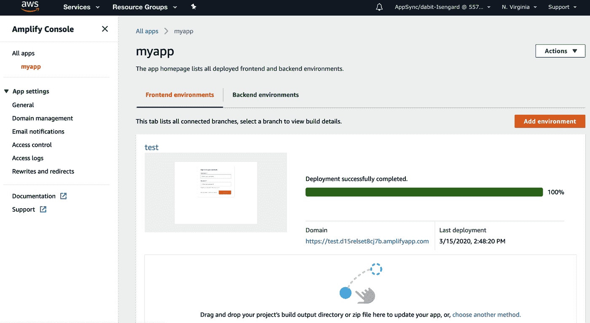
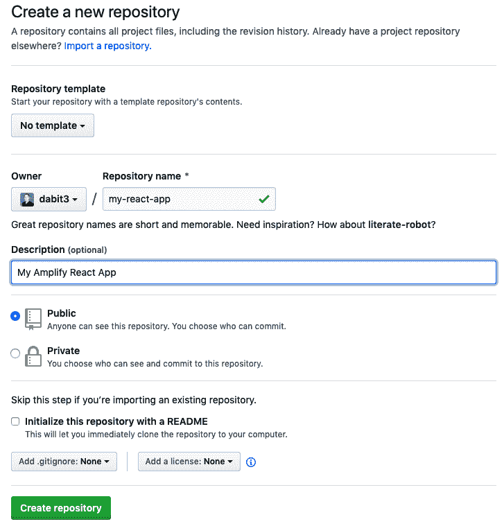
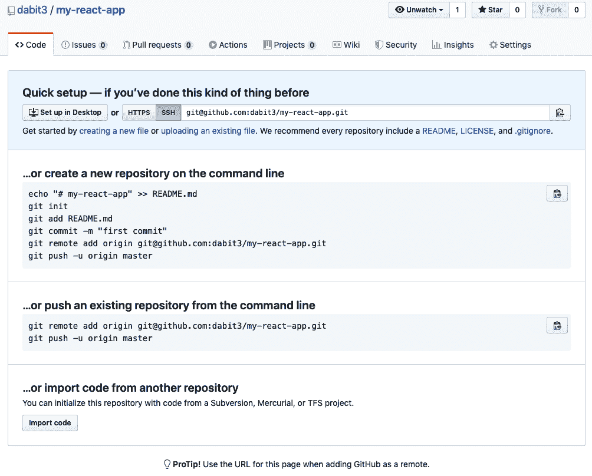

# 第十一章：托管：使用 CI 和 CD 将您的应用程序部署到 Amplify Console

现在我们已经看了如何构建我们的应用程序，接下来我们如何使它们在线并展示给世界看呢？在本章中，我们将看一些不同的使用 Amplify 的托管选项，以及如何使用自定义域名部署您的应用程序。

我们将使用的服务是 Amplify Console 托管服务。Amplify Console 是一个完全托管的托管服务，提供了一个简单的工作流程，用于部署静态站点和全栈无服务器应用程序。使用 Amplify Console，您可以使用 CLI、GitHub 仓库或手动方式部署您的代码，该服务将为您构建和部署您的应用程序。

当使用像 React、Vue、Angular 这样的框架，甚至像 Gatsby、Next 或 Nuxt 这样的框架时，通常需要运行一个*构建*阶段。这个阶段将使用像 webpack 这样的模块捆绑工具，将所有的 JavaScript、CSS 和图像文件创建为可部署的网站构建。

Amplify Console 将允许您配置应用程序的构建设置，以便当您准备部署新版本时，服务将能够获取您的原始文件，然后构建和部署您的应用程序到您的实时域名。

在本章中，我们将学习以下内容：

*基于 CLI 的部署*

使用我们的本地项目，我们将直接从 CLI 向 Amplify Console 托管部署一个应用程序。

*基于 Git 的部署*

使用 GitHub 仓库，我们将向 Amplify Console 托管部署一个应用程序，并学习如何在更改合并到主分支时触发新的构建。

*访问控制*

添加访问控制以通过用户名和密码限制对您分支的访问。

*自定义域名*

使用您的自定义域名进行部署。

让我们开始吧。

# 基于 CLI 的部署

在本节中，我们将学习如何直接从 CLI 将项目部署到 Amplify Console 托管。

要开始，请创建一个新的 React 应用程序：

```
~ npx create-react-app fullstack-app
~ cd full-stack-app
~ npm install aws-amplify @aws-amplify/ui-react
```

接下来，我们将初始化一个新的 Amplify 项目，并添加一个单一的服务，即身份验证：

```
~ amplify init
# Follow the steps to give the project a name, environment name, and set the
  default text editor.
# Accept defaults for everything else and choose your AWS Profile.

~ amplify add auth
? Do you want to use the default authentication and security configuration?
  Default configuration
? How do you want users to be able to sign in? Username
? Do you want to configure advanced settings? No, I am done.
```

当运行`init`命令时，我们将按照所有先前章节中的相同问题步骤进行操作。

我们被询问我们的源和分发目录是什么，以及构建命令是什么。默认情况下，Amplify CLI 将检测框架，并为您设置这些值，对于像我们的 React 项目这样的流行框架。

如果您使用的是 Amplify CLI 不认可的框架，或者有自定义的构建配置，您可能需要将这些值设置为不同的值。

要添加托管，我们可以使用`hosting`类别：

```
~ amplify add hosting

? Select the plugin module to execute: Hosting with Amplify Console
? Choose a type: Manual Deployment
```

接下来，让我们更新我们的前端代码，添加一个基本的问候语和认证功能。

首先打开*src/index.js*，并通过在最后一个导入项下添加以下代码配置 Amplify 应用程序：

```
import Amplify from 'aws-amplify'
import config from './aws-exports'
Amplify.configure(config)
```

然后更新*src/App.js*，添加以下代码：

```
import React from 'react'
import logo from './logo.svg'
import './App.css'

import { withAuthenticator } from '@aws-amplify/ui-react'

function App() {
  return (
    <div className="App">
      <header className="App-header">
        
        <h1>Hello World!</h1>
      </header>
    </div>
  );
}

export default withAuthenticator(App, { includeGreetings: true })
```

我们的应用现在已准备部署。要同时部署前端和后端，可以运行`publish`命令。`publish`命令将前端和后端代码都部署到 Amplify 控制台：

```
~ amplify publish
```

现在，我们应该能够在控制台中查看应用程序，包括前端部署和后端服务配置：

```
~ amplify console
```

从 Amplify 控制台仪表板，点击刚刚部署的应用程序名称。在这里，您应该能够看到一个切换按钮，可以查看前端（*前端环境*）以及后端（*后端环境*）部署，如图 11-1 所示。



###### 图 11-1\. Amplify 控制台概述

从*前端环境*视图中，您应该能够点击域名以查看 Amplify 控制台托管的实时网站。域名 URL 应该看起来像这样：

```
https://env_name.deployment_id.amplifyapp.com
```

在左侧菜单中，有关自定义域名的域管理选项（在“自定义域名”中介绍）、构建事件的电子邮件通知、访问控制（本章我们将讨论的内容）、日志和重定向等选项。

当您更新并需要部署新版本时，可以再次运行`publish`命令以部署应用程序的更新版本。

# 基于 Git 的部署

现在让我们看看如何通过存储在 GitHub 仓库中的 Amplify 应用程序启用基于 Git 的部署。虽然从本地项目部署效果很好，但很多时候你会使用 Git 仓库进行个人或团队开发。Amplify 控制台支持 Git-based 托管应用程序，同时内置功能支持合并时自动部署和特性分支部署（将分支部署与每个特性分支链接起来）。

让我们看看如何将我们已经构建的应用程序从 GitHub 仓库部署到 Amplify 控制台。

第一步是删除我们设置的现有 Amplify 后端：

```
~ amplify delete
```

然后，创建一个新的 Amplify 应用并添加认证：

```
~ amplify init
# Follow the steps to give the project a name, environment name, and set the
  default text editor.
# Accept defaults for everything else and choose your AWS Profile.

~ amplify add auth
? Do you want to use the default authentication and security configuration?
  Default configuration
? How do you want users to be able to sign in? Username
? Do you want to configure advanced settings? No, I am done.
```

现在，使用 Amplify 的`push`命令部署后端：

```
~ amplify push
```

现在我们需要创建一个 GitHub 仓库来存放应用程序。

## 创建 GitHub 仓库

接下来需要做的是转到 GitHub.com 并创建一个新的仓库。我将创建一个名为*my-react-app*的新仓库，如图 11-2 所示。



###### 图 11-2\. 创建 GitHub 仓库

创建仓库后，您将获得一个类似于图 11-3 所示的仓库 URI：

```
git@github.com:dabit3/my-react-app.git
```



###### 图 11-3\. GitHub 项目 URI

复制此仓库 URI 并返回到命令行。在这里，我们将在本地应用程序中初始化一个新的 GitHub 项目：

```
~ git init
~ git remote add origin git@github.com:your_github_username/my-react-app.git
```

然后，将要跟踪的文件添加并将更改推送到我们的仓库：

```
~ git add .
~ git commit -m 'initial commit'
~ git push origin master
```

现在应用程序已推送至 GitHub，我们可以连接到 Amplify 控制台托管。为此，让我们通过 CLI 添加它：

```
~ amplify add hosting

? Select the plugin module to execute: Hosting with Amplify Console
? Choose a type: Continuous deployment (Git-based deployments)
```

###### 注意

CLI 应该会在您的 Web 浏览器中打开 Amplify Console，使您能够选择 GitHub 作为您的源代码提供者。

1.  作为您的第一步（在 Amplify Console 中），选择 GitHub 作为源代码提供者，然后单击连接分支。

1.  接下来，使用 GitHub 登录，然后选择您刚创建的新仓库和主分支。单击下一步。

1.  在配置构建设置页面中，当要求“选择后端环境”时，请选择您已经创建的环境名称。

1.  接下来，在配置构建设置页面中，当要求“选择现有服务角色或创建新角色以便 Amplify Console 可以访问您的资源”时，请单击创建新角色以创建新的 IAM 角色：

    1.  单击下一步：权限，下一步：标签，下一步：审查，然后创建角色以创建新的 IAM 角色。

    1.  返回到配置构建设置页面，单击刷新按钮，并从下拉菜单中选择新创建的角色。

1.  单击下一步。

1.  在审查页面中，单击保存并部署以部署应用程序。

应用程序现已部署到 Amplify Console，并将开始新的构建。构建完成后，您应该会收到一个实时 URL 来查看您的应用程序。

## 基于 Git 的 CI/CD

现在应用程序已部署完成，让我们看看如何将 CD 实施到应用程序中。

基于 Git 的 CI/CD 的基本思想是，您可以通过直接推送到 Git 来部署和测试任何分支的构建。一旦合并更改，将启动新的构建并为您提供一个实时 URL 供您尝试。

这样，您可以进行功能/分支部署，如 *prod*（用于生产）、*dev*（用于开发）和 *feature_name*（用于新功能）。以这种方式构建时，您可以在实时环境中测试新的更改，不仅测试前端而且测试后端更改。

让我们尝试启动一个新的构建。为此，请对其中一个本地文件进行更改。更新 *src/App.js* 的一些文本，然后添加更改并推送到 GitHub：

```
~ git add .
~ git commit -m 'updates to App.js'
~ git push origin master
```

现在，当您在 Amplify Console 中打开应用程序时，您应该注意到已为您自动启动了新的构建。

# 访问控制

接下来，让我们看看如何启用访问控制以保护我们的部署。

使用访问控制，您可以指定访问者必须具有用户名和密码才能查看部署或特定分支部署。如果您正在测试希望对外团队保持不可发现的新私有功能，这将特别有用。

下面是如何启用访问控制的方法：

1.  在左侧菜单中，单击访问控制。

1.  接下来，单击管理访问。

1.  在这里，对于主分支，请将访问设置设置为受限，然后设置用户名和密码。

现在，打开部署的 URL。您会注意到，如果不输入用户名和密码，您将无法查看它。

在访问控制菜单中，您还可以选择按分支设置访问控制。

# 自定义域名

最后，让我们学习如何为我们的应用程序使用自定义域名。

要启用自定义域名，我们需要做三件事情：

+   在 Amazon Route53 中添加域名。

+   在域名提供商的 DNS 设置中设置域名。

+   配置 Amplify 控制台应用程序以使用在 Route53 中添加的域名。

让我们详细介绍如何做到这一点：

1.  在 AWS 主仪表板的服务下拉菜单中搜索或点击 Route53。

1.  点击托管区域。

1.  点击创建托管区域。

1.  通过向域名输入字段添加 URL 来设置域名，然后点击创建。

创建托管区域后，您将获得四个名称服务器值。在下一步中您将需要这些值，所以请将它们保持方便。您也可以随时通过访问 Route53 仪表板并点击您想要检索值的域名来返回到它们。名称服务器看起来可能是这样的：

```
ns-1020.awsdns-63.net
ns-1523.awsdns-62.org
ns-244.awsdns-30.com
ns-1724.awsdns-23.co.uk
```

1.  现在，进入您的托管账户（例如 GoDaddy 或 Google Domains），并在您正在使用的域名的 DNS 设置中设置这些自定义名称服务器。

1.  接下来，在您想要启用自定义域名的应用的 Amplify 控制台中，点击左侧菜单中的域名管理，然后点击添加域名按钮。

1.  在这里，下拉菜单应该显示您在 Route53 中拥有的域名。选择这个域名，然后点击配置域名。

这将部署应用到您的自定义域名（DNS 传播需要 5 至 30 分钟）。

# 摘要

本章需要记住的几点内容：

+   Amplify 控制台同时托管后端和前端部署。

+   将前端部署到 Amplify 控制台有两种主要方法，可以从您的本地项目或从 Git 存储库进行。您还可以手动上传项目或从 Dropbox 托管它们。

+   一旦您的应用程序被托管，您可以通过在 Amplify 控制台中配置部署来设置诸如密码保护、自定义域名和分支部署等功能。
