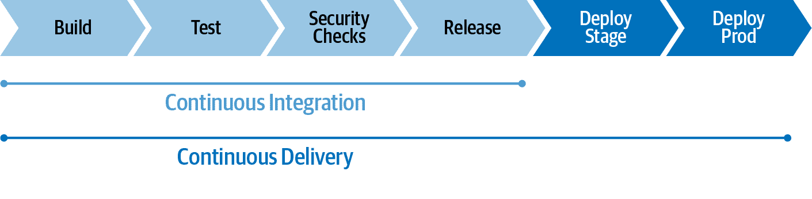
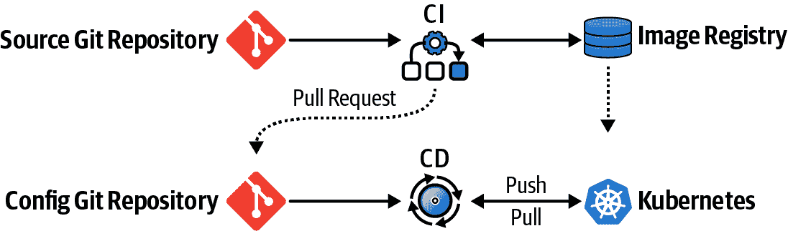
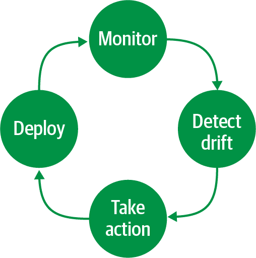
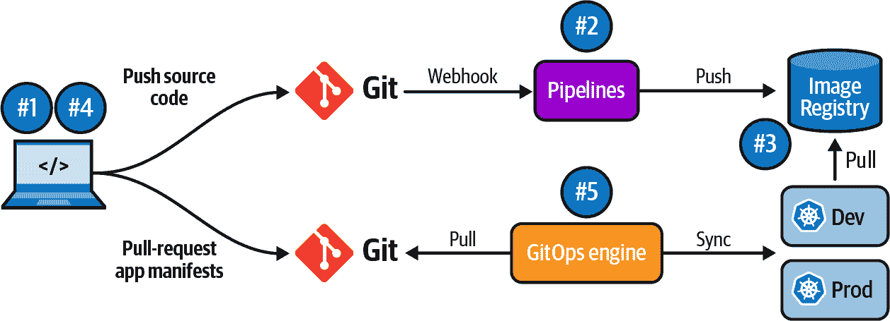
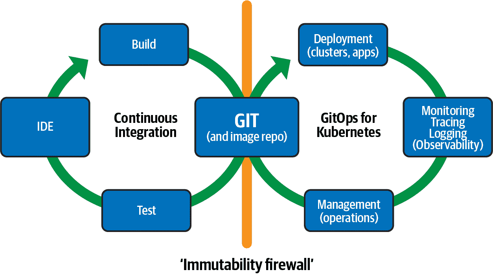

# 第一章介绍

随着基础设施即代码（IaC）等实践的出现，软件开发已经推动了可以运行应用程序的平台的边界。随着可编程的、API 驱动的平台如公共云和开源基础设施解决方案的普及，这种情况变得更为频繁。几年前开发人员只关注应用程序源代码，而今天他们也有机会编写应用程序运行的基础设施。这给予了控制权并实现了自动化，大大缩短了交付时间。

Kubernetes 是一个流行的开源容器工作负载编排平台，也是在公有或私有云上运行生产应用程序的事实标准。该平台的开放性和可扩展性使得自动化成为可能，从而降低了交付风险并提高了服务质量。此外，这种强大的范式还通过一个越来越受欢迎的方法扩展，称为 GitOps。

# 1.1 什么是 GitOps？

GitOps 是一种利用 Git 仓库作为单一真相源来交付基础设施即代码的方法和实践。它借鉴了 DevOps 文化的支柱和方法，并提供了一个开始实现结果的框架。GitOps 与 DevOps 的关系密切，因为 GitOps 已成为实施和增强 DevOps、平台工程和 SRE 的流行选择。

GitOps 是一种不可知的方法，可以使用诸如 Git、Kubernetes 和 CI/CD 解决方案等工具构建 GitOps 框架。GitOps 的三大支柱是：

+   Git 是唯一的真相之源

+   将一切视为代码

+   操作通过 Git 工作流进行

GitOps 有一个活跃的社区，[GitOps 工作组](https://oreil.ly/FUbBy) 在 [OpenGitOps](https://opengitops.dev) 提供了一套 GitOps 原则（当前版本为 1.0.0）：

声明式

由 GitOps 管理的系统必须通过声明方式表达其期望状态。

版本化和不可变

期望状态存储在一种强制不可变和版本化的方式中，并保留完整的版本历史记录。

自动拉取

软件代理自动从源中拉取期望状态声明。

持续协调

软件代理持续监控实际系统状态，并尝试应用期望状态。

# 1.2 为什么选择 GitOps？

使用开发人员熟悉的常见基于 Git 的工作流程，GitOps 扩展了从应用程序开发到部署、应用生命周期管理和基础设施配置的现有流程。

应用程序整个生命周期中的每一次变更都在 Git 仓库中进行跟踪，并且可审计。这种方法对开发人员和运维团队都有益，因为它增强了快速跟踪和重现问题的能力，从而提高了整体安全性。其中一个关键点是减少不需要的变更（漂移），并在它们进入生产环境之前进行更正。

以下是 GitOps 在四个关键方面采用的好处摘要：

标准工作流程

使用应用开发团队熟悉的工具和 Git 工作流程

增强安全性

在部署前审查变更，检测配置漂移，并采取行动

可见性与审计

通过 Git 历史捕获和跟踪对集群的任何更改

多集群一致性

可靠且一致地配置多个环境和多个 Kubernetes 集群及其部署

# 1.3 Kubernetes CI/CD

持续集成（CI）和持续交付（CD）是通过将自动化引入应用开发阶段来频繁交付应用的方法。CI/CD 流水线是 GitOps 最常见的用例之一。

在典型的 CI/CD 流水线中，提交的代码检查 CI 过程，而 CD 过程则检查并应用诸如安全性、基础设施即代码或应用框架设定的其他要求。所有代码更改都被跟踪，使得更新变得简单，同时在需要回滚时提供版本控制。CD 是 GitOps 的领域，它与 CI 部分一起工作，以在多个环境中部署应用，如 图 1-1 所示。

###### 图 1-1\. 持续集成与持续交付

使用 Kubernetes，可以轻松实现集群内的 CI/CD 流水线。您可以使用 CI 软件创建代表您的应用程序的容器映像，并将其存储在容器映像注册表中。然后，像拉取请求这样的 Git 工作流程可以更改 Kubernetes 清单，说明应用程序的部署，并启动 CD 同步循环，如 图 1-2 所示。

###### 图 1-2\. 应用部署模型

本教程将展示在 Kubernetes 上作为 CI/CD 和 GitOps 平台实施此模型的实用配方。

# 1.4 在 Kubernetes 上使用 GitOps 进行应用部署

由于 GitOps 是一种平台无关的方法，Kubernetes 上的应用部署模型可以是集群内或多集群的。外部的 GitOps 工具可以将 Kubernetes 视为部署应用的目标平台。同时，集群内方法在 Kubernetes 内部运行 GitOps 引擎，用于部署应用并同步一个或多个 Kubernetes 集群中的清单文件。

GitOps 引擎负责 CI/CD 流水线的 CD 部分，并完成 GitOps 循环，该循环由四个主要操作组成，如 图 1-3 所示：

部署

从 Git 部署清单。

监视

监视 Git 仓库或集群状态。

检测漂移

从 Git 描述的内容和集群中实际存在的内容中检测任何变更。

采取行动

执行反映 Git 上内容的操作（回滚或三向差分）。Git 是事实真相，任何更改都通过 Git 工作流程执行。

###### 图 1-3\. GitOps 循环

在 Kubernetes 中，使用 GitOps 方法部署应用程序至少使用两个 Git 存储库：一个用于应用程序源代码，另一个用于描述应用程序部署的 Kubernetes 清单（如 Deployment、Service 等）。

Figure 1-4 展示了 Kubernetes 上 GitOps 项目的结构。

###### 图 1-4\. Kubernetes GitOps 循环

以下列表概述了工作流程中的项目：

1.  应用程序源代码存储库

1.  CI 管道创建容器镜像

1.  容器镜像注册表

1.  Kubernetes 清单存储库

1.  GitOps 引擎将清单同步到一个或多个集群并检测漂移

# 1.5 DevOps 与敏捷性

GitOps 是一种以开发者为中心的持续交付和基础设施运营方法，通过 Git 进行开发工作流的自动化。与敏捷软件开发互补，GitOps 对基础设施自动化和应用程序生命周期管理对 DevOps 也是互补的。如你在 Figure 1-5 中所见，这是一个用于自动化运营的开发者工作流程。

敏捷方法论中最关键的一个方面是减少[上线时间](https://oreil.ly/r52pg)，这更抽象地描述为从识别需求到其实现所经过的时间。

###### 图 1-5\. GitOps 开发循环

缩短这段时间是基础性的，并需要 IT 组织文化上的变革。看到应用程序实时运行为开发者提供了一个反馈循环，重新设计和改进他们的代码，使项目蓬勃发展。类似于 DevOps，GitOps 在业务流程中也需要文化的采纳。所有操作，如应用程序部署或基础设施更改，只能通过 Git 工作流程来完成。有时，这意味着一种文化的转变。

[“Teaching Elephants to Dance (and Fly!)”](https://oreil.ly/gPja9) 演讲由 Burr Sutter 提供了关于背景的清晰理解。大象代表了你的组织当前所处的位置。在传统和现代环境之间的变化阶段，由 GitOps 工具驱动。一些组织有幸可以从头开始，但对于许多企业来说，挑战在于教会他们沉重的大象像优雅的芭蕾舞者一样跳舞。
