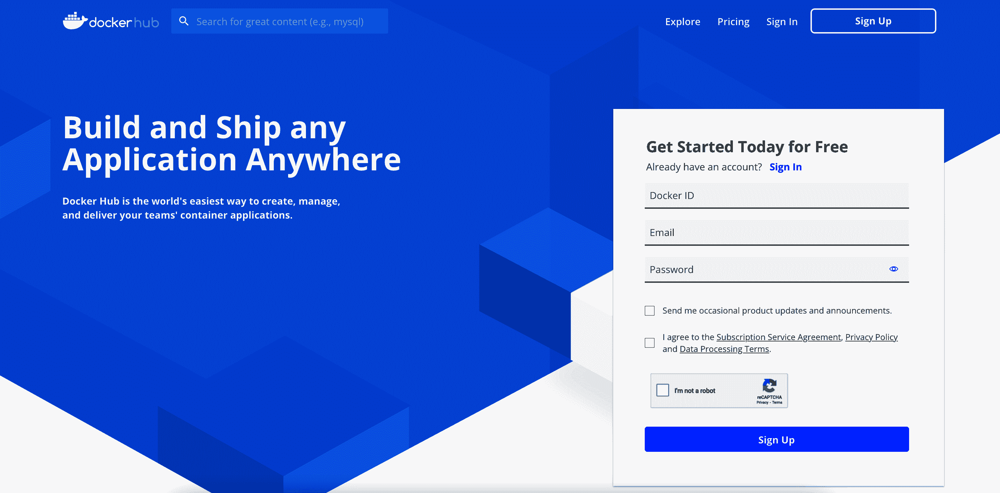
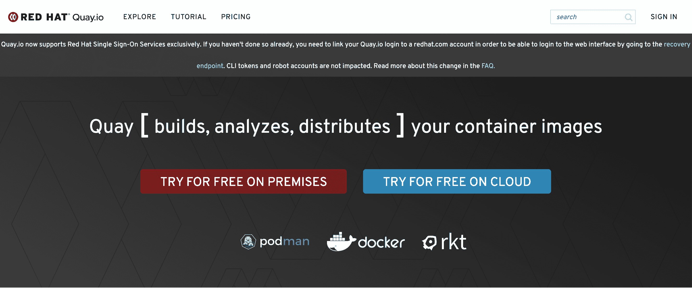
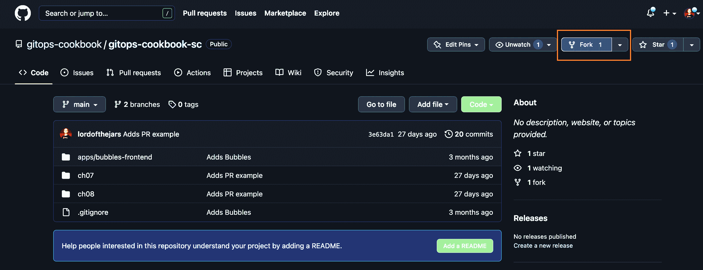
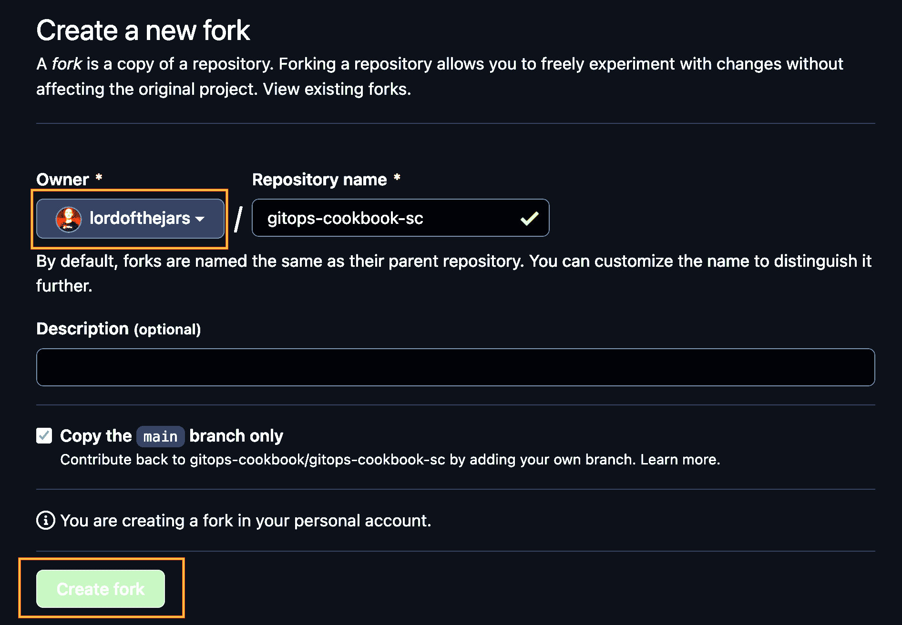
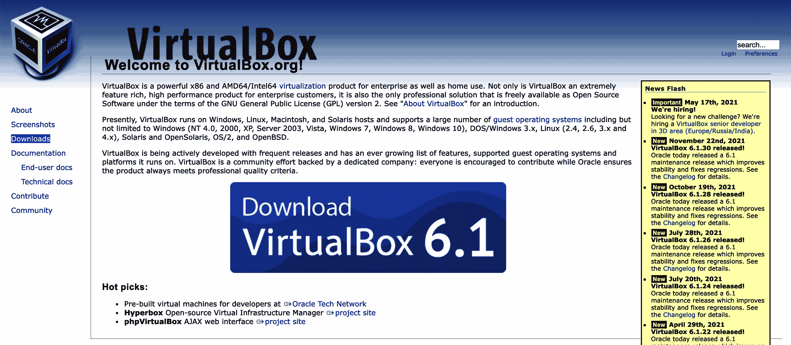
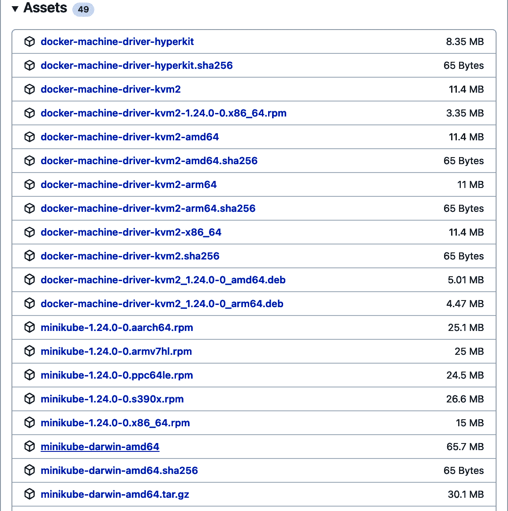

# 第二章：要求

本书涉及 GitOps 和 Kubernetes，因此您需要一个容器注册表来发布本书中构建的容器（参见 Recipe 2.1）。

此外，实施 GitOps 方法论需要一个 Git 服务；您将学习如何注册公共 Git 服务，如 GitHub 或 GitLab（参见 Recipe 2.2）。

最后，最好拥有一个 Kubernetes 集群来运行本书中的示例。尽管我们将展示如何安装 Minikube 作为 Kubernetes 集群（参见 Recipe 2.3），并且本书已经在 Minikube 上进行了测试，任何 Kubernetes 安装也应该适用。

让我们准备您的笔记本电脑以执行本书提供的配方。

# 2.1 注册容器注册表

## 问题

您希望为容器注册表服务创建一个帐户，以便可以存储生成的容器。

## 解决方案

在您阅读本书时，可能需要将一些容器发布到公共容器注册表。使用 Docker Hub（`docker.io`）发布容器。

如果您已经拥有 `docker.io` 的帐户，可以跳过以下步骤。否则，请继续阅读以了解如何注册帐户。

## 讨论

访问[DockerHub](https://hub.docker.com)注册一个帐户。页面应类似于图 2-1。



###### 图 2-1\. DockerHub 注册页面

当页面加载时，填写表单设置 Docker ID、电子邮件和密码，并点击“注册”按钮。

当您注册并确认帐户后，您将可以在前面步骤中的 Docker ID 下发布容器。

## 参见

另一个流行的容器注册表服务是 quay.io。它可以在云上使用（类似于 docker.io）或者在本地安装。

访问[该网站](https://quay.io)以获取有关 Quay 的更多信息。页面应类似于图 2-2。



###### 图 2-2\. Quay 注册页面

# 2.2 注册 Git 仓库

## 问题

您希望为 Git 服务创建一个帐户，以便可以将源代码存储在仓库中。

## 解决方案

在本书中，您可能需要将一些源代码发布到公共 Git 服务。使用 GitHub 作为 Git 服务来创建和派生 Git 仓库。

如果您已经有 GitHub 帐户，可以跳过以下步骤；否则，请继续阅读以了解如何注册帐户。

## 讨论

访问[GitHub 网页](https://github.com)注册一个帐户。页面应类似于图 2-3。


###### 图 2-3\. GitHub 欢迎页面进行注册

当页面加载时，点击“注册 GitHub”按钮（见图 2-3）并按照说明操作。登录页面应类似于图 2-4。


###### 图 2-4\. GitHub 登录页面

当您注册并确认帐户后，您将准备好开始在 GitHub 帐户中创建或分叉 Git 仓库。

同时，您需要将[书籍源代码仓库](https://oreil.ly/uqjTA)分叉到您的帐户中。点击图 2-5 中显示的分叉按钮。



###### 图 2-5\. 分叉按钮

然后在 Owner 部分选择您的帐户（如果尚未选择），并点击“创建分叉”按钮，如图 2-6 所示。



###### 图 2-6\. 创建分叉按钮

要跟随下一章节中的示例，请在本地克隆这本书的仓库。如果未明确提到，我们将使用[章节仓库](https://github.com/gitops-cookbook/chapters)中提供的示例：

```
git clone https://github.com/gitops-cookbook/chapters
```

## 参见

另一个流行的 Git 服务是 GitLab。它可以在云上或本地安装使用。

访问[GitLab](https://about.gitlab.com)获取更多信息。

# 2.3 创建本地 Kubernetes 集群

## 问题

您想在本地启动 Kubernetes 集群。

## 解决方案

在这本书中，您可能需要一个 Kubernetes 集群来运行大多数的示例。使用 Minikube 在本地机器上启动 Kubernetes 集群。

## 讨论

Minikube 使用 Docker、Podman、Hyperkit、Hyper-V、KVM 或 VirtualBox 等容器/虚拟化技术，在 Linux 机器上启动一个带有 Kubernetes 集群的 Linux 系统。

为了简便起见并且能在大多数平台上使用，我们将使用 VirtualBox 作为虚拟化系统。

要安装 VirtualBox（如果尚未安装），请访问[主页](https://oreil.ly/T93oU)，并点击下载链接，如图 2-7 所示。

###### 注意

对于使用 macOS 的用户，在 macOS Monterey 和 VirtualBox 6.1 上测试了以下说明。在撰写本书时，使用 ARM 版本或 macOS Ventura 时存在一些不兼容性。



###### 图 2-7\. VirtualBox 主页

根据操作系统选择软件包，下载并安装到计算机上。安装 VirtualBox 后（我们使用了 6.1.x 版本），下一步是下载 Minikube 并启动集群。

访问[GitHub 仓库](https://oreil.ly/mmwVP)，展开“资产”部分，并下载符合您平台规格的 Minikube 文件。例如，在 AMD Mac 上，您应选择 *minikube-darwin-amd64*，如图 2-8 所示。

解压文件（如果需要），并将其复制为 *minikube* 的名称放在 PATH 环境变量可访问的目录中，例如 Linux 或 macOS 中的 `/usr/local/bin`。

安装了 VirtualBox 和 Minikube 后，我们可以在本地机器上启动 Kubernetes 集群。让我们安装 Kubernetes 版本 1.23.0，因为这是撰写本书时的最新版本（当然，也可以使用任何之前的版本）。



###### 图 2-8\. Minikube 发行页面

在终端窗口中运行以下命令，分配 8 GB 内存来启动 Kubernetes 集群：

```
minikube start --kubernetes-version='v1.23.0' /
--driver='virtualbox' --memory=8196 -p gitops   
```


创建一个版本为 1.23.0 的 Kubernetes 集群


使用 VirtualBox 作为虚拟化工具


为集群创建一个配置文件名 (`gitops`) 以便以后引用它

输出行应类似于：

```
[gitops] Minikube v1.24.0 on Darwin 12.0.1
 Using the virtualbox driver based on user configuration
Starting control plane node gitops in cluster gitops 
Creating virtualbox VM (CPUs=2, Memory=8196MB, Disk=20000MB) ...
    > kubeadm.sha256: 64 B / 64 B [--------------------------] 100.00% ? p/s 0s
    > kubelet.sha256: 64 B / 64 B [--------------------------] 100.00% ? p/s 0s
    > kubectl.sha256: 64 B / 64 B [--------------------------] 100.00% ? p/s 0s
    > kubeadm: 43.11 MiB / 43.11 MiB [---------------] 100.00% 3.46 MiB p/s 13s
    > kubectl: 44.42 MiB / 44.42 MiB [---------------] 100.00% 3.60 MiB p/s 13s
    > kubelet: 118.73 MiB / 118.73 MiB [-------------] 100.00% 6.32 MiB p/s 19s

    ▪ Generating certificates and keys ...
    ▪ Booting up control plane ... 
    ▪ Configuring RBAC rules ...
    ▪ Using image gcr.io/k8s-minikube/storage-provisioner:v5
...

  Verifying Kubernetes components...
Enabled addons: storage-provisioner, default-storageclass

 /usr/local/bin/kubectl is version 1.21.0, which
may have incompatibilites with Kubernetes 1.23.0. 
    ▪ Want kubectl v1.23.0? Try 'minikube kubectl -- get pods -A'
Done! kubectl is now configured to use "gitops" cluster and
 "default" namespace by default 
```


启动 `gitops` 集群


启动 Kubernetes 集群控制平面


检测到我们有一个旧版本的 `kubectl` 工具


集群已启动并运行

为了与 Kubernetes 集群和 Kubernetes CLI 工具版本保持一致，您可以下载 `kubectl` 1.23.0 版本，运行自 *https://dl.k8s.io/release/v1.23.0/bin/darwin/amd64/kubectl*。

###### 注意

您需要将 `darwin/amd64` 更改为您的特定架构。例如，在 Windows 上可能是 `windows/amd64/kubectl.exe`。

将 `kubectl` CLI 工具复制到一个由 `PATH` 环境变量访问的目录中，例如在 Linux 或 macOS 中 (`/usr/local/bin`)。

## 参见

在本地机器上运行 Kubernetes 的其他方法还有很多。

非常受欢迎的一个是 [kind](https://oreil.ly/8B2bH)。

虽然本书中的示例应适用于任何 Kubernetes 实现，因为只使用了标准资源，但我们只在 Minikube 上进行了测试。
