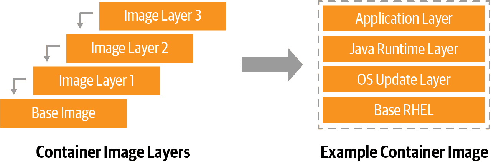
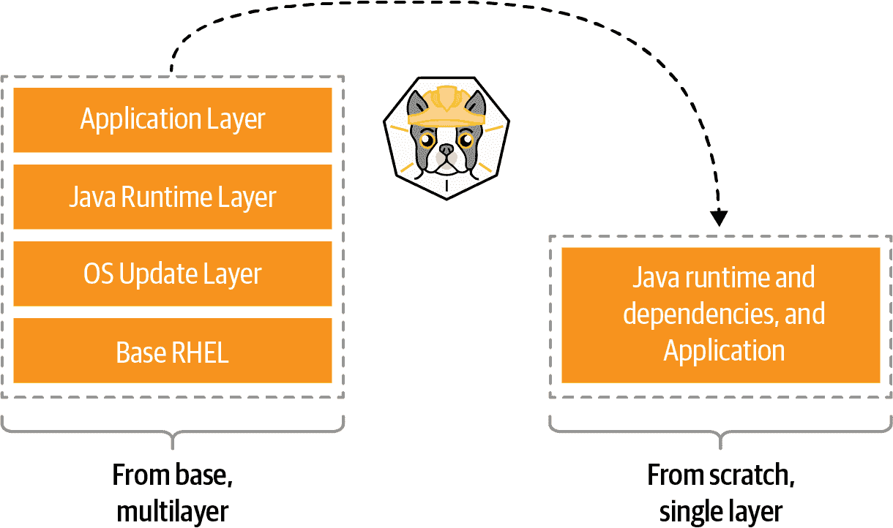
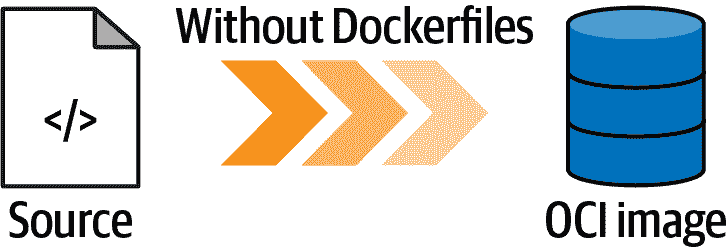
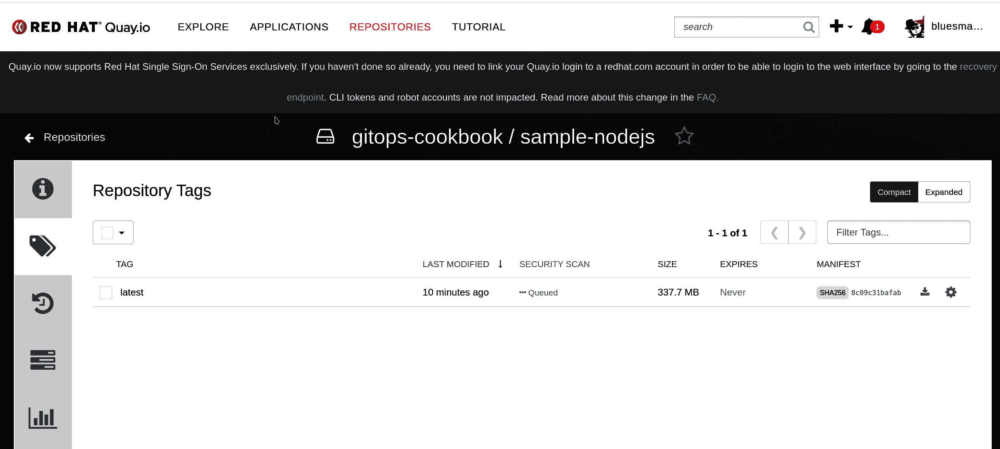

# 第三章：容器

容器是打包应用程序的流行和标准格式。这种格式是由[开放容器倡议（OCI）](https://opencontainers.org)推广的一种开放标准，是为了在容器格式和运行时周围创建开放行业标准的开放治理结构。这种格式的开放性确保了在不同操作系统、供应商、平台或云上的可移植性和互操作性。Kubernetes 运行容器化应用程序，因此在进入 GitOps 方法管理 Kubernetes 上的应用程序之前，我们提供了一些有用的配方，帮助您了解如何将应用程序打包为容器镜像。

创建镜像的第一步是使用容器引擎打包应用程序，构建包含基础操作系统和额外层（如运行时、库和应用程序）的分层结构。Docker 是广泛使用的开源容器引擎和运行时实现，可以通过指定一个称为 Dockerfile 的清单生成容器镜像（见配方 3.1）。

由于格式开放，可以使用其他工具创建容器镜像。[Docker](https://www.docker.com)，一个流行的容器引擎，需要安装并执行一个*守护程序*来处理容器引擎的所有操作。开发者可以使用软件开发工具包（SDK）与 Docker 守护程序进行交互，或者使用像 JiB 这样的*无 Docker*解决方案来创建容器镜像（见配方 3.2）。

如果不想依赖特定的编程语言或 SDK 来构建容器镜像，可以使用另一个*无守护程序*解决方案，如 Buildah（见配方 3.3）或 Buildpacks（见配方 3.4）。这些是构建 OCI 容器镜像的其他流行开源工具。通过避免依赖操作系统，这些工具使得自动化更易管理和可移植（见第六章）。

Kubernetes 没有提供用于构建容器镜像的原生机制。但其高度可扩展的架构允许与外部工具进行互操作，并通过平台的可扩展性创建容器镜像。Shipwright 是一个在 Kubernetes 上构建容器镜像的开源框架，提供一个抽象层，可以使用诸如 kaniko、Buildpacks 或 Buildah 等工具来创建容器镜像（见配方 3.5）。

在本章末尾，您将学习如何使用 Dockerfile 从主机上安装了 Docker 或使用 Buildah 和 Buildpacks 等工具创建符合 OCI 标准的容器镜像。

# 3.1 使用 Docker 构建容器

## 问题

您希望使用 Docker 为您的应用创建一个容器镜像。

## 解决方案

首先需要安装[Docker](https://oreil.ly/jd0kH)。

###### 注意

Docker 可用于 Mac、Windows 和 Linux。下载适合您操作系统的安装程序，并参考[文档](https://oreil.ly/7vGmZ)启动 Docker 服务。

开发人员可以通过定义 *Dockerfile* 来创建容器镜像。关于 Dockerfile 的最佳定义来自于[Docker 文档](https://oreil.ly/RMm2y)本身：“Dockerfile 是一个文本文档，其中包含用户可以在命令行上调用的所有命令，用于组装镜像。”

容器镜像呈现层次结构，如您在图 3-1 中所见。每个容器镜像都为容器提供基础层，任何更新只是额外的可以在基础上提交的层。



###### 图 3-1\. 容器镜像层

您可以创建像这里显示的 Dockerfile，它将为 Python 应用程序生成一个容器镜像。您也可以在[本书的代码库](https://oreil.ly/J7cXP)中找到此示例。

```
FROM registry.access.redhat.com/ubi8/python-39  ENV PORT 8080  EXPOSE 8080  WORKDIR /usr/src/app  COPY requirements.txt ./  RUN pip install --no-cache-dir -r requirements.txt  COPY . .

ENTRYPOINT ["python"]  CMD ["app.py"] 
```


`FROM`: 始终从一个基础镜像作为基础层开始。在本例中，我们从一个基于 RHEL 8 的 Universal Base Image (UBI) 公开可用的 Python 3.9 运行时开始。


`ENV`: 为应用设置一个环境变量。


`EXPOSE`: 将端口暴露到容器网络中，在本例中是 TCP 8080 端口。


`WORKDIR`: 在容器内设置工作目录。


`COPY`: 将工作站上源代码文件中的资产复制到容器镜像层，本例中复制到 `WORKDIR`。


`RUN`: 在容器内运行命令，使用基础镜像中已有的工具。在本例中，运行 `pip` 工具来安装依赖项。


`ENTRYPOINT`: 定义容器内应用的入口点。可以是二进制文件或脚本。在本例中，运行 Python 解释器。


`CMD`: 启动容器时使用的命令。在本例中使用 Python 应用程序 `app.py` 的名称。

现在可以使用以下命令创建您的容器镜像：

```
docker build -f Dockerfile -t quay.io/gitops-cookbook/pythonapp:latest
```

###### 注意

使用您的注册表、用户和存储库更改容器镜像名称。例如：`quay.io/youruser/yourrepo:latest`。请参阅第 2 章了解如何在 Quay.io 等注册表上创建新帐户。

您的容器镜像正在构建中。Docker 将从公共容器注册表（如 DockerHub、Quay、Red Hat Registry 等）获取现有的层，并根据 Dockerfile 中指定的内容添加新的层。如果已经下载，这些层也可以在特殊存储（称为*容器缓存*或*Docker 缓存*）中本地可用。

```
STEP 1: FROM registry.access.redhat.com/ubi8/python-39
Getting image source signatures
Copying blob adffa6963146 done
Copying blob 4125bdfaec5e done
Copying blob 362566a15abb done
Copying blob 0661f10c38cc done
Copying blob 26f1167feaf7 done
Copying config a531ae7675 done
Writing manifest to image destination
Storing signatures
STEP 2: ENV PORT 8080
--> 6dbf4ac027e
STEP 3: EXPOSE 8080
--> f78357fe402
STEP 4: WORKDIR /usr/src/app
--> 547bf8ca5c5
STEP 5: COPY requirements.txt ./
--> 456cab38c97
STEP 6: RUN pip install --no-cache-dir -r requirements.txt
Collecting Flask
  Downloading Flask-2.0.2-py3-none-any.whl (95 kB)
     |████████████████████████████████| 95 kB 10.6 MB/s
Collecting itsdangerous>=2.0
  Downloading itsdangerous-2.0.1-py3-none-any.whl (18 kB)
Collecting Werkzeug>=2.0
  Downloading Werkzeug-2.0.2-py3-none-any.whl (288 kB)
     |████████████████████████████████| 288 kB 1.7 MB/s
Collecting click>=7.1.2
  Downloading click-8.0.3-py3-none-any.whl (97 kB)
     |████████████████████████████████| 97 kB 31.9 MB/s
Collecting Jinja2>=3.0
  Downloading Jinja2-3.0.3-py3-none-any.whl (133 kB)
     |████████████████████████████████| 133 kB 38.8 MB/s
STEP 7: COPY . .
--> 3e6b73464eb
STEP 8: ENTRYPOINT ["python"]
--> acabca89260
STEP 9: CMD ["app.py"]
STEP 10: COMMIT quay.io/gitops-cookbook/pythonapp:latest
--> 52e134d39af
52e134d39af013a25f3e44d25133478dc20b46626782762f4e46b1ff6f0243bb
```

你的容器镜像现在已经在你的 Docker 缓存中可用，并且可以使用以下命令验证其存在：

```
docker images
```

你应该在输出中获取缓存中可用的容器镜像列表。这些可能是你构建或使用 `docker pull` 命令下载的镜像：

```
REPOSITORY                           TAG         IMAGE ID      CREATED↳
        SIZE
quay.io/gitops-cookbook/pythonapp    latest      52e134d39af0  6 minutes ago↳
        907 MB
```

一旦创建了你的镜像，你可以在本地使用它，或将其推送到公共容器注册表中，以便从 CI/CD 流水线等其他地方使用。

首先，你需要登录你的公共注册表。在这个示例中，我们使用 Quay：

```
docker login quay.io
```

你应该得到类似这样的输出：

```
Login Succeeded!
```

然后，你可以将你的容器镜像推送到注册表中：

```
docker push quay.io/gitops-cookbook/pythonapp:latest
```

如确认的，你应该得到类似这样的输出：

```
Getting image source signatures
Copying blob e6e8a2c58ac5 done
Copying blob 3ba8c926eef9 done
Copying blob 558b534f4e1b done
Copying blob 25f82e0f4ef5 done
Copying blob 7b17276847a2 done
Copying blob 352ba846236b done
Copying blob 2de82c390049 done
Copying blob 26525e00a8d8 done
Copying config 52e134d39a done
Writing manifest to image destination
Copying config 52e134d39a [--------------------------------------] 0.0b / 5.4KiB
Writing manifest to image destination
Storing signatures
```

## 讨论

你可以从工作站或任何运行 Docker 服务/守护程序的主机上使用 Docker 这种方式创建容器镜像。

###### 提示

另外，你可以使用公共注册表（如 [Quay.io](https://quay.io)）提供的功能，直接从 Dockerfile 创建容器镜像并将其存储到注册表中。

构建需要访问所有层，因此需要与存储基础层的注册表连接的互联网连接，或者至少在容器缓存中有这些层。Docker 具有分层结构，你的应用程序的任何更改都将提交到现有层的顶部，因此每次只需要添加新变更的增量，无需每次下载所有层。

###### 注意

容器镜像通常从基础操作系统层开始，如 Fedora、CentOS、Ubuntu、Alpine 等。但是，它们也可以从 `scratch` 开始，这是一个空白层，用于包含仅包含应用程序二进制的超小型镜像。有关更多信息，请参阅 [`scratch` 文档](https://oreil.ly/vj0gs)。

如果你想运行之前创建的容器镜像，可以使用以下命令：

```
docker run -p 8080:8080 -ti quay.io/gitops-cookbook/pythonapp:latest
```

`docker run` 有很多选项可以启动你的容器。最常见的是：

`-p`

将容器的端口绑定到运行该容器的主机的端口。

`-t`

将一个 TTY 附加到容器。

`-i`

进入交互模式。

`-d`

进入后台，打印一个哈希值，你可以用它与正在运行的容器异步交互。

上述命令将在 Docker 网络中启动你的应用程序，并将其绑定到工作站的端口 8080：

```
 * Serving Flask app 'app' (lazy loading)
 * Environment: production
   WARNING: This is a development server. Do not use it in a production deployment.
   Use a production WSGI server instead.
 * Debug mode: on
 * Running on all addresses.
   WARNING: This is a development server. Do not use it in a production deployment.
 * Running on http://10.0.2.100:8080/ (Press CTRL+C to quit)
 * Restarting with stat
 * Debugger is active!
 * Debugger PIN: 103-809-567
```

从一个新的终端尝试访问你正在运行的容器：

```
curl http://localhost:8080
```

你应该得到类似这样的输出：

```
Hello, World!
```

## 参见

+   [编写 Dockerfile 的最佳实践](https://oreil.ly/2hMQD)

+   [管理 Docker 镜像](https://oreil.ly/hUByf)

# 3.2 使用 Dockerless Jib 构建容器

## 问题

你是一名软件开发人员，想要在工作站上创建一个容器镜像，而无需安装 Docker 或任何其他额外的软件。

## 解决方案

如 Recipe 3.1 中讨论的，你需要安装 Docker 引擎来创建容器镜像。Docker 需要权限安装一个作为守护程序运行的服务，因此是操作系统中的一个特权进程。今天，对于开发者来说也有 *dockerless* 解决方案可用，其中一个流行的是 Jib。

[Jib](https://oreil.ly/NYCtv) 是 Google 开发的一个开源框架，用于构建符合 OCI 标准的 Java 容器镜像，无需 Docker 或任何容器运行时。Jib 作为一个库，Java 开发者可以将其导入到他们的 Maven 或 Gradle 项目中。这意味着您可以为您的应用程序创建一个容器镜像，而无需编写或维护任何 Dockerfile，将这个复杂性交给 Jib 处理。

我们从以下方法中看到其优势：¹

纯 Java

无需 Docker 或 Dockerfile 知识。只需将 Jib 添加为插件，它将为您生成容器镜像。

速度

应用程序分为多个层，将依赖项与类分开。与 Dockerfile 不同，无需重新构建容器镜像；Jib 负责修改发生变化的层。

可复现性

不会触发不必要的更新，因为相同的内容生成相同的镜像。

在现有的 Maven 项目中通过命令行添加插件是启动使用 Jib 构建容器镜像的最简单方法：

```
mvn compile com.google.cloud.tools:jib-maven-plugin:3.2.0:build -Dimage=<MY IMAGE>
```

或者，您可以通过在 *pom.xml* 中添加 Jib 作为插件来实现：

```
<project>
  ...
  <build>
    <plugins>
      ...
      <plugin>
        <groupId>com.google.cloud.tools</groupId>
        <artifactId>jib-maven-plugin</artifactId>
        <version>3.2.0</version>
        <configuration>
          <to>
            <image>myimage</image>
          </to>
        </configuration>
      </plugin>
      ...
    </plugins>
  </build>
  ...
</project>
```

这样，您还可以管理其他设置，例如构建的认证或参数。

现在让我们将 Jib 添加到现有的 Java 应用程序中，这是一个在 Spring Boot 中的 Hello World 应用程序，您可以在[书籍的存储库](https://oreil.ly/dn1LF)中找到。

运行以下命令来创建一个容器镜像，而不使用 Docker，并直接将其推送到容器注册表。在本例中，我们使用 Quay.io，并将容器镜像存储在 *quay.io/gitops-cookbook/jib-example:latest*，因此您需要提供注册表的凭据：

```
mvn compile com.google.cloud.tools:jib-maven-plugin:3.2.0:build \
-Dimage=quay.io/gitops-cookbook/jib-example:latest \
-Djib.to.auth.username=<USERNAME> \
-Djib.to.auth.password=<PASSWORD>
```

这里的认证是通过命令行选项处理的，但 Jib 可以通过 Docker CLI 管理现有的认证，或者从您的 *settings.xml* 文件中读取凭据。

构建需要一些时间，结果是一个特定于 Java 的容器镜像，基于 *adoptOpenJDK* 基础镜像，在本地构建并直接推送到注册表。在这种情况下，到 Quay.io：

```
[INFO] Scanning for projects...
[INFO]
[INFO] --------------------------< com.redhat:hello >--------------------------
[INFO] Building hello 0.0.1-SNAPSHOT
[INFO] --------------------------------[ jar ]---------------------------------
...
[INFO] Containerizing application to quay.io/gitops-cookbook/jib-example...
[INFO] Using credentials from <to><auth> for quay.io/gitops-cookbook/jib-example
[INFO] The base image requires auth. Trying again for eclipse-temurin:11-jre...
[INFO] Using base image with digest:↳
 sha256:83d92ee225e443580cc3685ef9574582761cf975abc53850c2bc44ec47d7d943O]
[INFO]
[INFO] Container entrypoint set to [java, -cp, @/app/jib-classpath-file,↳
 com.redhat.hello.HelloApplication]FO]
[INFO]
[INFO] Built and pushed image as quay.io/gitops-cookbook/jib-example
[INFO] Executing tasks:
[INFO] [==============================] 100,0% complete
[INFO]
[INFO] ------------------------------------------------------------------------
[INFO] BUILD SUCCESS
[INFO] ------------------------------------------------------------------------
[INFO] Total time:  41.366 s
[INFO] Finished at: 2022-01-25T19:04:09+01:00
[INFO] ------------------------------------------------------------------------
```

###### 注意

如果您安装了 Docker 并运行 `docker images` 命令，您在本地缓存中看不到这个镜像！

## 讨论

由于不需要任何容器运行时来使用 Jib 构建镜像，因此您的容器镜像不会出现在本地缓存中。您无法通过 `docker images` 命令看到它，但稍后可以从公共容器注册表拉取它，并将其存储在您的缓存中。

这种方法非常适合开发速度和自动化，CI 系统不需要在运行它的节点上安装 Docker。Jib 可以创建容器镜像而无需任何 Dockerfile。此外，它可以将镜像推送到容器注册表。

如果您也想从一开始将其存储在本地，Jib 可以连接到 Docker 主机并为您执行此操作。

您可以从注册表中拉取您的容器镜像来尝试它：

```
docker run -p 8080:8080 -ti quay.io/gitops-cookbook/jib-example
```

```
Trying to pull quay.io/gitops-cookbook/jib-example:latest...
Getting image source signatures
Copying blob ea362f368469 done
Copying blob d5cc550bb6a0 done
Copying blob bcc17963ea24 done
Copying blob 9b46d5d971fa done
Copying blob 51f4f7c353f0 done
Copying blob 43b2cdfa19bb done
Copying blob fd142634d578 done
Copying blob 78c393914c97 done
Copying config 346462b8d3 done
Writing manifest to image destination
Storing signatures

  .   ____          _            __ _ _
 /\\ / ___'_ __ _ _(_)_ __  __ _ \ \ \ \
( ( )\___ | '_ | '_| | '_ \/ _` | \ \ \ \
 \\/  ___)| |_)| | | | | || (_| |  ) ) ) )
  '  |____| .__|_| |_|_| |_\__, | / / / /
 =========|_|==============|___/=/_/_/_/
 :: Spring Boot ::                (v2.6.3)

2022-01-25 18:36:24.762  INFO 1 --- [ main] com.redhat.hello.HelloApplication↳
        : Starting HelloApplication using Java 11.0.13 on a719cf76f440 with PID 1↳
         (/app/classes started by root in /)
2022-01-25 18:36:24.765  INFO 1 --- [ main] com.redhat.hello.HelloApplication↳
        : No active profile set, falling back to default profiles: default
2022-01-25 18:36:25.700  INFO 1 --- [ main] o.s.b.w.embedded.tomcat.TomcatWebServer↳
  : Tomcat initialized with port(s): 8080 (http)
2022-01-25 18:36:25.713  INFO 1 --- [ main] o.apache.catalina.core.StandardService↳
   : Starting service [Tomcat]
2022-01-25 18:36:25.713  INFO 1 --- [ main] org.apache.catalina.core.StandardEngine↳
  : Starting Servlet engine: [Apache Tomcat/9.0.56]
2022-01-25 18:36:25.781  INFO 1 --- [ main] o.a.c.c.C.[Tomcat].[localhost].[/]↳
       : Initializing Spring embedded WebApplicationContext
2022-01-25 18:36:25.781  INFO 1 --- [ main] w.s.c.ServletWebServerApplicationContext↳
 : Root WebApplicationContext: initialization completed in 947 ms
2022-01-25 18:36:26.087  INFO 1 --- [ main] o.s.b.w.embedded.tomcat.TomcatWebServer↳
  : Tomcat started on port(s): 8080 (http) with context path ''
2022-01-25 18:36:26.096  INFO 1 --- [ main] com.redhat.hello.HelloApplication↳
        : Started HelloApplication in 1.778 seconds (JVM running for 2.177)
```

获取 `hello` 终端：

```
curl localhost:8080/hello
```

```
{"id":1,"content":"Hello, World!"}
```

## 参见

+   [在 Quarkus 项目中使用 Jib](https://oreil.ly/sTcpJ)

# 3.3 使用 Buildah 构建容器

## 问题

有时安装或管理 Docker 是不可能的。对于创建容器镜像的无 Docker 解决方案在本地开发或 CI/CD 系统等使用案例中非常有用。

## 解决方案

OCI 规范是一个开放标准，这有利于容器引擎和容器镜像构建机制的多个开源实现。今天两个日益流行的例子是[Podman](https://podman.io)和[Buildah](https://buildah.io)。

###### 注意

虽然 Docker 使用单一的分散应用程序来创建、运行和发货容器镜像，但是这里容器管理功能的代码库已经在不同的项目（如 Podman、Buildah 和 Skopeo）之间拆分。Podman 支持已经在 Mac 和 Windows 上可用，然而 Buildah 目前只在 Linux 或 Linux 子系统（如 WSL2 用于 Windows）上可用。请查看[文档](https://oreil.ly/W9l1a)在您的工作站上安装它。

这些是两个互补的开源项目和命令行工具，它们在 OCI 容器和镜像上工作；然而，它们在专业化上有所不同。Podman 专注于帮助您维护和修改容器镜像的命令和功能，如拉取、标记和推送，而 Buildah 专注于构建容器镜像。通过设计将不同功能解耦在不同的进程中进行，因为作者希望从单一特权进程的 Docker 模型转向轻量级、无根、无守护进程和解耦的工具集，以提高敏捷性和安全性。

###### 提示

按照相同的方法，您会发现[Skopeo](https://oreil.ly/oJnAK)，这是一个用于移动容器镜像的工具；以及[CRI-O](https://cri-o.io)，这是一个符合 Kubernetes 容器运行时接口的容器引擎，用于运行应用程序。

Buildah 支持 Dockerfile 格式，但其目标是提供一个更低级别的接口来构建容器镜像，而无需 Dockerfile。Buildah 是一个无守护进程的解决方案，可以在容器内部创建镜像而无需挂载 Docker 套接字。这种功能提升了安全性和可移植性，因为可以轻松地将 Buildah 构建添加到 CI/CD 管道中，而 Linux 或 Kubernetes 节点不需要安装 Docker。

正如我们讨论的，您可以使用或不使用 Dockerfile 创建容器镜像。现在让我们创建一个简单的 HTTPD 容器镜像，而无需 Dockerfile。

您可以从任何基础镜像开始，比如 CentOS：

```
buildah from centos
```

您应该会得到类似于这样的输出：

```
Resolved short name "centos" to a recorded short-name alias↳
 (origin: /etc/containers/registries.conf.d/shortnames.conf)
Getting image source signatures
Copying blob 926a85fb4806 done
Copying config 2f3766df23 done
Writing manifest to image destination
Storing signatures
centos-working-container
```

###### 提示

与 Docker 和`docker images`类似，您可以运行命令`buildah containers`来获取来自容器缓存的可用镜像列表。如果您还安装了 Podman，这与`podman images`类似。

在这种情况下，容器镜像 ID 是`centos-working-container`，您可以参考它来创建其他层。

现在让我们在一个新层内安装`httpd`包：

```
buildah run centos-working-container yum install httpd -y
```

你应该得到类似于这样的输出：

```
CentOS Linux 8 - AppStream                          9.0 MB/s | 8.4 MB     00:00
CentOS Linux 8 - BaseOS                             436 kB/s | 4.6 MB     00:10
CentOS Linux 8 - Extras                              23 kB/s |  10 kB     00:00
Dependencies resolved.
===============================================================================
 Package                      Arch    Version         Repository     Size
===============================================================================
Installing:
 httpd                        x86_64  2.4.37-43.module_el8.5.0+1022+b541f3b1
Installing dependencies:
 apr                          x86_64  1.6.3-12.el8
 apr-util                     x86_64  1.6.1-6.el8
 brotli                       x86_64  1.0.6-3.el8
 centos-logos-httpd           noarch  85.8-2.el8
 httpd-filesystem             noarch  2.4.37-43.module_el8.5.0+1022+b541f3b1
 httpd-tools                  x86_64  2.4.37-43.module_el8.5.0+1022+b541f3b1
 mailcap                      noarch  2.1.48-3.el8
 mod_http2                    x86_64  1.15.7-3.module_el8.4.0+778+c970deab
Installing weak dependencies:
 apr-util-bdb                 x86_64  1.6.1-6.el8
 apr-util-openssl             x86_64  1.6.1-6.el8
Enabling module streams:
...
Complete!
```

现在让我们在运行 HTTPD 的容器内复制一个欢迎 HTML 页面。你可以在 [本书的存储库](https://oreil.ly/azx91) 中找到源代码。

```
<html>
    <head>
        <title>GitOps CookBook example</title>
    </head>
    <body>
        <h1>Hello, World!</h1>
    </body>
</html>
```

```
buildah copy centos-working-container index.xhtml /var/www/html/index.xhtml
```

每添加一个新层，你应该得到类似于以下内容的带有新容器镜像哈希的输出：

```
78c6e1dcd6f819581b54094fd38a3fd8f170a2cb768101e533c964e04aacab2e
```

```
buildah config --entrypoint "/usr/sbin/httpd -DFOREGROUND" centos-working-container
```

```
buildah commit centos-working-container quay.io/gitops-cookbook/gitops-website
```

你应该得到类似于这样的输出：

```
Getting image source signatures
Copying blob 618ce6bf40a6 skipped: already exists
Copying blob eb8c13ba832f done
Copying config b825e91208 done
Writing manifest to image destination
Storing signatures
b825e91208c33371e209cc327abe4f53ee501d5679c127cd71c4d10cd03e5370
```

你的容器镜像现在位于容器缓存中，准备运行或推送到另一个注册表。

如前所述，Buildah 也可以根据 Dockerfile 创建容器镜像。让我们从这里列出的 Dockerfile 中创建相同的容器镜像：

```
FROM centos:latest
RUN yum -y install httpd
COPY index.xhtml /var/www/html/index.xhtml
EXPOSE 80
CMD ["/usr/sbin/httpd", "-DFOREGROUND"]
```

```
buildah bud -f Dockerfile -t quay.io/gitops-cookbook/gitops-website
```

```
STEP 1: FROM centos:latest
Resolved short name "centos" to a recorded short-name alias↳
 (origin: /etc/containers/registries.conf.d/shortnames.conf)
Getting image source signatures
Copying blob 926a85fb4806 done
Copying config 2f3766df23 done
Writing manifest to image destination
Storing signatures
STEP 2: RUN yum -y install httpd
CentOS Linux 8 - AppStream                      9.6 MB/s | 8.4 MB     00:00
CentOS Linux 8 - BaseOS                         7.5 MB/s | 4.6 MB     00:00
CentOS Linux 8 - Extras                          63 kB/s |  10 kB     00:00
Dependencies resolved.
...
Complete!
STEP 3: COPY index.xhtml /var/www/html/index.xhtml
STEP 4: EXPOSE 80
STEP 5: CMD ["/usr/sbin/httpd", "-DFOREGROUND"]
STEP 6: COMMIT quay.io/gitops-cookbook/gitops-website
Getting image source signatures
Copying blob 618ce6bf40a6 skipped: already exists
Copying blob 1be523a47735 done
Copying config 3128caf147 done
Writing manifest to image destination
Storing signatures
--> 3128caf1475
3128caf147547e43b84c13c241585d23a32601f2c2db80b966185b03cb6a8025
```

如果你也安装了 Podman，你可以这样运行它：

```
podman run -p 8080:80 -ti quay.io/gitops-cookbook/gitops-website
```

然后你可以通过在 [*http://localhost:8080*](http://localhost:8080) 上打开浏览器来测试它。

## 讨论

使用 Buildah，你有机会从头开始或从 Dockerfile 开始创建容器镜像。你不需要安装 Docker，一切都围绕安全性设计：非特权机制、无守护程序的实用程序和更精细的控制创建镜像层。

Buildah 还可以从零开始构建镜像，因此它创建一个类似于 `FROM scratch` Dockerfile 语句的空层。这个方面对于创建只包含运行应用程序所需包的超轻量级镜像非常有用，正如你可以在 图 3-2 中看到的。



###### 图 3-2\. Buildah 图像缩小

一个很好的示例用例是考虑开发镜像与分阶段或生产镜像。在开发过程中，容器镜像可能需要编译器和其他工具。然而，在生产环境中，你可能只需要运行时或你的包。

## 参见

+   [在容器内运行 Buildah](https://oreil.ly/GUfss)

# 3.4 使用 Buildpacks 构建容器

## 问题

在大规模情况下，通过 Dockerfiles 创建容器显得有些挑战。你需要一个工具来补充 Docker，可以检查你的应用程序源代码，从而无需编写 Dockerfile 就能创建容器镜像。

## 解决方案

[Cloud Native Buildpacks](https://oreil.ly/psc6h) 是一个开源项目，提供一组可执行文件来检查你的应用程序源代码，并创建一个构建和运行你的应用程序计划。

Buildpacks 可以根据应用程序源代码创建符合 OCI 标准的容器镜像，而无需 Dockerfile，正如你可以在 图 3-3 中看到的。



###### 图 3-3\. Buildpacks 构建

这个机制由两个阶段组成：

检测

Buildpacks 工具将浏览你的源代码，以发现使用的编程语言或框架（例如 POM、NPM 文件、Python requirements 等），并为构建分配适当的 buildpack。

构建

一旦找到一个 buildpack，源代码就会被编译，并且 Buildpacks 将创建一个带有适当入口点和启动脚本的容器镜像。

要使用 Buildpacks，你需要下载适合你操作系统（Mac、Windows、Linux）的 [pack](https://oreil.ly/K0gGM) CLI，并且安装 Docker。

###### 提示

在 macOS 上，通过[Homebrew](https://brew.sh)安装`pack`，如下所示：

```
brew install buildpacks/tap/pack
```

现在让我们开始使用 Buildpacks 从一个示例 Node.js 应用程序创建我们的容器镜像。您可以在这个[书的存储库](https://oreil.ly/eViRN)中找到应用程序源代码。

```
cd chapters/ch03/nodejs-app
```

应用程序的目录结构包含一个*package.json*文件，列出了此构建所需的 Node.js 包，这有助于 Buildpacks 理解使用哪个构建包。

您可以使用以下命令来验证：

```
pack builder suggest
```

您应该会得到类似于以下输出：

```
Suggested builders:
        Google:                gcr.io/buildpacks/builder:v1↳
              Ubuntu 18 base image with buildpacks for .NET, Go, Java, Node.js,↳
              and Python
        Heroku:                heroku/buildpacks:18↳
               Base builder for Heroku-18 stack, based on ubuntu:18.04 base↳
               image
        Heroku:                heroku/buildpacks:20↳
               Base builder for Heroku-20 stack, based on ubuntu:20.04 base↳
               image
        Paketo Buildpacks:     paketobuildpacks/builder:base↳
               Ubuntu bionic base image with buildpacks for Java, .NET Core,↳
               Node.js, Go, Python, Ruby, NGINX and Procfile
        Paketo Buildpacks:     paketobuildpacks/builder:full↳
               Ubuntu bionic base image with buildpacks for Java, .NET Core,↳
               Node.js, Go, Python, PHP, Ruby, Apache HTTPD, NGINX and Procfile
        Paketo Buildpacks:     paketobuildpacks/builder:tiny↳
               Tiny base image (bionic build image, distroless-like run image)↳
               with buildpacks for Java, Java Native Image and Go
```

现在您可以决定选择其中一个建议的构建包。让我们尝试`paketobuildpacks/builder:base`，它也包含 Node.js 运行时：

```
pack build nodejs-app --builder paketobuildpacks/builder:base
```

###### 提示

运行`pack builder inspect paketobuildpacks/builder:base`命令以了解此构建包中可用的库和框架的确切内容。

构建过程应该会相应地开始，并在一段时间后完成，您应该会得到类似于以下输出：

```
base: Pulling from paketobuildpacks/builder
bf99a8b93828: Pulling fs layer
...
Digest: sha256:7034e52388c11c5f7ee7ae8f2d7d794ba427cc2802f687dd9650d96a70ac0772
Status: Downloaded newer image for paketobuildpacks/builder:base
base-cnb: Pulling from paketobuildpacks/run
bf99a8b93828: Already exists
9d58a4841c3f: Pull complete
77a4f59032ac: Pull complete
24e58505e5e0: Pull complete
Digest: sha256:59aa1da9db6d979e21721e306b9ce99a7c4e3d1663c4c20f74f9b3876cce5192
Status: Downloaded newer image for paketobuildpacks/run:base-cnb
===> ANALYZING
Previous image with name "nodejs-app" not found
===> DETECTING
5 of 10 buildpacks participating
paketo-buildpacks/ca-certificates 3.0.1
paketo-buildpacks/node-engine     0.11.2
paketo-buildpacks/npm-install     0.6.2
paketo-buildpacks/node-module-bom 0.2.0
paketo-buildpacks/npm-start       0.6.1
===> RESTORING
===> BUILDING
...
Paketo NPM Start Buildpack 0.6.1
  Assigning launch processes
    web: node server.js

===> EXPORTING
Adding layer 'paketo-buildpacks/ca-certificates:helper'
Adding layer 'paketo-buildpacks/node-engine:node'
Adding layer 'paketo-buildpacks/npm-install:modules'
Adding layer 'launch.sbom'
Adding 1/1 app layer(s)
Adding layer 'launcher'
Adding layer 'config'
Adding layer 'process-types'
Adding label 'io.buildpacks.lifecycle.metadata'
Adding label 'io.buildpacks.build.metadata'
Adding label 'io.buildpacks.project.metadata'
Setting default process type 'web'
Saving nodejs-app...
*** Images (82b805699d6b):
      nodejs-app
Adding cache layer 'paketo-buildpacks/node-engine:node'
Adding cache layer 'paketo-buildpacks/npm-install:modules'
Adding cache layer 'paketo-buildpacks/node-module-bom:cyclonedx-node-module'
Successfully built image nodejs-app
```

现在让我们用 Docker 来运行它：

```
docker run --rm -p 3000:3000 nodejs-app
```

您应该会得到类似于以下输出：

```
Server running at http://0.0.0.0:3000/
```

查看正在运行的应用程序：

```
curl http://localhost:3000/
```

您应该会得到类似于以下输出：

```
Hello Buildpacks!
```

## 讨论

Cloud Native Buildpacks 是 Cloud Native Computing Foundation（CNCF）中的一个孵化项目，支持 Docker 和 Kubernetes。在 Kubernetes 上，它可以与[Tekton](https://tekton.dev)一起使用，Tekton 是一个 Kubernetes 原生的 CI/CD 系统，可以作为 Tekton `Task`运行 Buildpacks 来创建容器镜像。它最近采用了[Boson 项目](https://oreil.ly/F0OTs)，通过构建包使得在 Kubernetes 上使用 Knative 提供函数即服务（FaaS）体验成为可能。

## 参见

+   [使用 Tekton Pipelines 与 Buildpacks](https://oreil.ly/wFIHd)

+   [FaaS Knative Boson 项目的构建包](https://oreil.ly/p1U6n)

# 3.5 在 Kubernetes 中使用 Shipwright 和 kaniko 构建容器

## 问题

您需要创建一个容器镜像，并且您希望使用 Kubernetes 来完成。

## 解决方案

Kubernetes 作为一个容器编排平台以部署和管理应用程序而闻名。然而，它不包含开箱即用的构建容器镜像的支持。根据[Kubernetes 文档](https://oreil.ly/qgpKi)的说法：“（Kubernetes）不部署源代码，也不构建您的应用程序。持续集成、交付和部署（CI/CD）工作流取决于组织文化、偏好以及技术要求。”

如前所述，一个标准的选择是依赖于 CI/CD 系统，例如 Tekton（参见第六章）。另一个选择是使用一个管理构建的框架，该框架支持许多底层工具，就像我们在之前的示例中讨论的那样。一个例子是 Shipwright。

[Shipwright](https://shipwright.io)是一个在 Kubernetes 上构建容器镜像的可扩展框架。它支持流行工具如 Buildah、Cloud Native Buildpacks 和 kaniko。它使用 Kubernetes 风格的 API，并通过 Tekton 运行工作负载。

对开发人员的好处是通过定义一个最小的 YAML 文件来简化构建容器镜像的方法，不需要任何关于容器或容器引擎的先前知识。这种方法使得此解决方案与 Kubernetes API 生态系统高度集成且无关。

首先要做的是将 Shipwright 安装到您的 Kubernetes 集群中，比如 kind 或 Minikube（参见第二章），根据 [文档](https://oreil.ly/FWvXv) 或 [OperatorHub.io](https://oreil.ly/6Ds5R) 进行操作。

###### 提示

使用运算符和运算符生命周期管理器（OLM）在 Kubernetes 上安装/卸载软件时提供了一致性，以及依赖管理和生命周期控制。例如，如果通过运算符安装 Shipwright，Tekton Operator 依赖项会自动解析并安装。查看 OLM [文档](https://oreil.ly/V3k2p) 了解此方法的详细信息。

让我们按照文档中的标准流程进行。首先，您需要安装 Tekton 依赖项。在撰写本书时，版本为 `0.30.0`：

```
kubectl apply -f \
  https://storage.googleapis.com/tekton-releases/pipeline/previous/v0.30.0/release.yaml
```

然后安装 Shipwright。在撰写本书时，版本为 `0.7.0`：

```
kubectl apply -f \
  https://github.com/shipwright-io/build/releases/download/v0.7.0/release.yaml
```

最后，安装 Shipwright 构建策略：

```
kubectl apply -f \
  https://github.com/shipwright-io/build/releases/download/v0.7.0/sample-strategies.yaml
```

一旦安装了 Shipwright，您可以开始使用其中一个工具创建您的容器镜像构建：

+   kaniko

+   云原生 Buildpacks

+   BuildKit

+   Buildah

让我们探索 kaniko。

[kaniko](https://oreil.ly/ncdWg) 是另一种无需 Docker 的解决方案，用于在容器或 Kubernetes 集群中从 Dockerfile 构建容器镜像。Shipwright 通过额外的 API 将工具（如 kaniko）引入 Kubernetes，以创建容器镜像，作为可扩展的 Kubernetes 构建系统的抽象层。

让我们探索从集群资源定义（CRD）中定义的 API：

`ClusterBuildStrategy`

表示要执行的构建类型。

`Build`

表示构建。它包括一个 `ClusterBuildStrategy` 对象的规范。

`BuildRun`

表示正在运行的构建。创建此对象时启动构建。

运行以下命令来检查所有可用的 `ClusterBuildStrategy`（CBS）对象：

```
kubectl get cbs
```

您应该获得一份可消费的 CBS 列表：

```
NAME                     AGE
buildah                  26s
buildkit                 26s
buildpacks-v3            26s
buildpacks-v3-heroku     26s
kaniko                   26s
kaniko-trivy             26s
ko                       26s
source-to-image          26s
source-to-image-redhat   26s
```

###### 注意

此 CRD 是集群范围的，适用于所有命名空间。如果您没有看到任何项目，请按照之前讨论的方式安装 Shipwright 构建策略。

Shipwright 将在 Kubernetes 节点容器缓存上生成一个容器镜像，然后可以将其推送到容器注册表。

您需要提供凭据以将图像推送到注册表，以 Kubernetes Secret 的形式。例如，如果使用 Quay，可以创建如下所示的凭据：

```
REGISTRY_SERVER=quay.io
REGISTRY_USER=<your_registry_user>
REGISTRY_PASSWORD=<your_registry_password>
EMAIL=<your_email>
kubectl create secret docker-registry push-secret \
    --docker-server=$REGISTRY_SERVER \
    --docker-username=$REGISTRY_USER \
    --docker-password=$REGISTRY_PASSWORD  \
    --docker-email=$EMAIL
```

###### 提示

使用 Quay，您可以使用加密密码而不是使用您的账户密码。有关更多详细信息，请参阅文档。

现在让我们创建一个*build-kaniko.yaml*文件，其中包含将使用 kaniko 将 Node.js 示例应用程序容器化的`Build`对象。您可以在这个[书籍的存储库](https://oreil.ly/S84zu)中找到源代码：

```
apiVersion: shipwright.io/v1alpha1
kind: Build
metadata:
  name: buildpack-nodejs-build
spec:
  source:
    url: https://github.com/shipwright-io/sample-nodejs 
    contextDir: docker-build 
  strategy:
    name: kaniko 
    kind: ClusterBuildStrategy
  output:
    image: quay.io/gitops-cookbook/sample-nodejs:latest 
    credentials:
      name: push-secret 
```


用于获取源代码的存储库。


源代码所在的目录。


要使用的`ClusterBuildStrategy`。


结果容器映像的目的地。请更改为您的容器注册表仓库。


用于身份验证并推送映像到容器注册表的密钥。

现在，让我们创建`Build`对象：

```
kubectl create -f build-kaniko.yaml
```

您应该会得到类似于这样的输出：

```
build.shipwright.io/kaniko-nodejs-build created
```

让我们列出可用的构建：

```
kubectl get builds
```

您应该会得到类似于以下的输出：

```
NAME                  REGISTERED   REASON      BUILDSTRATEGYKIND↳
      BUILDSTRATEGYNAME   CREATIONTIME
kaniko-nodejs-build   True         Succeeded   ClusterBuildStrategy↳
      kaniko              13s
```

到目前为止，您的`Build`已`REGISTERED`，但尚未开始。让我们创建以下对象以便启动它：

```
apiVersion: shipwright.io/v1alpha1
kind: BuildRun
metadata:
  generateName: kaniko-nodejs-buildrun-
spec:
  buildRef:
    name: kaniko-nodejs-build
```

```
kubectl create -f buildrun.yaml
```

如果您检查正在运行的 pod 列表，应该会看到一个正在创建中：

```
kubectl get pods
```

```
NAME                                           READY   STATUS            RESTARTS↳
      AGE
kaniko-nodejs-buildrun-b9mmb-qbrgl-pod-dk7xt   0/3     PodInitializing   0↳
      19s
```

当`STATUS`变化时，构建将开始，并且您可以通过检查此 pod 中用于在多个步骤中运行构建的容器的日志来跟踪进度：

步骤-源默认

用于获取源代码的第一步

步骤-构建和推送

运行构建的步骤，可以是从源代码或像这种情况下使用 kaniko 的 Dockerfile

步骤-结果

构建的结果

让我们检查构建阶段的日志：

```
kubectl logs -f kaniko-nodejs-buildrun-b9mmb-qbrgl-pod-dk7xt -c step-build-and-push
```

```
INFO[0001] Retrieving image manifest ghcr.io/shipwright-io/shipwright-samples/node:12
INFO[0001] Retrieving image ghcr.io/shipwright-io/shipwright-samples/node:12↳
 from registry ghcr.io
INFO[0002] Built cross stage deps: map[]
INFO[0002] Retrieving image manifest ghcr.io/shipwright-io/shipwright-samples/node:12
INFO[0002] Returning cached image manifest
INFO[0002] Executing 0 build triggers
INFO[0002] Unpacking rootfs as cmd COPY . /app requires it.
INFO[0042] COPY . /app
INFO[0042] Taking snapshot of files...
INFO[0042] WORKDIR /app
INFO[0042] cmd: workdir
INFO[0042] Changed working directory to /app
INFO[0042] No files changed in this command, skipping snapshotting.
INFO[0042] RUN     pwd &&     ls -l &&     npm install &&↳
     npm run print-http-server-version
INFO[0042] Taking snapshot of full filesystem...
INFO[0052] cmd: /bin/sh
INFO[0052] args: [-c pwd &&     ls -l &&     npm install &&↳
     npm run print-http-server-version]
INFO[0052] Running: [/bin/sh -c pwd &&     ls -l &&     npm install &&↳
     npm run print-http-server-version]
/app
total 44
-rw-r--r-- 1 node node   261 Jan 27 14:29 Dockerfile
-rw-r--r-- 1 node node 30000 Jan 27 14:29 package-lock.json
-rw-r--r-- 1 node node   267 Jan 27 14:29 package.json
drwxr-xr-x 2 node node  4096 Jan 27 14:29 public
npm WARN npm-simple-renamed@0.0.1 No repository field.
npm WARN npm-simple-renamed@0.0.1 No license field.

added 90 packages from 40 contributors and audited 90 packages in 6.405s

10 packages are looking for funding
  run `npm fund` for details

found 0 vulnerabilities

> npm-simple-renamed@0.0.1 print-http-server-version /app
> serve -v

13.0.2
INFO[0060] Taking snapshot of full filesystem...
INFO[0062] EXPOSE 8080
INFO[0062] cmd: EXPOSE
INFO[0062] Adding exposed port: 8080/tcp
INFO[0062] CMD ["npm", "start"]
INFO[0070] Pushing image to quay.io/gitops-cookbook/sample-nodejs:latest
INFO[0393] Pushed image to 1 destinations
```

映像已构建并推送到注册表，您也可以通过此命令检查结果：

```
kubectl get buildruns
```

并在您的注册表上，如图 3-4 所示。



###### 图 3-4\. 图像推送到 Quay

## 讨论

Shipwright 提供了在 Kubernetes 上创建容器映像的便捷方法，其不可知的方法使其强大且可互操作。该项目旨在成为 Kubernetes 的 Build API，为开发人员在 Kubernetes 上自动化提供更简便的路径。当 Tekton 在后台运行创建构建时，Shipwright 也使得从微流水线过渡到扩展流水线工作流更加容易。

作为参考，如果您想要使用 Buildah 而不是 kaniko 创建一个构建，只需在您的`Build`对象中更改`ClusterBuildStrategy`：

```
apiVersion: shipwright.io/v1alpha1
kind: Build
metadata:
  name: buildpack-nodejs-build
spec:
  source:
    url: https://github.com/shipwright-io/sample-nodejs
    contextDir: source-build 
  strategy:
    name: buildah 
    kind: ClusterBuildStrategy
  output:
    image: quay.io/gitops-cookbook/sample-nodejs:latest
    credentials:
      name: push-secret
```


正如我们之前在 Recipe 3.3 中讨论的那样，Buildah 可以根据源代码创建容器映像。它不需要 Dockerfile。


选择 Buildah 作为`ClusterBuildStrategy`。

# 3.6 最后的想法

容器格式是打包应用程序的事实标准，今天许多工具帮助创建容器映像。开发人员可以使用 Docker 或其他工具和框架创建映像，然后在任何 CI/CD 系统中使用它们部署其应用程序到 Kubernetes。

虽然 Kubernetes 本身不构建容器映像，但一些工具与 Kubernetes API 生态系统交互以添加此功能。这一方面提高了开发速度和环境一致性，将这种复杂性委托给平台。

在接下来的章节中，您将看到如何使用 Kustomize 或 Helm 等工具控制在 Kubernetes 上运行的容器的部署，然后如何添加自动化支持高度可扩展的工作负载与 CI/CD 和 GitOps。

¹ 欲了解有关 Jib 的演示，请参阅 Appu Goundan 和 Qingyang Chen 在 Velocity San Jose 2018 的[演示](https://oreil.ly/W4j49)。
