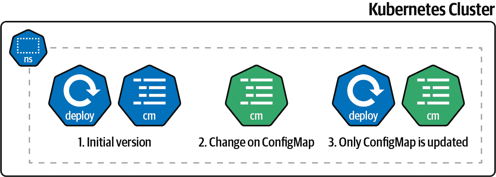

# 第四章：Kustomize

总结来说，将一些 YAML 文件应用到 Kubernetes 集群中并检查结果就是部署到 Kubernetes 集群。

难点在于开发初始的 YAML 文件版本；之后，通常只会进行小的更改，例如更新容器镜像标签版本、副本数量或新的配置值。一种选项是直接在 YAML 文件中进行这些更改——虽然有效，但是版本中的任何错误（修改错误的行、误删内容、放入错误的空白符）可能是灾难性的。

因此，一些工具允许您定义基本的 Kubernetes 清单（这些清单不经常更改）和特定的文件（可能是每个环境一个文件），用于设置更频繁更改的参数。其中一个工具就是 Kustomize。

在这一章中，您将学习如何使用 Kustomize 以无模板的方式管理 Kubernetes 资源文件，而不使用任何 DSL。

第一步是创建一个 Kustomize 项目并将其部署到 Kubernetes 集群中（参见 4.1 节）。

第一次部署后，应用程序将自动更新新的容器镜像、新的配置值或任何其他字段，例如副本数（参见 4.2 和 4.3 节）。

如果您有多个运行环境（例如，预备、生产等），则需要类似的管理它们。尽管有其特殊性，Kustomize 允许您为每个环境定义一组自定义值（参见 4.4 节）。

应用程序配置值通常被映射为 Kubernetes 的 `ConfigMap` 属性。在 `ConfigMap` 上进行任何更改（及其在集群上的后续更新）都不会触发应用程序的滚动更新，这意味着应用程序将继续以先前的版本运行，直到您手动重新启动它。

Kustomize 提供了一些函数，用于在应用程序的 `ConfigMap` 更改时自动执行滚动更新（参见 4.5 节）。

# 4.1 使用 Kustomize 部署 Kubernetes 资源

## 问题

您希望一次部署多个 Kubernetes 资源。

## 解决方案

使用 [Kustomize](https://kustomize.io) 配置要部署的资源。

将应用程序部署到 Kubernetes 集群并不像只需应用一个包含 Kubernetes `Deployment` 对象的 YAML/JSON 文件那样简单。通常，必须定义其他 Kubernetes 对象，如 `Service`、`Ingress`、`ConfigMaps` 等，这在管理和更新这些资源（维护的资源越多，更新错误的可能性就越大）以及将其应用于集群方面稍微复杂一些（我们应该运行多个 `kubectl` 命令吗？）。

Kustomize 是一个 CLI 工具，集成在 `kubectl` 工具中，用于以*无模板*的方式管理、自定义和应用 Kubernetes 资源。

使用 Kustomize，你需要设置一个基本目录，其中包含标准的 Kubernetes 资源文件（无需占位符），并创建一个名为 *kustomization.yaml* 的文件，声明资源和自定义内容，正如你可以在 图 4-1 中看到的。


###### 图 4-1\. Kustomize 布局

让我们部署一个简单的网页，包含 HTML、JavaScript 和 CSS 文件。

首先，在终端窗口中创建一个名为 *pacman* 的目录，然后创建三个 Kubernetes 资源文件，创建一个 `Namespace`，一个 `Deployment` 和一个 `Service`，内容如下。

*pacman/namespace.yaml* 中的命名空间：

```
apiVersion: v1
kind: Namespace
metadata:
  name: pacman
```

*pacman/deployment.yaml* 中的部署文件：

```
apiVersion: apps/v1
kind: Deployment
metadata:
  name: pacman-kikd
  namespace: pacman
  labels:
    app.kubernetes.io/name: pacman-kikd
spec:
  replicas: 1
  selector:
    matchLabels:
      app.kubernetes.io/name: pacman-kikd
  template:
    metadata:
      labels:
        app.kubernetes.io/name: pacman-kikd
    spec:
      containers:
          - image: lordofthejars/pacman-kikd:1.0.0
            imagePullPolicy: Always
            name: pacman-kikd
            ports:
              - containerPort: 8080
                name: http
                protocol: TCP
```

*pacman/service.yaml* 中的服务文件：

```
apiVersion: v1
kind: Service
metadata:
  labels:
    app.kubernetes.io/name: pacman-kikd
  name: pacman-kikd
  namespace: pacman
spec:
  ports:
    - name: http
      port: 8080
      targetPort: 8080
  selector:
    app.kubernetes.io/name: pacman-kikd
```

注意，这些文件是 Kubernetes 文件，您可以将它们应用到 Kubernetes 集群中，因为它们没有使用任何特殊字符或占位符。

第二步是在 *pacman* 目录中创建 *kustomization.yaml* 文件，其中包含属于应用程序的资源列表，在运行 Kustomize 时应用这些资源：

```
apiVersion: kustomize.config.k8s.io/v1beta1
kind: Kustomization 
resources: 
- ./namespace.yaml
- ./deployment.yaml
- ./service.yaml
```


Kustomization 文件


深度优先顺序处理的属于应用程序的资源

现在，我们可以通过运行以下命令将 kustomization 文件应用到运行中的集群：

```
kubectl apply --dry-run=client -o yaml \ 
              -k ./  
```


打印 kustomization 运行的结果，而不将结果发送到集群


使用 `-k` 选项设置 `kubectl` 使用 kustomization 文件


具有父级 *kustomization.yaml* 文件的目录

###### 注意

我们假设您已经启动了一个 *Minikube* 集群，如 Recipe 2.3 所示。

如果未使用 `dry-run` 选项，输出的 YAML 文件将发送到服务器：

```
apiVersion: v1
items: 
- apiVersion: v1
  kind: Namespace 
  metadata:
    name: pacman
- apiVersion: v1
  kind: Service 
  metadata:
    labels:
      app.kubernetes.io/name: pacman-kikd
    name: pacman-kikd
    namespace: pacman
  spec:
    ports:
    - name: http
      port: 8080
      targetPort: 8080
    selector:
      app.kubernetes.io/name: pacman-kikd
- apiVersion: apps/v1
  kind: Deployment 
  metadata:
    labels:
      app.kubernetes.io/name: pacman-kikd
    name: pacman-kikd
    namespace: pacman
  spec:
    replicas: 1
    selector:
      matchLabels:
        app.kubernetes.io/name: pacman-kikd
    template:
      metadata:
        labels:
          app.kubernetes.io/name: pacman-kikd
      spec:
        containers:
        - image: lordofthejars/pacman-kikd:1.0.0
          imagePullPolicy: Always
          name: pacman-kikd
          ports:
          - containerPort: 8080
            name: http
            protocol: TCP
kind: List
metadata: {}
```


列出 *kustomization.yaml* 中定义的所有 Kubernetes 对象以应用


命名空间文档


服务文档


部署文档

## 讨论

`resources` 部分支持不同的输入，除了直接设置 YAML 文件之外。

例如，您可以设置一个具有自己的 *kustomization.yaml* 和 Kubernetes 资源文件的基本目录，并从另一个目录中的另一个 *kustomization.yaml* 文件引用它。

给定以下目录布局：

```
.
├── base
│   ├── kustomization.yaml
│   └── deployment.yaml
├── kustomization.yaml
├── configmap.yaml
```

和 *base* 目录中的 Kustomization 定义：

```
apiVersion: kustomize.config.k8s.io/v1beta1
kind: Kustomization
resources:
- ./deployment.yaml
```

您会看到根目录链接到 *base* 目录，并包含一个 `ConfigMap` 定义：

```
apiVersion: kustomize.config.k8s.io/v1beta1
kind: Kustomization
resources:
- ./base
- ./configmap.yaml
```

因此，应用根 kustomization 文件将自动应用在基础 kustomization 文件中定义的资源。

此外，`resources` 可以按照 [HashiCorp URL](https://oreil.ly/lbeQC) 格式引用来自 URL 的外部资产。例如，我们通过设置 URL 引用 GitHub 存储库：

```
resources:
- github.com/lordofthejars/mysql 
- github.com/lordofthejars/mysql?ref=test 
```


具有根级 *kustomization.yaml* 文件的存储库


分支测试上具有根级 *kustomization.yaml* 文件的存储库

您已经看到如何使用 `kubectl` 应用 Kustomize 文件，但 Kustomize 也配备了自己的 CLI 工具，提供一组命令与 Kustomize 资源交互。

与 `kubectl` 构建 Kustomize 资源的等效命令是：

```
kustomize build
```

输出为：

```
apiVersion: v1
kind: Namespace
metadata:
  name: pacman
---
apiVersion: v1
kind: Service
metadata:
  labels:
    app.kubernetes.io/name: pacman-kikd
  name: pacman-kikd
  namespace: pacman
spec:
  ports:
  - name: http
    port: 8080
    targetPort: 8080
  selector:
    app.kubernetes.io/name: pacman-kikd
---
apiVersion: apps/v1
kind: Deployment
metadata:
  labels:
    app.kubernetes.io/name: pacman-kikd
  name: pacman-kikd
  namespace: pacman
spec:
  replicas: 1
  selector:
    matchLabels:
      app.kubernetes.io/name: pacman-kikd
  template:
    metadata:
      labels:
        app.kubernetes.io/name: pacman-kikd
    spec:
      containers:
      - image: lordofthejars/pacman-kikd:1.0.0
        imagePullPolicy: Always
        name: pacman-kikd
        ports:
        - containerPort: 8080
          name: http
          protocol: TCP
```

如果要将 `kustomize` 生成的输出应用于集群，请在与 *kustomization.yaml* 文件相同的目录中运行以下命令：

```
kustomize build . | kubectl apply -f -
```

## 另请参阅

+   [Kustomize](https://kustomize.io)

+   [kustomize/v4.4.1 on GitHub](https://oreil.ly/h2yNd)

+   [HashiCorp URL 格式](https://oreil.ly/n7jwr)

# 4.2 在 Kustomize 中更新容器镜像

## 问题

要使用 Kustomize 从部署文件更新容器镜像。

## 解决方案

使用 `images` 部分更新容器镜像。

软件开发中最重要且最常用的操作之一是更新应用程序至新版本，无论是修复错误还是添加新功能。在 Kubernetes 中，这意味着您需要创建一个新的容器镜像，并使用 `tag` 部分进行命名（`<registry>/<username>/<project>:<tag>`）。

给定以下部分部署文件：

```
spec:
    containers:
        - image: lordofthejars/pacman-kikd:1.0.0 
        imagePullPolicy: Always
        name: pacman-kikd
```


部署了 Service 1.0.0

通过在 *kustomization.yaml* 文件中的 `images` 部分将版本标签更新为 1.0.1：

```
apiVersion: kustomize.config.k8s.io/v1beta1
kind: Kustomization
resources:
- ./namespace.yaml
- ./deployment.yaml
- ./service.yaml
images: 
- name: lordofthejars/pacman-kikd 
  newTag: 1.0.1 
```


`images` 部分


将图像名称设置为 *update*


设置图像的新标签值

最后，使用 `kubectl` 中的 `dry-run` 或 `kustomize` 来验证部署文件输出包含新的标签版本。在终端窗口中，运行以下命令：

```
kustomize build
```

上述命令的输出为：

```
...
apiVersion: apps/v1
kind: Deployment
metadata:
  labels:
    app.kubernetes.io/name: pacman-kikd
  name: pacman-kikd
  namespace: pacman
spec:
  replicas: 1
  selector:
    matchLabels:
      app.kubernetes.io/name: pacman-kikd
  template:
    metadata:
      labels:
        app.kubernetes.io/name: pacman-kikd
    spec:
      containers:
      - image: lordofthejars/pacman-kikd:1.0.1 
        imagePullPolicy: Always
        name: pacman-kikd
        ports:
        - containerPort: 8080
          name: http
          protocol: TCP
```


在 `kustomize.yaml` 文件中设置版本号

###### 注意

Kustomize 不会对原始的 *deployment.yaml* 文件造成影响，这意味着它仍然包含原始的标签（`1.0.0`）。

## 讨论

更新 `newTag` 字段的一种方法是编辑 *kustomization.yaml* 文件，但您也可以使用 `kustomize` 工具来实现这一目的。

在与 *kustomization.yaml* 文件相同的目录中运行以下命令：

```
kustomize edit set image lordofthejars/pacman-kikd:1.0.2
```

检查 *kustomization.yaml* 文件的内容，确认 `newTag` 字段已更新：

```
...
images:
- name: lordofthejars/pacman-kikd
  newTag: 1.0.2
```

# 4.3 在 Kustomize 中更新任何 Kubernetes 字段

## 问题

您希望使用 Kustomize 更新字段（例如副本数）。

## 解决方案

使用 `patches` 部分指定使用 JSON Patch 规范进行更改。

在上一个示例中，您看到如何更新容器镜像标签，但有时您可能会更改其他参数，例如副本数量或添加注解、标签、限制等。

为了涵盖这些情况，Kustomize 支持使用 JSON 补丁来修改任何作为 Kustomize 资源定义的 Kubernetes 资源。要使用它，您需要指定要应用的 JSON 补丁表达式以及应用补丁的资源。

例如，我们可以在以下部分部署文件中，将副本数从一个修改为三：

```
apiVersion: apps/v1
kind: Deployment
metadata:
  name: pacman-kikd
  namespace: pacman
  labels:
    app.kubernetes.io/name: pacman-kikd
spec:
  replicas: 1
  selector:
    matchLabels:
      app.kubernetes.io/name: pacman-kikd
  template:
    metadata:
      labels:
        app.kubernetes.io/name: pacman-kikd
    spec:
      containers:
...
```

首先，让我们更新 *kustomization.yaml* 文件，以修改部署文件中定义的副本数：

```
apiVersion: kustomize.config.k8s.io/v1beta1
kind: Kustomization
resources:
- ./deployment.yaml
patches: 
  - target: 
      version: v1
      group: apps
      kind: Deployment
      name: pacman-kikd
      namespace: pacman
    patch: |- 
      - op: replace 
        path: /spec/replicas 
        value: 3 
```


补丁资源。


`target` 部分设置需要更改的 Kubernetes 对象。这些值与之前创建的部署文件匹配。


补丁表达式。


值的修改。


要修改的字段路径。


新值。

最后，使用 `kubectl` 中的 `dry-run` 或 `kustomize` 来验证部署文件的输出是否包含新的标签版本。在终端窗口中运行以下命令：

```
kustomize build
```

上述命令的输出是：

```
apiVersion: apps/v1
kind: Deployment
metadata:
  labels:
    app.kubernetes.io/name: pacman-kikd
  name: pacman-kikd
  namespace: pacman
spec:
  replicas: 3
  selector:
    matchLabels:
      app.kubernetes.io/name: pacman-kikd
...
```

###### 提示

*replicas* 值也可以通过 *kustomization.yaml* 文件中的 `replicas` 字段进行更新。

使用 `replicas` 字段的等效 Kustomize 文件显示在以下片段中：

```
apiVersion: kustomize.config.k8s.io/v1beta1
kind: Kustomization
replicas:
- name: pacman-kikd 
  count: 3 
resources:
- deployment.yaml
```


更新副本的部署


新的 `replicas` 值

Kustomize 允许您添加（或删除）值，除了修改值外。让我们看看如何添加一个新的标签：

```
...
patches:
  - target:
      version: v1
      group: apps
      kind: Deployment
      name: pacman-kikd
      namespace: pacman
    patch: |-
      - op: replace
        path: /spec/replicas
        value: 3
      - op: add 
        path: /metadata/labels/testkey 
        value: testvalue 
```


添加一个带有值的新字段


要添加的字段路径


要设置的值

应用文件的结果是：

```
apiVersion: apps/v1
kind: Deployment
metadata:
  labels:
    app.kubernetes.io/name: pacman-kikd
    testkey: testvalue 
  name: pacman-kikd
  namespace: pacman
spec:
  replicas: 3
  selector:
...
```


添加的标签

## 讨论

而不是嵌入 JSON 补丁表达式，您可以创建一个包含 JSON 补丁表达式的 YAML 文件，并使用 `path` 字段而不是 `patch` 来引用它。

创建一个名为 *external_patch* 的外部补丁文件，其中包含 JSON 补丁表达式：

```
- op: replace
  path: /spec/replicas
  value: 3
- op: add
  path: /metadata/labels/testkey
  value: testvalue
```

并将 `patch` 字段更改为指向补丁文件的 `path`：

```
...
patches:
  - target:
      version: v1
      group: apps
      kind: Deployment
      name: pacman-kikd
      namespace: pacman
    path: external_patch.yaml 
```


外部补丁文件路径

除了 JSON 补丁表达式外，Kustomize 还支持 [Strategic Merge Patch](https://oreil.ly/vr3e3) 来修改 Kubernetes 资源。简而言之，Strategic Merge Patch（或 *SMP*）是一个不完整的 YAML 文件，与一个完整的 YAML 文件合并。

仅需要一个包含容器名称信息的最小部署文件来更新容器映像：

```
apiVersion: kustomize.config.k8s.io/v1beta1
kind: Kustomization
resources:
- ./deployment.yaml
patches:
  - target:
      labelSelector: "app.kubernetes.io/name=pacman-kikd" 
    patch: |- 
      apiVersion: apps/v1 
      kind: Deployment
      metadata:
        name: pacman-kikd
      spec:
        template:
          spec:
            containers:
              - name: pacman-kikd
                image: lordofthejars/pacman-kikd:1.2.0 
```


使用标签选择目标


补丁足够智能，可以检测到它是 SMP 还是 JSON 补丁


这是一个最小的部署文件


只设置要更改的字段，其余保持不变

生成的输出是原始的*deployment.yaml* 文件，但包含新的容器镜像：

```
apiVersion: apps/v1
kind: Deployment
metadata:
  labels:
    app.kubernetes.io/name: pacman-kikd
  name: pacman-kikd
  namespace: pacman
spec:
  replicas: 1
  selector:
    matchLabels:
      app.kubernetes.io/name: pacman-kikd
  template:
    metadata:
      labels:
        app.kubernetes.io/name: pacman-kikd
    spec:
      containers:
      - image: lordofthejars/pacman-kikd:1.2.0
        imagePullPolicy: Always
...
```

###### 提示

`path` 也受到支持。

## 参见

+   [RFC 6902：JavaScript 对象表示法（JSON）补丁](https://oreil.ly/gDn1A)

+   [策略合并补丁](https://oreil.ly/vr3e3)

# 4.4 部署到多个环境

## 问题

您希望使用 Kustomize 在不同的命名空间中部署相同的应用程序。

## 解决方案

使用 `namespace` 字段来设置目标命名空间。

在某些情况下，将应用程序部署到不同的命名空间是有好处的；例如，一个命名空间可以用作*演示*环境，另一个用作*生产*命名空间。在这两种情况下，基础的 Kubernetes 文件是相同的，只有一些最小的更改，如部署的命名空间、一些配置参数或容器版本等。图 4-2 展示了一个例子。


###### 图 4-2\. Kustomize 布局

`kustomize` 允许您使用 `namespace` 字段将多个更改定义为常见基础上的叠加。例如，所有基础 Kubernetes 资源放在 `base` 目录中，并为每个环境的定制创建一个新目录：

```
.
├── base 
│  ├── deployment.yaml
│  └── kustomization.yaml
├── production
│   └── kustomization.yaml 
└── staging
    └── kustomization.yaml 
```


基础文件


特定于生产环境的更改


特定于演示环境的更改

基础 kustomization 文件包含其资源的引用：

```
apiVersion: kustomize.config.k8s.io/v1beta1
kind: Kustomization
resources:
- ./deployment.yaml
```

每个环境目录都有一个 kustomization 文件，其中设置了一些参数。这些参数引用了*base*目录、要注入到 Kubernetes 资源中的命名空间以及最后要部署的镜像，在生产环境中是*1.1.0*，但在演示环境中是*1.2.0-beta*。

对于*演示*环境，*kustomization.yaml* 的内容如下所示：

```
apiVersion: kustomize.config.k8s.io/v1beta1
kind: Kustomization
resources:
- ../base 
namespace: staging 
images:
- name: lordofthejars/pacman-kikd
  newTag: 1.2.0-beta 
```


对*base*目录的引用


将命名空间设置为*演示*


设置*演示*环境的容器标签

生产的 kustomization 文件与 staging 的类似，但更改了命名空间和标签：

```
apiVersion: kustomize.config.k8s.io/v1beta1
kind: Kustomization
resources:
- ../base
namespace: prod 
images:
- name: lordofthejars/pacman-kikd
  newTag: 1.1.0 
```


设置*生产*的命名空间


设置*生产*环境的容器标签

运行 `kustomize` 根据运行的目录不同生成不同的输出；例如，在*演示*目录中运行 `kustomize build` 会生成：

```
apiVersion: apps/v1
kind: Deployment
metadata:
  labels:
    app.kubernetes.io/name: pacman-kikd
  name: pacman-kikd
  namespace: staging 
spec:
  replicas: 1
...
  template:
    metadata:
      labels:
        app.kubernetes.io/name: pacman-kikd
    spec:
      containers:
      - image: lordofthejars/pacman-kikd:1.2.0-beta 
...
```


命名空间值被注入


为*演示*环境注入容器标签

但如果您在*生产*目录中运行它，则输出会根据生产配置进行调整：

```
apiVersion: apps/v1
kind: Deployment
metadata:
  labels:
    app.kubernetes.io/name: pacman-kikd
  name: pacman-kikd
  namespace: prod 
spec:
  replicas: 1
...
    spec:
      containers:
      - image: lordofthejars/pacman-kikd:1.1.0 
...
```


注入*生产*命名空间


*production* 环境的容器标签

## 讨论

Kustomize 可以在所有资源和引用的名称前添加/附加一个值。当需要根据环境要求不同名称的资源时，或者为了设置名称中部署的版本时，这非常有用：

```
apiVersion: kustomize.config.k8s.io/v1beta1
kind: Kustomization
resources:
- ../base
namespace: staging
namePrefix: staging- 
nameSuffix: -v1-2-0 
images:
- name: lordofthejars/pacman-kikd
  newTag: 1.2.0-beta
```


要前置的前缀


要附加的后缀

输出结果如下：

```
apiVersion: apps/v1
kind: Deployment
metadata:
  labels:
    app.kubernetes.io/name: pacman-kikd
  name: staging-pacman-kikd-v1-2-0 
  namespace: staging
spec:
...
```


部署文件的新名称

# 4.5 在 Kustomize 中生成 ConfigMaps

## 问题

您希望使用 Kustomize 生成 Kubernetes `ConfigMap`。

## 解决方案

使用 `ConfigMapGenerator` 功能字段即可即时生成 Kubernetes `ConfigMap` 资源。

Kustomize 提供两种方式将 `ConfigMap` 添加为 Kustomize 资源：一种是将 `ConfigMap` 声明为任何其他资源，另一种是从 `ConfigMapGenerator` 声明 `ConfigMap`。

虽然将 `ConfigMap` 作为资源使用与将 Kubernetes 资源填充为任何其他资源无异，但 `ConfigMapGenerator` 自动向 `ConfigMap` 元数据名称附加哈希，并且还修改了部署文件与新哈希。这种微小的变化对应用程序的生命周期有深远影响，我们将在例子中很快看到。

让我们考虑一个在 Kubernetes 中运行并使用 `ConfigMap` 配置的应用程序，例如数据库超时连接参数。我们决定在某个时候增加此数字，因此 `ConfigMap` 文件更改为这个新值，并且重新部署应用程序。由于 `ConfigMap` 是唯一更改的文件，因此不会对应用程序进行滚动更新。需要手动触发应用程序的滚动更新以将更改传播到应用程序。Figure 4-3 显示更新 `ConfigMap` 对象时发生的变化。



###### 第 4-3 图。更改一个 `ConfigMap`

但是，如果 `ConfigMapGenerator` 管理 `ConfigMap`，则配置文件的任何更改也会更改部署的 Kubernetes 资源。由于部署文件也已更改，因此在应用资源时将触发自动滚动更新，如 Figure 4-4 所示。

此外，使用 `ConfigMapGenerator` 时，可以将多个配置数据文件合并为单个 `ConfigMap`，在每个环境具有不同配置文件的完美用例。


###### 第 4-4 图。使用 `ConfigMapGenerator` 更改一个 `ConfigMap`

让我们从一个简单的示例开始，在 *kustomization.yaml* 文件中添加 `ConfigMapGenerator` 部分。

部署文件类似于本章前几节中使用的文件，但包括 `volumes` 部分：

```
apiVersion: apps/v1
kind: Deployment
metadata:
  name: pacman-kikd
spec:
  replicas: 1
  selector:
    matchLabels:
      app.kubernetes.io/name: pacman-kikd
  template:
    metadata:
      labels:
        app.kubernetes.io/name: pacman-kikd
    spec:
      containers:
      - image: lordofthejars/pacman-kikd:1.0.0
        imagePullPolicy: Always
        name: pacman-kikd
        volumeMounts:
        - name: config
          mountPath: /config
      volumes:
      - name: config
        configMap:
          name: pacman-configmap 
```


`ConfigMap` 名称在 *kustomization.yaml* 文件中使用

配置属性嵌入在 *kustomization.yaml* 文件中。注意，当构建 kustomization 文件时，`ConfigMap` 对象会即时创建：

```
apiVersion: kustomize.config.k8s.io/v1beta1
kind: Kustomization
resources:
- ./deployment.yaml
configMapGenerator:
- name: pacman-configmap 
  literals:	
  - db-timeout=2000 
  - db-username=Ada
```


在部署文件中设置的 `ConfigMap` 名称


将配置值嵌入文件中


为属性设置键值对

最后，使用 `kubectl` 中的 `dry-run` 或 `kustomize` 来验证部署文件的输出是否包含新的标签版本。在终端窗口中运行以下命令：

```
kustomize build
```

上述命令的输出是一个新的 `ConfigMap`，其中包含在 *kustomization.yaml* 中设置的配置值。此外，`ConfigMap` 的名称通过在生成的 `ConfigMap` 和部署文件中追加哈希来更新：

```
apiVersion: v1
data: 
  db-timeout: "2000"
  db-username: Ada
kind: ConfigMap
metadata:
  name: pacman-configmap-96kb69b6t4 
---
apiVersion: apps/v1
kind: Deployment
metadata:
  labels:
    app.kubernetes.io/name: pacman-kikd
  name: pacman-kikd
spec:
  replicas: 1
  selector:
    matchLabels:
      app.kubernetes.io/name: pacman-kikd
  template:
    metadata:
      labels:
        app.kubernetes.io/name: pacman-kikd
    spec:
      containers:
      - image: lordofthejars/pacman-kikd:1.0.0
        imagePullPolicy: Always
        name: pacman-kikd
        volumeMounts:
        - mountPath: /config
          name: config
      volumes:
      - configMap:
          name: pacman-configmap-96kb69b6t4 
        name: config
```


包含属性的 `ConfigMap`


带有哈希的名称


名称字段已更新为带有哈希的字段，触发滚动更新

由于哈希是根据配置属性的任何更改计算的，对它们的更改会触发输出的更改，从而触发应用程序的滚动更新。打开 *kustomization.yaml* 文件并将 `db-timeout` 字面值从 2000 更新为 1000，然后再次运行 `kustomize build`。注意使用新的哈希值更改 `ConfigMap` 名称：

```
apiVersion: v1
data:
  db-timeout: "1000"
  db-username: Ada
kind: ConfigMap
metadata:
  name: pacman-configmap-6952t58tb4 
---
apiVersion: apps/v1
kind: Deployment
...
    volumes:
      - configMap:
          name: pacman-configmap-6952t58tb4
        name: config
```


新的哈希值

## 讨论

`ConfigMapGenerator` 还支持从不同源合并配置属性。

在 *dev_literals* 目录中创建一个新的 *kustomization.yaml* 文件，将其设置为上一个目录，并覆盖 `db-username` 值：

```
apiVersion: kustomize.config.k8s.io/v1beta1
kind: Kustomization
resources:
- ../literals 
configMapGenerator:
- name: pacman-configmap
  behavior: merge 
  literals:
  - db-username=Alexandra 
```


基础目录


合并属性（也可以是 `create` 或 `replace`）


覆盖的值

运行 `kustomize build` 命令会生成一个包含两者配置属性合并的 `ConfigMap`：

```
apiVersion: v1
data:
  db-timeout: "1000" 
  db-username: Alexandra 
kind: ConfigMap
metadata:
  name: pacman-configmap-ttfdfdk5t8
---
apiVersion: apps/v1
kind: Deployment
metadata:
  labels:
    app.kubernetes.io/name: pacman-kikd
  name: pacman-kikd
...
```


继承自基础


覆盖值

除了将配置属性设置为字面值外，Kustomize 还支持将它们定义为 *.properties* 文件。

创建一个包含两个属性的 *connection.properties* 文件：

```
db-url=prod:4321/db
db-username=ada
```

*kustomization.yaml* 文件使用 `files` 字段而不是 `literals`：

```
apiVersion: kustomize.config.k8s.io/v1beta1
kind: Kustomization
resources:
- ./deployment.yaml
configMapGenerator:
- name: pacman-configmap
  files: 
  - ./connection.properties 
```


设置要读取的文件列表


属性文件的路径

运行 `kustomize build` 命令会生成一个包含文件名作为键和文件内容作为值的 `ConfigMap`：

```
apiVersion: v1
data:
  connection.properties: |-
    db-url=prod:4321/db
    db-username=ada
kind: ConfigMap
metadata:
  name: pacman-configmap-g9dm2gtt77
---
apiVersion: apps/v1
kind: Deployment
metadata:
  labels:
    app.kubernetes.io/name: pacman-kikd
  name: pacman-kikd
...
```

## 参见

Kustomize 提供了一种类似的方法来处理 Kubernetes Secrets。但正如我们将在 第八章 中看到的那样，处理 Kubernetes Secrets 的最佳方法是使用 Sealed Secrets。

# 4.6 最后的思考

Kustomize 是一个简单的工具，使用无模板技术，允许您定义普通的 YAML 文件，并使用合并策略或 JSON Patch 表达式覆盖值。项目的结构是自由的，您可以定义您感觉最舒适的目录布局；唯一的要求是存在一个*kustomization.yaml*文件。

但是还有另一个知名的工具来管理 Kubernetes 资源文件，据我们认为，它稍微复杂一些但更强大，特别是当要部署的应用/服务有多个依赖项，比如数据库、邮件服务器、缓存等。这个工具就是 Helm，我们将在第五章中详细介绍它。
