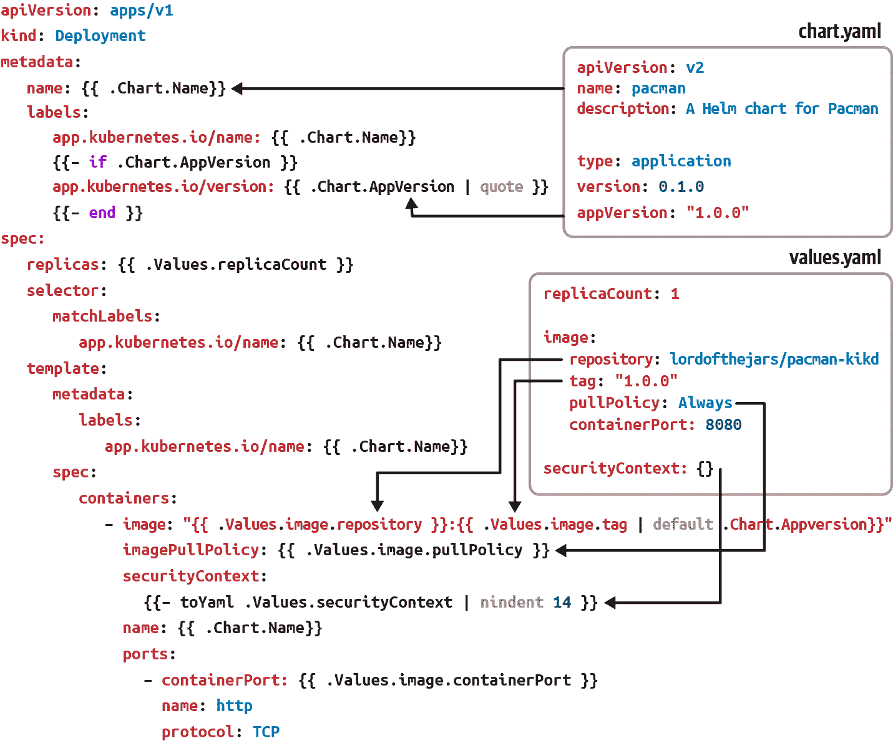
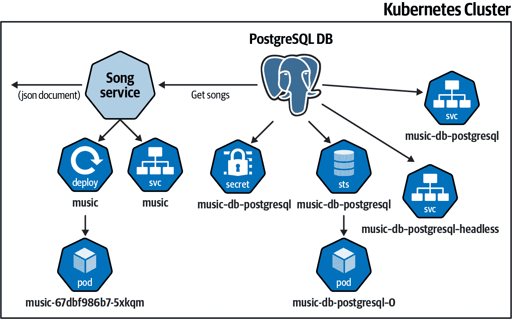
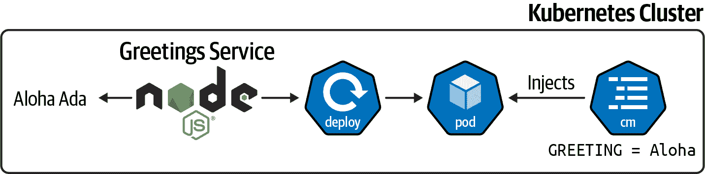
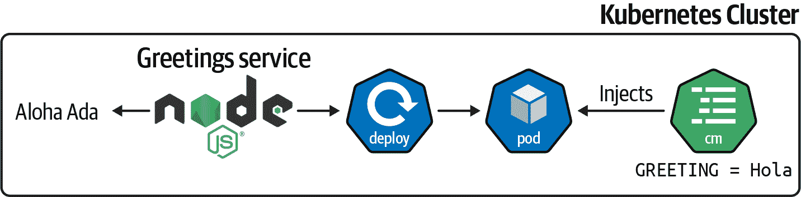
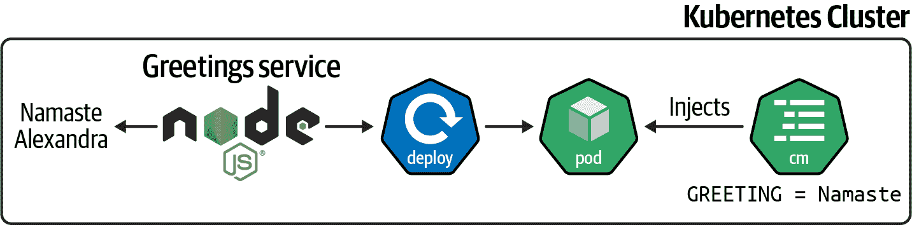

# 第五章：Helm

在第四章中，您已经了解了 Kustomize，这是一个简单而强大的工具，用于管理 Kubernetes 资源。但是另一个流行的工具也旨在简化 Kubernetes 资源的管理：Helm。

Helm 的工作方式类似于 Kustomize，但它是一个模板解决方案，更像是一个包管理器，生成的构件可以进行版本控制、共享或部署。

在本章中，我们将介绍 Helm，这是一个 Kubernetes 的包管理工具，它使用 YAML 文件中的 Go 模板语言来帮助安装和管理 Kubernetes 应用程序。

第一步是创建一个 Helm 项目并将其部署到 Kubernetes 集群（参见配方 5.1 和 5.2）。在第一次部署之后，可以通过一个新的容器镜像、一个新的配置值或任何其他字段（例如副本数）来更新应用程序（参见配方 5.3）。

Kustomize 和 Helm 之间的一个区别是 Chart 的概念。Chart 是一个打包的构件，可以共享，并包含多个元素，如对其他 Chart 的依赖关系（参见配方 5.4、5.5 和 5.6）。

应用程序配置值通常映射为 Kubernetes 的 `ConfigMap` 属性。对 `ConfigMap` 的任何更改（及其在集群上的后续更新）不会触发应用程序的滚动更新，这意味着应用程序会继续以前一个版本运行，直到您手动重新启动它。

Helm 提供了一些功能，可以在应用程序的 `ConfigMap` 更改时自动执行滚动更新（参见配方 5.7）。

# 5.1 创建一个 Helm 项目

## 问题

您想要创建一个简单的 Helm 项目。

## 解决方案

使用[Helm](https://helm.sh) CLI 工具创建一个新项目。

与 Kustomize 相反，Kustomize 可以在 `kubectl` 命令中使用，也可以作为一个独立的 CLI 工具使用，但 Helm 需要在本地机器上下载并安装。

Helm 是一个 Kubernetes 的打包工具，它将相关的清单文件打包成一个单一的逻辑部署单元：一个 Chart。因此，对于许多工程师来说，Helm 简化了使用真实应用程序的 Kubernetes 的过程。

Helm Charts 对于解决应用程序的安装复杂性和简单的升级非常有用。

本书中，我们使用的是 Helm 3.7.2 版本，您可以从[GitHub](https://oreil.ly/AWfiO)下载并安装到您的 PATH 目录中。

打开终端并运行以下命令，创建一个 Helm Chart 目录布局：

```
mkdir pacman
mkdir pacman/templates

cd pacman
```

然后创建三个文件：一个定义 Chart 的文件，另一个代表使用 Sprig 库的 Go 模板语言的部署模板，最后一个文件包含 Chart 的默认值。

*Chart.yaml* 文件声明了 Chart 的信息，如版本或名称。在根目录下创建该文件：

```
apiVersion: v2
name: pacman
description: A Helm chart for Pacman

type: application

version: 0.1.0 

appVersion: "1.0.0" 
```


图表的版本。当 Chart 定义中的内容发生更改时更新。


应用程序的版本。

让我们创建一个*deployment.yaml*和一个*service.yaml*模板文件来部署应用程序。

*deployment.yaml*文件模板化了部署的名称、应用程序版本、副本计数、容器镜像和标签、拉取策略、安全上下文以及端口：

```
apiVersion: apps/v1
kind: Deployment
metadata:
  name: {{ .Chart.Name}} 
  labels:
    app.kubernetes.io/name: {{ .Chart.Name}}
    {{- if .Chart.AppVersion }} 
    app.kubernetes.io/version: {{ .Chart.AppVersion | quote }} 
    {{- end }}
spec:
  replicas: {{ .Values.replicaCount }} 
  selector:
    matchLabels:
      app.kubernetes.io/name: {{ .Chart.Name}}
  template:
    metadata:
      labels:
        app.kubernetes.io/name: {{ .Chart.Name}}
    spec:
      containers:
          - image: "{{ .Values.image.repository }}:
          {{ .Values.image.tag | default .Chart.AppVersion}}"  
            imagePullPolicy: {{ .Values.image.pullPolicy }} 
            securityContext:
              {{- toYaml .Values.securityContext | nindent 14 }}
            name: {{ .Chart.Name}}
            ports:
              - containerPort: {{ .Values.image.containerPort }}
                name: http
                protocol: TCP
```


从*Chart.yaml*文件设置名称


根据*Chart.yaml*文件中是否存在`appVersion`来有条件地设置版本


设置`appVersion`值，但引用该属性


`replicaCount`属性的占位符


容器镜像的占位符


如果存在，则为镜像标签的占位符，否则默认为*Chart.yaml*属性


将`securityContext`值设置为 YAML 对象，而不是字符串，并将其缩进 14 个空格

*service.yaml*文件模板化了服务名称和容器端口：

```
apiVersion: v1
kind: Service
metadata:
  labels:
    app.kubernetes.io/name: {{ .Chart.Name }}
  name: {{ .Chart.Name }}
spec:
  ports:
    - name: http
      port: {{ .Values.image.containerPort }}
      targetPort: {{ .Values.image.containerPort }}
  selector:
    app.kubernetes.io/name: {{ .Chart.Name }}
```

*values.yaml*文件包含 Chart 的默认值。这些值可以在运行时被覆盖，但它们提供了良好的初始值。

在根目录中创建文件，并使用一些默认值：

```
image: 
  repository: quay.io/gitops-cookbook/pacman-kikd 
  tag: "1.0.0"
  pullPolicy: Always
  containerPort: 8080

replicaCount: 1
securityContext: {} 
```


定义`image`部分


设置`repository`属性


空的`securityContext`

内置属性采用大写；因此，在*Chart.yaml*文件中定义的属性以大写字母开头。

由于`toYaml`函数用于`securityContext`值，因此*values.yaml*文件中`securityContext`属性的预期值应为 YAML 对象。例如：

```
securityContext:
  capabilities:
    drop:
    - ALL
  readOnlyRootFilesystem: true
  runAsNonRoot: true
  runAsUser: 1000
```

所有元素之间的关系显示在图 5-1 中。



###### 图 5-1\. Helm 元素之间的关系

到此为止，Helm 目录布局已创建，并应类似于以下内容：

```
pacman
    ├── Chart.yaml 
    ├── templates 
    │   ├── deployment.yaml 
    │   ├── service.yaml
    └── values.yaml 
```


*Chart.yaml*文件是 Chart 描述符，包含与 Chart 相关的元数据。


*templates*目录包含用于安装 Chart 的所有模板文件。


这些文件是用于部署应用程序的 Helm 模板文件。


*values.yaml*文件包含 Chart 的默认值。

要将 Helm Chart 本地渲染为 YAML，请在终端窗口中运行以下命令：

```
helm template .
```

输出为：

```
---
apiVersion: v1
kind: Service
metadata:
  labels:
    app.kubernetes.io/name: pacman
  name: pacman 
spec:
  ports:
    - name: http
      port: 8080 
      targetPort: 8080
  selector:
    app.kubernetes.io/name: pacman
---
apiVersion: apps/v1
kind: Deployment
metadata:
  name: pacman
  labels:
    app.kubernetes.io/name: pacman
    app.kubernetes.io/version: "1.0.0" 
spec:
  replicas: 1
  selector:
    matchLabels:
      app.kubernetes.io/name: pacman
  template:
    metadata:
      labels:
        app.kubernetes.io/name: pacman
    spec:
      containers:
          - image: "quay.io/gitops-cookbook/pacman-kikd:1.0.0" 
            imagePullPolicy: Always
            securityContext: 
              {}
            name: pacman
            ports:
              - containerPort: 8080
                name: http
                protocol: TCP
```


名称从*Chart.yaml*中注入


端口在*values.yaml*中设置


版本取自 Chart 版本


将两个属性的内容连接起来


空安全上下文

您可以通过在 Helm 中使用`--set`参数来覆盖任何默认值。让我们将`replicaCount`值从*values.yaml*中的 1 覆盖为 3：

```
helm template  --set replicaCount=3 .
```

并更新`replicas`值：

```
apiVersion: apps/v1
kind: Deployment
metadata:
  name: pacman
  labels:
    app.kubernetes.io/name: pacman
    app.kubernetes.io/version: "1.0.0"
spec:
  replicas: 3
...
```

## 讨论

Helm 是 Kubernetes 的包管理器，帮助您进行版本控制、共享和升级 Kubernetes 应用程序等任务。

让我们看看如何将 Helm Chart 安装到 Kubernetes 集群并升级应用程序。

当 Minikube 处于运行状态时，在终端窗口中执行以下命令，并运行`install`命令将应用程序部署到集群中：

```
helm install pacman .
```

Chart 已安装在运行的 Kubernetes 实例中：

```
LAST DEPLOYED: Sat Jan 22 15:13:50 2022
NAMESPACE: default
STATUS: deployed
REVISION: 1
TEST SUITE: None
```

获取当前部署的 Pods、Deployments 和 Services 的列表，以验证 Helm Chart 是否已部署在 Kubernetes 集群中：

```
kubectl get pods

NAME                    READY   STATUS    RESTARTS   AGE
pacman-7947b988-kzjbc   1/1     Running   0          60s
```

```
kubectl get deployment

NAME     READY   UP-TO-DATE   AVAILABLE   AGE
pacman   1/1     1            1           4m50s
```

```
kubectl get services

NAME     TYPE        CLUSTER-IP       EXTERNAL-IP   PORT(S)    AGE
pacman   ClusterIP   172.30.129.123   <none>        8080/TCP   9m55s
```

此外，还可以使用`history`命令获取有关部署的 Helm Chart 的历史信息：

```
helm history pacman

REVISION	UPDATED                 	STATUS  	CHART       ↳
   APP VERSION   DESCRIPTION
1       	Sat Jan 22 15:23:22 2022	deployed	pacman-0.1.0↳
   1.0.0         Install complete
```

要从集群中卸载 Chart，请运行`uninstall`命令：

```
helm uninstall pacman

release "pacman" uninstalled
```

Helm 是一个包管理器，允许您将 Chart（包）作为依赖项共享给其他 Chart。例如，您可以有一个定义应用程序部署的 Chart，另一个 Chart 作为设置数据库部署的依赖项。这样，安装过程会自动安装应用程序和数据库 Chart。

我们将在后面的章节中学习打包过程和添加依赖项。

###### 提示

您可以使用`helm create <name>`命令让 Helm 工具为项目进行自动化构建。

## 另请参阅

+   [Helm](https://helm.sh)

+   [Go 模板包](https://oreil.ly/vYI40)

+   [Sprig 函数文档](https://oreil.ly/ngC2v)

# 5.2 在模板之间重用语句

## 问题

您希望在多个文件中重用模板语句。

## 解决方案

使用*_helpers.tpl*来定义可重用的语句。

在上一篇文章中，我们使用 Helm 将一个简单的应用程序部署到 Kubernetes。这个简单的应用程序由一个 Kubernetes Deployment 文件和一个 Kubernetes Service 文件组成，其中`selector`字段的值相同。

作为提醒：

```
...
spec:
  replicas: {{ .Values.replicaCount }}
  selector:
    matchLabels:
      app.kubernetes.io/name: {{ .Chart.Name}}
  template:
    metadata:
      labels:
        app.kubernetes.io/name: {{ .Chart.Name}}
...
```

```
service.yaml
----
...
selector:
    app.kubernetes.io/name: {{ .Chart.Name }}
----
```

如果需要更新此字段，例如添加新的标签作为选择器，您需要更新三个地方，如前面的片段所示。

Helm 允许您在*templates*目录中创建一个*_helpers.tpl*文件，定义可以在模板中调用的语句，以避免这个问题。

让我们重构之前的示例，使用*_helpers.tpl*文件定义`selectorLabels`。

在*templates*目录中创建*_helpers.tpl*文件，并添加以下内容：

```
{{- define "pacman.selectorLabels" -}} 
app.kubernetes.io/name: {{ .Chart.Name}} 
{{- end }}
```


定义语句名称


定义语句的逻辑

然后用`podman.selectorLabels`辅助语句中的`include`关键字替换前面片段中显示的模板占位符：

```
spec:
  replicas: {{ .Values.replicaCount }}
  selector:
    matchLabels:
      {{- include "pacman.selectorLabels" . | nindent 6 }} 
  template:
    metadata:
      labels:
        {{- include "pacman.selectorLabels" . | nindent 8 }} 
    spec:
      containers:
```


使用缩进调用了`pacman.selectorLabels`


使用缩进调用了`pacman.selectorLabels`

要在本地将 Helm Chart 渲染为 YAML，请在终端窗口中运行以下命令：

```
helm template .
```

输出为：

```
apiVersion: v1
kind: Service
metadata:
  labels:
    app.kubernetes.io/name: pacman
  name: pacman
spec:
  ports:
    - name: http
      port: 8080
      targetPort: 8080
  selector:
    app.kubernetes.io/name: pacman 
---
apiVersion: apps/v1
kind: Deployment
metadata:
  name: pacman
  labels:
    app.kubernetes.io/name: pacman
    app.kubernetes.io/version: "1.0.0"
spec:
  replicas: 1
  selector:
    matchLabels:
      app.kubernetes.io/name: pacman 
  template:
    metadata:
      labels:
        app.kubernetes.io/name: pacman 
    spec:
      containers:
          - image: "quay.io/gitops-cookbook/pacman-kikd:1.0.0"
            imagePullPolicy: Always
            securityContext:
              {}
            name: pacman
            ports:
              - containerPort: 8080
                name: http
                protocol: TCP
```


使用*_helpers.tpl*中设置的值更新选择器


使用缩进调用了`pacman.selectorLabels`


使用*_helpers.tpl*中设置的值更新选择器

## 讨论

如果要更新选择器标签，您唯一需要做的更改就是更新*_helpers.tpl*文件：

```
{{- define "pacman.selectorLabels" -}}
app.kubernetes.io/name: {{ .Chart.Name}}
app.kubernetes.io/version: {{ .Chart.AppVersion}} 
{{- end }}
```


添加了新属性

要在本地将 Helm Chart 渲染为 YAML，请在终端窗口中运行以下命令：

```
helm template .
```

输出为：

```
---
# Source: pacman/templates/service.yaml apiVersion: v1
kind: Service
metadata:
...
  selector:
    app.kubernetes.io/name: pacman
    app.kubernetes.io/version: 1.0.0 
---
apiVersion: apps/v1
kind: Deployment
metadata:
  name: pacman
  labels:
    app.kubernetes.io/name: pacman
    app.kubernetes.io/version: "1.0.0"
spec:
  replicas: 1
  selector:
    matchLabels:
      app.kubernetes.io/name: pacman
      app.kubernetes.io/version: 1.0.0 
  template:
    metadata:
      labels:
        app.kubernetes.io/name: pacman
        app.kubernetes.io/version: 1.0.0 
    spec:
...
```


添加了标签


添加了标签


添加了标签

###### 提示

尽管通常使用*__helpers.tpl*作为文件名来定义函数，您也可以使用以`__`开头的任何文件名，Helm 也会读取其中的函数。

# 5.3 在 Helm 中更新容器镜像

## 问题

您想通过 Helm 从部署文件中更新容器镜像并升级运行实例。

## 解决方案

使用`upgrade`命令。

在 Minikube 正常运行时，部署`pacman`应用程序的 1.0.0 版本：

```
helm install pacman .
```

部署了第一个修订版本后，让我们将容器镜像更新为新版本并部署。

您可以通过运行以下命令检查修订号：

```
helm history pacman

REVISION   UPDATED                   STATUS    CHART          APP VERSION↳
  DESCRIPTION
1          Sun Jan 23 16:00:09 2022  deployed  pacman-0.1.0   1.0.0↳
  Install complete
```

要更新版本，请打开*values.yaml*并将`image.tag`字段更新为新的容器镜像标签：

```
image:
  repository: quay.io/gitops-cookbook/pacman-kikd
  tag: "1.1.0" 
  pullPolicy: Always
  containerPort: 8080

replicaCount: 1
securityContext: {}
```


更新到容器标记为 1.1.0

然后更新*Chart.yaml*文件的`appVersion`字段：

```
apiVersion: v2
name: pacman
description: A Helm chart for Pacman

type: application
version: 0.1.0
appVersion: "1.1.0" 
```


版本将相应更新

###### 提示

您可以将`appVersion`用作标签，而不是使用两个独立字段。使用两个字段或一个字段可能取决于您的用例、版本策略和软件生命周期。

进行这些更改后，通过运行以下命令升级部署：

```
helm upgrade pacman .
```

输出反映出已部署新修订版本：

```
Release "pacman" has been upgraded. Happy Helming!
NAME: pacman
LAST DEPLOYED: Mon Jan 24 11:39:28 2022
NAMESPACE: asotobue-dev
STATUS: deployed
REVISION: 2 
TEST SUITE: None
```


新修订版本

`history`命令显示所有版本之间的所有更改：

```
helm history pacman

REVISION UPDATED                  STATUS    	CHART       	APP VERSION↳
DESCRIPTION
1        Mon Jan 24 10:22:06 2022 superseded	pacman-0.1.0	1.0.0↳
Install complete
2        Mon Jan 24 11:39:28 2022 deployed  	pacman-0.1.0	1.1.0↳
Upgrade complete
```

###### 注意

`appVersion`是应用程序版本，因此每次更改应用程序版本时，您也应更新该字段。另一方面，`version`是 Chart 版本，在 Chart 定义（即模板）更改时应更新，因此这两个字段是独立的。

## 讨论

您不仅可以使用 Helm 安装或升级版本，还可以回滚到以前的修订版本。

在终端窗口中运行以下命令：

```
helm rollback pacman 1

Rollback was a success! Happy Helming!
```

运行`history`命令也反映了这一变化：

```
helm history pacman

REVISION  UPDATED                   STATUS    	CHART       	APP VERSION↳
DESCRIPTION
1         Mon Jan 24 10:22:06 2022  superseded	pacman-0.1.0	1.0.0↳
Install complete
2         Mon Jan 24 11:39:28 2022  superseded	pacman-0.1.0	1.1.0↳
Upgrade complete
3         Mon Jan 24 12:31:58 2022  deployed  	pacman-0.1.0	1.0.0↳
Rollback to
```

最后，Helm 提供了一种覆盖值的方式，不仅可以使用`--set`参数（如 Recipe 5.1 所示），还可以提供一个 YAML 文件。

在根目录创建一个名为*newvalues.yaml*的新 YAML 文件，内容如下：

```
image:
  tag: "1.2.0"
```

然后运行`template`命令，将新文件设置为*values.yaml*的覆盖：

```
helm template pacman -f newvalues.yaml .
```

生成的 YAML 文档使用*values.yaml*中设置的值，但覆盖了*newvalues.yaml*中设置的`images.tag`：

```
apiVersion: apps/v1
kind: Deployment
metadata:
  name: pacman
...
spec:
  replicas: 1
  selector:
    matchLabels:
      app.kubernetes.io/name: pacman
  template:
    metadata:
      labels:
        app.kubernetes.io/name: pacman
    spec:
      containers:
          - image: "quay.io/gitops-cookbook/pacman-kikd:1.2.0"
            imagePullPolicy: Always
...
```

# 5.4 打包和分发 Helm 图表

## 问题

您希望将 Helm 图表打包并分发，以便其他人可以重用它。

## 解决方案

使用`package`命令。

Helm 是一个用于 Kubernetes 的包管理器。正如我们在本章中看到的，Helm 中的基本单元是一个图表，其中包含部署应用程序所需的 Kubernetes 文件，模板的默认值等。

但我们还没有看到如何打包 Helm 图表并将其分发以供其他图表作为依赖项使用或由其他用户部署。

让我们将`pacman`图表打包成*.tgz*文件。在*pacman*目录中，运行以下命令：

```
helm package .
```

然后您将收到一条消息，告知存档的位置：

```
Successfully packaged chart and saved it to:↳
gitops-cookbook/code/05_helm/04_package/pacman/pacman-0.1.0.tgz
```

然后需要将图表发布到图表仓库中。图表仓库是一个 HTTP 服务器，包含有关图表和*.tgz*图表的元数据信息的*index.yaml*文件。

要发布它们，请更新*index.yaml*文件以及上传该工件的新元数据信息。

仓库的目录布局可能如下所示：

```
repo
├── index.yaml
├── pacman-0.1.0.tgz
```

仓库中每个图表的信息在*index.yaml*文件中看起来像这样：

```
apiVersion: v1
entries:
  pacman:
  - apiVersion: v2
    appVersion: 1.0.0
    created: "2022-01-24T16:42:54.080959+01:00"
    description: A Helm chart for Pacman
    digest: aa3cce809ffcca86172fc793d7804d1c61f157b9b247680a67d5b16b18a0798d
    name: pacman
    type: application
    urls:
    - pacman-0.1.0.tgz
    version: 0.1.0
generated: "2022-01-24T16:42:54.080485+01:00"
```

###### 提示

您可以在存储打包图表的根目录中运行`helm repo index`以自动生成索引文件。

## 讨论

除了打包 Helm 图表外，Helm 还可以为打包的图表生成签名文件，以便以后验证其正确性。

通过这种方式，您可以确保它未被修改，并且是正确的图表。

要签名/验证包，请在计算机上准备一对 GPG 密钥；我们假设您已经创建了一对。

现在您需要调用`package`命令，但要使用必需的参数设置`-sign`参数以生成签名文件：

```
helm package --sign --key 'me@example.com' \
  --keyring /home/me/.gnupg/secring.gpg  .
```

现在，会创建两个文件—打包的 Helm 图表(*.tgz*)和签名文件(*.tgz.prov*)：

```
.
├── Chart.yaml
├── pacman-0.1.0.tgz 
├── pacman-0.1.0.tgz.prov 
├── templates
│  ├── deployment.yaml
│  └── service.yaml
└── values.yaml
```


图表包


签名文件

###### 注意

记得上传这两个文件到图表仓库中。

若要验证图表是否有效且未被篡改，请使用`verify`命令：

```
helm verify pacman-0.1.0.tgz

Signed by: alexs (book) <asotobu@example.com>
Using Key With Fingerprint: 57C4511D738BC0B288FAF9D69B40EB787040F3CF
Chart Hash Verified:↳
sha256:d8b2e0c5e12a8425df2ea3a903807b93aabe4a6ff8277511a7865c847de3c0bf 
```


它是有效的

## 另请参阅

+   [图表仓库指南](https://oreil.ly/pQ2Ab)

+   [Helm 的来源和完整性](https://oreil.ly/1Hql0)

# 5.5 从仓库部署图表

## 问题

您希望部署存储在图表仓库中的 Helm 图表。

## 解决方案

使用`repo add`命令添加远程仓库，并使用`install`命令部署它。

类似[Bitnami](https://oreil.ly/QJzWZ)这样的公共 Helm 图表仓库可用于此目的。

要从仓库（公共或私有）安装图表，需要使用其 URL 进行注册：

```
helm repo add bitnami https://charts.bitnami.com/bitnami 
```


Helm Chart 存放 *index.yaml* 的仓库 URL

列出已注册的仓库：

```
helm repo list

NAME     	URL
stable   	https://charts.helm.sh/stable
bitnami  	https://charts.bitnami.com/bitnami 
```


Bitnami 仓库已注册

###### 提示

运行 `helm repo update` 来获取每个仓库的最新图表列表。

注册仓库后，您可能想找到可用的图表。

如果要在集群中部署 PostgreSQL 实例，请使用 `search` 命令搜索所有仓库以匹配名称的图表：

```
helm search repo postgresql
```

输出是与名称匹配的图表列表，Chart 和 PostgreSQL 的版本，以及描述。注意，图表的名称由仓库名称和图表名称组成，即 `bitnami/postgresql`：

```
NAME                               	CHART VERSION	APP VERSION↳
	DESCRIPTION
bitnami/postgresql                 	10.16.2      	11.14.0↳
    	Chart for PostgreSQL, an object-relational data...
bitnami/postgresql-ha              	8.2.6        	11.14.0↳
    	Chart for PostgreSQL with HA architecture (usin...
stable/postgresql                  	8.6.4        	11.7.0↳
     	DEPRECATED Chart for PostgreSQL, an object-rela...
stable/pgadmin                     	1.2.2        	4.18.0↳
     	pgAdmin is a web based administration tool for ...
stable/stolon                      	1.6.5        	0.16.0↳
     	DEPRECATED - Stolon - PostgreSQL cloud native H...
stable/gcloud-sqlproxy             	0.6.1        	1.11↳
       	DEPRECATED Google Cloud SQL Proxy
stable/prometheus-postgres-exporter	1.3.1        	0.8.0↳
      	DEPRECATED A Helm chart for prometheus postgres...
```

要部署 PostgreSQL 图表，请运行 `install` 命令，但将 Helm 图表的位置从本地目录更改为图表的完整名称（`<repo>/<chart>`）：

```
helm install my-db \ 
--set postgresql.postgresqlUsername=my-default,postgresql.↳
postgresqlPassword=postgres,postgresql.postgresqlDatabase=mydb,↳
postgresql.persistence.enabled=false \ 
bitnami/postgresql 
```


设置部署的名称


覆盖命令行中设置的默认值


设置存储在 Bitnami 仓库中的 PostgreSQL 图表

并在控制台显示详细输出：

```
NAME: my-db
LAST DEPLOYED: Mon Jan 24 22:33:56 2022
NAMESPACE: asotobue-dev
STATUS: deployed
REVISION: 1
TEST SUITE: None
NOTES:
CHART NAME: postgresql
CHART VERSION: 10.16.2
APP VERSION: 11.14.0

** Please be patient while the chart is being deployed **

PostgreSQL can be accessed via port 5432 on the following DNS names↳
from within your cluster:

    my-db-postgresql.asotobue-dev.svc.cluster.local - Read/Write connection

To get the((("passwords", "Helm Charts")))((("Helm", "Charts", "passwords")))((("Charts", "passwords"))) password for "postgres" run:

    export POSTGRES_ADMIN_PASSWORD=$(kubectl get secret↳
     --namespace asotobue-dev my-db-postgresql -o↳
     jsonpath="{.data.postgresql-postgres-password}" | base64 --decode)

To get the password for "my-default" run:

    export POSTGRES_PASSWORD=$(kubectl get secret↳
     --namespace asotobue-dev my-db-postgresql -o↳
     jsonpath="{.data.postgresql-password}" | base64 --decode)

To connect to your database run the following command:

    kubectl run my-db-postgresql-client --rm --tty -i --restart='Never'↳
     --namespace asotobue-dev↳
     --image docker.io/bitnami/postgresql:11.14.0-debian-10-r28↳
     --env="PGPASSWORD=$POSTGRES_PASSWORD"↳
     --command -- psql --host my-db-postgresql -U my-default -d mydb↳
     -p 5432

To connect to your ((("Helm", "Charts", "connecting to databases")))((("Charts", "databases", "connecting to")))((("databases", "connecting to", "Helm Charts")))database from outside the cluster execute the following commands:

    kubectl port-forward --namespace asotobue-dev svc/my-db-postgresql 5432:5432 &
    PGPASSWORD="$POSTGRES_PASSWORD" psql --host 127.0.0.1 -U my-default -d mydb -p 5432
```

通过列出 Pod、Service、StatefulSet 或 Secret 来检查安装情况：

```
kubectl get pods

NAME                 READY   STATUS    RESTARTS   AGE
my-db-postgresql-0   1/1     Running   0          23s
```

```
kubectl get services

NAME                        TYPE        CLUSTER-IP    EXTERNAL-IP   PORT(S)    AGE
my-db-postgresql            ClusterIP   172.30.35.1   <none>        5432/TCP   3m33s
my-db-postgresql-headless   ClusterIP   None          <none>        5432/TCP   3m33s
```

```
kubectl get statefulset

NAME               READY   AGE
my-db-postgresql   1/1     4m24s
```

```
kubectl get secrets

NAME                          TYPE                                  DATA   AGE
my-db-postgresql              Opaque                                2      5m23s
sh.helm.release.v1.my-db.v1   helm.sh/release.v1                    1      5m24s
```

## 讨论

当第三方创建图表时，无法直接访问默认值或要覆盖的参数列表。Helm 提供 `show` 命令来检查这些值：

```
helm show values bitnami/postgresql
```

并显示所有可能的值：

```
## @section Global parameters
## Global Docker image parameters
## Please, note that this will override the image parameters, including dependencies
## configured to use the global value
## Current available global Docker image parameters: imageRegistry, imagePullSecrets
## and storageClass
##

## @param global.imageRegistry Global Docker image registry
## @param global.imagePullSecrets Global Docker registry secret names as an array
## @param global.storageClass Global StorageClass for Persistent Volume(s)
##
global:
  imageRegistry: ""
  ## E.g.
  ## imagePullSecrets:
  ##   - myRegistryKeySecretName
  ##
  imagePullSecrets: []
...
```

# 5.6 使用依赖项部署图表

## 问题

您希望部署作为另一个图表依赖项的 Helm Chart。

## 解决方案

在 *Chart.yaml* 文件中使用 `dependencies` 部分注册其他图表。到目前为止，我们已经看到如何将简单服务部署到集群中，但通常一个服务可能有其他依赖项，如数据库、邮件服务器、分布式缓存等。

在前一节中，我们看到如何在 Kubernetes 集群中部署 PostgreSQL 服务器。在本节中，我们将看到如何部署由返回存储在 PostgreSQL 数据库中的歌曲列表的 Java 服务组成的服务。该应用程序概述在 Figure 5-2 中。



###### 图 5-2。音乐应用程序概述

让我们开始创建 Recipe 5.1 中显示的图表布局：

```
mkdir music
mkdir music/templates

cd music
```

然后创建两个模板文件以部署音乐服务。

*templates/deployment.yaml* 文件包含 Kubernetes Deployment 定义：

```
apiVersion: apps/v1
kind: Deployment
metadata:
  name: {{ .Chart.Name}}
  labels:
    app.kubernetes.io/name: {{ .Chart.Name}}
    {{- if .Chart.AppVersion }}
    app.kubernetes.io/version: {{ .Chart.AppVersion | quote }}
    {{- end }}
spec:
  replicas: {{ .Values.replicaCount }}
  selector:
    matchLabels:
      app.kubernetes.io/name: {{ .Chart.Name}}
  template:
    metadata:
      labels:
        app.kubernetes.io/name: {{ .Chart.Name}}
    spec:
      containers:
          - image: "{{ .Values.image.repository }}:↳
          {{ .Values.image.tag | default .Chart.AppVersion}}"
            imagePullPolicy: {{ .Values.image.pullPolicy }}
            name: {{ .Chart.Name}}
            ports:
              - containerPort: {{ .Values.image.containerPort }}
                name: http
                protocol: TCP
            env:
              - name: QUARKUS_DATASOURCE_JDBC_URL
                value: {{ .Values.postgresql.server | ↳
                default (printf "%s-postgresql" ( .Release.Name )) | quote }}
              - name: QUARKUS_DATASOURCE_USERNAME
                value: {{ .Values.postgresql.postgresqlUsername | ↳
                default (printf "postgres" ) | quote }}
              - name: QUARKUS_DATASOURCE_PASSWORD
                valueFrom:
                  secretKeyRef:
                    name: {{ .Values.postgresql.secretName | ↳
                    default (printf "%s-postgresql" ( .Release.Name )) | quote }}
                    key: {{ .Values.postgresql.secretKey }}
```

*templates/service.yaml* 文件包含 Kubernetes Service 定义：

```
apiVersion: v1
kind: Service
metadata:
  labels:
    app.kubernetes.io/name: {{ .Chart.Name }}
  name: {{ .Chart.Name }}
spec:
  ports:
    - name: http
      port: {{ .Values.image.containerPort }}
      targetPort: {{ .Values.image.containerPort }}
  selector:
    app.kubernetes.io/name: {{ .Chart.Name }}
```

在模板创建后，现在是时间编写图表元数据 *Chart.yaml* 文件。在这种情况下，我们也需要定义该图表的依赖项。由于音乐服务使用 PostgreSQL 数据库，我们可以将 Recipe 5.5 中使用的图表作为依赖项添加：

```
apiVersion: v2
name: music
description: A Helm chart for Music service

type: application
version: 0.1.0
appVersion: "1.0.0"

dependencies: 
  - name: postgresql 
    version: 10.16.2 
    repository: "https://charts.bitnami.com/bitnami" 
```


依赖部分


要添加为依赖的图表名称


图表版本


仓库

最终的文件是 *Values.yaml*，包含默认配置值。在这种情况下，添加了一个新的部分来配置使用 PostgreSQL 实例参数的音乐部署：

```
image:
  repository: quay.io/gitops-cookbook/music
  tag: "1.0.0"
  pullPolicy: Always
  containerPort: 8080

replicaCount: 1

postgresql: 
  server: jdbc:postgresql://music-db-postgresql:5432/mydb
  postgresqlUsername: my-default
  secretName: music-db-postgresql
  secretKey: postgresql-password
```


PostgreSQL 部分

有了图表之后，接下来要做的是下载依赖图表并将其存储在 *charts* 目录中。通过运行 `dependency update` 命令可以自动完成这个过程：

```
helm dependency update
```

命令输出显示已下载并保存了一个图表：

```
Hang tight while we grab the latest from your chart repositories...
...Successfully got an update from the "stable" chart repository
...Successfully got an update from the "bitnami" chart repository
Update Complete. ⎈Happy Helming!⎈
Saving 1 charts
Downloading postgresql from repo https://charts.bitnami.com/bitnami
Deleting outdated charts
```

目录布局如下所示：

```
music
├── Chart.lock
├── Chart.yaml
├── charts
│    └── postgresql-10.16.2.tgz 
├── templates
│    ├── deployment.yaml
│    └── service.yaml
└── values.yaml
```


PostgreSQL 图表已放置在正确的目录中

最后，我们部署图表，并通过命令行设置 PostgreSQL 部署的配置值：

```
helm install music-db --set postgresql.postgresqlPassword=postgres postgresql.postgresqlDatabase=mydb,postgresql.persistence.enabled=false .
```

安装过程显示了有关部署的信息：

```
NAME: music-db
LAST DEPLOYED: Tue Jan 25 17:53:17 2022
NAMESPACE: default
STATUS: deployed
REVISION: 1
TEST SUITE: None
```

通过列出 pods、Services、StatefulSets 或 Secrets 来检查安装情况：

```
kubectl get pods

NAME                     READY   STATUS    RESTARTS      AGE
music-67dbf986b7-5xkqm   1/1     Running   1 (32s ago)   39s
music-db-postgresql-0    1/1     Running   0             39s
```

```
kubectl get statefulset

NAME                  READY   AGE
music-db-postgresql   1/1     53s
```

```
kubectl get services

NAME                         TYPE        CLUSTER-IP    EXTERNAL-IP   PORT(S)    AGE
kubernetes                   ClusterIP   10.96.0.1     <none>        443/TCP    40d
music                        ClusterIP   10.104.110.34 <none>        8080/TCP   82s
music-db-postgresql          ClusterIP   10.110.71.13  <none>        5432/TCP   82s
music-db-postgresql-headless ClusterIP   None          <none>        5432/TCP   82s
```

通过使用端口转发到 Kubernetes 服务来验证对音乐服务的访问权限。

打开一个新的终端窗口并运行以下命令：

```
kubectl port-forward service/music 8080:8080

Forwarding from 127.0.0.1:8080 -> 8080
Forwarding from [::1]:8080 -> 8080
```

终端被阻塞，直到停止 `kubectl port-forward` 进程。通过端口转发，我们可以使用 `localhost` 地址和端口 `8080` 访问音乐服务。

在另一个终端中，`curl` 该服务：

```
curl localhost:8080/song
```

发送请求到部署在 Kubernetes 中的音乐服务，并返回一系列歌曲：

```
[
  {
    "id": 1,
    "artist": "DT",
    "name": "Quiero Munchies"
  },
  {
    "id": 2,
    "artist": "Lin-Manuel Miranda",
    "name": "We Don't Talk About Bruno"
  },
  {
    "id": 3,
    "artist": "Imagination",
    "name": "Just An Illusion"
  },
  {
    "id": 4,
    "artist": "Txarango",
    "name": "Tanca Els Ulls"
  },
  {
    "id": 5,
    "artist": "Halsey",
    "name": "Could Have Been Me"
  }
]
```

# 5.7 自动触发滚动更新

## 问题

当 `ConfigMap` 对象发生变化时，希望触发部署的滚动更新。

## 解决方案

使用 `sha256sum` 模板函数生成部署文件的变更。

在 Recipe 4.5 中，我们看到 Kustomize 有一个 `ConfigMapGenerator`，在使用时会自动向 `ConfigMap` 元数据名称附加一个哈希，并在使用时修改部署文件。对 `ConfigMap` 的任何更改都会触发部署的滚动更新。

Helm 不像 Kustomize 那样直接提供更新部署文件的方法，但是有一个模板函数可以计算任何文件的 SHA-256 哈希值，并将结果嵌入模板中。

假设我们有一个 Node.js 应用程序，返回一个问候消息。一个环境变量配置了这个问候消息，在 Kubernetes 部署中，这个变量是从 Kubernetes 的 `ConfigMap` 注入的。

Figure 5-3 显示了应用程序的概述。



###### 图 5-3\. 问候应用程序概述

让我们为问候应用程序创建 Helm 图表；请注意，我们没有涵盖创建图表的整个过程，只涉及其中的关键部分。您可以参考 Recipe 5.1 开始。

创建一个部署模板，将 `ConfigMap` 注入为环境变量。以下清单显示了文件：

```
apiVersion: apps/v1
kind: Deployment
metadata:
  name: {{ .Chart.Name}}
  labels:
    app.kubernetes.io/name: {{ .Chart.Name}}
    {{- if .Chart.AppVersion }}
    app.kubernetes.io/version: {{ .Chart.AppVersion | quote }}
    {{- end }}
spec:
  replicas: {{ .Values.replicaCount }}
  selector:
    matchLabels:
      app.kubernetes.io/name: {{ .Chart.Name}}
  template:
    metadata:
      labels:
        app.kubernetes.io/name: {{ .Chart.Name}}
    spec:
      containers:
          - image: "{{ .Values.image.repository }}:↳
          {{ .Values.image.tag | default .Chart.AppVersion}}"
            imagePullPolicy: {{ .Values.image.pullPolicy }}
            name: {{ .Chart.Name}}
            ports:
              - containerPort: {{ .Values.image.containerPort }}
                name: http
                protocol: TCP
            env:
              - name: GREETING
                valueFrom:
                  configMapKeyRef:
                    name: {{ .Values.configmap.name}} 
                    key: greeting 
```


`ConfigMap` 名称


`ConfigMap` 的属性键

初始的 `ConfigMap` 文件显示在以下清单中：

```
apiVersion: v1
kind: ConfigMap
metadata:
  name: greeting-config 
data:
  greeting: Aloha 
```


设置 `ConfigMap` 名称


键/值

创建一个 Kubernetes 服务模板以访问服务：

```
apiVersion: v1
kind: Service
metadata:
  labels:
    app.kubernetes.io/name: {{ .Chart.Name }}
  name: {{ .Chart.Name }}
spec:
  ports:
    - name: http
      port: {{ .Values.image.containerPort }}
      targetPort: {{ .Values.image.containerPort }}
  selector:
    app.kubernetes.io/name: {{ .Chart.Name }}
```

使用模板 `configmap` 参数更新 *values.yaml* 文件：

```
image:
  repository: quay.io/gitops-cookbook/greetings
  tag: "1.0.0"
  pullPolicy: Always
  containerPort: 8080

replicaCount: 1

configmap:
  name: greeting-config 
```


提到 `ConfigMap` 名称

最后，使用 `install` 命令安装 Chart：

```
helm install greetings .
```

部署 Chart 后，在一个终端中使用 `kubectl port-forward` 命令来访问服务：

```
kubectl port-forward service/greetings 8080:8080
```

并在另一个终端窗口中 `curl` 服务：

```
curl localhost:8080
Aloha Ada 
```


使用的配置问候语

现在，让我们将 `ConfigMap` 文件更新为新的问候消息：

```
apiVersion: v1
kind: ConfigMap
metadata:
  name: greeting-config
data:
  greeting: Hola 
```


新的问候消息

更新 *Chart.yaml* 文件中的 `appVersion` 字段为 `1.0.1`，并通过以下命令升级 Chart：

```
helm upgrade greetings .
```

重新启动 `kubectl port-forward` 进程并再次 `curl` 服务：

```
curl localhost:8080
Aloha Alexandra 
```


问候消息未更新

在升级期间更新 `ConfigMap` 对象，但由于 `Deployment` 对象没有更改，因此不会重启 Pod；因此环境变量未设置为新值。列出的 Pod 显示没有执行滚动更新：

```
kubectl get pods

NAME                         READY   STATUS    RESTARTS   AGE
greetings-64ddfcb649-m5pml   1/1     Running   0          2m21s 
```


年龄值显示没有滚动更新

图 5-4 总结了变化。



###### 图 5-4\. 使用新配置值的问候应用

让我们使用 `sha256sum` 函数计算 *configmap.yaml* 文件内容的 SHA-256 值，并将其设置为 Pod 注释，从而有效触发滚动更新，因为 Pod 定义已更改：

```
spec:
  replicas: {{ .Values.replicaCount }}
  selector:
    matchLabels:
      app.kubernetes.io/name: {{ .Chart.Name}}
  template:
    metadata:
      labels:
        app.kubernetes.io/name: {{ .Chart.Name}}
      annotations:
        checksum/config: {{ include (print $.Template.BasePath "/configmap.yaml")↳
         . | sha256sum }} 
```


包括 *configmap.yaml* 文件，计算 SHA-256 值，并将其设置为注释

再次使用新值更新 `ConfigMap`：

```
apiVersion: v1
kind: ConfigMap
metadata:
  name: greeting-config
data:
  greeting: Namaste 
```


新的问候消息

更新 *Chart.yaml* 中的 `appVersion` 字段为 `1.0.1`，并通过以下命令升级 Chart：

```
helm upgrade greetings .
```

重新启动 `kubectl port-forward` 进程并再次 `curl` 服务：

```
curl localhost:8080
Namaste Alexandra 
```


问候消息是新的

再次列出集群中部署的 Pod，您将注意到正在进行滚动更新：

```
kubectl get pods

NAME                         READY   STATUS              RESTARTS   AGE
greetings-5c6b86dbbd-2p9bd   0/1     ContainerCreating   0          3s 
greetings-64ddfcb649-m5pml   1/1     Running             0          2m21s
```


正在进行滚动更新

描述 Pod 以验证是否存在具有 SHA-256 值的注释：

```
kubectl describe pod greetings-5c6b86dbbd-s4n7b
```

输出显示所有 Pod 参数。重要的是输出顶部显示的 `annotations`，其中包含计算的 SHA-256 值的 `checksum/config` 注释：

```
Name:                 greetings-5c6b86dbbd-s4n7b
Namespace:            asotobue-dev
Priority:             -3
Priority Class Name:  sandbox-users-pods
Node:                 ip-10-0-186-34.ec2.internal/10.0.186.34
Start Time:           Thu, 27 Jan 2022 11:55:02 +0100
Labels:               app.kubernetes.io/name=greetings
                      pod-template-hash=5c6b86dbbd
Annotations:          checksum/config:↳
59e9100616a11d65b691a914cd429dc6011a34e02465173f5f53584b4aa7cba8 
```


计算出的数值

图 5-5 总结了更新应用程序时发生变化的元素。



###### 图 5-5\. Greetings 应用程序的最终概述

# 5.8 总结

在前一章中，我们看到了 Kustomize；在本章中，我们看到了另一个帮助部署 Kubernetes 应用程序的工具。

当你需要在 Kustomize 和 Helm 之间进行选择时，你可能会对该使用哪一个有疑问。

根据我们的经验，对于简单项目，其中可能只需要在新部署之间进行简单更改，最佳方法是使用 Kustomize。

如果项目复杂且具有外部依赖关系以及多个部署参数，则 Helm 是更好的选择。
