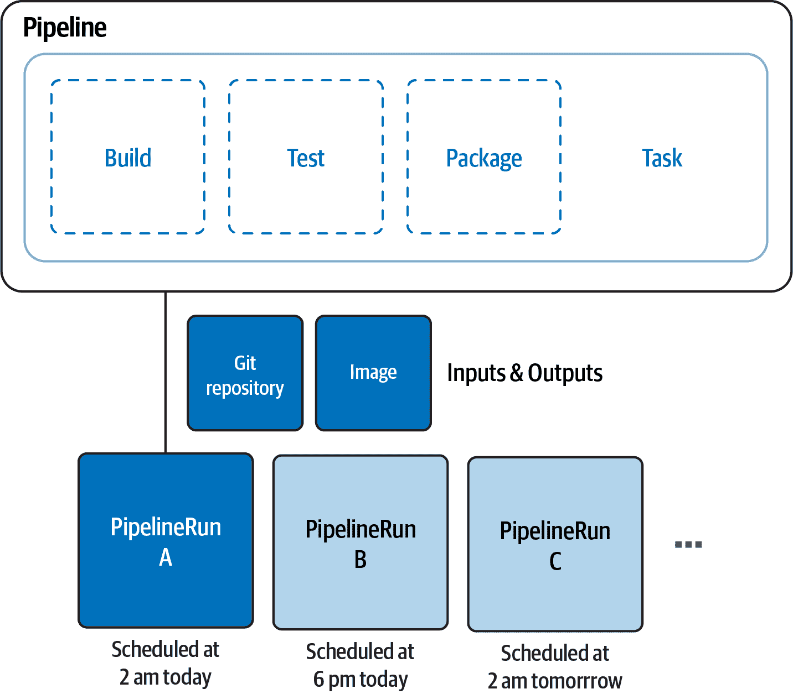
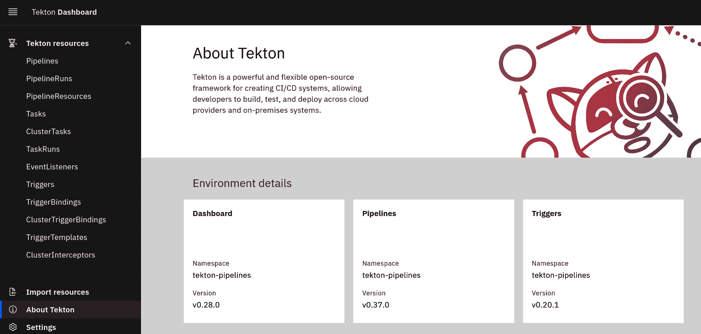
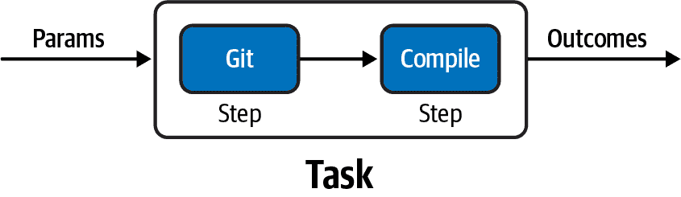
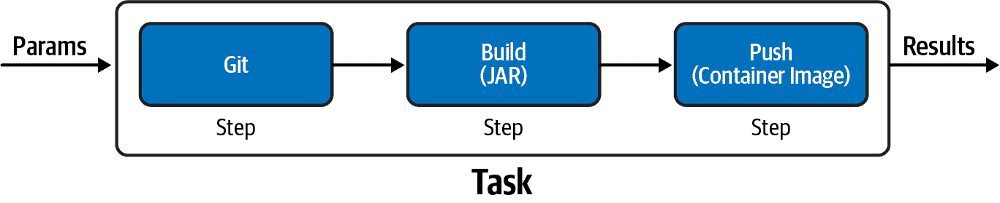
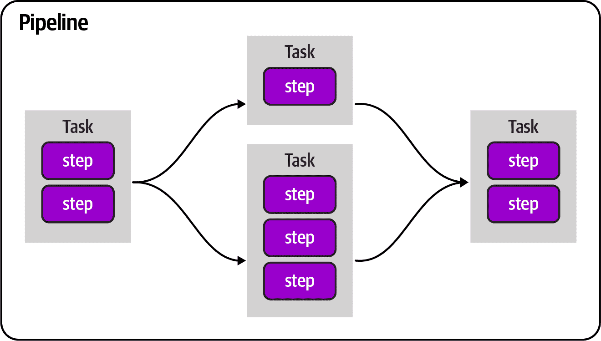
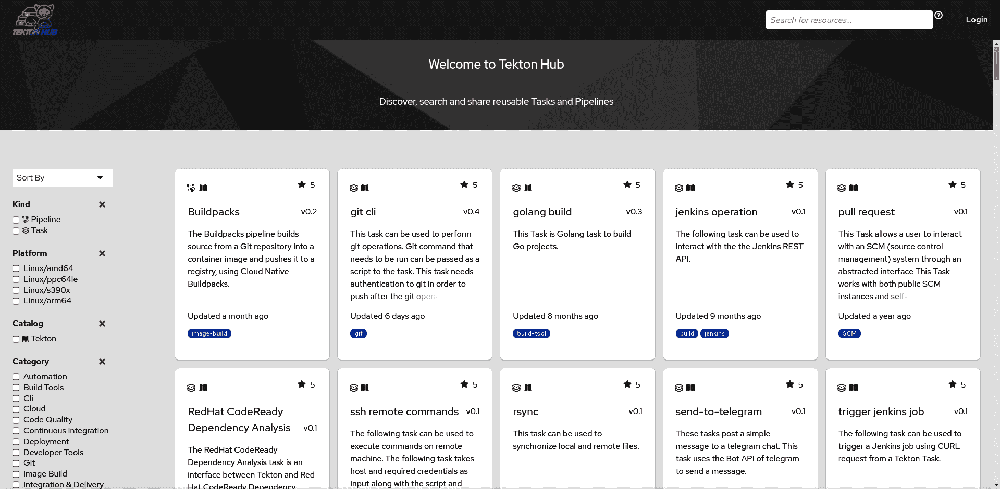
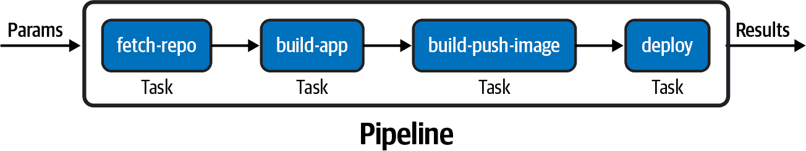
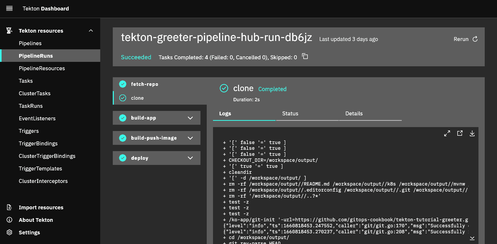
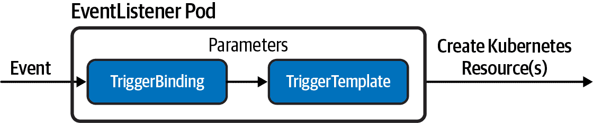

# 第六章 云原生 CI/CD

在前一章中，您了解了 Helm，这是 Kubernetes 的流行模板化系统。前几章的所有示例都代表了用于创建和管理 Kubernetes 容器的常见工具集，现在是时候考虑使用这些工具在 Kubernetes 上进行自动化了。让我们把焦点转向云原生持续集成/持续部署（CI/CD）。

持续集成是一个自动化流程，它获取开发人员创建的新代码并构建、测试和运行该代码。云原生 CI 指的是云计算和云服务参与此过程的模型。这种模型的好处很多，例如在高度可伸缩和按需使用案例中跨云平台上可移植和可重现的工作负载。它还代表了 GitOps 工作流的构建块，因为它通过 Git 执行的操作实现了自动化。

[Tekton](https://tekton.dev) 是一个流行的开源实现，在 Kubernetes 之上构建了一个云原生 CI/CD 系统。实际上，Tekton 作为 Kubernetes 集群的扩展安装和运行，并包括一组 Kubernetes 自定义资源，定义了可以为您的流水线创建和重复使用的构建块。¹ (参见 Recipe 6.1.)

Tekton 引擎位于 Kubernetes 集群内部，并通过其 API 对象表示一种声明性方式来定义执行操作的方式。核心组件如 *Tasks* 和 *Pipelines* 可用于创建从 Git 存储库生成工件和/或容器的流水线（参见 Recipes 6.2，6.3，和 6.4)。

Tekton 还支持一种用于通过 *Triggers* 自动启动流水线的机制。这些允许您从多种来源（如 webhook）检测和提取事件信息，并相应地启动 Tasks 或 Pipelines（参见 Recipe 6.8）。

与私有 Git 存储库一起工作是 Tekton 支持的常见用例（参见 Recipe 6.4），可以通过多种方式构建工件和创建容器，例如使用 Buildah（参见 Recipe 6.5）或我们在 第三章 中讨论的 Shipwright。还可以集成 Kustomize（参见 Recipe 6.9）和 Helm（参见 Recipe 6.10），以使 CI 部分动态化并充分利用 Kubernetes 工具的丰富生态系统。

Tekton 是 Kubernetes 本地解决方案，因此它是通用的；然而，它并非市场上唯一的云原生 CI/CD 解决方案。其他适用于 GitOps 工作负载的良好示例包括 Drone (Recipe 6.11) 和 GitHub Actions (Recipe 6.12)。

# 6.1 安装 Tekton

## 问题

您希望安装 Tekton 以便在 Kubernetes 集群上实现云原生 CI/CD。

## 解决方案

[Tekton](https://tekton.dev)是一种原生于 Kubernetes 的 CI/CD 解决方案，可安装在任何 Kubernetes 集群上。安装会为你带来一组[Kubernetes 自定义资源（CRDs）](https://oreil.ly/mv0cl)，你可以使用它们来组合你的流水线，如图 6-1 所示：

任务

一个可重用的、松耦合的步骤集，执行特定功能（例如构建容器镜像）。任务作为 Kubernetes pod 执行，而任务中的步骤映射到容器中。

流水线

一个构建和/或部署应用程序所需的任务列表。

任务运行

运行任务实例的执行和结果。

流水线运行

运行流水线实例的执行和结果，其中包括若干个任务运行。

触发器

检测事件并连接到其他 CRD 以指定当事件发生时发生的情况。



###### 图 6-1. Tekton 流水线

要安装 Tekton，你只需`kubectl` CLI 和一个像 Minikube 这样的 Kubernetes 集群（参见第二章）。

Tekton 具有模块化结构。你可以单独安装所有组件或一次性安装所有组件（例如使用操作员）：

Tekton 流水线

包含任务和流水线

Tekton 触发器

包含触发器和事件监听器

Tekton 仪表板

一个便捷的仪表板，用于可视化流水线和日志

Tekton 命令行界面

一个 CLI 工具，用于管理 Tekton 对象（启动/停止流水线和任务，检查日志）

###### 提示

你还可以使用 Kubernetes Operator 在集群上安装和管理 Tekton 组件。详细信息请参阅[OperatorHub](https://oreil.ly/6UoU3)。

首先，你需要安装[Tekton 流水线](https://oreil.ly/o0L2V)组件。在撰写本书时，我们使用的是版本 0.37.0：

```
kubectl apply \
-f https://storage.googleapis.com/tekton-releases/pipeline/previous/v0.37.0/release.yaml
```

安装将创建一个名为`tekton-pipelines`的新的 Kubernetes 命名空间，你应该看到类似以下的输出：

```
namespace/tekton-pipelines created
podsecuritypolicy.policy/tekton-pipelines created
clusterrole.rbac.authorization.k8s.io/tekton-pipelines-controller-cluster-access created
clusterrole.rbac.authorization.k8s.io/tekton-pipelines-controller-tenant-access created
clusterrole.rbac.authorization.k8s.io/tekton-pipelines-webhook-cluster-access created
role.rbac.authorization.k8s.io/tekton-pipelines-controller created
role.rbac.authorization.k8s.io/tekton-pipelines-webhook created
role.rbac.authorization.k8s.io/tekton-pipelines-leader-election created
role.rbac.authorization.k8s.io/tekton-pipelines-info created
serviceaccount/tekton-pipelines-controller created
serviceaccount/tekton-pipelines-webhook created
clusterrolebinding.rbac.authorization.k8s.io/tekton-pipelines-controller-cluster-access created
clusterrolebinding.rbac.authorization.k8s.io/tekton-pipelines-controller-tenant-access created
clusterrolebinding.rbac.authorization.k8s.io/tekton-pipelines-webhook-cluster-access created
rolebinding.rbac.authorization.k8s.io/tekton-pipelines-controller created
rolebinding.rbac.authorization.k8s.io/tekton-pipelines-webhook created
rolebinding.rbac.authorization.k8s.io/tekton-pipelines-controller-leaderelection created
rolebinding.rbac.authorization.k8s.io/tekton-pipelines-webhook-leaderelection created
rolebinding.rbac.authorization.k8s.io/tekton-pipelines-info created
customresourcedefinition.apiextensions.k8s.io/clustertasks.tekton.dev created
customresourcedefinition.apiextensions.k8s.io/pipelines.tekton.dev created
customresourcedefinition.apiextensions.k8s.io/pipelineruns.tekton.dev created
customresourcedefinition.apiextensions.k8s.io/resolutionrequests.resolution.tekton.dev created
customresourcedefinition.apiextensions.k8s.io/pipelineresources.tekton.dev created
customresourcedefinition.apiextensions.k8s.io/runs.tekton.dev created
customresourcedefinition.apiextensions.k8s.io/tasks.tekton.dev created
customresourcedefinition.apiextensions.k8s.io/taskruns.tekton.dev created
secret/webhook-certs created
validatingwebhookconfiguration.admissionregistration.k8s.io/validation.webhook.pipeline.tekton.dev created
mutatingwebhookconfiguration.admissionregistration.k8s.io/webhook.pipeline.tekton.dev created
validatingwebhookconfiguration.admissionregistration.k8s.io/config.webhook.pipeline.tekton.dev created
clusterrole.rbac.authorization.k8s.io/tekton-aggregate-edit created
clusterrole.rbac.authorization.k8s.io/tekton-aggregate-view created
configmap/config-artifact-bucket created
configmap/config-artifact-pvc created
configmap/config-defaults created
configmap/feature-flags created
configmap/pipelines-info created
configmap/config-leader-election created
configmap/config-logging created
configmap/config-observability created
configmap/config-registry-cert created
deployment.apps/tekton-pipelines-controller created
service/tekton-pipelines-controller created
horizontalpodautoscaler.autoscaling/tekton-pipelines-webhook created
deployment.apps/tekton-pipelines-webhook created
service/tekton-pipelines-webhook created
```

你可以使用以下命令监视和验证安装：

```
kubectl get pods -w -n tekton-pipelines
```

你应该看到如下输出：

```
NAME                                           READY   STATUS    RESTARTS   AGE
tekton-pipelines-controller-5fd68749f5-tz8dv   1/1     Running   0          3m4s
tekton-pipelines-webhook-58dcdbfd9b-hswpk      1/1     Running   0          3m4s
```

###### 注意

前述命令进入监视模式，因此它会一直附加。当你看到控制器和 webhook pod 处于运行状态时，请按 Ctrl+C 停止它。

然后，你可以安装[Tekton 触发器](https://oreil.ly/Vq32h)。在撰写本书时，我们使用的是版本 0.20.1：

```
kubectl apply \
-f https://storage.googleapis.com/tekton-releases/triggers/previous/v0.20.1/release.yaml
```

你应该看到以下输出：

```
podsecuritypolicy.policy/tekton-triggers created
clusterrole.rbac.authorization.k8s.io/tekton-triggers-admin created
clusterrole.rbac.authorization.k8s.io/tekton-triggers-core-interceptors created
clusterrole.rbac.authorization.k8s.io/tekton-triggers-core-interceptors-secrets created
clusterrole.rbac.authorization.k8s.io/tekton-triggers-eventlistener-roles created
clusterrole.rbac.authorization.k8s.io/tekton-triggers-eventlistener-clusterroles created
role.rbac.authorization.k8s.io/tekton-triggers-admin created
role.rbac.authorization.k8s.io/tekton-triggers-admin-webhook created
role.rbac.authorization.k8s.io/tekton-triggers-core-interceptors created
role.rbac.authorization.k8s.io/tekton-triggers-info created
serviceaccount/tekton-triggers-controller created
serviceaccount/tekton-triggers-webhook created
serviceaccount/tekton-triggers-core-interceptors created
clusterrolebinding.rbac.authorization.k8s.io/tekton-triggers-controller-admin created
clusterrolebinding.rbac.authorization.k8s.io/tekton-triggers-webhook-admin created
clusterrolebinding.rbac.authorization.k8s.io/tekton-triggers-core-interceptors created
clusterrolebinding.rbac.authorization.k8s.io/tekton-triggers-core-interceptors-secrets created
rolebinding.rbac.authorization.k8s.io/tekton-triggers-controller-admin created
rolebinding.rbac.authorization.k8s.io/tekton-triggers-webhook-admin created
rolebinding.rbac.authorization.k8s.io/tekton-triggers-core-interceptors created
rolebinding.rbac.authorization.k8s.io/tekton-triggers-info created
customresourcedefinition.apiextensions.k8s.io/clusterinterceptors.triggers.tekton.dev created
customresourcedefinition.apiextensions.k8s.io/clustertriggerbindings.triggers.tekton.dev created
customresourcedefinition.apiextensions.k8s.io/eventlisteners.triggers.tekton.dev created
customresourcedefinition.apiextensions.k8s.io/triggers.triggers.tekton.dev created
customresourcedefinition.apiextensions.k8s.io/triggerbindings.triggers.tekton.dev created
customresourcedefinition.apiextensions.k8s.io/triggertemplates.triggers.tekton.dev created
secret/triggers-webhook-certs created
validatingwebhookconfiguration.admissionregistration.k8s.io/validation.webhook.triggers.tekton.dev created
mutatingwebhookconfiguration.admissionregistration.k8s.io/webhook.triggers.tekton.dev created
validatingwebhookconfiguration.admissionregistration.k8s.io/config.webhook.triggers.tekton.dev created
clusterrole.rbac.authorization.k8s.io/tekton-triggers-aggregate-edit created
clusterrole.rbac.authorization.k8s.io/tekton-triggers-aggregate-view created
configmap/config-defaults-triggers created
configmap/feature-flags-triggers created
configmap/triggers-info created
configmap/config-logging-triggers created
configmap/config-observability-triggers created
service/tekton-triggers-controller created
deployment.apps/tekton-triggers-controller created
service/tekton-triggers-webhook created
deployment.apps/tekton-triggers-webhook created
deployment.apps/tekton-triggers-core-interceptors created
service/tekton-triggers-core-interceptors created
clusterinterceptor.triggers.tekton.dev/cel created
clusterinterceptor.triggers.tekton.dev/bitbucket created
clusterinterceptor.triggers.tekton.dev/github created
clusterinterceptor.triggers.tekton.dev/gitlab created
secret/tekton-triggers-core-interceptors-certs created
```

你可以使用以下命令监视和验证安装：

```
kubectl get pods -w -n tekton-pipelines
```

你应该看到三个新创建并运行的 pod——`tekton-triggers-controller`、`tekton-triggers-core-interceptors`和`tekton-triggers-webhook`：

```
NAME                                                 READY   STATUS    RESTARTS   AGE
tekton-pipelines-controller-5fd68749f5-tz8dv         1/1     Running   0          27m
tekton-pipelines-webhook-58dcdbfd9b-hswpk            1/1     Running   0          27m
tekton-triggers-controller-854d44fd5d-8jf9q          1/1     Running   0          105s
tekton-triggers-core-interceptors-5454f8785f-dhsrb   1/1     Running   0          104s
tekton-triggers-webhook-86d75f875-zmjf4              1/1     Running   0          105s
```

安装完成后，你在 Kubernetes 集群上拥有一个完全可工作的 Tekton 安装，支持通过事件触发器进行流水线和自动化。此外，你还可以安装[Tekton 仪表板](https://oreil.ly/Db56q)，以便通过漂亮的 UI 可视化任务、流水线和日志。在撰写本书时，我们使用的是版本 0.28.0：

```
kubectl apply \
-f https://storage.googleapis.com/tekton-releases/dashboard/previous/v0.28.0/tekton-dashboard-release.yaml
```

你应该看到类似以下的输出：

```
customresourcedefinition.apiextensions.k8s.io/extensions.dashboard.tekton.dev created
serviceaccount/tekton-dashboard created
role.rbac.authorization.k8s.io/tekton-dashboard-info created
clusterrole.rbac.authorization.k8s.io/tekton-dashboard-backend created
clusterrole.rbac.authorization.k8s.io/tekton-dashboard-tenant created
rolebinding.rbac.authorization.k8s.io/tekton-dashboard-info created
clusterrolebinding.rbac.authorization.k8s.io/tekton-dashboard-backend created
configmap/dashboard-info created
service/tekton-dashboard created
deployment.apps/tekton-dashboard created
clusterrolebinding.rbac.authorization.k8s.io/tekton-dashboard-tenant created
```

您可以使用以下命令监视和验证安装：

```
kubectl get pods -w -n tekton-pipelines
```

您应该看到一个新的 pod 被创建并运行—`tekton-dashboard`：

```
NAME                                                READY STATUS   RESTARTS        AGE
tekton-dashboard-786b6b5579-sscgz                   1/1   Running  0               2m25s
tekton-pipelines-controller-5fd68749f5-tz8dv        1/1   Running  1 (7m16s ago)   5d7h
tekton-pipelines-webhook-58dcdbfd9b-hswpk           1/1   Running  1 (7m6s ago)    5d7h
tekton-triggers-controller-854d44fd5d-8jf9q         1/1   Running  2 (7m9s ago)    5d7h
tekton-triggers-core-interceptors-5454f8785f-dhsrb  1/1   Running  1 (7m7s ago)    5d7h
tekton-triggers-webhook-86d75f875-zmjf4             1/1   Running  2 (7m9s ago)    5d7h
```

默认情况下，仪表板不会在 Kubernetes 集群外部暴露。您可以使用以下命令访问它：

```
kubectl port-forward svc/tekton-dashboard 9097:9097 -n tekton-pipelines
```

###### 提示

在 Kubernetes 中暴露内部服务有几种方法；您还可以创建一个[Ingress](https://oreil.ly/wwWcX)，如 Tekton 仪表板[文档](https://oreil.ly/BeOlq)中所示。

您现在可以浏览*http://localhost:9097*以访问您的仪表板，如 Figure 6-2 所示。

您可以下载并安装[Tekton CLI](https://oreil.ly/U7FSt)适用于您的操作系统，以便从命令行开始创建任务和流水线。在撰写本书时，我们使用的是版本 0.25.0。



###### 图 6-2\. Tekton 仪表板

最后，验证`tkn`和 Tekton 是否正确配置：

```
tkn version
```

您应该获得以下输出：

```
Client version: 0.25.0
Pipeline version: v0.37.0
Triggers version: v0.20.1
Dashboard version: v0.28.0
```

## 参见

+   [Tekton 入门指南](https://oreil.ly/7I7ev)

# 6.2 创建一个 Hello World 任务

## 问题

您希望通过探索任务并创建一个示例任务来开始使用 Tekton。

## 解决方案

在 Tekton 中，一个任务定义了一系列按顺序运行的步骤，以执行任务所需的逻辑。每个[任务](https://oreil.ly/5ldpn)在您的 Kubernetes 集群上作为一个 pod 运行，每个步骤在自己的容器中运行。虽然任务内部的步骤是顺序执行的，但任务可以在流水线中并行执行。因此，任务是使用 Tekton 运行流水线的构建块。

让我们创建一个 Hello World 任务：

```
apiVersion: tekton.dev/v1beta1
kind: Task 
metadata:
  name: hello 
spec:
  steps: 
    - name: say-hello 
      image: registry.access.redhat.com/ubi8/ubi 
      command:
        - /bin/bash
      args: ['-c', 'echo Hello GitOps Cookbook reader!']
```


作为`Task`类型对象的 API


任务的名称


包含在此任务中的步骤列表，本例中只有一个


步骤的名称


步骤开始的容器镜像

首先，您需要在 Kubernetes 中创建此资源：

```
kubectl create -f helloworld-task.yaml
```

您应该获得以下输出：

```
task.tekton.dev/hello created
```

您可以验证对象是否已在当前的 Kubernetes 命名空间中创建：

```
kubectl get tasks
```

您应该看到类似以下的输出：

```
NAME    AGE
hello   90s
```

现在，您可以使用`tkn` CLI 启动您的 Tekton 任务：

```
tkn task start --showlog hello
```

您应该看到类似以下的输出：

```
TaskRun started: hello-run-8bmzz
Waiting for logs to be available...
[say-hello] Hello World
```

###### 注意

一个 TaskRun 是一个正在运行的任务的 API 表示。查看 Recipe 6.3 获取更多细节。

## 参见

+   [Tekton 任务文档](https://oreil.ly/5ldpn)

# 6.3 创建一个从 Git 编译和打包应用的任务

## 问题

您希望使用 Tekton 在 Kubernetes 上自动编译和打包来自 Git 的应用程序。

## 解决方案

正如在配方 6.2 中所见，Tekton 任务具有一种灵活的机制，可以添加一个顺序步骤列表以自动执行操作。其思想是创建一个任务列表，并通过输入/输出链条来组合管道。因此，任务可以包含一系列可选字段，以更好地控制资源：

`inputs`

任务摄取的资源。

`outputs`

任务产生的资源。

`params`

将用于任务步骤的参数。每个参数都有：

`name`

参数的名称。

`description`

参数的描述。

`default`

参数的默认值。

`results`

任务写入执行结果的名称。

`workspaces`

任务需要的卷的路径。

`volumes`

任务还可以使用`volumes`属性挂载外部卷。

如图 6-3 所示的示例显示了一个名为`build-app`的任务，该任务使用`git`命令克隆源代码并将源代码列出到输出中。



###### 图 6-3。`build-app`任务

```
apiVersion: tekton.dev/v1beta1
kind: Task
metadata:
  name: build-app
spec:
  workspaces: 
    - name: source
      description: The git repo will be cloned onto the volume backing this workspace
  params: 
    - name: contextDir
      description: the context dir within source
      default: quarkus
    - name: tlsVerify
      description: tls verify
      type: string
      default: "false"
    - name: url
      default: https://github.com/gitops-cookbook/tekton-tutorial-greeter.git
    - name: revision
      default: master
    - name: subdirectory
      default: ""
    - name: sslVerify
      description: defines if http.sslVerify should be set to true or false in the global git config
      type: string
      default: "false"
  steps:
    - image: 'gcr.io/tekton-releases/github.com/tektoncd/pipeline/cmd/git-init:v0.21.0'
      name: clone
      resources: {}
      script: |
        CHECKOUT_DIR="$(workspaces.source.path)/$(params.subdirectory)"
        cleandir() {
          # Delete any existing contents of the repo directory if it exists.
          #
          # We don't just "rm -rf $CHECKOUT_DIR" because $CHECKOUT_DIR might be "/"
          # or the root of a mounted volume.
          if [[ -d "$CHECKOUT_DIR" ]] ; then
            # Delete non-hidden files and directories
            rm -rf "$CHECKOUT_DIR"/*
            # Delete files and directories starting with . but excluding ..
            rm -rf "$CHECKOUT_DIR"/.[!.]*
            # Delete files and directories starting with .. plus any other character
            rm -rf "$CHECKOUT_DIR"/..?*
          fi
        }
        /ko-app/git-init \
          -url "$(params.url)" \
          -revision "$(params.revision)" \
          -path "$CHECKOUT_DIR" \
          -sslVerify="$(params.sslVerify)"
        cd "$CHECKOUT_DIR"
        RESULT_SHA="$(git rev-parse HEAD)"
    - name: build-sources
      image: gcr.io/cloud-builders/mvn
      command:
        - mvn
      args:
        - -DskipTests
        - clean
        - install
      env:
        - name: user.home
          value: /home/tekton
      workingDir: "/workspace/source/$(params.contextDir)"
```


一个任务步骤和管道任务可以通过 Tekton 工作空间共享共享文件系统。工作空间可以由类似 PersistentVolumeClaim（PVC）和`ConfigMap`之类的东西支持，或者只是临时的（`emptyDir`）。


任务可以有参数；此功能使执行动态化。

让我们使用以下命令创建任务：

```
kubectl create -f build-app-task.yaml
```

您应该获得类似以下的输出：

```
task.tekton.dev/build-app created
```

您可以验证对象是否已在当前的 Kubernetes 命名空间中创建：

```
kubectl get tasks
```

您应该获得类似以下的输出：

```
NAME        AGE
build-app   3s
```

您还可以使用`tkn` CLI 列出任务：

```
tkn task ls
```

您应该获得类似以下的输出：

```
NAME        DESCRIPTION   AGE
build-app                 10 seconds ago
```

当您启动任务时，将创建一个新的[TaskRun](https://oreil.ly/MZ5DY)对象。TaskRuns 是正在运行任务的 API 表示；因此，您可以使用以下命令使用`tkn` CLI 创建它：

```
tkn task start build-app \
  --param contextDir='quarkus' \
  --workspace name=source,emptyDir="" \
  --showlog
```

###### 提示

当在任务或管道中使用参数时，如果需要，您将被提示添加新值或确认默认值。为了在不提示值的情况下使用任务定义中的默认值，您可以使用`--use-param-defaults`选项。

您应该获得类似以下的输出：

```
? Value for param `tlsVerify` of type `string`? (Default is `false`) false
? Value for param `url` of type `string`? (Default is `https://github.com/gitops-cookbook/tekton-tutorial-greeter.git`) https://github.com/gitops-cookbook/tekton-tutorial-greeter.git
? Value for param `revision` of type `string`? (Default is `master`) master
? Value for param `subdirectory` of type `string`? (Default is ``)
? Value for param `sslVerify` of type `string`? (Default is `false`) false
TaskRun started: build-app-run-rzcd8
Waiting for logs to be available...
[clone] {"level":"info","ts":1659278019.0018234,"caller":"git/git.go:169","msg":"Successfully cloned https://github.com/gitops-cookbook/tekton-tutorial-greeter.git @ d9291c456db1ce29177b77ffeaa9b71ad80a50e6 (grafted, HEAD, origin/master) in path /workspace/source/"}
[clone] {"level":"info","ts":1659278019.0227938,"caller":"git/git.go:207","msg":"Successfully initialized and updated submodules in path /workspace/source/"}

[build-sources] [INFO] Scanning for projects...
[build-sources] Downloading from central: https://repo.maven.apache.org/maven2/io/quarkus/quarkus-universe-bom/1.6.1.Final/quarkus-universe-bom-1.6.1.Final.pom
Downloaded from central: https://repo.maven.apache.org/maven2/io/quarkus/quarkus-universe-bom/1.6.1.Final/quarkus-universe-bom-1.6.1.Final.pom (412 kB at 118 kB/s)
[build-sources] [INFO]
...
[build-sources] [INFO] Installing /workspace/source/quarkus/target/tekton-quarkus-greeter.jar to /root/.m2/repository/com/redhat/developers/tekton-quarkus-greeter/1.0.0-SNAPSHOT/tekton-quarkus-greeter-1.0.0-SNAPSHOT.jar
[build-sources] [INFO] Installing /workspace/source/quarkus/pom.xml to /root/.m2/repository/com/redhat/developers/tekton-quarkus-greeter/1.0.0-SNAPSHOT/tekton-quarkus-greeter-1.0.0-SNAPSHOT.pom
[build-sources] [INFO] ------------------------------------------------------------------------
[build-sources] [INFO] BUILD SUCCESS
[build-sources] [INFO] ------------------------------------------------------------------------
[build-sources] [INFO] Total time:  04:41 min
[build-sources] [INFO] Finished at: 2022-07-31T14:38:22Z
[build-sources] [INFO] ------------------------------------------------------------------------
```

或者，您可以像这样手动创建一个`TaskRun`对象：

```
apiVersion: tekton.dev/v1beta1
kind: TaskRun
metadata:
  generateName: build-app-run- 
  labels:
    app.kubernetes.io/managed-by: tekton-pipelines
    tekton.dev/task: build-app
spec:
  params:
  - name: contextDir
    value: quarkus
  - name: revision
    value: master
  - name: sslVerify
    value: "false"
  - name: subdirectory
    value: ""
  - name: tlsVerify
    value: "false"
  - name: url
    value: https://github.com/gitops-cookbook/tekton-tutorial-greeter.git
  taskRef: 
    kind: Task
    name: build-app
  workspaces:
  - emptyDir: {}
    name: source
```


如果您不想为每个`TaskRun`指定名称，可以使用`generateName`属性，让 Tekton 从您定义的字符串中随机选择一个。


在这里列出`TaskRun`引用的任务。

并以这种方式启动它：

```
kubectl create -f build-app-taskrun.yaml
```

您应该获得类似以下的输出：

```
taskrun.tekton.dev/build-app-run-65vmh created
```

您还可以使用`tkn` CLI 验证它：

```
tkn taskrun ls
```

您应该获得类似以下的输出：

```
NAME                  STARTED          DURATION   STATUS
build-app-run-65vmh   1 minutes ago   2m37s      Succeeded
build-app-run-rzcd8   2 minutes ago   3m58s      Succeeded
```

通过指定`TaskRun`的名称，您可以从中获取日志：

```
tkn taskrun logs build-app-run-65vmh -f
```

## 参见

[调试 TaskRun](https://oreil.ly/PxRNG)

# 6.4 创建一个任务来从私有 Git 编译和打包应用程序

## 问题

你想要使用私有 Git 仓库来自动化在 Kubernetes 上使用 Tekton 编译和打包应用程序。

## 解决方案

在 Recipe 6.3 中，你看到如何使用公共 Git 存储库编译和打包示例 Java 应用程序，但大多数时候人们在工作中处理的是私有仓库，那么如何集成它们呢？Tekton 支持以下用于 Git 的身份验证方案：

+   基本身份验证

+   SSH

你可以使用 Kubernetes 的[秘钥](https://oreil.ly/Oxj6W)来存储你的凭据，并将其附加到运行 Tekton 任务或流水线的[`ServiceAccount`](https://oreil.ly/6UC3O)。

###### 提示

Tekton 使用默认的服务账户，但你可以按照[这里的文档](https://oreil.ly/ID6m0)覆盖它。

让我们从一个常见的基本身份验证示例开始，以及像 GitHub 这样的热门 Git 服务。

###### 注意

GitHub 使用个人访问令牌（PAT）作为与密码身份验证的替代方案。你可以使用 PAT 代替明文密码以增强安全性。

首先，你需要创建一个秘钥。你可以通过创建以下 YAML 文件来做到这一点：

```
apiVersion: v1
kind: Secret
metadata:
  name: github-secret
  annotations:
    tekton.dev/git-0: https://github.com 
type: kubernetes.io/basic-auth 
stringData:
  username: YOUR_USERNAME 
  password: YOUR_PASSWORD 
```


在这里，你指定 Tekton 将使用此秘钥的 URL，本例中为 GitHub


这是这种秘钥的类型，此处是基本身份验证


你的 Git 用户，本例中是你的 GitHub 用户


你的 Git 密码，本例中是你的 GitHub 个人访问令牌

现在你可以使用以下命令创建秘钥：

```
kubectl create -f git-secret.yaml
```

你应该得到以下输出：

```
secret/git-secret created
```

你还可以避免编写 YAML 并执行以下所有操作：

```
kubectl create secret generic git-secret \
    --type=kubernetes.io/basic-auth \
    --from-literal=username=YOUR_USERNAME \
    --from-literal=password=YOUR_PASSWORD
```

然后你只需如下注释秘钥：

```
kubectl annotate secret git-secret "tekton.dev/git-0=https://github.com"
```

一旦创建并注释了你的秘钥（Secret），你需要将其附加到运行 Tekton 任务或流水线的`ServiceAccount`。

让我们为此目的创建一个新的`ServiceAccount`：

```
apiVersion: v1
kind: ServiceAccount
metadata:
  name: tekton-bot-sa
secrets:
  - name: git-secret 
```


附加到此`ServiceAccount`的秘钥列表

```
kubectl create -f tekton-bot-sa.yaml
```

你应该得到以下输出：

```
serviceaccount/tekton-bot-sa created
```

###### 提示

你可以直接使用`kubectl`创建`ServiceAccount`，如下所示：

```
kubectl create serviceaccount tekton-bot-sa
```

然后进行补丁添加秘钥引用：

```
kubectl patch serviceaccount tekton-bot-sa -p '{"secrets": [{"name": "git-secret"}]}'
```

一旦设置了凭据并将其链接到运行任务或流水线的`ServiceAccount`，你可以在你的`tkn`命令中添加`--serviceaccount=<NAME>`选项，使用 Recipe 6.3 的示例：

```
tkn task start build-app \
  --serviceaccount='tekton-bot-sa' \ 
  --param url='https://github.com/gitops-cookbook/tekton-greeter-private.git' \ 
  --param contextDir='quarkus' \
  --workspace name=source,emptyDir="" \
  --showlog
```


在这里，你指定要使用的`ServiceAccount`；这将在运行时覆盖默认设置。


在这里，你可以使用你选择的替换默认仓库。在这个例子中，有一个你无法访问的私有仓库，但你可以自己创建一个私有仓库，并像这样进行测试。

您应该得到类似以下的输出：

```
...
[clone] {"level":"info","ts":1659354692.1365478,"caller":"git/git.go:169","msg":"Successfully cloned https://github.com/gitops-cookbook/tekton-greeter-private.git @ 5250e1fa185805373e620d1c04a0c48129efd2ee (grafted, HEAD, origin/master) in path /workspace/source/"}
[clone] {"level":"info","ts":1659354692.1546066,"caller":"git/git.go:207","msg":"Successfully initialized and updated submodules in path /workspace/source/"}
...
[build-sources] [INFO] ------------------------------------------------------------------------
[build-sources] [INFO] BUILD SUCCESS
[build-sources] [INFO] ------------------------------------------------------------------------
[build-sources] [INFO] Total time:  04:30 min
[build-sources] [INFO] Finished at: 2022-07-31T15:30:01Z
[build-sources] [INFO] ------------------------------------------------------------------------
```

## 另请参阅

+   [Tekton 认证](https://oreil.ly/6W9xF)

# 6.5 使用 Tekton 任务和 Buildah 容器化应用程序

## 问题

您希望在 Kubernetes 上使用 Tekton 任务编译、打包和容器化您的应用程序。

## 解决方案

在采用云原生方法时自动化至关重要，如果您决定在 Kubernetes 上使用 CI/CD 工作负载，您需要提供一种打包和部署应用程序的方式。

实际上，Kubernetes 本身没有内置的构建容器的机制；它依赖于 Tekton 或外部服务来实现这一目的。这就是为什么在第三章中，我们概述了如何使用各种开源工具为打包应用程序创建容器。在第 3.3 节中，我们使用 Buildah 从 Dockerfile 创建了一个容器。

多亏了 Tekton 的可扩展模型，您可以重用在第 6.3 节的配方中定义的同一任务，以添加一个步骤来使用前面步骤的结果创建一个容器，如图 6-4 所示。



###### 图 6-4\. 构建推送应用

容器可以推送到公共容器注册表，如 DockerHub 或 Quay.io，也可以推送到私有容器注册表。与我们在第 6.4 节中看到的私有 Git 存储库类似，将容器映像推送到容器注册表需要进行身份验证。需要将 Secret 附加到运行任务的`ServiceAccount`，如下所示。请参阅第二章，了解如何注册和使用公共注册表。

```
kubectl create secret docker-registry container-registry-secret \
  --docker-server='YOUR_REGISTRY_SERVER' \
  --docker-username='YOUR_REGISTRY_USER' \
  --docker-password='YOUR_REGISTRY_PASS'
```

```
secret/container-registry-secret created
```

确保它存在，并检查 Secret 的类型是`kubernetes.io/dockerconfigjson`：

```
kubectl get secrets
```

您应该得到以下输出：

```
NAME                        TYPE                             DATA   AGE
container-registry-secret   kubernetes.io/dockerconfigjson   1      1s
```

让我们为此任务创建一个`ServiceAccount`：

```
kubectl create serviceaccount tekton-registry-sa
```

然后将先前生成的**Secret**添加到此`ServiceAccount`：

```
kubectl patch serviceaccount tekton-registry-sa \
  -p '{"secrets": [{"name": "container-registry-secret"}]}'
```

您应该得到以下输出：

```
serviceaccount/tekton-registry-sa patched
```

让我们添加一个新步骤来创建一个容器映像并将其推送到容器注册表。在以下示例中，我们使用的是 Quay.io 的书籍组织存储库—`quay.io/gitops-cookbook/tekton-greeter:latest`：

```
apiVersion: tekton.dev/v1beta1
kind: Task
metadata:
  name: build-push-app
spec:
  workspaces:
    - name: source
      description: The git repo will be cloned onto the volume backing this workspace
  params:
    - name: contextDir
      description: the context dir within source
      default: quarkus
    - name: tlsVerify
      description: tls verify
      type: string
      default: "false"
    - name: url
      default: https://github.com/gitops-cookbook/tekton-tutorial-greeter.git
    - name: revision
      default: master
    - name: subdirectory
      default: ""
    - name: sslVerify
      description: defines if http.sslVerify should be set to true or false in the global git config
      type: string
      default: "false"
    - name: storageDriver
      type: string
      description: Storage driver
      default: vfs
    - name: destinationImage
      description: the fully qualified image name
      default: ""
  steps:
    - image: 'gcr.io/tekton-releases/github.com/tektoncd/pipeline/cmd/git-init:v0.21.0'
      name: clone
      resources: {}
      script: |
        CHECKOUT_DIR="$(workspaces.source.path)/$(params.subdirectory)"
        cleandir() {
          # Delete any existing contents of the repo directory if it exists.
          #
          # We don't just "rm -rf $CHECKOUT_DIR" because $CHECKOUT_DIR might be "/"
          # or the root of a mounted volume.
          if [[ -d "$CHECKOUT_DIR" ]] ; then
            # Delete non-hidden files and directories
            rm -rf "$CHECKOUT_DIR"/*
            # Delete files and directories starting with . but excluding ..
            rm -rf "$CHECKOUT_DIR"/.[!.]*
            # Delete files and directories starting with .. plus any other character
            rm -rf "$CHECKOUT_DIR"/..?*
          fi
        }
        /ko-app/git-init \
          -url "$(params.url)" \
          -revision "$(params.revision)" \
          -path "$CHECKOUT_DIR" \
          -sslVerify="$(params.sslVerify)"
        cd "$CHECKOUT_DIR"
        RESULT_SHA="$(git rev-parse HEAD)"
    - name: build-sources
      image: gcr.io/cloud-builders/mvn
      command:
        - mvn
      args:
        - -DskipTests
        - clean
        - install
      env:
        - name: user.home
          value: /home/tekton
      workingDir: "/workspace/source/$(params.contextDir)"
    - name: build-and-push-image
      image: quay.io/buildah/stable
      script: |
        #!/usr/bin/env bash
        buildah --storage-driver=$STORAGE_DRIVER --tls-verify=$(params.tlsVerify) bud --layers -t $DESTINATION_IMAGE $CONTEXT_DIR
        buildah --storage-driver=$STORAGE_DRIVER --tls-verify=$(params.tlsVerify) push $DESTINATION_IMAGE docker://$DESTINATION_IMAGE
      env:
        - name: DESTINATION_IMAGE
          value: "$(params.destinationImage)"
        - name: CONTEXT_DIR
          value: "/workspace/source/$(params.contextDir)"
        - name: STORAGE_DRIVER
          value: "$(params.storageDriver)"
      workingDir: "/workspace/source/$(params.contextDir)"
      volumeMounts:
        - name: varlibc
          mountPath: /var/lib/containers
  volumes:
    - name: varlibc
      emptyDir: {}
```

让我们创建此任务：

```
kubectl create -f build-push-app.yaml
```

您应该得到以下输出：

```
task.tekton.dev/build-push-app created
```

现在让我们使用 Buildah 步骤启动任务，创建一个容器映像，并使用新参数`destinationImage`来指定将结果容器映像推送到哪里：

```
tkn task start build-push-app \
  --serviceaccount='tekton-registry-sa' \
  --param url='https://github.com/gitops-cookbook/tekton-tutorial-greeter.git' \
  --param destinationImage='quay.io/gitops-cookbook/tekton-greeter:latest' \ 
  --param contextDir='quarkus' \
  --workspace name=source,emptyDir="" \
  --use-param-defaults \
  --showlog
```


在这里，您可以放置您的注册表；在这个例子中，我们使用的是 Quay.io 的书籍组织存储库。

您应该得到类似以下的输出：

```
...
Downloaded from central: https://repo.maven.apache.org/maven2/org/codehaus/plexus/plexus-utils/3.0.5/plexus-utils-3.0.5.jar (230 kB at 301 kB/s)
[build-sources] [INFO] Installing /workspace/source/quarkus/target/tekton-quarkus-greeter.jar to /root/.m2/repository/com/redhat/developers/tekton-quarkus-greeter/1.0.0-SNAPSHOT/tekton-quarkus-greeter-1.0.0-SNAPSHOT.jar
[build-sources] [INFO] Installing /workspace/source/quarkus/pom.xml to /root/.m2/repository/com/redhat/developers/tekton-quarkus-greeter/1.0.0-SNAPSHOT/tekton-quarkus-greeter-1.0.0-SNAPSHOT.pom
[build-sources] [INFO] ------------------------------------------------------------------------
[build-sources] [INFO] BUILD SUCCESS
[build-sources] [INFO] ------------------------------------------------------------------------
[build-sources] [INFO] Total time:  02:59 min
[build-sources] [INFO] Finished at: 2022-08-02T06:18:37Z
[build-sources] [INFO] ------------------------------------------------------------------------
[build-and-push-image] STEP 1/2: FROM registry.access.redhat.com/ubi8/openjdk-11
[build-and-push-image] Trying to pull registry.access.redhat.com/ubi8/openjdk-11:latest...
[build-and-push-image] Getting image source signatures
[build-and-push-image] Checking if image destination supports signatures
[build-and-push-image] Copying blob sha256:1e09a5ee0038fbe06a18e7f355188bbabc387467144abcd435f7544fef395aa1
[build-and-push-image] Copying blob sha256:0d725b91398ed3db11249808d89e688e62e511bbd4a2e875ed8493ce1febdb2c
[build-and-push-image] Copying blob sha256:1e09a5ee0038fbe06a18e7f355188bbabc387467144abcd435f7544fef395aa1
[build-and-push-image] Copying blob sha256:0d725b91398ed3db11249808d89e688e62e511bbd4a2e875ed8493ce1febdb2c
[build-and-push-image] Copying blob sha256:e441d34134fac91baa79be3e2bb8fb3dba71ba5c1ea012cb5daeb7180a054687
[build-and-push-image] Copying blob sha256:e441d34134fac91baa79be3e2bb8fb3dba71ba5c1ea012cb5daeb7180a054687
[build-and-push-image] Copying config sha256:0c308464b19eaa9a01c3fdd6b63a043c160d4eea85e461bbbb7d01d168f6d993
[build-and-push-image] Writing manifest to image destination
[build-and-push-image] Storing signatures
[build-and-push-image] STEP 2/2: COPY target/quarkus-app /deployments/
[build-and-push-image] COMMIT quay.io/gitops-cookbook/tekton-greeter:latest
[build-and-push-image] --> 42fe38b4346
[build-and-push-image] Successfully tagged quay.io/gitops-cookbook/tekton-greeter:latest
[build-and-push-image] 42fe38b43468c3ca32262dbea6fd78919aba2bd35981cd4f71391e07786c9e21
[build-and-push-image] Getting image source signatures
[build-and-push-image] Copying blob sha256:647a854c512bad44709221b6b0973e884f29bcb5a380ee32e95bfb0189b620e6
[build-and-push-image] Copying blob sha256:f2ee6b2834726167d0de06f3bbe65962aef79855c5ede0d2ba93b4408558d9c9
[build-and-push-image] Copying blob sha256:8e0e04b5c700a86f4a112f41e7e767a9d7c539fe3391611313bf76edb07eeab1
[build-and-push-image] Copying blob sha256:69c55192bed92cbb669c88eb3c36449b64ac93ae466abfff2a575273ce05a39e
[build-and-push-image] Copying config sha256:42fe38b43468c3ca32262dbea6fd78919aba2bd35981cd4f71391e07786c9e21
[build-and-push-image] Writing manifest to image destination
[build-and-push-image] Storing signatures
```

## 另请参阅

+   [Buildah](https://buildah.io)

+   [Tekton 的 Docker 认证](https://oreil.ly/QJlVW)

# 6.6 使用 Tekton 任务部署应用程序到 Kubernetes

## 问题

您想要使用 Tekton 任务将应用程序从容器映像部署到 Kubernetes。

## 解决方案

在 示例 6.3、6.4 和 6.5 中，我们列出了一个对持续集成（CI）有用的 Tekton 任务，而在这个示例中，我们将从持续部署（CD）部分开始，通过将现有的容器镜像部署到 Kubernetes。

我们可以重用我们在 示例 6.5 中创建并推送的容器镜像，其位置为 `quay.io/gitops-cookbook/tekton-greeter:latest`：

```
apiVersion: tekton.dev/v1beta1
kind: Task
metadata:
  name: kubectl
spec:
  params:
    - name: SCRIPT
      description: The kubectl CLI arguments to run
      type: string
      default: "kubectl help"
  steps:
    - name: oc
      image: quay.io/openshift/origin-cli:latest 
      script: |
        #!/usr/bin/env bash

        $(params.SCRIPT)
```


在此示例中，我们使用的是来自此容器镜像的 `kubectl`，它还包含 OpenShift CLI，并且其大小比 `gcr.io/cloud-builders/kubectl` 要小。

让我们创建这个任务：

```
kubectl create -f kubectl-task.yaml
```

你应该得到以下输出：

```
task.tekton.dev/kubectl created
```

正如在 示例 6.5 中所讨论的，Tekton 在运行任务和流水线时使用默认的 `ServiceAccount`，除非在运行时或全局范围内进行了特定定义的覆盖。最佳实践是始终为特定操作创建一个特定的 `ServiceAccount`，因此让我们为此示例创建一个名为 `tekton-deployer-sa` 的特定 `ServiceAccount` 如下：

```
kubectl create serviceaccount tekton-deployer-sa
```

你应该得到以下输出：

```
serviceaccount/tekton-deployer-sa created
```

一个 `ServiceAccount` 需要权限将应用程序部署到 Kubernetes。[角色（Roles）和角色绑定（RoleBindings）](https://oreil.ly/6ov6J) 是用于将特定权限映射给用户或 `ServiceAccount` 的 API 对象。

首先，为运行 Tekton 任务的 `ServiceAccount` 定义一个名为 `pipeline-role` 的角色，并赋予部署应用程序的权限：

```
apiVersion: rbac.authorization.k8s.io/v1
kind: Role
metadata:
  name: task-role
rules:
  - apiGroups:
      - ""
    resources:
      - pods
      - services
      - endpoints
      - configmaps
      - secrets
    verbs:
      - "*"
  - apiGroups:
      - apps
    resources:
      - deployments
      - replicasets
    verbs:
      - "*"
  - apiGroups:
      - ""
    resources:
      - pods
    verbs:
      - get
  - apiGroups:
      - apps
    resources:
      - replicasets
    verbs:
      - get
```

现在，你需要将角色绑定到 `ServiceAccount`：

```
apiVersion: rbac.authorization.k8s.io/v1
kind: RoleBinding
metadata:
  name: task-role-binding
roleRef:
  kind: Role
  name: task-role
  apiGroup: rbac.authorization.k8s.io
subjects:
  - kind: ServiceAccount
    name: tekton-deployer-sa
```

现在，你可以按以下方式创建这两个资源：

```
kubectl create -f task-role.yaml
kubectl create -f task-role-binding.yaml
```

你应该得到以下输出：

```
role.rbac.authorization.k8s.io/task-role created
rolebinding.rbac.authorization.k8s.io/task-role-binding created
```

最后，你可以按以下方式定义一个 TaskRun：

```
apiVersion: tekton.dev/v1beta1
kind: TaskRun
metadata:
  name: kubectl-taskrun
spec:
  serviceAccountName: tekton-deployer-sa
  taskRef:
    name: kubectl
  params:
    - name: SCRIPT
      value: |
        kubectl create deploy tekton-greeter --image=quay.io/gitops-cookbook/tekton-greeter:latest
```

并以以下方式运行它：

```
kubectl create -f kubectl-taskrun.yaml
```

你应该得到以下输出：

```
taskrun.tekton.dev/kubectl-run created
```

你可以检查日志查看结果：

```
tkn taskrun logs kubectl-run -f
```

你应该得到类似以下的输出：

```
? Select taskrun: kubectl-run started 9 seconds ago
[oc] deployment.apps/tekton-greeter created
```

几秒钟后，你应该看到部署处于就绪状态：

```
kubectl get deploy

NAME             READY   UP-TO-DATE   AVAILABLE   AGE
tekton-greeter   1/1     1            0           30s
```

###### 注意

第一次可能会花费一些时间，因为需要拉取容器镜像。

检查应用是否可用，将部署暴露，并将 Kubernetes 流量转发到你的工作站进行测试：

```
kubectl expose deploy/tekton-greeter --port 8080
kubectl port-forward svc/tekton-greeter 8080:8080
```

在另一个终端中，运行以下命令：

```
curl localhost:8080
```

你应该看到以下输出：

```
Meeow!! from Tekton ----
```

## 参见

+   [Tekton 任务](https://oreil.ly/YlIZI)

# 6.7 创建 Tekton 流水线以构建并部署应用到 Kubernetes

## 问题

你想要创建一个用于在 Kubernetes 上编译、打包和部署应用程序的流水线。

## 解决方案

在之前的示例中，我们看到了如何创建任务以依次执行一个或多个步骤来构建应用程序。在本示例中，我们将讨论 [Tekton 流水线](https://oreil.ly/aN8lv)，这是一组可以按照特定顺序（无论是顺序执行还是并行执行）定义和组合的任务，正如你可以在 图 6-5 中看到的那样。



###### 图 6-5\. Tekton 流水线流程

Tekton Pipelines 支持参数和在不同任务之间交换结果的机制。例如，使用 Recipes 6.5 和 6.6 中所示的例子：

```
kubectl patch serviceaccount tekton-deployer-sa \
  -p '{"secrets": [{"name": "container-registry-secret"}]}'
```

```
apiVersion: tekton.dev/v1beta1
kind: Pipeline
metadata:
  name: tekton-greeter-pipeline
spec:
  params: 
    - name: GIT_REPO
      type: string
    - name: GIT_REF
      type: string
    - name : DESTINATION_IMAGE
      type: string
    - name : SCRIPT
      type: string
  tasks: 
    - name: build-push-app
      taskRef: 
        name: build-push-app
      params:
        - name: url
          value: "$(params.GIT_REPO)"
        - name: revision
          value: "$(params.GIT_REF)"
        - name: destinationImage
          value: "$(params.DESTINATION_IMAGE)"
      workspaces:
        - name: source
    - name: deploy-app
      taskRef:
        name: kubectl
      params:
        - name: SCRIPT
          value: "$(params.SCRIPT)"
      workspaces:
        - name: source
      runAfter: 
        - build-push-app
  workspaces: 
    - name: source
```


流水线参数


流水线任务列表


要使用的任务的确切名称


您可以使用 `runAfter` 字段决定顺序，指示一个任务必须在一个或多个其他任务之后执行


用于在任务之间共享数据的一个或多个常见工作空间的确切名称

让我们按如下方式创建这个流水线：

```
kubectl create -f tekton-greeter-pipeline.yaml
```

您应该得到以下输出：

```
pipeline.tekton.dev/tekton-greeter-pipeline created
```

类似于 TaskRuns，您可以通过创建 [PipelineRun](https://oreil.ly/N8K3a) 资源来运行此 Pipeline，方法如下：

```
apiVersion: tekton.dev/v1beta1
kind: PipelineRun
metadata:
  generateName: tekton-greeter-pipeline-run-
spec:
  params:
  - name: GIT_REPO
    value: https://github.com/gitops-cookbook/tekton-tutorial-greeter.git
  - name: GIT_REF
    value: "master"
  - name: DESTINATION_IMAGE
    value: "quay.io/gitops-cookbook/tekton-greeter:latest"
  - name: SCRIPT
    value: |
        kubectl create deploy tekton-greeter --image=quay.io/gitops-cookbook/tekton-greeter:latest
  pipelineRef:
    name: tekton-greeter-pipeline
  workspaces:
    - name: source
      emptyDir: {}
```

您可以通过创建以下 PipelineRun 对象来运行该流水线：

```
kubectl create -f tekton-greeter-pipelinerun.yaml
```

您可以检查状态：

```
tkn pipelinerun ls
```

```
NAME                                STARTED         DURATION   STATUS
tekton-greeter-pipeline-run-ntl5r   7 seconds ago   ---        Running
```

现在您已经看到如何在 Pipeline 中重复使用现有任务，现在是时候介绍 [Tekton Hub](https://hub.tekton.dev) 了，这是一个供开发人员发现、分享和贡献 Tekton 任务和流水线的基于 Web 的平台（参见 图 6-6）。



###### 图 6-6\. Tekton Hub

你可以使用 Hub 中已有的任务实现相同的 Pipeline。在我们的情况下，我们有：

[`git-clone`](https://oreil.ly/tVLAG)

克隆指定 URL 的 repo 到输出工作空间的任务。

[`buildah`](https://oreil.ly/nTUkZ)

构建源代码到容器映像并将其推送到容器注册表的任务。

[`kubernetes-actions`](https://oreil.ly/A3Hui)

通用的 `kubectl` CLI 任务，可用于运行各种 k8s 命令。

首先让我们按如下方式将它们添加到我们的命名空间中：

```
tkn hub install task git-clone
tkn hub install task maven
tkn hub install task buildah
tkn hub install task kubernetes-actions
```

您应该得到类似以下的输出来确认它们在您的命名空间中已经正确安装：

```
Task git-clone(0.7) installed in default namespace
Task maven(0.2) installed in default namespace
Task buildah(0.4) installed in default namespace
Task kubernetes-actions(0.2) installed in default namespace
```

您可以使用以下命令进行交叉检查：

```
kubectl get tasks
```

您应该得到类似以下的输出：

```
NAME                 AGE
...
buildah              50s
git-clone            52s
kubernetes-actions   49s
maven                51s
...
```

###### 提示

一些 Tekton 安装，例如使用 [OpenShift Pipelines](https://oreil.ly/dAKhL) 运算符创建的安装，提供了一些常用任务的公共列表，如刚刚列出的那些，作为 ClusterTasks 提供。ClusterTasks 是在 Kubernetes 集群中所有命名空间中都可用的任务。使用以下命令检查您的安装是否已经提供了一些：`kubectl get clustertasks`。

现在 Pipeline 有四个任务，如您在 图 6-7 中所见。



###### 图 6-7\. 流水线

在这个例子中，您将看到一个 [PersistentVolumeClaim](https://oreil.ly/Opio5) 作为工作空间，因为这里的数据在不同任务之间共享，所以我们需要持久化它：

```
apiVersion: v1
kind: PersistentVolumeClaim
metadata:
  name: app-source-pvc
spec:
  accessModes:
    - ReadWriteOnce
  resources:
    requests:
      storage: 1Gi
```

像往常一样，您可以使用 `kubectl` 创建资源：

```
kubectl create -f app-source-pvc.yaml
```

您应该看到以下输出：

```
persistentvolumeclaim/app-source-pvc created
```

```
kubectl get pvc

NAME             STATUS   VOLUME                                     CAPACITY   ACCESS MODES   STORAGECLASS   AGE
app-source-pvc   Bound    pvc-e85ade46-aaca-4f3f-b644-d8ff99fd9d5e   1Gi        RWO            standard       61s
```

###### 注意

在 Minikube 中，您有一个默认的 [StorageClass](https://oreil.ly/ZiPnA)，为集群提供动态存储。如果您正在使用其他 Kubernetes 集群，请确保支持动态存储。

管道定义如下：

```
apiVersion: tekton.dev/v1beta1
kind: Pipeline
metadata:
  name: tekton-greeter-pipeline-hub
spec:
  params:
  - default: https://github.com/gitops-cookbook/tekton-tutorial-greeter.git
    name: GIT_REPO
    type: string
  - default: master
    name: GIT_REF
    type: string
  - default: quay.io/gitops-cookbook/tekton-greeter:latest
    name: DESTINATION_IMAGE
    type: string
  - default: kubectl create deploy tekton-greeter --image=quay.io/gitops-cookbook/tekton-greeter:latest
    name: SCRIPT
    type: string
  - default: ./Dockerfile
    name: CONTEXT_DIR
    type: string
  - default: .
    name: IMAGE_DOCKERFILE
    type: string
  - default: .
    name: IMAGE_CONTEXT_DIR
    type: string
  tasks:
  - name: fetch-repo
    params:
    - name: url
      value: $(params.GIT_REPO)
    - name: revision
      value: $(params.GIT_REF)
    - name: deleteExisting
      value: "true"
    - name: verbose
      value: "true"
    taskRef:
      kind: Task
      name: git-clone
    workspaces:
    - name: output
      workspace: app-source
  - name: build-app
    params:
    - name: GOALS
      value:
      - -DskipTests
      - clean
      - package
    - name: CONTEXT_DIR
      value: $(params.CONTEXT_DIR)
    runAfter:
    - fetch-repo
    taskRef:
      kind: Task
      name: maven
    workspaces:
    - name: maven-settings
      workspace: maven-settings
    - name: source
      workspace: app-source
  - name: build-push-image
    params:
    - name: IMAGE
      value: $(params.DESTINATION_IMAGE)
    - name: DOCKERFILE
      value: $(params.IMAGE_DOCKERFILE)
    - name: CONTEXT
      value: $(params.IMAGE_CONTEXT_DIR)
    runAfter:
    - build-app
    taskRef:
      kind: Task
      name: buildah
    workspaces:
    - name: source
      workspace: app-source
  - name: deploy
    params:
    - name: script
      value: $(params.SCRIPT)
    runAfter:
    - build-push-image
    taskRef:
      kind: Task
      name: kubernetes-actions
  workspaces:
  - name: app-source
  - name: maven-settings
```

让我们创建资源：

```
kubectl create -f tekton-greeter-pipeline-hub.yaml
```

###### 注意

我们使用与 Recipe 6.5 中定义的相同的秘密和 `ServiceAccount` 来登录 Quay.io，以推送容器映像。

您现在可以按照以下方式启动流水线：

```
tkn pipeline start tekton-greeter-pipeline-hub \
  --serviceaccount='tekton-deployer-sa' \
  --param GIT_REPO='https://github.com/gitops-cookbook/tekton-tutorial-greeter.git' \
  --param GIT_REF='master' \
  --param CONTEXT_DIR='quarkus' \
  --param DESTINATION_IMAGE='quay.io/gitops-cookbook/tekton-greeter:latest' \
  --param IMAGE_DOCKERFILE='quarkus/Dockerfile' \
  --param IMAGE_CONTEXT_DIR='quarkus' \
  --param SCRIPT='kubectl create deploy tekton-greeter --image=quay.io/gitops-cookbook/tekton-greeter:latest' \
  --workspace name=app-source,claimName=app-source-pvc \
  --workspace name=maven-settings,emptyDir="" \
  --use-param-defaults \
  --showlog
```

```
[fetch-repo : clone] + CHECKOUT_DIR=/workspace/output/
[fetch-repo : clone] + /ko-app/git-init '-url=https://github.com/gitops-cookbook/tekton-tutorial-greeter.git' '-revision=master' '-refspec=' '-path=/workspace/output/' '-sslVerify=true' '-submodules=true' '-depth=1' '-sparseCheckoutDirectories='
[fetch-repo : clone] {"level":"info","ts":1660819038.5526028,"caller":"git/git.go:170","msg":"Successfully cloned https://github.com/gitops-cookbook/tekton-tutorial-greeter.git @ d9291c456db1ce29177b77ffeaa9b71ad80a50e6 (grafted, HEAD, origin/master) in path /workspace/output/"}
[fetch-repo : clone] {"level":"info","ts":1660819038.5722632,"caller":"git/git.go:208","msg":"Successfully initialized and updated submodules in path /workspace/output/"}
[fetch-repo : clone] + cd /workspace/output/
[fetch-repo : clone] + git rev-parse HEAD
[fetch-repo : clone] + RESULT_SHA=d9291c456db1ce29177b77ffeaa9b71ad80a50e6
[fetch-repo : clone] + EXIT_CODE=0
[fetch-repo : clone] + '[' 0 '!=' 0 ]
[fetch-repo : clone] + printf '%s' d9291c456db1ce29177b77ffeaa9b71ad80a50e6
[fetch-repo : clone] + printf '%s' https://github.com/gitops-cookbook/tekton-tutorial-greeter.git
...
[build-app : mvn-goals] [INFO] [org.jboss.threads] JBoss Threads version 3.1.1.Final
[build-app : mvn-goals] [INFO] [io.quarkus.deployment.QuarkusAugmentor] Quarkus augmentation completed in 1296ms
[build-app : mvn-goals] [INFO] ------------------------------------------------------------------------
[build-app : mvn-goals] [INFO] BUILD SUCCESS
[build-app : mvn-goals] [INFO] ------------------------------------------------------------------------
[build-app : mvn-goals] [INFO] Total time:  03:18 min
[build-app : mvn-goals] [INFO] Finished at: 2022-08-18T10:31:00Z
[build-app : mvn-goals] [INFO] ------------------------------------------------------------------------
[build-push-image : build] STEP 1/2: FROM registry.access.redhat.com/ubi8/openjdk-11
[build-push-image : build] Trying to pull registry.access.redhat.com/ubi8/openjdk-11:latest...
[build-push-image : build] Getting image source signatures
[build-push-image : build] Checking if image destination supports signatures
[build-push-image : build] Copying blob sha256:e441d34134fac91baa79be3e2bb8fb3dba71ba5c1ea012cb5daeb7180a054687
[build-push-image : build] Copying blob sha256:1e09a5ee0038fbe06a18e7f355188bbabc387467144abcd435f7544fef395aa1
[build-push-image : build] Copying blob sha256:0d725b91398ed3db11249808d89e688e62e511bbd4a2e875ed8493ce1febdb2c
[build-push-image : build] Copying blob sha256:e441d34134fac91baa79be3e2bb8fb3dba71ba5c1ea012cb5daeb7180a054687
[build-push-image : build] Copying blob sha256:1e09a5ee0038fbe06a18e7f355188bbabc387467144abcd435f7544fef395aa1
[build-push-image : build] Copying blob sha256:0d725b91398ed3db11249808d89e688e62e511bbd4a2e875ed8493ce1febdb2c
[build-push-image : build] Copying config sha256:0c308464b19eaa9a01c3fdd6b63a043c160d4eea85e461bbbb7d01d168f6d993
[build-push-image : build] Writing manifest to image destination
[build-push-image : build] Storing signatures
[build-push-image : build] STEP 2/2: COPY target/quarkus-app /deployments/
[build-push-image : build] COMMIT quay.io/gitops-cookbook/tekton-greeter:latest
[build-push-image : build] --> c07e36a8e61
[build-push-image : build] Successfully tagged quay.io/gitops-cookbook/tekton-greeter:latest
[build-push-image : build] c07e36a8e6104d2e5c7d79a6cd34cd7b44eb093c39ef6c1487a37d7bd2305b8a
[build-push-image : build] Getting image source signatures
[build-push-image : build] Copying blob sha256:7853a7797845542e3825d4f305e4784ea7bf492cd4364fc93b9afba3ac0c9553
[build-push-image : build] Copying blob sha256:8e0e04b5c700a86f4a112f41e7e767a9d7c539fe3391611313bf76edb07eeab1
[build-push-image : build] Copying blob sha256:647a854c512bad44709221b6b0973e884f29bcb5a380ee32e95bfb0189b620e6
[build-push-image : build] Copying blob sha256:69c55192bed92cbb669c88eb3c36449b64ac93ae466abfff2a575273ce05a39e
[build-push-image : build] Copying config sha256:c07e36a8e6104d2e5c7d79a6cd34cd7b44eb093c39ef6c1487a37d7bd2305b8a
[build-push-image : build] Writing manifest to image destination
[build-push-image : build] Storing signatures
[build-push-image : build] sha256:12dd3deb6305b9e125309b68418d0bb81f805e0fe7ac93942dc94764aee9f492quay.io/gitops-cookbook/tekton-greeter:latest
[deploy : kubectl] deployment.apps/tekton-greeter created
```

###### 提示

您可以使用 Tekton 仪表板创建和可视化您正在运行的任务和流水线，如图 6-8 所示。



###### 图 6-8\. Tekton 仪表板任务运行

## 参见

+   [Tekton 目录](https://oreil.ly/bnUiR)

# 6.8 使用 Tekton 触发器在 Git 发生变化时自动编译和打包应用程序

## 问题

当 Git 发生变化时，您希望自动化您的 CI/CD 流水线。

## 解决方案

[Tekton 触发器](https://oreil.ly/zVcfe) 是 Tekton 组件，为 Tekton 的任务和流水线带来自动化。它对于云原生的 CI/CD 的 GitOps 策略是一个有趣的功能，因为它支持来自各种源（如 Git 事件（Git push 或 pull 请求））的外部事件。

大多数 Git 仓库服务器支持 Webhook 的概念，在代码仓库发生变化时通过 HTTP(S) 调用外部源。Tekton 提供了一个 API 端点，支持从远程系统接收挂钩以触发构建。通过将代码库的挂钩指向 Tekton 资源，可以实现自动化的代码/构建/部署流水线。

我们在 Recipe 6.1 中讨论的 Tekton 触发器的安装引入了一组 CRD，用于管理任务和流水线的事件处理。在这个示例中，我们将使用如下内容，也在 图 6-9 中有所说明：



###### 图 6-9\. Tekton 触发器

`TriggerTemplate`

一个用于新创建资源的模板。它支持参数以创建特定的 `PipelineRuns`。

`TriggerBinding`

验证事件并提取负载字段。

`EventListener`

将 `TriggerBindings` 和 `TriggerTemplates` 连接到可寻址的端点（事件接收器）。它使用从每个 `TriggerBinding` 中提取的事件参数（以及任何提供的静态参数）来创建指定在相应 `TriggerTemplate` 中指定的资源。它还可选地允许外部服务通过拦截器字段预处理事件负载。

在创建这些资源之前，您需要设置权限，以便 Tekton 触发器创建流水线和任务。您可以使用从 [书籍的存储库](https://oreil.ly/fPTzU) 中提供的设置和以下命令：

```
kubectl apply \
-f https://raw.githubusercontent.com/gitops-cookbook/chapters/main/chapters/ch06/rbac.yaml
```

这将创建一个名为 `tekton-triggers-sa` 的新 `ServiceAccount`，该账号具有与 Tekton Pipelines 组件交互所需的权限。确认之前的命令后，您应该会得到以下输出：

```
serviceaccount/tekton-triggers-sa created
rolebinding.rbac.authorization.k8s.io/triggers-example-eventlistener-binding configured
clusterrolebinding.rbac.authorization.k8s.io/triggers-example-eventlistener-clusterbinding configured
```

现在，你可以像我们在 Recipe 6.7 中定义的那样为你的流水线添加自动化，创建这三个资源：

```
apiVersion: triggers.tekton.dev/v1alpha1
kind: TriggerTemplate
metadata:
  name: tekton-greeter-triggertemplate
spec:
  params:
    - name: git-revision
    - name: git-commit-message
    - name: git-repo-url
    - name: git-repo-name
    - name: content-type
    - name: pusher-name
  resourcetemplates:
    - apiVersion: tekton.dev/v1beta1
      kind: PipelineRun
      metadata:
        labels:
          tekton.dev/pipeline: tekton-greeter-pipeline-hub
        name: tekton-greeter-pipeline-webhook-$(uid)
      spec:
        params:
          - name: GIT_REPO
            value: $(tt.params.git-repo-url)
          - name: GIT_REF
            value: $(tt.params.git-revision)
        serviceAccountName: tekton-triggers-example-sa
        pipelineRef:
          name: tekton-greeter-pipeline-hub
        workspaces:
        - name: app-source
          persistentVolumeClaim:
            claimName: app-source-pvc
        - name: maven-settings
          emptyDir: {}
```

```
apiVersion: triggers.tekton.dev/v1alpha1
kind: TriggerBinding
metadata:
  name: tekton-greeter-triggerbinding
spec:
  params:
  - name: git-repo-url
    value: $(body.repository.clone_url)
  - name: git-revision
    value: $(body.after)
```

```
apiVersion: triggers.tekton.dev/v1alpha1
kind: EventListener
metadata:
  name: tekton-greeter-eventlistener
spec:
  serviceAccountName: tekton-triggers-example-sa
  triggers:
  - bindings:
    - ref: tekton-greeter-triggerbinding
    template:
      ref: tekton-greeter-triggertemplate
```

你可以按照以下步骤创建刚才列出的资源：

```
kubectl create -f tekton-greeter-triggertemplate.yaml
kubectl create -f tekton-greeter-triggerbinding.yaml
kubectl create -f tekton-greeter-eventlistener.yaml
```

你应该会得到以下的输出：

```
triggertemplate.triggers.tekton.dev/tekton-greeter-triggertemplate created
triggerbinding.triggers.tekton.dev/tekton-greeter-triggerbinding created
eventlistener.triggers.tekton.dev/tekton-greeter-eventlistener created
```

上下文中，创建了一个代表 `EventListener` 的新 pod：

```
kubectl get pods
```

你应该会得到类似以下的输出：

```
NAME                                            READY  STATUS   RESTARTS AGE
el-tekton-greeter-eventlistener-5db7b9fcf9-6nrgx  1/1  Running  0        10s
```

`EventListener` 容器在指定端口监听事件，并绑定到一个 Kubernetes 服务：

```
kubectl get svc
```

你应该会得到类似以下的输出：

```
NAME                              TYPE        CLUSTER-IP      EXTERNAL-IP↳
   PORT(S)             AGE
el-tekton-greeter-eventlistener   ClusterIP   10.100.36.199   <none>     ↳
   8080/TCP,9000/TCP   10s
...
```

如果你的 Git 服务器运行在集群外（例如 GitHub 或 GitLab），你需要暴露服务，例如通过 [Ingress](https://oreil.ly/qAUhw)。然后，你可以使用关联到你的 Ingress 的 `EventListener` URL 在你的 Git 服务器上配置 Webhook。

###### 提示

使用 Minikube，你可以通过以下命令为 Ingress 添加支持：`minikube addons enable ingress`。然后，你需要为 Ingress 映射一个主机名。

本书示例中，我们可以模拟 Webhook，就像它从 Git 服务器传入一样。

首先，你可以通过以下命令将 `EventListener` 服务映射到本地网络：

```
kubectl port-forward svc/el-tekton-greeter-eventlistener 8080
```

然后，你可以通过使用 `curl` 向 *http://localhost:8080* 发送 HTTP 请求来调用触发器。HTTP 请求必须是一个包含 JSON 负载的 POST 请求，并且它应该包含通过 `TriggerBinding` 引用的字段，例如 `body.repository.clone_url` 和 `body.after`。

###### 注意

检查你的 Git 服务器文档，获取 Webhook 可以生成的参数列表。在这个示例中，我们使用了 [GitHub Webhooks 参考文档](https://oreil.ly/4AUlu)。

要测试触发器，请运行以下命令：

```
curl -X POST \
  http://localhost:8080 \
  -H 'Content-Type: application/json' \
  -d '{ "after": "d9291c456db1ce29177b77ffeaa9b71ad80a50e6", "repository": { "clone_url" : "https://github.com/gitops-cookbook/tekton-tutorial-greeter.git" } }'
```

你应该会得到类似以下的输出：

```
{"eventListener":"tekton-greeter-eventlistener","namespace":"default","eventListenerUID":"c00567eb-d798-4c4a-946d-f1732fdfc313","eventID":"17dd25bb-a1fe-4f84-8422-c3abc5f10066"}
```

现在启动了一个新的流水线，你可以使用以下命令检查它：

```
tkn pipelinerun ls
```

你应该会看到它处于以下的`Running`状态：

```
tekton-greeter-pipeline-3244b67f-31d3-4597-af1c-3c1aa6693719   4 seconds ago   ---        Running
```

## 参见

+   [Tekton 触发器示例](https://oreil.ly/Xr0ne)

+   [开始使用 Tekton 触发器](https://oreil.ly/gqKyz)

+   [使用事件监听器保护 Webhooks](https://oreil.ly/iIbXc)

# 6.9 使用 Kustomize 更新 Kubernetes 资源并将更改推送到 Git

## 问题

你想在 Tekton 流水线中使用 Kustomize 自动化更新 Kubernetes 清单。

## 解决方案

正如我们在 第四章 中讨论的，Kustomize 是一个管理 Kubernetes 清单的强大工具。Kustomize 能够在不分叉的情况下添加、删除或修补配置选项。在 Recipe 4.2 中，你看到了如何使用 `kustomize` CLI 更新 Kubernetes 部署的新容器镜像哈希。

在这个示例中，你将看到如何使用 Kustomize 让 Tekton 更新它。这对于 GitOps 非常有用，因为它允许在 Git 上自动更新描述在 Kubernetes 上运行的应用程序的清单，有利于与 GitOps 工具（如 Argo CD）进行资源同步（参见 第七章）。

在采用 GitOps 方法时，通常会为 Kubernetes 清单拥有一个或多个仓库，以及一个或多个应用程序仓库。

因此，让我们介绍一个接受 Kubernetes 清单仓库作为参数，并且能够像在食谱 4.2 中看到的那样更新容器镜像引用的任务：

```
apiVersion: tekton.dev/v1beta1
kind: Task
metadata:
  annotations:
    tekton.dev/pipelines.minVersion: 0.12.1
    tekton.dev/tags: git
  name: git-update-deployment
  labels:
    app.kubernetes.io/version: '0.2'
    operator.tekton.dev/provider-type: community
spec:
  description: >-
    This Task can be used to update image digest in a Git repo using kustomize.
    It requires a secret with credentials for accessing the git repo.
  params:
    - name: GIT_REPOSITORY
      type: string
    - name: GIT_REF
      type: string
    - name: NEW_IMAGE
      type: string
    - name: NEW_DIGEST
      type: string
    - name: KUSTOMIZATION_PATH
      type: string
  results:
    - description: The commit SHA
      name: commit
  steps:
    - image: 'docker.io/alpine/git:v2.26.2'
      name: git-clone
      resources: {}
      script: >
        rm -rf git-update-digest-workdir

        git clone $(params.GIT_REPOSITORY) -b $(params.GIT_REF)
        git-update-digest-workdir
      workingDir: $(workspaces.workspace.path)
    - image: 'quay.io/wpernath/kustomize-ubi:latest'
      name: update-digest
      resources: {}
      script: >
        cd git-update-digest-workdir/$(params.KUSTOMIZATION_PATH)

        kustomize edit set image $(params.NEW_IMAGE)@$(params.NEW_DIGEST)

        echo "##########################"

        echo "### kustomization.yaml ###"

        echo "##########################"

        cat kustomization.yaml
      workingDir: $(workspaces.workspace.path)
    - image: 'docker.io/alpine/git:v2.26.2'
      name: git-commit
      resources: {}
      script: |
        cd git-update-digest-workdir

        git config user.email "tektonbot@redhat.com"
        git config user.name "My Tekton Bot"

        git status
        git add $(params.KUSTOMIZATION_PATH)/kustomization.yaml
        git commit -m "[ci] Image digest updated"

        git push

        RESULT_SHA="$(git rev-parse HEAD | tr -d '\n')"
        EXIT_CODE="$?"
        if [ "$EXIT_CODE" != 0 ]
        then
          exit $EXIT_CODE
        fi
        # Make sure we don't add a trailing newline to the result!
        echo -n "$RESULT_SHA" > $(results.commit.path)
      workingDir: $(workspaces.workspace.path)
  workspaces:
    - description: The workspace consisting of maven project.
      name: workspace
```

此任务由三个步骤组成：

`git-clone`

克隆 Kubernetes 清单仓库

`update-digest`

运行 `kustomize` 更新 Kubernetes 部署，使用作为参数给出的容器镜像哈希

`git-commit`

更新 Kubernetes 清单仓库以新的容器镜像哈希值

您可以使用以下命令创建该任务：

```
kubectl create -f git-update-deployment-task.yaml
```

您应该得到以下输出：

```
task.tekton.dev/git-update-deployment created
```

您现在可以将此任务添加到类似于食谱 6.7 中看到的 Pipeline 中，以便使用 Kustomize 自动更新您的清单：

```
apiVersion: tekton.dev/v1beta1
kind: Pipeline
metadata:
  name: pacman-pipeline
spec:
  params:
  - default: https://github.com/gitops-cookbook/pacman-kikd.git
    name: GIT_REPO
    type: string
  - default: master
    name: GIT_REVISION
    type: string
  - default: quay.io/gitops-cookbook/pacman-kikd
    name: DESTINATION_IMAGE
    type: string
  - default: .
    name: CONTEXT_DIR
    type: string
  - default: 'https://github.com/gitops-cookbook/pacman-kikd-manifests.git'
    name: CONFIG_GIT_REPO
    type: string
  - default: main
    name: CONFIG_GIT_REVISION
    type: string
  tasks:
  - name: fetch-repo
    params:
    - name: url
      value: $(params.GIT_REPO)
    - name: revision
      value: $(params.GIT_REVISION)
    - name: deleteExisting
      value: "true"
    taskRef:
      name: git-clone
    workspaces:
    - name: output
      workspace: app-source
  - name: build-app
    taskRef:
      name: maven
    params:
      - name: GOALS
        value:
          - -DskipTests
          - clean
          - package
      - name: CONTEXT_DIR
        value: "$(params.CONTEXT_DIR)"
    workspaces:
      - name: maven-settings
        workspace: maven-settings
      - name: source
        workspace: app-source
    runAfter:
      - fetch-repo
  - name: build-push-image
    taskRef:
      name: buildah
    params:
    - name: IMAGE
      value: "$(params.DESTINATION_IMAGE)"
    workspaces:
      - name: source
        workspace: app-source
    runAfter:
      - build-app
  - name: git-update-deployment
    params:
    - name: GIT_REPOSITORY
      value: $(params.CONFIG_GIT_REPO)
    - name: NEW_IMAGE
      value: $(params.DESTINATION_IMAGE)
    - name: NEW_DIGEST
      value: $(tasks.build-push-image.results.IMAGE_DIGEST) 
    - name: KUSTOMIZATION_PATH
      value: env/dev
    - name: GIT_REF
      value: $(params.CONFIG_GIT_REVISION)
    runAfter:
      - build-push-image
    taskRef:
      kind: Task
      name: git-update-deployment
    workspaces:
    - name: workspace
      workspace: app-source
  workspaces:
    - name: app-source
    - name: maven-settings
```


正如您从这个示例中所看到的，您可以将先前任务的结果作为下一个任务的输入。在这种情况下，由 `build-push-image` 任务生成的容器镜像的哈希用于使用 Kustomize 更新清单。

您可以使用以下命令创建 Pipeline：

```
kubectl create -f pacman-pipeline.yaml
```

您应该得到以下输出：

```
pipeline.tekton.dev/pacman-pipeline created
```

`git-commit` 步骤需要对您的 Git 服务器进行身份验证，以便将更新推送到仓库。由于此示例在 GitHub 上，我们使用了 GitHub 个人访问令牌（参见食谱 6.4），附加到 `ServiceAccount` `tekton-bot-sa`。

确保按照食谱 6.4 和 6.5 的说明添加仓库和注册表的 Kubernetes 密钥：

```
kubectl patch serviceaccount tekton-bot-sa -p '{"secrets": [{"name": "git-secret"}]}'
kubectl patch serviceaccount tekton-bot-sa \
 -p '{"secrets": [{"name": "containerregistry-
secret"}]}'
```

###### 注意

确保您已按照食谱 6.7 中定义的方式为 Pipeline 创建了一个 PVC。

现在您可以按以下方式启动 Pipeline：

```
tkn pipeline start pacman-pipeline \
  --serviceaccount='tekton-bot-sa' \
  --param GIT_REPO='https://github.com/gitops-cookbook/pacman-kikd.git' \
  --param GIT_REVISION='main' \
  --param DESTINATION_IMAGE='quay.io/gitops-cookbook/pacman-kikd:latest' \
  --param CONFIG_GIT_REPO='https://github.com/gitops-cookbook/pacman-kikd-manifests.git' \
  --param CONFIG_GIT_REVISION='main' \
  --workspace name=app-source,claimName=app-source-pvc \
  --workspace name=maven-settings,emptyDir="" \
  --use-param-defaults \
  --showlog
```

# 6.10 使用 Helm 更新 Kubernetes 资源并创建拉取请求

## 问题

您希望通过 Tekton Pipeline 自动化 Helm 打包的应用程序的部署。

## 解决方案

在第五章中，我们讨论了 Helm 及其如何便捷地管理运行在 Kubernetes 上的应用程序。在此食谱中，您将看到如何通过 Pipeline 自动化 Helm 驱动的部署，以安装或更新运行在 Kubernetes 上的应用程序。

如食谱 6.7 所示，您可以使用 Tekton Hub 查找并安装 Tekton 任务。实际上，您可以使用[`helm-upgrade-from-repo`](https://oreil.ly/oR6GU)任务来为您的 Pipeline 提供 Helm 支持。

要安装它，请运行以下命令：

```
tkn hub install task helm-upgrade-from-repo
```

此任务可以从 Helm 仓库安装 Helm 图表。在本示例中，我们在[本书的仓库](https://oreil.ly/lroxo)提供了一个 Helm 仓库，您可以使用以下命令添加：

```
helm repo add gitops-cookbook https://gitops-cookbook.github.io/helm-charts/
```

您应该得到以下输出：

```
"gitops-cookbook" has been added to your repositories
```

您可以使用以下命令安装 Helm 图表：

```
helm install pacman gitops-cookbook/pacman
```

您应该得到类似以下的输出：

```
NAME: pacman
LAST DEPLOYED: Mon Aug 15 17:02:21 2022
NAMESPACE: default
STATUS: deployed
REVISION: 1
TEST SUITE: None
USER-SUPPLIED VALUES:
{}
```

应用现在应该已经部署并在 Kubernetes 上运行：

```
kubectl get pods -l=app.kubernetes.io/name=pacman
```

您应该得到以下输出：

```
NAME                      READY   STATUS    RESTARTS   AGE
pacman-6798d65d84-9mt8p   1/1     Running   0          30s
```

现在让我们使用 Tekton 任务更新部署，运行一个带有以下 `TaskRun` 的 `helm upgrade`：

```
apiVersion: tekton.dev/v1beta1
kind: TaskRun
metadata:
  generateName: helm-pacman-run-
spec:
  serviceAccountName: tekton-deployer-sa 
  taskRef:
    name: helm-upgrade-from-repo
  params:
  - name: helm_repo
    value: https://gitops-cookbook.github.io/helm-charts/
  - name: chart_name
    value: gitops-cookbook/pacman
  - name: release_version
    value: 0.1.0
  - name: release_name
    value: pacman
  - name: overwrite_values
    value: replicaCount=2 
```


`helm-upgrade-from-repo` 任务需要在工作命名空间中列出对象的权限，因此您需要一个带有特殊权限的 `ServiceAccount`，如 Recipe 6.6 中所示。


您可以通过在此参数中设置来覆盖 Chart 的 *values.yaml* 文件中的值。在这里，我们为 Pac-Man 游戏设置了两个副本。

使用以下命令运行任务：

```
kubectl create -f helm-pacman-taskrun.yaml
```

您应该得到类似以下的输出：

```
taskrun.tekton.dev/helm-pacman-run-qghx8 created
```

使用 `tkn` CLI 检查日志并选择正在运行的任务：

```
tkn taskrun logs -f
```

您应该得到类似以下的输出，其中您可以看到 Helm 升级已成功执行：

```
[upgrade-from-repo] current installed helm releases
[upgrade-from-repo] NAME        NAMESPACE       REVISION        UPDATED                                         STATUS          CHART           APP VERSION
[upgrade-from-repo] pacman      default         1               2022-08-15 17:02:21.633934129 +0200 +0200       deployed        pacman-0.1.0    1.0.0
[upgrade-from-repo] parsing helms repo name...
[upgrade-from-repo] adding helm repo...
[upgrade-from-repo] "gitops-cookbook" has been added to your repositories
[upgrade-from-repo] adding updating repo...
[upgrade-from-repo] Hang tight while we grab the latest from your chart repositories...
[upgrade-from-repo] ...Successfully got an update from the "gitops-cookbook" chart repository
[upgrade-from-repo] Update Complete. ⎈Happy Helming!⎈
[upgrade-from-repo] installing helm chart...
[upgrade-from-repo] history.go:56: [debug] getting history for release pacman
[upgrade-from-repo] upgrade.go:123: [debug] preparing upgrade for pacman
[upgrade-from-repo] upgrade.go:131: [debug] performing update for pacman
[upgrade-from-repo] upgrade.go:303: [debug] creating upgraded release for pacman
[upgrade-from-repo] client.go:203: [debug] checking 2 resources for changes
[upgrade-from-repo] client.go:466: [debug] Looks like there are no changes for Service "pacman"
[upgrade-from-repo] wait.go:47: [debug] beginning wait for 2 resources with timeout of 5m0s
[upgrade-from-repo] ready.go:277: [debug] Deployment is not ready: default/pacman. 1 out of 2 expected pods are ready
[upgrade-from-repo] ready.go:277: [debug] Deployment is not ready: default/pacman. 1 out of 2 expected pods are ready
[upgrade-from-repo] ready.go:277: [debug] Deployment is not ready: default/pacman. 1 out of 2 expected pods are ready
[upgrade-from-repo] upgrade.go:138: [debug] updating status for upgraded release for pacman
[upgrade-from-repo] Release "pacman" has been upgraded. Happy Helming!
[upgrade-from-repo] NAME: pacman
[upgrade-from-repo] LAST DEPLOYED: Mon Aug 15 15:23:31 2022
[upgrade-from-repo] NAMESPACE: default
[upgrade-from-repo] STATUS: deployed
[upgrade-from-repo] REVISION: 2
[upgrade-from-repo] TEST SUITE: None
[upgrade-from-repo] USER-SUPPLIED VALUES:
[upgrade-from-repo] replicaCount: 2
[upgrade-from-repo]
[upgrade-from-repo] COMPUTED VALUES:
[upgrade-from-repo] image:
[upgrade-from-repo]   containerPort: 8080
[upgrade-from-repo]   pullPolicy: Always
[upgrade-from-repo]   repository: quay.io/gitops-cookbook/pacman-kikd
[upgrade-from-repo]   tag: 1.0.0
[upgrade-from-repo] replicaCount: 2
[upgrade-from-repo] securityContext: {}
[upgrade-from-repo]
[upgrade-from-repo] HOOKS:
[upgrade-from-repo] MANIFEST:
[upgrade-from-repo] ---
[upgrade-from-repo] # Source: pacman/templates/service.yaml
[upgrade-from-repo] apiVersion: v1
[upgrade-from-repo] kind: Service
[upgrade-from-repo] metadata:
[upgrade-from-repo]   labels:
[upgrade-from-repo]     app.kubernetes.io/name: pacman
[upgrade-from-repo]   name: pacman
[upgrade-from-repo] spec:
[upgrade-from-repo]   ports:
[upgrade-from-repo]     - name: http
[upgrade-from-repo]       port: 8080
[upgrade-from-repo]       targetPort: 8080
[upgrade-from-repo]   selector:
[upgrade-from-repo]     app.kubernetes.io/name: pacman
[upgrade-from-repo] ---
[upgrade-from-repo] # Source: pacman/templates/deployment.yaml
[upgrade-from-repo] apiVersion: apps/v1
[upgrade-from-repo] kind: Deployment
[upgrade-from-repo] metadata:
[upgrade-from-repo]   name: pacman
[upgrade-from-repo]   labels:
[upgrade-from-repo]     app.kubernetes.io/name: pacman
[upgrade-from-repo]     app.kubernetes.io/version: "1.0.0"
[upgrade-from-repo] spec:
[upgrade-from-repo]   replicas: 2
[upgrade-from-repo]   selector:
[upgrade-from-repo]     matchLabels:
[upgrade-from-repo]       app.kubernetes.io/name: pacman
[upgrade-from-repo]   template:
[upgrade-from-repo]     metadata:
[upgrade-from-repo]       labels:
[upgrade-from-repo]         app.kubernetes.io/name: pacman
[upgrade-from-repo]     spec:
[upgrade-from-repo]       containers:
[upgrade-from-repo]           - image: "quay.io/gitops-cookbook/pacman-kikd:1.0.0"
[upgrade-from-repo]             imagePullPolicy: Always
[upgrade-from-repo]             securityContext:
[upgrade-from-repo]               {}
[upgrade-from-repo]             name: pacman
[upgrade-from-repo]             ports:
[upgrade-from-repo]               - containerPort: 8080
[upgrade-from-repo]                 name: http
[upgrade-from-repo]                 protocol: TCP
[upgrade-from-repo]
```

```
kubectl get deploy -l=app.kubernetes.io/name=pacman
```

```
pacman              2/2     2            2           9s
```

# 6.11 使用 Drone 创建 Kubernetes 流水线

## 问题

您想要为 Kubernetes 创建一个 CI/CD 流水线，使用 Drone。

## 解决方案

[Drone](https://www.drone.io) 是一个开源项目，用于云原生持续集成（CI）。它使用 YAML 构建文件来定义和执行容器内的构建流水线。

它有两个主要组件：

服务器

集成流行的 SCM 工具，如 GitHub、GitLab 或 Gitea

运行者

作为运行在特定平台上的代理

您可以按照 [文档](https://oreil.ly/K1ZR2) 安装您选择的服务器，并安装 [Kubernetes Runner](https://oreil.ly/3vydl)。

在此示例中，您将使用 Pac-Man 应用程序创建一个基于 Java Maven 的流水线。首先，为您的操作系统安装 Drone CLI；您可以从官方网站 [这里](https://oreil.ly/cdI9Y) 获取。

###### 提示

在 macOS 上，通过 [Homebrew](https://brew.sh) 安装 `drone` 如下所示：

```
brew tap drone/drone && brew install drone
```

然后配置 Drone，从 Drone 账户设置页面复制 `DRONE_TOKEN`，然后创建/更新名为 *.envrc.local* 的文件，并添加变量进行覆盖：

```
export DRONE_TOKEN="<YOUR-TOKEN>"
```

确保已加载令牌：

```
drone info
```

现在在 Drone 中激活仓库：

```
drone repo enable https://github.com/gitops-cookbook/pacman-kikd.git
```

类似于 Tekton，Drone 的流水线将编译、测试并构建应用程序。然后它将创建并推送容器镜像到注册表。

将凭据添加到您的容器注册表中，如下所示（这里我们使用的是 Quay.io）：

```
drone secret add --name image_registry \
--data quay.io https://github.com/gitops-cookbook/pacman-kikd.git

drone secret add --name image_registry_user \
--data YOUR_REGISTRY_USER https://github.com/gitops-cookbook/pacman-kikd.git

drone secret add --name image_registry_password \
--data YOUR_REGISTRY_PASS https://github.com/gitops-cookbook/pacman-kikd.git

drone secret add --name destination_image \
--data quay.io/YOUR_REGISTRY_USER>/pacman-kikd.git https://github.com/gitops-cookbook/pacman-kikd.git
```

创建名为 *.drone.yaml* 的文件如下所示：

```
kind: pipeline
type: docker
name: java-pipeline
platform:
  os: linux
  arch: arm64
trigger:
  branch:
    - main
clone:
  disable: true
steps:
  - name: clone sources
    image: alpine/git
    pull: if-not-exists
    commands:
      - git clone https://github.com/gitops-cookbook/pacman-kikd.git .
      - git checkout $DRONE_COMMIT
  - name: maven-build
    image: maven:3-jdk-11
    commands:
      - mvn install -DskipTests=true -B
      - mvn test -B
  - name: publish
    image: plugins/docker:20.13
    pull: if-not-exists
    settings:
      tags: "latest"
      dockerfile: Dockerfile
      insecure: true
      mtu: 1400
      username:
        from_secret: image_registry_user
      password:
        from_secret: image_registry_password
      registry:
        from_secret: image_registry
      repo:
        from_secret: destination_image
```

启动流水线：

```
drone exec --pipeline=java-pipeline
```

###### 提示

您还可以通过将代码推送到您的 Git 仓库来触发流水线的启动。

## 参见

+   [Drone 文档中的 Maven 流水线示例](https://oreil.ly/YzWcx)

+   [在 Drone 中完成 Quarkus 流水线示例](https://oreil.ly/eVT1T)

# 6.12 使用 GitHub Actions 进行 CI

## 问题

您想要使用 GitHub Actions 进行 CI，以编译和打包准备部署到 CD 的容器镜像。

## 解决方案

[GitHub Actions](https://oreil.ly/hCOUp) 是针对任何 GitHub 仓库提供的事件驱动自动化任务。事件会自动触发工作流程，其中包含一个作业。该作业然后使用步骤来控制操作运行的顺序。这些操作是自动化软件构建、测试和部署的命令。

在此示例中，您将添加一个 GitHub Action 来构建 Pac-Man 游戏的容器映像，并将其推送到[GitHub 容器注册表](https://oreil.ly/Bzq7l)。

###### 提示

由于 GitHub Actions 与存储库连接，您可以从本书的代码存储库中分叉 Pac-Man 存储库以添加您的 GitHub Actions。有关此主题的更多信息，请参阅有关[分叉存储库](https://oreil.ly/O6HtM)的文档。

GitHub Actions 工作流程进入[环境](https://oreil.ly/uXOQ7)，它们可以引用一个环境以使用该环境的保护规则和秘密。

使用包含所有必要步骤的 YAML 文件来定义工作流程和作业。在您的存储库内，您可以创建路径为`.github/workflows/pacman-ci-action.yml`的文件：

```
# This is a basic workflow to help you get started with Actions

name: pacman-ci-action 

env: 
  IMAGE_REGISTRY: ghcr.io/${{ github.repository_owner }}
  REGISTRY_USER: ${{ github.actor }}
  REGISTRY_PASSWORD: ${{ github.token }}
  APP_NAME: pacman
  IMAGE_TAGS: 1.0.0 ${{ github.sha }}

# Controls when the workflow will run
on:
  # Triggers the workflow on push or pull request events but only for the
  # "main" branch
  push: 
    branches: [ "main" ]
  pull_request:
    branches: [ "main" ]

  # Allows you to run this workflow manually from the Actions tab
  workflow_dispatch:

# A workflow run is made up of one or more jobs that can run sequentially or in
# parallel
jobs:
  # This workflow contains a single job called "build-and-push"
  build-and-push: 
    # The type of runner that the job will run on
    runs-on: ubuntu-latest

    # Steps represent a sequence of tasks that will be executed as part of the
    # job
    steps: 
      # Checks-out your repository under $GITHUB_WORKSPACE, so your job can
      # access it
      - uses: actions/checkout@v3

      - name: Set up JDK 11
        uses: actions/setup-java@v3
        with:
          java-version: '11'
          distribution: 'adopt'
          cache: maven

      - name: Build with Maven
        run: mvn --batch-mode package

      - name: Buildah Action 
        id: build-image
        uses: redhat-actions/buildah-build@v2
        with:
          image: ${{ env.IMAGE_REGISTRY }}/${{ env.APP_NAME }}
          tags: ${{ env.IMAGE_TAGS }}
          containerfiles: |
            ./Dockerfile
      - name: Push to Registry 
        id: push-to-registry
        uses: redhat-actions/push-to-registry@v2
        with:
          image: ${{ steps.build-image.outputs.image }}
          tags: ${{ steps.build-image.outputs.tags }}
          registry: ${{ env.IMAGE_REGISTRY }}
          username: ${{ env.REGISTRY_USER }}
          password: ${{ env.REGISTRY_PASSWORD }}
```


操作名称。


将在工作流程中使用的环境变量。这包括[默认环境变量](https://oreil.ly/qNE6p)和您添加到环境中的秘密。


这里是您定义工作流触发器类型的地方。在这种情况下，对存储库的任何更改（Push）到`master`分支将触发动作开始。查看[触发器的完整列表](https://oreil.ly/lGgAE)以获取更多信息。


该作业的名称。


步骤列表；每个步骤包含管道中的一个动作。


[Buildah 构建](https://oreil.ly/IcyGC)。此动作使用 Buildah 构建容器映像。


[推送到注册表的动作](https://oreil.ly/HcSUl)。此操作用于使用 GitHub 仓库所有者的内置凭据推送到 GitHub 注册表。

每次 Git 推送或拉取请求后，动作将执行新的运行，如图 6-10 所示。

###### 注意

GitHub 提供其自己的容器注册表，位于 ghcr.io，容器映像作为[GitHub Packages](https://oreil.ly/aPNi5)的一部分引用。默认情况下，这些映像是公开的。请参阅本书的存储库作为参考。


###### 图 6-10\. GitHub Actions 作业

## 参见

+   [GitHub Actions 作业](https://oreil.ly/44Qt8)

+   [Red Hat Actions](https://oreil.ly/hFcCd)

+   [部署到 Kubernetes 集群的动作](https://oreil.ly/7PaeU)

¹ 参阅[Tekton 文档](https://oreil.ly/NxpqN)。
