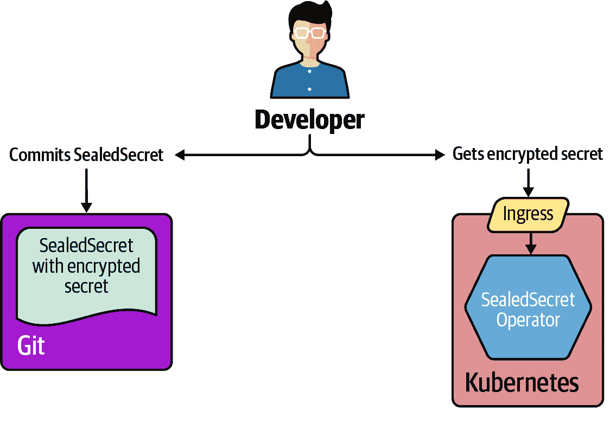
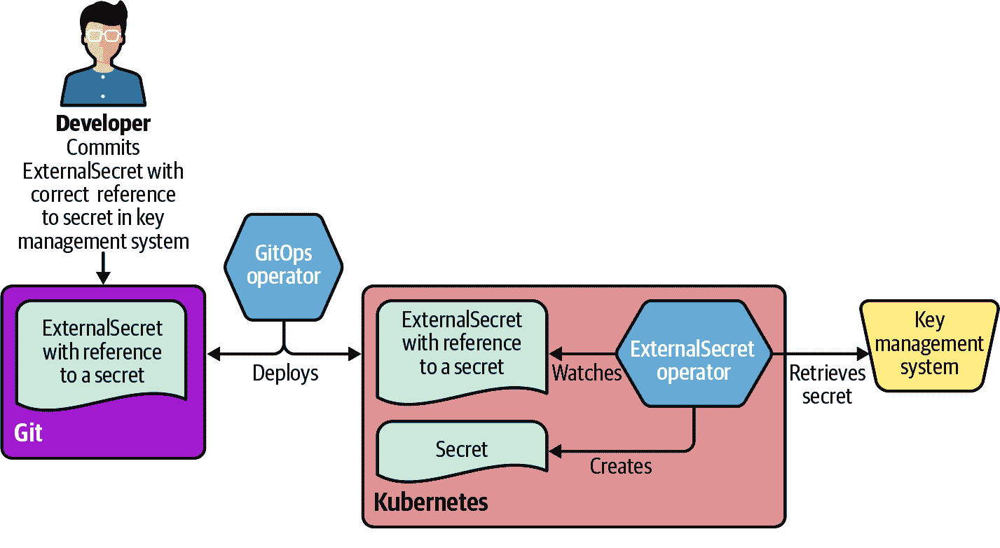
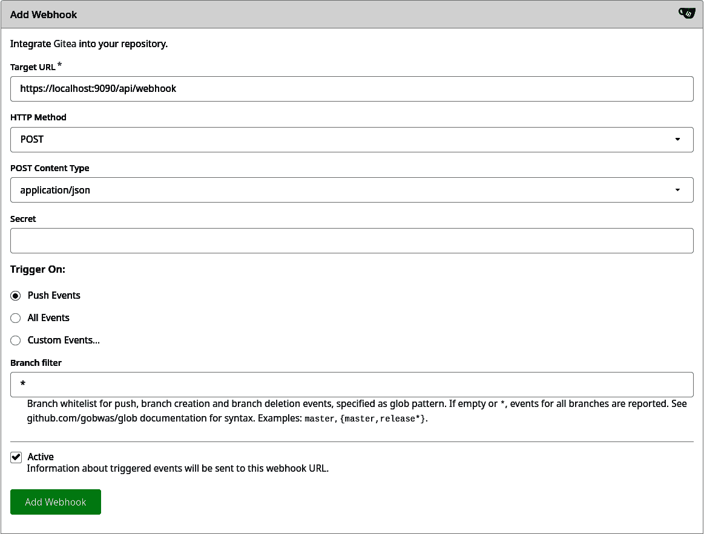
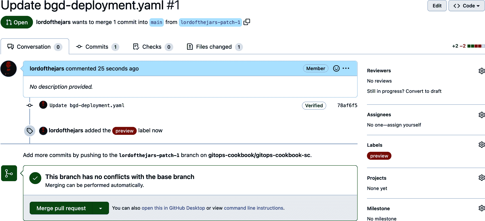

# 第八章：高级主题

在前一章中，您已经概述了使用 Argo CD 配方实现 GitOps 工作流程。Argo CD 是一个著名且具有影响力的开源项目，可帮助处理简单和更高级的用例。在本章中，我们将讨论在 GitOps 旅程中前进时所需的主题，包括管理安全性、自动化和多集群场景中的高级部署模型。

安全性是自动化和 DevOps 的关键方面。DevSecOps 是一种新的定义，其中安全性在整个 IT 生命周期中是一种共享责任。此外，[DevSecOps 宣言](https://www.devsecops.org) 指定安全性作为代码来操作并减少阻力，为价值贡献。这与 GitOps 原则一致，一切都是声明式的。

另一方面，这也引出了一个问题，即避免在 Git 中存储未加密的明文凭据。正如 Christian Hernandez 的书 *Path to GitOps* 中所述，Argo CD 目前幸运地提供了两种模式来管理 GitOps 工作流中的安全性：

+   在 Git 中存储加密的秘密，例如 Sealed Secret（参见 Recipe 8.1）

+   将密码存储在外部服务或保险库中，然后只在 Git 中存储对这些密码的引用（参见 Recipe 8.2）

本章然后介绍了高级部署技术，展示了如何使用 Argo CD 管理 Webhook（参见 Recipe 8.3）和应用集（参见 Recipe 8.4）。ApplicationSets 是 Argo CD 的一个组件，允许从单个 Kubernetes 资源管理多个应用程序、存储库或集群的部署。实质上，这是一个 GitOps 应用程序的模板系统，可以在多个 Kubernetes 集群中部署和同步（参见 Recipe 8.5）。

最后，本书以 Argo Rollouts 用于 Kubernetes 的渐进式交付配方（Recipe 8.6）结束，对于使用蓝绿或金丝雀等高级部署技术部署应用程序非常有用。

# 8.1 加密敏感数据（Sealed Secrets）

## 问题

您希望在 Git 中管理 Kubernetes Secrets 和加密对象。

## 解决方案

[Sealed Secrets](https://oreil.ly/MWTNB) 是 Bitnami 开源项目，用于将 Kubernetes Secrets 加密为 `SealedSecret` Kubernetes 自定义资源，表示可以安全存储在 Git 中的加密对象。

Sealed Secrets 使用公钥加密技术，由两个主要组件组成：

+   一个 Kubernetes 控制器，了解用于解密和加密加密密码的私钥和公钥，并负责协调。该控制器还支持私钥的自动轮换和密钥到期管理，以强制重新加密密码。

+   `kubeseal` 是开发人员用于在提交到 Git 存储库之前加密其密码的 CLI 工具。

`SealedSecret`对象仅由运行在目标 Kubernetes 集群中的`SealedSecret`控制器加密和解密。这个操作仅由此组件独占，因此没有其他人可以解密对象。`kubeseal` CLI 允许开发人员将普通的 Kubernetes Secret 资源转换为`SealedSecret`资源定义，如图 8-1 所示。

在您的 Kubernetes 集群中，使用[GitHub 项目的发布](https://oreil.ly/zmEh3)可以为您的操作系统安装`kubeseal` CLI。在撰写本书时，我们使用的是版本 0.18.2。

###### 提示

在 macOS 上，`kubeseal`可以通过[Homebrew](https://brew.sh)进行安装：

```
brew install kubeseal
```



###### 图 8-1\. 使用 GitOps 密封密钥

安装完 CLI 后，您可以按如下方式安装控制器：

```
kubectl create \
-f https://github.com/bitnami-labs/sealed-secrets/releases/download/0.18.2/controller.yaml
```

您应该得到类似以下的输出：

```
serviceaccount/sealed-secrets-controller created
deployment.apps/sealed-secrets-controller created
customresourcedefinition.apiextensions.k8s.io/sealedsecrets.bitnami.com created
service/sealed-secrets-controller created
rolebinding.rbac.authorization.k8s.io/sealed-secrets-controller created
rolebinding.rbac.authorization.k8s.io/sealed-secrets-service-proxier created
role.rbac.authorization.k8s.io/sealed-secrets-service-proxier created
role.rbac.authorization.k8s.io/sealed-secrets-key-admin created
clusterrolebinding.rbac.authorization.k8s.io/sealed-secrets-controller created
clusterrole.rbac.authorization.k8s.io/secrets-unsealer created
```

例如，让我们为部署在第五章中的 Pac-Man 游戏创建一个秘密：

```
kubectl create secret generic pacman-secret \
--from-literal=user=pacman \
--from-literal=pass=pacman
```

您应该得到以下输出：

```
secret/pacman-secret created
```

在这里您可以看到 YAML 表示：

```
kubectl get secret pacman-secret  -o yaml
```

```
apiVersion: v1
data:
  pass: cGFjbWFu
  user: cGFjbWFu
kind: Secret
metadata:
  name: pacman-secret
  namespace: default
type: Opaque
```

现在，您可以通过以下方式将秘密转换为`SealedSecret`：

```
kubectl get secret pacman-secret -o yaml \
| kubeseal -o yaml > pacman-sealedsecret.yaml
```

```
apiVersion: bitnami.com/v1alpha1
kind: SealedSecret
metadata:
  creationTimestamp: null
  name: pacman-secret
  namespace: default
spec:
  encryptedData: 
    pass: AgBJR1AgZ5Gu5NOVsG1E8SKBcdB3QSDdzZka3RRYuWV7z8g7ccQ0dGc1suVOP8wX/ZpPmIMp8+urPYG62k4EZRUjuu/Vg2E1nSbsGBh9eKu3NaO6tGSF3eGk6PzN6XtRhDeER4u7MG5pj/+FXRAKcy8Z6RfzbVEGq/QJQ4z0ecSNdJmG07ERMm1Q+lPNGvph2Svx8aCgFLqRsdLhFyvwbTyB3XnmFHrPr+2DynxeN8XVMoMkRYXgVc6GAoxUK7CnC3Elpuy7lIdPwc5QBx9kUVfra83LX8/KxeaJwyCqvscIGjtcxUtpTpF5jm1t1DSRRNbc4m+7pTwTmnRiUuaMVeujaBco4521yTkh5iEPjnjvUt+VzK01NVoeNunqIazp15rFwTvmiQ5PAtbiUXpT733zCr60QBgSxPg31vw98+u+RcIHvaMIoDCqaXxUdcn2JkUF+bZXtxNmIRTAiQVQ1vEPmrZxpvZcUh/PPC4L/RFWrQWnOzKRyqLq9wRoSLPbKyvMXnaxH0v3USGIktmtJlGjlXoW/i+HIoSeMFS0mUAzOF5M5gweOhtxKGh3Y74ZDn5PbVA/9kbkuWgvPNGDZL924Dm6AyM5goHECr/RRTm1e22K9BfPASARZuGA6paqb9h1XEqyqesZgM0R8PLiyLuu+tpqydR0SiYLc5VltdjzpIyyy9Xmw6Aa3/4SB+4tSwXSUUrB5yc=
    user: AgBhYDZQzOwinetPceZL897aibTYp4QPGFvP6ZhDyuUAxOWXBQ7jBA3KPUqLvP8vBcxLAcS7HpKcDSgCdi47D2WhShdBR4jWJufwKmR3j+ayTdw72t3ALpQhTYI0iMYTiNdR0/o3vf0jeNMt/oWCRsifqBxZaIShE53rAFEjEA6D7CuCDXu8BHk1DpSr79d5Au4puzpHVODh+v1T+Yef3k7DUoSnbYEh3CvuRweiuq5lY8G0oob28j38wdyxm3GIrexa+M/ZIdO1hxZ6jz4edv6ejdZfmQNdru3c6lmljWwcO+0Ue0MqFi4ZF/YNUsiojI+781n1m3K/giKcyPLn0skD7DyeKPoukoN6W5P71OuFSkF+VgIeejDaxuA7bK3PEaUgv79KFC9aEEnBr/7op7HY7X6aMDahmLUc/+zDhfzQvwnC2wcj4B8M2OBFa2ic2PmGzrIWhlBbs1OgnpehtGSETq+YRDH0alWOdFBq1U8qn6QA8Iw6ewu8GTele3zlPLaADi5O6LrJbIZNlY0+PutWfjs9ScVVEJy+I9BGdyT6tiA/4v4cxH6ygG6NzWkqxSaYyNrWWXtLhOlqyCpTZtUwHnF+OLB3gCpDZPx+NwTe2Kn0jY0c83LuLh5PJ090AsWWqZaRQyELeL6y6mVekQFWHGfK6t57Vb7Z3+5XJCgQn+xFLkj3SIz0ME5D4+DSsUDS1fyL8uI=
  template:
    data: null
    metadata:
      creationTimestamp: null
      name: pacman-secret
      namespace: default
    type: Opaque
```


在这里，您可以找到由 Sealed Secrets 控制器加密的数据。

现在，您可以安全地将您的`SealedSecret`推送到您的 Kubernetes 清单存储库并创建 Argo CD 应用程序。这里有一个来自[本书仓库的示例](https://oreil.ly/TXHRa)：

```
argocd app create pacman \
--repo https://github.com/gitops-cookbook/pacman-kikd-manifests.git \
--path 'k8s/sealedsecrets' \
--dest-server https://kubernetes.default.svc \
--dest-namespace default \
--sync-policy auto
```

检查应用程序是否正在运行并且健康：

```
argocd app list
```

您应该得到类似以下的输出：

```
NAME    CLUSTER                         NAMESPACE  PROJECT  STATUS  HEALTH ↳
 SYNCPOLICY  CONDITIONS  REPO                                                           PATH TARGET
pacman  https://kubernetes.default.svc  default    default  Synced  Healthy↳
 <none>      <none>      https://github.com/gitops-cookbook/pacman-kikd-manifests.git  k8s/sealedsecrets
```

# 8.2 使用 ArgoCD 加密秘密（ArgoCD + HashiCorp Vault + 外部秘密）

## 问题

您希望避免在 Git 中存储凭据，并希望在外部服务或保险库中管理它们。

## 解决方案

在配方 8.1 中，您看到如何按照 GitOps 的声明性方式管理加密数据，但是如何避免即使使用 GitOps 也存储加密凭据？

一个解决方案是[外部秘密](https://oreil.ly/ytBeU)，这是一个由 GoDaddy 最初创建的开源项目，旨在将秘密存储在来自不同供应商的外部服务或保险库中，然后仅在 Git 中存储对这些秘密的引用。

如今，External Secrets 支持诸如 AWS Secrets Manager、HashiCorp Vault、Google Secrets Manager、Azure Key Vault 等系统。其想法是为外部 API 提供一个用户友好的抽象，用于存储和管理秘密的生命周期。

具体而言，ExternalSecrets 是一个 Kubernetes 控制器，它通过自定义资源将 Secrets 调解到集群中，该资源包括对外部密钥管理系统中秘密的引用。自定义资源`SecretStore`指定了包含机密数据的后端，并定义了模板来将其转换为 Secret，正如您可以在图 8-2 中看到的那样。SecretStore 具有连接到外部秘密管理器的配置。

因此，`ExternalSecrets` 对象可以安全地存储在 Git 中，因为它们不包含任何机密信息，仅包含管理凭据的外部服务的引用。



###### 图 8-2\. Argo CD 中的 External Secrets

您可以按如下方式使用 Helm Chart 安装 External Secrets。撰写本书时，我们使用的是版本 0.5.9：

```
helm repo add external-secrets https://charts.external-secrets.io

helm install external-secrets \
  external-secrets/external-secrets \
  -n external-secrets \
  --create-namespace
```

您应该会获得类似以下的输出：

```
NAME: external-secrets
LAST DEPLOYED: Fri Sep  2 13:09:53 2022
NAMESPACE: external-secrets
STATUS: deployed
REVISION: 1
TEST SUITE: None
NOTES:
external-secrets has been deployed successfully!
```

要开始使用 ExternalSecrets，您需要设置 SecretStore 或 ClusterSecretStore 资源（例如通过创建 *vault* SecretStore）。

更多关于不同类型的 SecretStores 及其配置方法的信息可以在我们的 [GitHub 页面](https://oreil.ly/LQzEh) 中找到。

###### 提示

您还可以从 [OperatorHub.io](https://oreil.ly/w3x71) 安装 External Secrets Operator 与 OLM。

例如，您可以使用受支持的提供程序之一，比如 [HashiCorp Vault](https://oreil.ly/sg7yS)，进行如下操作。

首先下载并安装适合您操作系统的 [HashiCorp Vault](https://oreil.ly/vjGSq)，获取您的 [Vault Token](https://oreil.ly/6Y5cS)。然后按如下方式创建 Kubernetes Secret：

```
export VAULT_TOKEN=<YOUR_TOKEN>
kubectl create secret generic vault-token \
  --from-literal=token=$VAULT_TOKEN \
  -n external-secrets
```

然后，创建一个 `SecretStore` 作为对这个外部系统的引用：

```
apiVersion: external-secrets.io/v1beta1
kind: SecretStore
metadata:
  name: vault-secretstore
  namespace: default
spec:
  provider:
    vault:
      server: "http://vault.local:8200" 
      path: "secret"
      version: "v2"
      auth:
        tokenSecretRef:
          name: "vault-token" 
          key: "token" 
          namespace: external-secrets
```


Vault 运行的主机名


包含 Vault 令牌的 Kubernetes Secret 的名称


Kubernetes Secret 中包含 Vault 令牌内容的地址键：

```
kubectl create -f vault-secretstore.yaml
```

现在，您可以按如下方式在 Vault 中创建一个 Secret：

```
vault kv put secret/pacman-secrets pass=pacman
```

然后，从 `ExternalSecret` 中引用它，操作如下：

```
apiVersion: external-secrets.io/v1beta1
kind: ExternalSecret
metadata:
  name: pacman-externalsecrets
  namespace: default
spec:
  refreshInterval: "15s"
  secretStoreRef:
    name: vault-secretstore
    kind: SecretStore
  target:
    name: pacman-externalsecrets
  data:
  - secretKey: token
    remoteRef:
      key: secret/pacman-secrets
      property: pass
```

```
kubectl create -f pacman-externalsecrets.yaml
```

现在，您可以使用 External Secrets 在 Argo CD 中部署 Pac-Man 游戏如下：

```
argocd app create pacman \
--repo https://github.com/gitops-cookbook/pacman-kikd-manifests.git \
--path 'k8s/externalsecrets' \
--dest-server https://kubernetes.default.svc \
--dest-namespace default \
--sync-policy auto
```

# 8.3 自动触发应用程序部署（Argo CD Webhooks）

## 问题

你不想等待 Argo CD 同步，而是希望在 Git 发生变化时立即部署应用程序。

## 解决方案

虽然 Argo CD 每三分钟轮询 Git 仓库以检测受监控的 Kubernetes 清单的更改，但也支持来自流行 Git 服务器（如 GitHub、GitLab 或 Bitbucket）的 Webhooks 通知的事件驱动方法。

[Argo CD Webhooks](https://oreil.ly/3Ab46) 已在您的 Argo CD 安装中启用，并且可通过端点 `/api/webhooks` 访问。

要使用 Minikube 测试 Argo CD 的 Webhooks，您可以使用 Helm 安装本地 Git 服务器，如 [Gitea](https://docs.gitea.io)，一个使用 Go 编写的开源轻量级服务器，操作如下：

```
helm repo add gitea-charts https://dl.gitea.io/charts/
helm install gitea gitea-charts/gitea
```

您应该会得到类似以下的输出：

```
helm install gitea gitea-charts/gitea
"gitea-charts" has been added to your repositories
NAME: gitea
LAST DEPLOYED: Fri Sep  2 15:04:04 2022
NAMESPACE: default
STATUS: deployed
REVISION: 1
NOTES:
1. Get the application URL by running these commands:
  echo "Visit http://127.0.0.1:3000 to use your application"
  kubectl --namespace default port-forward svc/gitea-http 3000:3000
```

###### 提示

使用 Helm 在 Gitea 服务器上使用默认凭据登录，您可以从 Helm Chart 的 *values.yaml* 文件 [这里](https://oreil.ly/Nkaeu) 找到或通过覆盖定义新的凭据。

导入 [Pac-Man](https://oreil.ly/LwTaC) 清单库到 Gitea 中。

配置 Argo 应用：

```
argocd app create pacman-webhook \
--repo http://gitea-http.default.svc:3000/gitea_admin/pacman-kikd-manifests.git \
--dest-server https://kubernetes.default.svc \
--dest-namespace default \
--path k8s \
--sync-policy auto
```

要向 Gitea 添加 Webhook，请导航到右上角并单击“设置”。 选择“Webhooks”选项卡，并按照 图 8-3 中所示进行配置：

+   负载 URL：`http://localhost:9090/api/webhooks`

+   内容类型：`application/json`



###### 图 8-3\. Gitea Webhooks

###### 提示

您可以在此示例中省略 Secret；但是，最佳实践是为您的 Webhook 配置 Secrets。 从 [文档](https://oreil.ly/udDkS) 阅读更多。

保存并将更改推送到 Gitea 上的存储库。 在您推送后立即看到来自 Argo CD 的新同步。

# 8.4 部署到多个集群

## 问题

您想要将应用程序部署到不同的集群。

## 解决方案

Argo CD 支持`ApplicationSet`资源以“模板化”Argo CD`Application`资源。 它涵盖了不同的用例，但最重要的是：

+   使用 Kubernetes 清单来定位多个 Kubernetes 集群。

+   从一个或多个 Git 存储库部署多个应用程序。

由于`ApplicationSet`是一个带有占位符的模板文件，需要在运行时用一些值填充这些占位符。 为此，`ApplicationSet`具有*生成器*的概念。

生成器负责生成参数，这些参数最终将替换模板占位符以生成有效的 Argo CD`Application`。 

创建以下`ApplicationSet`：

```
apiVersion: argoproj.io/v1alpha1
kind: ApplicationSet
metadata:
  name: bgd-app
  namespace: argocd
spec:
  generators: 
  - list:
      elements: 
      - cluster: staging
        url: https://kubernetes.default.svc
        location: default
      - cluster: prod
        url: https://kubernetes.default.svc
        location: app
  template: 
    metadata:
      name: '{{cluster}}-app' 
    spec:
      project: default
      source:
        repoURL: https://github.com/gitops-cookbook/gitops-cookbook-sc.git
        targetRevision: main
        path: ch08/bgd-gen/{{cluster}}
      destination:
        server: '{{url}}' 
        namespace: '{{location}}'
      syncPolicy:
        syncOptions:
        - CreateNamespace=true
```


定义生成器


设置参数的值


将`Application`资源定义为模板


`cluster` 占位符


`url` 占位符

通过运行以下命令应用先前的文件：

```
kubectl apply -f bgd-application-set.yaml
```

当将此`ApplicationSet`应用于集群时，Argo CD 会生成并自动注册两个`Application`资源。 第一个是：

```
apiVersion: argoproj.io/v1alpha1
kind: Application
metadata:
  name: staging-app
spec:
  project: default
  source:
    path: ch08/bgd-gen/staging
    repoURL: https://github.com/example/app.git
    targetRevision: HEAD
  destination:
    namespace: default
    server: https://kubernetes.default.svc
    ...
```

和第二个：

```
apiVersion: argoproj.io/v1alpha1
kind: Application
metadata:
  name: prod-app
spec:
  project: default
  source:
    path: ch08/bgd-gen/prod
    repoURL: https://github.com/example/app.git
    targetRevision: HEAD
  destination:
    namespace: app
    server: https://kubernetes.default.svc
    ...
```

通过运行以下命令检查两个`Application`资源的创建：

```
# Remember to login first
argocd login --insecure --grpc-web $argoURL  --username admin --password $argoPass

argocd app list
```

输出应该类似于（截断）：

```
NAME         CLUSTER                         NAMESPACE
prod-app     https://kubernetes.default.svc  app
staging-app  https://kubernetes.default.svc  default
```

通过删除`ApplicationSet`文件来删除两个应用程序：

```
kubectl delete -f bgd-application-set.yaml
```

## 讨论

我们已经看到了最简单的生成器，但在撰写本书时总共有八个生成器：

列表

通过固定的集群列表生成`Application`定义。（这是我们之前看到的）。

集群

类似于*List*，但基于在 Argo CD 中定义的集群列表。

Git

根据 Git 存储库中的 JSON/YAML 属性文件或基于存储库的目录布局生成`Application`定义。

SCM 提供者

从组织内的存储库生成`Application`定义。

拉取请求

从开放的拉取请求生成`Application`定义。

集群决策资源

使用[鸭子类型](https://oreil.ly/kpRkV)生成`Application`定义。

矩阵

结合两个独立生成器的值。

合并

合并两个或更多生成器的值。

在前面的示例中，我们从固定元素列表创建了`Application`对象。当可配置环境的数量较少时，这很好；例如，在示例中，两个群集引用了两个 Git 文件夹（`ch08/bgd-gen/staging`和`ch08/bgd-gen/prod`）。对于多个环境（即各种文件夹），我们可以动态使用 Git 生成器为每个目录生成一个`Application`。

让我们将前面的示例迁移到使用 Git 生成器。作为提醒，使用的 Git 目录布局是：

```
bgd-gen
├── staging
│   ├── ...yaml
└── prod
    ├── ...yaml
```

创建一个新的`ApplicationSet`文件，为配置的 Git 仓库中的每个目录生成一个`Application`：

```
apiVersion: argoproj.io/v1alpha1
kind: ApplicationSet
metadata:
  name: cluster-addons
  namespace: openshift-gitops
spec:
  generators:
  - git: 
      repoURL: https://github.com/gitops-cookbook/gitops-cookbook-sc.git
      revision: main
      directories:
      - path: ch08/bgd-gen/* 
  template: 
    metadata:
      name: '{{path[0]}}{{path[2]}}' 
    spec:
      project: default
      source:
        repoURL: https://github.com/gitops-cookbook/gitops-cookbook-sc.git
        targetRevision: main
        path: '{{path}}' 
      destination:
        server: https://kubernetes.default.svc
        namespace: '{{path.basename}}' 
```


配置 Git 仓库以读取布局


开始扫描目录的初始路径


`Application`定义


Git 仓库内的目录路径匹配路径通配符（`staging`或`prod`）


目录路径（完整路径）


最右边的路径名

应用资源：

```
kubectl apply -f bgd-git-application-set.yaml
```

Argo CD 根据有两个目录创建两个应用程序：

```
argocd app list

NAME         CLUSTER                         NAMESPACE
ch08prod     https://kubernetes.default.svc  prod
ch08staging  https://kubernetes.default.svc  staging
```

此生成器还可在应用程序由不同组件（服务、数据库、分布式缓存、电子邮件服务器等）组成时使用，并且每个元素的部署文件放置在其他目录中时非常方便。例如，在群集中安装所需的所有操作器的存储库：

```
app
├── tekton-operator
│   ├── ...yaml
├── prometheus-operator
│   ├── ...yaml
└── istio-operator
    ├── ...yaml
```

Git 生成器不再响应目录，而是根据 JSON/YAML 文件中指定的参数创建`Application`对象。

下面的片段显示了一个 JSON 文件示例：

```
{
  "cluster": {
    "name": "staging",
    "address": "https://1.2.3.4"
  }
}
```

这是一个`ApplicationSet`的摘录，用于响应这些文件：

```
apiVersion: argoproj.io/v1alpha1
kind: ApplicationSet
metadata:
  name: guestbook
spec:
  generators:
  - git:
      repoURL: https://github.com/example/app.git
      revision: HEAD
      files:
      - path: "app/**/config.json" 
  template:
    metadata:
      name: '{{cluster.name}}-app' 
....
```


查找放置在`app`所有子目录中的所有*config.json*文件


注入*config.json*中设置的值

此`ApplicationSet`将为匹配`path`表达式的文件夹中的每个*config.json*文件生成一个`Application`。

## 参见

+   [Argo CD 生成器](https://oreil.ly/EnOfl)

+   [鸭子类型](https://oreil.ly/tEFQW)

# 8.5 将拉取请求部署到群集

## 问题

当创建拉取请求时，您希望部署应用程序的预览。

## 解决方案

使用*pull request*生成器自动发现存储库中的打开拉取请求，并创建`Application`对象。

让我们创建一个`ApplicationSet`，以响应配置仓库上创建的带有`preview`标签的任何 GitHub 拉取请求。

创建一个名为*bgd-pr-application-set.yaml*的新文件，并包含以下内容：

```
apiVersion: argoproj.io/v1alpha1
kind: ApplicationSet
metadata:
  name: myapps
  namespace: openshift-gitops
spec:
  generators:
  - pullRequest:
      github: 
        owner: gitops-cookbook 
        repo: gitops-cookbook-sc 
        labels: 
        - preview
      requeueAfterSeconds: 60 
  template:
    metadata:
      name: 'myapp-{{branch}}-{{number}}' 
    spec:
      source:
        repoURL: 'https://github.com/gitops-cookbook/gitops-cookbook-sc.git'
        targetRevision: '{{head_sha}}' 
        path: ch08/bgd-pr
      project: default
      destination:
        server: https://kubernetes.default.svc
        namespace: '{{branch}}-{{number}}'
```


GitHub 拉取请求生成器


组织/用户


仓库


选择目标 PR


检查是否有新的 PR（60 秒的轮询时间）


设置带有分支名称和编号的名称


设置 Git SHA 号码

运行以下命令来应用上述文件：

```
kubectl apply -f bgd-pr-application-set.yaml
```

现在，如果您列出 Argo CD 应用程序，您会发现没有一个已注册。原因是存储库中还没有带有 `preview` 标签的拉取请求：

```
argocd app list
NAME  CLUSTER  NAMESPACE  PROJECT  STATUS
```

对存储库创建一个拉取请求，并使用 `preview` 标签标记它。

在 GitHub 中，拉取请求窗口应类似于 Figure 8-4。



###### 图 8-4\. GitHub 中的拉取请求

等待一分钟，直到 `ApplicationSet` 检测到更改并创建 `Application` 对象。

运行以下命令来检查更改是否已被检测并注册：

```
kubectl describe applicationset myapps -n argocd

...
Events:
  Type    Reason     Age                From                       Message
  ----    ------     ----               ----                       -------
  Normal  created    23s                applicationset-controller  created Application "myapp-lordofthejars-patch-1-1"
  Normal  unchanged  23s (x2 over 23s)  applicationset-controller  unchanged Application "myapp-lordofthejars-patch-1-1"
```

检查 `Application` 是否已注册到拉取请求：

```
argocd app list
NAME                           CLUSTER                         NAMESPACE
myapp-lordofthejars-patch-1-1  https://kubernetes.default.svc  lordofthejars-patch-1-1
```

当关闭拉取请求时，`Application` 对象会自动移除。

## 讨论

在编写本书时，支持以下拉取请求提供程序：

+   GitHub

+   Bitbucket

+   Gitea

+   GitLab

ApplicationSet 控制器每隔 `requeueAfterSeconds` 秒轮询以检测更改，同时支持使用 Webhook 事件。

要进行配置，请参考 Recipe 8.3，同时在 Git 提供程序中启用发送拉取请求事件。

# 8.6 使用先进的部署技术

## 问题

您希望使用先进的部署技术，如蓝绿部署或金丝雀部署，来部署应用程序。

## 解决方案

使用 [Argo Rollouts](https://oreil.ly/g4mlf) 项目来对应用程序进行更新的部署。

Argo Rollouts 是一个 Kubernetes 控制器，提供先进的部署技术，如蓝绿部署、金丝雀部署、镜像部署、暗金丝雀、流量分析等，用于 Kubernetes。它与许多 Kubernetes 项目集成，如 Ambassador、Istio、AWS 负载均衡控制器、NGNI、SMI 或 Traefik 用于流量管理，并与 Prometheus、Datadog 和 New Relic 等项目集成，进行分析以推动渐进式交付。

要将 Argo Rollouts 安装到集群中，请在终端窗口中运行以下命令：

```
kubectl create namespace argo-rollouts

kubectl apply -n argo-rollouts -f https://github.com/argoproj/argo-rollouts/releases/download/v1.2.2/install.yaml
...
clusterrolebinding.rbac.authorization.k8s.io/argo-rollouts created
secret/argo-rollouts-notification-secret created
service/argo-rollouts-metrics created
deployment.apps/argo-rollouts created
```

虽然这不是强制性的，但我们建议您安装 Argo Rollouts Kubectl 插件以可视化部署过程。请按照[说明](https://oreil.ly/1GWsz)安装。一切就绪后，让我们部署 BGD 应用程序的初始版本。

Argo Rollouts 不使用标准的 Kubernetes `Deployment` 文件，而是使用一个名为 `Rollout` 的特定新 Kubernetes 资源。它类似于 `Deployment` 对象，因此支持其所有选项，但它添加了一些字段来配置滚动更新。

让我们部署应用程序的第一个版本。当 Kubernetes 执行滚动更新时，我们将定义金丝雀发布流程，本例中遵循以下步骤：

1.  将 20%的流量转发到新版本。

1.  等待人工决定是否继续该过程。

1.  自动将 40%，60%，80%的流量转发到新版本，每次增加之间等待 30 秒。

创建一个名为*bgd-rollout.yaml*的新文件，内容如下：

```
apiVersion: argoproj.io/v1alpha1
kind: Rollout
metadata:
  name: bgd-rollouts
spec:
  replicas: 5
  strategy:
    canary: 
      steps: 
      - setWeight: 20 
      - pause: {} 
      - setWeight: 40
      - pause: {duration: 30s} 
      - setWeight: 60
      - pause: {duration: 30s}
      - setWeight: 80
      - pause: {duration: 30s}
  revisionHistoryLimit: 2
  selector:
    matchLabels:
      app: bgd-rollouts
  template: 
    metadata:
      creationTimestamp: null
      labels:
        app: bgd-rollouts
    spec:
      containers:
      - image: quay.io/rhdevelopers/bgd:1.0.0
        name: bgd
        env:
        - name: COLOR
          value: "blue"
        resources: {}
```


金丝雀发布


执行的步骤列表


设置金丝雀的比例


滚动更新已暂停


暂停滚动更新 30 秒


`template`部署定义

应用资源以部署应用程序。由于没有先前的部署，忽略金丝雀部分：

```
kubectl apply -f bgd-rollout.yaml
```

当前有五个 pod，如`replicas`字段所指定的那样：

```
kubectl get pods

NAME                           READY   STATUS    RESTARTS   AGE
bgd-rollouts-679cdfcfd-6z2zf   1/1     Running   0          12m
bgd-rollouts-679cdfcfd-8c6kl   1/1     Running   0          12m
bgd-rollouts-679cdfcfd-8tb4v   1/1     Running   0          12m
bgd-rollouts-679cdfcfd-f4p7f   1/1     Running   0          12m
bgd-rollouts-679cdfcfd-tljfr   1/1     Running   0          12m
```

并使用 Argo Rollout 的 Kubectl 插件：

```
kubectl argo rollouts get rollout bgd-rollouts

Name:            bgd-rollouts
Namespace:       default
Status:          ✔ Healthy
Strategy:        Canary
  Step:          8/8
  SetWeight:     100
  ActualWeight:  100
Images:          quay.io/rhdevelopers/bgd:1.0.0 (stable)
Replicas:
  Desired:       5
  Current:       5
  Updated:       5
  Ready:         5
  Available:     5

NAME                                     KIND        STATUS      AGE  INFO
⟳ bgd-rollouts                           Rollout     ✔ Healthy  13m
└──# revision:1
   └──⧉ bgd-rollouts-679cdfcfd          ReplicaSet  ✔ Healthy  13m  stable
      ├──□ bgd-rollouts-679cdfcfd-6z2zf  Pod         ✔ Running  13m  ready:1/1
      ├──□ bgd-rollouts-679cdfcfd-8c6kl  Pod         ✔ Running  13m  ready:1/1
      ├──□ bgd-rollouts-679cdfcfd-8tb4v  Pod         ✔ Running  13m  ready:1/1
      ├──□ bgd-rollouts-679cdfcfd-f4p7f  Pod         ✔ Running  13m  ready:1/1
      └──□ bgd-rollouts-679cdfcfd-tljfr  Pod         ✔ Running  13m  ready:1/1
```

部署新版本以触发金丝雀滚动更新。创建一个名为*bgd-rollout-v2.yaml*的新文件，内容与之前完全相同，但将环境变量`COLOR`的值改为`green`：

```
...
name: bgd
env:
- name: COLOR
  value: "green"
resources: {}
```

应用先前的资源，并检查 Argo Rollouts 如何执行滚动更新。再次列出 pod 以检查 20%的 pod 是新版本，而其他 80%是旧版本：

```
kubectl get pods

NAME                           READY   STATUS    RESTARTS   AGE
bgd-rollouts-679cdfcfd-6z2zf   1/1     Running   0          27m
bgd-rollouts-679cdfcfd-8c6kl   1/1     Running   0          27m
bgd-rollouts-679cdfcfd-8tb4v   1/1     Running   0          27m
bgd-rollouts-679cdfcfd-tljfr   1/1     Running   0          27m
bgd-rollouts-c5495c6ff-zfgvn   1/1     Running   0          13s 
```


新版本的 pod

并使用 Argo Rollout 的 Kubectl 插件执行相同操作：

```
kubectl argo rollouts get rollout bgd-rollouts

...
NAME                                     KIND        STATUS      AGE    INFO
⟳ bgd-rollouts                           Rollout     ॥ Paused    31m
├──# revision:2
│  └──⧉ bgd-rollouts-c5495c6ff          ReplicaSet  ✔ Healthy  3m21s  canary
│     └──□ bgd-rollouts-c5495c6ff-zfgvn  Pod         ✔ Running  3m21s  ready:1/1
└──# revision:1
   └──⧉ bgd-rollouts-679cdfcfd          ReplicaSet  ✔ Healthy  31m    stable
      ├──□ bgd-rollouts-679cdfcfd-6z2zf  Pod         ✔ Running  31m    ready:1/1
      ├──□ bgd-rollouts-679cdfcfd-8c6kl  Pod         ✔ Running  31m    ready:1/1
      ├──□ bgd-rollouts-679cdfcfd-8tb4v  Pod         ✔ Running  31m    ready:1/1
      └──□ bgd-rollouts-679cdfcfd-tljfr  Pod         ✔ Running  31m    ready:1/1
```

请记住，滚动更新过程会暂停，直到操作员执行手动步骤以让过程继续。在终端窗口中运行以下命令：

```
kubectl argo rollouts promote bgd-rollouts
```

推广滚动更新并继续以下步骤，即每 30 秒用新版本替换旧版本的 pod：

```
kubectl get pods

NAME                           READY   STATUS    RESTARTS   AGE
bgd-rollouts-c5495c6ff-2g7r8   1/1     Running   0          89s
bgd-rollouts-c5495c6ff-7mdch   1/1     Running   0          122s
bgd-rollouts-c5495c6ff-d9828   1/1     Running   0          13s
bgd-rollouts-c5495c6ff-h4t6f   1/1     Running   0          56s
bgd-rollouts-c5495c6ff-zfgvn   1/1     Running   0          11m
```

滚动更新完成，新版本逐步部署到集群中。

## 讨论

Kubernetes 本身不原生实现高级部署技术。因此，Argo Rollouts 使用部署的 pod 数量来实现金丝雀发布。

如前所述，Argo Rollouts 与提供高级流量管理能力的 Kubernetes 产品（如[Istio](https://istio.io)）集成。

使用 Istio，在基础设施级别正确进行流量分割，而不像第一个示例中玩弄副本数量。Argo Rollouts 与 Istio 集成，执行金丝雀发布，自动更新 Istio 的`VirtualService`对象。

假设您已了解 Istio，并且在安装了 Istio 的 Kubernetes 集群上，您可以通过将`Rollout`资源的`trafficRouting`设置为`Istio`来执行 Argo Rollouts 与 Istio 的集成。

首先，使用配置了 Istio 的`Rollout`文件：

```
apiVersion: argoproj.io/v1alpha1
kind: Rollout
metadata:
  name: bgdapp
  labels:
    app: bgdapp
spec:
  strategy:
    canary: 
      steps:
      - setWeight: 20
      - pause:
          duration: "1m"
      - setWeight: 50
      - pause:
          duration: "2m"
      canaryService: bgd-canary 
      stableService: bgd 
      trafficRouting:
        istio: 
           virtualService: 
            name: bgd 
            routes:
            - primary 
  replicas: 1
  revisionHistoryLimit: 2
  selector:
    matchLabels:
      app: bgdapp
      version: v1
  template:
    metadata:
      labels:
        app: bgdapp
        version: v1
      annotations:
        sidecar.istio.io/inject: "true" 
    spec:
      containers:
      - image: quay.io/rhdevelopers/bgd:1.0.0
        name: bgd
        env:
        - name: COLOR
          value: "blue"
        resources: {}
```


金丝雀部分


指向新服务版本的 Kubernetes 服务的参考


指向旧服务版本的 Kubernetes 服务的引用


配置 Istio


更新权重的 `VirtualService` 引用


`VirtualService` 的名称


`VirtualService` 内的路由名称


部署 Istio sidecar 容器

然后，我们创建了两个 Kubernetes 服务，它们指向相同的部署，用于将流量重定向到旧版本或新版本。

下面的 Kubernetes 服务在 `stableService` 字段中使用：

```
apiVersion: v1
kind: Service
metadata:
  name: bgd
  labels:
    app: bgdapp
spec:
  ports:
  - name: http
    port: 8080
  selector:
    app: bgdapp
```

而金丝雀版本则与之相同，但名称不同。它在 `canaryService` 字段中使用：

```
apiVersion: v1
kind: Service
metadata:
  name: bgd-canary
  labels:
    app: bgdapp
spec:
  ports:
  - name: http
    port: 8080
  selector:
    app: bgdapp
```

最后，创建 Istio Virtual Service，由 Argo Rollouts 更新以更新每个服务的金丝雀流量：

```
apiVersion: networking.istio.io/v1alpha3
kind: VirtualService
metadata:
  name: bgd
spec:
  hosts:
  - bgd
  http:
  - route:
    - destination:
        host: bgd 
      weight: 100
    - destination:
        host: bgd-canary 
      weight: 0
    name: primary 
```


稳定的 Kubernetes 服务


金丝雀 Kubernetes 服务


路由名称

应用这些资源后，我们将使应用程序的第一个版本运行起来：

```
kubectl apply -f bgd-virtual-service.yaml
kubectl apply -f service.yaml
kubectl apply -f service-canary.yaml
kubectl apply -f bgd-isio-rollout.yaml
```

当 `Rollout` 对象上发生任何更新时，根据解决方案描述，金丝雀发布将开始。现在，Argo Rollouts 自动更新了 *bgd virtual service* 的权重，而不是操作 pod 数量。

## 参见

+   [Argo Rollouts - Kubernetes 渐进交付控制器](https://oreil.ly/XQ64b)

+   [Istio - Argo Rollouts](https://oreil.ly/lKDYH)

+   [Istio](https://istio.io)

+   [来自 Red Hat 的 Istio 教程](https://oreil.ly/Vzk9G)
