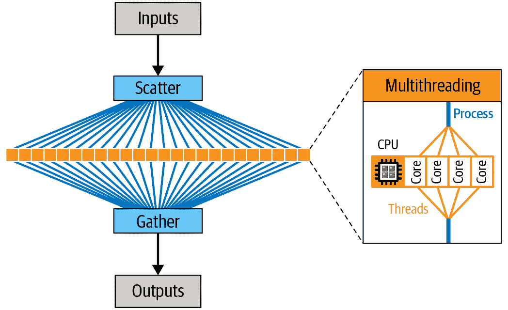
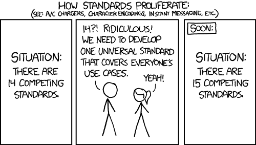
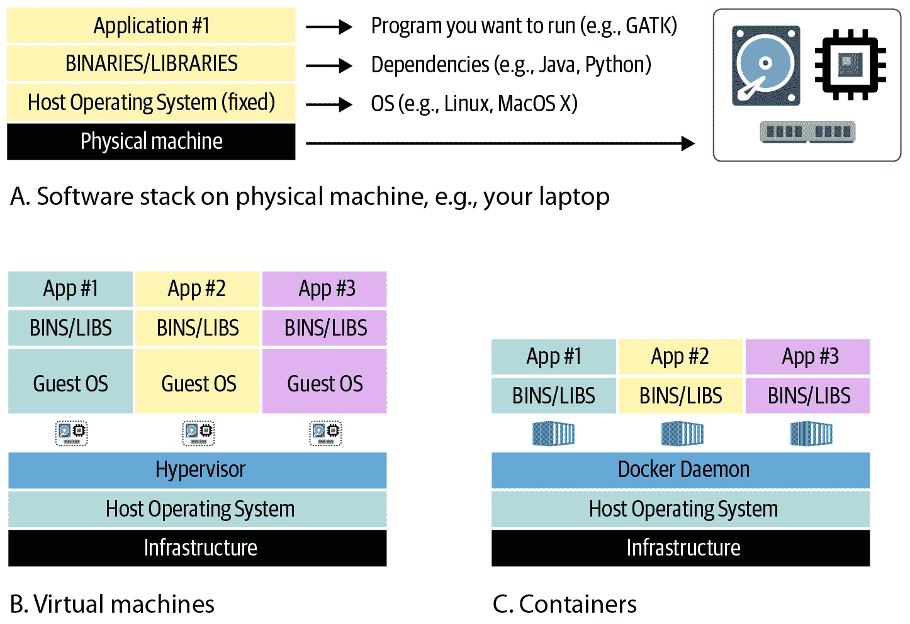

# 第三章。生命科学家的计算技术基础

在理想的情况下，当您进行研究时，您不需要过多关注计算基础设施。事实上，在后面的章节中，我们会向您介绍专门设计的系统，以便摆脱计算基础设施的繁琐细节，帮助您专注于科学研究。然而，在现实世界中，您会发现某些术语和概念是不可避免的。投入一些精力学习它们将有助于您更有效地规划和执行工作，解决性能挑战，并以更少的努力实现更大规模。在本章中，我们回顾形成最常见类型计算基础设施的基本组件，并讨论它们的优势和局限性如何影响我们在大规模高效完成工作的策略。我们还讨论了诸如并行计算和管道化等关键概念，由于基因组学中自动化和可重现性的需求，这些概念至关重要。最后，我们介绍了虚拟化，并阐述了云基础设施的案例。

本章的前几节旨在针对那些在信息学、编程或系统管理方面没有太多培训经验（如果有的话）的读者。如果您是计算科学家或 IT 专业人士，请随意跳过，直到遇到您尚未了解的内容。最后两节涵盖管道化、虚拟化和云等内容，更专注于本书探讨的问题，无论背景如何，对所有读者都应该具有信息价值。

# 基本基础设施组件和性能瓶颈

别担心；我们不会让您详尽列举计算机零件清单。相反，我们为您整理了一个关于您在工作过程中最有可能遇到的组件、术语和概念的简短清单。关于每一个，我们总结了主要的性能挑战和您可能需要考虑的有效使用策略。

让我们首先简要概述一下您今天在科学计算中可能会遇到的处理器类型。

## 处理器硬件类型：CPU、GPU、TPU、FPGA、OMG

在最简单的情况下，*处理器*是您计算机中执行计算的一个组件。有各种类型的处理器，其中最常见的是作为一般用途计算机的主处理器的*中央处理单元*（CPU），包括笔记本电脑等个人计算机。您笔记本电脑中的 CPU 可能有多个核心，这些子单元可以相对独立地处理操作。

除了 CPU，你的个人计算机还配备了*图形处理单元*（GPU），用于处理显示屏上的图形信息。GPU 随着现代视频游戏的发展而引起关注，这些游戏要求非常快的处理速度，以确保平滑地渲染游戏动作的视觉效果。实质上，GPU 解决方案将数学计算（如矩阵和向量操作）中的特定类型处理从 CPU 外包到专门处理某些类型计算的辅助处理单元中，这些计算非常有效地应用于图形数据。因此，GPU 也成为某些涉及大量矩阵或向量运算的科学计算应用的热门选择。

你应该了解的第三种处理器称为*现场可编程门阵列*（FPGA），尽管与*PU 命名约定不同，但它也是一种处理单元；然而，你的笔记本电脑中不太可能找到它。关于 FPGA 的有趣之处在于，与 GPU 不同，FPGA 并非为特定类型的应用程序开发；相反，它们被开发为适应定制类型的计算。因此，“现场可编程”作为其名称的一部分。

在 GCP 上，你可能也会遇到一种称为*张量处理单元*（TPU）的处理器，这是谷歌专门为涉及张量数据的机器学习应用开发和品牌化的处理器。*张量*是一个数学概念，用于表示和操作与向量和矩阵相关的多层数据。考虑到向量是一个具有一维的张量，而矩阵是一个具有两维的张量；更一般地说，张量可以具有超出这些维度的任意数量的维度，因此它们在机器学习应用中非常流行。TPU 属于称为[专用集成电路](https://oreil.ly/bz4mv)（ASIC）的处理器类别，这些处理器专门设计用于特定用途而非通用用途。

现在你已经掌握了基本的处理器类型，让我们讨论它们如何在典型的高性能计算设置中组织起来。

## 计算组织的层次：核心，节点，集群和云

当你超越个人计算机进入高性能计算领域时，你会听到人们谈论核心，节点以及集群或云，如图 3-1 所示。让我们回顾一下它们的含义及其彼此之间的关系。

###### 图 3-1\. 计算组织的层次。

### 低层次：核心

*核心*是机器或节点处理器单元内的最小不可分割处理单元，可以由一个或多个核心组成。如果您的笔记本电脑或台式机比较新，其 CPU 可能至少有两个核心，因此被称为*双核*。如果有四个核心，则为*四核*，依此类推。高端消费级机器可以拥有更多核心；例如，最新的 Mac Pro 拥有十二核 CPU（如果按照拉丁术语来说应该称为十二核）。但是，专业级机器的 CPU 可以拥有数十个或数百个核心，而 GPU 通常有数量级更高的核心，达到数千个。与此同时，TPU 的核心数量与消费级 CPU 类似，而 FPGA 则完全打破了这一模式：它们的核心是由编程方式定义的，而不是由建造方式定义的。

### 中层：节点/机器

一个*节点*实际上只是集群或云中的计算机。它类似于我们在日常工作中主要与之交互的笔记本电脑或台式电脑，但没有我们通常与个人计算机相关联的专用显示器和外围设备。节点有时也简称为*机器*。

### 顶层：集群和云

一个集群和一个云都是一组机器/节点。

一个*集群*是由节点部分网络连接在一起的 HPC 结构。如果您可以访问集群，那么很可能它要么属于您的机构，要么是您的公司租用的时间。集群也可以称为*服务器农场*或*负载共享设施*。

一个*云*与集群不同，因为在其休眠状态下，其节点不是显式地网络连接在一起的。相反，它是一组独立的机器，可以根据您的需求进行网络连接（或不连接）。我们在本章的最后一节详细介绍了这一点，还包括虚拟化的概念，它提供了虚拟机（VM）以及容器化，它提供了 Docker 容器。

现在，我们转向如何有效使用给定的计算基础设施的非常常见问题，这通常涉及识别和解决关键的计算瓶颈。与本章的其余部分一样，深入探讨这个主题将超出本书的范围，因此我们的目标仅仅是让您熟悉关键概念和术语。

## 处理性能瓶颈

您偶尔会发现某些计算操作似乎很慢，您需要找出如何使它们更快（如果可能的话）。可供您选择的解决方案将取决于您面临的瓶颈的性质。

在非常高的层次上，计算机通常必须执行以下主要操作（不一定是线性顺序）：

1.  从永久存储中将一些数据读入内存

1.  使处理器执行指令，转换数据并产生结果

1.  将结果写回永久存储

### 数据存储和 I/O 操作：硬盘对比固态

步骤 1 和 3 被称为*I/O 操作*（I/O 代表输入/输出）。你可能会听到一些人将某些软件程序描述为“I/O 受限”，这意味着程序中最耗时的部分是从相对缓慢的存储中读取和写入数据。这通常适用于简单的程序，比如文件格式转换，其中你只是读取一些数据并以不同的形式写出，没有进行实际的计算（即几乎没有涉及数学运算）。在这些情况下，你可以通过使用更快的存储驱动器来加快操作速度；例如固态硬盘（SSD）而不是硬盘驱动器（HDD）。它们之间的关键区别在于，HDD 有物理盘片旋转和通过磁性从盘片读取和写入数据的臂；就像一个微型高科技转盘一样，而 SSD 没有移动部件。这使得 SSD 不太容易发生物理故障，并且在访问数据时也快得多。

如果你在一个网络基础设施中工作，其中存储驱动器不直接连接到计算节点，你的速度也会受到网络连接传输数据速度的限制。这可能由硬件因素决定，例如连接网络部件所用的电缆的种类。尽管在处理小文件时你可能察觉不到差异，但在处理整个基因组时，你肯定会注意到；即使在传输速度非常快的网络上，传输整个基因组也会耗费一些显著的时间。

### 内存：缓存或崩溃

步骤 2 是你的程序获取数据并应用某种转换或计算的地方，也就是有趣的部分。对于许多应用程序来说，这种计算需要在内存中保存大量信息。在这些情况下，如果你的机器内存不足，它可能会采用*缓存*的方式，这是一种利用本地存储空间作为真实内存替代品的方法。这使得你可以继续工作，但现在你的进程变成了 I/O 受限，因为它们需要将数据来回复制到慢速存储器中，这又使你回到了第一个瓶颈。在极端情况下，程序可能会无限期地停顿、无法完成或崩溃。有时，开发人员可以重新编写程序，使其在并发查看所需信息时更加智能，但当无法做到这一点时，解决方案就是简单地增加更多内存。幸运的是，与人类的记忆不同，计算机内存只是硬件，而且相对便宜。

### 专门的硬件和代码优化：权衡取舍

有时，程序的性质要求处理器本身进行大量的重型工作。例如，在广泛使用的 GATK 工具`HaplotypeCaller`中，一个操作可以计算基因型似然度；我们需要使用名为*PairHMM*的隐马尔可夫模型（HMM）来计算每个候选等位基因给定每个序列读取的似然度（如果这听起来像胡言乱语，目前不用担心——这只是一堆基因组特定的数学）。在基因组的某些区域，这导致我们在非常多的位点上每个位点做数百万次计算。通过性能分析测试，我们知道 PairHMM 对该工具来说是迄今为止最大的瓶颈。我们可以在一些表面层次上减少这一瓶颈；例如，通过使程序跳过一些我们可以预测在无效信息的情况下将不需要的计算。毕竟，计算某事物最快的方法是根本不计算它。

然而，仅仅因为懒惰使我们只能走到这一步，所以为了达到更高的水平，我们需要考虑我们需要做的工作的处理器类型（或应该使用的处理器类型）。不仅因为某些处理器运行比其他处理器更快，而且因为可以以一种非常特定于特定类型和架构处理器的方式编写程序指令。如果做得好，程序在这种情况下将特别高效，因此运行得更快。这就是我们所谓的*代码优化*，更具体地说是*本地*代码优化，因为它必须用处理器能够“本地”理解的低级语言编写，而不是通过额外的翻译层。

在像 CPU 这样的处理器类型中，不同的制造商（例如 Intel 和 AMD）为其产品的不同世代（例如 Intel Skylake 和 Haswell）开发了不同的*架构*，这些不同的架构为优化软件提供了机会。例如，GATK 软件包包括几个代码模块，对应于 PairHMM 算法的替代实现，这些实现针对特定的 Intel 处理器架构进行了优化。程序在运行在 Intel 处理器上时会自动激活最合适的版本，从而提供一些有用的速度增益。

然而，硬件优化的好处在于跨处理器类型最为明显；例如，当你比较某些算法在实施为在 FPGA 上运行而不是在 CPU 上运行时的表现如何时。Illumina DRAGEN 工具包（最初由 Edico Genome 开发）包括了优化为在 FPGA 上运行的工具实现，例如`HaplotypeCaller`，结果比原始的 Java 软件版本快得多。

硬件优化实现的缺点在于，根据定义，它们需要专门的硬件。这对于依赖共享机构计算系统并且无法访问其他硬件的许多研究实验室可能是一个大问题。相比之下，用 Java 编写的应用程序，如 GATK，可以在各种硬件架构上运行，因为 Java 虚拟机（JVM）将应用程序代码（在 Java 世界中称为*字节码*）转换为适合该机器的指令。Java 字节码和实际在机器上执行的内容之间的*关注分离*（SoC）称为*抽象层*，对于所有相关方来说都非常方便。开发人员不需要担心我们的笔记本电脑上有什么样的处理器，我们也不需要担心他们编写代码时考虑了什么样的处理器。它还保证软件可以轻松部署在标准的现成硬件上，这使得任何人都可以使用。

有时，你需要根据对你最重要的因素选择相同算法的不同实现之间。包括你更看重速度还是可移植性和互操作性。有时，你将能够同时享受两全其美。例如，Broad 研究所的 GATK 团队与 Illumina 的 DRAGEN 团队展开合作，两个团队现在正在共同努力制作统一的 DRAGEN-GATK 流水线，这将作为免费开源版本（通过 Broad）和作为经许可的硬件加速版本（通过 Illumina）提供。合作的一个关键目标是使这两种实现在功能上等效——这意味着你可以运行任一版本并在被认为是微不足道的误差范围内获得相同的结果。这将极大地使研究社区受益，因为可以将任一流水线分析的样本结合到下游分析中，而无需担心我们在上一章中简要讨论的批次效应。

# 并行计算

当你无法更快地前进时，就并行处理。在计算领域中，*并行计算*，或者*并行性*，是一种通过同时执行多个操作而不是按顺序（即等待每个操作完成后再开始下一个）来使程序更快完成的方法。想象一下，你需要为 64 个人煮饭，但你的电饭锅一次只能做够 4 个人的份量。如果你需要按顺序煮所有批次的米饭，那将需要整夜的时间。但如果你有八个可以并行使用的电饭锅，你可以提前八倍完成。

这是一个简单的想法，但它有一个关键要求：你必须能够将工作分解为可以独立执行的较小任务。将米饭分成部分很容易，因为米饭本身是一组离散单位。但你并不总是能够做到这种分割：例如，一个孕妇需要九个月才能生出一个婴儿，但你不能让九个女人共同完成这项工作。

好消息是，大多数基因组分析更像是米饭而不是婴儿——它们基本上由许多可以并行化的小独立操作组成。那么我们如何从煮米饭转变为执行程序呢？

## 并行化一个简单的分析

考虑当你运行一个分析程序时，你只是告诉计算机执行一组指令。假设我们有一个文本文件，我们想要计算其中的行数。要做到这一点的指令集可能就像这样简单：

> 打开文件；计算其中的行数；告诉我们数字；关闭文件。

请注意，“告诉我们数字”可以意味着将其写入控制台或将其存储在某个地方以供以后使用——现在我们不用担心这个。

现在假设我们想知道每行的单词数。指令集将如下所示：

> 打开文件；读取第一行；计算单词数；告诉我们数字；读取第二行；计算单词数；告诉我们数字；读取第三行；计算单词数；告诉我们数字。

依此类推，直到我们读完所有行，最后我们可以关闭文件。这很简单，但如果我们的文件有很多行，将会花费很长时间，并且可能不会充分利用我们可用的所有计算能力。因此，为了并行化这个程序并节省时间，我们只需将这组指令分割成单独的子集，如下所示：

+   打开文件；索引行。

+   阅读第一行；计算单词数；告诉我们数字。

+   阅读第二行；计算单词数；告诉我们数字。

+   阅读第三行；计算单词数；告诉我们数字。

+   [对所有行重复。]

+   收集最终结果并关闭文件。

在这里，“阅读第*N*行”步骤可以并行执行，因为它们都是独立操作。

你会注意到我们添加了一个步骤，“索引行”。这是一点点预备工作，让我们能够并行执行“阅读第*N*行”步骤（或以任何我们想要的顺序），因为它告诉我们有多少行，以及重要的是，在文件中如何找到每一行。这使整个过程更加高效。正如你将在接下来的章节中看到的，像 GATK 这样的工具需要主数据文件（参考基因组、读取数据和变异调用）的索引文件。原因是已经完成了索引步骤，这样我们就可以让程序通过它们在基因组中的位置查找特定数据块。

无论如何，这是一个通用原则：你将线性的一系列指令转化为几个指令子集。通常有一个必须首先运行的子集和一个必须最后运行的子集，但中间的所有子集可以同时运行（并行）或按照你想要的任何顺序运行。

## 从核心到集群和云：多层次的并行 ism

那么，我们如何从煮饭器转变为并行化执行基因组分析程序呢？总的来说，并行化计算操作的行为包括将我们想要完成的工作的子集发送到多个核心进行处理。我们可以通过将工作分配到单个多核机器的核心上来实现这一点，或者如果我们可以访问集群或云，则可以将工作分派到其他机器上。事实上，我们可以结合这两种思想，并将工作分派到多核机器，其中工作进一步分配到每台机器的核心中。回到煮饭的例子，这就好像你不是自己煮饭，而是雇了一个餐饮公司来为你做。公司将工作分配给几个人，每个人都有自己的烹饪站，配备多个煮饭器。现在，你可以在同样的时间内喂更多的人！而且你甚至不需要洗碗。

无论我们想要将工作分配到单台机器的多个核心上还是分配到多台机器上，我们都需要一个系统来分割工作，分派任务进行执行，监视任务完成情况，然后编译结果。有几种系统可以做到这一点，大致分为两类：内部或外部于分析程序本身。在第一种情况下，并行化发生在我们正在运行的程序“内部”：我们运行该程序的命令行，而并行化发生在我们的任何额外“包装”之外。我们称之为*多线程*。在第二种情况下，我们需要使用一个单独的程序来运行程序的多个实例的命令行。外部并行化的一个例子是编写一个脚本，分别在基因组中每个染色体的数据上运行给定工具，然后通过额外的合并步骤将结果组合起来。我们称之为*散射-聚集*。当我们介绍工作流管理系统时，我们将在下一节中更详细地介绍这一点。在图 3-2 中，您可以看到我们如何在分析过程中使用多线程和散射-聚集并行性。

###### 图 3-2。散射-聚集允许在不同 CPU 核心上并行执行任务（在单台机器或多台机器上，取决于实现方式）。

## 并行性的权衡：速度、效率和成本

并行化是加快处理大量数据处理的好方法，但它具有开销成本。在这一点上不要深入技术细节，我们只需说并行化作业需要管理，需要为其分配内存，调节文件访问，收集结果等等。因此，平衡成本与收益是非常重要的，避免将整体工作分解成过多的小作业。回到我们之前的例子，你不会希望使用一千个每次只煮一粒米的小型电饭煲。它们会占用太多台面空间，并且在分发每粒米和在煮熟后收集它们时所需的时间将大大抵消最初并行化带来的任何好处。

更普遍地说，虽然将并行性视为加快速度的一种方式很诱人，但重要的是要记住速度印象完全是观察者的主观看法。实际上，每个数据片段上运行的计算速度并没有加快。我们只是同时运行更多的计算，并且我们受到计算设置（通常以节点或核心数量衡量）以及 I/O 和网络速度等硬件限制的限制。更现实的是，将并行性视为优化可用资源以便更早完成任务的一种方式，而不是使单个任务运行更*快*。

尽管从键盘前的人的角度来看，经过的时间（通常称为*挂钟时间*；即“墙上时钟显示的时间”）似乎更短，这种区分可能显得有些迂腐。而这不正是我们理解为什么速度更快的吗？然而，从我们所利用的资源的角度来看，如果我们把处理器在所有使用的核心上执行计算所花费的时间加起来，我们可能会发现整个任务比纯顺序执行花费的时间*更多*，这是因为开销成本的缘故。

这引出了另一个重要问题：利用这些资源的货币成本是多少？如果我们使用的是一个专用机器，它只是坐在那里有多个核心而没有其他任务可做，那么并行化仍然绝对值得，即使有开销。我们将希望在这台机器上对我们做的每件事情进行并行处理，以最大化效率。然而，当我们开始在云环境中工作，就像我们在第四章中所做的那样，并且我们需要根据使用的资源逐项支付费用时，我们将需要更仔细地权衡最小化挂钟时间和账单大小之间的权衡。

# 用于并行化和自动化的流水线技术

许多基因组分析涉及大量例行数据处理操作，需要并行化以提高效率并自动化以减少人为错误。我们通过用机器可读语言描述工作流程来实现这一点，然后可以将其馈送到工作流管理系统中进行执行。我们在第八章详细介绍了这在实践中的运作方式，但首先让我们通过介绍基本概念、定义和关键软件组件来铺垫舞台。在进行时，请记住，这个领域目前没有通用的解决方案，最终取决于您在选择特定选项之前审查您的需求和可用选项。然而，我们可以确定一般原则来指导您的选择，并且我们使用 GATK 开发团队推荐并在 Broad Institute 的生产中使用的开源管道化解决方案来演示这些原则。就像本书的大部分内容一样，这里的目标不是规定特定软件的使用，而是通过实际工作示例展示所有这些如何结合在一起。

生物信息学世界中一个棘手的方面是我们有数十种脚本语言和工作流管理系统可供选择——如果您考虑更广泛的领域可能会有数百种。直接比较它们可能会很困难，因为它们往往是为特定类型的受众开发的，导致用户体验的模态非常不同。它们通常针对特定的用例进行调整，有时优化以在特定类别的基础设施上运行。我们经常看到一个解决方案被一个群体偏爱，但对另一个群体来说使用起来特别困难或令人沮丧。这些各种解决方案通常也不可互操作，这意味着您不能将为一个工作流管理系统编写的工作流脚本未经修改地在另一个系统上运行。这种缺乏标准化是人类已知的几乎每个研究领域都具有幽默和绝望的主题，正如在图 3-3 中所示。

###### 图 3-3\. 标准的泛滥的 XKCD 漫画（来源：https://xkcd.com/927）。

近年来，我们看到一些备受关注的倡议，比如全球联盟 GA4GH，其明确任务是制定通用标准并团结力量，集中精力在以互操作性为核心价值的一小部分解决方案上。例如，GA4GH 云工作组已经统一了其驱动项目的少量工作流语言，包括 CWL、Nextflow 和 WDL，这些语言也被本书采用。同时，鉴于无法单一语言可能满足所有需求和偏好的认识，几个团体正在努力通过将多种工作流语言的支持集成到其工作流管理系统中来增强互操作性。我们在本书中使用的工作流管理系统 Cromwell 支持 WDL 和 CWL，并且未来还可以扩展支持其他语言。

## 工作流语言

原则上，我们可以用几乎任何编程语言编写我们的工作流程；但实际上，某些语言比其他语言更适合描述工作流程。就像自然语言一样，编程语言也展示出多样化，可以通过语法、执行方式以及支持的编程范式等多种方式进行分类。

从实际角度来看，我们首先要区分通用编程语言和领域特定语言（DSLs）。通用编程语言旨在适用于广泛的应用程序，而 DSLs 则专门为特定领域或活动而设计。后者通常预装了专门制定的数据结构（即表示和操作数据的方式，能够“理解”底层信息的性质）和方便函数，作为快捷方式；例如，处理特定领域的文件格式，应用常见处理操作等。因此，如果您的需求完全符合语言的预期范围，DSL 可能是一个有吸引力的选择，特别是如果您的计算背景有限，因为 DSL 通常使您能够完成工作而无需学习大量编程概念和语法。

另一方面，如果您的需求更加多样化，或者您习惯于拥有通用语言更丰富的工具箱，您可能会觉得领域特定语言限制了您的舒适度。在这种情况下，您可能更喜欢使用通用语言，特别是那些附带领域特定库（例如，Python 与 Biopython 及相关库）。事实上，使用通用语言更有可能使您能够同时用同一种语言编写数据处理任务和管理操作流程，这正是许多人传统上完成此类工作的方式。然而，我们现在在这个领域看到的是描述和内容分离的趋势，这体现为专门设计用于描述工作流的 DSL 及专门的工作流管理系统的增加采纳。这种演变与推动互操作性和可移植性紧密相关。

## 基因组学中流行的管道语言

当我们看向生物信息学和基因组学交汇处的人群时，我们看到了各种背景、计算经验和需求。一些人来自软件工程背景，喜欢功能丰富、高度结构化的语言，虽然强大但不易接触。另一些人来自系统管理，相信一切问题都可以通过巧妙运用 Bash、sed 和 awk 来解决，这些是 Unix 世界的胶带。在“生物”这一边，那些接受过计算训练的人更倾向于喜欢 Python 和 R 这样的分析师喜爱的语言，这些语言正在取代古老的 Perl 和 MATLAB；有些人也倾向于使用领域特定语言。与此同时，湿实验室训练过的研究人员可能对所有这些都感到困惑，至少在初次接触时是这样。（作者注和免责声明：杰拉尔丁认为自己是最初感到困惑的人之一，曾接受传统微生物学培训，并最终在拼命逃离湿实验室工作台时学会了 Perl 和 Python 的基础。剧透：她成功了！）

根据最近的民意调查，在基因组学领域最受工作流程作者欢迎的一些语言包括 SnakeMake 和 Nextflow。它们都因其高度灵活性和易用性而著名。同样，CWL 和 WDL 因其侧重于可移植性和计算再现性而受到青睐。在这两者中，CWL 更常被技术背景的人士青睐，他们喜欢其高抽象度和表现力。相比之下，WDL 一般被认为更易于广泛受众接受。

当选择工作流语言时，我们最终会考虑四个主要标准：语言支持的数据结构类型（即我们如何表示和传递信息），它如何使我们能够控制操作流程，对预期读写者而言它的可访问性，以及它如何影响我们与他人合作的能力。无论我们选择什么，都不太可能满足每个人的要求。然而，如果我们要将所有这些归结为一个建议，那就是：如果您希望您的工作流脚本在您的研究领域广泛使用和理解，请选择一种对新手来说既开放又易于访问，但又能够扩展到更高级别需求的语言。当然，尽量选择一种可以在不同工作流管理系统和计算平台上运行的语言，因为您或您的合作者下一个工作环境可能是什么，这是无法预测的。

## 工作流管理系统

许多工作流管理系统存在，但通常它们都遵循相同的基本模式。首先，工作流引擎读取并解释工作流脚本中的指令，将这些指令调用转换为可执行的作业，并与一系列输入（包括数据和参数）关联起来。然后，它将每个带有其输入列表的作业发送到另一个程序，通常称为*作业调度器*，负责在指定的计算环境上实际执行工作。最后，在作业完成时检索任何生成的输出。大多数工作流管理系统都具有一些内置逻辑，用于控制执行流程，即它们调度执行作业的顺序，并确定如何处理错误以及与计算基础设施进行通信的方式。

增加分析的可移植性和互操作性的另一个重要进展是采用容器技术，在本章的最后一节中详细介绍。暂时假设容器是一种机制，允许您封装特定任务的所有软件需求，从操作系统（OS）的最深层到库导入、环境变量和附属配置文件。

# 虚拟化和云计算

到目前为止，我们假设不论你是在使用单台计算机还是集群，你都在处理“真实”的物理机器，每台都设置有特定的操作系统和软件堆栈，如图 3-4 A 所示。不幸的是，在像机构集群这样的共享环境中，与这种类型的系统交互有几个缺点。作为最终用户，你通常无法选择操作系统、环境和安装的软件包。如果你需要使用一些不可用的内容，你可以要求管理员安装，但他们可能会拒绝你的请求，或者你想要的包可能与现有软件不兼容。对于帮助台背后的系统管理员来说，跟踪用户需求、管理版本和处理兼容性问题可能是一件令人头疼的事情。这些系统需要花费精力来更新和扩展。

因此，大多数现代系统使用不同程度的*虚拟化*，这基本上是一种巧妙的抽象技术，通过虚拟机（VMs）和容器，在同一硬件上运行多种不同的软件配置，如图 3-4 B 和 C 所示。这些构造可以在许多情境下使用，包括（可选地）在本地系统上（你甚至可以在笔记本电脑上使用容器！），但它们对于云基础设施是绝对必要的。

###### 图 3-4\. A) 安装在物理机器上的软件堆栈；B) 托管多个 VM 的系统；C) 托管多个容器的系统。

## VM 和容器

VM 是一个基础架构级别的构造，包括自己的操作系统。VM 位于运行在底层物理机实际操作系统上的虚拟化层之上。在最简单的情况下，VM 可以在单台物理机上运行，其效果是将该物理机转换为共享底层资源的多台服务器。然而，最强大的系统利用多台物理机支持 VM 层，这些物理机之间有一个复杂的层，负责管理物理资源的分配。好消息是，对于最终用户来说，这并不会有任何区别——你只需知道你可以独立地与特定的 VM 进行交互，而不必担心它所依赖的环境。

容器在原理上类似于虚拟机，但它是一个应用程序级别的构造，要轻得多且更具移动性，这意味着可以轻松地部署到不同的站点，而虚拟机通常与特定位置的基础设施绑定。容器旨在捆绑运行特定程序或一组程序所需的所有软件。这使得可以在支持运行容器的任何基础设施上轻松重现相同的分析，从你的笔记本电脑到云平台，而无需去辛苦地识别和安装所有涉及的软件依赖关系。甚至可以在同一台机器上运行多个容器，因此如果需要运行具有不兼容系统要求的程序，可以轻松地在不同环境之间切换。

如果你在想，“这两者听起来都不错；我应该选择哪一个？” 这里有个好消息：你可以将两者结合使用，如 图 3-5 所示。

###### 图 3-5\. 一个有三个虚拟机的系统：左侧的虚拟机运行两个容器，为应用程序 #1 和应用程序 #2 服务；中间的虚拟机运行一个容器，为应用程序 #3 服务；右侧直接为应用程序 #4 提供服务（没有容器）。

有几个注册表用于分享和获取容器，包括 [Docker Hub](https://hub.docker.com)、[Quay.io](https://quay.io) 和 [GCR](https://cloud.google.com/container-registry)，Google 在 GCP 中的通用容器注册表。在注册表中，容器被打包为一个 *镜像*。请注意，这与图片无关；这里的 *镜像* 是以软件特定方式使用的术语，指的是一种特殊类型的文件。你知道有时候在需要在计算机上安装新软件时，下载的文件称为 *磁盘镜像* 吗？那是因为你下载的文件是以你的操作系统会把它当作物理磁盘的格式来对待。这基本上就是同样的概念。要使用一个容器，首先要告诉 Docker 程序从注册表（比如 Docker Hub，稍后会详细介绍 Docker）下载或 *拉取* 一个容器镜像文件，然后告诉它初始化容器，这在概念上等同于启动一个虚拟机。在容器运行之后，你可以在其系统上运行任何安装的软件。你还可以根据需要安装额外的软件包或执行额外的配置。图 3-6 说明了容器、镜像和注册表之间的关系。

###### 图 3-6\. 注册表、镜像和容器之间的关系。

容器系统中使用最广泛的品牌是由同名公司制造的**Docker**。由于 Docker 的普及性，人们通常会说“一个 docker”而不是“一个 container”，就像在美国，人们因为 Xerox 公司的主导地位而用“xerox”替代“复印机”一样。然而，小写的`docker`也是你在机器上安装以运行 Docker 容器的命令行程序。同样地，尽管将软件工具、包或分析打包成 Docker 容器的操作应该被称为“containerizing”，但人们通常称之为“dockerizing”，比如，“我将我的 Python 脚本 dockerized 了”。Dockerizing 一个工具涉及编写一个名为 Dockerfile 的脚本，描述构建 Docker 镜像所需的所有安装和环境配置，如图 3-7 所示。

###### 图 3-7\. 创建 Docker 镜像的过程。

如前所述，可以在各种环境中使用容器，包括本地机器、高性能计算（HPC）和云中。一个重要的限制是，像大多数机构的 HPC 这样的共享环境通常不允许使用特定的 Docker，因为它需要称为*root*的非常高级的访问权限。在这种情况下，系统管理员会更喜欢*Singularity*，这是一个可以达到相同效果的替代系统。幸运的是，在 Singularity 系统中可以运行 Docker 容器。

## 引入云计算

最后，我们来到了许多人一直在等待的话题：云计算究竟是什么？出人意料的简单答案是，云是一堆你可以租用的计算机。在实践中，这意味着作为用户，你可以轻松启动一个虚拟机，并选择需要多少 RAM、存储空间以及什么样的 CPU。你需要一台有 1 TB RAM 和 32 个 CPU 用于基因组装的虚拟机？没问题！大多数云中的虚拟机都在运行某种形式的 Linux 作为操作系统，你可以在启动时选择，并通常使用安全外壳（SSH）通过远程 Shell 访问。

尽管一些虚拟机包含免费存储空间，但这通常是暂时的，当你停止和启动虚拟机时会消失。相反，请使用块存储（一种持久设备）来存储数据、脚本等内容在你的虚拟机上。你可以把它们想象成可以随时“插入”虚拟机的 USB 闪存驱动器。即使终止虚拟机，块存储上的文件也会安全保存。文件也可以存储在对象存储中——把它想象成类似 Google Drive 或 Dropbox，文件可以被多个虚拟机同时读取和写入，但通常你不会将其用作普通文件系统。相反，它们更像是用于在虚拟机之间共享文件的 SSH 文件传输协议（SFTP）服务器，你可以通过实用程序与对象存储系统之间传输文件。云的最后一个基本组成部分是网络。通过虚拟网络服务，你可以控制谁能访问你的虚拟机，严密锁定以确保只有你（或你信任的其他人）能访问。

### 云并非松软

当你想到云时，它们是松软、遥远和难以捉摸的，根本不是可以触摸、感受和捕捉的真实事物。与其名字相反，如今大多数人直接（或间接）使用的云基础设施最终由真实的物理计算机组成，这些计算机装在巨大的数据中心中并不停地闪烁。然而，它与以往的计算模型不同之处在于它的短暂性。就像云朵时而出现、倾盆大雨后消散一样，云计算对于最终用户而言也是短暂的。云允许你作为研究人员、开发人员或分析人员在需要时请求计算基础设施，使用它进行计算，然后在完成后释放所有资源。

这种方法很棒，因为它节省了时间和金钱，你可以一次性启动大量资源，完成工作后再将其关闭，节省运行硬件的成本。你无需过多考虑服务器的机架位置、配置方式、硬件健康状况、功耗或其他基础设施问题。所有这些都已经为你*抽象化*并在你不需要过多考虑的情况下处理好了。你所专注的是需要执行的计算工作、需要使用的资源以及如何从时间和金钱的角度最有效地使用这些资源。

### 云基础设施和服务的演进

亚马逊在 2006 年推出了第一个广泛成功的商业公共云服务，但这个基本理念已经存在很长时间了。上世纪 60 年代的大型计算机通常是租用使用的，考虑到购买和运行这些设备的巨大成本，这是非常合理的。尽管个人计算机的发明，租用计算基础设施的概念在随后的几十年里一次又一次地出现。在学术界和工业界，上世纪 90 年代和 2000 年代共享网格计算的概念是租用主机时间的现代等价物。团体联合建立了廉价但功能强大的基于 Linux 的 HPC 集群，通常由中心管理并根据某种财务分配方法分配给多个团体使用。

当今的公共云在抽象级别上有所不同。因此，采用了“蓬松、无定形”的名称来反映这样一个事实：在云上运行大规模分析时，并不需要理解底层细节。在使用特定云时，您可能知道托管基础设施的大致地理位置（例如，AWS 的北弗吉尼亚区域`us-east-1`），但很多细节对您来说是隐藏的：您的虚拟机底层硬件有多少人在使用，数据中心真正的位置在哪里，网络如何设置等等。您了解的是影响服务成本和作业执行时间的关键细节，例如可用的 CPU 数量，虚拟机的 RAM 容量，文件存储系统的正常运行时间保证以及系统遵守的法规等。

现在有许多公共云提供商——任何能支付服务费的人都可以使用的云服务。目前在西半球最主导的是 AWS、微软 Azure 和 GCP。每家公司提供的服务组合类似，从可按小时（或分钟）租用的简单 VM，文件存储服务和网络服务到更专业的服务，例如谷歌的 Cloud TPU 服务，允许您执行加速的机器学习操作。然而，重要的特征是这些资源是作为服务提供的：您按需使用，按小时、分钟、秒或 API 调用计费。

### 云的利弊

当讨论云时，许多人指出的主要优势之一是成本。建设数据中心的固定成本是巨大的。您必须雇用人员来机架和维护物理服务器，监视入侵网络，处理电力波动，备份，空调等等。老实说，这是一项繁重的工作！对于支持数百用户的数据中心，维护基础设施所需的成本可能是值得的。但是许多研究人员、开发人员、分析师和其他人意识到，他们不必总是拥有数百台计算机随时待命，只等待任务。相反，使用云环境更有意义，您可以在笔记本电脑上进行本地工作，无需大量资源，然后，在您的分析准备好时，您可以扩展到数百甚至数千台机器。商业公共云允许您在需要时轻松扩展您的容量，并进行大规模分析，而不是等待几周、几个月甚至几年，以等待专用本地集群完成任务。同样，您不必为开发算法和在本地完善分析所花费的所有时间支付本地基础设施的维护费用。

最后，作为公共云用户，您可以完全控制您的环境。需要特定版本的 Python 吗？您有一个只有在安装了非常特定的工具链时才能编译的奇特库吗？没问题！云让您完全控制您的虚拟机（VMs），这是共享的本地基础设施所不能允许的。即使有这种控制权，如果按照云供应商的最佳实践进行设置，公共云解决方案由于在这些环境中专门用于安全服务的大量资源以及虚拟化带来的用户隔离，通常比本地基础设施更安全。

尽管公共云平台令人惊叹、强大、灵活，并且在许多情况下可以有效地节省大量费用，但也有一些需要注意的缺点。如果您希望每月始终处理由您测序组生成的固定数量的基因组，那么公共云可能就不那么吸引人了，而构建一个小型的本地计算环境对于这种非常可预测的本地数据工作负载更为合理。当然，这是在假设您有能够担任管理员角色的 IT 专业人员的情况下。另一个考虑因素是专业知识。使用云需求一定水平的专业知识，一个不经意的新手用户可能会意外地使用带有弱密码的虚拟机，设置具有弱安全性的数据存储桶，以不安全的方式共享凭据，或者在管理 Linux 虚拟机群时完全迷失。尽管如此，对于许多人来说，这些潜在的缺点通常被在商业云环境中灵活工作的好处所抵消。

## 云服务研究用例类别

前一节中描述的云的基本组件实际上只是冰山一角。主要商业云平台上提供了更多服务。事实上，服务种类繁多，有些是通用的，有些是特定于特定云的，我们无法在此详细描述。但是，让我们看看研究人员如何最常见地使用云服务。表 3-1 提供了总体概述。

表 3-1\. 云基础设施使用类型概览

| 使用类型 | 云环境 | 描述 | 优点 | 缺点 |
| --- | --- | --- | --- | --- |
| 轻量级开发 | Google Cloud Shell | 使用简单启动的免费虚拟机编辑代码和脚本 |

+   免费

+   启动和登录非常容易

|

+   非常有限的虚拟机

|

| 中级分析和开发 | 单个虚拟机 | 启动单个虚拟机，登录，执行开发和分析工作 |
| --- | --- | --- |

+   可以控制启动的虚拟机上的资源

+   虚拟机可能足够强大，能够进行逼真的分析

|

+   启动虚拟机需要更多的配置

+   更大的虚拟机会增加成本

|

| 批量分析 | 通过批处理系统使用多个虚拟机 | 使用像 AWS Batch 或 Google Cloud Pipelines API 这样的系统来并行启动多个虚拟机并分析数据 |
| --- | --- | --- |

+   允许并行扩展分析

+   类似 Cromwell 的工作流管理系统支持这些操作，几乎不费吹灰之力

|

+   成本和复杂性增加

|

| 框架分析 | 通过框架使用多个虚拟机 | 使用 Spark、Hadoop 或其他框架进行数据分析 |
| --- | --- | --- |

+   这些框架允许进行专业分析

|

+   成本和复杂性增加

|

### 轻量级开发：Google Cloud Shell

云是软件开发的绝佳场所。即使许多研究人员希望使用自己的笔记本电脑或工作站进行开发，使用云作为主要开发环境，尤其是用于测试，有时也有非常引人注目的理由。例如，在 GCP 上，您可以从 Google Cloud 控制台使用 Google Cloud Shell 进行轻量级开发和测试，这是一个免费（是的，*免费*！）的虚拟机，具有一个虚拟 CPU 核心和 5 GB 存储空间，只需点击 Web 控制台中的终端图标即可使用。这是一个非常适合进行轻量级编码和测试的环境；只需记住从您的免费实例复制代码（例如使用 Git），因为每周的总运行时间有限制，如果一段时间不使用该服务，您的 5 GB 存储空间可能会被清空。但是，这是一个快速入门云计算并执行轻量级任务的绝佳选择。您只需要一个 Web 浏览器，GCP 工具已经预安装和配置好了。许多其他您可能希望使用的工具也已经安装，包括 Git 和 Docker，以及 Java 和 Python 等语言。在下一章中您将有机会早期尝试它。

### 中级开发和分析：单个 VM

尽管 Google Cloud Shell 在许多用途上表现出色，易于使用且免费，但有时您可能需要更强大的功能，特别是如果您想要在下一个规模上测试您的代码或分析，因此您会启动自己专用的 VM。这可能是最常用的选项之一，因为它提供了灵活性和简易性的结合：您可以定制您的 VM，确保有足够的 CPU 核心、RAM 和本地存储来完成您的目标。与 Google Cloud Shell 不同，您必须支付您运行此 VM 的每小时或每分钟费用；但是，您可以完全控制 VM 的性质。您可以将其用于软件或算法开发，测试分析方法，或者同时启动一小组这些 VM 来在多个 VM 上执行分析。但请记住，如果您手动启动这些 VM，它们上面预安装的工具较少，这些工具对您来说是准备好的。这使得像 Git 和 Docker 这样的实用程序对于将分析任务从一个 VM 移动到另一个 VM 非常有帮助。在第四章到第七章中，您将有机会广泛使用这些功能。

### 批量分析：通过批处理服务多个 VM

对于大多数了解它的用户来说，这种方法确实是最佳选择。虽然您可能会使用您的笔记本电脑或 Google Cloud Shell 进行软件和脚本开发，并在一个或多个 VM 上进行适当规模的硬件测试，但如果您的目标是扩展您的分析，则最终不希望手动管理 VM。想象一下同时运行 10,000 个基因组对齐任务；您需要能够批处理工作、自动为您提供 VM，并在工作完成后关闭 VM。批处理系统专为此任务设计；例如，Google Cloud 提供了 Google Cloud Pipelines API，您可以使用它同时提交大量作业。该服务将负责启动多个 VM 来执行您的分析，然后在收集输出文件后自动清理它们。如果您需要对大量样本进行非交互式分析，这将非常方便。在第八章到第十一章中，您将看到像 Cromwell 这样的工作流引擎是如何利用这些批处理服务的，它们负责处理启动批处理作业的所有细节。这使得您更容易专注于正在执行的分析细节，而不是所涉及的基础设施。

### 框架分析：通过框架服务多个 VM

许多研究人员将采用的最终方法涉及交互式迭代分析。在基因组学中，您可以使用批处理系统进行大规模比对和变异调用，但是在您获得变异的 VCF 文件后，您可能选择转移到 Spark 集群、RStudio、Jupyter Notebook 或任何大量分析环境中进行后续分析。在第十二章中，我们探讨了在 Terra 中的实现方式，您可以使用该平台轻松创建自定义环境进行数据处理，具有 Jupyter 界面进行交互式分析，生成用于出版的图表，并与他人分享结果。

# 总结与下一步

在本章中，我们完成了初级主题，为您介绍了基因组学（第二章）和计算技术（本章）。我们深入研究了计算机硬件、并行计算和虚拟化的细节，并为您展示了使用工作流执行系统在云上扩展分析能力的潜力。在第四章中，我们迈出了在云环境中的第一步，并向您展示如何在 GCP 上运行您自己的虚拟机。
