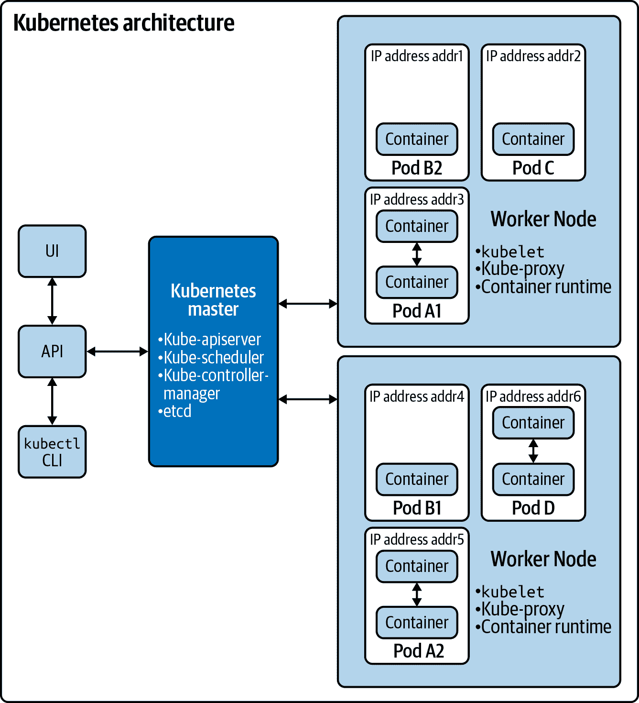
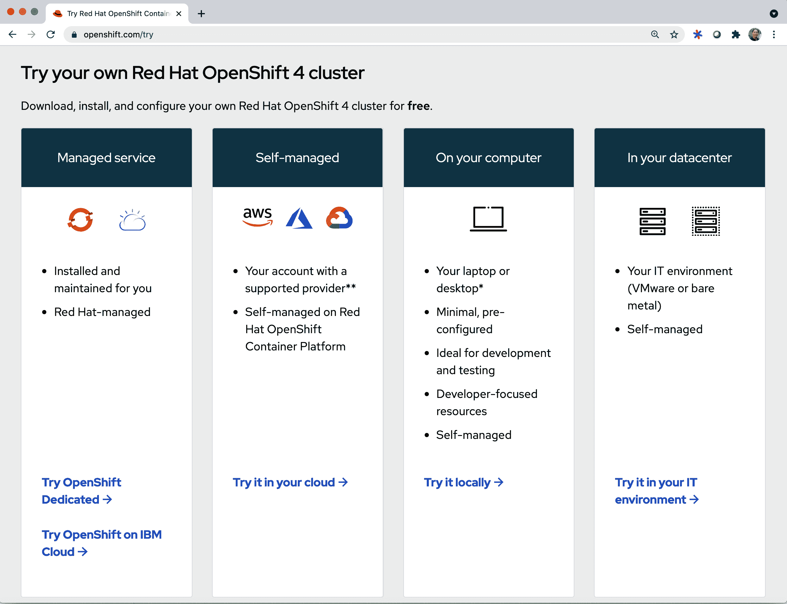

# 第二章：OpenShift 和 Kubernetes 入门

在本章中，我们涵盖了多个主题，这些主题构成了对 Kubernetes 和 OpenShift 的基础理解。我们从 Kubernetes 架构概述开始，然后描述了几种部署选项，这些选项可以帮助您快速建立基本的 Kubernetes 环境和 OpenShift 环境。接下来，我们介绍了用于与 Kubernetes 和 OpenShift 交互的命令行工具 `kubectl` 和 `oc`。然后，我们简要回顾了 pods、deployments 和 service accounts 的基本 Kubernetes 概念。在本章的后半部分，我们介绍了 OpenShift 提供的几个增强概念，超越了传统 Kubernetes。最后，我们讨论了在生产环境中运行 Kubernetes 或 OpenShift 时经常使用的更高级的主题。

# Kubernetes 架构

[Kubernetes 架构](https://oreil.ly/QEYUe)在高层次上相对简单。它由一个 *master 节点* 和一组 *worker 节点* 组成。节点可以是物理服务器或虚拟机。Kubernetes 环境的用户使用 CLI (`kubectl`)、API 或 GUI 与 master 节点进行交互。master 节点负责在 worker 节点上调度工作。在 Kubernetes 中，被调度的工作单元称为 *pod*，一个 pod 可以包含一个或多个容器。存在于 master 节点上的主要组件包括 *kube-apiserver*、*kube-scheduler*、*kube-controller-manager* 和 *etcd*：

kube-apiserver

kube-apiserver 提供了用于操作 Kubernetes 环境的 Kubernetes API。

kube-scheduler

kube-scheduler 组件负责选择在其上创建 pods 的节点。

kube-controller-manager

Kubernetes 提供了几个高级抽象来支持 pods 的副本、节点管理等。每个抽象都由一个控制器组件实现，我们将在本章后面描述。kube-controller-manager 负责管理和运行控制器组件。

etcd

etcd 组件是一个分布式键值存储，是 Kubernetes 控制平面的主要数据存储。该组件存储和复制 Kubernetes 环境中所有关键信息状态。etcd 的关键特性是支持 *watch*。*Watch* 是一种远程过程调用（RPC）机制，允许在键值创建、更新或删除操作时回调函数。Kubernetes 出色的性能和可伸缩性特性依赖于 etcd 作为高效的数据存储机制。

工作节点负责运行调度在其上的 pods。存在于工作节点上的主要 Kubernetes 组件包括 `kubelet`、*kube-proxy* 和 *container runtime*：

`kubelet`

`kubelet` 负责确保每个 Pod 中的容器被创建并保持运行状态。在识别到容器异常终止或未通过用户定义的其他健康检查时，`kubelet` 将重新启动容器。

kube-proxy

Kubernetes 的关键优势之一是其为容器实现的网络支持。kube-proxy 组件提供连接转发、负载均衡以及将单个 IP 地址映射到 Pod 的网络支持。kube-proxy 的独特之处在于它提供了关键的分布式负载均衡能力，这对 Kubernetes 的高可用架构至关重要。

容器运行时

容器运行时组件负责运行每个 Pod 中存在的容器。Kubernetes 支持多种容器运行时环境选项，包括 Docker、`rkt`、CRI-O 和 containerd。¹

图 2-1 显示了 Kubernetes 架构的图形表示，包括一个主节点和两个工作节点。



###### 图 2-1\. Kubernetes 架构的图形表示

如图 2-1 所示，用户可以使用 GUI 或 `kubectl` CLI 与 Kubernetes API 服务器进行交互。这两者都使用 Kubernetes API 与 Kubernetes 主节点上的 kube-apiserver 进行交互。Kubernetes 主节点的 kube-scheduler 组件调度 Pod 在不同的工作节点上运行。每个 Pod 包含一个或多个容器，并分配了自己的 IP 地址。在许多实际应用中，Kubernetes 部署同一个 Pod 的多个副本（运行副本）以提高可伸缩性并确保高可用性。Pod A1 和 A2 是仅在分配的 IP 地址上有所不同的 Pod 副本。同样，Pods B1 和 B2 也是同一个 Pod 的副本。位于同一 Pod 中的容器允许使用标准的进程间通信（IPC）机制进行通信。

在下一节中，我们将介绍几种运行 OpenShift 和 Kubernetes 环境的方法。

# Kubernetes 和 OpenShift 的部署选项

Kubernetes 和 OpenShift 都已经达到了令人难以置信的流行水平。因此，目前有几种可用于部署基本 Kubernetes 或 Red Hat 的 OpenShift Kubernetes 分发的选项。在接下来的几节中，我们总结了当前可用的不同部署选项，包括 Red Hat 的 CodeReady Containers、IBM Cloud 和几种 OpenShift 部署选项。

## Red Hat 的 CodeReady Containers

Red Hat 提供了一个名为[CodeReady Containers](https://oreil.ly/1rI07)的最小预配置的 OpenShift 版本 4 集群，可以在您的笔记本电脑或台式电脑上运行。CodeReady OpenShift 环境旨在用于开发和测试目的。CodeReady Containers 在您的本地机器上提供了一个完全功能的云开发环境，并包含了您开发基于容器的应用程序所需的所有工具。

## IBM Cloud

[IBM Cloud](https://cloud.ibm.com) 提供给用户选择传统的 Kubernetes 集群或 Red Hat OpenShift 集群。IBM Cloud 的 Kubernetes 提供的是作为服务的云服务，提供所有标准的 Kubernetes 功能，包括智能调度、自愈、水平扩展、服务发现与负载平衡、自动发布和回滚以及秘密和配置管理。此外，IBM Cloud 的 Kubernetes 服务还包括集群部署、更新和扩展的自动化操作，专家安全性、优化配置以及与 IBM Cloud 基础设施平台的无缝集成。它在 6 个区域和 35 个数据中心提供高可用的多区域集群。IBM Cloud 提供了一个免费的 Kubernetes 集群，包含超过 40 个免费服务，并提供按使用付费的选项。

IBM Cloud 也为用户提供高可用、完全托管的[OpenShift 集群](https://oreil.ly/qsOdD)。IBM 的 OpenShift 产品实施了独特的安全性和生产力功能，旨在消除更新、扩展和配置所需的大量时间。此外，IBM Cloud 的 OpenShift 提供了抗击意外激增并防范可能导致财务和生产力损失的攻击的弹性。除了按使用和订阅选项外，IBM Cloud 还提供了一个免费的预配置 OpenShift 版本 4.3 环境，可以免费使用四小时。

## OpenShift 部署选项

在[Getting Started with OpenShift](https://www.openshift.com/try)网站上定义了多种 OpenShift 的部署选项。所描述的选项包括在您的笔记本电脑上安装 OpenShift 版本 4，将其部署在您的数据中心或公共云中，或让 Red Hat 为您管理 OpenShift。此外，Red Hat 还提供了面向 OpenShift 的实践教程和 OpenShift 游乐场环境，供非结构化学习和实验使用。图 2-2 展示了可用的 OpenShift 部署选项的多样性。



###### 图 2-2\. OpenShift 部署选项详见[Get Started with OpenShift](https://www.openshift.com/try)

在下一节中，我们将介绍用于与这些平台交互的命令行工具。

# Kubernetes 和 OpenShift 命令行工具

如 第一章 所述，OpenShift 提供了一个符合 Kubernetes 平台标准的平台，并通过各种工具和能力来提高开发人员和 IT 运营的生产力。在本节中，我们首先介绍 `kubectl` 和 `oc`，它们分别是与 Kubernetes 和 OpenShift 交互的标准命令行工具。我们介绍了几个 OpenShift 用来表示其在传统 Kubernetes 上提供的增强功能的概念。我们描述的 OpenShift 概念包括认证、项目、应用、安全上下文和镜像流。

在介绍了 Kubernetes 的一些核心概念之后，接下来的章节将以 YAML 文件的形式给出几个示例。对于所有 Kubernetes 环境，可以使用标准的 Kubernetes 命令行工具 `kubectl` 运行所包含的样本。许多 Kubernetes 环境，包括本章前面提到的环境，都描述了如何安装 `kubectl`。一旦您的 Kubernetes 环境运行起来并安装了 `kubectl`，则以下几节中的所有 YAML 文件样本都可以通过首先将 YAML 保存到文件（例如 *kubesample1.yaml*），然后运行以下 `kubectl` 命令来运行：

```
$ kubectl apply -f kubesample1.yaml
```

正如之前讨论的那样，OpenShift Kubernetes 分发增加了几项新的增强功能和能力，超越了传统 Kubernetes 的使用方式。OpenShift 通过扩展 `kubectl` 的功能来提供对这些功能的访问。为了明确表明 OpenShift 版本的 `kubectl` 具有扩展功能，OpenShift 将其 `kubectl` 版本重命名为一个新的命令行工具叫做 `oc.` 因此，以下命令等效于之前的 `kubectl` 命令：

```
$ oc apply -f kubesample1.yaml
```

除了对所有 `kubectl` 命令提供一对一的匹配支持外，`oc` 还添加了用于管理用户和组的角色和角色绑定等管理功能的命令。

要了解 OpenShift `oc` CLI 提供的命令的广度，请参阅 [OpenShift 命令行文档](https://oreil.ly/7NQW3)。

# Kubernetes 基础知识

Kubernetes 具有几个与其管理容器模型相关的概念。在本节中，我们简要回顾了关键的 Kubernetes 概念，包括 pod、部署和服务账户。

## 什么是 Pod？

因为 Kubernetes 支持容器的管理和编排，您可能会认为 Kubernetes 支持的最小可部署单元是一个容器。然而，Kubernetes 的设计者从经验中学到，最小的可部署单元最好是能够容纳多个容器的单元。在 Kubernetes 中，这个最小的可部署单元称为 *pod*。一个 pod 可以容纳一个或多个应用程序容器。位于同一个 pod 中的应用程序容器具有以下好处：

+   它们共享一个 IP 地址和端口空间

+   它们共享相同的主机名

+   它们可以使用本地 IPC 相互通信

相比之下，运行在单独 Pod 中的应用容器保证拥有不同的 IP 地址和不同的主机名。实质上，不同 Pod 中的容器应被视为运行在不同的服务器上，即使它们最终在同一个节点上结束。

Kubernetes 提供了一组强大的功能，使得 Pod 容易使用：

易于使用的 Pod 管理 API

Kubernetes 提供`kubectl`命令行界面，支持对 Pod 进行各种操作，包括创建、查看、删除、更新、交互和扩展 Pod。

文件复制支持

Kubernetes 让在本地主机和在集群中运行的 Pod 之间复制文件变得非常简单。

从本地计算机到 Pod 的连接性

在许多情况下，您可能希望从本地主机到集群中运行的 Pod 的网络连接。Kubernetes 支持端口转发，通过安全隧道将本地主机上的网络端口连接到集群中运行的 Pod 上的端口。这是一个非常有用的功能，可帮助调试应用程序和服务，而无需将它们公开。

卷存储支持

Kubernetes Pod 支持挂载远程网络存储卷，以使 Pod 中的容器能够访问持久存储，即使 Pod 和最初利用该存储的容器的生命周期结束后仍然保留。

基于探针的健康检查支持

Kubernetes 提供基于探针的健康检查，以确保容器的主要进程仍在运行。此外，Kubernetes 还执行活跃性检查，确保容器实际上正在运行并能够执行真正的工作。借助这种健康检查支持，Kubernetes 可以识别出您的容器是否崩溃或变得无法使用，并代表您重新启动它们。

## 我如何描述我的 Pod 中有什么？

Kubernetes 和其他所有由 Kubernetes 管理的资源都使用 YAML 文件进行描述。以下是描述基本 Pod 资源的简单 YAML 文件：

```
apiVersion: v1
kind: Pod
metadata:
 name: nginx
spec:
 containers:
 - name: nginx
   image: nginx:1.7.9
   ports:
   - containerPort: 80
```

此 YAML 文件包含以下字段和部分：

`apiVersion`

此字段用于声明使用的 Kubernetes API 架构的版本。Kubernetes 在功能和功能上继续快速增长。通过支持其 API 的多个版本，Kubernetes 管理其增长能力所导致的复杂性。通过设置`apiVersion`字段，您可以控制资源使用的 API 版本。

`kind`

使用`kind`字段来识别 YAML 文件描述的资源类型。在上述示例中，YAML 文件声明它描述的是一个`Pod`对象。

`metadata`

`metadata` 部分包含有关 YAML 定义的资源的信息。在上述示例中，`metadata` 包含一个名为 name 的字段，声明了此 Pod 的名称。`metadata` 部分还可以包含其他类型的标识信息，例如标签和注释。我们将在 “Deployments” 中更详细地描述这些内容。

`spec`

`spec` 部分提供了此资源的期望状态的规范。如示例所示，此 Pod 的期望状态是具有名称为 `nginx` 的容器，该容器由标识为 `nginx:1.7.9` 的 Docker 镜像构建。容器共享其所在 Pod 的 IP 地址，而 `containerPort` 字段用于分配此容器可用于发送和接收网络流量的网络端口（在本例中为 `80`）。

###### 提示

`apply` 命令将创建一个资源或更新任何现有的匹配资源。还支持 `create` 命令，该命令将假定尚不存在由 YAML 文档描述的资源。通常情况下，您可以在任何需要 `create` 的地方使用 `apply`。在某些情况下，例如特殊的 `generateName` 属性，仅支持 `create`。

要运行前面的示例，请将文件保存为 *pod.yaml*。现在可以通过以下方式运行它：

```
$ kubectl apply -f pod.yaml
```

运行此命令后，您应该会看到以下输出：

```
pod/nginx created
```

要确认您的 Pod 是否真正运行，请使用 `kubectl get pods` 命令进行验证：

```
$ kubectl get pods
```

运行此命令后，您应该会看到类似以下的输出：

```
NAME  READY STATUS  RESTARTS AGE
nginx 1/1   Running 0        21s
```

当 Pod 运行时，您还可以使用 `logs` 命令查看 Pod 内运行进程的日志（如果有多个容器，请使用 `-c` 选项选择要查看的特定容器）：

```
$ kubectl logs nginx
```

如果需要调试正在运行的容器，可以通过以下命令在容器内创建一个交互式 shell：

```
$ kubectl exec -it nginx – bash
```

此命令指示 Kubernetes 为名为 `nginx` 的 Pod 中运行的容器启动一个交互式 shell。因为此 Pod 只有一个容器，所以即使您没有指定容器名称，Kubernetes 也知道您要连接的容器。通常认为在运行时访问容器的交互式 shell 是一种不良实践。然而，在学习或调试应用程序部署到生产之前，交互式 shell 可能是有用的。运行前述命令后，您可以与容器的运行时环境进行交互，如下所示：

```
root@nginx:/# ls
bin boot dev etc home lib lib64 media mnt opt proc root run sbin selinux 
srv sys tmp usr var
root@nginx:/# exit
```

如果您的 Pod 包含多个容器，则在 `kubectl exec` 命令中还需要包含容器名称。为此，请使用 `-c` 选项，并在 Pod 名称之外包含容器名称。以下是一个示例：

```
$ kubectl exec -it nginx -c nginx -- bash
root@nginx:/# exit
exit
```

要删除刚刚创建的 Pod，请运行以下命令：

```
$ kubectl delete pod nginx
```

您应该看到已删除 Pod 的以下确认：

```
pod "nginx" deleted
```

在使用 Kubernetes 时，您可以期望在集群中运行大量的 pod。在接下来的部分中，我们描述了如何使用标签和注释来帮助您跟踪和识别您的 pod。

## 部署

*部署* 是 Kubernetes 的高级抽象，不仅允许您控制实例化的 pod 副本数目，还支持新版本的 pod 的逐步发布。部署是可配置的，以便利用额外的资源进行无 downtime 的快速发布，或者进行包含金丝雀测试的较慢发布。较慢发布的优势在于它可以通过将软件发布给一小部分用户来降低风险并验证新软件，从而确保新版本的应用程序稳定。部署依赖于 `ReplicaSet` 资源来管理 pod 副本，然后在此能力之上添加 pod 版本管理支持。部署还允许将新发布的 pod 版本回滚到先前的版本，如果新版本的 pod 出现问题。此外，部署支持两种升级 pod 的选项，即 `Recreate` 和 `RollingUpdate`：

`Recreate`

`Recreate` pod 升级选项非常直接。在这种方法中，部署资源修改其关联的 `ReplicaSet`，以指向新版本的 pod。然后，它继续终止所有的 pod。`ReplicaSet` 然后注意到所有的 pod 都已终止，因此生成新的 pod 以确保所需副本数目正在运行。`Recreate` 方法通常会导致您的 pod 应用程序在一段时间内不可访问，因此不建议对需要始终可用的应用程序使用此方法。

`RollingUpdate`

Kubernetes 的部署资源还提供了 `RollingUpdate` 选项。通过 `RollingUpdate` 选项，您的 pod 会逐步被新版本替换。这种方法会导致旧版本和新版本的 pod 同时运行，从而在维护期间避免使您的 pod 应用程序不可用。每个 pod 的就绪状态会被测量，并用于通知 kube-proxy 和入口控制器，哪些 pod 副本可用来处理网络请求，以确保在更新过程中不会丢失任何请求。

以下是一个使用 `RollingUpdate` 选项的部署的 YAML 规范示例：

```
apiVersion: apps/v1
kind: Deployment
metadata:
 name: nginx
 labels:
  app: webserver
 annotations:
  deployment.kubernetes.io/revision: "1"
spec:
 replicas: 3
 selector:
  matchLabels:
   app: webserver
 strategy:
  rollingUpdate:
   maxSurge: 1
   maxUnavailable: 1
  type: RollingUpdate
 template:
  metadata:
   labels:
    app: webserver
  spec:
   containers:
   - name: nginx
     image: nginx:1.7.9
     ports:
     - containerPort: 80
```

先前的部署示例包含了我们在`ReplicaSet`s 和 Pod 中看到的许多特征。在其元数据中，它包含标签和注释。对于部署，一个以`deployment.kubernetes.io/revision`为键，值为`1`的注释提供了此部署内容的第一个修订版信息。与`ReplicaSet`s 类似，部署声明了其提供的副本数量，并使用`matchLabels`字段声明用于识别其管理的 Pod 的标签。

###### 提示

标签匹配是 Kubernetes API 中非常常见的一个方面。如果需要组织或分类资源，请添加描述性标签，作为轻量级元数据。您还可以使用`kubectl get`或`kubectl patch`中的`-l`选项查询或查找资源。

与`ReplicaSet`s 类似，部署（deployment）既有一个用于描述部署的`spec`部分，也有一个嵌套在`template`内部的`spec`部分，用于描述由此部署管理的 Pod 副本的容器。

部署资源中新的并且特定的字段是`strategy`字段及其子字段`type`和`RollingUpdate`。`type`字段用于声明正在使用的部署策略，目前可以设置为`Recreate`或`RollingUpdate`。

如果选择了`RollingUpdate`选项，则还需要设置`maxUnavailable`和`maxSurge`的子字段。选项的使用如下：

`maxSurge`

`maxSurge RollingUpdate`选项在滚动更新期间允许分配额外的资源。此选项的值可以设置为数字或百分比。作为一个简单的例子，假设一个部署支持三个副本，并且`maxSurge`设置为`2`。在这种情况下，在`RollingUpdate`期间将有总共五个副本可用。

在部署的高峰期，将会有三个使用旧版本 Pod 的副本和两个使用新版本 Pod 的副本运行。在这一点上，需要终止一个旧版本 Pod 副本，然后可以创建另一个新版本 Pod 的副本。在这个阶段，将会有总共五个副本，其中三个具有新修订版，两个具有旧版本 Pod。最终，当达到新版本的正确数量的 Pod 副本可用时，两个旧版本的 Pod 可以被终止。

`maxUnavailable`

此`RollingUpdate`选项用于声明在更新期间可能不可用的部署副本 Pod 的数量。可以将其设置为数字或百分比。

以下的 YAML 示例展示了一个已更新以启动一个滚动更新的部署：

```
apiVersion: apps/v1
kind: Deployment
metadata:
 name: nginx
 labels:
  app: webserver
 annotations:
  kubernetes.io/change-cause: "Update nginx to 1.13.10"
spec:
 replicas: 3
 selector:
  matchLabels:
   app: webserver
 strategy:
  rollingUpdate:
   maxSurge: 1
   maxUnavailable: 1
  type: RollingUpdate
 template:
  metadata:
   labels:
    app: webserver
  spec:
   containers:
   - name: nginx
     image: nginx:1.13.10
     ports:
     - containerPort: 80
```

请注意，已添加了一个新的带有键`kubernetes.op/change-cause`的注释标签，并且该值表示容器中运行的 nginx 版本已更新。还请注意，在`spec`部分中用于容器的镜像名称已更改为`nginx:1.13.10`。这个声明实际上驱动了由部署管理的 Pod 副本现在在升级发生时具有新版本的容器镜像。

为了演示部署的功能，让我们运行前两个示例。将第一个部署示例保存为*deploymentset.yaml*，将第二个示例保存为*deploymentset2.yaml*。现在，您可以通过以下方式运行第一个部署示例：

```
$ kubectl apply -f deploymentset.yaml
```

运行此命令后，您应该会看到以下输出：

```
deployment.apps/nginx created
```

要确认您的由部署管理的 Pod 副本是否实际在运行，请使用`kubectl get pods`命令进行验证：

```
$ kubectl get pods
```

运行此命令后，您应该会看到类似以下的输出：

```
NAME                  READY STATUS  RESTARTS AGE
nginx-758fbc45d-2znb7 1/1   Running 0        68s
nginx-758fbc45d-gxf2d 1/1   Running 0        68s
nginx-758fbc45d-s9f9t 1/1   Running 0        68s
```

通过部署，我们有了一个名为`kubectl get deployments`的新命令，它在它们更新其镜像时提供部署状态。请按以下方式运行此命令：

```
$ kubectl get deployments
```

运行此命令后，您应该会看到类似以下的输出：

```
NAME  READY UP-TO-DATE AVAILABLE AGE
nginx 3/3   3          3         2m6s
```

现在让事情变得有趣，让我们通过应用我们在*deploymentset2.yaml*中保存的第二个部署示例来更新部署中的镜像。请注意，我们本可以只更新我们在*deploymentset.yaml*中保存的原始 YAML，而不是使用两个单独的文件。我们通过以下步骤开始更新：

```
$ kubectl apply -f deploymentset2.yaml
```

运行此命令后，您应该会看到以下输出：

```
deployment.apps/nginx configured
```

现在，当我们重新运行`kubectl get deployments`命令时，该命令会提供有关部署状态的信息，因为它们更新其镜像，我们将看到一个更加有趣的结果：

```
$ kubectl get deployments
NAME  READY UP-TO-DATE AVAILABLE AGE
nginx 2/3   3          2         34s
```

如此输出所示，当前部署有三个正在运行的 Pod 副本。其中三个 Pod 副本已经更新为运行更新后的 nginx 镜像。此外，总共有三个 Pod 副本，其中两个可用于处理请求。在一段时间后，当滚动更新完成时，我们达到了希望的状态，即有三个更新后的 Pod 副本可用。我们可以通过重新运行`kubectl get deployments`命令来确认，查看输出现在与我们的期望状态匹配：

```
$ kubectl get deployments
NAME  READY UP-TO-DATE AVAILABLE AGE
nginx 3/3   3          3         46s
```

要删除刚刚创建的部署，请运行以下命令：

```
$ kubectl delete deployment nginx
```

您应该会得到以下确认，即部署已被删除：

```
deployment.apps "nginx" deleted
```

部署还包括命令来暂停部署、恢复部署以及回滚图像更新。如果您对正在部署的新图像有一些值得调查的顾虑，或者确定正在部署的更新图像有问题并且需要回滚到先前的版本，这些命令将非常有帮助。详见[Kubernetes 部署文档](https://oreil.ly/BJ115)，了解如何使用这些部署功能的更多信息。

在接下来的章节中，我们将探讨在安全的 Kubernetes 生产级环境（如 OpenShift）中运行先前示例所需的额外步骤。

## 在 OpenShift 上生产环境中运行 Pod 和部署示例

在前几节中呈现的 Pod 和部署示例非常适合教学目的以及在本地开发环境中运行。但在像 OpenShift 这样的高度安全的 Kubernetes 平台上运行时，需要考虑其他因素。首先，在先前示例中使用的 nginx 容器镜像被配置为以特权根用户运行。默认情况下，像 OpenShift 这样的安全生产 Kubernetes 平台配置为不允许容器镜像以根身份运行。这是因为以根身份运行容器镜像会增加恶意代码可能对主机系统造成损害的风险。³ 为解决这个问题，我们将在本章前面创建的*pod.yaml*示例中使用一个不需要以特权根用户运行的图像版本，来替换先前使用的 nginx 容器。Bitnami 提供的 nginx 容器镜像作为非根容器运行，可以在生产 OpenShift 环境中使用。以下示例是我们之前创建的*pod.yaml*的更新版本，使用了 Bitnami 的非根 nginx 容器镜像：

```
apiVersion: v1
kind: Pod
metadata:
 name: nginx
spec:
 containers:
 - name: nginx
 image: bitnami/nginx:1.18
 ports:
 - containerPort: 80
```

###### 注意

请记住，所有资源都是*集群范围*，意味着集群中只能存在一个该类资源，或者是*命名空间范围*，意味着这些资源与集群上的其他类似资源隔离。在 OpenShift 中，您可能还会看到*项目*这个术语，它在 Red Hat 与社区合作通用化为命名空间的概念之前就已存在。*项目*和*命名空间*是同义词，OpenShift 将对`get projects`或`get namespaces`作出响应。您可以将命名空间类比为文件系统中的文件夹，用于分配给协作创建一组文件的用户组。我们将在“OpenShift 增强”中进一步讨论命名空间或项目。

我们早期 Pod 和部署示例的另一个问题需要解决的是，在创建它们时，我们没有通过创建一个专用于我们资源的 Kubernetes 命名空间来将我们的资源与其他资源隔离开来。相反，早期示例将我们的资源放置在 Kubernetes 默认命名空间中。为了鼓励应用程序的正确隔离，安全的生产 Kubernetes 平台（如 OpenShift）将强制执行您的 Kubernetes 资源不在默认命名空间中创建，而是在提供所需隔离的用户定义命名空间中创建。要创建正确配置的命名空间，OpenShift 提供了 `oc new-project` 命令。OpenShift 的项目功能在 “OpenShift Enhancements” 中有更详细的描述。然而，目前我们将使用 `oc new-project` 命令来创建一个名为 `book` 的新项目，这将提供所需的隔离以便运行我们的 Pod 示例。我们通过运行以下命令来创建我们的新项目：

```
$ oc new-project book
```

我们随后可以使用 `oc apply -f` 命令，传入我们更新后的 *pod.yaml* 文件，并使用 `-n` 选项声明我们希望在 `book` 命名空间中创建我们的资源：

```
$ oc apply -f pod.yaml -n book
pod/nginx configured
```

现在我们已经使用了非根容器镜像，并且不再使用默认命名空间，OpenShift 将允许我们的 Pod 示例在生产环境中运行。我们可以通过使用 `oc get pods` 命令来确认这一点：

```
$ oc get pods
NAME  READY STATUS  RESTARTS AGE
nginx 1/1   Running 0        63s
```

我们可以使用 `oc delete pod` 命令清理并移除 Pod 示例：

```
$ oc delete pod nginx
pod "nginx" deleted
```

我们用于 Pod 示例的相同技术也可以应用于部署示例。只需更新用于 *deploymentset.yaml* 中的 nginx 镜像，并确保在执行 `oc apply` 命令时使用 `book` 命名空间。在下一节中，我们将介绍 Kubernetes 平台的另一个基本概念，称为 *服务账户*，它们用于为 Kubernetes 平台的关键部分提供身份验证。

## 服务账户

当您与您的集群交互时，您通常将自己表示为用户身份。在 Kubernetes 的世界中，我们将智能构建到系统中，以帮助它与其世界进行交互。许多时候，Pod 可能使用 Kubernetes API 与系统的其他部分交互或者生成作业。当我们部署一个 Pod 时，它可能与卷存储交互，与主机文件系统交互，与主机网络交互，或者对赋予它的操作系统用户对文件系统访问权限敏感。在大多数情况下，您希望限制给定 Pod 的默认权限，以免其超出绝对基础功能。基本上，Pod 在集群、主机操作系统、网络层和存储层中被赋予访问权限越少，可以被利用的攻击向量就越少。

为了让 pod 与系统交互，它被分配了一个服务账户。可以将其视为功能性身份。服务账户是可以通过令牌与 kube-apiserver 进行身份验证并被授权执行某些行为的主体。

在某些 Kubernetes 系统中，投影到 pod 中的服务账户可能具有 Kubernetes 之外的身份。一个强大的使用情况是在 Kubernetes 中使用开源[Istio](https://istio.io)服务网格项目。在这种情况下，Istio 身份通过服务账户进行投影，这允许一个 pod 在进行服务请求时与另一个 pod 进行身份验证。一些云提供商和其他安全工具也允许将服务账户身份投影到 pod 中，这允许与这些外部平台进行身份验证。

在 OpenShift 中，服务账户还用于将一组安全权限与每个 pod 关联起来。OpenShift 用于创建专门的安全权限组合的对象称为*安全上下文约束*。在下一节中，我们将更详细地讨论安全上下文约束，以及 OpenShift 提供的其他重要增强功能，以补充基本的 Kubernetes。

# OpenShift 增强功能

OpenShift 引入了几个新概念，用于简化开发和运维。OpenShift 特有的方法包括认证、项目、应用程序、安全上下文和镜像流。

## 认证

安全对于 OpenShift Kubernetes 平台至关重要。因此，所有用户必须对集群进行身份验证才能访问它。OpenShift 支持各种常见的认证方法，包括基本认证（用户名和密码）、OAuth 访问令牌和 X.509 客户端证书。OpenShift 提供了`oc login`命令用于执行身份验证，通过以下方式运行：

```
$ oc login
```

在基本认证使用情况下，当运行此命令时，用户将被要求输入 OpenShift 容器平台服务器的 URL 以及是否需要安全连接，然后用户将被要求输入他们的用户名和密码。此外，OpenShift 的可配置 OAuth 服务器允许用户将 OpenShift 身份与外部提供者（如 LDAP 服务器）集成。

## 项目

标准的 Kubernetes 提供了 [*命名空间*](https://oreil.ly/IAiIw) 的概念，允许您为 Kubernetes 资源定义隔离。命名空间使集群资源可以在大量用户之间分割，通过它们所管理的作用域所产生的隔离，防止用户因命名冲突而意外使用其他人的资源。命名空间非常有用，OpenShift 已经调整了命名空间以用于应用程序分组。OpenShift 将 Kubernetes 命名空间添加特殊的标准注释列表，将其称为 *项目*。OpenShift 使用项目作为分组应用程序的机制。项目支持访问权限的概念。这使您可以添加一个或多个具有对项目访问权限的用户，并使用基于角色的访问控制设置不同用户在访问项目时具有的权限和能力。

使用 `oc new-project` 命令创建项目，并提供项目名称、描述和显示名称，如下所示：

```
$ oc new-project firstproject --description=”My first project” 
--display-name=”First Project”
```

OpenShift 通过使用 `oc project` 命令轻松切换项目。在这里，我们切换到名为 `secondproject` 的不同项目：

```
$ oc project secondproject
```

要查看您有权访问的项目列表，可以使用 `oc get projects` 命令：

```
$ oc get projects
```

关于项目使用的更多信息，请参阅 [OpenShift 项目文档](https://oreil.ly/xXs4d)。

## 应用程序

在使用基本的 Kubernetes 环境时，云原生应用程序开发人员需要执行的更繁琐的步骤之一是创建自己的容器镜像。通常情况下，这涉及查找合适的基础镜像，并创建一个 `Dockerfile`，其中包含将基础镜像与开发人员的代码组合以创建可由 Kubernetes 部署的装配图像所需的所有命令。OpenShift 引入了 [应用程序构造](https://oreil.ly/3RpbY)，极大地简化了在 Kubernetes 环境中创建、部署和运行容器镜像的过程。

应用程序是使用 `oc new-app` 命令创建的。该命令支持多种选项，可以多种方式构建容器镜像。例如，使用 `new-app` 命令，应用程序镜像可以从本地或远程 Git 存储库构建，或者可以从 Docker Hub 或私有镜像注册表拉取应用程序镜像。此外，`new-app` 命令支持通过检查存储库的根目录来确定创建应用程序镜像的正确方法。例如，OpenShift 的 `new-app` 命令将在您的存储库根目录中查找 `JenkinsFile`，如果找到此文件，将使用它来创建应用程序镜像。此外，如果 `new-app` 命令没有找到 `JenkinsFile`，它将尝试通过查看存储库中的文件来检测您的应用程序使用的编程语言。如果能够确定所使用的编程语言，`new-app` 命令将找到适合该编程语言的基础镜像，并将用它来构建您的应用程序镜像。

以下示例说明了如何使用 `oc new-app` 命令从 OpenShift 示例 ruby hello world 应用程序创建新的应用程序镜像：

```
$ oc new-app https://github.com/openshift/ruby-hello-world.git
```

这个命令将把应用程序创建为最近为用户选择的 OpenShift 项目的一部分。有关 `new-app` 命令支持的应用程序镜像创建选项的更多信息，请参阅[OpenShift 应用程序创建文档](https://oreil.ly/3RpbY)。

## 安全上下文约束

在 OpenShift 中，安全始终是首要考虑的。但是增强的安全性可能会带来额外的复杂性和麻烦。如果使用了增强的安全性而容器没有获得适当的安全选项，则会失败。如果放宽安全性以避免问题，则可能导致漏洞。为了使用户能够在减少麻烦的同时利用增强的安全性，OpenShift 包括了一种称为*安全上下文约束*的安全结构。

安全上下文约束标识出一组安全特权，保证 pod 的容器在执行之前知道将获得什么安全特权。以下是安全上下文约束提供的常见安全特权选项列表：

允许 pod 运行特权容器

安全上下文约束可以声明 pod 是否被允许运行特权容器或者仅能运行非特权容器。

需要安全增强型 Linux (SELinux)

[SELinux](https://oreil.ly/SlHNy) 是 Linux 的安全架构，为系统上的应用程序、进程和文件定义访问控制。SELinux 提供了比标准 Linux 更多的额外保护。安全上下文约束提供了 `MustRunAs` 属性值，用于声明 pod 的容器是否必须运行 SELinux，以及 `RunAsAny` 属性值，用于声明 pod 的容器是否可以运行标准 Linux 或 SELinux。

将 pod 的容器作为特定用户或非 root 运行

以 root 身份运行的容器比以非 root 身份运行的容器具有更大的漏洞足迹。安全上下文约束提供了 `MustRunAsNonRoot` 属性值来表示不允许 Pod 的容器以 root 身份运行。此外，安全上下文约束使用了 `RunAsAny` 属性值，允许 pod 的容器以 root 或非 root 用户运行。最后，安全上下文约束管理了 `MustRunAsRange` 属性值，允许 pod 的容器在用户 ID 在特定用户 ID 范围内时运行。

允许 pod 的容器访问文件系统组块存储

安全上下文约束可用于限制 pod 的容器访问的块存储。通过文件系统组标识符标识块存储部分。安全上下文约束提供了 `RunAsAny` 属性值，允许 pod 的容器访问任何块存储的文件系统组，并提供了 `MustRunAs` 属性值，用于表示 pod 的块存储必须在安全上下文约束中列出的文件系统组 ID 范围内。

OpenShift 包括几个内置安全上下文约束配置文件，可供重复使用。要查看您有权访问的项目列表，可以使用 `oc get scc` 命令：

```
$ oc get scc

NAME             AGE
anyuid           182d
hostaccess       182d
hostmount-anyuid 182d
hostnetwork      182d
node-exporter    182d
nonroot          182d
privileged       182d
restricted       182d
```

如上所示，OpenShift 为常见场景贡献了安全上下文约束配置文件，如特权、受限或以非 root 运行。要查看安全约束配置文件的所有单独功能设置，请使用 `oc describe scc` 命令并传递您想要更多详细信息的配置文件名称。例如，如果您想要更多了解特权约束配置文件的强大功能，可以调用 `oc describe scc` 命令如下：

```
$ oc describe scc privileged
```

运行此命令将列出与此配置文件关联的大量约束属性。以下是一些较为有趣的内容：

```
Settings:
 Allow Privileged: true
 Allow Privilege Escalation: true
 Default Add Capabilities: <none>
 Required Drop Capabilities: <none>
 Allowed Capabilities: *
 Allowed Seccomp Profiles: *
 Allowed Volume Types: *
 Allowed Flexvolumes: <all>
 Allowed Unsafe Sysctls: *
 Forbidden Sysctls: <none>
 Allow Host Network: true
 Allow Host Ports: true
 Allow Host PID: true
 Allow Host IPC: true
 Read Only Root Filesystem: false
 Run As User Strategy: RunAsAny
 SELinux Context Strategy: RunAsAny
 FSGroup Strategy: RunAsAny
 Supplemental Groups Strategy: RunAsAny
```

为了比较目的，我们可以在受限制的配置文件中运行相同的命令。如下输出所示，约束属性值比特权配置文件中的要严格得多：

```
$ oc describe scc restricted

Settings:
 Allow Privileged: false
 Allow Privilege Escalation: true
 Default Add Capabilities: <none>
 Required Drop Capabilities: KILL,MKNOD,SETUID,SETGID
 Allowed Capabilities: <none>
 Allowed Seccomp Profiles: <none>
 Allowed Volume Types: configMap,downwardAPI,emptyDir,persistentVolumeClaim,
projected,secret
 Allowed Flexvolumes: <all>
 Allowed Unsafe Sysctls: <none>
 Forbidden Sysctls: <none>
 Allow Host Network: false
 Allow Host Ports: false
 Allow Host PID: false
 Allow Host IPC: false
 Read Only Root Filesystem: false
 Run As User Strategy: MustRunAsRange
 SELinux Context Strategy: MustRunAs
 FSGroup Strategy: MustRunAs
 Supplemental Groups Strategy: RunAsAny
```

这里的关键点在于安全上下文约束配置文件能够组织和封装大量的能力属性，并确保在允许 Pod 执行之前满足所有这些属性。这减少了设置能力属性不当的机会，减少了由于安全设置不正确而导致的意外 Pod 失败的可能性。

安全上下文约束配置文件通过使用 Kubernetes 服务账号对象与 Pod 相关联。有关使用安全上下文约束的更多信息，请参阅[OpenShift 安全上下文约束文档](https://oreil.ly/W41Sq)。

## 镜像流

在部署云原生应用程序的关键步骤之一是从仓库中检索正确的容器应用程序镜像。在生产环境中，此检索过程可能存在几个潜在问题。首先，容器镜像是通过标记标识符检索的，但可能会发生容器镜像被覆盖的情况，因此标记引用的镜像可能会发生变化。如果这种变化未被注意到，可能会导致部署的云原生应用程序中引入意外错误。其次，在生产环境中，镜像检索过程还需要支持自动化构建和部署，而许多镜像仓库在支持此自动化方面的能力有限。第三，在某些情况下，容器镜像需要具有多个标签与之关联，因为在不同环境中，容器镜像用于不同目的。不幸的是，许多镜像仓库不支持将多个标签与容器应用程序镜像关联的能力。

为了解决所有这些问题，OpenShift 引入了*镜像流*的概念。⁵ 镜像流旨在为标记的镜像提供更稳定的指针。镜像流维护了一个 SHA-256 安全哈希函数，指向其所指向的镜像，以确保镜像不会被错误地更改。镜像流还支持为镜像提供多个标记，以更好地支持在多个环境中使用它们。此外，镜像流包括触发器，当更新镜像流时可以自动启动构建和部署。此外，镜像流不仅可以引用外部仓库中的容器镜像，还可以安排定期重新导入外部容器镜像，以确保始终具有最新更新的容器镜像副本。

创建和更新镜像流相对来说是比较简单的。使用`oc import-image`命令来创建镜像流。在下面的示例中，使用`oc import-image`命令创建了一个名为`nginx`的初始镜像流，其导入的镜像流标签的值为`1.12`：

```
$ oc import-image nginx:1.12 --from=centos/nginx-112-centos7 --confirm
```

如本例所示，被导入到 `nginx` 图像流中的初始容器图像是位于 `centos/nginx-112-centos7` 的图像。`confirm` 选项指示，如果尚不存在，则应创建图像流。

创建图像流后，我们可以使用 `oc describe` 命令来查看它。在以下示例中，`is` 值是输入流资源的简称。我们要描述的特定输入流是名为 `nginx` 的输入流：

```
$ oc describe is/nginx
```

此命令的输出如下所示：

```
Name: nginx
Namespace: default
Created: 52 seconds ago
Labels: <none>
Annotations: openshift.io/image.dockerRepositoryCheck=2020-06-12T20:16:15Z
Image Repository: default-route-openshift-image-registry.apps-
crc.testing/default/nginx
Image Lookup: local=false
Unique Images: 1
Tags: 1

1.12
 tagged from centos/nginx-112-centos7

*centos/nginx-112-
centos7@sha256:af171c38298e64664a9f999194480ce7e392858e773904df22f7585a1731ad0d
```

我们可以通过使用 `oc tag` 命令为此图像添加额外的标签。我们通过以下方式向现有的 `nginx:1.12` 标签添加一个 `nginx:latest` 标签：

```
$ oc tag nginx:1.12 nginx:latest
```

最后，我们可以通过调用 `oc tag` 命令，从外部仓库标记一个图像，并安排定期重新导入该图像。如下例所示，我们引用外部仓库中的图像，并将其与图像流标签关联，然后添加定期更新选项以表示应定期更新该标签：

```
$ oc tag docker.io/nginx:1.14 nginx:1.14 --scheduled
```

有关图像流使用的更多信息，请参阅 [管理图像流文档](https://oreil.ly/YMfdZ)。

# Kubernetes 和 OpenShift 高级主题

当在生产环境中运行 Kubernetes 或 OpenShift 时，经常会使用几个高级概念。在本节中，我们讨论这些高级主题，包括 Webhooks、准入控制器、基于角色的访问控制和运算符。

## Webhooks

*Webhook* 是一个 HTTP 回调。基本上，Webhook 在发生有趣事件时允许向外部实体推送信息。通常，使用 HTTP Post 操作推送事件信息，并且事件信息最常以 JSON 负载表示。在 Kubernetes 中，Webhook 用于各种与安全相关的操作。例如，Kubernetes 可以使用 Webhook 查询外部服务，以确定用户是否具有执行特定操作的正确权限。

Webhook 在 OpenShift 中也被用作 [触发构建的机制](https://oreil.ly/bmfyW)。使用 Webhook，您可以配置 GitHub 仓库，在仓库发生更改时发送警报。此警报可用于启动新构建，并在构建成功后执行部署。

Webhook 在 Kubernetes 的准入控制器中也被大量使用，下一节将对其进行描述。有关 Kubernetes 中 Webhook 使用的更多信息，请参阅 [Kubernetes 文档中的 Webhook 模式](https://oreil.ly/Aiw7t)。

## [准入控制器](https://oreil.ly/Aiw7t)

保持 Kubernetes 平台安全的关键是防止可能造成损害的请求。*准入控制器*是 Kubernetes 使用的一种机制，用于保护平台免受有害请求的影响。在某些情况下，准入控制器会阻止请求创建 Kubernetes 对象。在其他情况下，准入控制器会允许请求被处理，但会修改请求以使其更安全。例如，如果收到一个启动 Pod 的请求，并且请求没有指定 Pod 应以特权模式还是非特权模式启动，准入控制器可以修改请求，以确保 Pod 以非特权模式启动。

在 kube-controller-manager 中内嵌了多个准入控制器，默认情况下很多准入控制器都是启用的，以确保 Kubernetes 平台的安全性。然而，在某些情况下，管理员需要超出这些内置准入控制器的限制。Kubernetes 允许管理员通过注册 Webhook 来添加额外的准入控制器，以处理 Kubernetes 对象上的请求。我们将在第三章详细讨论准入控制器。

## 基于角色的访问控制

Kubernetes 的授权功能已集成到平台中。Kubernetes 授权使用基于角色的访问控制（RBAC）模型，并提供一个功能齐全的授权平台，允许操作员通过 Kubernetes 对象 `ClusterRole` 和 `Role` 定义各种角色，并通过 `ClusterRoleBinding` 和 `RoleBinding` 将其绑定到用户和组。可以把 RBAC 想象成在文件系统上设置权限的一种方式，但在 Kubernetes 的情况下，它是在 Kubernetes 对象模型上设置权限。我们将在第四章详细讨论如何使用 RBAC 以及如何在其周围构建最佳的多租户模型。

## 操作员

Kubernetes 具有内置的抽象层，例如部署（deployments），非常适合无状态应用程序。此外，Kubernetes 基于控制循环的优雅设计使其能够支持声明式编程模型，并且在大规模环境中即使故障频发，平台仍能健壮执行。

为了支持复杂的有状态应用程序，Kubernetes 需要一个可扩展的模型，使用户能够添加自定义资源并执行这些资源的生命周期管理。此外，理想情况下，这个可扩展模型还应支持 Kubernetes 平台内广泛使用的控制循环架构。Kubernetes 包含[操作员模式](https://oreil.ly/OujZb)，为满足所有这些需求的自定义资源提供了一个可扩展模型。

运算符支持创建自定义资源。这意味着您可以通过创建自定义资源定义在 Kubernetes 中定义新的资源类型，并且这些新资源可以像任何标准 Kubernetes 资源一样存储在 Kubernetes etcd 数据库中。此外，您还可以为您的资源创建自定义控制器，该控制器执行与标准 Kubernetes 控制器相同类型的控制循环行为。自定义控制器可以监视您的有状态应用程序的实际状态，将其与期望状态进行比较，然后采取行动尝试实现应用程序的期望状态。例如，假设您为特殊类型的数据库创建了一个操作符，这是一个有状态的应用程序。操作符及其控制器可以确保运行的数据库副本数量与所需的副本数量相匹配。此外，由于操作符具有自定义控制器，因此可以将用于启动新数据库副本或更新现有数据库副本的任何自定义生命周期管理代码添加到控制器中。

操作符模式设计良好，其关键优势之一是其无缝性。与操作符关联的自定义资源通过 `kubectl` 命令行工具进行管理，在管理角度上看，与标准 Kubernetes 资源几乎没有区别。为了简化操作符的创建，存在操作符软件开发工具包，可以生成所需的自定义资源定义以及运行操作符控制循环所需的大部分控制器代码。由于操作符框架的清晰架构设计以及丰富的工具支持，使用操作符作为添加有状态应用程序的手段继续增长其流行度。现在有一个 [Operator Hub](https://operatorhub.io)，其中托管了大量用于管理各种 Kubernetes 平台应用程序的现有和可重复使用的操作符。我们将在 第七章 中更详细地讨论操作符及其在 Kubernetes 中的使用情况。

# 总结

在本章中，我们涵盖了广泛的主题，为您提供了 Kubernetes 和 OpenShift 的广泛基础和坚实介绍。我们涉及了一些对于生产环境中运行至关重要的主题，并且我们将在本书的后续章节中更详细地探讨这些主题。此外，本章还帮助说明了 Kubernetes 和 OpenShift 生态系统如何成熟为提供大量企业级功能和灵活性的平台。在 第三章 中，我们涵盖了一个关键的生产主题：在生产环境中运行时 Kubernetes 资源的高级管理。

¹ Lantao Liu 和 Mike Brown，"Kubernetes Containerd Integration Goes GA," Kubernetes 博客（2018 年 5 月 24 日），[*https://oreil.ly/SlHmh*](https://oreil.ly/SlHmh)。

² Brendan Burns 等人，"Borg、Omega 和 Kubernetes: 从三种容器管理系统的十年经验中学到的教训," *ACM Queue* 14 (2016): 70–93，[*http://bit.ly/2vIrL4S*](http://bit.ly/2vIrL4S)。

³ Tomas Pizarro Moreno，"在 OpenShift 上运行非根容器," Bitnami 工程部（2017 年 10 月 27 日），[*https://oreil.ly/pxSGf*](https://oreil.ly/pxSGf)。

⁴ [OpenShift 认证文档](https://oreil.ly/23ON5) 提供了更多关于支持的认证方法的详细信息。

⁵ [镜像流文档](https://oreil.ly/T7vSF) 提供了更多信息。

⁶ Maciej Szulik，"如何在 Kubernetes 中使用 OpenShift Image Streams 简化容器镜像管理," 红帽 OpenShift 博客（2017 年 3 月 23 日），[*https://oreil.ly/JEV4u*](https://oreil.ly/JEV4u)。

⁷ Wikipedia 提供了 [Webhooks 概述](https://oreil.ly/PLH43)。
