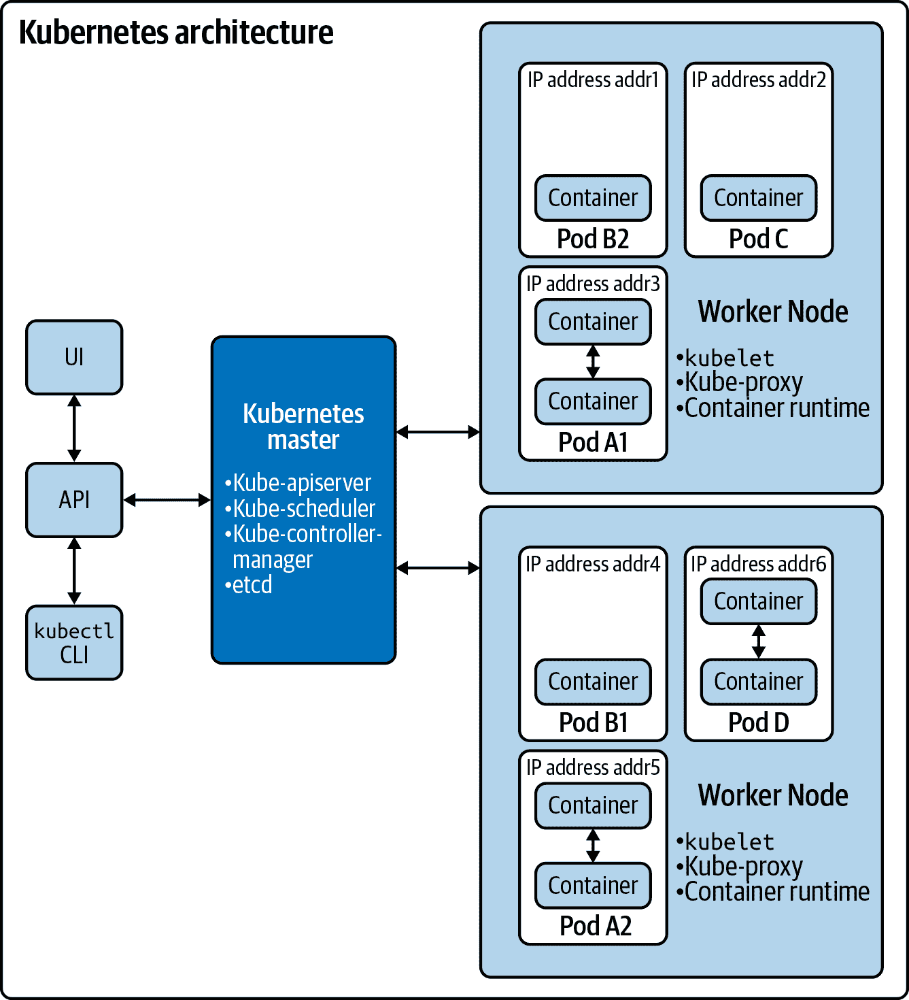

# 第二章：使用 OpenShift 和 Kubernetes 入门

在本章中，我们涵盖了多个主题，这些主题提供了对 Kubernetes 和 OpenShift 的基础理解。我们首先概述了 Kubernetes 的架构，然后描述了几种部署选项，这些选项将使您能够同时启动基本的 Kubernetes 环境和 OpenShift 环境。接下来，我们介绍了用于与 Kubernetes 和 OpenShift 交互的命令行工具`kubectl`和`oc`。然后，我们简要回顾了 Pods、Deployments 和 Service Accounts 等基本 Kubernetes 概念。在本章的后半部分，我们介绍了 OpenShift 相比传统 Kubernetes 提供的几个增强概念。最后，我们讨论了在生产环境中运行 Kubernetes 或 OpenShift 时常用的更高级的主题。

# Kubernetes 架构

[Kubernetes 架构](https://oreil.ly/QEYUe)在高层次上相对简单。它由*主节点*和一组*工作节点*组成。节点可以是物理服务器或虚拟机。Kubernetes 环境的用户可以使用 CLI（`kubectl`）、API 或 GUI 与主节点交互。主节点负责在工作节点上安排工作。在 Kubernetes 中，调度的工作单元称为*Pod*，一个 Pod 可以包含一个或多个容器。存在于主节点上的主要组件包括*kube-apiserver*、*kube-scheduler*、*kube-controller-manager*和*etcd*：

kube-apiserver

kube-apiserver 提供了用于操作 Kubernetes 环境的 Kubernetes API。

kube-scheduler

kube-scheduler 组件负责选择应在其上创建 Pod 的节点。

kube-controller-manager

Kubernetes 提供了几个支持 Pod 副本、管理节点等高级抽象。每个抽象都是通过控制器组件实现的，我们稍后在本章中描述。kube-controller-manager 负责管理和运行控制器组件。

etcd

etcd 组件是一个分布式键值存储，是 Kubernetes 控制平面的主要数据存储。该组件存储并复制您的 Kubernetes 环境的所有关键信息状态。etcd 的关键特性是其支持观察功能。*观察*是一种远程过程调用（RPC）机制，允许在键值的创建、更新或删除操作时进行回调函数。Kubernetes 的优秀性能和可伸缩性特性依赖于 etcd 作为高效的数据存储机制。

工作节点负责运行在其上调度的 Pod。存在于工作节点上的主要 Kubernetes 组件包括`kubelet`、*kube-proxy*和*容器运行时*：

`kubelet`

`kubelet` 负责确保每个 Pod 中的容器被创建并保持运行状态。当 `kubelet` 发现容器异常终止或者未通过用户定义的其他健康检查时，它将重新启动容器。

kube-proxy

Kubernetes 的关键优势之一是它为容器实现的网络支持。kube-proxy 组件提供连接转发、负载均衡以及将单个 IP 地址映射到 Pod 的网络支持。kube-proxy 的独特之处在于，它提供了分布式负载均衡能力，这对 Kubernetes 的高可用架构至关重要。

容器运行时

容器运行时组件负责运行每个 Pod 中存在的容器。Kubernetes 支持多种容器运行时环境选项，包括 Docker、`rkt`、CRI-O 和 containerd。¹

图 2-1 展示了 Kubernetes 架构的图形表示，包括一个主节点和两个工作节点。



###### 图 2-1\. Kubernetes 架构的图形表示

如同 图 2-1 所示，用户可以通过 GUI 或者 `kubectl` CLI 与 Kubernetes API 服务器进行交互。这两者都使用 Kubernetes API 与运行在 Kubernetes 主节点上的 kube-apiserver 进行交互。Kubernetes 主节点的 kube-scheduler 组件负责将 Pod 调度到不同的工作节点上。每个 Pod 包含一个或多个容器，并分配有自己的 IP 地址。在许多实际应用中，Kubernetes 部署同一个 Pod 的多个副本以提高可扩展性并确保高可用性。Pod A1 和 A2 是不同 IP 地址的 Pod 副本。同样，Pod B1 和 B2 也是同一个 Pod 的副本。同一个 Pod 中的容器允许使用标准的进程间通信（IPC）机制进行通信。

在下一节中，我们将介绍几种启动和运行 OpenShift 和 Kubernetes 环境的方法。

# Kubernetes 和 OpenShift 的部署选项

Kubernetes 和 OpenShift 都已经达到了令人难以置信的流行水平。因此，现在有多种选择可以部署基本的 Kubernetes 或者 Red Hat 的 OpenShift Kubernetes 发行版。在接下来的几节中，我们将总结当前可用的不同部署选项，包括 Red Hat 的 CodeReady Containers、IBM Cloud 和多种 OpenShift 部署选项。

## Red Hat 的 CodeReady Containers

Red Hat 提供了一个名为 [CodeReady Containers](https://oreil.ly/1rI07) 的最小预配置 OpenShift 4 版本集群，您可以在笔记本电脑或台式计算机上运行。CodeReady OpenShift 环境旨在用于开发和测试目的。CodeReady Containers 在您的本地机器上提供了一个功能完整的云开发环境，并包含您开发基于容器的应用程序所需的所有工具。

## IBM Cloud

[IBM Cloud](https://cloud.ibm.com) 提供用户选择传统的 Kubernetes 集群或 Red Hat OpenShift 集群的选项。IBM Cloud 的 Kubernetes 提供的是作为服务的云服务，提供标准的 Kubernetes 功能，包括智能调度、自愈能力、水平扩展、服务发现和负载平衡、自动发布和回滚以及秘密和配置管理。此外，IBM Cloud 的 Kubernetes 服务包括集群部署、更新和扩展的自动化操作，专家级安全性，优化的配置以及与 IBM Cloud 基础设施平台的无缝集成。它在 6 个区域和 35 个数据中心提供高可用的多区域集群。IBM Cloud 提供一个免费的 Kubernetes 集群，包括超过 40 个免费服务以及按使用量付费的选项。

IBM Cloud 还为用户提供高可用的完全托管的 [OpenShift 集群](https://oreil.ly/qsOdD)。IBM 的 OpenShift 提供了独特的安全性和生产力功能，旨在减少更新、扩展和配置的大量时间。此外，IBM Cloud 的 OpenShift 具备处理意外涌入并保护免受可能导致财务和生产力损失的攻击的韧性。除按使用量付费和订阅选项外，IBM Cloud 还提供一个免费的预配置 OpenShift 4.3 环境，可免费使用四小时。

## OpenShift 部署选项

在 [Getting Started with OpenShift](https://www.openshift.com/try) 网站上定义了几种 OpenShift 的部署选项。所描述的选项包括在笔记本电脑上安装 OpenShift 4 版本，在数据中心或公共云中部署，或让 Red Hat 为您管理 OpenShift。此外，Red Hat 还提供了实验性学习和实验的 Playground OpenShift 环境以及操作 OpenShift 的实际教程。Figure 2-2 展示了可用的多样化 OpenShift 部署选项。


###### 图 2-2\. 在 [Get Started with OpenShift](https://www.openshift.com/try) 上提供的 OpenShift 部署选项

在下一节中，我们将描述与这些平台交互所使用的命令行工具。

# Kubernetes 和 OpenShift 命令行工具

正如在第一章中讨论的那样，OpenShift 提供了一个符合 100%标准的 Kubernetes 平台，并通过各种工具和功能增强了开发人员和 IT 运营的生产力。在本节中，我们首先介绍了`kubectl`和`oc`，这两个是用于与 Kubernetes 和 OpenShift 交互的标准命令行工具。我们介绍了 OpenShift 用来表示其对传统 Kubernetes 的增强的几个概念，包括身份验证、项目、应用程序、安全上下文和镜像流。

在介绍了 Kubernetes 的一些核心概念后，接下来的章节以 YAML 文件的形式给出了几个示例。对于所有的 Kubernetes 环境，可以使用标准的 Kubernetes 命令行工具`kubectl`来运行所包含的样本。许多 Kubernetes 环境，包括本章节早前提到的那些，描述了如何安装`kubectl`。一旦你的 Kubernetes 环境准备就绪并且安装了`kubectl`，可以通过首先将 YAML 保存到文件（例如*kubesample1.yaml*），然后运行以下`kubectl`命令来运行以下章节中的所有 YAML 文件样本：

```
apiVersion: v1
kind: Pod
metadata:
  name: frontend
spec:
  containers:
  - name: web
    image: icr.io/sample/web:v1
    env:
    resources:
      requests:
        memory: "50Mi"
        cpu: "150m"
        ephemeral-storage: “50Mi”
  - name: logging
    image: icr.io/sample/logging:v2
    resources:
      requests:
        memory: "40Mi"
        cpu: "100m"
        ephemeral-storage: “200Mi”
```

如前所述，OpenShift 对 Kubernetes 的分发增加了几个新的增强功能和能力。OpenShift 通过扩展`kubectl`的功能来提供对这些功能的访问。为了明确 OpenShift 版本的`kubectl`具有扩展功能，OpenShift 将其版本的`kubectl`重命名为一个称为`oc`的新命令行工具。因此，以下命令等同于之前的`kubectl`命令：

```
resources:
   limits:
     memory: "200Mi"
   requests:
     memory: "200Mi"
```

除了所有`kubectl`命令的一对一匹配支持外，`oc`还添加了用于管理用户和组的角色和角色绑定等管理功能的命令。

欲了解有关 OpenShift `oc` CLI 可用命令的详细信息，请参阅[OpenShift 命令行文档](https://oreil.ly/7NQW3)。

# Kubernetes 基础知识

Kubernetes 有几个特定于其容器管理模型的概念。在本节中，我们简要回顾了关键的 Kubernetes 概念，包括 Pods、Deployments 和 Service Accounts。

## 什么是 Pod？

因为 Kubernetes 支持容器的管理和编排，你可能会认为 Kubernetes 支持的最小部署单元应该是一个容器。然而，Kubernetes 的设计者从经验中学到（参见 2），将最小部署单元定义为能够容纳多个容器的东西更为优化。在 Kubernetes 中，这个最小的部署单元称为*Pod*。一个 Pod 可以容纳一个或多个应用容器。处于同一个 Pod 中的应用容器具有以下优势：

+   它们共享一个 IP 地址和端口空间。

+   它们共享相同的主机名

+   它们可以使用本地 IPC 进行通信。

相反，运行在单独 pod 中的应用程序容器保证具有不同的 IP 地址和不同的主机名。实际上，即使它们最终在同一节点上运行，不同 pod 中的容器应被视为运行在不同的服务器上。

Kubernetes 提供了一系列强大的功能，使得 pod 的使用变得非常简单：

易于使用的 pod 管理 API

Kubernetes 提供 `kubectl` CLI，支持对 pod 进行各种操作，包括创建、查看、删除、更新、交互和扩展 pod。

支持文件复制

Kubernetes 可以非常方便地在本地主机和集群中运行的 pod 之间传输文件。

从本地主机连接到 pod 的网络

在许多情况下，您希望从本地主机到集群中运行的 pod 的网络连接。Kubernetes 支持端口转发，通过安全隧道将本地主机上的网络端口连接到集群中运行的 pod 上的端口。这是一个极好的功能，有助于在不公开暴露应用程序和服务的情况下进行调试。

支持卷存储

Kubernetes pod 支持将远程网络存储卷附加到使 pod 中的容器能够访问持久存储的 pod，这些存储可以在 pod 和最初使用存储的容器的生命周期之后继续存在。

基于探针的健康检查支持

Kubernetes 提供了探针形式的健康检查，以确保容器的主要进程仍在运行。此外，Kubernetes 还提供了活跃性检查，以确保容器实际上正在运行并能够执行真正的工作。借助这种健康检查支持，Kubernetes 可以识别您的容器是否已崩溃或变得无法正常工作，并代表您重新启动它们。

## 我如何描述我的 pod 内容？

Pod 和 Kubernetes 管理的所有其他资源都使用 YAML 文件进行描述。以下是描述基本 pod 资源的简单 YAML 文件示例：

```
resources:
   limits:
     memory: "200Mi"
   requests:
     memory: "100Mi"
```

这个 YAML 文件包含以下字段和部分：

`apiVersion`

此字段用于声明正在使用的 Kubernetes API 模式的版本。Kubernetes 在功能和功能上持续快速增长。通过支持其 API 的多个版本，它管理了由于功能增长而产生的复杂性。通过设置 `apiVersion` 字段，您可以控制您的资源使用的 API 版本。

`kind`

使用 `kind` 字段来识别 YAML 文件描述的资源类型。在上述示例中，YAML 文件声明正在描述一个 `Pod` 对象。

`metadata`

`metadata` 部分包含有关 YAML 定义的资源的信息。在上述示例中，`metadata` 包含一个名称字段，声明了此 pod 的名称。`metadata` 部分可以包含其他类型的标识信息，例如标签和注释。我们将在 “部署” 中更详细地描述这些内容。

`spec`

`spec` 部分提供了此资源的期望状态的规范。如示例所示，此 pod 的期望状态是具有名称为 `nginx` 的容器，该容器是从标识为 `nginx:1.7.9` 的 Docker 镜像构建的。该容器共享所在 pod 的 IP 地址，并且 `containerPort` 字段用于为此容器分配一个网络端口（在本例中为 `80`），以便它可以用于发送和接收网络流量。

###### 提示

`apply` 命令将创建一个资源或更新任何现有的匹配资源。还有一个支持的 `create` 命令，它将假定 YAML 文档描述的资源尚不存在。通常可以在任何使用 `create` 的地方使用 `apply`。在某些情况下，例如特殊的 `generateName` 属性，只支持 `create`。

要运行前面的示例，请将文件保存为 *pod.yaml*。现在可以通过以下方式运行它：

```
resources: {}
```

运行此命令后，您应该看到以下输出：

```
apiVersion: apps/v1
kind: Deployment
metadata:
 labels:
   run: cpu-use
 name: cpu-use
spec:
 replicas: 1
 selector:
   matchLabels:
     run: cpu-use
 template:
   metadata:
     labels:
       run: cpu-use
   spec:
     containers:
     - command:
       - stress
       - --cpu
       - "5"
       image: kitch/stress
       imagePullPolicy: Always
       name: cpu-use
       resources:
         limits:
           cpu: 1000m
         requests:
           cpu: 200m
     nodeSelector:
       kubernetes.io/hostname: "<worker node>"
```

要确认您的 pod 是否真正在运行，请使用 `kubectl get pods` 命令进行验证：

```
$ kubectl top pods
NAME                      CPU(cores)   MEMORY(bytes)
cpu-use-ffd7fd8f8-b2wds   998m         0Mi
cpu-use-ffd7fd8f8-cw6lz   999m         0Mi
cpu-use-ffd7fd8f8-wcn2x   999m         0Mi
```

运行此命令后，您应该看到类似以下的输出：

```
$ kubectl top pods
NAME                       CPU(cores)   MEMORY(bytes)
cpu-use-575444f9c6-2fctp   264m         0Mi
cpu-use-575444f9c6-4x2w6   264m         0Mi
cpu-use-575444f9c6-89q8z   263m         0Mi
cpu-use-575444f9c6-bw6fl   265m         0Mi
cpu-use-575444f9c6-dq4pn   265m         0Mi
cpu-use-575444f9c6-g968p   265m         0Mi
cpu-use-575444f9c6-jmpwl   265m         0Mi
cpu-use-575444f9c6-ktmbp   264m         0Mi
cpu-use-575444f9c6-lmjlz   265m         0Mi
cpu-use-575444f9c6-rfvx6   264m         0Mi
cpu-use-575444f9c6-rg77n   264m         0Mi
cpu-use-575444f9c6-skt25   263m         0Mi
cpu-use-575444f9c6-srhhf   264m         0Mi
cpu-use-575444f9c6-svz9z   264m         0Mi
```

当 pod 运行时，您还可以使用 `logs` 命令查看 pod 内运行的进程的日志（如果有多个容器，请使用 `-c` 选项选择要查看的特定容器）：

```
$ kubectl top pods
NAME                         CPU(cores)   MEMORY(bytes)
cpu-noise-6575cc6657-2qhl8   3724m        0Mi
```

如果您需要调试正在运行的容器，可以使用以下命令创建一个在容器内部运行的交互式 shell：

```
$ kubectl top pods
NAME                         CPU(cores)   MEMORY(bytes)
cpu-noise-6575cc6657-2qhl8   2491m        0Mi
cpu-use-679cbc8b6d-95bpk     999m         0Mi
```

此命令指示 Kubernetes 为名为 `nginx` 的 pod 运行一个交互式 shell。因为此 pod 只有一个容器，Kubernetes 知道您要连接的容器即使您没有指定容器名称。在运行时访问容器以进行交互修改通常被认为是一种不良实践。然而，在学习或调试应用程序在部署到生产环境之前时，交互式 shell 可能会很有用。运行上述命令后，您可以与容器的运行时环境进行交互，如下所示：

```
$ kubectl top pods
NAME                         CPU(cores)   MEMORY(bytes)
cpu-noise-6575cc6657-2qhl8   7m           0Mi
cpu-use-679cbc8b6d-6nnkp     850m         0Mi
cpu-use-679cbc8b6d-n6gwp     844m         0Mi
cpu-use-679cbc8b6d-rl7vv     863m         0Mi
cpu-use-679cbc8b6d-z7hhb     865m         0Mi
```

如果您的 pod 中有多个容器，您需要在 `kubectl exec` 命令中同时包含容器名称。为此，请使用 `-c` 选项并在 pod 名称之外包含容器名称。以下是一个示例：

```
apiVersion: apps/v1
kind: Deployment
metadata:
  labels:
    app: memory-use
  name: memory-use
spec:
  replicas: 1
  selector:
    matchLabels:
      app: memory-use
  template:
    metadata:
      labels:
        app: memory-use
    spec:
      containers:
      - command:
        - stress
        - --cpu
        - "1"
        - --vm
        - "5"
        - --vm-keep
        image: kitch/stress
        imagePullPolicy: Always
        name: memory-use
        resources:
          limits:
            cpu: 10m
            memory: 1290Mi
          requests:
            cpu: 10m
            memory: 1290Mi
      nodeSelector:
        kubernetes.io/hostname: "10.65.59.69"
```

要删除刚刚创建的 pod，请运行以下命令：

```
$ kubectl top pods
NAME                          CPU(cores)   MEMORY(bytes)
memory-use-66b45dbd56-j4jj7   3m           943Mi
memory-use-774b6549db-bqpj5   9m           1280Mi
memory-use-774b6549db-k9f78   9m           1280Mi
memory-use-774b6549db-qmq62   9m           1280Mi
memory-use-774b6549db-vtm96   9m           1280Mi
memory-use-774b6549db-wwj2r   9m           1280Mi
```

您应该看到以下确认 pod 已被删除：

```
$ kubectl top pods
NAME                            READY   STATUS    RESTARTS   AGE
memory-noise-85df694f5d-2szg2   0/1     Evicted   0          12m
memory-noise-85df694f5d-598mz   1/1     Running   1          3m49s
memory-noise-85df694f5d-7njvb   1/1     Running   1          7m23s
memory-noise-85df694f5d-7pjjc   0/1     Evicted   0          12m
memory-noise-85df694f5d-8vl8h   0/1     Evicted   0          12m
memory-noise-85df694f5d-7njvb   0/1     OOMKilled 1          8m23s
memory-use-774b6549db-bqpj5     1/1     Running   0          59m
memory-use-774b6549db-k9f78     1/1     Running   0          62m
memory-use-774b6549db-qmq62     1/1     Running   0          62m
memory-use-774b6549db-vtm96     1/1     Running   0          62m
memory-use-774b6549db-wwj2r     1/1     Running   0          62m
```

在使用 Kubernetes 时，您可以预期在集群中运行大量的 Pod。在下一节中，我们将描述如何使用标签和注释来帮助您跟踪和识别您的 Pod。

## 部署

*部署* 是 Kubernetes 的高级抽象，不仅允许您控制实例化的 Pod 副本数目，还支持滚动部署新版本的 Pod。部署是可配置的，以便利用额外的资源进行更快的无停机滚动，或者执行能够进行金丝雀测试的更慢滚动。较慢的滚动部署的优势在于，它可以通过向一小部分用户发布软件来降低风险，并验证新软件，从而确保新版本的应用程序是稳定的。部署依赖于 `ReplicaSet` 资源来管理 Pod 副本，然后在此基础上添加 Pod 版本管理支持。部署还使新部署的 Pod 版本可以回滚到先前的版本，如果新版本的 Pod 存在问题。此外，部署支持两种升级 Pod 的选项，`Recreate` 和 `RollingUpdate`：

`Recreate`

`Recreate` Pod 升级选项非常直接。在这种方法中，部署资源修改其关联的 `ReplicaSet` 以指向 Pod 的新版本。然后，它终止所有的 Pod。然后 `ReplicaSet` 察觉到所有的 Pod 都已终止，因此生成新的 Pod 以确保所需副本数目在运行中。`Recreate` 方法通常会导致您的 Pod 应用在一段时间内无法访问，因此不推荐需要始终可用的应用程序使用此方法。

`RollingUpdate`

Kubernetes 的部署资源还提供 `RollingUpdate` 选项。使用 `RollingUpdate` 选项时，您的 Pod 将逐步被新版本替换。这种方法导致旧版本和新版本的 Pod 同时运行，并因此避免在维护期间使您的 Pod 应用程序不可用。每个 Pod 的可用性会被测量，并用于通知 kube-proxy 和入口控制器哪些 Pod 副本可用于处理网络请求，以确保在更新过程中不会丢失任何请求。

以下是使用 `RollingUpdate` 选项的部署的示例 YAML 规范：

```
apiVersion: apps/v1
kind: Deployment
metadata:
  labels:
    app: hello
  name: hello
spec:
  selector:
    matchLabels:
      app: hello
  template:
    metadata:
      labels:
        app: hello
    spec:
      containers:
      - image: kitch/hello-app:1.0
        name: hello
        resources:
          requests:
            cpu: 20m
            memory: 50Mi
---
apiVersion: v1
kind: Service
metadata:
  labels:
    run: hello
  name: hello
spec:
  ports:
  - port: 80
    protocol: TCP
    targetPort: 8080
  selector:
    run: hello
```

前述的部署示例包含了许多我们在`ReplicaSet`和 pod 中看到的特征。在其元数据中包含标签和注释。对于部署，具有`deployment.kubernetes.io/revision`作为键和`1`作为其值的注释提供了有关此部署内容的第一个修订版的信息。类似于`ReplicaSet`，部署声明了它提供的副本数量，并使用`matchLabels`字段声明用于标识其管理的 pod 的标签。

###### 提示

标签匹配是 Kubernetes API 中非常常见的一个方面。如果需要组织或分类资源，请添加描述性标签作为轻量级元数据。您还可以使用 kubectl 中的`-l`选项查询或查找资源，例如`kubectl get`或`kubectl patch`。

与`ReplicaSet`类似，部署既有用于部署的`spec`部分，也有一个嵌套的`spec`部分，位于`template`内部，用于描述由此部署管理的 pod 副本中包含的容器。

针对部署资源新添加并具体的字段是`strategy`字段及其子字段`type`和`RollingUpdate`。`type`字段用于声明正在使用的部署策略，目前可以设置为`Recreate`或`RollingUpdate`。

如果选择了`RollingUpdate`选项，则还需要设置`maxUnavailable`和`maxSurge`的子字段。这些选项的使用如下：

`maxSurge`

`maxSurge RollingUpdate`选项允许在升级过程中分配额外的资源。此选项的值可以设置为数字或百分比。举个简单的例子，假设一个部署支持三个副本，并且`maxSurge`设置为`2`。在这种情况下，在`RollingUpdate`期间将总共有五个副本可用。

在部署的高峰期，将有三个使用旧版本 pod 运行的副本和两个使用新版本 pod 运行的副本。在此时，需要终止一个旧版本 pod 副本，然后可以创建另一个新版本 pod 的副本。在此阶段，将会有总共五个副本，其中三个具有新修订版，两个具有旧版本 pod。最终，达到正确数量的具有新版本的 pod 副本可用后，可以终止两个具有旧版本的 pod 的副本。

`maxUnavailable`

此`RollingUpdate`选项用于声明在更新期间可能不可用的部署副本 pod 的数量。可以将其设置为数字或百分比。

以下的 YAML 示例显示了一个已更新以启动滚动升级的部署：

```
$ kubectl autoscale deploy hello --min=1 --max=5 --cpu-percent=80
deployment.apps "hello" autoscaled

$ kubectl get hpa hello
NAME      REFERENCE          TARGETS   MINPODS   MAXPODS   REPLICAS  
hello     Deployment/hello   0%/80%    1         5         1
```

请注意，已添加一个带有键为`kubernetes.op/change-cause`的新注释标签，其值表示容器中运行的 nginx 版本已更新。还请注意，容器在`spec`部分中使用的映像名称已更改为`nginx:1.13.10`。这个声明实际上是驱动由部署管理的 Pod 副本，在升级发生时现在具有容器映像的新版本。

为了演示部署的能力，让我们运行前两个示例。将第一个部署示例保存为*deploymentset.yaml*，第二个示例保存为*deploymentset2.yaml*。您现在可以通过执行以下操作来运行第一个部署示例：

```
$ kubectl top pods -l run=hello
NAME                     CPU(cores)   MEMORY(bytes)
hello-7b68c766c6-mgtdk   43m          6Mi
```

运行此命令后，您应该看到以下输出：

```
$ kubectl get hpa hello
NAME      REFERENCE          TARGETS    MINPODS   MAXPODS   REPLICAS  
hello     Deployment/hello   215%/80%   1         5         1        
```

要确认由部署管理的 Pod 副本实际上正在运行，请使用`kubectl get pods`命令进行验证：

```
$ kubectl get hpa hello
NAME      REFERENCE          TARGETS   MINPODS   MAXPODS   REPLICAS   AGE
hello     Deployment/hello   86%/80%   1         5         3          10m
```

运行此命令后，您应该看到类似以下的输出：

```
$ kubectl get hpa hello
NAME      REFERENCE          TARGETS   MINPODS   MAXPODS   REPLICAS   AGE
hello     Deployment/hello   62%/80%   1         5         4          15m
```

使用部署，我们有一个新命令叫做`kubectl get deployments`，它会提供有关部署状态的信息，当它们更新其映像时。按以下方式运行此命令：

```
$ kubectl get hpa hello
NAME      REFERENCE          TARGETS   MINPODS   MAXPODS   REPLICAS   AGE
hello     Deployment/hello   0%/80%    1         5         1          45m
```

运行此命令后，您应该看到类似以下的输出：

```
apiVersion: poc.autoscaling.k8s.io/v1alpha1
kind: VerticalPodAutoscaler
metadata:
  name: hello-vpa
spec:
  selector:
    matchLabels:
      run: hello
  updatePolicy:
    updateMode: Auto
```

现在让事情变得有趣，让我们通过应用我们在*deploymentset2.yaml*中保存的第二个部署示例来更新部署中的映像。请注意，我们本可以直接更新我们在*deploymentset.yaml*中保存的原始 YAML 文件，而不是使用两个单独的文件。我们开始更新，执行以下操作：

```
$ kubectl top pods -l run=hello
NAME                     CPU(cores)   MEMORY(bytes)
hello-7b68c766c6-mgtdk   74m          6Mi
```

运行此命令后，您应该看到以下输出：

```
resources:
      requests:
        cpu: 80m
        memory: 50Mi
```

现在，当我们重新运行`kubectl get deployments`命令时，该命令会提供有关部署正在更新其映像的状态，我们将看到一个更加有趣的结果：

```
spec:
  containers:
  - command:
    - /cluster-proportional-autoscaler
    - --namespace=kube-system
    - --configmap=coredns-autoscaler
    - --target=Deployment/coredns
    - --default-params={"linear":{"coresPerReplica":256,"nodesPerReplica":16,
"preventSinglePointFailure":true}}
    - --logtostderr=true
    - --v=2
```

如输出所示，当前部署有三个正在运行的 Pod 副本。其中三个 Pod 副本已经更新到最新的 nginx 映像，两个副本可以处理请求。经过一段时间后，当滚动映像更新完成时，我们达到了希望的状态，即有三个更新后的 Pod 副本可用。我们可以通过重新运行`kubectl get deployments`命令来确认，查看输出现在与我们的期望状态匹配：

```
- /pod_nanny
    - --config-dir=/etc/config
    - --cpu=100m
    - --extra-cpu=1m
    - --memory=40Mi
    - --extra-memory=6Mi
    - --threshold=5
    - --deployment=metrics-server
    - --container=metrics-server
    - --poll-period=300000
    - --estimator=exponential
    - --use-metrics=true
```

要删除刚创建的部署，请运行以下命令：

```
apiVersion: v1
kind: ServiceAccount
metadata:
  name: build-robot
automountServiceAccountToken: false
```

您应该收到以下确认，部署已被删除：

```
apiVersion: admissionregistration.k8s.io/v1
kind: ValidatingWebhookConfiguration
metadata:
  name: "pod-policy.example.com"
webhooks:
- name: "pod-policy.example.com"
  rules:
  - apiGroups:   [""]
    apiVersions: ["v1"]
    operations:  ["CREATE"]
    resources:   ["pods"]
    scope:       "Namespaced"
  clientConfig:
    service:
      namespace: "example-namespace"
      name: "example-service"
    caBundle: "xxxxxxxxxx"
  admissionReviewVersions: ["v1", "v1beta1"]
  sideEffects: None
  timeoutSeconds: 5
```

部署还包括暂停部署、恢复部署和回滚映像更新的命令。如果您对新的映像部署有疑虑，这些命令将非常有帮助，或者如果确定正在部署的更新映像存在问题，需要回滚到先前版本。有关如何使用这些部署功能的更多信息，请参阅 [Kubernetes Deployment documentation](https://oreil.ly/BJ115)。

在下一节中，我们将详细探讨在安全的 Kubernetes 生产环境（如 OpenShift）中运行先前示例所需的额外步骤。

## 在 OpenShift 上生产环境中运行 Pod 和 Deployment 示例

在先前章节中呈现的 Pod 和 Deployment 示例非常适合教学目的和在本地开发环境中运行。但是，在像 OpenShift 这样的高度安全的 Kubernetes 平台上运行生产环境时，需要考虑其他因素。首先，在之前示例中使用的 nginx 容器镜像被配置为以特权根用户身份运行。默认情况下，安全的生产 Kubernetes 平台（如 OpenShift）配置为不允许容器镜像以 root 用户身份运行。这是因为以 root 用户身份运行容器镜像会增加恶意代码对主机系统造成危害的风险。³ 为解决这个问题，我们将用一个不需要以特权根用户身份运行的镜像版本替换本章早期使用的 nginx 容器。Bitnami 的 nginx 容器镜像以非 root 容器形式运行，可以在生产 OpenShift 环境中使用。以下示例是我们先前创建的 *pod.yaml* 的更新版本，使用了 Bitnami 的非 root nginx 容器镜像：

[PRE27]

###### 注意

请记住，所有资源要么是 *集群范围* 的，意味着集群中只能存在一个此类资源，要么是 *命名空间范围* 的，意味着这些资源与集群中的其他相似资源隔离开来。在 OpenShift 中，您还可能会看到术语 *项目*，这是在 Red Hat 与社区合作通用命名空间概念之前的旧术语。*项目* 和 *命名空间* 是同义词，OpenShift 可以响应 `get projects` 或 `get namespaces`。您可以将命名空间想象成文件系统中的文件夹，用于分配给一组协作文件的用户。我们将在 “OpenShift Enhancements” 中详细讨论命名空间或项目。

我们之前的 Pod 和部署示例还存在另一个需要解决的问题，那就是它们创建时并没有通过创建一个特定于我们资源的 Kubernetes 命名空间来将我们的资源与其他资源隔离开来。相反，早期的示例将我们的资源放置在 Kubernetes 的默认命名空间中。为了鼓励应用程序的正确隔离，安全的生产环境 Kubernetes 平台如 OpenShift 将强制执行，要求您的 Kubernetes 资源不要在默认命名空间中创建，而是在提供所需隔离的用户定义命名空间中创建。为了创建一个正确配置的命名空间，OpenShift 提供了`oc new-project`命令。OpenShift 的项目功能在“OpenShift 增强”中有更详细的描述。然而，现在，我们将使用`oc new-project`命令创建一个名为`book`的新项目，这将为我们的 Pod 示例提供所需的隔离。我们通过运行以下命令来创建我们的新项目：

[PRE28]

然后，我们可以使用`oc apply -f`命令，传入我们更新的*pod.yaml*，并使用`-n`选项声明我们要在`book`命名空间中创建我们的资源：

[PRE29]

现在我们使用了非 root 容器镜像，并且不再使用默认命名空间，我们的 Pod 示例将被 OpenShift 允许在生产环境中运行。我们可以通过使用`oc get pods`命令来确认这一点：

[PRE30]

我们可以通过使用`oc delete pod`命令来清理和删除 Pod 示例：

[PRE31]

我们可以将用于 Pod 示例的相同技术应用于部署示例。只需更新*deploymentset.yaml*中使用的 nginx 镜像，并确保在执行`oc apply`命令时使用`book`命名空间。在接下来的章节中，我们将介绍另一个名为*服务账户*的基本 Kubernetes 概念，用于为 Kubernetes 平台的关键部分提供认证。

## 服务账户

当您与集群交互时，通常会以用户身份表示自己。在 Kubernetes 的世界中，我们向系统中构建智能，帮助它与外部世界进行交互。许多时候，Pod 可能会使用 Kubernetes API 与系统的其他部分交互或生成作业。当我们部署一个 Pod 时，它可能会与卷存储交互，与主机文件系统交互，与主机网络交互，或者依赖于分配给它用于文件系统访问的操作系统用户的敏感性。在大多数情况下，您希望限制给定 Pod 的默认权限，以免其做更多的事情。基本上，给予 Pod 在集群、主机操作系统、网络层和存储层的访问权限越少，可以利用的攻击向量就越少。

为了使 pod 能够与系统交互，它被分配了一个服务账户。可以将其视为功能身份。服务账户是可以通过令牌与 kube-apiserver 进行认证并授权特定行为的主体。

在某些 Kubernetes 系统中，投射到 pod 中的服务账户可能具有 Kubernetes 之外的身份。一个强大的用例是在使用开源的[Istio](https://istio.io)服务网格项目与 Kubernetes 时。在这种情况下，通过服务账户投射 Istio 身份，这允许一个 pod 在进行服务请求时与另一个 pod 进行认证。一些云提供商和其他安全工具也允许将服务账户身份投射到 pod 中，这样可以与这些外部平台进行认证。

在 OpenShift 中，服务账户也用于将一组安全权限与每个 pod 关联起来。OpenShift 用于创建特定安全权限组合的对象称为*安全上下文约束*。在下一节中，我们将详细讨论安全上下文约束以及 OpenShift 提供的其他重要增强功能，以补充基本的 Kubernetes 功能。

# OpenShift 增强

OpenShift 引入了几个新概念，用于简化开发和运维。OpenShift 特有的方法包括认证、项目、应用程序、安全上下文和镜像流。

## 认证

安全对于 OpenShift Kubernetes 平台至关重要。因此，所有用户必须对集群进行认证才能访问它。OpenShift 支持多种常见的认证方法，包括基本认证（使用用户名和密码）、OAuth 访问令牌和 X.509 客户端证书。⁴ OpenShift 提供了`oc login`命令用于执行认证，操作如下：

[PRE32]

在基本认证用例中，当运行此命令时，用户将被要求输入 OpenShift 容器平台服务器 URL，以及是否需要安全连接，然后用户将被要求输入其用户名和密码。此外，OpenShift 的可配置 OAuth 服务器允许用户将 OpenShift 身份与外部提供者（如 LDAP 服务器）集成。

## 项目

标准的 Kubernetes 提供了[*命名空间*](https://oreil.ly/IAiIw)的概念，允许您为 Kubernetes 资源定义隔离。命名空间使得集群资源可以分配给大量用户，并且由于它们管理的作用域而产生的隔离，使用户不会因为命名冲突而意外使用他人的资源。命名空间非常有用，OpenShift 已经为应用程序的分组适应了命名空间。OpenShift 通过采用 Kubernetes 命名空间并向命名空间添加特殊的标准注解列表来实现此目的。OpenShift 将这种特定类型的命名空间称为*项目*。OpenShift 使用项目作为其分组应用程序的机制。项目支持访问权限的概念。这使您可以添加一个或多个能访问项目的用户，并使用基于角色的访问控制设置用户在访问项目时拥有的权限和能力。

项目是使用`oc new-project`命令创建的，并提供项目名称、描述和显示名称，如下所示：

[PRE33]

使用`oc project`命令，OpenShift 可以轻松地在项目之间进行切换。在这里，我们切换到名为`secondproject`的不同项目：

[PRE34]

要查看您有权限访问的项目列表，可以使用`oc get projects`命令：

[PRE35]

有关项目使用的更多信息，请参阅[OpenShift 项目文档](https://oreil.ly/xXs4d)。

## 应用程序

在使用基本的 Kubernetes 环境时，云原生应用程序开发人员需要执行的比较繁琐的步骤之一是创建自己的容器镜像。通常，这涉及查找适当的基础镜像，并创建包含所有必要命令的`Dockerfile`，以将基础镜像和开发人员的代码组合成一个可以由 Kubernetes 部署的组装镜像。OpenShift 引入了[应用程序构造](https://oreil.ly/3RpbY)，大大简化了在 Kubernetes 环境中创建、部署和运行容器镜像的过程。

应用程序是使用`oc new-app`命令创建的。此命令支持多种选项，可以多种方式构建容器镜像。例如，使用`new-app`命令，应用程序镜像可以从本地或远程 Git 存储库构建，或者可以从 Docker Hub 或私有镜像注册表拉取应用程序镜像。此外，`new-app`命令支持通过检查存储库的根目录来确定创建应用程序镜像的正确方式。例如，OpenShift 的`new-app`命令将在存储库的根目录中查找`JenkinsFile`，如果找到此文件，它将用于创建应用程序镜像。此外，如果`new-app`命令未找到`JenkinsFile`，它将尝试通过查看存储库中的文件来检测应用程序所使用的编程语言。如果它能够确定所使用的编程语言，`new-app`命令将找到适用于所使用编程语言的合适基础镜像，并用于构建应用程序镜像。

以下示例说明了如何使用`oc new-app`命令从 OpenShift 示例 ruby hello world 应用程序创建新的应用程序镜像：

[PRE36]

此命令将在最近选择为用户当前上下文的任何 OpenShift 项目中创建应用程序。有关`new-app`命令支持的应用程序镜像创建选项的更多信息，请参阅[OpenShift 应用程序创建文档](https://oreil.ly/3RpbY)。

## 安全上下文约束。

在 OpenShift 中，安全始终是首要考虑的。但增强安全性可能带来额外的复杂性和烦恼。如果使用增强的安全性但未为容器提供适当的安全选项，则会导致失败。如果放宽安全性以避免问题，则可能会导致漏洞。为了使用户能够在减少烦恼的情况下利用增强的安全性，OpenShift 包含了一种安全构造称为*安全上下文约束*。

安全上下文约束确定了 Pod 容器保证执行的一组安全特权。因此，在 Pod 容器开始执行之前，它就知道将获得哪些安全特权。以下是由安全上下文约束提供的常见安全特权选项列表：

允许 Pod 运行特权容器。

安全上下文约束可以声明是否允许 Pod 运行特权容器，或者它只能运行非特权容器。

要求启用安全增强 Linux（SELinux）。

[SELinux](https://oreil.ly/SlHNy) 是用于 Linux 的安全架构，为系统上的应用程序、进程和文件定义访问控制。SELinux 提供了比标准 Linux 更多的额外保护。安全上下文约束为声明是否必须由 pod 容器运行 SELinux 提供了 `MustRunAs` 属性值，以及声明 pod 容器可以运行标准 Linux 或 SELinux 的 `RunAsAny` 属性值。

将 pod 容器作为特定用户或非 root 用户运行

以 root 用户身份运行的容器比以非 root 用户身份运行的容器更容易受到攻击。安全上下文约束提供了 `MustRunAsNonRoot` 属性值，以指示 Pod 的容器不得以 root 身份运行。此外，安全上下文约束使用 `RunAsAny` 属性值，允许 pod 容器以 root 或非 root 用户身份运行。最后，安全上下文约束管理了一个 `MustRunAsRange` 属性值，允许 pod 容器在用户 ID 在特定用户 ID 范围内时运行。

允许 pod 容器访问文件系统组块存储

安全上下文约束可用于限制 pod 容器可以访问的块存储。块存储部分通过文件系统组标识符来识别。安全上下文约束提供了 `RunAsAny` 属性值，允许 pod 容器访问任何块存储的文件系统组，以及一个 `MustRunAs` 属性值，用于指示 pod 的块存储必须在安全上下文约束中列出的文件系统组 ID 范围内。

OpenShift 包含几个可重复使用的内置安全上下文约束配置文件。要查看您有权访问的项目列表，可以使用 `oc get scc` 命令：

[PRE37]

如示所示，OpenShift 为常见场景（如特权、受限或作为非 root 运行）提供安全上下文约束配置文件。要查看安全约束配置文件的所有单独功能设置，请使用 `oc describe scc` 命令，并传递您想要详细了解的配置文件名称。例如，如果您想要详细了解特权约束配置文件的功能强大程度，可以如下调用 `oc describe scc` 命令：

[PRE38]

运行此命令将列出与此配置文件关联的大量约束属性。以下是其中几个比较有趣的属性：

[PRE39]

为了比较目的，我们可以对受限配置文件运行相同的命令。如下输出所示，约束属性值比特权配置文件中的约束属性值严格得多：

[PRE40]

关键点在于安全上下文约束配置文件能够分组和封装大量的能力属性，并确保在允许执行 Pod 之前满足所有属性要求。这降低了错误设置能力属性的可能性，并减少了因不正确的安全设置导致的意外 Pod 失败的机会。

安全上下文约束配置文件通过使用 Kubernetes 服务账户对象与 Pod 关联。有关安全上下文约束使用的更多信息，请参阅[OpenShift 安全上下文约束文档](https://oreil.ly/W41Sq)。

## 镜像流

部署云原生应用的关键步骤之一是从仓库中检索正确的容器应用镜像。在生产环境中，这个检索过程可能会遇到几个潜在的问题。首先，容器镜像是通过标签标识符检索的，但容器镜像可能会被覆盖，因此标签引用的镜像可能会发生变化。如果这种变化未被注意到，可能会导致部署的云原生应用引入意外错误。其次，在生产环境中，镜像检索过程还需要支持构建和部署的自动化，但许多镜像仓库在支持这种自动化能力上有所限制。第三，有些情况下，一个容器镜像需要与多个标签关联，因为在不同的环境中，这个容器镜像可能有不同的用途。不幸的是，许多镜像仓库不支持将多个标签与容器应用镜像关联起来的能力。

为了解决所有这些问题，OpenShift 引入了 *镜像流* 的概念。镜像流旨在为标记的镜像提供更稳定的指针。镜像流通过维护一个 SHA-256 安全哈希函数与其指向的镜像关联，以确保不会错误更改镜像。镜像流还支持为镜像添加多个标签，以更好地支持在多个环境中使用这些镜像。此外，镜像流包括触发器，允许在更新镜像流时自动启动构建和部署。此外，镜像流不仅可以引用外部仓库中的容器镜像，还可以安排定期重新导入外部容器镜像，以确保始终具有最新更新的镜像副本。

创建和更新镜像流相对直接。使用 `oc import-image` 命令创建镜像流。在以下示例中，使用 `oc import-image` 命令创建一个名为 `nginx` 的初始镜像流，并为导入的镜像创建一个初始镜像流标签，其值为 `1.12`：

[PRE41]

如此示例所示，导入到`nginx`图像流中的初始容器图像是位于`centos/nginx-112-centos7`的图像。`confirm`选项指示如果图像流不存在，则应创建该图像流。

创建图像流后，我们可以使用`oc describe`命令来检查它。在以下示例中，`is`值是输入流资源的简称。我们想要描述的特定输入流是名称为`nginx`的流：

[PRE42]

此命令的输出如下所示：

[PRE43]

我们可以使用`oc tag`命令为此图像添加额外的标签。我们通过以下方式向现有的`nginx:1.12`标签添加一个`nginx:latest`标签：

[PRE44]

最后，我们可以通过调用`oc tag`命令为来自外部仓库的图像打标签，并安排定期重新导入此图像。如以下示例所示，我们引用外部仓库中的图像，将其与图像流标签关联，然后添加定期更新选项以指示应定期更新标签：⁶

[PRE45]

有关使用图像流的更多信息，请参阅[管理图像流的文档](https://oreil.ly/YMfdZ)。

# Kubernetes 和 OpenShift 高级主题

在生产环境中运行 Kubernetes 或 OpenShift 时经常使用几个高级概念。在本节中，我们讨论这些高级主题，包括 Webhooks、准入控制器、基于角色的访问控制和运算符。

## Webhooks

*Webhook* 是 HTTP 回调。⁷ 本质上，Webhook 在发生有趣事件时将信息推送给外部实体。通常使用 HTTP Post 操作推送事件信息，并且事件信息通常以 JSON 负载表示。在 Kubernetes 中，Webhooks 用于各种安全相关操作。例如，Kubernetes 可以使用 Webhook 查询外部服务，以确定用户是否具有执行特定操作的正确权限。

OpenShift 也使用 Webhooks 作为[触发构建的机制](https://oreil.ly/bmfyW)。通过 Webhooks，您可以配置 GitHub 仓库，在仓库发生更改时发送警报。此警报可用于启动新的构建，并且如果构建成功，还可以执行部署。

Webhooks 也被 Kubernetes 准入控制器大量使用，下一节将对其进行描述。有关 Kubernetes 中使用 Webhooks 的更多信息，请参见[Kubernetes 文档中的 Webhook 模式](https://oreil.ly/Aiw7t)。

## 准入控制器

保持 Kubernetes 平台安全的关键在于保护免受可能造成伤害的请求。*准入控制器* 是 Kubernetes 用来防止平台受到有害请求的机制之一。在某些情况下，准入控制器将阻止请求创建 Kubernetes 对象。在其他情况下，准入控制器将允许请求被处理，但会修改请求以使其更安全。例如，如果有一个请求进来要启动一个 Pod，但请求没有指定 Pod 应该以特权模式还是非特权模式启动，准入控制器可以修改请求，在这种情况下要求 Pod 以非特权模式启动。

多个准入控制器嵌入在 kube-controller-manager 中，默认情况下在 Kubernetes 中启用以保持平台安全。在某些情况下，管理员需要超出包含的准入控制器范围的强制执行。Kubernetes 允许管理员通过注册 Webhook 添加额外的准入控制器来处理 Kubernetes 对象上的请求。我们将在 第三章 中更详细地讨论准入控制器。

## 基于角色的访问控制

Kubernetes 的授权已集成到平台中。Kubernetes 授权使用基于角色的访问控制（RBAC）模型，并提供了一个完全功能的授权平台，允许操作员通过 Kubernetes 对象 `ClusterRole` 和 `Role` 来定义各种角色，并使用 `ClusterRoleBinding` 和 `RoleBinding` 将它们绑定到用户和组。将 RBAC 视为在文件系统上设置权限的一种方式，但在 Kubernetes 的情况下，它是在 Kubernetes 对象模型上设置权限。我们将在 第四章 中详细讨论如何使用 RBAC，并围绕它建立多租户模型的最佳实践。

## 操作符

Kubernetes 具有内置的抽象概念，如部署，非常适合无状态应用程序。此外，Kubernetes 基于控制循环的优雅设计使其能够支持声明式编程模型，并允许平台在大规模甚至在常见失败时执行稳健地。

为了支持复杂的有状态应用程序，Kubernetes 需要一个可扩展的模型，使用户能够添加自定义资源并对这些资源进行生命周期管理。此外，如果可扩展模型还能支持 Kubernetes 平台内广泛使用的控制循环架构将是理想的。Kubernetes 包括 [操作符模式](https://oreil.ly/OujZb)，为满足所有这些要求的自定义资源提供了一个可扩展性模型。

运算符支持创建自定义资源。这意味着您可以通过创建自定义资源定义在 Kubernetes 中定义新的资源类型，并且这个新资源可以像任何标准 Kubernetes 资源一样存储在 Kubernetes etcd 数据库中。此外，您可以为您的资源创建一个自定义控制器，执行与标准 Kubernetes 控制器执行相同类型的控制循环行为。自定义控制器可以监视您的有状态应用程序的实际状态，将其与期望状态进行比较，然后采取行动尝试实现应用程序的期望状态。例如，假设您为一种特殊类型的数据库创建了一个运算符，这是一个有状态应用程序。运算符及其控制器可以确保正在运行的数据库副本的实际数量与所需的副本数量匹配。此外，由于运算符具有自定义控制器，可以将启动新数据库副本或更新现有数据库副本所需的任何自定义生命周期管理代码添加到控制器中。

运算符模式设计良好，其关键优势是无缝。与运算符关联的自定义资源使用`kubectl`命令行工具进行管理，从管理角度看，与标准 Kubernetes 资源完全相同。为了简化运算符的创建，存在一个运算符软件开发工具包，用于生成所需的自定义资源定义和运行运算符控制循环所需的大部分控制器代码。由于运算符框架的清晰架构设计以及可用的广泛工具，通过创建新的运算符作为添加有状态应用程序的手段的做法继续受到欢迎。现在有一个[运算符中心](https://operatorhub.io)，其中托管了大量现有和可重用的运算符，用于管理各种 Kubernetes 平台上的应用程序。我们将在第七章中更详细地讨论运算符及其在 Kubernetes 中的使用。

# 总结

在本章中，我们涵盖了广泛的主题，为您提供了对 Kubernetes 和 OpenShift 的广泛基础和扎实介绍。我们涉及了一些对于在生产环境中运行至关重要的主题，并且我们将在本书的后续章节中更详细地探讨这些主题。此外，本章有助于说明 Kubernetes 和 OpenShift 生态系统如何发展成为提供大量企业级功能和灵活性的平台。在第三章中，我们将涵盖一个关键的生产主题：在生产环境中运行时 Kubernetes 资源的高级管理。

¹ Lantao Liu 和 Mike Brown, “Kubernetes Containerd 集成正式发布,” Kubernetes 博客 (2018 年 5 月 24 日), [*https://oreil.ly/SlHmh*](https://oreil.ly/SlHmh).

² Brendan Burns 等人, “Borg、Omega 和 Kubernetes: 从十年三个容器管理系统的经验中学到的教训,” *ACM Queue* 14 (2016): 70–93, [*http://bit.ly/2vIrL4S*](http://bit.ly/2vIrL4S).

³ Tomas Pizarro Moreno, “在 OpenShift 上运行非根容器,” Bitnami Engineering (2017 年 10 月 27 日), [*https://oreil.ly/pxSGf*](https://oreil.ly/pxSGf).

⁴ [OpenShift 认证文档](https://oreil.ly/23ON5) 提供了有关支持的认证方法的更多细节。

⁵ [关于镜像流的文档](https://oreil.ly/T7vSF) 提供了更多信息。

⁶ Maciej Szulik, “如何通过 OpenShift Image Streams 简化 Kubernetes 中的容器镜像管理,” Red Hat OpenShift 博客 (2017 年 3 月 23 日), [*https://oreil.ly/JEV4u*](https://oreil.ly/JEV4u).

⁷ Wikipedia 提供了对 [webhooks](https://oreil.ly/PLH43) 的概述。
