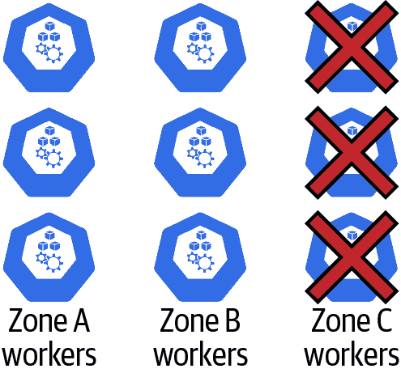

# 第四章：单个集群可用性

每个单独集群的坚实基础对您的应用程序和服务的可用性至关重要。即使拥有这些先进的分布式应用程序能力，某些系统也不适合多集群选项。大多数有状态应用程序和数据库无法进行地理分布，并且在多个集群上进行适当操作非常复杂。许多现代数据存储解决方案要求低延迟多区域解决方案，这使得将数据集群分散到高延迟环境中变得不太理想。还要考虑到许多数据平台具有`StatefulSet`解决方案来帮助操作它们，需要单集群架构。我们认为理解系统“可用”和“高度可用”的含义对于理解 OpenShift 和 Kubernetes 的价值和架构至关重要。请注意，我们将讨论如何利用多集群架构实现最高的可用性和灵活性，以及在第五章中准备好您所需的知识，以便能够就您的可用性目标做出明智的决策并利用 Kubernetes 和 OpenShift。

# 系统可用性

在现代服务和应用交付中，我们通常根据应用或服务的可用和正常响应时间的百分比来谈论系统可用性。技术服务行业的一个常见标准是使用“9”的术语来描述服务水平目标（SLOs）。我们经常听到“四个 9”或“五个 9”，以指示服务可用的时间百分比。四个 9 表示 99.99%，五个 9 表示 99.999%。我们将在本章节中沿用这些标准。这些 SLOs 是服务提供商与其利益相关者或客户之间的 SLA 中的协议。这些 SLOs 通常是按月度或有时是按年度进行衡量。

## 测量系统可用性

在他的日常工作中，其中一位作者，Jake，负责交付[IBM 云 Kubernetes 服务](https://oreil.ly/7SAB7)和[Red Hat OpenShift on IBM Cloud](https://oreil.ly/FMJGW)。这些是全球服务，提供了管理 Kubernetes 和 OpenShift 解决方案的简单 API 驱动、用户友好的云体验。对于这些服务，站点可靠性工程（SRE）团队每月都会按客户计费周期测量服务水平目标（SLOs）。考虑到这些目标，思考与这些“9”相关的停机时间量是很有帮助的。我们可以在表 4-1 中看到，一旦进入更高可用性级别，我们的中断预算或允许的停机时间可以非常低。在进行这种分析时，您的团队需要仔细考虑愿意承诺的内容。

表 4-1\. 可用性表；基于平均每月 730 小时计算

| 可用性百分比 | 每月停机时间 |
| --- | --- |
| 99%（两个九） | 7 小时 18 分钟 |
| 99.5%（两个半九） | 3 小时 39 分钟 |
| 99.9%（三个九） | 43 分钟 48 秒 |
| 99.95%（三个半九） | 21 分钟 54 秒 |
| 99.99%（四个九） | 4 分钟 22.8 秒 |
| 99.999%（五个九） | 26.28 秒 |

一个团队将努力改进的两个关键绩效指标（KPI）是*平均修复时间*（MTTR）和*平均故障间隔时间*（MTBF）。这两个指标直接影响可用性：

<math mode="display"><mi mathvariant="italic">Availability</mi> <mo>=</mo> <mfrac><mrow><mi mathvariant="italic">MTBF</mi></mrow> <mrow><mi mathvariant="italic">MTBF</mi> <mo>+</mo> <mi mathvariant="italic">MTTR</mi></mrow></mfrac></math>

对于我们如何达到期望的可用性百分比，进行一些思考会很有帮助。假设我们希望达到 99.99% 的可用性。在表 4-2 中，我们比较了一些可以帮助我们达到这种可用性的不同 MTTR 和 MTBF 数字。

表 4-2\. 四个九（99.99%）可用性计算

| MTBF | MTTR |
| --- | --- |
| 1 天 | 8.64 秒 |
| 1 周 | 60.48 秒 |
| 1 月 | 4 分钟 22.8 秒 |
| 1 年 | 52 分钟 33.6 秒 |

对于那些在家跟随的人来说，这意味着要在一个每天会发生一次故障的系统中，你需要在不到九秒的时间内识别和修复该故障才能达到四个九的可用性。为了实现平台稳定性和软件质量的显著提升 MTBF，需要大量的工程投入。对许多客户来说，四个九的成本太高。要达到这种可用性水平需要硬件、工程和支持人员。作为对比，让我们来看看表 4-3 中两个九的比较。

表 4-3\. 两个九 99% 可用性计算

| MTBF | MTTR |
| --- | --- |
| 30 分钟 | 18.18 秒 |
| 1 小时 | 36.36 秒 |
| 1 天 | 14 分钟 32.4 秒 |
| 1 周 | 1 小时 41 分钟 48 秒 |

这些数据告诉我们什么？首先，如果你的目标是四个九，那么你需要一个异常可靠的系统，如果要达到目标，故障发生的频率应该在一年内仅有一次。即使是两个九，如果每天有一次故障，你也需要在不到 15 分钟的时间内识别和修复该故障。其次，我们需要考虑这些故障发生的可能性。你说每天发生一次故障？谁每天都会有故障？好吧，请考虑一下：单个 VM 实例的 SLA 通常约为 90%，这意味着每月将有 73.05 小时的停机时间。一个单独的 VM 平均每月将停机三天。如果你的应用程序仅依赖于 10 个系统，那么至少其中一个系统每天都会停机。

这幅图片看起来令人沮丧且难以逾越吗？如果不是，那么你一定是位极具乐观主义精神的人。如果你觉得这看起来具有挑战性，那么你已经意识到用标准的监控和恢复手册来达到这些故障率和恢复时间是不太可能的。那么，请进入高可用系统的世界吧。

## 什么是高可用系统？

简而言之，*高可用性（HA）* 指的是一个系统具有没有任何单点故障的特性。任何一个“组件”都可以承受故障，整个系统不会出现可用性损失。这种属性有时被称为能够将个别组件视为牲畜而非宠物。这个概念最初由微软的 Bill Baker 在他的演讲 “Scaling SQL Server 2012” 中引入¹，后来在 CERN 的 Gavin McCance 讨论 OpenStack 时得到了普及²。只要整体群体健康，我们就不需要关心个体的健康状况。我们喜欢保持所有宠物的健康和良好状态，但这需要耗费大量时间和金钱。如果你只有少数几只宠物，这种做法是可持续的。然而，在现代云计算中，我们通常看到数百甚至数千只宠物。这个星球上的 SRE 工程师根本不足以保持整个群体的健康。

在存在单点故障的系统中，即使是最精心维护的组件偶尔也会发生我们无法预防的故障。一旦通过监控发现，总会需要一些时间来使它们恢复健康。希望我们对系统可用性的介绍能让您意识到 MTBF 和 MTTR 的挑战。

对于我们来说，有一个最简单的高可用系统的图示是非常有帮助的。一个简单的无状态 Web 应用程序和负载均衡器就是一个很好的例子，如 图 4-1 所示。


###### 图 4-1\. 带有负载均衡器的高可用无状态 Web 应用程序

在这个最简单的高可用系统中，如果这两个 Web 应用实例中的任何一个失败，负载均衡器可以检测到该故障，并停止将流量路由到失败的实例。使用者不了解个别实例的情况；所有的交互都是与负载均衡器进行的。负载均衡器甚至能在一个实例的请求失败或者响应不够快时进行重试。

显然，负载均衡器本身也可能发生故障，但负载均衡器通常比您典型的 Web 应用程序具有更高的可用性数字。典型的云负载均衡器具有 99.99%的 SLA，这将是运行在该负载均衡器后面的任何应用程序的可用性上限。如果云负载均衡器不可用，您可以部署成对的虚拟 IP 和*虚拟路由冗余协议*（VRRP），它可以在两个负载均衡器实例之间移动单个 IP 地址。公共云提供商可以通过其应用程序和网络负载均衡器服务简化所有这些操作，这些服务能够处理负载均衡器本身的所有高可用性方面。

完成了吗？嗯，并不完全如此；现代应用程序和服务平台中有许多组件和服务需要运行。根据我们的经验，许多大型云服务可能包括多组五到六个微服务。再加上您的应用程序或服务可能是全球分布和/或复制的事实。考虑我们自己在 Red Hat OpenShift on IBM Cloud 中的服务可用性在图 4-2 中展示。


###### 图 4-2\. IBM 云上的 Red Hat OpenShift 位置

在全球六个多区域地区以及全球其他 14 个数据中心。我们的团队在每个多区域地区运行超过 40 个微服务，在单区域数据中心运行大约一半的微服务。这些数字很快就会增加。想象一下，如果我们必须在每个位置手动部署每个微服务并为它们中的每一个配置负载均衡器，那我们将需要一支大军的工程师来编写定制配置数据。这就是 OpenShift 和 Kubernetes 的用武之地。

## OpenShift 和 Kubernetes 应用程序与服务可用性

Kubernetes 和 OpenShift 中的许多组件都有助于整个系统的可用性。我们将讨论如何保持应用程序的健康状态，如何处理网络问题以及如何解决计算节点可能出现的问题。

### 应用程序

对于我们的无状态应用程序，简单的负载均衡器是保证高可用性的关键。然而，正如我们讨论过的那样，如果我们依赖手动部署和配置负载均衡器和应用程序，那么保持它们的更新就不会太有趣了。在第二章中，我们讨论了 Kubernetes 部署。这种优雅的结构使得部署多个应用程序副本变得简单。让我们来看看`livenessProbe`，这是一种高级能力，也是部署-容器规范中更为关键的特性之一。`livenessProbe`定义了一个探测器，将由`kubelet`针对容器执行，以确定目标容器是否健康。如果`livenessProbe`在配置的`failure​Th⁠reshold`之后未能成功返回，则`kubelet`将停止容器并尝试重新启动它。

###### 注意

为了处理容器在提供请求的能力上的瞬态问题，您可以使用一个`readinessProbe`，它将确定 Kubernetes 服务的路由规则，但如果它失败了，不会重新启动容器。如果`readinessProbe`失败，Pod 的状态将标记为`NotReady`，并且将从服务端点列表中移除该 Pod。探测将继续运行，并在成功时将状态设置为`Ready`。如果一个 Pod 有一个可能暂时无法访问的外部依赖项，这将非常有用。重新启动此 Pod 将无济于事，因此使用`livenessProbe`来重新启动 Pod 没有任何好处。有关 Kubernetes 和 OpenShift 中可用探测器的更多详细信息，请参见[社区文档](https://oreil.ly/GqNnW)。

以下示例显示了一个包含具有常见参数的`livenessProbe`的简单部署：

```
apiVersion: apps/v1
kind: Deployment
metadata:
  name: nginx
  labels:
    app: webserver
spec:
  replicas: 3
  selector:
    matchLabels:
      app: webserver
  template:
    metadata:
      labels:
        app: webserver
    spec:
      containers:
      - name: nginx
        image: nginx:1.7.9
        ports:
          - containerPort: 80
        livenessProbe:
          httpGet:
            path: /
            port: 80
          initialDelaySeconds: 3
          periodSeconds: 3
          timeoutSeconds: 2
          failureThreshold: 2
```

让我们更仔细地查看我们在`liveness​P⁠robe`示例中选择的选项，以及它们如何转化为真实世界的行为：

`httpGet`

将执行的检查类型。您还可以使用`tcp`或`exec`命令来执行测试，以测试容器是否健康。

`initialDelaySeconds`

`kubelet`在尝试第一个探测之前将等待多长时间。

`periodSeconds`

`kubelet`将测试探测的频率。

`timeoutSeconds`

`kubelet`客户端将等待响应的时间长度。

`failureThreshold`

在`kubelet`标记探测失败之前，必须运行的连续失败次数。对于我们的`livenessProbe`，结果是重新启动此容器。

###### 提示

一定要彻底测试您的`livenessProbe`和定时设置。我们听说过许多情况，其中应用程序启动缓慢导致`CrashLoopBackOff`场景，其中 Pod 由于从未有足够的`initialDelaySeconds`完全启动而从未成功启动。`livenessProbe`永远不会成功，因为`kubelet`开始检查生存状态之前，应用程序尚未准备好开始接收请求。对于滚动更新来说，设置非常长的初始延迟设置可能会很痛苦，但可以提高系统的稳定性，特别是在初始生存时间存在大量变异性的情况下。

总的来说，我们具备传统负载均衡器健康检查的所有要素。HAProxy 是一种流行的传统软件负载均衡解决方案。如果我们查看标准的 HAProxy 配置，我们会看到许多相同的关键健康检查组件：

```
frontend nginxfront
 bind 10.10.10.2:80
 mode tcp
 default_backend nginxback

backend nginxback
 mode tcp
 balance roundrobin
 option httpchk GET /
 timeout check 2s
 default-server inter 3s fall 2 
 server 10.10.10.10:80 check
 server 10.10.10.11:80 check
 server 10.10.10.12:80 check
```

这里需要注意的有趣之处是，我们在传统基础设施中的负载均衡器配置和 Kubernetes 中的部署中查看的是相同的配置设置。事实上，执行的实际检查是相同的。两者都通过端口 80 发起 HTTP 连接并检查 200 响应代码。然而，最终的行为却是非常不同的。在 HAProxy 的情况下，它只确定是否应将网络流量发送到后端服务器。HAProxy 不知道后端服务器是什么，也无法更改其运行时状态。相比之下，Kubernetes 并不直接改变网络路由。Kubernetes 只是更新部署中每个 pod 的状态（`Ready` 与 `NotReady`），如果 pod 未通过 `livenessProbe`，它将重新启动该容器。重新启动 pod 不能解决导致无响应的所有问题，但通常可以解决一些小问题。

###### 提示

`livenessProbe` 不仅适用于确保容器健康且准备好接收流量。对于那些厌倦了清理 Java 虚拟机（JVM）泄漏线程和内存以至变得无响应的实用操作员来说，它是一个极好的可编程解决方案。它是我们在第三章中设置的资源限制的一个很好的备份，以尝试限制这些资源泄漏。

值得注意的是，将这些健康检查配置与系统的运行时组件关联起来而不是网络功能是一个有意为之的选择。在 Kubernetes 和 OpenShift 中，`livenessProbe` 是由 `kubelet` 执行而不是由负载均衡器执行。正如我们在图 4-3 中所看到的，这个探针在每个包含部署 pod 的节点上执行。


###### 图 4-3\. `kubelet` 执行 `livenessProbe` 到本地 nginx pod

每个 `kubelet`（每个工作节点一个）负责执行节点上运行的所有容器的所有探针。这确保了一个高度可扩展的解决方案，分发探针工作负载，并在整个机群中维护 pod 和容器的状态和可用性。

### 基础设施

Kubernetes 的网络是从哪里来的？这是 Kubernetes 服务的工作。这里的事情变得有趣起来。让我们看看流量如何到达我们的 `nginx` pod。首先，我们的服务定义：

```
apiVersion: v1
kind: Service
metadata:
 labels:
 app: webserver
 name: nginx-svc
spec:
 ports:
 - port: 80
 protocol: TCP
 targetPort: 8080
 selector:
 app: webserver
 type: ClusterIP
 clusterIP: 172.21.102.110
```

这个服务定义告诉 Kubernetes 应该将发送到集群中 `172.21.102.110` 端口 `80` 的任何流量路由到与选择器 `app=webserver` 匹配的任何 pod 上的端口 `8080`。这里的优势在于，当我们扩展或更新我们的 web 服务器应用程序并且 pod 被替换时，服务会保持端点的最新状态。如果我们删除所有的 pod 并让我们的部署自动替换它们，可以看到端点恢复的一个很好的例子：

```
$ kubectl get endpoints nginx-svc
NAME      ENDPOINTS                                          AGE
nginx-svc 172.30.157.70:80,172.30.168.134:80,172.30.86.21:80 3m21s

$ kubectl delete pods --all
pod "nginx-65d4d9c4d4-cvmjm" deleted
pod "nginx-65d4d9c4d4-vgftl" deleted
pod "nginx-65d4d9c4d4-xgh49" deleted

$ kubectl get endpoints nginx-svc
NAME      ENDPOINTS                                          AGE
nginx-svc 172.30.157.71:80,172.30.168.136:80,172.30.86.22:80 4m15s
```

这种自动管理服务端点的功能开始展示了 Kubernetes 与传统基础设施的一些优势。无需更新 HAProxy 中的服务器配置。Kubernetes 服务会完成所有工作，以保持我们的“负载均衡器”最新。为了组装端点列表，Kubernetes 服务会查看所有处于 `Ready` 状态的 pod，并匹配服务定义中的标签选择器。如果容器失败了探测，或者托管 pod 的节点不再健康，那么该 pod 将被标记为 `NotReady`，服务将停止将流量路由到该 pod。在这里，我们再次看到 `livenessProbe`（以及 `readinessProbe`）的作用，它的作用不是直接影响流量路由，而是通知 pod 的状态，从而影响用于路由服务流量的端点列表。

在我们的应用程序有多个副本分布在多个工作节点的情况下，我们有一个服务的解决方案，即使一个工作节点发生故障，我们也不会丢失任何可用性。Kubernetes 足够智能，能够意识到来自该工作节点的 pod 可能不再可用，并将在整个集群中更新服务端点列表，停止向故障节点上的 pod 发送流量。

我们刚刚讨论了当计算节点发生故障时会发生什么：服务本身足够智能，能够绕过在该节点上的任何 pod 进行流量路由。事实上，部署将会在重新调度后，将来自故障节点的那些 pod 替换为另一个节点上的新 pod，这对处理计算故障非常方便。那么为服务提供“负载均衡器”的需求呢？Kubernetes 在这个问题上采取了非常不同的方法。它使用 kube-proxy 组件提供负载均衡功能。kube-proxy 的有趣之处在于，它是一个完全分布式的组件，提供了一个将客户端负载均衡器的分布式特性和传统负载均衡器的前端融合在一起的负载均衡解决方案。并不是每个客户端实例都有一个独立的客户端负载均衡器，而是每个计算节点有一个。

请注意，kube-proxy 负责将服务定义及其端点转换为每个工作节点上的 iptables³ 或 IPVS⁴ 规则，以适当地路由流量。为简单起见，我们在图中没有包含 iptables/IPVS 规则本身；我们用 kube-proxy 来代表它们，如 图 4-4 所示。


###### 图 4-4\. kube-proxy 将流量路由到数据访问端点

在 图 4-4 的示例中，请注意，Web 服务器（客户端）将流量路由到本地 kube-proxy 实例，然后 kube-proxy 将流量发送到运行在本地和/或远程节点上的数据访问服务 Pod。因此，如果其中任何一个节点失败，那么客户端应用程序和负责该节点负载均衡的 kube-proxy 将一同失败。因此，kube-proxy 是在 Kubernetes 系统中提供简化和分布式高可用解决方案的关键组件。

我们现在审查了 Kubernetes 如何设计解决方案，以确保系统在任何单个计算节点、服务实例或“负载均衡器”（kube-proxy）失败时仍能保持系统的正常运行时间，从而使我们能够自动维持整个系统的可用性。无需 SRE 干预即可识别或解决故障。然而，我们时常看到 Kubernetes 托管的系统尽管如此仍会遭遇一些故障。这通常是由于编写不良的探针导致无法应对某些边缘情况下的应用程序故障所致。Kubernetes 在提供平台和最佳可用性指南方面做得非常好，但它并非魔法。用户需要带来良好设计和适当配置的应用程序和服务，才能看到这种潜力。

还有其他网络解决方案用于负载均衡。kube-proxy 很棒，但正如我们所述，它只在从集群中的客户端路由流量时才真正起作用。对于从集群外部的客户端请求路由，我们将需要一种略有不同的方法。诸如 Ingress Controller、OpenShift Router 和 Istio Ingress Gateway 等解决方案能够与 Kubernetes 服务概念集成，但提供一种方式将流量从集群外部路由到集群内运行的服务和应用程序。需要注意的是，您将需要将这些 Layer 7 路由解决方案与外部 Layer 4 负载均衡器结合使用，以保持适当的可用性。图 4-5 显示了外部负载均衡器如何与 OpenShift Router 结合使用，将来自集群外部的请求发送到运行在集群内的 Web 服务器。当使用这些网络解决方案时，请注意它们不会通过 kube-proxy 路由其流量；它们会直接向服务的端点进行自己的负载均衡。


###### 图 4-5\. 外部负载均衡器和 OpenShift Router

所有我们迄今为止讨论过的冗余性和可用性规则和逻辑在这里同样适用。外部负载均衡器就像我们在本章前面提供的 HAProxy 示例一样。在网络领域，根本无法逃避这些规则。要从外部世界将流量传送到集群中，仍然需要一个高可用解决方案。这里的优势在于，我们不需要为集群中的每个应用程序设置单独的负载均衡器。OpenShift Router、入口控制器和 Istio 入口网关都可以为集群中的许多不同应用程序提供服务，因为它们支持第 7 层路由，而不仅仅是第 4 层。第 7 层路由器可以检查 HTTP(S) 标头以理解目标 URL，并使用该信息将流量发送到正确的服务。重要的是要注意，OpenShift Router 和入口控制器仍然依赖于 Kubernetes 服务来执行 liveness 和 readiness 探针工作，以确定 Router 或入口控制器应将流量发送到哪些 pod。

虽然这些是更复杂的解决方案，但我们只需有一些允许将外部流量路由到我们集群中托管服务的东西即可。我们已经将外部负载均衡器解决方案所依赖的 `NodePort` 概念的讨论留给读者从 [Kubernetes 文档](https://oreil.ly/NxmdG) 中了解。

### 结果

回顾我们最初的可用性讨论，Kubernetes 提供了一种识别和修复问题的机制。根据我们的应用程序 `livenessProbe` 设置，最多需要六秒来识别问题，然后需要一些时间重新路由流量（减少任何失败请求），然后自动通过重启修复失败的容器。在高效应用中，容器重启过程可能非常快，甚至亚秒级别。即使保守估计为 10 秒，对于我们的 MTTR 看起来也相当不错。我们可以通过调整设置更加积极，每两秒执行一次 `livenessProbe`，在单个故障时执行重启，将 MTTR 缩短至不到五秒。

关于 `livenessProbe` 和 `readinessProbe` 设置的一点快速说明：请记住，`kubelet` 将会向整个集群中的这些容器的每个实例发出请求。如果您运行了数百个副本，并且它们每两秒都受到探针的影响，那么您的日志或指标解决方案可能会变得非常啰嗦。如果您的探针命中的是相对轻的端点，这些端点可能会处理用户请求中的数百甚至数千次，那么这可能不是问题，但无论如何，这也值得注意。

现在，我们对于 Kubernetes 在我们的应用程序中实现的 MTTR 有了一些了解，让我们来看看这对我们的可用性计算中的一些 MTBF 有何影响，以确定我们系统中的 表格 4-4。

表格 4-4\. MTTR 计算为 MTBF

| MTTR | 99% 可用性的 MTBF | 99.99% 可用性的 MTBF |
| --- | --- | --- |
| 5 秒 | 8.26 分钟 | 13 小时 53 分钟 |
| 10 秒 | 16.5 秒 | 27 小时 46 分钟 |
| 1 分钟 | 99 秒 | 6 天 22.65 小时 |
| 10 分钟 | 16 分钟 30 秒 | 69 天 10.5 小时 |

通过这些数据，我们可以看到，仅仅通过简单的 Kubernetes 部署概念，我们可以得出一些合理的可用性计算，我们可以持续维护这些计算。

做完了，结束了，对吧？不要那么快。不同的故障模式对 Kubernetes 和 OpenShift 可能会产生不同的结果。接下来我们将看看这些故障。

# 失败模式

在您的 Kubernetes 和 OpenShift 系统中可能会遇到各种类型的故障。我们将涵盖许多这些故障，如何识别它们，应用程序或服务的影响以及如何预防它们。

## 应用程序 Pod 失败

单个应用程序 Pod 的失败（图 4-6）可能导致几乎没有停机时间，正如我们早些时候讨论过的探测和 `kubelet` 自动重新启动失败的 Pod。


###### 图 4-6\. 应用程序 Pod 失败

值得注意的是，更长的探测间隔可能会导致更长的 MTTR，因为这会增加检测故障的时间。有趣的是，如果您使用 `readinessProbes`，则需要一些时间才能使就绪失败在 Kubernetes 或 OpenShift 系统中传播。恢复的总时间可能是：

```
(readinessProbe Internal * failureThreshold) + iptables-min-sync-period
```

`iptables-min-sync-period` 是我们尚未讨论的新配置设置。这个设置（或在 IPVS 模式下的 `ipvs-min-sync-period`）是 kube-proxy 决定在两次更新 kube-proxy 的 iptables 规则之间可以经过的最短时间。⁵ 如果集群中的一个端点在 t0 更新，然后另一个端点在五秒钟后更新，但 `min-sync` 设置为 30 秒，那么 kube-proxy（iptables/IPVS）仍将继续将流量路由到可能无效的端点。这个设置的默认值是一秒，因此影响最小。然而，在非常大的集群中，有大量的服务（或大量的端点），可能需要增加这个间隔，以确保 iptables/IPVS 控制平面的合理性能。这是因为随着要管理的服务越来越多，iptables 或 IPVS 规则集的大小可能会变得非常庞大，轻松地达到数万条规则。如果不调整 `iptables-min-sync-period`，那么 kube-proxy 可能会因不断尝试更新规则而不堪重负。记住这种关系是很重要的。集群的大小可以影响整个系统的性能和响应能力。

## 工作节点故障

在任何 OpenShift 或 Kubernetes 集群中最常见的故障之一是单个工作节点故障（图 4-7）。单节点故障可能由多种原因引起。这些问题包括磁盘故障、网络故障、操作系统故障、磁盘空间耗尽、内存耗尽等。让我们更仔细地看看当 Kubernetes 系统中存在节点故障时会发生什么。恢复单个节点的过程将直接影响我们对系统可用性的计算。


###### 图 4-7\. 工作节点故障

响应工作节点故障时发生的时间间隔如下：

T0

节点发生故障。

T1 = T0 + `nodeLeaseDurationSeconds`

Kubernetes 和 OpenShift 现在使用租约系统来跟踪工作节点的健康状况。每个 `kubelet` 向控制平面注册一个自己的租约对象。如果该租约过期，节点将立即标记为 `NotReady`。一旦节点标记为 `NotReady`，服务控制器将指示该节点上的任何 pod 可能已失败，并且应该移除与该节点上的 pod 相关的任何服务端点。这是 Kubernetes 决定停止路由流量到故障节点上的 pod 的方式。其结果类似于 pod 的 `livenessProbe` 失败，但会影响到故障节点上的所有 pod。`nodeLeaseDurationSeconds` 配置在 `kubelet` 上，决定租约的持续时间，默认为 40 秒。

T2 = T1 + `iptables-min-sync-period`

这是可能需要的额外时间，用于在集群中同步 kube-proxy 配置的整个飞机队。此行为与我们应用程序 pod 故障场景中讨论的行为完全相同，其中需要将服务的端点列表中的任何更改同步到集群中的所有 kube-proxy 实例。一旦同步完成，所有流量将被正确路由，任何来自故障节点的问题都将得到解决，但减少的容量除外。默认的最小同步周期为 30 秒。

T3 = T2 + `pod-eviction-timeout`

这个设置配置在 kube-controller-manager 上，决定在节点标记为 `NotReady` 后，控制器将等待多久才会尝试终止 `NotReady` 节点上的 pod。如果有控制器管理正在终止的 pod，通常它们将启动新的替代 pod，就像部署控制器逻辑的情况一样。这不会影响到流量路由到故障节点上的 pod；这个问题在 T2 已经解决。然而，这将恢复与来自故障节点的 pod 相关的任何降低的容量。默认超时时间为五分钟。

如我们所见，节点故障的影响程度类似于应用容器故障。请注意，在此，我们计算的是达到 T2 时的最坏情况。某些节点故障可能会被检测并迅速报告，因此 T1 时间可以更短，因为我们不必等待租约到期才能将节点标记为 `NotReady`。另请记住，iptables 可能会同步得更快，这只是最坏情况下。

## 工作区故障

工作区故障的处理方式与节点故障相似。在完全工作区故障（图 4-8）的情况下，例如网络故障，我们通常期望在一个相对较短的时间窗口内将所有节点标记为 `NotReady`。



###### 第 4-8 图：工作区故障

如果单个区域中故障节点的数量超过 `unhealthy-zone-threshold` 百分比，[Kubernetes](https://kubernetes.io/)和[OpenShift](https://www.openshift.com/)就可以“检测”到区域故障。如果检测到区域故障，则服务端点评估过程没有任何变化。所有位于故障节点上的容器都会被移除作为任何关联服务的端点。`unhealthy-zone-threshold` 将决定 pod 驱逐过程的变化。如果集群低于 `large-cluster-size-threshold`（定义为节点的数量），则该区域的所有 pod 驱逐将停止。如果 `unhealthy-zone-threshold` 超过大集群大小，则 pod 驱逐开始，但节点的处理速度会显著减慢，如 `secondary-node-eviction-rate` 所定义。这是为了防止 pod 调度风暴，并允许系统在“过度反应”到暂时故障之前获得一些额外的恢复时间。

## 控制平面故障

有各种不同的控制平面故障场景。存在工作节点和控制平面之间的网络相关故障，也存在控制平面组件故障。稍后在本节中，我们将详细介绍各种控制平面组件的高可用性特性。在我们开始这些细节介绍之前，值得谈一谈当出现任何形式的完全控制平面故障时，会发生什么。集群整体如何响应如图 4-9 所示的故障？


###### 图   第 4-9 图：完全控制平面故障

好消息是，在此场景中，运行在工作节点上的所有工作负载不受影响。所有的 kube-proxy 配置、入口控制器、Pod、`DaemonSets`、网络策略等继续像控制平面故障发生时一样正常运行。坏消息是，在此状态下无法进行任何更改或更新系统。此外，如果在此场景中工作节点发生故障，则无法检测或更新集群以弥补故障。幸运的是，如果控制平面正确实现，这种故障的可能性很低。现在我们将介绍一些控制平面的高可用特性。

相比让所有人等待，我们将从控制平面中最复杂、潜在最具挑战性且易于最关键的组件开始。称为“最关键”的组件是 etcd。Kubernetes 和 OpenShift 使用开源键值存储 etcd 作为其持久性存储解决方案。etcd 数据存储是系统中所有对象持久化的地方。与节点、部署、Pod、服务等相关的所有数据和信息都存储在 etcd 中。

### etcd 失败

您可能会遇到 etcd 的许多不同问题。有些问题比其他问题更容易缓解。从 kube-apiserver 到 etcd 的连接故障可能是最常见的问题。现代的 etcd 客户端内置了负载均衡和弹性。请注意，如果您有一个传统的负载均衡器位于您的 etcd 实例前面，那么大部分情况下这并不适用，因为您可能已经为 etcd 注册了单个终端节点。不过，kube-apiserver 将使用 `--etcd-servers` 设置来确定 etcd Go 客户端配置的 IP(s) 和/或主机名(s)。社区中有关于负载均衡行为的优秀[文档](https://oreil.ly/TUc0U)。值得注意的是，大多数现代 Kubernetes 和 OpenShift 版本现在都在其客户端中使用 clientv3-grpc1.23 变体。该客户端版本始终维持活动的 gRPC 子连接，以确定与 etcd 服务器端点的连接状态。

etcd 客户端的故障恢复行为使系统能够处理 kube-apiserver 与 etcd 之间的通信故障。不幸的是，etcd 客户端无法处理像同行的性能降级或网络分区等问题。可以通过对 etcd 同行进行出色的就绪检查在某种程度上缓解这些问题。如果您的系统允许就绪检查（例如，在 Kubernetes 上托管的 etcd），您可以配置就绪检查，这些就绪检查可以查找网络分区或严重性能降级，例如使用以下内容：

```
etcdctl get --consistency=s testKey --endpoints=https://localhost:port
```

使用此代码将确保本地对等体能够正确执行序列化读取，并且是一个更强的检查，以确保此对等体不仅在侦听，还可以处理获取请求。可以使用 put 测试（也确保对等体连通性），但这可能是一个非常昂贵的健康检查，引入大量关键修订，并可能对 etcd 集群产生不利影响。我们正在进行持续调查，以确定 etcd 性能指标是否是对对等体正在遭受性能退化的可靠指标，并应从集群中移除。在此时点上，我们只能建议使用标准监控和 SRE 警报来观察性能问题。目前还没有强有力的证据表明，由于性能问题，您可以安全地终止对等体而不会可能对集群的整体可用性产生不利影响。

###### 注意

如果讨论如何改善 etcd 的可用性而不提及为 etcd 设置适当的灾难恢复过程将是不合适的。定期进行自动化备份是必须的。确保定期测试 etcd 的灾难恢复流程。关于 etcd 灾难恢复的额外提示：即使 etcd 集群的法定人数已经中断，如果 etcd 进程仍在运行，您仍然可以从该对等体获取新的备份，即使没有法定人数也可以确保最小化从上次定期计划备份 etcd 开始的任何时间间隔的数据丢失。始终尝试从剩余的 etcd 成员获取备份，然后再进行恢复。[Kubernetes 文档](https://oreil.ly/jCvAb) 提供了关于 etcd 备份和恢复选项的优秀信息。

对 etcd 最重要的关注点是维护 etcd 集群的法定人数。只要少于大多数对等体健康，etcd 就会中断法定人数。如果法定人数中断，则整个 Kubernetes/OpenShift 控制平面将失败，并且所有控制平面操作将开始失败。增加对等体的数量将增加可以容忍的对等体故障的数量。请注意，拥有偶数个对等体不会增加容错能力，并且可能损害集群检测到拆分脑网络分区的能力。⁷

### kube-apiserver 失败

kube-apiserver 负责处理 Kubernetes 或 OpenShift 集群中对象的所有 *创建、读取、更新和删除*（CRUD）操作的所有请求。这适用于最终用户客户端应用程序以及集群的内部组件，如工作节点、kube-controller-manager 和 kube-scheduler。与 etcd 持久存储的所有交互都通过 kube-apiserver 处理。

kube-apiserver 是一个主动/主动的扩展应用程序。它不需要领导者选举或其他机制来管理 kube-apiserver 实例的群体。它们都以活动模式运行。这个特性使得在高可用配置中运行 kube-apiserver 变得简单。集群管理员可以运行尽可能多的 kube-apiserver 实例，合理地将负载均衡器放置在 apiserver 前面。如果配置正确，单个 kube-apiserver 失败将不会对集群功能产生影响。参见 图 4-10 的示例。


###### 图 4-10\. kube-apiserver 单个故障而无可用性影响

### kube-scheduler 和 kube-controller-manager 故障

这两个组件具有非常相似的可用性特性。它们都始终以单个活动实例运行，并使用相同的领导者选举特性。它们利用租约对象来管理集群的领导者。如果任一组件的跟随者实例失败，则不会对整体集群功能产生影响。如果领导者失败，则在 `--leader-elect-lease-duration` 时间内将没有领导者。然而，没有任何组件直接与调度器或控制器管理器交互。这两个组件在集群中异步地对对象状态变化进行交互。

kube-controller-manager 失去领导者可能导致从节点故障的恢复延迟，例如。如果某个 pod 因某种原因失败，则控制器管理器将无法响应更新相关服务的端点。因此，虽然同时发生领导者故障和其他系统故障可能会导致系统的平均修复时间延长，但不会导致长时间的故障或停机。

失败的 kube-scheduler 领导者对可用性几乎没有影响。当领导者宕机等待新选举时，将不会将新的 pod 调度到节点上。因此，尽管由于并发失败节点的 pod 调度不足可能会导致容量减少，但在此期间仍会有对集群的服务和路由更新。

## 网络故障

网络故障有许多不同的类型。我们可能会看到路由表更新失败导致数据包被错误路由。在其他情况下，我们可能会看到负载均衡器故障。也可能是网络交换机故障。潜在问题的列表是无穷无尽的。为了简化我们对这个主题的讨论，我们将网络故障分为两种常见类型：*南北向网络故障*，即来自 Kubernetes 或 OpenShift 集群外部的流量无法进入或离开，以及 *东西向网络故障*，描述了集群中节点之间无法传输网络流量的情况。

### 南北向网络故障

此故障场景指的是集群本身可能是健康的，控制平面和数据平面也可能是正常的，但可能存在来自外部源的流量路由问题。在图 4-11 中，我们遇到了外部负载均衡器到工作节点的连接失败的情况。


###### 图 4-11\. 南北网络故障

结果是，负载均衡器对从连接到失败的工作节点暴露的任何`NodePort`的健康检查将失败，负载均衡器将停止将流量路由到该工作节点，生活还在继续。事实上，在这里的 MTTR 将非常好，因为只需外部负载均衡器失败健康检查来停止将流量路由到失败的链接，或者如果连接时间限制和重试被集成到这个负载均衡器解决方案中，它可能会有零停机时间。负载均衡器就是为这种情况而生的。

如果负载均衡器与工作节点之间的*所有*连接都失败，那么来自集群外部的所有访问都将失败。结果是任何旨在从集群外部访问的服务都将真正停机。好消息是，我们可以实现多区域集群以减轻这种灾难性故障的可能性。在第八章中，我们将讨论使用全球基于 DNS 的负载均衡来进一步改善减轻地理网络中断的方法。此外，这些南北故障只影响从集群外部访问服务。在集群内运行的所有内容仍可正常运行，没有任何服务中断。

### 东西网络故障

我们还可能遇到节点失去跨区域连接或网络分区的情况。这在多区域集群中最常见，当区域之间发生网络故障时。在图 4-12 中，我们看到了一个完整区域的故障。


###### 图 4-12\. 东西总故障

在这种情况下，我们面临着一个“干净”的区域失败，其中 C 区域被完全分区。该区域的工作节点将继续尝试向 C 区域的控制平面节点更新其租约。如果成功，将导致问题。然而，C 区域的控制平面将退出集群并停止响应请求。发生这种情况有两个原因。首先，C 区域的 etcd 将开始失败，因为它将无法与其他区域的 etcd 联系以参与 etcd 集群的仲裁。结果，C 区域的 kube-apiserver 也将开始报告为不健康。C 区域的工作节点将无法续约其与控制平面的租约。结果，它将保持静止并且什么也不做。kubelet 将重新启动任何失败的容器。但是，正如我们所看到的，C 区域的工作节点与其他区域之间没有连接。任何应用程序通信将开始失败。

好消息是 A 区域和 B 区域一切都将安好。控制平面 etcd 将保持仲裁（在 A 或 B 中选举新的领导者，如果之前的领导者在 C 中），所有控制平面组件将保持健康。此外，C 区域的工作节点租约将到期，因此此节点将被标记为 `NotReady`。将移除所有 C 区域的服务端点，并更新 kube-proxy 停止将流量路由到 C 区域的 Pod。

可能有多种情况会使 Kubernetes 或 OpenShift 平台略微失调。我们将专注于一种暴露 Kubernetes 设计弱点的场景。这种失败只在工作节点之间的东西向西流量中发生失败并不罕见，可以在工作节点和控制平面之间提供一些网络隔离，这可能导致控制平面连接性和工作节点连接性之间的不一致性。我们在 图 4-13 中有一个例子。


###### 图 4-13\. 东西向数据平面失败

这里的结果非常有趣。所有工作节点能够向控制平面报告正常。工作节点之间没有通信验证。这也包括 kube-proxy，因为它不是传统的负载均衡器。Kube-proxy 不执行任何健康检查，无法验证工作节点之间的连接。结果是所有 Pod、服务和端点都保持完好无损。听起来很棒，但问题在于，如果任何 Pod 尝试跨失败的区域边界路由请求，该请求将失败，kube-proxy 不会进行重试。这可能很麻烦，需要检测和/或调试。

一种方法是在工作节点级别添加一些跨区域网络验证组件。我们还建议监控和提醒您的应用程序 Pod，以便您可以检测并报警。

在这场战斗中还有另一个秘密武器。如果您不依赖 kube-proxy，而是选择包括诸如断路器和超时自动重试等功能的解决方案，则可以在不修改应用程序或 Kubernetes 或 OpenShift 的情况下克服这些情况及其他情况。像[Istio](https://istio.io)和[Red Hat Service Mesh](https://oreil.ly/3drTt)这样的服务网格解决方案向每个 Pod 引入了一个完整的 sidecar 容器网格。这些 sidecar 容器运行 Envoy，一个小型、轻量级、高效的负载均衡器，包括先进的断路、负载均衡和重试功能。在这种类型的服务网格配置中，每个 sidecar 都足够智能，能够停止将流量路由到任何与其通信失败的终端 IP。

# 摘要

现在我们已经有了一个坚实的基础，可以理解如何测量和计算系统的可用性。此外，我们清楚地了解了 Kubernetes 如何提供工具和架构来实现高可用的应用程序和服务平台。了解系统如何运作以及其故障模式对开发团队正确设计他们的应用程序和定义 Kubernetes 和 OpenShift 资源至关重要。SRE 和运维团队应熟悉这些故障模式，并相应地计划监控和警报。

拥有这些 Kubernetes 工具，我们应该准备好构建一个正确架构的 Kubernetes 或 OpenShift 集群，并提供高可用的服务。我们还有必要的方程式来推导基于我们所做选择的服务水平目标（SLO）。凭借本章概述的分析和工具，您有能力对 SLO 做出明智的决策，并创建符合您目标的实现方案。

¹ 不幸的是，PASS 已经停止运营，并且 2012 年初的演讲内容不可用。

² Gavin McCance 在 2012 年 11 月 19 日的演讲“CERN 数据中心演进”中提到，[*https://oreil.ly/F1Iw9*](https://oreil.ly/F1Iw9)。

³ [iptables 的 Wikipedia 条目](https://oreil.ly/6Pmwf)提供了更多信息。

⁴ [IP Virtual Server 的 Wikipedia 条目](https://oreil.ly/LSYXT)提供了更多信息。

⁵ 查看[Kubernetes 文档关于 kube-proxy](https://oreil.ly/HReuF)以获取更多信息。

⁶ 查看[Kubernetes 文档关于节点可靠性](https://oreil.ly/uzHtJ)以获取更多信息。

⁷ 更多信息，请参阅[etcd FAQ](https://oreil.ly/XrFaC)。
