# 第五章。跨集群的持续交付

云原生应用有可能颠覆整个行业。其中一个关键原因是它们支持持续交付。当市场环境发生变化，应用程序需要更新以应对迅速出现的现实约束时，持续交付使应用程序能够快速适应以解决这些新出现的问题。以下是容器镜像、Kubernetes 和 OpenShift 如何支持 DevOps 原则以促进持续交付的简要概述：

小批量更改

所有更改都应该是增量和有限的。当发生故障时，小批量更改通常比大规模、破坏性的更改更容易恢复。

对所有事物进行源代码控制

了解已经进行的所有更改对于理解已经进行的更改以及识别代码库或配置中回归原因非常有帮助。

类似生产的环境

开发人员应该能够访问与生产环境相对应的环境和工具。生产环境通常比开发或质量保证（QA）环境规模更大，配置更复杂。这种差异可能意味着在早期阶段正常工作的功能在生产环境中无法正确运行，而这是它们真正重要的地方。

运维实践的左移

我们应该在开发过程的早期阶段就暴露出健康管理、日志收集、变更管理等行为。

更改的持续集成

所有更改都应该持续构建和部署在一起，以便识别各种更改相互交织导致意外问题或 API 不兼容性的情况。

高度自动化的测试与持续反馈

为了管理速度，我们必须自动化我们的测试和验证工作，以便我们始终可以进行测试（ABT）。

在本章中，我们概述了支持跨集群生产环境中持续交付的各种工具和方法。我们首先讨论了 Helm，这是一个用于 Kubernetes 应用程序的流行打包工具。接下来我们介绍了 Kustomize，它提供了重新利用现有 Kubernetes YAML 文件以实现多种目的和配置的能力，同时避免使用模板。然后，我们描述了几种支持持续交付流水线的流行方法，包括 GitOps、Razee 和 Tekton。最后，我们通过对 OpenShift 流水线和 Open Cluster Management 项目进行广泛讨论来结束本章，这些项目用于在多个集群中部署应用程序。

# Helm

Helm 是 Kubernetes 的包管理器。它使您能够创建一个包含构成应用程序的所有资源的多个模板的软件包。您可以期望在 Helm 软件包中找到的常见 Kubernetes 资源包括`ConfigMaps`、部署、`PersistentVolumeClaims`、服务等等。

Helm 提供其自己的[CLI](https://oreil.ly/9S6Ne)，该 CLI 将生成一组模板文件集合，并支持将变量值传递到这些模板文件中。Helm 生成的模板文件集称为 *Helm 图表*。然后，CLI 将从模板文件生成完整的 YAML 文件，打包所有相关文件，并部署该图表。

使用`helm create`命令通过传递图表名称来创建新包。因此，要创建名为`firstchart`的新图表，我们执行以下操作：

```
$ helm create firstchart
```

此命令将创建以下文件和子文件夹：

+   *Chart.yaml*

+   *charts/*

+   *templates/*

+   *values.yaml*

*templates* 文件夹包含一些生成的模板，用于表示关键的 Kubernetes 抽象，如部署和服务账户。

+   *NOTES.txt*

+   *_helpers.tpl*

+   *deployment.yaml*

+   *hpa.yaml*

+   *ingress.yaml*

+   *Service.yaml*

+   *serviceaccount.yaml*

+   *tests/*

*_helpers.tpl* 文件包含部分模板，用于生成诸如 Kubernetes 选择器标签和用于服务账户的名称等值。然后，诸如 *deployment.yaml* 和 *serviceaccount.yaml* 的模板文件使用这些部分模板获取这些值。模板文件还从 *values.yaml* 文件中提取值。该文件包含用户可以更改的变量，例如 `replicaCount`。这些变量也传递到诸如 *deployment.yaml* 和 *serviceaccount.yaml* 的模板文件中，并用于设置所需值。

一旦您拥有适当的模板文件集和为应用程序设置适当的变量，就可以打包与此 Helm 图表相关的所有内容了。使用`helm package`命令即可完成此操作。在我们的示例中，我们将如下调用`helm package`：

```
$ helm package firstchart

Successfully packaged chart and saved it to:
/Users/bradtopol/go/k8s.io/helmexample/firstchart-0.1.0.tgz
```

如示例所示，运行`helm package`命令会生成一个包含与 Helm 图表相关所有内容的归档文件。现在，如果我们想要安装 Helm 图表，只需运行以下`helm install`命令：

```
$ helm install firstchart_release1 firstchart-0.1.0.tgz
```

`helm install`命令在其最基本的形式中需要两个参数，即发布名称和归档文件。`helm install`命令非常灵活，可以以多种不同的方式安装 Helm 图表及其内容。此外，已安装的 Helm 发布可以轻松使用`helm update`命令进行更新。有关 Helm 及其功能的更多信息，请参阅[Helm 文档](https://helm.sh/docs)。

# Kustomize

在生产环境中运行 Kubernetes 时，通常会有大量用于部署和配置应用程序的 YAML 文件。此外，通常会将这些配置文件存储在某种形式的源代码控制中，以实现持续交付。生产环境的运行经验表明，出于各种原因，配置 YAML 文件通常需要定制。例如，可能需要根据开发和生产环境之间的差异进行配置更改。或者可能需要自定义前缀名称以区分类似的应用程序。为了解决这些需求，Kubernetes 的 `kubectl` CLI 已经整合了一个名为 [Kustomize](https://kustomize.io) 的最新开发工具。Kustomize 工具提供了一种无模板的方法来定制 Kubernetes 配置。¹ Kustomize 工具具有几个关键特性，既减少了管理生产部署的大量 Kubernetes 配置的复杂性，又促进了持续部署方法的使用。Kustomize 提供的主要功能包括 generators、composition、patches 和 overlays。

## 生成器

Kubernetes 部署的最佳实践建议，配置和秘密数据不应硬编码到应用程序中。相反，这些信息应存储在像 `ConfigMaps` 和 secrets 这样的 Kubernetes 资源中。Kustomize 提供了 *generators* 的概念，可以创建 `ConfigMaps` 和 secrets 来简化部署的这一方面。Kustomize 使用 YAML 文件描述应生成的内容。以下 Kustomize YAML 用于生成一个 Kubernetes secret：

```
secretGenerator:
- name: sample-secret
 literals:
 - username=admin
 - password=letbradin
```

要运行上述示例，将文件保存为 *kustomization.yaml*，并放入一个名为 *generateSecret* 的新文件夹中。现在可以通过以下步骤运行它：

```
$ kubectl kustomize ./generateSecret
```

在运行以上命令后，Kustomize 将生成一个如下所示的 Kubernetes secret 资源：

```
apiVersion: v1
data:
 password: bGV0YnJhZGlu
 username: YWRtaW4=
kind: Secret
metadata:
 name: sample-secret-dh2bm897df
type: Opaque
```

作为替代方案，Kustomize 可以生成一个 secret，其中用户名和密码存储在一个单独的文件中。例如，创建一个名为 *password.txt* 的文件，并将以下键值对存储在文件中：

```
username=admin
password=letbradin
```

现在 *password.txt* 中有了这些值，您可以创建一个 Kustomization 文件来生成一个 secret，并从 *password.txt* 中提取用户名和密码，如下所示：

```
secretGenerator:
- name: sample-secret2
 files:
 - password.txt
```

要运行上述示例，将文件保存为 *kustomization.yaml*，并放入一个名为 *generateSecret2* 的新文件夹中。现在可以通过以下步骤使用此文件运行 Kustomize：

```
$ kubectl kustomize ./generateSecret2
```

运行此命令后，Kustomize 将生成一个类似于以下显示的 Kubernetes secret 资源：

```
apiVersion: v1
data:
 password.txt: CnVzZXJuYW1lPWFkbWluCnBhc3N3b3JkPWxldGJyYWRpbgo=
kind: Secret
metadata:
 name: sample-secret2-77bf8kf96f
type: Opaque
```

在接下来的部分中，我们讨论 Kustomize 的另一个关键功能：将单个 Kubernetes 资源文件聚合到单个部署 YAML 文件中。

## 合成

Kubernetes 部署通常是从大量的 YAML 文件创建的。这些 YAML 文件本身可能被用于多种目的。Kustomize 支持*组合*的概念，这使得可以选择并将单个 YAML 文件聚合到一个部署 YAML 文件中。组合功能还减少了复制 YAML 文件然后对这些重复文件进行轻微修改以用于不同目的的需求。

为了展示 Kustomize 组合的功能，让我们创建一些我们想要聚合的 Kubernetes YAML 资源文件。首先，在一个名为*composition*的新文件夹中创建一个名为*deploymentset.yaml*的文件，并将以下内容存储在其中：

```
kind: Deployment
metadata:
 name: nginx
 labels:
  app: webserver
 annotations:
  deployment.kubernetes.io/revision: "1"
spec:
 replicas: 3
 selector:
  matchLabels:
   app: webserver
 strategy:
  rollingUpdate:
   maxSurge: 1
   maxUnavailable: 1
  type: RollingUpdate
 template:
  metadata:
   labels:
    app: webserver
  spec:
   containers:
   - name: nginx
     image: nginx:1.7.9
     ports:
     - containerPort: 80
```

接下来，在*composition*文件夹中的一个名为*service.yaml*的文件中存储以下服务资源 YAML：

```
apiVersion: v1
kind: Service
metadata:
 name: nginx
 labels:
  app: webserver
spec:
 ports:
 - port: 80
   protocol: TCP
 selector:
   app: webserver
```

现在，您可以创建一个自定义文件，通过以下方式能够组合*deploymentset.yaml*和*service.yaml*：

```
resources:
- deploymentset.yaml
- service.yaml
```

要运行此示例，在之前创建的*composition*文件夹中将文件保存为*kustomization.yaml*。现在，您可以通过以下方式使用此文件运行 Kustomize：

```
$ kubectl kustomize ./composition
```

运行此命令后，Kustomize 将生成如下所示的聚合部署 YAML：

```
apiVersion: v1
kind: Service
metadata:
 labels:
  app: webserver
 name: nginx
spec:
 ports:
 - port: 80
   protocol: TCP
 selector:
   app: webserver
---
apiVersion: apps/v1
kind: Deployment
metadata:
 annotations:
  deployment.kubernetes.io/revision: "1"
 labels:
  app: webserver
 name: nginx
spec:
 replicas: 3
 selector:
  matchLabels:
   app: webserver
 strategy:
  rollingUpdate:
   maxSurge: 1
   maxUnavailable: 1
  type: RollingUpdate
 template:
  metadata:
   labels:
    app: webserver
  spec:
   containers:
   - image: nginx:1.7.9
     name: nginx
     ports:
     - containerPort: 80
```

在接下来的部分中，我们将介绍 Kustomize 的补丁功能，这使我们能够避免在需要对现有 YAML 文件进行小改动时复制整个 Kubernetes YAML 文件。

## 补丁

在许多情况下，用于部署的 YAML 文件可能与现有的 YAML 文件非常相似，只需要对其中一个资源进行小改动。例如，也许一个 YAML 文件中唯一需要更改的是要创建的副本数量。对于这种情况，Kustomize 提供了*补丁*的概念，能够对描述在 YAML 文件中的资源进行小修改。这比不得不复制完整的 YAML 文件然后对副本文件进行小修改的方法要好得多。

为了展示补丁的功能，让我们创建一个接近我们想要的但需要进行小改动的 Kubernetes YAML 资源文件。首先，在一个名为*patch*的新文件夹中创建一个名为*deploymentset.yaml*的文件，并将以下内容存储在其中：

```
apiVersion: apps/v1
kind: Deployment
metadata:
 name: nginx
 labels:
  app: webserver
 annotations:
  deployment.kubernetes.io/revision: "1"
spec:
 replicas: 3
 selector:
  matchLabels:
   app: webserver
 strategy:
  rollingUpdate:
   maxSurge: 1
   maxUnavailable: 1
  type: RollingUpdate
 template:
  metadata:
   labels:
    app: webserver
  spec:
   containers:
   - name: nginx
     image: nginx:1.7.9
     ports:
     - containerPort: 80
```

上面显示的部署 YAML 文件接近我们想要的，但现在我们需要一个新版本的此文件，需要提供六个副本而不是三个。与复制整个*deploymentset.yaml*资源文件然后更改`replicas`字段值不同，我们可以创建一个更小且更易于维护的补丁文件。

这是一个简单的补丁文件，可用于创建一个带有修改后`replicas`字段值的重复*deploymentset.yaml*：

```
apiVersion: apps/v1
kind: Deployment
metadata:
 name: nginx
spec:
 replicas: 6
```

请注意，此小文件标识资源类型、资源名称和我们希望修改的属性字段。此小文件为 Kustomize 提供了足够的信息来识别需要打补丁的字段。要使用此补丁文件，请将其保存在您刚刚创建的*patch*文件夹中的新文件*update_replicas.yaml*中。

创建了补丁文件后，现在我们可以创建一个*kustomization.yaml*文件，标识我们希望修改的*deploymentset.yaml*文件，并将*update_replicas.yaml*文件标识为包含要修改的字段信息的文件：

```
resources:
- deploymentset.yaml
patchesStrategicMerge:
- update_replicas.yaml
```

要运行前面的例子，请将文件保存为*kustomization.yaml*，保存在先前创建的*patch*文件夹中。现在可以通过以下方式使用此文件运行 Kustomize：

```
$ kubectl kustomize ./patch
```

运行此命令后，Kustomize 将生成如下所示的修补部署 YAML 文件：

```
apiVersion: apps/v1
kind: Deployment
metadata:
 annotations:
  deployment.kubernetes.io/revision: "1"
 labels:
  app: webserver
 name: nginx
spec:
 replicas: 6
 selector:
  matchLabels:
   app: webserver
 strategy:
  rollingUpdate:
   maxSurge: 1
   maxUnavailable: 1
  type: RollingUpdate
 template:
  metadata:
   labels:
    app: webserver
  spec:
   containers:
   - image: nginx:1.7.9
     name: nginx
     ports:
     - containerPort: 80
```

在下一节中，我们将描述叠加能力，这是 Kustomize 提供的最强大的功能之一。

## 叠加

在前几节描述的功能基础上，*overlays*功能是用户从 Kustomize 中看到的最重要的功能之一。Overlays 提供了一种方法，用户从一个包含一组 Kubernetes 部署 YAML 文件的基础文件夹开始，并使用增强和定制部署 YAML 文件的叠加文件夹来构建基础文件夹。在本节中，我们演示了如何使用 Kustomize 叠加来管理在开发、暂存和生产 Kubernetes 环境中使用部署 YAML 文件时发生的差异。

为了演示 Kustomize 如何以这种方式使用，让我们首先创建一个名为*base*的新文件夹，并将我们在“组合”中创建的*deploymentset.yaml*和*service.yaml*文件复制到该文件夹中。有了这些文件在*base*文件夹中，我们现在可以在*base*文件夹中创建一个*kustomization.yaml*，引用部署 YAML 文件，如下所示：

```
resources:
- deploymentset.yaml
- service.yaml
```

接下来，我们将创建一个叠加文件夹，为开发环境定制基础部署文件。我们首先创建一个名为*development*的新文件夹。在此文件夹内，如下所示创建一个新的*kustomization.yaml*：

```
commonLabels:
 env: development
bases:
- ../base
namePrefix: dev-
patchesStrategicMerge:
- update_replicas.yaml
```

如*kustomization.yaml*所示，Kustomization 文件首先定义了一个名为`env`的新标签，其中包含值`development`。由于此标签作为`commonLabels`字段的一部分进行定义，其效果是该标签将设置在包括在*kustomization.yaml*中的所有资源上。然后，Kustomization 声明其基础将是位于*base*文件夹中的部署 YAML 文件。接下来，Kustomization 定义了一个`namePrefix`，其值为`dev-`。此声明的效果是为所有资源名称和引用添加前缀。在*kustomization.yaml*的最后部分，声明了一个补丁，该补丁包含了对位于*base*目录中的部署 YAML 文件的修改。补丁包含在文件*update_replicas.yaml*中。*update_replicas.yaml*的内容如下所示：

```
apiVersion: apps/v1
kind: Deployment
metadata:
 name: nginx
spec:
 replicas: 2
```

*update_replicas.yaml*文件包含一个补丁，将开发环境的副本数量修改为`2`。要运行此示例，请确保将该补丁保存在名为*update_replicas.yaml*的*development*文件夹中。现在，您可以通过以下步骤运行 Kustomize，使用*kustomization.yaml*和*update_replicas.yaml*文件：

```
$ `kubectl` `kustomize` `./development`
```

在执行此命令后，Kustomize 将生成如下的修补部署 YAML：

```
apiVersion: v1
kind: Service
metadata:
 labels:
  app: webserver
  env: development
 name: dev-nginx
spec:
 ports:
 - port: 80
   protocol: TCP
 selector:
  app: webserver
  env: development
---
apiVersion: apps/v1
kind: Deployment
metadata:
 annotations:
  deployment.kubernetes.io/revision: "1"
 labels:
  app: webserver
  env: development
 name: dev-nginx
spec:
 replicas: 2
 selector:
  matchLabels:
   app: webserver
   env: development
 strategy:
  rollingUpdate:
   maxSurge: 1
   maxUnavailable: 1
  type: RollingUpdate
 template:
  metadata:
   labels:
    app: webserver
    env: development
  spec:
   containers:
   - image: nginx:1.7.9
     name: nginx
     ports:
     - containerPort: 80
```

在审查生成的部署文件时，我们看到了几个由使用*kustomization.yaml*和*update_replicas.yaml*文件导致的变化。首先，请注意现在在服务和部署资源以及用于创建容器副本的`template`部分中都存在一个新的`env`标签，其值为`development`。还要注意，部署的 YAML 中列出的所有名称现在都有一个前缀`dev-`。最后，开发环境的部署 YAML 中副本的数量已经修改，以表示只需创建两个副本。

接下来，我们将创建*kustomize.yaml*和*update_replicas.yaml*文件，用于为分期环境定制基本部署 YAML 文件。在我们的情况下，分期环境应该在所有资源上具有一个`env`标签，其值为`staging`，所有资源的名称应该以`staging-`为前缀，分期环境使用的副本数量为五。与之前用于开发环境自定义的示例类似，我们首先创建一个名为*staging*的新文件夹。在该文件夹内，我们创建一个如下所示的新*kustomization.yaml*：

```
commonLabels:
 env: staging
bases:
- ../base
namePrefix: staging-
patchesStrategicMerge:
- update_replicas.yaml
```

在此示例中，我们将`env`定义为一个`commonLabel`，并将其值设置为`staging`。我们创建了一个新的`namePrefix`，其值为`staging-`。我们还再次创建了一个*update_replicas.yaml*文件，该文件将作为补丁文件，在基本部署 YAML 文件在分期环境中使用时修改副本数量。*update_replicas.yaml*的内容如下所示：

```
apiVersion: apps/v1
kind: Deployment
metadata:
 name: nginx
spec:
 replicas: 5
```

再次，*update_replicas.yaml* 文件包含一个补丁，用于修改副本数量。对于暂存环境，我们选择使用五个副本。要运行此示例，请确保将补丁保存在 *staging* 文件夹中，命名为 *update_replicas.yaml*。现在，您可以通过以下方式运行 Kustomize，使用 *kustomization.yaml* 和 *update_replicas.yaml* 文件：

```
$ kubectl kustomize ./staging
```

运行此命令后，Kustomize 将生成如下的补丁部署 YAML：

```
apiVersion: v1
kind: Service
metadata:
 labels:
  app: webserver
  env: staging
 name: staging-nginx
spec:
 ports:
 - port: 80
   protocol: TCP
 selector:
  app: webserver
  env: staging
---
apiVersion: apps/v1
kind: Deployment
metadata:
 annotations:
  deployment.kubernetes.io/revision: "1"
 labels:
  app: webserver
  env: staging
 name: staging-nginx
spec:
 replicas: 5
 selector:
  matchLabels:
   app: webserver
   env: staging
  strategy:
   rollingUpdate:
    maxSurge: 1
    maxUnavailable: 1
   type: RollingUpdate
  template:
   metadata:
    labels:
     app: webserver
     env: staging
   spec:
    containers:
    - image: nginx:1.7.9
      name: nginx
      ports:
      - containerPort: 80
```

再次，我们看到由于使用了我们的 *kustomization.yaml* 和 *update_replicas.yaml* 文件所导致的几个更改。首先，请注意现在服务和部署资源以及用于创建容器副本的 `template` 部分中都存在一个新的 `env` 标签，其值为 `staging`。还请注意，部署 YAML 中列出的所有名称现在都具有 `staging-` 的前缀。最后，请注意，开发部署 YAML 的副本数量已被修改，表示应创建五个副本。

对于我们的最终示例，我们将使用相同的技术修改用于生产环境的基础部署 YAML 文件。在我们的生产环境中，所有资源的标签应具有值为 `production` 的 `env` 标签，所有资源的名称应具有 `prod-` 的前缀，并且生产环境中应使用 20 个副本。我们首先创建一个名为 *production* 的新文件夹。在此文件夹内，我们创建一个新的 *kustomization.yaml*，如下所示：

```
commonLabels:
 env: production
bases:
- ../base
namePrefix: prod-
patchesStrategicMerge:
- update_replicas.yaml
```

我们再次创建一个 *update_replicas.yaml* 文件，用作在将基础部署 YAML 文件用于生产环境时修改副本数量的补丁文件。*update_replicas.yaml* 的内容如下：

```
apiVersion: apps/v1
kind: Deployment
metadata:
 name: nginx
spec:
 replicas: 20
```

要运行此示例，请确保将补丁保存在 *production* 文件夹中，命名为 *update_replicas.yaml*。现在，您可以通过以下方式运行 Kustomize，使用 *kustomization.yaml* 和 *update_replicas.yaml* 文件：

```
$ kubectl kustomize ./production
```

运行此命令后，Kustomize 将生成带有正确标签、前缀和副本数量值的补丁部署 YAML，如下所示：

```
apiVersion: v1
kind: Service
metadata:
 labels:
  app: webserver
  env: production
 name: prod-nginx
spec:
 ports:
 - port: 80
   protocol: TCP
 selector:
  app: webserver
  env: production
---
apiVersion: apps/v1
kind: Deployment
metadata:
 annotations:
  deployment.kubernetes.io/revision: "1"
 labels:
  app: webserver
  env: production
 name: prod-nginx
spec:
 replicas: 20
 selector:
  matchLabels:
   app: webserver
   env: production
 strategy:
  rollingUpdate:
   maxSurge: 1
   maxUnavailable: 1
  type: RollingUpdate
 template:
  metadata:
   labels:
    app: webserver
    env: production
  spec:
   containers:
   - image: nginx:1.7.9
     name: nginx
     ports:
     - containerPort: 80
```

正如我们在这个全面的示例中展示的那样，Kustomize 能够管理用于开发环境、暂存环境和生产环境的部署 YAML 文件，并减少了我们需要维护所有这些环境的部署 YAML 文件的数量。我们避免了大量的文件复制粘贴，并最终得到了一个更易管理的解决方案。在下一节中，我们将展示如何使用 Kustomize 直接部署其生成的部署文件。

## Kustomize 生成的资源文件的直接部署

在所有之前的 Kustomize 示例中，我们生成了修改后的部署 YAML，并将它们输出，以清晰展示 Kustomize 生成的内容。Kustomize 提供了另一种选项，即可以自动将生成的部署 YAML 文件提交给 Kubernetes 进行处理。这样可以避免首先生成所有部署 YAML 文件的步骤，而是直接使用 Kustomize 来部署生成的内容。要使用 Kustomize 直接部署到 Kubernetes，我们使用 `kubectl apply -k` 选项，并传入所需的自定义目录。例如，如果我们想直接部署我们刚刚讨论过的生产示例，我们将执行以下操作：

```
$ kubectl apply -k ./production/
```

此外，Kustomize 还提供了查看和删除其生成和部署的 Kubernetes 资源对象的命令。关于这些功能的更多详细信息可以在 [Kustomization 文档](https://oreil.ly/4kCu4) 中找到。在下一节中，我们介绍 GitOps 的概念，这是一种流行的云原生方法论，用于直接从 Git 存储库驱动自动化持续交付。

# GitOps

*GitOps* 是使用 Git 管理基础设施即代码的理念。这个理念最初由 Weaveworks 提出，² 随着更多面向容器化的软件交付方法的流行，GitOps 已成为行业内的热门话题。基本的 GitOps 流程始终如一：对源代码的更新触发自动化流程，最终验证潜在的新变更或将新变更交付到正在运行的环境中。

应用 GitOps 包括以下步骤：

1.  容器化应用程序以声明性基础设施表示（可通过 Kubernetes API 以 YAML 表示轻松实现），并存储在 Git 中。

1.  所有变更均源自您的源代码控制修订系统，通常是 GitHub、GitLab、Bitbucket 等基于 Git 的系统。

1.  像拉取请求或合并请求这样的代码审查技术允许您应用审查流程，甚至自动验证以确保更改在广泛推出之前能够正确运行。

1.  Kubernetes（或更广义地说是软件代理）随后用于在将更改合并到存储库中的适当分支时应用和协调所需的状态。

这个流程的前半部分实际上关乎于您的团队和组织文化。您的组织是否有足够的纪律性和适当的技能集，可以通过 Git 间接进行所有更改，而不是直接操作目标基础设施？在应用数量、交付阶段数量和实际集群数量方面，您是否有规模，可以管理库和分支的增加？与任何文化变革一样，寻找在您的组织中适应新思想并且可以成为广泛组织良好代表例的团队。在尝试更广泛地重新组织团队交付实践之前，专注于一个特定的应用程序或一组相关应用程序应用这种方法的端到端。

流程的后半部分是您拥有各种工具，这些工具已经发展出来，可以简化从 Git 采纳更改、将更改应用于运行环境并验证更改的管理。我们将在接下来的章节中审查一些可以帮助您从 Git 采纳更改并将其应用于您的 Kubernetes 环境的项目。

使用拉取请求/合并请求（PR/MR）可以利用功能分支完成代码库的增强和修复，并在与主要交付分支集成之前验证这些更改。这些 PR/MR 分支通常会对代码质量的几乎所有方面进行自动化验证，包括安全扫描、代码检查或团队或组织要求的最佳实践、自动化单元测试、自动化功能测试、自动化集成测试以及团队其他成员的审查，以确保更改与系统其余部分的目标和用例一致。

GitOps 在管理较少独立应用程序和较少活动环境的系统中效果良好（例如软件即服务，或 SaaS）。当您的交付产出包括必须打包和版本化的软件时，GitOps 仍然可以增加价值，但可能成为更大故事的一部分。

考虑一个使用 Git 存储库中托管源代码管理的单个应用程序。对于发布流程的每个阶段，您将创建一个不同的 Git 分支。在最基本的版本中，您持续部署单个“主”分支，在您的终端用户可访问的生产应用程序中。在其他情况下，您的发布流程可能需要额外的较低环境，因此需要像“主”（用于活跃开发的代码）、“候选”（用于用户验收测试中的代码）和“稳定”（用于生产中运行的代码）这样的相应分支。例如，您可能有“主”和“稳定”分支，“主”分支积累开发中的更改，“稳定”跟踪在生产中部署的代码和配置版本。许多组织可能还有其他层次的验证，包括质量工程、用户验收测试、性能和规模测试等。您希望控制的每个独特阶段可能意味着在您的 Git 存储库中另一个分支。

在接下来的部分，我们介绍 Razee，这是我们在本章中调查的几种适用于 Kubernetes 的生产质量持续交付系统之一。

# Razee

[Razee](https://razee.io) 是一种开源持续部署系统，最初由 IBM 开发，用于解决在支持数万个 Kubernetes 集群的极限规模环境中出现的问题。Razee 自动化了在大量集群和环境中部署 Kubernetes 资源，并提供了几个关键功能，以解决管理大量集群时出现的问题。

与其他部署系统相比，Razee 采用拉取式部署方法，使 Kubernetes 集群能够自我更新。此外，Razee 还具有动态库存创建功能，允许其确定它管理的所有 Kubernetes 集群中正在运行的内容。通过此功能，操作员可以了解他们的集群中运行的应用程序和版本。Razee 保留了此库存数据的历史记录，并提供警报，以帮助解决集群中的问题。

Razee 提供了大量基于规则的支持，用于集群分组，有助于简化管理大量集群。Razee 还使用基于规则的方法来编排其拉取式更新部署模型。所有这些功能的结合使 Razee 能够支持在多个可用性区域内自动化部署和管理数万个集群，无需手动干预。有关 Razee 扩展性方法和提供的关键功能的更多详细信息，请参阅[Razee 文档](https://oreil.ly/1N0ql)。

# Argo CD

[Argo CD](https://oreil.ly/H2UiL)是一个声明式持续交付系统，将 Git 仓库的内容与 Kubernetes 集群持续对比。Argo CD 拥有多种灵活的访问控制模型，从每个命名空间到每个集群的部署，或者您可以通过 Kubernetes secrets 为多个集群提供凭据以管理多个集群。

Argo CD 很好地适应使用 Helm 图表、[Kustomize](https://oreil.ly/TOE56)或[ksonnet](https://oreil.ly/9apwT)对资源进行模板化更改的 Kubernetes 应用程序。一旦部署和配置完成，Argo CD 将响应仓库的提交挂钩或持续轮询的变更，并将这些变更应用到集群中。在许多方面，它类似于 Puppet 或 Chef 风格的收敛模型。如果在集群外进行更改，最终会恢复到期望的状态。

就我写作时而言，Argo CD 已经开始关注其他 API 种类，包括[ApplicationSet](https://oreil.ly/5nbsB)，这些 API 允许将资源部署到多个集群。一个提议的路径将使 Argo CD 能够利用来自 Open Cluster Management 的集群库存，自动为机群成员配置 GitOps。

想了解更多有关 Argo CD 的信息，我们建议从项目网站的[入门指南](https://oreil.ly/VJQk5)开始。

# Tekton

Tekton 是一个基于 Kubernetes 的云原生应用程序的*持续集成和持续交付*（CI/CD）系统。由于 Tekton 作为基于 Kubernetes 的应用程序运行，它被构建为可扩展的云原生应用程序。这是与传统的非云原生 CI/CD 系统相比的一个重大优势，后者更容易出现故障或性能瓶颈。

Tekton 最初是 Knative 无服务器工作负载平台的构建系统。因为它作为通用的 CI/CD 平台提供了价值，所以在 2019 年 3 月被转换为独立项目，并捐赠给 Continuous Delivery Foundation。³

Tekton 提供了 CLI 和仪表板用户界面，用于管理其 CI/CD 工作负载。它还支持事件触发器和 Webhook。您可以在[Tekton Pipeline GitHub 站点](https://oreil.ly/0yZDx)和[IBM Developer Tekton 教程页面](https://oreil.ly/FSE9g)找到几篇入门 Tekton 的优秀教程。在接下来的几节中，我们将介绍 Tekton 的基本概念：任务和流水线。

## 任务

*任务*代表应按特定顺序执行的命令或工具集合。每个命令或工具被表示为一个*步骤*，定义要执行的命令或工具以及包含该命令或工具的容器镜像。以下示例展示了一个简单的任务，其中包含两个独立的步骤，每个步骤都运行一个 echo 命令：

```
apiVersion: tekton.dev/v1beta1
kind: Task
metadata:
 name: simple-task-example
spec:
 steps:
 - name: echo
   image: ubuntu
   command:
   - echo
   args:
   - "This is step one of our first simple task example"
 - name: echo2
   image: ubuntu
   command:
   - echo
   args:
   - "This is step two of our first simple task example"
```

要运行此任务，请先将前一个示例保存为名为*simpleexample.yaml*的文件。接下来，您需要创建一个`TaskRun`资源，该资源将用于在 Kubernetes 集群上以独立方式运行任务。以下是我们将使用的`TaskRun`资源的 YAML：

```
apiVersion: tekton.dev/v1beta1
kind: TaskRun
metadata:
 name: simple-task-example-run
spec:
 taskRef:
  name: simple-task-example
```

正如我们示例的`TaskRun` YAML 中所示，我们创建一个`TaskRun`资源并为其命名。然后在`taskRef`字段中，我们提供要在 Kubernetes 集群上运行的任务的名称。要部署`TaskRun`资源，请将前一个示例保存为*simpleexamplerun.yaml*。

在安装了 Tekton 的 Kubernetes 集群上，运行以下命令：

```
$ kubectl apply -f simpleexample.yaml
$ kubectl apply -f simpleexamplerun.yaml
```

运行这些命令后，您应该看到如下输出：

```
task.tekton.dev/simple-task-example created
taskrun.tekton.dev/simple-task-example-run created
```

要确认任务是否正确运行，我们可以使用`tkn taskrun logs --last -f` Tekton 命令查看刚刚运行的`simple-task-example`的日志：

```
$ tkn taskrun logs --last -f
[echo] This is step one of our first simple task example

[echo2] This is step two of our first simple task example
```

如果您需要更多关于任务执行的详细信息，可以使用`tkn taskrun describe`命令获取一个更大的信息列表：

```
$ tkn taskrun describe simple-task-example-run
Name: simple-task-example-run
Namespace: default
Task Ref: simple-task-example
Timeout: 1h0m0s
Labels:
 app.kubernetes.io/managed-by=tekton-pipelines
 tekton.dev/task=simple-task-example

Status

STARTED      DURATION   STATUS
1 minute ago 16 seconds Succeeded
 Input Resources
No input resources

Output Resources
 No output resources
 Params

 No params

 Steps

 NAME    STATUS
 ∙ echo  Completed
 ∙ echo2 Completed

Sidecars

No sidecars
```

尽管在上一个示例中未显示，但 Tekton 具有大量内置功能，用于常见的集成步骤，如从 Git 存储库中提取内容和构建容器镜像。此外，Tekton 为任务提供了一个名为*工作空间*的新功能，这是一个共享的持久卷。工作空间提供了一个共享存储区，任务可以在其中共享文件，并与正在协作处理它的其他任务一起使用。有关工作空间的更多详细信息，请参阅[Tekton 工作空间文档](https://oreil.ly/XUZdv)。

在接下来的部分中，我们将描述管道，这是 Tekton 用于启用多个任务共同进行构建集成和部署活动的构造。

## 管道

Tekton 提供了*管道*的概念作为其创建任务集合并排序执行任务组的机制。在某些情况下，任务依赖于其他任务，并且必须声明它们在依赖的任务之后执行。在其他情况下，任务可能不依赖于彼此，并且这些任务可以并发运行。管道构造管理其任务集合以及它们执行的顺序，以及每个任务有权使用的共享工作空间。为了更好地理解管道的工作原理，我们需要至少两个任务。在前一部分中，我们定义并部署了`simple-task-example`任务。现在我们将创建第二个任务称为`simple-task-example2`。此任务如下所示：

```
apiVersion: tekton.dev/v1beta1
kind: Task
metadata:
 name: simple-task-example2
spec:
 steps:
 - name: echo
 image: ubuntu
 command:
 - echo
 args:
 - "This is step one of our second simple task example"
 - name: echo2
 image: ubuntu
 command:
 - echo
 args:
 - "This is step two of our second simple task example"
```

要部署此任务，请将前一个示例保存在名为*simpleexample2.yaml*的文件中。通过运行以下命令来部署此任务：

```
$ kubectl apply -f simpleexample2.yaml
```

您可能注意到，对于我们的第二个任务示例，我们没有提供相应的`TaskRun`来运行它。我们之所以没有第二个`TaskRun`，是因为我们将这两个任务分组到一个管道中，管道将负责创建其需要运行其任务的任何`TaskRun`对象。

此示例使用的流水线命名为 `simple-pipeline`，声明其管理两个任务，分别称为 `simple-task-example` 和 `simple-task-example2`：

```
apiVersion: tekton.dev/v1beta1
kind: Pipeline
metadata:
 name: simple-pipeline
spec:
 tasks:
 - name: simple-task
   taskRef:
    name: simple-task-example
 - name: simple-task2
   taskRef:
    name: simple-task-example2
```

要运行此流水线，请首先将前面的示例保存到名为 *simplepipeline.yaml* 的文件中。使用以下命令部署此流水线：

```
$ kubectl apply -f simplepipeline.yaml
```

接下来，我们将创建一个 `PipelineRun` 对象，负责在 Kubernetes 集群上运行此流水线：

```
apiVersion: tekton.dev/v1beta1
kind: PipelineRun
metadata:
 generateName: run-simple-tasks
spec:
 pipelineRef:
  name: simple-pipeline
```

将上一个文件保存为 *simplepipelinerun.yaml*。然后，您可以通过运行以下命令在集群上运行 `simple-pipeline` 示例：

```
$ kubectl create -f simplepipelinerun.yaml
```

要确认流水线是否正确运行，请使用 `tkn pipelinerun logs --last -f` Tekton 命令，并查看刚刚运行的 `simple-pipeline` 示例的日志：

```
$ tkn pipelinerun logs --last -f
[simple-task2 : echo] This is step one of our second simple task example
[simple-task : echo] This is step one of our first simple task example

[simple-task2 : echo2] This is step two of our second simple task example

[simple-task : echo2] This is step two of our first simple task example
```

在审查日志输出后，我们注意到两个任务并行运行。这与我们定义任务的方式一致。如果两个任务有依赖关系，并且我们需要第二个任务在第一个任务完成后才能执行，Tekton 流水线支持通过在第二个任务中添加 `runAfter` 声明来实现这一点。以下是示例：

```
apiVersion: tekton.dev/v1beta1
kind: Pipeline
metadata:
 name: simple-pipeline
spec:
 tasks:
 - name: simple-task
   taskRef:
    name: simple-task-example
 - name: simple-task2
   runAfter: 
   - simple-task
  taskRef:
   name: simple-task-example2
```

注意，`runAfter` 字段明确引用了名为 `simple-task` 的任务，在允许 `simple-task2` 执行之前必须完成该任务。

Tekton 具有许多有用的功能，超出本书的范围。有关 Tekton 及其功能的更多信息，请参阅 [Tekton Pipeline documentation](https://oreil.ly/nw5yD)。此外，Tekton 流水线是 Red Hat 提供的 OpenShift Pipelines 的基础。

# OpenShift Pipelines

[OpenShift Pipelines](https://oreil.ly/VU8Gr) 是 Red Hat 提供的基于 Tekton 的完全支持软件产品。使用操作员范例简化了 Tekton 的配置，并帮助您更快地从生态系统中获得价值。

让我们看一个使用 OpenShift Pipelines 的端到端示例，该示例可以从与本书关联的 [GitHub 组织](https://oreil.ly/X749O) 获取。在此示例中，您将看到任务和流水线的 Tekton 概念，用于构建一个简单的应用程序，让您在浏览器中玩 PAC-MAN。

通过从 OpenShift Container Platform 网页控制台（4.4 或更高版本）中的 OperatorHub 目录安装操作员来配置 OpenShift Pipelines：

1.  转到 Operators > OperatorHub，并搜索“OpenShift Pipelines”，如 Figure 5-1 所示。

    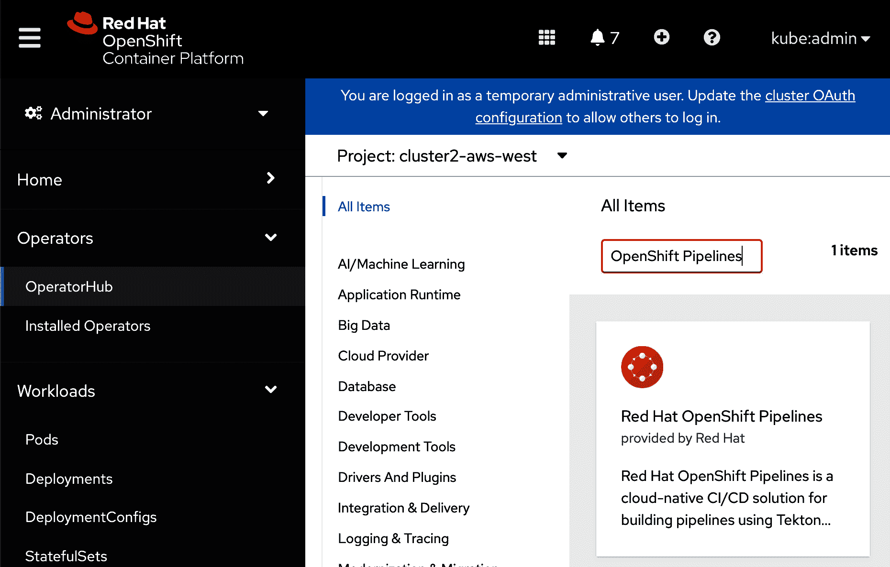

    ###### 图 5-1\. 根据“OpenShift Pipelines”查询筛选的 OperatorHub 目录

1.  单击瓷砖以显示有关操作员的信息。滚动到页面底部，下载适合您平台的命令行版本（参见 Figure 5-2）。

    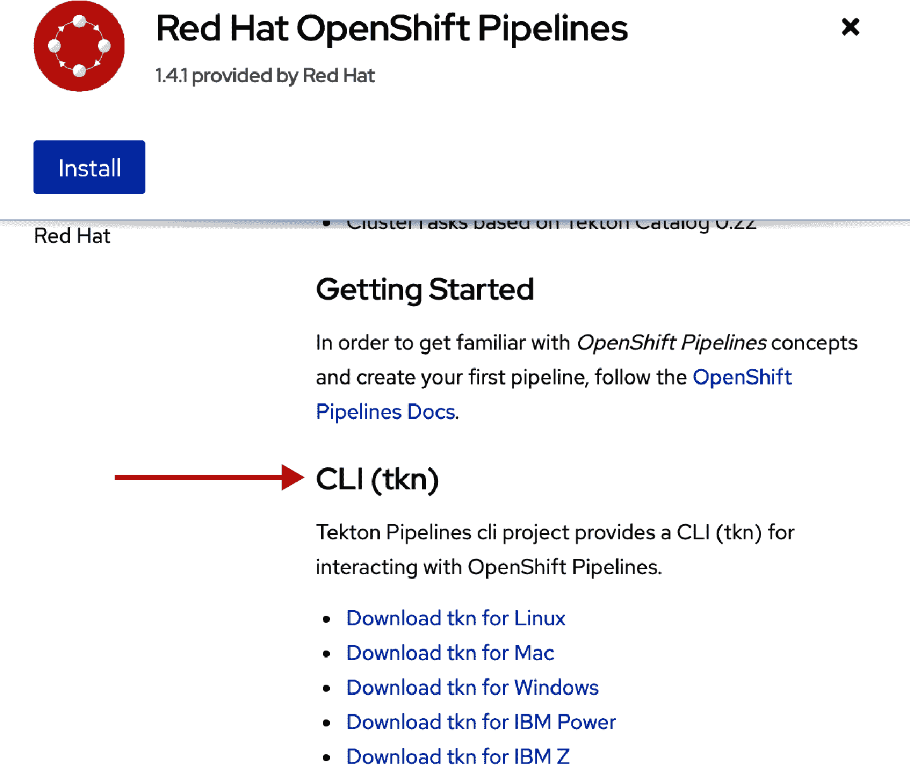

    ###### 图 5-2\. 下载适用于您平台的 Tekton CLI (`tkn`) 的命令行版本

1.  点击安装。

1.  选择适合你的 OpenShift 版本的更新频道。例如，如果你正在运行 OCP 4.4.x 版本，请使用 ocp-4.4。

1.  点击订阅。

您可以通过导航到运算符 > 已安装的运算符并将项目过滤为“openshift-operators”，如 图 5-3 所示，确认安装成功。

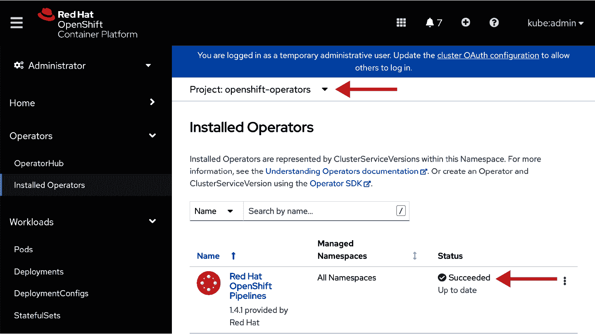

###### 图 5-3\. 确认成功安装 OpenShift Pipelines 运算符

在使用 Tekton Tasks 组装您的持续交付解决方案时，您可以访问广泛的社区库存的现有任务：

+   [Tekton 任务目录](https://oreil.ly/INXgA)

+   [OpenShift Pipelines 任务目录](https://oreil.ly/z3KwI)

让我们重新利用公共目录中的一些任务来组合我们的工作示例。安装运算符后，您还将获得一组可用的任务：

```
$ tkn clustertasks ls
NAME DESCRIPTION AGE
buildah 25 minutes ago
buildah-v0-11-3 25 minutes ago
git-clone 25 minutes ago
jib-maven 25 minutes ago
kn 25 minutes ago
maven 25 minutes ago
openshift-client 25 minutes ago
openshift-client-v0-11-3 25 minutes ago
s2i 25 minutes ago
s2i-dotnet-3 25 minutes ago
s2i-dotnet-3-v0-11-3 25 minutes ago
s2i-go 25 minutes ago
s2i-go-v0-11-3 25 minutes ago
s2i-java-11 25 minutes ago
s2i-java-11-v0-11-3 25 minutes ago
s2i-java-8 25 minutes ago
s2i-java-8-v0-11-3 25 minutes ago
s2i-nodejs 25 minutes ago
s2i-nodejs-v0-11-3 25 minutes ago
s2i-perl 25 minutes ago
s2i-perl-v0-11-3 25 minutes ago
s2i-php 25 minutes ago
s2i-php-v0-11-3 25 minutes ago
s2i-python-3 25 minutes ago
s2i-python-3-v0-11-3 25 minutes ago
s2i-ruby 25 minutes ago
s2i-ruby-v0-11-3 25 minutes ago
s2i-v0-11-3 25 minutes ago
tkn 25 minutes ago
```

现在，我们将创建一个流水线来构建我们的图像，并发布到集群内部的注册表中。首先，在您的 OpenShift 集群中创建一个项目来保存我们即将创建的资源：

```
$ oc new-project pipelines-tutorial
```

###### 注意

所有以下示例假设您正在同一命名空间`pipelines-tutorial`中工作。如果由于某种原因您的`KUBECONFIG`引用了不同的命名空间，则可以使用`oc project`命令更新您的上下文：

```
$ oc project pipelines-tutorial
```

或者，您可以在`oc apply`、`oc create`、`oc get`等命令后添加`-n pipelines-tutorial`标志，例如：

```
$ oc get pipelines -n pipelines-tutorial
```

要构建并发布图像，必须授予默认服务帐户`pipeline`将图像推送到目标注册表的授权。例如，本示例使用 [Quay.io](https://quay.io) 注册表，但任何注册表都可以正常工作。

要为`pipeline`服务帐户启用授权，您必须创建一个`docker-registry`密钥，并更新`pipeline`服务帐户。这些步骤与 Tekton 没有直接关系，但与我们的示例相关：

1.  创建名为`quay.io/*<username>*/pacman`的 Quay.io 镜像仓库，以您的用户名命名，按照 [Quay.io 文档](https://oreil.ly/N3Ng3) 进行操作。

1.  从 Quay.io 下载 Kubernetes 密钥。您可以从“生成加密密码”页面下的设置页面访问此密钥。

1.  应用该密钥（确保更新`*<username>*-pull-secret`的默认名称为`quay-registry-secret`），或使用`kubectl`或`oc`命令行创建密钥：

    ```
    $ kubectl create secret docker-registry \
     --docker-server="quay.io" \
     --docker-username="YOUR_USERNAME" \
     --docker-password="YOUR_PASSWORD" \
     --docker-email="YOUR_EMAIL" \
     quay-registry-secret
    ```

1.  将`quay-registry-secret`补丁到`pipeline`服务帐户中。OpenShift pipelines 运算符会自动在集群的每个命名空间中创建`pipeline`服务帐户。通过更新`pipelines-tutorial`命名空间中的服务帐户，您可以允许任何 Tekton `TaskRun` 利用此授权来推送图像：

    ```
    $ oc patch sa pipeline -p '{"secrets":[{"name":"quay-registry-secret"}]}'
    ```

我们将开始创建一个流水线，用于构建图像并将其推送到您刚刚定义的图像仓库中：

```
pipelines/01-pipeline-build-pacman.yaml 

apiVersion: tekton.dev/v1beta1
kind: Pipeline
metadata:
 name: build-pacman
spec:
 workspaces:
 - name: shared-workspace
 resources:
 - name: source-repo
 type: git
 - name: image
 type: image
 params:
 - name: dockerfile-path
 type: string
 description: The path to your Dockerfile
 default: "Dockerfile"
 tasks:
 - name: build-image
 taskRef:
 name: buildah
 kind: ClusterTask
 resources:
 inputs:
 - name: source
 resource: source-repo
 outputs:
 - name: image
 resource: image
 params:
 - name: TLSVERIFY
 value: "false"
 - name: DOCKERFILE
 value: "$(params.dockerfile-path)"
```

`build-pacman`流水线定义了一个使用`buildah ClusterTask`的单个任务。输入需要一个带有所需的`Dockerfile`和相关源文件以及要构建的镜像详细信息的 Git 仓库。

我们使用`oc`命令行工具创建流水线：

```
$ oc apply -f 01-pipeline-build-pacman.yaml 
pipeline.tekton.dev/build-and-deploy-pacman created
```

应用流水线定义后，我们可以验证其是否存在：

```
$ oc get pipelines
NAME                    AGE
build-and-deploy-pacman 8s
```

`tkn`命令行工具为 Tekton 资源提供了一组特定的操作。除了类似于`get`或`describe`的命令等价物外，还有直接的命令来查看任务日志和其他 Tekton 特定的行为：

```
$ tkn pipelines ls
NAME                    AGE            LAST RUN STARTED DURATION STATUS
build-and-deploy-pacman 21 seconds ago ---      ---     ---      ---
```

Tekton 流水线定义驱动其行为的参数。为了简化参数的管理，Tekton 还定义了代表在所需流水线行为中经常出现的不同类型对象的`PipelineResource`s。

以下是定义的[`PipelineResource`类型](https://oreil.ly/KrZlb)：

`git`

GitHub 仓库

`storage`

存储 blob

`image`

容器镜像元数据

`cluster`

具有访问凭据的 Kubernetes 集群描述

`pullRequest`

一个 GitHub 拉取请求

`cloudEvent`

云事件

`gcs`

由 GCS blob/目录支持的 GCSResource

`build-gcs`

添加了 BuildGCSResources 以与 Knative 构建兼容

我们将创建`PipelineResource`s，这些资源将成为流水线的输入，并满足输入参数的所需值：

```
pipelines/02-resource-git-repo-pacman.yaml

apiVersion: tekton.dev/v1alpha1
kind: PipelineResource
metadata:
 name: pacman-git
spec:
 type: git
 params:
 - name: revision
 value: master
 - name: url
 value: https://github.com/hybrid-cloud-apps-openshift-k8s-book/k8s-example-apps/

pipelines/03-resource-pacman-image.yaml

apiVersion: tekton.dev/v1alpha1
kind: PipelineResource
metadata:
 name: pacman-image
spec:
 type: image
 params:
 - name: url
 value: quay.io/mdelder/pacman
```

我们将应用这些资源，然后在我们的`PipelineRun`中引用它们：

```
$ oc apply -f 02-resource-git-repo-pacman.yaml \
 -f 03-resource-pacman-image.yaml
```

现在我们有一个流水线，我们有输入（我们的 Git 仓库和我们要构建的期望镜像）。让我们通过创建一个`PipelineRun`来触发流水线：

```
pipelines/04-pipelinerun-build-pacman-01.yaml

apiVersion: tekton.dev/v1beta1
kind: PipelineRun
metadata:
 generateName: pipelinerun-build-pacman-
spec:
 serviceAccountName: pipeline
 pipelineRef:
 name: build-pacman
 resources:
 - name: source-repo
 resourceRef:
 name: pacman-git
 - name: image
 resourceRef:
 name: pacman-image
 workspaces:
 - name: shared-workspace
 emptyDir: {}
 params:
 - name: dockerfile-path
 value: "pacman-nodejs-app/docker/Dockerfile"
```

`PipelineRun`将使用单个`buildah`任务执行两个操作：克隆 Git 仓库，然后构建镜像并将其发布到您之前创建的 Quay.io 注册表中。

要运行流水线，使用`oc create`：

```
$ oc create -f pipelines/04-pipelinerun-build-pacman-01.yaml
```

###### 注意

我们在这里使用`oc create`而不是`oc apply`，因为`PipelineRun`使用`generateName`而不是`name`属性。`oc apply`命令需要`name`属性，而`oc create`支持额外的行为来自动生成名称的后缀。

您可以使用`tkn`命令行工具查看正在运行的流水线：

```
$ tkn pipelinerun ls
NAME                           STARTED        DURATION STATUS
pipelinerun-build-pacman-qk5lw 23 seconds ago ---      Running
```

你可以使用`tkn`命令行跟踪`PipelineRun`的执行过程：

```
$ tkn pipelinerun logs -f
```

输出应该类似于以下内容：

```
[build-image : git-source-pacman-git-s2mxf]
{"level":"info","ts":1598817082.1290805,"caller":"git/git.go:105","msg":
"Successfully cloned https://github.com/hybrid-cloud-apps-openshift-k8s-book/
k8s-example-apps/ @ master in path /workspace/source"}
...

[build-image : build] STEP 1: FROM node:boron
[build-image : build] Getting image source signatures
[build-image : build] Copying blob 
sha256:3b7ca19181b24b87e24423c01b490633bc1e47d2fcdc1987bf2e37949d6789b5

...

[build-image : push] Getting image source signatures
[build-image : push] Copying blob 
sha256:ec62f19bb3aa1dcfacc9864be06f0af635c18021893d42598da1564beed97448

...

[build-image : push] Writing manifest to image destination
[build-image : push] Copying config 
sha256:854daaf20193c74d16a68ba8c1301efa4d02e133d383f04fedc9532ae34e8929
[build-image : push] Writing manifest to image destination
[build-image : push] Storing signatures

...
```

在这个例子中，我们构建了容器镜像。让我们进一步将更改应用到集群中。在这一步中，我们将创建一个具有三个不同阶段的流水线：

1.  构建应用程序镜像。

1.  获取包含我们部署清单的 Git 仓库（使用 Kustomize）。

1.  应用 Kustomization 部署清单。

第一步的工作方式与以前完全相同。额外的步骤引入了一些新的想法：

+   我们将创建一个`PersistentVolumeClaim`来为我们的 Git 仓库内容提供可用存储空间。否则，在第 2 步中从 Git 检索的文件将无法在第 3 步中使用。

+   我们将需要为我们的`pipeline`服务账户添加额外的权限，以允许将部署清单应用到此集群上的应用程序命名空间。

让我们创建`PersistentVolumeClaim`。`PersistentVolumeClaim`应请求足够的容量，以满足流水线中所有任务所需的所有持久文件系统存储。如果`PersistentVolume`在任务之间被回收或重新利用，可能会丢失重要状态，并且流水线运行可能会失败。另一方面，如果相同的`PersistentVolume`在许多流水线运行之间被重复使用，最终可能会耗尽所有可用空间。如果预计相同的`PersistentVolume`将支持多个并行流水线运行，请确保将`accessMode`设置为`ReadWriteMany`：

```
pipelines/00-pvc-shared-workspace.yaml

apiVersion: v1
kind: PersistentVolumeClaim
metadata:
 name: shared-workspace
spec:
 accessModes:
 - ReadWriteOnce
 resources:
 requests:
 storage: 1Gi

$ oc apply -f 00-pvc-shared-workspace.yaml 
persistentvolumeclaim/shared-workspace created
```

###### 注意

随着时间的推移，工作区的状态管理可能成为一个问题。Tekton 0.12 引入了`volumeClaimTemplate`，可以简化这个过程。否则，您可能会为每个`PipelineRun`始终创建`PersistentVolumeClaim`和`PersistentVolume`。对于通过自动化创建的任何资源，请确保定义回收策略，以销毁或允许任何不必要的资源适时过期。

在我们的第一个流水线中，我们更新了`system:serviceaccounts:pipelines-tutorial:pipeline`服务账户，以允许使用额外的秘钥授权我们的服务账户将镜像推送到我们的 Quay.io 镜像注册表中。在我们的第二个流水线中，我们的服务账户将向运行流水线的相同集群应用部署清单，并需要授权到应用程序命名空间：

```
$ oc adm policy add-role-to-user edit --namespace pacman \
 system:serviceaccount:pipelines-tutorial:pipeline
```

通过`edit ClusterRoleBinding`到`pacman`命名空间，服务账户将能够创建、修改和查看大多数 Kubernetes API 对象，包括部署、服务和 OpenShift 路由。我们选择的示例应用程序在其部署清单中创建了每一个这些对象。

要验证你已经正确应用权限，可以使用`can-i`命令，它会打印一个简单的“yes”或“no”答案：

```
$ oc auth can-i get deployments \
 --namespace pacman \
 --as system:serviceaccount:pipelines-tutorial:pipeline
```

现在我们将创建我们的新流水线：

```
pipelines/05-pipeline-deploy-pacman.yaml

apiVersion: tekton.dev/v1beta1
kind: Pipeline
metadata:
 name: build-and-deploy-pacman
spec:
 workspaces:
 - name: shared-workspace
 resources:
 - name: source-repo
 type: git
 - name: image
 type: image
 params:
 - name: kustomization-path
 type: string
 default: kustomization
 - name: kustomization-git-repo-url
 type: string
 - name: kustomization-git-revision
 type: string
 default: master
 - name: dockerfile-path
 type: string
 description: The path to your Dockerfile
 default: "Dockerfile"
 tasks:
 - name: build-image
 taskRef:
 name: buildah
 kind: ClusterTask
 resources:
 inputs:
 - name: source
 resource: source-repo
 outputs:
 - name: image
 resource: image
 params:
 - name: TLSVERIFY
 value: "false"
 - name: DOCKERFILE
 value: "$(params.dockerfile-path)"
 - name: fetch-repository
 taskRef:
 name: git-clone
 kind: ClusterTask
 workspaces:
 - name: output
 workspace: shared-workspace
 params:
 - name: url
 value: "$(params.kustomization-git-repo-url)"
 - name: subdirectory
 value: ""
 - name: deleteExisting
 value: "true"
 - name: revision
 value: "$(params.kustomization-git-revision)"
 runAfter:
 - build-image
 - name: apply-config
 params:
 - name: kustomization-path
 value: "$(params.kustomization-path)"
 workspaces:
 - name: source
 workspace: shared-workspace
 taskSpec:
 params:
 - name: kustomization-path
 default: "kustomization"
 workspaces:
 - name: source
 steps:
 - name: apply-kustomization
 image: quay.io/openshift/origin-cli:latest
 workingDir: /workspace/source
 command: ['/bin/bash', '-c']
 args:
 - |-
 echo "Applying kustomization in DIR \"$(params.kustomization-path)\""
 oc apply -k $(params.kustomization-path)
 runAfter:
 - fetch-repository

$ oc apply -f 05-pipeline-deploy-pacman.yaml
```

我们不需要任何额外的`PipelineResource`来运行这个流水线。实际上，您可能会注意到在此流水线中管理两个相关的 Git 仓库的细节有所不同。在消耗不同任务或定义自己的任务时，您可能会发现如何组装任务以实现您的目标存在轻微的不一致。具体来说，社区`git-clone`任务不使用`git`类型的`PipelineRes⁠ource`，而是接受需要识别仓库 URL 和修订版本的组件部分。

就像之前一样，我们将创建一个`PipelineRun`并监视其进度：

```
$ oc create -f 06-pipelinerun-build-and-deploy-pacman-01.yaml 
pipelinerun.tekton.dev/pipelinerun-build-and-deploy-pacman-cjc7b created
```

再次，你可以使用`tkn`命令行工具查看所有`PipelineRun`：

```
$ tkn pipelinerun ls
NAME                                      STARTED        DURATION  STATUS
pipelinerun-build-and-deploy-pacman-cjc7b 3 minutes ago  2 minutes Succeeded
pipelinerun-build-pacman-qk5lw            57 minutes ago 2 minutes Succeeded
```

您也可以查看或跟随日志。请注意，如果您在`PipelineRun`完成后运行此操作，则日志顺序将被反转：

```
$ tkn pipelinerun logs -f pipelinerun-build-and-deploy-pacman-cjc7b
```

首先定义和排查任务可能会有些容易出错。使用 API 参考，并且不要害怕删除或重新创建初始管道和管道运行以解决引用问题。

现在，我们可以通过使用 Web 浏览器打开路由确认`pacman`是否成功部署（图 5-4）：

```
$ oc get route pacman --namespace pacman \
 -ojsonpath="{.status.ingress[0].host}"
```

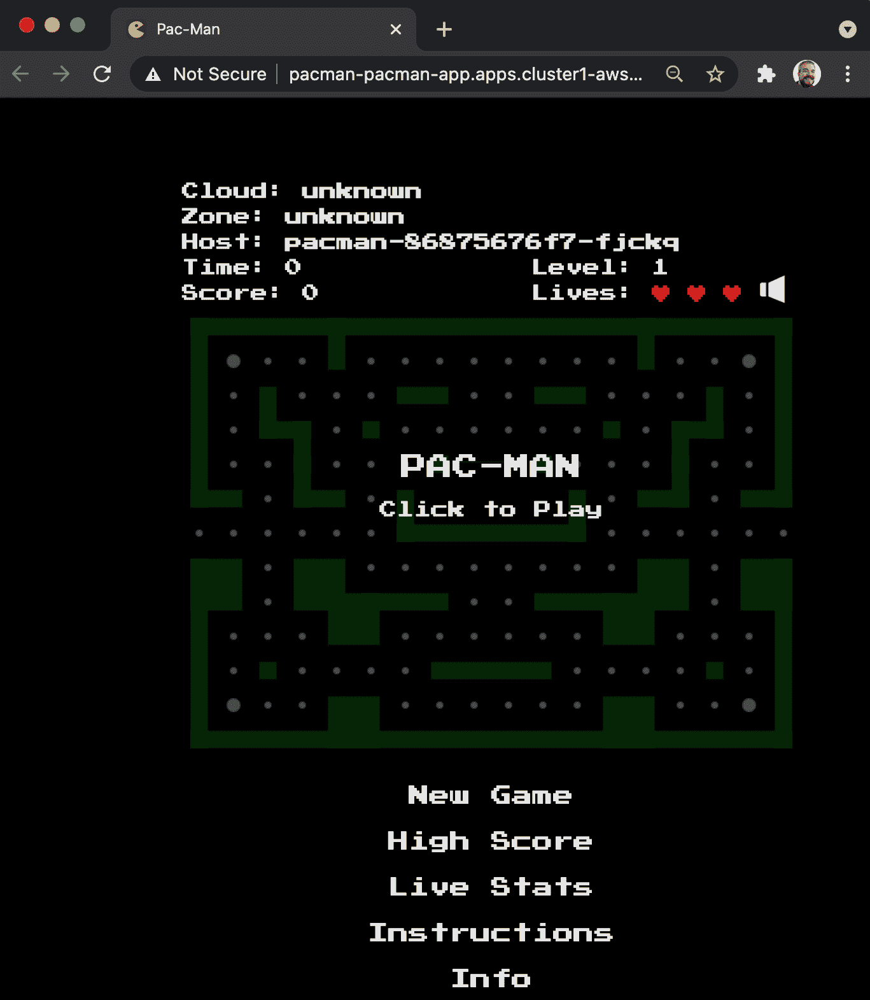

###### 图 5-4\. PAC-MAN 应用程序的成功部署

# 开放集群管理应用程序

[开放集群管理](https://oreil.ly/QbBRN)项目是跨一个或多个 OpenShift 集群管理应用程序的新方法。该方法将本地 GitOps 方法应用于将 Kubernetes 对象附加到 Git 存储库。让我们以开源 PAC-MAN 应用程序为基础进行一个简单的示例。

开放集群管理项目专注于管理 Kubernetes 集群的几个方面，包括创建和升级集群、分布式交付和应用程序管理、集群配置的同步以及维护托管集群的合规性和治理的可见性。*hub*集群运行多集群控制平面，而在*托管集群*上以一组 Pod 形式运行的轻量级代理则将所需状态应用于所有受管理的集群，并提供健康、搜索索引和合规性的反馈循环。在下一个示例中，我们将仅关注应用程序管理的概念。

开放集群管理应用程序模型依赖于以下概念：

`Application`

一组相关资源的分组，用于为消费者提供逻辑服务。

`Channel`

部署所需的应用程序部件的来源。当前支持的通道包括 Git 存储库、对象存储桶和 Helm 存储库。

`Subscription`

将应用程序的部分连接到一个或多个集群的通道。订阅从发布分支（例如“latest”，“stable”，“production”等）消费一系列版本。

`PlacementRule`

将订阅链接到一个或多个集群。

[*Red Hat 高级集群管理* (RHACM)](https://oreil.ly/6x2Ba)是一个基于开放集群管理项目的完全支持的软件提供。类似于 OpenShift Pipelines 简化了采用 Tekton 和其他项目的设置和生命周期的方式，RHACM 为 Kubernetes 简化了采用开放集群管理项目的方式（图 5-5）。

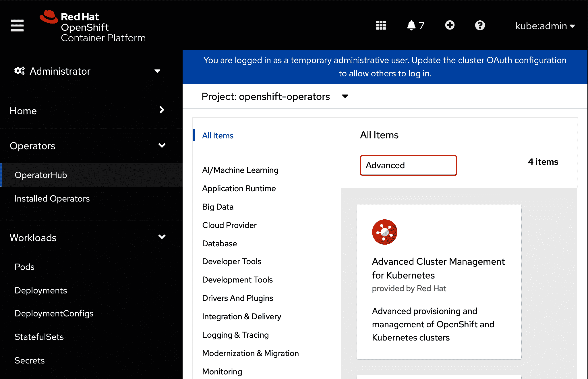

###### 图 5-5\. 在 OpenShift 中安装 Kubernetes 高级集群管理

要安装 Kubernetes 的 RHACM，请按照以下步骤操作：

1.  通过名称搜索运营商，然后单击安装。

1.  安装运营商后，创建`MultiClusterHub` API 的实例：

    ```
    $ oc new-project open-cluster-management

    $ oc create -f - <<EOF
    apiVersion: operator.open-cluster-management.io/v1
    kind: MultiClusterHub
    metadata:
     namespace: open-cluster-management
     name: multiclusterhub
    spec: {}
    EOF
    ```

1.  从 OpenShift 容器平台 web 控制台的应用程序列表中，单击新项目以打开 RHACM web 控制台，如 图 5-6 所示。您可能需要刷新您的网页浏览器以使此新链接出现。

    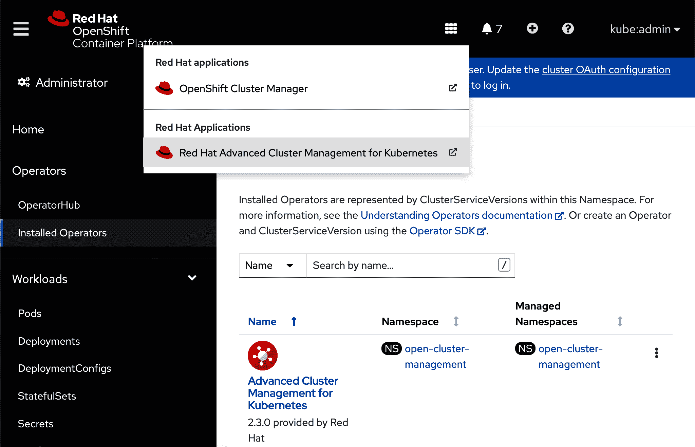

    ###### 图 5-6\. 在 OpenShift 中打开 RHACM web 控制台

示例假定您在高级集群管理中创建或导入了两个集群，并具有以下标签：

```
Cluster 1:
 apps/pacman: deployed
 environment: dev
 region: us-east

Cluster 2:
 apps/pacman: deployed
 environment: dev
 region: europe-west3
```

作为参考，我们假设以下两个托管集群：“cluster1-aws-east”和“cluster3-gcp-europe-west3”。请注意，一个集群（“cluster1-aws-east”）位于北美亚马逊上，而第二个（“cluster3-gcp-europe-west3”）位于欧洲谷歌上（参见 图 5-7）。因此，在此示例中，我们正在向由 OpenShift 支持的多集群和多云平台部署我们的应用程序！

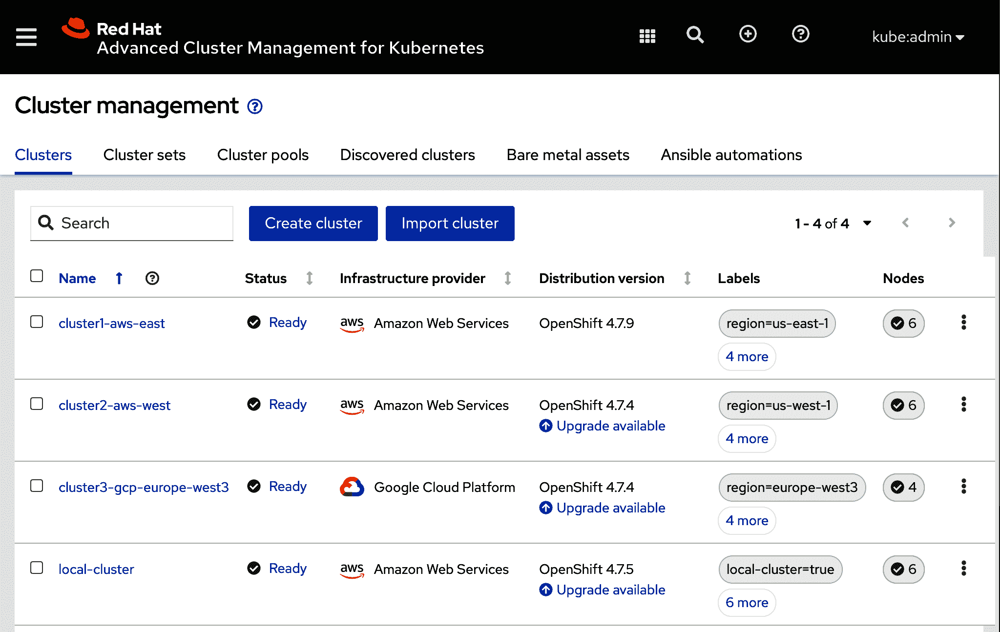

###### 图 5-7\. 使用 RHACM web 控制台管理亚马逊和谷歌提供的集群

我们还可以从命令行显示这些托管集群：

```
$ oc get managedclusters -o yaml
apiVersion: v1
items:
- apiVersion: cluster.open-cluster-management.io/v1
 kind: ManagedCluster
 metadata:
 labels:
 apps/pacman: deployed
 cloud: Amazon
 clusterID: 7de6ab45-58ac-47f7-897d-b742b7197653
 environment: dev
 name: cluster1-aws-east
 region: us-east
 vendor: OpenShift
 name: cluster1-aws-east
 spec:
 hubAcceptsClient: true
 leaseDurationSeconds: 60
 status:
 ...
 version:
 kubernetes: v1.18.3+b0068a8
- apiVersion: cluster.open-cluster-management.io/v1
 kind: ManagedCluster
 metadata:
 labels:
 apps/pacman: deployed
 cloud: Google
 clusterID: 9e170dd8-a463-44c7-a59f-39b7459964ec
 environment: dev
 name: cluster3-gcp-europe-west3
 region: europe-west3
 vendor: OpenShift
 name: cluster3-gcp-europe-west3
 spec:
 hubAcceptsClient: true
 leaseDurationSeconds: 60
 status:
 ...
 version:
 kubernetes: v1.18.3+b0068a8
kind: List
metadata:
 resourceVersion: ""
 selfLink: ""
```

我们首先定义我们的应用程序，并引用将组成应用程序的`Subscription`类型：

```
apiVersion: app.k8s.io/v1beta1
kind: Application
metadata:
 name: pacman-app
 namespace: pacman-app
spec:
 componentKinds:
 - group: apps.open-cluster-management.io
 kind: Subscription
 descriptor: {}
 selector:
 matchExpressions:
 - key: app.kubernetes.io/name
 operator: In
 values:
 - pacman
```

应用程序提供了一种将一组相关部件组合成逻辑单元以便进行管理的方式。根据当前项目准备情况，该应用程序用于理解将部件交付给不同管理集群的情况。目前正在进行工作，以便使用该应用程序汇总健康信息，并总结部署应用程序或其部件的所有支持集群的准备情况。

现在让我们定义频道和订阅，以将我们的应用程序附加到一个或多个集群。该频道简单地引用我们应用程序的 Git 存储库：

```
apiVersion: apps.open-cluster-management.io/v1
kind: Channel
metadata:
 name: pacman-app-latest
 namespace: pacman-app
 annotations:
 apps.open-cluster-management.io/github-path: kustomization
spec:
 type: GitHub
 pathname: https://github.com/hybrid-cloud-apps-openshift-k8s-book/
openshift-pipeline-example-pacman.git
 # secretRef:
 # name: github-credentials
```

然后订阅引用频道，包括有关申请变更的分支的详细信息，并在 Git 存储库中隔离相关目录结构。订阅可以通过指定`timeWindows`进一步限制允许或阻止对源存储库中识别的集群的更改的部署时间。

在这里，我们看到`pacman-app`的订阅，并参考先前定义的频道：

```
apiVersion: apps.open-cluster-management.io/v1
kind: Subscription
metadata:
 annotations:
 apps.open-cluster-management.io/git-branch: main
 apps.open-cluster-management.io/github-path: kustomization
 name: pacman-app
 namespace: pacman-app
 labels:
 app.kubernetes.io/name: pacman
spec:
 channel: pacman-app/pacman-app-latest
 placement:
 placementRef:
 kind: PlacementRule
 name: pacman-dev-clusters
 # timewindow:
 # windowtype: blocked
 # location: America/Toronto
 # weekdays: ["Monday","Tuesday","Wednesday","Thursday","Friday"]
 # hours:
 # - start: "06:00AM"
 # end: "05:00PM"
```

订阅还提供通过`packageOverrides`向 Kustomization 项目或 Helm charts 提供部署信息的能力。

然后通过`PlacementRule`将订阅与托管集群匹配。`PlacementRule`使用匹配选择器来识别应该托管应用程序的管理目标集群。

在下面的示例中，`PlacementRule`定义了一个选择子句，以选择最多两个具有`us-east`、`us-west`或`europe-west3`区域值并包含标签`environment=dev`和`apps/pacman=deployed`的集群：

```
apiVersion: apps.open-cluster-management.io/v1
kind: PlacementRule
metadata:
 name: pacman-dev-clusters
 namespace: pacman-app
spec:
 clusterConditions:
 - status: "True"
 type: ManagedClusterConditionAvailable
 clusterReplicas: 2
 clusterSelector:

 matchExpressions:
 - key: region
 operator: In
 values:
 - us-east
 - us-west
 - europe-west3
 matchLabels:
 environment: dev
 apps/pacman: deployed
```

我们可以应用我们示例项目中的所有这些 API 资源：

```
$ git clone git@github.com:hybrid-cloud-apps-openshift-k8s-book/
openshift-pipeline-example-pacman.git
$ cd openshift-pipeline-example-pacman
$ oc new-project pacman-app
$ oc apply -f deploy/pacman-app.yaml
```

现在让我们看看如果我们管理两个集群会是什么样子。我们的第一个集群是在亚马逊弹性计算云（EC2）的 us-east 区域运行的 OpenShift 集群。我们的第二个集群是在 Google 计算平台的 europe-west3 区域运行的 OpenShift 集群。我们可以使用以下命令在 RHACM 中检查任何管理的集群：

```
$ oc get managedclusters --show-labels
NAME HUB ACCEPTED MANAGED CLUSTER URLS JOINED AVAILABLE AGE LABELS
local-cluster true True True 55m 
  cloud=Amazon,clusterID=65333a32-ba14-4711-98db-28c2aa0153d6,
  installer.name=multiclusterhub,installer.
  namespace=open-
cluster-management,local-cluster=true,vendor=OpenShift

cluster1-aws-east true True True 52m 
  apps/pacman=deployed,cloud=Amazon,
  clusterID=7de6ab45-58ac-47f7-897d-
b742b7197653,environment=dev,
  name=cluster1-aws-east,region=us-east,vendor=OpenShift

cluster3-gcp-europe-west3 true True True 52m 
  apps/pacman=deployed,cloud=Google,
  clusterID=9e170dd8-a463-44c7-a59f-
39b7459964ec,environment=dev,name=cluster3-gcp-europe-west3,
  region=europe-west3,vendor=OpenShift
```

我们的`PlacementRule`基于我们之前定义的`matchLabels`和`matchExpressions`，已经识别出这两个符合条件的集群：

```
$ oc get placementrule -n pacman-app pacman-dev-clusters -oyamlapiVersion: 
apps.open-cluster-management.io/v1
kind: PlacementRule
metadata:
 name: pacman-dev-clusters
 namespace: pacman-app
 resourceVersion: "3954663"
 selfLink: /apis/apps.open-cluster-management.io/v1/namespaces/pacman-
app/placementrules/pacman-dev-clusters
 uid: 4baae9ee-520c-407e-9cbd-645465e122ea
spec:
 clusterConditions:
 - status: "True"
 type: ManagedClusterConditionAvailable
 clusterSelector:
 clusterReplicas: 2
 matchExpressions:
 - key: region
 operator: In
 values:
 - us-east
 - us-west
 - europe-west3
 matchLabels:
 apps/pacman: deployed
 environment: dev
status:
 decisions:
 - clusterName: cluster1-aws-east
 clusterNamespace: cluster1-aws-east
 - clusterName: cluster3-gcp-europe-west3
 clusterNamespace: cluster3-gcp-europe-west3
```

我们可以在高级集群管理拓扑视图中查看我们的应用程序及其相关部分（由订阅描述），这些部分部署到我们的两个由`PlacementRule`确定的管理集群（由通道标识），源自我们的 Git 仓库。在图 5-8 中，我们可以看到该应用程序正好有一个订阅（可能有多个），并且部署在两个集群上。

我们可以选择拓扑图中的元素以查看更多信息，如图 5-9 所示。

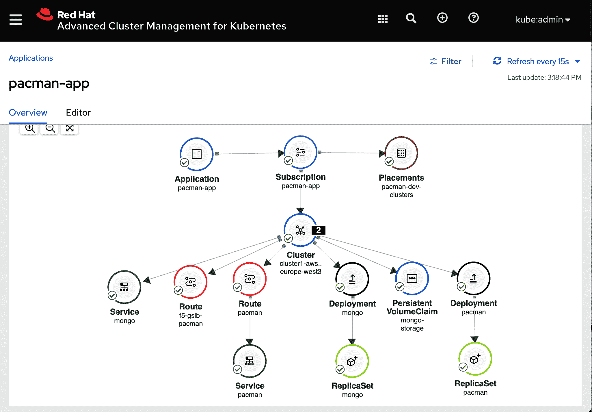

###### 图 5-8\. 在 RHACM 拓扑视图中显示应用程序的可视化

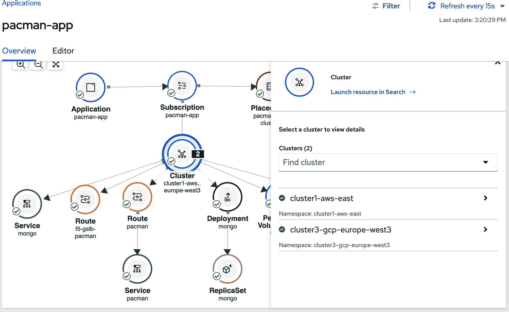

###### 图 5-9\. 在 RHACM 拓扑视图中显示多个集群的详细信息

图 5-10 中描绘的集群图标显示了我们选择的集群。

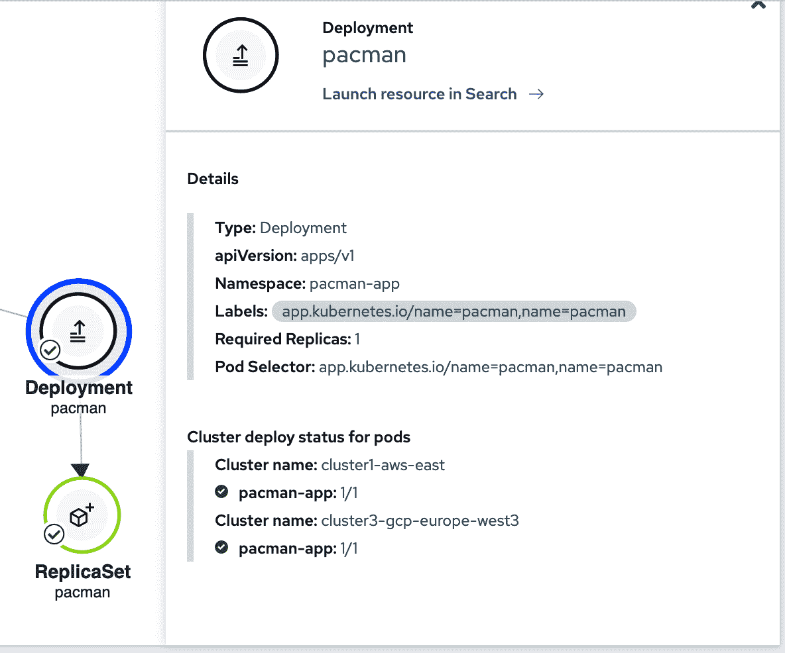

###### 图 5-10\. 显示选定集群的详细信息在 RHACM 拓扑视图中

部署图标展示了我们的部署情况以及它是否成功部署并且当前在我们管理的集群上保持健康状态。

单击“在搜索中启动资源”将显示跨所有管理的集群中`pacman`部署的详细信息（见图 5-11）。

在这里，我们可以看到我们的`pacman`部署在两个集群上运行：cluster3-gcp-europe-west3 和 cluster1-aws-east。从这里，我们可以进一步检查相关的对象，包括部署使用的相关 Pod、服务和秘密。

强大的搜索功能允许您以整体视角了解您的应用程序。至少，您能够验证应用程序的部分按预期部署。如果出现问题，这些视图帮助您隔离可能导致观察到的故障的根本原因。以更易消化的形式提供信息有助于 SRE 和开发人员更有效地处理多集群或多云架构的复杂性。

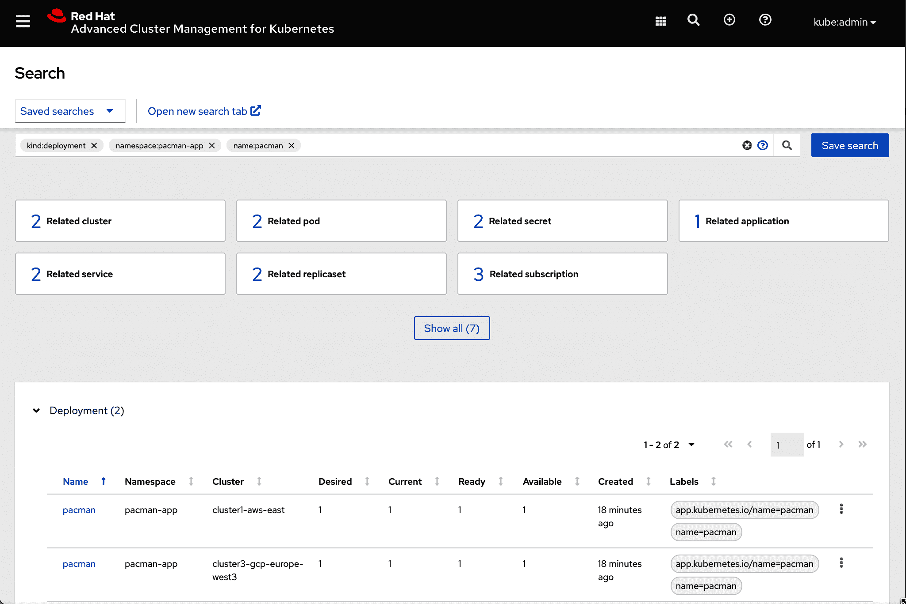

###### 图 5-11\. 在 RHACM web 控制台中显示`pacman`部署

# 摘要

本章概述了几种支持在传统 Kubernetes 和 OpenShift 集群中进行生产环境持续交付的流行工具和方法。首先介绍了 Helm，这是 Kubernetes 应用程序的流行打包工具。接下来，我们描述了 Kustomize，它提供了使用现有的 Kubernetes YAML 文件进行多种用途和配置的能力，同时避免使用模板。然后，我们描述了几种支持持续交付流水线的流行方法，包括 GitOps、Razee、Tekton 和 Argo CD。最后，我们详细讨论了 OpenShift Pipelines 和 Open Cluster Management 工具，用于在多个集群中部署和管理 OpenShift 应用程序。通过本章学习的技术，您现在对于可用的最流行和经过验证的持续交付选项有了扎实的理解，并且具备了管理跨多个集群的应用程序的实际经验。在下一章中，我们将深入探讨在多集群环境中进行配置和升级的关键操作。

¹ Jeff Regan 和 Phil Wittrock，“介绍 Kustomize；用于 Kubernetes 的无模板配置定制”，Kubernetes 博客（2018 年 5 月 29 日），[*https://oreil.ly/fli5E*](https://oreil.ly/fli5E)。

² Weaveworks，“GitOps 指南”，[*https://oreil.ly/QIQ24*](https://oreil.ly/QIQ24).

³ “引入持续交付基金会，Tekton、Jenkins、Jenkins X 和 Spinnaker 的新家园”，Google 开源博客（2019 年 3 月 12 日），[*https://oreil.ly/FvwF1*](https://oreil.ly/FvwF1).
