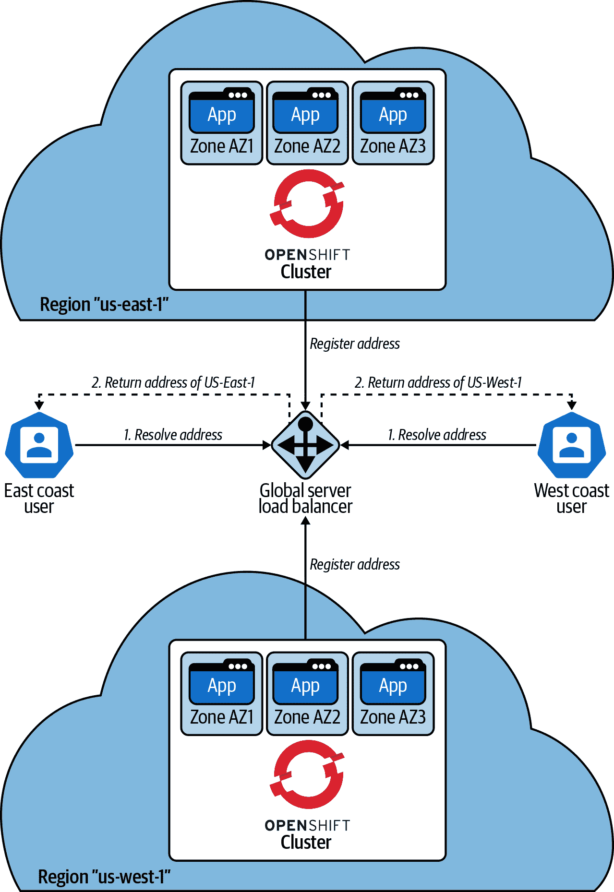
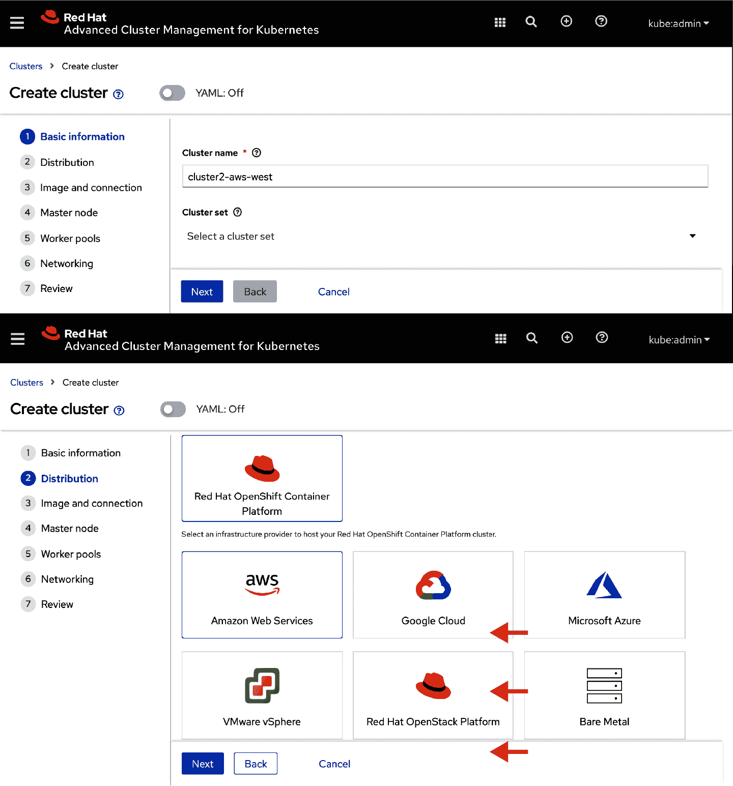
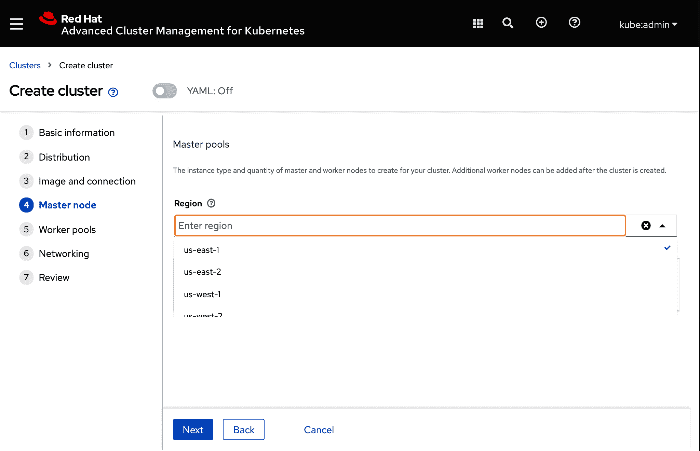
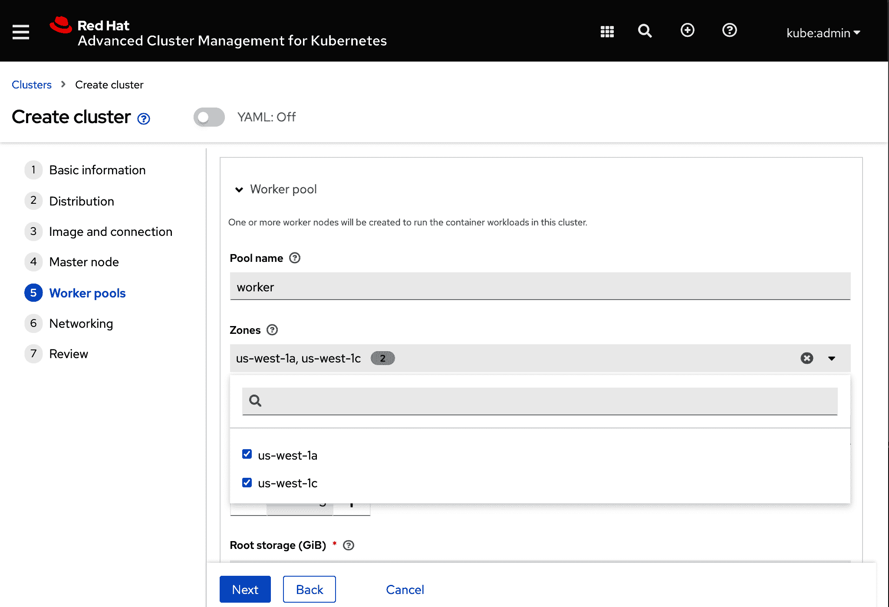
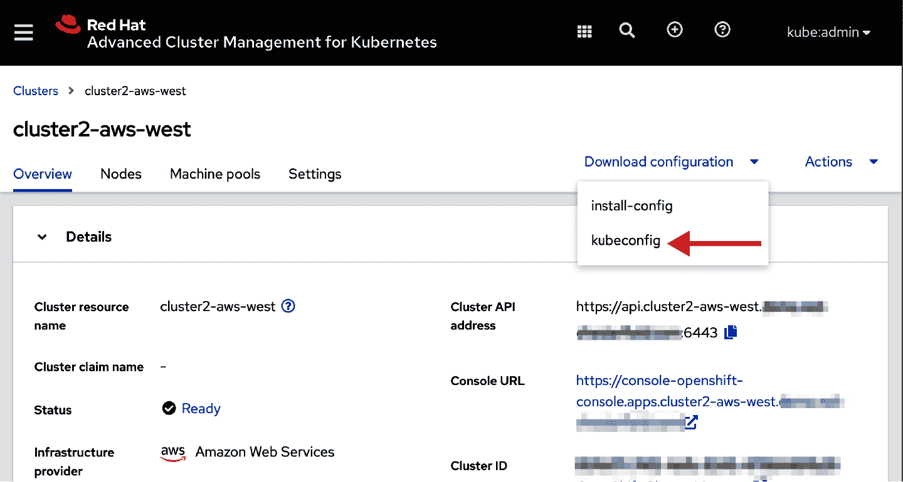

# 第六章。多集群舰队：供应和升级生命周期

*多集群* 和 *多云* 这些术语在当今的景观中变得普遍。对于本讨论的目的，我们将定义这些术语如下：

多集群

指的是管理超过一个集群或应用程序由部分托管在多个集群上的场景

多云

涉及使用多个集群的场景，这些集群也跨越基础设施基板，可能包括私有数据中心和单个或多个公共云提供商

这里的差异更多是学术性的；实际情况是，你很可能需要管理多个集群，就像你的组织不得不管理多个运行 VM 的 VMware ESXi 主机一样。

当你的容器编排平台在基础设施基板上有变化时，这些差异就会有所影响。我们将讨论当前一些可能出现这种情况的地方，以及可能影响一些你的管理技术或应用架构的地方。

# 为什么要多集群？

让我们讨论导致管理多个集群的使用案例。

## 使用案例：使用多个集群为你的应用程序提供区域性可用性

如同 第四章 中所讨论的，一个单一集群可以跨越多个可用区。每个可用区具有独立的故障特性。例如，电源供应、网络提供商，甚至物理空间（例如数据中心建筑）的故障应该被隔离到一个可用区内。通常情况下，跨可用区的网络连接仍提供显著的吞吐量和低延迟，允许 Kubernetes API 服务器的 etcd 集群跨越运行在不同可用区主机上的情况。然而，你的应用程序可能需要容忍影响同一区域内超过两个可用区或整个区域的停机情况。

所以，可能最容易理解的一个使用案例是在两个或更多区域创建超过一个多可用区集群。你通常会发现跨两个“游泳道”联合的应用程序，有时被称为 [*蓝绿架构*](https://oreil.ly/82hDU)。在同一区域内经常可以找到“蓝绿”配对模式，在其他区域中也有交替的蓝绿配对。你可以选择将同样的架构带到 OpenShift 中，运行两个分开的集群，为应用程序托管相同的组件集，有效地运行两个完整的端到端环境，其中任何一个都可以支持大多数用户的负载。围绕支持跨区域部署所需的架构模式，涉及负载均衡和数据管理的其他问题将在 第八章 中进行讨论。

## 使用案例：使用多个集群为多个租户提供服务

Kubernetes 社区对租户的界限是一个单独的集群。一般来说，Kubernetes 内的 API 结构侧重于将集群的计算资源划分为命名空间（在 OpenShift 中也称为*项目*）。然后，用户被分配角色或`ClusterRole`来访问他们的命名空间。然而，像`ClusterRole`、CRD、命名空间/项目、Webhook 配置等集群范围的资源确实不能由独立方管理。每个 API 资源在同类 API 资源集合中必须有唯一的名称。如果集群内真正有多租户，那么某种 API 概念（比如租户）将会组织`ClusterRole`、CRD 和 Webhook 配置等事物，并防止跨每个租户中的命名或行为发生冲突，就像应用程序的项目（例如，部署、服务和`PersistentVolumeClaim`在不同命名空间/项目中可以重复命名或行为一样）。

因此，当您可以为租户分配一个集群时，Kubernetes 最容易被消费。租户可以是组织内的业务线或功能团队（例如，质量工程或性能和规模测试）。然后，一组集群管理员或类似的`ClusterRole`可以分配给集群的所有者。

因此，一个新兴的模式是 OpenShift 集群管理平台团队将定义一个流程，消费者可以请求一个集群来满足其目的。因此，多个集群现在需要一致的治理和策略管理。

## 使用案例：支持远边使用案例，在这些案例中，集群不运行在传统数据中心或云中。

技术正在被应用到多种使用案例中，这些案例中，计算能力与来自摄像头、音频传感器或环境传感器的传感器数据以及机器学习或人工智能结合，以提高效率、提供更大的安全性，或创建新型消费者互动[¹]。这些使用案例通常被泛称为*边缘计算*，因为计算能力位于数据中心之外，更接近消费者体验的“边缘”。

高带宽能力与 5G 的引入也创造了场景，边缘计算解决方案可以在类似制造厂的空间内使用本地化的 5G 网络，边缘计算应用程序帮助追踪产品组装，自动化员工安全控制，或保护敏感机器设备。

就像容器为企业基于 Web 的应用程序提供了一个独立的包装一样，在基于边缘的应用程序中使用容器也有显著的好处。同样，你的容器编排的自动服务恢复在计算资源不易访问的数据中心内更为有益。

## 架构特征

现在我们已经看到一些使用多个集群或云来支持您需求的原因，让我们来看看这种方法的一些架构优势和挑战。

### 区域可用性与可用区可用性

通过多个托管应用程序的集群，您可以在多个云区域中分布应用程序的实例。每个区域内的每个集群仍将计算容量分布在多个可用区中。请参见图 6-1 以查看此拓扑结构的可视化表示。


###### 图 6-1\. 集群区域可用性允许在独立云区域中运行多个集群

在这种架构风格下，每个集群可以容忍任何一个可用区的完全丧失（例如 AZ1、AZ2 或 AZ3 可能变得不可用，但不会超过一个），并且工作负载将继续运行和提供请求。由于两个可用区的故障，etcd 集群将丧失法定人数，并且控制平面将变得不可用。

Kubernetes 控制平面在超过单个可用区故障时无法运行的原因是由于 etcd 的法定人数要求。通常情况下，etcd 将在控制平面中维护三个副本，每个副本由正好一个可用区支持。如果单个可用区丢失，仍然存在三个副本中的两个，并且分布式写入仍然可以确保写入事务被接受。如果两个可用区失败，则写入尝试将被拒绝。在集群中运行在工作节点上的 Pod 可能仍然能够提供流量服务，但不会接受或执行与 Kubernetes API 相关的任何更新。然而，在其他区域的独立集群仍然可以继续响应用户请求。详细分析此过程的内容请参见第四章。

### 根据地理位置减少用户的延迟

如果您的用户分布在不同地区，使用多个云区域还可以改善用户的响应时间。当用户尝试访问您应用的 Web 用户体验或工作负载提供的 API 时，他们的请求可以被路由到最近可用的应用实例。通常情况下，使用*全球服务器负载均衡器*（GSLB）来有效地处理这些流量路由。当用户尝试访问服务时，DNS 查询将委托给由您的 GSLB 托管的名称服务器。然后，根据请求的来源启发式算法，名称服务器将返回最近托管实例的 IP 地址。您可以在图 6-2 中看到此过程的可视化表示。



###### 图 6-2\. 使用 GSLB 解析全局服务地址的请求将返回最接近请求发起者的实例，基于其与请求发起者的距离。

### 您的平台一致性（托管 Kubernetes 与 OpenShift 加云身份提供商）

OpenShift 容器平台的一个主要优势是，它在所有云提供商和基础设施基板（如 VMware 和裸金属）上都能部署和运行一致。当您考虑是选择消费托管 Kubernetes 提供商还是 OpenShift 时，请注意每个 Kubernetes 分发版都会做出各种架构决策，这可能需要更多关注您的应用程序，以确保跨提供商的可移植性。

# 跨云资源配置

选择一个 Kubernetes 策略提供了简化应用程序如何消费弹性云基础设施的一种有效方式。在某种程度上，解决如何消费云资源的问题从为每个应用程序解决细节转变为一个平台，即您的组织将如何在基础设施基板上采用和管理 Kubernetes。

有几种方式可以从社区支持的项目中为 Kubernetes 提供资源。在本节中，我们将专注于如何使用 Red Hat OpenShift 容器平台来进行 Kubernetes 的资源配置。然后，我们将讨论如何在资源配置生命周期中作为一部分使用托管的 OpenShift 或托管的 Kubernetes 服务。

## 用户管理的 OpenShift

当您配置 OpenShift 容器平台 4.x 集群时，您有两种选项来创建基础设施资源。*用户提供的基础设施*（UPI）允许您更多控制权，可以启动虚拟机、网络资源和存储，然后将这些详细信息提供给安装过程，并允许它们引导到一个运行中的集群。或者，您可以依赖更自动化的*安装程序提供的基础设施*（IPI）方法。使用 IPI，安装程序接受具有适当特权的云凭证来创建所需的基础设施资源。IPI 过程通常会定义一个*虚拟私有云*（VPC）。请注意，如果您的组织有自己的约定方式来创建和管理这些资源，您可以将 VPC 指定为输入参数。在 VPC 内，资源包括网络负载均衡器、对象存储桶、虚拟计算资源、弹性 IP 地址等，所有这些资源都由安装过程创建和管理。

让我们看一下如何在三个云提供商（AWS、Microsoft Azure 和 Google Cloud Platform）上配置 OpenShift 集群。在本讨论中，我们将回顾安装过程如何使用声明性配置（与 Kubernetes 一般的做法相同），以及这与管理 OpenShift 集群生命周期的 `ClusterVersionOperator`（CVO）的关系。

首先，您需要根据适当的版本下载 openshift-installer 二进制文件。访问[Red Hat](https://cloud.redhat.com)，创建帐户，并按照创建集群和下载本地使用二进制文件的步骤进行操作。有关安装可用选项的具体详细信息，请参阅[产品文档](https://oreil.ly/HerIm)。

让我们通过查看一些 openshift-installer 二进制文件的示例配置文件来演示此方法的工作原理。OpenShift 4.x 安装方法的所有支持选项超出了本书的范围。请参阅[OpenShift Container Platform 文档](https://oreil.ly/wOJ3P)了解所有支持选项的详细参考。以下示例将突出显示 OpenShift 4.x 安装方法的声明性特性如何简化在多个基础设施上配置集群的过程。此外，通过`MachineSet` API 的演练示例将演示在配置集群后如何继续管理集群的生命周期和健康状态。

示例 6-1 定义了一组选项，用于在 AWS 上配置 OpenShift 集群。示例 6-2 定义了如何在 Microsoft Azure 上配置 OpenShift 集群，而示例 6-3 则为 Google Cloud Platform 提供了等效的配置。示例 6-4——你猜对了！—为 VMware vSphere 提供了一个配置示例。除了 VMware vSphere 示例（对您自己的环境更敏感外），您可以使用这些示例来最小化更新以配置您自己的集群。请参阅 OpenShift Container Platform 产品文档，详细了解安装方法。

##### Example 6-1\. 一个用于在 AWS 上配置 OpenShift 集群的示例*install-config.yaml*。

```
apiVersion: v1
metadata:
 name: clusterName
baseDomain: yourcompany.domain.com
controlPlane:
 hyperthreading: Enabled
 name: master
 platform: {}
 replicas: 3
compute:
- hyperthreading: Enabled
 name: worker
 platform:
 aws:
 zones:
 - us-east-1b
 - us-east-1c
 - us-east-1d
 type: m5.xlarge
 rootVolume:
 iops: 4000
 size: 250
 type: io1
 replicas: 3
networking:
 clusterNetwork:
 - cidr: 10.128.0.0/14
 hostPrefix: 23
 machineCIDR: 10.0.0.0/16
 networkType: OpenShiftSDN
 serviceNetwork:
 - 172.30.0.0/16
platform:
 aws:
 region: us-east-1
 userTags:
 owner: user@email.domain
publish: External
pullSecret: 'REDACTED'
sshKey: |
 REDACTED
```

##### Example 6-2\. 一个用于在 Microsoft Azure 上配置 OpenShift 集群的示例*install-config.yaml*。

```
apiVersion: v1
 metadata:
 name: clusterName
baseDomain: yourcompany.domain.com
controlPlane:
 hyperthreading: Enabled
 name: master
 replicas: 3
 platform:
 azure:
 osDisk:
 diskSizeGB: 128
 type: Standard_D4s_v3
compute:
- hyperthreading: Enabled
 name: worker
 replicas: 3
 platform:
 azure:
 type: Standard_D2s_v3
 osDisk:
 diskSizeGB: 128
 zones:
 - "1"
 - "2"
 - "3"
networking:
 clusterNetwork:
 - cidr: 10.128.0.0/14
 hostPrefix: 23
 machineCIDR: 10.0.0.0/16
 networkType: OpenShiftSDN
 serviceNetwork:
 - 172.30.0.0/16
platform:
 azure:
 baseDomainResourceGroupName: resourceGroupName
 region: centralus
pullSecret: 'REDACTED'
```

##### Example 6-3\. 一个用于在 Google Cloud Platform 上配置 OpenShift 集群的示例*install-config.yaml*。

```
apiVersion: v1
metadata:
 name: clusterName
baseDomain: yourcompany.domain.com
controlPlane:
 hyperthreading: Enabled
 name: master
 replicas: 3
 platform:
 gcp:
 type: n1-standard-4
compute:
- hyperthreading: Enabled
 name: worker
 replicas: 3
 platform:
 gcp:
 type: n1-standard-4
networking:
 clusterNetwork:
 - cidr: 10.128.0.0/14
 hostPrefix: 23
 machineCIDR: 10.0.0.0/16
 networkType: OpenShiftSDN
 serviceNetwork:
 - 172.30.0.0/16
platform:
 gcp:
 projectID: gcpProjectId
 region: us-east1
 userTags:
 owner: user@email.com
pullSecret: 'REDACTED'
sshKey: |-
 REDACTED
```

##### Example 6-4\. 一个用于在 VMware vSphere 上配置 OpenShift 集群的示例*install-config.yaml*。

```
apiVersion: v1
metadata:
 name: example
baseDomain: demo.red-chesterfield.com
compute:
- hyperthreading: Enabled
 name: worker
 replicas: 3
platform:
 vsphere:
 vCenter: example.vCenterServer.io
 username: admin
 password: admin
 datacenter: exampleDatacenter
 defaultDatastore: exampleDatastore
 cluster: exampleClusterName
 apiVIP: 10.0.0.200
 ingressVIP: 10.0.0.201
 network: Public Network
pullSecret: 'REDACTED'
sshKey: |-
 REDACTED
```

这些*install-config.yaml*文件中的任何一个都可以用来使用以下命令来配置您的集群：

```
$ mkdir hubcluster
$ # copy install-config.yaml template from above 
$ # or customize your own into the “hubcluster” dir
$ openshift-installer create cluster --dir=hubcluster
```

请注意，每个示例都共享一些相同的选项，特别是`clusterName`和`baseDomain`，这些将用于推导集群的默认网络地址（应用程序默认托管在`https://*.apps.clusterName.baseDomain`，而 OpenShift 的 API 端点将可用于`https://api.clusterName.baseDomain:6443`）。当 openshift-installer 运行时，云提供商上的 DNS 条目（例如 AWS 的 Route 53）将被创建并链接到适当的网络负载均衡器（也由安装过程创建），这些负载均衡器进而解析为运行在 VPC 内的 IP 地址。

每个示例定义了与将创建和管理的 `MachineSet` 相对应的 `controlPlane` 和 `compute` 部分。我们将很快讨论这些与集群中操作员的关系。`compute` 部分可以指定多个 `MachinePool`。`controlPlane` 和 `compute` 部分均提供了对计算主机的配置能力，并且可以自定义使用的可用性区域。如果省略，将选择合理的默认设置，包括每个主机的类型（或大小）以及附加到主机的存储类型选项。

现在，如果我们比较每个基板的 *install-config.yaml* 属性的差异，我们将在 `platform` 部分中找到特定于云的选项。全局 `platform` 指定集群应在哪个地区创建，每个 `controlPlane` 和 `compute` 部分下的 `platform` 部分可以覆盖为每个创建的主机设置。

如第五章介绍的，[Open Cluster Management](https://oreil.ly/D1UvC) 项目是管理大多数集群维护者遇到的多集群挑战的新方法。第五章讨论了如何轻松地在集群之间分发应用程序。现在让我们看看如何使用 Open Cluster Management 驱动集群的配置、升级和退役过程。

在以下示例中，我们将演示如何在云服务提供商上创建新的集群。其底层行为利用了我们刚讨论过的 openshift-install 进程。一旦创建，Open Cluster Management 框架将安装一个作为一组 pod 运行的代理。我们称这个代理为 `klusterlet`，模仿运行在 Kubernetes 集群节点上的 `kubelet` 进程的命名。

###### 注意

假设用户已经按照第五章中描述的方式设置了 Open Cluster Management 项目或 RHACM 用于 Kubernetes。

从 RHACM for Kubernetes Web 控制台中，打开“自动化基础设施 > 集群”页面，并点击“创建集群”操作，如图 6-3 所示。


###### Figure 6-3\. 集群概览页面允许您从控制台为新的集群提供资源。

在图 6-4 中显示的“创建集群”操作打开一个表单，您可以在其中提供名称并选择一个可用的云服务提供商。



###### Figure 6-4\. 通过 RHACM for Kubernetes 的集群创建表单

接下来，选择要部署的 OpenShift 版本。可用列表直接映射到 hub 集群上的 `ClusterImageSet`。您可以使用以下命令检查这些镜像：

```
$ oc get clusterimagesets
NAME             RELEASE
img4.3.40-x86-64 quay.io/openshift-release-dev/ocp-release:4.3.40-x86_64
img4.4.27-x86-64 quay.io/openshift-release-dev/ocp-release:4.4.27-x86_64
img4.5.15-x86-64 quay.io/openshift-release-dev/ocp-release:4.5.15-x86_64
img4.6.1-x86-64  quay.io/openshift-release-dev/ocp-release:4.6.1-x86_64
```

页面底部，如 图 6-5 所示，您还需要指定一个提供者连接。在 AWS 的情况下，您需要提供访问 ID 和 Secret Key，以允许安装过程通过您的 AWS 帐户进行 API 访问。


###### 图 6-5\. 选择您的发布镜像（要供应的版本）和您的提供者连接

此时，您只需单击“创建”即可开始供应集群。然而，让我们浏览一下 `MachinePool` 运算符如何允许您在集群内管理 `MachineSet`。

自定义“Worker pool1” `NodePool` 以满足您期望的区域和可用区。参见图 6-6 和 6-7 中表单中的示例。集群供应后，您还可以修改这些选项。



###### 图 6-6\. 自定义集群工作节点的区域和区域



###### 图 6-7\. 自定义在区域内有效托管工作节点的可用区

最终确认您的选择的摘要在 图 6-8 中供查看。


###### 图 6-8\. 在表单中确认的选项

完成最终定制后，单击“创建”以开始供应过程，如 图 6-9 所示。Web 控制台提供了一个视图，其中包含指向集群供应日志的链接。如果集群无法供应（例如，由于云账户的配额限制），供应日志提供了需要排除故障的线索。


###### 图 6-9\. RHACM Web 控制台视图，包含指向集群供应日志的链接

在表单编辑器后面，创建了许多 Kubernetes API 对象。其中一小部分是集群范围的（特别是`ManagedCluster`）。`ManagedCluster` 控制器将确保存在一个映射到集群名称的项目（命名空间）。其他控制器，包括开始供应过程的控制器，将使用 `cluster` 项目（命名空间）来存储提供供应的 API 控制面资源。让我们来看看你应该熟悉的其中一部分。

### ManagedCluster

`ManagedCluster`（API 组：cluster.open-cluster-management.io/v1；集群范围）承认远程集群受控于中心集群。在远程集群上运行的代理将尝试在中心集群上创建 `ManagedCluster` 如果它在中心集群上不存在，并且必须由具有适当权限的用户身份在中心集群上接受。您可以查看在 示例 6-5 中创建的示例。请注意，此对象的标签将在本章后面驱动放置决策。

##### 示例 6-5\. `ManagedCluster` API 对象的示例

```
apiVersion: cluster.open-cluster-management.io/v1
kind: ManagedCluster
metadata:
 ...
 labels:
 cloud: Amazon
 clusterID: f2c2853e-e003-4a99-a4f7-2e231f9b36d9
 name: mycluster
 region: us-east-1
 vendor: OpenShift
 name: mycluster
spec:
 hubAcceptsClient: true
 leaseDurationSeconds: 60
status:
 allocatable:
 cpu: "21"
 memory: 87518Mi
 capacity:
 cpu: "24"
 memory: 94262Mi
 conditions:
 ...
 version:
 kubernetes: v1.18.3+2fbd7c7
```

### ClusterDeployment

`ClusterDeployment`（API 组：hive.openshift.io/v1；命名空间范围）控制集群的供应和解除阶段。中央控制器负责代表您运行 openshift-installer。如果由于任何原因（例如，在您的云帐户中遇到配额限制）集群创建过程失败，云资源将被销毁，并在等待一段时间后再次尝试成功创建集群。与传统的“尝试一次”并在失败时需要用户干预的自动化方法不同，此 API 种类的 Kubernetes 协调循环将继续尝试创建集群（在之间适当的等待期间）如 示例 6-6 所示。您还可以像任何 Kubernetes 本机资源一样直接通过 `oc` 或 `kubectl` 创建这些资源。

##### 示例 6-6\. 通过表单创建的示例 `ClusterDeployment`

```
apiVersion: hive.openshift.io/v1
kind: ClusterDeployment
metadata:
 ...
 name: mycluster
 namespace: mycluster
spec:
 baseDomain: demo.red-chesterfield.com
 clusterMetadata:
 adminKubeconfigSecretRef:
 name: mycluster-0-cqpz4-admin-kubeconfig
 adminPasswordSecretRef:
 name: mycluster-0-cqpz4-admin-password
 clusterID: f2c2853e-e003-4a99-a4f7-2e231f9b36d9
 infraID: mycluster-9bn6s
 clusterName: mycluster
 controlPlaneConfig:
 servingCertificates: {}
 installed: true
 platform:
 aws:
 credentialsSecretRef:
 name: mycluster-aws-creds
 region: us-east-1
 provisioning:
 imageSetRef:
 name: img4.5.15-x86-64
 installConfigSecretRef:
 name: mycluster-install-config
 sshPrivateKeySecretRef:
 name: mycluster-ssh-private-key
 pullSecretRef:
 name: mycluster-pull-secret
status:
 apiURL: https://api.mycluster.REDACTED:6443
 cliImage: quay.io/openshift-release-dev/ocp-v4.0-art-
dev@sha256:8b8e08e498c61ccec5c446d6ab50c96792799c992c78cfce7bbb8481f04a64cb
 conditions:
 ...
 installerImage: quay.io/openshift-release-dev/ocp-v4.0-art-
dev@sha256:a3ed2bf438dfa5a114aa94cb923103432cd457cac51d1c4814ae0ef7e6e9853b
 provisionRef:
 name: mycluster-0-cqpz4
 webConsoleURL: https://console-openshift-console.apps.mycluster.REDACTED
```

### KlusterletAddonConfig

`KlusterletAddonConfig`（API 组：agent.open-cluster-management.io/v1；命名空间范围）代表应在管理集群的远程代理上提供的功能。在 示例 6-7 中，Open Cluster Management 项目将远程代理称为 `klusterlet`，与 `kubelet` 的语言相呼应。

##### 示例 6-7\. `KlusterletAddonConfig` API 对象的示例

```
apiVersion: agent.open-cluster-management.io/v1
kind: KlusterletAddonConfig
metadata:
 ..
 name: mycluster
 namespace: mycluster
spec:
 applicationManager:
 enabled: true
 certPolicyController:
 enabled: true
 clusterLabels:
 cloud: Amazon
 vendor: OpenShift
 clusterName: mycluster
 clusterNamespace: mycluster
 iamPolicyController:
 enabled: true
 policyController:
 enabled: true
 searchCollector:
 enabled: true
 version: 2.1.0
```

### MachinePool

`MachinePool`（API 组：hive.openshift.io/v1；命名空间范围）允许您创建一组共同工作并共享特征的主机集合。您可以使用 `MachinePool` 来将支持特定团队或业务线的一组计算能力分组。正如我们将在下一节中看到的，`MachinePool` 还允许您动态调整集群的大小。最后，状态提供了一个查看在远程集群上管理的 `MachineSet` 的视图。查看 示例 6-8 以获取先前创建的示例 `MachinePool`，它提供了一个控制界面，用于在池中增加或减少副本数量，并提供有关在远程集群上管理的 `MachineSet` 的状态。

##### 示例 6-8\. 示例 `MachinePool` API 对象

```
apiVersion: hive.openshift.io/v1
kind: MachinePool
metadata:
 ...
 name: mycluster-worker
 namespace: mycluster
spec:
 clusterDeploymentRef:
 name: mycluster
 name: worker
 platform:
 aws:
 rootVolume:
 iops: 100
 size: 100
 type: gp2
 type: m5.xlarge
 replicas: 3
status:
 machineSets:
 - maxReplicas: 1
 minReplicas: 1
 name: mycluster-9bn6s-worker-us-east-1a
 replicas: 1
 - maxReplicas: 1
 minReplicas: 1
 name: mycluster-9bn6s-worker-us-east-1b
 replicas: 1
 - maxReplicas: 1
 minReplicas: 1
 name: mycluster-9bn6s-worker-us-east-1c
 replicas: 1
 - maxReplicas: 0
 minReplicas: 0
 name: mycluster-9bn6s-worker-us-east-1d
 replicas: 0
 - maxReplicas: 0
 minReplicas: 0
 name: mycluster-9bn6s-worker-us-east-1e
 replicas: 0
 - maxReplicas: 0
 minReplicas: 0
 name: mycluster-9bn6s-worker-us-east-1f
 replicas: 0
 replicas: 3
```

一旦提供，Kubernetes API 服务器和 OpenShift Web 控制台的地址将在集群详细信息页面中可用。您可以使用这些坐标打开您的 Web 浏览器，并作为 kubeadmin 用户对新集群进行身份验证。您还可以访问 `KUBECONFIG` 证书，以便您可以通过命令行访问集群。

您可以按照图 6-10 所示从 RHACM Web 控制台下载新集群的`KUBECONFIG`授权，位于集群概述页面下方或从命令行访问。从 Web 控制台，点击集群列表中的集群名称以查看该集群的概述。一旦完成配置过程，您将能够下载`KUBECONFIG`文件，从而允许您通过命令行访问集群。



###### 图 6-10\. 从 RHACM Web 控制台下载 kubeconfig 授权

从命令行可以检索存储在集群项目（命名空间）下的秘密信息，例如示例 6-9。保存文件内容并配置您的`KUBECONFIG`环境变量指向文件的位置。然后`oc`将能够对远程集群运行命令。

##### 示例 6-9\. 集群`KUBECONFIG`文件的输出

```
$ CLUSTER_NAME=mycluster ; oc get secret -n $CLUSTER_NAME \
 -l hive.openshift.io/cluster-deployment-name=$CLUSTER_NAME \
 -l hive.openshift.io/secret-type=kubeconfig \
 -ogo-template="{{range .items}}{{.data.kubeconfig|base64decode}}{{end}}"
```

现在我们的集群已经启动并运行，让我们来看看如何扩展集群。我们将从 oc CLI 的上下文中审视这个概念。

首先，打开两个终端并为每个 hub 集群和我们新创建的`mycluster`配置`KUBECONFIG`或上下文。查看示例 6-10 和 6-11，了解在运行这些命令后每个独立终端的外观示例。请注意，临时覆盖您的 PS1 shell 提示，以避免在每个集群上运行命令时混淆。

##### 示例 6-10\. 终端 1 的示例外观

```
$ export PS1="hubcluster $ "
hubcluster $ export KUBECONFIG=hubcluster/auth/kubeconfig 
hubcluster $ oc cluster-info
Kubernetes master is running at https://api.hubcluster.<baseDomain>:6443

To further debug and diagnose cluster problems, use 'kubectl cluster-info dump'.
```

##### 示例 6-11\. 终端 2 的示例外观

```
$ export PS1="mycluster $ "
mycluster $ CLUSTER_NAME=mycluster ; \
 oc get secret -n $CLUSTER_NAME \
 -l hive.openshift.io/cluster-deployment-name=$CLUSTER_NAME \
 -l hive.openshift.io/secret-type=kubeconfig \
 -ogo-template="{{range .items}}{{.data.kubeconfig|base64decode}}{{end}}" \
 > mycluster-kubeconfig mycluster $ export KUBECONFIG=mycluster-kubeconfig
mycluster $ oc cluster-info
Kubernetes master is running at https://api.mycluster.<baseDomain>:6443

To further debug and diagnose cluster problems, use 'kubectl cluster-info dump'.
```

现在，您应该在终端 1 中有一个包含`hubcluster`的提示，而在终端 2 中有一个包含`mycluster`的提示。在后续示例中，我们将根据相应的名称引用这些终端。

在以下步骤中，我们将回顾`MachineSet` API，这是 OpenShift 集群理解计算容量的基础。然后，我们将使用之前见过的`MachinePool` API 来调整我们管理的集群大小。

在`mycluster`终端中，查看您集群的`MachineSet`：

```
mycluster $ oc get machinesets -n openshift-machine-api
NAME                              DESIRED CURRENT READY AVAILABLE AGE
mycluster-9bn6s-worker-us-east-1a 1       1       1     1         1d
mycluster-9bn6s-worker-us-east-1b 1       1       1     1         1d
mycluster-9bn6s-worker-us-east-1c 1       1       1     1         1d
mycluster-9bn6s-worker-us-east-1d 0                     0         1d
mycluster-9bn6s-worker-us-east-1e 0                     0         1d
mycluster-9bn6s-worker-us-east-1f 0                     0         1d
```

每个`MachineSet`的名称遵循以下模式：`<clusterName>-<five-character identifier>-<machinePoolName>-<availabilityZone>`。在您的集群中，您应该看到每个`MachineSet`所需机器数量、当前可用的机器数量以及当前被视为`Ready`以作为节点集成到 OpenShift 集群中的机器数量。请注意，这三个计数通常应该是相等的，并且只有在集群处于过渡状态（添加或删除机器）或者当集群中的基础可用性问题导致一个或多个机器被视为不健康时，这些计数才会有所变化。例如，当您编辑一个`MachineSet`以增加所需副本数时，您会看到该`MachineSet`的`Desired`计数增加一个。随着机器的供应和进行`kubelet`的引导和配置，`Current`计数将增加一个。最后，当`kubelet`向 Kubernetes API 控制平面注册并将节点标记为`Ready`时，`Ready`计数将增加一个。如果在任何时候机器变得不健康，`Ready`计数可能会减少。类似地，如果您减少了`Desired`计数一个，您会看到相同的计数逐步减少，因为机器通过各种生命周期状态直到被移除。

在 hub 终端中，查看为托管集群定义的`worker MachinePool`：

```
hubcluster $ oc get machinepool -n mycluster
NAME             POOLNAME CLUSTERDEPLOYMENT REPLICAS
mycluster-worker worker   mycluster         3
```

我们将增加托管集群`mycluster`的节点数目：

```
hubcluster $ oc patch machinepool -n mycluster mycluster-worker \
 -p '{"spec":{"replicas":4}}' --type=merge
machinepool.hive.openshift.io/mycluster-worker patched
```

工作节点的大小将由在`MachinePool mycluster-worker`中设置的值决定。新节点的可用区将由`MachinePool`控制器确定，节点将尽可能均匀地分布在可用区中。

在您打补丁增加所需副本数的`MachinePool`之后立即重新运行命令查看您托管集群上的`MachineSet`：

```
mycluster $ oc get machinesets -n openshift-machine-api
NAME                              DESIRED CURRENT READY AVAILABLE AGE
mycluster-9bn6s-worker-us-east-1a 1       1       1     1         1d
mycluster-9bn6s-worker-us-east-1b 1       1       1     1         1d
mycluster-9bn6s-worker-us-east-1c 1       1       1     1         1d
mycluster-9bn6s-worker-us-east-1d 1                     1         1d
mycluster-9bn6s-worker-us-east-1e 0                     0         1d
mycluster-9bn6s-worker-us-east-1f 0                     0         1d
```

在几分钟内，您应该看到托管集群上的新节点从`Desired`到`Current`到`Ready`的转换，最终输出看起来像以下内容：

```
mycluster $ oc get machinesets -n openshift-machine-api
NAME                              DESIRED CURRENT READY AVAILABLE AGE
mycluster-9bn6s-worker-us-east-1a 1       1       1     1         1d
mycluster-9bn6s-worker-us-east-1b 1       1       1     1         1d
mycluster-9bn6s-worker-us-east-1c 1       1       1     1         1d
mycluster-9bn6s-worker-us-east-1d 1       1       1     1         1d
mycluster-9bn6s-worker-us-east-1e 0                     0         1d
mycluster-9bn6s-worker-us-east-1f 0                     0         1d
```

让我们回顾一下刚才看到的内容。首先，我们使用声明性方法（*install-config.yaml*）来配置我们的第一个称为 hub 的集群。接下来，我们使用 hub 来为我们的舰队中的第一个托管集群进行配置。该托管集群是在幕后使用相同的 IPI 方法创建的，但借助 Kubernetes API 和持续协调器，以确保运行中的集群与`Desired`状态匹配。管理`Desired`状态的 API 之一是 hub 集群上的`MachinePool`API。因为我们的第一个舰队成员`mycluster`是从 hub 集群创建的，我们可以使用`MachinePool API`来控制`mycluster`如何添加或删除节点。或者，我们可以创建额外的`MachinePool`来增加集群的容量。

在整个过程中，底层的基础设施底层完全通过运算符进行管理。在管理的集群上，`MachineSet`运算符通过中心的`MachinePool`运算符获得更新指令，以增加支持`mycluster`中一个`MachineSet`中的可用机器数量。

###### 注意

我们将使用术语*基础设施底层*来作为一个总称术语，用于指代您数据中心内提供的裸金属虚拟化或公共云提供的虚拟化中所提供的计算、网络和存储资源。

## 将您的集群升级到最新版本的 Kubernetes

如同我们在`MachinePool`和`MachineSet`中所见，运算符提供了一种强大的方式来抽象基础设施底层的差异，允许管理员以声明方式指定期望的结果。OpenShift 集群由 CVO 管理，其作为“运算符的运算符”模式来管理集群配置的各个方面（身份验证、网络、机器创建、引导和移除等）。每个集群都将有一个名为`version`的`ClusterVersion` API 对象。您可以使用以下命令检索此对象的详细信息：

```
$ oc get clusterversion version -o yaml
```

`ClusterVersion`指定了一个“通道”来查找集群的可用版本和从该通道中选择的期望版本。将通道视为可用版本的持续列表（例如 4.5.1、4.5.2、4.5.7 等）。有用于快速采纳新版本的通道，也有用于“稳定”版本的通道。快速通道快速生成新版本。与来自运行在不同基础设施底层和行业的广泛 OpenShift 集群的连接的遥测数据结合使用，快速通道允许快速交付和验证新发布的版本（一般在几周或几天内）。由于快速通道中的发布版本有足够的支持证据表明它们在全球 OpenShift 集群范围内被广泛接受，因此这些版本会晋升为稳定通道。因此，通道中版本的列表并非总是连续的。一个示例`ClusterVersion` API 对象在示例 6-12 中表示。

##### 示例 6-12\. 记录集群版本历史和期望版本的`ClusterVersion` API 对象示例—更改期望版本将导致运算符开始应用更新以实现目标

```
apiVersion: config.openshift.io/v1
kind: ClusterVersion
metadata:
 name: version
spec:
 channel: stable-4.5
 clusterID: f2c2853e-e003-4a99-a4f7-2e231f9b36d9
 desiredUpdate:
 force: false
 image: quay.io/openshift-release-dev/ocp-
release@sha256:38d0bcb5443666b93a0c117f41ce5d5d8b3602b411c574f4e164054c43408a01
 version: 4.5.22
 upstream: https://api.openshift.com/api/upgrades_info/v1/graph
status:
 availableUpdates: null
 conditions:
 - lastTransitionTime: "2020-12-02T23:08:32Z"
 message: Done applying 4.5.22
 status: "True"
 type: Available
 - lastTransitionTime: "2020-12-11T17:05:00Z"
 status: "False"
 type: Failing
 - lastTransitionTime: "2020-12-11T17:09:32Z"
 message: Cluster version is 4.5.22
 status: "False"
 type: Progressing
 - lastTransitionTime: "2020-12-02T22:46:39Z"
 status: "True"
 type: RetrievedUpdates
 desired:
 force: false
 image: quay.io/openshift-release-dev/ocp-
release@sha256:38d0bcb5443666b93a0c117f41ce5d5d8b3602b411c574f4e164054c43408a01
 version: 4.5.22
 history:
 - completionTime: "2020-12-11T17:09:32Z"
 image: quay.io/openshift-release-dev/ocp-
release@sha256:38d0bcb5443666b93a0c117f41ce5d5d8b3602b411c574f4e164054c43408a01
 startedTime: "2020-12-11T16:39:05Z"
 state: Completed
 verified: false
 version: 4.5.22
 - completionTime: "2020-12-02T23:08:32Z"
 image: quay.io/openshift-release-dev/ocp-
release@sha256:1df294ebe5b84f0eeceaa85b2162862c390143f5e84cda5acc22cc4529273c4c
 startedTime: "2020-12-02T22:46:39Z"
 state: Completed
 verified: false
 version: 4.5.15
 observedGeneration: 2
 versionHash: m0fIO00kMu8=
```

将 Kubernetes 版本以及其周围所有其他支持 API 和基础设施一起升级可能是一项令人生畏的任务。控制所有容器镜像生命周期的操作器非正式称为[“辛辛那提”](https://oreil.ly/6HIZd)，正式称为*OpenShift 更新服务*（OSUS）。OSUS（或辛辛那提）维护版本的连接图，并跟踪图中称为良好升级路径的“行走”或“路由”。例如，在早期发布通道可能检测到的问题表明，从 4.4.23 升级到 4.5.0 再到 4.5.18 可能会与特定问题相关联。可以发布修复版本 4.4.24，然后可以成功和可预测地从 4.4.23 升级到 4.4.24，再到 4.5.0，最后到 4.5.18。该图记录了必须行走的连续节点，以确保成功。

然而，OSUS 操作器消除了猜测工作，允许集群管理员从通道中指定所需版本。从那里开始，CVO 将执行以下任务：²

1.  升级 Kubernetes 和 OpenShift 控制平面的 pod，包括 etcd。

1.  升级运行控制平面 pod 的节点操作系统。

1.  升级控制认证、网络、存储等方面的集群运算符。

1.  对由 `MachineConfigOperator` 管理的节点，升级运行数据平面 pod（用户工作负载）的操作系统。

升级以滚动方式进行，避免使集群的规模突然增加或同时占用太多容量。因为控制平面分布在三台机器上，每台机器进行操作系统更新和重启时，其他两个节点会保持 Kubernetes 控制平面的可用性，包括数据存储（etcd）、调度器、控制器、Kubernetes API 服务器和网络入口控制器。

当数据平面升级时，升级过程将尊重 `PodDisruptionBudget` 并通过生存探针和就绪探针寻找有关 OpenShift 和每个节点上运行的用户工作负载健康状况的反馈。

###### 注意

有时，管理下的集群组被称为*舰队*。个别管理的集群可能被称为*舰队成员*，主要是为了区分它们与负责管理的中心集群。

通过 RHACM Web 控制台，您可以为单个联合成员或整个联合提供的版本管理群集。从控制台选择“升级集群”操作，以升级显示“可升级”的任何群集。回顾通道周围的讨论，不是每个通道都可以当前提供升级。此外，版本列表可能不是连续的。图 6-11、6-12 和 6-13 提供了特定群集或多个群集的实际示例。


###### 图 6-11\. 允许对群集执行的操作允许联合管理者升级群集的期望版本


###### 图 6-12\. 用户可选择的可用版本列表。


###### 图 6-13\. 可选择多个集群进行升级，可用版本会根据`ClusterVersion`对象附加的通道配置而变化。

本书的核心主题之一是如何将您的群集作为一个联合管理，并为此，我们将依赖策略。前面的讨论应为您提供了理解各个组成部分并看到您可以通过策略显式触发整个联合中的升级行为的基础。在 第七章 中，我们将讨论如何通过策略控制整个联合的升级行为。

## 多云集群供应概述

在我们的示例中，具体的基础设施基质出现在几个声明性 API 中，特别是 *install-config.yaml* 用于中心群集和作为 `ClusterDeployment` API 对象的受管群集的一部分的秘密引用。然而，通过 Kubernetes API 对象完全驱动了为该联合成员的新群集进行供应以及添加或移除节点的操作。

此外，通过 CVO 管理的升级生命周期在受支持的基础设施基质中保持一致。因此，无论您在公共云服务上还是在您的数据中心中提供 OpenShift 群集，您仍然可以声明式地管理升级过程。您现在应该明白的强大实现是，在多云场景中管理 OpenShift 群集的基础设施基质可以完全从许多基本的群集供应生命周期操作中抽象出来。

除了从中心控制您的联合成员的能力，您还可以使用 Open Cluster Management 分配策略并驱动像联合升级这样的行为。我们将在 第七章 中看到通过策略进行联合升级的示例。

## OpenShift 作为一种服务

在上一节中，我们描述了如何在多个基础设施基板上抽象出 OpenShift 的供应和生命周期。根据我们所提出的模型，您负责集群的可用性。出于预算或组织原因，您可能选择考虑使用 OpenShift 或 Kubernetes 的托管服务。使用供应商提供的“OpenShift 即服务”或“Kubernetes 即服务”可以改变您与某些维度的交互方式，包括集群的创建或退役。但是，无论供应商是否管理基础设施，您的应用程序都会始终稳定运行。

### Azure Red Hat OpenShift

[Azure Red Hat OpenShift](https://oreil.ly/0OWW7) 整合到 Microsoft Azure 生态系统中，包括 Azure 计费。其他方面，包括单点登录，都通过 Azure Active Directory 自动配置，简化了向您的组织展示功能的方式，特别是如果您已经在 Azure 上消费其他服务的情况下。底层服务由 Microsoft 和 Red Hat 合作维护。

### AWS 上的 Red Hat OpenShift

[AWS 上的 Red Hat OpenShift](https://oreil.ly/fX0a2) 在 2020 年末宣布，并计划在 2021 年提供。它将 OpenShift 整合到亚马逊生态系统中，允许通过亚马逊云控制台访问和创建，并与您的亚马逊帐户的其余部分进行一致的计费。底层服务由亚马逊和 Red Hat 合作维护。

### IBM 云上的 Red Hat OpenShift

[IBM 云上的 Red Hat OpenShift](https://oreil.ly/gZBHU) 将 OpenShift 消费整合到 IBM 云生态系统中，包括与 IBM 云单点登录和计费的集成。此外，提供了 IBM 云 API 来管理集群的供应、工作节点和升级过程。这些 API 允许通过 IBM 云身份和访问管理来进行集群管理与管理集群中资源的访问控制分离。底层服务由 IBM 维护。

### OpenShift Dedicated

[OpenShift Dedicated](https://cloud.redhat.com) 是由 Red Hat 提供的托管 OpenShift 即服务。可以通过此服务在各种云中创建 OpenShift 集群，在某些情况下可以在您自己的现有云帐户下进行。集群的可用性和维护由 Red Hat SRE 团队处理。底层服务由 Red Hat 维护，并且在某些支持的基础设施提供商如 AWS 上有带来自己的云帐户的选项。

## Kubernetes 即服务

除了供应商管理的 OpenShift 即服务外，许多供应商还提供托管的 Kubernetes 即服务发行版。这些通常是供应商采用 Kubernetes 并将其集成到其生态系统中的情况。以下是一些这些服务的例子：

+   亚马逊弹性 Kubernetes 服务

+   Azure Kubernetes 服务

+   Google Kubernetes Engine

+   IBM 云 Kubernetes 服务

因为 Kubernetes 社区将一些决策留给供应商或用户自行组装其分发版，每个托管服务都可能引入一些变化，这些变化在你采用它们作为更大的多云策略的一部分时需要注意。特别是，在 Kubernetes 的几个特定领域中，发展迅速：

+   集群创建

+   用户身份和访问管理

+   网络路由

+   Pod 安全管理

+   基于角色的访问控制

+   增值准入控制器

+   工作节点的操作系统管理

+   不同的安全工具来管理合规性

在每个维度上，提供托管 Kubernetes 服务的供应商必须决定如何最好地将 Kubernetes 的这一方面整合到云提供商的生态系统中。核心 API 应该通过 [CNCF Kubernetes 认证流程](https://oreil.ly/sWAXA) 保持一致响应。实际上，差异通常出现在 Kubernetes 集成到特定云生态系统中的地方。

例如，在某些情况下，托管的 Kubernetes 服务将会预先配置和部署 Kubernetes 的 RBAC。其他供应商可能会让集群创建者为 Kubernetes 配置 RBAC。对于自动配置了 Kubernetes RBAC 的供应商，预设的`ClusterRole`和角色集可能会有所不同。

在其他情况下，Kubernetes 集群的网络入口可能会因云特定的扩展或使用社区网络入口控制器而有所不同。因此，你的应用可能需要根据你选择提供 Kubernetes 的云服务商提供的情况，提供替代的网络入口行为。在特定云供应商管理的 Kubernetes 上使用 Ingress（API 组：networking.k8s.io/v1）时，跨供应商的注释集可能会有所不同，需要额外的验证以容忍不同的托管 Kubernetes 服务。在 OpenShift 集群（由供应商管理或你自己管理）中，所有应用程序都使用标准的 Ingress API，并具有固定的注释集或 Route API（API 组：route.openshift.io/v1），这将正确地暴露到特定的基础设施底层。

在你规划采用策略时，你必须解决应用架构和多云管理策略中的这些变化。无论你选择将 OpenShift 作为服务提供商采用，还是在自己的云账户中运行 OpenShift，所有面向 API 的应用程序，包括 RBAC 和网络，都会表现相同。

# 节点的操作系统版本

随着 OpenShift 群集的使用量增加，必须解决围绕安全性和操作系统当前性的实际问题。在 OpenShift 4.x 群集中，控制平面主机配置了 Red Hat CoreOS 作为操作系统。当对群集进行升级时，控制平面节点的操作系统也会升级。CoreOS 软件包管理器采用新颖的方法来应用更新：更新被打包为容器并以事务方式应用。整个更新要么成功要么失败。在管理 OpenShift 控制平面的更新时，此方法的结果限制了由操作系统中未知或未经测试配置的交互部分完成或失败的潜力。默认情况下，为工作节点提供的操作系统也将使用 Red Hat CoreOS，使得群集的数据平面享有同样的事务性更新优势。

可以向配置了 RHEL 的 OpenShift 群集添加工作节点。添加 RHEL 工作节点的过程在产品文档中有所涵盖，但超出了本书的范围。

如果将托管的 Kubernetes 服务集成到您的多集群策略中，请注意供应商和团队之间责任划分：谁负责群集中工作节点的当前/合规状态？几乎所有托管的 Kubernetes 服务提供商管理控制平面节点的操作系统。但是，主要云供应商在工作节点操作系统的责任划分上存在差异。

# 总结

本章我们覆盖了很多内容。现在，您应该了解 IPI 如何提供多个基础设施底层的一致抽象。一旦部署，OpenShift 内的操作员将管理群集的关键功能的生命周期操作，包括机器管理、认证、网络和存储。我们还可以使用这些操作员提供的 API 请求和驱动控制平面和支持节点操作系统的升级操作。

我们还介绍了通过[Open Cluster Management](https://oreil.ly/3J1SW)使用支持提供的集群生命周期管理，Red Hat Advanced Cluster Management。使用 RHACM，我们看到了如何触发任何基础设施底层的用户管理群集的升级行为。

在下一章中，我们将继续利用群集操作员通过定义可应用于一个或多个管理中的群集的 Open Cluster Management 策略来配置和驱动群集行为。

¹ Ted Dunning，《在边缘计算中使用数据布局和 Kubernetes》，The Newstack（2020 年 5 月 21 日），[*https://oreil.ly/W3J7f*](https://oreil.ly/W3J7f)；《Chick-fil-A 的边缘计算》，Chick-fil-A 技术博客（2018 年 7 月 30 日），[*https://oreil.ly/HcJqZ*](https://oreil.ly/HcJqZ)。

² Rob Szumski，“集群管理员的 OpenShift 发布和升级流程终极指南”，红帽 OpenShift 博客（2020 年 11 月 9 日），[*https://oreil.ly/hKCex*](https://oreil.ly/hKCex)。
