# 第六章。多集群群集：配置和升级生命周期

*多集群* 和 *多云* 这两个术语已经在当今的环境中变得很普遍。对于本次讨论，我们将以下列定义来定义这些术语：

多集群

指的是管理多个集群或应用程序由多个部分组成并托管在多个集群上的情况。

多云

指的是使用的多个集群还跨越基础设施基板的情况，这可能包括一个私有数据中心和一个单一的公共云提供商，或多个公共云提供商。

这里的区别更多是学术性的；事实上，您很可能不得不像您的组织不得不管理运行虚拟机的多个 VMware ESXi 主机一样，管理许多集群。

当您的容器编排平台在基础设施基板上有变化时，这些差异就会很重要。我们将讨论当前出现这些变化的一些地方，以及可能影响到一些管理技术或应用架构的地方。

# 为什么要使用多集群？

让我们讨论导致多个集群管理的使用案例。

## 使用案例：使用多个集群为您的应用程序提供区域性可用性

如 第四章 所讨论的，单个集群可以跨越多个可用区。每个可用区都有独立的故障特性。例如，电源供应、网络提供商，甚至物理空间（例如，数据中心建筑）的故障应该被隔离到一个可用区。通常情况下，跨可用区的网络链接仍然提供了显著的吞吐量和低延迟，允许 Kubernetes API 服务器的 etcd 集群跨越运行在不同可用区的主机。然而，您的应用程序可能需要容忍影响超过两个可用区的故障，或容忍整个区域的故障。

因此，创建两个或多个区域内的多个多可用区集群可能是最容易理解的使用案例之一。您经常会发现应用程序在两个“泳道”上联合，有时称为 [*蓝绿架构*](https://oreil.ly/82hDU)。这种“蓝绿”配对模式通常可以在同一区域内找到，在其他区域中有备用的蓝绿配对。您可以选择将同样的架构带到 OpenShift，您可以在其中运行两个独立的集群来托管应用程序的相同组件集，从而有效地运行两个完整的端到端环境，其中任何一个都可以支持大多数用户的负载。围绕支持跨区域部署所需的架构模式，涉及到额外的负载平衡和数据管理问题将在 第八章 中进行讨论。

## 使用案例：为多租户使用多个集群

Kubernetes 社区的租户边界是单个集群。一般来说，Kubernetes 内的 API 构建专注于将集群的计算资源划分为命名空间（在 OpenShift 中称为*项目*）。然后，用户被分配角色或`ClusterRole`以访问他们的命名空间。然而，像`ClusterRole`、CRD、命名空间/项目、Webhook 配置等集群范围的资源确实不能由独立方管理。每个 API 资源在同类 API 资源的集合中必须有唯一的名称。如果集群内有真正的多租户，那么某些 API 概念（如租户）将会将`ClusterRole`、CRD 和 Webhook 配置等分组，并防止跨每个租户的名称或行为冲突，就像应用程序（例如部署、服务和`PersistentVolumeClaim`）的项目所做的那样。

因此，当您能为一个租户分配一个集群时，Kubernetes 使用起来最为简单。一个租户可以是您组织内的业务线或功能团队（例如质量工程或性能和规模测试）。然后，一组集群管理员或类似的高级`ClusterRole`可以分配给集群的所有者。

因此，一个新兴的模式是，管理 OpenShift 集群的平台团队将定义一个流程，消费者可以为其目的请求一个集群。因此，现在多个集群需要一致的治理和策略管理。

## 使用案例：支持远端用例，在这些用例中，集群不在传统的数据中心或云中运行。

有一些很好的例子展示了技术如何应用于各种使用案例，其中计算能力与来自摄像头、音频传感器或环境传感器的传感器数据以及机器学习或人工智能结合，以提高效率、提供更大安全性或创建新型消费者互动。[¹]

引入 5G 的高带宽能力也创造了一些场景，其中边缘计算解决方案可以利用类似制造厂的空间内的本地化 5G 网络，边缘计算应用有助于跟踪产品装配、自动化员工安全控制或保护敏感设备。

正如容器为企业 Web 应用程序提供了一个独立的包装，使用容器在基于边缘的应用程序中也有显著的好处。类似地，您的容器编排的自动恢复服务也是有益的，尤其是当计算资源不易在您的数据中心内访问时。

## 架构特征

现在我们已经看到了您可能使用多个集群或云来支持您的需求的一些原因，让我们来看看这种方法的一些架构优势和挑战。

### 区域可用性与可用性区域

当应用程序托管在多个集群中时，您可以将应用程序的实例分布在多个云区域中。每个区域内的集群仍会将计算能力分布在多个可用性区域中。请参见图 6-1 以查看此拓扑结构的可视表示。

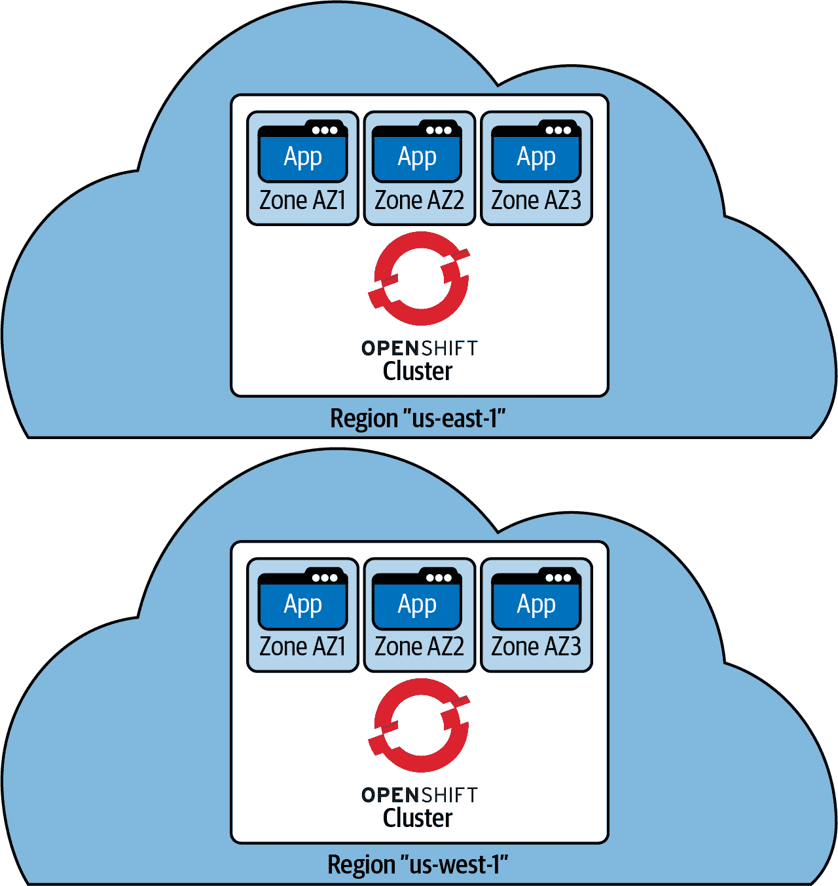

###### 图 6-1\. 集群区域可用性允许多个集群在独立的云区域中运行

在这种架构风格下，每个集群可以容忍任何一个可用性区域的完全丢失（AZ1、AZ2 或 AZ3 可能不可用，但不会超过一个），并且工作负载将继续运行和提供请求。由于两个可用性区域的失败，etcd 集群将失去法定人数，控制平面将变得不可用。

Kubernetes 控制平面在超过一个可用性区域失败时变得无法操作的原因是 etcd 的法定人数要求。通常，etcd 将在控制平面中维护三个副本，每个副本由一个可用性区域支持。如果一个可用性区域丢失，仍然有三个副本中的两个存在，并且分布式写入仍然可以确保写入事务被接受。如果两个可用性区域失败，则写入尝试将被拒绝。在集群中运行在工作节点上的 Pod 可能仍然能够提供流量服务，但不会接受或发生与 Kubernetes API 相关的任何更新。然而，在另一个区域中运行的独立集群仍可以继续响应用户请求。请参见第四章以深入分析此过程的工作原理。

### 根据地理位置减轻用户的延迟

如果您的用户位于不同的位置，使用多个云区域也可以提高用户的响应时间。当用户尝试访问您的应用程序的 Web 用户体验或工作负载提供的 API 时，他们的请求可以被路由到最近可用的应用程序实例。通常，在这些情况下会使用*全局服务器负载均衡器*（GSLB）来有效地路由流量。当用户尝试访问服务时，DNS 查找将被委托给您的 GSLB 托管的名称服务器。然后，根据请求的来源地的启发式，名称服务器将返回最近托管的应用程序实例的 IP 地址。您可以在图 6-2 中看到这一过程的可视表示。

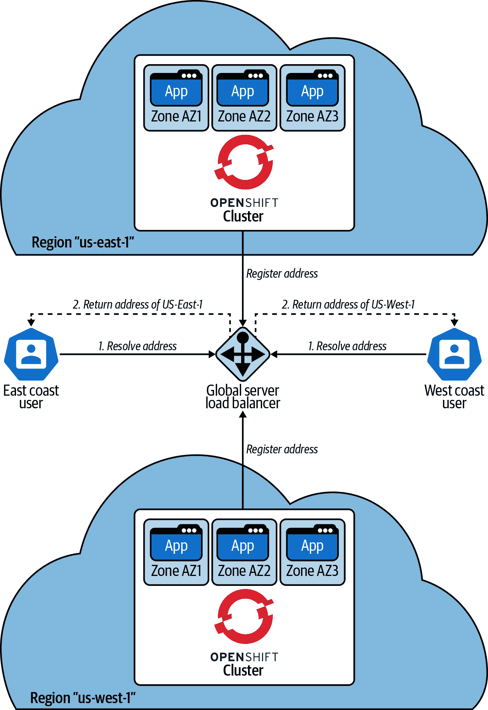

###### 图 6-2\. 使用 GSLB 解析全局服务地址的请求将返回距离请求发起者最近的实例。

### 平台的一致性（托管 Kubernetes 与 OpenShift 加云身份提供商）

OpenShift 容器平台的主要优势之一是它在所有云提供商和基础设施（如 VMware 和裸金属）上部署和运行一致。在考虑是否使用托管 Kubernetes 提供商或 OpenShift 时，请注意 Kubernetes 的每个分发版本都会做出各种架构决策，可能需要更多关注应用程序，以确保跨提供商的可移植性。

# 跨云部署

选择 Kubernetes 策略提供了简化应用程序如何消费弹性云基础设施的有效方式。在某种程度上，解决如何为每个应用程序解决云资源的细节问题，转变为解决一个平台问题，即你的组织如何在基础设施底层采用和管理 Kubernetes。

有几种从社区支持的项目中部署 Kubernetes 的方法。在本节中，我们将重点介绍如何使用 Red Hat OpenShift 容器平台来部署 Kubernetes。然后，我们将讨论如何在你的部署生命周期中，作为替代选择，使用托管 OpenShift 或托管 Kubernetes 服务。

## 用户管理的 OpenShift

当你部署 OpenShift 容器平台 4.x 集群时，有两种选择如何创建基础设施资源。*用户提供的基础设施*（UPI）允许你更多地控制，以便启动虚拟机、网络资源和存储，然后将这些详细信息提供给安装过程，并允许它们引导到运行中的集群。或者，你可以依赖更自动化的*安装程序提供的基础设施*（IPI）方法。使用 IPI，安装程序接受具有创建所需基础设施资源所需权限的云凭据。IPI 过程通常会定义一个*虚拟私有云*（VPC）。请注意，如果你的组织有自己的资源创建和管理约定，你可以将 VPC 指定为输入参数。在 VPC 内部，资源包括网络负载均衡器、对象存储桶、虚拟计算资源、弹性 IP 地址等，都由安装过程创建和管理。

让我们看看如何在 AWS、Microsoft Azure 和 Google Cloud Platform 三个云提供商上部署 OpenShift 集群。在本讨论中，我们将审查安装过程如何利用声明性配置（与 Kubernetes 一般情况下一样），以及这与管理 OpenShift 集群生命周期的 *ClusterVersionOperator*（CVO）的关系。

首先，您需要为适当版本下载 openshift-installer 二进制文件。访问[Red Hat](https://cloud.redhat.com)，创建帐户，并按照创建集群和下载本地使用二进制文件的步骤进行操作。有关可用于安装的选项的具体详细信息，请参阅[产品文档](https://oreil.ly/HerIm)。

让我们通过查看 openshift-installer 二进制文件的一些示例配置文件来演示这种方法的工作原理。 OpenShift 4.x 安装方法的所有支持选项超出了本书的范围。请查看[OpenShift 容器平台文档](https://oreil.ly/wOJ3P)详细参考所有支持的选项。以下示例将突出显示 OpenShift 4.x 安装方法的声明性本质如何简化在多个基础设施上配置集群。此外，将演示`MachineSet` API 的步骤示例，展示操作员在配置集群后继续管理其生命周期和健康状况。

示例 6-1 定义了在 AWS 上配置 OpenShift 集群的一组选项。示例 6-2 定义了如何在 Microsoft Azure 上配置 OpenShift 集群，而示例 6-3 定义了 Google Cloud Platform 的等效配置。示例 6-4—你猜对了！—提供了一个 VMware vSphere 的配置示例。除了 VMware vSphere 示例（更依赖于您自己的环境），您可以使用这些示例以最少的更新来配置自己的集群。请参考 OpenShift Container Platform 产品文档，详细查看安装方法。

##### 示例 6-1\. 一个示例*install-config.yaml*，用于在 AWS 上配置 OpenShift 集群。

```
$ oc get clusterserviceversion
NAME                                  DISPLAY                                      
VERSION   REPLACES   PHASE
advanced-cluster-management.v1.0.0    Advanced Cluster Management for Kubernetes   
1.0.0                Succeeded
container-security-operator.v1.0.5    Container Security                           
1.0.5                Succeeded
etcdoperator.v0.9.4                   etcd                                         
0.9.4                Succeeded
openshift-pipelines-operator.v1.0.1   OpenShift Pipelines Operator                 
1.0.1                Succeeded
```

##### 示例 6-2\. 一个示例*install-config.yaml*，用于在 Microsoft Azure 上配置 OpenShift 集群。

```
$ oc get subscriptions.operators.coreos.com -n openshift-operators
NAME                              PACKAGE                           SOURCE
                CHANNEL
container-security-operator       container-security-operator       community-
operators       alpha
```

##### 示例 6-3\. 一个示例*install-config.yaml*，用于在 Google Cloud Platform 上配置 OpenShift 集群。

```
$ oc get clusteroperators
NAME                                       VERSION   AVAILABLE   PROGRESSING   
DEGRADED   SINCE
authentication                             4.4.3     True        False         
False      48d
cloud-credential                           4.4.3     True        False         
False      48d
cluster-autoscaler                         4.4.3     True        False         
False      48d
console                                    4.4.3     True        False         
False      48d
csi-snapshot-controller                    4.4.3     True        False         
False      48d
dns                                        4.4.3     True        False         
False      48d
etcd                                       4.4.3     True        False         
False      28h
image-registry                             4.4.3     True        False         
False      48d
ingress                                    4.4.3     True        False         
False      48d
insights                                   4.4.3     True        False         
False      48d
kube-apiserver                             4.4.3     True        False         
False      48d
kube-controller-manager                    4.4.3     True        False         
False      48d
kube-scheduler                             4.4.3     True        False         
False      48d
kube-storage-version-migrator              4.4.3     True        False         
False      48d
machine-api                                4.4.3     True        False         
False      48d
machine-config                             4.4.3     True        False         
False      48d
marketplace                                4.4.3     True        False         
False      48d
monitoring                                 4.4.3     True        False         
False      41h
network                                    4.4.3     True        False         
False      48d
node-tuning                                4.4.3     True        False         
False      48d
openshift-apiserver                        4.4.3     True        False         
False      38d
openshift-controller-manager               4.4.3     True        False         
False      48d
openshift-samples                          4.4.3     True        False         
False      48d
operator-lifecycle-manager                 4.4.3     True        False         
False      48d
operator-lifecycle-manager-catalog         4.4.3     True        False         
False      48d
operator-lifecycle-manager-packageserver   4.4.3     True        False         
False      28h
service-ca                                 4.4.3     True        False         
False      48d
service-catalog-apiserver                  4.4.3     True        False         
False      48d
service-catalog-controller-manager         4.4.3     True        False         
False      48d
storage                                    4.4.3     True        False         
False      48d
```

##### 示例 6-4\. 一个示例*install-config.yaml*，用于在 VMware vSphere 上配置 OpenShift 集群。

```
apiVersion: config.openshift.io/v1
kind: OAuth
metadata:
 name: cluster
spec:
 identityProviders: []
 tokenConfig:
   accessTokenMaxAgeSeconds: 86400
```

这些*install-config.yaml*文件中的任何一个都可以使用以下命令来配置您的集群：

```
$ htpasswd -c -b -B .htpasswd username password
```

注意，每个示例都共享一些相同的选项，特别是`clusterName`和`baseDomain`，这些选项将用于派生集群的默认网络地址（应用程序将默认托管在`https://*.apps.clusterName.baseDomain`，OpenShift 的 API 端点将在`https://api.clusterName.baseDomain:6443`可用）。当 openshift-installer 运行时，云提供商的 DNS 条目（例如 AWS 的 Route 53）将被创建并链接到由安装过程创建的适当网络负载均衡器，后者又解析为 VPC 内运行的 IP 地址。

每个示例定义了与将要创建和管理的 `MachineSet` 相对应的 `controlPlane` 和 `compute` 部分。我们将讨论这些与集群内运算符的关系。在 `compute` 部分可以指定一个以上的 `MachinePool`。`controlPlane` 和 `compute` 部分提供了计算主机的可配置性，并可以自定义使用哪些可用区。如果省略，将选择合理的默认设置，包括每个主机的类型（或大小）以及与主机连接的存储选项。

现在，如果我们比较每个基础设施在 *install-config.yaml* 属性上的不同之处，我们会发现在 `platform` 部分中有特定于云的选项。全局的 `platform` 指定了集群应创建在哪个区域，同时在每个 `controlPlane` 和 `compute` 部分下也有 `platform` 部分，用于覆盖每个预配主机的设置。

如 第五章 中介绍的，[Open Cluster Management](https://oreil.ly/D1UvC) 项目是管理大多数集群维护者面临的多集群挑战的新方法。第五章 讨论了如何轻松地在多个集群之间分发应用程序。现在让我们看看如何使用 Open Cluster Management 驱动集群预配、升级和退役过程。

在下面的示例中，我们将演示如何在云提供商上创建一个新的集群。其底层行为利用了我们刚刚讨论过的 openshift-install 进程。一旦预配完成，Open Cluster Management 框架将安装一个代理作为新集群上一组 Pod 运行。我们将这个代理称为 `klusterlet`，模仿运行在 Kubernetes 集群节点上的 `kubelet` 进程的命名。

###### 注意

以下假设用户已经按 第五章 中描述的设置好了 Open Cluster Management 项目或 RHACM for Kubernetes。

从 RHACM for Kubernetes 的 Web 控制台，打开“自动化基础设施 > 集群”页面，并点击“创建集群”操作，如 图 6-3 所示。

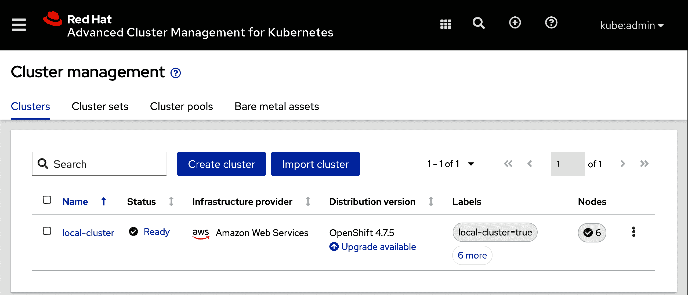

###### 图 6-3\. 集群概览页面允许您从控制台预配新集群

打开 图 6-4 中显示的“创建集群”操作，进入一个表单，您需要提供一个名称并选择可用的云提供商。

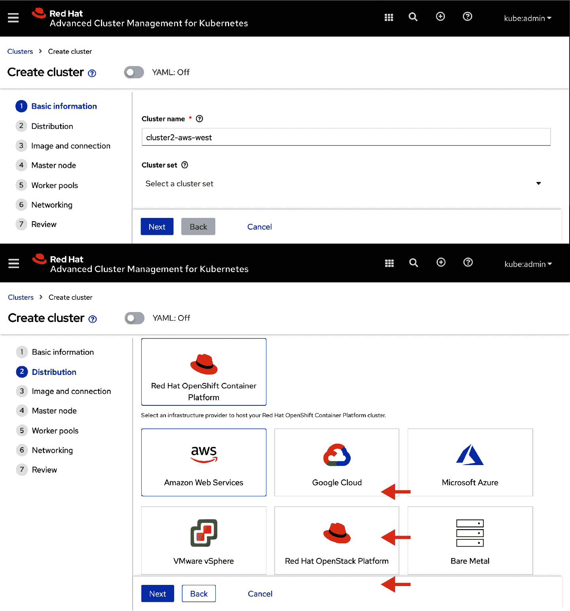

###### 图 6-4\. 通过 RHACM for Kubernetes 的集群创建表单

接下来，选择要预配的 OpenShift 版本。可用列表直接映射到 Hub 集群上的 `ClusterImageSet`，您可以使用以下命令检查这些镜像：

```
$ oc create secret generic htpass-secret --from-file=htpasswd=.htpasswd -n 
openshift-config
```

页面下方如图 6-5 所示，您还需要指定提供者连接。在 AWS 的情况下，您需要提供访问 ID 和密钥，以允许安装过程通过您的 AWS 账户访问 API。

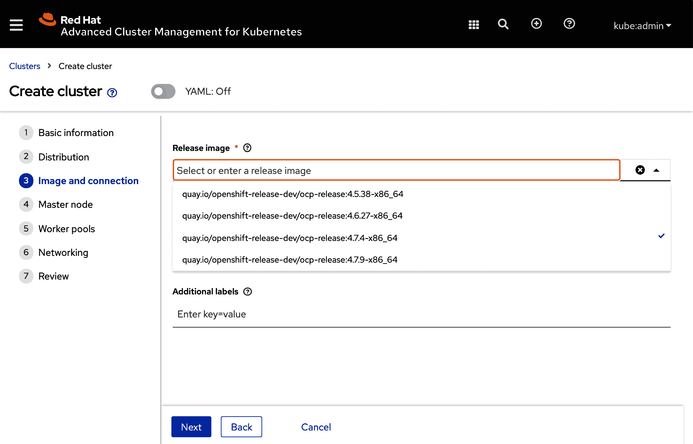

###### 图 6-5\. 选择您的发布镜像（要预配的版本）和提供者连接

此时，您可以简单地点击“创建”，即可开始集群的预配过程。然而，让我们来看一下 `MachinePool` 操作员如何允许您在集群内管理 `MachineSet`。

自定义“Worker pool1” `NodePool`，以符合您期望的区域和可用性区域。参见 图 6-6 和 图 6-7，了解此表单中的示例。在集群预配后，您也可以修改这些选项。

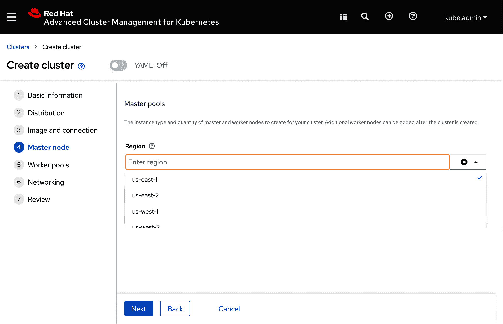

###### 图 6-6\. 自定义集群工作节点的区域和区域可用性区域

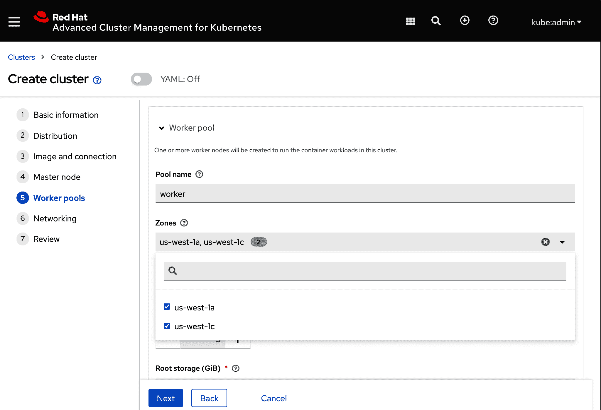

###### 图 6-7\. 自定义区域内的可用性区域，以便托管工作节点

为了审查确认的选择，您可以查看在 图 6-8 中呈现的最终摘要。

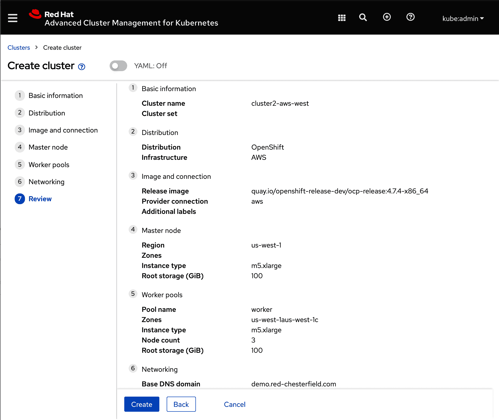

###### 图 6-8\. 确认在表单中选择的选项

完成最终的自定义后，点击“创建”即可开始预配过程，如 图 6-9 所示。Web 控制台提供的视图包括指向集群预配日志的链接。如果集群无法预配（例如，由于云账户中的配额限制），预配日志将提供故障排除的线索。

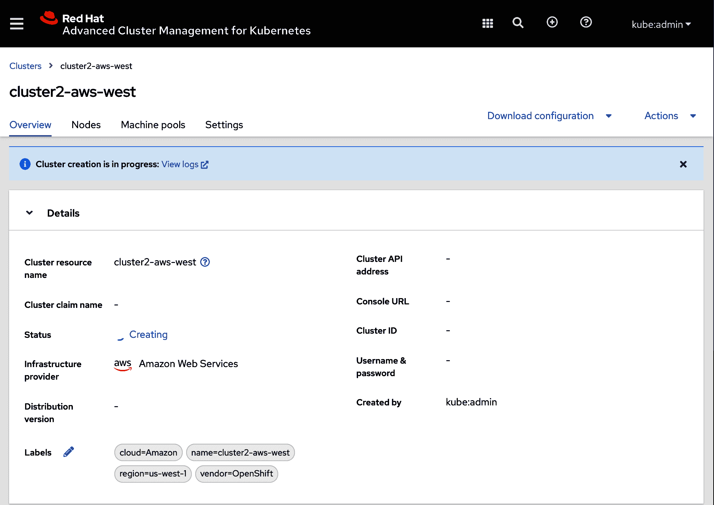

###### 图 6-9\. RHACM Web 控制台视图，包括集群预配日志的链接

在表单编辑器后面，会创建多个 Kubernetes API 对象。其中少量的 API 对象是集群范围的（特别是 `ManagedCluster`）。`ManagedCluster` 控制器将确保存在映射到集群名称的项目（命名空间）。其他控制器，包括启动预配过程的控制器，将使用 `cluster` 项目（命名空间）存储提供用于预配的 API 控制表面的资源。让我们看一下您应该熟悉的这些对象的子集。

### ManagedCluster

`ManagedCluster`（API 组：cluster.open-cluster-management.io/v1；集群范围）识别远程集群在中心集群控制下。在远程集群上运行的代理将尝试创建 `ManagedCluster`，如果在中心集群上不存在，则必须由具有适当权限的用户身份接受。您可以在 示例 6-5 中看到创建的示例。请注意，此对象的标签将在本章后期的位置决策中起作用。

##### 示例 6-5\. `ManagedCluster` API 对象示例

```
apiVersion: config.openshift.io/v1
kind: OAuth
metadata:
 name: cluster
spec:
 identityProviders:
 - htpasswd:
     fileData:
       name: htpass-secret
   mappingMethod: claim
   name: htpasswdidp
   type: htpasswd
 tokenConfig:
   accessTokenMaxAgeSeconds: 86400
```

### ClusterDeployment

`ClusterDeployment`（API 组：hive.openshift.io/v1；命名空间范围）控制集群的配置和销毁阶段。中心上的控制器负责代表您运行 openshift-installer。如果由于任何原因（例如，在您的云帐户中遇到配额限制），集群创建过程失败，那么将销毁云资源，并在等待一段时间后尝试重新创建集群。与“仅尝试一次”且失败后需要用户干预的传统自动化方法不同，此 API 种类的 Kubernetes 协调循环将继续尝试创建集群（在之间适当的等待期之后），如示例 6-6 所示。您还可以像任何 Kubernetes 本机资源一样直接通过 `oc` 或 `kubectl` 创建这些资源。

##### 示例 6-6\. 通过表单创建的 `ClusterDeployment` 示例

```
apiVersion: policy.open-cluster-management.io/v1
kind: Policy
metadata:
 name: policy-project-frontend-app-prod
 namespace: open-cluster-management-policies
 annotations:
   policy.open-cluster-management.io/standards: NIST-CSF
   policy.open-cluster-management.io/categories: PR.IP Information Protection 
Processes and Procedures
   policy.open-cluster-management.io/controls: PR.IP-1 Baseline configuration
spec:
 disabled: false
 remediationAction: enforce
 policy-templates:
 - objectDefinition:
     apiVersion: policy.open-cluster-management.io/v1
     kind: ConfigurationPolicy
     metadata:
       name: policy-project-frontend-app-prod
     spec:
       namespaceSelector:
         exclude:
         - kube-*
         include:
         - default
         - frontend-app-prod
       object-templates:
       - complianceType: musthave
         objectDefinition:
           apiVersion: project.openshift.io/v1
           kind: Project
           metadata:
             name: frontend-app-prod
         status:
           Validity: {}
       - complianceType: musthave
         objectDefinition:
           apiVersion: v1
           kind: LimitRange
           metadata:
             name: mem-limit-range
             namespace: frontend-app-prod
           spec:
             limits:
               - default:
                   memory: 512Mi
                 defaultRequest:
                   memory: 256Mi
                 type: Container
---
apiVersion: policy.open-cluster-management.io/v1
kind: PlacementBinding
metadata:
 name: binding-policy-project-frontend-app-prod
 namespace: open-cluster-management-policies
placementRef:
 name: production-clusters
 kind: PlacementRule
 apiGroup: apps.open-cluster-management.io
subjects:
- name: policy-project-frontend-app-prod
 kind: Policy
 apiGroup: policy.open-cluster-management.io
---
apiVersion: apps.open-cluster-management.io/v1
kind: PlacementRule
metadata:
 name: placement-policy-project-frontend-app-prod
 namespace: open-cluster-management-policies
spec:
 clusterConditions:
 - status: "True"
   type: ManagedClusterConditionAvailable
 clusterSelector:
   matchExpressions: []
```

### KlusterletAddonConfig

`KlusterletAddonConfig`（API 组：agent.open-cluster-management.io/v1；命名空间范围）表示应在管理集群的远程代理上提供的功能。在示例 6-7 中，Open Cluster Management 项目将远程代理称为 `klusterlet`，反映了 `kubelet` 的语言。

##### 示例 6-7\. `KlusterletAddonConfig` API 对象示例

```
policy.open-cluster-management.io/standards: NIST-CSF
   policy.open-cluster-management.io/categories: PR.IP Information Protection 
Processes and Procedures
   policy.open-cluster-management.io/controls: PR.IP-1 Baseline configuration
```

### MachinePool

`MachinePool`（API 组：hive.openshift.io/v1；命名空间范围）允许您创建一组共同工作并共享特征的主机。您可以使用 `MachinePool` 将支持特定团队或业务线的计算能力集中在一起。正如我们将在下一节中看到的那样，`MachinePool` 还允许您动态调整集群的大小。最后，状态提供了对 `ManagedCluster` 上可用的 `MachineSet` 的视图。有关之前创建的示例 `MachinePool` 的控制界面以及有关远程集群管理下的 `MachineSet` 的状态，请参见示例 6-8。

##### 示例 6-8\. `MachinePool` API 对象示例

```
object-templates:
       - complianceType: musthave
         objectDefinition:
           apiVersion: project.openshift.io/v1
           kind: Project
           metadata:
             name: frontend-app-prod
         status:
           Validity: {}
```

一旦配置完成，可以从集群详细信息页面获取 Kubernetes API 服务器和 OpenShift Web 控制台的地址。您可以使用这些坐标打开 Web 浏览器，并作为 kubeadmin 用户进行认证与新集群通信。您还可以访问 `KUBECONFIG` 证书，以便通过命令行访问集群。

您可以从 RHACM Web 控制台的群集概览页面下载新群集的`KUBECONFIG`授权，如图 6-10 所示，或通过命令行访问。从 Web 控制台，单击群集名称以查看该群集的概述。一旦完成配置过程，您将能够下载`KUBECONFIG`文件，从而可以通过命令行访问群集。

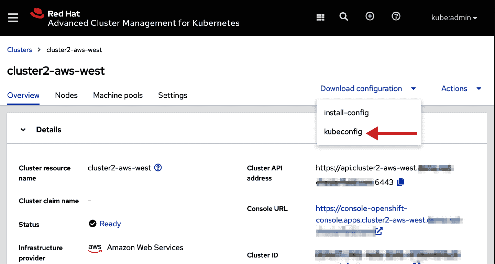

###### 图 6-10\. 从 RHACM Web 控制台下载 kubeconfig 授权

从命令行，您可以像在示例 6-9 中那样检索存储在群集项目（命名空间）下的秘密信息。保存文件内容并配置您的`KUBECONFIG`环境变量以指向文件的位置。然后`oc`将能够对远程群集运行命令。

##### 示例 6-9\. 群集`KUBECONFIG`文件的输出

```
matchLabels:
    apps/pacman: deployed
  matchExpressions:
    - {key: region, operator: In, values: [us-east, us-west]}
    - {key: env, operator: NotIn, values: [development]}
    - {key: authenticationProfile, operator: Exists}
```

现在我们的群集已经启动运行，让我们从 oc CLI 的上下文中讨论如何扩展群集。我们将从以下示例中审视这个概念。

首先，打开两个终端，并为每个中心群集和我们新建的`mycluster`配置`KUBECONFIG`或上下文。查看示例 6-10 和 6-11 来了解运行这些命令后两个独立终端的外观示例。请注意，临时覆盖您的 PS1 shell 提示以避免在每个群集上运行命令时混淆。

##### 示例 6-10\. 终端 1 的外观示例

```
apiVersion: policy.open-cluster-management.io/v1
kind: Policy
metadata:
 name: policy-etcdencryption
 annotations:
   policy.open-cluster-management.io/standards: NIST SP 800-53
   policy.open-cluster-management.io/categories: CM Configuration Management
   policy.open-cluster-management.io/controls: CM-2 Baseline Configuration
spec:
 remediationAction: enforce
 disabled: false
 policy-templates:
   - objectDefinition:
       apiVersion: policy.open-cluster-management.io/v1
       kind: ConfigurationPolicy
       metadata:
         name: enable-etcd-encryption
       spec:
         severity: high
         namespaceSelector:
           exclude:
             - kube-*
           include:
             - default
         object-templates:
           - complianceType: musthave
             objectDefinition:
               apiVersion: config.openshift.io/v1
               kind: APIServer
               metadata:
                 name: cluster
               spec:
                 encryption:
                   type: aescbc
---
apiVersion: policy.open-cluster-management.io/v1
kind: PlacementBinding
metadata:
 name: binding-policy-etcdencryption
placementRef:
 name: placement-policy-etcdencryption
 kind: PlacementRule
 apiGroup: apps.open-cluster-management.io
subjects:
- name: policy-etcdencryption
 kind: Policy
 apiGroup: policy.open-cluster-management.io
---
apiVersion: apps.open-cluster-management.io/v1
kind: PlacementRule
metadata:
 name: placement-policy-etcdencryption
spec:
 clusterConditions:
 - status: "True"
   type: ManagedClusterConditionAvailable
 clusterSelector:
   matchExpressions:
     - {key: environment, operator: In, values: ["dev", “prod”]}
```

##### 示例 6-11\. 终端 2 的外观示例

```
$ oc get openshiftapiserver \
  -o=jsonpath='{range.items[0].status.conditions[?(@.type=="Encrypted")]}
  {.reason}{"\n"}{.message}{"\n"}'

EncryptionInProgress
Resource routes.route.openshift.io is not encrypted
…

$ oc get openshiftapiserver \
  -o=jsonpath='{range.items[0].status.conditions[?(@.type=="Encrypted")]}
  {.reason}{"\n"}{.message}{"\n"}'

EncryptionInProgress
Resource routes.route.openshift.io is being encrypted
…
$ oc get openshiftapiserver \
  -o=jsonpath='{range.items[0].status.conditions[?(@.type=="Encrypted")]}
  {.reason}{"\n"}{.message}{"\n"}'

EncryptionCompleted
All resources encrypted: routes.route.openshift.io, 
oauthaccesstokens.oauth.openshift.io, oauthauthorizetokens.oauth.openshift.io
```

现在您应该有一个包含`hubcluster`的终端 1 和一个包含`mycluster`的终端 2。我们将在后续示例中使用适当的名称引用这些终端。

在接下来的步骤中，我们将审视`MachineSet` API，这是 OpenShift 群集了解计算能力的基础。然后，我们将使用我们之前看到的`MachinePool` API 来扩展我们管理的群集的大小。

在`mycluster`终端中，查看您的群集的`MachineSet`：

```
apiVersion: policy.open-cluster-management.io/v1
kind: Policy
metadata:
 name: policy-role-developer
 annotations:
   policy.open-cluster-management.io/standards: NIST SP 800-53
   policy.open-cluster-management.io/categories: AC Access Control
   policy.open-cluster-management.io/controls: AC-3 Access Enforcement
spec:
 remediationAction: enforce
 disabled: false
 policy-templates:
   - objectDefinition:
       apiVersion: policy.open-cluster-management.io/v1
       kind: ConfigurationPolicy
       metadata:
         name: policy-role-developer
       spec:
         remediationAction: enforce 
          severity: high
         namespaceSelector:
           exclude: ["kube-*"]
           include: ["default"]
         object-templates:
           - complianceType: mustonlyhave # role definition should exact match
             objectDefinition:
               apiVersion: rbac.authorization.k8s.io/v1
               kind: ClusterRole
               metadata:
                 name: developer-read
               rules:
                 - apiGroups: ["*"]
                   resources: ["deployments", "configmaps", "services", "secrets"]
                   verbs: ["get", "list", "watch"]
           - complianceType: mustonlyhave # role definition should exact match
             objectDefinition:
               apiVersion: rbac.authorization.k8s.io/v1
               kind: ClusterRole
               metadata:
                 name: developer-write
               rules:
                 - apiGroups: ["*"]
                   resources: ["deployments", "configmaps", "services", "secrets"]
                   verbs: ["create", "delete", "patch", "update"]
---
apiVersion: policy.open-cluster-management.io/v1
kind: PlacementBinding
metadata:
 name: binding-policy-role-developer
placementRef:
 name: placement-policy-role-developer
 kind: PlacementRule
 apiGroup: apps.open-cluster-management.io
subjects:
- name: policy-role-developer
 kind: Policy
 apiGroup: policy.open-cluster-management.io
---
apiVersion: apps.open-cluster-management.io/v1
kind: PlacementRule
metadata:
 name: placement-policy-role-developer
spec:
 clusterConditions:
 - status: "True"
   type: ManagedClusterConditionAvailable
 clusterSelector:
   matchExpressions:
     - {key: environment, operator: In, values: ["dev"]}
```

每个`MachineSet`将按照以下模式命名：`<clusterName>-<five-character identifier>-<machinePoolName>-<availabilityZone>`。在您的集群中，您应该看到每个`MachineSet`的期望机器数量、当前可用的机器数量以及准备作为节点集成到 OpenShift 集群中的当前数量。请注意，这三个计数通常应该相等，只有在集群处于过渡状态（添加或删除机器）或者当集群中的底层可用性问题导致一个或多个机器被视为不健康时才会有所不同。例如，当您编辑`MachineSet`以增加所需副本时，您将看到该`MachineSet`的`Desired`计数增加一个。当机器被配置和启动`kubelet`并注册到 Kubernetes API 控制平面并将节点标记为`Ready`时，`Current`计数将增加一个。最后，如果机器变得不健康，`Ready`计数可能会减少。类似地，如果将`Desired`计数减少一个，则会看到与机器通过各种生命周期状态直到移除的减少计数相同的错位减少。

接下来，在中心终端中查看为托管集群定义的`worker MachinePool`：

```
apiVersion: policy.open-cluster-management.io/v1
kind: Policy
metadata:
 name: policy-role-developer-binding
 annotations:
   policy.open-cluster-management.io/standards: NIST SP 800-53
   policy.open-cluster-management.io/categories: AC Access Control
   policy.open-cluster-management.io/controls: AC-3 Access Enforcement
spec:
 remediationAction: enforce
 disabled: false
 policy-templates:
   - objectDefinition:
       apiVersion: policy.open-cluster-management.io/v1
       kind: ConfigurationPolicy
       metadata:
         name: policy-role-developer-binding
       spec:
         remediationAction: enforce 
         severity: high
         namespaceSelector:
           exclude: ["kube-*"]
           include: ["default"]
         object-templates:
           - complianceType: mustonlyhave # role definition should exact match
             objectDefinition:
               apiVersion: rbac.authorization.k8s.io/v1
               kind: RoleBinding
               metadata:
                 name: role-developer-read-binding
                 namespace: game-app
               roleRef:
                 apiGroup: rbac.authorization.k8s.io
                 kind: ClusterRole
                 name: developer-read
               subjects:
               - apiGroup: rbac.authorization.k8s.io
                 kind: Group
                 name: "game-developers"
           - complianceType: mustonlyhave # role definition should exact match
             objectDefinition:
               apiVersion: rbac.authorization.k8s.io/v1
               kind: RoleBinding
               metadata:
                 name: role-developer-read-binding
                 namespace: game-app
               roleRef:
                 apiGroup: rbac.authorization.k8s.io
                 kind: ClusterRole
                 name: developer-write
               subjects:
               - apiGroup: rbac.authorization.k8s.io
                 kind: Group
                 name: "game-developers"
---
apiVersion: policy.open-cluster-management.io/v1
kind: PlacementBinding
metadata:
 name: binding-policy-role-developer-binding
placementRef:
 name: placement-policy-role-developer-binding
 kind: PlacementRule
 apiGroup: apps.open-cluster-management.io
subjects:
- name: policy-role-developer-binding
 kind: Policy
 apiGroup: policy.open-cluster-management.io
---
apiVersion: apps.open-cluster-management.io/v1
kind: PlacementRule
metadata:
 name: placement-policy-role-developer-binding
spec:
 clusterConditions:
 - status: "True"
   type: ManagedClusterConditionAvailable
 clusterSelector:
   matchExpressions:
     - {key: environment, operator: In, values: ["dev"]}
```

我们将增加托管集群`mycluster`的大小一个节点：

```
apiVersion: policy.open-cluster-management.io/v1
kind: Policy
metadata:
 name: policy-htpasswd-auth-provider
 namespace: open-cluster-management-policies
 annotations:
   policy.open-cluster-management.io/standards: NIST-CSF
   policy.open-cluster-management.io/categories: PR.IP Information Protection 
Processes and Procedures
   policy.open-cluster-management.io/controls: PR.IP-1 Baseline configuration
spec:
 complianceType: mustonlyhave
 remediationAction: enforce
 disabled: false
 policy-templates:
 - objectDefinition:
     apiVersion: policy.open-cluster-management.io/v1
     kind: ConfigurationPolicy
     metadata:
       name: policy-htpasswd-auth-provider
     spec:
       object-templates:
       - complianceType: mustonlyhave
         objectDefinition:
           apiVersion: config.openshift.io/v1
           kind: OAuth
           metadata:
             name: cluster
           spec:
             identityProviders:
             - htpasswd:
                 fileData:
                   name: htpass-secret
               mappingMethod: claim
               name: htpasswdidp
               type: htpasswd
             tokenConfig:
               accessTokenMaxAgeSeconds: 7776000
       - complianceType: mustonlyhave
         objectDefinition:
           apiVersion: v1
           data:
             htpasswd: ""
           kind: Secret
           metadata:
             name: htpass-secret
             namespace: openshift-config
           type: Opaque
       # - complianceType: musthave
       #   objectDefinition:
       #     kind: Identity
       #     apiVersion: user.openshift.io/v1
       #     metadata:
       #       name: 'htpassidp:johndoe'
       #     providerName: htpassidp
       #     providerUserName: johndoe
       #     user:
       #       name: johndoe
       #       uid: e4d768dd-a6b5-489c-8900-2c18a160d76f
---
apiVersion: policy.open-cluster-management.io/v1
kind: PlacementBinding
metadata:
 name: binding-policy-htpasswd-auth-provider
 namespace: open-cluster-management-policies
placementRef:
 name: placement-policy-oauth-provider
 kind: PlacementRule
 apiGroup: apps.open-cluster-management.io
subjects:
- name: policy-htpasswd-auth-provider
 kind: Policy
 apiGroup: policy.open-cluster-management.io
---
apiVersion: apps.open-cluster-management.io/v1
kind: PlacementRule
metadata:
 name: placement-policy-oauth-provider
 namespace: open-cluster-management-policies
spec:
 clusterConditions:
 - status: "True"
   type: ManagedClusterConditionAvailable
 clusterSelector:
   matchExpressions:
   - key: authenticationProfile
     operator: In
     values:
     - htpasswd
   matchLabels: {}
```

工作节点的大小将由`MachinePool mycluster-worker`中设置的值确定。新节点的可用区将由`MachinePool`控制器确定，其中节点尽可能均匀地分布在可用区。

在您修补了`MachinePool`以增加所需副本数量后，请重新运行命令以查看托管集群上的`MachineSet`：

```
$ touch htpasswd.txt
htpasswd -b -B htpasswd.txt username password
```

几分钟后，您应该会看到托管集群上的新节点从`Desired`到`Current`再到`Ready`的过渡，最终结果看起来如下输出：

```
# Upgrade Policy to select known desired version from public connected registry
apiVersion: policy.open-cluster-management.io/v1
kind: Policy
metadata:
 annotations:
   policy.open-cluster-management.io/categories: CM Configuration Management
   policy.open-cluster-management.io/controls: CM-2 Baseline Configuration
   policy.open-cluster-management.io/standards: NIST SP 800-53
 name: upgrade-cluster
 namespace: upgrade-policies
spec:
 disabled: false
 policy-templates:
 - objectDefinition:
     apiVersion: policy.open-cluster-management.io/v1
     kind: ConfigurationPolicy
     metadata:
       name: upgrade-cluster
     spec:
       namespaceSelector:
         exclude:
         - kube-*
         include:
         - '*'
       object-templates:
       - complianceType: musthave
         objectDefinition:
           apiVersion: config.openshift.io/v1
           kind: ClusterVersion
           metadata:
             name: version
           spec:
             desiredUpdate:
               force: false
               image: ""
               version: 4.5.9
       remediationAction: enforce
       severity: high
 remediationAction: enforce
status: 
 # Note that the associated PlacementRules are omitted for this example
 placement:
 - placementBinding: binding-upgrade-cluster
   placementRule: placement-upgrade-cluster
 status:
 - clustername: east1
   clusternamespace: east1
   compliant: Compliant
```

让我们回顾一下刚才看到的内容。首先，我们使用声明性方法（*install-config.yaml*）来配置我们的第一个集群，称为中心集群。接下来，我们使用中心集群来为我们的舰队中的第一个托管集群进行配置。该托管集群是在幕后使用相同的 IPI 方法创建的，但借助于 Kubernetes API 和持续协调器来确保运行中的集群与`Desired`状态匹配。管理`Desired`状态的 API 之一是中心集群上的`MachinePool` API。因为我们的第一个舰队成员`mycluster`是从中心集群创建的，所以我们可以使用`MachinePool API`来管理`mycluster`如何添加或移除节点。或者，我们可以创建额外的`MachinePool`来增加集群的容量。

在整个过程中，底层基础设施基板完全通过操作符进行管理。在管理的集群上，`MachineSet`操作符通过来自中心的`MachinePool`操作符的更新指令，以增加支持`mycluster`中一个`MachineSet`中的机器数量。

###### 注意

我们将使用术语*基础设施基板*作为一个统称术语，用来指代由您的数据中心提供的裸金属虚拟化或公共云提供商提供的虚拟化中的计算、网络和存储资源。

## 将您的集群升级到最新的 Kubernetes 版本

就像我们在`MachinePool`和`MachineSet`中看到的那样，运算符提供了一种强大的抽象方式，可以在基础设施基板之间隐藏差异，允许管理员声明性地指定期望的结果。OpenShift 集群由 CVO 管理，其作为“操作符的操作符”模式来管理集群配置的每个维度的操作符（包括认证、网络、机器创建、引导和移除等）。每个集群都将有一个名为`version`的`ClusterVersion` API 对象。您可以使用以下命令检索此对象的详细信息：

```
apiVersion: config.openshift.io/v1
kind: ClusterVersion
metadata:
  name: version
spec:
  desiredUpdate:
    force: false
    image: ""
    version: 4.5.9
```

`ClusterVersion`指定了一个“通道”，以寻找集群可用版本以及从该通道获取的期望版本。将通道视为可用版本的持续列表（例如，4.5.1、4.5.2、4.5.7 等）。有用于“快速”采用新版本的通道，以及“稳定”版本的通道。快速通道快速产生新版本。结合来自运行在不同基础设施基板和行业的 OpenShift 集群的广泛数据的连接遥测数据，快速通道允许非常快速地交付和验证新版本（以周或天为单位）。由于快速通道中的发布具有足够的支持证据，可以广泛接受全球 OpenShift 集群，因此版本被提升到稳定通道。因此，通道内版本列表并不总是连续的。示例`ClusterVersion` API 对象在示例 6-12 中表示。

##### 示例 6-12. 记录集群版本历史和期望版本的示例`ClusterVersion` API 对象-更改期望版本将导致操作符开始应用更新以实现目标

```
# Configure the OpenShift Update Service (OSUS) also known informally as 
"Cincinnati".
apiVersion: policy.open-cluster-management.io/v1
kind: Policy
metadata:
 annotations:
   policy.open-cluster-management.io/categories: PR.IP Information Protection 
Processes
     and Procedures
   policy.open-cluster-management.io/controls: PR.IP-1 Baseline Configuration
   policy.open-cluster-management.io/standards: NIST-CSF
 name: policy-cincinatti-operator
 namespace: upgrade-policies
spec:
 disabled: false
 policy-templates:
 - objectDefinition:
     apiVersion: policy.open-cluster-management.io/v1
     kind: ConfigurationPolicy
     metadata:
       name: cincinatti-policy-prod
     spec:
       namespaceSelector:
         exclude:
         - kube-*
         include:
         - default
       object-templates:
         apiVersion: cincinnati.openshift.io/v1beta1
         kind: Cincinnati
         metadata:
           name: example-cincinnati
         spec:
           registry: quay.io
           replicas: 1
           repository: openshift-release-dev/ocp-release
       remediationAction: inform
       severity: low
 - objectDefinition:
     apiVersion: policy.open-cluster-management.io/v1
     kind: ConfigurationPolicy
     metadata:
       name: cincinatti-policy-subscription
     spec:
       namespaceSelector:
         exclude:
         - kube-*
         include:
         - default
       object-templates:
       - complianceType: musthave
         objectDefinition:
           apiVersion: operators.coreos.com/v1alpha1
           kind: Subscription
           metadata:
             name: cincinnati-subscription
             namespace: cincinnati-operator
           spec:
             channel: alpha
             installPlanApproval: Automatic
             name: cincinnati-operator
             source: redhat-operators
             sourceNamespace: openshift-marketplace
       remediationAction: inform
       severity: low
 - objectDefinition:
     apiVersion: policy.open-cluster-management.io/v1
     kind: ConfigurationPolicy
     metadata:
       name: cincinatti-policy-operatorgroup
     spec:
       namespaceSelector:
         exclude:
         - kube-*
         include:
         - default
       object-templates:
       - complianceType: musthave
         objectDefinition:
           apiVersion: operators.coreos.com/v1
           kind: OperatorGroup
           metadata:
             name: cincinnati-operatorgroup
             namespace: cincinnati-operator
           spec:
             targetNamespaces:
             - cincinnati-operator
       remediationAction: inform
       severity: low
 remediationAction: enforce
status:
 placement:
 - placementBinding: binding-policy-cincinatti-operator
   placementRule: placement-policy-cincinatti-operator
---
apiVersion: policy.open-cluster-management.io/v1
kind: Policy
metadata:
 annotations:
   policy.open-cluster-management.io/categories: 
     PR.IP Information Protection 
Processes
     and Procedures
   policy.open-cluster-management.io/controls: PR.IP-1 Baseline Configuration
   policy.open-cluster-management.io/standards: NIST-CSF
 name: policy-config-imageconfig
 namespace: upgrade-policies
spec:
 disabled: false
 policy-templates:
 - objectDefinition:
     apiVersion: policy.open-cluster-management.io/v1
     kind: ConfigurationPolicy
     metadata:
       name: policy-config-imageconfig-prod
     spec:
       namespaceSelector:
         exclude:
         - kube-*
         include:
         - default
       object-templates:
       - complianceType: musthave
         objectDefinition:
           apiVersion: config.openshift.io/v1
           kind: Image
           metadata:
             name: cluster
           spec:
             additionalTrustedCA:
               name: trusted-ca
       remediationAction: inform
       severity: low
 remediationAction: enforce
status:
 placement:
 - placementBinding: binding-policy-config-imageconfig
   placementRule: placement-policy-config-imageconfig
---
apiVersion: policy.open-cluster-management.io/v1
kind: Policy
metadata:
 annotations:
   policy.open-cluster-management.io/categories: PR.IP Information Protection 
Processes
     and Procedures
   policy.open-cluster-management.io/controls: PR.IP-1 Baseline Configuration
   policy.open-cluster-management.io/standards: NIST-CSF
 name: policy-configmap-ca
 namespace: upgrade-policies
spec:
 disabled: false
 policy-templates:
 - objectDefinition:
     apiVersion: policy.open-cluster-management.io/v1
     kind: ConfigurationPolicy
     metadata:
       name: configmapca
     spec:
       namespaceSelector:
         exclude:
         - kube-*
         include:
         - default
       object-templates:
       - complianceType: musthave
         objectDefinition:
           apiVersion: v1
           data:
             cincinnati-registry: |-
               -----BEGIN CERTIFICATE-----
               YOUR_DISCONNECTED_REGISTRY_CERTIFICATE
               -----END CERTIFICATE-----
           kind: ConfigMap
           metadata:
             name: trusted-ca
             namespace: openshift-config
       remediationAction: inform
       severity: low
 remediationAction: enforce
status:
 placement:
 - placementBinding: binding-policy-configmap-ca
   placementRule: placement-policy-configmap-ca
---
apiVersion: policy.open-cluster-management.io/v1
kind: Policy
metadata:
 annotations:
   policy.open-cluster-management.io/categories: PR.IP Information Protection 
Processes
     and Procedures
   policy.open-cluster-management.io/controls: PR.IP-1 Baseline Configuration
   policy.open-cluster-management.io/standards: NIST-CSF
 name: policy-namespace-operatorgroup
 namespace: upgrade-policies
spec:
 disabled: false
 policy-templates:
 - objectDefinition:
     apiVersion: policy.open-cluster-management.io/v1
     kind: ConfigurationPolicy
     metadata:
       name: policy-namespace-operatorgroup-prod
     spec:
       namespaceSelector:
         exclude:
         - kube-*
         include:
         - default
       object-templates:
       - complianceType: musthave
         objectDefinition:
           apiVersion: v1
           kind: Namespace
           metadata:
             name: cincinnati-operator
       remediationAction: inform
       severity: low
 remediationAction: enforce
status:
 placement:
 - placementBinding: binding-policy-namespace-operatorgroup
   placementRule: placement-policy-namespace-operatorgroup
# END Policies for cincinnati-operator
```

升级 Kubernetes 版本以及其周围的所有其他支持 API 和基础设施可能是一项艰巨的任务。负责所有容器映像生命周期的操作符通常称为[“Cincinnati”](https://oreil.ly/6HIZd)，正式称为*OpenShift 更新服务*（OSUS）。 OSUS（或 Cincinnati）维护版本的连接图，并跟踪在图中已知的良好升级路径。例如，可能在早期发布通道中检测到问题，表明从 4.4.23 升级到 4.5.0 到 4.5.18 可能与特定问题相关。可以发布修复程序以创建新版本 4.4.24，然后允许成功和可预测地从 4.4.23 升级到 4.4.24 到 4.5.0 到 4.5.18。图记录必须走过的连续节点，以确保成功。

然而，OSUS 运算符消除了猜测工作，允许集群管理员从通道中指定所需的版本。从那里，CVO 将执行以下任务：²

1.  升级 Kubernetes 和 OpenShift 控制平面 Pod，包括 etcd。

1.  升级运行控制平面 Pod 的节点操作系统。

1.  升级控制认证、网络、存储等方面的集群运算符。

1.  对于由`MachineConfigOperator`管理的节点，需要升级运行数据平面 Pod（用户工作负载）的操作系统。

升级以滚动方式进行，避免集群规模暴增或同时削减太多容量。由于控制平面分布在三台机器上，每台机器进行操作系统更新和重启时，其他两个节点维护 Kubernetes 控制平面的可用性，包括数据存储（etcd）、调度器、控制器、Kubernetes API 服务器和网络入口控制器。

当数据平面进行升级时，升级过程将尊重`PodDisruptionBudget`并通过活跃性和就绪性探针查找有关 OpenShift 和运行在每个节点上的用户工作负载健康状态的反馈。

###### 注意

有时管理下的集群组被称为*fleet*。主要将管理下的单个集群称为*fleet members*，主要是为了区别它们与负责管理的中枢集群。

通过 RHACM Web 控制台，您可以为单个成员或整个集群控制期望的托管集群版本。从控制台中选择任何显示“可升级”的集群的“升级集群”操作。回想一下关于通道的讨论，并非每个通道当前都有可用的升级。此外，版本列表可能不是连续的。图示 6-11、6-12 和 6-13 提供了针对特定集群或多个集群的实际展示示例。

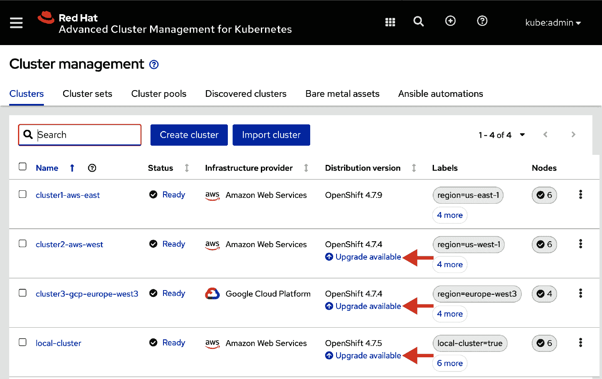

###### 图 6-11\. 可以在集群上执行的操作允许集群管理员升级所需的版本

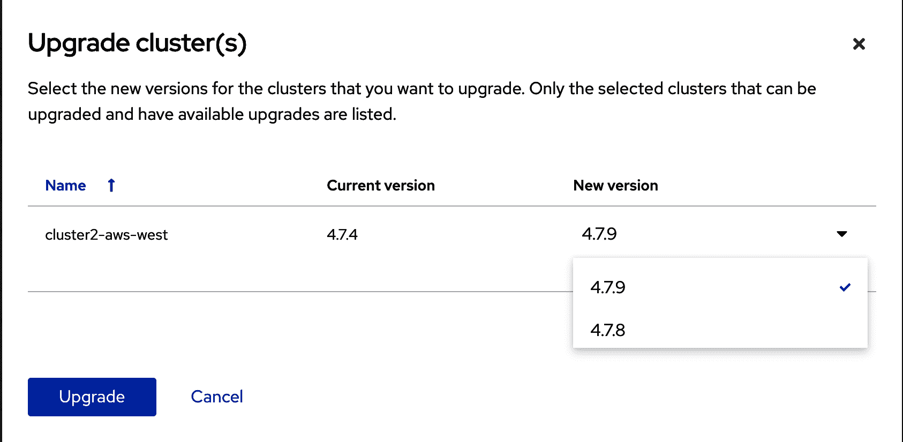

###### 图 6-12\. 提供给用户选择的可用版本列表

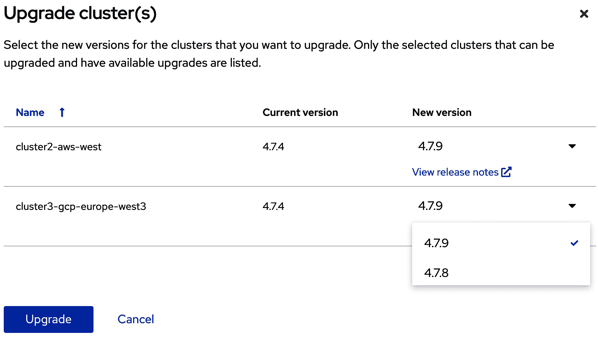

###### 图 6-13\. 可以选择多个集群进行升级，可用的版本会根据`ClusterVersion`对象中附加的通道配置而变化

本书的核心主题之一是如何将您的集群作为一个整体进行管理，为此，我们将依赖策略。前面的讨论应该为您提供了一个理解各个部分并明确如何在整个集群中触发升级行为的基础。在第七章中，我们将讨论如何通过策略控制整个集群的升级行为。

## 多云集群配置总结

在我们的示例中，特定的基础设施底层技术通过几个声明性 API 出现，具体来说是作为*install-config.yaml*用于中心集群，并作为`ClusterDeployment` API 对象的一部分引用的秘密。然而，通过 Kubernetes API 对象来进行新集群的配置和添加或移除成员节点完全是由此驱动的。

此外，通过 CVO 管理的升级生命周期在支持的基础设施底层技术上保持一致。因此，无论您是在公共云服务上还是在您的数据中心中提供 OpenShift 集群，您仍然可以完全声明式地管理升级过程。您现在应该理解到的强大功能是，在多云场景下管理 OpenShift 集群的基础设施底层技术可以完全抽象出许多基本的集群配置生命周期操作。

除了从中心控制您的集群的容量外，您还可以使用 Open Cluster Management 分配策略并驱动像集群升级这样的行为。我们将在第七章中看到一个通过策略进行集群升级的示例。

## OpenShift 作为服务

上一节描述了如何在多个基础设施基板上抽象化 OpenShift 的供应和生命周期。根据我们所概述的模型，您需要负责集群的可用性。基于预算或组织原因，您可能选择考虑使用 OpenShift 或 Kubernetes 的托管服务。使用供应商提供的“OpenShift 即服务”或“Kubernetes 即服务”可以改变您与某些维度（包括集群创建或退役）的交互方式。然而，无论供应商是否管理基础架构，您的应用程序将始终保持一致运行。

### Azure Red Hat OpenShift

[Azure Red Hat OpenShift](https://oreil.ly/0OWW7)已整合到 Microsoft Azure 生态系统中，包括 Azure 计费。其他方面，包括单点登录，与 Azure Active Directory 自动配置，简化了您向组织公开功能的方式，特别是如果您已经在 Azure 上消费其他服务。底层服务由微软和 Red Hat 的合作关系维护。

### Red Hat OpenShift on AWS

[Red Hat OpenShift on AWS](https://oreil.ly/fX0a2)于 2020 年底宣布，计划于 2021 年可用。它将 OpenShift 整合到亚马逊生态系统中，允许通过亚马逊云控制台访问和创建，并与您的亚马逊账户的其余部分一致计费。底层服务由亚马逊和 Red Hat 的合作关系维护。

### Red Hat OpenShift on IBM Cloud

[Red Hat OpenShift on IBM Cloud](https://oreil.ly/gZBHU)将 OpenShift 消费整合到 IBM Cloud 生态系统中，包括与 IBM Cloud 单点登录和计费的集成。此外，提供了 IBM Cloud API 来管理集群的供应、工作节点和升级过程。这些 API 允许通过 IBM Cloud 身份和访问管理分别访问控制集群管理与管理集群资源所用的访问控制。底层服务由 IBM 维护。

### OpenShift Dedicated

[OpenShift Dedicated](https://cloud.redhat.com)是 Red Hat 提供的托管 OpenShift 即服务。可以从该服务在各种云中创建 OpenShift 集群，在某些情况下可以在您自己现有的云账户下操作。集群的可用性和维护由 Red Hat 的 SRE 团队处理。底层服务由 Red Hat 维护，并提供在一些支持的基础设施提供商如 AWS 上带上自己的云账户的选项。

## Kubernetes 即服务

除了供应商管理的 OpenShift 即服务外，许多供应商还提供管理的 Kubernetes 即服务分发。这些通常是供应商采用 Kubernetes 并将其整合到其生态系统中的地方。以下是这些服务的一些示例：

+   Amazon 弹性 Kubernetes 服务

+   Azure Kubernetes Service

+   Google Kubernetes Engine

+   IBM Cloud Kubernetes 服务

由于 Kubernetes 社区将一些决策留给供应商或用户来组装自己的发行版，因此在采用它们作为更大的多云战略的一部分时，您应意识到这些管理服务中可能引入的一些变化。特别是，在 Kubernetes 的几个特定领域已经迅速发展：

+   集群创建

+   用户身份和访问管理

+   网络路由

+   Pod 安全管理

+   基于角色的访问控制

+   增值准入控制器

+   工作节点的操作系统管理

+   不同的安全设备来管理合规性

对于每个维度，提供托管 Kubernetes 服务的供应商必须决定如何最佳地将 Kubernetes 的这一方面集成到云提供商的生态系统中。核心 API 应通过 [CNCF Kubernetes 认证流程](https://oreil.ly/sWAXA) 保持一致响应。实际上，当 Kubernetes 集成到特定的云生态系统中时，差异往往会产生。

例如，在某些情况下，托管 Kubernetes 服务将自带 Kubernetes RBAC 并配置好。其他供应商可能会将 RBAC 的配置留给集群创建者来完成。对于自动配置 Kubernetes RBAC 的供应商，出厂的 ClusterRole 和角色集合可能会有所不同。

在其他情况下，Kubernetes 集群的网络入口可能因云特定扩展或使用社区网络入口控制器而异。因此，根据您选择提供 Kubernetes 的云提供商，您的应用可能需要提供基于不同云提供商的替代网络入口行为。在特定云供应商管理的 Kubernetes 上使用 Ingress（API 组：networking.k8s.io/v1）时，受尊重的注释集合可能因提供商而异，需要对必须容忍不同托管 Kubernetes 服务的应用程序进行额外验证。对于由供应商或您管理的 OpenShift 集群，所有应用程序都定义了带有一组固定注释的标准 Ingress API 或 Route（API 组：route.openshift.io/v1）API，这些将正确暴露到特定的基础设施基板中。

您在应用架构和多云管理策略中必须解决的这种变化并不是不可逾越的。但是，在制定采用策略时，请注意这些方面。无论您是采用作为服务提供商的 OpenShift 还是在自己的云帐户中运行 OpenShift，包括 RBAC 和网络在内的所有 API 面向的应用程序将表现相同。

# 节点的操作系统货币

随着您对 OpenShift 集群的消耗增长，必须解决围绕安全性和操作系统当前性的实际问题。对于 OpenShift 4.x 集群，控制平面主机配置了 Red Hat CoreOS 作为操作系统。当集群进行升级时，控制平面节点的操作系统也会升级。CoreOS 软件包管理器使用一种新颖的方法来应用更新：将更新打包到容器中，并以事务方式应用。整个更新要么成功完成，要么失败。在管理 OpenShift 控制平面的更新时，这种方法的结果限制了由操作系统内未知或未经测试配置的交互而导致部分完成或失败安装的潜力。默认情况下，为工作节点配置的操作系统也将使用 Red Hat CoreOS，从而使您集群的数据平面获得相同的事务更新优势。

在配置了 RHEL 的 OpenShift 集群中可以添加工作节点。添加 RHEL 工作节点的过程在产品文档中有所覆盖，超出了本书的范围。

如果将托管的 Kubernetes 服务集成到您的多集群策略中，请注意供应商和您的团队之间的责任划分：谁负责集群中工作节点的操作系统的当前/合规状态？几乎所有的托管 Kubernetes 服务提供商管理控制平面节点的操作系统。然而，在主要云供应商之间在工作节点操作系统的责任上存在差异。

# 总结

在本章中我们已经涵盖了很多内容。到目前为止，您应该了解 IPI 如何提供多个基础设施基板的一致抽象。一旦被配置，OpenShift 内的操作员管理集群的关键功能的生命周期操作，包括机器管理、认证、网络和存储。我们还可以使用这些操作员暴露的 API 来请求和驱动对集群控制平面和支持节点操作系统的升级操作。

我们还介绍了使用支持服务提供的[Red Hat 高级集群管理](https://oreil.ly/3J1SW)实现的[开放集群管理](https://oreil.ly/3J1SW)中的集群生命周期管理。使用 RHACM，我们看到如何在任何基础设施基板上触发用户管理的集群的升级行为。

在下一章中，我们将继续利用集群操作员通过定义可以应用于一个或多个受管理集群的开放集群管理策略来配置和驱动集群行为。

¹ Ted Dunning，“在边缘计算中使用数据织物和 Kubernetes”，The Newstack（2020 年 5 月 21 日），[*https://oreil.ly/W3J7f*](https://oreil.ly/W3J7f)；“Chick-fil-A 的边缘计算”，Chick-fil-A 技术博客（2018 年 7 月 30 日），[*https://oreil.ly/HcJqZ*](https://oreil.ly/HcJqZ)。

² Rob Szumski，“集群管理员的 OpenShift 版本和升级流程终极指南”，红帽 OpenShift 博客（2020 年 11 月 9 日），[*https://oreil.ly/hKCex*](https://oreil.ly/hKCex)。
