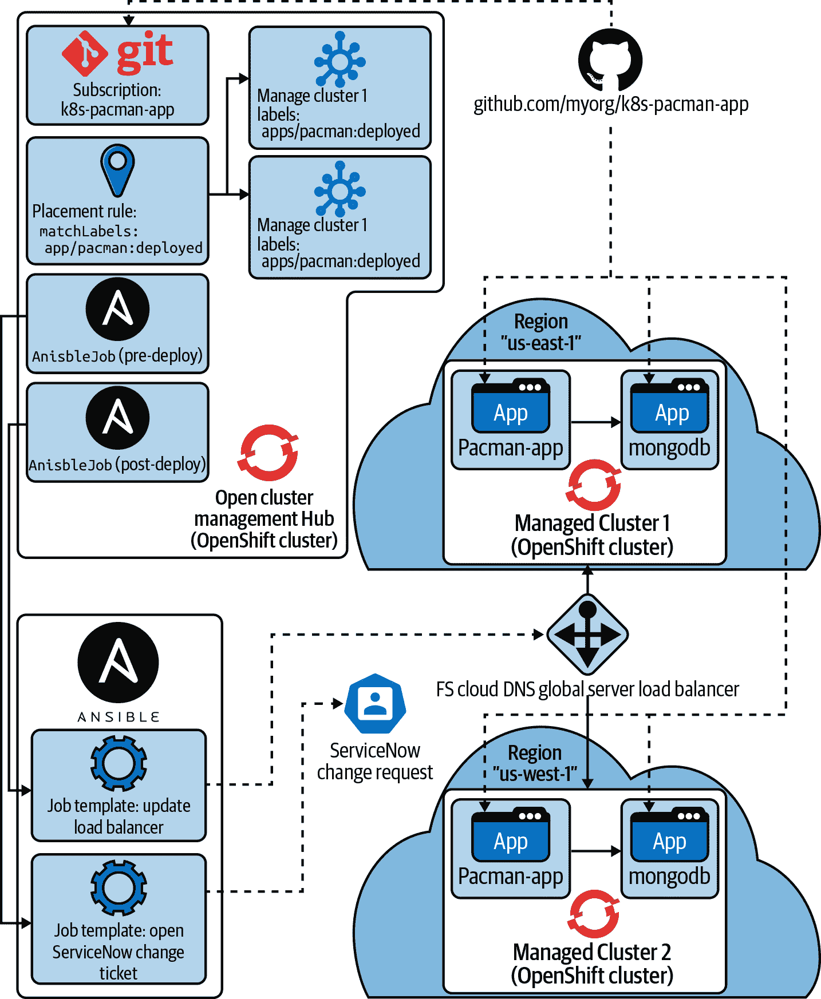
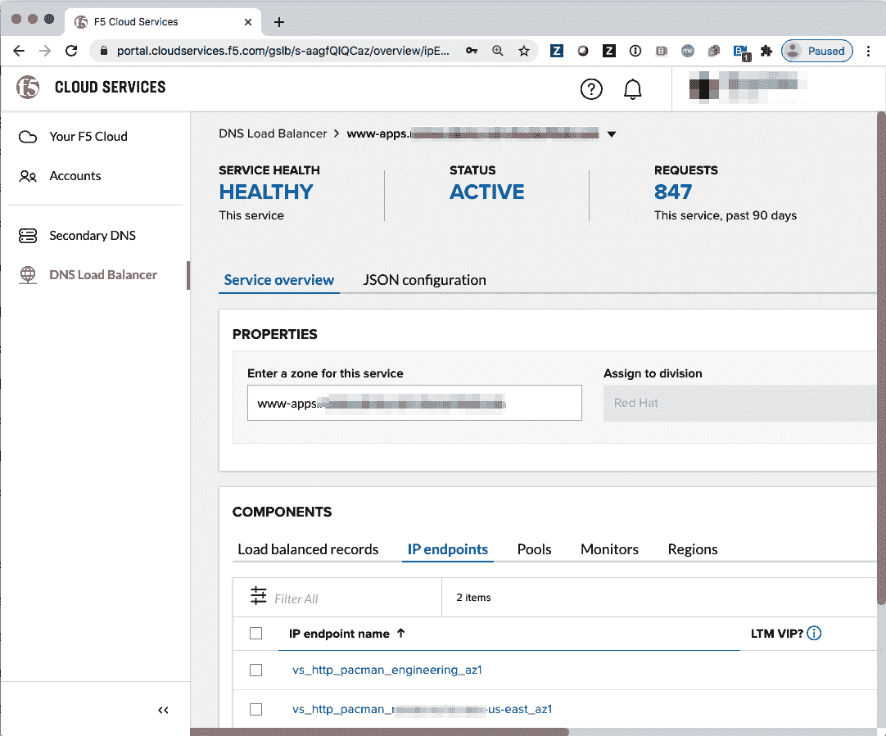
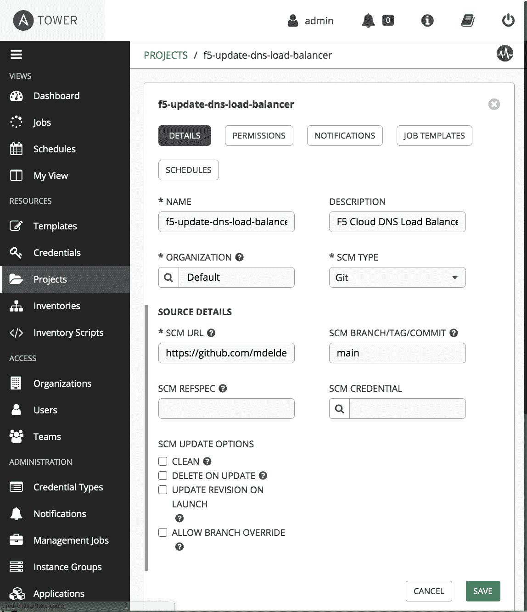
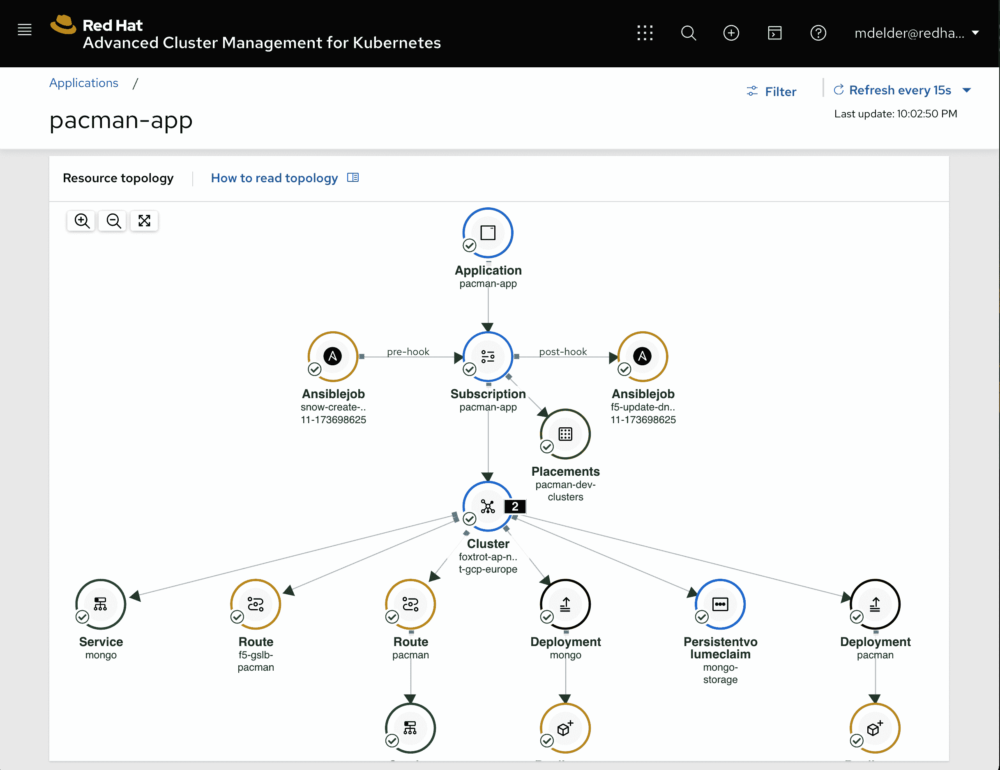

# 第八章。多集群应用程序交付的工作示例

让我们来看一个简单的工作示例，一个带有后备数据存储的 Web 应用程序。为了我们的目的，我们将部署一个模仿雅达利游戏 PAC-MAN 的应用程序。用户将与一个动态前端进行交互，该前端将信息存储在后备的 MongoDB 中。

我们将使用在第五章讨论的技术在多个不同的集群上部署此应用程序。每个集群将从运行 Open Cluster Management 的中心进行配置，如第六章所述。此外，我们将配置由 F5 托管的 GSLB 服务提供的外部负载均衡器。来自全局域名的传入用户请求将被路由到特定集群中的一个。如果任何一个集群或应用程序遇到问题，则将不再将用户请求路由到该集群。我们将进一步探讨如何集成集群外资源，例如 F5 DNS 负载均衡器云服务，并将在示例中集成 ServiceNow 变更工单。

在图 8-1 中，我们看到我们的 PAC-MAN 应用程序在两个 OpenShift 集群上运行，负载均衡器将流量路由到任一集群中的应用实例。我们可以看到中心集群有各种资源，这些资源有助于管理整个系统。在本章的其余部分，我们将解释这些各种部分正在做什么，并提供一个可以自行尝试的演示，涵盖所有移动部件。



###### 图 8-1。由多个集群组成的工作示例，以及一个由 Open Cluster Management 中心管理的两层 Web 应用程序，集成了集群外自动化。

# 失败是不可避免的。

我们从多个角度看到了 OpenShift 如何从基础设施或云提供商的故障中恢复，以及如何实现响应迅速且适应性强的开放式混合云，以支持您的应用程序。让我们回顾一些我们谈论过的事情。

在第四章中，我们讨论了单个集群可用性，其中 Kubernetes 集群的控制平面能够容忍任何一个可用区的故障。当单个集群中的可用区失败时，控制平面和集群内运行的应用程序都能够容忍支持计算、网络或存储基础设施的丢失。您的应用程序必须利用像服务这样的 Kubernetes 概念，在集群内充当负载均衡器，将用户请求路由到多个支持应用程序 Pod。当应用程序 Pod 不再健康（由健康检查确定）或支持该 Pod 的节点不再健康时，Kubernetes 调度器将寻找一个新的 Pod 家。我们通过拥有继续运行并服务传入用户请求的冗余 Pod 来设计具有弹性的应用程序。

现在，如果集群由于耗尽容量而无法重新调度失败的 Pod 会发生什么？如果超过一个可用区失败会发生什么？在这些情况下，将应用程序的额外实例部署到其他集群中的其他区域甚至其他云提供商可能是更可取的选择。

正如我们在第六章中所看到的，我们可以使用 OpenShift 在许多不同的云提供商上提供正在运行的集群。[开放集群管理](https://oreil.ly/3J1SW)项目允许您从称为“中心”集群的中央控制平面管理这些集群。

此外，在第七章中，我们看到如何通过`PlacementRule`将给定的集群与所需配置匹配。每当 Open Cluster Management 策略与集群匹配时，因为该集群被`PlacementRule`选中，所需的配置可以被审核或强制执行到该集群。由于 OpenShift 对操作员中心化非常重视，无论是对控制平面还是工作负载，使用策略来驱动声明性配置是确保您的集群准备好支持应用工作负载的一种自然且简单的方式。另一个好处是，如果您正在采用完全或半 GitOps 方法，声明性策略可以在您的源代码控制系统中轻松管理。

在 第五章 中，我们探讨了如何通过适当的 `PlacementRule` 确保应用程序跨多个集群运行。通过在不同地区的多个集群中运行应用程序，我们现在可以容忍整个云区域的故障。或者，当您的组织仅因组织惯性、并购，或因需要抵御云服务提供商的完全故障时，也可以使用此功能。尽管多集群的最简单示例可能是利用现有的数据中心虚拟化提供商，并至少采纳一个公共云提供商。`PlacementRule` 很容易将“需要运行的内容”与“需要运行的位置”分开。`PlacementRule` 还可以使您的应用程序在集群的可用性或标记发生变化时进行调整。也就是说，如果 `PlacementRule` 更改或可用集群的集合因增加或删除而更改，则应用程序组件将动态重新部署到新的集群或从失败的集群中撤出。

因此，我们可以轻松创建集群（第六章），我们可以确保这些集群配置正确，以支持企业配置和安全标准（第七章），并且我们可以将应用程序交付到这些集群中（第五章）。

# 多集群负载均衡

如何确保用户请求路由到健康的应用实例？在我们的示例中，我们将使用由 F5 管理的基于云的 GSLB 服务。

处理多集群负载均衡有多种解决方案。出于这些原因，我们选择使用来自 F5 的云服务：

+   在撰写本文时，该操作员不支持（但仍然对我们的应用程序进行自动化非常重要）。

+   您可以通过 AWS Marketplace 轻松注册一个轻量级帐户。

+   我们预计大多数数据中心将需要自动化其应用程序如何与 F5 BIG-IP 负载均衡器集成。尽管基于云的服务和 F5 BIG-IP 设备使用不同的 API，但我们相信示例将为您提供足够的理解，以便您可以根据自己的应用程序调整所展示的原则。另外，如果我们使用 BIG-IP 虚拟设备作为示例，这将增加用户重新创建完整示例的复杂性。

+   即使您的集群跨越完全不同的云环境或您自己的公共路由暴露的数据中心，F5 服务也将为您提供服务。

以下是为提供跨集群负载均衡的另外两个选项，仅供您参考和了解：

+   [external-dns](https://oreil.ly/eyHBj) 项目将典型的内部集群 DNS 注册表服务扩展到公共 DNS 记录。截至撰写本文时，该项目仍较为年轻，但支持多个提供者。

+   [k8gb.io](https://www.k8gb.io) 项目将在每个集群内设置 DNS 注册表。某些顶级 DNS 提供者必须配置外部 DNS 条目，以委派到特定集群的 DNS 注册表。这种架构的好处是没有中心化控制器可能成为单点故障。然而，像基于延迟的路由等功能目前不受支持（例如在 F5 或 external-dns 选项中）。

在我们的示例应用程序中，您将建立一个顶级 DNS 记录（例如 `*.www-apps.<*clusterName*>.<*baseDomain*>`），将其委派给 F5 DNS 负载均衡器以解析地址（例如 ns1.f5cloudservices.com 和 ns2.f5cloudservices.com）。然后，DNS 请求解析地址的一般流程将经过以下步骤：

1.  用户通过顶级 DNS 提供者解析 `app-name.www-apps.<*clusterName*>.<*baseDomain*>`，该提供者将请求重定向到与 `*.<*baseDomain*>` 相关的云 DNS 提供者。

1.  `<*baseDomain*>` 将由您的云提供商的 DNS 解析（例如，Amazon Route 53）。

1.  云 DNS 提供商返回一个名字服务器记录，用于 `*.www-apps.<*clusterName*>.<*baseDomain*>` 的路由请求，以便将请求路由至 ns1.f5cloudservices.com 或 ns2.f5cloudservices.com 中的一个。

1.  对 ns1.f5cloudservices.com 或 ns2.f5cloudservices.com 的最终解析请求评估托管区域列表，并根据 DNS 请求的来源和支持服务的当前健康状态返回与您的集群之一托管的应用程序路由最佳匹配。

如图 8-2 所示，在 F5 DNS 负载均衡器云服务中，每个集合集群的 DNS 负载均衡器区域将对应于您的云提供商 DNS 中的一个顶级 DNS 条目，该条目委派给 F5 以解析请求的正确集群中的应用程序路由。



###### 图 8-2\. F5 DNS 负载均衡云服务

登录到 F5 DNS 负载均衡器时，您将看到各种 DNS 负载均衡器服务（其中每个服务跨多个集群提供一个或多个应用程序），以及当前注册的 IP 终端。每个 IP 终端解析为托管一个应用程序实例的集群的应用程序路由器。

现在每当您的应用程序有一个实例可用或从集群中移除时，我们需要更新 DNS 负载均衡器区域的相关应用程序（由 `*.www-apps.<*clusterName*>.<*baseDomain*>` 标识）。我们将如何自动完成这项任务？在这里，我们将介绍如何在您的环境中不是“本地” Kubernetes 时，围绕您的集群自动化。为了实现这一目标，我们将介绍如何使用 Ansible 在我们的应用程序引入新集群或从现有集群中删除时，自动更新 F5 DNS 负载均衡器。

您需要完成以下先决条件，以运行我们的示例应用程序：

1.  在 F5 DNS 负载均衡器云服务上创建一个账户。你可以在 [F5 云服务](https://oreil.ly/tmmSY) 或者通过 [AWS Marketplace](https://oreil.ly/HF5mw) 完成这一步骤。

1.  将全局域名委托给 F5 DNS 域名服务器。创建一个委托命名服务器的 DNS 记录，使用你将在 F5 上使用的全局域名。你可以通过 Route 53 或者你的 DNS 提供商完成此操作。关于此先决条件的问题，可以查看 [F5 DNS 负载均衡器云服务 FAQ](https://oreil.ly/xK0sK) 获取答案。

# 无操作员自动化

正如我们在本书中详细讨论的那样，Kubernetes 广泛使用声明性配置。虽然我们相信 Kubernetes 将在未来十年中支撑大多数现代应用程序，但我们也意识到并非所有事物今天都是 Kubernetes 原生的，未来也可能*永远*不会是 Kubernetes 原生的。

对于应用程序跨多个集群甚至多个云的各个方面，我们介绍 Ansible 作为一种方法，可以自动化系统引入动态变化时想要发生的任何行为。正如前一节讨论的那样，我们希望我们的 OpenShift 环境可以自动将我们的应用实例放置在多个集群上。每当我们的应用程序在新集群上部署或因集群不健康而被移除时，我们希望在系统前端的全局负载均衡器配置也能得到更新。由于我们严重依赖于自动恢复失败，我们希望这种行为也是自动的。

使用 Ansible，有一个充满活力的社区使用自动化简化系统管理员管理 Linux、容器、云、网络设备、安全等的生活。我们不会深入教您有关 Ansible 的知识。但是，我们将介绍一些基本概念，以便您了解其工作原理并评估是否适合您的需求。

请注意，即使您不必在集群外自动化任何事物，所有涉及可用性、多集群配置、配置、应用程序交付等细节仍然适用。

对于我们的目的，您只需要掌握 Ansible 中以下概念：

Playbook

Ansible playbook 是“自动化任务的蓝图——这些任务是在有限或无人参与的情况下执行的复杂 IT 操作。Ansible playbook 在组合、群组或主机分类上执行。”¹

项目

Ansible 项目将 playbooks 与支持资源一起组合，以运行这些 playbooks。方便的是，项目可以由用于管理 Ansible playbooks 和支持资源的源代码控制存储库支持。

Ansible Tower

Ansible Tower 是开源项目 Ansible AWX 的支持版本。Ansible Tower 提供了组织一组 Ansible 项目和自动化引擎的能力，可以跟踪凭据、定期作业、需要调用的作业模板以及可用的系统清单等。从本质上讲，可以将 Tower 视为组织和跟踪自动化系统管理所需的一切工具。

作业模板

Ansible 作业模板定义了 Ansible Tower 中来自 Ansible 项目的可用剧本。作业模板可以指定要外部化的参数和要使用的存储凭据，还可以关联作业模板的所有调用列表，用于审核或诊断目的。

工作

Ansible 作业是作业模板的运行实例。

如前所述，我们将使用 Ansible 更新 F5 DNS 负载均衡器云服务。我们将使用来自 F5 的稍作修改的开源工具的版本，该工具集成了更新服务所需的所有 API 调用，并在 Ansible 中实现。我们将将 f5-bd-gslb-tool playbooks 加载到一个 Ansible 项目中，并定义一个作业模板，调用所需的 playbook，并接受当前托管应用程序的集群参数。要查看 Ansible Tower 中的 Ansible 项目示例，请参见 图 8-3。



###### 图 8-3\. Ansible Tower 中的 Ansible 项目；项目内容在源代码控制下管理（通过 [GitHub](https://github.com)）

我们还将使用 Ansible 集成由 ServiceNow 支持的简单变更管理流程。我们的示例源自关于该主题的已发布博客文章。² 许多 IT 组织和运营商仍然广泛使用基于工单的变更管理流程。在我们的示例应用程序中，将在调整应用程序位置之前使用 Ansible 作业创建一个 ServiceNow 中的变更请求。我们的示例仅 superficial 使用 ServiceNow，但您将看到一种在系统经历动态自动变更时如何仍然使用现有流程进行记录和审核的方法。

我们已经介绍了支持应用程序部署的几个概念，包括 Open Cluster Management 订阅（API 组：apps.open-cluster-management.io/v1）和 `PlacementRule`（API 组：apps.open-cluster-management.io/v1）。现在我们介绍了一个新的 API 种类，它将成为我们示例应用程序的一部分：`AnsibleJob`（API 组：tower.ansible.com/v1alpha1）。与本书中介绍的其他自定义资源定义（CRD）一样，`AnsibleJob` 由一个称为 Ansible 资源操作器的操作员来协调。让我们将 Ansible 资源操作器与 Ansible Tower 一起部署，这样我们就可以在系统更新我们应用程序实例的放置时，链接 Ansible 作业的执行。用于创建变更请求票证的 `AnsibleJob` 如 示例 8-1 所示。

##### 示例 8-1\. `AnsibleJob` API 种类允许我们调用在 Ansible Tower 中配置的 Ansible 作业模板；输入参数通过 `extra_vars` 参数发送。

```
apiVersion: tower.ansible.com/v1alpha1
kind: AnsibleJob
metadata:
 name: snow-create-change-record
 namespace: pacman-app
 labels:
   app.kubernetes.io/name: pacman
spec:
 tower_auth_secret: toweraccess
 job_template_name: snow-create-change-record
 extra_vars:
   app_name: pacman
   change_request:
     severity: 2
     priority: 2
     implementation_plan: "Updated by Red Hat Advanced Cluster Management for 
Kubernetes"
     justification: "A new revision was available from the application channel in 
GitHub."
     description: "The following resources have been updated: [...]"
     risk_impact_analysis: "Changes are made automatically based on approved 
changes in GitHub."
     test_plan: "Run synthetic validation tests post-deployment."
```

在顺序上，用于创建 ServiceNow 票证的 `AnsibleJob` 将在应用新的放置决策之前运行（一个预处理钩子），用于更新 F5 负载均衡器的 `AnsibleJob` 将在最后运行（一个后处理钩子）。

# 部署示例应用程序

我们正在铺设许多功能来实现一个简单的 Web 前端应用程序——目标是为您提供一个实际的示例，展示您在采用 Kubernetes 和 OpenShift 作为企业标准的过程中可能会遇到的一些关注点。

我们已经介绍了应用程序将如何在多个集群中进行复制，并在这些多个应用程序实例前面有一个全局负载均衡器，以及每当放置决策变化时，我们将在 ServiceNow 中有一个简单的基于票证的记录。

我们在 第五章 中广泛审查了 PAC-MAN 应用程序，但这里是一个快速的回顾：

+   PAC-MAN 由两个部署组成（Web 前端应用程序和后端 MongoDB 数据存储）。

+   PAC-MAN 公开了两个公共路由：一个用于本地集群，另一个由我们的 F5 DNS 负载均衡器提供的全局路由。

+   PAC-MAN 订阅引用一个 Git 存储库，我们在其中管理我们的 Kubernetes 清单。如果对这些 Kubernetes 清单进行更改，则更新将自动推送到所有活动集群。

+   `PlacementRule` 定义了集群必须匹配的条件列表，以选择托管该应用程序的集群。

出于我们的目的（因为我们已经在处理多个移动部件），我们不会对支持跨多个集群的 MongoDB 副本集进行任何集群化操作。我们可以通过 Ansible 或操作器执行额外操作，以集群化 MongoDB 副本集，并在集群丢失时使分布式写入持久化。或者，我们可以使用基于云的 MongoDB 服务来备份 PAC-MAN 应用的状态。关于应用程序后备数据存储的持久性以及应用程序本身的相关 MTBF 和 MTTR 可用性指标，您可能会有自己的强烈意见。

现在我们已经讨论了所有部件如何拼合在一起的细节，让我们深入了解并操作一个运行示例！

为简化此过程，请分叉示例存储库。您需要进行一些修改，以便能够从您的存储库分支提供应用程序。

将 [repository](https://oreil.ly/8nMgb) 分叉到您自己的组织中，然后将存储库克隆到您的笔记本电脑上：

```
$ git clone --branch ansible 
git@github.com:SPECIFY_YOUR_GITHUB_ORG/k8s-pacman-app.git

```

在以下部分引用的所有路径均指此存储库中的文件。

根据您的特定 DNS 设置更新以下文件中的值，以适应您的 OpenShift 集群和 Route53：

+   *hack/install-config.yaml*

+   *deploy/posthook/f5-update-dns-load-balancer.yaml*

+   *deploy/pacman-f5-route.yaml*

+   *hack/tower-setup/config/inventory*

表 8-1 显示了所需的更新内容。

表 8-1\. 所需文件更新

| Key | Value |
| --- | --- |
| SPECIFY_YOUR_CLUSTER_NAME | 在 *install-config.yaml* 中定义的 Hub 集群名称。 |
| SPECIFY_YOUR_BASE_DOMAIN | 在 *install-config.yaml* 中定义的 Hub 集群的基本 DNS 名称的值。 |
| SPECIFY_YOUR_CLUSTER_ADDRESS | *clusterName* 和 *clusterBaseDomain* 以点号分隔的串联（例如 *clusterName.clusterBaseDomain*）。 |
| SPECIFY_YOUR_OWN_PASSWORD | 定义您自己的安全密码。当有疑问时，`**uuid**` 的输出可以作为有用的密码。 |
| SPECIFY_YOUR_EMAIL_ADDRESS | 用于为跟踪目的分配云资源的标记。如果不想指定电子邮件地址，您也可以只删除标记。 |
| SPECIFY_YOUR_PULL_SECRET | 登录服务后可以从 [Red Hat](https://cloud.redhat.com) 下载的镜像拉取密钥。 |
| SPECIFY_YOUR_SSH_RSA_PUBLIC_KEY | 可用于连接到作为 OpenShift 集群的一部分进行配置的主机的 SSH 公钥。 |

# 配置您的 Hub 集群

请记住，Hub 集群托管 Open Cluster Management 的组件，允许从集中控制平面管理托管集群。您可以从 Hub 提供集群，也可以从像 Red Hat OpenShift on IBM Cloud 或 Azure Red Hat OpenShift 这样的托管提供程序导入现有的 OpenShift 集群。

在接下来的部分中，您将创建一个用作中心的集群，安装 Open Cluster Management 中心，并配置两个集群以托管示例应用程序。

## 配置一个 OpenShift 集群以托管 Open Cluster Management 中心

遵循默认说明来配置一个 OpenShift 4.5 或更新的集群。集群应至少有三个工作节点，总计 18 个 CPU 和 80G 内存，或在 AWS EC2 上使用 m5.xlarge（三个工作节点）。

下面的示例*install-config.yaml*用于准备此示例的中心集群，但只要您的起始集群具有所需的容量，您就不需要像*install-config.yaml*中的示例 8-2 一样配置一个集群。

##### 示例 8-2。一个*install-config.yaml*示例，用于配置用作中心的集群的集群

```
apiVersion: v1
baseDomain: SPECIFY_YOUR_BASE_DOMAIN
controlPlane:
 hyperthreading: Enabled
 name: master
 replicas: 3
 platform:
   aws:
     type: m5.xlarge
     rootVolume:
       iops: 2000
       size: 100
       type: io1
compute:
- hyperthreading: Enabled
 name: worker
 replicas: 4
 platform:
   aws:
     type: m5.xlarge
     rootVolume:
       size: 100
       type: gp2
metadata:
 name: SPECIFY_YOUR_CLUSTER_NAME
networking:
 clusterNetwork:
 - cidr: 10.128.0.0/14
   hostPrefix: 23
 machineCIDR: 10.0.0.0/16
 networkType: OpenShiftSDN
 serviceNetwork:
 - 172.30.0.0/16
platform:
 aws:
   region: us-east-1
   userTags:
     contact: SPECIFY_YOUR_EMAIL_ADDRESS
     purpose: demo
publish: External
pullSecret: 'SPECIFY_YOUR_PULL_SECRET'
sshKey: |
 ssh-rsa SPECIFY_YOUR_SSH_RSA_PUBLIC_KEY

```

## 配置 Open Cluster Management 中心

对于我们的示例，我们将使用 Red Hat 支持的产品 RHACM 部署 Open Cluster Management。有关配置 RHACM 的说明，请参见第五章。您还可以直接从 Red Hat Operator 目录部署 RHACM，或使用[文档中记录的说明](https://oreil.ly/a1zlD)。

## 配置两个或更多集群来托管应用程序

配置中心集群后，您将能够注册您的云凭据并自动管理中心集群中的一个或多个集群。这些集群可以在同一云提供商的不同区域或多个云提供商中进行配置。例如 PAC-MAN 应用程序非常轻量级，因此您不需要大量容量来运行示例应用程序。

# 部署 Ansible Tower 和 Ansible 资源操作符

除了容器化应用程序外，我们还将配置由 F5 提供的 DNS 负载平衡器，并使用 ServiceNow 开发者实例来演示如何将变更管理流程集成到容器化应用程序的部署生命周期中。设置基于容器的 Ansible Tower 安装方法的详细说明，请参阅[Ansible 文档](https://oreil.ly/Uzm3y)。以下步骤记录了准备在此存储库中捕获的演示所采取的具体操作。

为简化此示例的配置，我们将利用一些预定义策略来帮助准备中心集群以部署 Ansible。

克隆示例存储库，并在*hack/manifests/policies*下应用策略：

```
$ cd hack/manifests/policies
$ oc apply -f ansible-tower-policies-subscription.yaml
```

这些策略的结果将设置 Ansible 资源操作符，准备名为`tower`的 Ansible Tower 项目，并使用默认存储类创建一个`PersistentVolumeClaim`来支持 Ansible Tower 的数据库（PostgreSQL）。

几分钟后，请验证您的 Hub 集群上是否正确应用了资源。您可以从 RHACM Web 控制台（在“治理风险”下）验证 *policy-ansible-tower-prep* 和 *policy-auth-provider* 是否合规。您还可以验证已创建的资源如下：

```
$ oc get subs.operators --all-namespaces
NAMESPACE                 NAME                        PACKAGE          
             SOURCE                CHANNEL
open-cluster-management   acm-operator-subscription   advanced-cluster-
management   acm-custom-registry   release-2.2
tower-resource-operator   awx-resource-operator       awx-resource-
operator     redhat-operators      release-0.1

$ oc get pvc -n tower
NAME        STATUS  VOLUME                                CAPACITY  ACCESS 
MODES   STORAGECLASS AGE
postgresql   Bound    pvc-1554a179-0947-4a65-9af0-81c5f2d8b476   5Gi        RWO      
         gp2           3d20h
```

从 [可用的发布版本](https://oreil.ly/utowL) 下载 Ansible Tower 安装程序发布版。将归档文件解压缩到工作目录中。为您的 OpenShift 集群配置清单。清单文件应直接放置在归档文件夹下（例如，*ansible-tower-openshift-setup-3.7.2/inventory*）。

示例 8-3 中的清单可以放置在解压释放归档的根目录下。一定要覆盖以下内容：

`SPECIFY_YOUR_OWN_PASSWORD`

选择一个至少 16 个字符的强密码。

`SPECIFY_YOUR_CLUSTER_ADDRESS`

为您的 OpenShift 集群提供 API 服务器的正确主机名。

`SPECIFY_YOUR_OPENSHIFT_CREDENTIALS`

您的 OpenShift 集群管理员用户的密码。如果您已定义替代管理用户 kubeadmin，则一定要覆盖它。

##### 示例 8-3\. 为 Ansible Tower 安装程序提供输入值的示例清单文件

```
localhost ansible_connection=local ansible_python_interpreter="/usr/bin/env python"
[all:vars]
# This will create or update a default admin (superuser) account in Tower
admin_user=admin
admin_password='SPECIFY_YOUR_OWN_PASSWORD'
# Tower Secret key
# It's *very* important that this stay the same between upgrades or you will 
# lose the ability to decrypt your credentials
secret_key='SPECIFY_YOUR_OWN_PASSWORD'
# Database Settings
# =================
# Set pg_hostname if you have an external postgres server, otherwise
# a new postgres service will be created
# pg_hostname=postgresql
# If using an external database, provide your existing credentials.
# If you choose to use the provided containerized Postgres depolyment, these
# values will be used when provisioning the database.
pg_username='admin'
pg_password='SPECIFY_YOUR_OWN_PASSWORD'
pg_database='tower'
pg_port=5432
pg_sslmode='prefer'  # set to 'verify-full' for client-side enforced SSL
# Note: The user running this installer will need cluster-admin privileges.
# Tower's job execution container requires running in privileged mode,
# and a service account must be created for auto peer-discovery to work.
# Deploy into Openshift
# =====================
openshift_host=https://api.SPECIFY_YOUR_CLUSTER_ADDRESS:6443
openshift_skip_tls_verify=true
openshift_project=tower
openshift_user=kubeadmin
openshift_password=SPECIFY_YOUR_OPENSHIFT_CREDENTIALS
# If you don't want to hardcode a password here, just do:
# ./setup_openshift.sh -e openshift_token=$TOKEN
# Skip this section if you BYO database. This is only used when you want the
# installer to deploy a containerized Postgres deployment inside of your
# OpenShift cluster. This is only recommended if you have experience storing and
# managing persistent data in containerized environments.
#
#
# Name of a PVC you've already provisioned for database:
openshift_pg_pvc_name=postgresql
#
# Or... use an emptyDir volume for the OpenShift Postgres pod.
# Useful for demos or testing purposes.
# openshift_pg_emptydir=true
# Deploy into Vanilla Kubernetes
# ==============================
# kubernetes_context=test-cluster
# kubernetes_namespace=ansible-tower
```

更新用于运行已定义作业的默认任务映像。因为作业使用额外模块，我们需要确保各种 Python 模块依赖性可用。

在 *group_vars/all* 中，更新以下键：

```
kubernetes_task_image: quay.io/mdelder/ansible-tower-task
```

您可以构建此镜像，并从您自己的注册表中消耗它，方法是在 *hack/tower-setup/container_task_image* 下构建 *Dockerfile.taskimage*。或者，您可以构建任务镜像并发布到您自己的注册表。如果您使用之前定义的现有镜像，则无需构建自己的镜像。根据您下载的发布版本使用正确的 Ansible 版本：

```
$ cd hack/tower-setup/container_task_image
$ docker build -t quay.io/YOUR_USERID/ansible-tower-task:3.7.2 \
-f Dockerfile.taskimage
$ docker push quay.io/YOUR_USERID/ansible-tower-task:3.7.2

```

一旦您对清单文件进行了相关更新，您就可以运行 Ansible Tower 安装程序。从 OpenShift Web 控制台中检索认证令牌，方法是在您的用户名下的“复制登录命令”操作中：

```
$ ./setup_openshift.sh -e openshift_token=$TOKEN
```

启动 Tower Web 控制台：

```
$ open https://$(oc get route -n tower ansible-tower-web-svc \
-ojsonpath='{.status.ingress[0].host}')

```

使用您在清单文件中指定的用户和密码登录。然后必须选择 Tower 的许可证。如果您有 Red Hat 用户身份，则可以登录并选择 60 天的评估许可证。

可选择地，您可以自定义 *hack/manifests/ansible-tower-console-link.yaml* 以适合您自己的集群。然后应用文件（注意：在此之前，您必须更新文件中的 URL 才能在您的集群中正常工作）：

```
$ cd hack/manifests
$ oc apply ansible-tower-console-link.yaml

```

在应用`ConsoleLink`后，刷新您的 OpenShift Web 控制台，并在标题栏的应用程序下拉菜单中查看您的 Ansible Tower 快捷方式。

## 为 ServiceNow 和 F5 DNS 负载均衡器配置项目

该示例应用程序使用 F5 DNS 负载均衡器云服务和 ServiceNow 来演示 Ansible 自动化。这假设您已完成以下步骤：

1.  创建 ServiceNow 的开发者实例。如果您需要 ServiceNow 的开发者实例，请按照[ServiceNow Developers](https://developer.servicenow.com)的说明进行操作。

1.  使用 F5 DNS Load Balancer Cloud Service 创建帐户。如果您需要使用[F5 DNS Load Balancer Cloud Service](https://oreil.ly/tmmSY)创建帐户，您可以直接或通过[AWS Marketplace](https://oreil.ly/HF5mw)完成此操作。

1.  将全球域委托给 F5 DNS 域名服务器。创建一个使用与 F5 一起使用的全球域的名称服务器委托 DNS 记录。您可以通过 Route 53 或您的 DNS 提供商完成此操作。[F5 DNS Load Balancer Cloud Service FAQ](https://oreil.ly/ObL27) 解答了与此先决条件相关的问题。

一旦您获得了这些服务的凭据，您可以配置 Ansible Tower 实例，该实例使用两个相关的 Ansible 项目来提供将作为预钩子和后钩子执行的作业模板，当应用程序被放置或从集群中移除时。为了方便起见，所有与 Ansible Tower 的配置都是完全自动化的（使用与 Ansible Tower 对话以创建所需的项目/作业模板/作业/凭据的 Ansible playbook）。

在`hack/tower-setup`目录下创建名为*tower_cli.cfg*的文件，内容如下：

```
# hack/tower-setup/tower_cli.cfg
[general]
host = https://ansible-tower-web-svc-tower.apps.cluster.baseDomain
verify_ssl = false
#oauth_token = ALTERNATIVELY_USE_A_TOKEN
username = admin
# password = SPECIFY_YOUR_OWN_PASSWORD
```

如果您不确定 Tower 的主机地址，可以使用`oc`查找正确的值：

```
$ oc get route -n tower ansible-tower-web-svc \
-ojsonpath='{.status.ingress[0].host}'
```

在`hack/tower-setup/group_vars`目录下创建名为*credentials.yml*的文件，内容如下：

```
# User and password for the F5 CloudServices account.
f5aas_username: SPECIFY_YOUR_F5_USERNAME
f5aas_password: SPECIFY_YOUR_F5_PASSWORD

# Credentials for ServiceNow
snow_username: admin
snow_password: SPECIFY_YOUR_SERVICENOW_USERNAME
# Specify your ServiceNow developer instance ID.
snow_instance: devXXXXX
```

您可能需要安装所需的 Python 库：

```
# Optionally specify the correct version of python required by Ansible
# Of course, you must update the PYTHON var specific to your environment
$ export PYTHON="/usr/local/Cellar/ansible/2.9.13/libexec/bin/python3.8"
$ $PYTHON -m pip install --upgrade ansible-tower-cli

```

运行将与 Ansible Tower 对话并配置我们的两个项目（一个用于 F5，一个用于 ServiceNow）和相关作业模板的 playbooks：

```
$ export PYTHON="/usr/local/Cellar/ansible/2.9.13/libexec/bin/python3.8"
$ ansible-playbook -e ansible_python_interpreter="$PYTHON" tower-setup.yml

```

## 配置`toweraccess`秘密并创建 Ansible Tower 令牌

从 Ansible Tower 创建授权令牌。授权令牌将被用于应用程序引用以调用 Ansible Tower 作业。请按照以下步骤操作：

1.  登录到 Ansible Tower 实例：

    ```
    $ open https://$(oc get route -n tower ansible-tower-web-svc \
    -ojsonpath='{.status.ingress[0].host}')
    ```

1.  点击页眉中的“admin”用户。

1.  点击令牌。

1.  点击+号。

1.  将范围设置为写入。

1.  点击保存，确保复制并保存令牌的值。

1.  在`hack/manifests`目录下创建名为*hack/manifests/toweraccess-secret.yaml*的文件，内容如下：

    ```
    apiVersion: v1
    stringData:
      host: ansible-tower-web-svc-
    tower.apps.SPECIFY_YOUR_CLUSTER_NAME.SPECIFY_YOUR_BASE_DOMAIN
      token: SPECIFY_YOUR_ANSIBLE_TOWER_ADMIN_TOKEN
    kind: Secret
    metadata:
      name: toweraccess
      namespace: pacman-app
    type: Opaque
    ```

# 部署`pacman-app`示例到您的集群

现在我们将部署管理应用程序放置的清单到中心。通过创建应用程序、订阅和`PlacementRule`，您将使中心能够动态地将应用程序部署到您之前创建的一个或多个集群。

首先，为应用程序创建项目并应用秘密：

```
$ oc new-project pacman-app
$ oc apply -f hack/manifests/toweraccess-secret.yaml

```

您可以通过 RHACM web 控制台（托管应用程序 > 创建应用程序）创建应用程序清单，也可以应用来自示例 Git 存储库的预构建资源。最终结果的示例在 Example 8-4 中提供。

##### 示例 8-4\. PAC-MAN 应用程序清单和支持资源，以允许中心集群将应用程序部署到 fleet 中的任何受管集群

```
---
apiVersion: apps.open-cluster-management.io/v1
kind: Channel
metadata:
  name: pacman-app-latest
  namespace: pacman-app
  labels:
    app.kubernetes.io/name: pacman
  annotations:

    apps.open-cluster-management.io/github-path: deploy
spec:
  type: GitHub
  pathname: https://github.com/SPECIFY_YOUR_GITHUB_ORG/k8s-pacman-app.git
  # secretRef:
  #   name: github-credentials
---
apiVersion: app.k8s.io/v1beta1
kind: Application
metadata:
  name: pacman-app
  namespace: pacman-app
spec:
  componentKinds:
  - group: apps.open-cluster-management.io
    kind: Subscription
  descriptor: {}
  selector:
    matchExpressions:
    - key: app.kubernetes.io/name
      operator: In
      values:
      - pacman
---
apiVersion: apps.open-cluster-management.io/v1
kind: Subscription
metadata:
  annotations:
    apps.open-cluster-management.io/git-branch: ansible
    apps.open-cluster-management.io/github-path: deploy
  name: pacman-app
  namespace: pacman-app
  labels:
    app.kubernetes.io/name: pacman
spec:
  channel: pacman-app/pacman-app-latest
  hooksecretref:
    name: toweraccess
  placement:
    placementRef:
      kind: PlacementRule
      name: pacman-dev-clusters
---
apiVersion: apps.open-cluster-management.io/v1
kind: PlacementRule
metadata:
 name: pacman-dev-clusters
 namespace: pacman-app
spec:
 clusterConditions:
 - status: "True"
   type: ManagedClusterConditionAvailable
 clusterReplicas: 2
 clusterSelector:
   # matchExpressions:
   # - key: region
   #   operator: In
   #   values:
   #   - us-east-1
   #   - us-west-1
   #   - europe-west3
   matchLabels:
     apps/pacman: deployed

```

`channel` 引用 GitHub 上 Kubernetes 清单的来源。对支持的 GitHub 仓库进行的任何更改都将触发整个群集的更新。`application` 提供了一种将一组订阅关联到部署和管理的逻辑单元的方法。`subscription` 选择 GitHub 仓库内的特定分支和目录。您可以拥有一个单一的 GitHub 仓库，为一个应用或多个应用提供多个订阅。每个订阅可以独立放置，因此您可以将应用的不同部分部署到不同的集群中。`PlacementRule` 定义了一组标签和匹配表达式，必须满足这些条件才能将订阅部署到 fleet 中的受管集群上。

要注意如何标记您的集群和支持的 `PlacementRule`。您希望确保 `PlacementRule` 在其状态条件中指示所选的集群：

```
$ oc get placementrule -n pacman-app -oyaml
apiVersion: apps.open-cluster-management.io/v1
kind: PlacementRule
metadata:
name: pacman-app-placement-0
namespace: pacman-app
spec:
clusterSelector:
    matchLabels:
    apps/pacman: deployed
status:
decisions:
- clusterName: foxtrot-ap-northeast-1
    clusterNamespace: foxtrot-ap-northeast-1
- clusterName: foxtrot-gcp-europe
    clusterNamespace: foxtrot-gcp-europe
```

现在您已经部署了所有支持的部件，您可以通过添加或删除匹配的集群或更改 `PlacementRule` 中指定的所需标签来进行实验。应用实例将会自动添加或删除到支持的集群，同时保持 F5 DNS 负载均衡器云服务的最新状态。

从拓扑视图看，您的应用程序部署应类似于 图 8-4



###### 图 8-4\. 配置了 Ansible Tower 作业的 PAC-MAN 应用程序

# 概述

在本章中，我们专注于提供一个实际示例，演示如何跨多个集群交付应用程序，如何管理系统中任何仍不支持 Kubernetes 操作员的部分，并如何在全局负载均衡器服务后面集成一组集群。本书早期的许多具体示例都被用来整合所有这些内容，包括使用 Tekton 流水线构建其支持镜像的 PAC-MAN 应用程序，以及使用 Ansible Resource Operator 在中心集群上配置操作员，并使用 Open Cluster Management hub 提供支持正在运行的应用程序的集群。我们还介绍了一种通过 Ansible 调整现有变更管理流程的方法，以在系统动态响应变更时创建变更请求票据。

希望到目前为止，您已经对 Kubernetes 和 OpenShift 的可能性有了坚实的把握，并了解了如何利用这些能力来简化您的组织对这些技术的采用。

¹ From “What Is an Ansible Playbook?”, Red Hat, [*https://oreil.ly/At7XY*](https://oreil.ly/At7XY).

² Colin McCarthy, “Ansible + ServiceNow Part 1: Opening and Closing Tickets,” Red Hat Ansible Blog (June 6, 2019), [*https://oreil.ly/NI9ZX*](https://oreil.ly/NI9ZX).
