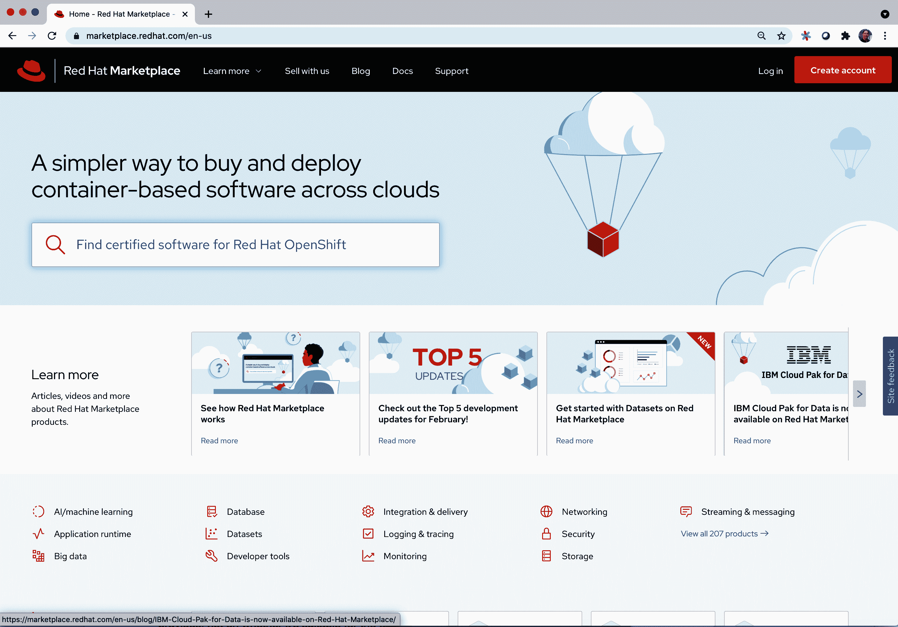
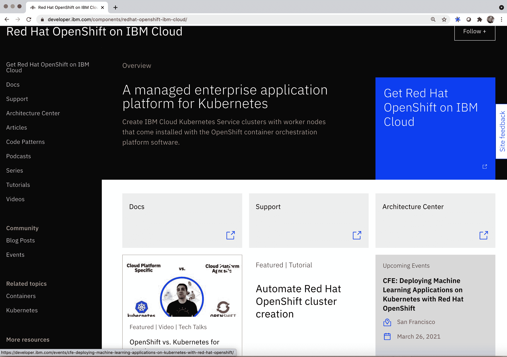
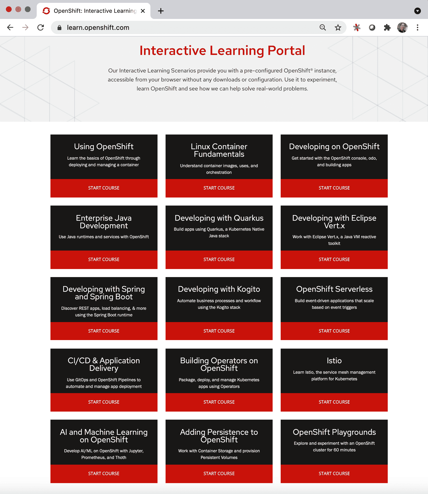
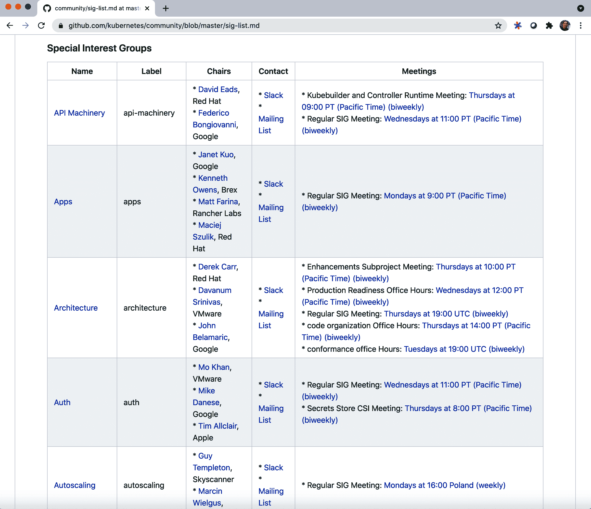

# 第九章。Kubernetes 和 OpenShift 的未来

近年来，在 KubeCon + CloudNativeCon 大会上花一些时间，您很快会得出结论，Kubernetes 的未来非常光明。KubeCon + CloudNativeCon 大会的参与人数正在爆炸式增长。此外，Kubernetes 的开源社区贡献者数量不断扩大和加强。采用 Kubernetes 的行业数量令人震惊。¹ 同样，OpenShift 在过去一年中其客户基础从 1,000 增长到 1,700，并且在财富 500 强公司中也得到了强劲的采用。² 在本章中，我们对传统 Kubernetes 和 OpenShift 的未来做出了一些预测。我们讨论了这些技术在云原生计算的多个方面，包括遗留应用迁移、高性能计算、机器学习和深度学习应用、开源市场以及多云环境中的增长和影响的预期。然后，我们结论本章并讨论了进一步学习的推荐资源。

# 遗留企业应用向云原生应用的迁移加速

多年来，传统的 Kubernetes 和 OpenShift 都取得了显著的改进，将加速遗留企业应用向云原生应用的迁移。引入操作员框架后，这些平台现在能够更好地支持有状态应用，并管理这些应用的完整软件管理生命周期。此外，正如本书前面提到的，OpenShift 平台在工具化领域持续创新，减少了从源代码到拥有完全功能的容器化云原生应用的复杂性。同时，通过利用像 Knative 这样的新项目，Kubernetes 和 OpenShift 大大增加了它们可以支持的应用类型，以支持无服务器和基于函数的编程模型。所有这些创新的融合使得传统的 Kubernetes 和特别是 OpenShift 非常适合支持更广泛的企业应用领域。因此，我们预计在不久的将来，将会出现遗留企业应用向在传统 Kubernetes 和 OpenShift 上运行的云原生应用的急剧加速迁移。此外，我们预计传统大型机应用与云原生应用之间的互操作性和集成将会进一步增强。事实上，已经有一些早期的实验工作表明，COBOL 应用程序可以被容器化，并在 Kubernetes 和 OpenShift 上运行。³

# Kubernetes 在高性能计算中的增强采用

支持高性能计算倡议的服务器集群有着悠久而丰富的历史。这一领域的开创性工作始于上世纪 80 年代末，如 Parallel Virtual Machine（并行虚拟机）平台。⁴ 多年来，高性能计算社区接纳了能够提升效率和可伸缩性的新技术。Kubernetes 及其基于容器的方法提供了多项优势，使其非常适合高性能计算应用环境。由于 Kubernetes 基于容器，该平台启动新任务时的开销较小，并且这些任务可以比基于 VM 的云计算环境支持的任务更为细粒度操作。使用容器而非 VM 创建和销毁计算任务时相关的延迟减少提升了高性能计算环境的可伸缩性。此外，通过在物理服务器上打包更多容器而非有限数量的 VM，可以实现更高效的效率，这对高性能应用至关重要。

除了减少延迟外，Kubernetes 环境还支持并行工作队列模型。可以在[*Kubernetes Up and Running*](https://oreil.ly/e6rve)（O’Reilly）中找到对 Kubernetes 工作队列模型的出色概述。该书中描述的工作队列模型本质上是“任务袋”并行计算模型。研究表明，这种并行计算模型是在集群环境中执行高性能并行应用程序的优越方法。⁵

尽管 Kubernetes 项目自其创立以来已经成熟，但它继续以改进其有效运行工作负载的方式进行创新。最近，Kubernetes 在其工作负载调度算法方面取得了显著进展，使其能够实现更好的集群利用率和高可用性。⁶ Kubernetes SIG Scheduler 团队多年来的努力使 Kubernetes 成为一个在如何为各种定制应用程序需求调度工作负载方面非常灵活和高效的平台。⁷

基于所有这些因素，以及提供基于 Kubernetes 的环境的大量云计算环境，我们预计高性能计算社区将大量采用 Kubernetes。

# Kubernetes 和 OpenShift 将成为机器学习和深度学习的事实标准平台

机器学习和深度学习应用通常需要高度可扩展的环境。在这些领域有专业知识的数据科学家希望使用易于使用的平台，使他们的应用能够在生产环境中规模化运行。类似于我们为高性能计算采用 Kubernetes 的理由，我们预计机器学习和深度学习环境将大大受益于将基于 Kubernetes 的环境作为其主要平台。事实上，像[Kubeflow](https://oreil.ly/NjZxV)这样的倡议已经吸引了大量贡献者参与其开源项目。

# 开放云市场将加速云原生应用的采用

越来越多的企业开始同时使用多个公共云和托管他们本地云的私有数据中心。这些企业迅速意识到，他们需要一种简便的方式来购买、部署和管理能够在所有这些环境中运行的云原生应用软件。为了解决这种情况，开放云市场开始出现。在这些市场上，云原生应用程序使用 Kubernetes 运算符打包模型打包。这种方法使得开放云市场能够自动安装、部署、更新、扩展和备份云原生应用程序。

最近一个开放云市场的例子是[红帽市场](https://oreil.ly/oE1vW)，它允许客户购买能够在所有主要云环境以及本地云上运行的云原生应用软件。红帽市场提供认证、漏洞扫描以及对云原生应用软件的支持，无论您选择在哪个云上部署它。图 9-1 展示了红帽市场首页的快照。

###### 图 9-1\. 红帽[市场](https://oreil.ly/oE1vW)

由于红帽市场上的软件经过审查和认证，它为开发人员提供了构建企业解决方案的最佳工具和软件堆栈的策划视图。这使开发人员能够专注于软件提供的功能，而不是它是否适合他们将其运行的环境。

开发人员可能每年只有几次开始新的开发项目的机会，因此他们很少有机会选择应用程序堆栈和相关工具。像 Red Hat Marketplace 这样的开放云市场使开发人员可以免费尝试他们想要的软件，并在准备好时无缝过渡到商业支持的版本。此外，Red Hat Marketplace 还可以向开发经理提供关于将应用程序部署到每个云的消耗量的可见性。这让他们可以看到在每个平台上的利用情况，从而更好地管理开发成本。

# OpenShift 将成为企业多云的平台

阅读完本书后，你应该对这个最后的预测毫不意外。OpenShift 已经证明它提供了优越的互操作性和工作负载可移植性，并且在所有主要云提供商（包括 IBM Cloud、Google Cloud、Amazon Cloud、Azure 等）中都可用。此外，OpenShift 还利用了 Istio Service Mesh，这一关键的网络技术降低了连接驻留在不同云中的应用程序的复杂性。它还具有专为管理多云集群量身定制的内置工具。基于所有这些原因，我们完全预期 OpenShift 将成为企业多云活动的首选平台。事实上，许多使用 OpenShift 的企业客户已经采纳了使用多个集群的做法，这些集群部署在多个云或多个数据中心中。这种行为可能由多种因素导致。首先，企业可能会因收购而继承在不同云上运行的应用程序。其次，不同的云可能提供不同的服务，企业可能需要一个涵盖多云解决方案的最佳解决方案。第三，数据局部性约束可能作为将关键应用程序锚定在某些云或本地云上的依据。基于所有这些原因，OpenShift 很好地定位为企业多云应用的理想平台。

# 推荐资源

本书涵盖了关于在生产环境中运行传统 Kubernetes 和 OpenShift 的许多概念。在本节中，我们提供了一些推荐资源的列表，这些资源是扩展您的技能和理解 Kubernetes、OpenShift 和云原生应用程序的优秀来源。

## IBM 开发者网站

[IBM 开发者网站](https://developer.ibm.com)为学习 Kubernetes、OpenShift 和其他一百多种开源技术提供大量开发者培训资源。该网站包含大量可重复使用的代码模式，这些模式是开发者每天面临问题的完整解决方案。此外，该网站还提供教程、培训视频、文章以及关于学习开源技术的在线和线下工作坊的列表。IBM 开发者网站的大部分内容都专注于 Kubernetes、OpenShift 以及 Istio、Knative 和容器等相关技术。IBM 开发者网站的 OpenShift 部分如图 9-2 所示。

###### 图 9-2\. IBM 开发者网站的[OpenShift 内容](https://oreil.ly/FllKH)

## 学习 OpenShift

另一个学习 OpenShift 的在线选项是[Learn OpenShift 交互式学习门户](https://learn.openshift.com)。这个交互式学习网站提供预配置的免费 OpenShift 环境，让您可以进行关于多个与 OpenShift 相关主题的实际操作学习，如持续交付、构建运算符、为 OpenShift 添加持久性和开发 OpenShift 应用程序等。图 9-3 展示了 Learn OpenShift 提供的实践课程快照。

###### 图 9-3\. 学习 OpenShift 交互式学习门户的课程提供

## Kubernetes 网站

[Kubernetes 网站](https://kubernetes.io)是获取 Kubernetes 相关信息的绝佳起点。该网站链接了更多关于文档、社区、博客和案例研究等主题的信息。在 Kubernetes GitHub 仓库的[社区](https://oreil.ly/wCjyS)部分，您可以找到更多关于如何加入众多 Kubernetes 特别兴趣小组的信息。Kubernetes 特别兴趣小组信息页面的快照如图 9-4 所示。正如图中所示，每个特别兴趣小组都专注于 Kubernetes 的特定方面。希望您能找到一个激发您兴趣并符合您兴趣的小组。

###### 图 9-4\. Kubernetes 特别兴趣小组列表

## Kubernetes IBM 云提供者特别兴趣小组

如果您有兴趣关注 IBM 云 Kubernetes 服务及其相关技术的演进，这个小组适合您。IBM 云的许多开发者和领导者都在这个小组中公开合作，以确定 IBM 在 Kubernetes 社区中的贡献和参与的未来。您还可以与构建和运营 IBM 云的团队进行互动。有关该小组及其会议的更多信息，请访问[云提供者特别兴趣小组网站](https://oreil.ly/Ie44a)。

## Kubernetes 贡献者体验特别兴趣小组

Kubernetes 社区非常重视其贡献者的幸福感。事实上，他们有一个完整的特别兴趣小组，即贡献者体验 SIG，致力于改善贡献者的体验。贡献者体验 SIG 是一个了不起的团队，他们希望更多了解您，并理解您在成为 Kubernetes 贡献者时可能遇到的问题。访问[贡献者体验 SIG 网站](https://oreil.ly/TrYlt)获取有关如何联系该小组以及了解他们专注的贡献者主题的更多信息。

# 摘要

在本书中，我们涵盖了广泛的主题，以帮助您成功地在生产环境中运行 Kubernetes 和 OpenShift。我们提供了传统 Kubernetes 和 OpenShift 的历史概述，并讨论了推动它们广受欢迎的两个平台的关键优势。我们描述了两种环境的架构以及重要的 Kubernetes 和 OpenShift 概念。然后，我们开始了一个关于基础生产相关主题的旅程，如高级资源管理、单集群高可用性和持续交付。接下来，我们探讨了更高级的多集群利用主题，重点关注多集群的配置、升级和策略支持。然后，我们查看了一个多集群应用交付的工作示例。最后，我们简要讨论了 Kubernetes 和 OpenShift 的未来，并提供了几个推荐的进一步学习资源。我们希望您找到本书有用，并且它为您提供了深入的技能和信心，使您能够在可能遇到的最复杂和先进的 Kubernetes 和 OpenShift 生产级环境上开发和部署云原生应用程序。

¹ [Cloud Native Computing Foundation 网站](https://www.cncf.io) 提供更多信息。

² Jeffrey Burt，“OpenShift、Kubernetes 和混合云”，The Next Platform（2020 年 4 月 28 日），[*https://oreil.ly/aNyAD*](https://oreil.ly/aNyAD)。

³ JJ Asghar，“在 Kubernetes 上运行 COBOL 程序”，IBM Developer（2019 年 5 月 14 日），[*https://oreil.ly/qhqwg*](https://oreil.ly/qhqwg)；IBM Developer Staff，“在 Red Hat OpenShift 和 Kubernetes 上使 COBOL 正常运行”，IBM Developer（2020 年 4 月 20 日），[*https://oreil.ly/FcFJ8*](https://oreil.ly/FcFJ8)。

⁴ VS Sunderam，“PVM：并行分布式计算的框架”，《并发：实践与经验》2:4（1990 年）：315–339。

⁵ BK Schmidt 和 VS Sunderam，“集群环境中开销的实证分析”，《并发实践与经验》6（1994 年）：1–32。

⁶ Wei Huang 和 Aldo CulquiCondor，“引入 PodTopologySpread”，Kubernetes 博客（2020 年 5 月 5 日），[*https://oreil.ly/iKzaV*](https://oreil.ly/iKzaV)。

⁷ 查看文档中的 [Kubernetes Scheduler](https://oreil.ly/exRO9) 获取更多信息。
