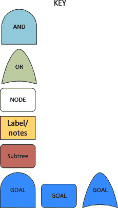

# 第一章：介绍

加入我们，一起探索通过 Pod 进入 Kubernetes 的多种危险路径。从对手的角度来看待系统：了解多种防御方法及其弱点，并通过您的劲敌海盗 Dread Pirate Captain Hashjack 的眼光，重新审视云原生系统的历史攻击。

Kubernetes 迅速发展，但在历史上通常被认为不是“默认安全的”。主要是由于诸如网络和 Pod 安全策略等安全控制在纯净集群上未默认启用。

###### 注意

作为作者，我们无限感激我们的旅程见证了 *云原生启蒙*，并向志愿者、核心贡献者和 [Cloud Native Computing Foundation (CNCF)](https://www.cncf.io) 的成员表示衷心的感谢，感谢他们在 Kubernetes 的愿景和交付中的参与。文档和错误修复不是自己写的，驱动开源社区的无私贡献从未如此自由和受欢迎。

安全控制通常比 Kubernetes 以复杂编排和分布式系统功能而闻名的复杂性更难正确配置。特别是对安全团队，我们感谢您的辛勤工作！本书反映了 Kubernetes 这艘良船的开拓之旅，航行于互联网的波涛汹涌和危险的自由海域。

# 设置场景

为了想象的沉浸体验：您刚刚成为初创货运公司 *Boats, Cranes & Trains Logistics* 的首席信息安全官（CISO），简称为 BCTL，该公司刚刚完成其 Kubernetes 迁移。

公司以前曾遭到黑客攻击，并且“重视安全”。您有权采取必要的措施来确保公司的业务正常运行，无论是在形式上还是实质上。

欢迎来到新工作！这是您的第一天，您已被告知有可信的威胁正在对您的云系统发起攻击。喜欢容器的海盗和一般恶棍 Captain Hashjack 及其秘密黑客团队正准备对 BCTL 的 Kubernetes 集群进行突袭。

如果他们获取了访问权限，他们将挖掘比特币或者加密锁定他们能找到的任何有价值的数据。您尚未对您的集群和应用程序进行威胁建模，或者加固以抵御这类对手，因此我们将指导您保护它们免受盐水船长的攻击，以编码、外泄或掠夺他们能找到的任何贵重物品。

BCTL 集群是使用 [kubeadm](https://oreil.ly/ONVP7) 在公共云提供商上进行的纯净 Kubernetes 安装。初始设置均为默认值。

###### 提示

在电影 *Hackers*（1995）中，可以看到海洋控制系统不稳定的历史例子，例如 *Ellingson Mineral Company* 的油轮遭到公司首席信息安全官 Eugene “The Plague” Belford 的内部攻击（链接：[oreil.ly/F28aj](https://oreil.ly/F28aj)）。

要演示集群加固，我们将使用一个不安全的系统示例。它由 BCTL 网站可靠性工程（SRE）团队管理，这意味着团队负责保护 Kubernetes 主节点。这增加了集群的潜在攻击面：托管服务分别托管控制平面（主节点和`etcd`），它们的加固配置可以防止一些攻击（如直接`etcd`妥协），但这两种方法都依赖于集群的安全配置来保护你的工作负载。

让我们谈谈你的集群。节点在私有网络段运行，因此公共（互联网）流量无法直接访问它们。公共流量通过面向互联网的负载均衡器代理到您的集群：这意味着节点上的端口除非被负载均衡器针对，否则不直接对外可访问。

在集群上运行着一个 SQL 数据存储，以及前端、API 和批处理程序。

托管应用——公司客户的预订服务——使用 GitOps 部署在单个命名空间中，但未使用网络策略或 Pod 安全策略，如第八章中所述。

###### 注意

GitOps 是用于应用程序的声明性配置部署：将其视为 Kubernetes 集群的传统配置管理。您可以在[gitops.tech](https://oreil.ly/y36d0)阅读更多，并了解如何在[这份白皮书](https://oreil.ly/bJgjL)中加固 Git 以用于 GitOps。

图 1-1 展示了系统的网络图。

###### 图 1-1\. 你新公司 BCTL 的系统架构

集群的 RBAC 由已经离职的工程师配置。继承的安全支持服务有入侵检测和加固措施，但团队时常将其禁用，因为它们“噪音太大”。我们将深入讨论这个配置，随着航行的推进。但首先，让我们探讨如何预测集群的安全威胁。

# 开始威胁建模

理解系统如何受攻击对于防御至关重要。威胁模型让您更全面地了解复杂系统，并提供了一个合理化安全和风险的框架。威胁行为者对系统配置以防御潜在对手进行分类。

###### 注意

威胁模型就像指纹：每个都不同。威胁模型基于系统妥协的影响：树莓派业余集群和您银行的集群持有不同的数据，面对不同的潜在攻击者，以及如果遭到入侵会有非常不同的问题。

威胁建模可以揭示关于你的安全程序和配置的见解，但它并不能解决一切——参见马克·曼宁在图 1-2 中关于 CVE 的评论。在考虑威胁模型可能揭示的更高级和技术性攻击之前，你应确保遵循基本的安全卫生习惯（如打补丁和测试）。这对任何安全建议都是适用的。

###### 图 1-2\. 马克·曼宁关于漏洞评估和 CVE 的见解

如果你的系统可以被已发布的 CVE 和一份[Kali Linux](https://www.kali.org)的副本入侵，威胁模型对你没有帮助！

## 威胁行为者

你的威胁行为者可以是*偶然*的或*有动机*的。偶然的对手包括：

+   互联网一代的涂鸦少年——破坏者

+   无意中的闯入者在寻找宝藏（通常是你的数据）

+   随便看看的“脚本小子”，他们会运行任何在互联网上找到的声称能帮助他们入侵的代码

对于大多数打过补丁且配置良好的系统来说，偶然的攻击者不应该是一个关注点。

有动机的个体才是你应该担心的。他们包括内部人员如信任的员工，运作于管控较弱州的有组织犯罪团伙，以及可能与有组织犯罪有重叠或直接赞助它的国家行为者。"互联网犯罪"在国际法中覆盖不足，很难加以监管。

表 1-1 可作为威胁建模的指南。

表 1-1\. 威胁行为者的分类

| 行为者 | 动机 | 能力 | 示例攻击 |
| --- | --- | --- | --- |
| 破坏者：脚本小子，闯入者 | 好奇心，个人名声。因为击倒服务或入侵高知名度公司的机密数据而闻名。 | 使用公开可用的工具和应用程序（如 Nmap，Metasploit，CVE PoCs）。有些实验性质。攻击行为难以掩饰。低目标定位水平。 | 小规模的 DOS 攻击。种植木马。启动预打包的漏洞利用以获取访问权限，进行加密货币挖矿。 |
| 受动个体：政治活动家，小偷，恐怖分子 | 个人、政治或意识形态上的收益。通过篡改版本控制或工件存储中的代码或利用从票务和维基系统、OSINT 或系统其他部分获取的知识，可能获得通过外泄和出售大量个人数据来进行欺诈的个人收益。大众面向网络服务的 DDOS 攻击。通过篡改版本控制中的代码或公共服务器来篡改大众面向服务以在广大受众中传播政治信息。 | 可能以有针对性的方式结合公开可用的漏洞。修改开源供应链。隐匿对最小关注的攻击。 | 钓鱼。DDOS。利用已知漏洞获取系统中的敏感数据以用于牟利和情报，或篡改网站。通过嵌入代码来破坏开源项目，以在用户运行代码时窃取环境变量和秘密。导出的值用于获取系统访问权限并进行加密货币挖矿。 |
| 内部人员：员工，外部承包商，临时工 | 不满，牟利。通过外泄和出售大量个人数据以进行欺诈，或通过对数据完整性进行小幅改动以绕过身份验证进行欺诈。为了赎金加密数据卷。 | 对系统有详细了解，知道如何利用它，并且隐匿行动。 | 利用权限外泄数据（出售）。配置错误/"代码炸弹"来使服务中断以进行报复。 |
| 有组织犯罪：团伙，与国家相关的组织 | 赎金，大规模获取 PII/凭证/PCI 数据。操纵交易以获取财务收益。极有动机访问数据集或修改应用程序以促成大规模欺诈。加密货币勒索软件，例如，加密数据卷并要求现金。 | 能够投入相当资源，雇佣“作者”编写为实现其目的所需的工具和攻击。具有部分贿赂/胁迫/恐吓个人的能力。针对性不同。在达到目标之前隐匿。 | 社会工程/钓鱼。勒索软件（变得更有针对性）。加密货币挖矿。远程访问木马（RATs，数量下降）。利用多个漏洞进行协调攻击，可能使用单个零日漏洞或由恶意个体辅助通过基础设施（例如，Carbanak）进行渗透。 |
| 云服务内部人员：员工，外部承包商，临时工 | 个人收益，好奇心。云提供商应通过分工和技术控制来限制数据访问。 | 取决于云提供商的分工和技术控制。 | 访问或操作数据存储。 |
| 外国情报服务（FIS）：国家机构 | 情报收集，破坏关键国家基础设施，未知。可能窃取知识产权，访问敏感系统，大规模挖掘个人数据，或通过系统持有的位置数据追踪特定个人。 | 破坏或修改硬件/软件供应链。能够渗透组织/供应商，调用研究项目，开发多个零日漏洞。高度定向。高水平的隐蔽性。 | Stuxnet（多个零日漏洞，渗透包括 2 个离线根 CA 的 3 个组织）。SUNBURST（定向供应链攻击，渗透数百个组织）。 |

###### 注意

威胁行为者可能是不同类别的混合体。例如，尤金·贝尔福德是一个内部人员，使用了先进的有组织犯罪方法。

Captain Hashjack 是一个积极的犯罪对手，打算进行勒索或抢劫。我们不赞同他们的策略——他们不公平，是个无赖和恶棍——因此，我们将尽全力阻止他们的不受欢迎的干预。

海盗船员一直在搜寻他们可以在线找到的任何有利信息，并且已经对 BCTL 进行了侦察。使用开源情报（OSINT）技术，如搜索工作岗位和当前员工的 LinkedIn 技能，他们已经确认了组织中使用的技术。他们知道你在使用 Kubernetes，并且能够猜测你从哪个版本开始使用。

## 你的第一个威胁模型

要对 Kubernetes 集群进行威胁建模，首先从系统的架构视图开始，如 Figure 1-3 所示。尽可能收集多的信息以保持所有人的一致性，但需要平衡：确保不要用过多信息压倒人们。

###### 图 1-3\. Kubernetes 示例攻击向量 ([Aqua](https://oreil.ly/3b3ql))

###### 提示

您可以通过 ControlPlane 的 O'Reilly 课程了解如何对 Kubernetes 进行威胁建模：[Kubernetes 威胁建模](https://oreil.ly/Aomcl)。

这个初步的图表可能展示整个系统，或者你可以选择仅限于一个小区域或重要区域，例如特定的 pod、节点或控制平面。

威胁模型的“范围”是其目标：我们目前最感兴趣的系统部分。

接下来，你要放大你的范围。在数据流图中，像 Figure 1-3 那样建模数据流和组件之间的信任边界。在决定信任边界时，考虑 Captain Hashjack 可能如何攻击组件。

> 详尽列出可能性胜过部分可行性的清单。
> 
> Adam Shostack，《威胁建模》

现在你知道你正在防御的对手是谁，你可以列举一些针对系统的高级威胁，并开始检查你的安全配置是否足以抵御它们。

要生成可能的威胁，您必须内化攻击者的心态：模拟他们的本能并预防他们的战术。图 1-4 中的谦逊数据流图是您硅质堡垒的防御地图，它必须能够抵御 Hashjack 及其混浊的同类。

###### 图 1-4\. Kubernetes 数据流图（[GitHub](https://oreil.ly/J8INO)）

###### 提示

应尽可能与多方利益相关者（开发、运维、质量保证、产品、业务利益相关者、安全）一起执行威胁建模，以确保思维的多样性。

您应该尝试在没有外部影响的情况下构建威胁模型的第一个版本，以促进流畅的讨论和有机的思想生成。然后，您可以引入外部来源来交叉检查团队的思维。

现在您已经收集了有关系统的所有信息，您可以进行头脑风暴。考虑简单性、诡计和狡猾。任何可以想象到的攻击都在范围内，并且您将分别评估攻击的可能性。有些人喜欢使用分数和加权数字进行评估，其他人则更喜欢理性化攻击路径。

将您的想法记录在电子表格、思维导图、列表或者其他合理的方式中。没有规则，只有尝试、学习和优化您自己版本的过程。尝试对威胁进行分类，并确保您能轻松审查捕获的数据。完成第一遍后，考虑您可能错过的内容，并进行快速第二遍。

现在您已经生成了初始的威胁——干得好！现在是时候将它们绘制成图表，以便更容易理解。这就是攻击树的工作：海盗的宝藏地图。

# 攻击树

攻击树显示了潜在的渗透向量。图 1-5 模拟了如何摧毁 Kubernetes 控制平面。

攻击树可能非常复杂，跨越多个页面，因此您可以像这个范围缩小的分支一样从小处开始。

此攻击树专注于拒绝服务（DoS），该攻击阻止（“否定”）系统（“服务”）的访问。攻击者的目标位于图表顶部，可用的路径从树的根（底部）开始。左侧的关键显示了逻辑“OR”和“AND”节点所需的形状，这些节点累积到树的顶部：负面结果。令人困惑的是，攻击树可以是自底向上或自顶向下的：在本书中，我们专门使用自底向上。我们将在本章后面详细讨论攻击树。

###### 图 1-5\. Kubernetes 攻击树（[GitHub](https://oreil.ly/J8INO)）

###### 提示

[Kelly Shortridge](https://oreil.ly/BnOKx)在浏览器中的安全决策树工具[Deciduous](https://oreil.ly/qALgH)可用于生成这些攻击树作为代码。

随着我们在书中的进展，我们将使用这些技术来识别 Kubernetes 的高风险区域，并考虑成功攻击的影响。

###### 提示

在[CVE-2019-11253](https://oreil.ly/8BOcs)中，YAML 反序列化的 *Billion laughs* 攻击影响了 Kubernetes 到 v1.16.1，通过攻击 API 服务器。由于它已经修复，所以这种攻击不在此攻击树中，但将历史攻击添加到您的攻击树中是承认其威胁的一种有用方法，如果您认为它们有很高的再发生机会。

# 示例攻击树

也有必要绘制攻击树来概念化系统可能受到攻击的方式，并使控制更容易推理。幸运的是，我们的初始威胁模型包含了一些有用的例子。

这些图表使用一个简单的图例，见图 1-6。

###### 图 1-6\. 攻击树图例

“目标”是攻击者的目标，我们正在构建攻击树来理解如何防止它。

逻辑的“AND”和“OR”门定义了需要完成哪些子节点以通过它们的进展。

在图 1-7 中，您可以看到一个攻击树，以威胁行为者在容器中的远程代码执行开始。

###### 图 1-7\. 攻击树：受损容器

现在您知道您想要防范的内容，并且有了一些简单的攻击树，因此您可以量化要使用的控制措施。

# 先例

此时，您的团队已生成威胁列表。现在我们可以将它们与一些常用的威胁建模技术和攻击数据进行交叉参考：

+   [STRIDE](https://oreil.ly/M9rEq)（枚举可能威胁的框架）

+   [Microsoft Kubernetes 威胁矩阵](https://oreil.ly/YUaS3)

+   [MITRE ATT&CK® 容器矩阵](https://oreil.ly/IV2TO)

+   [OWASP Docker Top 10](https://oreil.ly/1EySd)

现在也是利用可能已经存在的预先存在的泛化威胁模型的好时机：

+   [Trail of Bits](https://oreil.ly/EcBuQ) 和 [Atredis Partners](https://oreil.ly/p6yeJ) 的 [Kubernetes 威胁模型](https://oreil.ly/qNvIm)，用于 Kubernetes 安全审计工作组（现在是 [SIG-security](https://oreil.ly/i8Yy0)）以及[相关的安全发现](https://oreil.ly/3WTvR)，审查 Kubernetes 代码库以及如何攻击编排器

+   [ControlPlane 的 Kubernetes 威胁模型和攻击树](https://oreil.ly/L640h) 适用于 [CNCF 金融服务用户组](https://oreil.ly/ETgu4)，考虑用户对 Kubernetes 的使用和硬化配置

+   [NCC 的威胁模型和控制](https://oreil.ly/J6VxA) 关注系统配置

没有完整的威胁模型。它是来自您的利益相关者的现阶段最佳努力，并应定期修订和更新，因为架构、软件和外部威胁将不断变化。

> 软件永远不会完成。你不能停止它的工作。它是一个正在运动的生态系统的一部分。
> 
> Moxie Marlinspike

# 结论

现在，你已经掌握了基础知识：你了解你的对手，哈希杰克船长，以及他们的能力。你理解了威胁模型是什么，为什么它是至关重要的，以及如何达到全面了解系统的角度。在这一章中，我们进一步讨论了威胁行为者和攻击树，并通过一个具体的例子进行了演示。我们现在心中有了一个模型，所以我们将探索主要的 Kubernetes 领域的每一个方面。让我们一跃而下：我们从 Pod 开始。
