# 第二章：Pod 级资源

本章涉及 Kubernetes 部署的原子单位：Pod。Pod 运行应用程序，一个应用程序可以是一个或多个容器在一个或多个 Pod 中协作。

我们将考虑 Pod 内外可能发生的不良情况，并探讨如何减少被攻击的风险。

与任何合理的安全工作一样，我们将从为系统定义一个轻量级威胁模型开始，确定它所防范的威胁行为者，并强调最危险的威胁。这为您制定对策和控制措施，采取防御措施以保护客户的宝贵数据提供了坚实的基础。

我们将深入探讨 Pod 的安全模型，看看默认情况下哪些是可信的，我们可以通过配置加强安全性，以及攻击者的路径是什么样的。

# 默认设置

Kubernetes 在历史上并没有默认安全强化，有时这可能导致特权升级或容器突破。

如果我们放大单个 Pod 与主机之间的关系，如 图 2-1 所示，我们可以看到 `kubelet` 为容器提供的服务以及可能将对手阻挡在外的安全边界。

默认情况下，大部分都以最低特权合理配置，但用户提供的配置更普遍时（如 Pod YAML、集群策略、容器镜像），就会有更多意外或恶意误配置的机会。大多数默认值是合理的——本章中我们将向您展示它们的不足，并演示如何测试您的集群和工作负载是否安全配置。

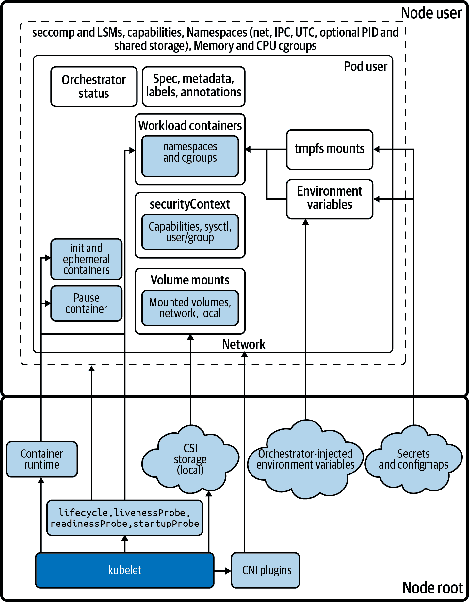

###### 图 2-1\. Pod 架构

# 威胁模型

我们为每个威胁模型定义一个范围。在这里，您正在对 Pod 进行威胁建模。让我们首先考虑 Kubernetes 威胁的一个简单组：

[网络上的攻击者](https://oreil.ly/PoRXb)

敏感端点（如 API 服务器）如果公开，可以轻易遭受攻击。

[受损应用程序导致容器内的立足点](https://oreil.ly/CYG04)

被攻击的应用程序（远程代码执行、供应链妥协）是攻击的开始。

[建立持久性](https://oreil.ly/zJGhK)

窃取凭据或获得对 Pod、节点和/或容器重启具有韧性的持久性。

[恶意代码执行](https://oreil.ly/POnQ9)

运行利用程序进行枢轴或升级并枚举端点。

[访问敏感数据](https://oreil.ly/agQ7E)

从 API 服务器、附加存储和可通过网络访问的数据存储读取机密数据。

[服务拒绝](https://oreil.ly/nr7Cb)

很少是攻击者的时间的好用法。钱包拒绝和加密锁定是常见的变体。

###### 提示

“先前的艺术” 中的威胁源具有其他负面结果可供参考。

# 攻击解剖学


Hashjack 船长通过枚举 BCTL 的 DNS 子域和 S3 存储桶开始了对您系统的攻击。这些可能为组织的系统提供了一个简单的入口，但在这个场合上，并没有什么容易被利用的。

他们不屈不挠地在公共网站上创建了一个帐户并登录，使用像[zaproxy](https://www.zaproxy.org)（OWASP Zed Attack Proxy）这样的 Web 应用程序扫描器来探查 API 调用和应用程序代码的意外响应。他们在寻找泄漏的 Web 服务器标语和版本信息（以了解可能成功的利用）以及通常注入和模糊 API 以处理不当处理的用户输入。

这并非您的维护不善的代码库和系统能够长期经受的审查水平。攻击者可能在大海捞针，但只有最安全的干草堆根本没有针。

###### 注意

任何计算机都应该对这种不加选择的攻击类型保持抵抗力：一个 Kubernetes 系统应该通过能力来保护自己免受普通攻击，并使用最新的软件和加固的配置达到“最小可行安全性”。Kubernetes 通过支持最后三个次要版本发布（例如，1.24、1.23 和 1.22），每 4 个月发布一次，确保一年的补丁支持，鼓励定期更新。旧版本不受支持，可能存在漏洞。

尽管攻击的许多部分可以自动化进行，但这是一个复杂的过程。一个普通的攻击者更可能广泛扫描触发已发布 CVE 的软件路径，并对大范围的 IP 地址（如公共云提供商广告的范围）运行自动化工具和脚本。这些方法很喧闹。

## 远程代码执行

如果您的应用程序中存在漏洞可以用来运行不受信任的（在这种情况下，是外部的）代码，则称为远程代码执行（RCE）。对手可以使用 RCE 生成一个远程控制会话到应用程序的环境：在这里，是处理网络请求的容器，但如果 RCE 成功将不受信任的输入传递到系统更深层，它可能利用不同的进程、Pod 或集群。

您在 Kubernetes 和 Pod 安全的首要目标应是防止 RCE，这可能就像一个 `kubectl exec` 那样简单，或者像反向 shell 那样复杂，例如图 2-2 中演示的。

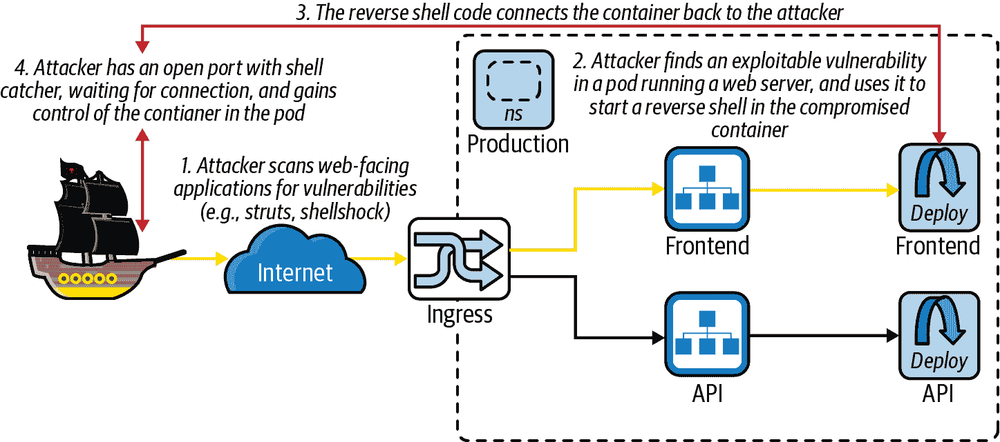

###### 图 2-2\. 反向 shell 进入 Kubernetes Pod

应用程序代码经常发生变化，并可能隐藏未发现的错误，因此强大的应用程序安全（AppSec）实践（包括工具的 IDE 和 CI/CD 集成以及专用安全要求作为任务验收标准）对于防止攻击者威胁到运行在 Pod 中的进程至关重要。

###### 注意

Java 框架 Struts 是最广泛部署的库之一，曾经遭受过远程可利用的漏洞 (CVE-2017-5638)，这导致了 Equifax 客户数据的泄露。为了修复容器中这样的供应链漏洞，可以在 CI 中快速重建并部署带有补丁的库，从而减少容易受到互联网攻击的脆弱库的风险窗口。我们在全书中探讨其他获得远程代码执行的方式。

现在，让我们转向网络方面。

## 网络攻击面

Kubernetes 集群的最大攻击面是其网络接口和面向公众的 pod。网络接口服务，如 web 服务器，在保持集群安全性方面是第一道防线，这是我们将在 第五章 中深入探讨的话题。

这是因为从网络跨界而来的未知用户可以扫描面向网络的应用程序，以查找远程代码执行的可利用迹象。他们可以使用自动化网络扫描工具尝试利用已知漏洞和输入处理错误在面向网络的代码中。如果一个进程或系统被迫以意外的方式运行，那么通过这些未经测试的逻辑路径可能会被攻击。

要了解攻击者如何仅仅通过谦逊而强大的 Bash shell 在远程系统中建立立足点的例子，请参见 Paul Troncone 和 Carl Albing 的 [*Cybersecurity Ops with bash*](https://oreil.ly/ZmILo) 第十六章。

要抵御这种情况，我们必须扫描容器中的操作系统和应用程序 CVE，希望在它们被利用之前更新它们。

如果 Hashjack 队长能够在一个 pod 中实现 RCE，那么这是从 pod 的网络位置和权限设置更深入地攻击系统的立足点。您应该努力限制攻击者可以从此位置做的事情，并根据工作负载的敏感性定制您的安全配置。如果您的控制过于宽松，这可能是您雇主 BCTL 组织范围内的一次漏洞起源。

###### 提示

要了解通过 Struts 和 Metasploit 生成 shell 的示例，请参阅 [Sam Bowne 的指南](https://oreil.ly/nzsxP)。

正如 Dread Pirate Hashjack 刚刚发现的那样，我们还在运行一个容易受攻击的 Struts 库版本。这为从内部攻击集群提供了一个机会。

###### 警告

像这样一个简单的 Bash 反向 shell 是移除容器中 Bash 的一个好理由。它使用了 Bash 的虚拟 */dev/tcp/* 文件系统，并且在 `sh` 中是不可利用的，因为它不包括这个经常被滥用的功能：

```
user@host:~ [0]$ docker run -it --runtime=runsc sublimino/hack \
  ls -lasp /proc/1

total 0
0 dr-xr-xr-x 1 root root 0 May 23 16:22 ./
0 dr-xr-xr-x 2 root root 0 May 23 16:22 ../
0 -r--r--r-- 0 root root 0 May 23 16:22 auxv
0 -r--r--r-- 0 root root 0 May 23 16:22 cmdline
0 -r--r--r-- 0 root root 0 May 23 16:22 comm
0 lrwxrwxrwx 0 root root 0 May 23 16:22 cwd -> /root
0 -r--r--r-- 0 root root 0 May 23 16:22 environ
0 lrwxrwxrwx 0 root root 0 May 23 16:22 exe -> /usr/bin/coreutils
0 dr-x------ 1 root root 0 May 23 16:22 fd/
0 dr-x------ 1 root root 0 May 23 16:22 fdinfo/
0 -rw-r--r-- 0 root root 0 May 23 16:22 gid_map
0 -r--r--r-- 0 root root 0 May 23 16:22 io
0 -r--r--r-- 0 root root 0 May 23 16:22 maps
0 -r-------- 0 root root 0 May 23 16:22 mem
0 -r--r--r-- 0 root root 0 May 23 16:22 mountinfo
0 -r--r--r-- 0 root root 0 May 23 16:22 mounts
0 dr-xr-xr-x 1 root root 0 May 23 16:22 net/
0 dr-x--x--x 1 root root 0 May 23 16:22 ns/
0 -r--r--r-- 0 root root 0 May 23 16:22 oom_score
0 -rw-r--r-- 0 root root 0 May 23 16:22 oom_score_adj
0 -r--r--r-- 0 root root 0 May 23 16:22 smaps
0 -r--r--r-- 0 root root 0 May 23 16:22 stat
0 -r--r--r-- 0 root root 0 May 23 16:22 statm
0 -r--r--r-- 0 root root 0 May 23 16:22 status
0 dr-xr-xr-x 3 root root 0 May 23 16:22 task/
0 -rw-r--r-- 0 root root 0 May 23 16:22 uid_map
```

攻击开始时，让我们看看海盗们已经登陆的地方：在一个 Kubernetes pod 内部。

# Kubernetes 工作负载：Pod 中的应用程序

多个协作容器可以逻辑上分组成一个单独的 pod，Kubernetes 运行的每个容器必须在一个 pod 内运行。有时一个 pod 被称为“工作负载”，这是相同执行环境的许多副本之一。每个 pod 必须运行在 Kubernetes 集群中的一个节点上，如图 2-3 所示。

一个 pod 是您的应用程序的单个实例，为了满足需求进行扩展，使用许多相同的 pod 来复制应用程序，通过工作负载资源（如 Deployment、DaemonSet 或 StatefulSet）。

您的 pods 可能包括支持监控、网络和安全性的 sidecar 容器，以及用于 pod 引导的“init”容器，使您能够部署不同的应用程序样式。这些 sidecars 可能具有提升的特权，并且可能引起对手的兴趣。

“Init”容器按顺序运行（从头到尾），以设置 pod 并可以对命名空间进行安全更改，例如 Istio 的 init 容器会配置 pod 的 *iptables*（内核的 netfilter），以便运行时（非 init 容器）的 pods 通过 sidecar 容器路由流量。Sidecars 与 pod 中的主要容器并行运行，pod 中的所有非 init 容器同时启动。

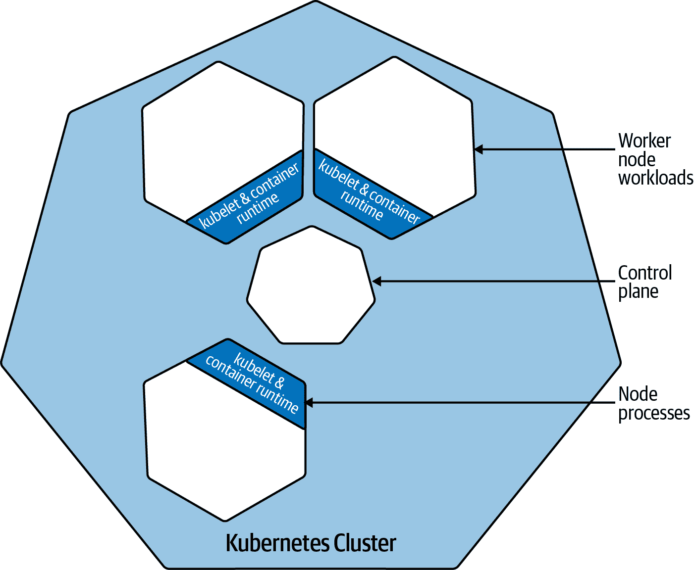

###### 图 2-3\. 集群部署示例；来源：[Kubernetes 文档](https://oreil.ly/Co9Hx)

一个 pod 的内部有什么？云原生应用程序通常是微服务、Web 服务器、工作者和批处理过程。一些 pods 运行一次性任务（包装在作业中，或者可能是一个单一的非重启容器），也许运行多个其他 pods 以协助。所有这些 pods 都为攻击者提供了机会。Pods 被黑客攻击。或者更常见的是，一个面向网络的容器进程被黑客攻击。

一个 pod 是一个信任边界，包括内部的所有容器，包括它们的身份和访问权限。在威胁建模时，应考虑 pod 的整个内容，尽管可以通过策略配置增强 pod 之间的分离。

###### 小贴士

Kubernetes 是一个分布式系统，操作的顺序（例如应用多文档 YAML 文件）是最终一致的，这意味着 API 调用并不总是按照您期望的顺序完成。顺序依赖于各种因素，不应依赖于其顺序完成。Tabitha Sable 对 Kubernetes 有一个机械共鸣的定义。

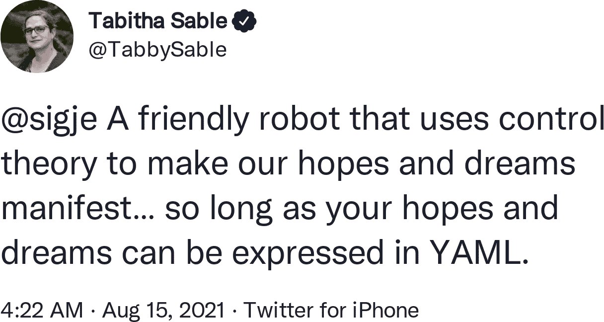

# 什么是 Pod？

如图 2-4 所示，一个 pod 是 Kubernetes 的一种创新。它是多个容器运行的环境。Pod 是您可以要求 Kubernetes 运行的最小可部署单元，其中的所有容器将在同一个节点上启动。Pod 有自己的 IP 地址，可以挂载存储，并且其命名空间围绕由容器运行时（如 `containerd` 或 CRI-O）创建的容器。

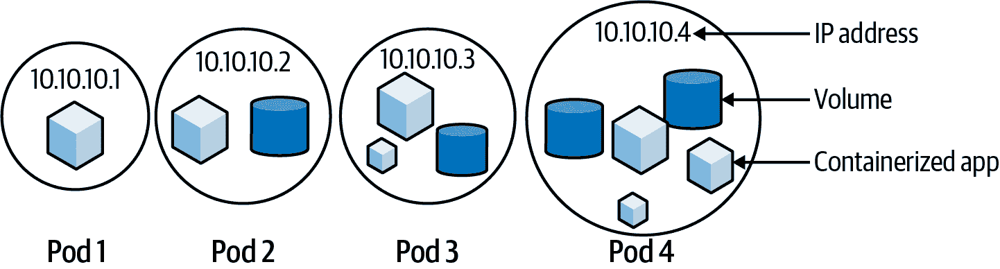

###### 图 2-4\. 示例 pods（来源：[Kubernetes 文档](https://oreil.ly/YwBSv)）

容器是一个迷你 Linux，其进程通过控制组（`cgroups`）进行容器化以限制资源使用，并通过命名空间限制访问。我们将在本章中看到，可以应用各种其他控制来限制容器化进程的行为。

Pod 的生命周期由 `kubelet` 控制，它是 Kubernetes API 服务器的代理，部署在集群中的每个节点上以管理和运行容器。如果 `kubelet` 与 API 服务器失去联系，它将继续管理其工作负载，并在必要时重新启动它们。如果 `kubelet` 崩溃，容器管理器也将保持容器运行，以防止它们崩溃。`kubelet` 和容器管理器监督您的工作负载。

`kubelet` 在工作节点上运行 pod，指导容器运行时并配置网络和存储。每个 pod 中的容器是 Linux 命名空间、`cgroups`、功能和 Linux 安全模块（LSM）的集合。当容器运行时构建容器时，每个命名空间都会被单独创建和配置，然后组合成容器。

###### Tip

功能是“特殊”根用户操作的单独开关，例如更改任何文件的权限、将模块加载到内核中、以原始模式访问设备（例如网络和 I/O）、BPF 和性能监控，以及所有其他操作。

root 用户拥有所有功能，并且功能可以授予任何进程或用户（“环境功能”）。过多的功能授予可能导致容器突破，正如本章后面所见。

在 Kubernetes 中，容器运行时将新创建的容器添加到 pod 中，其中它与 pod 容器之间共享网络和进程间通信命名空间。

图 2-5 显示一个 `kubelet` 在单个节点上运行四个独立的 pod。

容器是对抗敌人的第一道防线，应在运行之前扫描容器镜像中的 CVEs。这一简单步骤减少了运行过时或恶意容器的风险，并影响您基于风险的部署决策：您是否将其部署到生产环境，还是需要先修补可利用的 CVE？

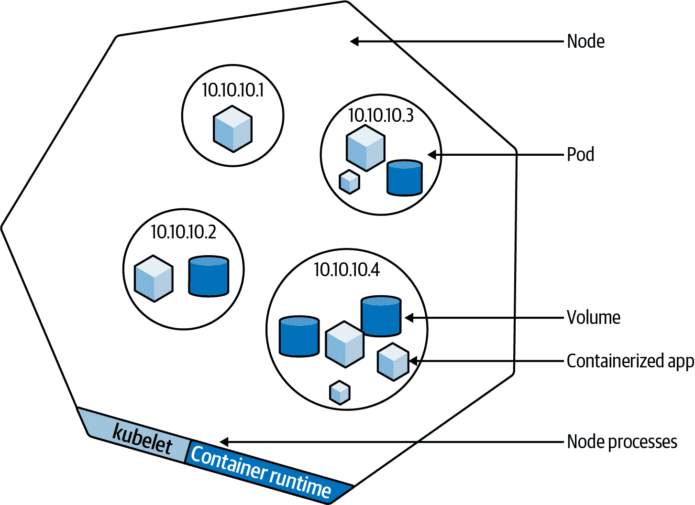

###### 图 2-5\. 节点上的示例 pod（来源：[Kubernetes 文档](https://oreil.ly/ksFim)）

###### Tip

公共注册表中的“官方”容器镜像更有可能保持最新并得到良好的修补，Docker Hub 通过 Notary 签署所有官方镜像，如我们将在第四章中看到的那样。

公共容器注册表通常托管恶意镜像，因此在生产之前检测它们至关重要。图 2-6 显示了这种情况可能发生的方式。

`kubelet`将 pod 连接到容器网络接口 (CNI)。CNI 网络流量被视为第 4 层 TCP/IP（尽管 CNI 插件使用的底层网络技术可能不同），加密是 CNI 插件、应用程序、服务网格或最少是节点之间的底层网络的工作。如果流量未加密，可能会被受损的 pod 或节点嗅探到。

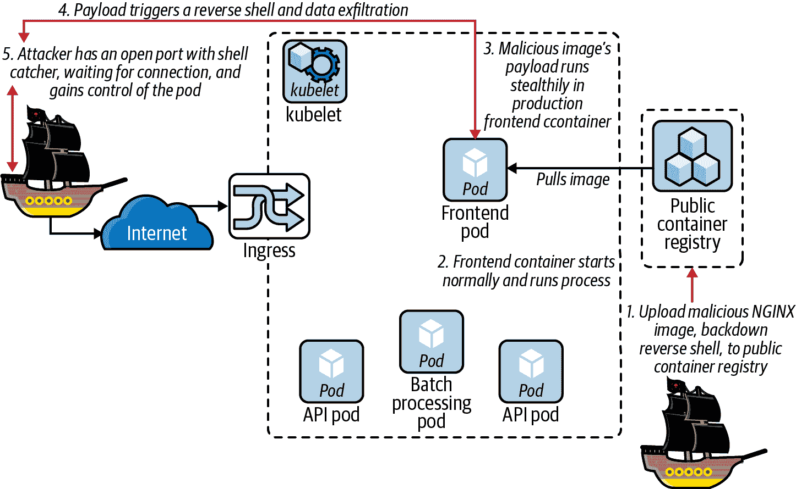

###### 图 2-6\. 毒害公共容器注册表

###### 警告

尽管在正确配置的容器运行时下启动恶意容器通常是安全的，但曾经发生过针对容器引导阶段的攻击。我们将在本章后面审查*/proc/self/exe*越狱 CVE-2019-5736。

Pod 也可以通过 Kubernetes 附加存储，使用([容器存储接口 (CSI)](https://oreil.ly/S8v3B))，其中包括 PersistentVolumeClaim 和 StorageClass，显示在图 2-7 中。在第六章中，我们将更深入地探讨存储方面的内容。

在图 2-7 中，您可以看到控制平面的视图和 API 服务器在集群中的核心角色。API 服务器负责与集群数据存储(`etcd`)交互，托管集群的可扩展 API 表面，并管理`kubelet`。如果 API 服务器或`etcd`实例受到 compromisation，攻击者将完全控制集群：这些是系统中最敏感的部分。

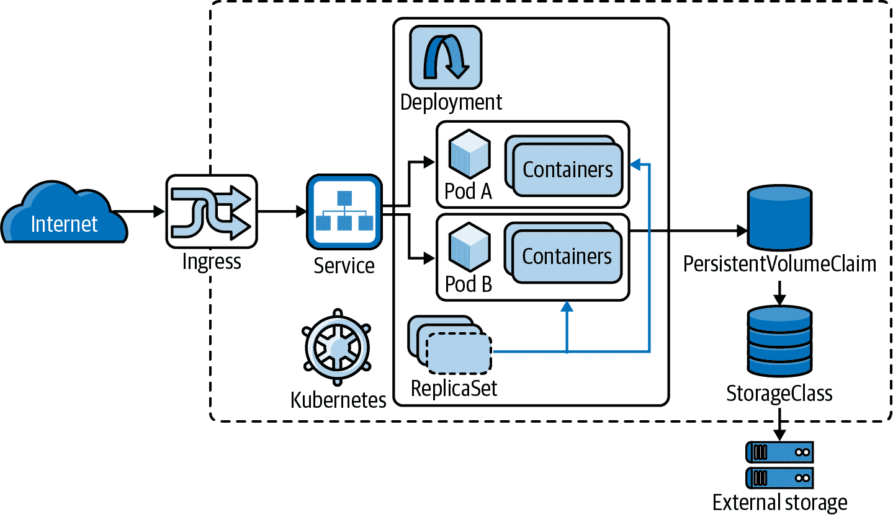

###### 图 2-7\. 集群示例 2 (来源: [Tsuyoshi Ushio](https://oreil.ly/szUug))

###### 警告

存储驱动中发现了多个漏洞，包括暴露了对`gitrepo`存储卷的 Git 攻击的 CVE-2018-11235，以及子路径卷挂载处理错误的 CVE-2017-1002101。我们将在第六章中详细讨论这些问题。

对于较大集群的性能，控制平面应在单独的基础设施上运行`etcd`，这需要高磁盘和网络 I/O 以支持其分布式一致性算法[Raft](https://oreil.ly/V5lbf)的合理响应时间。

由于 API 服务器是`etcd`集群的唯一客户端，因此任何一方的妥协都将有效地使集群受到限制：由于异步调度，在 Kubernetes 中，向`etcd`注入恶意的未调度的 pod 将触发它们的调度到一个`kubelet`。

与所有快速移动的软件一样，Kubernetes 堆栈的大部分部分都存在漏洞。对现代软件的唯一解决方案是健康的持续集成基础设施，能够在漏洞公告后及时重新部署受损的集群。

# 理解容器

好的，我们已经对集群有了一个高层次的视图。但在低层次上，“容器”是什么？它是 Linux 的微观世界，为一个进程提供了一个专用内核、网络和用户空间的幻觉。软件技巧让容器内的进程相信它是在主机上唯一运行的进程。这对于隔离和将现有工作负载迁移到 Kubernetes 中是有用的。

###### 注意

正如[Christian Brauner](https://oreil.ly/lBByx)和[Stéphane Graber](https://oreil.ly/DsmkD)喜欢[说的](https://oreil.ly/sTkqN)，“（Linux）容器是一个用户空间的虚构”，一个配置集合，向内部进程呈现隔离的幻觉。容器起源于原始的内核汤，是演化的产物，而不是智能设计的产物，已经被改变、完善和强迫成形，以至于我们现在有了可用的东西。

容器并不是作为单一的 API、库或内核特性存在的。它们只是在内核启动一组命名空间、配置一些`cgroups`和功能、添加 Linux 安全模块如 AppArmor 和 SELinux，并在内部启动我们珍贵的小进程后剩下的捆绑和隔离结果。

一个容器是一个在特殊环境中的进程，具有一些命名空间的组合，这些命名空间可以启用或与主机（或其他容器）共享。该进程来自一个容器镜像，一个包含容器根文件系统、其应用程序和任何依赖项的 TAR 文件。当镜像被解压到主机上的一个目录中并创建一个特殊的文件系统“pivot root”时，一个“容器”就围绕它构建起来，并且从容器内的文件系统中运行其`ENTRYPOINT`。这大致是一个容器启动的方式，一个 pod 中的每个容器都必须经历这个过程。

容器安全有两个部分：容器镜像的内容，以及其运行时配置和安全上下文。一个容器的抽象风险评级可以从它启用和安全使用的安全原语数量中得出，避免使用主机命名空间，通过`cgroups`限制资源使用，放弃不需要的功能，为进程的使用模式加强安全模块配置，并最小化进程和文件系统的所有权和内容。[Kubesec.io](https://kubesec.io) 根据运行时如何有效地启用这些功能来评估 pod 配置的安全性。

当内核检测到网络命名空间为空时，它将销毁该命名空间，删除分配给其中网络适配器的任何 IP。对于只有一个容器来保存网络命名空间 IP 分配的 pod，一个崩溃并重新启动的容器将创建一个新的网络命名空间，因此会分配一个新的 IP。这种 IP 的快速更换会为您的运营商和安全监控带来不必要的噪音。Kubernetes 使用所谓的暂停容器（另请参阅“Pod 内部网络”），以保持 pod 的共享网络命名空间在租户容器发生崩溃循环时保持打开状态。从工作节点内部看，每个 pod 中的伴随暂停容器如下所示：

```
user@host:~ [0]$ diff -u \
  <(docker run -t sublimino/hack ls -1 /proc/1) \
  <(docker run -t --runtime=runsc sublimino/hack ls -1 /proc/1)

-arch_status
-attr
-autogroup
 auxv
-cgroup
-clear_refs
 cmdline
 comm
-coredump_filter
-cpu_resctrl_groups
-cpuset
 cwd
 environ
 exe
@@ -16,39 +8,17 @@
 fdinfo
 gid_map
 io
-limits
-loginuid
-map_files
 maps
 mem
 mountinfo
 mounts
-mountstats
 net
 ns
-numa_maps
-oom_adj
 oom_score
 oom_score_adj
-pagemap
-patch_state
-personality
-projid_map
-root
-sched
-schedstat
-sessionid
-setgroups
 smaps
-smaps_rollup
-stack
 stat
 statm
 status
-syscall
 task
-timens_offsets
-timers
-timerslack_ns
 uid_map
-wchan
```

这个暂停容器在 Kubernetes API 中是不可见的，但在工作节点上的容器运行时可见。

###### 注意

CRI-O 通过固定命名空间来摆脱暂停容器（除非绝对必要），如 KubeCon 演讲中所述 [“CRI-O: Look Ma, No Pause”](https://oreil.ly/EqEwr)。

## 共享网络和存储

一个 pod 中的一组容器共享一个网络命名空间，因此 pod 中的所有容器端口都对每个容器的相同网络适配器可用。这使得 pod 中一个容器中的攻击者有机会攻击任何网络接口上可用的私有套接字，包括环回适配器 `127.0.0.1`。

###### 提示

我们将在第五章和第六章中更详细地讨论这些概念。

每个容器都在其容器镜像的根文件系统中运行，这些根文件系统在容器之间不共享。卷必须挂载到 pod 配置中的每个容器中，但如果配置为这样，一个 pod 的卷可能对所有容器可用，就像你在图 2-4 中看到的那样。

图 2-8 显示了容器工作负载内部的一些路径，攻击者可能感兴趣（请注意 `user` 和 `time` 命名空间目前未被使用）。

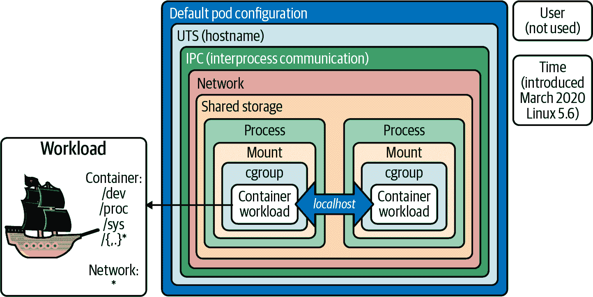

###### 图 2-8\. 包裹 pod 中容器的命名空间（[灵感来自 Ian Lewis](https://oreil.ly/nH9y8)）

###### 注意

用户命名空间是最终的内核安全前沿，通常不启用，因为在历史上很可能是内核攻击的入口：Linux 中的一切都是文件，用户命名空间的实现横跨整个内核，使其比其他命名空间更难以保护。

这里列出的特殊虚拟文件系统都是如果配置错误并在容器内可访问，则可能导致突破的所有可能路径：*/dev* 可能会访问主机的设备，*/proc* 可能会泄漏进程信息，或者 */sys* 支持启动新容器等功能。

## 最糟糕的情况是什么？

作为企业的安全首席信息安全官（CISO），您应负责组织的安全工作。作为 CISO，您应考虑最坏的情况，确保您拥有适当的防御措施和缓解措施。攻击树有助于建模这些负面结果，而您可以使用的数据源之一就是威胁矩阵，如 图 2-9 所示。

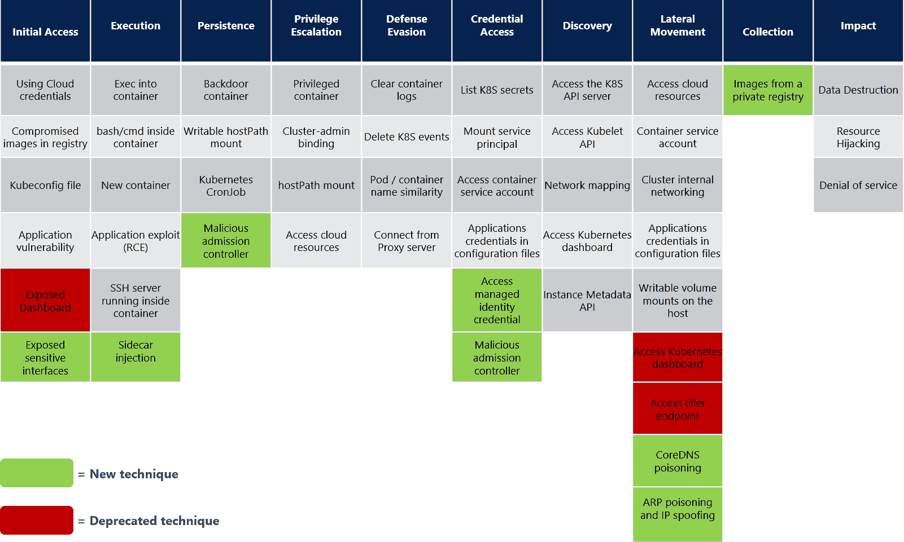

###### 图 2-9\. 微软 Kubernetes 威胁矩阵；来源：[“为 Kubernetes 更新的威胁矩阵保护容器化环境”](https://oreil.ly/JzdmV)

但是还有一些缺失的威胁，社区已经添加了一些（感谢 Alcide，[Brad Geesaman](https://oreil.ly/Ll2de) 和 [Ian Coldwater](https://oreil.ly/NmidV)），如 表 2-1 所示。

表 2-1\. 我们增强的微软 Kubernetes 威胁矩阵

| 初始访问（入侵 Shell 预备工作 - 部分 1） | 执行（入侵 Shell 执行 - 部分 2） | 持久性（保持 Shell） | 特权升级（容器突破） | 防御逃避（假设没有 IDS） | 凭据访问（重要凭据） | 发现（枚举可能的枢纽） | 横向移动（枢纽） | 命令和控制（C2 方法） | 影响（危险） |
| --- | --- | --- | --- | --- | --- | --- | --- | --- | --- |
| 使用云凭据：服务账号密钥，冒充 | 执行到容器中（绕过准入控制策略） | 后门容器（向本地或容器注册表镜像添加反向 shell） | 特权容器（合法升级到主机） | 清除容器日志（主机突破后覆盖轨迹） | 列出 K8s 机密 | 列出 K8s API 服务器（nmap，curl） | 访问云资源（工作负载标识和云集成） | 动态解析（DNS 隧道） | 数据销毁（数据存储，文件，NAS，勒索软件…） |
| 注册表中的受损镜像（供应链未修补或恶意） | 容器内的 BASH/CMD（植入物或特洛伊木马，RCE/反向 shell，恶意软件，C2，DNS 隧道） | 可写主机路径挂载（主机挂载突破） | 群集管理员角色绑定（未经测试的 RBAC） | 删除 K8s 事件（主机突破后覆盖轨迹） | 挂载服务主体（Azure 特定） | 访问 `kubelet` API | 容器服务账户（API 服务器） | 应用协议（L7 协议，TLS，…） | 资源劫持（加密货币挖矿，恶意软件 C2/分发，开放中继，僵尸网络成员） |
| 应用程序漏洞（供应链未修补或恶意） | 启动新容器（带有恶意负载：持久性，枚举，观察，升级） | K8s CronJob（定时反向 shell） | 访问云资源（通过工作负载标识元数据攻击） | 从代理服务器连接（覆盖源 IP，外部到集群） | 应用程序配置文件中的应用程序凭证（密钥材料） | 访问 K8s 仪表板（UI 需要服务账户凭据） | 群集内部网络（攻击相邻的 Pod 或系统） | 僵尸网络（k3d 或传统） | 应用程序 DoS |
| kubeconfig file (exfiltrated, or uploaded to the wrong place) | Application exploit (RCE) | Static pods (reverse shell, shadow API server to read audit-log-only headers) | Pod `hostPath` mount (logs to container breakout) | Pod/container name similarity (visual evasion, CronJob attack) | Access container service account (RBAC lateral jumps) | Network mapping (nmap, curl) | Access container service account (RBAC lateral jumps) |  | Node scheduling DoS |
| Compromise user endpoint (2FA and federating auth mitigate) | SSH server inside container (bad practice) | Injected sidecar containers (malicious mutating webhook) | Node to cluster escalation (stolen credentials, node label rebinding attack) | Dynamic resolution (DNS) (DNS tunneling/exfiltration) | Compromise admission controllers | Instance metadata API (workload identity) | Host writable volume mounts |  | Service discovery DoS |
| K8s API server vulnerability (needs CVE and unpatched API server) | Container lifecycle hooks (`postStart` and `preStop` events in pod YAML) | Rewrite container lifecycle hooks (`postStart` and `preStop` events in pod YAML) | Control plane to cloud escalation (keys in Secrets, cloud or control plane credentials) | Shadow admission control or API server |  | Compromise K8s Operator (sensitive RBAC) | Access K8s dashboard |  | PII or IP exfiltration (cluster or cloud datastores, local accounts) |
| Compromised host (credentials leak/stuffing, unpatched services, supply chain compromise) |  | Rewrite liveness probes (exec into and reverse shell in container) | Compromise admission controller (reconfigure and bypass to allow blocked image with flag) |  |  | Access host filesystem (host mounts) | Access tiller endpoint (Helm v3 negates this) |  | Container pull rate limit DoS (container registry) |
| Compromised `etcd` (missing auth) |  | Shadow admission control or API server (privileged RBAC, reverse shell) | Compromise K8s Operator (compromise flux and read any Secrets) |  |  |  | Access K8s Operator |  | SOC/SIEM DoS (event/audit/log rate limit) |
|  |  | K3d botnet (secondary cluster running on compromised nodes) | Container breakout (kernel or runtime vulnerability e.g., DirtyCOW, `/proc/self/exe`, eBPF verifier bugs, Netfilter) |  |  |  |  |  |  |

随着我们在本书中的进展，我们将详细探讨这些威胁。但是第一个威胁，也是我们系统隔离模型的最大风险，是攻击者从容器本身越界攻击出来。

## 容器越界攻击

集群管理员最大的恐惧是容器越界攻击；即容器内的用户或进程可以在容器执行环境之外运行代码。

###### 注意

严格来说，容器越界应该利用内核，攻击容器应该受到限制的代码。在作者看来，任何规避隔离机制的行为都会破坏容器维护者或运营者与其内部进程（们）的约定。这意味着它应被视为对主机系统及其数据安全同样构成威胁，因此我们将容器越界定义为包括任何逃避隔离的行为。

容器越界可能以多种方式发生：

+   包括对内核、网络或存储堆栈的*利用*，或者容器运行时。

+   例如攻击暴露的本地、云或网络服务，或升级权限并滥用发现或继承的凭据

+   允许攻击者更容易或合法地利用或适应的*错误配置*（这是最有可能的方式）

如果运行的进程被非特权用户（即没有根权限能力的用户）拥有，许多越界是不可能的。在这种情况下，进程或用户必须在尝试越界之前通过容器内的本地特权升级获取能力。

一旦实现了这一点，越界可能从在配置不佳的容器中运行的敌对的根用户进程开始。在容器内获取根用户的能力是大多数逃逸的先兆：没有根权限（有时没有`CAP_SYS_ADMIN`），许多越界都会无效。

###### 提示

`securityContext`和 LSM 配置对于限制来自零日漏洞或供应链攻击的意外活动至关重要（库代码在运行时自动加载到容器中并自动利用）。

您可以在工作负载的安全上下文中定义活动用户、组和文件系统组（设置在挂载卷上以便可读性，通过`fsGroupChangePolicy`进行限制），并通过准入控制强制执行，详见第八章，正如此[文档示例](https://oreil.ly/YJNS6)所示：

```
user@host:~ [0]$ diff -u \
  <(docker run -t sublimino/hack ls -1p /dev) \
  <(docker run -t --runtime=runsc sublimino/hack ls -1p /dev)

-console
-core
 fd
 full
 mqueue/
+net/
 null
 ptmx
 pts/
```

在容器越界场景中，如果用户在容器内部具有根权限或挂载能力（默认由`CAP_SYS_ADMIN`授予，除非被禁用），他们可以与挂载到容器中的虚拟和物理磁盘进行交互。如果容器是特权的（其中包括禁用在*/dev*中的内核路径掩码），它可以看到并挂载主机文件系统：

```
$ docker run --runtime=runsc sublimino/hack dmesg
[   0.000000] Starting gVisor...
[   0.340005] Feeding the init monster...
[   0.539162] Committing treasure map to memory...
[   0.688276] Searching for socket adapter...
[   0.759369] Checking naughty and nice process list...
[   0.901809] Rewriting operating system in Javascript...
[   1.384894] Daemonizing children...
[   1.439736] Granting licence to kill(2)...
[   1.794506] Creating process schedule...
[   1.917512] Creating bureaucratic processes...
[   2.083647] Checking naughty and nice process list...
[   2.131183] Ready!
```

我们将探讨`nsenter`特权容器的越界，通过进入主机的命名空间来更加优雅地逃逸，在第六章中。

尽管通过避免根用户和特权模式并通过准入控制来强制执行可以轻松防止此类攻击，但如果配置错误，这表明容器安全边界有多脆弱。

###### 警告

控制容器化进程的攻击者可能控制网络、部分或全部存储，并可能控制 pod 中的其他容器。通常情况下，容器假设 pod 中的其他容器是友好的，因为它们共享资源，我们可以将 pod 视为进程内的信任边界。但是，初始化容器是个例外：它们在主容器启动之前完成并关闭，并且因为它们在隔离环境中运行，可能具有更高的安全敏感性。

容器和 pod 隔离模型依赖于 Linux 内核和容器运行时，通常情况下，当它们没有配置错误时是很强大的。容器越狱更多是由于不安全的配置而不是内核利用，尽管零日内核漏洞不可避免地对没有正确配置 LSM（如 SELinux 和 AppArmor）的 Linux 系统造成重大破坏。

###### 注意

在 “为了弹性架构化容器化应用程序” 中，我们探讨了 Linux DirtyCOW 漏洞如何用于打破不安全配置的容器。

容器越狱很少是一帆风顺的，任何新的漏洞通常会在披露后不久修复。仅有偶尔的内核漏洞会导致可利用的容器越狱，而利用 LSM 可以加固单独的容器化进程，使防御者能够严格限制高风险的面向网络的进程；这可能包括以下一个或多个：

+   发现运行时或内核的零日漏洞

+   利用过多权限并利用合法命令进行逃逸

+   避开配置错误的内核安全机制

+   检查其他进程或文件系统以寻找备用逃逸路径

+   捕获网络流量以获取凭证

+   攻击底层编排器或云环境

###### 警告

底层物理硬件中的漏洞通常无法在容器中进行防御。例如，`Spectre` 和 `Meltdown`（CPU 的 speculative execution 攻击）、`rowhammer`、`TRRespass` 和 `SPOILER`（DRAM 内存攻击）可以绕过容器隔离机制，因为它们无法截取 CPU 处理的整个指令流。虚拟化程序也面临同样的保护不足。

发现新的内核攻击是困难的。错误配置的安全设置、利用已发布的 CVE 和社会工程攻击更容易。但是，了解潜在威胁的范围以决定自己的风险承受能力是很重要的。

我们将逐步进行安全特性探索，看看您的系统可能受到攻击的各种方式，详见附录 A。

有关 Kubernetes 项目如何管理 CVE 的更多信息，请参阅 Anne Bertucio 和 CJ Cullen 的博文，[“探索容器安全：开源 Kubernetes 中的漏洞管理”](https://oreil.ly/wYvv6)。

# Pod 配置和威胁

我们已经总体讨论了 Pod 的各个部分，因此让我们深入了解 Pod 规范以指出任何容易出错或潜在问题。

###### 警告

为了保护 Pod 或容器，容器运行时应最小化地安全；也就是说，不应托管到未经身份验证的连接（例如 Docker 的 */var/run/docker.sock* 和 `tcp://127.0.0.1:2375`），因为它[可能导致主机接管](https://oreil.ly/jy8Ol)。

作为示例，我们使用了来自[`GoogleCloudPlatform/microservices-demo` 应用程序](https://oreil.ly/6WVwV)的 `frontend` Pod，并使用以下命令进行部署：

```
$ time docker run --runtime=runsc sublimino/hack dmesg
[   0.000000] Starting gVisor...
[   0.599179] Mounting deweydecimalfs...
[   0.764608] Consulting tar man page...
[   0.821558] Verifying that no non-zero bytes made their way into /dev/zero...
[   0.892079] Synthesizing system calls...
[   1.381226] Preparing for the zombie uprising...
[   1.521717] Adversarially training Redcode AI...
[   1.717601] Conjuring /dev/null black hole...
[   2.161358] Accelerating teletypewriter to 9600 baud...
[   2.423051] Checking naughty and nice process list...
[   2.437441] Generating random numbers by fair dice roll...
[   2.855270] Ready!

real    0m0.852s
user    0m0.021s
sys     0m0.016s
```

我们已更新并添加了一些额外的配置，用于演示目的，并将在以下部分中逐步进行介绍。

## Pod 头部

Pod 头部是我们所知并且喜爱的所有 Kubernetes 资源的标准头部，定义了此 YAML 定义的实体类型及其版本：

```
apiVersion: node.k8s.io/v1
kind: RuntimeClass
metadata:
  name: gvisor  # The name the RuntimeClass will be referenced by
  # RuntimeClass is a non-namespaced resource
handler: gvisor  # The name of the corresponding CRI configuration
```

元数据和注解可能包含诸如 IP 地址或安全提示（在此案例中用于 Istio），尽管这只有在攻击者具有只读访问权限时才有用：

```
apiVersion: v1
kind: Pod
metadata:
  name: my-gvisor-pod
spec:
  runtimeClassName: gvisor
  # ...
```

它还历史性地持有了 `seccomp`、`AppArmor` 和 `SELinux` 策略：

[PRE7]

我们将看看如何在“运行时策略”中使用这些注解。

###### 注意

经过多年的发展，Kubernetes 中的`seccomp`在 v1.19 版本中[进展到了一般可用性](https://oreil.ly/F7zOs)。

这将从注解更改为 `securityContext` 条目的[语法变更](https://oreil.ly/raOrF)：

[PRE8]

[Kubernetes 安全配置文件操作器](https://oreil.ly/Lrw5d)（SPO）可以在您的节点上安装`seccomp`配置文件（这是容器运行时使用的先决条件），并使用[oci-seccomp-bpf-hook](https://oreil.ly/A3Ub4)从集群中的工作负载记录新的配置文件。

SPO 还通过[selinuxd](https://oreil.ly/nYQOU)支持 SELinux，并在[此博客文章](https://oreil.ly/3ZFui)中提供了大量细节。

AppArmor 仍处于测试阶段，但一旦升级到 GA，注解将被像 `seccomp` 这样的一流字段替代。

让我们转向 Pod 规范的一个客户端不可写部分，但包含一些重要的提示。

## 反向正常运行时间

当您从 API 服务器转储一个 Pod 规范（例如，使用 `kubectl get -o yaml`）时，它包括 Pod 的启动时间：

[PRE9]

运行时间超过一两周的 Pod 可能存在更高风险的未打补丁漏洞。如果敏感工作负载运行超过 30 天，则通过 CI/CD 重新构建以考虑库或操作系统补丁将更安全。

离线扫描现有容器镜像中的 CVE 可用于通知重建。最安全的方法是结合两者：定期“重新铺设”（即，重新构建和重新部署容器），以及在检测到 CVE 时通过 CI/CD 管道进行重建。

## 标签

Kubernetes 中的标签不经过验证或强类型化；它们是元数据。但标签可被服务和控制器通过选择器进行定位，还用于安全功能，如网络策略。这使得它们对安全性非常敏感，并且容易因配置错误而受到影响：

[PRE10]

标签中的拼写错误意味着它们与预期的选择器不匹配，因此可能会无意中引入安全问题，例如：

+   排除预期网络策略或准入控制策略

+   服务目标选择器导致意外的路由

+   不准确地被操作员或可观察性工具定位的流氓 Pod

## 管理字段

管理字段在 v1.18 中引入，并支持 [server-side apply](https://oreil.ly/UjXPY)。它们复制了 Pod 规范中其他地方的信息，但对我们来说并不太感兴趣，因为我们可以从 API 服务器中读取整个规范。它们看起来像这样：

[PRE11]

## Pod 的命名空间和所有者

我们通过 API 请求来获取 Pod 时，已经知道 Pod 的名称和命名空间。

如果我们使用 `--all-namespaces` 来返回所有 Pod 的配置，这会显示出命名空间：

[PRE12]

在 Pod 内部，可以通过 */etc/resolv.conf* 中的 DNS 解析器配置推断出当前命名空间（例如在本例中为 `secret-namespace`）：

[PRE13]

其他不够健壮的选项包括挂载的服务账户（假设它与同一命名空间中，但也可能不在其中），或者集群的 DNS 解析器（如果您可以列举或抓取它）。

## 环境变量

现在我们开始进入有趣的配置领域。我们想要查看 Pod 中的环境变量，部分原因是它们可能会泄露秘密信息（本应作为文件挂载），另一部分原因是它们可能会列出命名空间中可用的其他服务，从而暗示其他网络路由和可能被攻击的应用程序。

###### 警告

在部署和 Pod YAML 中设置的密码对部署 YAML 的操作员、运行时进程以及任何其他能够读取其环境的进程可见，也对能够从 Kubernetes 或 `kubelet` API 中读取的任何人可见。

在这里我们可以看到容器的 `PORT`（这是一种良好的实践，并且在运行在 Knative、Google Cloud Run 和其他一些系统中的应用程序中是必需的），其协调服务的 DNS 名称和端口，一些设置不当的数据库配置和凭据，以及最后一个合理引用的 Secret 文件：

[PRE14]

这没那么糟糕，对吧？让我们继续讨论容器镜像。

## 容器镜像

容器镜像的文件系统至关重要，因为它可能存在漏洞，助长特权升级。如果不定期打补丁，Captain Hashjack 可能会从公共注册表中获取相同的镜像，并扫描可能被利用的漏洞。知道哪些二进制文件和文件可用也能够“离线”进行攻击计划，因此对手在攻击活动时更加隐蔽和有针对性。

###### 提示

OCI 注册表规范允许任意图像层存储：这是一个两步过程，第一步上传清单，第二步上传 blob。如果攻击者只执行第二步，则可以获得免费的任意 blob 存储。

大多数注册表不会自动对此进行索引（Harbour 是个例外），因此它们将永久存储“孤立”的层，直到手动垃圾回收为止，这些层可能会被隐藏起来，无法看到。

在这里，我们看到一个通过标签引用的镜像，这意味着我们无法确定容器镜像的实际 SHA256 散列摘要。由于它没有使用摘要引用，容器标签可能已在部署后更新：

[PRE15]

可以使用 SHA256 镜像摘要而不是镜像标签来拉取镜像，以其内容地址引用：

[PRE16]

应始终通过 SHA256 引用镜像或使用签名标签；否则，由于容器启动后可能已更新注册表中的标签，无法知道运行的是什么。可以通过检查运行中容器的镜像 SHA256 来验证正在运行的内容。

可以在 Kubernetes 的 `image:` 键中同时指定标签和 SHA256 摘要，此时标签将被忽略，镜像将通过摘要检索。这会导致包含标签和 SHA256 的可能令人困惑的镜像定义被检索为与 SHA 匹配的镜像而不是标签：

[PRE17]


容器名称，以及被忽略的“latest”标签


镜像 SHA256，覆盖了前一行中定义的“latest”标签

被检索为与标签不同而匹配 SHA 的镜像。

如果攻击者可以影响本地 `kubelet` 镜像缓存，他们可以向镜像添加恶意代码并在工作节点上重新标记它（注意：要再次运行此操作，请勿忘记删除 `cidfile`）：

[PRE18]


加载恶意的 shell 后门并覆盖容器的默认命令（`/bin/sh`）。


提交更改后的容器使用相同的方法。

尽管本地注册表缓存的妥协可能导致此类攻击，但容器缓存访问可能是通过对节点进行根权访问而来，因此这可能是您最不用担心的问题之一。

###### 注意

在高度动态的“从零自动扩展”环境中，如 Knative，使用 `Always` 的镜像拉取策略会存在性能缺陷。当启动时间至关重要时，潜在的多秒级 `imagePullPolicy` 延迟是不可接受的，必须使用镜像摘要。

对本地镜像缓存的攻击可以通过 `Always` 的镜像拉取策略来减轻，这将确保本地标签与从中拉取的注册表中定义的标签匹配。这很重要，您应始终注意此设置：

[PRE19]

容器镜像名称或注册表名称的拼写错误，如果攻击者通过“typosquatting”方式制作恶意容器，则会部署意外的代码。

当只有一个字符更改时，这可能很难检测，例如 `controlplan/hack` 而不是 `controlplane/hack`。像 Notary 这样的工具通过检查来自受信任方的有效签名来防止这种情况。如果 TLS 拦截中间件框拦截并重写图像标记，则可能部署伪造的图像。

再次，TUF 和 Notary 侧信道签名可以缓解这个问题，其他容器签名方法如 `cosign` 也可以，如 第四章 中讨论的那样。

## Pod 探针

您的活跃探针应根据应用程序的性能特征进行调整，并用于在生产环境的风云变幻中保持其活跃。探针通知 Kubernetes 应用程序是否无法实现其指定目的，可能是通过崩溃或外部系统故障。

Kubernetes 审计发现 [TOB-K8S-024](https://oreil.ly/OWnq6) 显示探针可以被具有调度 pod 能力的攻击者所破坏：即使不更改 pod 的 `command` 或 `args`，他们也有权进行网络请求并在目标容器内执行命令。这使得攻击者可以通过在主机网络接口上执行探针来发现本地网络，而不是从 pod 内部执行。

`host` 头可以用于枚举本地网络。概念验证漏洞利用如下：

[PRE20]

## CPU 和内存限制和请求

资源限制和请求管理 pod 的 `cgroups`，防止在 `kubelet` 主机上耗尽有限的内存和计算资源，并防止 fork 炸弹和失控进程。网络带宽限制不在 pod 规范中支持，但可能会被您的 CNI 实现支持。

`cgroups` 是一个有用的资源约束。`cgroups` v2 提供更多保护，但 `cgroups` v1 不是安全边界，[很容易被绕过](https://oreil.ly/uDhso)。

限制限制了恶意容器可能执行的加密挖矿或资源耗尽。它还阻止主机被糟糕的部署压倒。对于试图进一步利用系统的对手，除非他们需要使用占用大量内存的攻击，它的效果有限：

[PRE21]

## DNS

默认情况下，Kubernetes DNS 服务器为整个集群中的服务提供所有记录，除非每个命名空间或域单独部署，否则无法实现命名空间隔离。

###### 提示

CoreDNS 支持策略插件，包括 OPA，用于限制对 DNS 记录的访问，并防止以下枚举攻击。

默认的 Kubernetes CoreDNS 安装泄漏有关其服务的信息，并为攻击者提供查看所有可能网络端点的视图（参见 图 2-10）。当然，由于存在网络策略，可能并非所有端点都可访问，正如我们将在 “流量流控” 中看到的那样。

DNS 枚举可以针对默认的、不受限制的 CoreDNS 安装执行。要检索集群命名空间中的所有服务（输出编辑以适应）：

[PRE22]

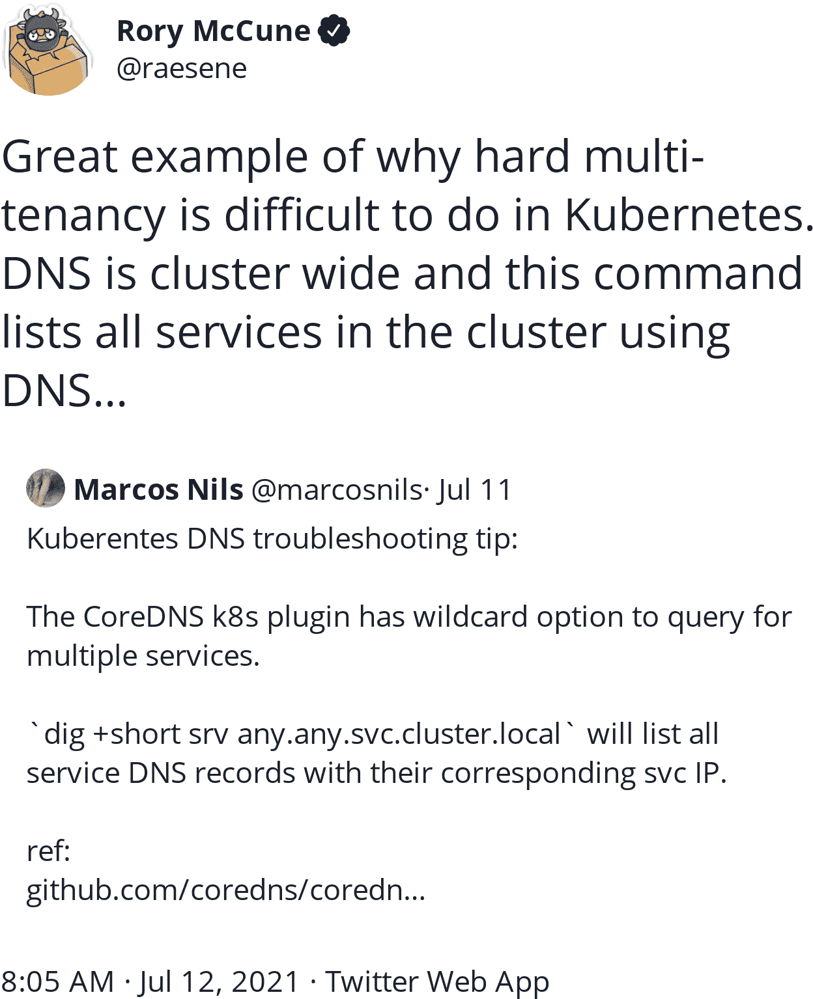

###### 图 2-10\. Rory McCune 对硬多租户难题的智慧

对所有服务端点和名称执行以下操作（输出编辑以适应）：

[PRE23]

根据查询返回 IPv4 地址：

[PRE24]

Kubernetes API 服务器服务 IP 信息默认挂载到 pod 的环境中：

[PRE25]

响应与 API 服务器的 `/version` 端点匹配。

###### 小贴士

你可以使用 [此 nmap 脚本](https://oreil.ly/PAqte) 和以下功能检测 Kubernetes API 服务器：

[PRE26]

下一个重要的运行时策略片段是安全上下文，最初由红帽引入。

## Pod securityContext

此 pod 使用空的 `securityContext` 运行，这意味着在部署时没有准入控制器对配置进行变异，容器可以运行一个属于 root 的进程，并对其拥有所有能力：

[PRE27]

开发能力地形图涉及对内核标志的理解，[Stefano Lanaro 的指南](https://oreil.ly/mtvCX) 提供了全面的概述。

不同的能力可能对系统产生特定影响，而 `CAP_SYS_ADMIN` 和 `CAP_BPF` 对攻击者尤为诱人。你应该谨慎授予的显著能力包括：

`CAP_DAC_OVERRIDE`, `CAP_CHOWN`, `CAP_DAC_READ_SEARCH`, `CAP_FORMER`, `CAP_SETFCAP`

绕过文件系统权限

`CAP_SETUID`, `CAP_SETGID`

成为 root 用户

`CAP_NET_RAW`

读取网络流量

`CAP_SYS_ADMIN`

文件系统挂载权限

`CAP_SYS_PTRACE`

所有进程的全能调试

`CAP_SYS_MODULE`

加载内核模块以绕过控制

`CAP_PERFMON`, `CAP_BPF`

访问深度挂钩 BPF 系统

这些是许多容器突破的先兆。正如 [Brad Geesaman](https://oreil.ly/swfMU) 在 图 2-11 中指出的，进程想要自由！攻击者会利用 pod 中任何可用于逃逸的东西。


###### 图 2-11\. Brad Geesaman 对具有感染力的容器自由呼声

###### 注意

`CAP_NET_RAW` 在 `runc` 中默认启用，并启用 UDP（绕过像 Istio 这样的 TCP 服务网格）、ICMP 消息和 ARP 毒化攻击。[Aqua 发现 DNS 毒化攻击](https://oreil.ly/ceARf) 对 Kubernetes DNS 造成影响，而 `net.ipv4.ping_group_range` `sysctl` 标志意味着 [在需要 ICMP 时应将其丢弃](https://oreil.ly/tJ7rQ)。

这些是一些需要 `root` 和/或 `CAP_SYS_ADMIN`、`CAP_NET_RAW`、`CAP_BPF` 或 `CAP_SYS_MODULE` 才能运行的容器突破方式：

+   子路径卷挂载遍历和 */proc/self/exe*（详见第六章）。

+   [CVE-2016-5195](https://oreil.ly/ZdYJ8) 是一个只读内存写时复制竞争条件，又称 DirtyCow，并在 “Architecting Containerized Apps for Resilience” 中有详细描述。

+   [CVE-2020-14386](https://oreil.ly/Scrau) 是一个无特权内存损坏漏洞，需要 `CAP_NET_RAW`。

+   [CVE-2021-30465](https://oreil.ly/QzkuG)，`runc` 挂载目的地符号链接交换以在 `rootfs` 外挂载，受非特权用户使用限制。

+   [CVE-2021-22555](https://oreil.ly/Zj1Rl) 是 `Netfilter` 堆外写入越界漏洞，需要 `CAP_NET_RAW`。

+   [CVE-2021-31440](https://oreil.ly/VLeQK) 是 `eBPF` 对 Linux 内核的越界访问，需要 root 或 `CAP_BPF` 和 `CAP_SYS_MODULE`。

+   [@andreyknvl](https://oreil.ly/wlzra) 内核漏洞和 [`core_pattern` 转义](https://oreil.ly/RWlF0)。

当没有爆发时，仍然需要根权限来执行其他一些攻击，例如 [CVE-2020-10749](https://oreil.ly/XoxVW)，这是 Kubernetes CNI 插件 IPv6 通过恶意路由广告进行中间人攻击。

###### Tip

出色的 [“A Compendium of Container Escapes”](https://oreil.ly/LAGB9) 详细探讨了其中一些攻击。

我们在 “Runtime Policies” 中列出了用于 Pod 的 `securityContext` 的选项，以防范敌对容器。

## Pod Service Accounts

Service Accounts 是 JSON Web Tokens (JWTs)，用于 Pod 对 API 服务器的身份验证和授权。默认服务账户不应该被赋予任何权限，并且默认情况下没有授权。

Pod 的 `serviceAccount` 配置定义其与 API 服务器的访问权限；详见 “Service accounts”。该服务账户被挂载到所有 Pod 副本中，并共享单一的“工作负载身份”：

[PRE28]

通过这种方式分离责任可减少 Pod 受损的影响范围：限制入侵后的攻击者活动是策略控制的主要目标。

## Scheduler and Tolerations

调度器负责将 Pod 工作负载分配到节点。它的工作如下：

[PRE29]

敌对调度器可能会从集群中窃取数据或工作负载，但需要将其添加到控制平面以实现对集群的攻击。更容易的是调度一个特权容器并控制平面的 `kubelets`。

## Pod Volume Definitions

在这里，我们使用一个绑定的服务账户令牌，在 YAML 中定义为投影的服务账户令牌（而不是标准服务账户）。`kubelet` 通过定期轮换（配置为每 3600 秒或一小时）保护此令牌，所以如果被窃取，它只能被限制使用。持久化攻击者仍能够在令牌轮换后使用此值，所以此仅在攻击完成后保护服务账户：

[PRE30]

卷是攻击者潜在数据的丰富来源，您应确保像自由访问控制（DAC，例如文件和权限）这样的标准安全实践得到正确配置。

###### 提示

Downward API 将 Kubernetes 级别的值反映到 pod 中的容器中，有助于公开诸如 pod 名称、命名空间、UID、标签和注释等内容。其功能在[文档中列出](https://oreil.ly/UyC90)。

容器只是 Linux，并不会保护其工作负载免受配置错误的影响。

## Pod 网络状态

关于 pod 的网络信息对于调试没有服务的容器或不响应正常的容器非常有用，但攻击者可能利用这些信息直接连接到 pod，而无需扫描网络：

[PRE31]

# 正确使用 securityContext

如果未配置或配置过于宽松，那么 pod 更有可能受到攻击。`securityContext` 是防止容器突破的最有效工具。

在成功获得运行中 pod 的 RCE 后，`securityContext` 是您可用的第一道防御配置。它可以访问可以单独设置的内核开关。还可以配置其他 Linux 安全模块以防止敌意应用程序利用您的系统。

Docker 的 `containerd` 具有默认的 `seccomp` 配置文件，通过阻止内核中的系统调用阻止了一些针对容器运行时的零日攻击。从 Kubernetes v1.22 开始，您应通过 `--seccomp-default` `kubelet` 标志默认启用此功能。在某些情况下，工作负载可能无法使用默认配置文件：可观察性或安全工具可能需要低级别的内核访问。这些工作负载应编写自定义 `seccomp` 配置文件（而不是采用运行它们 `Unconfined` 的方法，该方法允许任何系统调用）。

下面是一个从主机文件系统中 `/var/lib/kubelet/seccomp` 加载的精细化 `seccomp` 配置文件的示例：

[PRE32]

`seccomp` 用于系统调用，但 SELinux 和 AppArmor 也可以在用户空间监控和执行策略，保护文件、目录和设备。

SELinux 配置能够阻止大多数容器突破（除了基于标签的文件系统和进程访问方法），因为它不允许容器写入除了自己的文件系统之外的任何位置，也不允许读取其他目录，并且在 OpenShift 和 Red Hat Linux 上启用。

AppArmor 可以类似地监控和防止 Debian 派生的 Linux 中的许多攻击。如果启用了 AppArmor，则 `cat /sys/module/apparmor/parameters/enabled` 返回 `Y`，并且可以在 pod 定义中使用：

[PRE33]

Liz Rice 曾称`privileged`标志是“计算历史上最危险的标志”，但为什么 privileged 容器如此危险？因为它们使进程命名空间保持启用，给人虚假的容器化错觉，但实际上禁用了所有安全功能。

“Privileged”是特定的`securityContext`配置：除了进程命名空间外，所有功能都被禁用，虚拟文件系统被取消掩码，LSM 被禁用，并且授予所有功能。

以非 root 用户运行，并将`AllowPrivilegeEscalation`设置为`false`可有效防止许多特权升级：

[PRE34]

安全上下文的粒度意味着必须测试配置的每个属性，以确保它没有设置：作为配置管理者通过配置入场控制和测试 YAML，或作为运行时的攻击者使用动态测试（或[amicontained](https://oreil.ly/BIQCJ)）。

###### 提示

我们将在本章后面探讨如何检测容器内的特权。

与主机共享命名空间还会降低容器的隔离性，并使其面临更大的潜在风险。任何挂载的文件系统实际上都会增加挂载命名空间。

确保您的 Pod 的`securityContext`正确，并且您的系统将更安全地抵御已知攻击。

## 使用 Kubesec 增强 securityContext

[Kubesec](https://kubesec.io)是一款验证 Kubernetes 资源安全性的简单工具。

它为资源返回一个风险评分，并建议如何加强`securityContext`（请注意，我们编辑了输出以适应）：

[PRE35]

[Kubesec.io](https://kubesec.io)记录了对您的 securityContext 进行的实际更改，我们将在此文档中记录其中一些。

###### 提示

Shopify 出色的[kubeaudit](https://oreil.ly/LHy2P)为集群中的所有资源提供了类似的功能。

## 强化的 securityContext

NSA 发布了《“Kubernetes 硬化指南”》（https://oreil.ly/2riDP），建议使用一套加固的`securityContext`标准。建议扫描漏洞和配置错误，最小权限，良好的 RBAC 和 IAM，网络防火墙和加密，并“定期审查所有 Kubernetes 设置，并使用漏洞扫描来确保适当地考虑风险并应用安全补丁。”

在 Pod 中为容器分配最少权限是`securityContext`的责任（详细信息请参见表 2-2）。请注意，讨论的 PodSecurityPolicy 资源映射到`securityContext`中可用的配置标志。

表 2-2 `securityContext 字段`

| 字段名称 | 用法 | 建议 |
| --- | --- | --- |
| `privileged` | 控制是否可以运行特权容器。 | 设置为`false`。 |
| `hostPID`，`hostIPC` | 控制容器是否可以共享主机进程命名空间。 | 设置为`false`。 |
| `hostNetwork` | 控制容器是否可以使用主机网络。 | 设置为`false`。 |
| `allowedHostPaths` | 限制容器访问主机文件系统的特定路径。 | 使用一个标记为只读的“虚拟”路径名（例如 `/foo`）。如果省略此字段，则不会对容器施加任何准入限制。 |
| `readOnlyRootFilesystem` | 要求使用只读根文件系统。 | 在可能的情况下设置为 `true`。 |
| `runAsUser`, `runAsGroup`, `supplementalGroups`, `fsGroup` | 控制容器应用程序是否可以以 root 权限或以 root 组成员身份运行。 | 将 `runAsUser` 设置为 `MustRunAsNonRoot`。将 `runAsGroup` 设置为非零值。将 `supplementalGroups` 设置为非零值。将 `fsGroup` 设置为非零值。 |
| `allowPrivilegeEscalation` | 限制提升至 root 权限。 | 设置为 `false`。这一措施是有效执行 `runAsUser: MustRunAsNonRoot` 设置的必要条件。 |
| `SELinux` | 设置容器的 SELinux 上下文。 | 如果环境支持 SELinux，请考虑添加 SELinux 标签以进一步增强容器的安全性。 |
| `AppArmor` 注解 | 设置容器使用的 AppArmor 配置文件。 | 在可能的情况下，通过使用 AppArmor 来限制容器化应用程序的利用。 |
| `seccomp` 注解 | 设置用于沙箱容器的 `seccomp` 配置文件。 | 在可能的情况下，使用 `seccomp` 审计配置文件识别运行应用程序所需的系统调用；然后启用 `seccomp` 配置文件以阻止所有其他系统调用。 |

让我们使用 `kubesec` 静态分析工具详细探讨这些内容，并且它用于查询您的 Kubernetes 资源的选择器。

### containers[] .securityContext .privileged

一个运行特权容器可能会对您的安全团队造成不良影响。特权容器禁用了除 `process` 外的所有命名空间和 LSMs，授予所有权限，通过 */dev* 暴露主机设备，并且通常默认情况下是不安全的。这是攻击者在新受损 pod 中首先查找的内容。

### .spec .hostPID

`hostPID` 允许通过 */proc* 文件系统从容器遍历到主机，该文件系统通过符号链接其他进程的根文件系统。要从主机的进程命名空间中读取，还需要 `privileged`：

[PRE36]


启动一个特权容器并共享主机进程命名空间。


作为容器中的 root 用户，检查容器的操作系统版本。


验证我们是否在主机的进程命名空间中（我们可以看到 PID 1 和内核辅助进程）。


检查容器内部 */proc* 文件系统中的宿主分发版本。这是可能的，因为 PID 命名空间与主机共享。

###### 注意

如果没有 `privileged`，则容器中的 root 无法访问宿主的进程命名空间：

[PRE37]

在这种情况下，攻击者受其 UID 限制，可以搜索文件系统或内存，寻找关键材料或敏感数据。

### .spec .hostNetwork

主机网络访问允许我们嗅探流量或在主机适配器上发送虚假流量（但仅当我们有权限执行时，通过`CAP_NET_RAW`或`CAP_NET_ADMIN`启用），并逃避依赖流量起源于 Pod 网络命名空间中预期源 IP 的网络策略。

还允许访问绑定到主机回环适配器（在根网络命名空间中为`localhost`）的服务，传统上被视为安全边界。服务器端请求伪造（SSRF）攻击减少了这种模式的发生，但仍可能存在（Kubernetes 的 API 服务器`--insecure-port`在 v1.10 中使用了此模式，最终在 v1.20 中删除）。

### .spec .hostAliases

允许 Pod 覆盖其本地*/etc/hosts*文件。这可能会带来更多的操作上的影响（例如无法及时更新导致故障），而非安全上的含义。

### .spec .hostIPC

允许 Pod 访问主机的进程间通信命名空间，可能会干扰主机上的受信任进程。这可能使得简单通过*/usr/bin/ipcs*或共享内存文件*/dev/shm*实现主机妥协。

### containers[] .securityContext .runAsNonRoot

在 Linux 系统中，根用户具有特殊权限，尽管在容器中设置权限较低，但根用户仍然被大量内核代码特殊对待。

防止根用户拥有容器内的进程是一种简单且有效的安全措施。它阻止了本书列出的许多容器逃逸攻击，并遵循标准和已建立的 Linux 安全实践。

### containers[] .securityContext .runAsUser > 10000

除了防止根运行进程外，强制容器化进程的高 UID 降低了无用户命名空间的逃逸风险：如果容器中的用户（例如 12345）在主机上有等效 UID（也是 12345），并且容器中的用户能够通过挂载卷或共享命名空间与它们联系，那么资源可能会意外地共享，并允许容器逃逸（例如，文件系统权限和授权检查）。

### containers[] .securityContext .readOnlyRootFilesystem

不可变性不是安全边界，因为代码可以从互联网下载并由解释器（如 Bash、PHP 和 Java）运行，而不使用文件系统，正如`bashark`后渗透工具所示：

[PRE38]

文件系统位置像*/tmp*和*/dev/shm*可能会始终可写，以支持应用程序的行为，因此不能依赖只读文件系统作为安全边界。不可变性将防止某些随机和自动化攻击，但不是强大的安全边界。

诸如 `falco` 和 `tracee` 的入侵检测工具可以检测到容器中产生的新的 Bash shell（或任何未列入白名单的应用程序）。此外，`tracee` 还可以通过观察 */proc/pid/maps* 来检测试图通过内存中执行的恶意软件。

###### 注意

我们会在第九章详细讨论 Falco。

### containers[] .securityContext .capabilities .drop | index(“ALL”)

你应该总是删除所有的能力，只重新添加你的应用程序需要的那些。

### containers[] .securityContext .capabilities .add | index(“SYS_ADMIN”)

这种能力的存在是一个警告信号：尽量找到部署任何需要它的容器的另一种方法，或者在具有自定义安全规则的专用命名空间中部署，以限制妥协的影响。

### containers[] .resources .limits .cpu, .memory

限制容器可用内存的总量可以防止拒绝服务攻击将主机机器挤垮，因为容器会首先死掉。

### containers[] .resources .requests .cpu, .memory

请求资源有助于调度器有效地“装箱”资源。过度请求资源可能是对手试图将新的 Pod 调度到他们控制的另一个节点的尝试。

### .spec .volumes[] .hostPath .path

可写的 */var/run/docker.sock* 主机挂载允许突破到主机。任何攻击者可以写符号链接的文件系统都是有漏洞的，攻击者可以使用这条路径探索和从主机外泄。

# 进入风暴的眼眸

船长和船员进行了一次徒劳的袭击，但这并不是我们将听到的最后一次逃避行动。

在我们阅读这本书的过程中，我们将看到 Kubernetes 容器组件如何与更广泛的系统交互，我们将见证 Hashjack 船长努力利用它们的过程。

# 结论

为了安全地使用一个 Pod，需要对多层配置进行限制，你运行的工作负载是 Kubernetes 安全的软肋。

Pod 是保护集群的第一道防线，也是最重要的部分。应用程序代码经常更改，很可能是潜在的可利用漏洞的来源。

要扩展锚和链的比喻，一个集群只有其最薄弱环节才强大。为了可以被证明是安全的，你必须使用强大的配置测试、预防性控制和管道与准入控制中的策略，以及运行时入侵检测——因为没有什么是绝对无懈可击的。
