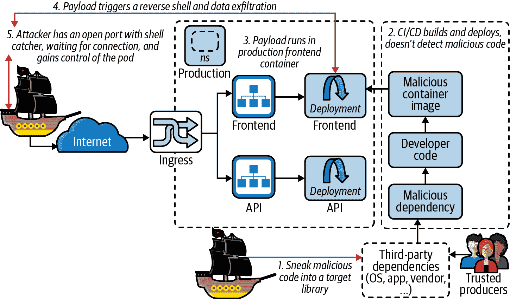

# 第四章：应用程序与供应链

[SUNBURST](https://oreil.ly/19FGs)的[供应链妥协](https://oreil.ly/coa9p)是通过一个合法签名的、被篡改的服务器监控代理软件进行的恶意入侵，入侵了美国政府和财富 500 强的网络。[Cozy Bear 黑客团体](https://oreil.ly/gADiF)使用本章节描述的技术同时攻击了许多百亿美元公司。攻击者优先攻击高价值目标，所以较小的组织可能逃过了这场可能具有毁灭性后果的入侵。

攻击者针对的组织遭受了数据损失，并可能成为进一步攻击其客户的跳板。这是“信任”供应链的基本风险：一旦你受到侵害，消费你产品的任何人都可能成为潜在目标。利用已建立的信任关系，恶意软件被误信任。

经常存在已有漏洞却没有相应软件补丁或解决方案的情况。Palo Alto 的研究发现，80%的新公开漏洞存在这种情况。在所有正在运行的软件中，拒绝恶意行为者访问您的内部网络是首要防线。

SUNBURST 攻击感染了 SolarWinds 的构建流水线，并在构建之前立即更改了源代码，然后隐藏了篡改的证据，并确保二进制文件由 CI/CD 系统签名，以便消费者信任它。

这些技术在[Mitre ATT&CK Framework](https://oreil.ly/BV0mN)上以前未见过，并且这些攻击使网络遭受了军事、政府和公司秘密的损失 —— 这些都是初始供应链攻击的后果。防止肮脏狡猾的 Hashjack 船长及其同伙通过任何依赖（库、工具或其他）秘密进入组织的网络是*供应链安全*的工作：保护我们的来源。


在本章中，我们通过查看一些历史问题及其被利用的方式来深入研究供应链攻击，然后看看容器如何既有益地隔离，又如何危险地加剧供应链风险。在“抵御 SUNBURST”中，我们会问：我们是否能够保护云原生系统免受 SUNBURST 的侵害？

对于像 Hashjack 船长这样的职业罪犯来说，供应链为攻击 BCTL 的系统提供了一个新的入侵向量：通过代理攻击来获得对您系统的信任访问。这意味着攻击容器软件供应链以获取对易受攻击工作负载和服务器的远程控制，并在整个组织中串联利用漏洞和后门。

# 默认值

除非有针对性地加以防范和减轻，供应链攻击相对来说是比较简单的：它们影响到我们系统中信任的部分，这些部分通常我们不会直接观察到，比如我们供应商的 CI/CD 模式。

正如我们将在本章中讨论的那样，这是一个复杂的问题。随着对抗性技术的发展和云原生系统的适应，你会看到供应链风险在开发、测试、分发和运行时如何转变。

# 威胁模型

大多数应用程序默认情况下不是强化的，你需要花时间来确保它们安全。[OWASP 应用安全验证标准](https://oreil.ly/5S6Qd) 提供应用程序安全（AppSec）指导，我们不会进一步探讨，除了说：你不希望通过运行过时或错误的软件来简化攻击者的生活。对所有运行的软件进行严格的逻辑和安全测试至关重要。

从你的开发人员的编码风格和网页应用程序安全标准，到容器内部的一切供应链。需要工程化的努力来使它们安全，并确保在更新时它们仍然是安全的。

SDLC 中的依赖项特别容易受到攻击，并为 Hashjack 队长提供运行一些恶意代码（“有效负载”）的机会：

+   在安装时（可能以 root 用户身份运行的包管理器钩子）

+   在开发和测试期间（IDE、构建和执行测试）

+   在运行时（本地、开发、暂存和生产 Kubernetes 容器）

当有效负载正在执行时，它可能会向文件系统写入更多代码或从互联网上拉取恶意软件。它可能会在开发者的笔记本电脑、CI 服务器或生产环境中搜索数据。任何被窃取的凭证都形成攻击的下一个阶段。

应用程序并非唯一面临风险的软件：随着基础设施、策略和安全定义为代码，攻击者可以渗透的任何系统的脚本化或自动化点都必须被考虑进来，并因此被纳入你的威胁模型的范围内。

# 供应链

软件供应链（图 4-1）考虑你的文件移动：源代码、应用程序、数据。它们可能是明文、加密的、存储在软盘上或者云端。

供应链存在于任何由其他事物构建的东西上——也许是人类摄入的食品、药物，使用的 CPU、汽车，或者与之交互的操作系统、开源软件。任何货物的交换都可以建模为供应链，而某些供应链则是庞大而复杂的。


###### 图 4-1\. 一个供应链的网络；改编自 [*https://oreil.ly/r9ndi*](https://oreil.ly/r9ndi)

每个你使用的依赖项都有可能是一个恶意植入物，等待执行时触发，以部署其有效负载。容器供应链很长，可能包括：

+   基础镜像

+   已安装的操作系统软件包

+   应用程序代码和依赖项

+   公共 Git 仓库

+   开源工件

+   任意文件

+   可能添加的任何其他数据

如果在供应链的任何步骤中添加了恶意代码，它可能会加载到运行中的 Kubernetes 集群中的可执行内存中。这是 Captain Hashjack 使用恶意负载的目标：将坏代码偷偷藏进您信任的软件中，并利用它从组织内部边界发动攻击，在这里您可能没有像在“边界”外那样有效地保护系统，以防止攻击者进入。

供应链的每个链接都有生产者和消费者。在 表 4-1 中，CPU 芯片生产者是制造商，下一个消费者是分销商。在实践中，每个供应链阶段可能有多个生产者和消费者。

表 4-1\. 不同类型的供应链示例

|  | 农场食品 | CPU 芯片 | 一个开源软件包 | 您组织的服务器 |
| --- | --- | --- | --- | --- |
| *原始生产者* | 农民（种子、饲料、收割机） | 制造商（原材料、制造工厂、固件） | 开源包开发者（创意、代码） | 开源软件，内部 CI/CD 构建的原始源代码 |
| *(链接至)* | 分销商（销售给商店或其他分销商） | 分销商（销售给商店或其他分销商） | 仓库维护者（npm, PyPi 等） | 签名代码构件通过网络推送到面向生产的注册表 |
| *(链接至)* | 当地食品店 | 供应商或当地电脑店 | 开发人员 | 存储在注册表中准备部署的构件 |
| *链接至最终消费者* | 终端用户 | 终端用户 | 终端用户 | 部署到生产系统的最新构件 |

供应链中任何不在您直接控制下的阶段都可能受到攻击（图 4-2）。任何“上游”阶段的妥协——例如您所消费的阶段——可能会影响您作为下游消费者。

例如，一个开源软件项目（图 4-3）可能有三个贡献者（或“信任的生产者”），他们有权限将外部代码贡献合并到代码库中。如果这些贡献者中的任何一个密码被窃取，攻击者可以向项目添加自己的恶意代码。然后，当您的开发人员将该依赖项引入其代码库时，他们会在内部系统上运行攻击者的恶意代码。


###### 图 4-2\. 供应链之间的相似性


###### 图 4-3\. 开源供应链攻击

但妥协不一定是恶意的。就像 [npm `event-stream` 漏洞](https://oreil.ly/UCKUv) 一样，有时候只是像某人希望将维护权转交给现有和可信的维护者，但后者却变成了内鬼并插入了自己的恶意负载。

###### 注意

在这种情况下，`event-stream`包存在漏洞被下载了 1200 万次，被 1600 多个其他包所依赖。恶意载荷搜索“热门加密货币钱包”以窃取开发者机器上的内容。如果这些恶意代码窃取了 SSH 和 GPG 密钥并用于进一步传播攻击，那么危害可能会更大。

成功的供应链攻击通常难以检测，因为消费者信任每个上游生产者。如果一个生产者受到攻击，攻击者可能会针对个别下游消费者或仅选择最高价值的目标。

## 软件

就我们的目的而言，我们消耗的供应链是软件和硬件。在云环境中，数据中心的物理和网络安全由提供者管理，但确保系统使用安全则是您的责任。这意味着我们对使用的硬件有很高的信心是安全的。我们安装的软件及其行为——这是我们供应链风险的起点。

软件由许多其他软件组件构建而成。与 CPU 制造不同，那里是将惰性组件组装成结构，软件更像是一个共生的合作生物群体。每个组件可能是自主的并选择合作（CLI 工具、服务器、操作系统），或者在特定方式下才有用（`glibc`、链接库、大多数应用程序依赖）。任何软件都可能是自主的或合作的，并且无法在任何时刻明确证明其是哪种。这意味着测试代码（单元测试、验收测试）仍可能包含恶意代码，该代码将开始探索持续集成（CI）构建环境或执行它的开发者机器。

这造成了一个难题：如果恶意代码可以隐藏在系统的任何部分，我们怎么能确切地说整个系统是安全的呢？

正如 Liz Rice 在《容器安全》（[O'Reilly](https://oreil.ly/uzvnv)）中指出的：

> 任何非平凡软件部署很可能包含一些漏洞，通过这些漏洞系统可能会遭受攻击风险。为了管理这种风险，您需要能够识别存在的漏洞并评估其严重程度，优先处理它们，并制定相关流程来修复或减轻这些问题。

软件供应链管理是困难的。它要求您接受一定程度的风险，并确保在软件执行之前能够检测到危险的软件，并采取合理的措施来减轻这些风险。这种风险与回报递减相平衡——随着每个控制措施的增加，构建变得更昂贵、更难维护，每一步的开销也更高。

###### 警告

在没有详细控制的情况下，您对供应链的完全信任几乎是不可能的，这一点在 CNCF 安全技术咨询组关于软件供应链安全的文件中有详细说明（本章后面会讨论）。

如往常一样，您假设没有完全有效的控制，并在构建机器上运行入侵检测，作为对目标或广泛零日漏洞（如 SUNBURST、Shellshock 或 DirtyCOW）的最后防线。

现在让我们看看如何保护软件供应链，从最小可行的云原生安全开始：扫描 CVE。

## CVE 扫描

已公布已知漏洞的 CVE，通过忽视或未能修补它们，您会使 Hashjack 船长的可怕船员轻易访问您的系统变得更加困难。开源软件在其构建说明（如*pom.xml*、*package.json*、*go.mod*、*requirements.txt*、*Gemfile*等）中列出其依赖关系，这使我们能够看到其组成。这意味着您应该使用诸如[trivy](https://oreil.ly/wLyXO)之类的工具扫描这些依赖项中的 CVE。这是保护供应链中最容易解决的问题，并应被视为最小可行容器安全流程的一部分。

trivy 可以在各处休息的代码中进行扫描：

+   在容器镜像中

+   在文件系统中

+   在 Git 存储库中

它会报告已知的漏洞。扫描 CVE 是向生产发布代码的最低可行安全性。

这个命令扫描本地目录，查找`gomod`和`npm`的依赖文件，并报告它们的内容（输出已编辑）：

```
kind: Cluster
apiVersion: kind.x-k8s.io/v1alpha4
nodes:
- role: control-plane
  kubeadmConfigPatches:
  - |
    kind: InitConfiguration
    nodeRegistration:
      kubeletExtraArgs:
        node-labels: "ingress-ready=true" 
  extraPortMappings:
  - containerPort: 80
    hostPort: 80
    protocol: TCP
  - containerPort: 443
    hostPort: 443
    protocol: TCP
- role: worker
networking:
  disableDefaultCNI: true 
  podSubnet: 192.168.0.0/16 
```


运行 trivy 来针对当前工作目录（`.`）中的文件系统（`fs`）进行扫描。


扫描发现*infra/build/go.sum*中有两个高危漏洞。


*infra/api/code/package-lock.json*没有检测到漏洞。

因此，我们可以扫描供应链中的代码，查看其是否具有易受攻击的依赖关系。但是代码本身呢？

## 摄取开源软件

安全地摄取代码很难：我们如何证明容器镜像是从我们在 GitHub 上看到的相同源代码构建的？或者编译的应用程序是我们阅读的相同开源代码，而不是重新从源代码构建的？

尽管开源很难，封闭源码面临的挑战更大。

如何建立和验证与供应商的信任关系？

令船长大为失望的是，自 1983 年 Ken Thompson 引入[“Reflections on Trusting Trust”](https://oreil.ly/NEMQR)以来，这个问题一直被研究：

> 一个程序没有特洛伊木马的声明有多值得信任？也许更重要的是要信任编写软件的人。

信任的问题支撑着许多人类互动，并是原始互联网的基础。Thompson 继续道：

> 结论很明显。您不能信任您完全没有自己创建的代码。（尤其是来自雇佣像我这样的人的公司的代码。）无论进行多少源代码级别的验证或审查，都无法保护您免受使用不受信任代码的危害…… 随着程序级别的降低，这些错误将变得越来越难以检测。一个良好安装的微码错误几乎不可能被检测到。

这些关于安全的哲学问题影响着您组织的供应链，以及您的客户。核心问题仍未解决，难以完全纠正。

虽然 BCTL 与软件的传统关系以前被定义为消费者，但当您在 GitHub 上开始公开开源时，您也成为了生产者。这种区别在今天的大多数企业组织中存在，因为大多数企业组织尚未适应其新的生产者责任。

## 我们信任哪些生产者？

要确保供应链安全，我们必须信任我们的生产者。这些是您组织之外的各方，可能包括：

+   安全提供者，如根证书颁发机构用于验证网络上的其他服务器，以及 DNSSEC 用于返回我们传输的正确地址

+   加密算法和实现，如 GPG、RSA 和 Diffie-Hellman 用于保护我们的数据在传输和静止时

+   硬件启用者，如操作系统、CPU/固件和驱动程序供应商，为我们提供低级硬件交互

+   应用程序开发人员和软件包维护人员防止通过其分发的软件包安装恶意代码

+   开源和社区运营的团队、组织和标准机构，为了增长我们的技术和社区的共同利益

+   供应商、分销商和销售代理不得安装后门或恶意软件

+   每个人——不要有可利用的漏洞

您可能会想知道是否有可能完全保护这一切，答案是否定的。没有什么是完全安全的，但可以加固以使其对除了最熟练的威胁行为者之外的所有人都不那么吸引。关键在于平衡各种安全控制层，可能包括：

+   物理第二因素（2FA）

    +   GPG 签名（例如，Yubikeys）

    +   [WebAuthn](https://webauthn.io)、FIDO2 项目和物理安全令牌（例如，RSA）

+   人类冗余

    +   作者不能合并自己的 PR

    +   添加第二人员对关键流程进行签署

+   通过在不同环境中运行相同的流程两次并比较结果来进行复制

    +   [reprotest](https://oreil.ly/c5Gm0) 和 [可重现构建](https://oreil.ly/VsONj) 倡议（参见 [Debian](https://oreil.ly/rwWoH) 和 [Arch Linux](https://oreil.ly/mgVwV) 中的示例）

# CNCF 安全技术咨询组

CNCF 安全技术咨询组（*tag-security*）发布了一份权威的 [软件供应链安全论文](https://oreil.ly/rEEd7)。为了深入和沉浸式地了解这一领域，强烈建议阅读：

> 它评估了许多可用工具，并为供应链安全定义了四个关键原则以及每个原则的步骤，包括：
> 
> 1.  信任：供应链中的每一步都应该是“值得信赖的”，这是由加密证明和验证的组合实现的。
> 1.  
> 1.  自动化：自动化对于供应链安全至关重要，可以显著减少人为错误和配置漂移的可能性。
> 1.  
> 1.  清晰度：供应链中使用的构建环境应该明确定义，范围有限。
> 1.  
> 1.  互相认证：在供应链环境中运作的所有实体都必须使用硬化的认证机制进行互相认证，并定期更换密钥。
> 1.  
> 软件供应链最佳实践，标签安全

然后涵盖供应链安全的主要部分：

1.  源代码（您的开发人员编写的内容）

1.  材料（应用程序及其环境的依赖关系）

1.  构建流水线（用于测试和构建您的应用程序）

1.  人工制品（您的应用程序加上测试证据和签名）

1.  部署（您的消费者如何访问您的应用程序）

如果您的供应链在这些点中的任何一个受到损害，您的消费者也可能受到损害。

## 为弹性设计容器化应用程序

在设计和构建系统时，您应该采用对抗性思维，以便安全考虑被纳入其中。这种思维的一部分包括学习历史漏洞，以便防御自己免受类似攻击。

容器的细粒度安全策略是重新考虑应用程序作为“默认受损”的机会，并对其进行配置，使其更好地受到保护，以防止零日漏洞或未修补的漏洞。

###### 注意

这样一个历史性漏洞是 DirtyCOW：Linux 内核特权内存映射代码中的竞争条件，允许非特权本地用户升级为 root。

该漏洞允许攻击者在主机上获得 root shell，并且可以从未阻止`ptrace`的容器内进行利用。其中一位作者通过一个阻止`ptrace`系统调用的 AppArmor 配置文件现场演示了[防止 DirtyCOW 容器越狱](https://oreil.ly/zYCJp)。有一个示例 Vagrantfile 可以在[Scott Coulton 的存储库](https://oreil.ly/Fvu4v)中复现该漏洞。

## 检测木马

像[dockerscan](https://oreil.ly/rlLnJ)这样的工具可以*木马化*一个容器：

> 木马化：向 docker 镜像注入一个反向 shell
> 
> dockerscan

###### 注意

我们将在“哈希杰克船长攻击供应链”中更详细地讨论攻击软件和库。

要使`webserver`镜像植入木马很简单：

```
$ kind create cluster --name cnnp \
  --config cluster-config.yaml

Creating cluster "cnnp" ...
```


从容器镜像中导出一个有效的`webserver` tarball。


木马化镜像 tarball。


指定攻击者的 shellcatcher IP 和端口。


写入名为 `trojanized-webserver` 的输出压缩包。

您应该扫描您的容器镜像以检测和防止这种类型的攻击。正如 `dockerscan` 使用的 `LD_PRELOAD` 攻击，大多数容器 IDS 和扫描应该能够检测到。

软件的动态分析涉及在恶意软件实验室环境中运行它，该环境无法与互联网通信，并观察其是否存在 C2（“命令与控制”）迹象、自动化攻击或意外行为。

###### 注意

像 WannaCry 这样的恶意软件（一种加密锁定蠕虫）包括一个禁用“杀死开关” DNS 记录（有时由恶意软件作者秘密使用以远程终止攻击）。在某些情况下，这用于延迟部署恶意软件，直到攻击者方便的时间。

一个构件及其运行时行为应该形成对单个软件包可信度的图片，但存在变通方法。逻辑炸弹（仅在特定条件下执行的行为）使得检测变得困难，除非已知逻辑。例如，SUNBURST 密切模仿了其感染的软件的有效 HTTP 调用。即使使用诸如 `sysdig` 之类的工具跟踪被感染应用，也无法清楚地表现出这种类型的攻击。

# Hashjack 船长攻击供应链


您知道 BCTL 没有在供应链安全方面投入足够的努力。开源摄入没有受到监管，开发人员忽略了流水线中的 CVE 扫描结果。

无情海盗 Hashjack 打扫了一下键盘，开始攻击。目标是向容器镜像、开源包或操作系统应用程序添加恶意代码，以便您的团队在生产环境中运行。

在这种情况下，Hashjack 船长试图从初始的 pod 攻击的立足点攻击您的其他系统。当恶意代码在您的 pod 内运行时，它将连接回船长控制的服务器。该连接将传递攻击命令，在您的集群中此类 pod 内运行，以便海盗们可以四处查看，如图 4-4 所示。

从这个远程控制的位置，Hashjack 船长可能会：

+   列举集群周围的其他基础设施，如数据存储和内部面向软件

+   尝试提升权限并接管您的节点或集群

+   挖掘加密货币

+   将 pod 或节点添加到僵尸网络中，将其用作服务器或“诱饵站点”来传播恶意软件

+   对您的未被破坏的系统进行任何其他意外滥用。



###### 图 4-4\. 建立远程访问与供应链妥协

[开源安全基金会 (OpenSSF)](https://openssf.org)的 [SLSA 框架](https://slsa.dev)（“软件构件的供应链安全级别”，或 “Salsa”）基于 “实现理想安全状态可能需要多年，中间的里程碑很重要” 的原则。它定义了一种分级方法，用于为您的构建采用供应链安全（见 表 4-2）。

表格 4-2. OpenSSF SLSA 级别

| 等级 | 描述 | 要求 |
| --- | --- | --- |
| 0 | 无任何保证 | SLSA 0 代表完全没有 SLSA 级别。 |
| 1 | 源检查以帮助评估风险和安全性 | 构建过程必须完全脚本化/自动化，并生成来源审计。 |
| 2 | 进一步对软件来源进行检查 | 需要使用版本控制和托管构建服务生成经过身份验证的来源。这将导致构建服务的防篡改性。 |
| 3 | 对特定类威胁的额外抵抗力 | 源和构建平台符合特定标准，以保证源的审计性和来源的完整性。高级保护包括主机上的安全控制、不可伪造的来源、以及防止跨构建污染。 |
| 4 | 最高的信任和可信度级别 | 严格的审计和可靠性检查。所有变更都需要两人审核，并采用封闭的、可重现的构建过程。 |

让我们进入后续步骤。

## 受损后持久性

在攻击者执行可能被防御者检测到的操作之前，他们寻求建立持久性或后门，这样，例如如果被发现或被强制驱逐，他们可以进入系统，因为他们的入侵方法已被修补。

###### 注意

当容器重新启动时，文件系统的更改会丢失，因此仅通过向容器文件系统写入来实现持久性是不可能的。在 Kubernetes 中放置“后门”或其他持久性机制需要攻击者使用 Kubernetes 的其他部分或主机上的 `kubelet`，因为他们在容器内写入的任何内容在重新启动时都会丢失。

依据您的受损情况，哈希杰克船长现在有多种选择。在配置良好的容器中，没有过度的 RBAC 权限，这些都是不可能的，尽管这并不阻止攻击者再次利用相同的路径并试图转向系统的另一部分。

Kubernetes 可能通过以下方式获得持久性：

+   通过 `kubelet` 的静态清单启动静态特权 Pod

+   直接使用容器运行时部署特权容器

+   部署带后门的准入控制器或 CronJob

+   部署具有自定义认证的影子 API 服务器

+   在一些新的 Pod 中添加注入后门容器的变异 Webhook

+   将工作节点或控制平面节点添加到僵尸网络或 C2 网络

+   编辑容器生命周期的 `postStart` 和 `preStop` 钩子以添加后门

+   Editing liveness probes to exec a backdoor in the target container

+   Any other mechanism that runs code under the attacker’s control

## Risks to Your Systems

Once they have established persistence, attacks may become more bold and dangerous:

+   Exfiltrating data, credentials, and cryptocurrency wallets

+   Pivoting further into the system via other pods, the control plane, worker nodes, or cloud account

+   Cryptojacking compute resources (e.g., [mining Monero in Docker containers](https://oreil.ly/0E9iw))

+   Escalating privilege in the same pod

+   Cryptolocking data

+   Secondary supply chain attack on target’s published artifacts/software

Let’s move on to container images.

# Container Image Build Supply Chains

Your developers have written code that needs to be built and run in production. CI/CD automation enables the building and deployment of artifacts, and is a traditionally appealing target due to less security rigor than the production systems it deploys to.

To address this insecurity, the Software Factory pattern is gaining adoption as a model for building the pipelines to build software.

## Software Factories

A Software Factory is a form of CI/CD that focuses on self-replication. It is a build system that can deploy copies of itself, or other parts of the system, as new CI/CD pipelines. This focus on replication ensures build systems are repeatable, easy to deploy, and easy to replace. They also assist iteration and development of the build infrastructure itself, which makes securing these types of systems much easier.

Use of this pattern requires slick DevOps skills, continuous integration, and build automation practices, and is ideal for containers due to their compartmentalised nature.

###### Tip

The [DoD Software Factory pattern](https://oreil.ly/HqNz4) defines the Department of Defense’s best practice ideals for building secure, large-scale cloud or on-prem cloud native infrastructure.

Container images built from, and used to build, the DoD Software Factory are publicly available at [IronBank GitLab](https://oreil.ly/3NvDj).

Cryptographic signing of build steps and artifacts can increase trust in the system, and can be revalidated with an admission controller such as [portieris](https://oreil.ly/mY9eu) for Notary and [Kritis](https://oreil.ly/R33SG) for Grafeas.

Tekton is a Kubernetes-based build system that runs build stages in containers. It runs Kubernetes Custom Resources that define build steps in pods, and [Tekton Chains](https://oreil.ly/ZHMmw) can use in-toto to sign the pod’s workspace files. [Jenkins X](https://jenkins-x.io) is built on top of it and extends its feature set.

###### Tip

[Dan Lorenc](https://oreil.ly/av7UQ) elegantly summarised [the supply chain signing landscape](https://oreil.ly/WUVHD).

## Blessed Image Factory

有些软件工厂流水线用于构建和扫描您的基础镜像，方式与构建虚拟机镜像相同：按一定节奏进行，并响应底层镜像的发布。如果构建的任何输入都不可信，则图像构建是不可信的。攻击者可以利用容器构建进行攻击：

+   在 `RUN` 指令中的恶意命令可以攻击主机

+   主机非回环网络端口/服务

+   枚举其他网络实体（云提供商、构建基础设施、通向生产环境的网络路由）

+   恶意的 `FROM` 镜像可以访问构建的秘密

+   恶意镜像，具有 `ONBUILD` 指令

+   Docker-in-docker 和挂载的容器运行时套接字可能导致主机逃逸

+   容器运行时或内核中的零日漏洞

+   网络攻击面（主机、其他构建暴露的端口）

为防止恶意构建，您应从静态分析开始，使用 [Hadolint](https://oreil.ly/M8GDi) 和 [conftest](https://oreil.ly/8mKFd) 强制执行您的策略。例如：

```
$ kubectl apply -f https://docs.projectcalico.org/manifests/calico.yaml
configmap/calico-config created
customresourcedefinition.apiextensions.k8s.io/bgpconfigurations.crd.projectcalico.org created
...
serviceaccount/calico-kube-controllers created

$ kubectl -n kube-system set env daemonset/calico-node FELIX_IGNORELOOSERPF=true
daemonset.apps/calico-node env updated

```

Conftest 封装了 OPA 并运行 Rego 语言策略（见 “Open Policy Agent”）：

```
$ kubectl -n kube-system get pods | grep calico-node
calico-node-2j2wd     0/1     Running     0     18s
calico-node-4hx46     0/1     Running     0     18s
calico-node-qnvs6     0/1     Running     0     18s
```

如果 Dockerfile 符合策略，可以使用 trivy 等工具扫描容器构建工作区。您还可以先构建再扫描，尽管如果攻击生成反向 shell 进入构建环境，则略有风险。

如果容器扫描安全，则可以执行构建。

###### 提示

在 Dockerfile 中添加硬化阶段有助于删除攻击者可能尝试利用的不必要文件和二进制文件，详细信息请参见 [DoD’s Container Hardening Guide](https://oreil.ly/7lVbG)。

保护构建的网络很重要，否则容器构建中的恶意代码可以从互联网拉取更多依赖项和恶意代码。安全控制难度各不相同，包括：

+   阻止网络出口

+   使用虚拟机隔离主机内核

+   将构建过程作为非 root 用户或在用户命名空间中运行

+   在容器文件系统中以非 root 用户身份执行 `RUN` 命令

+   与构建无关的非必要内容不共享

## 基础镜像

当应用程序打包部署时，必须将其构建为容器镜像。根据您选择的编程语言和应用程序依赖关系，您的容器将使用 Table 4-3 中的一种基础镜像。

表 4-3\. 基础镜像类型

| 基础镜像类型 | 构建方式 | 镜像文件系统内容 | 示例容器镜像 |
| --- | --- | --- | --- |
| Scratch | 将一个（或多个）静态二进制文件添加到空容器根文件系统中。 | 除了 `/my-binary`（它是 `/` 目录中唯一的东西）和任何添加的依赖项（通常是 CA 捆绑包、本地化信息、应用程序的静态文件）外，没有其他内容。 | [静态 Golang 或 Rust 二进制示例](https://oreil.ly/7VW3k) |
| Distroless | 向仅具有区域设置和 CA 信息的容器添加一个（或多个）静态二进制文件（无 Bash、Busybox 等）。 | 仅包括`my-app`、`/etc/locale`、TLS 公钥（以及按照 scratch 的任何依赖项）等。 | [静态 Golang 或 Rust 二进制示例](https://oreil.ly/RZc07) |
| Hardened | 向极简容器添加非静态二进制或动态应用程序，然后删除所有非必要文件并加固文件系统。 | 减少的 Linux 用户空间：`glibc`、`/code/my-app.py`、`/code/deps`、`/bin/python`、Python 库、应用程序的静态文件。 | Web 服务器，非静态或复杂应用程序，[IronBank 示例](https://oreil.ly/tYOPP) |
| Vanilla | 没有安全预防措施，可能危险。 | 标准 Linux 用户空间。Root 用户。可能需要安装、构建、编译或调试应用程序的任何内容。这为攻击提供了许多机会。 | [NGINX](https://oreil.ly/0M1HH), [raesene/alpine-nettools](https://oreil.ly/nGOby), [nicolaka/netshoot](https://oreil.ly/60byc) |

极简容器将容器的攻击面最小化为对抗进程或 RCE，将对手降低到高级技巧，如[返回导向编程](https://oreil.ly/Kr4Kn)，超出大多数攻击者的能力。组织犯罪分子如 Dread Pirate Hashjack 可能能够使用这些编程技术，但利用此类漏洞是有价值的，也许更有可能出售给漏洞经纪人，如果发现可能会降低其价值。

因为静态编译的二进制文件包含其自己的系统调用库，它们不需要`glibc`或其他用户空间内核接口，并且可以仅依赖于文件系统上的自身（参见图 4-5）。


###### 图 4-5\. scratch 容器和`glibc`如何与内核通信

现在让我们稍作停顿：我们需要盘点我们的供应链。

# 容器供应链的现状

容器中的应用程序将所有用户空间依赖项捆绑在一起，这使我们能够检查应用程序的组成。受损容器的爆炸半径小于裸金属服务器（容器提供关于命名空间的安全配置），但由于 Kubernetes 工作负载部署的高度并行性质，情况加剧。

安全地接受第三方代码需要信任并验证上游依赖关系。

Kubernetes 组件（操作系统、容器、配置）本身就是供应链风险。从对象存储（如 S3 和 GCS）中拉取未签名的 Kubernetes 分发版本无法验证开发人员是否打算运行这些容器。任何具有“逃逸友好配置”（禁用安全功能、缺乏加固、未监控和未安全化等）的容器都是可攻击的资产。

同样适用于支持应用程序（日志/监控、可观测性、IDS）——任何以 root 身份安装的东西，如果没有经过加固，或者确实没有设计成具备对抗被妥协的韧性，都有可能成为来自敌对力量的突袭攻击对象。

## 第三方代码风险

在镜像构建过程中，您的应用程序会将依赖项安装到容器中，通常这些依赖项也会安装到开发者的机器上。这要求安全地摄取第三方和开源代码。

您重视数据安全性，因此在验证之前运行来自互联网的任何代码可能是不安全的。像 Hashjack 船长这样的对手可能已留下后门，以便远程访问运行其恶意代码的任何系统。在允许软件进入您的组织企业网络和生产系统之前，您应该认真考虑此类攻击的风险是否足够低。

扫描摄入代码的一种方法显示在图 4-6 中。来源于互联网的容器（和其他代码）被拉到临时虚拟机上。验证所有软件签名和校验和，扫描二进制和源代码以检测 CVE 和恶意软件，然后将工件打包并签名，以供内部注册使用。


###### 图 4-6\. 第三方代码摄入

在此示例中，从公共注册表中拉取的容器被扫描以检测 CVE，例如，标记为内部域，然后用 Notary 签名并推送到内部注册表，供 Kubernetes 构建系统和您的开发者使用。

在摄取第三方代码时，您应该注意发布者和/或包的签名、它本身使用的依赖项、发布时间以及在您内部静态分析流水线中的评分。

###### 提示

Aqua 的[容器动态威胁分析](https://oreil.ly/u1Rc8)在沙箱中运行潜在的恶意容器，观察其行为是否存在恶意迹象。

在进入您的网络之前扫描第三方代码可以保护您免受某些供应链妥协的影响，但是面对有针对性的攻击可能较难防御，因为它们可能不使用已知的 CVE 或恶意软件。在这些情况下，您可能需要观察它作为验证的一部分来运行。

## 软件材料清单

使用工具如[syft](https://oreil.ly/Z7j5T)为容器镜像创建软件清单（SBOM）非常简单，它支持 APK、DEB、RPM、Ruby Bundles、Python Wheel/Egg/requirements.txt、JavaScript NPM/Yarn、Java JAR/EAR/WAR、Jenkins 插件 JPI/HPI 以及 Go 模块。

它可以生成[CycloneDX](https://cyclonedx.org) XM 格式的输出。这里是在一个具有单个静态二进制文件的容器上运行：

```
$ kubectl apply -f https://github.com/datawire/ambassador-operator/releases/latest
/download/ambassador-operator-crds.yaml && \
  kubectl apply -n ambassador -f https://github.com/datawire/ambassador-operator/releases
/latest/download/ambassador-operator-kind.yaml && \
  kubectl wait --timeout=180s \
-n ambassador --
for=condition=deployed \
ambassadorinstallations/ambassador
customresourcedefinition.apiextensions.k8s.io/ambassadorinstallations.getambassador.io created
namespace/ambassador created
configmap/static-helm-values created
serviceaccount/ambassador-operator created
clusterrole.rbac.authorization.k8s.io/ambassador-operator-cluster created
clusterrolebinding.rbac.authorization.k8s.io/ambassador-operator-cluster created
role.rbac.authorization.k8s.io/ambassador-operator created
rolebinding.rbac.authorization.k8s.io/ambassador-operator created
deployment.apps/ambassador-operator created
ambassadorinstallation.getambassador.io/ambassador created
ambassadorinstallation.getambassador.io/ambassador condition met

```


用于创建 SBOM 的工具的供应商。


创建 SBOM 的工具。


工具版本。


正在扫描的供应链组件及其容器类型。


容器的名称。


容器的版本，SHA256 内容哈希或摘要。

材料清单只是软件工件的包装清单。针对`alpine:base`镜像运行，我们看到一个带有软件许可证的 SBOM（输出已编辑以适应）：

```
$ kubectl create ns npdemo
namespace/npdemo created
```

这些可验证的工件可以由供应链安全工具（如`cosign`，`in-toto`和`notary`）签名。当消费者要求供应商从其经过审计、符合要求且安全的软件工厂产生可验证的工件和材料清单时，供应链将变得更难以被一般攻击者破坏。

###### 警告

在构建工件或从中生成 SBOM 之前对源代码进行攻击，即使实际上是恶意的（如 SUNBURST），仍然是受信任的。这就是为什么必须保护构建基础设施的原因。

## 人类身份和 GPG

使用 GNU 隐私卫士（GPG）签名对 Git 提交进行签名可以确认该密钥的所有者在签名时信任该提交。这有助于增加信任，但需要公钥基础设施（PKI），这在完全保护方面是极其困难的。

> 签署数据很容易——验证则很难。
> 
> Dan Lorenc

PKI 的问题在于 PKI 基础设施可能会遭受风险。总有人负责确保公钥基础设施（托管个人受信任公钥的服务器）未被破坏且正在报告正确数据。如果 PKI 遭到破坏，整个组织可能会受到攻击，因为攻击者可以向他们控制的密钥添加到受信任用户中。

# 签名构建和元数据

为了信任您的构建基础设施的输出，您需要对其进行签名，以便消费者可以验证它来自您。签署元数据如 SBOM 还允许消费者在其系统中部署代码时检测漏洞。以下工具通过签署您的工件、容器或元数据来帮助您。

## Notary v1

Notary 是内建到 Docker 中的签名系统，实现了更新框架（TUF）。它用于运送软件更新，但在 Kubernetes 中未启用，因为它要求所有镜像都必须签名，否则将不运行它们。[portieris](https://oreil.ly/beFeG)则作为 Kubernetes 的准入控制器实现了 Notary。

[Notary v2](https://oreil.ly/ZfhGk)支持为 OCI Artifacts 创建多个签名，并将它们存储在 OCI 镜像仓库中。

## sigstore

sigstore 是一个公共软件签名和透明服务，可以使用 [cosign](https://oreil.ly/0mtGF) 签署容器，并将签名存储在 OCI 仓库中，这是 Notary v1 缺失的功能。由于容器可以存储任何内容（例如二进制文件、tarball、脚本或配置文件），`cosign` 是一种以 OCI 为打包格式的通用工件签名工具。

> `sigstore` 提供免费证书和工具来自动化和验证源代码的签名。
> 
> [sigstore 发布公告](https://oreil.ly/rQEeS)

与证书透明性类似，它有一个事件的追加式密码学分类账（称为 [rekor](https://oreil.ly/hkMGk)），每个事件都有关于软件发布的签名元数据，如 图 4-7 所示。最后，在 [fulcio](https://oreil.ly/lS8WB) 中支持“用于代码签名证书的免费根 CA，即基于 OIDC 电子邮件地址颁发证书”。这些工具共同显著改进了供应链安全领域的能力。

它专为开源软件设计，并处于快速开发中。支持 TUF 和 in-toto 的集成，支持基于硬件的令牌，与大多数 OCI 仓库兼容。

`sigstore` 的 cosign 用于 [签署 Distroless 基础镜像系列](https://oreil.ly/28hQ9)。


###### 图 4-7\. 将 sigstore 清单存储在 rekor 透明日志中

## **in-toto 和 TUF**

[in-toto 工具链](https://in-toto.io) 对软件构建进行校验和签名——CI/CD 管道的步骤和输出。这提供了关于软件构建过程的透明元数据。这增加了消费者对于一个构件是否来自特定源代码修订版的信任。

in-toto 链接元数据（描述构建阶段之间的转换以及有关签名的元数据）可以被 rekor 和 Grafeas 等工具存储，并在使用时由消费者进行验证。

in-toto 签名确保可信任方（例如构建服务器）已构建并签署了这些对象。然而，并不能保证第三方的密钥未被 compromise——唯一的解决方案是运行并行的隔离构建环境，并交叉检查加密签名。这通过可重现的构建（在 Debian、Arch Linux 和 PyPi 中）提供对构建工具被攻击的弹性。

这仅在 CI 和构建本身是确定性的（构建没有副作用）和可复制的情况下才可能实现（源代码创建相同的工件）。依赖时间或随机行为（时间和随机性）将导致不可重现的二进制文件，因为它们受日志文件中的时间戳或影响编译的随机种子的影响。

使用 in-toto 时，组织会增加对其流水线和工件的信任，因为一切都有可验证的签名。然而，如果没有对原始构建基础设施进行客观的威胁模型或安全评估，则无法保护可能已被 compromise 的单个构建服务器的供应链。

使用 in-toto 的生产者与验证签名的消费者使攻击者的生活更加困难。他们必须完全 compromise 签名基础设施（如 SolarWinds）。

## GCP 二进制授权

GCP 二进制授权功能允许签署图像并采用入场控制，以防止未签名、过时或有漏洞的图像进入生产环境。

在运行时验证预期签名提供了管道控制的执行：此图像是否没有已知漏洞，或者是否具有“接受”漏洞列表？它是否通过了管道中的自动接受测试？它是否来自构建管道？

Grafeas 用于存储来自图像扫描报告的元数据，而 Kritis 是一个验证控制器，用于验证图像的签名和 CVEs 的缺失。

## Grafeas

Grafeas 是用于管道元数据的元数据存储，例如漏洞扫描和测试报告。容器的信息记录在其摘要中，可用于报告组织图像的漏洞，并确保构建阶段已成功通过。Grafeas 还可以存储 in-toto 链接元数据。

# 基础设施供应链

还值得考虑您的操作系统基础镜像，以及 Kubernetes 控制平面容器和软件包的安装位置。

一些发行版历史上修改和重新打包 Kubernetes，这增加了恶意代码注入的供应链风险。根据您的初始威胁模型决定如何处理，并为妥协弹性建立系统和网络架构。

## 运算符权限

Kubernetes Operator 旨在通过自动化 Kubernetes 配置来减少人为错误，并对事件做出反应。它们与 Kubernetes 和 Operator 控制下的其他资源交互。这些资源可能位于单个命名空间、多个命名空间或 Kubernetes 之外。这意味着它们通常具有高度特权，以启用这种复杂的自动化，从而带来一定的风险。

运算符基础的供应链攻击可能允许哈什杰克船长通过滥用 RBAC 悄悄部署他们的恶意工作负载，并且一个恶意资源可能完全不被检测到。尽管这种攻击目前并不普遍，但它有潜力 compromise 大量 cluster。

在信任第三方 Operator 之前，必须评估和进行安全测试：编写测试以检查其 RBAC 权限是否更改，并确保 Operator 的 `securityContext` 配置适用于工作负载。

## 攻击供应链的更高层次

要攻击 BCTL，Hashjack 船长可能会考虑攻击供应其软件的组织，如操作系统、供应商和开源软件包。您的开源库也可能存在漏洞，其中历史上最具破坏力的是 Apache Struts RCE，CVE-2017-5638。

受信任的开源库可能已被“后门”（例如 NPM 的[`event-stream`软件包](https://oreil.ly/7ZRj5)）或在使用过程中被从注册表中移除，例如[`left-pad`](https://oreil.ly/mMv29)（尽管注册表现在试图通过阻止“取消发布”软件包来避免这种情况）。

###### 注意

CVE-2017-5638 影响了 Apache Struts，一个 Java Web 框架。

服务器未正确解析`Content-Type` HTTP 头，这[允许执行任何命令](https://oreil.ly/aZfEL)在进程命名空间中作为 Web 服务器用户执行。

> Struts 2 存在许多关键安全漏洞的历史，其中许多与其使用的 OGNL 技术有关；一些漏洞可能导致任意代码执行。
> 
> [维基百科](https://oreil.ly/t6Cfe)

供应商分发的代码可能会受到损害，就像[Codecov](https://oreil.ly/9SHDZ)一样。其容器镜像创建过程中的错误允许攻击者修改由客户运行的 Bash 上传器脚本以启动构建。此攻击可能会危及构建秘钥，然后可能被用于攻击其他系统。

###### 提示

使用 Codecov 的组织数量相当可观。[使用 grep.app 搜索 Git 仓库](https://oreil.ly/kDBdD)显示在前 500,000 个公共 Git 仓库中有超过 9,200 个结果。[GitHub](https://oreil.ly/GLP8D)在撰写本文时显示有 397,518 个代码结果。

编写不良的代码未能处理不受信任的用户输入或内部错误可能存在远程可利用的漏洞。应用程序安全负责防止对系统的轻松访问。

行业公认的术语是“向左转”，这意味着您应该在开发人员编写代码时运行静态和动态分析：在集成开发环境中添加自动化工具，提供本地安全测试工作流程，在部署前运行配置测试，并且通常不要像传统软件那样将安全考虑留到最后可能的时刻。

# 供应链攻击的类型

TAG Security 的[供应链妥协目录](https://oreil.ly/zwxo9)列出了影响各种应用程序依赖库和供应商的每周数百万次下载的软件包的攻击，以及数亿次总安装量。

> 最受欢迎的恶意软件包（`event-stream`—1.9 亿次下载，`eslint-scope`—4.42 亿次下载，`bootstrap-sass`—3 千万次下载，`rest-client`—1.14 亿次下载）的下载总数为 7.76 亿次，包括良性和恶意版本。
> 
> [“针对解释性语言包管理器的供应链攻击测量方法”](https://oreil.ly/uHWBT)

在引用的论文中，作者确定了开源供应链中的四个角色：

+   Registry Maintainers（RM）

+   软件包维护者（PM）

+   开发者（Devs）

+   最终用户（Users）

有消费者的人有责任验证他们传递给客户的代码，并有责任提供可验证的元数据，以增强工件的信任。

有很多需要防范的地方，以确保用户获得可信任的工件（表 4-4）：

+   源代码

+   发布基础设施

+   开发工具

+   恶意维护者

+   疏忽

+   假工具链

+   水坑攻击

+   多个步骤

注册表维护者应该保护发布基础设施免受 Typosquatter 的影响：即注册了一个看起来与广泛部署的软件包类似的个人。

表 4-4\. 攻击发布基础设施的示例

| 攻击 | 软件包名称 | Typosquatted 名称 |
| --- | --- | --- |
| Typosquatting（错别字域名滥用） | event-stream | eventstream |
| 不同的账号 | 用户/软件包 | usr/软件包，user_/软件包 |
| Combosquatting（组合域名滥用） | 软件包 | 软件包-2，软件包-ng |
| 帐号接管 | 用户/软件包 | 用户/软件包-因为攻击者已经通过攻击获取了用户的访问权限 |
| 社会工程学 | 用户/软件包 | 用户/软件包-因为用户自愿将存储库访问权限授予攻击者 |

如图 4-8 所示，包管理器的供应链包含许多风险。


###### 图 4-8\. 包管理器生态系统中各利益相关者和威胁的简化关系（来源：[“Towards Measuring Supply Chain Attacks on Package Managers for Interpreted Languages”](https://oreil.ly/uHWBT)）

## 开源摄入

在每个软件包上都要进行这种细致的注意可能会变得很疲惫，并且在规模化应用时很快变得不切实际。这就是生产者和消费者之间的信任网络能够减轻在链条中每个环节都双重检查的负担的地方。然而，没有什么是完全可信的，定期重新验证代码以应对新公布的 CVE 或零日漏洞是必要的。

在“面向测量解释语言包管理器上的供应链攻击”的论文中，作者列出了如表 4-5 所示的相关问题。

表 4-5\. 源自现有供应链攻击和其他恶意软件研究的启发式规则

| 类型 | 描述 |
| --- | --- |
| 元数据 | 软件包名称与同一注册表中的流行软件包相似。软件包名称与其他注册表中的流行软件包相同，但作者不同。软件包依赖于或与已知恶意软件共享作者。该软件包在已知恶意软件发布的时间周围有较早版本。软件包包含 Windows PE 文件或 Linux ELF 文件。 |
| 静态 | 该软件包具有定制的安装逻辑。该软件包在最近发布的版本中添加了网络、进程或代码生成 API。该软件包从文件系统源流向网络汇。该软件包从网络源流向代码生成或进程汇。 |
| 动态 | 该软件包联系到意外的 IP 或域，而预期的应该是官方注册表和代码托管服务。该软件包从敏感文件位置读取，如*/etc/shadow，/home/<user>/.ssh，/home/<user>/.aws*。该软件包写入敏感文件位置，如*/usr/bin，/etc/sudoers，/home/<user>/.ssh/authorized_keys*。该软件包生成意外的进程，而预期的是初始化为注册表客户端（例如 pip）。 |

本文总结：

+   Typosquatting 和账户被攻击是对攻击者成本较低的攻击向量，并且是最广泛利用的攻击向量。

+   数据窃取和插入后门是最常见的恶意后渗透行为，表明面向广泛消费者的目标。

+   20%的已识别恶意软件在包管理器中持续存在超过 400 天，并且有超过 1K 次下载。

+   新技术包括代码混淆、多阶段载荷和逻辑炸弹，以逃避检测。

此外，安装量较低的软件包不太可能迅速响应报告的妥协，如图 4-9 所示。可能是因为开发人员没有为支持这些开源软件包而获得报酬。通过撰写良好的补丁并及时提供协助合并它们，或者通过处理来自漏洞赏金计划的报告来提供财务支持，是减少流行但很少维护的软件包中漏洞的有效方法。


###### 图 4-9\. 持续天数与下载次数之间的相关性（R&R = 报告和移除；R&I = 报告和调查）（来源：[“Towards Measuring Supply Chain Attacks on Package Managers for Interpreted Languages”](https://oreil.ly/0aNss)）

## 应用程序漏洞贯穿 SDLC

软件开发生命周期（SDLC）是应用程序从开发者的构想到其在生产系统上安全构建和部署的旅程。

随着应用程序从开发到生产的过程，它们的风险概况不断变化，如表 4-6 所示。

表 4-6\. SDLC 期间应用程序漏洞

| 系统生命周期阶段 | 高风险 | 低风险 |
| --- | --- | --- |
| 开发到生产部署 | 应用代码（频繁变化） | 应用程序库，操作系统包 |
| 建立的生产部署到退役 | 慢慢衰退的应用程序库和操作系统包 | 应用代码（变化较少） |

在生产中运行的应用程序的风险配置随其生命周期的延长而变化，随着其软件逐渐过时。这被称为“反运行时间”—应用程序威胁与其部署后的时间相关性（例如，容器构建的日期）。组织中的反运行时间平均值也可以被认为是“平均时间到……”：

+   受损（应用存在远程可利用漏洞）

+   失败（应用程序不再与更新的系统或外部 API 兼容）

+   更新（更改应用程序代码）

+   补丁（明确更新依赖版本）

+   重建（以获取新的服务器依赖项）

# 防范 SUNBURST 攻击

所以，这一章节中的技术能够使您免受类似 SUNBURST 的攻击吗？让我们看看它是如何起作用的。

攻击者于 2019 年 9 月 4 日进入 SolarWinds 系统（参见图 4-10）。这可能是通过一次鱼叉式网络钓鱼电子邮件攻击进行的，允许进一步升级到 SolarWind 的系统，或者通过他们在构建基础设施或互联网面向服务器中发现的某些软件配置错误进行的。


###### 图 4-10\. SUNSPOT 时间线

威胁行动者隐藏了一个星期，然后开始测试 SUNSPOT 注入代码，最终会威胁到 SolarWinds 产品。这一阶段在两个月内悄无声息地进行。

内部检测可能在这里发现了攻击者，但构建基础设施很少接受与生产系统相同级别的安全审查、入侵检测和监控。尽管它将代码交付给生产或客户，但我们可以通过更精细的安全控制围绕容器来解决这个问题。当然，直接进入主机系统的后门仍然难以检测，除非主机上运行入侵检测，但这可能在共享构建节点上运行许多任务以服务其消费者时会产生噪音。

在构建基础设施最初受损的近六个月后，SUNSPOT 恶意软件被部署。一个月后，包含恶意植入物的臭名昭著的 SolarWinds Hotfix 5 DLL 提供给客户，一旦威胁行动者确认客户被感染，便从构建 VM 中移除了其恶意软件。

在客户感染被确认之前又过了六个月。

此 SUNSPOT 恶意软件在编译之前立即更改源代码，之后立即恢复其原始形式，如图 4-11 所示。这需要观察文件系统并更改其内容。


###### 图 4-11\. SUNSPOT 恶意软件

一个构建阶段签名工具，它验证其输入和输出（正如 in-toto 所做的那样），然后调用子进程执行构建步骤，可能对这种变体的攻击免疫，尽管它可能将安全性转变为 in-toto 散列函数和修改文件系统的恶意软件之间的竞争条件。

请记住，如果攻击者控制您的构建环境，他们可能潜在地修改其中的任何文件。尽管这很糟糕，但他们无法重生成在构建之外进行签名的文件：这就是为什么您的使用加密签名的工件比未签名的二进制数据块或 Git 代码更安全。可以检测到对已签名或已校验和的工件的篡改，因为攻击者不太可能拥有例如签署篡改数据的私钥。

SUNSPOT 更改了即将编译的文件。在容器构建中，同样存在这个问题：本地文件系统必须是受信任的。签署输入并验证输出在减轻此类攻击方面有所帮助，但一个有动机的攻击者完全控制构建系统可能不可能与构建活动区分开来。

如果没有完全实施所有供应链安全建议，可能无法完全保护构建系统。您的组织的最终风险承受能力应确定您希望为保护系统的这一关键而脆弱的部分投入多少努力：例如，关键基础设施项目可能希望完全审计其收到的硬件和软件，尽可能在硬件模块中建立信任链，并严格规范允许与构建系统交互的员工。对于大多数组织而言，这将是极其不切实际的。

###### 提示

[Nixpkgs](https://oreil.ly/nojb6)（在 NixOS 中使用）从一小组工具中启动，具有确定性。这也许是可再现构建的终极范例，带有一些有用的安全副作用；它允许端到端的信任和所有构建图像的可重现性。

[Trustix](https://oreil.ly/flKAf)，另一个 Nix 项目，比较多个不受信任的构建服务器上的 Merkle 树日志中的构建输出，以确定构建是否已被篡改。

因此，这些建议可能不会真正防止像 SUNBURST 这样的供应链妥协，但它们可以保护部分攻击向量，并减少您的总体风险敞口。为了保护您的构建系统：

+   将开发者的根访问权限授予集成和测试环境，*而不是*构建和打包系统。

+   使用临时构建基础设施并保护免受缓存中毒攻击。

+   生成并分发 SBOM（软件构建材料）以便消费者可以验证工件。

+   运行入侵检测工具在构建服务器上。

+   扫描开源库和操作系统软件包。

+   在分布式基础设施上创建可重现的构建，并比较结果以检测篡改。

+   运行具有隔离性、自包含的构建，只使用提供给它们的内容（而不是调用其他系统或互联网），并避免在构建脚本中包含决策逻辑。

+   保持构建简单且易于理解，并像对待其他软件一样对构建脚本进行安全审查和扫描。

# 结论

完全防御供应链攻击是困难的。公共容器注册表上的恶意软件通常是被检测到而不是被阻止，应用程序库也是如此，潜在的不安全性是使用任何第三方软件的现实的一部分。

[SLSA 框架](https://slsa.dev)建议实现的里程碑，以确保您的供应链安全，假设您的构建基础设施已经安全！[软件供应链安全论文](https://oreil.ly/8qXmY)详细介绍了源代码、材料、构建流水线、产物和部署的具体模式和实践，指导您在供应链安全之旅中。

为已发布的 CVEs 扫描容器镜像和 Git 仓库是云原生应用程序的最低可行安全性。如果假设所有工作负载都可能是敌对的，您的容器安全上下文和配置应该调整到与工作负载的敏感性相匹配。容器 `seccomp` 和 LSM 配置应始终配置为防御来自新的、未定义行为或刚刚受到侵害的依赖项的系统调用。

在 CI/CD 过程中使用 cosign、Notary 和 in-toto 对构建产物进行签名，然后在消费时验证其签名。分发 SBOMs，以便消费者可以验证您的依赖链是否存在新的漏洞。虽然这些措施只是为了更广泛的供应链安全覆盖范围，但它们会使攻击者感到沮丧，并降低 BCTL 落入驱动式容器海盗陷阱的风险。
