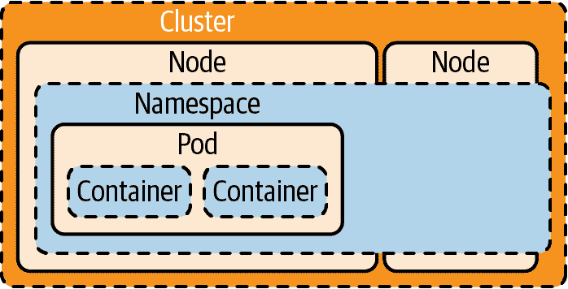
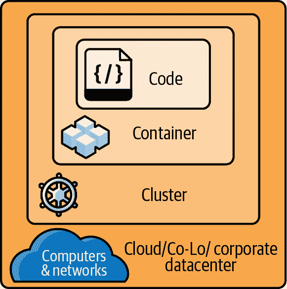
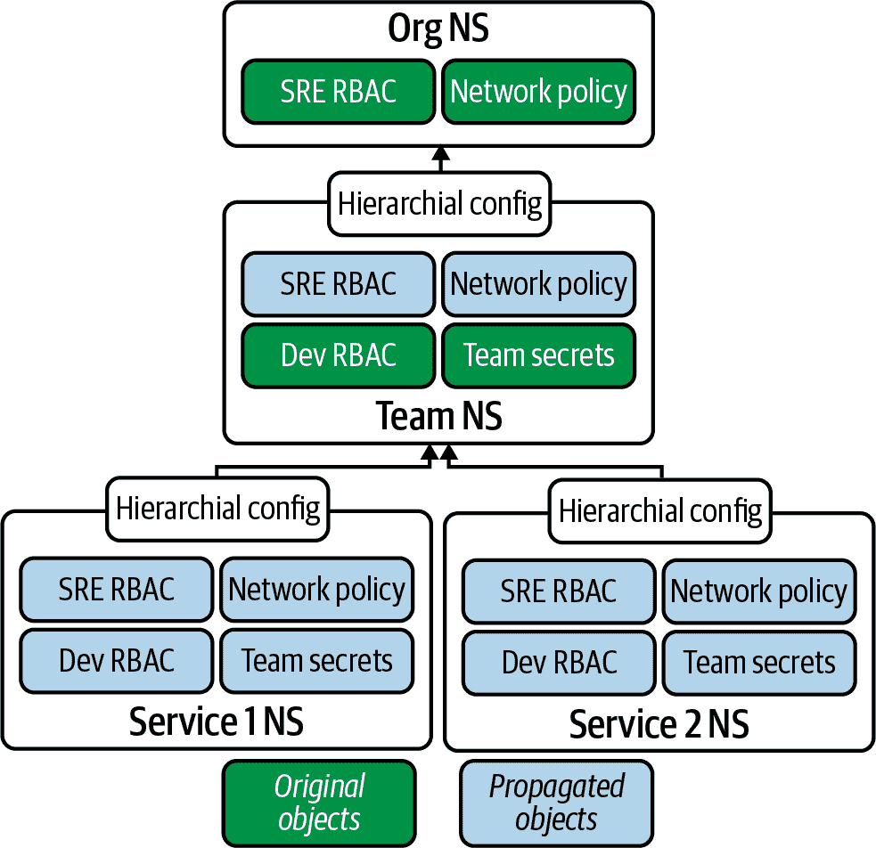

# 第七章：严格多租户

安全地共享 Kubernetes 集群是困难的。默认情况下，Kubernetes 没有配置为托管多个租户，并且需要进行工作以使其安全。 “安全”意味着应该在隔离的租户之间公平分割，并且他们不应该能够看到彼此，也不应该能够破坏共享资源。

每个租户可以运行他们自己选择的工作负载，限制在他们自己的一组命名空间中。命名空间配置中的安全设置与集群对外部和云服务的访问组合定义了租户如何安全分离。

集群中的每个租户都可以被视为友好或敌对，并且集群管理员部署适当的控制措施，以确保其他租户和集群组件免受伤害。这些控制措施的级别是根据系统的威胁模型预期的租户类型设置的。

###### 注意

一个租户是集群的客户。他们可以是一个团队，测试或生产环境，托管工具，或者任何资源的逻辑分组。

在本章中，您将航行在 Kubernetes 多租户的鲨鱼密布的水域中，并且它们的命名空间“安全边界”。我们检查了控制平面的锁定技术，比较了工作负载及其载货的数据分类，并探讨了如何监控我们的资源。

# 默认值

命名空间存在于组资源的群组，并且 Kubernetes 没有固有的命名空间租户模型。命名空间租户概念仅适用于 Kubernetes API 内部的交互，而不适用于整个集群。

默认情况下，跨租户可见性未受网络、DNS 和一些命名空间策略的保护，除非集群通过特定配置进行了硬化，我们将在本章中详细讨论。

一个谨慎的防御者将租户应用程序分隔成多个命名空间，以更清晰地划分每个服务帐户的 RBAC 权限，并使理解和部署网络策略、配额和限制以及其他安全工具变得更容易。由于命名空间绑定的策略和资源，您应只允许一个租户使用每个命名空间。

###### 提示

一个租户可以是一个单独的应用程序，一个被分成多个命名空间的复杂应用程序，其开发所需的测试环境，一个项目，或者任何信任边界。

# 威胁模型

[Kubernetes 多租户工作组](https://oreil.ly/cHmPD)考虑了两类多租户：

+   *软多租户*更易于租户使用，并允许更大的配置。

+   *严格多租户*旨在“默认情况下安全”，具有预配置和不可变的安全设置。

软多租户是一种友好的、更宽松的安全模型。它假设租户部分受信任，并关心集群的最佳利益，并允许他们配置自己命名空间的部分。

硬多租户已锁定，并假设租户是敌对的。多个控制措施降低了攻击者的机会：工作负载隔离、入场控制、网络策略、安全监控和入侵检测系统（IDS）在平台上配置，租户只执行受限的操作集。这种严格配置的代价是租户可用性的牺牲。

我们的威胁模型专注于强硬的多租户，以加强对我们的宿敌、数字海洋之恶棍海盗哈希杰克船长的每一个可能防御。

# 命名空间资源

在我们深入讨论硬和软多租户之前，让我们看看如何分离资源：命名空间和节点。

###### 提示

网络不遵循命名空间的概念：我们可以应用策略来塑造它，但从根本上说它是一个平面子网。

您的 Kubernetes RBAC 资源的可见性（在 第八章 中涵盖）要么限定于诸如 pods 或服务帐户等命名空间，要么涵盖整个集群，例如节点或持久卷。

将单个租户跨多个命名空间进行分散可以降低被窃取或被破坏的凭证的影响，并增加系统对抗妥协的抵抗力，但会增加一些操作复杂性的成本。您的团队应该能够自动化其工作，这将导致一个安全且快速补丁的系统。

###### 注意

GitOps 运算符可能部署在专用的每个运算符命名空间中。例如，一个应用程序可能部署在命名空间 `myapp-front-end`、`myapp-middleware` 和 `myapp-data` 中。一个特权运算符可以部署并修改这些命名空间中的应用程序，例如 `myapp-gitops` 命名空间，因此任何受其控制的命名空间（例如 `myapp-front-end`）的妥协都不会直接或间接导致特权运算符的妥协。

GitOps 部署了提交到其监控的存储库的任何内容，因此对生产资产的控制延伸到了源代码存储库。有关更多关于保护 Git 的信息，请参阅 [“为 GitOps 加固 Git”](https://oreil.ly/FRDzv)。

在 Kubernetes 的 RBAC 模型中，命名空间是集群范围的，因此遭受粗糙的集群级 RBAC：如果租户命名空间中的用户有权限查看自己的命名空间，则他们也可以查看集群上的所有其他命名空间。

###### 提示

OpenShift 引入了“项目”概念，它是带有额外注释的命名空间。

API 服务器可以通过此查询告诉您哪些资源不在命名空间中（输出已编辑以适应）：

```
$ kubectl api-resources --namespaced=false
NAME                              SHORTNAMES ... NAMESPACED   KIND
componentstatuses                 cs             false ComponentStatus
namespaces                        ns             false Namespace
nodes                             no             false Node
persistentvolumes                 pv             false PersistentVolume
...
```

Kubernetes 的共享 DNS 模型还暴露了其他命名空间和服务，并且是硬多租户困难的一个例子。CoreDNS 的防火墙插件可以配置为“防止某些命名空间中的 Pod 查找其他命名空间中的服务”。IP 和 DNS 地址对于调查其下一个目标的可见地平线的攻击者是有用的。

## 节点池

命名空间中的 Pod 可以跨越多个节点，如图 7-1 所示。如果攻击者能够从容器逃逸到底层节点，则可能能够在集群的命名空间甚至节点之间跳转。



###### 图 7-1\. 一个命名空间通常跨越多个节点，但是一个 Pod 实例只会在一个节点上运行。

节点池是具有相同配置的节点组，并且可以独立于其他节点池进行扩展。它们可以用于在相同节点上保持相同风险或分类的工作负载。例如，面向 Web 的应用程序应与对 Internet 流量不可访问的内部 API 和中间件工作负载分开，并且控制平面应在专用池中。这意味着在容器越界事件中，攻击者只能访问这些节点上的资源，而不能访问更敏感的工作负载或 Secrets，且在节点池之间移动不是一个简单的升级过程。

您可以使用标签和节点选择器将工作负载分配到节点池（输出已编辑）：

```
user@host:~ [0]$ kubectl get nodes --show-labels 
NAME          STATUS   ROLES    AGE   VERSION   LABELS
kube-node-1   Ready    master   11m   v1.22.1   beta.kubernetes.io/arch=amd64,...
kube-node-2   Ready    <none>   11m   v1.22.1   beta.kubernetes.io/arch=amd64,...
kube-node-3   Ready    <none>   11m   v1.22.1   beta.kubernetes.io/arch=amd64,...

user@host:~ [0]$ kubectl label nodes kube-node-2 \
  node-restriction.kubernetes.io/nodeclass=web-facing 

```

让我们检查一个部署，看看它的`NodeSelector`：

```
apiVersion: extensions/v1beta1
kind: Deployment
metadata:
  name: high-risk-workload
spec:
  replicas: 1
  template:
    spec:
      containers:
      - image: nginx/
# ...
      nodeSelector:
        node-restriction.kubernetes.io/nodeclass: web-facing 

```


查看应用于每个节点的标签。


设置节点的类别。


一个或多个针对节点标签的键值对，以指导调度程序。

###### 警告

本章后面将讨论如何通过使用[`NodeRestriction`](https://oreil.ly/VOjYB)准入插件中的众所周知标签，防止敌对`kubelet`重新标记自身。

[`PodNodeSelector`](https://oreil.ly/TRNUq) 准入控制器可以限制命名空间中选择器可以针对哪些节点进行目标选择，以防止敌对租户在其他的命名空间受限节点上调度（编辑以适应）：

```
apiVersion: v1
kind: Namespace
metadata:
  annotations:
    scheduler...io/node-selector: node-restriction.k...s.io/nodeclass=web-facing
  name: my-web-facing-ns
```

对于硬多租户系统，这些值应该由准入控制器根据工作负载的属性设置：它们的标签、部署来源或镜像名称。或者可能只允许部署到高风险或面向网络的节点的完全合格镜像白名单。

###### 注意

一个集群的安全边界根据其威胁模型和当前范围进行调整，正如[Mark Manning](https://oreil.ly/5YvCA)在[“命令和 KubeCTL：渗透测试人员的实际 Kubernetes 安全性”](https://oreil.ly/viBnl)中所示。

Kubernetes 系统的主要指导原则是保持 Pod 运行。一个 Pod 对基础设施故障的容忍性依赖于工作负载在硬件上的有效分布。这种以可用性为中心的风格正确地优先考虑了利用率而不是安全隔离。安全性成本更高，需要为每个隔离的工作负载分类专用节点。

## 节点污点

默认情况下，命名空间在集群中共享所有节点。如图所示，可以使用污点来防止调度程序在 Kubernetes 的默认配置中将 Pod 放置在某些节点上：

```
$ kubectl taint nodes kube-node-2 key1=value1:NoSchedule
```

这是因为自托管的控制平面使用文件系统托管的静态 Pod 清单在 `kubelet` 的 `staticPodPath` 中运行，默认为 */etc/kubernetes/manifests*，它会忽略这些污点。

通过高级调度提示，可以防止 Pod 在同一节点上共同调度，将它们隔离在自己的计算硬件上（虚拟机或裸金属机器）。

大多数情况下，这种隔离级别对于大多数人来说太昂贵了（它通过减少每个工作负载的可能节点数量来阻止“装箱”工作负载，而且未充分利用可能导致未使用的计算资源），因此在默认的 Kubernetes 配置上提供了一种一致的遍历命名空间的机制。

###### 注意

一个能够妥协 `kubelet` 的攻击者可以以许多巧妙的方式留在集群中，详细信息请参考 [Brad Geesaman](https://oreil.ly/gEIBb) 和 [Ian Coldwater](https://oreil.ly/8nz0p) 的演讲 [“高级持久性威胁”](https://oreil.ly/1GvRP)。

准入控制可以防止像共享主机命名空间这样的广泛开放的利用途径。您应该通过安全的 Pod 配置、镜像扫描、供应链验证、入站 Pod 和操作员的准入控制和策略，以及入侵检测来减轻潜在的容器逃逸到主机的风险，当其他方法失败时。

如果 Hashjack 船长无法通过容器运行时或内核版本中的漏洞轻松逃逸出容器，他们很快就会开始攻击网络。他们可能选择攻击集群中的其他租户或其他网络可访问的服务，如控制平面和 API 服务器、计算节点、集群外部数据存储或同一网络段上可访问的任何其他内容。

攻击者寻找链条中的下一个薄弱环节，或者任何过度特权的 Pod，因此在租户之间强制执行安全的“硬”多租户模式可以使集群对此类升级变得更加坚固。为了进行比较，让我们首先看一下“软”多租户的目标。

# 软多租户

您应该使用软多租户模型来防止由于过度特权的租户导致的可避免事故。与接下来要介绍的硬多租户相比，软多租户的构建和运行要容易得多，因为其威胁模型不考虑像 Dread Pirate Hashjack 这样的有动机的威胁行为者。

软多租户通常是“每个命名空间一个租户”的模型。在整个集群中，租户可能会把集群或管理员的最佳利益放在心上。然而，敌对的租户可能会打破这种类型的集群。

租户的示例包括团队中的不同项目，或者公司中的团队，这些租户通过 RBAC 角色和绑定进行强制执行，并通过命名空间进行分组。命名空间中的资源是有限的，因此租户无法耗尽集群的资源。

命名空间是用于在集群中建立安全边界的工具，但它们不是强制执行点。它们涵盖许多安全和策略功能：准入控制 Web 钩子、RBAC 和访问控制、网络策略、资源配额和限制范围、Pod 安全策略、Pod 反亲和性、带有污点和容忍度的专用节点，以及更多。因此，它们是其他机制和资源的抽象组合：您的威胁模型应将这些信任边界视为防御景观上的墙壁。

在宽松的软多租户模型下，命名空间隔离技术可能不严格执行，允许租户看到彼此的 DNS 记录，并且如果没有网络策略，则可能允许网络路由之间的通信。应监控 DNS 枚举和恶意域名请求。对于 Captain Hashjack 来说，静默扫描网络可能是逃避检测的更有效方式，尽管 CNI 和 IDS 工具应该能够检测到这种异常行为。

即使是软多租户部署，强烈推荐使用网络策略。Kubernetes 节点需要它们的`kubelet`之间的平面网络空间，并且`kubelet`的 CNI 插件用于在 OSI 第 2 层（ARP）、第 3/4 层（IP 地址和 TCP/UDP 端口）以及第 7 层（应用程序和 TLS/x509）强制执行租户命名空间分离。像 Cilium、Weave 或 Calico 这样的网络插件通过虚拟覆盖网络或 VPN 隧道将 Pod 流量路由到所有节点之间的所有流量，以对抗集群外窥探者进行加密。

CNI 保护传输中的数据，但必须信任 Kubernetes 允许运行的任何工作负载。由于恶意工作负载位于 CNI 的信任边界内，它们会接收到受信任的流量。您对该工作负载在其周围环境中变得不良的容忍度应指导您的安全控制级别。

###### 注意

我们将在第五章中深入讨论网络策略。

# 强制多租户

在这种模型中，集群租户彼此不信任，并且命名空间配置默认“安全”。CI/CD 管道中的安全保护栏和准入控制强制执行策略。这种分离水平是跨行业和国家部门、公共计算服务以及监管和认证机构所要求的敏感和私密工作负载。

## 敌对租户

在强制多租户系统中，将所有工作负载视为极具敌意可能会有所帮助。这探索了攻击树的更多分支，以制定最佳的集群安全控制平衡，这将有助于限制工作负载可能存在的宽松云或集群授权。

它还涵盖了一些未知的潜在事件，例如 RBAC 子系统 CVE-2019-11247 中的失败，该漏洞泄露了非集群范围角色对集群范围资源的访问权限，CVE-2018-1002105 和 CVE-2019-1002100，它们导致 API 服务器 DOS，或 CVE-2018-1002105，部分可利用的 API 身份验证绕过（在本章后面有详细介绍）。

###### 注意

在 2019 年，所有 Kubernetes API 服务器都面临严重的风险，可能受到攻击。[Rory McCune](https://oreil.ly/Kf8cP) 发现 v1.13.7 存在对 Billion Laughs YAML 反序列化攻击的漏洞，而 [Brad Geesaman](https://oreil.ly/KaOWm) 利用 [sig-honk](https://oreil.ly/dB7CX) 武器化了该漏洞。对于具有 API 服务器可见性的恶意租户来说，这将是一个简单的利用方式。

入场控制器在认证和授权后由 API 服务器执行，并通过“深度负载检查”验证传入的 API 服务器请求。这一额外步骤比传统的 RESTful API 架构更为强大，因为它使用特定策略检查请求的内容，可以捕获配置错误和恶意 YAML。

复杂的多租户系统可能会使用高级沙箱来以不同方式隔离 Pod，以增强对零日攻击的抵抗力。

###### 注意

更深入地涵盖了高级沙箱技术的内容在 第三章 中。

## 沙箱和策略

诸如 gVisor、Firecracker 和 Kata Containers 的沙箱巧妙地将 KVM 与命名空间和 LSM 结合起来，进一步将工作负载从高风险接口和内核等信任边界中抽象出来。


这些沙箱的设计旨在抵御其系统调用、文件系统和网络子系统中的漏洞。与每个项目一样，它们有 CVE，但它们得到了良好的维护并且迅速修复。它们的威胁模型有着良好的文档记录，理论上的架构也是坚实的，但每一种安全抽象都是以系统简易性、工作负载调试能力、文件系统和网络性能为代价的。

将 Pod 或命名空间沙箱化权衡加在所需的额外资源上。Hashjack 队长的潜在加密勒索应该被计入方程式，以对抗沙箱保护未知的内核和驱动程序漏洞。

###### 注意

沙箱并非万无一失，沙箱化的权衡在于同时在沙箱和底层 Linux 内核中发现可利用漏洞的可能性。这是一个合理的方法，并与浏览器沙箱化类似：Chromium 使用与容器相同的命名空间、`cgroups` 和 `seccomp`。在 Pwn2Own 和 Tianfu Cup 上经常展示了 Chromium 的突破，但利用漏洞的风险窗口大约是每 2 到 5 年一次（非常粗略地说）。

复杂和可扩展的入场控制应实现像 OPA 这样的工具。OPA 使用 Rego 语言定义策略，与任何代码一样，策略可能会存在漏洞。安全工具很少会“故障开放”，除非它们配置错误。

策略风险包括入场控制器策略中的宽容正则表达式和对象或值的松散比较。许多 YAML 属性，如镜像名称、标签和元数据，都是容易出错的字符串值比较。与所有静态分析一样，策略引擎的健壮性取决于您的配置。

多租户还涉及监视工作负载可能具有敌对行为的行为。支持入侵检测和可观察性服务有时需要潜在危险的 eBPF 权限，而 eBPF 的内核执行已成为容器越狱的源头。`CAP_BPF` 能力（自 Linux 5.8 起）将减少 eBPF 系统中的错误影响，并减少对“过载的 `CAP_SYS_ADMIN` 能力”的使用（如 manpage 所述）。

###### 注意

eBPF 在第五章和第九章中进一步讨论。

尽管以提升的权限运行内省和可观察性工具存在运行时风险，但了解集群风险并实时监控这些权限比不知情更安全。

## 公共云多租户

Google Cloud Run 等公共硬多租户服务不信任其工作负载。它们自然地假设租户及其活动是恶意的，并构建控件以将其限制在容器、pod 和命名空间中。威胁模型考虑到攻击者将尝试每种已知攻击以试图越狱。

私人运行的硬多租户先驱包括 [*https://contained.af*](https://contained.af) ——一个带有终端的网页，连接到一个使用内核原语和 LSM 安全的容器。冒险家被邀请尝试越狱，如果他们的狡猾和技能使其能够。到目前为止还没有越狱成功，这证明了该网站主持人 Jess Frazelle 在 Docker 的 `runc` 运行时中做出的贡献。

尽管犯罪分子可能会有动机使用或出售容器越狱的零日漏洞，但大多数容器逃逸的先决条件是缺乏 LSM 和能力控制。按照准入控制强制执行的安全最佳实践配置的容器已启用这些控制，并且越狱风险较低。

CTF 或共享计算平台，如 [*https://ctf.af*](https://ctf.af)，应被视为受到威胁，并定期“重新铺设”（从头开始重建，不保留任何基础设施），以期望升级。这使得攻击者的持久性攻击变得困难，因为他们必须定期重复使用相同的入口点，增加被发现的可能性。

# 控制平面

Hashjack 船长想要在您的 pod 中运行代码以查看系统的其他部分。从 pod 中窃取服务帐户身份验证信息（位于 */var/run/secrets/kubernetes.io/serviceaccount/token*）使攻击者能够伪装成您的 pod 身份访问 API 服务器和任何云集成，如以下示例所示：

###### 提示

Pod 和机器身份凭据对于海盗对手来说就像宝藏。只需服务帐户令牌（JWT）即可与 API 服务器通信，因为服务器证书验证可以通过 `--insecure` 禁用，尽管这不建议用于合法用途。

```
user@pod:~ [0]$ curl https://kubernetes.default/api/v1/namespaces/default/pods/ \
  --header "Authorization: Bearer ${TOKEN}" --insecure 

user@pod:~ [0]$ kubectl --token="$(<${DIR}/token)" \
  --certificate-authority="${DIR}/ca.crt" get pods 

user@pod:~ [0]$ kubectl --token="$(<${DIR}/token)" \
  --insecure-skip-tls-verify get pods 

user@pod:~ [0]$ kubectl --token="$(<${DIR}/token)" -k \
  get buckets ack-test-smoke-s3 -o yaml 
```


`kubernetes.default`是 Pod 网络中的 API 服务器 DNS 名称。


`kubectl`默认为`kubernetes.default`，凭据位于*/run/secrets/kubernetes.io/serviceaccount*中。


使用`kubectl` YOLO（不验证 API 服务器的证书颁发机构）。


如果工作负载标识能够访问云托管资源的 CRD，则窃取令牌可以解锁对 S3 存储桶和其他连接基础设施的访问。

对 API 服务器的访问还可以通过其 SAN 泄露信息，显示内部和外部 IP 地址，DNS 记录指向的任何其他域，以及源自*kubernetes.default.svc.cluster.local*的标准内部域（输出已编辑）：

```
user@pod:~ [0]$ openssl s_client -connect kubernetes.default:443 \
  < /dev/null 2>/dev/null |
  openssl x509 -noout -text | grep -E "DNS:|IP Address:"

DNS:kube-node-1, DNS:kubernetes, DNS:kubernetes.default,
DNS:kubernetes.default.svc, DNS:kubernetes.default.svc.cluster.local,
IP Address:10.96.0.1, IP Address:10.0.1.1, IP Address:167.99.95.202
```

除 API 服务器的 Kubernetes 资源级 RBAC 之外，集群中还有许多身份验证端点，每个端点允许攻击者使用窃取的凭据尝试特权升级。

###### 警告

默认情况下，未经身份验证的用户将被放置到`system:anonymous`组中，并且能够读取 API 服务器的`/version`端点，如下所示，并使用任何意外绑定到该组的角色。如果可能的话，应禁用匿名认证以符合您的用例：

```
root@pod:/ [60]# curl -k https://kubernetes.default:443/version
{
  "major": "1",
  "minor": "22",
  "gitVersion": "v1.22.0",
# ...
```

每个`kubelet`都有其自己的本地公开 API 端口，可以允许未经身份验证的访问来读取节点本地的 Pod。历史上，这是由于`cAdvisor`（容器顾问）请求资源和性能统计信息，一些可观察性工具仍然使用这个端点。如果没有网络策略来限制 Pod 与节点网络的访问，`kubelet`可以从 Pod 中受到攻击。

凭借同样的逻辑，API 服务器可以从没有网络策略限制的 Pod 攻击。任何管理界面应该在尽可能多的方面进行限制。

## API 服务器和 etcd

`etcd`是每个版本的 Kubernetes 和许多其他云原生项目背后的强大分布式数据存储。它可以部署在专用集群上，作为 Kubernetes 控制平面节点上的`systemd`单元，或作为 Kubernetes 集群中的自托管 Pod。

在 Kubernetes 集群内部部署`etcd`作为 Pod 是最风险的部署选项：它为攻击者提供了直接访问 CNI 上的`etcd`。一个意外的 Kubernetes RBAC 配置错误可能会通过`etcd`篡改暴露整个集群。

###### 注意

`etcd`的 API 曾遭遇远程可利用的 CVE。CVE-2020-15115 允许对用户密码进行远程暴力破解，CVE-2020-15106 是远程 DoS。历史上的 CVE-2018-1098 还允许跨站请求伪造，导致特权提升。

应通过将其防火墙限制为仅允许 API 服务器访问，启用所有加密方法，并最终将 API 服务器与 KMS 或 Vault 集成，以便在到达`etcd`之前加密敏感值。指导方针已发布在[`etcd`安全模型](https://oreil.ly/stnc5)中。

API 服务器处理系统的核心逻辑并将其状态持久化在`etcd`中。只有 API 服务器应该需要访问，因此在 Kubernetes 集群中`etcd`不应该通过网络访问。

###### 提示

很明显，每个软件都容易受到漏洞的影响，因此当`etcd`不在网络上普遍可用时，这些攻击可以得到减少。如果 Hashjack 船长看不到套接字，他们就无法攻击它。

API 服务器和`etcd`之间存在一个信任边界。对`etcd`的根访问可能会危及 API 服务器的数据或允许注入恶意工作负载，因此 API 服务器保存一个加密密钥：如果密钥被泄露，攻击者可以读取`etcd`数据。这意味着如果为了防止窃取而部分加密`etcd`的内存和备份，Secrets 的值将使用 API 服务器的对称密钥进行加密。该 Secret 密钥在启动时通过配置 YAML 传递给 API 服务器：

```
--encryption-provider-config=/etc/kubernetes/encryption.yaml
```

这个文件包含用于加密`etcd`中 Secrets 的对称密钥：

```
apiVersion: apiserver.config.k8s.io/v1
kind: EncryptionConfiguration
resources:
  - resources:
    - secrets
    providers:
    - aescbc:
        keys:
        - name: key1
          secret: <BASE64 ENCODED SECRET ENCRYPTION KEY>
    - identity: {}
```

Base64 是一种编码方式，用于简化文本链接上的二进制数据，在 Kubernetes 的古老时代，这是保护 Secrets 的唯一方式。如果 Secret 值在静态时未加密，那么`etcd`的内存可以被转储，攻击者可以读取 Secret 值，并且备份可以被掠夺以获取 Secrets。

容器只是进程，但主机上的根用户是全知的。他们必须能够查看所有内容以便调试和维护系统。正如你所见，转储进程内存空间中的字符串是微不足道的：

###### 注意

参见“容器取证”以了解一个简单的示例，如何转储进程内存。

所有内存都可以被根用户读取，因此容器内存中的未加密值很容易被发现。你必须检测那些尝试这种行为的攻击者。

对于攻击者来说最难窃取的 Secrets 是隐藏在托管提供商托管的密钥管理服务（KMS）中的那些，它们可以代表消费者执行加密操作。专用的物理硬件安全模块（HSM）用于将云 KMS 系统的风险降至最低。诸如 HashiCorp Vault 等应用程序可以配置为 KMS 的前端，服务必须明确进行身份验证才能检索这些 Secrets。它们不在本地主机的内存中，不能轻易枚举，每个请求都会被记录以供审计。攻击者如果入侵了一个节点，还没有窃取该节点可以访问的所有 Secrets。

KMS 集成使得从`etcd`中窃取云 Secrets 变得更加困难。API 服务器使用本地代理与 KMS 交互，通过解密存储在`etcd`中的值：

```
apiVersion: apiserver.config.k8s.io/v1
kind: EncryptionConfiguration
resources:
  - resources:
      - secrets
    providers:
      - kms:
          name : myKmsPlugin
          endpoint: unix:///var/kms-plugin/socket.sock
          cachesize: 100
```

让我们继续讨论其他控制平面组件。

## 调度器和控制器管理器

控制器管理器和调度器组件很难受到攻击，因为它们没有公共网络 API。它们可以通过影响`etcd`中的数据或欺骗 API 服务器来进行操纵，但不接受网络输入。

控制器管理器的服务账户是“最小权限”的典范实现。一个控制器管理器进程实际上运行多个独立的控制器。如果控制器管理器发生权限升级，使用的服务账户在泄露的情况下会有良好的隔离：

```
# kubectl get -n kube-system -o wide serviceaccounts | grep controller
attachdetach-controller              1         20m
calico-kube-controllers              1         20m
certificate-controller               1         20m
clusterrole-aggregation-controller   1         20m
cronjob-controller                   1         20m
daemon-set-controller                1         20m
deployment-controller                1         20m
disruption-controller                1         20m
endpoint-controller                  1         20m
endpointslice-controller             1         20m
endpointslicemirroring-controller    1         20m
expand-controller                    1         20m
job-controller                       1         20m
namespace-controller                 1         20m
node-controller                      1         20m
pv-protection-controller             1         20m
pvc-protection-controller            1         20m
replicaset-controller                1         20m
replication-controller               1         20m
resourcequota-controller             1         20m
service-account-controller           1         20m
service-controller                   1         20m
statefulset-controller               1         20m
ttl-controller                       1         20m
```

然而，这并不是该服务面临的最大风险。与大多数 Linux 攻击一样，拥有 root 权限的恶意用户可以访问一切：运行中进程的内存、磁盘上的文件、网络适配器以及挂载的设备。

攻击者如果攻破运行控制器管理器的节点，可以冒充该组件，因为它与 API 服务器共享关键的身份验证材料和文件系统，使用主节点的文件系统共享：

```
  - command:
    - kube-controller-manager
    - --authentication-kubeconfig=/etc/kubernetes/controller-manager.conf
    - --authorization-kubeconfig=/etc/kubernetes/controller-manager.conf
    - --bind-address=127.0.0.1
    - --client-ca-file=/etc/kubernetes/pki/ca.crt
    - --cluster-name=kubernetes
    - --cluster-signing-cert-file=/etc/kubernetes/pki/ca.crt
    - --cluster-signing-key-file=/etc/kubernetes/pki/ca.key
    - --controllers=*,bootstrapsigner,tokencleaner
    - --kubeconfig=/etc/kubernetes/controller-manager.conf
    - --leader-elect=true
    - --port=0
    - --requestheader-client-ca-file=/etc/kubernetes/pki/front-proxy-ca.crt
    - --root-ca-file=/etc/kubernetes/pki/ca.crt
    - --service-account-private-key-file=/etc/kubernetes/pki/sa.key
    - --use-service-account-credentials=true
    image: k8s.gcr.io/kube-controller-manager:v1.20.4
    volumeMounts:
    - mountPath: /etc/ssl/certs
      name: ca-certs
      readOnly: true
    - mountPath: /etc/ca-certificates
      name: etc-ca-certificates
      readOnly: true
    - mountPath: /usr/libexec/kubernetes/kubelet-plugins/volume/exec
      name: flexvolume-dir
    - mountPath: /etc/kubernetes/pki
      name: k8s-certs
      readOnly: true
    - mountPath: /etc/kubernetes/controller-manager.conf
      name: kubeconfig
      readOnly: true
    - mountPath: /usr/local/share/ca-certificates
      name: usr-local-share-ca-certificates
      readOnly: true
    - mountPath: /usr/share/ca-certificates
      name: usr-share-ca-certificates
      readOnly: true
```

作为控制平面主机上的 root 用户，检查控制器管理器，我们可以转储容器的文件系统并探索：

```
# find /proc/27386/root/etc/kubernetes/
/proc/27386/root/etc/kubernetes/
/proc/27386/root/etc/kubernetes/pki
/proc/27386/root/etc/kubernetes/pki/apiserver.crt
/proc/27386/root/etc/kubernetes/pki/front-proxy-client.key
/proc/27386/root/etc/kubernetes/pki/ca.key
/proc/27386/root/etc/kubernetes/pki/ca.crt
/proc/27386/root/etc/kubernetes/pki/sa.key
/proc/27386/root/etc/kubernetes/pki/sa.pub
/proc/27386/root/etc/kubernetes/pki/front-proxy-client.crt
/proc/27386/root/etc/kubernetes/pki/apiserver-kubelet-client.crt
/proc/27386/root/etc/kubernetes/pki/front-proxy-ca.key
/proc/27386/root/etc/kubernetes/pki/apiserver-kubelet-client.key
/proc/27386/root/etc/kubernetes/pki/apiserver.key
/proc/27386/root/etc/kubernetes/pki/front-proxy-ca.crt
/proc/27386/root/etc/kubernetes/controller-manager.conf
```

调度器比控制器管理器具有更少的权限和密钥：

```
  containers:
  - command:
    - kube-scheduler
    - --authentication-kubeconfig=/etc/kubernetes/scheduler.conf
    - --authorization-kubeconfig=/etc/kubernetes/scheduler.conf
    - --bind-address=127.0.0.1
    - --kubeconfig=/etc/kubernetes/scheduler.conf
    - --leader-elect=true
    - --port=0
    image: k8s.gcr.io/kube-scheduler:v1.20.4
```

这些有限的权限使得 Kubernetes 在集群内部配置了最小权限，并使得 Dread Pirate Hashjack 的工作更加困难。

云控制器管理器的 RBAC ClusterRole 允许创建服务账户，攻击者可以利用这些账户进行横向移动或持续访问。它还可以访问云交互以控制计算节点进行自动扩展、云存储访问、网络路由（例如节点之间）、以及负载均衡器配置（用于路由互联网或外部流量到集群）。

历史上，此控制器曾是 API 服务器的一部分，这意味着集群遭到攻击可能升级为云账号遭到攻击。像这样分离权限可以增加攻击者的难度，确保控制平面节点不被攻破可以保护这些服务。

# 数据平面

Kubernetes 在工作节点加入集群后会信任该节点。如果你的工作节点被黑客攻破，那么它托管的 `kubelet` 也会被攻破，以及 `kubelet` 运行或具有访问权限的 pod 和数据。所有 `kubelet` 和工作负载凭证都处于攻击者控制之下。

默认情况下，`kubelet` 的 kubeconfig、密钥和服务账户详细信息不会受 IP 绑定限制，工作负载服务账户也是如此。这些身份（服务账户 JWTs）可以从 API 服务器可访问的任何地方泄露并使用。后期利用，Captain Hashjack 可以冒充 `kubelet` 的工作负载，无论这些工作负载的身份在何处被接受：API 服务器、其他集群和 `kubelet`、云和数据中心集成以及外部系统。

默认情况下，API 服务器使用 NodeRestriction 插件和准入控制器中的节点授权。这些限制了`kubelet`的服务帐户凭据（必须位于`system:nodes`组中）只能访问安排在该`kubelet`上的 pod。攻击者只能拉取与安排在`kubelet`节点上的工作负载相关的 Secrets，而这些 Secrets 已经从主机文件系统挂载到容器中，任何 root 用户都可以读取。

这使得 Hashjack 船长的专制计划变得更加困难。一个被入侵的`kubelet`的爆炸半径受到此策略的限制。攻击者可能会尝试吸引敏感的 pod 调度到它身上，从而绕过这一限制。

这不是使用 API 服务器来重新调度 pod —— 被窃取的`kubelet`凭据在`kube-system`命名空间中没有授权 —— 而是通过更改`kubelet`的标签来假装成不同的主机或隔离的工作负载类型（前端、数据库等）。

一个被入侵的`kubelet`能够通过更新其命令行标志并重新启动来重新标记自己。这可能会欺骗 API 服务器将敏感的 pod 和 Secrets 调度到该节点上（输出已编辑）：

```
root@kube-node-2 # kubectl get secrets -n null 
Error from server (Forbidden): secrets is forbidden: User "system:node:kube-node-2"
cannot list resource "secrets" in API group "" in the namespace "null":
No Object name found

root@kube-node-2 # kubectl label --overwrite \
    node kube-node-2 sublimino=was_here 
node/kube-node-2 labeled

```


通过进行失败的 API 调用来检查用户，我们是`kubelet`节点`kube-node-2`。


使用新标签修改我们自己。

管理员可以使用标签将特定工作负载分配给特定的匹配`kubelet`节点和命名空间，将具有相似数据分类的工作负载分组在一起，或通过将网络流量保持在同一区域或数据中心来提高性能。攻击者不应能够在这些敏感且隔离的命名空间或节点之间跳跃。

NodeRestriction 准入插件通过强制不可变标签格式来防止节点将自己重新标记为这些受信任的节点组的一部分。文档使用监管标签作为示例（如`example.com.node-restriction.kubernetes.io/fips=true`）：

```
# try to modify a restricted label
root@kube-node-2 # kubectl label --overwrite \
    node kube-node-2 example.com.node-restriction.kubernetes.io/fips=true
Error from server (Forbidden): nodes "kube-node-2" is forbidden: is not allowed
to modify labels: example.com.node-restriction.kubernetes.io/fips
```

没有这种额外的控制，一个被入侵的`kubelet`可能会危及敏感工作负载，甚至可能危及整个集群或云账户。该插件仍允许对一些不那么敏感的标签进行修改。

###### 提示

任何硬多租户系统都应考虑 RBAC 角色的传递权限的影响，例如像 [gcploit](https://oreil.ly/DTFz2) 在 GCP 中显示的那样。它通过链接分配给服务帐户的 IAM 策略，并利用它们的权限来探索原始服务帐户的“传递权限”。

# 集群隔离架构

在考虑数据分类时，有助于问自己，“最坏的情况是什么？”并从那里开始倒推。正如图 7-2 所示，代码将尝试逃离其容器，这可能会攻击集群并可能会危及账户安全。不要将高价值数据放在可以通过侵入低价值数据系统而访问的地方。



###### 图 7-2\. Kubernetes 数据流图（来源：[cncf/financial-user-group](https://oreil.ly/BI4lj)）

集群应根据数据分类和违规影响进行隔离。在极端情况下，每个租户一个集群是昂贵的，并为 SRE 和安全团队创建了管理开销。划分集群的艺术在于安全性与可维护性的平衡。

有许多互相隔离的集群运行是昂贵的并浪费大量空闲计算资源，但对于敏感工作负载有时是必要的。每个集群必须应用一致的策略，并且分层命名空间控制器提供了一个有节制的路径来推广类似配置。

###### 提示

需要统一配置来将 Kubernetes 资源同步到从属集群，并应用一致的准入控制和网络策略。

在图 7-3 中，我们看到策略对象如何在命名空间之间传播，以提供像 RBAC、网络策略和团队特定秘密等安全要求的统一执行。



###### 图 7-3\. Kubernetes 分层命名空间控制器（来源：[Kubernetes 多租户工作组：深入探讨](https://oreil.ly/7E2e2)）

# 集群支持服务和工具环境

连接到不同敏感性集群的共享工具环境可以为攻击者在环境之间转移或收集泄漏数据提供机会。

###### 警告

工具环境是攻击的主要目标，尤其是注册表和内部包的供应链，以及日志记录和可观察性系统。

CVE-2019-11250 是一个侧信道信息泄漏，泄漏 HTTP 身份验证头。这些敏感数据默认在运行 client-go 库的 Kubernetes 组件中记录。在任何系统中，过度记录头部和环境变量是一个常见问题，突显了在敏感系统中进行分离的必要性。

可以将流量路由回其客户集群的工具环境可能能够访问具有来自 CI/CD 系统的凭据的管理界面和数据存储。或者，即使没有直接的网络访问，Hashjack 船长也可能会毒害容器镜像、破坏源代码、掠夺监控系统、访问安全和扫描服务，并留下后门。

# 安全监控和可见性

大型组织运行安全运营中心（SOC）和安全信息与事件管理（SIEM）技术，以支持合规性、威胁检测和安全管理。您的集群会向这些系统发出事件、审计、日志和可观察性数据，这些数据会被监控和反应。

过载这些系统的数据、超出速率限制，或增加事件延迟（导致审计、事件或容器日志延迟）可能会超出 SOC 或 SIEM 响应的能力。

Stateless 应用程序倾向于将它们的数据存储在其他人的数据库中，可从 Kubernetes 访问的云数据存储是主要目标。可以读取或写入这些数据存储的工作负载非常诱人，使用服务账号凭据和工作负载标识很容易获取数据。你的 SOC 和 SIEM 应该将云事件与它们调用的 Kubernetes 工作负载标识相关联，以了解系统的使用方式及可能的攻击方式。

我们将在第九章中更详细地讨论这个话题。

# 结论

隔离工作负载很困难，并需要您投资于测试自己的安全性。使用静态分析验证您的配置文件，并通过测试在运行时重新验证集群，以确保它们仍然正确配置。

API 服务器和 `etcd` 是 Kubernetes 的大脑和记忆，必须与敌对租户隔离开来。一些多租户选项在更大的 Kubernetes 集群中运行许多控制平面。

分层命名空间控制器为多集群策略带来了分布式管理。
