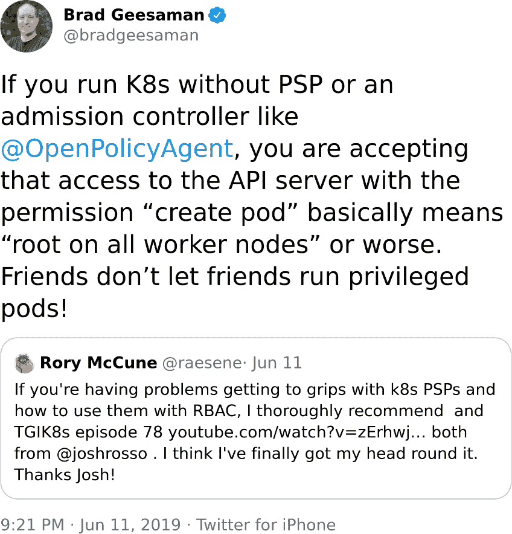
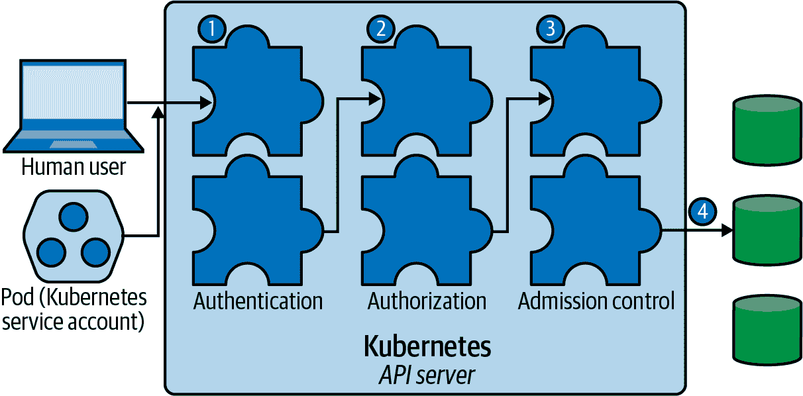
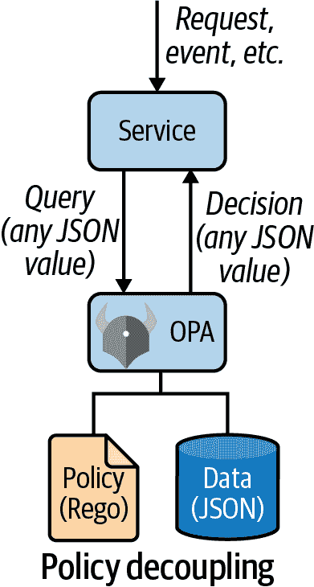
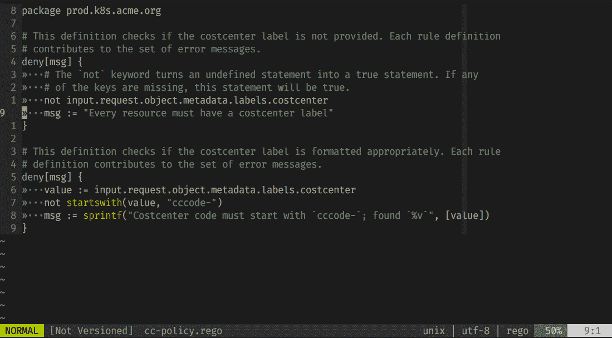
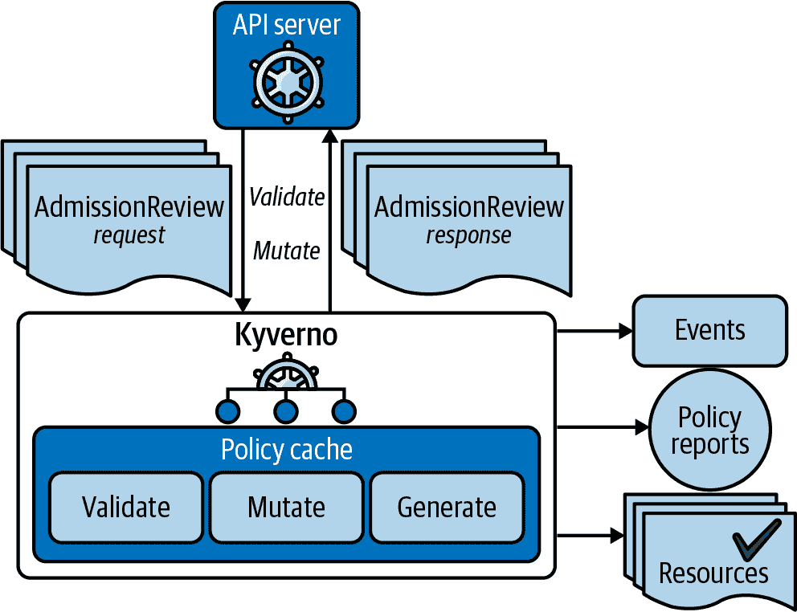

# 第八章：政策

一旦一个系统建立在坚实的基础上，就必须正确使用以保持其完整性。建造一个海上要塞来抵御海盗是一场战斗的一半，接着是派遣守卫到瞭望塔，并随时准备进行防御。

就像对要塞守卫的命令一样，应用于集群的政策定义了允许的行为范围。例如，一个 pod 必须使用什么安全配置选项，存储和网络选项，容器镜像，以及工作负载的任何其他特性。

政策必须在集群和云中同步（准入控制器，IAM 政策，安全边车，服务网格，`seccomp` 和 AppArmor 配置文件）并加以执行。政策必须针对工作负载，这引发了一个身份的问题。我们能证明一个工作负载的身份吗，在给予其特权之前？

在本章中，我们将看看当政策未被执行时会发生什么，工作负载和操作员的身份应该如何管理，以及船长将如何尝试与我们防御墙上的潜在漏洞进行交互。

我们首先将审查不同类型的政策，并讨论 Kubernetes 在这一领域的开箱即用（OOTB）功能。然后我们转向威胁模型和关于审计等政策的常见期望。本章的大部分内容我们将花在访问控制主题上，特别是围绕基于角色的访问控制（RBAC），然后我们进一步研究基于项目如开放策略代理（OPA）和 Kyverno 的 Kubernetes 政策的通用处理。

# 政策类型

在现实场景中——也就是说，当你在生产中运行工作负载时——在业务的背景下，你必须考虑不同类型的政策：

技术政策

这些通常很容易理解并且易于实施（例如，运行时或网络通信政策）。

组织政策

到达这些政策可能会因组织而异具有挑战性（例如，“开发人员只能部署到测试和开发环境”）。

法规政策

这些政策取决于您的工作负载所在的行业，根据合规性水平的不同，可能需要大量时间和精力来实施（例如，要求卡片持有人数据在开放的公共网络上传输时必须[加密](https://oreil.ly/iSQEE)的 PCI DSS 政策）。

在本章的背景下，我们主要关注如何定义和执行可以明确陈述的政策。在第十章中，我们将进一步探讨组织背景，通常情况下，尽管所有政策已经到位，但人类用户（作为链条中最薄弱的环节）为船长提供了一个受欢迎的入口角度。

让我们首先看看 Kubernetes 默认提供了什么。

# 默认值

策略对于保持 Kubernetes 安全至关重要，但默认情况下很少启用。大多数软件的配置随着时间的推移而变化，随着新功能的推出，配置错误成为常见的攻击向量，Kubernetes 也不例外。

对于满足您需求的重复使用和扩展开源策略配置通常比自行推出更安全，为了防止退化，您必须使用诸如 [conftest](https://oreil.ly/Jvg7z) 等工具测试基础设施和安全代码，我们将在 “开放策略代理” 深入探讨此主题。

图 8-1，很好地总结了这种情感。在这张图片中，Kubernetes 安全从业者 [Brad Geesaman](https://oreil.ly/KaOWm) 指出了默认未启用准入控制的危险性；还可以参见相应的 [TGIK episode](https://oreil.ly/kHpfU)。

现在，如果船长在岗位上睡着了，会有哪些默认设置可以被利用呢？



###### 图 8-1\. Brad Geesaman 明智地提醒我们 Kubernetes 默认设置的危险性，以及添加准入控制的重要性。

Kubernetes 提供了一些策略的即插即用支持，包括控制网络流量、限制资源使用、运行时行为以及最主要的访问控制，我们将在 “认证和授权” 以及 “基于角色的访问控制（RBAC）” 之前深入探讨这些内容，然后转向 “通用策略引擎”。

现在让我们更仔细地看一看默认设置，并看看我们面临哪些挑战。

## 网络流量

`NetworkPolicy` 资源与强制执行它的 CNI 插件结合使用，允许我们制定约束网络流量的策略（另见 第五章）。

## 限制资源分配

在 Kubernetes 中，默认情况下，Pod 中的容器在计算资源消耗方面没有限制。自 Kubernetes 1.10 版本开始，您可以使用 [LimitRanges](https://oreil.ly/nQsYU) 在每个命名空间基础上约束容器和 Pod 的资源分配。这种策略类型通过准入控制器强制执行，意味着不适用于正在运行的 Pod。

要查看 LimitRanges 在实际操作中的工作方式，假设您想要限制 `dev` 命名空间中容器可使用的内存为 2 GB。您可以定义如下策略：

```
apiVersion: v1
kind: LimitRange
metadata:
  name: dev-mem-limits
spec:
  limits:
  - type: Container
    max:
      memory: 2Gi
```

假设您将前面的 YAML 片段存储在名为 *dev-mem-limits.yaml* 的文件中，则为了强制执行限制范围，您将执行以下命令：

```
kubectl -n dev apply -f dev-mem-limits.yaml
```

如果您现在尝试创建一个尝试使用更多内存的容器的 Pod，您将收到类型为 403 Forbidden 的错误消息。

## 资源配额

在多租户环境中，一个集群被多个团队共享，一个特定的团队可能会使用超过工作节点（CPU、RAM 等）提供的公平份额。[资源配额](https://oreil.ly/7sZLF) 是一种策略类型，允许您控制这些配额。

###### 提示

某些 Kubernetes 发行版（例如 OpenShift）以一种方式扩展命名空间（在那里称为“项目”），使得资源配额等功能可以直接使用和强制执行。

对于具体的用法，请查阅深入文章 [“如何使用 Kubernetes 资源配额”](https://oreil.ly/MZKxX)，同时查看 Google Cloud 关于此主题的博客文章 [“Kubernetes 最佳实践：资源请求和限制”](https://oreil.ly/eTrf5)。

此外，自 Kubernetes v1.20 起，还有可能限制每个节点基础上的 pod 使用的 [进程 ID](https://oreil.ly/AJaM8) 的数量。

## 运行时策略

[Pod 安全策略](https://oreil.ly/NfYXy)（PSPs）允许您定义对 pod 创建和更新的精细授权。

假设您希望使用 PSP 设置默认的 `seccomp` 和 AppArmor 配置文件，正如经典文档示例中所示：

```
apiVersion: policy/v1beta1
kind: PodSecurityPolicy
metadata:
  name: restricted
  annotations:
    seccomp.security.alpha.kubernetes.io/allowedProfileNames:
    'docker/default,runtime/default'
    apparmor.security.beta.kubernetes.io/allowedProfileNames: 'runtime/default'
    seccomp.security.alpha.kubernetes.io/defaultProfileName:  'runtime/default'
    apparmor.security.beta.kubernetes.io/defaultProfileName:  'runtime/default'
spec:
# ...
```

不过，PSP 在撰写本书时存在一些问题。它们正在 [被淘汰的过程中](https://oreil.ly/YWAEJ)。

###### 提示

越来越多的组织正在考虑使用 [OPA 约束框架](https://oreil.ly/9eC1B) 替代 PSP，因此这可能也是您要考虑的内容。

好消息是，PSP 的替代方案已经存在：在上游，它们被 [Pod 安全标准](https://oreil.ly/bvJzZ)（PSS）取代（Aqua Security 的博客文章 ["Kubernetes Pod 安全策略淘汰：您需要了解的一切"](https://oreil.ly/ayg7a) 进一步详细介绍了这里），您也可以使用在 “通用策略引擎” 中讨论的框架来覆盖运行时策略。

## 访问控制策略

在认证和授权方面，Kubernetes 是灵活且可扩展的。我们将在 “认证和授权” 中讨论访问控制策略的详细信息，特别是基于角色的访问控制（RBAC）在 “基于角色的访问控制（RBAC）” 中讨论。

现在，Kubernetes 内置策略的概述已经完成，那么策略空间中的威胁建模是什么样的呢？让我们来找出答案。

# 威胁模型

在策略的背景下相关的威胁模型是广泛的，但有时它们可能会微妙地隐藏在其他主题中，或者没有明确地被提出。让我们来看看从 2016 年到 2019 年时间段的一些相关策略空间的过去攻击场景示例：

+   [CVE-2016-5392](https://oreil.ly/dPmHr)描述了一种攻击，其中 API 服务器（在多租户环境中）允许具有其他项目名称知识的远程经过身份验证的用户通过与观察-缓存列表相关的向量获取敏感项目和用户信息。

+   特定版本的 CoreOS Tectonic 在*/api/kubernetes/*直接代理到集群，无需认证即可访问，并允许攻击者直接连接到 API 服务器，正如[CVE-2018-5256](https://oreil.ly/FsmL2)所观察到的。

+   在[CVE-2019-3818](https://oreil.ly/9ZJHR)中，`kube-rbac-proxy`容器未尊重 TLS 配置，允许使用不安全的密码和 TLS 1.0。攻击者可以针对使用弱配置的 TLS 连接发送的流量，并可能破解加密。

+   在[CVE-2019-11245](https://oreil.ly/N5RfD)中，我们看到攻击者可以利用某些`kubelet`版本未指定显式的`runAsUser`而尝试在容器重新启动时以 UID 0（root）身份运行，或者如果镜像先前已拉到节点上。

+   根据[CVE-2019-11247](https://oreil.ly/DcLvA)，Kubernetes API 服务器错误地允许对集群范围的自定义资源进行访问，如果请求伪装成在特定命名空间内的资源。以此方式访问的资源的授权是通过命名空间内的角色和角色绑定来强制执行的，这意味着只有对一个命名空间内的资源有访问权限的用户可以创建、查看、更新或删除集群范围的资源。

+   在[CVE-2020-8554](https://oreil.ly/fxRTk)中，攻击者可能通过中间人攻击方式拦截流量，这在多租户环境中可能会截取到其他租户的流量。新的[DenyServiceExternalIPs](https://oreil.ly/SDAHG)入口控制器被添加，因为目前对此问题尚无修补程序。

# 常见期望

在以下各节中，我们审查一些常见期望—即与策略相关的情况和已确立的方法—以及它们如何在 Kubernetes 中的默认设置中解决，并在没有 OOTB（Out Of The Box）功能可用的情况下，指出在 Kubernetes 之上运行的示例。

## 突破玻璃场景

当我们说突破玻璃场景时，通常指的是一种绕过默认访问控制制度的过程，以应对紧急情况。紧急情况可能是外部事件，如自然灾害或攻击者试图干扰您的集群。如果提供了这样的功能，所提供的突破玻璃账户通常是高度特权的（以止血为目的），并且通常会设有时间限制。一旦授予了突破玻璃访问权限，在背景中会通知所有者并记录账户以供审计。

虽然 Kubernetes 默认不提供突破玻璃功能，但有些例子，如 GKE 的二进制授权[突破玻璃能力](https://oreil.ly/ruud4)，展示了这在实践中如何运作。

## 审计

Kubernetes 自带[审计功能](https://oreil.ly/PeOUe)。在 API 服务器中，每个请求生成一个审计事件，根据策略预处理记录，并将其写入后端；目前支持日志文件和 Webhook（将事件发送到外部 HTTP API）。

可配置的审计级别从`None`（不记录事件）到`RequestResponse`（记录事件元数据、请求和响应主体）。

捕获 ConfigMaps 事件的示例策略可能如下所示：

```
apiVersion: audit.k8s.io/v1
kind: Policy
rules:
  - level: Request
    resources:
    - group: ""
      resources: ["configmaps"]
```

Kubernetes 的[OOTB 审计功能](https://oreil.ly/AxDwJ)是一个很好的起点，许多安全和可观测性供应商基于此提供额外的功能，无论是更方便的界面还是与目标的集成，包括但不限于以下内容：

+   Sysdig [“Kubernetes 审计日志”](https://oreil.ly/ZS5tm)

+   Datadog [“Kubernetes 审计日志”](https://oreil.ly/4WTOv)

+   Splunk/Outcold [“监控 Kubernetes：指标和日志转发”](https://oreil.ly/GKvaW)

作为一个良好的实践，启用审计并尝试在详细度（审计级别）和保留期之间找到合适的平衡。

# 认证和授权

如果考虑一个 Kubernetes 集群，有不同类型的资源，包括集群内（如 pod 或命名空间）以及集群外（例如云提供商的负载均衡器），一个服务可能需要提供这些资源。在本节中，我们将深入讨论定义和检查访问所需资源的主题。

在访问控制的背景下，当我们说授权时，我们指的是检查某个操作的权限，例如为给定身份（人类用户或程序，通常称为工作负载身份）创建或删除资源的过程。验证主体的身份，无论是人类用户还是机器，都称为认证。

图 8-2 在高层次上展示了在 Kubernetes 集群中访问资源的工作方式，涵盖了认证和授权步骤。



###### 图 8-2\. Kubernetes 访问控制概述（来源：[Kubernetes 文档](https://oreil.ly/lHeUm)）

API 服务器中的第一步是通过配置的一个或多个认证模块（如客户端证书、密码或 JSON Web Tokens（JWT））对请求进行认证。如果 API 服务器无法对请求进行身份验证，则以 401 HTTP 状态拒绝该请求。但是，如果认证成功，则 API 服务器继续进行授权步骤。

在此步骤中，API 服务器使用配置的授权模块之一来确定是否允许访问；它将凭据与请求的路径、资源（pod、服务等）和动词（创建、获取等）一起使用，如果至少一个模块授予访问权限，则允许该请求。如果授权失败，则返回 403 HTTP 状态码。目前最常用的授权模块是 RBAC（参见“基于角色的访问控制（RBAC）”）。

在接下来的章节中，我们将首先审查 Kubernetes 的默认设置，展示如何可能受到攻击，随后讨论如何在访问控制空间内监视和防御这些攻击。

## 人类用户

Kubernetes 不将[人类用户](https://oreil.ly/Y8sP0)视为一等公民，与机器（或应用程序）相反，后者由所谓的服务账号表示（参见“服务账号”）。换句话说，在 Kubernetes 中没有核心资源代表人类用户。

在实践中，组织通常希望将 Kubernetes 集群用户映射到现有用户目录，如 Azure Directory，并理想地提供单点登录（SSO）。

通常情况下，有两个选择可供选择：购买或自行构建。如果您使用云提供商的 Kubernetes 发行版，请检查集成情况。如果您打算自行构建 SSO，有许多开源工具可供选择：

+   基于 OpenID Connect（OIDC）/OAuth 2.0 的解决方案，例如通过[Dex](https://oreil.ly/BLDzz)提供的解决方案。

+   基于安全声明标记语言（SAML）的解决方案，例如由[Teleport](https://oreil.ly/jXtnG)提供的解决方案。

此外，还有更完整的开源解决方案，如[Keycloak](https://oreil.ly/tC4ZP)，支持从 SSO 到策略执行的各种用例。

虽然人类在 Kubernetes 中没有本地表示，但您的工作负载确实有。

## 工作负载身份

与人类用户相比，拥有 pod 的部署等工作负载确实是 Kubernetes 中的一等公民。

### 服务账号

默认情况下，[服务账号](https://oreil.ly/FxOIu)代表 Kubernetes 中应用程序的身份。服务账号是一种命名空间资源，可在 pod 的上下文中用于将您的应用程序与 API 服务器进行身份验证。其规范形式如下：

```
system:serviceaccount:NAMESPACE:NAME
```

作为控制平面的一部分，[三个控制器](https://oreil.ly/Rrn4a)共同实现了服务账号的自动化管理，即管理机密和令牌：

+   ServiceAccount 准入控制器是 API 服务器的一部分，负责处理 pod 的创建和更新。控制器检查用于 pod 的服务账号是否存在，如果不存在，则拒绝该 pod（或者，如果未指定服务账号，则使用`default`服务账号）。此外，它管理一个卷，使服务账号通过已知位置可用：*/var/run/secrets/kubernetes.io/serviceaccount*。

+   TokenController 是控制平面组件控制器管理器的一部分，负责监视服务账户并创建或删除相应的令牌。这些令牌是 RFC 7519 中定义的 JSON Web Tokens（JWT）。

+   ServiceAccount 控制器，也是控制器管理器的一部分，确保在每个命名空间中存在一个名为`default`的服务账户。

例如，`kube-system`命名空间中的`default`服务账户将被称为`system:serviceaccount:kube-system:default`，并且看起来像以下内容：

```
apiVersion: v1
kind: ServiceAccount
metadata:
  name: default 
  namespace: kube-system 
secrets:
- name: default-token-v9vsm 
```


`default`服务账户


在`kube-system`命名空间中


使用名为`default-token-v9vsm`的 Secret

我们看到`kube-system`命名空间中的`default`服务账户使用了名为`default-token-v9vsm`的 Secret，因此让我们用`kubectl -n kube-system get secret default-token-v9vsm -o yaml`查看它，得到以下编辑后的 YAML 文档：

```
apiVersion: v1
kind: Secret
metadata:
  annotations:
    kubernetes.io/service-account.name: default
  name: default-token-v9vsm
  namespace: kube-system
type: kubernetes.io/service-account-token
data:
  ca.crt: LS0tLS1CRUdJTiBDRVJUSUZJQ0FURS0tL...==
  namespace: a3ViZS1zeXN0ZW0=
  token: ZXlKaGJHY2lPaUpTVXpJMU5pSXNJbXRwWk...==
```

您的应用程序可以使用控制平面组件从 Pod 内部访问的数据，正如前面描述的那样。例如，在容器内部，该卷在以下位置可用：

```
~ $ ls -al /var/run/secrets/kubernetes.io/serviceaccount/
total 4
drwxrwxrwt 3 root root  140 Jun 16 11:31 .
drwxr-xr-x 3 root root 4096 Jun 16 11:31 ..
drwxr-xr-x 2 root root  100 Jun 16 11:31 ..2021_06_16_11_31_31.83035518
lrwxrwxrwx 1 root root   31 Jun 16 11:31 ..data -> ..2021_06_16_11_31_31.83035518
lrwxrwxrwx 1 root root   13 Jun 16 11:31 ca.crt -> ..data/ca.crt
lrwxrwxrwx 1 root root   16 Jun 16 11:31 namespace -> ..data/namespace
lrwxrwxrwx 1 root root   12 Jun 16 11:31 token -> ..data/token

```

TokenController 创建的 JWT 令牌现已准备就绪供您使用：

```
~ $ cat /var/run/secrets/kubernetes.io/serviceaccount/token
eyJhbGciOiJSUzI1NiIsImtpZCI6InJTT1E1VDlUX1ROZEpRMmZSWi1aVW0yNWVocEh.
...
```

ServiceAccount 经常用作构建块，并可与其他机制（如[投影卷](https://oreil.ly/Tardt)（在第六章中讨论）和`kubelet`用于工作负载身份管理）结合使用。

例如，EKS 功能[IAM 角色用于服务账户](https://oreil.ly/XXPUv)展示了这样一个组合的实际应用。

虽然方便，但 ServiceAccount 默认情况下不提供强大的工作负载身份标识，因此可能不足以满足某些用例的需求。

### 密码强的身份标识

[每个人的安全生产身份框架](https://spiffe.io)（SPIFFE）是一个云原生计算基金会（CNCF）项目，为您的工作负载建立身份。[SPIRE](https://oreil.ly/e5bRL)是 SPIFFE API 的生产就绪参考实现，允许进行节点和工作负载的认证；也就是说，您可以自动为像 Pod 这样的资源分配密码强的身份标识。

在 SPIFFE 中，工作负载是使用特定配置部署的程序，在信任域的上下文中定义，例如 Kubernetes 集群。工作负载的身份以所谓的 SPIFFE ID 形式存在，其一般模式如下所示：

```
spiffe://trust-domain/workload-identifier
```

SVID（SPIFFE 可验证身份文件的简称）是文档，例如 X.509 证书 JWT 令牌，用于工作负载向调用者证明其身份。如果 SVID 由信任域中的授权机构签名，则 SVID 有效。

如果你对 SPIFFE 不熟悉，并想了解更多，我们建议查看[SPIFFE 文档的术语部分](https://oreil.ly/6pwBP)。

到此，我们已经完成了关于一般身份验证和授权的讨论，现在集中于 Kubernetes 安全中的一个核心主题：基于角色的访问控制。

# 基于角色的访问控制（RBAC）

如今，在 Kubernetes 中授予人类和工作负载对资源的访问权限的默认机制是基于角色的访问控制（RBAC）。

首先我们将回顾默认设置，然后讨论如何使用工具来分析和可视化关系，最后我们将回顾这个领域中的攻击。

## RBAC 总结

在 RBAC 的上下文中，我们使用以下术语：

+   *身份*是指人类用户或服务账户。

+   *资源*是我们想要提供访问权限的东西（如命名空间或部署）。

+   *角色*用于定义对资源执行操作的条件。

+   *角色绑定*将角色附加到身份，有效地表示涉及指定资源的一组操作权限。

赋予身份对指定资源的允许操作称为动词，有两种类型：只读动词（`get`和`list`）和读写动词（`create`、`update`、`patch`、`delete`和`deletecollection`）。此外，角色的作用范围可以是整个集群或 Kubernetes 命名空间的上下文。

默认情况下，Kubernetes 带有特权升级预防措施。也就是说，只有当用户已经拥有角色中包含的所有权限时，才能创建或更新角色。

###### 注意

Kubernetes 中有两种角色类型：角色和集群角色。它们的区别在于作用范围：前者仅在命名空间的上下文中相关和有效，而后者在整个集群范围内有效。相应的绑定也是如此。

最后但同样重要的是，在定义自己的角色之前，Kubernetes 定义了一些[默认角色](https://oreil.ly/Ned1s)可能需要您进行审查（或者以它们作为起点）。

例如，有一个名为`edit`的默认集群角色预定义（注意输出已经被缩减以适应）。

```
$ kubectl describe clusterrole edit
Name:         edit
Labels:       kubernetes.io/bootstrapping=rbac-defaults
              rbac.authorization.k8s.io/aggregate-to-admin=true
Annotations:  rbac.authorization.kubernetes.io/autoupdate: true
PolicyRule:
  Resources     Non-Resource URLs  Resource Names  Verbs
  ---------     -----------------  --------------  -----
  configmaps    []                 []              [create delete ... watch]
  ...
```

## 一个简单的 RBAC 示例

在本节中，我们将简单介绍一个 RBAC 示例：假设您希望授予开发者`joey`在`yolo`命名空间中查看部署类型资源的权限。

让我们首先创建一个名为`view-deploys`的集群角色，定义了对目标资源允许的操作，使用以下命令：

```
$ kubectl create clusterrole view-deploys \
  --verb=get --verb=list \
  --resource=deployments
```

上述命令创建的资源具有以下的 YAML 表示：

```
apiVersion: rbac.authorization.k8s.io/v1
kind: ClusterRole
metadata:
  name: view-deploys
rules:
- apiGroups:
  - apps
  resources: 
  - deployments
  verbs: 
  - get
  - list
```


这个集群角色的目标资源


当绑定此集群角色时允许的操作

接下来，我们为之前步骤中创建的目标主体分配目标集群角色。这通过以下命令实现，将`view-deploys`集群角色绑定到用户`joey`：

```
$ kubectl create rolebinding assign-perm-view-deploys \
  --role=view-deploys \
  --user=joey \
  --namespace=yolo
```

当您执行此命令时，将创建一个具有以下 YAML 表示的资源：

```
apiVersion: rbac.authorization.k8s.io/v1
kind: RoleBinding
metadata:
  name: assign-perm-view-deploys
  namespace: yolo 
roleRef:
  apiGroup: rbac.authorization.k8s.io
  kind: Role
  name: view-deploys 
subjects:
- apiGroup: rbac.authorization.k8s.io
  kind: User
  name: joey 
```


角色绑定的范围


我们想要使用的集群角色（bind）


要将集群角色绑定到的目标主体（主体）

现在，通常不建议直接查看大量的 YAML 代码以确定权限。鉴于其图形化特性，通常希望有一些视觉表示，类似于图 8-3 中所示的内容。

对于这种情况看起来相当简单，但实际情况要复杂得多而混乱。预计将涉及核心 Kubernetes 资源以及自定义资源定义（CRD）中数百个角色、绑定、主体和操作。

那么，您如何找出发生了什么，如何真正理解您集群中的 RBAC 设置呢？通常的答案是：使用额外的软件。


###### 图 8-3\. 示例 RBAC 图表显示了开发者`joey`被允许执行的操作。

## 撰写 RBAC

根据最小权限原则，您应该仅授予执行特定任务所需的确切权限。但是如何确定确切的权限？权限太少会导致任务失败，但权限过多可能会为攻击者带来大好时机。解决这个问题的一个好方法是自动化：让我们来看看一个称为`audit2rbac`的小而强大的工具，它可以生成涵盖用户发出的 API 请求的 Kubernetes RBAC 角色和角色绑定。

作为一个具体的例子，我们将使用在 AWS 上运行的 EKS 集群。首先，在您的平台上安装[awslogs](https://oreil.ly/nWB5K)，同时也要安装[audit2rbac](https://oreil.ly/hU8mO)。

对于以下操作，您需要两个终端会话，因为我们在阻塞模式下使用第一个命令（`awslogs`）。

首先，在一个终端会话中，通过尾随 CloudWatch 输出创建审计日志，如下所示（请注意，您也可以直接管道传输到`audit2rbac`）：

```
$ awslogs get /aws/eks/example/cluster \
  "kube-apiserver-audit*" \
  --no-stream --no-group --watch \
  >> audit-log.json
```

###### 注意

虽然此处显示的`awslogs`片段使用了 AWS 特定的方法来获取日志，但原理仍然相同。例如，要[查看 GKE 日志](https://oreil.ly/j2sB0)，您可以使用`gcloud logging read`，而[AKS 提供了类似的访问日志的方法。](https://oreil.ly/ikRda)

现在，在另一个终端会话中，使用要为其创建 RBAC 设置的用户执行`kubectl`命令。在所示的情况下，我们已经作为该用户登录，否则您可以使用`--as`来冒充他们。

假设您想要为列出所有默认资源（例如 pods、services 等）跨所有命名空间生成必要的角色和绑定。您将使用以下命令（请注意，此处未显示输出）：

```
$ kubectl get all -A
...
```

在这一点上，我们应该已经有了*audit-log.json*中的审计日志，并且可以将其作为`audit2rbac`的输入，如下所示。让我们消费审计日志，并为特定用户创建 RBAC 角色和绑定：

```
$ audit2rbac --user kubernetes-admin \   
  --filename audit-log.json \ 
  > list-all.yaml
Opening audit source...
Loading events....
Evaluating API calls...
Generating roles...
Complete!
```


指定角色绑定的目标用户。


指定要用作输入的日志。

在运行上述命令后，生成的 RBAC 资源包括一个允许用户`kubernetes-admin`成功执行`kubectl get all -A`的集群角色和集群角色绑定，现在可以在*list-all.yaml*中找到（注意输出已经被截断）：

```
apiVersion: rbac.authorization.k8s.io/v1
kind: ClusterRole 
metadata:
  annotations:
    audit2rbac.liggitt.net/version: v0.8.0
  labels:
    audit2rbac.liggitt.net/generated: "true"
    audit2rbac.liggitt.net/user: kubernetes-admin
  name: audit2rbac:kubernetes-admin
rules:
- apiGroups:
  - ""
  resources:
  - pods
  - replicationcontrollers
  - services
  verbs:
  - get
  - list
  - watch
...
---
apiVersion: rbac.authorization.k8s.io/v1
kind: ClusterRoleBinding 
metadata:
  annotations:
    audit2rbac.liggitt.net/version: v0.8.0
  labels:
    audit2rbac.liggitt.net/generated: "true"
    audit2rbac.liggitt.net/user: kubernetes-admin
  name: audit2rbac:kubernetes-admin
roleRef:
  apiGroup: rbac.authorization.k8s.io
  kind: ClusterRole
  name: audit2rbac:kubernetes-admin
subjects:
- apiGroup: rbac.authorization.k8s.io
  kind: User
  name: kubernetes-admin
```


生成的集群角色允许您列出所有命名空间中的默认资源


将用户`kubernetes-admin`授权绑定权限

###### 小贴士

还有一个名为[who-can](https://oreil.ly/9TsqY)的`krew`插件，允许您快速收集相同的信息。

那真是一些（自动化）娱乐，不是吗？自动化角色创建帮助您执行最小权限原则，否则“简单地赋予访问所有内容以使其工作”的诱惑确实很大，正符合船长及其贪婪的船员们的要求。

接下来：如何以可伸缩的方式阅读和理解 RBAC。

## 分析和可视化 RBAC

由于它们的本质，使用 RBAC 会导致一个包含主体、角色、它们的绑定和操作的庞大有向无环图（DAGs）。试图手动理解这些连接几乎是不可能的，因此您希望能够可视化这些图表和/或使用工具来查询特定路径。

###### 小贴士

为了解决发现 RBAC 工具和良好实践的挑战，我们维护[rbac.dev](https://rbac.dev)，欢迎通过问题和拉取请求提出建议。

例如，假设您想对您的 RBAC 设置进行静态分析。您可以考虑使用[krane](https://oreil.ly/M9aUx)，这是一个可以识别潜在安全风险并提出如何减轻风险的工具。

为了演示 RBAC 可视化的实际应用，让我们通过两个示例进行说明。

第一个用于可视化 RBAC 的例子是一个[krew 插件](https://oreil.ly/CG1q7)，称为`rbac-view`（图 8-4），您可以按以下步骤运行：

```
$ kubectl rbac-view
INFO[0000] Getting K8s client
INFO[0000] serving RBAC View and http://localhost:8800
INFO[0010] Building full matrix for json
INFO[0010] Building Matrix for Roles
INFO[0010] Retrieving RoleBindings
INFO[0010] Building Matrix for ClusterRoles
...
```


###### 图 8-4\. `rbac-view` Web 界面的截图

然后，在浏览器中打开提供的链接，这里是`http://localhost:8800`，可以交互式地查看和查询角色。

第二个例子是一个名为[rback](https://oreil.ly/sVFlg)的 CLI 工具，由其中一位作者发明和共同开发。`rback`查询与 RBAC 相关的信息，并以`dot`格式生成服务账户（集群）角色和访问规则的图表表示：

```
$ kubectl get sa,roles,rolebindings,clusterroles,clusterrolebindings \ 
  --all-namespaces \ 
  -o json |
  rback | 
  dot -Tpng  > rback-output.png 
```


列出要包含在图表中的资源。


设置范围（在我们的情况下是：整个集群）。


通过`stdin`将生成的 JSON 输入到`rback`中。


将 `rback` 输出以 `dot` 格式提供给 `dot` 程序，生成图片 `rback-output.png`。

如果你安装了 [dot](https://oreil.ly/suqyg)，你会在名为 *rback-output.png* 的文件中找到输出，它看起来类似于图 8-5。


###### 图 8-5\. 运行 `rback` 对 EKS 集群的输出

## 与 RBAC 有关的攻击

在野外发现的与 RBAC 相关的攻击并不多，这可以通过 CVE 表明。基本模式包括：

+   权限过于宽松。通常由于时间限制或不了解问题，会授予比实际需要更多的权限来执行任务。例如，你希望人们被允许管理部署，而实际上他们只需要列出和描述它们，但你也给了他们编辑权限。这违反了最小权限原则，一个熟练的攻击者可以利用这种设置。

+   边界线模糊。在云环境中运行容器的背景下，共享责任模型可能并不总是非常清晰。例如，虽然通常清楚谁负责修补工作节点，但不总是明确谁维护应用程序包及其依赖项。如果默认建议过于宽松的 RBAC 设置未经适当审核，可能会成为一个潜在的攻击向量，如：“啊，我以为*你*负责这个”，以及当服务的条款和条件没有被仔细审查时可能带来不受欢迎的结果。

+   在 Helm 3 之前，存在一个过于特权的组件，引发了各种[安全问题](https://oreil.ly/d6uXV)，特别是[混淆的副手](https://oreil.ly/RKeUC)情况。虽然这已经越来越不是问题，但你可能需要仔细检查一下你的集群中是否仍在使用一些 Helm 2。

在 RBAC 结束后，让我们现在转向通用策略处理和引擎的话题。基本思想是，与其硬编码某些策略类型，使其成为 Kubernetes 的一部分，不如用一种通用的方式来定义策略，并使用其中的一个[Kubernetes 扩展](https://oreil.ly/MvJMK)机制来强制执行。

# 通用策略引擎

让我们讨论一下通用策略引擎，在 Kubernetes 的背景下可以用来定义和执行任何类型的策略，从组织到法规方面的。

## 开放策略代理

[开放策略代理](https://oreil.ly/xqarT)（OPA）是一个毕业于 CNCF 的项目，提供了一个通用的策略引擎，统一了策略执行。OPA 中的策略用一种高级声明性语言 Rego 表示。它允许你将策略作为代码来指定，并提供简单的 API 来外部化策略决策，即将其移出你自己的软件。正如你在图 8-6 中看到的，OPA 将策略决策与策略执行解耦。

当你需要在代码中（`service`）做出策略决策时，你会使用 OPA API 来查询相关策略。作为输入，OPA 服务器接受当前请求数据（以 JSON 格式）以及策略（以 Rego 格式），并计算诸如“允许访问”或“这是相关位置列表”的答案。请注意，答案不是二元的，完全取决于规则和提供的数据，以确定性的方式计算。

让我们看一个具体的[示例](https://oreil.ly/TP45q)（来自 Rego 在线播放器的示例之一）。假设你希望确保每个资源都有一个以`cccode-`开头的`costcenter`标签，如果不是这种情况，则用户会收到一条消息，说明缺少此内容，因此无法继续（例如，无法部署应用程序）。



###### 图 8-6\. OPA 概念

在 Rego 中，规则会像以下示例一样（我们将在“门卫”中详细介绍此示例）：

```
package prod.k8s.acme.org

deny[msg] { 
  not input.request.object.metadata.labels.costcenter
  msg := "Every resource must have a costcenter label"
}

deny[msg] { 
  value := input.request.object.metadata.labels.costcenter
  not startswith(value, "cccode-")
  msg := sprintf("Costcenter code must start with `cccode-`; found `%v`", [value])
}
```


`costcenter`标签是否存在？


`costcenter`标签是否以某个特定前缀开头？

现在，让我们假设有人执行了`kubectl apply`导致创建一个没有标签的 Pod。

###### 注意

OPA 与 API 服务器连接的方式相当直接，通过 Kubernetes 的许多扩展机制之一实现。在这种情况下，它使用[动态准入控制](https://oreil.ly/k5274)，更准确地说，它注册了一个 Webhook，API 服务器在将相应资源持久化到`etcd`之前调用它。

换句话说，示例中显示的`AdmissionReview`资源是 API 服务器发送到已注册为 Webhook 的 OPA 服务器的内容。

通过`kubectl`命令的结果，API 服务器生成一个`AdmissionReview`资源，如下所示为 JSON 文档：

```
{
    "kind": "AdmissionReview",
    "request": {
        "kind": {
            "kind": "Pod",
            "version": "v1"
        },
        "object": {
            "metadata": {
                "name": "myapp"
            },
            "spec": {
                "containers": [
                    {
                        "image": "nginx",
                        "name": "nginx-frontend"
                    },
                    {
                        "image": "mysql",
                        "name": "mysql-backend"
                    }
                ]
            }
        }
    }
}
```

根据前述输入，OPA 引擎将计算以下输出，然后 API 服务器会将其反馈给`kubectl`并显示在命令行上的用户，例如：

```
{
    "deny": [
        "Every resource must have a costcenter label"
    ]
}
```

现在，如何纠正这种情况并使其正常工作？只需添加一个标签：

```
"metadata": {
                "name": "myapp",
                "labels": {
                    "costcenter": "cccode-HQ"
                 }
            },
```

这是不言而喻的，但在部署策略之前，始终测试您的策略[是一个好主意](https://oreil.ly/FUmBU)。

Rego 与您可能熟悉的东西有些不同，我们能想到的最好类比可能是 XSLT。如果您决定采用 Rego，请考虑内部化一些[提示](https://oreil.ly/0hmL6)。

### 直接使用 OPA

直接在命令行上或编辑器环境中使用 OPA 相当简单。

首先，让我们看如何评估给定的输入和策略。您可以像通常一样开始[安装 OPA](https://oreil.ly/qpIvc)。由于它是用 Go 编写的，这意味着它是一个单独的自包含二进制文件。

接下来，假设我们要使用 `costcenter` 示例，并在命令行上评估它，假设你已将 `AdmissionReview` 资源存储在名为 *input.json* 的文件中，而 Rego 规则存储在 *cc-policy.rego* 中：

```
$ opa eval \
  --input input.json \ 
  --data cc-policy.rego \ 
  --package prod.k8s.acme.org \ 
  --format pretty 'deny' 
[
  "Every resource must have a costcenter label"
]
```


指定 OPA 应使用的输入（一个 `AdmissionReview` 资源）。


指定要使用的规则（以 Rego 格式）。


设置评估上下文。


指定输出。

这就足够简单了！但我们可以更进一步：尝试在编辑器中使用 OPA/Rego 开发新的策略如何？

有趣的是，从 VSCode 到 `vim`，支持[一系列 IDE 和编辑器](https://oreil.ly/ezA46)（见图 8-7）。



###### 图 8-7\. `vim` 中的 Rego 插件截图

在管理一组集群中的 OPA 策略时，你可能需要考虑评估 Styra 的[声明授权服务（DAS）产品](https://www.styra.com)，这是一个企业级 OPA 解决方案，带有一些实用的功能，如集中策略管理、日志记录和影响分析。

###### Tip

你可以在 OPA 中使用 JSON Schema 对 Rego 策略进行类型检查。这增加了另一层验证，有助于策略开发者捕获错误。更多关于此主题的信息，请参考“《使用 JSON Schema 在 OPA 中对你的 Rego 策略进行类型检查》”（https://oreil.ly/LpPfj）。

不过，你是否真的必须直接使用 Rego 呢？实际上并不必须。接下来让我们在 Kubernetes 的背景下讨论替代方案。

### Gatekeeper

鉴于 Rego 是一种 DSL 并具有学习曲线，人们经常会疑惑是否应该直接使用它，还是是否有更符合 Kubernetes 本地化的方法来使用 OPA。事实上，[Gatekeeper 项目](https://oreil.ly/VvSgk) 正是允许这样做的。

###### Tip

如果你不确定是应该直接使用 Gatekeeper 还是 OPA，有很多好文章可以详细讨论这个话题；例如，“《OPA 和 Gatekeeper 在 Kubernetes 准入控制上的区别》”（https://oreil.ly/tBNvD）和“《将 Open Policy Agent（OPA）与 Kubernetes 集成》”（https://oreil.ly/AJJhy）。

Gatekeeper 的作用实质上是引入了关注点分离：所谓的模板代表了策略（编码为 Rego），作为最终用户，你将与使用这些模板的 CRD 接口交互。API 服务器中配置的准入控制器负责执行这些策略。

让我们看看之前关于需要 `costcenter` 标签的示例如何使用 Gatekeeper。我们假设你已经[安装了 Gatekeeper](https://oreil.ly/6fGJp)。

首先，在 *costcenter_template.yaml* 文件中定义模板，定义一个名为 `K8sCostcenterLabels` 的新 CRD：

```
apiVersion: templates.gatekeeper.sh/v1beta1
kind: ConstraintTemplate
metadata:
  name: costcenterlabels
spec:
  crd:
    spec:
      names:
        kind: K8sCostcenterLabels
      validation:
        openAPIV3Schema: 
          properties:
            labels:
              type: array
              items: string
  targets:
    - target: admission.k8s.gatekeeper.sh
      rego: |
  package prod.k8s.acme.org

  deny[msg] { 
    not input.request.object.metadata.labels.costcenter 
    msg := "Every resource must have a costcenter label"
  }

  deny[msg] { 
    value := input.request.object.metadata.labels.costcenter
    not startswith(value, "cccode-")
    msg := sprintf("Costcenter code must start with `cccode-`; found `%v`", [value])
  }
```


这定义了 `parameters` 字段的模式。


此定义检查是否提供了 `costcenter` 标签。请注意，每个规则都会单独对最终（错误）消息做出贡献。


这个规则中的 `not` 关键字将一个未定义的语句转换为真值语句。也就是说，如果任何键缺失，则该语句为真。


在这个规则中，我们检查 `costcenter` 标签是否格式正确。换句话说，我们要求它*必须*以 `cccode-` 开头。

当你定义了 CRD 后，可以按如下方式安装它：

```
$ kubectl apply -f costcenter_template.yaml
```

要使用 `costcenter` 模板 CRD，你必须定义一个具体的实例（简称 CR），所以将以下内容放入一个名为 *req_cc.yaml* 的文件中：

```
apiVersion: constraints.gatekeeper.sh/v1beta1
kind: K8sCostcenterLabels
metadata:
  name: ns-must-have-cc
spec:
  match:
    kinds:
      - apiGroups: [""]
        kinds: ["Namespace"]
```

然后使用以下命令创建它：

```
$ kubectl apply -f req_cc.yaml
```

执行此命令后，Gatekeeper 控制器就会知道该策略并执行它。

要检查前述策略是否有效，可以创建一个不带标签的命名空间，然后尝试创建该命名空间，例如使用 `kubectl apply`，你会看到一个包含“每个资源必须有成本中心标签”的错误消息以及资源创建被拒绝。

通过这个你可以初步了解 Gatekeeper 的工作原理。现在让我们转向另一种有效实现相同目标的方法：CNCF Kyverno 项目。

## Kyverno

另一种管理和强制执行策略的方式是一个名为[Kyverno](https://kyverno.io)的 CNCF 项目。这个项目由 Nirmata 发起，概念上类似于 Gatekeeper。Kyverno 的工作方式如图 8-8 所示：它作为动态准入控制器运行，支持验证和变异准入 Webhook。



###### 图 8-8\. Kyverno 概念

那么，使用 Gatekeeper 或纯 OPA 有什么区别呢？与其直接或间接使用 Rego，使用 Kyverno，你可以做以下操作：

```
apiVersion: kyverno.io/v1
kind: ClusterPolicy
metadata:
  name: costcenterlabels
spec:
  validationFailureAction: enforce
  rules:
  - name: check-for-labels
    match: 
      resources:
        kinds:
        - Namespace
    validate:
      message: "label 'app.kubernetes.io/name' is required"
      pattern: 
        metadata:
          labels:
            app.kubernetes.io/name: "?cccode-*"
```


定义了要定位的资源，本例中是命名空间。


定义了预期的模式；如果未达到预期，则通过 Webhook 将前述错误消息返回给客户端。

前述 YAML 看起来熟悉吗？这是我们之前介绍的需要 costcenter 标签的示例。

了解更多关于如何从 Gaurav Agarwal 的文章[《Kubernetes 上的策略即代码》](https://oreil.ly/KxQGc)开始，以及观看 David McKay 在 YouTube 的精彩 Rawkode Live 系列中的[《Kyverno 简介》](https://oreil.ly/H8kMm)。

**OPA/Gatekeeper** 和 **Kyverno** 都是开放式失败的，这意味着如果由 API 服务器 Webhook 调用的策略引擎服务停机并因此无法验证入站更改，则会继续未经验证。根据您的需求，这可能不是您想要的，但背后的原因是防止集群被 DOS 攻击，从而减慢或潜在地使控制平面崩溃。

这两者都具有审计功能以及解决此情况的扫描模式。为了更细致的比较，我们建议您阅读 Chip Zoller 的博文 [“Kubernetes 策略比较：OPA/Gatekeeper vs. Kyverno”](https://oreil.ly/qBd3l)。

现在让我们进一步看看这个领域中的其他选择。

## 其他策略产品

在处理 Kubernetes 的策略时，我们回顾了一些项目和产品，您可能希望考虑额外使用或作为前面讨论的替代品。

考虑到 Kubernetes 集群不是在真空中运行的，而是在某个环境中，例如您选择的云提供商，您可能已经在使用以下一些功能：

[OSO](https://oreil.ly/e4r3X)

这是一个用于构建应用程序授权的库。它提供了一组基于名为 Polar 的声明性策略语言的 API，以及一个 CLI/REPL 和一个调试器和 REPL。通过 OSO，您可以表达诸如“这些类型的用户可以查看这些信息”之类的策略，并在应用程序中实施基于角色的访问控制。

[Cilium 策略](https://oreil.ly/FB7RB) 和 [Calico 策略](https://oreil.ly/xyh87)

这些扩展了 Kubernetes 网络策略的功能。

[AWS Identity and Access Management (IAM)](https://oreil.ly/Bi835)

这具有从基于身份的策略到基于资源的策略再到组织级别策略的一系列策略。还有更多专业化的产品；例如，在 Amazon EKS 的上下文中，您可以为 Pod 定义 [安全组](https://oreil.ly/yZH2Q)。

[Google Identity and Access Management (IAM)](https://oreil.ly/D7O3F)

这具有丰富而强大的策略模型，类似于 Kubernetes。

[Azure 策略](https://oreil.ly/c6N8J)

这允许定义业务级别的策略，并且除了提供 Azure RBAC 用于访问控制目的外。

[CrossGuard](https://oreil.ly/rUBSA)

由 Pulumi 提供的 “策略即代码”，提供定义和强制实施跨云提供商的防护栏。

# 结论

策略对于保护您的集群至关重要，需要考虑将团队映射到其组和角色。允许跨服务账户进行传递访问的角色可能会提供特权升级的路径。另外，不要忘记威胁建模凭证泄露的影响，并始终为人员使用双因素认证。最后但同样重要的是，尽可能自动化，包括策略测试和验证，在长远来看将会产生回报。

美妙的 Kubernetes 和更广泛的 CNCF 生态系统已经提供了大量开源解决方案，因此根据我们的经验，通常不是找到工具的问题，而是弄清楚在所有可用的十个工具中，哪一个是最好的，并且在船长的孙子接管时仍然得到支持。

本章政策已经讨论完毕，现在我们将转向一个问题：即使尽管我们设置了所有的控制措施，船长还是设法闯入了，我们将如何处理。换句话说，我们将讨论入侵检测系统（IDS）来检测意外活动。Arrrrrrr！
