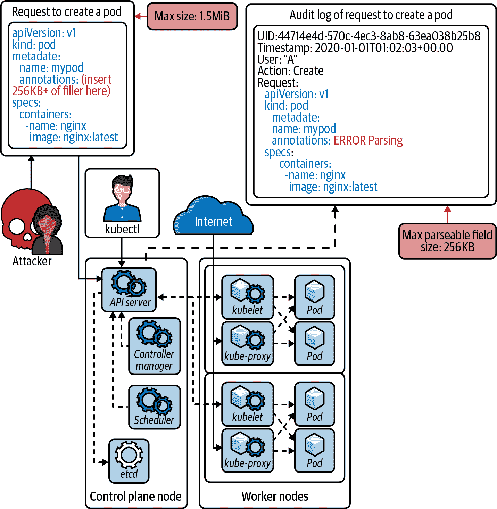

# 第九章：入侵检测

在本章中，我们将看到容器入侵检测如何利用新的低级 eBPF 接口运行，容器的取证是什么样子，以及如何捕捉已逃过所有其他控制的攻击者。

深度防御意味着限制您在部署的每个安全控制上的信任。没有解决方案是绝对可靠的，但您可以使用入侵检测系统（IDS）以类似运动传感器检测运动的方式检测到意外活动。您的对手已经访问过您的系统，甚至可能已经查看了机密信息，因此 IDS 实时审查您的系统以检测意外行为，并观察或阻止它。IDS 的警报可以触发进一步的防御措施，如转储受损内存或记录网络活动。

入侵检测可以检查文件、网络和内核的读写操作，并使用允许列表或拒绝列表（如`seccomp-bpf`配置）验证或阻止它们。如果 Hashjack 船长的硬帽黑客集体能够远程访问您的服务器，IDS 可能会被他们使用已知行为特征的恶意软件、扫描网络或文件以寻找更多目标，或者任何其他偏离 IDS 已学习到的进程预期“稳定”基线的程序访问触发。

有些攻击者的攻击活动仅在对手在系统中数周或数月后最终无意中触发 IDS 检测时才被发现。

# 默认值

稳定行为是我们期望容器进程在正常运行且未受到妥协时执行的操作。我们可以将同样的原则应用于我们收集的任何数据：访问和审计日志、度量和遥测，以及系统调用和网络活动。

要识别与此行为偏离的入侵检测需要安装、维护和监控。默认情况下，大多数系统没有任何入侵检测，除非配置为执行此操作。

# 威胁模型

入侵检测可以检测到对 BCTL 系统的威胁。如果攻击者成功远程执行代码（RCE）进入容器，他们可能能够控制进程，改变其行为。可能不稳定的行为可能表明存在妥协，例如：

+   新的或不允许的系统调用（例如创建类似 Bash 或 sh 的 Shell 的 fork 或 exec 系统调用）

+   任何意外的网络、文件系统、文件元数据或设备访问

+   应用程序的使用和顺序

+   未解释的进程或文件

+   用户或身份设置的更改

+   系统和内核配置事件

与更广泛系统交互时，进程的任何特性和行为也可能会受到审查。

###### 提示

攻击工具如[ccat](https://oreil.ly/pKyt0)和[dockerscan](https://oreil.ly/bchJw)可以在注册表中污染镜像并在容器镜像中安装后门，攻击者可能利用这些镜像在运行时进入您的 Pod。此类意外行为应该被 IDS 注意和报警。

当然，您不希望对合法活动发出警报，因此您授权预期行为。它可以预先配置规则和签名，也可以在非生产环境中观察过程中学习。

这些威胁应该被识别并配置到您的 IDS 系统中以进行警报。本章将介绍如何实现这一点。

# 传统 IDS

在我们深入了解云原生 IDS 之前，让我们回顾一下多年来突出的其他入侵检测应用程序。

传统入侵检测系统分为网络型（NIDS）或主机型（HIDS），一些工具提供两者兼具的功能。在历史上，它们使用主机内核或网络适配器的信号，并不了解容器使用的 Linux 命名空间。

Linux 自带[`auditd`](https://oreil.ly/N5BSs)来监控系统调用事件，但在分布式系统中无法很好地对跨节点的活动进行关联。它也被认为是资源密集型（生成大量日志），并且由于“复杂且不完整”的命名空间进程 ID 跟踪，无法区分命名空间。

像[Suricata](https://suricata.io)、[Snort](https://www.snort.org)和[Zeek](https://zeek.org)这样的工具会使用规则和脚本引擎检查网络流量，并且可能在同一主机上运行，或者（因为它们往往资源密集）连接到观察网络的专用硬件上。加密或隐写术载荷可能会逃避此类 NIDS 的检测。为了进一步防范这些难缠的攻击者，古老但有效的[Tripwire](https://oreil.ly/3ewaE)工具会监控主机上文件的未经授权的更改。

IDS 通过预先知道的信息或检测与预期基线的偏差来检测威胁。事先知道的信息可以被视为“签名”，签名可以涉及网络流量和扫描、恶意软件二进制文件或内存。对数据包中的可疑模式、“指纹”应用代码或内存使用情况以及进程活动进行验证，以与应用程序“已知良好”行为的预期规则集相匹配。

一旦识别出签名模式（例如，SUNBURST 流量返回到命令和控制服务器），IDS 就会创建相关的警报。

###### 注意

FireEye 发布了 IDS 配置以侦测[SUNBURST](https://oreil.ly/kgkNH)。这些配置支持包括 Snort、Yara、IOC 和 ClamAV 在内的各种 IDS 工具。

签名是分布和更新文件，因此您必须定期更新它们以确保检测到新的和最近的威胁。基于签名的方法通常资源消耗较少且误报率较低，但可能无法检测零日攻击和新型攻击。攻击者可以访问防御工具，并确定如何绕过其测试系统中的控制。

如果没有预定义的签名来触发 IDS，可能会检测到异常行为。这依赖于应用程序的“已知良好状态”。

正常应用行为状态的推导定义了“安全”，这使得防御者有责任确保应用程序的正确性，而不是依赖工具来执行通用规则集。

这种观察性方法比签名更强大，因为它可以自主应对新的威胁。这种更通用的保护的代价是更大的资源利用，这可能会影响受保护系统的性能。

签名和异常检测可能会被熟练的对手欺骗、规避，并且有可能被禁用，因此永远不要完全依赖于一个控制。

###### 注意

[VirusTotal](https://oreil.ly/Zpw8C)是一个恶意文件库。当防御者发现攻击时，他们会上传取证中检索到的文件（例如，恶意软件、植入物、C2 二进制文件或加密文件），让研究人员能够在目标之间对技术进行关联，并帮助防御者了解他们的对手、正在使用的攻击以及（幸运的话）如何最好地保护自己。杀毒软件供应商确保他们的产品对 VirusTotal 上的每个恶意文件都有签名，并且新提交的文件会被现有的病毒检测引擎进行匹配扫描。

攻击者使用这些相同的工具确保他们的载荷能够绕过杀毒软件和恶意软件签名扫描器。红队在他们的攻击活动被揭示后有时会被发现将工具和签名泄露到 VirusTotal 上。

# 基于 eBPF 的 IDS

对每个数据包或系统调用运行 IDS 可能会带来开销并减慢系统速度。

我们在“eBPF”中介绍了 eBPF 作为一种安全有效地扩展 Linux 内核的机制。eBPF 通过非常快的速度避免了一些问题：它被设计用于快速处理数据包，并且现在内核开发者使用它来观察内核中的所有运行时行为。因为它作为受信任的代码在内核中运行，所以它比其他 IDS 和追踪技术受限制较少。

然而，在内核中运行会带来一系列可能的风险，eBPF 子系统和 JIT 编译器已经发生过一些突破，但这些被认为比慢速、不完整的内核开发者追踪解决方案或更容易出错的 IDS 更不危险。

###### 注意

[Jeff Dileo 的](https://oreil.ly/BPYwJ)[“Evil eBPF In-Depth Practical Abuses of an In-Kernel Bytecode Runtime”](https://oreil.ly/sllD3)是关于 BPF 及其攻击的良好入门，[“Kernel Pwning with eBPF: A Love Story”](https://oreil.ly/KzOg0)由[Valentina Palmiotti](https://oreil.ly/NjjEf)是对 eBPF 各个组件的详细介绍。

由于 eBPF 的功能已经得到扩展并更深入地集成到内核中，现在许多 CNIs 和安全产品都使用 eBPF 进行检测和网络，包括[Cilium](https://cilium.io)、[Pixie](https://pixielabs.ai)和[Falco](https://falco.org)（我们将在下一节详细介绍）。

###### 警告

与所有容器软件一样，漏洞可能导致容器的突破，例如 [CVE-2021-31440](https://oreil.ly/82xbU)，其中 Linux 内核 eBPF 验证器中的错误边界计算允许可利用的验证器绕过。

让我们继续讨论 eBPF 在 Kubernetes 中的一些应用。

## Kubernetes 和容器入侵检测

在运行时为 Kubernetes 工作负载提供签名和异常检测系统。Kubernetes 和容器 IDS 系统支持命名空间工作负载、主机和网络 IDS。

通过将进程分割为命名空间，您可以使用更多定义明确的元数据来帮助 IDS 做出决策。这种更精细化的数据可以在攻击时提供更大的洞察力，这在决定是否终止运行中的容器时至关重要，因为这可能会影响您的生产工作负载。

这使得容器 IDS 具有优势：它监视的行为仅限于单个容器，而不是整个机器。在单用途容器中，允许行为的定义要小得多，因此 IDS 在阻止不需要的行为时具有更高的策略准确性。考虑到这一点，现在让我们来看看几个特定于容器的 IDS。

## Falco

Falco 是一个开源的、云原生的 IDS，可以在容器中或主机上运行。传统上，Falco 需要一个专用的内核模块来运行（其代码加载到内核中），以便与系统调用交互。自 2019 年以来，Falco 也支持 eBPF。eBPF 接口允许从用户空间加载通用代码到内核内存中的 Falco，这意味着更少的定制代码、更少的内核模块，并且通过一个知名接口使用内核监视和强制技术。

当在容器中运行时，它需要对主机具有特权访问或使用具有主机 PID 命名空间访问权限的 `CAP_BPF` 能力。

在 eBPF 模式下，当进程使用诸如 `open()` 这样的系统调用与文件交互时，将触发 eBPF 程序，该程序可以在内核虚拟机中运行任意代码以做出决策。根据输入，将接受或阻止动作：

```
user@host:~ [0]$ docker run --rm -i -t \
  -e HOST_ROOT=/ \
  --cap-add BPF \
  --cap-add SYS_PTRACE \
  --pid=host \
  $(ls /dev/falco* | xargs -I {} echo --device {}) \
  -v /var/run/docker.sock:/var/run/docker.sock \
  falcosecurity/falco-no-driver:latest
```

```
DEMO    13:07:48.722501295: Notice A shell was spawned in a container with an attached terminal
  (user=root user_loginuid=-1 <NA> (id=52af6056d922) shell=sh parent=<NA>
  cmdline=sh -c unset $(env | grep -Eo '.*VERSION[^\=]*') && exec bash terminal=34816
  container_id=52af6056d922 image=<NA>)

```

###### 注意

Falco 基于 Sysdig，这是一个系统内省工具。Sysdig Cloud 提供工作负载和 Kubernetes 性能监控，而 [Sysdig Secure](https://oreil.ly/S6q1e) 是围绕 Falco 构建的商业产品。

Falco 配备了一系列由社区贡献和维护的规则，包括专门用于管理 Kubernetes 集群的规则：[community contributed and maintained rules](https://oreil.ly/T43NW)。

+   意外的入站 TCP 连接：

    +   检测从预期集合之外的端口向 Kubernetes 组件的入站 TCP 流量

    +   允许的入站端口：

        +   `6443`（`kube-apiserver` 容器）

        +   `10252`（`kube-controller` 容器）

        +   `8443`（`kube-dashboard` 容器）

        +   `10053`、`10055`、`8081`（`kube-dns` 容器）

        +   `10251`（`kube-scheduler` 容器）

+   意外生成的进程：

    +   检测在 Kubernetes 集群中启动的进程超出预期集合

    +   允许的进程：

        +   `kube-apiserver`（对 `kube-apiserver` 容器）

        +   `kube-controller-manager`（用于 `kube-controller` 容器）

        +   `/dashboard` (`kube-dashboard` 容器)

        +   `/kube-dns` (`kube-dns` 容器)

        +   `kube-scheduler` (`kube-scheduler` 容器)

+   意外文件访问只读：

    +   检测尝试以只读模式访问文件，而不是预期目录列表中的文件

    +   只读文件前缀允许：

        +   `/public`

这些规则形成了一个有用的基础集，可以根据您自己集群特定的安全需求扩展自定义规则。

###### 警告

虽然消费社区贡献的规则几乎总是更好的选择，但没有软件是没有 bug 的。例如，Darkbit 发现了一个[Falco 规则绕过](https://oreil.ly/wgZy7)，利用宽松的正则表达式规则部署了一个自定义特权代理容器—`docker.io/my-org-name-that-ends-with-sysdig/agent`：

```
- macro: falco_privileged_containers
  condition: (openshift_image or
              user_trusted_containers or
              container.image.repository in (trusted_images) or
              container.image.repository in (falco_privileged_images) or
              container.image.repository startswith istio/proxy_ or
              container.image.repository startswith quay.io/sysdig)

```

# IDS 的机器学习方法

机器学习（ML）通过模型重播其他 IDS 系统中使用的相同信号，然后预测容器是否受到 compromise。

有许多可用的机器学习 IDS 示例：

+   [Aqua Security](https://oreil.ly/gfl98)使用基于 ML 的行为分析来分析和响应容器、网络和主机中的行为。

+   [Prisma Cloud](https://oreil.ly/AoLCX)的第三层容器间防火墙通过 ML 学习应用组件之间的有效流量。

+   [Lacework](https://oreil.ly/6pooI)使用无监督机器学习进行跨云可观察性和对运行时威胁的响应。

+   [Accuknox](https://accuknox.com)使用无监督机器学习来检测不稳定性并识别潜在攻击，并为零信任网络、应用程序和数据保护提供“身份作为边界”。

# 容器取证

取证是从不完整或历史来源中重建数据的艺术。在 Linux 中，这涉及捕获进程、内存和文件系统内容以离线审问它们，找到入侵的源头或影响，并检查对抗性技术。

更先进的系统收集更多信息，比如它们已经记录的网络连接信息。在发生严重破坏的情况下，整个集群或帐户可能会被切断与网络的连接，以防止攻击者继续攻击，并且整个系统可以被镜像化和探索。

像[kube-forensics](https://oreil.ly/s4xup)这样的工具“创建运行中 pod 状态的检查点快照，以便进行离线分析”，因此恶意工作负载可以被转储和终止，系统可以恢复使用。它运行一个带有 `PodCheckpoint` 自定义资源定义（CRD）的 `forensics-controller-manager`，以有效地执行 `docker inspect`，`docker diff`，最终 `docker export`。值得注意的是，这不会捕获进程的内存，可能存在未保存到磁盘或在进程启动后被删除的植入物或攻击者工具。

要捕获一个进程的内存，你可以使用像 GDB 这样的标准工具。在容器内使用这些工具是困难的，因为可能需要符号。从容器外部，转储内存并搜索其中的有趣数据是微不足道的，就像这个[简单的 Bash 脚本](https://oreil.ly/6eDzc)结合了[Trufflehog](https://oreil.ly/U2ibi)和 GDB 进程转储所演示的那样：

```
#!/bin/bash
#
# truffleproc — hunt secrets in process memory // 2021 @controlplaneio

set -Eeuo pipefail

PID="${1:-1}"
TMP_DIR="$(mktemp -d)"
STRINGS_FILE="${TMP_DIR}/strings.txt"
RESULTS_FILE="${TMP_DIR}/results.txt"

CONTAINER_IMAGE="controlplane/build-step-git-secrets"
CONTAINER_SHA="51cfc58382387b164240501a482e30391f46fa0bed317199b08610a456078fe7"
CONTAINER="${CONTAINER_IMAGE}@sha256:${CONTAINER_SHA}"

main() {
  ensure_sudo

  echo "# coredumping pid ${PID}"

  coredump_pid

  echo "# extracting strings to ${TMP_DIR}"

  extract_strings_from_coredump

  echo "# finding secrets"

  find_secrets_in_strings || true

 echo "# results in ${RESULTS_FILE}"

  less -N -R "${RESULTS_FILE}"
}

ensure_sudo() {
  sudo touch /dev/null
}

coredump_pid() {
  cd "${TMP_DIR}"

  sudo grep -Fv ".so" "/proc/${PID}/maps" | awk '/ 0 /{print $1}' | (
    IFS="-"
    while read -r START END; do
      START_ADDR=$(printf "%llu" "0x${START}")
      END_ADDR=$(printf "%llu" "0x${END}")
      sudo gdb \
        --quiet \
        --readnow \
        --pid "${PID}" \
        -ex "dump memory ${PID}_mem_${START}.bin ${START_ADDR} ${END_ADDR}" \
        -ex "set confirm off" \
        -ex "set exec-file-mismatch off" \
        -ex quit od |& grep -E "^Reading symbols from"
    done | awk-unique
  )
}

extract_strings_from_coredump() {
  strings "${TMP_DIR}"/*.bin >"${STRINGS_FILE}"
}

find_secrets_in_strings() {
  local DATE MESSAGE
  DATE="($(date --utc +%FT%T.%3NZ))"
  MESSAGE="for pid ${PID}"

  cd "${TMP_DIR}"
  git init --quiet
  git add "${STRINGS_FILE}"
  git -c commit.gpgsign=false commit \
    -m "Coredump of strings ${MESSAGE}" \
    -m "https://github.com/controlplaneio/truffleproc" \
    --quiet

  echo "# ${0} results ${MESSAGE} ${DATE} | @controlplaneio" >>"${RESULTS_FILE}"

  docker run -i -e IS_IN_AUTOMATION= \
    -v "$(git rev-parse --show-toplevel):/workdir:ro" \
    -w /workdir \
    "${CONTAINER}" \
    bash |& command grep -P '\e\[' | awk-unique >> "${RESULTS_FILE}"
}

awk-unique() {
  awk '!x[$0]++'
}

main "${@:-}"
```

将这个脚本放入*procdump.sh*中，并针对本地 shell 运行它：

```
$ procdump.sh $(pgrep -f bash)
```

你会看到加载到 shell 中的任何高熵字符串或可疑的秘密信息：

```
 1 # procdump.sh results for pid 5598 (2021-02-23 08:58:54.972Z) | @controlplaneio
 2 Reason: High Entropy
 3 Date: 2021-02-23 08:58:54
 4 Hash: 699776ae32d13685afca891b0e9ae2f1156d2473
 5 Filepath: strings.txt
 6 Branch: origin/master
 7 Commit: WIP
 8
 9 +SECRET_KEY=c0dd1e1eaf1e757e55e118fea7caba55e7105e51eaf1e55c0caa1d05efa57e57
10 +GH_API_TOKEN=1abb1ebab1e5e1ec7ed5c07f1abe118b0071e551005edf1a710c8c10aca5ca1d
```

###### 警告

作为进程命名空间中的 root 的攻击者可以转储命名空间中任何其他进程的内存。主机进程命名空间中的 root 用户可以在节点上转储任何进程的内存（包括子命名空间）。

通过在使用时从文件系统或密钥管理系统中检索秘密信息来避免云原生应用程序中的这种攻击类型。如果可以在不使用时丢弃内存中的秘密信息，那么您将更加抵御这种攻击。您还可以在内存中加密秘密信息，尽管解密密钥也面临被转储的风险，因此在不使用时也应该丢弃。

# 蜜罐


虽然入侵检测系统（IDS）可以检测和防止几乎所有对系统的滥用，但我们无法强调没有什么是绝对有效的。应该假设像 Hashjack 船长这样的流氓海盗仍然能够绕过任何谨慎的安全配置。对于攻击者来说，复杂的系统提供了不对称的优势：防御者只需犯一个错误就会受到威胁。

攻击者仍然可能从容器中逃逸或遍历到主机上。或者，如果他们在受 IDS 监管的容器中操纵应用程序的预期行为（例如，通过以不同的标志调用相同的应用程序），他们可能能够读取敏感数据而不触发 IDS 警报。

因此，最后的防线是简单的蜜罐，一个正常的应用程序从不使用的简单服务器或文件。它安静地躺在一个诱人或安全的位置，并在攻击者访问时触发警报。蜜罐可能会被网络扫描触发，或者系统通常不会发出的 HTTP 请求触发。

图 9-1 展示了 BCTL 的蜜罐陷阱困住了可怕的海盗 Hashjack。这样的蜜罐就像使用类似[ElastAlert](https://oreil.ly/L1bSu)这样的工具来监视、审计和访问永远不应该被访问的 pod 的日志一样简单。


###### 图 9-1\. 在蜜罐中捕捉攻击者

你要捕捉在 pod 网络内操作的攻击者。他们可能扫描本地 IP 范围以查找开放的 TCP 和 UDP 端口。请记住，每个 Kubernetes 工作负载必须是相同的，所以我们不能运行“自定义”pod 来部署单个蜜罐。相反，部署一个专用的 DaemonSet，这样每个节点都会被一个蜜罐 pod 保护。

如果攻击者或内部操作者具有集群 DNS 访问权限，可以读取 Pod 的环境变量，或者具有对 Kubernetes API 的读取权限，则可以看到 DNS 中的 Kubernetes 服务名称和 Pod 名称。他们可能正在寻找一个特定命名的目标。您可以将您的蜜罐服务命名为一个具有吸引力的类似名称（例如“myapp-data”或“myapp-support”）以诱使攻击者。部署蜜罐作为一个 DaemonSet 将确保在任何节点上都有一个等待着，Captain Hashjack 可能会劫掠。

###### 注意

[Canary tokens](https://oreil.ly/1E7Eo)是用于 AWS 和 Slack 等协议的蜜罐，用于探测钥匙、URL、DNS 记录、QR 码、电子邮件地址、文档和二进制文件。它们是可以放置在生产系统和开发者设备中的“微型绊线”，以便检测被攻击。

# 审计

如在第八章讨论的，Kubernetes 为其接收到的每个 API 请求生成审计日志，并且 IDS 工具可以摄取和监视该信息流以检测意外请求。这可能包括来自已知 IP 范围之外或预期工作时间之外的请求，蜜罐令牌凭证，或试图使用未授权 API（例如，默认服务账户令牌试图获取其命名空间中的所有 Secret 或特权命名空间）。

审计日志级别和深度是可配置的，但正如 CVE-2020-8563 针对 Kubernetes v1.19.2（以及 CVE-2020-8564、CVE-2020-8565、CVE-2020-8566）显示的那样，默认情况并不历史上紧密。一些敏感请求负载信息被持久化到日志中，可以从集群外部读取，然后用于攻击。

意外数据泄漏到日志中正在通过[KEP 1753](https://oreil.ly/5iuMK)得到缓解：

> 本 KEP 提议引入一个日志过滤器，可以应用于所有 Kubernetes 系统组件的日志，以防止各种类型的敏感信息通过日志泄露……确保敏感数据不能轻易存储在日志中。通过改进的代码审查政策阻止危险的日志记录操作。使用日志过滤器对敏感信息进行遮蔽。这些措施共同有助于防止敏感数据在日志中暴露。

它可以在`kubelet`标志`--experimental-logging-sanitization`中在 v1.20+版本中使用。

将 Secrets 泄漏到日志和审计流中在所有技术组织中都很常见，这也是避免使用环境变量存储敏感信息的另一个原因。开发人员需要运行程序时的内省和有用输出，但在开发过程中进行调试时清理日志的做法却很少见。这些调试字符串最终不可避免地进入生产环境，因此搜索日志以检测 Secrets 也许是唯一实用的方法。

###### 注意

引起日志清理关注的漏洞包括：

CVE-2020-8563

vSphere Provider kube-controller-manager 中的日志中泄漏的 Secrets

CVE-2020-8564

当文件格式不正确且`logLevel` >= 4 时，Docker 配置 Secrets 泄漏

CVE-2020-8565

CVE-2019-11250 的不完全修复允许在 `logLevel` >= 9 时日志中泄露令牌

CVE-2020-8566

当 `logLevel` >= 4 时，Ceph RBD adminSecrets 在日志中暴露

你可以在[Kubernetes 论坛](https://oreil.ly/yBvQu)上阅读披露内容。

# 检测逃逸

[Brad Geesaman](https://oreil.ly/KaOWm) 和 [Ian Coldwater](https://oreil.ly/KMK0u) 在 [RSA 2020](https://oreil.ly/LfzS0) 展示了绕过 Kubernetes 审计日志的方法。正如图 9-2 所示，Kubernetes 控制平面中的 `etcd` 数据存储非常高效和可靠，但不支持大数据大小。这意味着超过 256 KB 的请求负载在审计日志中将不会被存储，从而使超大日志条目可以实现隐蔽行为。

###### 注意

能够访问 API 服务器的攻击者可以黑洞、重定向或篡改存储在本地的任何审计日志。作为事后检查的一部分，探索攻击者的路径非常有用，因此直接将 API 服务器的审计日志发送到远程 Webhook 后端可以防范此类攻击。配置 API 服务器使用标志 `--audit-webhook-config-file` 将日志远程发送，或者使用一个为您配置好此项的托管服务。



###### 图 9-2\. 超大 `etcd` 日志 ([RSA 2020](https://oreil.ly/LfzS0))

# 安全运营中心

较大的组织可能拥有负责管理安全信息和事件（SIEM）的安全运营中心（SOC）。

配置企业应用程序以便在您的审计和 pod 日志上设置警报需要进行精细调整，以避免误报和不必要的警报。您可以使用本地集群构建自动化测试，并捕获审计日志事件，然后使用该数据配置您的 SIEM。最后，重新运行您的自动化测试以确保在生产系统中正确引发警报。

您应该对生产系统运行红队安全测试，以验证蓝队控制是否按预期工作。这为系统配置的攻击树和威胁模型提供了真实的测试。

# 结论

入侵检测是云原生系统的最后防线。eBPF 方法在现代内核上速度更快，性能开销很小。敏感或面向 Web 的工作负载应始终由 IDS 保护，因为它们有最大的被妥协风险。

现在我们将转向最薄弱环节及其自然栖息地：组织。
