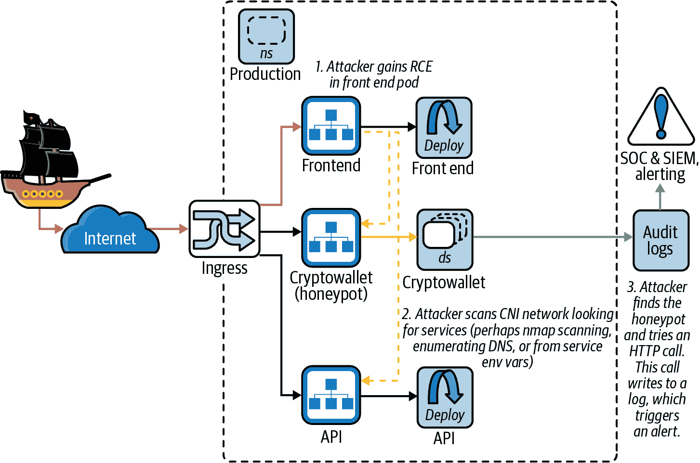

# 第九章：入侵检测

在本章中，我们将看到容器入侵检测如何使用新的低级 eBPF 接口运行，容器的取证是什么样子，以及如何捕捉已逃避所有其他控制的攻击者。

防御深度意味着限制您对每个部署的安全控制的信任。没有解决方案是绝对可靠的，但您可以使用入侵检测系统（IDS）类似于运动传感器检测运动的方式来检测系统中的意外活动。您的对手已经访问了您的系统，甚至可能已经查看了机密信息，因此 IDS 会实时审查您的系统以检测并观察或阻止意外行为。警报可以触发 IDS 的进一步防御措施，例如转储受损内存或记录网络活动。

入侵检测可以检查文件、网络和内核的读写操作，以验证或阻止它们使用允许列表或拒绝列表（如`seccomp-bpf`配置所做的）。如果 Hashjack 船长的硬帽黑客集体可以远程访问您的服务器，入侵检测系统可能会因其使用带有已知行为特征签名的恶意软件、扫描网络或文件以寻找更多目标，或任何其他与 IDS 学习的预期“稳定”基线偏离的程序访问而触发。

一些攻击者的攻击活动仅在对手在系统上存在几周或几个月后才被发现，最终无意中触发 IDS 检测。

# 默认设置

稳定的行为是我们期望容器进程在正常运行时执行的，而不是被妥协的状态。我们可以对收集的任何数据应用相同的原则：访问和审计日志、指标和遥测，以及系统调用和网络活动。

入侵检测以识别与此行为偏离相关的威胁需要安装、维护和监控。默认情况下，大多数系统没有任何入侵检测，除非进行了配置。

# 威胁模型

入侵检测可以检测到对 BCTL 系统的威胁。如果攻击者通过远程代码执行（RCE）进入容器，他们可能能够控制该进程，从而改变其行为。可能表明存在威胁的非稳定行为可能包括：

+   新的或不允许的系统调用（也许是 fork 或 exec 系统调用以创建像 Bash 或 sh 这样的 shell）

+   任何意外的网络、文件系统、文件元数据或设备访问

+   应用程序的使用和顺序

+   未经说明的进程或文件

+   用户或身份设置的更改

+   系统和内核配置事件

当与更广泛的系统交互时，进程的属性和行为也可能受到审查。

###### 小贴士

攻击工具如[ccat](https://oreil.ly/pKyt0)和[dockerscan](https://oreil.ly/bchJw)可以在镜像注册表中毒害镜像，并在容器镜像中安装后门，攻击者可能会在运行时使用它们来进入您的 Pods。这种意外行为应该由您的 IDS 察觉并发出警报。

当然，您不希望因为合法活动而受到警报，因此您可以授权预期的行为。这可以通过预配置的规则和签名或在非生产环境中观察过程中学习来实现。

这些威胁应被识别并配置以警报您的 IDS 系统。本章将介绍如何操作。

# 传统 IDS

在我们深入讨论原生云 IDS 之前，让我们先看看多年来突出的几款其他入侵检测应用程序。

传统入侵检测系统分为基于网络或主机的 IDS（NIDS 或 HIDS），一些工具同时提供两者。这些工具历来使用主机内核或网络适配器的信号，但未意识到容器使用的 Linux 命名空间。

Linux 内置了[`auditd`](https://oreil.ly/N5BSs)来跟踪系统调用事件，但在分布式系统中，这不能很好地关联活动。它也被认为是笨重的（生成大量日志），且由于“复杂且不完整”的命名空间进程 ID 跟踪，无法区分命名空间。

像[Suricata](https://suricata.io)、[Snort](https://www.snort.org)和[Zeek](https://zeek.org)这样的工具，通过规则和脚本引擎检查网络流量，并可在同一主机上运行，或者（由于资源密集型）连接到被观察网络的专用硬件上。加密或隐写载荷可能会逃脱此类 NIDS 的检测。为了进一步防范这些隐秘的攻击者，老牌而有效的[Tripwire](https://oreil.ly/3ewaE)工具监视主机上文件的未授权更改。

IDS 通过使用有关已知信息或检测与预期基线的偏差来检测威胁。事先已知的信息可以被视为“签名”，这些签名可以与网络流量和扫描、恶意软件二进制文件或内存相关联。数据包中的任何可疑模式、“指纹”应用代码或内存使用以及进程活动，都会与从应用的“已知良好”行为中导出的预期规则集进行验证。

一旦确定了签名模式（例如，SUNBURST 流量返回到命令和控制服务器），IDS 就会创建相关的警报。

###### 注意

FireEye 发布了 IDS 配置[来检测 SUNBURST](https://oreil.ly/kgkNH)。这些配置支持包括 Snort、Yara、IOC 和 ClamAV 在内的各种 IDS 工具。

签名是分发和更新的文件，因此您必须定期更新它们，以确保检测到新的和最近的威胁。基于签名的方法通常资源消耗较少且假阳性的可能性较小，但可能无法检测到零日和新型攻击。攻击者可以访问防御工具，并确定如何绕过其自己的测试系统中的控制。

如果没有预定义的签名来触发 IDS，则可能会检测到异常行为。这依赖于应用程序的“已知良好状态”。

正常应用行为状态的派生定义了“安全”，这使得防御者有责任确保应用程序的正确性，而不是工具来强制执行通用规则集。

这种观察方法比签名更强大，因为它可以自主地对抗新的威胁。这种更广泛的保护的代价是更大的资源利用，可能会影响被保护系统的性能。

签名和异常检测可能会被熟练的对手欺骗、规避，并可能被禁用，因此永远不要完全依赖于单一控制。

###### 注意

[VirusTotal](https://oreil.ly/Zpw8C)是一个恶意文件库。当防御者发现攻击时，他们会上传法证检索到的文件（例如恶意软件、植入物、C2 二进制文件或加密文件），允许研究人员跨目标关联技术，并帮助防御者了解他们的对手、正在使用的攻击方法，以及（幸运的话）如何最好地保护自己。防病毒软件供应商确保其产品对 VirusTotal 上的每个恶意文件都有签名，并通过现有病毒检测引擎扫描新提交的文件。

攻击者使用这些同样的工具来确保他们的载荷能够绕过防病毒和恶意软件签名扫描器。红队在攻击活动揭晓后，有时会被发现将工具和签名泄漏到 VirusTotal 上。

# 基于 eBPF 的 IDS

对每个数据包或系统调用运行 IDS 可能会增加开销并减慢系统运行速度。

我们在《eBPF》中介绍了 eBPF 作为一种安全高效地扩展 Linux 内核的机制。eBPF 通过极其快速的特性避免了一些问题：它被设计用于快速数据包处理，现在内核开发者使用它来观察内核中所有内容的运行时行为。因为它作为内核中的受信任代码运行，比其他 IDS 和追踪技术受到的限制更少。

然而，在内核中运行也带来了一系列潜在的风险，并且 eBPF 子系统和 JIT 编译器也有过一些突破，但这些被认为比慢、不完整的内核开发者追踪解决方案或更容易出错的 IDS 风险小。

###### 注意

[Jeff Dileo](https://oreil.ly/BPYwJ)的[《Evil eBPF 深度实用滥用：内核字节码运行时的实际应用》](https://oreil.ly/sllD3)是关于 BPF 及其攻击的良好入门，并由[Valentina Palmiotti](https://oreil.ly/NjjEf)撰写的[《用 eBPF 入侵内核：一段爱的故事》](https://oreil.ly/KzOg0)详细介绍了 eBPF 的各个组成部分。

由于 eBPF 的功能已被扩展并深度集成到内核中，现在许多 CNIs 和安全产品都使用 eBPF 进行检测和网络操作，包括[Cilium](https://cilium.io)，[Pixie](https://pixielabs.ai)和[Falco](https://falco.org)（我们在下一节中详细介绍）。

###### 警告

与所有容器软件一样，漏洞可能导致容器突破，就像[CVE-2021-31440](https://oreil.ly/82xbU)中 Linux 内核 eBPF 验证程序中的错误边界计算允许可利用的验证器绕过一样。

让我们继续探讨 eBPF 在 Kubernetes 中的一些应用。

## Kubernetes 和容器入侵检测

Kubernetes 工作负载在运行时有可用的签名和异常检测系统。Kubernetes 和容器 IDS 系统支持命名空间工作负载、主机和网络 IDS。

通过将进程分割成命名空间，您可以使用更明确定义的元数据来帮助 IDS 做出决策。这种更细粒度的数据可以在攻击发生时提供更大的洞察力，这在决定是否终止正在运行的容器时可能会影响到您的生产工作负载时至关重要。

这为容器 IDS 提供了一个优势：它所监视的行为仅限于单个容器，而不是整个机器。在单用途容器中，允许行为的定义要小得多，因此 IDS 在阻止不需要的行为时具有更高的策略精度。有了这个理念，现在让我们来看看几个特定于容器的 IDS。

## Falco

Falco 是一个开源的、云原生的 IDS，可以运行在容器中或主机上。传统上，Falco 需要一个专用的内核模块来运行（将其代码加载到内核中），以便与系统调用进行交互。自 2019 年以来，Falco 还支持 eBPF。eBPF 接口允许通用代码从用户空间加载到内核内存中，这意味着更少的自定义代码、更少的内核模块，并且通过一个众所周知的接口使用内核监视和执行技术。

在容器中运行时，需要对主机进行特权访问或者使用具有主机 PID 命名空间访问权限的 `CAP_BPF` 功能。

在 eBPF 模式下，当进程使用诸如 `open()` 等系统调用与文件交互时，将触发 eBPF 程序，该程序可以在内核 VM 中运行任意代码来做出决策。根据输入，操作将被接受或阻止：

[PRE0]

[PRE1]

###### 注意

Falco 基于 Sysdig，一个系统内省工具。Sysdig Cloud 提供工作负载和 Kubernetes 性能监控，而[Sysdig Secure](https://oreil.ly/S6q1e)是围绕 Falco 构建的商业产品。

Falco 附带了一系列[社区贡献和维护的规则](https://oreil.ly/T43NW)，包括专门用于管理 Kubernetes 集群的规则：

+   意外的入站 TCP 连接：

    +   检测到从预期集外的端口到 Kubernetes 组件的入站 TCP 流量

    +   允许的入站端口：

        +   `6443`（`kube-apiserver` 容器）

        +   `10252`（`kube-controller` 容器）

        +   `8443`（`kube-dashboard` 容器）

        +   `10053`, `10055`, `8081`（`kube-dns` 容器）

        +   `10251`（`kube-scheduler` 容器）

+   意外生成的进程：

    +   检测到在 Kubernetes 集群中启动的超出预期集的进程

    +   允许的进程：

        +   `kube-apiserver`（用于 `kube-apiserver` 容器）

        +   `kube-controller-manager`（对`kube-controller`容器）

        +   `/dashboard`（`kube-dashboard`容器）

        +   `/kube-dns`（`kube-dns`容器）

        +   `kube-scheduler`（`kube-scheduler`容器）

+   意外的只读文件访问：

    +   检测试图以只读模式访问文件的尝试，除了预期目录列表中的文件以外。

    +   只读模式的允许文件前缀:

        +   `/public`

这些规则形成了一个有用的基础集，可以根据您自己集群的特定安全需求进行扩展。

###### 警告

尽管使用社区贡献的规则通常更好，但没有软件是没有漏洞的。例如，Darkbit 发现了一个[Falco 规则绕过](https://oreil.ly/wgZy7)，利用宽松的正则表达式规则部署了一个自定义特权代理容器——`docker.io/my-org-name-that-ends-with-sysdig/agent`：

[PRE2]

# IDS 的机器学习方法

机器学习（ML）通过模型重播其他 IDS 系统中使用的相同信号，然后预测容器是否受到威胁。

有许多可用的机器学习 IDS 示例：

+   [Aqua Security](https://oreil.ly/gfl98)使用基于机器学习的行为分析来分析和响应容器、网络和主机的行为。

+   [Prisma Cloud](https://oreil.ly/AoLCX)的第 3 层容器间防火墙使用 ML 学习应用组件之间的有效流量流动。

+   [Lacework](https://oreil.ly/6pooI)利用无监督的机器学习进行跨云可观察性，并对运行时威胁作出响应。

+   [Accuknox](https://accuknox.com)使用无监督的机器学习来检测不稳定性并辨别潜在攻击，以及“身份作为边界”来实现零信任网络、应用程序和数据保护。

# 容器取证

取证是从不完整或历史来源重建数据的艺术。在 Linux 中，这涉及捕获进程、内存和文件系统内容以离线审讯它们，找到入侵的来源或影响，并检查对抗性技术。

更高级的系统收集更多信息，例如它们已经记录的网络连接信息。在严重突破事件中，整个集群或账户可能会被断开网络连接，以防止攻击者继续攻击，可以对整个系统进行镜像和探索。

类似[kube-forensics](https://oreil.ly/s4xup)的工具“创建运行中 pod 状态的检查点快照，以供以后进行离线分析”，因此可以卸载和终止恶意工作负载，并使系统恢复使用。它运行一个`forensics-controller-manager`，带有一个`PodCheckpoint`自定义资源定义（CRD），有效地进行`docker inspect`、`docker diff`和最终`docker export`。值得注意的是，这不会捕获进程的内存，可能存在未保存到磁盘或在进程启动后被删除的植入物或攻击者工具。

要捕获进程的内存，可以使用像 GDB 这样的标准工具。从容器内使用这些工具很困难，因为可能需要符号。从容器外部，转储内存并搜索其中的有趣数据是微不足道的，就像这个[simple Bash script](https://oreil.ly/6eDzc)结合[Trufflehog](https://oreil.ly/U2ibi)和 GDB 进程转储所示：

[PRE3]

将此脚本放入*procdump.sh*并在本地 shell 中运行：

[PRE4]

您将看到加载到 shell 中的任何高熵字符串或可疑秘密：

[PRE5]

###### 警告

在进程命名空间中作为 root 的攻击者可以转储命名空间中任何其他进程的内存。主机进程命名空间中的 root 用户可以转储节点上任何进程的内存（包括子命名空间）。

通过从文件系统或密钥管理系统在使用时检索秘密，可以避免云原生应用程序中的此类攻击。如果在不使用时从内存中丢弃秘密，您将更加抗攻击。您还可以在内存中加密秘密，尽管解密密钥面临相同的被转储风险，因此在不使用时也应将其丢弃。

# 诱饵（Honeypots）

尽管 IDS 可以检测和阻止系统几乎所有的滥用，我们不能再次强调没有银弹这样的事实。应该假定像 Hashjack 船长这样的流氓海盗仍然能够绕过任何小心的安全配置。复杂的系统为攻击者提供了不对称的优势：防御者只需犯一个错误就可能被攻击。

攻击者可能仍然能够逃离容器或者遍历到主机。或者，如果他们在由入侵检测系统（IDS）监管的容器中，操纵应用程序的预期行为（例如，通过以不同的标志调用同一应用程序），他们可能能够读取敏感数据而不触发 IDS 警报。

因此，最后的防线是简单的诱饵（honeypot），一个普通的服务器或者文件，合法应用程序从不使用。它安静地安置在诱人或安全的位置，并在攻击者访问时触发警报。诱饵可能会被网络扫描触发，或者系统通常不会发出的 HTTP 请求触发。

图 9-1 展示了 BCTL 的诱饵（honeypot）诱捕 Dread Pirate Hashjack。像这样的诱饵（honeypot）使用工具如[ElastAlert](https://oreil.ly/L1bSu)来监控、审计和访问不应被访问的 pod 的日志，非常简单。

###### 图 9-1\. 在诱饵中捕获攻击者

您希望捕捉在 pod 网络内操作的攻击者。他们可能会扫描本地 IP 范围以开放 TCP 和 UDP 端口。请记住，每个 Kubernetes 工作负载必须是相同的，因此我们无法运行“自定义”pod 来部署单个诱饵。而是部署一个专用的 DaemonSet，以便每个节点都由一个诱饵 pod 保护。

如果攻击者或内部人员可以访问集群 DNS，可以读取 pod 的环境变量，或者可以读取 Kubernetes API 的访问权限，他们可以看到 DNS 和 pod 名称中 Kubernetes 服务的名称。他们可能在寻找特定命名的目标。您可以使用一个具有吸引力的类似名称的诱饵服务（例如“myapp-data”或“myapp-support”）来诱使攻击者。将诱饵部署为 DaemonSet 将确保它在 Captain Hashjack 可能掠夺的任何节点上等待。

###### 注意

[Canary tokens](https://oreil.ly/1E7Eo) 是用于 AWS 和 Slack 密钥、URL、DNS 记录、QR 码、电子邮件地址、文档和二进制文件的诱饵。它们是您可以在生产系统和开发人员设备中投放的“小陷阱”，以检测是否遭到了入侵。

# 审计

正如在第八章中讨论的，Kubernetes 为其接收的每个 API 请求生成审计日志，并且 IDS 工具可以摄取和监控该信息流以获取意外的请求。这可能包括来自未知 IP 范围外或预期工作时间外的请求，诱饵令牌凭证，或者尝试使用未授权的 API（例如，默认服务账户令牌尝试在其命名空间中获取所有 Secrets 或特权命名空间）。

审计日志级别和深度是可配置的，但正如 Kubernetes v1.19.2 的 CVE-2020-8563（以及 CVE-2020-8564、CVE-2020-8565、CVE-2020-8566 所显示的），默认设置历来不够严格。某些敏感请求载荷信息被持久化到日志中，这些信息可能可以从集群外部读取，然后用于攻击集群。

在[KEP 1753](https://oreil.ly/5iuMK)中正在减轻日志中的意外数据泄露：

> 该 KEP 提议引入一个日志过滤器，该过滤器可以应用于所有 Kubernetes 系统组件的日志，以防止各种类型的敏感信息通过日志泄露…… 确保敏感数据不能轻易存储在日志中。通过改进的代码审查政策防止危险的日志记录行为。使用日志过滤器对敏感信息进行遮蔽。这些措施共同有助于防止敏感数据在日志中曝光。

可以在 v1.20+ 的 `kubelet` 标志 `--experimental-logging-sanitization` 中使用。

将机密信息泄露到日志和审计流中在所有技术组织中都很常见，这也是避免使用环境变量存储敏感信息的另一个原因。开发人员需要运行程序时的内省和有用的输出，但在开发过程中清理调试信息的做法很少见。这些调试字符串最终会进入生产环境，因此搜索日志以检测机密信息可能是唯一实用的方法。

###### 注意

推动日志清理关注的漏洞包括：

CVE-2020-8563

vSphere Provider kube-controller-manager 的日志中的机密信息泄露

CVE-2020-8564

当文件格式错误且 `logLevel` >= 4 时泄露的 Docker 配置 Secrets

CVE-2020-8565

对 CVE-2019-11250 的不完整修复允许在 `logLevel` >= 9 时泄漏令牌到日志中

CVE-2020-8566

当 `logLevel` >= 4 时，Ceph RBD 管理密码在日志中暴露

您可以在 [Kubernetes 论坛](https://oreil.ly/yBvQu) 上阅读披露内容。

# 检测逃避

[Brad Geesaman](https://oreil.ly/KaOWm) 和 [Ian Coldwater](https://oreil.ly/KMK0u) 在 [RSA 2020](https://oreil.ly/LfzS0) 上演示了绕过 Kubernetes 审计日志的方法。正如 图 9-2 所示，Kubernetes 控制平面中的 `etcd` 数据存储非常高效和可靠，但不支持大数据量。这意味着超过 256 KB 的请求负载不会被存储在审计日志中，从而使超大日志条目的隐秘行为成为可能。

###### 注意

能够访问 API 服务器的攻击者可以黑洞化、重定向或篡改任何本地存储的审计日志。作为事后检查的一部分，探索攻击者的路径非常有用，因此直接将 API 服务器的审计日志发送到远程 Webhook 后端可以防范这种情况。配置 API 服务器使用标志 `--audit-webhook-config-file` 远程发送日志，或使用为您配置此项服务的托管服务。

###### 图 9-2\. 超大 `etcd` 日志 ([RSA 2020](https://oreil.ly/LfzS0))

# 安全运营中心

较大的组织可能会设有安全运营中心（SOC），负责管理安全信息和事件（SIEM）。

配置企业应用程序以在审计和 Pod 日志上发出警报需要进行微调，以避免误报和不必要的警报。您可以使用本地集群构建自动化测试并捕获审计日志事件，然后使用该数据配置您的 SIEM。最后，在生产系统中重新运行您的自动化测试以确保正确引发警报。

您应该对生产系统运行红队安全测试，以验证蓝队控制是否按预期工作。这为系统配置的攻击树和威胁模型提供了真实世界的测试。

# 结论

入侵检测是云原生系统的最后防线。在现代内核上，eBPF 方法提供更高的速度，性能开销很小。敏感或面向 Web 的工作负载应始终由 IDS 保护，因为它们面临最大的妥协风险。

通过这一举措，我们将转向注意力最薄弱的环节及其自然栖息地：组织。
