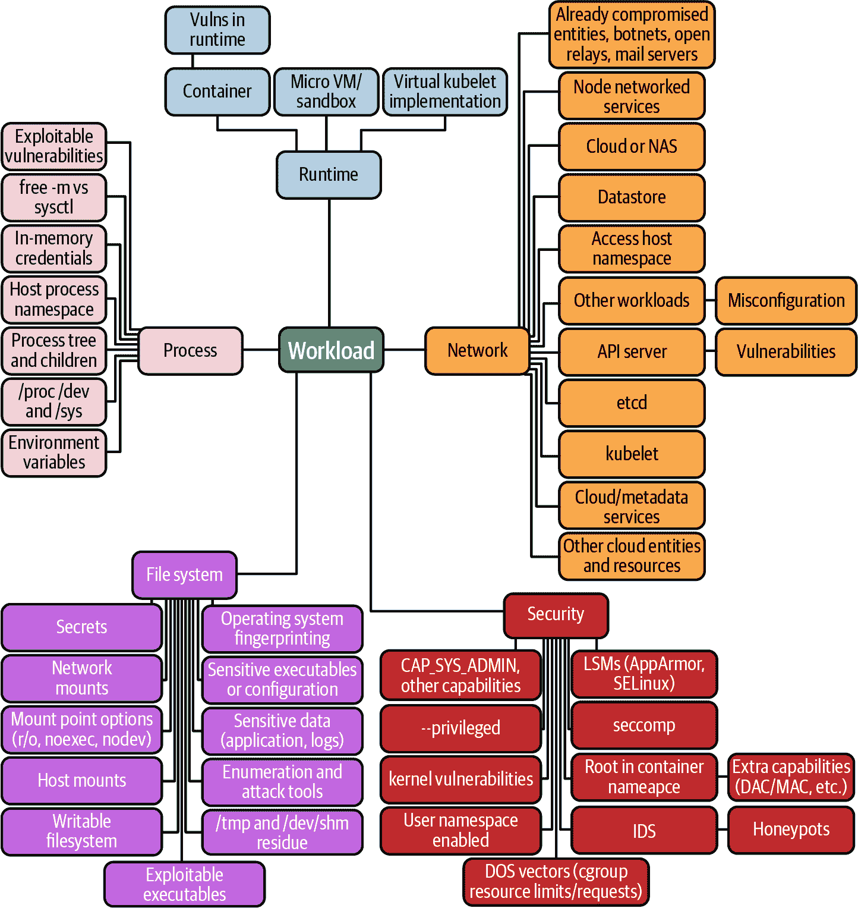
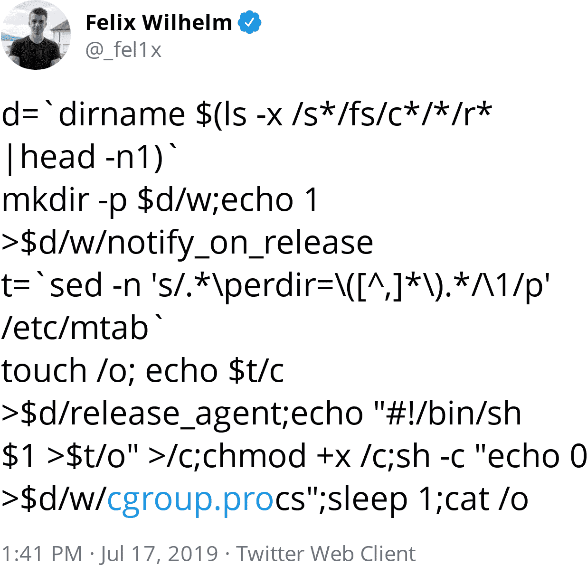

# 附录 A. 一个 Pod 级攻击

本附录是对 pod 级攻击的实践探索，正如我们在 第二章 中讨论的那样。


可怕的网络海盗哈希杰克现在可以远程在 pod 中执行代码，并且他们将开始探索其配置，看看还能访问什么。

就像所有优秀的海盗一样，哈希杰克有一张宝藏地图，但这不是一张有明确目的地的普通地图。相反，这张地图只描述了旅程，不保证达到结论。这是一个集群攻击地图，如 图 A-1 所示，并且用于指导我们浏览附录的其余部分。现在，从 pod 内部开始探索。

###### 提示

保护任何系统都很困难。发现漏洞和配置错误的最佳方法是系统地观察您的环境，建立自己的攻击和模式库，并且不要放弃！



###### 图 A-1\. Pod 攻击地图

# 文件系统

进入新环境时，一些基本的检查可能会带来有用的发现。哈希杰克首先要做的是检查他们所在的容器类型。经常检查 `/proc/self/cgroup` 可能会提供线索，这里他们可以看到从线索 `/kubepods/besteffort/pod8a6fa26b-...` 知道他们在 Kubernetes 中：

```
adversary@hashjack-5ddf66bb7b-9sssx:/$ cat /proc/self/cgroup
11:memory:/kubepods/besteffort/pod8a6fa26b-.../f3d7b09d9c3a1ab10cf88b3956...
10:cpu,cpuacct:/kubepods/besteffort/pod8a6fa26b-...f3d7b09d9c3a1ab10cf88b...
9:blkio:/kubepods/besteffort/pod8a6fa26b-...f3d7b09d9c3a1ab10cf88b3956704...
8:net_cls,net_prio:/kubepods/besteffort/pod8a6fa26b-...f3d7b09d9c3a1ab10c...
7:perf_event:/kubepods/besteffort/pod8a6fa26b-...f3d7b09d9c3a1ab10cf88b39...
6:freezer:/kubepods/besteffort/pod8a6fa26b-...f3d7b09d9c3a1ab10cf88b39567...
5:pids:/kubepods/besteffort/pod8a6fa26b-...f3d7b09d9c3a1ab10cf88b39567048...
4:cpuset:/kubepods/besteffort/pod8a6fa26b-...f3d7b09d9c3a1ab10cf88b395670...
3:hugetlb:/kubepods/besteffort/pod8a6fa26b-...f3d7b09d9c3a1ab10cf88b39567...
2:devices:/kubepods/besteffort/pod8a6fa26b-...f3d7b09d9c3a1ab10cf88b39567...
1:name=systemd:/kubepods/besteffort/pod8a6fa26b-...f3d7b09d9c3a1ab10cf88b...
```

接下来，他们可能会检查他们的进程状态输入在 */proc/self/status* 中：

```
Name:   cat
State:  R (running)
Tgid:   278
Ngid:   0
Pid:    278
PPid:   259
TracerPid:      0
Uid:    1001    1001    1001    1001
Gid:    0       0       0       0
FDSize: 256
Groups:
NStgid: 278
NSpid:  278
NSpgid: 278
NSsid:  259
VmPeak:     2432 kB
VmSize:     2432 kB
VmLck:         0 kB
VmPin:         0 kB
VmHWM:       752 kB
VmRSS:       752 kB
VmData:      312 kB
VmStk:       132 kB
VmExe:        28 kB
VmLib:      1424 kB
VmPTE:        24 kB
VmPMD:        12 kB
VmSwap:        0 kB
HugetlbPages:          0 kB
Threads:        1
SigQ:   0/15738
SigPnd: 0000000000000000
ShdPnd: 0000000000000000
SigBlk: 0000000000000000
SigIgn: 0000000000000000
SigCgt: 0000000000000000
CapInh: 00000000a80425fb
CapPrm: 0000000000000000
CapEff: 0000000000000000
CapBnd: 00000000a80425fb
CapAmb: 0000000000000000
Seccomp:        0
Speculation_Store_Bypass:       vulnerable
Cpus_allowed:   0003
Cpus_allowed_list:      0-1
Mems_allowed:   00000000,00000001
Mems_allowed_list:      0
voluntary_ctxt_switches:        0
nonvoluntary_ctxt_switches:     1
```

内核会自由提供这些信息，以帮助 Linux 应用程序，而在容器中的攻击者可以利用这些信息来获取优势。可以用 grep 命令找出有趣的条目（注意下面我们是 root 用户）：

```
root@hack:~ [0]$ grep -E \
  '(Uid|CoreDumping|Seccomp|NoNewPrivs|Cap[A-Za-z]+):' /proc/self/status
Uid:    0       0       0       0
CoreDumping:    0
CapInh: 0000003fffffffff
CapPrm: 0000003fffffffff
CapEff: 0000003fffffffff
CapBnd: 0000003fffffffff
CapAmb: 0000000000000000
NoNewPrivs:     0
Seccomp:        0
```

这些能力并不是很容易读懂，需要进行解码：

```
root@hack:~ [0]$ capsh --decode=0000003fffffffff
0x0000003fffffffff=cap_chown,cap_dac_override,cap_dac_read_search,cap_fowner,
  cap_fsetid,cap_kill,cap_setgid,cap_setuid,cap_setpcap,cap_linux_immutable,
  cap_net_bind_service,cap_net_broadcast,cap_net_admin,cap_net_raw,
  cap_ipc_lock,cap_ipc_owner,cap_sys_module,cap_sys_rawio,cap_sys_chroot,
  cap_sys_ptrace,cap_sys_pacct,cap_sys_admin,cap_sys_boot,cap_sys_nice,
  cap_sys_resource,cap_sys_time,cap_sys_tty_config,cap_mknod,cap_lease,
  cap_audit_write,cap_audit_control,cap_setfcap,cap_mac_override,
  cap_mac_admin,cap_syslog,cap_wake_alarm,cap_block_suspend,cap_audit_read
```

您还可以使用 `capsh --print` 命令来显示能力（如果已安装），`getpcaps` 和 `filecap`（分别用于单个进程或文件），`pscap`（用于所有运行进程），以及 `captest`（用于当前进程的上下文）：

```
root@hack:~ [0]$ capsh --print
Current: = cap_chown,cap_dac_override,cap_fowner,cap_fsetid,cap_kill,
  cap_setgid,cap_setuid,cap_setpcap,cap_net_bind_service,cap_net_raw,
  cap_sys_chroot,cap_mknod,cap_audit_write,cap_setfcap+eip
Bounding set =cap_chown,cap_dac_override,cap_fowner,cap_fsetid,cap_kill,
  cap_setgid,cap_setuid,cap_setpcap,cap_net_bind_service,cap_net_raw,
  cap_sys_chroot,cap_mknod,cap_audit_write,cap_setfcap
Ambient set =
Securebits: 00/0x0/1'b0
 secure-noroot: no (unlocked)
 secure-no-suid-fixup: no (unlocked)
 secure-keep-caps: no (unlocked)
 secure-no-ambient-raise: no (unlocked)
uid=0(root)
gid=0(root)
groups=1(bin),2(daemon),3(sys),4(adm),6(disk),10(wheel),11(floppy)...
```

###### 提示

一个生产容器永远不应包含这些调试命令，而应仅包含生产应用程序和代码。使用静态、精简或 `distroless` 容器可通过限制攻击者对有用信息的访问来减少容器的攻击面。这也是为什么在可能的情况下应限制像 `curl` 和 `wget` 这样的具有网络功能的应用程序的可用性，以及任何带有网络库的解释器，这些解释器可以用来将外部工具拉入运行中的容器。

您可能更喜欢运行杰斯·弗拉泽尔的 [amicontained](https://oreil.ly/j919l)，它可以快速运行这些检查，并方便地检测能力、seccomp 和 LSM 配置。

###### 提示

这个命令需要互联网访问权限，这是生产工作负载不应授予的另一项特权，除非需要用于生产操作。空气隔离（完全脱机）集群提供了更高的安全性，但会增加管理开销。

让我们使用 `amicontained`：

```
root@hack:~ [0]$ export AMICONTAINED_SHA256="d8c49e2cf44ee9668219acd092e\
d961fc1aa420a6e036e0822d7a31033776c9f" 

root@hack:~ [0]$ curl -fSL \ 
  "https://github.com/genuinetools/amicontained/releases/download/v0.4.9/\
amicontained-linux-amd64" \
  -o "/tmp/amicontained" \
  && echo "${AMICONTAINED_SHA256} /tmp/amicontained" | sha256sum -c - \
  && chmod a+x "/tmp/amicontained"

root@hack:~ [0]$ /tmp/amicontained 
Container Runtime: kube
Has Namespaces:
        pid: true user: false AppArmor Profile: docker-default (enforce)
Capabilities:
        BOUNDING -> chown dac_override fowner fsetid kill setgid setuid
  setpcap net_bind_service net_raw sys_chroot mknod audit_write setfcap
Seccomp: disabled
Blocked system calls (26):
        SYSLOG SETUID SETSID SETREUID SETGROUPS SETRESUID VHANGUP
  PIVOT_ROOT ACCT SETTIMEOFDAY UMOUNT2 SWAPON SWAPOFF REBOOT SETHOSTNAME
  SETDOMAINNAME INIT_MODULE DELETE_MODULE LOOKUP_DCOOKIE KEXEC_LOAD
  FUTIMESAT UTIMENSAT FANOTIFY_INIT OPEN_BY_HANDLE_AT FINIT_MODULE
  KEXEC_FILE_LOAD
Looking for Docker.sock
```


导出 sha256sum 进行验证。


下载并检查 sha256sum。


我们安装到非标准路径以规避不可变文件系统，因此我们运行完全限定路径

大发现！从容器内部可以获取大量关于安全配置的信息。

我们还可以在文件系统上检查我们的 `cgroup` 限制：

```
root@hack:~ [0]$ free -m
        total   used   free   shared   buff/cache   available
Mem:     3950    334   1473        6         2142        3327
Swap:       0      0      0
```

`free -m` 使用主机级别的 API 可供所有进程使用，并未更新以与 `cgroups` 兼容。检查系统 API 以查看进程的实际 `cgroup` 限制：

```
root@host:~ [0]$ docker run -it --memory=4MB sublimino/hack \
  cat /sys/fs/cgroup/memory/memory.limit_in_bytes
4194304
```

对攻击者非常有用吗？其实不然。耗尽进程的内存并导致拒绝服务是一种基本攻击（尽管[分叉炸弹](https://oreil.ly/pd9zR)被优雅地编写成 Bash 诗歌）。尽管如此，您应该设置 `cgroups` 以防止容器或 Pod 中的应用程序 DoS（支持个别配置）。Cgroups 不是安全边界，特权 Pod 可以从 `cgroups v1` 中逃逸，正如图 A-2 中演示的那样。



###### 图 A-2\. Felix Wilhelm 精心制作的 `cgroups v1` 容器逃逸的巧妙推文大小

###### 提示

更安全且无根本的 `cgroups v2` 应该是大多数 Linux 安装的默认选项[从 2022 年起](https://oreil.ly/9lOZa)。

拒绝服务更有可能是应用程序的故障，而不是攻击——严重的 DDoS（基于互联网的分布式拒绝服务）应该由集群前面的网络设备处理，用于带宽和缓解。

###### 注意

2017 年 9 月，谷歌成功抵御了一次[2.54 Tbps DDoS 攻击](https://oreil.ly/zEUbp)。这类流量在进入网络路由器硬件时被丢弃，以防止对内部系统造成过载。

Kubernetes 在每个 Pod 中为每个容器设置了一些有用的环境变量：

```
root@frontened:/frontend [0]$ env |
  grep -E '(KUBERNETES|[^_]SERVICE)_PORT=' | sort
ADSERVICE_PORT=tcp://10.3.253.186:9555
CARTSERVICE_PORT=tcp://10.3.251.123:7070
CHECKOUTSERVICE_PORT=tcp://10.3.240.26:5050
CURRENCYSERVICE_PORT=tcp://10.3.240.14:7000
EMAILSERVICE_PORT=tcp://10.3.242.14:5000
KUBERNETES_PORT=tcp://10.3.240.1:443
PAYMENTSERVICE_PORT=tcp://10.3.248.231:50051
PRODUCTCATALOGSERVICE_PORT=tcp://10.3.250.74:3550
RECOMMENDATIONSERVICE_PORT=tcp://10.3.254.65:8080
SHIPPINGSERVICE_PORT=tcp://10.3.242.42:50051
```

应用程序可以轻松从环境变量中读取其配置，而[12 因素应用](https://12factor.net)建议将配置和机密信息设置在环境中。环境变量不是存储机密信息的安全场所，因为进程、用户或恶意代码可以轻松从 PID 命名空间中读取它们。

###### 提示

您可以作为 root 或相同用户查看进程的环境。使用空字节转换检查 PID 1：

```
root@frontened:/frontend [0]$ tr '\0' '\n' < /proc/1/environ
HOSTNAME=9c7e824ed321
PWD=/
# ...
```

即使没有达成妥协，许多应用程序在崩溃时会转储其环境，将机密信息泄露给可以访问日志系统的任何人。

Kubernetes Secrets 不应作为环境变量挂载。

###### 注意

如果攻击者具有远程代码执行权限，从父进程轻松收集，Kubernetes 容器环境变量在容器创建后不会更新：如果 API 服务器更新了 Secret，则环境变量保持相同的值。

更安全的选择是使用一个众所周知的路径，并将秘密`tmpfs`卷挂载到容器中，这样对手就必须猜测或找到秘密文件路径，这对攻击者来说不太可能被自动化。挂载的秘密会在`kubelet`同步周期和缓存传播延迟之后自动更新。

这里有一个将秘密挂载到路径*/etc/foo*的示例：

```
apiVersion: v1
kind: Pod
metadata:
  name: mypod
spec:
  containers:
  - name: mypod
    image: redis
    volumeMounts:
    - name: foo
      mountPath: "/etc/foo"
      readOnly: true
  volumes:
  - name: foo
    secret:
      secretName: mysecret
```

将秘密作为文件挂载可以防止信息泄露，并确保像 Hashjack 船长这样的对手在通过窃取的应用程序日志时不会意外发现生产秘密。

# tmpfs

一个谨慎的探险者不会放过任何一个未探索的海洋，对 Hashjack 船长来说，攻击文件系统也不例外。检查是否有任何外部添加到挂载命名空间中的内容是第一个被调查的地方，常用工具如`mount`和`df`可以用来进行此类检查。

###### 提示

每个外部设备、文件系统、套接字或共享到容器中的实体都会增加通过利用或配置错误导致容器突破的风险。当容器仅包含操作所需的基本要素并且彼此之间或与底层主机共享时，它们处于最安全状态。

让我们首先搜索文件系统挂载点，查找常见的容器文件系统驱动程序`overlayfs`。这可能会泄露有关配置了文件系统的容器运行时类型的信息：

```
root@test-db-client-pod:~ [0]$ mount | grep overlay
overlay on / type overlay (rw,relatime,
  lowerdir=
  /var/lib/containerd/io.containerd.snapshotter.v1.overlayfs/snapshots/316/fs:
  /var/lib/containerd/io.containerd.snapshotter.v1.overlayfs/snapshots/315/fs:
  /var/lib/containerd/io.containerd.snapshotter.v1.overlayfs/snapshots/314/fs:
  /var/lib/containerd/io.containerd.snapshotter.v1.overlayfs/snapshots/313/fs:
  /var/lib/containerd/io.containerd.snapshotter.v1.overlayfs/snapshots/312/fs:
  /var/lib/containerd/io.containerd.snapshotter.v1.overlayfs/snapshots/311/fs:
  /var/lib/containerd/io.containerd.snapshotter.v1.overlayfs/snapshots/310/fs:
  /var/lib/containerd/io.containerd.snapshotter.v1.overlayfs/snapshots/309/fs:
  /var/lib/containerd/io.containerd.snapshotter.v1.overlayfs/snapshots/308/fs,
  upperdir=
  /var/lib/containerd/io.containerd.snapshotter.v1.overlayfs/snapshots/332/fs,
  workdir=
  /var/lib/containerd/io.containerd.snapshotter.v1.overlayfs/snapshots/332/work)
```

我们可以看到底层容器运行时正在使用一个包含名称`containerd`的文件路径，并且容器在主机磁盘上的文件系统位置为*/var/lib/containerd/io.containerd.snapshotter.v1.overlayfs/snapshots/316/fs*。列出了多个分层目录，并且这些目录在运行时通过`overlayfs`组合成单个文件系统。

这些路径是容器运行时默认配置的指纹，而`runc`通过不同的文件系统布局泄露其身份：

```
root@dbe6633a6c94:/# mount | grep overlay
overlay on / type overlay (rw,relatime,lowerdir=
  /var/lib/docker/overlay2/l/3PTJCBKLNC2V5MRAEF3AU6EDMS:
  /var/lib/docker/overlay2/l/SAJGPHO7UFXGYFRMGNJPUOXSQ5:
  /var/lib/docker/overlay2/l/4CZQ74RFDNSDSHQB6CTY6CLW7H,
  upperdir=
  /var/lib/docker/overlay2/aed7645f42335835a83f25ae7ab00b98595532224...163/diff,
  workdir=
  /var/lib/docker/overlay2/aed7645f42335835a83f25ae7ab00b98595532224...163/work)
```

运行`df`命令查看是否有任何挂载到容器中的秘密。在这个例子中，没有外部实体挂载到容器中：

```
root@test-db-client-pod:~ [0]$ df
Filesystem     Type     Size  Used Avail Use% Mounted on
overlay        overlay   95G  6.6G   88G   7% /
tmpfs          tmpfs     64M     0   64M   0% /dev
tmpfs          tmpfs    7.1G     0  7.1G   0% /sys/fs/cgroup
/dev/sda1      ext4      95G  6.6G   88G   7% /etc/hosts
shm            tmpfs     64M     0   64M   0% /dev/shm
tmpfs          tmpfs    7.1G     0  7.1G   0% /proc/acpi
tmpfs          tmpfs    7.1G     0  7.1G   0% /proc/scsi
tmpfs          tmpfs    7.1G     0  7.1G   0% /sys/firmware
```

我们可以看到`tmpfs`用于许多不同的挂载，一些挂载掩盖了*/proc*和`/sys`中的主机文件系统。容器运行时对这些目录中的特殊文件进行了额外的掩盖。

在易受攻击的容器文件系统中，可能包含主机挂载的秘密和套接字，尤其是臭名昭著的 Docker 套接字和可能具有 RBAC 授权以升级权限或启用进一步攻击的 Kubernetes 服务账户：

```
root@test-db-client-pod:~ [0]$ df
Filesystem  Type   ...  Use% Mounted on
tmpfs       tmpfs  ...    1% /etc/secret-volume
tmpfs       tmpfs  ...    1% /run/docker.sock
tmpfs       tmpfs  ...    1% /run/secrets/kubernetes.io/serviceaccount
```

所有容器突破中最简单和最方便的是*/var/run/docker.sock*挂载点：从主机获取的容器运行时套接字，可访问主机上运行的 Docker 守护程序。如果这些新容器是特权容器，则可以轻松地“逃离”容器命名空间并以 root 身份访问底层主机，正如我们在本章前面看到的。

其他吸引人的目标包括 Kubernetes 服务账户令牌在 */var/run/secrets/kubernetes.io/serviceaccount* 下，或像 */etc/secret-volume* 这样的可写主机挂载目录。其中任何一个都可能导致突破，或者帮助进行轴心转移。

`kubelet` 挂载到其容器中的所有内容对于 `kubelet` 主机上的 root 用户都是可见的。稍后我们将看到挂载在 */run/secrets/kubernetes.io/serviceaccount* 下的 `serviceAccount` 是什么样子，并且我们调查了在 第八章 中偷窃 `serviceAccount` 凭据后该怎么办。

在 pod 内部，默认情况下 `kubectl` 使用 */run/secrets/kubernetes.io/serviceaccount* 中的凭据。从 `kubelet` 主机上，这些文件被挂载到 */var/lib/kubelet/pods/123e4567-e89b-12d3-a456-426614174000/volumes/kubernetes.io~secret/my-pod-token-7vzn2* 下，因此将以下命令加载到 Bash shell 中：

```
kubectl-sa-dir () {
    local DIR="${1:-}";
    local API_SERVER="${2:-kubernetes.default}";
    kubectl config set-cluster tmpk8s --server="https://${API_SERVER}" \
      --certificate-authority="${DIR}/ca.crt";
    kubectl config set-context tmpk8s --cluster=tmpk8s;
    kubectl config set-credentials tmpk8s --token="$(<${DIR}/token)";
    kubectl config set-context tmpk8s --user=tmpk8s;
    kubectl config use-context tmpk8s;
    kubectl get secrets -n null 2>&1 | sed -E 's,.*r "([^"]+).*,\1,g'
}
```

并在目录下运行它：

```
root@kube-node-1:~ [0]# kubectl-sa-dir \
  /var/lib/kubelet/pods/.../kubernetes.io~secret/priv-app-r4zkx/...229622223/
Cluster "tmpk8s" set.
Context "tmpk8s" created.
User "tmpk8s" set.
Context "tmpk8s" modified.
Switched to context "tmpk8s".
apiVersion: v1
clusters:
- cluster:
    certificate-authority: \
        /var/lib/kubelet/pods/.../kubernetes.io~secret/.../...229622223/ca.crt
    server: https://10.0.1.1:6443
  name: tmpk8s
# ...
system:serviceaccount:kube-system:priv-app
```

现在你可以更容易地使用 `kubectl` 配置在你的 *~/.kube/config* 中的 `system:serviceaccount:kube-system:priv-app` 服务账户 (SA)。攻击者也可以做同样的事情——对 Kubernetes 节点的敌意根访问会显露所有的 Secrets！

###### 提示

如果其他人可以访问 CSI 存储接口和主机文件系统挂载，这些都会带来安全风险。我们将在 第六章 中更详细地探讨外部存储、容器存储接口 (CSI) 和其他挂载。

还有什么其他挂载的内容可能会引起对手贪婪目光？让我们进一步探索。

# 主机挂载

Kubernetes 的 `hostPath` 卷类型将主机的文件系统路径挂载到容器中，这对某些应用程序可能很有用。*/var/log* 是一个常见的挂载点，因此主机的日志进程会收集容器的系统日志事件。

###### 警告

尽可能避免使用 `HostPath` 卷，因为它们存在许多风险。最佳实践是使用 `ReadOnly` 挂载标志仅限制到所需的文件或目录。

`hostPath` 挂载的其他用例包括在 pod 中数据存储的持久性，或者托管静态数据、库和缓存。

使用主机磁盘或永久附加存储到节点会创建工作负载和底层节点之间的耦合，因为必须在该节点上重新启动工作负载才能正常运行。这使得扩展和弹性更加困难。

如果容器内意外创建了符号链接，解析到主机文件系统，主机挂载可能会很危险。在 CVE-2017–1002101 中发生了这种情况，符号链接处理代码中的错误允许容器内的对手探索挂载点所在的主机挂载文件系统。

将主机的套接字挂载到容器中也是一种常见的 `hostMount` 使用场景，它允许容器内的客户端针对主机上的服务器运行命令。通过在主机上启动新的特权容器并逃逸，这是一个容器突破的简便路径。

挂载主机上的敏感目录或文件，如果可以用于网络服务，也可能提供转向的机会。

`hostPath`卷是主机分区外的可写卷，始终作为`root:root`所有的主机文件系统上挂载。因此，在容器内应始终使用非 root 用户，并且如果容器内需要写入访问权限，则应始终在主机上配置文件系统权限。

###### 警告

如果您正在使用准入控制器限制对特定目录的`hostPath`访问，那么这些`volumeMounts`必须是`readOnly`，否则新的符号链接可以用来遍历主机文件系统。

最终，数据是您业务的生命线，管理状态是困难的。攻击者将试图收集、外泄和加密锁定他们在您系统中找到的任何数据。使用外部服务（如外部托管的对象存储或数据库）来持久化数据通常是确保系统安全的最坚固和可扩展的方式——然而，对于高带宽或低延迟应用程序，这可能是不可能的。

对于其他所有内容，云提供商或内部服务集成去除了工作负载与底层主机之间的关联，这使得扩展、升级和系统部署更加容易。

###### 提示

管理服务和专用基础设施集群是更容易理解的集群安全抽象，我们在第七章中会更多地讨论它们。

## 敌对容器

敌对容器是一个由攻击者控制的容器。它可能由具有 Kubernetes 访问权限的攻击者创建（可能是`kubelet`或 API 服务器），或者包含自动化利用代码的容器镜像（例如，从[dockerscan](https://oreil.ly/2vvV0)下载的“木马”镜像，可以在合法容器中启动反向 Shell，以便攻击者访问您的生产系统），或者是在部署后被远程对手访问过的容器。

关于敌对容器镜像的文件系统呢？如果 Hashjack 队长能强制 Kubernetes 运行一个他们构建或损坏的容器，他们可能会尝试攻击编排器或容器、运行时或客户端（如`kubectl`）。

一个攻击（[CVE-2019-16884](https://oreil.ly/Hj4i3)）涉及一个定义在容器镜像中的`VOLUME`，覆盖了 AppArmor 用于配置的目录，基本上在容器运行时禁用了它：

```
mkdir -p rootfs/proc/self/{attr,fd}
touch rootfs/proc/self/{status,attr/exec}
touch rootfs/proc/self/fd/{4,5}
```

这可能被用作对系统的进一步攻击的一部分，但由于 AppArmor 不太可能是唯一的防御层，因此它并不像看起来那么严重。

另一个危险的容器镜像是一个在[CVE-2019-5736](https://oreil.ly/1j7We)中进行*/proc/self/exe*突破的容器。这个漏洞利用需要一个具有恶意链接`ENTRYPOINT`的容器，因此无法在已经启动的容器中运行。

正如这些攻击所显示的，除非容器是由可信组件构建的，否则应将其视为不受信任以防御进一步未知的攻击，例如此类攻击。

###### 注意

一系列的`kubectl cp` CVE（[CVE-2018-1002100](https://oreil.ly/QdTZ9)，[CVE-2019-11249](https://oreil.ly/wB13O)）需要容器内存在恶意的 tar 二进制文件。这种漏洞源于`kubectl`信任来自容器内`scp`和`tar`进程的输入，可以被操纵以覆盖运行`kubectl`二进制文件的主机上的文件。

## 运行时

[CVE-2019-5736](https://oreil.ly/yRLNz)中*/proc/self/exe*的突破的危险在于，敌对的容器进程可以覆盖主机上的`runc`二进制文件。那个`runc`二进制文件由 root 所有，但由于它也是在主机上由 root 执行（因为大多数容器运行时需要一些 root 能力），因此可以从容器内部被覆盖。这是因为容器进程是`runc`的子进程，而这种利用利用了`runc`有权覆盖自身的权限。

###### 注意

保护主机免受特权容器进程的最佳方法是从容器运行时中删除 root 权限。`runc`和 Podman 都可以在无 root 模式下运行，我们在第三章中进行了探讨。

超级用户拥有许多特殊权限，这是多年内核开发的结果，假定只有一个“root”用户。为了限制 RCE 对容器、Pod 和主机的影响，容器内的应用不应以 root 身份运行，并且应该通过将`allowPrivilegeEscalation`的`securityContext`字段设置为`false`来丢弃其特权（这会在容器进程上设置`no_new_privs`标志）。
