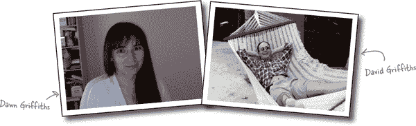

# 《Head First Android Development》的作者

**Dawn Griffiths** 曾是英国一所顶尖大学的数学家，获得了数学一等荣誉学位。她后来选择了软件开发这个职业，在 IT 行业拥有超过 20 年的工作经验，曾担任高级软件开发人员。

当 Dawn 不工作时，你会发现她在磨练她的太极技能、阅读、跑步、制作花边或烹饪。她特别喜欢和她优秀的丈夫 David 一起度过时间。

**David Griffiths** 12 岁开始学习编程，当时他看了一部关于西摩·帕帕特工作的纪录片。15 岁时，他编写了帕帕特的计算机语言 LOGO 的实现。从那时起，他曾担任敏捷教练、软件开发人员和车库管理员，但不是按照这个顺序。

当 David 不工作时，他大部分空闲时间都和他可爱的妻子 Dawn 一起旅行。

一起，Dawn 和 David 写了许多书，包括《Head First Android Development》、*Head First Kotlin*、*Head First C*、*Head First Rails*、*Head First Statistics*，以及*React Cookbook*。他们为《97 Things Every Java Programmer Should Know》做出了贡献，并创建了视频课程*The Agile Sketchpad*，以一种让大脑保持活跃和投入的方式教授关键概念和技术。他们还通过 O’Reilly 学习平台提供在线实时培训，链接为*[`www.oreilly.com/live-events`](https://www.oreilly.com/live-events)*。

你可以在 Twitter 上关注 Dawn 和 David，链接为*[`twitter.com/HeadFirstDroid`](https://twitter.com/HeadFirstDroid)*。
