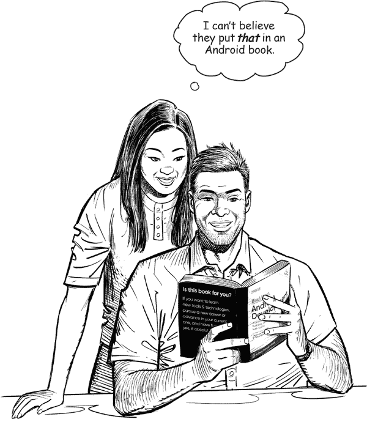
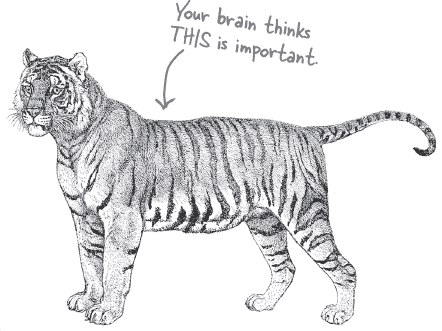
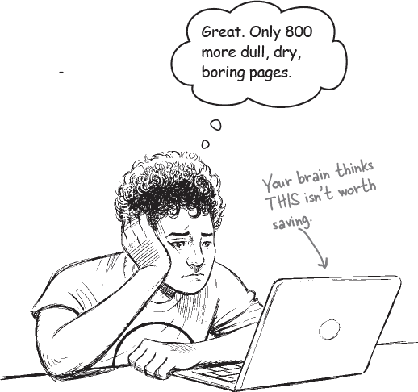
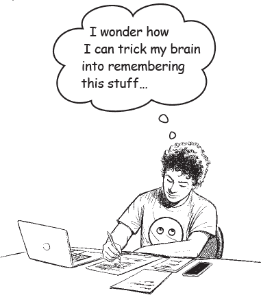
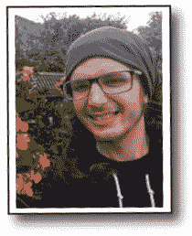
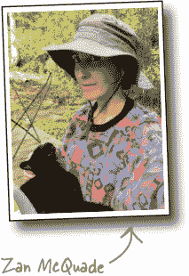

# 如何使用这本书：*简介*

###### 注意

在这一部分，我们回答了这个关键问题：“那么为什么他们在一本关于 Android 的书里加入这个？”

# 这本书适合谁？

如果你可以回答所有这些问题：

1.  你已经掌握了 Kotlin、Java 或其他面向对象的编程语言吗？

1.  你想精通 Android 应用开发，创造下一个大软件，赚一小笔钱，然后退休到你自己的私人岛屿吗？

    ###### 注意

    好吧，也许这有点牵强。但是，你得从某个地方开始，对吧？

1.  你更喜欢实际做事、应用你所学的东西，而不是听某人在讲座中喋喋不休几个小时？

这本书适合你。

## 谁应该远离这本书？

如果你可以回答“是”任何一个问题：

1.  你是在寻找一本快速入门或参考书籍来开发 Android 应用程序吗？

1.  你宁愿被 15 只尖叫的猴子拔掉脚趾甲，也不愿意学习新东西吗？你认为一本 Android 书籍应该涵盖*一切*，特别是那些你永远不会用到的隐晦内容，如果这些内容在过程中令读者厌烦到流泪，那就更好了？

这本书***不***适合你。

###### 注意

[市场部的注释：这本书适合任何持有信用卡或 PayPal 账户的人]

# 我们知道你在想什么

“*这怎么可能是一本严肃的关于开发 Android 应用的书籍？*”

“所有这些图形是什么鬼？”

“我真的可以*用这种方式*学习吗？”

# 我们知道你的*大脑*在想什么

你的大脑渴望新奇。它总是搜索、扫描，*等待*一些不寻常的东西。它就是这样构建的，并且帮助你保持生命。

那么你的大脑对你遇到的所有例行、普通、正常的事情会做什么呢？它尽其*所能*阻止它们干扰大脑的*真正*工作——记录*重要*的事情。它不费力保存无聊的事情；它们从未通过“这显然不重要”的过滤器。

你的大脑如何*知道*什么是重要的？假设你出去远足一天，一只老虎跳到你面前——你的头脑和身体会发生什么？

神经元激活。情绪激增。*化学物质激增*。

这就是你的大脑知道的方法……

**这一定很重要！不要忘记它！**

但想象一下，你在家里或图书馆。这是一个安全、温暖的、没有老虎的地方。你正在学习。准备考试。或者尝试学习你的老板认为需要一周、十天最多的艰难技术主题。

只有一个问题。你的大脑试图为你做一件大事。它试图确保这个*显然*不重要的内容不会占用有限的资源。这些资源最好用来存储真正*重要*的事情。像老虎一样。像火灾的危险一样。像你不应该把那些派对照片发布到 Instagram 上一样。但并没有简单的方法告诉你的大脑，“嘿，大脑，非常感谢你，但无论这本书有多么乏味，我现在情绪上几乎没有感受，我真的*希望*你能记住这些东西。”

# 元认知：思考思维的过程

如果你真的想学习，并且想更快、更深入地学习，就要注意你的注意力是如何被吸引的。思考你的思维方式。学习你的学习方法。

大多数人在成长过程中没有学习元认知或学习理论的课程。我们*期望*学习，但很少*教会*如何学习。

但我们假设如果你拿着这本书，你真的想学习如何开发 Android 应用。你可能不想花很多时间。如果你想要应用这本书中的内容，你需要*记住*你所读的内容。为此，你必须*理解*它。要从这本书中，或者*任何*一本书或学习经验中获取最大的收获，就要对你的大脑负责。你的大脑在*这个*内容上。

关键是让你的大脑把你正在学习的新材料看作是非常重要的。对你的健康至关重要。就像一只老虎一样重要。否则，你将不断与你的大脑进行斗争，让它尽力确保新内容不会留下。

**那么，你如何让你的大脑把 Android 开发看作是一只饥饿的老虎呢？**

有缓慢、乏味的方式，也有更快、更有效的方式。缓慢的方式是纯粹的重复。你显然知道，即使是最乏味的话题，只要你不断地向大脑灌输同样的内容，你是*可以*学习和记住的。通过足够的重复，你的大脑会说，“对他来说这不*感觉*重要，但他不断看着同样的东西*一遍*又*一遍*又*一遍*，所以我想这一定很重要。”

更快的方法是去***做任何增加大脑活动的事情***，特别是不同种类的大脑活动。前面页面上的内容是解决方案的重要部分，它们都经过证明有助于你的大脑更有效地工作。例如，研究表明，将单词*与*它们描述的图片放在一起（而不是放在页面的其他位置，如标题或正文中），会使你的大脑尝试理解单词和图片之间的关系，这会导致更多的神经元激活。更多的神经元激活 = 大脑更有机会*意识到*这是值得关注的事情，并可能记录下来。

会话式的风格有助于提高注意力，因为人们倾向于在感觉自己在进行对话时更加专注，因为他们期望自己能跟上并参与其中。令人惊奇的是，你的大脑并不一定*在意*这个“对话”是你和一本书之间的交流！另一方面，如果写作风格正式干燥，你的大脑会像你在一群被动听众中被讲授时一样对待它。没必要保持清醒。

但图片和会话式风格仅仅是个开始...

# 这就是我们所做的

我们使用了***图片***，因为你的大脑适应视觉，而不是文本。对于你的大脑来说，一张图片真的*就像*一千个字。而当文本和图片共同工作时，我们将文本*嵌入*到图片中，因为当文本位于它所指的事物内部时，你的大脑的工作效果更好，而不是在某个标题或正文中被埋没。

我们使用了***冗余性***，用*不同*的方式和不同的媒体类型表达相同的内容，并且利用*多个感官*，以增加内容被编码到你大脑多个区域的机会。

我们以***意外的***方式使用概念和图片，因为你的大脑适应新奇，我们利用至少*某些*带有***情感****内容*的图片和想法，因为你的大脑更倾向于注意情感的生物化学。那些让你*感觉*到某种情绪的事物更容易被记住，即使这种感觉只是一点***幽默***、***惊讶***或***兴趣***。

我们采用了一种个性化的、***会话式的风格***，因为你的大脑在认为自己处于对话中时会更加专注，而不是认为你在被动听一个演示。即使你*在读*的时候，你的大脑也是这样做的。

我们包含了***活动***，因为你的大脑更倾向于在***做***事情而不是*读*事情时学习和记忆更多内容。而且我们设计的练习是具有挑战性但可行的，因为这是大多数人偏爱的方式。

我们运用了***多种学习风格***，因为*你*可能更喜欢逐步操作，而其他人可能更希望先了解整体图景，还有人可能只想看一个例子。但无论你的学习偏好如何，*每个人*都会从以多种方式表达的相同内容中受益。

我们为***你大脑的两侧***提供了内容，因为你能够激活更多的大脑区域，你就更有可能学习和记忆，也能保持更长时间的注意力。由于激活大脑的一侧通常意味着给另一侧一个休息的机会，所以你在学习上能更加高效并保持更长的时间。

我们包含了***故事***和练习，呈现了***多个观点***，因为当你的大脑被迫进行评估和判断时，它会更深入地学习。

我们包含了***挑战***，通过练习和提出***问题***，这些问题并不总是有一个直接的答案，因为当你的大脑需要*努力*时，它就会调整学习和记忆。想想看——你不能仅仅通过*看*健身房里的人来让你的*身体*变得健康。但我们尽力确保当你努力工作时，你在做的是*正确*的事情。确保***你不会浪费额外的树突***来处理难以理解的例子，或解析困难、术语繁多或过于简洁的文本。

我们使用了***人***。在故事、例子、图片等中，因为，嗯，*你*是一个人。你的大脑对*人*比对*事物*更关注。

## 这是你可以做的让你的大脑屈服的方法

###### 注意

剪下这部分并贴在你的冰箱上。

所以，我们做了我们的部分。剩下的取决于你。这些建议是一个起点；倾听你的大脑，找出对你有效的和无效的方法。尝试新的事物。

1.  **放慢速度。你理解得越多，就需要记忆的就越少。**

    不要只是*阅读*。停下来思考。当书问你一个问题时，不要直接跳到答案。想象有人真的在问这个问题。你强迫大脑深入思考的程度越深，你学习和记忆的机会就越大。

1.  **做练习。写下你自己的笔记。**

    我们把它们放进去了，但如果我们为你做了这些，那就像让别人为你做锻炼一样。不要只是*看*练习。**使用铅笔**。有足够的证据表明，在学习过程中进行体力活动可以增加学习效果。

1.  **阅读“没有愚蠢的问题”。**

    这意味着所有这些。它们不是可选的侧边栏，***它们是核心内容的一部分！*** 不要跳过它们。

1.  **让这成为你睡前读的最后一件事。或者至少是最后一个具有挑战性的事情。**

    学习的一部分（尤其是转移到长期记忆）发生在你放下书后。你的大脑需要自己的时间来进行更多的处理。如果你在处理时间内加入了新的东西，你刚刚学到的一部分将会丢失。

1.  **大声说出来。**

    说话会激活大脑的不同部分。如果你试图理解某事，或增加记忆它的机会，大声说出来。更好的是，尝试向别人大声解释。你会学得更快，而且在阅读时可能会发现你之前不知道的想法。

1.  **喝水。大量的水。**

    你的大脑在液体中的良好环境中工作得最好。脱水（可能在你感到口渴之前就会发生）会降低认知功能。

1.  **倾听你的大脑。**

    注意你的大脑是否过载。如果你发现自己开始浅尝辄止或忘记刚刚读过的内容，那么是休息的时候了。一旦你超过了某个点，通过试图塞更多东西进去来学习得更快，甚至可能会伤害这个过程。

1.  **感受一些东西。**

    你的大脑需要知道这件事*很重要*。参与到故事中去。为照片编写你自己的标题。就算是一个糟糕的笑话也*比什么感觉都没有*好。

1.  **多写代码！**

    学习开发 Android 应用只有一条路：**多写代码**。这本书将贯穿始终地让你实践。编程是一种技能，唯一的提高方式就是不断练习。每章都包含练习题，这些题目会让你解决问题。不要轻易跳过它们——大部分的学习过程发生在解决问题的时候。每个练习题都有答案，如果遇到困难，可以毫不犹豫地**偷看答案**！（有时候小问题会让人卡住。）但在查看答案之前，务必尝试自己解决问题。确保在继续学习书中的下一部分之前，已经让代码运行起来了。

# 阅读我

这是一个学习经验，而不是参考书。我们有意删除了可能妨碍学习的所有内容。第一遍阅读时，你需要从头开始，因为本书对你之前看过和学到的内容有所假设。

**我们假设你是 Android 新手，但不是 Kotlin 新手。**

你将学习如何使用 Kotlin 和 XML 结合构建 Android 应用。我们假设你熟悉 Kotlin 编程语言，或者其他面向对象的语言如 Java。如果你完全没有接触过 Kotlin 编程，那么在开始本书之前，你可能需要阅读《Head First Kotlin》。

**我们从第一章开始构建一个应用程序。**

信不信由你，即使你以前从未为 Android 开发过，也可以立即着手构建应用。在此过程中，你将了解 Android Studio，Android 开发的官方 IDE。

**示例设计用于学习。**

随着你逐步阅读本书，你将构建多个不同的应用程序。其中一些非常小，让你专注于 Android 的特定部分。其他应用程序则更大，让你看到不同组件如何配合。我们不会完全完成每个应用程序的每个部分，但你可以自由地尝试并完成它们。这都是学习过程的一部分。

**我们展示代码的上下文。**

我们知道，单独展示代码片段而不解释其工作原理或如何在你自己的项目中使用，会让人感到沮丧。在本书中，我们将展示小段代码，并解释每个部分的作用及其原因。然后我们会展示代码在完整项目中的运作方式。你可以从这里下载本书的所有源代码：*[`tinyurl.com/hfad3`](https://tinyurl.com/hfad3)*。

**活动不可选。**

这些练习和活动不是附加内容；它们是书籍核心内容的一部分。它们中的一些是为了帮助记忆，一些是为了理解，一些将帮助你应用你学到的知识。***不要跳过这些练习。***

**冗余性是故意的，也很重要。**

Head First 书籍的一个显著区别在于我们希望你*真正*理解它。我们希望你完成书籍时记住你学到的东西。大多数参考书并不以保留和回忆为目标，但本书关注*学习*，因此你会看到一些相同的概念多次出现，以不同的方式。

**大脑力量练习没有答案。**

对于其中一些问题，没有正确答案，对于其他问题，大脑力量活动的学习经验部分是让你决定你的答案是否正确的过程。在一些大脑力量练习中，你会找到一些提示，指引你朝正确的方向前进。

# 非常棒的技术审阅团队

Jacqui Cope

Ken Kousen

Ingo Krotzky

Ash Tappin

***技术评审人员:***

**Jacqui Cope** 开始编程是为了避免学校的网球练习。从那时起，她积累了大量的经验，与各种金融和教育系统打交道，从使用 COBOL 编码到测试管理。她后来获得了计算机安全硕士学位，并进入高等教育领域的质量保证工作。在业余时间，Jacqui 喜欢烹饪、在乡村散步，并从沙发后面观看*Doctor Who*。

**Ingo Krotzky** 在医疗保健行业的多种角色中工作，主要为进行临床试验的合同研究组织——系统架构师、数据库管理员和数据库程序员、软件开发人员和数据工程师。在业余时间，他喜欢生活在乡村（大多数时候是与不太野生的野生动物为伴），与松鼠、松鸦和雀鸟一起进行对坐编程，并探索最热门的新移动框架。

**Ken Kousen** 是 Java Champion、Oracle Groundbreaker Ambassador 和 Grails Rock Star。他是 Pragmatic Library 书籍*Help Your Boss Help You*的作者，O’Reilly 书籍*Kotlin Cookbook*、*Modern Java Recipes*和*Gradle Recipes for Android*的作者，以及 Manning 书籍*Making Java Groovy*的作者。他已经为 O’Reilly Learning Platform 录制了十多门视频课程，涵盖与 Android、Spring、Java、Groovy、Grails 和 Gradle 相关的主题。他还是多次获得 JavaOne Rockstar 奖的获奖者。他的学术背景包括麻省理工学院的机械工程和数学学士学位，普林斯顿大学的航空航天工程硕士和博士学位，以及 RPI 的计算机科学硕士学位。目前，他是位于康涅狄格州的 Kousen IT 公司的总裁。

**阿什·塔平**是一位精通多种编程语言的软件开发者，主要从事 Web 应用程序开发。他热衷于创建能够为人们生活带来便利的新事物。在不编程的时候，他喜欢练习吉他、听音乐、跑步、骑自行车、探索户外和园艺。

# 致谢

***我们的编辑：***

我们非常感谢我们出色的编辑**弗吉尼亚·威尔逊**在第三版书籍中的辛勤工作。与她合作非常愉快，她给了我们宝贵的反馈和见解。她惊人的组织和引导能力帮助我们保持书籍的进度，并且她努力确保我们在需要的时候拥有一切所需。我们真心感激她的辛勤工作和支持。

***O’Reilly 团队：***

特别感谢**赞·麦克奎德**邀请我们撰写这本书的第三版，并且对我们的全力支持；**希拉·埃文斯**和**尼可尔·塔奇**为我们提供额外的编辑反馈；设计团队为我们提供了惊人的新艺术作品，并帮助我们替换了旧元素；**凯蒂·托泽尔**和**克里斯汀·布朗**使书籍的早期版本能够提前发布。最后，感谢制作团队在幕后专业地推动了书籍的制作过程，并且为此付出了很多努力。

***家人、朋友和同事们：***

编写 Head First 书籍总是一场充满波澜的旅程，这本书的第三版也不例外。在这条路上，我们真心感激家人和朋友们的善意和支持。特别感谢**妈妈**、**爸爸**、**罗布**、**洛林**、**马克**、**劳拉**、**安迪**、**艾莎**、**安迪**、**马蒂**、**伊恩**、**瓦内萨**、**唐恩**、**威廉**和**西蒙**。

***无法忘怀的名单：***

我们出色的技术审查团队努力给我们提供了他们对这本书的看法，帮助我们保持正确的方向，并确保我们所覆盖的内容完全正确。我们也感谢所有在这本书的早期版本和前两版中给我们反馈的人们。由于他们的贡献，我们认为这本书变得更加出色。

最后，我们要感谢**凯西·西埃拉**和**伯特·贝茨**创作了这一非凡的书籍系列，教会我们抛弃旧的规则，让我们进入他们的思想世界。

# O’Reilly 在线学习

40 多年来，O’Reilly Media 提供技术和商业培训、知识和见解，帮助企业取得成功。

我们独特的专家和创新者网络通过书籍、文章和我们的在线学习平台分享他们的知识和专业知识。O’Reilly 的在线学习平台为您提供按需访问的现场培训课程、深入学习路径、交互式编码环境以及来自 O’Reilly 和其他 200 多家出版商的大量文本和视频。欲了解更多信息，请访问*[`oreilly.com`](http://oreilly.com)*。
