# 第一章：入门：*深入了解*

**Android 是全球最受欢迎的移动操作系统。**

而全球有数十亿的 Android 用户，都在等待下载您的下一个伟大创意。在本章中，您将了解如何通过**构建基本的 Android 应用**并更新它来将您的想法变为现实。您将学习如何在物理和虚拟设备上运行它。在此过程中，您将遇到所有 Android 应用的两个核心组件：**活动（activities）**和**布局（layouts）**。让我们开始吧…

# 欢迎来到 Androidville

Android 是全球最受欢迎的移动平台。据最新统计，全球有超过*三十亿*活跃的 Android 设备，而这个数字还在不断增长。

Android 是一个基于 Linux 的全面开源平台，由 Google 领导。它是一个强大的开发框架，包含了构建优秀应用所需的一切。更重要的是，它使您能够将这些应用部署到各种设备上——手机、平板电脑等。

那么，一个典型的 Android 应用由什么组成？

> **我们将使用 Kotlin 和 XML 构建 Android 应用。我们会在过程中解释事情，但您需要一些 Kotlin 的理解才能充分利用本书。**

## 活动定义应用程序的功能

每个 Android 应用包含一个或多个**活动（activities）**。活动是一种特殊的类——通常用 Kotlin 编写——它控制应用的行为，并决定如何响应用户。例如，如果应用程序包含按钮，则您可以在活动中添加代码以定义用户点击按钮时应执行的操作。

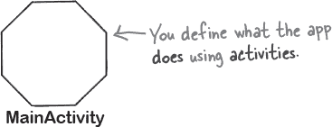

## 布局定义了每个屏幕的外观

典型的 Android 应用由一个或多个屏幕组成。您可以使用**布局（layout）**文件或更多活动代码定义每个屏幕的外观。布局通常使用 XML 定义，每个屏幕可以包含按钮、文本和图像等组件。

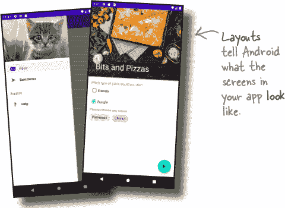

## 也许还会有额外的文件

除了活动和布局之外，Android 应用通常还需要额外的资源，如图像文件和应用程序数据。您可以向应用程序添加所需的任何额外文件。

Android 应用实际上只是特定目录中的一堆文件。构建应用程序时，这些文件会被捆绑在一起，从而形成可以在设备上运行的应用程序。

# 活动和布局构成应用程序的主干

在典型的应用程序中，活动和布局共同定义了应用程序的用户界面。布局告诉 Android 如何排列不同的屏幕元素，活动控制应用程序的行为。例如，如果应用程序包含按钮，则布局指定其位置，活动控制用户点击按钮时应执行的操作。

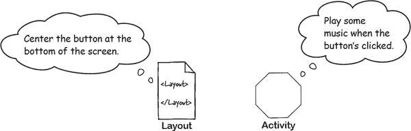

当您在设备上运行应用程序时，活动和布局如何协同工作：

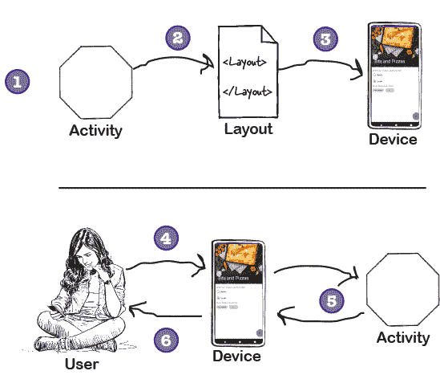

1.  **Android 启动应用程序的主活动。**

1.  **活动指示 Android 使用特定的布局。**

1.  **布局将显示在设备上。**

1.  **用户与布局进行交互。**

1.  **活动响应这些交互，并更新显示…**

1.  **…用户在设备上看到的内容。**

现在您已经了解了 Android 应用程序的构建方式，让我们继续构建一个基本的 Android 应用程序。

# 这是我们将要做的事情

现在让我们深入了解并创建一个 Android 应用程序。我们只需要完成以下几个步骤：

1.  **设置开发环境。**

    我们需要安装 Android Studio，它包含了开发 Android 应用程序所需的所有工具。

1.  **构建一个基本的应用程序。**

    我们将使用 Android Studio 构建一个简单的应用程序，在屏幕上显示一些示例文本。

1.  **运行应用程序。**

    我们将在物理设备和虚拟设备上运行应用程序，以便查看其运行情况。

1.  **更改应用程序。**

    最后，我们将调整所创建的应用程序，并再次运行它。

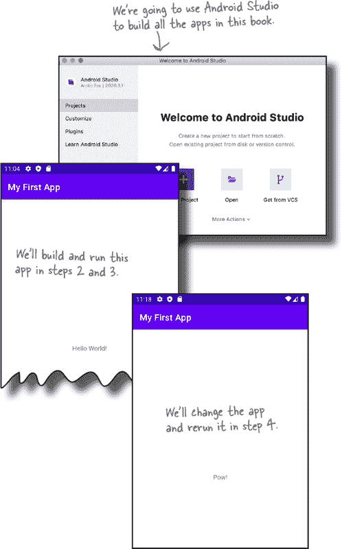

# Android Studio：您的开发环境

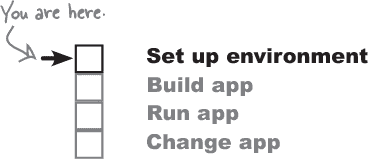

开发 Android 应用程序的最佳方法是使用**Android Studio**，这是官方的 Android 应用程序开发 IDE。

Android Studio 基于您可能已经熟悉的 IntelliJ IDEA。它包括一组代码编辑器、UI 工具和模板，所有这些都旨在使您在 Android 开发中更加轻松。

它还包括**Android SDK**（Android 软件开发工具包），这是所有 Android 应用程序开发所必需的。Android SDK 包括 Android 源文件和一个用于将您的代码编译成 Android 格式的编译器。

这是 Android SDK 的一些主要组件：

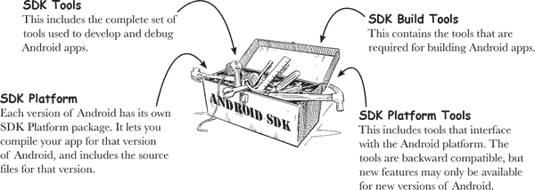

## 您需要安装 Android Studio

由于 Android Studio 包含了开发 Android 应用程序所需的所有工具和功能，因此我们将使用它来构建本书中所有展示的应用程序。

在继续之前，**您需要在计算机上安装 Android Studio**。关于如何进行安装的详细信息，请参阅下一页。

# 安装 Android Studio

为了从本书中获得最大的收益，您需要安装 Android Studio。我们在这里没有包括完整的安装说明，因为这些信息可能会很快过时，但如果您按照在线说明操作，应该没有问题。

首先，请查看 Android Studio 的系统要求：

[`developer.android.com/studio#Requirements`](https://developer.android.com/studio#Requirements)

###### 注意

这些网址有时会变动。如果不能访问，请搜索 Android Studio，您应该能找到合适的页面。

然后从这里下载 Android Studio：

[`developer.android.com/studio`](https://developer.android.com/studio)

###### 注意

这些网址有时会变动。如果不能访问，请搜索 Android Studio，您应该能找到合适的页面。

并按照安装说明进行操作

安装完 Android Studio 后，打开它并按照说明添加最新的 SDK 工具和支持库。

> **在本书中，我们使用的是 Android Studio 2020.3.1（称为北极狐）。请确保至少安装此版本。**

**如果您之前安装过早期版本的 Android Studio，我们建议您恢复 IDE 的默认设置。** 要执行此操作，请转到“文件”菜单，选择“管理 IDE 设置”，然后选择“恢复默认设置”选项。

###### 注意

这将重置 Android Studio 可能保留的任何旧设置，这可能会阻止您的代码运行。

完成后，您应该会看到类似这样的 Android Studio 欢迎屏幕：

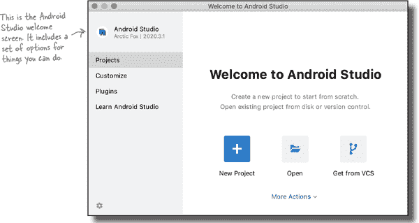

# 让我们构建一个基本的应用程序。

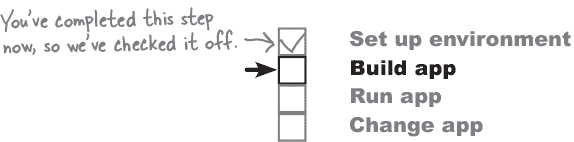

现在您已设置好开发环境，可以开始创建您的第一个 Android 应用程序了。以下是它的外观：

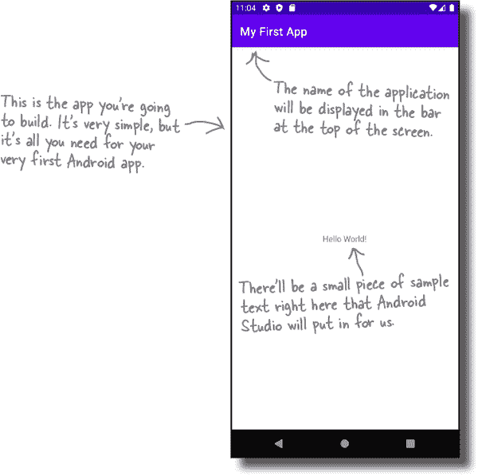

让我们继续构建应用程序。

# 如何构建应用程序

每当您创建新应用程序时，都需要为其创建一个新项目。确保您已打开 Android Studio，并按照我们的说明进行操作。

## 1\. 创建新项目

Android Studio 的欢迎屏幕提供了多个选项。我们希望创建一个新项目，因此请确保选择了“项目”选项，然后点击“新建项目”。

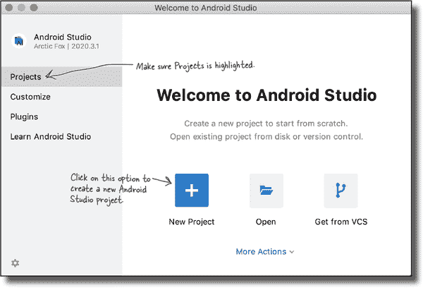

## 2\. 选择项目模板

接下来，您需要指定要创建的 Android Studio 项目的类型。我们将创建一个在手机或平板电脑上运行的空活动应用程序，因此请确保选择了“手机和平板电脑”选项，并选择“空活动”选项。稍后的几页将介绍“空活动”选项的更多信息，但现在请点击“下一步”按钮进入下一步。

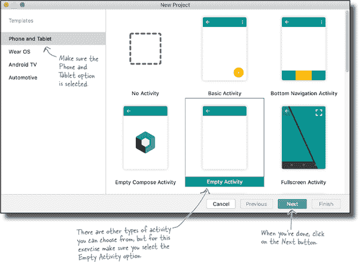

## 3\. 配置您的项目

现在，您需要通过指定应用程序名称、包名称和保存位置来配置项目。输入“我的第一个应用程序”作为名称，输入“com.hfad.myfirstapp”作为包名称，并接受默认保存位置。

您还需要告诉 Android Studio 您要使用哪种编程语言，并指定一个最低 SDK 版本。这指的是应用程序将支持的 Android 最低版本：关于 SDK 级别的更多信息请参阅下一页。

选择 Kotlin 作为语言，并选择 API 21 作为最低 SDK 版本，以便应用程序在大多数设备上运行。点击“完成”按钮后，Android Studio 将创建项目。我们将在接下来的几页中看看这背后的内容。

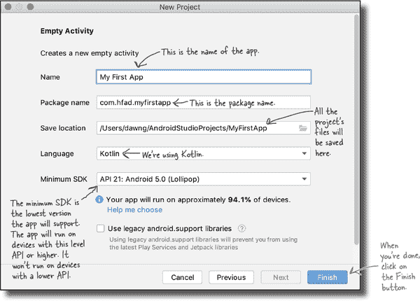

# 您已创建了您的第一个 Android 项目

完成新项目向导后，Android Studio 需要大约一分钟来创建项目。在此期间，它执行以下操作：

+    **它根据您的规格配置项目。**

    Android Studio 查看您希望应用程序支持的最低 SDK，并包含所需的所有文件和文件夹以生成基本的有效应用程序。它还设置包结构并命名应用程序。

+    **它添加了一些模板代码。**

    模板代码包括使用 XML 编写的布局和使用 Kotlin 编写的活动。在本章的后续部分将详细介绍这些内容。

当 Android Studio 完成项目创建后，它会自动为您打开该项目。

这是我们项目的外观（如果看起来复杂，不要担心——我们将在接下来的几页中逐步分解它）：

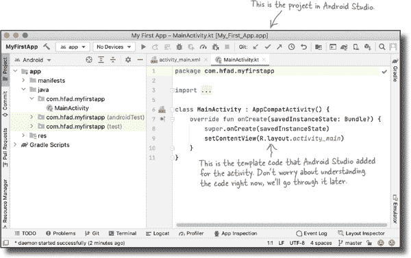

# 解剖你的新项目

Android 应用程序实际上只是位于特定文件夹结构中的一堆有效文件，当您创建新应用程序时，Android Studio 会为您设置所有这些内容。查看这个文件夹结构最简单的方法是使用 Android Studio 最左侧列中的资源管理器。

## 文件夹结构包括不同类型的文件

资源管理器包含当前打开的所有项目。这里，我们只有一个名为 MyFirstApp 的项目，这是我们刚刚创建的项目。

如果您浏览资源管理器中的各种文件夹，您会看到向您创建了各种类型的文件和文件夹，例如：

+    **Kotlin 和 XML 源文件**

    Android Studio 自动创建了一个名为 *MainActivity.kt* 的活动文件和一个名为 *activity_main.xml* 的布局。

+    **资源文件**

    这些文件包括默认的图像文件、应用程序可能使用的主题以及应用程序使用的任何常见`String`值。

+    **Android 库**

    在向导中，您指定了希望应用程序兼容的最低 SDK 版本。Android Studio 确保应用程序包含该版本的相关 Android 库。

+    **配置文件**

    配置文件告诉 Android 应用程序包含什么内容以及应用程序应如何运行。

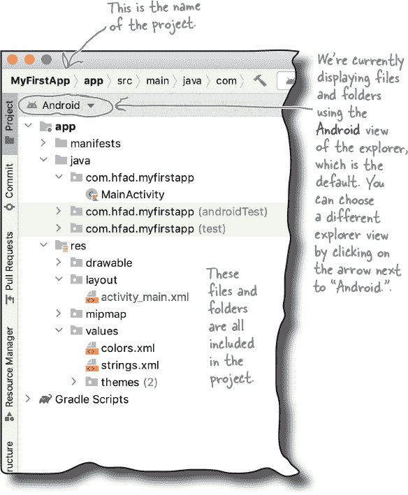

让我们仔细看看项目中一些关键的文件和文件夹。

# 介绍项目中的关键文件

Android Studio 项目使用 Gradle 构建系统来编译和部署应用程序，Gradle 项目具有标准结构。以下是您将要使用的该结构中的一些关键文件和文件夹。

要查看此文件夹结构视图，请在 Android Studio 的资源管理器中将视图从 Android 更改为 项目。方法是单击资源管理器窗格顶部的箭头，然后选择项目选项。

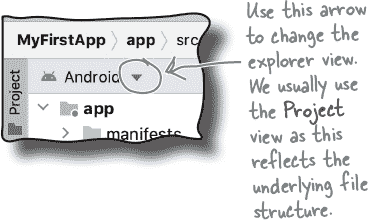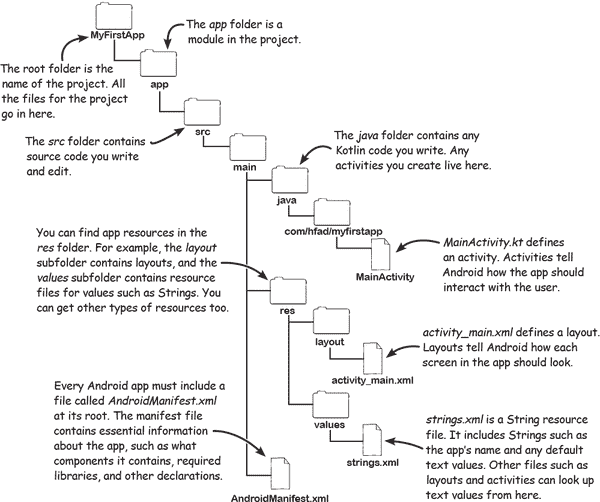

# 使用 Android Studio 编辑器编辑代码

使用 Android Studio 编辑器查看和编辑文件。双击要处理的文件，文件内容将显示在 Android Studio 窗口的中间位置。

## 代码编辑器

大多数文件显示在代码编辑器中，它类似于文本编辑器，但具有额外的功能，如语法高亮和代码检查。

## 设计编辑器

如果您正在编辑布局（例如*activity_main.xml*），您有另外一个选择。与其编辑代码，您可以使用设计编辑器，它允许您将 GUI 组件拖放到布局中，并按您的意愿排列它们。代码编辑器和设计编辑器展示了同一文件的不同视图，因此您可以在两者之间切换。

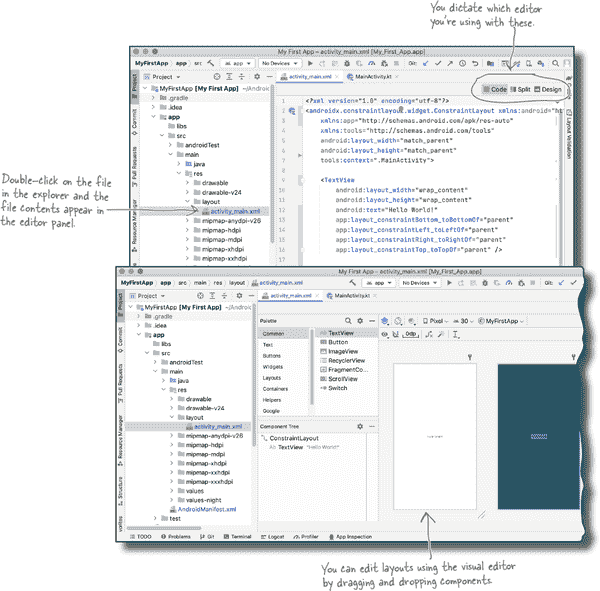

# 到目前为止的故事

到目前为止，我们已经完成了两件事：

1.  **我们设置了开发环境。**

    我们正在使用 Android Studio 开发 Android 应用程序，因此您需要在计算机上安装它。

1.  **我们已经构建了一个基本的应用程序。**

    我们使用 Android Studio 创建了一个新的 Android 项目。

您已经在 Android Studio 中看到了应用程序的样子，并对它的运行方式有了一定了解。但是您*真正*想要的是看到它运行起来，对吧？

Android Studio 允许您以两种方式运行应用程序：在物理 Android 设备上和在虚拟设备上。我们将在接下来的几页中展示每种方法。

# 如何在物理设备上运行应用程序

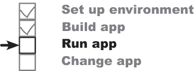

如果您使用的是运行 Lollipop 或更高版本的 Android 设备，则可以使用它来运行我们刚刚创建的应用程序。

###### 注意

您可以通过查看设备设置中的 Android 版本来检查此问题。Lollipop 是版本 5.0，因此需要达到或高于 5.0 版本。

运行应用程序在物理设备上的步骤如下：

## 1\. 在您的设备上启用 USB 调试

要允许 Android Studio 在您的设备上运行应用程序，您需要启用 USB 调试。此功能在“开发者选项”设置中可用，默认情况下处于禁用状态。

在您的设备上，转到设置 → 关于手机，点击版本号七次。这将启用开发者选项。然后，转到设置 → 系统 → 高级 → 开发者选项，并启用 USB 调试。

###### 注意

是的，说真的。

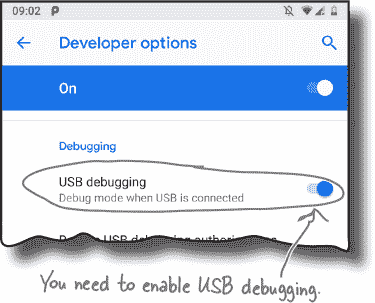

## 2\. 配置计算机以检测设备

如果您使用的是 Mac，您可以跳过此步骤。

如果您使用的是 Windows，如果尚未安装 USB 驱动程序，则需要安装一个 USB 驱动程序。最新的说明在这里：

*[`developer.android.com/studio/run/oem-usb`](https://developer.android.com/studio/run/oem-usb)*

如果您使用的是 Ubuntu Linux，您需要创建一个`udev`规则文件。如何执行此操作的最新说明在这里：

*[`developer.android.com/studio/run/device#setting-up`](https://developer.android.com/studio/run/device#setting-up)*

## 3\. 使用 USB 电缆将您的设备连接到计算机

您可能会被要求是否允许 USB 调试。如果是，请选中“始终允许此计算机”，然后选择“确定”。

> **创建应用程序时，我们指定了最低 API 级别为 21（Lollipop）。您的设备需要 Android 版本达到或高于此才能运行该应用程序。**

## 4\. 运行应用程序

最后，在 Android Studio 顶部工具栏的设备列表中选择设备（如果不存在，请在您的设备上转到“设置”→“连接的设备”，选择 USB，并选择“文件传输”选项）。然后通过在“运行”菜单中选择“运行应用程序”来运行应用程序。Android Studio 将构建项目，安装应用程序到您的设备上，并启动它。

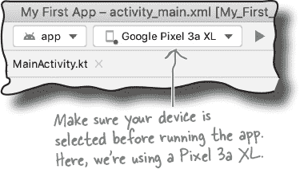

我们会在前几页查看应用程序，之后我们会看到如何在虚拟设备上运行它。

# 如何在虚拟设备上运行应用程序

如果您手头没有 Android 设备，或者它没有正确版本的 Android，则可以在虚拟设备上运行应用程序。在虚拟设备上运行应用程序对于想要查看其外观在自己不拥有的设备类型上或测试其在不同 Android 版本上行为的用户很有用。

Android SDK 提供了一个内置的模拟器，您可以使用它来设置一个或多个 **Android 虚拟设备**（AVD）。一旦您设置了 AVD，您就可以在其上运行应用程序，就像它在物理设备上运行一样。

###### 注意

您可以在此处找到使用模拟器的系统要求：[`developer.android.com/studio/run/emulator#requirements`](https://developer.android.com/studio/run/emulator#requirements)

模拟器重新创建 Android 设备的精确硬件环境：从其 CPU 和内存到声音芯片和视频显示器。模拟器建立在一个现有的名为 QEMU（发音为“queue em you”）的模拟器上，类似于您可能使用过的其他虚拟机应用程序，如 VirtualBox 或 VMWare。

AVD 的确切外观和行为取决于您如何设置它。例如，如果您创建一个基于运行 Android 11 的 Pixel 3 的 AVD，它将看起来和行为就像在您的计算机上运行此版本 Android 的 Pixel 3 一样。

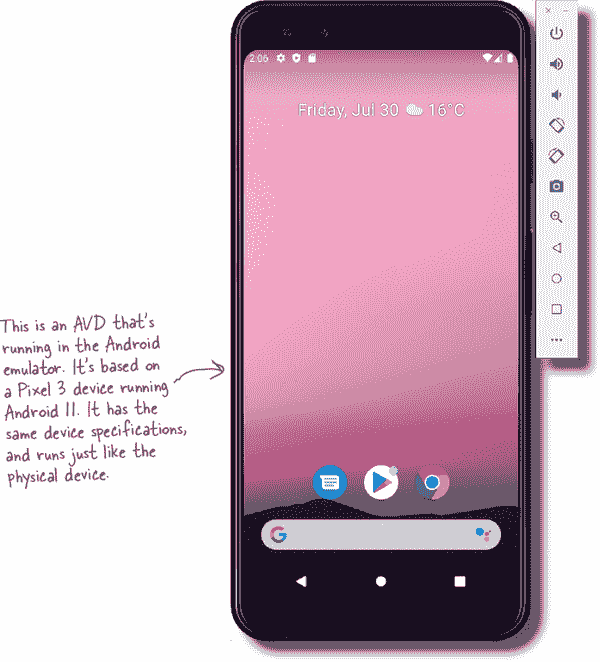

让我们设置一个 AVD，这样你就可以在模拟器中看到应用程序运行的情况。

# 创建 Android 虚拟设备（AVD）

在 Android Studio 中设置 AVD 需要经历几个步骤。我们将设置一个运行 API 级别 30（Android 11）的 Pixel 3 AVD，这样您就可以看到应用程序在此类设备上运行的外观和行为。无论您想设置何种类型的虚拟设备，这些步骤基本相同。

## 打开 Android 虚拟设备管理器

AVD 管理器允许您设置新的 AVD，并查看和编辑您已创建的 AVD。通过在工具菜单中选择 AVD 管理器来打开它。

如果您还没有设置 AVD，则会看到一个屏幕提示您创建一个。点击“创建虚拟设备”按钮。

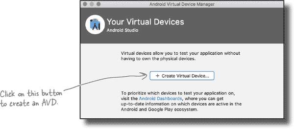

## 选择硬件

在下一个屏幕上，您将被提示选择设备定义。这是您的 AVD 将模拟的设备类型。您可以选择各种手机、平板电脑、穿戴设备或电视设备。

我们将看到应用程序在 Pixel 3 手机上运行的外观。从类别菜单中选择手机，并从列表中选择 Pixel 3。然后点击“下一步”。

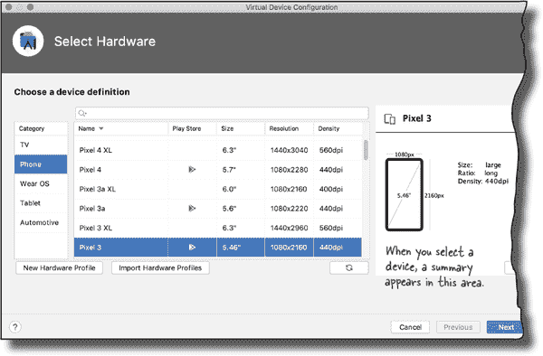

## 选择系统镜像

接下来，您需要选择一个系统镜像。这指定了您希望在 AVD 上运行的 Android 版本。

你需要选择一个与你正在构建的应用兼容的 Android 版本。它必须*至少*是应用支持的最低 SDK 版本。

当你创建 Android 项目时，你指定了最低 SDK 版本是 API 等级 21。这意味着你需要选择一个适用于 API 等级 21（棒棒糖）或更高版本的系统镜像。如果你选择的是比这更旧的 Android 版本，应用将无法在设备上运行。

在这里，我们将看到应用程序在一个相对新的 Android 版本上的外观，因此选择带有版本名称 R 和目标为 Android 11.0（API 等级 30）的系统镜像。然后点击“下一步”。

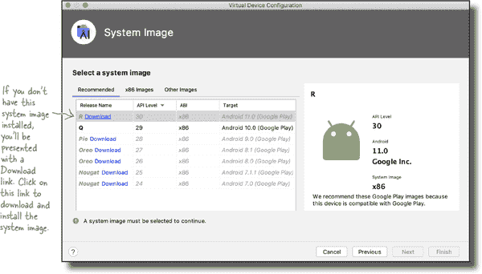

## 验证 AVD 配置

在下一个屏幕上，您将被要求验证配置。此屏幕总结了您在过去几个屏幕上选择的选项，并给您更改它们的选项。接受这些选项，并单击“完成”按钮。

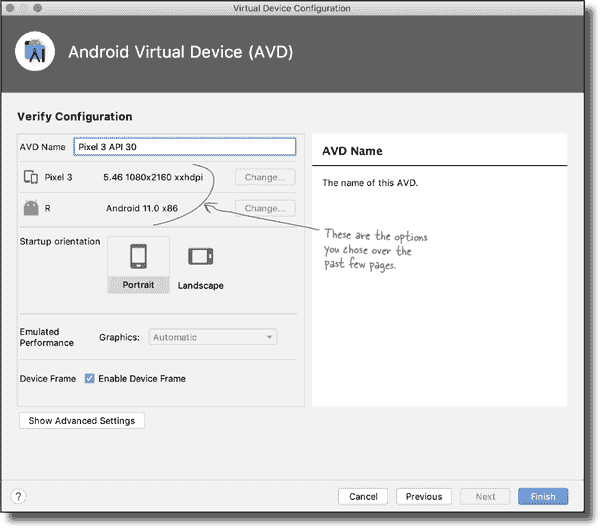

## 虚拟设备正在创建中

单击“完成”按钮时，设备管理器会为您创建虚拟设备，并在 AVD 管理器的虚拟设备列表中显示如下：

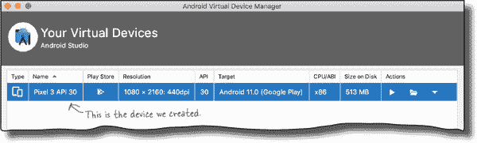

检查新的 AVD 是否已列出，然后关闭 AVD 管理器。

## 在 AVD 上运行应用程序

一旦创建了 AVD，您可以在其上运行应用程序。

要运行应用程序，请确保在 Android Studio 顶部工具栏的设备列表中选择了虚拟设备，然后通过选择“Run ‘app’”命令从运行菜单运行应用程序。

AVD 可能需要一些时间来加载，因此在等待时，让我们看看在使用“Run”命令时背后发生了什么。

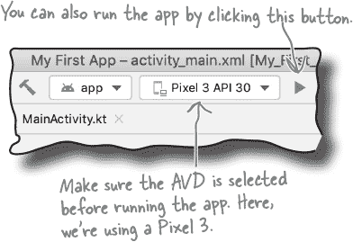

# 编译，打包，部署，运行

“Run”命令不仅运行您的应用程序，还处理所有必要的预备任务，使应用程序能够运行。

这里是发生的概述：

> **APK 文件是 Android 应用程序包。它就像 Android 应用程序的 ZIP 或 JAR 文件。**

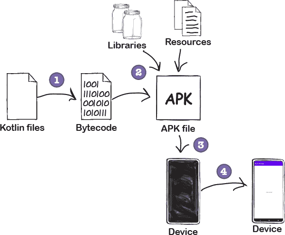

1.  **Kotlin 源文件会被编译成字节码。**

1.  **一个 Android 应用程序包（APK）被创建。**

    APK 文件包括编译的 Kotlin 文件，以及应用程序所需的任何库和资源。

1.  **APK 已安装到设备上。**

    如果设备是虚拟的，Android Studio 将启动模拟器，并等待 AVD 激活后再安装 APK。

    如果设备是物理设备，它只是安装 APK。

1.  **设备启动应用程序的主活动。**

    应用程序显示在设备屏幕上，并准备好供您使用。

现在您知道在使用“Run”命令时会发生什么了，让我们看看我们构建的应用程序的外观。

#  测试驾驶

确保通过从运行菜单中选择“运行‘应用程序’”命令在物理或虚拟设备上运行应用程序。

Android Studio 将应用程序加载到设备上并启动它。屏幕顶部显示应用程序名称“My First App”，中心显示文本“Hello World!”。

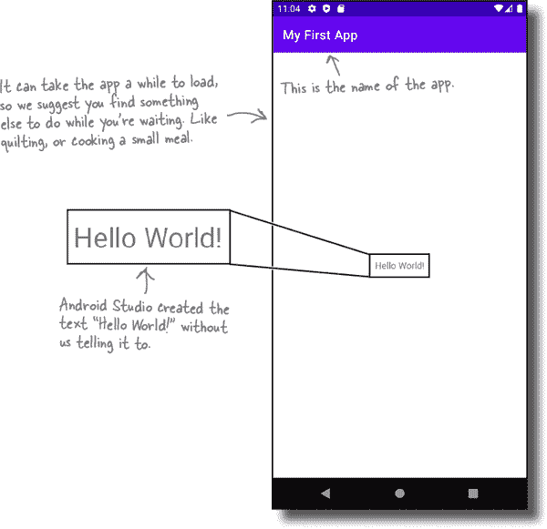

让我们回顾刚才发生的事情。

# 刚才发生了什么？

让我们分解运行应用程序时发生的事情：

1.  **Android Studio 将应用程序安装在设备上。**

    如果设备是虚拟的，在安装应用程序之前会等待模拟器启动。

    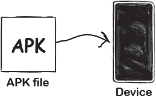

1.  **Android 启动应用程序的主活动。**

    它使用*MainActivity.kt*中的代码（Android Studio 自动包含在项目中）来创建一个`MainActivity`对象。

    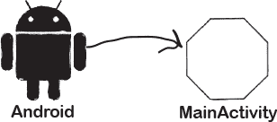

1.  **MainActivity 指定使用布局 activity_main.xml。**

    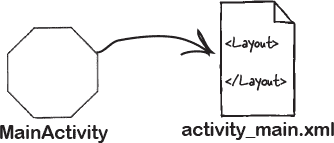

1.  **布局显示在屏幕上。**

    文本“Hello World!”显示在屏幕中央。

    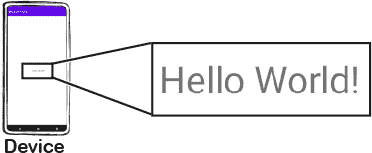

# 让我们优化应用程序

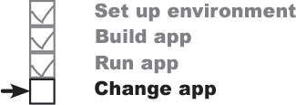

到目前为止，在本章中，您已经构建了一个基本的 Android 应用程序，并在物理或虚拟设备上看到它运行。接下来，我们将对应用程序进行优化。

目前，应用程序显示向导放置的示例文本“Hello World!”作为占位符。您将更改该文本以显示其他内容。那么我们需要更改什么才能实现这一点呢？

要回答这个问题，让我们退一步看看应用程序当前是如何构建的。

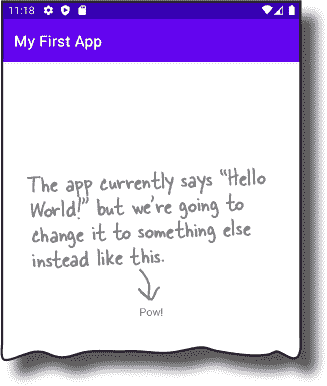

## 应用程序有一个活动和一个布局

当我们构建应用程序时，我们告诉 Android Studio 如何配置它，向导完成了其余工作。向导为我们创建了一个活动，还创建了一个默认布局。

## 活动控制应用程序的功能

Android Studio 为我们创建了一个名为*MainActivity.kt*的活动。该活动指定了应用程序**的功能**以及如何响应用户。

## 布局控制应用程序的外观

*MainActivity.kt*使用 Android Studio 为我们创建的名为*activity_main.xml*的布局。布局指定了应用程序**的外观**。

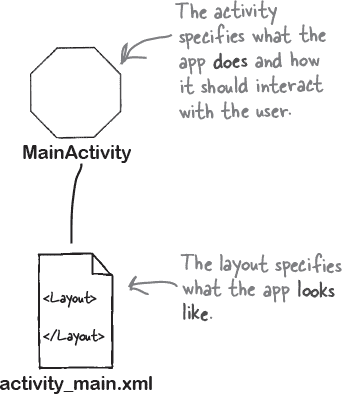

我们希望通过更新显示的文本来更改应用程序的外观。这意味着我们需要更新控制应用程序外观的文件，因此我们需要更仔细地查看*布局*。

# 布局中有什么？

我们想要更改 Android Studio 为我们创建的示例“Hello World!”文本，因此让我们从布局文件*activity_main.xml*开始。如果尚未打开，请在资源管理器中的*app/src/main/res/layout*文件夹中找到该文件并双击打开。

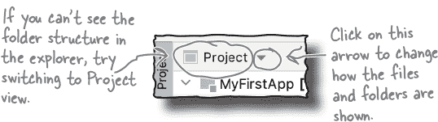

## 设计编辑器

正如您之前了解的，Android Studio 有两种查看和编辑布局文件的方式：通过**设计编辑器**和**代码编辑器**。

当您选择设计选项时，可以看到示例文本“Hello World!”如预期出现在布局中。但底层的 XML 内容是什么呢？

让我们切换到代码编辑器看看。

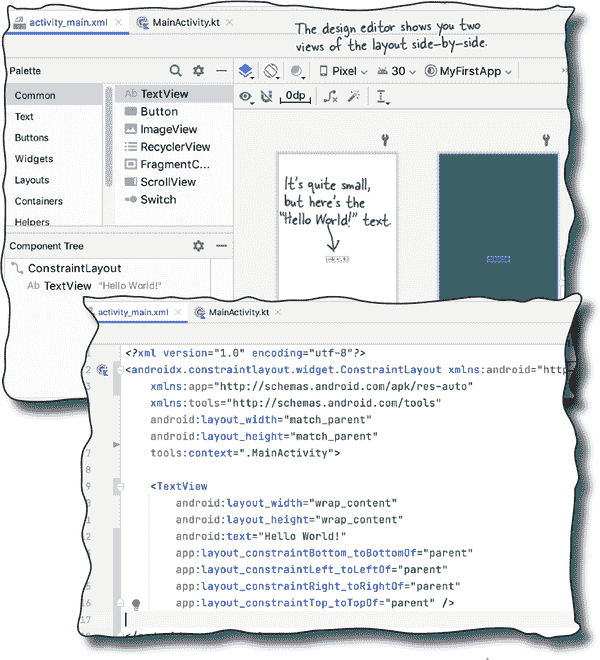

## 代码编辑器

点击编辑器顶部的“Code”选项切换到代码编辑器。这将显示布局的底层 XML。

让我们仔细看看代码。

# activity_main.xml 包含两个元素

下面是 Android Studio 为我们生成的 *activity_main.xml* 代码。我们略去了一些你现在不需要考虑的细节；这些将在本书的后续部分详细介绍。

这是代码：

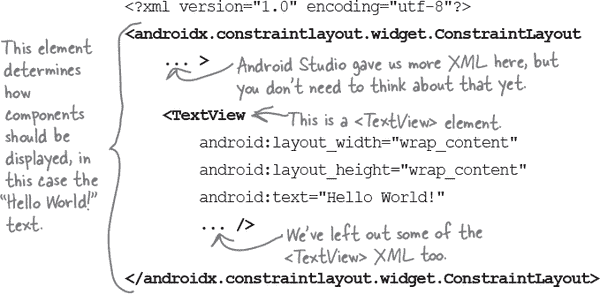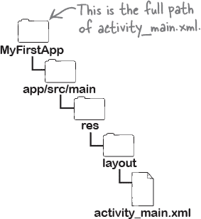

正如你所见，代码包含两个元素。

第一个是 `<...ConstraintLayout>` 元素。这是一种布局元素类型，告诉 Android 如何在设备屏幕上显示组件。您可以使用各种类型的布局，后面的章节将详细介绍这些内容。

目前最重要的元素是第二个元素，即 `<TextView>`。此元素用于向用户显示文本，在本例中显示的是文本 “Hello World!”

`<TextView>` 元素中的关键部分是以 `android:text` 开头的行。这是描述应显示的文本的 `text` 属性：

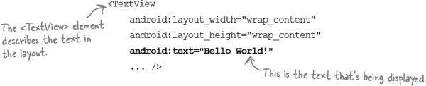

在你完成以下练习后，我们将把文本更改为其他内容。

# 更新布局中显示的文本

我们想要更改 *activity_main.xml* 中的文本，以便在运行应用程序时显示除 “Hello World!” 以外的其他内容。我们可以通过更改布局中 `<TextView>` 元素的 `text` 属性来实现这一点：

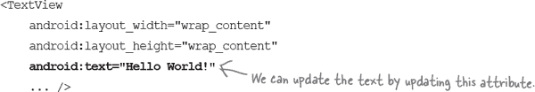

`text` 属性在 `<TextView>` 元素内部使用 `android:text` 代码进行定义。它指定了应显示的文本内容，在本例中是 “Hello World!”

要更新布局中显示的文本，只需将 `<TextView>` 元素的 `text` 属性值从 `"Hello World!"` 更改为其他文本，例如 `"Pow!"`。新的 `<TextView>` 元素的代码应如下所示：

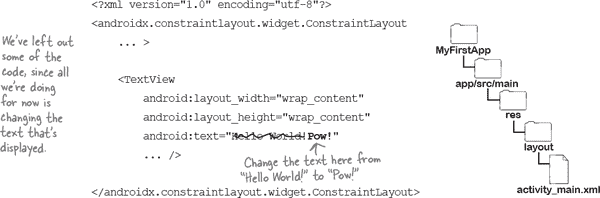

这是更新文本所需的唯一更改。让我们看看代码运行时会发生什么。

# 代码的功能

在进行应用程序测试之前，让我们先了解一下代码的功能。

1.  **Android 使用 MainActivity.kt 创建 MainActivity 活动对象。**

    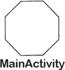

1.  **MainActivity 指定使用布局 activity_main.xml。**

    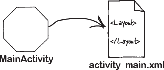

1.  **布局在设备上的中心显示文本 “Pow!”。**

    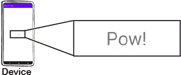

#  测试驾驶

编辑完文件后，尝试再次在模拟器中运行应用程序，方法是从运行菜单中选择“运行‘app’”命令，或者点击运行按钮。您应该看到应用程序现在显示“Pow！”而不是“Hello World！”

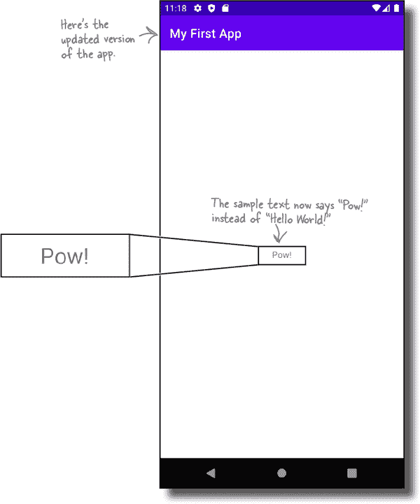

恭喜！您现在已经构建并更新了您的第一个应用程序，并在此过程中了解了 Android 应用程序是如何组合在一起的。在下一章中，我们将进一步构建一个您可以与之交互的应用程序。

# 您的 Android 工具箱

**您已经掌握了第一章，现在您已经将 Android 基本概念添加到您的工具箱中。**

