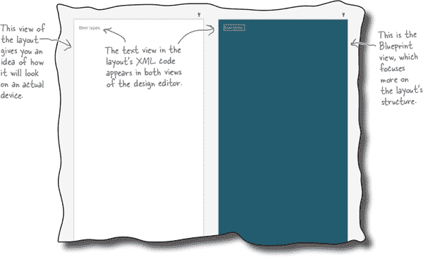
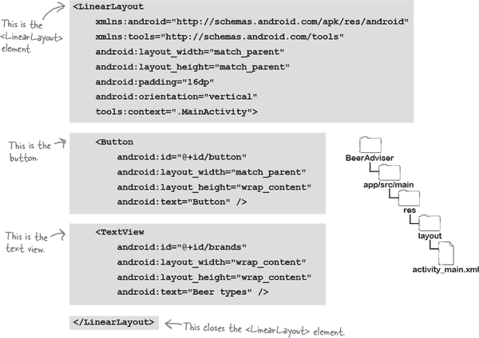
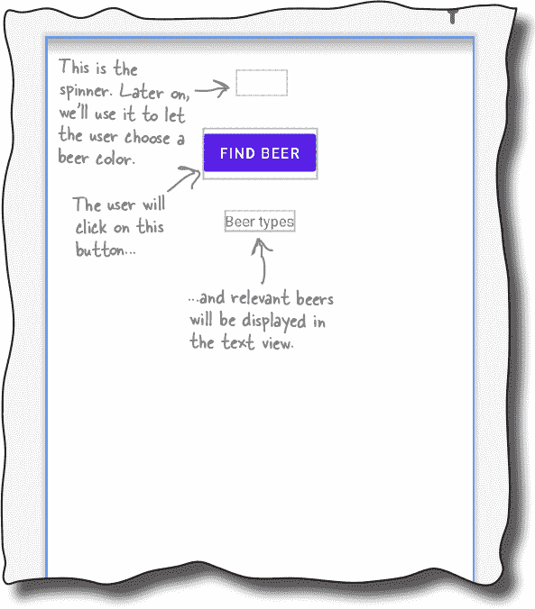
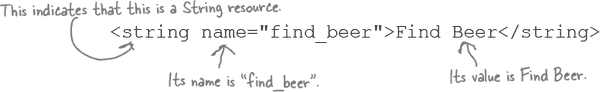
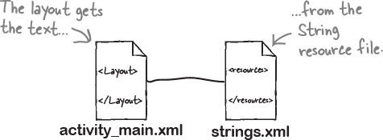
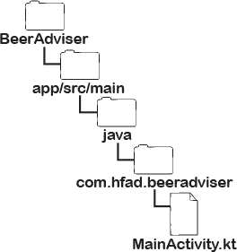
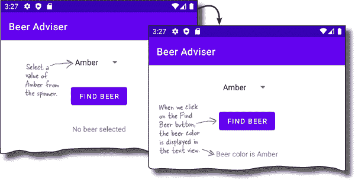
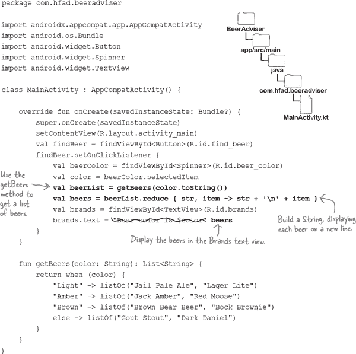

# 第二章：构建交互式应用程序：*做一些事情的应用程序*


**大多数应用程序需要以某种方式响应用户。**

在本章中，您将看到如何使您的应用程序**更具交互性**。您将了解如何向活动代码添加***OnClickListener***，以便您的应用程序**监听用户的操作**，并做出适当的响应。您将更多了解**如何设计布局**，并了解您添加到布局的每个 UI 组件是如何派生自**一个共同的 View 祖先**。在此过程中，您将发现**为什么字符串资源对于灵活、设计良好的应用程序如此重要**。

# 让我们构建一个 Beer Adviser 应用程序

当您创建 Android 应用程序时，通常希望它*做*一些事情。

在本章中，我们将向您展示如何创建用户可以与之交互的应用程序。我们将创建一个 Beer Adviser 应用程序，用户可以选择他们最喜欢的啤酒颜色，点击按钮，然后获得一系列值得尝试的美味啤酒。


这是应用程序的结构：

1.  **布局 activity_main.xml 指定应用程序的外观。**

    它包括三个 UI 组件：

    +   一个名为 spinner 的值下拉列表，允许用户选择他们想要的啤酒颜色

    +   一个按钮，当点击时，将返回一系列啤酒

    +   一个显示啤酒的文本视图

1.  **文件 strings.xml 包含布局所需的任何字符串资源。**

    例如，按钮的标签和啤酒颜色。

1.  **活动 MainActivity 指定应用程序应如何与用户交互。**

    它获取用户选择的啤酒颜色，并使用此信息显示用户可能感兴趣的啤酒列表。

# 这是我们要做的事情

让我们开始工作吧。构建 Beer Adviser 应用程序需要您经历一些步骤（我们将在本章的其余部分解决这些问题）：

1.  **创建一个项目。**

    您正在创建一个全新的应用程序，因此您需要创建一个包含空活动和布局的新项目。

    

1.  **更新布局。**

    一旦您设置好项目，您需要修改布局，以便包含应用程序所需的所有 UI 组件。

    

1.  **添加字符串资源。**

    我们将用`String`资源替换任何硬编码文本，以便应用程序使用的所有文本都保存在单个文件中。

    

1.  **使按钮响应点击。**

    布局仅指定视觉效果。要使按钮在点击时*执行*某些操作，您需要编写一些活动代码。

    

1.  **编写应用程序逻辑。**

    您将向活动添加一个新方法，并使用它确保用户根据其选择获得正确的啤酒。

让我们从创建项目开始。

# 创建项目


创建新项目的步骤几乎与我们在上一章中使用的步骤相同：

1.  打开 Android Studio，关闭任何已打开的项目，并从欢迎屏幕选择“新建项目”。这将启动你在第一章中看到的向导。

1.  确保选择了“手机和平板”选项，并选择“空活动”选项。

1.  输入“Beer Adviser”作为名称，包名称为“com.hfad.beeradviser”，并接受默认保存位置。确保语言设置为 Kotlin，并且最低 SDK 为 API 21，这样可以在大多数 Android 设备上运行。然后点击完成按钮。


# 我们已创建了一个默认的活动和布局


当你点击完成按钮时，Android Studio 将创建一个新项目，包含名为 *MainActivity.kt* 的活动和名为 *activity_main.xml* 的布局，就像我们在第一章创建的项目一样。我们需要修改这些文件以使应用程序看起来和行为符合我们的期望。

我们将从更新布局文件 *activity_main.xml* 开始修改应用的外观。我们将在接下来的几页逐步构建布局，但现在，请切换到 Android Studio 资源管理器的项目视图，进入 *app/src/main/res/layout* 文件夹，打开 *activity_main.xml* 文件。然后切换到代码编辑器，并**用以下内容替换** *activity_main.xml* 中的整个代码：


上面的代码包含一个线性布局（由 `<LinearLayout>` 元素表示）和一个文本视图（由 `<TextView>` 元素表示）。稍后你会了解更多关于这些元素的信息，但现在你只需知道线性布局用于在垂直列中排列 UI 组件，而文本视图显示的文本是“Beer types”。

对布局的 XML 所做的任何更改都会反映在设计编辑器中。现在通过点击编辑器窗格顶部的“设计”选项切换到该视图。


# 更详细查看设计编辑器

正如你在第一章学到的，设计编辑器为你提供了一种比编辑 XML 更直观的方式来编辑布局代码。它展示了布局设计的两种不同视图。一种显示布局在实际设备上的外观，另一种显示其结构的蓝图：



设计编辑器的左侧是一个包含可拖动到布局中的组件的调色板。你将在下一页使用它来向布局添加按钮，在本章后面将用它来更新应用中显示的文本。


# 使用设计编辑器添加按钮

要向布局中添加按钮，请在工具栏中找到按钮组件，点击它，然后将其拖到设计编辑器中，使其位于文本视图上方。按钮将出现在布局的设计中：


## 设计编辑器中的更改会反映在 XML 中

拖动 UI 组件到布局中像这样是更新布局的一种便捷方式。如果您切换到代码编辑器，您会看到通过设计编辑器添加按钮已经向底层 XML 添加了更多代码：


# activity_main.xml 中有一个新的按钮

正如您刚刚看到的，设计编辑器已经向 *activity_main.xml* 添加了一个新的 `<Button>` 元素。其代码如下：

```
<Button
    android:id="@+id/button"
    android:layout_width="match_parent"
    android:layout_height="wrap_content"
    android:text="Button" />
```

Androidville 中的按钮是用户可以点击以触发操作的 UI 组件。`<Button>` 元素包括控制其大小和外观的属性。这些属性并不只属于按钮——其他如文本视图的 UI 组件也有它们。

## 按钮和文本视图都是 Android View 类的子类

按钮和文本视图之间具有共同属性的一个很好的原因是它们都继承自相同的 Android **View** 类。在本书中您会进一步了解更多，但现在，这里是一些最常见的属性：

### android:id

这给组件一个标识名称，以便活动代码可以访问它并控制其行为：

```
    android:id="@+id/button"
```

### android:layout_width, android:layout_height

这些属性指定了组件的宽度和高度。`"wrap_content"` 表示它应该只大到足够容纳内容，`"match_parent"` 表示它应该与包含它的布局一样宽：

```
    android:layout_width="match_parent"
    android:layout_height="wrap_content"
```

### android:text

这告诉 Android 应该显示什么文本作为组件，比如出现在按钮上的文本：

```
    android:text="Button"
```


# 更仔细查看布局代码

让我们更仔细地查看布局代码，并将其分解，以便您可以看到它实际上在做什么（如果您的代码看起来有些不同，不要担心，只需跟着操作即可）：



## `<LinearLayout>` 元素

布局代码中的第一个元素是 `<LinearLayout>`。此元素告诉 Android 布局中的不同 UI 组件应该在单行或单列中依次显示。

您可以使用 `android:orientation` 属性来指定方向。在这个例子中，我们使用的是：

```
android:orientation="vertical"
```

因此，UI 组件显示在单个垂直列中。

`<LinearLayout>` 元素（在前一页中）包含两个进一步的元素：一个 `<Button>` 和一个 `<TextView>`。

## `<Button>` 元素

第一个元素是 `<Button>`：

```
...
<Button
    android:id="@+id/button"
    android:layout_width="match_parent"
    android:layout_height="wrap_content"
    android:text="Button" />
...
```

> **使用线性布局意味着 UI 组件显示在垂直列或水平行中。**

由于这是 `<LinearLayout>` 中的第一个元素，它在布局中首先显示（在屏幕顶部）。它的 `layout_width` 是 `"match_parent"`，使其宽度与其父元素 `<LinearLayout>` 一样宽。它的 `layout_height` 是 `"wrap_content"`，这意味着它应该只足够高以显示其文本内容。

## `<TextView>` 元素

`<LinearLayout>` 中的最后一个元素是 `<TextView>`：

```
...
<TextView
    android:id="@+id/brands"
    android:layout_width="wrap_content"
    android:layout_height="wrap_content"
    android:text="Beer types" />
...
```


由于这是第二个元素，并且我们将`<LinearLayout>`元素的方向设置为`"vertical"`，它显示在按钮（第一个元素）的下方。它的`layout_width`和`layout_height`属性都设置为`"wrap_content"`，以便它只占用足够的空间来容纳其文本。

您已经看到将组件添加到设计编辑器会将它们添加到布局 XML 中。相反，对布局 XML 进行的任何更改也会应用到设计中。让我们看看这个过程。

# 让我们更新布局 XML

我们将通过添加一个新的**旋转器**组件来更新布局，并微调已经存在的按钮和文本视图组件。旋转器是一个值的下拉列表。当您点击它时，它会展开以显示列表，这样您就可以选择一个单一的值。

使用以下更改更新*activity_main.xml*代码（用**粗体**标出）：


# 设计编辑器中反映了 XML 的更改

一旦您更改了布局 XML，切换到设计编辑器。设计编辑器现在显示一个水平居中的单列，其中包含一个旋转器、按钮和文本视图，而不是显示一个按钮下面有一个文本视图的布局，就像这样：



> **旋转器提供一个值的下拉列表。它允许您从一组值中选择一个单一的值。**
> 
> **您添加到布局文件中的所有 UI 组件（如按钮、旋转器和文本视图）使用相同或类似的属性，因为它们都是 View 类型。在幕后，它们都继承自相同的 Android View 类。**

###### 注意

这些 UI 组件通常被称为**视图**，因为它们都继承自相同的 View 类。

我们现在已经向*activity_main.xml*添加了 Beer Adviser 应用程序布局所需的所有组件。我们还有更多工作要做，但让我们先测试一下应用程序，看看它在设备上的效果。

#  测试驱动

通过从运行菜单中选择“运行‘app’”命令或单击运行按钮来运行应用程序，并耐心等待应用程序加载。

当应用程序出现在您的设备上时，请注意它以单列显示一个空的旋转器、按钮和文本视图。


# 布局中有警告...


当您在 Android Studio 中开发布局时，IDE 会自动检查您的代码是否有错误，并提醒您可能的改进。查看任何警告或建议的简单方法是切换到布局的设计编辑器视图，并查看组件树面板。该面板通常位于调色板下方，并显示布局中组件的分层树。

如果 Android Studio 有任何改进代码的建议，你会看到相关组件右侧的徽章或图标。例如，在`find_beer`和`brands`组件旁边有警告徽章。如果我们将鼠标悬停在每个徽章上，就能看到有关硬编码文本的警告信息：


## …因为有硬编码文本

当我们定义布局时，我们使用如下的代码来硬编码需要在文本视图和按钮组件中显示的文本：


当你正在学习时，这种方法是可以接受的，但在布局中硬编码文本并不是最佳做法。

假设你已经创建了一个在本地 Google Play 商店非常受欢迎的应用。你不想仅限于一个国家或语言——你希望能够国际化并支持不同的语言。但如果你在布局文件中硬编码了所有的文本，那么将应用推广到全球将会很困难。

这也使得对应用中的文本进行全局更改变得更加困难。想象一下，如果你的老板要求你因为公司更改了名称而修改应用中的措辞。如果你把所有文本都硬编码了，这意味着你可能需要编辑大量文件才能修改文本。

那么，有什么替代方法呢？

# 将文本放入字符串资源文件中

更好的方法是将文本值放入`**String**` **资源文件**中。这样做可以更轻松地对应用中使用的文本进行全局更改。你不再需要在各种不同的活动和布局文件中更改硬编码的文本值，只需编辑资源文件中的文本即可。

这种方法也使得对应用进行本地化变得更加容易。你不再需要在一个语言中硬编码文本，而是可以为每种想要支持的语言提供单独的`String`资源文件。这使得应用可以根据设备的语言环境切换所使用的语言。

## Android Studio 帮助你提取字符串资源

如果你的布局中包含硬编码文本，Android Studio 提供了一种简单的方法来提取文本并将其添加到字符串资源文件中。只需点击（或双击）每个警告你有关硬编码文本的徽章，然后点击“修复”按钮来解决问题。

###### 注意

你可能需要向下滚动才能看到这个按钮。

让我们尝试这个方法来处理布局中的一个组件。确保你正在使用*activity_main.xml*的设计视图，并点击`find_beer`组件旁边的警告徽章。

关于为什么硬编码文本是个问题，你将会看到一个解释。请滚动到这个解释的末尾，然后点击“修复”按钮：


# 提取字符串资源

当你点击“修复”按钮时，“提取资源”窗口会出现。这允许你指定`String`资源的名称、值以及`String`资源文件的名称。确保资源名称为“find_beer”，文件名为“strings.xml”，源集为“main”，并检查值目录。然后点击 OK 按钮。

当你点击 OK 按钮时，Android Studio 会将`find_beer`组件的硬编码文本添加到名为*strings.xml*的`String`资源文件中，并更改布局的 XML 以使用`String`资源。我们将查看这两个更改，首先是`String`资源文件。


## 已将一个 String 资源添加到 strings.xml 中。

*strings.xml*是应用的默认`String`资源文件，当你创建新项目时，Android Studio 会自动为你创建这个文件。现在通过 Android Studio 的资源管理器打开*strings.xml*：你会在*app/src/main/res/values*文件夹中找到*strings.xml*。

文件内容应该类似于这样：


```
<resources>
    <string name="app_name">Beer Adviser</string>
    <string name="find_beer">Find Beer</string>
</resources>
```

上面的代码描述了两个`String`资源，每个资源都是一个名称/值对。第一个资源名为`app_name`，值为“Beer Adviser”，而第二个名为`find_beer`，值为“Find Beer”。第二个资源是我们为`find_beer`组件提取硬编码文本时添加的：



我们将在接下来的几页详细讨论`String`资源，但现在让我们看看对*activity_main.xml*进行了什么更改。

# *activity_main.xml* 使用了字符串资源。

当我们告诉 Android Studio 提取硬编码文本时，Android Studio 会自动更新*activity_main.xml*中的`find_beer`按钮，以便使用提取的`String`资源。

这是按钮的更新代码：


正如你所看到的，`find_beer`按钮的`text`属性已更改为`"@string/find_beer"`。那这意味着什么呢？

让我们从`@string`的第一部分开始。这只是一种告诉 Android 从`String`资源文件中查找文本值的方法。在这里，它就是你之前看到的*strings.xml*文件。



第二部分，`find_beer`，告诉 Android 查找名为`find_beer`的资源的值。所以`"@string/find_beer"` 就像是说“查找名为`find_beer`的`String`资源，并使用相关联的文本值。”


## 你也可以手动提取字符串资源。

现在你已经学会了当你要求 Android Studio 将硬编码文本提取到`String`资源中时，Android Studio 对代码所做的更改。你也可以通过直接更新*strings.xml*和*activity_main.xml*中的代码来进行这些更改。

让我们看看如何通过更改`brands`组件的`text`属性中使用的硬编码文本“Beer types”，使其使用一个`String`资源。

###### 注意

在您自己的项目中，可能只需使用向导。我们向您展示如何手动编辑 XML，因为我们需要确保您创建的代码与我们的代码匹配，并且更新 XML 是实现此目的的最佳方法。

# 添加并使用新的 String 资源

我们将从创建名为`brands`的新`String`资源开始。打开*app/src/main/res/values*文件夹中的*strings.xml*，并添加一个新行以包含此处显示的更改（用**粗体**标出）：


添加了`String`资源后，打开*activity_main.xml*并更新`brands`文本视图的代码，使其使用新资源。更新代码以包含此处显示的更改（用**粗体**标出）：


下一页有关使用`String`资源的摘要。之后，我们将对应用程序进行测试。

#  测试驱动

现在我们已更新布局以使用`String`资源而不是硬编码文本值，让我们运行应用程序看看效果。选择运行菜单中的“Run 'app'”命令，如前所述。

运行应用程序后，按钮和文本视图中显示的文本已更新，以使用我们添加到*strings.xml*的`String`值：


# 向下拉列表框添加值

当前应用程序的布局中包含一个下拉列表框，但是当我们点击它时，它是空的。这是因为我们还没有告诉下拉列表框应显示哪些值。每次在布局代码中使用下拉列表框时，都必须指定相关联的值列表，否则它将不包含任何值，并且 Android Studio 可能会显示警告消息。

你可以像指定按钮或文本视图中显示的文本一样指定下拉列表框的值列表：通过向*strings.xml*添加资源并在布局中引用该资源。但是，你不是在一个`String`资源中指定单个值，而是向*array*资源添加多个`String`，并将此数组用于下拉列表框的值列表。

> **资源是应用程序使用的非代码资产，例如图像或字符串。**

## 添加一个`String`数组资源类似于添加一个 String

正如您已经了解的那样，可以使用以下方式向*strings.xml*添加`String`资源：

```
<string name="string_name">string_value</string>
```

其中`string_name`是`String`的名称，而`string_value`是在应用中显示的值。

要向`String`资源文件添加一个`String`数组，可以使用以下语法：


其中`string_array_name`是数组的名称，而`string_value1`、`string_value2`和`string_value3`是构成数组的各个`String`值。

在此应用中，我们希望添加一个`String`数组资源，数组中的每个项都是一种啤酒颜色。然后，我们将此数组附加到下拉列表框，以便用户单击下拉列表框时显示啤酒颜色。

让我们添加新的`String`数组。

# 向*strings.xml*添加`String`数组

要添加 `String` 数组，请打开 *strings.xml*，并添加以下代码（用粗体标出）。这将添加一个名为 `beer_colors` 的 `string-array` 资源，我们将其附加到 spinner 上：


## 获取 spinner 显示数组的值

布局引用 `String` 数组资源的语法与检索 `String` 资源的值类似。而不是使用：

您可以使用以下语法：


`where array_name` 是数组的名称。

让我们在布局中使用它。转到布局文件 *activity_main.xml*，并像这样为 spinner 添加一个 `entries` 属性（用粗体标出）：


我们将在下一页展示 *activity_main.xml* 的完整代码。

# *activity_main.xml* 的完整代码如下

下面是 *activity_main.xml* 的全部代码。确保此文件的代码包含此处显示的所有代码。


让我们来测试一下这个应用。

#  测试驱动

让我们看看这些更改对应用程序产生了什么影响。运行应用程序，您应该得到类似于这样的结果：


到目前为止，我们已经创建了一个布局（*activity_main.xml*），其中包括一个 spinner、一个按钮和一个文本视图。这些视图使用一个 `String` 资源文件（*strings.xml*）来获取它们的字符串和数组值。

我们接下来需要做的是每次用户点击按钮时，让应用程序更新 `brands` 文本视图。

# 我们需要使应用程序具有交互性


Beer Adviser 应用程序具有正确的外观，并包含我们需要的所有视图，但目前还没有提供任何啤酒推荐。为了使应用程序具有交互性，我们需要在用户点击 `find_beer` 按钮时让应用程序执行某些操作。我们希望应用程序的行为类似于这样：

1.  **用户从 spinner 中选择啤酒颜色并点击按钮。**

1.  **MainActivity 响应按钮点击的代码。**

1.  **MainActivity 将选定的啤酒颜色传递给我们将创建的名为 getBeers 的方法。**

    `getBeers()` 方法找到与啤酒颜色匹配的品牌。

1.  **MainActivity 更新品牌文本视图，以在设备上显示推荐啤酒的列表。**


要使应用程序以这种方式响应用户，我们需要更新 *MainActivity.kt* 中的代码，因为这段代码负责应用程序的行为。当我们创建项目时，Android Studio 为我们创建了这个文件，所以让我们看看当前的代码。

# MainActivity 代码示例

当我们创建项目时，Android Studio 为我们创建了 *MainActivity.kt*。如果尚未打开，请转到 *app/src/main/java* 文件夹，双击打开该文件。

这是 Android Studio 为我们创建的 *MainActivity.kt* 的代码：


上面的代码就是创建基本活动所需的全部内容。如您所见，它是一个扩展了`AppCompatActivity`并重写了其`onCreate()`方法的类。

所有活动（不仅仅是这一个）都必须扩展一个活动类，比如`AppCompatActivity`。有关此内容的更多信息，请参见第五章，但现在您只需知道，当一个类扩展`AppCompatActivity`时，它将您的普通 Kotlin 类转换为一个完整的、持卡的 Android 活动。



所有活动还必须实现`onCreate()`方法。当活动对象创建时，此方法将被调用，并用于执行基本设置，例如活动关联的布局是什么。这是通过调用`setContentView()`完成的。在上面的示例中，代码如下：

```
setContentView(R.layout.activity_main)
```

告诉 Android 此活动使用 *activity_main.xml* 作为其布局。


您现在知道当前`MainActivity`代码的作用了。那么当用户点击`find_beer`按钮时，我们如何让它做出响应呢？

# 按钮可以监听点击事件…

每当用户在您的应用程序中执行操作时，称为**事件**。Androidville 中有许多不同的事件类型，例如点击按钮、滑动屏幕或按设备上的硬件键。

在这个应用程序中，我们希望知道用户何时点击`find_beer`按钮，以便我们能够对其做出响应。我们可以让应用程序监听按钮的**点击**事件，以便每次事件发生时，我们可以更新`brands`文本视图中的文本。

> **您可以通过向按钮添加一个 OnClickListener 来使按钮响应点击事件。**

## …使用 OnClickListener

您可以通过向按钮添加一个`**OnClickListener**`来让应用程序监听按钮的点击事件。每次点击按钮时，`OnClickListener`会“听到”点击事件并做出响应。


通过传递一个代码块（lambda）来指定`OnClickListener`应该执行的操作，您可以指定当按钮被点击时应该发生什么。

###### 注意

如果您对 Kotlin lambda 的了解感觉有点生疏，我们建议您参考《Head First Kotlin》。

在这里，我们希望每次点击`find_beer`按钮时更新`brands`文本视图。这意味着我们需要向`find_beer`按钮添加一个`OnClickListener`，并传递一个 lambda 表达式来告诉它如何更新文本视图。

让我们找出如何做到这一点。

# 获取按钮的引用…

要向`find_beer`按钮添加一个`OnClickListener`，您首先需要在活动代码中获取按钮的引用。您可以使用一个名为`**findViewById**`的方法来实现这一点。

`findViewById`方法允许您获取布局中具有特定 ID 的任何视图的引用。只需指定视图的类型和 ID，该方法就会返回对它的引用。

在这个应用程序中，我们希望获取 ID 为“find_beer”的按钮的引用，因此我们使用以下代码：


## …并调用它的`setOnClickListener`方法

一旦你有了按钮的引用，你可以通过调用其`setOnClickListener()`方法来为其添加`OnClickListener`，例如以下代码：


请注意，我们将`OnClickListener`代码添加到`MainActivity`的`onCreate()`方法中。`onCreate()`在活动创建时运行，因此在这里添加`setOnClickListener()`调用意味着`find_beer`按钮将尽快开始响应点击。

现在我们已经将`OnClickListener`添加到按钮上了，让我们在按钮被点击时做一些事情。

# 将 lambda 传递给`setOnClickListener`方法

通过将 lambda 传递给其`setOnClickListener()`方法，使按钮在点击时执行某些操作。lambda 指定每次点击按钮时要执行的操作。


因此，如果你希望按钮更新一些文本或执行其他操作，你可以将代码放在 lambda 中来实现这一点：


最终，我们希望活动显示一系列啤酒推荐，但现在让我们通过按钮更新`brands`文本视图显示在`beer_color`下拉列表框中选择的值。在专注于获取一些*真正*的啤酒建议之前，这将允许我们测试按钮的`OnClickListener`是否有效。

为了实现这一点，我们还需要了解两件事：如何编辑文本视图中的文本以及如何获取下拉列表框中选择的值。

# 如何编辑文本视图的文本

正如你已经学到的那样，通过更新布局 XML 中的`text`属性来改变文本视图中显示的文本。要使用活动代码更新文本，我们可以获取文本视图的引用并更新其`text`属性。

要编辑在`brands`文本视图中显示的文本以显示“Gottle of geer”，例如，你可以使用以下代码：


在 Beer Adviser 应用程序中，我们希望更新文本视图的`text`属性，以显示用户在`beer_color`下拉列表框中选择的值。为此，我们需要找出如何获取此值。

## 如何获取下拉列表框的值

你可以使用其`**selectedItem**`属性获取下拉列表框中的当前值。例如，要从`beer_color`下拉列表框中获取当前值，你可以使用以下代码：


`selectedItem`属性可以保存任何类型的值，而不仅仅是`String`，因此在使用之前需要将其值转换为相应的类型。

例如，在 Beer Adviser 应用程序中，我们知道`beer_color`下拉列表框保存了一个`String`值的数组，因此用户选择的项目必须是一个`String`。要使用此值，我们因此需要使用以下代码将其转换为`String`： 


你也可以在`String`模板中使用以下代码：

```
**val color = "${beerColor.selectedItem}"**
```

现在你已经了解如何让`find_beer`按钮获取`beer_color`下拉列表的值，并在`brands`文本视图中显示它。在我们展示完整代码之前，看看你是否可以自己拼凑它，尝试以下练习。

# 池谜题


你的**任务**是从池中提取代码片段，并将它们放入`MainActivity`的`onCreate()`方法中的空白行中。你不能多次使用相同的代码片段，也不需要使用所有的片段。你的**目标**是使`find_beer`按钮在点击时响应，通过更新`brands`文本视图显示在`beer_color`下拉列表中选择的值。

```
override fun onCreate(savedInstanceState: Bundle?) {
    super.onCreate(savedInstanceState)
    setContentView(R.layout.activity_main)
    val findBeer = findViewById<Button>(R.id.find_beer)
    findBeer............................{
        val beerColor = findViewById<Spinner>(....................)
        val color = beerColor.
        val brands = findViewById<............>(R.id.brands)
        brands.........= "Beer color is........................."
    }
}
```


###### 注意

**注意：池中的每个项目只能使用一次！**

# 池谜题解决方案


你的**任务**是从池中提取代码片段，并将它们放入`MainActivity`的`onCreate()`方法中的空白行中。你不能多次使用相同的代码片段，也不需要使用所有的片段。你的**目标**是使`find_beer`按钮在点击时响应，通过更新`brands`文本视图显示在`beer_color`下拉列表中选择的值。


# 更新后的 MainActivity.kt 代码

我们希望更新`MainActivity`，使`find_beer`按钮响应点击。每次点击按钮时，我们希望更新在`brands`文本视图中显示的文本，以包括用户在下拉列表中选择的啤酒颜色。

下面是更新后的*MainActivity.kt*代码，包含你在上一个练习中拼凑在一起的代码。更新*MainActivity.kt*以包含这些更改（用粗体表示）：


在我们测试代码之前，让我们看看代码运行时的操作。

# 运行代码时会发生什么

运行应用程序时，选择一种啤酒颜色，然后单击“查找啤酒”按钮，会发生以下事情：

1.  **用户从下拉列表中选择一种啤酒颜色，然后单击“查找啤酒”按钮。**

    

1.  **按钮的 OnClickListener 监听到被点击的事件。**

    

1.  **MainActivity 中的 OnClickListener 代码检索下拉列表当前选择的值（在本例中为 Amber）。**

    

1.  **然后更新文本视图的文本属性，以反映用户在下拉列表中选择了 Amber。**

    

#  测试驱动

确保你已经更新了*MainActivity.kt*，然后运行应用程序。

当我们从下拉列表中选择一种啤酒颜色，然后单击“查找啤酒”按钮时，我们选择的值将显示在文本视图中。



# 添加`getBeers()`方法


现在我们知道`find_beer`按钮可以响应点击事件，让我们改变它的行为，使得每次用户点击按钮时，根据下拉框中选择的值提供一些真实的啤酒建议。我们将在*MainActivity.kt*中添加一个新的`getBeers()`方法，然后在按钮的`OnClickListener`代码中调用它。

`getBeers()`方法是纯 Kotlin 代码。它有一个`String`参数用于啤酒颜色，并返回一个啤酒建议的`List<String>`。在*MainActivity.kt*中添加以下**粗体**显示的`getBeers()`方法：


接下来，我们需要更新传递给`find_beer`按钮的`setOnClickListener()`方法的 lambda 表达式。我们将使其将从下拉框中选择的啤酒颜色传递给`getBeers()`方法，并更新`brands`文本视图以显示其返回值。

看看你是否能通过尝试以下练习来拼凑代码。

# 活动磁贴


有人用冰箱贴完成了`MainActivity`的代码，但是一场厨房旋风把一些磁贴吹散了。你能把代码再拼回来吗？

代码需要调用`getBeers()`方法，并将其返回的每个项目显示在`brands`文本视图中。每个项目应显示在新行上。


# 活动磁贴解决方案


有人用冰箱贴完成了`MainActivity`的代码，但是一场厨房旋风把一些磁贴吹散了。你能把代码再拼回来吗？

代码需要调用`getBeers()`方法，并将其返回的每个项目显示在`brands`文本视图中。每个项目应显示在新行上。


# MainActivity.kt 的完整代码

下面是*MainActivity*的完整代码。应用粗体显示的更改到*MainActivity.kt*。



在我们进行最终测试前，让我们先了解一下代码在运行时的作用。

# 当你运行代码时会发生什么？

应用运行时发生以下几件事情：

1.  **当用户点击查找啤酒按钮时，按钮的 OnClickListener 监听到了点击事件。**

    

1.  **MainActivity 中的 OnClickListener 代码调用 getBeers()方法，传入从下拉框中选择的啤酒颜色。**

    `getBeers()`方法返回一个啤酒列表，`MainActivity`将其保存在一个单独的变量中。

    

1.  **MainActivity 格式化啤酒列表，并用它设置文本视图的文本属性。**

    

让我们来测试一下这个应用。

#  测试驱动

一旦你对应用做出了更改，就可以运行它了。

当我们尝试选择不同类型的啤酒并点击“查找啤酒”按钮时，应用程序会显示一系列合适的啤酒。当我们选择“浅色”选项时，会得到一组啤酒，选择“琥珀”选项时会得到另一组啤酒。


恭喜！你现在已经完成了你的第一个交互式安卓应用程序的编写，并学会了如何使布局的视图响应用户。

# 你的安卓工具箱


**你已经掌握了第二章，现在你的工具箱中又增加了构建交互式安卓应用。**


