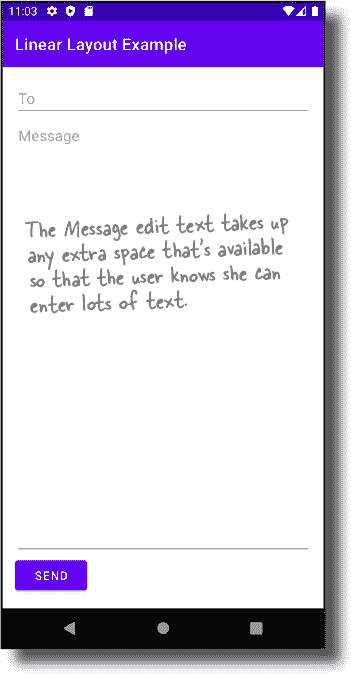
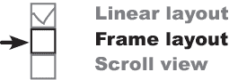

# 第三章：布局：*成为一个布局*


**我们仅仅触及到了布局的表面**。

到目前为止，你已经看到如何在一个简单的线性布局中排列视图，但是布局还能做更多。在本章中，我们将**深入一点**，向你展示布局的真正工作方式。你将学会**如何微调你的线性布局**。你将了解如何使用**帧布局**和**滚动视图**。到本章结束时，你会发现，尽管它们可能看起来有点不同，但所有的布局及其添加的视图**有更多的共同点**。

# 一切从布局开始

正如你已经知道的，布局文件是用 XML 编写的，它们让你定义应用的外观。

每次你编写布局，你需要做三件事：

1.  **指定布局类型。**

    你通过指定一种布局类型来告诉 Android 如何排列任何视图（如按钮和文本视图）。例如，线性布局将视图按照线性列或行依次排列。

    ```
    <LinearLayout ...>

    </LinearLayout>
    ```

1.  **指定视图。**

    每个布局包含一个或多个视图，你的应用程序用它们来显示信息或与用户交互。

    ```
    <Button
        android:layout_width="wrap_content"
        android:layout_height="wrap_content"
        android:text="Click me" />
    ```

1.  **告诉活动使用布局。**

    通过向活动添加类似这样的 Kotlin 代码，告诉 Android 哪个活动使用你刚刚定义的布局。

    ```
    setContentView(R.layout.activity_main)
    ```


# Android 有不同类型的布局

Android 有不同类型的布局，每种布局对其视图的排列方式都有自己的规则。例如，线性布局总是按照线性行或列排列视图，而帧布局则将其视图堆叠在一起。你使用哪种类型的布局取决于你想要在设备屏幕上如何排列视图。


## 为你的屏幕设计选择最佳布局

到目前为止，你所见过的所有应用程序都使用线性布局将视图按单列排列。在本章中，我们将深入研究线性布局，并向你介绍另外两种类型：帧布局和滚动视图。

让我们从线性布局开始。

# 让我们构建一个线性布局


我们将使用线性布局来构建下面显示的布局。在这里选择线性布局是个不错的选择，因为视图是在单列中排列的。正如你已经知道的，线性布局将视图按照垂直列或水平行依次排列。

布局由两个可编辑的文本视图（允许输入文本的文本视图）和一个按钮组成。这是我们想要布局看起来的样子：


## 创建一个新项目

我们将使用一个新的 Android Studio 项目来创建线性布局应用。

使用与前几章相同的步骤创建新项目。选择空活动选项，输入名称“线性布局示例”和包名称“com.hfad.linearlayoutexample”，并接受默认保存位置。确保语言设置为 Kotlin，并且最低 SDK 为 API 21，以便在大多数 Android 设备上运行。

# 如何定义线性布局

正如您所知，使用`<LinearLayout>`元素来定义线性布局。代码如下所示：


`<LinearLayout>`元素包含各种不同的属性，用于指定其外观和行为。

第一个是`**xmlns:android**`。这定义了一个名为`android`的命名空间，其值需要设置为`"[`schemas.android.com/apk/res/android`](http://schemas.android.com/apk/res/android)"`，如上所述。定义此命名空间使您的布局能够访问其需要的元素和属性，并且您需要在创建的每个布局文件中定义它。

接下来的两个属性是`**android:layout_width**`和`**android:layout_height**`，用于指定布局的宽度和高度。这些属性对于*所有*类型的布局和视图都是必需的。

您可以将`android:layout_width`和`android:layout_height`设置为`"wrap_content"`、`"match_parent"`或特定大小，如 8dp——即 8 个密度无关像素。`"wrap_content"`表示您希望布局仅大到足以容纳其中的所有视图，而`"match_parent"`表示您希望布局与其父级一样大——在本例中，就是设备屏幕的大小减去任何填充（关于填充的更多信息请参阅几页后面的内容）。通常将布局的宽度和高度设置为`"match_parent"`。

接下来的属性设置了线性布局的方向。接下来我们将看看此属性的选项。

# 方向可以是垂直或水平的

您可以使用`**android:orientation**`属性指定希望排列视图的方向。

您可以使用以下方式将视图垂直排列在单列中：

```
android:orientation="vertical"
```

您可以使用以下内容将视图水平排列在单行中：

```
android:orientation="horizontal"
```

如果方向是水平的，视图的排列顺序取决于设备的语言设置。

如果设备的语言设置为从左到右阅读的语言，比如英语，视图将水平排列，从左到右显示，如下所示：


如果设备的语言设置为从右到左阅读的语言，比如阿拉伯语，您可以选择从右到左显示视图，使第一个视图出现在布局的最右边。您可以通过在名为*AndroidManifest.xml*文件中包含名为`**supportsRtl**`的属性，并将其设置为`"true"`来启用此功能：

###### 注意

supportsRtl 意味着“支持从右到左”。


在查看线性布局可以使用的其他属性之前，让我们快速了解一下*AndroidManifest.xml*的更多信息。

# 使用填充来增加布局边缘的空间

一旦您指定了要使用的布局类型，您可以选择使用一个或多个**padding**属性来在布局边缘和其内容之间添加额外的空间。例如，以下代码使用`android:padding`属性为每个边缘添加了 16dp：


如果您想要在不同的边缘添加不同量的填充，您可以单独指定这些边缘。例如，以下代码在布局顶部添加了 32dp 的填充，并在其他边缘添加了 16dp：


`android:paddingStart`属性向布局的起始边缘添加填充。对于从左到右的语言（如英语），起始边缘在左侧；而如果设备语言设置为从右到左阅读，并且应用程序支持从右到左的语言，则起始边缘在右侧。

`android:paddingEnd`属性向布局的结束边缘添加填充。对于从左到右的语言，此处为右侧；对于从右到左的语言（如果应用程序支持此功能），此处为左侧。

如果您想要在水平或垂直边缘上应用相同数量的填充，您也可以使用`android:paddingHorizontal`和`android:paddingVertical`。这些属性分别在布局的水平和垂直边缘添加填充。


现在您已经学会了如何为线性布局添加填充，请为我们正在构建的布局添加一些填充。

# 到目前为止的布局代码

在应用程序中，我们将使用一个垂直方向的线性布局，并在每个边缘添加 16dp 的填充，以便在布局的边缘和其内容之间留有一些空间。

打开*activity_main.xml*，并替换其代码以匹配下面的代码：


我们已经定义了一个空的线性布局；现在让我们继续为其添加一些视图。

> **填充在布局的边缘和其内容之间增加了额外的空间。**
> 
> **您还可以在视图中使用填充。这将在视图边缘和其内容之间添加额外的空间**

# 可编辑文本框让您输入文本

线性布局需要显示一个按钮和两个可编辑文本视图（用于输入文本）。您已经知道如何使用按钮，在我们更新布局之前，让我们先了解如何包含可编辑文本视图。


可编辑文本视图是一种允许您输入文本的文本视图类型。您可以使用`**<EditText>**`元素将其添加到布局中，代码如下：

```
<EditText
    android:layout_width="match_parent"
    android:layout_height="wrap_content"
    android:hint="To"
    android:inputType="text" />
```


上述代码创建了一个宽度与其父级相同、仅高到足以容纳其内容的可编辑文本视图。

`**android:hint**` 属性用于定义提示文本。当可编辑文本视图为空时显示这些文本，并向用户提供输入的提示。在上述示例中，我们已经硬编码了提示文本，但在实际应用中，你应该将其作为字符串资源包含。

`android:inputType` 属性指定用户预计输入的数据类型，以便安卓可以提供正确的键盘类型。在上述示例中，我们使用了：

```
android:inputType="text"
```

允许用户输入单行文本。以下是您可能想要使用的一些更有用的输入类型：

| **值** | **作用** |
| --- | --- |
| **文本** | 允许用户输入单行文本。 |
| **多行文本** | 允许用户输入多行文本。 |
| **电话** | 提供电话号码键盘。 |

| **密码文本** | 显示文本输入键盘，并且您的输入内容是隐藏的。

你可以在在线的安卓开发者文档中找到更多信息，网址是[`developer.android.com/training/keyboard-input/style`](https://developer.android.com/training/keyboard-input/style)。

| **首字母大写** | 将句子的第一个字母大写。 |
| --- | --- |

现在你已经学会了如何使用可编辑文本视图，让我们将视图添加到我们正在构建的应用程序中的布局代码中。

# 在布局的 XML 文件中添加视图。

当你定义线性布局时，你按照希望它们显示的顺序列出布局中的视图。

在我们正在构建的应用中，我们想要显示两个可编辑文本视图，下面是一个按钮。布局代码如下，因此请更新 *activity_main.xml* 的代码以包含这些更改（用粗体标出）：


这些就是布局所需的所有视图。接下来做什么呢？

# 通过增加权重使视图拉伸

当前布局中的所有视图都只占用它们内容所需的垂直空间。但是我们*真正*想要的是使消息编辑框拉伸，占用布局中未被其他视图使用的任何垂直空间，就像这样：


为了做到这一点，我们需要为“消息区域”分配一些**权重**。为视图分配权重是告诉它在布局中拉伸以占用额外空间的一种方法。

你可以使用以下方式为视图分配权重：

```
android:layout_weight="number"
```

其中 `number` 是一个大于 0 的数字。

当你为一个视图分配权重时，布局首先确保每个视图有足够的空间来容纳其内容：每个按钮有足够的空间来显示其文本，每个编辑框有足够的空间来显示其提示文本，依此类推。完成这些操作后，布局会将额外的空间按权重大于等于 1 的视图进行比例分配。

现在我们来看看如何将其应用到正在构建的布局中。

# 如何为一个视图增加权重

我们需要 Message 编辑文本占用布局中其他两个视图未使用的任何额外空间。为此，我们将其 `android:layout_weight` 属性设置为 `1`。因为这是布局中唯一具有权重值的视图，这将使文本字段在垂直方向上拉伸以填充屏幕的剩余部分。

这里是代码；更新 *activity_main.xml* 以包含更改（**加粗部分**）：


给 Message 编辑文本设置权重为 `1` 意味着它会占用布局中其他视图未使用的所有额外空间。这是因为布局 XML 中的其他两个视图均未分配权重。


在这个例子中，我们只需要为单个视图分配权重。在进一步更新布局之前，让我们看看当需要为多个视图分配权重时会发生什么。

# 如何为多个视图添加权重

当你为多个视图分配权重时，线性布局使用你为每个视图分配的权重来确定每个视图应占用的剩余空间的比例。

举例来说，假设我们给 To 编辑文本设置权重为 `1`，并给 Message 编辑文本设置权重为 `2`，如下所示：

```
<LinearLayout ... >
    <EditText
        android:layout_width="match_parent"
        android:layout_height="0dp"
        android:layout_weight="1"
        android:hint="To"
        android:inputType="text" />

    <EditText
        android:layout_width="match_parent"
        android:layout_height="0dp"
        android:layout_weight="2"
        android:hint="Message"
        android:inputType="textMultiLine" />

       <Button
        android:layout_width="wrap_content"
        android:layout_height="wrap_content"
        android:text="Send" />
</LinearLayout>
```

线性布局中，To 和 Message 可编辑文本视图具有权重，并使用它们来确定每个视图应占用的空间量。

它首先将每个视图的 `android:layout_weight` 属性相加。在这个例子中，To 和 Message 视图的权重分别为 1 和 2，总计为 3。

每个视图占用的额外空间比例是视图的权重除以总权重。To 视图的权重为 `1`，这意味着它将占用布局中剩余空间的 1/3。Message 视图的权重为 `2`，因此它将占用剩余空间的 2/3。

现在你已经学会如何使用权重，让我们继续更新布局。


# gravity 属性控制视图内容的位置

接下来我们将移动显示在 Message 编辑文本内的提示文本。目前，它在视图内垂直居中显示。我们想要改变它，使文本显示在编辑文本字段的顶部，我们可以使用 `**android:gravity**` 属性来实现这一点。

`android:gravity` 属性允许你指定如何在视图内部定位视图内容，例如如何在文本视图内部定位文本。如果你希望视图内容显示在视图顶部，就像我们在这里做的一样，我们可以将其 `android:gravity` 属性设置为 `"top"`，如下所示：

```
android:gravity="top"
```

我们将为 Message 编辑文本添加一个 `android:gravity` 属性，以便提示文本移动到视图顶部。这里是代码；更新 *activity_main.xml* 以包含更改（**加粗部分**）：


您将在下一页上找到可以在 android:gravity 属性中使用的其他值的列表。

# 您可以在 android:gravity 属性中使用的值

下面是您可以在 android:gravity 属性中使用的更多值。将属性添加到您的视图中，并将其值设置为以下值之一：

```
android:gravity="value"
```

| **`top`** | 将视图内容放在视图的顶部。 |
| --- | --- |
| **`bottom`** | 将视图内容放在视图的底部。 |
| **`start`** | 将视图内容放在视图的开头。 |
| **`end`** | 将视图内容放在视图的末尾。 |
| **`center_vertical`** | 将视图内容垂直居中。 |
| **`center_horizontal`** | 将视图内容水平居中。 |
| **`center`** | 将视图内容垂直和水平居中。 |
| **`fill_vertical`** | 使视图内容垂直填充视图。 |
| **`fill_horizontal`** | 使视图内容水平填充视图。 |
| **`fill`** | 使视图内容在垂直和水平方向填充视图。 |

您还可以通过用“|”分隔每个值来将多个重力应用于视图。例如，要将视图内容沉入底端角落，您可以使用：

```
android:gravity="bottom|end"
```

现在你已经知道如何使用重力来定位视图的内容，请尝试下一页的练习。

> **android:gravity 可让你指定视图内容在视图内的位置。**

# 布局磁铁


有人用冰箱磁铁创建了一个线性布局，运行时生成下面的输出。不幸的是，一场过境的鲨龙飓风使一些磁铁脱落了。你能把代码重新拼凑起来吗？

###### 注意

提示：你不需要使用所有的磁铁。


# 布局磁铁解决方案


有人用冰箱磁铁创建了一个线性布局，运行时生成下面的输出。不幸的是，一场过境的鲨龙飓风使一些磁铁脱落了。你能把代码重新拼凑起来吗？


# 到目前为止的故事

到目前为止，我们已经向线性布局添加了三个视图，并通过将 `layout_weight` 和 `gravity` 属性添加到消息编辑文本来调整它们的位置。这些属性意味着编辑文本会使用未被其他视图使用的任何额外空间，并且其提示文本显示在视图的顶部：



我们的线性布局几乎完成了，但我们还要做两个更改。

1.  **将发送按钮移动到末端边缘。**

    对于从左到右的语言，这将使按钮移到右侧。

1.  **在消息编辑文本和按钮顶部之间添加更多的空间。**

让我们看看如何做到这一点，首先将按钮移动到末尾。

# 布局重力控制视图在布局内的位置

要将按钮移到布局的末端，我们将在按钮上添加一个 `**android:layout_gravity**` 属性。

`android:layout_gravity` 属性允许你指定线性布局中视图的位置，使其出现在其封闭空间的右侧，例如，或者在水平方向上居中视图。

要将发送按钮移到布局的末尾边缘，我们将使用以下代码将 `android:layout_gravity` 属性设置为`"end"`：


```
<Button
    android:layout_width="wrap_content"
    android:layout_height="wrap_content"
    android:layout_gravity="end"
    android:text="Send" />
```

**线性布局有两个听起来相似的属性，gravity 和 layout_gravity。**

之前，我们使用 `android:gravity` 属性来定位编辑文本内部的消息提示文本。这是因为 `android:gravity` 属性让你指定视图的**内容**出现在哪里。

`android:layout_gravity` 处理**视图本身的放置**，让你控制视图出现在它们可用空间的位置。在我们的情况下，我们希望视图移到其可用空间的末尾，所以我们正在使用：


```
android:layout_gravity="end"
```

看看下一页，你会看到一些你可以与 `android:layout_gravity` 属性一起使用的其他值的列表。

# 你可以使用 android:layout-gravity 属性的更多值

这里是你可以与 `android:layout_gravity` 属性一起使用的一些值。将该属性添加到你的视图中，并将其值设置为以下值之一：

```
android:layout_gravity="value"
```

| **Value** | **它的作用** |
| --- | --- |
| **`top, bottom, start, end`** | 将视图放置在其可用空间的顶部、底部、开始或结束位置。 |
| **`center_vertical, center_horizontal`** | 在其可用空间中垂直或水平居中视图。 |
| **`center`** | 在其可用空间中垂直和水平居中视图。 |
| **`fill_vertical, fill_horizontal`** | 使视图增长，以便在其垂直或水平的可用空间中填满。 |
| **`fill`** | 使视图增长以充满其垂直和水平的可用空间。 |

你可以通过用“`|`”分隔每个值来为视图的 `android:layout_gravity` 属性指定多个值。例如，要将视图移动到其可用空间的底端结束角，你可以使用以下代码：

```
android:layout_gravity="bottom|end"
```

现在你知道如何使用 `android:layout_gravity` 属性改变视图的位置了，接下来让我们看看如何在视图之间添加更多的空间。

> **android:layout_gravity 让你指定你希望视图出现在它们可用空间中的位置。**
> 
> **android:layout_gravity 处理视图本身的放置，而 android:gravity 控制视图的内容**。

# 使用 margins 来在视图之间添加空间

当你使用线性布局来定位视图时，布局不会在它们之间留下太多空间。通过给视图添加一个或多个**margins**，你可以增加视图周围的空间。

假设你在一个线性布局中有两个视图——一个位于按钮上方的编辑文本。如果你想增加两个视图之间的空间，你可以使用`android:layout_marginTop` 属性给按钮顶部添加 40dp 的 margin，就像这样：


这里列出了你可以使用的边距类型，以给视图添加额外空间。将属性添加到视图中，并将其值设置为你想要的边距大小：

```
android:attribute="8dp"
```

| **属性** | **作用** |
| --- | --- |
| **`layout_marginTop`** | 在视图顶部添加额外空间。 |
| **`layout_marginBottom`** | 在视图底部添加额外空间。 |
| **`layout_marginStart`** | 在视图的开始位置添加额外空间。 |
| **`layout_marginEnd`** | 在视图的结束位置添加额外空间。 |
| **`layout_margin`** | 在视图的每一侧添加相等的空间。 |
| **`layout_marginVertical, layout_marginHorizontal`** | 在视图的垂直（顶部和底部）或水平（开始和结束）边缘添加相等的空间。 |

# 完整的线性布局代码

现在你已经了解了视图的`layout_gravity`和`margin`属性，让我们在线性布局代码中使用它们来重新定位按钮并在其顶部边缘添加一些空间。以下是*activity_main.xml*的完整代码；更新代码以包含以下更改（用粗体标出）：


我们已经完成了线性布局代码的编写，现在让我们来测试一下。

#  测试驾驶

当你对应用进行更改后，继续运行它。

该应用显示了一个线性布局，包含三个视图：两个可编辑文本视图和一个按钮。这些视图以垂直列的方式显示。To 视图显示在顶部，Send 按钮显示在底部的结束角，Message 视图占据任何额外空间，允许按钮顶部边缘有 40dp 的边距。

现在你已经知道如何创建线性布局，并控制其视图的显示方式，试试下一页的练习吧。


# 成为布局


**下面的代码描述了一个完整的线性布局。你的任务是扮演布局，说出当运行时该布局会产生哪个屏幕（A 或 B）。**

```
<?xml version="1.0" encoding="utf-8"?>
<LinearLayout

    android:layout_width="match_parent"
    android:layout_height="match_parent"
    android:orientation="vertical"
    android:padding="16dp"
    tools:context=".MainActivity">

    <Button
        android:layout_width="wrap_content"
        android:layout_height="0dp"
        android:layout_weight="1"
        android:layout_gravity="center_horizontal"
        android:text="Hello!" />
    <Button
        android:layout_width="wrap_content"
        android:layout_height="0dp"
        android:layout_weight="1"
        android:gravity="center_horizontal"
        android:text="Goodbye!" />

</LinearLayout>
```


# 成为布局解决方案


**下面的代码描述了一个完整的线性布局。你的任务是扮演布局，说出当运行时该布局会产生哪个屏幕（A 或 B）。**

```
<?xml version="1.0" encoding="utf-8"?>
<LinearLayout

    android:layout_width="match_parent"
    android:layout_height="match_parent"
    android:orientation="vertical"
    android:padding="16dp"
    tools:context=".MainActivity">

    <Button
        android:layout_width="wrap_content"
        android:layout_height="0dp"
        android:layout_weight="1"
        android:layout_gravity="center_horizontal"
        android:text="Hello!" />
    <Button
        android:layout_width="wrap_content"
        android:layout_height="0dp"
        android:layout_weight="1"
        android:gravity="center_horizontal"
        android:text="Goodbye!" />

</LinearLayout>
```


# 你的活动代码告诉 Android 使用哪个布局

到目前为止，在本章中，你已经学会了如何使用线性布局，并微调其视图的显示方式。在介绍另一种布局类型之前，让我们来看看应用运行时布局发生了什么。

正如你已经知道的，当 Android 运行一个应用时，它会启动应用的主活动。在当前应用中，这是一个名为`MainActivity`的活动。

当活动启动时，它的`onCreate()`方法运行。该方法包括以下代码，指定活动应该使用哪个布局：


正如你可以看到的，上述代码通过将布局的名称传递给名为`setContentView()`的方法来告诉 Android 使用哪个布局。然后，该方法在屏幕上显示布局。

## 布局的视图被膨胀为对象

除了在设备屏幕上显示布局之外，`setContentView()`方法还将布局中的视图转换为对象。这个过程称为**布局膨胀**，因为它*膨胀*每个视图为一个对象：


布局膨胀非常重要，因为它允许您的活动代码操作布局中的视图。在幕后，每个视图都被渲染为一个对象，您可以使用活动代码与之交互。

让我们看看布局膨胀如何与我们构建的线性布局代码一起工作。

> **当你运行应用程序时，Android 通过将布局中的每个项目转换为对象来实例化布局 XML。这称为布局膨胀。**

# 布局膨胀：一个示例

正如你所知，线性布局代码在线性布局内显示了两个可编辑文本视图和一个按钮：


当应用程序运行时，布局中的视图被膨胀为对象。线性布局被膨胀为`LinearLayout`对象，可编辑文本视图被膨胀为`EditText`对象，按钮被膨胀为`Button`：


现在您了解了布局膨胀的工作原理，让我们看看如何使用一种新类型的布局：**帧布局**。

# 帧布局堆叠其视图



正如你所知，线性布局将其视图排列在单行或单列中。每个视图在屏幕上都被分配了自己的空间，它们不会彼此重叠。

然而，有时候你*希望*你的视图重叠。例如，假设你想显示一张图片，并在其上覆盖一些文本。你不能仅仅使用线性布局来实现这一点。

如果你想要一个视图可以重叠的布局，一个简单的选择是使用帧布局。它不是将其视图显示在单行或单列中，而是将它们堆叠在一起，一层叠一层地。通常用于仅包含单个视图的情况。

我们将通过创建一个显示一些文本覆盖在鸭子图片上的有用应用程序来研究帧布局的工作原理。我们将从创建一个新项目开始。


## 创建一个新项目

使用与之前相同的步骤创建一个新的 Android Studio 项目。选择空活动选项，输入名称“Frame Layout Example”和包名称“com.hfad.framelayoutexample”，接受默认保存位置。确保语言设置为 Kotlin，并且最低 SDK 为 API 21，以便它能在大多数 Android 设备上运行。

现在我们已经创建了项目，让我们来定义一个帧布局。

## 如何定义一个帧布局

您可以使用`<FrameLayout>`元素来定义一个帧布局，如下所示：


就像线性布局和任何其他类型的视图或视图组一样，`android:layout_width`和`android:layout_height`属性指定布局的宽度和高度，是必需的。您也可以选择添加`padding`属性，但在这里我们没有这样做。

上面的代码创建了一个空的帧布局，让我们继续向其中添加一只鸭子图像。

# 将图像添加到您的项目

我们将在帧布局中显示一个名为*duck.webp*的图像，但首先需要将文件添加到项目中。

要完成此操作，您需要创建一个*drawable*资源文件夹（如果 Android Studio 尚未为您创建）。这是存储应用中图像资源的默认文件夹。切换到 Android Studio 资源管理器的项目视图，选择*app/src/main/res*文件夹，转到文件菜单，选择“新建…”选项，然后点击创建新的 Android 资源目录选项。当提示时，选择资源类型为“drawable”，命名文件夹为“drawable”，然后点击确定。

接下来，从*tinyurl.com/hfad3*下载文件*duck.webp*，然后将其添加到*app/src/main/res/drawable*文件夹中。

我们将在图像视图中显示*duck.webp*（显示图像的视图），这将添加到帧布局中。图像视图的定义如下，使用`<ImageView>`元素：


`<ImageView>`元素包括`android:layout_width`和`android:layout_height`属性，这些您已经很熟悉，还有三个新属性。

`android:src`属性指定图像视图中应显示的图像。我们将其设置为`"@drawable/duck"`，以便使用*drawable*文件夹中的*duck.webp*。

`android:contentDescription`属性为无障碍提供了图像的文本描述。

最后，`android:scaleType`属性描述了您希望如何缩放图像。我们使用了`"centerCrop"`，它裁剪图像的边缘。

这就是您在帧布局中显示鸭子图像所需的全部信息。在弄清如何在其上显示文本之前，让我们更仔细地看看如何使用图像——或*drawable*资源。

# 帧布局按照在布局 XML 中出现的顺序堆叠视图

定义帧布局时，按您希望它们叠放的顺序列出视图。首先显示第一个视图，然后将第二个视图叠加在其上，依此类推。

在这里，我们将在图像视图的顶部显示一个文本视图，因此我们将在 XML 中的图像视图下方添加它。更新*activity_main.xml*代码，使其与此处显示的代码匹配：


#  测试驾驶

当我们运行应用时，设备上将显示一只鸭子的图像，并在左上角显示“这是一只鸭子！”的文本。


# 所有布局都是 ViewGroup 的一种类型...

尽管它们以不同的方式显示它们的视图，但您可能已经注意到线性布局和帧布局在很多方面都有相似之处。例如，它们都可以容纳视图，并且它们还有自己的策略来确定如何显示视图。

这种共性背后有一个很好的原因。幕后，所有布局——包括线性布局和帧布局——都是 `android.view.ViewGroup` 超类的子类：


## …而 ViewGroup 是 View 的一种类型

`ViewGroup` 类是 `View` 的一个子类，可以容纳其他视图。在幕后，每个布局都是 `ViewGroup` 的一个子类，这意味着 **每个布局也是** `**View**` 的一种类型。

这个类层次结构意味着所有视图和布局都共享公共属性和行为。例如，它们都可以显示在屏幕上，并且您可以指定它们的高度或宽度。这就是为什么您需要为每个视图和布局的 `android:layout_height` 和 `android:layout_width` 属性指定值的原因。这些属性对所有视图都是强制性的，因为布局也是视图的一种类型，所以对所有布局也是强制性的。

> **您向布局添加的每个 UI 组件都是一种 View 类型：一种占据屏幕空间的对象。**
> 
> **每个布局都是 ViewGroup 的一种类型：一种可以容纳其他视图的 View 类型。**

**她说的对。**

正如您已经了解的那样，布局是一种可以容纳其他视图的视图类型。由于每个布局也是视图的一种类型，这意味着 **布局可以容纳其他布局**。

能够将布局嵌套在其他布局中是有用的，因为它允许您设计更复杂的用户界面。例如，您可以通过将水平线性布局嵌套在根线性布局中，在垂直线性布局的顶部嵌套一个水平行，如果您想要在图像的顶部垂直排列文本，您可以通过在帧布局中嵌套一个垂直线性布局来实现。

让我们更详细地看看这是如何通过一种新类型的布局——滚动视图来实现的。


# 滚动视图插入了一个垂直滚动条


滚动视图是一种带有垂直滚动条的帧布局。它对于比设备显示区域大的布局很有用，因为这样你可以使用它滚动到屏幕上放不下的任何视图。


我们将创建一个使用滚动视图的应用程序。创建一个名为“滚动视图示例”的新项目，选择空活动选项。确保语言设置为 Kotlin，并且最低 SDK 版本是 API 21，以便在大多数 Android 设备上运行。然后用下面的代码替换 *activity_main.xml* 中的代码：


如您所见，上述布局包含一个简单的线性布局，其中包含消息编辑文本和发送按钮。

尝试运行应用程序，并在编辑框中输入大量文本。视图会扩展以适应内容，并最终将发送按钮推到屏幕边缘之外。由于没有滚动条，你无法再访问按钮。

为了解决这个问题，我们将向布局中添加一个滚动视图。这将为我们提供一个滚动条，以便在屏幕上看不到发送按钮时可以使用它。


# 如何添加滚动视图

使用 `**<ScrollView>**` 元素向布局中添加滚动视图。`<ScrollView>` 元素的使用方式与 `<FrameLayout>` 相同，只是它包含一个额外的属性，`**fillViewport**`，用于指定滚动视图是否应填充设备屏幕。

###### 注意

**ScrollView** 是 FrameLayout 的一个子类，这意味着它可以做 FrameLayout 能做的一切，而且还能做更多。

在下面的代码中，我们已经向布局代码中添加了滚动视图，以便它包围原始的线性布局。更新 *activity_main.xml* 代码以包含这里显示的更改（用粗体显示）：


在你完成以下练习后，我们将对代码进行测试。

#  测试驾驶

一旦你在布局代码中添加了滚动视图，就可以运行应用程序。

当你在消息编辑框中输入大量文本时，发送按钮会像之前一样被推到屏幕边缘之外。但是这次，我们可以滚动设备屏幕以达到按钮。

恭喜！现在你已经学会了如何使用不同类型的布局来控制你的应用界面的外观。在下一章中，你将在这些知识的基础上继续学习。


> **所有布局（包括线性布局、帧布局和滚动视图）都可以容纳其他布局。**
> 
> **你可以通过将一个类型的布局嵌套到另一个布局中来构建复杂的布局。**

# 你的 Android 工具箱


**你已经掌握了第三章，现在你已经将构建布局加入到你的工具箱中。**


