# 第四章： 约束布局：*绘制蓝图*

**没有蓝图，你不会建造房子。**

有些布局使用**蓝图**确保它们**看起来完全符合您的要求**。在本章中，我们将向您介绍 Android 的**约束布局**：一种**灵活的设计更复杂用户界面的方式**。您将了解到如何使用**约束**和**偏置**来定位和调整视图的大小，**无论屏幕尺寸和方向如何**。您将了解如何通过**指南线**和**障碍物**来保持视图的位置。最后，您将学习如何使用**链条**和**流**来打包或展开视图。让我们开始设计吧…

# 重新审视嵌套布局

在上一章中，您学习到可以嵌套布局来构建更复杂的屏幕。例如，以下代码使用嵌套线性布局在水平行中显示文本视图和编辑文本，并在它们下方显示编辑文本：

# 嵌套布局是有代价的

嵌套布局的缺点在于，以这种方式构建复杂布局可能效率低下，使您的代码难以阅读和维护，还可能导致应用程序变慢。

当 Android 在设备屏幕上显示布局时，它首先检查布局文件的结构，然后使用此结构构建视图层次结构。例如，对于上一页显示的嵌套布局，它构建了包含两个线性布局、两个编辑文本和一个文本视图的视图层次结构：

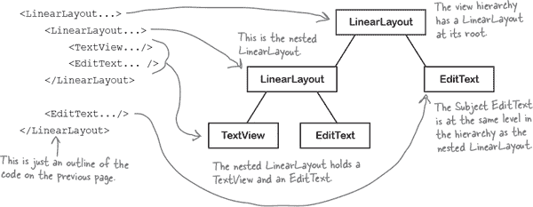

Android 使用视图层次结构来帮助确定每个视图在设备屏幕上的位置。每个视图都需要测量、布局和绘制在屏幕上，并且 Android 需要确保每个视图有足够的空间容纳其内容，并考虑任何权重。

如果布局包含嵌套布局，则视图层次结构更复杂，Android 可能需要进行多次处理以确定如何排列视图。如果布局深度嵌套，这可能导致代码中的瓶颈，并使您面对难以阅读和维护的大量代码。

如果您有像这样更复杂的用户界面，可以选择使用**约束布局**而不是嵌套布局。

> **布局中的每个视图都需要初始化、测量、布局和绘制。在深度嵌套的布局中，这可能会使您的应用程序变慢。**

# 介绍约束布局

约束布局比线性布局或帧布局更复杂，但更加灵活。对于复杂的用户界面来说，它更有效率，因为它提供了一个更扁平的视图层次结构，这意味着 Android 在运行时需要处理的内容更少。

## 您可以视觉化设计约束布局

使用约束布局的另一个好处是，它们专门设计用于与 Android Studio 的设计编辑器配合使用。与线性布局和帧布局不同，你通常需要直接在 XML 中进行调整，你可以在设计编辑器的蓝图中通过拖放视图来构建约束布局。并为每个视图提供显示指令：

> **使用约束布局构建灵活的 UI，无需嵌套布局。**

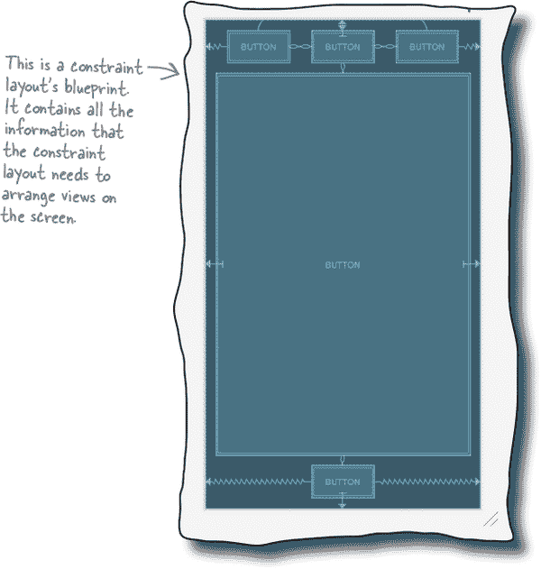

与线性布局和帧布局不同，约束布局是 Android Jetpack 套件中的一部分。你可能已经听说过 Jetpack，但它是什么？

# 约束布局是 Android Jetpack 的一部分

Android Jetpack 是一个库集合，帮助你遵循最佳实践，减少样板代码，使编码更轻松。它包括约束布局、导航、Room 持久化库（帮助你构建数据库）等等。

这里是我们喜欢的一些 Jetpack 组件；你将在后面的章节中学习如何使用它们：

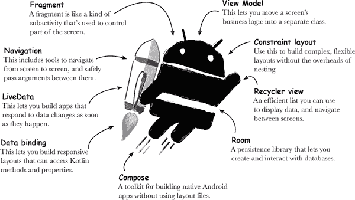

使用 Jetpack 的另一个优点是，它使你能够编写能够在新旧 Android 版本上一致运行的代码。这对你的用户来说是个好消息，因为这意味着你可以包含在较老设备上也能正常工作的新功能。

一个例子是`AppCompatActivity`，你已经在使用它来编写活动代码。我们之前没有提到，但`AppCompatActivity`是 Android Jetpack 的一部分。它为新旧版本的 Android 添加了新功能，而无需担心向后兼容性。

###### 注意

是的！你在不知不觉中已经在使用 Android Jetpack 的一部分。在本书的其余部分中，你将学习更多关于如何使用 Jetpack 的内容。

在本章中，你将学习如何使用约束布局。让我们看看我们要做什么。

# 我们要做什么

我们将学习约束布局的两个主要部分：

1.  **如何定位和调整单个视图的大小。**

    你将学习如何使用约束和偏差来控制单个视图在其布局中显示的位置和方式。

    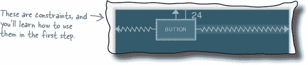

1.  **如何定位和调整多个视图的大小。**

    然后，你将应用你的知识到多个视图上，并学习使用准则、障碍物、链条和流的高级技术。

    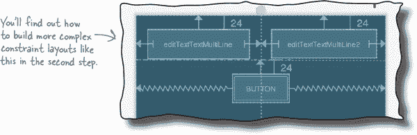

## 创建一个新项目

我们将为即将构建的应用程序使用一个新项目，因此现在按照前几章的步骤创建一个。选择"空活动"选项，输入名称为“My Constraint Layout”，包名为“com.hfad.myconstraintlayout”，接受默认的保存位置。确保语言设置为 Kotlin，最低 SDK 版本为 API 21，以便在大多数 Android 设备上运行。

现在我们已经创建了项目，让我们确保已经设置好使用约束布局。

# 使用 Gradle 包括 Jetpack 库。

为了确保所有 Jetpack 库（包括约束布局）能在所有 Android 版本上正常工作，它们不包含在主 Android SDK 中。相反，你必须使用 **Gradle** 添加你需要的任何库。这是一个用于编译代码、配置应用程序并获取项目所需任何额外库的构建工具。

每次创建新项目时，Android Studio 会创建两个名为 ***build.gradle*** 的 Gradle 文件。

*build.gradle* 的第一个版本位于 *project* 文件夹中，并指定你的应用的基本设置，如要使用的 Gradle 插件的版本。

*build.gradle* 的第二个版本位于项目的 *app* 文件夹中。这是设置应用程序大部分属性的地方，如 API 级别。

> **在幕后，每个 Android Studio 项目都使用 Gradle 作为其构建工具。**

## 项目的 build.gradle 需要添加 Google 存储库行。

每个项目都需要知道在哪里找到它所需的任何额外 Jetpack 库，这是通过在 **项目** 的 *build.gradle* 文件中添加对 Google 存储库的引用来完成的。Android Studio 通常会为您完成此操作，但您可以通过打开文件 *MyConstraintLayout/build.gradle*，并在 `allprojects` 下的 `repositories` 部分中查找以下行（加粗）来确保它已经存在：

## 应用的 `build.gradle` 包括约束布局的库。

要使用约束布局，需要在 **应用** 的 *build.gradle* 文件中包含对其库的引用。Android Studio 应该已经为您添加了这个，但您可以通过打开文件 *MyConstraintLayout/app/build.gradle*，并在 `dependencies` 部分中查找以下行（加粗）来双重检查：

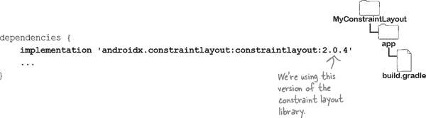

如果文件不包含此行，请立即添加，并点击代码编辑器中出现的“立即同步”选项。这将同步你所做的任何更改与项目的其余部分，并添加库。

# 让我们向 *activity_main.xml* 添加一个约束布局。

现在你的项目已经设置好使用约束布局，让我们开始使用一个。

你可以使用 `<androidx.constraintlayout.widget.ConstraintLayout>` 元素将约束布局添加到布局文件中。我们将在 *app/src/main/res/layout* 文件夹中的布局文件 *activity_main.xml* 中使用它，确保其代码如下所示：

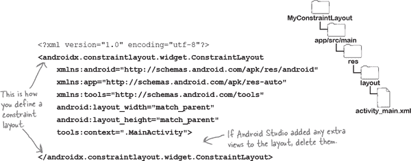

## 在蓝图中展示布局。

我们将使用设计编辑器的蓝图添加视图到布局。通过单击 Design 选项切换到设计编辑器，单击编辑器工具栏中的选择设计表面按钮，并选择蓝图选项。这将显示类似以下的布局蓝图：

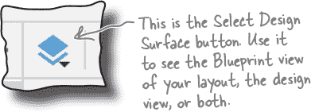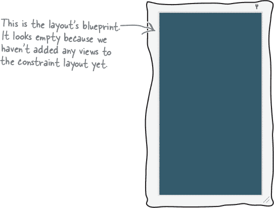

# 向蓝图添加一个按钮。

我们将在布局中添加一个按钮。要做到这一点，转到设计编辑器的工具栏，找到按钮组件（通常在“常用”部分），并将其拖动到蓝图中。您可以将按钮放置在蓝图的任何位置，只要它出现在其主要区域即可，就像这样：

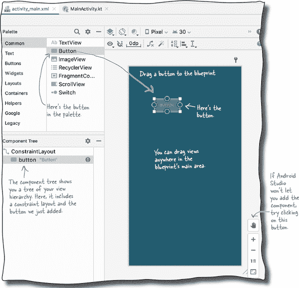

# 使用约束来定位视图

使用约束布局时，不需要在蓝图上的特定位置放置视图，而是通过定义**约束**来指定位置。**约束**是告诉布局视图应该放置在哪里的连接或附件。例如，你可以使用约束将视图附加到布局的起始边缘或另一个视图的下方。

## 我们将为按钮添加一个水平约束

为了看到效果，让我们添加一个约束，将按钮附加到布局的左边缘。

首先，确保通过点击选中按钮。选中视图后，会在其周围绘制边界框，并添加到其角落和边缘的控制手柄。角落的手柄可用于调整视图的大小，边缘上的手柄可用于添加约束：

要添加约束，点击视图的约束手柄之一，并将其拖动到要附加到的位置。在这种情况下，我们将按钮的左约束手柄拖动到布局的左边缘：

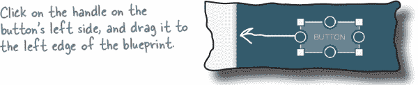

这将添加约束，并将按钮拉到左侧：

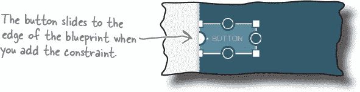

这就是添加水平约束的方法。接下来我们看看添加垂直约束会发生什么。

# 也添加垂直约束

我们将使用垂直约束将按钮附加到布局的顶部。要做到这一点，点击按钮的顶部约束手柄，并将其拖动到蓝图的顶部。这将添加垂直约束，将按钮向上拉动。

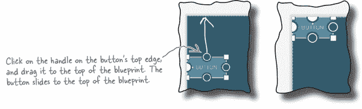

# 使用对称约束来居中视图

如同您所学的那样，您可以使用约束将视图附加到蓝图的边缘。每个约束都像拉伸视图到蓝图边缘的弹簧一样工作。

如果要将视图定位在蓝图的中心位置，可以通过向视图的相对边缘添加约束来实现。例如，要水平居中一个按钮，可以添加一个将视图向左拉的约束，以及另一个将其向右拉的约束，如下所示：

两个约束将按钮朝相反方向拉动，使其水平居中，如下所示：

您还可以通过将约束添加到其顶部和底部边缘来垂直居中视图。如果要水平和垂直居中视图，则需要添加到所有四个边缘的约束，如下所示：

# 您可以删除不再需要的约束

你可以通过在蓝图中选择不再需要的任何约束条件，然后删除它们来删除任何不再需要的约束条件。例如，如果你有一个位于蓝图中央的按钮，你可以删除连接到其底部边缘的约束条件：

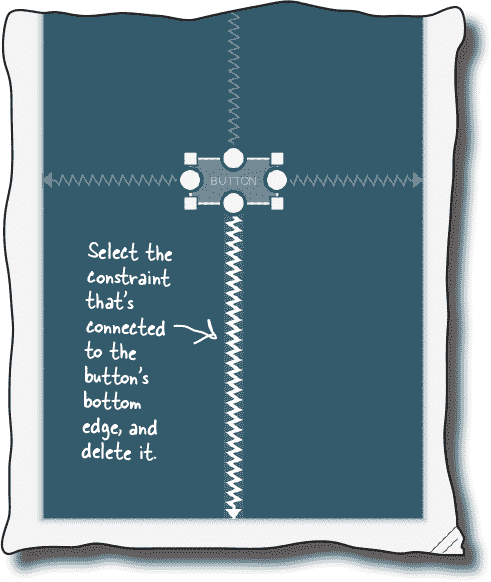

删除这个约束条件意味着按钮不再被拉向蓝图底部。顶部约束将按钮拉向顶部，使其仅在水平方向居中，而不是垂直方向：

另一种删除不再需要的约束条件的方法是使用约束小部件工具。让我们看看这是如何工作的。

# 使用约束小部件删除约束条件

约束小部件显示在设计编辑器侧边的属性面板中。当你选择一个视图时，它会出现，并显示一个包含视图约束和任何边距大小的图表。

###### 注意

你将在几页后了解有关属性面板的更多信息。

要删除约束条件，请在约束小部件中选择要从蓝图中删除约束条件的视图，然后单击约束小部件中约束条件的手柄。约束条件被移除，视图在蓝图中重新定位。

## 你也可以使用它来添加边距

你可能已经注意到约束小部件中的每个约束条件旁边都有一个数字。这用于设置视图边缘的边距大小，以便在视图和布局边缘之间留有空间。例如，要将视图的左边和顶部边距大小更改为 24dp，你需要在图表中更新它们的值为 24：

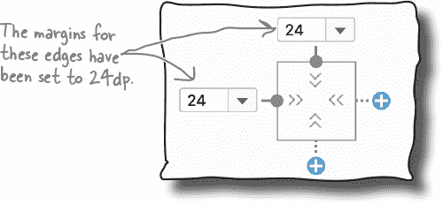

你可以使用设计编辑器工具栏中的“默认边距”按钮为任何新边距设置默认大小。例如，将其设置为 24dp，这意味着任何添加的新约束条件将自动包含 24dp 的边距。

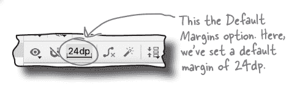

# 对蓝图的更改会反映在 XML 中

当你向蓝图添加视图并指定约束和边距时，它们会被添加到布局的底层 XML 中。要查看这一点，请切换到布局的代码视图。你的代码应该看起来像这样（但如果稍有不同也不用担心）：

正如你所看到的，XML 现在包含了一个按钮。它的代码看起来是否让你感到熟悉？如果是的话，很好，它包含了你在第三章中学到的属性。

按钮的宽度、高度和边距的指定方式与以前完全相同，如果你愿意，你可以在 XML 中更改它们的值，而不是使用设计编辑器。

唯一陌生的代码是指定视图在其开始和顶部边缘上的约束条件的两行代码：

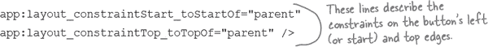

如果你向按钮的其余边缘添加约束条件，将生成类似的代码。

现在你已经一窥约束布局 XML 的样子，切换回设计编辑器，我们来看看更多可以用来定位视图的技巧。

# 视图可以有偏差

正如你之前学到的，你可以在视图的相对两侧添加约束。这默认将视图居中，但你也可以通过改变其**偏差**来控制相对每一侧的位置。这告诉 Android 每个约束在视图每侧的比例长度。

要看到效果，请将按钮的水平偏差更改，使其位置偏离中心。首先确保按钮的左右两侧都包含约束，如下所示：

然后选择按钮，这样约束部件就会显示出来。

在视图的图表下方，你应该看到一个带有数字的滑块。这是视图水平偏差的百分比。

要改变偏差，只需移动滑块。例如，如果你将滑块向左移动，使数字变为 30，则蓝图中的按钮也向左移动：

视图在不考虑屏幕大小和方向的情况下保持相对位置。让我们通过测试应用程序来试一试。

#  测试驾驶

当我们运行应用程序时，按钮会出现在屏幕顶部偏离中心的位置。旋转设备后，它保持相同的相对位置。

现在你已经学会了各种控制视图在屏幕上位置的技巧。接下来，我们来看看如何改变它的大小。

# 你可以改变视图的大小

如你所料，你可以通过更新其`layout_width`和`layout_height`属性来改变约束布局中视图的大小。你可以在布局的 XML 中或设计编辑器的属性面板中完成这些操作。

属性面板显示在蓝图的一侧。当你选择一个视图时，它会显示已声明的所有属性（如`layout_width`和`layout_height`），并允许你设置尚未声明的属性。

## 使视图刚好足够大

就像线性布局和帧布局一样，通过将`layout_width`和`layout_height`属性设置为`wrap_content`，可以使视图大小刚好足够显示其内容。例如，如果视图是一个按钮，则使按钮刚好足以容纳其文本：

## 匹配视图的约束

如果你已经在视图的相对两侧添加了约束，你可以使视图与其约束的大小相匹配。方法是将其`layout_width`和/或`layout_height`设置为 0dp：将`layout_width`设置为 0dp 以使视图与其水平约束匹配，并将`layout_height`设置为 0dp 以使其与垂直约束匹配。

在下面的示例中，我们将按钮的`layout_width`设置为 0dp，使按钮与其水平约束匹配：

现在你已经看到如何调整视图大小，尝试使用不同的技术，然后在下一页的练习中尝试一下。

# 成为约束

**你的工作是扮演你是约束布局，绘制出每个布局所需的约束。你还需要为每个视图指定 `layout_width`、`layout_height` 和偏置（在需要时）。我们已经为你完成了第一个。**

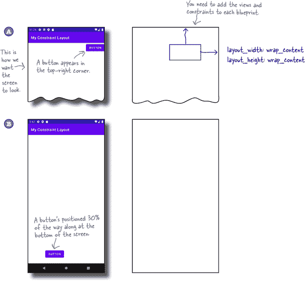

# 成为约束解决方案

**你的工作是扮演你是约束布局，绘制出每个布局所需的约束。你还需要为每个视图指定 `layout_width`、`layout_height` 和偏置（在需要时）。我们已经为你完成了第一个。**

# 大多数布局需要多个视图

到目前为止，你已经看到如何在约束布局中定位和调整一个视图的大小。然而，大多数时候，你的布局需要包含多个相互布局的视图。

为了了解这一点是如何工作的，首先确保你的约束布局中包含一个按钮，并且有两个约束：一个将其顶部边缘连接到蓝图的顶部，另一个将其左边缘连接到蓝图的左侧。其 `layout_width` 和 `layout_height` 属性应设置为 `wrap_content`，这些边缘的间距应该设置为 24dp。

在你做了这些更改之后，按钮应该像这样定位在蓝图的左上角：

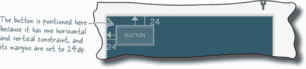

## 向蓝图添加第二个按钮

接下来，通过从调色板中拖动一个按钮，并将其放置在第一个按钮的下方，如下所示，向蓝图添加第二个按钮：

蓝图现在包含两个按钮。让我们找出如何相互定位它们。

# 你可以将视图连接到其他视图

正如你所知道的，约束可以让你将视图附加到其蓝图的边缘。你也可以使用约束将两个视图连接在一起，这用于指定它们之间的显示方式。

为了了解这一点，选择蓝图中的第二个按钮，然后绘制一个约束，从第二个按钮的顶部边缘到第一个按钮的底部边缘，如下所示：

当添加约束时，它会将按钮拉起，使其连接到第一个按钮，并显示在其下方：

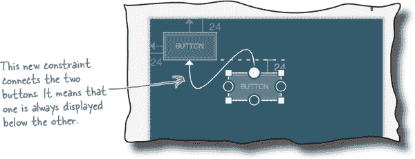

该约束意味着第二个按钮将始终位于第一个按钮下方，无论第一个按钮在设备屏幕上的位置如何。

一旦你以这种方式定位了两个视图，接下来你可能想要做的是确保它们对齐。让我们找出如何做到这一点。

# 你也可以对视图进行对齐

对齐两个视图最简单的方法是使用设计编辑器工具栏中的对齐按钮。

要了解这是如何工作的，请将蓝图中的两个按钮左对齐，使它们的左边缘对齐。首先，通过按住 Shift 键选择两个按钮。然后点击对齐按钮，打开一组对齐选项，就像这样：

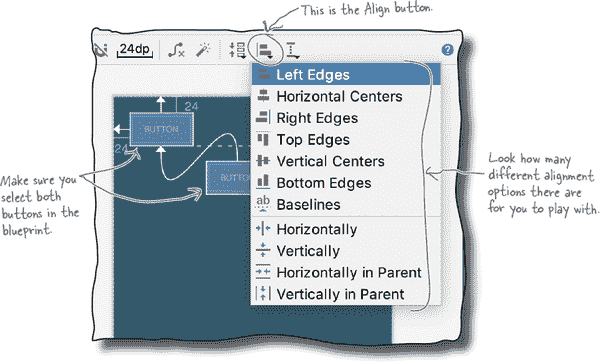

点击“左对齐”选项，将两个按钮左对齐。这样会在蓝图中添加一个约束，将它们的左边缘连接在一起，就像这样：

# 使用准线对齐视图

另一种对齐视图的技术是**准线**。这是在蓝图中添加的固定线，可以用来约束视图。它在设计编辑器中可见，用户运行应用时看不到。

让我们通过向蓝图添加一个准线来探讨准线的工作方式。点击设计编辑器工具栏中的准线按钮，并选择添加垂直准线选项。这会在蓝图中放置一个垂直准线：

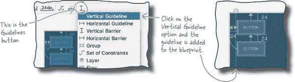

添加准线后，您可以通过拖动它将其移动到其他位置。您可以将其设置为距离蓝图边缘的固定距离，或者固定百分比：

然后，您可以使用约束将视图附加到准线，就像这样：

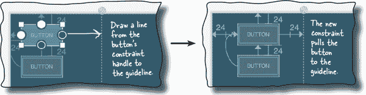

# 准线有固定的位置

准线可以位于蓝图边缘的固定距离，或两者之间的固定百分比。它们在应用运行时保持在那个位置，因此它们是对齐视图的有用方式。

在某些情况下，您需要更灵活的东西。例如，假设您有一个包含两个并排多行编辑文本和一个按钮的布局，就像这样：

随着用户输入文本，编辑文本会垂直扩展。您希望按钮随着视图的大小变化而移动，以便始终位于它们的下方，就像这样：

那么，您如何构建这种布局呢？

# 创建一个可移动的屏障

要创建这样的布局，您可以使用**屏障**。这类似于准线，但它没有固定位置。相反，它形成对视图的屏障，并在它们改变大小时移动。这会重新定位任何被约束到屏障的视图。

在上一页的示例中，两个编辑文本放置在一个水平屏障上方，按钮被约束在其下方。随着编辑文本的扩展，屏障移动并重新定位按钮：

## 让我们构建一个使用屏障的布局

要了解屏障的工作原理，请创建此示例。

首先，删除任何视图，并确保蓝图包含一个垂直准线，位置位于 50%。然后从工具栏拖动两个多行编辑文本，并将它们放置在准线的两侧。

###### 注意

您通常可以在调色板的“文本”部分找到它们，列为“多行文本”。

接下来，添加垂直约束以将每个视图约束到蓝图的顶部，并添加水平约束以将每个视图放置在蓝图边缘和指导线之间。

最后，将每个编辑文本的`layout_width`更改为 0dp，以匹配其水平约束，并将它们的`layout_height`设置为“wrap_content”，以便视图可以扩展。

完成后，蓝图应该是这个样子：

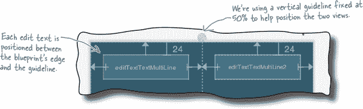

# 添加一个水平屏障

我们需要在蓝图中添加一个水平屏障。要做到这一点，请点击设计编辑器工具栏中的“指南线”按钮，并选择添加水平屏障的选项：

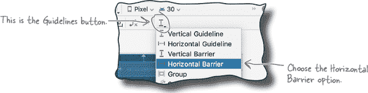

这样就创建了水平屏障。

## 将屏障放置在视图下方

我们希望屏障随着两个编辑文本视图的扩展而向下移动。为此，请转到布局的组件树面板，将两个编辑文本组件拖放到屏障上：

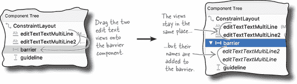

这不会改变蓝图中编辑文本视图的位置，而是告诉屏障它需要随这些视图移动。

接下来，我们需要将屏障定位到两个视图的底部。在组件树中选择屏障，并使用属性面板将其`barrierDirection`属性更改为“bottom”。这将使屏障位于两个编辑文本的下方，使蓝图看起来像这样：

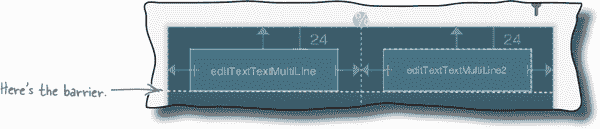

# 将一个按钮约束在屏障下方

现在布局的屏障已经就位，让我们添加按钮，并将其约束到屏障上，以便在编辑文本视图扩展时向下移动。

首先，从调色板中拖动一个按钮到蓝图中，并将其放置在屏障下方的某个位置。然后通过添加两个水平约束，将按钮的两侧连接到蓝图的边缘，使其水平居中，操作如下：

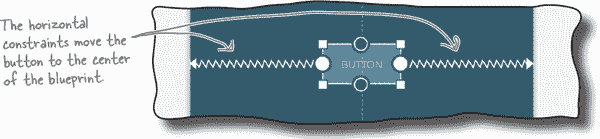

接下来，您需要将按钮的顶部连接到屏障。您可以尝试直接在蓝图中绘制约束来完成此操作。如果像我们一样觉得这有点麻烦，请选择按钮，在属性面板中搜索其`layout_constraintTop_toBottomOf`属性，并将其值更改为屏障的 ID（在我们的情况下，这是`@id/barrier`）。

完成这些更改后，蓝图应该看起来像这样：

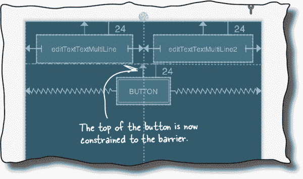

由于刚开始使用屏障可能会有些棘手，我们将在接下来的几页中展示我们的完整 XML，并进行应用程序的测试。

# *activity_main.xml*的完整代码如下：

这是我们的*activity_main.xml*的完整代码；如果你希望你的蓝图看起来像我们的一样，请替换此文件的内容，使其与此处显示的代码匹配：

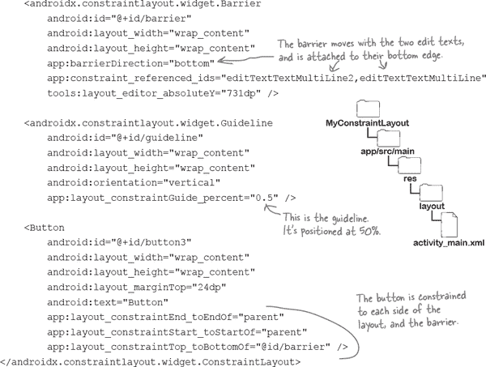

#  Test Drive

当我们运行应用程序时，按钮显示在两个编辑文本视图下方。当我们在每个编辑文本中输入内容时，按钮会向下移动，并且视图会扩展。

正如您所见，添加屏障比绘制约束和对齐视图更复杂，但我们认为这是值得额外努力的。

接下来做什么？

# 使用链条来控制一组线性视图

您现在已经学会了如何连接和对齐视图，并使用指南和约束。但是如果您想创建一行或一列视图，并将它们均匀间隔开来，该怎么办呢？

在这种情况下，您可以使用**链条**。这是一组线性视图，通过双向约束连接在一起。链条控制每个视图的位置，因此您可以使用它来均匀间隔视图或将它们打包在蓝图的中心。

## 我们将创建一个水平链条

要了解其工作原理，我们将创建一个链条，以控制三个按钮的位置。这些按钮将水平排列，并在蓝图的两侧均匀间隔，如下所示：

当应用程序运行时，按钮将保持它们的相对位置，无论屏幕大小或方向如何：

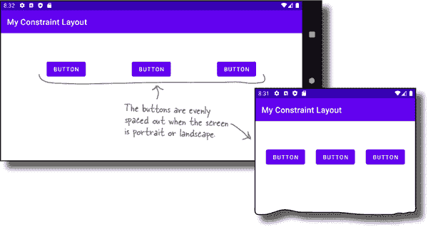

让我们看看如何创建链条。

# 链条将使用三个按钮

在创建链条之前，首先移除到目前为止已添加到蓝图中的所有约束。最快的方法是使用设计编辑器工具栏中的“清除所有约束”按钮，所以现在点击此按钮。

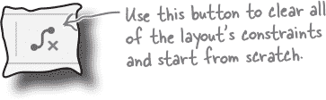

您还需要清除任何指南、屏障和编辑文本视图。通过选择每个视图并将其删除来完成此操作。

然后在蓝图中添加两个额外的按钮，以确保总共有三个按钮，并使用设计编辑器工具栏中的“预览方向”按钮将蓝图的方向更改为横向。这将使链条更容易看到。

当您添加了按钮后，蓝图应该看起来像这样：

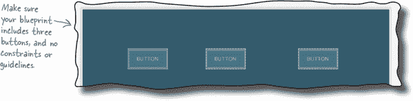

## 对我们打算链条的视图进行对齐

链条在视图对齐时效果最佳。首先，添加一个约束将第一个按钮连接到蓝图的顶部，并将其边距设置为 64 像素。然后选择所有三个按钮，并在设计编辑器工具栏中使用对齐按钮将它们的顶部对齐。蓝图应该看起来像这样。

现在按钮已经很好地对齐，让我们继续创建链条。

# 创建水平链条

要创建链条，请选择所有三个按钮，然后右键单击其中一个。在出现的菜单中，选择“Chains”选项，然后选择“Create Horizontal Chain”。

创建水平链条后，它将连接按钮，并将第一个和最后一个视图固定在蓝图的垂直边缘上。链条应该看起来像这样：

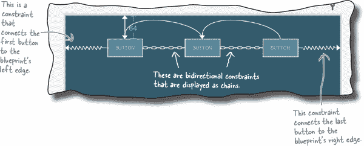

默认情况下，链中的视图在蓝图的边缘之间均匀分布。您可以通过右键单击链中的一个视图，从显示的菜单中选择链选项，然后选择水平链样式来更改此行为。

可能的链样式选项包括 spread、spread inside 和 packed。通过尝试以下练习，看看您是否能理解这些选项的作用。

# 有不同风格的链

正如您发现的那样，您可以选择不同的链样式来更改链如何安排其视图。

## Spread 将视图间隔开来，直到达到蓝图的边缘

默认样式是**spread**。这用于在蓝图的边缘之间均匀分布视图，如此所示：

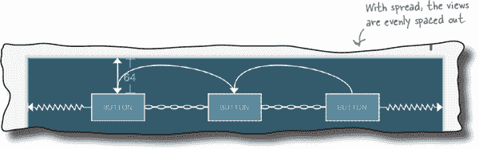

## Spread inside 将第一个和最后一个视图移到边缘

**spread inside**风格类似于 spread，但它将第一个和最后一个视图移到蓝图的边缘。然后均匀地间隔任何剩余的视图，如下所示：

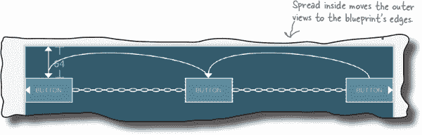

## Packed 将视图移动到一起

**packed**样式用于将视图打包在一起。然后将整个视图组居中，如此所示：

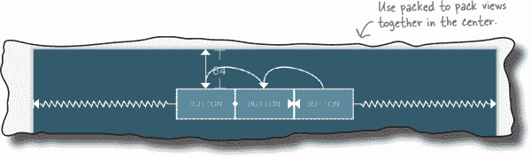

现在您已经看到这些选项的作用，请让我们测试一下应用程序。

#  测试驾驶

当我们使用链的 spread 样式并运行应用程序时，按钮在设备屏幕上均匀分布。这与屏幕方向无关。

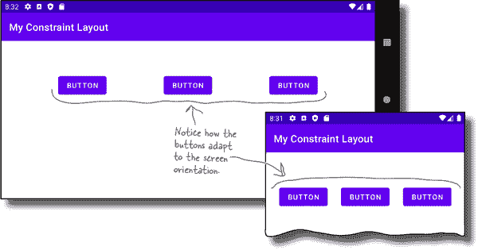

> **始终在各种设备大小和方向上测试布局，以确保其外观和行为符合预期。**

**她是对的。**

约束布局可以包括水平和垂直链，并且单个视图可以属于两种类型。您可以使用这个功能来安排视图在网格中。

例如，下面的蓝图显示了一个网格中排列的六个按钮。每一行都是水平链，而最左边的按钮形成了垂直链：

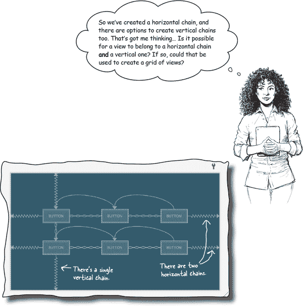

另一种创建网格的方法是使用**flow**。让我们找出这是什么，以及如何使用它。

# flow 类似于多行链

flow 类似于一个可以跨越多行的链。当您想在一行中显示大量视图，但是在某些屏幕大小或方向上可能不适合时，这将非常有价值。

例如，假设你有一个链，它在水平排列中显示六个按钮。当方向是横向时，它们显示如下：

但是当方向改变为纵向时，没有足够的空间来显示所有的视图：

如果您用 flow 替换链，任何无法适合第一行的视图将流到第二行，如此所示：

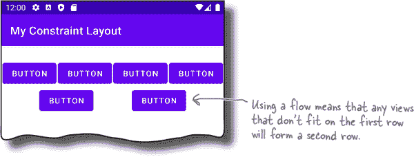

让我们通过构建上面的布局来看一下 flows 是如何工作的。

# 如何添加一个 flow

首先，在设计编辑器工具栏中点击“清除所有约束”按钮来移除所有约束。然后向蓝图添加额外的按钮，总共六个，就像这样：

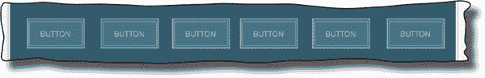

接下来，选择所有按钮，在设计编辑器工具栏中点击“指南线”按钮，选择“流”选项。这将添加流组件。

现在我们需要调整流组件的设置，使其按我们希望的方式运行。为此，请在组件树中选择流，然后使用蓝图或约束部件将其边缘和顶部连接起来添加约束。将其`layout_width`属性设置为“0dp”，以便与其约束匹配。最后，在属性面板中搜索其`flow_wrapMode`属性，并将其设置为“chain”。

当你完成所有这些更改后，蓝图在横屏时应该看起来像这样：

如果将方向改为竖屏，则蓝图应该如下所示：

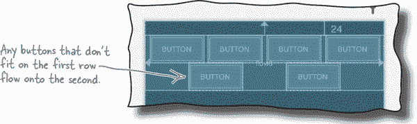

创建流后，你可以调整它显示视图的方式。让我们看看如何操作。

# 你可以控制流的外观

你可以通过其`**flow_wrapMode**`属性来更改流的外观。

## 使用“chain”创建多行链条

如果将`flow_wrapMode`属性设置为`chain`，则流将像灵活的链条一样运行，允许其视图流入额外的行。

使用此选项，可以通过更改其`flow_horizontalStyle`属性的值来进一步调整流的外观。此属性的可能选项有 spread、spread inside 和 packed。例如，packed 选项会将视图紧密打包在一起，如此显示：

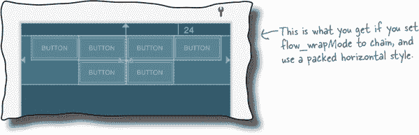

## 使用“aligned”来对齐视图

如果将`flow_wrapMode`属性设置为`aligned`，则视图将流入额外的行，并且会像这样对齐排列：

你还可以将`flow_wrapMode`属性设置为`none`或者不设置。这使得流行为正常链条，以便其视图不会流入第二行。

# activity_main.xml 的完整代码

有时流可能会有点棘手，所以这是我们*activity_main.xml*的完整代码；如果需要，请使用此处显示的代码替换该文件的代码：

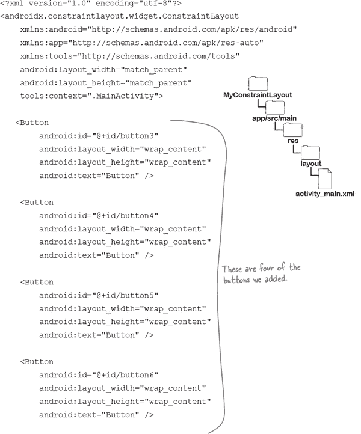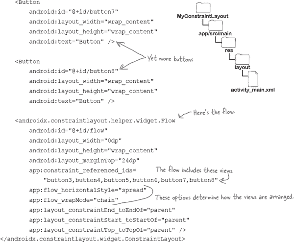

让我们来测试一下这个应用程序。

#  测试驾驶

当我们使用链条风格的流并运行应用程序时，在横屏方向上，按钮在设备屏幕上均匀分布。

当我们将方向改为竖屏时，无法放在第一行的按钮会流入第二行。

恭喜！你现在已经学会了如何使用约束布局设计超级灵活的屏幕。它们不仅能够按照你的意愿外观和行为，而且不使用嵌套布局，因此非常高效。

> **在你进入下一章之前，为什么不将你的新技能付诸实践，并尝试一些你学到的技术呢？**

# 你的 Android 工具箱

**你已经掌握了第四章，并且现在已经将约束布局添加到你的工具箱中。**

