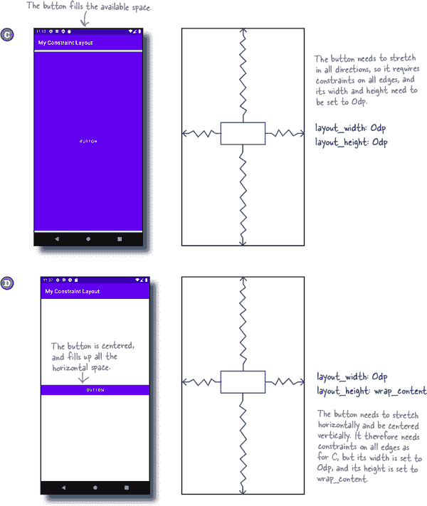

# 第四章：约束布局：*绘制蓝图*。

**没有蓝图就不要建房子**。

有些布局使用**蓝图**来确保它们**看起来完全符合您的要求**。在本章中，我们将向您介绍 Android 的**约束布局**：一种**设计更复杂 UI 的灵活方式**。您将了解如何使用**约束**和**偏置**来定位和调整视图的大小，**无论屏幕尺寸和方向如何**。您将了解如何使用**指南线**和**障碍物**来保持视图的位置。最后，您将学习如何使用**链**和**流**来排列或展开视图。让我们开始设计吧……

# 重新审视嵌套布局。

在前一章中，您了解到可以嵌套布局以构建更复杂的屏幕。例如，以下代码使用嵌套线性布局以水平排列显示文本视图和编辑文本，在它们下方是一个编辑文本：

# 嵌套布局是有代价的。

嵌套布局的缺点在于，以这种方式构建复杂布局可能效率低下，使您的代码更难阅读和维护，并且还可能减慢应用程序的运行速度。

当 Android 在设备屏幕上显示布局时，它首先检查布局文件的结构，并使用此来构建视图的层次结构。例如，在上一页显示的嵌套布局中，它构建了一个包含两个线性布局、两个编辑文本和一个文本视图的视图层次结构：

Android 使用视图层次结构来帮助确定每个视图应该放置在设备屏幕的位置。每个视图都需要进行测量、布局和绘制在屏幕上，并且 Android 需要确保每个视图有足够的空间容纳其内容，并考虑任何权重。

如果布局包含嵌套布局，则视图层次结构更加复杂，Android 可能需要进行多次处理以确定如何排列视图。如果布局嵌套深度很深，这可能导致代码中的瓶颈，并且可能使您的代码难以阅读和维护。

如果您有像这样更复杂的 UI，使用**约束布局**是避免使用嵌套布局的一种替代方法。

> **布局中的每个视图都需要进行初始化、测量、布局和绘制。在深度嵌套布局中，这可能会减慢您的应用程序。**

# 介绍约束布局

约束布局比线性布局或帧布局复杂，但更加灵活。对于复杂的 UI 来说，它也更有效率，因为它提供了一个更扁平的视图层次结构，这意味着 Android 在运行时需要做更少的处理。

## 您可以视觉化地设计约束布局。

使用约束布局的另一个优势是，它专门设计用于与 Android Studio 的设计编辑器配合使用。与通常需要直接在 XML 中进行操作的线性布局和帧布局不同，你可以在设计编辑器的蓝图中视觉化地构建约束布局。你可以将视图拖放到设计编辑器中，并为每个视图指定显示方式的指令：

> **使用约束布局构建灵活的 UI，而无需嵌套布局。**

与线性布局和帧布局不同，约束布局是称为 **Android Jetpack** 的一套库中的一部分。你可能已经听说过 Jetpack 的一些内容，但它究竟是什么？

# 约束布局是 Android Jetpack 的一部分

Android Jetpack 是一组库，帮助你遵循最佳实践，减少样板代码，并简化编码生活。它包括约束布局、导航、Room 持久性库（帮助你构建数据库）等等。

这里是我们喜爱的一些 Jetpack 组件；你将在后面的章节中学习如何使用它们：

Jetpack 的另一个优点是，它可以让你编写在新旧版本的 Android 上都一致工作的代码。这对你的用户来说是个好消息，因为这意味着你可以在旧设备上包含令人兴奋的新 Android 功能。

例如 `AppCompatActivity`，你已经在使用它来编写活动代码。我们之前没有提到，但 `AppCompatActivity` 是 Android Jetpack 的一部分。它为新旧版本的 Android 添加了新功能，而你无需担心向后兼容性问题。

###### 注意

是的！在不知不觉中，你已经在使用 Android Jetpack 的一部分。通过本书的其余部分，你将更多地了解如何使用 Jetpack。

在本章中，你将学习如何使用约束布局。让我们先了解一下接下来要做什么。

# 这是我们将要做的事情

我们将把学习约束布局分成两个主要部分：

1.  **如何定位和调整单个视图的位置和大小。**

    你将学习如何使用约束和偏差来控制单个视图在其布局中的显示位置和方式。

    

1.  **如何定位和调整多个视图的位置和大小。**

    然后，你将应用你的知识到多个视图，并学习使用指南、障碍物、链和流的更高级技术。

    

## 创建一个新项目

我们将使用一个新项目来构建我们的应用程序，因此现在按照前几章节的步骤创建一个项目。选择空活动选项，输入名称“我的约束布局”，包名为“com.hfad.myconstraintlayout”，并接受默认的保存位置。确保语言设置为 Kotlin，最低 SDK 版本为 API 21，这样它就可以运行在大多数 Android 设备上。

现在我们已经创建了项目，让我们确保它已设置为使用约束布局。

# 使用 Gradle 包含 Jetpack 库

为了确保所有 Jetpack 库（包括约束布局）在所有 Android 版本上都能正常工作，它们不包含在主 Android SDK 中。相反，您必须使用**Gradle**添加您需要的任何库。这是一个用于编译代码、配置应用程序并获取项目所需的任何额外库的构建工具。

每次创建新项目时，Android Studio 都会创建两个名为***build.gradle***的 Gradle 文件。

*build.gradle*的第一个版本位于*project*文件夹中，并指定应用程序的基本设置，例如要使用的 Gradle 插件的版本。

*build.gradle*的第二个版本位于项目的*app*文件夹中。这是设置大多数应用程序属性的地方，例如 API 级别。

> **在幕后，每个 Android Studio 项目都使用 Gradle 作为其构建工具。**

## 项目 build.gradle 需要一个 Google 存储库行

每个项目都需要知道在哪里找到所需的额外 Jetpack 库，这是通过在**项目**的*build.gradle*文件中添加对 Google 存储库的引用来完成的。Android Studio 通常会为您执行此操作，但您可以通过打开文件*MyConstraintLayout/build.gradle*，并在`allprojects`下的`repositories`部分查找以下行（加粗）来确保它存在：

## 应用程序 build.gradle 包含约束布局的库

要使用约束布局，需要在**app**的*build.gradle*文件中包含对其库的引用。Android Studio 应该已经为您添加了这个，但您可以通过打开文件*MyConstraintLayout/app/build.gradle*，并在`dependencies`部分查找以下行（加粗）来进行双重检查：

如果文件中不包含此行，请立即添加，并单击代码编辑器中出现的“立即同步”选项。这将使您所做的任何更改与项目的其余部分同步，并添加库。

# 让我们将约束布局添加到 activity_main.xml 中

现在，您的项目已经准备好使用约束布局，让我们开始使用它。

您可以使用`**<androidx.constraintlayout.widget.ConstraintLayout>**`元素向布局文件添加约束布局。我们将在*app/src/main/res/layout*文件夹中的布局文件*activity_main.xml*中使用一个，因此打开此文件，并确保其代码如下所示：

## 在蓝图中显示布局

我们将使用设计编辑器的蓝图向布局添加视图。通过单击 Design 选项切换到设计编辑器，单击编辑器工具栏中的选择设计表面按钮，并选择蓝图选项。这将向您显示布局的蓝图，如下所示：

# 向蓝图添加一个按钮

我们将在布局中添加一个按钮。要做到这一点，进入设计编辑器的工具栏，找到按钮组件（通常在常见部分），并将其拖动到蓝图中。你可以把按钮放在蓝图的任何位置，只要它出现在其主要区域中，就像这样：

# 使用约束来定位视图

在约束布局中，你不是通过将视图放置在蓝图的特定位置来指定视图应该放置在哪里。而是通过定义约束来指定位置。**约束**是一种连接或附件，告诉布局视图应该放在哪里。例如，你可以使用约束将视图附加到布局的起始边缘，或者在另一个视图的下方。

## 我们将给按钮添加一个水平约束

看看这是如何工作的，我们来添加一个约束，将按钮附加到布局的左边缘。

首先，确保通过点击按钮选择它。当你选择一个视图时，会在其周围绘制一个边界框，并在其角落和边缘添加手柄。角落的手柄允许你调整视图的大小，而边缘上的手柄则允许你添加约束：

要添加约束，请点击视图的约束手柄之一，并将其拖动到要附加到的位置。在这种情况下，我们将按钮的左边缘附加到布局的左边缘，因此点击左侧约束手柄并将其拖动到蓝图的左边缘：

这样添加了约束，并将按钮拉到了左边：

这就是添加水平约束的方式。我们来看看当你添加垂直约束时会发生什么。

# 也可以添加垂直约束

我们将使用垂直约束将按钮附加到布局的顶部。要做到这一点，请点击按钮的顶部约束手柄，并将其拖动到蓝图的顶部。这将添加垂直约束，将按钮向上拉动。

# 使用对立约束来使视图居中

如你所学，你可以使用约束将视图附加到蓝图的边缘。每个约束都像一个弹簧，将视图拉到蓝图的边缘。

如果你想要将视图定位在蓝图的中心，可以通过添加约束到视图的相对边缘来实现。例如，要水平居中一个按钮，你可以添加一个约束将视图向左拉，另一个约束将其向右拉，就像这样：

这两个约束朝相反方向拉动按钮，使其水平居中，就像这样：

你还可以通过给视图的顶部和底部边缘添加约束来将其垂直居中。如果你想要水平和垂直居中它，你需要像这样添加四个边缘的约束：

# 你可以删除不再需要的约束

您可以通过在蓝图中选择它们并删除它们来移除任何不再需要的约束。例如，如果您有一个按钮位于蓝图中央，您可以删除附加到其底部边缘的约束：

删除此约束意味着按钮不再被拉向蓝图底部。顶部约束将按钮拉到顶部，使其仅在水平方向上居中，而不是在垂直方向上：

另一种移除不再需要的约束的方法是使用约束部件工具。让我们看看它是如何工作的。

# 使用约束部件删除约束

约束部件显示在设计编辑器侧边的属性面板中。选择一个视图时，它会显示包含视图约束和任何边距大小的图表。

###### 注意

几页后您将更多地了解属性面板。

要删除约束部件中的约束，请在蓝图中选择要从中移除约束的视图，然后单击约束部件中约束的手柄。约束将被移除，并且视图将在蓝图中重新定位。

## 你可以用它来添加边距

您可能已经注意到约束部件中的每个约束旁边都有一个数字。这用于设置视图与布局边缘之间的边距大小，以便在图表中将视图的左侧和顶部边距大小更改为 24dp，例如，您会更新它们的值到 24。

您可以通过设计编辑器工具栏中的默认边距按钮设置任何新边距的默认大小。例如，将其设置为 24dp，这意味着任何添加的新约束都将自动包含 24dp 的边距。

# 蓝图的更改会在 XML 中显示

当您向蓝图添加视图并指定约束和边距时，它们将添加到布局的底层 XML 中。要查看此内容，请切换到布局的代码视图。您的代码应该看起来像这样（但如果略有不同也不用担心）：

正如你所见，XML 现在包含一个按钮。它的代码看起来熟悉吗？如果是的话，很好——它包含了你在第三章学到的属性。

按钮的宽度、高度和边距的指定方式与之前完全相同，如果愿意，你可以在 XML 中更改它们的值，而不使用设计编辑器。

唯一不熟悉的代码是指定视图在其开始和顶部边缘上的约束的两行：

如果您添加约束到按钮的其余边缘，将生成类似的代码。

现在，您已经简要了解了约束布局 XML 的外观，请切换回设计编辑器，我们将查看更多可以用来定位视图的技术。

# 视图可以具有偏差

正如您之前学到的，您可以向视图的相对侧添加约束条件。这会默认将视图居中，但您也可以通过更改其**偏差**来控制其相对于每个侧面的位置。这告诉 Android 每个约束条件在视图每侧的比例长度应该是多少。

要看到这一过程，让我们将按钮的水平偏差更改，使其偏离中心位置。首先确保按钮包括其左右两侧的约束条件，如下所示：

然后选择按钮，以显示约束小部件。

在小部件视图的图表下方，您会看到一个带有数字的滑块。这是视图水平偏差的百分比。

要更改偏差，只需移动滑块。例如，如果将滑块向左移动，使数字更改为 30，则蓝图中的按钮也会向左移动：

无论屏幕大小和方向如何，视图都会保持这种相对位置。让我们通过对应用程序进行测试驾驶来尝试一下。

#  测试驾驶

当我们运行应用程序时，按钮出现在屏幕顶部的偏离中心位置。当我们旋转设备时，它保持相同的相对位置。

您现在已经学会了多种技术来控制视图在屏幕上的位置。接下来，我们来看看如何更改其大小。

# 您可以更改视图的大小

正如您可能期望的那样，您可以通过更新其`layout_width`和`layout_height`属性来更改约束布局中视图的大小。您可以在布局的 XML 中执行此操作，或者在设计编辑器的属性面板中执行此操作。

属性面板显示在蓝图的侧边。当您选择一个视图时，它会显示已经声明的所有属性（例如`layout_width`和`layout_height`），并允许您设置尚未设置的属性。

## 使视图足够大

就像线性布局和帧布局一样，通过将其`layout_width`和`layout_height`属性设置为`wrap_content`，您可以使视图足够大以显示其内容。例如，如果视图是按钮，则使按钮足够大以容纳其文本：

## 符合视图的约束条件

如果您已经向视图的相对侧添加了约束条件，可以使视图匹配其约束条件的大小。您可以通过将其`layout_width`和/或`layout_height`设置为 0dp 来实现这一点：将`layout_width`设置为 0dp 以使视图匹配其水平约束条件，并将`layout_height`设置为 0dp 以使其匹配其垂直约束条件。

在下面的示例中，我们已将按钮的`layout_width`设置为 0dp，以使按钮与其水平约束匹配：

现在你已经学会了如何调整视图的大小，请尝试使用不同的技巧进行实验，然后尝试下一页上的练习。

# 成为约束

**你的任务是像约束布局一样进行操作，并绘制生成每个布局所需的约束。还需要为每个视图指定`layout_width`、`layout_height`和偏差（如果需要）。我们已经为第一个示例完成了。**

# 成为约束解决方案

**你的任务是像约束布局一样进行操作，并绘制生成每个布局所需的约束。还需要为每个视图指定`layout_width`、`layout_height`和偏差（如果需要）。我们已经为第一个示例完成了。**

# 大多数布局需要多个视图

到目前为止，你已经学会了如何在约束布局中定位和调整单个视图的大小。然而，大多数情况下，你的布局需要包含多个相对定位的视图。

要了解其工作原理，请确保你的约束布局包含一个单独的按钮，并具有两个约束：一个将其顶部边缘连接到蓝图的顶部，另一个将其左边缘连接到蓝图的左侧。其`layout_width`和`layout_height`属性应设置为`wrap_content`，这些边缘的边距应设置为 24dp。

在完成这些更改后，按钮应该位于蓝图的左上角，如下所示：

## 在蓝图中添加第二个按钮

接下来，从调色板中拖动一个第二个按钮添加到蓝图中，并将其放置在第一个按钮的下方某处，如下所示：

现在蓝图中包含两个按钮。让我们看看如何相对定位它们。

# 你可以将视图连接到其他视图

如你所知，约束允许你将视图附加到其蓝图的边缘。你还可以使用约束将两个视图连接在一起，这用于指定它们相对于彼此的显示方式。

要了解其工作原理，请在蓝图中选择第二个按钮，然后绘制一个约束，将第二个按钮的顶部边缘连接到第一个按钮的底部边缘，如下所示：

添加约束后，将按钮上移，使其连接到第一个按钮并显示在其下方：

约束条件意味着无论第一个按钮在设备屏幕上的位置如何，第二个按钮始终位于第一个按钮的下方。

通过这种方式定位了两个视图后，接下来可能想要做的是确保它们对齐。我们来看看如何做到这一点。

# 你也可以对齐视图

将两个视图对齐的最简单方法是使用设计编辑器工具栏中的对齐按钮。

为了看看这是如何工作的，让我们将蓝图中的两个按钮左对齐，使它们的左边缘对齐。首先，通过按住 Shift 键并单击每个按钮来选择两个按钮。然后点击对齐按钮以打开一组对齐选项，如下所示：

点击“左边缘”选项以左对齐两个按钮。这将向蓝图添加一个约束，将它们的左边缘连接在一起，如下所示：

# 使用指南线对齐视图

另一种你可以用来对齐视图的技术是**指南线**。这是你添加到蓝图中的固定线条，可用于限制视图。在设计编辑器中可见，但用户在运行应用时看不到它。

让我们通过在蓝图中添加一条指南线来探索指南线的工作原理。点击设计编辑器工具栏中的指南线按钮，并选择添加垂直指南线的选项。这将在蓝图中放置一条垂直指南线：

一旦添加了指南线，您可以通过拖动来移动它。您可以设置它要么是距离蓝图边缘的固定距离，要么是固定百分比：

然后您可以使用约束将视图附加到指南线，如下所示：

# 指南线有固定位置

指南线要么位于距离蓝图边缘的固定距离处，要么位于两者之间的固定百分比处。它们在应用运行时保持在该位置，因此是对齐视图的有用方式。

在某些情况下，您需要更灵活的东西。例如，假设您有一个包括两个并排的多行编辑文本和一个按钮的布局，如下所示：

随着用户输入文本，编辑文本垂直扩展。您希望按钮在视图大小变化时移动，以便始终位于它们的下方，如下所示：

那么您如何构建这种布局呢？

# 创建一个可移动的屏障

要创建这样的布局，您可以使用**屏障**。这类似于指南线，但它没有固定位置。相反，它形成一个对视图的屏障，并在它们大小变化时移动。这将重新定位任何与屏障约束的视图。

在前一页的示例中，两个编辑文本位于水平屏障上方，并且按钮在其下方约束。随着编辑文本的扩展，屏障移动并重新定位按钮：

## 让我们建立一个使用屏障的布局

要了解屏障的工作原理，让我们创建这个示例。

首先，删除任何视图，并确保蓝图包含在 50%处定位的垂直指南线。然后，从工具栏拖动两个多行编辑文本，并将它们定位在指南线的两侧。

###### 注意

您通常可以在调色板的“文本”部分找到这些，列为“多行文本”。

接下来，添加垂直约束，将每个视图约束到蓝图的顶部，并添加水平约束，使每个视图位于蓝图边缘和指导线之间。

最后，将每个编辑文本的`layout_width`更改为 0dp，以匹配其水平约束，并将它们的`layout_height`设置为“wrap_content”，以便视图可以展开。

完成后，蓝图应该看起来像这样：

# 添加水平障碍

我们需要在蓝图中添加一个水平障碍物。要做到这一点，请在设计编辑器工具栏中点击“指南线”按钮，并选择添加水平障碍的选项：

这样就创建了水平障碍。

## 将障碍物放置在视图下方

我们希望随着两个编辑文本视图的展开，障碍物向下移动。为此，请转到布局的组件树面板，将两个编辑文本组件拖到障碍物上：

这不会改变蓝图中编辑文本视图的位置，而是告诉障碍物它需要随这些视图移动。

接下来，我们需要将障碍物定位在两个视图的底部。在组件树中选择障碍物，并使用属性面板将其`barrierDirection`属性更改为“bottom”。这将障碍物放置在两个编辑文本视图的下方，使蓝图看起来像这样：

# 将按钮约束在障碍下方

现在，布局的障碍物已经就位，让我们添加按钮，并将其约束到障碍物上，以便随着编辑文本视图的展开而向下移动。

首先从调色板拖动一个按钮到蓝图上，并将其放置在障碍物的下方某处。然后通过添加两个水平约束将其水平居中，这些约束将按钮的边缘连接到蓝图的边缘，如下所示：

接下来，您需要将按钮的顶部连接到障碍物。您可以尝试在蓝图中直接绘制约束来完成此操作。如果像我们一样觉得这有点麻烦，请选择按钮，然后在属性面板中搜索其`layout_constraintTop_toBottomOf`属性，并将其值更改为障碍物的 ID（在我们的情况下，这是`@id/barrier`）。

完成此更改后，蓝图应该看起来像这样：

由于一开始使用障碍物可能会有些棘手，我们将在接下来的几页中展示完整的 XML，并进行应用程序测试驾驶。

# *activity_main.xml*的完整代码

这是我们的*activity_main.xml*的完整代码；如果您希望您的蓝图看起来像我们的一样，请替换此文件的内容，以便与此处显示的代码匹配。

#  测试驾驶

当我们运行应用程序时，一个按钮显示在两个编辑文本视图的下方。当我们在每个编辑文本中输入时，按钮向下移动，视图会扩展。

如您所见，添加屏障比绘制约束和对齐视图复杂些，但我们认为额外的努力是值得的。

下一步是什么？

# 使用链条控制线性视图组

现在您已经学会了如何连接和对齐视图，以及使用指南和约束。但如果您想创建一行或一列视图，并均匀间隔它们呢？

在这种情况下，您可以使用**链条**。这是一组线性视图，通过双向约束链接在一起。链条控制每个视图的位置，因此您可以使用它来均匀间隔视图，或将它们打包在蓝图的中心。

## 我们将创建一个水平链

为了看看这是如何工作的，我们将创建一个控制三个按钮位置的链条。按钮将排成水平行，并在蓝图的两侧均匀间隔，如下所示：

当应用运行时，按钮将保持它们的相对位置，无论屏幕大小或方向如何：

让我们看看如何创建一个链条。

# 链条将使用三个按钮

在创建链条之前，请先删除到目前为止已添加到蓝图的所有约束。最快的方法是使用设计编辑器工具栏中的“清除所有约束”按钮，现在点击此按钮。

您还需要摆脱任何指南、屏障和编辑文本视图。通过选择每个视图，然后将其删除来完成此操作。

然后向蓝图添加两个按钮，使总数达到三个，并使用设计编辑器工具栏中的“预览方向”按钮将蓝图的方向更改为横向。这样可以更容易地看到链条。

当您添加完按钮后，蓝图应该看起来像这样：

## 对齐我们将要链条的视图

当视图对齐时，链条效果最佳。首先添加将第一个按钮连接到蓝图顶部的约束，并将其边距设置为 64。然后选择所有三个按钮，并使用设计编辑器工具栏中的“对齐”按钮将它们的顶部边缘对齐。蓝图应该如此。

现在按钮已经很好地对齐，让我们继续创建链条。

# 创建水平链

要创建链条，请选择所有三个按钮，然后右键单击其中一个。从出现的菜单中选择“链条”选项，然后选择“创建水平链条”。

创建水平链时，它会将按钮连接起来，并将第一个和最后一个视图固定在蓝图的垂直边缘。链条应该看起来像这样：

默认情况下，链中的视图在蓝图的边缘之间均匀分布。您可以通过右键单击链中的一个视图，在出现的菜单中选择"Chains"选项，然后选择"水平链样式"来更改此行为。

可能的链式风格选项包括展开、展开内部和紧凑。通过尝试以下练习，看看你能否弄清楚这些选项的作用。

# 有不同风格的链

正如您所发现的，您可以选择不同的链式风格来改变链如何排列其视图。

## 展开将视图间隔开到蓝图的边缘

默认样式是**展开**。这用于在蓝图的边缘之间均匀分布视图，如下所示：

## 把第一和最后视图移到边缘

**展开内部**风格类似于展开，但它将第一和最后视图移动到蓝图的边缘。然后均匀间隔任何剩余的视图，如下所示：

## 紧凑将视图移到一起

**紧凑**风格用于紧密排列视图。它像这样将整组视图居中：

现在您已经了解了这些选项的作用，请让我们对这款应用进行测试驾驶。

#  测试驾驶

当我们使用展开链的样式并运行应用程序时，按钮在设备屏幕上均匀分布。这与屏幕方向无关。

> **始终在各种设备尺寸和方向上测试布局，以确保其外观和行为符合预期。**

**她是对的。**

约束布局可以包括水平链和垂直链，一个单独的视图可以同时属于这两种类型。您可以使用这种方法来在网格中排列视图。

例如下面的蓝图显示了以网格排列的六个按钮。每一行都是水平链，最左边的按钮形成了垂直链：

另一种创建网格的方法是使用**流**。让我们找出这是什么，以及如何使用它。

# 流就像是一条多行链

一个流就像一条可以跨越多行的链条。例如，当你想在一行中显示许多视图，但由于某些屏幕尺寸或方向的原因它们可能不适合屏幕时，它就非常有价值。

例如，假设您有一个链，它在水平行中显示六个按钮。当方向是横向时，它们显示如下：

但当方向更改为纵向时，没有足够的空间来显示所有视图：

如果用流替换链，任何不能适合第一行的视图将流到第二行，就像这样：

让我们看看流是如何工作的，通过构建上述布局。

# 如何添加一个流

首先，在设计编辑器工具栏上点击“清除所有约束”按钮以移除任何约束。然后向蓝图添加额外的按钮，使总数达到六个，就像这样：

接下来，选择所有按钮，点击设计编辑器工具栏中的“指南线”按钮，然后选择“流程”选项。这将添加流程组件。

现在我们需要调整流程组件的设置，使其表现出我们想要的行为。为此，选择组件树中的流程，然后使用蓝图或约束小部件添加约束，连接其侧面和顶部到蓝图的边缘。将其`layout_width`属性更改为“0dp”，使其与其约束匹配。最后，在属性面板中搜索其`flow_wrapMode`属性，并将其设置为“chain”。

当您完成所有这些更改时，当方向为横向时，蓝图应该看起来像这样：

如果将方向更改为纵向，则蓝图应该如下所示：

创建流程后，您可以调整其显示视图的方式。让我们看看如何操作。

# 您可以控制流程的外观

您可以通过`**flow_wrapMode**`属性来改变流程的外观。

## 使用“chain”来创建多行链

如果将`flow_wrapMode`属性设置为`chain`，则流程将表现得像一个灵活的链条，允许其视图流到额外的行。

使用这个选项，您可以通过更改其`flow_horizontalStyle`属性的值进一步改变流程的外观。该属性的可能选项有 spread、spread inside 和 packed。例如，packed 选项会将视图紧密打包在一起，像这样：

## 使用“aligned”来对齐视图

如果将`flow_wrapMode`属性设置为`aligned`，视图会流到额外的行，并且会像这样对齐：

您还可以设置`flow_wrapMode`属性为`none`或者不设置。这将使流程表现得像普通的链条，使其视图不会流到第二行。

# activity_main.xml 的完整代码

流程有时可能会有些难以正确配置，因此这是我们完整的*activity_main.xml*代码；如果您愿意，可以替换此文件的代码以匹配此处显示的代码：

让我们来测试一下这个应用程序。

#  测试驾驶

当我们使用链式流程并运行应用程序时，按钮在横向方向时均匀分布在设备屏幕上。

当我们将方向更改为纵向时，任何不能适应第一行的按钮会流动到第二行。

恭喜！你现在已经学会了如何使用约束布局设计超级灵活的屏幕。它们不仅可以按照你的期望显示和行为，而且不使用嵌套布局，因此非常高效。

> **在你继续下一章之前，为什么不将新学到的技能付诸实践，尝试一些你学到的技术呢？**

# 你的 Android 工具箱

**你已经掌握了第四章，现在将约束布局添加到你的工具箱中。**

