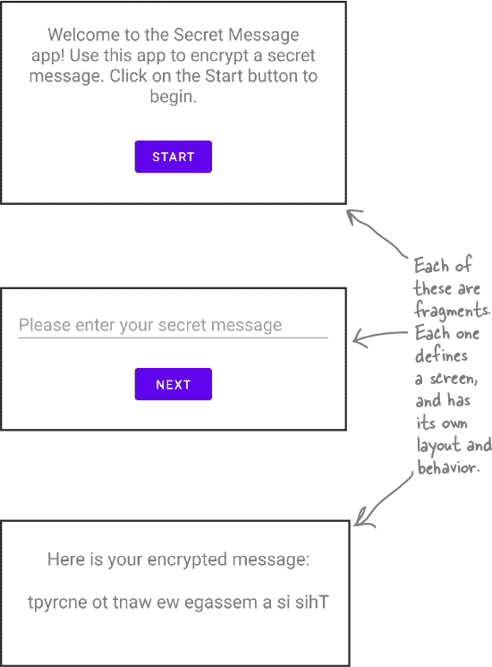
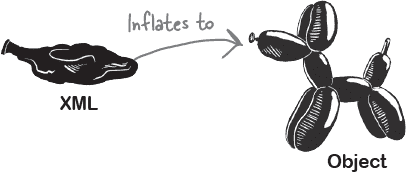
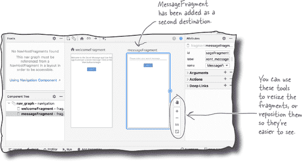
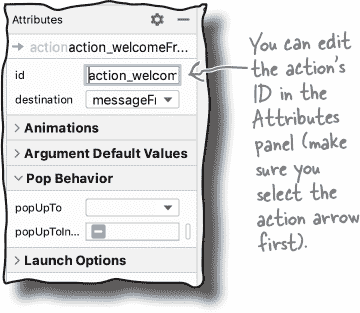

# 第六章：片段和导航：*找到你的方式*


**大多数应用程序需要多个屏幕。**

到目前为止，我们只看了如何创建单屏应用程序，这对于简单的应用程序来说是可以的。但是如果你有**更复杂的需求**呢？在本章中，你将学习如何使用**片段**和**导航组件**来**构建多屏应用程序**。你将了解到**片段就像是具有自己方法的子活动**。你将了解如何**设计有效的导航图**。最后，你将会遇到**导航主机**和**导航控制器**，并学习它们如何帮助你从一个地方导航到另一个地方。

# 大多数应用程序需要多个屏幕

到目前为止，您建立的所有应用程序都有一个共同点：它们每个都有一个单屏幕。每个应用程序都有一个对应的布局的单个活动，该布局定义了应用程序的外观和用户的交互方式。

然而，大多数应用程序包含*多个*屏幕。例如，电子邮件应用程序可能有一个屏幕用于撰写电子邮件，另一个用于显示收到的电子邮件列表。日历应用程序可能在一个屏幕上显示事件列表，在另一个屏幕上显示特定事件的详细信息。

我们将向您展示如何通过创建秘密消息应用程序来构建多屏应用程序。该应用程序包括一个欢迎屏幕，一个允许用户输入消息的第二屏幕，以及显示消息加密版本的第三屏幕。

这是应用程序的外观：


# 每个屏幕都是一个片段

秘密消息应用程序有三个不同的屏幕，并且我们将每个屏幕作为一个单独的**片段**来构建。片段类似于显示在活动布局内部的一种子活动。它具有控制其行为的 Kotlin 代码，并且有一个关联的布局来定义其外观。

这是应用程序将使用的三个片段：

> **一个片段有控制其行为的 Kotlin 代码和指定其外观的布局。**

## WelcomeFragment

这是应用程序的主屏幕。它需要显示一些介绍性文本和一个按钮。该按钮将用于导航到下一个屏幕——`MessageFragment`。

## MessageFragment

这个屏幕将允许用户在编辑文本中输入消息。当用户点击按钮时，应用程序将导航到`EncryptFragment`。

## EncryptFragment

这是最终的屏幕。它加密用户的消息，并显示结果。



正如您所看到的，用户需要能够在所有三个片段之间导航。那么这将如何工作呢？

# 使用导航组件在屏幕之间导航

在片段之间导航的最佳方式是使用 Android 的**导航组件**。导航组件是 Android Jetpack 的一部分，它帮助你以标准方式实现导航。


要在“秘密消息”应用程序中使用导航组件，我们将包含一个名为`MainActivity`的单一活动。当用户通过应用程序导航时，该活动将依次显示每个片段，如下所示：


当我们构建“秘密消息”应用程序时，您将进一步了解片段和导航组件。让我们按照创建它的步骤进行。

# 我们将要做的事情

我们将在本章开始构建“秘密消息”应用程序，并在接下来完成它。

本章中我们将做以下事情：

1.  **创建并显示 WelcomeFragment。**

    在这一步中，我们将创建`WelcomeFragment`，它将是应用程序的第一个屏幕。我们将在`MainActivity`的布局中显示此片段，以便用户在启动应用程序时看到它。

    

1.  **导航至 MessageFragment。**

    我们将创建一个名为`MessageFragment`的第二个片段，并在用户点击`WelcomeFragment`布局中的按钮时导航到它。我们将使用 Android 的导航组件实现导航。

    

让我们从创建应用程序的新项目开始。

# 创建一个新项目。


我们将使用一个新项目来创建“秘密消息”应用程序，因此现在使用与前几章相同的步骤创建一个项目。选择空活动选项，输入名称“秘密消息”和包名称“com.hfad.secretmessage”，并接受默认保存位置。确保语言设置为 Kotlin，最小 SDK 为 API 21，以便在大多数 Android 设备上运行。

## 添加一些 String 资源

在创建任何片段之前，我们将向项目中添加一些字符串资源。我们将在片段的布局中使用这些资源来显示文本，例如按钮的标签和第一个屏幕上的欢迎消息。

要添加字符串，请在*SecretMessage/app/src/main/res/values*文件夹中打开*strings.xml*文件，然后向文件中添加以下资源（加粗部分）：


# 将 WelcomeFragment 添加到项目中

我们将向项目中添加名为`WelcomeFragment`的片段。`WelcomeFragment`将是用户打开应用程序时看到的第一个屏幕，我们将在此屏幕上显示一些关于应用程序的介绍性文本和一个按钮。

要添加片段，请在项目资源管理器中突出显示*app/src/main/java*文件夹中的*com.hfad.secretmessage*包，转到“文件”菜单，然后选择新建→片段→片段（空白）。

您将被问及如何配置新片段。将片段命名为“WelcomeFragment”，并为其布局命名为“fragment_welcome”。然后确保语言设置为 Kotlin，然后单击“完成”按钮。


单击“完成”按钮时，Android Studio 会创建新的片段并将其添加到项目中。

# 片段代码的外观

创建新片段时，Android Studio 会向您的项目添加两个文件：一个控制片段行为的 Kotlin 文件，和一个描述片段外观的布局文件。

我们首先来看 Kotlin 代码。转到*app/src/main/java*文件夹中的*com.hfad.secretmessage*包，并打开*WelcomeFragment.kt*文件。然后用下面的代码替换 Android Studio 生成的代码：


## 片段代码看起来类似于活动代码

上述代码定义了一个基本片段。正如您所见，片段的代码看起来与活动代码非常相似。但是，它不是扩展`AppCompatActivity`，而是扩展了**Fragment**。

`androidx.fragment.app.Fragment`类是 Android Jetpack 的一部分，用于定义基本片段。它包括最新的片段功能，并与较旧版本的 Android 向后兼容。

片段覆盖了`onCreateView()`方法，该方法在 Android 需要片段布局时立即调用。几乎每个片段都会覆盖此方法，因此让我们更详细地看一下它。


# 片段的`onCreateView()`方法

`onCreateView()`方法在 Android 需要访问片段布局时调用。虽然覆盖此方法是可选的，但由于您需要为几乎每个创建的片段定义一个布局而覆盖它，因此几乎每个片段都会覆盖它。

该方法接受三个参数：


第一个参数是`LayoutInflater`，用于扩展片段的布局。正如您在第三章中学到的那样，扩展布局会将其 XML 视图转换为对象。

第二个参数是`ViewGroup?`。这是在活动布局中显示片段的`ViewGroup`。

###### 注意

您将在几页后了解更多信息。

最后一个参数是`Bundle?`。如果您之前保存了片段的状态并希望重新启用它，则会使用这个参数。它的工作方式类似于传递给活动的`onCreate()`方法的`Bundle?`参数。

## 扩展片段的布局，并返回它

`onCreateView()`方法返回一个`View?`，这是片段布局的扩展版本。



使用`LayoutInflater`的`inflate()`方法来扩展布局，示例如下：

```
override fun onCreateView(inflater: LayoutInflater, container: ViewGroup?,
                          savedInstanceState: Bundle?): View? {
    return inflater.inflate(R.layout.fragment_welcome, container, false)
}
```

上述代码是调用活动的`setContentView()`方法的片段等效代码，因为它用于将`WelcomeFragment`的布局*fragment_welcome.xml*扩展为`View`对象的层次结构。

一旦片段布局被扩展，`View`层次结构将被插入到活动的布局中并显示。

现在您已经看到`WelcomeFragment`的 Kotlin 代码，让我们来看一下它的布局。


# 片段布局代码看起来像活动布局代码

正如我们之前所说，片段使用布局文件描述其外观。活动布局和片段布局代码之间没有区别，因此 **你可以在片段布局代码中使用任何你已经熟悉的视图和视图组**。

我们将用一个线性布局来替换 Android Studio 为我们生成的默认布局代码，其中包含一个文本视图，显示应用程序的简要描述，以及一个按钮，我们将在本章后面用来导航到不同的片段。

打开 *app/src/main/res/layout* 文件夹中的 *fragment_welcome.xml* 文件，并用以下代码替换其内容：


这是我们现在所需要的 `WelcomeFragment`（及其布局）的所有代码，因此让我们看看如何在应用程序中显示它。

# 在 `FragmentContainerView` 中显示一个片段。

要显示一个片段，你需要将它添加到活动的布局中。例如，在这个应用程序中，我们将通过将 `WelcomeFragment` 添加到 `MainActivity` 的布局文件 *activity_main.xml* 中来显示它。

使用 `**FragmentContainerView**` 将片段添加到布局中。这是一种用于显示片段的 `FrameLayout` 类型，并且你可以使用以下代码将其添加到布局文件中：


通过将 `FragmentContainerView` 的 `android:name` 属性设置为完全限定的片段名称（包括其包名），来指定要显示的片段。在 Secret Message 应用中，我们希望显示位于 *com.hfad.secretmessage* 包中的名为 `WelcomeFragment` 的片段，因此我们使用以下方式设置 `android:name` 属性：

```
android:name="com.hfad.secretmessage.WelcomeFragment"
```


当 Android 创建活动的布局时，它使用片段的 `onCreateView()` 方法返回的 `View` 对象填充 `FragmentContainerView`。这个 `View` 是片段的用户界面，因此你可以将 `FragmentContainerView` 视为插入片段布局的位置的占位符：


现在你知道如何将片段添加到布局中了，让我们将 `WelcomeFragment` 添加到 `MainActivity` 的布局中。

# 更新 activity_main.xml 代码

我们希望 `MainActivity` 显示 `WelcomeFragment`，这意味着我们需要将一个 `FragmentContainerView` 添加到其布局中。

这是 *activity_main.xml* 的完整代码：替换代码以包含此处显示的更改：


## MainActivity.kt 的完整代码

我们无需添加任何额外的 Kotlin 代码到 `MainActivity` 中来使其显示一个片段，因为布局中的 `FragmentContainerView` 处理了一切。你只需要确保 *MainActivity.kt* 中的代码看起来像这样：


让我们看看应用程序运行时会发生什么。

# 代码的作用

当应用程序运行时发生以下事情：

1.  **当应用程序启动时，MainActivity 被创建。**

    

1.  **MainActivity 的 onCreate() 方法运行。**

    `onCreate()` 方法指定 `MainActivity` 的布局应使用 *activity_main.xml*。

    

1.  **activity_main.xml 包含一个 FragmentContainerView。**

    它的 `android:name` 属性指定需要显示 `WelcomeFragment`。

    

1.  **调用了 `WelcomeFragment` 的 `onCreateView()` 方法，该方法膨胀了它的布局。**

    `WelcomeFragment` 的膨胀视图层次结构添加到 `MainActivity` 的布局中的 `FragmentContainerView` 中。

    

1.  **最后，MainActivity 显示在设备上。**

    由于 `FragmentContainerView` 包含 `WelcomeFragment`，因此该片段显示在屏幕上。

    

现在您已经看到代码运行时发生的情况，让我们来测试一下这个应用程序吧。

#  测试驾驶

运行秘密消息应用程序时，会启动 `MainActivity`。`MainActivity` 的布局中的 `FragmentContainerView` 包含 `WelcomeFragment`，因此该片段的布局会显示在设备上。


现在您已经学会了如何创建和显示片段。在我们构建第二个片段并学习如何导航到它之前，请尝试以下练习。

# 池子谜题


你的 **任务** 是从池中获取代码片段，并将它们放置到线性布局的空白行中。你不能多次使用同一个代码片段，并且不需要使用所有的代码片段。你的 **目标** 是使线性布局显示两个片段，`AFragment` 和 `BFragment`，从而在右侧显示的屏幕。提示：两个片段都位于名为 *com.hfad.exercise* 的包中。


###### 注意

**注意：每个来自池中的元素只能使用一次！**

# 池子谜题解答


你的 **任务** 是从池中获取代码片段，并将它们放置到线性布局的空白行中。你不能多次使用同一个代码片段，并且不需要使用所有的代码片段。你的 **目标** 是使线性布局显示两个片段，`AFragment` 和 `BFragment`，从而在右侧显示的屏幕。提示：两个片段都位于名为 *com.hfad.exercise* 的包中。


# 创建 MessageFragment


到目前为止，我们创建了一个名为 `WelcomeFragment` 的片段，它显示在 `MainActivity` 的布局中。接下来，我们将创建一个名为 `MessageFragment` 的新片段，用户点击 `WelcomeFragment` 的“开始”按钮时会导航到该片段。

我们将以与添加`WelcomeFragment`相同的方式添加`MessageFragment`。在项目资源管理器中突出显示*app/src/main/java*文件夹中的*com.hfad.secretmessage*包，转到文件菜单，选择 New→Fragment→Fragment（Blank）。将片段命名为`MessageFragment`，其布局命名为“fragment_message”，并确保语言设置为 Kotlin。然后点击完成按钮，将片段及其布局添加到项目中。


# 更新 MessageFragment 的布局

创建`MessageFragment`时，Android Studio 会向您的项目添加两个新文件：*MessageFragment.kt*（指定片段行为）和*fragment_message.xml*（定义其外观）。我们将更新这两个文件，从布局开始。

片段需要有一个编辑文本框，让用户输入消息，以及一个按钮，稍后将用于导航。您已经熟悉添加这些视图的代码，因此更新*fragment_message.xml*中的代码，使其与此处显示的代码匹配：


这是`MessageFragment`布局所需的所有代码，让我们继续更新其 Kotlin 代码。

# 更新 MessageFragment.kt

`MessageFragment`的 Kotlin 代码定义了片段的行为。目前，我们只需确保 Android Studio 未向其添加任何可能导致其无法按照我们想要的方式工作的不必要额外代码。

转到*app/src/main/java*文件夹中的*com.hfad.secretmessage*包，并打开文件*MessageFragment.kt*。然后用下面的代码替换 Android Studio 生成的代码：


上面的代码是*MessageFragment.kt*定义基本片段所需的所有内容。就像您在`WelcomeFragment`中看到的代码一样，它扩展了`Fragment`类，并覆盖了其`onCreateView()`方法。此方法会填充片段的布局，并返回其根视图。每当应用程序需要显示片段时，它都会被调用。

我们已经完成了`MessageFragment`所需的所有布局和 Kotlin 代码的编写。接下来，我们需要让`WelcomeFragment`导航到它。那么如何实现呢？


# 使用导航组件在片段之间导航

正如本章前面所述，导航到片段的标准方法是使用 Android 的导航组件。

导航组件是 Android Jetpack 的一部分，是您添加到项目中的一套库、插件和工具。它非常灵活，简化了许多片段导航的复杂性，例如片段事务和返回堆栈操作，这些以前实现起来更加困难。

在片段之间导航由三个主要部分组成：

+    **一个导航图**

    导航图包含了应用程序所需的所有与导航相关的信息，并描述了用户在导航应用时可能采用的路径。

    导航图是一个 XML 资源，但通常您会使用可视化设计编辑器来编辑它。

    

+    **导航宿主**

    导航宿主是一个空容器，用于显示您导航到的片段。您将导航宿主添加到活动的布局中。

    

+    **导航控制器**

    导航控制器控制着在用户导航应用程序时在导航宿主中显示哪个片段。您可以使用 Kotlin 代码与导航控制器交互。

    

我们将使用这三个元素来实现 Secret Message 应用中的导航功能。首先，让我们向项目中添加导航组件的库。

# 使用 Gradle 将导航组件添加到您的项目中

正如你在第四章中学到的，通过对*build.gradle*文件进行更改，你可以为应用添加任何额外的库、工具和插件。当你创建一个新项目时，Android Studio 会自动为你包含这两个文件：一个是项目的，另一个是应用的。

要添加导航组件，您需要编辑*build.gradle*的*两个*版本。让我们从更新项目版本开始。

## 向项目*build.gradle*文件添加版本号

我们将从向项目的*build.gradle*文件中添加一个新变量开始，指定我们将使用的导航组件的版本。使用变量来表示版本号意味着，如果我们添加了任何额外的导航组件库（我们将在下一章中完成），每个库的版本号都将保持一致。

要添加这个变量，请打开文件*SecretMessage/build.gradle*，并在`buildscript`部分添加以下行（用**粗体**标出）：


## 向应用的*build.gradle*文件添加一个依赖项

接下来，您需要向应用程序版本的*build.gradle*文件中添加一个库依赖。

打开文件*SecretMessage/app/build.gradle*，并在`dependencies`部分添加以下行（用**粗体**标出）：


完成这些更改后，单击代码编辑器顶部显示的“立即同步”选项。这将同步您所做的更改与项目的其余部分，并添加库。

# 创建一个导航图

现在我们已将导航组件的主库添加到 Secret Message 项目中，我们可以实现导航了。

首先，我们将向项目添加一个导航图。在项目资源管理器中选择*SecretMessage/app/src/main/res*文件夹，然后选择文件→新建→Android 资源文件。在提示时，输入文件名“nav_graph”，选择资源类型“Navigation”，然后点击“确定”按钮。这将在*SecretMessage/app/src/main/res/navigation*文件夹中添加一个名为*nav_graph.xml*的空导航图文件。


创建新的导航图后，通过双击项目资源管理器中的*nav_graph.xml*文件来打开它（如果尚未打开）。该文件应该在导航图设计编辑器中打开，看起来像这样：


# 向导航图中添加片段

我们希望用户能够从`WelcomeFragment`导航到`MessageFragment`，因此我们需要将这些片段添加到导航图中作为**目的地**。目的地是应用程序中的一个屏幕—通常是一个片段—用户可以导航到该屏幕。

首先，我们将首先添加`WelcomeFragment`，因为这是我们希望用户在应用程序启动时看到的第一个屏幕。在设计编辑器顶部点击“新目的地”按钮，然后在提示时选择“fragment_welcome”（`WelcomeFragment`的布局）选项。这将`WelcomeFragment`添加到导航图中，使其看起来像这样：


接下来，通过点击“新目的地”按钮并选择“fragment_message”选项，将`MessageFragment`添加到导航图中。这样就向导航图中添加了第二个片段，如下所示：



# 使用操作连接片段

接下来，我们需要指定用户可以从`WelcomeFragment`导航到`MessageFragment`，这是通过**操作**完成的。操作用于连接导航图中的目的地，并定义用户在应用程序中导航时可以采取的可能路径。

我们将添加一个从`WelcomeFragment`到`MessageFragment`的操作，因为这是我们希望用户在应用程序中导航的方向。将鼠标指针悬停在设计编辑器中的`WelcomeFragment`上，然后单击出现在其右侧的圆圈，并将其拖动到`MessageFragment`。这样在两个片段之间画出一个箭头—即操作：


## 每个操作都需要一个唯一的 ID

***每个操作必须有一个唯一的 ID。Android 使用此 ID 来确定用户在应用程序中导航时需要显示哪个目的地。***

每次创建操作时，Android Studio 都会为其分配一个默认的 ID。您可以使用导航图右侧的属性面板编辑此 ID—以及操作的任何其他属性。

你希望刚刚创建的操作的 ID 为“action_welcomeFragment_to_messageFragment”，以便与本章中的代码匹配。请在设计编辑器中选择操作（箭头），并检查其在属性面板中的`id`属性值，确保是这样。稍后几页将会用到这个 ID。



# 导航图是 XML 资源。

就像布局一样，导航图实际上只是一堆 XML 代码。要查看代码，请点击设计编辑器顶部的“Code”按钮。

下面是秘密消息应用程序导航图 *nav_graph.xml* 的底层 XML 代码：


正如你所见，*nav_graph.xml* 有一个根元素 `<navigation>`，包含两个 `<fragment>` 元素：一个是 `WelcomeFragment`，另一个是 `MessageFragment`。`WelcomeFragment` 的 `<fragment>` 元素包含一个额外的 `<action>` 元素，表示我们刚刚添加的操作。

现在我们已经创建了导航图，让我们继续 Navigation 组件的下一部分。

> **通常使用设计编辑器编辑导航图，但检查 XML 仍然很有用。**

# 使用 `FragmentContainerView` 向布局添加导航主机。

正如我们之前提到的，Navigation 组件由三个主要部分组成：定义可能导航路径的导航图、显示目的地的导航主机和控制显示哪个目的地的导航控制器。我们刚刚创建了一个导航图，所以下一步我们将添加导航主机。

通过在活动的布局中包含导航主机来添加导航主机。好消息是 Navigation 组件自带一个名为 `**NavHostFragment**` 的内置导航主机，所以你不必自己编写一个。它是实现了 `NavHost` 接口的 `Fragment` 子类。

由于 `NavHostFragment` 是一种片段类型，你可以使用 `FragmentContainerView` 将其添加到布局文件中。代码如下：


上面的代码类似于你之前看到的 `FragmentContainerView` 代码，但包含两个额外的属性：`**app:navGraph**` 和 `**app:defaultNavHost**`。

`app:navGraph` 属性告诉导航主机使用哪个导航图，在本例中为 *nav_graph.xml*。导航图指定了首个要显示的片段（其起始目的地），并允许用户在其目的地之间导航。

`app:defaultNavHost` 属性允许导航主机与设备的返回按钮交互：关于此内容，你将在下一章中了解更多。


# 在 *activity_main.xml* 中添加一个 NavHostFragment。

我们将在 `MainActivity` 的布局中添加一个使用我们创建的导航图的导航主机。要做到这一点，请更新 *activity_main.xml* 中的代码，包括下面的更改（用粗体标出）。


## 我们需要在片段之间导航。

我们现在已经创建了一个导航图，并将其链接到 `MainActivity` 布局中的 `FragmentContainerView` 中保存的导航主机。应用程序运行时，导航图的起始目标 `WelcomeFragment` 将被显示。

本章的最后一件事是在用户点击 `WelcomeFragment` 布局中的开始按钮时从 `WelcomeFragment` 导航到 `MessageFragment`。让我们看看如何实现这一点。


# 向按钮添加 OnClickListener

要从 `WelcomeFragment` 导航到 `MessageFragment`，我们首先需要使 `WelcomeFragment` 的开始按钮响应点击。我们将通过向其添加 `OnClickListener` 来实现这一点。

之前，你通过使用 `findViewById()` 获取对*活动*按钮的引用，然后调用其 `setOnClickListener` 方法来向*活动*按钮添加 `OnClickListener`。由于活动在其布局中首次访问视图时，你将此代码包含在活动的 `onCreate()` 方法中。

然而，当你想向*片段*按钮添加 `OnClickListener` 时，情况略有不同。


## 片段 OnClickListener 代码略有不同

第一个区别是，你在片段的 `**onCreateView()**` ***方法中向片段的按钮添加了一个* OnClickListener，而不是* 在 `onCreate()` 中。这是因为片段在 `onCreateView()` 中首次访问其视图，因此这是设置任何 `OnClickListener` 的最佳位置。

**第二个区别是** `**Fragment**` **类不包括** `**findViewById()**` **方法**，因此你不能直接调用它来获取任何视图的引用。不过，你可以在片段的根视图上调用`findViewById()`。

下面是在片段代码中向视图添加 `OnClickListener` 的代码示例：我们将在几页后的 `WelcomeFragment` 中添加这个。


现在你知道如何向片段的按钮添加 `OnClickListener`，让它在点击时导航。

**Fragment 类不是 Activity 的子类。**

尽管片段与活动有很多共同点，但 `Fragment` 类不扩展 `Activity`，因此不会继承其任何方法。

相反，`Fragment` 类定义了自己的一套方法集。虽然其中许多方法看起来与活动继承的方法相同，但它不包括像 `findViewById()` 这样的方法。

当我们继续阅读本书时，你将进一步了解片段及其方法。现在，让我们看看需要添加到 `WelcomeFragment` 的代码，以便在其按钮被点击时导航到 `MessageFragment`。


# 获取导航控制器

每当您想要导航到新的片段时，您首先需要获取一个导航控制器的引用。您可以通过调用其根`View`对象上的`**findNavController()**`方法来实现这一点。例如，以下代码获取与名为`view`的根视图对象关联的导航控制器的引用：

```
val navController = view.findNavController()
```

## 使用一个动作告诉它要导航到哪里

一旦您拥有了导航控制器，您可以通过调用其`**navigate()**`方法向其请求导航到新的目标。此方法接受一个参数：导航动作 ID。

正如您可能还记得的，当我们创建导航图时，我们包含了一个从`WelcomeFragment`到`MessageFragment`的动作。我们给这个动作取了 ID“action_welcomeFragment_to_messageFragment”。

如果我们将此 ID 传递给导航控制器的`navigate()`方法，控制器将看到操作是从`WelcomeFragment`到`MessageFragment`，并用它来导航到新的片段。

这是代码的样子：


当用户点击`WelcomeFragment`的 Start 按钮时，我们希望导航到`MessageFragment`。因此，我们将在 Start 按钮的`OnClickListener`中添加以下代码：


我们将在下一页上展示完整的`WelcomeFragment`代码。

# WelcomeFragment.kt 的完整代码

下面是`WelcomeFragment`的完整代码；更新*WelcomeFragment.kt*以包含以下更改（用粗体标出）：


这是使`WelcomeFragment`导航到`MessageFragment`所需的全部代码。我们来看看代码运行时的操作，然后测试应用程序。

# 应用程序运行时发生的事情

当应用程序运行时会发生以下事情：

1.  **应用程序启动并创建 MainActivity。**

    

1.  **MainActivity 的布局 activity_main.xml 包含一个 FragmentContainerView，指定了导航主机和导航图。**

    

1.  **导航图中的起始目标是 WelcomeFragment，因此将此片段添加到导航主机并显示在设备屏幕上。**

    

1.  **用户在 WelcomeFragment 的布局中点击 Start 按钮。**

    

1.  **Start 按钮的 OnClickListener 代码查找导航控制器，并调用其 navigate()方法。**

    它传递了从`WelcomeFragment`到`MessageFragment`导航使用的动作。

    

1.  **导航控制器在导航图中查找具有此 ID 的操作。**

    这段代码表明操作从`WelcomeFragment`到`MessageFragment`。

    

1.  **导航控制器在导航主机中用 MessageFragment 替换 WelcomeFragment，并在设备屏幕上显示 MessageFragment。**

    

#  测试驾驶

当我们运行应用时，`MainActivity` 被启动，`WelcomeFragment` 如前所示显示。

当我们点击“开始”按钮时，应用程序导航到 `MessageFragment`，并在设备上显示此片段。


祝贺！您现在已经学会了如何构建一个可以让您从一个屏幕导航到另一个屏幕的多屏应用程序。

在下一章中，当我们完成秘密消息应用程序的构建时，您将继续增加这些知识。

# 你的 Android 工具箱


**你已经掌握了第六章，现在将片段和导航添加到你的工具箱中。**


