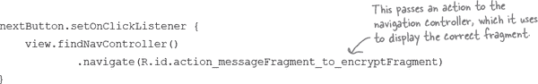
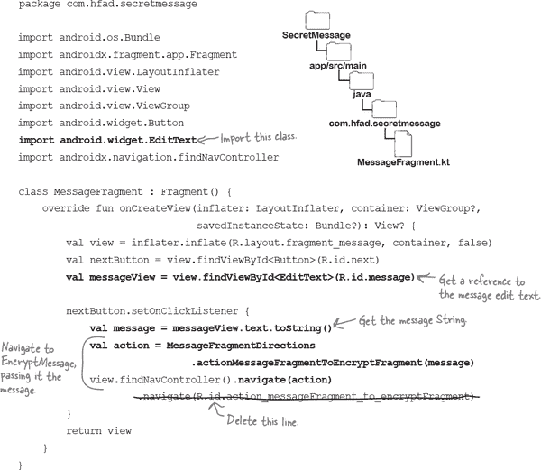
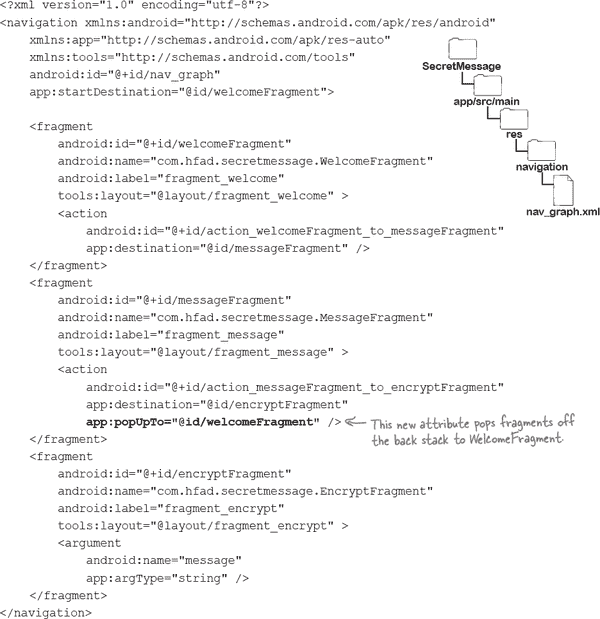

# 第七章：安全参数：*传递信息*


**有时片段需要额外的信息才能正常工作。**

如果一个片段显示联系人的详细信息，例如需要显示哪个联系人。但是，如果这些信息来自另一个片段，它可能需要额外的信息才能正常工作。在这一章中，你将通过学习如何在片段之间传递数据，进一步建立你的导航技能。你将了解如何向导航目标添加参数，以便它们可以接收所需的信息。你将遇到**安全参数插件**，并学习如何使用它来编写类型安全的代码。最后，你将发现如何操作返回栈，并控制返回按钮的行为。继续阅读，一切不可逆转...

# 秘密消息应用程序在片段之间导航

在上一章中，您已经学会如何使用导航组件在两个片段之间导航。您将此知识用于构建秘密消息应用程序的第一部分：一个接收用户输入的消息并对其进行加密的应用程序。

应用程序的当前版本使用一个名为`WelcomeFragment`的片段来显示一些简介文字。当用户点击其开始按钮时，该片段导航到名为`MessageFragment`的第二个片段。

`MessageFragment`包含一个编辑文本框，让用户输入她的消息。它还包括一个 Next 按钮，用户点击该按钮以加密消息。

这是当前应用的外观提醒：


在应用程序的当前版本中，当用户点击`MessageFragment`的 Next 按钮时，什么也不会发生。在本章中，我们将完成应用程序的构建，以便用户的加密消息在一个新的片段中显示。

# MessageFragment 需要将消息传递给新的片段

我们将向应用程序添加一个名为`EncryptFragment`的新片段。该片段将显示用户加密的消息，并且外观将如下所示：


`EncryptFragment`将从`MessageFragment`获取用户的消息。当用户点击`MessageFragment`的 Next 按钮时，应用程序将导航到`EncryptFragment`并将文本传递给它。然后，该片段将加密文本并显示结果：


要使这个工作，我们需要能够在片段之间传递数据。最佳方法是使用名为**Safe Args**的 Gradle 插件，它是导航组件的额外部分。它提供了一种类型安全地在片段之间传递数据的方法。这可以防止您意外传递错误类型的数据，从而可能导致运行时错误。

随着我们继续构建秘密消息应用程序，您将了解更多有关使用 Safe Args 的信息。现在，让我们看看我们将要经历的步骤。

# 我们要做的事情如下

以下是我们将完成秘密消息应用程序后半部分的步骤：

1.  **创建和显示 EncryptFragment。**

    我们将创建一个名为`EncryptFragment`的新片段，并在用户在`MessageFragment`布局中点击“下一步”按钮时导航到它。

    

1.  **将用户的消息传递给`EncryptFragment`。**

    我们将使用 Safe Args 将用户的消息从`MessageFragment`传递到`EncryptFragment`。然后，`EncryptFragment`将显示加密后的消息。

    

1.  **修改应用程序的返回按钮行为。**

    最后，我们将更新应用程序，以便用户在显示`EncryptFragment`时按设备返回按钮时，应用程序返回到`WelcomeFragment`。

    


让我们开始吧。

# 创建`EncryptFragment`…


我们将使用`EncryptFragment`来显示用户消息的加密版本。通过在*app/src/main/java*文件夹中突出显示*com.hfad.secretmessage*包，转到“文件”菜单，选择“新建→片段→空白片段”。将片段命名为`EncryptFragment`，布局命名为“fragment_encrypt”。确保语言设置为 Kotlin，然后单击“完成”按钮。

## …并更新其布局

我们将更新`EncryptFragment`的布局，以包含两个文本视图。第一个将显示名为`encrypt_text`的`String`资源（我们在前一章节中已将其添加到*strings.xml*），第二个将显示加密后的消息。

打开布局文件*fragment_encrypt.xml*并更新其内容，使其与下面的代码匹配：


# 更新`EncryptFragment.kt`

我们还需要更新`EncryptFragment`的 Kotlin 代码，以确保 Android Studio 没有添加任何可能阻止其按预期工作的不必要额外代码。

转到*app/src/main/java*文件夹中的*com.hfad.secretmessage*包，并打开文件*EncryptFragment.kt*。然后用下面显示的代码替换 Android Studio 生成的代码：


上述代码是*EncryptFragment.kt*需要定义基本片段的全部内容。就像你看到的其他片段代码一样，它扩展了`Fragment`类，并覆盖了其`onCreateView()`方法。此方法将充气片段的布局，并返回其根视图。

我们现在已经完成了`EncryptFragment`所需的所有布局和 Kotlin 代码编写。接下来，我们将确保`MessageFragment`能够通过将其添加到导航图中进行导航。


# 将`EncryptFragment`添加到导航图

正如您已经知道的那样，导航图保存了应用程序目标的详细信息，以及导航到这些目标的可能路径。

要将`EncryptFragment`添加到导航图中，请打开*nav_graph.xml*，在设计编辑器中单击“新目标”按钮，然后在提示时选择“fragment_encrypt”选项。这将添加该片段。


我们还需要添加一个新的操作，以便`MessageFragment`可以导航到`EncryptFragment`。请将鼠标指针悬停在`MessageFragment`上，并从其右边缘绘制一个动作箭头，指向`EncryptFragment`。确保该操作具有 ID “action_messageFragment_to_encryptFragment”，以便与本书中的代码匹配。

###### 注意

如果你觉得这有点复杂，不要担心。我们将在下一页显示完整的代码，这样你就可以选择更新它。

在你做出这些更改后，导航图应该看起来像这样：


让我们看看底层 XML 的样子。

# 更新后的 nav_graph.xml 代码

每次更新导航图时，任何更改都会添加到底层的 XML 中。新代码看起来像这样（更改部分用粗体表示）：


让我们使用新的操作导航到`EncryptFragment`。

# MessageFragment 需要导航到 EncryptFragment

当用户点击`MessageFragment`的“下一步”按钮时，我们需要使其导航到`EncryptFragment`。为此，我们将向按钮添加一个`OnClickListener`，其中包含导航代码。


正如你在前一章中学到的那样，通过获取导航控制器并传递导航操作，可以从一个片段导航到另一个片段。导航控制器使用此操作来显示正确的片段。

你已经熟悉完成这一点所需的所有代码，因此更新 *MessageFragment.kt*，以包括此处显示的更改（用粗体显示）：


让我们进行一次应用程序测试，确保它可以正常工作。

#  测试驾驶

当我们运行应用程序时，启动`MainActivity`，并显示`WelcomeFragment`。当我们点击其“开始”按钮时，应用程序像以前一样导航到`MessageFragment`。

当我们在`MessageFragment`的编辑文本视图中输入消息并点击其“下一步”按钮时，应用程序将导航到`EncryptFragment`。它不会处理我们输入的消息。


由于我们目前编写的代码仅导航到此片段，没有将消息传递给新片段，因此`EncryptFragment`不会显示加密消息，因为它无法处理该消息。

为了将消息从`MessageFragment`传递到`EncryptFragment`，我们将使用 Safe Args。正如你之前学到的，这是导航组件的额外部分，允许你以类型安全的方式向目标传递参数。

让我们找出如何做到这一点。

# 将 Safe Args 添加到 build.gradle 文件


在开始使用 Safe Args 之前，我们需要更新项目和应用程序的 *build.gradle* 文件。现在让我们来做这件事。

## 在 *project* build.gradle 文件中添加一个类路径

首先需要在项目的 *build.gradle* 文件中添加一个新的类路径，指定你想要使用 Safe Args 插件。该类路径包括一个版本号，需要与主导航组件库的版本号匹配。

在 Secret Message 应用中，我们使用一个名为 `nav_version` 的变量来确保这些版本号匹配，因此我们将在类路径中引用它。

打开 *SecretMessage/build.gradle* 文件，并在 `dependencies` 部分添加**粗体字**的类路径：


## 将插件添加到应用的 `build.gradle` 文件中

接下来，你需要告诉 Gradle 你正在使用 Safe Args 插件，方法是在应用的 *build.gradle* 文件的 `plug-ins` 部分添加一行**粗体字**：


完成这些更改后，点击代码编辑器顶部出现的“立即同步”选项。这将把你所做的更改与项目的其余部分同步。

###### 注意

确保每次更新 *build.gradle* 文件后同步你的更改。

现在应用包含了 Safe Args，我们可以使用它来从 `MessageFragment` 传递消息到 `EncryptFragment`。我们接下来就要做这个。

# `EncryptFragment` 需要接受一个 `String` 参数

我们首先需要指定 `EncryptFragment` 可以接受用户的消息。我们将在导航图中为此片段添加一个 `String` 参数；然后 `MessageFragment` 将使用此参数将用户的消息（一个 `String`）传递给 `EncryptFragment`。


要添加参数，请打开 *app/src/main/res/nav_graph.xml* 中的文件 *nav_graph.xml*。然后在导航图设计编辑器中选择 `EncryptFragment`，转到属性面板，并点击出现在参数部分旁边的“+”按钮：


当你点击“+”按钮时，会出现“添加参数”窗口，用于添加关于参数的详细信息。在这里，我们希望 `EncryptFragment` 接受一个 `String` 类型的参数作为用户的消息，所以将参数命名为“message”，选择类型为`String`，然后点击“添加”按钮。这将创建新的参数，并将其添加到属性面板的参数部分：


# 更新后的 `nav_graph.xml` 代码

当你向导航图添加一个参数时，会在底层 XML 中添加一个新的 `<argument>` 元素。以下是 *nav_graph.xml* 的更新代码（新增的代码用粗体标出）：


# `MessageFragment` 需要将消息传递给 `EncryptFragment`

现在我们在 `EncryptFragment` 中添加了一个 `String` 参数，`MessageFragment` 可以在导航到该片段时使用它传递用户的消息。

正如您已经知道的那样，您通过将导航操作传递给导航控制器从一个目的地导航到另一个目的地。例如，当其按钮被点击时，`MessageFragment`使用以下代码导航到`EncryptFragment`：



## 您可以向导航操作传递参数

如果您想向目的地传递参数，只需将其值传递给导航操作即可。

当导航控制器接收到包含参数的操作时，它将导航到适当的片段，并传递参数的值。例如，在秘密消息应用中，我们可以通过将用户的消息包含在导航操作中，使`MessageFragment`传递给`EncryptMessage`（通过导航控制器）。它的工作原理如下：


您可以使用**Directions**类向导航操作添加参数。让我们来看看这是什么。

# Safe Args 会生成 Directions 类

`Directions`类用于向目的地传递参数。当您启用 Safe Args 插件时，Android Studio 会使用它为您可以从中导航的每个片段生成一个`Directions`类**（译者注：保留原文示例的内容，不要重复输出）**。


每个片段都使用自己的`Directions`类进行导航。例如，如果`MessageFragment`要导航到其他位置并传递参数，则需要使用`MessageFragmentDirections`类。

## 使用 Directions 类向操作添加参数

每个`Directions`类都包含片段操作的生成方法。例如，`MessageFragment`具有 ID 为“action_messageFragment_to_encryptFragment”的操作，因此`MessageFragmentDirections`类包含一个名为`actionMessageFragmentToEncryptFragment()`的相应方法。由于`EncryptFragment`接受一个`String`，生成的方法包括一个`String`参数。


您可以使用生成的方法导航到目的地。例如，要从`MessageFragment`导航到`EncryptFragment`并传递`String`消息，您可以将以下代码添加到`MessageFragment`中：


现在让我们添加这段代码。

# 更新 MessageFragment.kt 代码

这是更新后的`MessageFragment`代码；确保将更改（用粗体显示）添加到*MessageFragment.kt*中：



这就是`MessageFragment`需要的一切，以便将用户的消息传递给`EncryptFragment`。接下来，我们需要让`EncryptFragment`接收并使用它。

# EncryptFragment 需要获取参数的值

如您所知，`MessageFragment` 使用 `String` 参数将用户的消息传递给 `EncryptFragment`。`EncryptFragment` 需要检索此值，以便显示其加密版本。

Fragments 可以使用 `**Args**` 类检索参数。启用 Safe Args 插件后，Android Studio 用于为接受参数的每个片段生成 `Args` 类。例如，在秘密消息应用程序中，`EncryptFragment` 接受一个 `String` 参数，因此 Safe Args 插件会为其生成一个名为 `EncryptFragmentArgs` 的 `Args` 类：


> **Safe Args 插件生成 Directions 和 Args 类。使用 Directions 类向目标传递参数，使用 Args 类检索它们。**

## 使用 Args 类来检索参数。

每个 `Args` 类都包含一个 `**fromBundle()**` 方法，用于检索传递给片段的任何参数。例如，在秘密消息应用程序中，`EncryptFragment` 接受名为 `message` 的 `String` 参数，因此您可以使用以下方式获取此参数的值：


这将把一个 `String` 对象（参数的值）赋给 `message`。

## 我们需要加密消息。

现在我们知道如何让 `EncryptFragment` 检索用户的消息，我们可以对其进行加密并显示结果。

我们将使用 Kotlin 的 `reversed()` 方法来加密消息，该方法简单地颠倒字符串的字母顺序。代码如下所示：

###### 注意

在实际应用中，您可能想要使用更先进的加密技术。这只是一个示例。

```
val encryptedView = view.findViewById<TextView>(R.id.encrypted_message)
encryptedView.text = message.reversed()
```

我们将在下一页展示完整的 `EncryptFragment` 代码。

# EncryptFragment.kt 的完整代码

这是 *EncryptFragment.kt* 的完整代码；更新其代码以包括以下更改：


这就是我们需要显示加密消息的所有内容。我们将在下一页详细介绍应用程序运行时发生的事情。

# 应用程序运行时发生了什么

应用程序运行时会发生以下事情：

1.  **应用程序启动并创建 MainActivity。**

    `WelcomeFragment` 被添加到导航宿主并显示在设备屏幕上。

    

1.  **用户点击“开始”按钮时，其 OnClickListener 代码将操作传递给导航控制器的 navigate() 方法。**

    该操作描述了从 `WelcomeFragment` 到 `MessageFragment` 的导航路径。

    

1.  **导航控制器将 MessageFragment 放入导航宿主，以便在设备屏幕上显示它。**

    

1.  **用户输入消息并点击“下一步”按钮。**

    

1.  **下一步按钮的 OnClickListener 使用 MessageFragmentDirections 类将消息附加到操作上。**

    将操作（包括消息）传递给导航控制器。

    

1.  **导航控制器将消息传递给`EncryptFragment`。**

    `EncryptFragment`使用`EncryptFragmentArgs`类检索其值。

    

1.  **导航控制器在 MainActivity 的导航主机中用 EncryptFragment 替换 MessageFragment。**

    设备屏幕上显示`EncryptFragment`，并显示加密消息。

    

#  Test Drive

运行应用程序时，`WelcomeFragment`将显示，点击“开始”按钮后，我们可以像以前一样导航到`MessageFragment`。

输入消息并点击`MessageFragment`的“下一步”按钮时，将显示`EncryptFragment`。它显示加密消息。


应用程序正如我们所希望的那样运行。

我们还想对其进行一些更改。在此之前，试着完成以下练习。

# 导航磁铁


下面的导航图代码定义了两个片段之间的导航路径：`ChooseTypeFragment`和`DrinksFragment`。

`ChooseTypeFragment`包含一个 ID 为`choose`的下拉框和一个 ID 为`next`的按钮。当用户点击按钮时，`ChooseTypeFragment`需要导航到`DrinksFragment`，并将来自下拉框的用户选择的值传递给它。

当显示`DrinksFragment`时，它需要在布局中的文本视图`choice`中显示所选的值。

有人试图使用冰箱磁铁编写`ChooseTypeFragment`和`DrinksFragment`的代码，但当我们关上冰箱门太快时，有些磁铁掉了。你能把代码重新拼起来吗？

**导航图：**

```
<?xml version="1.0" encoding="utf-8"?>
<navigation 

    android:id="@+id/nav_graph"
    app:startDestination="@id/chooseTypeFragment">

    <fragment
        android:id="@+id/chooseTypeFragment"
        android:name="com.hfad.drinksapp.ChooseTypeFragment"
        android:label="fragment_choose_type"
        tools:layout="@layout/fragment_choose_type" >
        <action
            android:id="@+id/action_chooseTypeFragment_to_drinksFragment"
            app:destination="@id/drinksFragment" />
    </fragment>
    <fragment
        android:id="@+id/drinksFragment"
        android:name="com.hfad.drinksapp.DrinksFragment"
        android:label="fragment_drinks"
        tools:layout="@layout/fragment_drinks" >
        <argument
            android:name="drinkType"
            app:argType="string" />
    </fragment>
</navigation>
```

**ChooseTypeFragment:**

```
class ChooseTypeFragment : Fragment() {
    override fun onCreateView(inflater: LayoutInflater, container: ViewGroup?,
                              savedInstanceState: Bundle?): View? {
        val view = inflater.inflate(R.layout.fragment_choose_type, container, false)
        val choice = view.findViewById<Spinner>(R.id.choose).selectedItem.toString()
        val nextButton = view.findViewById<Button>(R.id.next)
        nextButton.setOnClickListener {

            val action = .....................................................
                         .....................................................(choice)
            view.findNavController().navigate(action)
        }
        return view
    }
}
```

**DrinksFragment:**

```
class DrinksFragment : Fragment() {
    override fun onCreateView(inflater: LayoutInflater, container: ViewGroup?,
                              savedInstanceState: Bundle?): View? {
        val view = inflater.inflate(R.layout.fragment_drinks, container, false)
        val choice = ...................................................................
        val choiceView = view.findViewById<TextView>(R.id.choice)
        choiceView.text = choice
        return view
    }
}
```


# 导航磁铁解决方案


下面的导航图代码定义了两个片段之间的导航路径：`ChooseTypeFragment`和`DrinksFragment`。

`ChooseTypeFragment`包含一个 ID 为`choose`的下拉框和一个 ID 为`next`的按钮。当用户点击按钮时，`ChooseTypeFragment`需要导航到`DrinksFragment`，并将来自下拉框的用户选择的值传递给它。

当显示`DrinksFragment`时，它需要在布局中的文本视图`choice`中显示所选的值。

有人试图使用冰箱磁铁编写`ChooseTypeFragment`和`DrinksFragment`的代码，但当我们关上冰箱门太快时，有些磁铁掉了。你能把代码重新拼起来吗？

**导航图：**

```
<?xml version="1.0" encoding="utf-8"?>
<navigation 

    android:id="@+id/nav_graph"
    app:startDestination="@id/chooseTypeFragment">

    <fragment
        android:id="@+id/chooseTypeFragment"
        android:name="com.hfad.drinksapp.ChooseTypeFragment"
        android:label="fragment_choose_type"
        tools:layout="@layout/fragment_choose_type" >
        <action
            android:id="@+id/action_chooseTypeFragment_to_drinksFragment"
            app:destination="@id/drinksFragment" />
    </fragment>
    <fragment
        android:id="@+id/drinksFragment"
        android:name="com.hfad.drinksapp.DrinksFragment"
        android:label="fragment_drinks"
        tools:layout="@layout/fragment_drinks" >
        <argument
            android:name="drinkType"
            app:argType="string" />
    </fragment>
</navigation>
```

**ChooseTypeFragment:**


**DrinksFragment:**


# 如果用户想要返回怎么办？


在秘密消息应用中，还有一件事情需要考虑：当用户尝试通过应用程序的屏幕返回时会发生什么。

正如您所知，您可以使用设备的返回按钮或向后手势在 Androidville 中返回，并且这将带您返回显示过的任何屏幕。


例如，假设用户启动秘密消息应用程序，并像这样从`WelcomeFragment`导航到`MessageFragment`，然后到`EncryptFragment`：


如果她在显示`EncryptFragment`时点击返回按钮，则应用程序返回到上一个片段—`MessageFragment`—如下所示：


但是如果您希望按下返回按钮将用户带回早期片段呢？

# 我们可以改变返回行为

当用户点击返回按钮时，不是返回到`MessageFragment`，直接返回到`WelcomeFragment`可能更好。这样用户可以从应用程序的开头重新开始，如下所示：


要了解如何控制这种行为，请让我们来看看 Android 返回堆栈的工作原理。

# 欢迎来到返回堆栈

当您在应用程序中从一个目标导航到另一个目标时，Android 通过将其添加到**返回堆栈**来跟踪您访问的每个位置。返回堆栈是应用程序中您访问过的所有位置的日志。每次导航到一个目标时，Android 都将其添加到返回堆栈顶部，当您按下返回按钮时，它将弹出堆栈中最近的目标，并显示其下方的目标。

## 返回堆栈场景

1.  **当您启动秘密消息应用程序时，WelcomeFragment 将显示。**

    Android 将`WelcomeFragment`添加到返回堆栈。

    

1.  **您导航到 MessageFragment。**

    此目标被添加到返回堆栈顶部，高于`WelcomeFragment`。

    

1.  **然后导航到 EncryptFragment。**

    `EncryptFragment`被添加到返回堆栈顶部。

    

1.  **您点击返回按钮，EncryptFragment 从返回堆栈中弹出。**

    `MessageFragment`显示在返回堆栈的顶部。

    

1.  **您再次点击返回按钮。**

    `MessageFragment`从返回堆栈顶部弹出，并显示`WelcomeFragment`。

    

# 使用导航图来弹出返回堆栈中的片段

您刚刚看到默认情况下返回堆栈和返回按钮的操作方式，但是如果您愿意，您可以在用户浏览应用程序时从返回堆栈中弹出目标。您可以在导航图中指定**弹出行为**来实现这一点。

要查看其工作原理，请更新秘密消息应用程序中的导航图，以便在应用程序从`MessageFragment`导航到`EncryptFragment`时，将`MessageFragment`从返回堆栈中弹出。这意味着当用户在显示`EncryptFragment`时点击返回按钮时，将显示`WelcomeFragment`，而不是`MessageFragment`。


打开导航图 *nav_graph.xml*（如果尚未打开），并切换到设计编辑器。选择连接 `MessageFragment` 到 `EncryptFragment` 的操作。然后在属性面板的“Pop Behavior”部分，将 `popUpTo` 属性的值更改为“welcomeFragment”。这告诉 Android 在到达 `WelcomeFragment` 前弹出后退栈中的片段：


在我们进行应用程序测试驾驶之前，让我们看看底层 XML 的内容。

# 更新后的 nav_graph.xml 代码

当您为操作添加弹出行为时，会在底层 XML 中添加 `<popUpTo>` 元素。这指定了应弹出后退栈中的片段到哪一步。

这是 *nav_graph.xml* 的更新代码：



#  测试驾驶

当我们运行应用时，显示 `WelcomeFragment`。我们可以像以前一样导航到 `MessageFragment` 和 `EncryptFragment`：


当我们点击返回按钮时，应用程序返回到 `WelcomeFragment`，并跳过 `MessageFragment`：


恭喜！你现在已经学会了如何构建一个可以在多个屏幕之间传递数据并与后退栈交互的应用程序。这些是构建现代 Android 应用程序的核心技能。

在下一章节中，您将发现更多使用导航组件的方法。

# BE the Safe Args Plug-in


**以下代码显示了 Starbuzz 应用的导航图。你的任务是像 Safe Args 插件一样，说明哪些 Directions 和 Args 类将从这段代码生成。**

```
<?xml version="1.0" encoding="utf-8"?>
<navigation 

    android:id="@+id/nav_graph"
    app:startDestination="@id/selectCoffeeFragment">

    <fragment
        android:id="@+id/selectCoffeeFragment"
        android:name="com.hfad.starbuzz.SelectCoffeeFragment"
        android:label="fragment_select_coffee"
        tools:layout="@layout/fragment_select_coffee" >
        <action
            android:id="@+id/action_selectCoffeeFragment_to_coffeeFragment"
            app:destination="@id/coffeeFragment" />
    </fragment>

    <fragment
        android:id="@+id/coffeeFragment"
        android:name="com.hfad.starbuzz.CoffeeFragment"
        android:label="fragment_coffee"
        tools:layout="@layout/fragment_coffee" >
        <argument
            android:name="coffee"
            app:argType="string" />
    </fragment>
</navigation>
```

 **答案在 “BE the Safe Args Plug-in Solution” 中。**

# BE the Safe Args Plug-in 解决方案


**以下代码显示了 Starbuzz 应用的导航图。你的任务是像 Safe Args 插件一样，说明哪些 Directions 和 Args 类将从这段代码生成。**


# 您的 Android 工具箱


**你已经掌握了第七章的内容，并且现在已将 Safe Args 插件和后退栈操作添加到你的工具箱中。**


