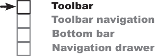
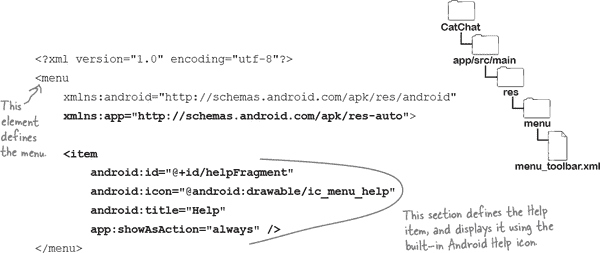
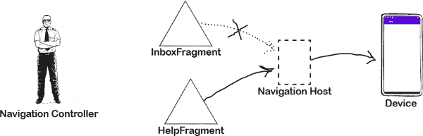
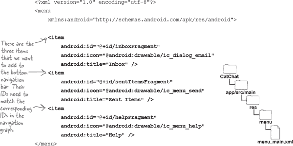
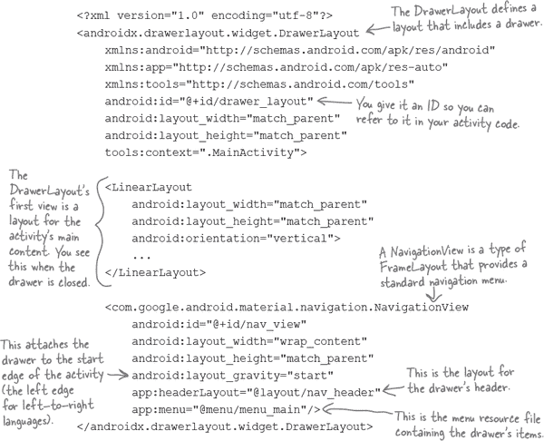
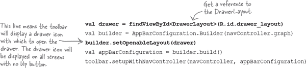
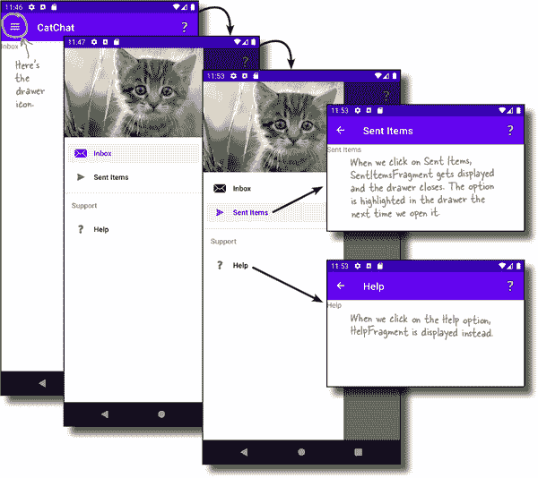
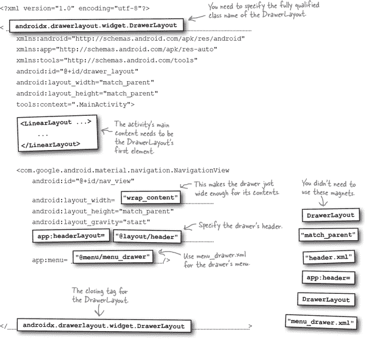

# 第八章：导航 UI：*前往各处*


**大多数应用程序需要能够在目的地之间进行导航。**

并且通过 Android 的导航组件，构建这种 UI 变得更加简单。在这里，您将学习如何使用一些 Android 的导航 UI 组件，以便 **使您的用户更轻松地导航您的应用程序**。您将了解如何使用 **主题**，并将应用程序的默认应用程序栏替换为 **工具栏**，您将学习如何添加 **用于导航的菜单项**。您将发现如何实现 **底部导航栏导航**。最后，您将创建一个时髦的 **导航抽屉**：这是一个从活动侧边滑出的面板。

# 不同的应用程序，不同的结构

在前两章中，您学习了如何使用 Android 的导航组件通过点击按钮从片段导航到片段。这种方法在秘密消息应用程序中效果很好，因为我们需要以线性方式从一个目的地导航到另一个目的地：


但并非所有应用程序都遵循这种结构。许多应用程序有您需要能够从应用程序的任何位置导航到的屏幕。例如，电子邮件应用可能具有必须在整个应用程序中可用的收件箱、已发送项目和帮助屏幕：


当您有一个像这样导航结构较为松散的应用程序时，如何确保您始终可以导航到每个屏幕？

# Android 包括导航 UI 组件

当你有希望在应用程序中任何地方访问的屏幕时，你可能希望使用 Android 的导航 UI 组件之一。它们包括：

## 应用程序栏

这是显示在屏幕顶部的条形区域，Android Studio 通常默认为您包含一个。您可以向应用程序栏中添加项目，当点击时，导航到目的地。


## 底部导航栏

这出现在屏幕底部。它包含少量项目，可用于导航。


## 导航抽屉

这是从屏幕边缘滑出的抽屉。许多应用程序包括其中一个，因为它非常灵活。


在本章中，我们将通过构建名为 CatChat 的原型电子邮件应用程序来发现如何实现这三种类型的导航 UI。

# CatChat 应用程序将如何工作

CatChat 应用程序将包含一个名为 `MainActivity` 的单一活动，并且三个片段：`InboxFragment`、`SentItemsFragment` 和 `HelpFragment`。每个片段在用户导航到它们时将在 `MainActivity` 中显示。


应用程序将包括一个应用程序栏，其中包含一个帮助菜单项。当用户点击此菜单项时，应用程序将通过在 `MainActivity` 中显示它来导航到 `HelpFragment`。


该应用程序还将具有一个导航抽屉，用于在所有三个片段之间进行导航。抽屉将包括每个片段的项目，点击每个项目将显示正确的片段：


让我们来看看我们将如何创建 CatChat 应用的步骤。

# 这是我们要做的事情。

我们将执行四个主要步骤来创建 CatChat 应用：

1.  **用工具栏替换默认的应用栏。**

    工具栏看起来像一个应用程序的默认应用栏，但它为您提供了更多的灵活性，并包括最新的应用栏功能。在此过程中，您将学习如何应用主题和样式。

    

1.  **在工具栏中添加帮助菜单项。**

    点击时，帮助菜单项将导航到`HelpFragment`。

    

1.  **实现底部栏导航。**

    我们将向应用程序添加底部栏，以便我们可以在每个应用程序的片段之间导航。

    

1.  **创建导航抽屉。**

    最后，我们将用导航抽屉替换底部导航栏。抽屉将包括一个头部图像，并为应用程序的每个片段分组成部分的项目。

    

我们将从创建 CatChat 应用的新项目开始。

# 创建一个新项目。



我们将使用一个新的项目来创建 CatChat 应用程序，所以请使用前几章中使用的相同步骤来创建一个新的 Android Studio 项目。选择空活动选项，输入名称“CatChat”和包名称“com.hfad.catchat”，接受默认保存位置。确保语言设置为 Kotlin，最低 SDK 为 API 21，以便它可以在大多数 Android 设备上运行。

## 默认的应用栏被添加了…

当您使用空活动创建新项目时，Android Studio 通常会包含一个显示应用程序名称的应用栏。当您运行应用程序时，可以在屏幕顶部看到此应用栏：


拥有应用栏对于许多原因都很有用：

+    **它使关键操作更加突出，以一种可预测的方式，例如共享内容或执行搜索。**

+    **它可以帮助用户知道他们在应用程序中的位置，显示应用程序名称或当前屏幕的标签。**

+    **您可以使用它导航到不同的目的地。**

但是应用栏是如何添加的呢？

## …通过应用主题

通过应用**主题**将默认的应用栏添加到应用程序中。主题使您的应用程序在多个屏幕上具有一致的外观和感觉。它控制应用程序的一般外观，以及是否包含应用栏。

Android 提供了许多可以在应用程序中使用的主题，默认情况下，Android Studio 应用了一个包含应用栏的主题。

# CatChat 应用程序将使用 Material 主题。

我们将为 CatChat 应用程序应用使用**Material Design**的主题。

Material 是由 Google 开发的设计系统，帮助您构建具有统一外观和感觉的高质量应用程序和网站。其背后的理念是，用户可以从像 Play Store 这样的 Google 应用切换到第三方开发者设计的应用程序，并立即感到舒适并知道该如何操作。

Material 最初受到印刷设计原则和物体（如索引卡和纸片）的运动影响，反映了它们的外观和行为。其最新演变被称为 **Material You**，它为用户提供了更流畅的体验和个性化的配色方案。

## 应用的 build.gradle 文件需要一个 Material 库依赖项。

Material 主题保存在一个单独的库中，您需要将其包含在应用中。您可以通过在应用的 *build.gradle* 文件中添加依赖项到 *com.google.android.material* 库来实现这一点。

由于我们希望在 CatChat 应用中使用 Material 主题，因此我们需要确保它包含了这个库。打开文件 *CatChat/app/build.gradle*，确保包含以下行（用粗体标出）：


Android Studio 可能已经为您在文件中添加了这个依赖项。如果没有，您需要自己添加，并点击代码编辑器顶部出现的 Sync Now 选项，将更改与项目的其余部分同步。

我们希望在 CatChat 应用中应用 Material 主题来控制其应用栏。让我们看看如何实现这一点。

# 在 AndroidManifest.xml 中应用主题

您可以在应用的 *AndroidManifest.xml* 文件中应用一个主题。正如您在 第三章 中所学到的，这个文件提供了关于应用程序配置的信息。它包含一些属性，包括主题，这些属性对应用栏有直接影响。

这是 Android Studio 在 CatChat 项目中为我们创建的 *AndroidManifest.xml* 代码（我们已将关键部分用粗体标出）：


`**android:label**` 属性指的是显示在应用栏中的文本，并且它是您在创建应用时指定的名称。在上面的代码中，它使用了一个名为 `app_name` 的 `String` 资源，Android Studio 已经添加到 *strings.xml* 中。

`**android:theme**` 属性指定了主题。在上面的代码中，它是使用以下方式设置的：

```
android:theme="@style/Theme.CatChat">
```

这指定主题被定义为一个名为 `Theme.CatChat` 的样式资源（由 `@style` 表示）。

# 在样式资源文件中定义样式

样式资源用于描述应用程序需要使用的任何主题和样式，并保存在一个或多个样式资源文件中。

当我们创建 CatChat 应用时，Android Studio 为我们创建了两个样式资源文件。这两个文件名都是 *themes.xml*，分别位于 *app/src/main/res/values* 和 *app/src/main/res/values-night* 文件夹中。*values* 文件夹中的文件是应用的默认样式资源文件，而*values-night* 文件夹中的文件用于夜间模式。

###### 注意

有些版本的 Android Studio 将这个文件命名为 styles.xml。

*values* 文件夹中的 *themes.xml* 定义了如下的样式代码：


`**<style>**` 元素告诉 Android 它是一个样式资源。

每个样式必须有一个名称以标识它，您可以使用 `**name**` 属性来定义，如下所示：


*AndroidManifest.xml* 的 `theme` 属性使用此名称来设置应用程序的主题，例如 `"@style/Theme.CatChat"`。

样式还包括一个 `**parent**` 属性，指定样式应基于哪个基础主题。上述代码使用：


这是一个带有深色应用栏的主题，允许应用程序在白天和夜间主题之间过渡。白天时，它使用 *values* 文件夹中定义的样式资源文件，夜间则切换到 *values-night* 文件夹中的样式资源文件：

上述样式还包括 `<item>` 元素，用于覆盖一些主题的颜色。让我们更详细地看看这一点。

# 样式可以覆盖主题颜色

如果您想要覆盖父主题中的任何属性，例如其颜色方案，可以通过向样式添加 `<item>` 元素来执行此操作。例如，CatChat 应用程序包括覆盖主要和次要品牌颜色的项目。主要颜色是应用程序的主要颜色，用于例如应用栏。次要颜色提供对比度，并用于某些视图。

您可以使用多个样式资源文件在不同情况下应用不同的颜色方案。例如，CatChat 应用程序在 *values* 文件夹中包含一个样式资源文件，在 *values-night* 中包含另一个样式资源文件。这种安排——以及每个样式所基于的 `DayNight` 主题——允许您在白天和夜间应用不同的颜色方案。

这里是 CatChat 应用程序使用的代码，用于覆盖其 *themes.xml* 文件中 *values* 文件夹中的主要颜色：

```
<item name="colorPrimary">@color/purple_500</item>
<item name="colorPrimaryVariant">@color/purple_700</item>
<item name="colorOnPrimary">@color/white</item>
```

如您所见，每个项目都有一个名称，并使用 `@color` 来引用**颜色资源文件**中的颜色。

## 颜色资源文件定义了一组颜色。

创建新项目时，Android Studio 通常会包含一个名为 *colors.xml* 的默认颜色资源文件。它位于 *app/src/main/res/values* 文件夹中，其颜色可在整个应用程序中使用。

典型的颜色资源文件如下所示：


要更改应用程序的颜色方案，只需将所需的颜色添加到颜色资源文件中，并在其样式资源文件中引用它们。

# 用工具栏替换默认应用栏

到目前为止，您已经看到 Android Studio 通过应用主题向应用程序添加了默认应用栏。以这种方式添加应用栏很容易，但更灵活的方法是**用工具栏替换它**。

基本的工具栏看起来与您已经看到的默认应用栏非常相似，但它更加灵活。例如，您可以更改其高度，在接下来的章节中，您将学习如何使其在用户滚动设备屏幕时展开或折叠。它还包含所有最新的应用栏功能，因此使用工具栏可以更轻松地将这些功能包含到您的应用中。

要移除默认应用栏，您需要删除原始的应用栏，并在布局中包含一个工具栏，然后告知活动将该工具栏作为其应用栏使用。接下来的几页我们将向您展示如何操作。


## 使用主题来移除默认的应用栏

通过将不包含应用栏的主题应用到应用程序，您可以移除默认应用栏。

例如，当前版本的 CatChat 应用使用主题 `Theme.MaterialComponents.DayNight.DarkActionBar`。我们将通过将其替换为 **`Theme.MaterialComponents.DayNight.NoActionBar`** 来移除默认应用栏。这两个主题基本外观相同，只是第二个没有应用栏。

现在通过更新 *values* 和 *values-night* 文件夹中的 *themes.xml* 文件中的代码，使其包含如下更改（**加粗部分**）来更改主题：


这就是我们需要做的一切，移除默认应用栏。接下来，我们将讲解如何添加工具栏。

# 工具栏是一种视图类型

与默认应用栏不同，工具栏是一种您可以添加到布局中的视图类型。因为它是一个视图，这意味着您可以完全控制其大小和位置。

提供了不同类型的工具栏，在 CatChat 应用中，我们将使用**Material 工具栏**。这是一种与 Material 主题非常匹配的工具栏，正如我们在这个应用中使用的那种主题。

您可以使用如下代码添加一个 Material 工具栏：


您可以通过以下方式开始定义工具栏：


其中 `com.google.android.material.appbar.MaterialToolbar` 是 `MaterialToolbar` 类的完全限定路径。然后，您可以使用其他视图属性为它指定 ID 并定义其外观。例如，要使工具栏与其父视图同宽并与底层主题的默认应用栏一样高，您可以使用：

```
android:layout_width="match_parent"
android:layout_height="?attr/actionBarSize"
```

上述代码中的 `**?attr**` 前缀表示您希望使用当前主题中的属性。在这种情况下，我们使用 `?attr/actionBarSize` 来引用主题默认应用栏的高度。

您还可以为工具栏设置使用应用的主色调。这可以通过以下方式实现：


现在您已经了解了工具栏代码的外观，让我们将其添加到 `MainActivity` 的布局中。

# 将工具栏添加到 `activity_main.xml`

我们将在 `MainActivity` 的布局中添加一个工具栏，使其显示在屏幕顶部。请更新 *activity_main.xml* 中的代码，以使其与下面的代码匹配：


## 应用名称去哪里了？

上述代码向`MainActivity`的布局添加了一个工具栏，但尚未包含任何应用栏功能。如果您此时运行应用程序，例如，您会发现与之前默认应用栏相比，工具栏中没有显示应用程序名称：


要使工具栏表现得像一个合适的应用栏，我们需要对活动的 Kotlin 代码进行一些更改。

# 将工具栏设置为 MainActivity 的应用栏

要使工具栏表现得像一个合适的应用栏，您需要在活动的 Kotlin 代码中调用`**setSupportActionBar()**`方法，并像这样传递对工具栏的引用：


我们将把以下代码添加到`MainActivity`的`onCreate()`方法中，以便在活动创建后立即运行。更新 *MainActivity.kt* 的代码，包括下面显示的更改（用粗体显示）：


这就是我们需要用工具栏替换应用程序默认应用栏的所有内容。让我们启动应用程序进行测试，并确保它显示正常。

#  测试驾驶

当我们运行应用时，`MainActivity`在屏幕顶部显示一个工具栏。工具栏包括应用程序的名称。

现在我们已经用工具栏替换了默认应用栏，让我们为其添加更多功能。


# 让我们使用工具栏进行导航


在本章开头，我们说过我们希望能够使用 Android 的导航 UI 组件在 CatChat 应用中导航到不同的屏幕。现在我们已经为应用添加了一个工具栏，让我们创建几个屏幕，并使用工具栏在它们之间进行导航。

## 工具栏导航如何工作

我们将首先创建两个新的片段——`InboxFragment`和`HelpFragment`——当用户导航到每个片段时将在`MainActivity`中显示。应用启动时将显示`InboxFragment`，导航到`HelpFragment`时将显示。

###### 注意

我们不会向 InboxFragment 和 HelpFragment 添加任何电子邮件或帮助功能。我们将只在每个片段中显示一段文本，以便知道显示的是哪个片段。

我们将通过向工具栏添加“帮助”项目来导航到`HelpFragment`，效果如下：


我们将使用菜单添加“帮助”项目；您将在几页之后了解如何操作。

当我们点击“帮助”项目时，应用将导航到`HelpFragment`。我们还将更新工具栏的标题以指示当前屏幕，并提供“向上”按钮，以便轻松返回`InboxFragment`。


这就是工具栏导航的工作方式。让我们开始通过向应用添加`InboxFragment`和`HelpFragment`来实现它。

# 创建 InboxFragment

我们希望在应用程序启动时在`MainActivity`中显示`InboxFragment`。在*app/src/main/java*文件夹中突出显示*com.hfad.catchat*包，然后转到文件→新建→片段→空白片段。将片段命名为`InboxFragment`，命名其布局为“fragment_inbox”，并确保语言设置为 Kotlin。然后更新*InboxFragment.kt*的代码以匹配下面的代码：


这是*fragment_inbox.xml*的代码（也更新此文件的代码）：


# 创建 HelpFragment

当用户在工具栏上单击帮助项时，我们将在`MainActivity`中显示`HelpFragment`。在*app/src/main/java*文件夹中突出显示*com.hfad.catchat*包，然后转到文件→新建→片段→空白片段。将片段命名为`HelpFragment`，命名其布局为“fragment_help”，并确保语言设置为 Kotlin。然后确保*HelpFragment.kt*的代码与下面的代码匹配：


然后确保*fragment_help.xml*的代码与下面的布局匹配：


# 我们将使用导航组件导航到 HelpFragment

在第六章中，您学习了如何使用 Android 的导航组件在片段之间导航。即使我们现在将使用工具栏导航到新的目的地，我们仍然可以使用导航组件来满足我们所有的导航需求。

我们首先需要使用 Gradle 将导航组件添加到 CatChat 项目中。

## 在项目 build.gradle 文件中添加版本号

就像以前一样，您需要向项目的*build.gradle*文件中添加一个新变量，指定应添加到应用程序中的导航组件的版本。

打开文件*CatChat/build.gradle*，并在`buildscript`部分添加以下行（**粗体**）：


## 在应用程序 build.gradle 文件中添加依赖项

接下来，您需要在应用程序版本的*build.gradle*文件中添加两个导航组件依赖项。

打开文件*CatChat/app/build.gradle*，并在`dependencies`部分添加以下两行（**粗体**）：


完成这些更改后，单击代码编辑器顶部显示的“立即同步”选项，以将更改与项目的其余部分同步。

现在您已经将导航组件添加到项目中，请在以下练习后使用它创建导航图。

# 将片段添加到导航图中

正如您已经了解的那样，您的应用程序导航图包含应用程序中目的地的详细信息以及导航到它们的可能路径。由于`InboxFragment`和`HelpFragment`是 CatChat 应用程序中的可能目的地，我们将创建一个新的导航图，并将这两个片段添加到其中。

要创建导航图，请在项目资源管理器中选择*CatChat/app/src/main/res*文件夹，然后选择“文件”→“新建”→“Android 资源文件”。在提示时，输入文件名“nav_graph”，选择资源类型“Navigation”，然后点击“确定”按钮。


接下来，打开导航图（文件*nav_graph.xml*），切换到代码视图，并更新文件，使其与下面的代码匹配：


上面的代码将`InboxFragment`和`HelpFragment`添加到导航图中，并为每个片段分配了用户友好的标签。

我们需要对导航图做出的所有更改都在这里了。接下来，让我们更新`MainActivity`的布局，以便在导航到每个片段时能够显示它。

# 在`activity_main.xml`中添加一个导航主机

正如你在第六章中学到的那样，通过将导航主机添加到活动的布局中，你可以显示导航到的每个目的地。你可以使用`FragmentContainerView`来做到这一点，指定你想要使用的导航主机类型和导航图的名称。

在 CatChat 应用中，执行此操作的代码与我们在第六章中向 Secret Message 应用程序添加的代码几乎相同。更新*activity_main.xml*的代码以包含下面的更改（用**粗体**标记出来）：


现在我们已经添加了导航主机，让我们向工具栏添加一个项目，用于导航到`HelpFragment`。

# 使用菜单资源文件指定工具栏中的项目

通过定义**菜单**告诉 Android 应该在工具栏上显示哪些项目。每个菜单在一个 XML 菜单资源文件中定义，指定你希望显示的项目。

我们将创建一个名为*menu_toolbar.xml*的新菜单资源文件，用于将帮助项目添加到工具栏。在项目资源管理器中选择*app/src/main/res*文件夹，然后选择“文件”菜单，选择“新建”，然后选择创建新的 Android 资源文件。在提示时，将其命名为“menu_toolbar”，指定资源类型为“Menu”，并确保目录名称为*menu*。单击“确定”按钮后，Android Studio 将为您创建此文件，并将其添加到*app/src/main/res/menu*文件夹中。

就像导航图和布局文件一样，你可以通过更新 XML 代码或使用内置的设计编辑器来编辑菜单资源文件。设计编辑器的外观如下：


# 让我们在菜单中添加一个帮助项目

我们希望能够从工具栏导航到`HelpFragment`，因此我们将在菜单资源文件中添加一个帮助项。我们将直接通过编辑 XML 代码来实现这一点。

切换到*menu_toolbar.xml*的代码视图，然后更新代码，使其与下面的代码匹配（需要添加的行用**粗体**标记）：



每个菜单资源文件，包括上述文件，都有一个`**<menu>**`根元素。这是告诉 Android 它定义一个菜单的内容。

在`<menu>`元素内部，通常有多个`<item>`元素，每个元素描述一个单独的项目。在这个特定案例中，有一个标题为“Help”的单个帮助项目。

`<item>`元素具有多个属性，可以用来控制项目的外观。

`android:id`属性为项目分配一个 ID。此 ID 由导航组件用于导航到目标，**它必须与导航图中要导航到的目标具有相同的 ID**。您将在接下来的几页中了解其工作原理。

`android:icon`属性指定应为项目显示哪个图标（如果有）。Android 有许多内置图标，当您开始键入图标名称时，IDE 会向您展示可用的列表。

`android:title`属性定义项目的文本。

`app:showAsAction`属性指定您希望项目在工具栏中如何显示。将其设置为“always”意味着它应始终显示在工具栏的主区域中。

# onCreateOptionsMenu() 将菜单项添加到工具栏

定义菜单资源文件后，通过在活动代码中实现`**onCreateOptionsMenu()**`方法将其项目添加到工具栏。此方法在活动准备好向工具栏添加项目时被调用。它会将菜单资源文件填充，并将其描述的每个项目添加到工具栏。

在 CatChat 应用程序中，我们希望将*menu_toolbar.xml*中定义的项目添加到`MainActivity`的工具栏。下面以粗体显示的代码将添加此项目（您将在几页后更新您的代码）：


这一行：

```
menuInflater.inflate(R.menu.menu_toolbar, menu)
```

填充菜单资源文件。在幕后，它创建一个代表菜单资源文件的`Menu`对象，菜单资源文件包含的任何项目都被转换为`MenuItem`对象。然后将它们添加到工具栏。

这就是向工具栏添加菜单所需的一切。接下来，我们将使`MainActivity`在用户单击帮助项目时导航到`HelpFragment`。


# 使用 onOptionsItemSelected()响应菜单项点击

一旦使用`onCreateOptionsMenu()`方法将菜单项添加到工具栏，您可以通过实现`**onOptionsItemSelected()**`使它们响应点击。每当工具栏中的项目被点击时，此方法都会运行：


在 CatChat 应用程序中，当用户单击帮助菜单项时，我们希望导航到`HelpFragment`，我们可以通过导航组件来实现这一点。

下面是代码的样子；我们将在几页后将这些更改添加到*MainActivity.kt*：


每次单击“帮助”菜单项时，导航控制器获取其 ID 并在导航图中查找匹配的 ID，然后将带有此 ID 的目的地传递给导航宿主，以便在设备屏幕上显示。

# 我们需要配置工具栏

现在我们已经涵盖了将“帮助”菜单项添加到工具栏并使其导航到`HelpFragment`所需的所有内容。然而，在我们进行应用程序测试之前，还有一个改变我们将要进行。

当我们在本章之前定义导航图*nav_graph.xml*时，我们使用如下代码为每个目的地添加了标签：


为了清楚地显示正在显示的屏幕，我们将配置工具栏，以便每次导航到新目的地时，在工具栏中显示其标签。我们还将向工具栏添加一个向上按钮，以便用户在导航到`HelpFragment`时，提供一个快速返回`InboxFragment`的方法：


向上导航听起来可能与使用设备上的返回按钮相同，但稍有不同。返回按钮允许用户通过回退栈（访问过的屏幕的历史记录）逐步“返回”。另一方面，向上按钮基于导航图层次结构。它提供了快速上移此层次结构的方式。

我们可以使用导航组件配置工具栏以更新文本并包含一个向上按钮。让我们找出如何做到这一点。

# 使用 AppBarConfiguration 配置工具栏


我们想要配置工具栏，以便它显示对应于导航图中当前目的地标签的文本，并包含一个向上按钮。我们可以通过构建基于导航图的`**AppBarConfiguration**`对象并将其链接到工具栏来实现这一点。`AppBarConfiguration`类是导航组件的一部分，用于使应用栏和工具栏与导航控制器良好地协作。

下面是构建`AppBarConfiguration`并将其链接到工具栏的代码（加粗部分）：


以上代码首先从导航宿主中使用以下代码获取导航控制器的引用：


每当您需要从活动的`onCreate()`方法获取导航控制器的引用时，就需要像这样的代码。

然后，该代码构建了一个将工具栏链接到导航图的配置，并将其应用于工具栏。

当代码运行时，它使用导航图中的信息来显示当前目的地的标签。它还为除导航图的起始目的地之外的所有目的地的工具栏添加一个向上按钮，在这种情况下是`InboxFragment`。

这就是您实现工具栏导航所需了解的所有内容。我们将在下一页上展示完整的`MainActivity`代码。

# MainActivity.kt 的完整代码

这是*MainActivity.kt*的完整代码；更新你的代码以包含以下更改（用粗体标出）：


# 应用程序运行时会发生什么

当应用程序运行时会发生以下事情：

1.  **应用程序启动并创建 MainActivity。**

    `InboxFragment`被添加到导航主机并显示在设备屏幕上。

    

1.  **MainActivity 的 onCreateOptionsMenu 方法运行。**

    它将在工具栏中添加在*menu_toolbar.xml*中定义的帮助菜单项。

    

1.  **用户在工具栏中点击帮助项。**

    

1.  **MainActivity 的 onOptionsItemSelected()方法运行。**

    它将帮助项的导航传递给导航控制器。

    

1.  **导航控制器在导航图中查找帮助项的 ID。**

    

1.  **导航控制器将 InboxFragment 替换为 HelpFragment 在导航主机中。**

    

#  测试驾驶


当我们运行 CatChat 应用程序时，`MainActivity`被启动，并且`InboxFragment`显示在`MainActivity`的布局中。

在`MainActivity`的工具栏中显示一个帮助项。当我们点击它时，应用程序导航到`HelpFragment`。工具栏文本更改为“帮助”，并出现一个向上按钮。

当我们点击“向上”按钮时，应用程序导航到`InboxFragment`。向上按钮消失，工具栏显示“收件箱”文本。


干得好！你现在已经学会了如何添加工具栏并将其用于导航。

# 扮演菜单


**下面显示了一个菜单资源文件和导航图。菜单添加到工具栏。你的任务是扮演菜单，说出每个菜单项被点击时导航到哪个片段。**


# 扮演菜单解决方案


**下面显示了一个菜单资源文件和导航图。菜单添加到工具栏。你的任务是扮演菜单，说出每个菜单项被点击时导航到哪个片段。**


# 大多数类型的 UI 导航与导航组件一起工作


到目前为止，你已经学会了如何通过定义菜单资源文件启用工具栏导航，使用导航组件在片段之间导航，并配置工具栏以在应用程序导航时更改外观。

令人振奋的消息是，其他类型的 UI 导航，如底部导航栏和导航抽屉，工作方式类似。即使它们看起来彼此不同，你也可以将学到的工具栏导航技巧应用到其他类型的导航上。

为了看看这是如何工作的，我们将向 CatChat 应用程序的`MainActivity`添加一个底部导航栏。

> **底部导航栏最多可以容纳五个项目。它显示在屏幕底部。**

## 底部导航栏的工作原理

顾名思义，底部导航栏是一种位于设备屏幕底部的导航栏类型。您可以使用它导航到最多五个目的地。

CatChat 应用程序的底部导航栏将如下所示：


正如您所见，该栏包含三个项目：收件箱、已发送项目和帮助。当我们点击每个项目时，应用程序将导航到与其关联的片段。例如，当我们点击帮助项目时，应用程序将导航到`HelpFragment`，当我们点击已发送项目时，它将导航到一个新的片段（我们需要创建的）名为`SentItemsFragment`。

我们将在接下来的几页中实现底部导航栏导航，并且我们将从创建新的片段`SentItemsFragment`开始。

# 创建 SentItemsFragment

我们需要创建一个名为`SentItemsFragment`的新片段。

在*app/src/main/java*文件夹中突出显示*com.hfad.catchat*包，然后转到文件→新建→Fragment→Fragment（空白）。将片段命名为“SentItemsFragment”，命名其布局为“fragment_sent_items”，并确保语言设置为 Kotlin。然后更新*SentItemsFragment.kt*的代码以匹配下面的代码：


这是*fragment_sent_items.xml*的代码（也更新您的代码版本）：


# 将 SentItemsFragment 添加到导航图中

我们希望能够通过导航组件从底部导航栏导航到`SentItemsFragment`。为此，我们需要将该片段作为新目标添加到导航图中。

打开导航图文件*nav_graph.xml*（如果尚未打开），然后更新其代码，使其与下面的代码匹配（我们的更改已加粗）：


正如您所见，新目的地的 ID 为`sentItemsFragment`，标签为“已发送项目”。我们将在接下来创建的底部导航栏菜单资源文件中使用此 ID。

# 底部导航栏需要一个新的菜单资源文件

在本章的早些时候，我们创建了一个名为*menu_toolbar.xml*的菜单资源文件，以在工具栏中添加帮助项。虽然不同的导航 UI 组件可以共享相同的菜单，但我们需要为底部导航栏创建一个新的菜单，因为它显示了两个额外的项目：收件箱和已发送项目。


要创建新的菜单资源文件，请选择*app/src/main/res*文件夹，转到文件菜单，选择新建，然后选择创建新的 Android 资源文件。在提示时，将其命名为“menu_main”，指定资源类型为“Menu”，并确保目录名称为*menu*。单击“确定”按钮后，Android Studio 将为您创建该文件，并将其添加到*app/src/main/res/menu*文件夹中。

接下来，打开*menu_main.xml*文件（如果还没有打开），并更新其代码以为`InboxFragment`、`SentItemsFragment`和`HelpFragment`添加菜单项（如下所示，用**粗体**标出）：



现在我们已经创建了新的菜单资源文件，让我们向`MainActivity`添加一个底部导航栏。

# 底部导航栏是一种视图类型

就像工具栏一样，底部导航栏是一种你可以添加到布局中的视图类型。添加底部导航栏的代码如下所示：


你首先通过以下方式定义底部导航栏：

```
<com.google.android.material.bottomnavigation.BottomNavigationView
    ... />
```

这里`com.google.android.material.bottomnavigation.BottomNavigationView`是`BottomNavigationView`类的完全限定路径：定义该导航栏的类。然后使用额外的属性为它指定一个 ID，并指定其外观。

不像工具栏，你不需要编写 Kotlin 代码来将菜单项添加到底部导航栏。你只需使用 `app:menu` 属性指定要添加到导航栏的菜单资源文件，像这样：

```
app:menu="@menu/menu_main"
```

上述代码将*menu_main.xml*菜单资源文件附加到底部导航栏，并在运行时将其项目添加到栏中，如下所示：


现在你已经看到了底部导航栏的代码，让我们将其添加到`MainActivity`的布局中。

# *activity_main.xml*的完整代码

这里是*activity_main.xml*的完整代码：更新你的代码以包含以下更改（用**粗体**标出）：


现在我们已经将底部导航栏添加到`MainActivity`的布局中，让我们使其在不同目的地之间导航。

# 将底部导航栏链接到导航控制器

使底部导航栏在目的地之间导航的代码比实现工具栏导航所需的代码简单得多。你只需获取指定导航栏的`BottomNavigationView`引用，并调用其`setupWithNavController()`方法即可。

代码如下所示：


每次点击导航栏中的项目时，导航控制器都会获取其 ID，并在导航图中查找具有匹配 ID 的目的地。然后将此目的地传递给导航主机，以便在设备屏幕上显示它。


让我们将底部导航栏的代码添加到*MainActivity.kt*中，并测试这个应用程序。

# `MainActivity.kt`的更新代码

这是*MainActivity.kt*的更新代码：更新代码以包含以下更改（用**粗体**标出）：


让我们测试这个应用程序。

#  测试驾驶

当我们运行 CatChat 应用程序时，`MainActivity`被启动，并在`MainActivity`的布局中显示`InboxFragment`。显示一个包含三个项目的底部导航栏。

当我们点击底部导航栏中的每个项目时，应用程序会导航到相应的屏幕。例如，当我们点击 Sent Items 时，在`MainActivity`中会显示`SentItemsFragment`，当我们点击 Help 项目时，将显示`HelpFragment`。


底部导航栏正按照我们的期望工作。

# 导航抽屉可以让您显示许多导航项目


正如您所了解的，如果您有少量导航项目，底部导航栏是一个不错的选择，因为它允许您显示最多五个这样的项目。但是如果您有更多的菜单项目呢？

如果您希望用户能够浏览大量选项，一个更好的选择可能是**导航抽屉**。这是一个可滑动的面板，包含指向应用程序其他部分的链接，您可以选择将其分组到不同的部分中。

导航抽屉在 Android 应用程序中被广泛使用。例如，Gmail 应用程序使用一个导航抽屉，让您可以导航到应用程序中的不同屏幕，并包含诸如电子邮件类别、最近标签和所有标签等部分：


# 让我们用导航抽屉替换底部导航栏

我们将用导航抽屉替换 CatChat 应用程序中添加的底部导航栏。导航抽屉将包含一个标题图像和一组选项。主要选项将允许用户导航到`InboxFragment`和`SentItemsFragment`，我们将在一个名为 Support 的单独部分中放置一个`HelpFragment`项目。抽屉将如下所示：


导航抽屉由几个不同的组件组成。我们将在下一页详细介绍这些组件。

# 导航抽屉解构

通过将**抽屉布局**添加到活动布局的根部来实现导航抽屉。抽屉布局包含两个视图：

1.  **用于屏幕主要内容的视图**

    这通常是一个包含工具栏和导航主机的布局，用于显示片段。

1.  **用于抽屉内容的导航视图**

    导航视图是一种用于显示导航菜单的帧布局类型。在这个应用中，它还会显示一个抽屉标题。

当抽屉关闭时，抽屉布局看起来就像一个普通的活动，只是工具栏包含一个用于打开抽屉的抽屉图标：


当您打开抽屉时，导航视图会滑动到活动的主要内容上，以显示抽屉的内容。当您点击一个项目时，它会使用导航组件来显示相关的目的地，然后抽屉会关闭：


# 抽屉从菜单中获取其项目

就像工具栏和底部导航栏一样，导航抽屉从菜单资源文件中获取需要显示的项目。

不要为抽屉创建新的菜单资源文件，我们将重用*menu_main.xml*：这个文件我们之前用于底部导航栏。这里是*menu_main.xml*中当前代码的提醒：


将上述菜单资源文件添加到导航抽屉中，会生成一个带有每个项目图标的项目列表。我们将调整菜单以在用户选择的项目上添加额外的突出显示，并将菜单分成几个部分：


让我们找出如何做到这一点。

# 添加支持部分…

我们将首先添加支持标题，通过定义一个新项目来完成。因为它只是一个标题，我们只需要给它一个标题即可：它没有图标，也不需要 ID，因为我们不会用它导航到任何地方。

这是添加支持标题的代码：


## …作为独立的子菜单

我们希望帮助项目出现在支持标题下，形成一个单独的部分。为此，我们将在支持项目内定义一个子菜单，由`<menu>`元素指定。我们将在这个子菜单中添加帮助项目。

这是添加子菜单的代码，其中包含一个帮助项目；我们将在稍后的几页更新*menu_main.xml*的代码：


上述子菜单只包含一个项目。如果您希望它包含多个项目，只需在子菜单中包含每个项目即可。

这就是我们需要添加支持部分到抽屉菜单的全部代码。接下来，让我们看看如何在用户选择的项目上添加额外的突出显示。

# 使用组突出显示选定的项目

当前的菜单会生成一个导航抽屉，会改变当前选定项目的文本颜色。您可以通过添加额外的突出显示来更清楚地告知用户哪个项目已被选中：


通过使用`**<group>**`元素将项目组合到一起，您可以添加额外的突出显示。然后，您可以使用名为`android:checkableBehavior`的属性来指定项目被选中时组的行为。

这是执行此操作的代码（我们将在下一页更新*menu_main.xml*）：


如您所见，上述代码将`android:checkableBehavior`属性设置为`"single"`。这个选项意味着在组中一次只有一个项目会被突出显示——用户选择的选项。

这是我们使菜单在导航抽屉中使用时看起来和行为符合我们期望的所有代码。接下来的页面上我们会展示完整的代码。

# menu_main.xml 的完整代码

我们将更新导航抽屉的菜单，以便在支持部分显示帮助菜单。我们还将使用组在用户选择的项目上添加额外的突出显示。

这是*menu_main.xml*的完整代码；更新其代码以包括所有更改（加粗部分）：


菜单已整理好。接下来，我们将创建导航抽屉的页眉。

# 创建导航抽屉的头部

导航抽屉的头部是一个简单的布局，我们将其添加到名为 *nav_header.xml* 的新布局文件中。

在 Android Studio 中选择 *app/src/main/res/layout* 文件夹，通过 File→New→Layout Resource File 创建此文件。当提示时，命名布局为“nav_header”，如果需要，选择布局资源类型。

## 添加图片文件…

布局由一个单独的图片组成，需要将其添加到 *app/src/main/res/drawable* 文件夹中。当您创建项目时，Android Studio 可能已经为您创建了此文件夹。如果没有，请通过选择 *app/src/main/res* 文件夹，转到文件菜单，选择新建选项，然后单击创建新的 Android 资源目录选项来创建它。在提示时，选择资源类型为 Drawable，命名为“drawable”，然后单击确定。


创建完 *drawable* 文件夹后，从 *tinyurl.com/hfad3* 下载 *kitten_small.webp* 文件，并将其添加到 *drawable* 文件夹中。

## …并更新 *nav_header.xml* 代码

我们将使用 `<ImageView>` 元素将图片添加到 *nav_header.xml* 中。您已经知道如何使用此元素，因此请更新 *nav_header.xml* 的代码以匹配以下代码：


现在我们有了导航抽屉的头部，让我们添加抽屉本身。

# 如何创建导航抽屉

要创建导航抽屉，请将 `**DrawerLayout**` 添加到活动的布局中作为根元素。 `DrawerLayout` 需要包含两个内容：作为其第一个元素的活动内容的视图或视图组，以及作为其第二个元素定义抽屉内容的导航视图。

典型的 `DrawerLayout` 代码如下：



有两个关键的 `<NavigationView>` 属性可用于控制抽屉的外观：`**app:headerLayout**` 和 `**app:menu**`。

`app:headerLayout` 属性指定应用于导航抽屉头部的布局（在此例中是 *nav_header.xml*）。此属性是可选的。

`app:menu` 属性指定了包含抽屉选项的菜单资源文件（在这种情况下是 *menu_main.xml*）。如果不包括此属性，您的导航抽屉将不包含任何项目。

# *activity_main.xml* 的完整代码

我们希望用导航抽屉替换 `MainActivity` 的底部导航栏。以下是执行此操作的代码；更新文件 *activity_main.xml* 来包含以下更改（用粗体表示）：


## 我们已将导航抽屉添加到布局中。

我们现在用导航抽屉替换了`MainActivity`布局中的底部导航栏。它在头部显示了一张图片，并包括了 *menu_main.xml* 中指定的所有项目。

然而，在运行应用程序之前，我们需要将导航抽屉链接到导航控制器，以便单击项目时导航到正确的片段。


我们还需要配置工具栏，以便包括一个抽屉图标，当点击时，将打开或关闭导航抽屉：


通过调整*MainActivity.kt*中的代码来进行这两个更改。让我们看看如何做到这一点。

# 配置工具栏的抽屉图标…

在本章早些时候，我们配置了工具栏以显示当前目标的标签并包括一个向上按钮。我们通过构建一个`AppBarConfiguration`对象，并将其链接到工具栏来实现这一点。

我们现在希望工具栏包括一个抽屉图标，我们可以通过将导航抽屉添加到`AppBarConfiguration`来添加一个。这里是实现这一目标的代码：



上述代码将抽屉布局添加到`AppBarConfiguration`对象中。这允许工具栏与抽屉进行交互，通过在没有向上按钮的每个屏幕上包括抽屉图标。

## …并链接抽屉到导航控制器

最后，我们需要让抽屉在用户每次点击其项目时导航到正确的目标。就像底部导航栏一样，我们通过使用导航控制器设置导航抽屉来完成这个任务。

这里是实现这一目标的代码：

```
val navHostFragment = supportFragmentManager
    .findFragmentById(R.id.nav_host_fragment) as NavHostFragment
val navController = navHostFragment.navController
val navView = findViewById<NavigationView>(R.id.nav_view)
NavigationUI.setupWithNavController(navView, navController)
```


每当用户在导航抽屉中点击项目时，导航控制器会从菜单资源文件中获取其 ID，并在导航图中查找匹配的 ID，然后导航到具有该 ID 的目标。

这就是控制导航抽屉行为所需的所有代码。让我们将其添加到*MainActivity.kt*中，并进行应用程序测试。

# MainActivity.kt 的完整代码

我们需要更新`MainActivity`以用导航抽屉的代码替换底部导航代码。使用以下更改更新*MainActivity.kt*（用粗体标记）：


这就是我们为导航抽屉所需的所有代码。让我们来测试一下。

#  测试驾驶


当我们运行应用程序时，工具栏中会显示一个抽屉图标。单击此图标会打开导航抽屉。当我们在抽屉中点击其中一个项目时，该选项的片段会显示在`MainActivity`中，并且抽屉关闭。



恭喜！现在您已经学会了如何创建一个完全可操作的导航抽屉。

# 布局磁铁


某人使用冰箱磁铁编写了导航抽屉的布局代码，但是一些磁铁在夜间掉落了。您能重新组合代码吗？

活动使用线性布局作为其主要内容（我们略去了大部分代码）。抽屉需要显示一个头部，定义在名为 *header.xml* 的布局文件中。其菜单项在名为 *menu_drawer.xml* 的菜单资源文件中指定。


# 布局磁铁解决方案


有人用冰箱磁铁编写了导航抽屉的布局代码，但是有些磁铁在夜间掉了下来。你能把代码重新整理好吗？

活动使用线性布局作为其主要内容（我们略去了大部分代码）。抽屉需要显示一个头部，定义在名为 *header.xml* 的布局文件中。其菜单项在名为 *menu_drawer.xml* 的菜单资源文件中指定。



# 你的 Android 工具箱


**你已经掌握了 第八章 并且现在你已经将导航 UI 添加到你的工具箱中。**


