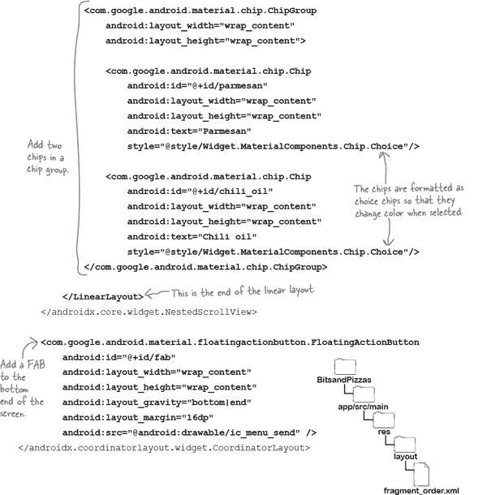

# 第九章：材料视图：*一个物质世界*


**大多数应用程序需要一个响应用户操作的流畅用户界面。**

到目前为止，您已经学会了如何使用文本视图、按钮和下拉框，并使用 Material 主题来对应用程序的外观和感觉进行全面更改。但是，您可以做的远不止这些。在这里，您将学习如何通过协调布局使您的用户界面更具响应性。您将创建可以随意折叠或滚动的工具栏。您将发现新的令人兴奋的视图，如复选框、单选按钮、标签和浮动操作按钮。最后，您将了解如何使用吐司和 Snackbar 显示友好的弹出消息。继续阅读以了解更多信息。

# Material 在整个 Androidville 中被广泛使用。

在前一章中，您学会了如何使用工具栏、底部导航栏和导航抽屉来帮助用户导航您的应用程序，并使用 Material 库中的主题对它们进行了样式化。正如您所知，Material 是一个设计系统，帮助您在所有屏幕上构建具有一致外观和感觉的应用程序。

Material 不仅限于工具栏、导航抽屉和底部导航栏；它还为应用程序中的每个视图（从按钮到文本视图）提供了样式。

这里还有一些使用 Material 的组件和功能的示例：

+    **滚动和折叠工具栏**

    用户滚动内容时，您可以使工具栏滚动到屏幕外，或者收起。

    

+    **单选按钮、复选框和标签**

    这些可以让用户选择选项。

    

+    **浮动操作按钮（FAB）**

    FAB（Floating Action Button）是一种特殊的按钮，浮在主屏幕上方。

    

+    **Snackbar（消息栏）**

    这些是您可以与之交互的弹出消息。

    

我们将向您展示如何通过构建一个新应用程序来使用这些视图和功能。

# Bits and Pizzas 应用程序

我们将要构建一个名为“Bits and Pizzas”的新应用程序。我们将专注于其“创建订单”屏幕，用户可以在此屏幕上下单订购披萨。

屏幕看起来像这样：


该应用程序由一个名为`MainActivity`的活动组成，显示一个名为`OrderFragment`的片段。该片段定义了“创建订单”屏幕的外观和功能。

让我们逐步了解构建该应用程序所需的步骤。

# 这是我们将要做的事情

我们将通过以下步骤构建该应用程序：

1.  **添加一个可以滚动的工具栏。**

    我们将创建`OrderFragment`，并在其布局中添加一个工具栏，当用户向上滚动屏幕时，工具栏将滚动到屏幕外，并在向下滚动时重新出现。

    

1.  **实现可折叠的工具栏。**

    完成工具栏的滚动后，我们将在其上添加一个图像，并使其在用户滚动屏幕时收缩和展开。

    

1.  **添加视图。**

    用户需要能够下订单。我们将通过向`OrderFragment`的布局中添加单选按钮、芯片和浮动操作按钮来实现这一点。

    

1.  **使 FAB 响应点击。**

    当用户点击 FAB 时，我们将显示一个弹出消息，提供订单的详细信息。

    

# 创建 Bits and Pizzas 项目


我们将为 Bits and Pizzas 应用创建一个新项目，您需要使用前几章相同的步骤创建一个。选择“空活动”选项，输入名称“Bits and Pizzas”和包名称“com.hfad.bitsandpizzas”，并接受默认保存位置。确保语言设置为 Kotlin，最小 SDK 为 API 21，以便在大多数 Android 设备上运行。

## 向应用的 build.gradle 文件添加 Material 库依赖项

在本章中，我们将使用 Material 库中的主题、视图和特性，因此需要确保应用的*build.gradle*文件包含它作为依赖项。

打开文件*BitsandPizzas/app/build.gradle*，确保其`dependencies`部分包含以下行（用粗体标出）：


Android Studio 可能已经为您添加了此依赖项到文件中。如果没有，您需要自己添加，并点击代码编辑器顶部出现的“立即同步”选项以将更改与项目的其余部分同步。

现在您已经确保应用包含 Material 库，让我们去创建`OrderFragment`。

# 创建 OrderFragment

`OrderFragment`是 Bits and Pizzas 应用的主屏幕，用户将用它来下订单。

要创建片段，请在`app/src/main/java`文件夹中突出显示*com.hfad.bitsandpizzas*包，然后转到 文件→新建→片段→片段（空白）。将片段命名为“OrderFragment”，其布局命名为“fragment_order”，并确保语言设置为 Kotlin。然后更新*OrderFragment.kt*的代码以匹配下面的代码：


然后更新其布局文件*fragment_order.xml*的代码，使其包含如下的帧布局：


我们将在本章的其余部分更新`OrderFragment`。首先，让我们在`MainActivity`的布局中显示它。

# 在 MainActivity 的布局中显示 OrderFragment

我们将使用`FragmentContainerView`将`OrderFragment`添加到`MainActivity`的布局中，指定片段的名称。

这是要实现此功能的代码；打开*activity_main.xml*并更新其代码以包含以下更改：


最后，打开*MainActivity.kt*，确保其代码与下面显示的代码匹配：


现在我们已经让`MainActivity`显示`OrderFragment`，让我们找出如何使应用栏响应滚动。

# 用工具栏替换默认应用栏

我们将使“Bits and Pizzas”应用栏在用户滚动时做出响应。暂时，当用户向上滚动屏幕时，我们将其滚动出屏幕，并在用户向下滚动时重新显示。


要做到这一点，我们首先需要用工具栏替换默认的应用栏。这是因为默认的应用栏固定在屏幕顶部，无法滚动。而工具栏则灵活得多。

要做到这一点，我们首先需要将应用的主题更改为没有应用栏的主题。打开位于*app/src/main/res/values*文件夹中的*themes.xml*文件，并更新其代码以包含以下**粗体**样式：


如果您的项目在*values-night*文件夹中包含一个*themes.xml*文件，您也需要对该文件应用上述更改。

一旦完成此更改，请通过更新*fragment_order.xml*代码将工具栏添加到`FragmentOrder`。


# 片段没有`setSupportActionBar()`方法

现在我们已经添加了工具栏，我们需要使其表现得像一个正常的应用栏，显示应用的名称。如前一章所述，可以通过调用活动的`setSupportActionBar()`方法来实现这一点。

在这里，我们已经向片段添加了工具栏，但**片段不包括**`**setSupportActionBar()**` **方法**。为了解决这个问题，我们将获取显示片段的活动的引用（使用`**activity**`），将其强制转换为`AppCompatActivity`以反映其类型，并调用其`setSupportActionBar()`方法。

这是完成此操作的代码：


下面是*OrderFragment.kt*的完整代码；请更新您的代码以包含以下更改（用**粗体**标出）：


# 我们已经向片段添加了工具栏…接下来怎么做？

现在我们已经向`OrderFragment`的布局中添加了一个工具栏，因此当应用运行时，工具栏将显示在屏幕顶部：


但是，如果我们尝试滚动屏幕，工具栏不会移动。为了使其响应滚动，我们需要进行一些额外的更改。

## 我们希望工具栏可以响应滚动

要使工具栏移动，我们需要在片段布局中添加更多视图。布局需要遵循以下结构：


布局需要包括三个组件：一个**协调布局**，一个**应用栏布局**和一个**嵌套滚动视图**。它们共同使得工具栏可以在用户滚动屏幕时响应。

让我们从协调布局开始了解每个组件的功能。

# 协调布局用于协调不同视图之间的动画

协调布局就像是一个增强版的帧布局，用于协调不同视图之间的动画。例如，它可以协调用户滚动布局的主内容与工具栏移出屏幕的动作。

您可以像这样向布局代码中添加协调布局：


你需要在协调布局中包含任何你想要协调动画的视图。例如，在 Bits 和 Pizzas 应用中，我们想要协调两件事情：用户滚动布局的主要内容，以及工具栏滚动到屏幕外。这意味着工具栏和屏幕的主要内容需要包含在协调布局中：


> **CoordinatorLayout 允许一个视图的行为影响另一个视图的行为。**
> 
> **CoordinatorLayout 通常是布局的根元素。**

现在我们知道协调布局的作用是什么，让我们继续看看应用栏布局。

# 应用栏布局使工具栏动画化

应用栏布局是一种设计用于与应用栏一起工作的垂直线性布局类型。它与协调布局一起工作，实现工具栏动画。

你可以像这样在代码中添加一个应用栏布局：


正如你所看到的，上面的应用栏布局代码包括一个像这样的`android:theme`属性：

```
android:theme="@style/ThemeOverlay.MaterialComponents.Dark.ActionBar"
```

这将应用指定的样式到应用栏布局及其所有视图。在这个例子中，这意味着工具栏——以及我们添加到应用栏布局的任何其他内容——将使用 Material 主题的应用栏属性进行样式设置，包括其背景和文本的颜色。

太棒了！现在你的工具栏是动画的，并且可以响应滚动事件。但这还不是故事的结束：你还需要指定它应该如何响应。让我们看看如何做到这一点。

# 告诉工具栏如何响应滚动事件

一旦你添加了一个应用栏布局，你可以通过向工具栏添加一个`app:layout_scrollFlags`属性并为其分配一个值来告诉工具栏如何响应滚动。该值指定工具栏应如何响应滚动事件。

在 Bits 和 Pizzas 应用中，当用户向上滚动时，我们希望工具栏向上滚动到屏幕外，并在用户向下滚动时快速返回到原始位置。我们可以通过将工具栏的`app:layout_scrollFlags`属性设置为`"scroll|enterAlways"`来实现这一点，代码如下：

> **工具栏必须位于应用栏布局内才能滚动。应用栏布局和协调布局共同工作，实现滚动。**


这行代码：

```
app:layout_scrollFlags="scroll|enterAlways"
```

指定了两种行为：`scroll`和`enterAlways`。

`scroll`值表示当用户向上滚动时，视图可以从屏幕顶部滚动出去。如果没有这个值，工具栏将保持固定在屏幕顶部，无法滚动。

`enterAlways`值表示当用户向下滚动时，工具栏会快速滚动回原始位置。没有这个值，工具栏仍然会向下滚动，但速度会慢得多。

你已经快完成了！在我们能让`OrderFragment`工具栏滚动之前，你只需要做最后一步：**嵌套滚动视图**。

# 嵌套滚动视图使布局内容可滚动

现在，你需要添加一个**嵌套滚动视图**，以便布局的主内容可以滚动。这种视图的工作方式就像普通的滚动视图，但它支持*嵌套*滚动。这很重要，因为协调布局*只监听嵌套滚动事件*。如果在你的布局中使用普通的滚动视图，工具栏将无法在用户滚动屏幕时响应。

###### 注意

另一个支持嵌套滚动的视图是 RecyclerView。你将在第十四章学习到关于这个视图的内容。

你可以像这样使用代码向布局中添加一个嵌套滚动视图：


在上述示例中，嵌套滚动视图包含了一个额外的属性，名为`app:layout_behavior`，设置为内置的字符串值`"@string/appbar_scrolling_view_behavior"`。这确保了嵌套滚动视图的内容在应用栏布局下方排列，并且随着滚动而移动。

注意**嵌套滚动视图只能有一个直接子元素**，在上面的示例中是一个文本视图。如果你想要将多个视图添加到嵌套滚动视图中，你必须首先将它们添加到一个视图组中，比如线性布局，然后再将视图组添加到嵌套滚动视图中。

###### 注意

你将在本章的后面看到一个例子。

这就是我们需要知道的关于如何使 Bits 和 Pizzas 工具栏滚动的全部内容，所以让我们继续更新`OrderFragment`的布局。

# fragment_order.xml 的完整代码

下面是*fragment_order.xml*的完整代码；请更新代码以包含以下更改（用粗体标出）：


#  测试驾驶


当我们运行应用时，`OrderFragment`显示在`MainActivity`的布局中。屏幕顶部显示了一个工具栏。

当我们向上滚动屏幕时，工具栏向上滚动并离开屏幕顶部。


当我们向下滚动主内容时，工具栏重新出现。


恭喜！你现在已经学会了如何创建一个能够响应滚动的工具栏。

在下面的练习之后，我们将学习如何将滚动工具栏转换为随着用户滚动屏幕而展开和折叠的工具栏。

# BE the Layout


**以下是名为 MyFragment 的片段的布局文件。你的任务是像是布局一样，并更改代码，使得当用户向上滚动屏幕时，工具栏从屏幕上滚动出去，当他们向下滚动时，它迅速重新出现。**


# BE the Layout Solution


**以下是名为 MyFragment 的片段的布局文件。你的任务是像是布局一样，并更改代码，使得当用户向上滚动屏幕时，工具栏从屏幕上滚动出去，当他们向下滚动时，它迅速重新出现。**


# 让我们创建一个折叠式工具栏


现在你知道如何使工具栏滚动到屏幕之外后，让我们用一个稍微不同的工具栏替换它：一个**可折叠工具栏**。

可折叠工具栏是一种工具栏，初始时较大，在用户向上滚动屏幕时会收缩，并在用户向下滚动屏幕时再次扩展。你甚至可以向其添加一个图像，当工具栏达到最小高度时图像消失，并在工具栏扩展时再次可见：


接下来几页，我们将学习如何通过在`OrderFragment`的布局中添加一个简单的工具栏来将普通工具栏转换为可折叠工具栏。我们将首先创建一个简单的可折叠工具栏，然后创建一个包含图像的工具栏。

让我们开始吧。

# 如何创建简单的可折叠工具栏

将滚动工具栏转换为可折叠工具栏相对简单。你只需将工具栏包裹在**可折叠工具栏布局**中，并调整工具栏的属性。基本的代码结构如下：


如你所见，可折叠工具栏布局使用`<...CollapsingToolbarLayout>`元素定义，它是*com.google.android.material*库的一部分。你可以使用其`layout_height`属性指定其最大高度，而以下这行：


告诉它在用户向上滚动时折叠，直到没有更多内容可折叠，当用户向下滚动时扩展至其全高度。

我们还需要确保当工具栏折叠时，显示在工具栏上的任何内容，如返回按钮和任何菜单项都保持在屏幕上显示。通过向`Toolbar`元素添加以下属性实现：


# 如何将图像添加到可折叠工具栏

创建简单的可折叠工具栏后，你可以通过向可折叠工具栏布局添加一个<`ImageView>`，指定要使用的图像来添加图像。代码遵循以下结构：


下面这行：

```
app:contentScrim="?attr/colorPrimary"
```

添加到`<...CollapsingToolbarLayout>`的这一行使工具栏在折叠时具有纯色背景。我们还使用以下代码为图像添加了视差动画：

```
app:layout_collapseMode="parallax"
```

此属性是可选的：它使图像的滚动速度与工具栏的其余部分不同步。

现在你已经了解了可折叠工具栏，让我们将一个添加到`OrderFragment`的布局中。

# 添加餐厅图像资源

我们希望`OrderFragment`的可折叠工具栏包含一个餐厅图像，因此让我们首先将其添加到项目中。

确保你的项目中包含名为*app/src/main/res/drawable*的文件夹，然后从*tinyurl.com/hfad3*下载*restaurant.webp*文件，并将其添加到*drawable*文件夹中。这将把图像作为可绘制资源添加到你的项目中。

接下来，让我们添加可折叠工具栏。


## fragment_order.xml 的完整代码

下面的代码将折叠工具栏添加到`OrderFragment`的布局中。更新你的*fragment_order.xml*代码以包含以下更改（**加粗部分**）：


这些是我们需要创建折叠工具栏的所有更改。让我们来测试这个应用程序，看看它的样子。

#  测试驾驶


当我们运行应用程序时，显示`OrderFragment`。它包括一个带有图像的折叠工具栏。

当我们向上滚动时，工具栏会折叠，图像会淡化，工具栏的背景会变成应用程序的主要颜色。当我们向下滚动时，工具栏会展开，图像会重新出现。


# 布局磁铁


有人在冰箱门上摆放了一些磁铁，以展示如何结构化实现带有图像的折叠工具栏的布局文件。不幸的是，当一只大翼龙飞过寻找食物时，磁铁掉了下来。

看看你能不能把磁铁按正确的顺序放回去。


 **答案在“Layout Magnets Solution”中。**

# 我们需要构建 OrderFragment 的主要内容

现在我们已经在`OrderFragment`的布局中添加了一个折叠工具栏，我们需要添加一些更多的视图。这些将允许用户选择她想要订购的比萨类型，添加任何额外的选项，如帕尔马干酪或辣椒油，并在她点击按钮时显示一条消息。屏幕需要看起来像这样：


正如你所看到的，`OrderFragment`的布局包括一些我们还没有学会如何使用的额外视图。在构建布局之前，让我们更多地了解这些视图。

# 使用单选按钮选择比萨类型


我们将使用的第一个视图是一组**单选按钮**，以便用户可以选择她想要的比萨类型。单选按钮允许您从多个选项中进行选择，因此它们是这种情况下的一个很好的选择。

你可以使用两个元素将单选按钮添加到布局中：`<RadioButton>`和`<RadioGroup>`。使用`<RadioButton>`元素定义每个单选按钮，通过将它们放置在`<RadioGroup>`元素内进行分组。以这种方式在单选按钮中放置单选按钮意味着一次只能选择一个单选按钮。


在 Bits and Pizzas 应用程序中，我们希望为 Diavolo 和 Funghi 按钮显示单选按钮。代码如下所示：


一旦你定义了单选按钮组和单选按钮，你可以编写 Kotlin 代码来查找哪个单选按钮已被选中，使用单选按钮组的`checkedRadioButtonId`属性。其值是所选单选按钮的 ID，如果没有选中单选按钮则为-1：


> **RadioGroup 是 LinearLayout 的子类，因此您可以像线性布局一样使用相同的属性与单选组。**

# 单选按钮是一种复合按钮

在幕后，单选按钮继承自名为 `CompoundButton` 的类：`Button` 的子类。复合按钮是具有两种状态的按钮：选中和未选中，或者开和关。

Android 包含其他类型的复合按钮（除了单选按钮），例如**复选框**、**开关**和**切换按钮**。如果您希望向用户提供是/否选择，比如“是否要辣椒油？”或“您是否想要额外的帕尔玛干酪？”，这些视图就非常有用。


使用以下代码向您的布局中添加复选框、开关和切换按钮：


然后，您可以在 Kotlin 代码中使用每个视图的 `isChecked` 属性来查找它是否已被选中，就像这里的示例代码一样：


# 芯片是一种灵活的复合按钮类型

到目前为止，您已经了解了如何使用不同类型的复合按钮，例如单选按钮、复选框和开关。更灵活的一种复合按钮是**芯片**。这是一种材料视图，在使用来自 Material 库的主题时可用，例如 `Theme.MaterialComponents.DayNight.NoActionBar`。它用于像其他类型的复合按钮一样进行是/否选择，但它还有其他用途：还可以用于用户输入、数据过滤和执行操作。


在 Bits and Pizzas 应用程序中，我们将使用芯片来让用户选择是否想要在她的比萨上加入额外的帕尔玛干酪或辣椒油。

使用以下代码将芯片添加到您的布局中：


芯片代码的关键部分是 `style` 属性，因为它控制芯片的外观。代码：

```
style="@style/Widget.MaterialComponents.Chip.Choice"
```

在上面的示例中，样式将芯片设为选择项，因此在选择时其颜色会发生变化。其他选项包括输入（允许您使用芯片进行数据输入）、过滤器（用于过滤内容的芯片）和操作（类似按钮的芯片）。

下面是输入、过滤器和操作芯片的样子：


除了将单个芯片添加到布局中，您还可以将多个芯片组合在一起。让我们看看如何做到这一点。

# 将多个芯片添加到芯片组中


如果您希望布局包含多个分组在一起的芯片，您可以将它们添加到**芯片组**中。芯片组是一种类型的视图组，专门设计用于整齐地排列多个芯片。

在 Bits and Pizzas 应用程序中，我们希望使用两个芯片：一个用于帕尔玛干酪，另一个用于辣椒油。因此，我们将它们组合在一个芯片组中，使用以下代码：


## 使用 isChecked 来查找芯片是否被选中

一旦您向布局添加了标签，就可以使用每个标签的`isChecked`属性查找是否已选择标签，就像您可以使用其他类型的复合按钮（如开关、切换按钮和复选框）一样。例如，以下代码检查是否已选择*parmesan*标签：

```
val parmesan = view.findViewById<Chip>(R.id.parmesan)
if (parmesan.isChecked) {
    //do something
}
```

# FAB 是一个浮动操作按钮

在完成`OrderFragment`的布局之前，我们需要了解一个**FAB**。

FAB 或**浮动操作按钮**是一个在用户界面上方漂浮的圆形按钮。它用于吸引注意力以执行常见或重要操作，就像普通按钮一样，您可以通过在 Kotlin 代码中为其分配`OnClickListener`来使 FAB 响应点击。


您可以使用以下代码向布局中添加一个 FAB：


上面的代码使用`layout_gravity`属性将 FAB 锚定在设备屏幕的底端角，间距为 16dp。

这行代码：

```
android:src="@android:drawable/ic_menu_send"
```

向 FAB 添加图标。在上面的示例中，它显示了一个名为*ic_menu_send*的 Android 内置图标，但只要它适合 FAB，您可以使用任何类型的可绘制对象。

###### 注意

当您向 FAB 添加 src 属性时，代码编辑器会让您浏览 Android 的内置图标。如果您不喜欢任何图标，您可以在这里找到更多：[`material.io/resources/icons`](https://material.io/resources/icons)

您通常在协调布局中使用 FAB，以便您可以协调布局中不同视图之间的移动。让我们看一个例子。

# 您可以将 FAB 锚定到折叠工具栏

FAB 通常位于屏幕底端角，但您还可以将其锚定到另一个视图，如折叠工具栏。这样做时，FAB 随着折叠工具栏的展开和折叠而移动：


下面显示了此布局代码。正如您所见，它使用了 FAB 的`app:layout_anchor`和`app:layout_anchorGravity`属性，将 FAB 锚定在折叠工具栏的底部末端：


现在您已经了解了单选按钮、标签、FAB 等视图，让我们构建`OrderFragment`布局的主内容。

# 我们需要构建 OrderFragment 的布局

我们需要向`OrderFragment`的布局中添加视图，以便用户可以订购比萨类型，并请求任何额外内容。布局需要看起来像这样：


您已经熟悉创建此布局所需的所有代码，现在让我们来更新*fragment_order.xml*。我们将在接下来的几页中展示完整的代码。

# fragment_order.xml 的完整代码

这是`OrderFragment`的完整布局代码。更新文件*fragment_order.xml*的代码以包括以下更改（用粗体标记）：



这就是我们所需的所有布局代码，让我们进行应用程序的测试驱动，看看它的外观。

#  Test Drive


运行应用程序时，`OrderFragment`将显示在`MainActivity`中。与以前一样，它包括一个折叠的工具栏，但这次主要内容包含文本视图、单选按钮、标签和 FAB。

当我们滚动设备屏幕时，主要内容向上滚动，工具栏会折叠。FAB 保持固定在屏幕的右下角。


# 让我们让 FAB 响应点击


我们现在已经构建了`OrderFragment`的布局，但是当用户点击 FAB 时什么都不会发生。让我们更新片段的 Kotlin 代码，使 FAB 响应点击。

我们让 FAB 执行两项任务：

1.  **如果尚未选择比萨，请显示一条消息。**

    我们需要用户选择她想要的比萨种类。如果她在未选择任何选项的情况下点击 FAB，我们将显示一个名为**toast**的弹出消息提示她选择比萨。

    

1.  **在单独的消息中显示它们的顺序。**

    如果用户已选择比萨种类，我们将显示一条消息告诉她她已下单。我们将使用一种名为**snackbar**的不同类型的弹出消息。

    ###### 注意

    在现实世界中，您可能希望在用户点击 FAB 时下订单。在这里，我们只是想让 FAB 做一些事情（同时也是教授您弹出消息的好借口）。

    

让我们开始让 FAB 响应点击。

# 给 FAB 添加 OnClickListener


正如我们之前所说，你可以让 FAB 响应点击，方法与其他任何类型的按钮相同：将`OnClickListener`附加到 FAB 上。

这是在`OrderFragment`中为 FAB 添加`OnClickListener`的代码；如你所见，它与你用于普通按钮的代码看起来一样：


接下来，让我们获取`OnClickListener`，如果用户尚未选择比萨种类，则显示一条消息。

## 查看用户是否已选择比萨种类

我们可以使用`pizzas_group`单选组的`checkedRadioButtonId`属性来查看用户是否已选择比萨种类。该属性的值是所选单选按钮的 ID（如果已选择），如果用户尚未做出选择，则为-1。

这是用来检查用户是否在未选择她想要的比萨种类的情况下点击 FAB 的代码：


如果用户尚未选择比萨种类，我们希望在名为**toast**的弹出消息中显示一条消息。让我们找出如何做到这一点。

# 一个 toast 是一个简单的弹出消息

如果用户在未选择披萨类型的情况下点击了 FAB，我们将在设备屏幕上显示一个 toast。Toast 是一种简单的弹出消息，向用户提供信息，并在超时时自动消失：


调用 `Toast.makeText()` 来创建一个 toast。`makeText` 方法接受三个参数：`Context`（通常是 `this` 或 `activity`，取决于您是从活动还是片段调用 toast），要显示的消息 `CharSequence!`，以及持续时间。然后调用 toast 的 `show()` 方法来显示它。

这是一些示例代码，用于在屏幕上显示一个短暂出现的 toast 消息：


## 将 toast 添加到 FAB 的 OnClickListener

如果用户在未选择披萨类型的情况下点击 FAB，我们将显示一个 toast。以下是实现此功能的代码：


如果用户尚未选择披萨类型，这是我们需要做的所有事情。接下来，让我们编写代码来显示他们的订单。

# 在 snackbar 中显示披萨订单

如果用户已选择了披萨类型，当她点击 FAB 时，我们将在一个称为**snackbar**的弹出消息中显示他们的订单。Snackbar 类似于 toast，但更具交互性。例如，您可以滑动 snackbar 将其移除，或者在点击时执行某些操作。

调用 `Snackbar.make()` 来创建一个 snackbar。`make` 方法接受三个参数：触发 snackbar 的 `View`（在本例中是 FAB），要显示的文本 `CharSequence!`，以及持续时间。然后调用 `show()` 方法显示 snackbar。


这是一些示例 snackbar 代码，用于在屏幕上显示短时间的消息：


在上述代码中，我们使用了 `LENGTH_SHORT` 来短暂显示 snackbar。其他选项包括 `LENGTH_LONG`（长时间显示）和 `LENGTH_INDEFINITE`（无限期显示）。

## Snackbars 可以包含操作

如果希望，您可以在 snackbar 中添加一个操作，以便用户可以撤消刚刚执行的操作。在调用 `show()` 之前，通过调用 snackbar 的 `setAction()` 方法来实现这一点。`setAction` 接受两个参数：操作的文本以及用户点击操作时运行的 lambda 表达式。

这是一个包含操作的 snackbar 代码示例：


Snackbars 通常显示在屏幕底部，但您可以使用 snackbar 的 `setAnchorView()` 方法覆盖此设置。这将 snackbar 锚定到特定视图，使其显示在该视图上方。例如，如果您希望 snackbar 出现在底部导航栏上方，这将非常有用：


# 用于披萨订单的 snackbar 代码

现在你知道如何创建 Snackbar 了，让我们写代码来显示用户的披萨订单。我们将显示一个 Snackbar，显示用户选择的披萨类型，以及如帕尔马干酪或辣椒油等任何额外内容。


这是显示 Snackbar 的代码：


这是 Bits 和 Pizzas 应用所需的所有 Kotlin 代码。让我们看看完整的 *OrderFragment.kt* 代码，并测试一下这个应用。

# 完整的 *OrderFragment.kt* 代码如下

这是 *OrderFragment.kt* 的完整代码；更新代码以包含以下更改（以粗体显示）：


#  测试驱动

当我们点击 FAB 而没有选择披萨类型时，会显示一个提示框，要求我们选择披萨。

当我们选择披萨类型并再次点击 FAB 时，屏幕底部会出现一个 Snackbar，显示我们订单的详细信息。


恭喜！你现在学会了通过显示弹出消息来响应 FAB 的点击。

# 池谜题


你的**目标**是完成下面片段代码，这样当点击 ID 为 `fab` 的 FAB 时，它会显示一个 Snackbar。Snackbar 应包含一个“撤销”操作，点击后会显示一个提示框。从池中选取代码片段填入空白行中。每个片段只能使用一次，并且不需要使用所有片段。

```
override fun onCreateView(
    inflater: LayoutInflater, container: ViewGroup?, savedInstanceState: Bundle?
): View? {
    val view = inflater.inflate(R.layout.fragment_order, container, false)
    val fab = view.findViewById<FloatingActionButton>(R.id.fab)
    fab.setOnClickListener {
        Snackbar..........(fab, "Your order has been updated",......................)
                .setAction("Undo") {
                    Toast..........(........., "Undone!",......................)
                        ..........
                }
                ..........
    }
    return view
}
```


###### 注意

**注意：每个池中的内容只能使用一次！**

# 池谜题解答


你的**目标**是完成下面片段代码，这样当点击 ID 为 `fab` 的 FAB 时，它会显示一个 Snackbar。Snackbar 应包含一个“撤销”操作，点击后会显示一个提示框。从池中选取代码片段填入空白行中。每个片段只能使用一次，并且不需要使用所有片段。


# 布局磁铁解答


有人在冰箱门上排列了一些磁铁，展示了如何制作一个带有图片的折叠工具栏布局文件。不幸的是，当一只大翼龙飞过寻找食物时，磁铁掉了下来。

看看你能不能把磁铁放回正确的顺序。


# 你的 Android 工具箱


**你已经掌握了第九章，现在你已经为工具箱增加了更多视图和组件。**


