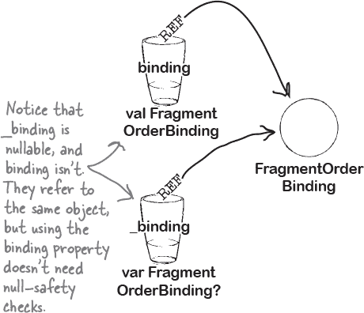

# 第十章：视图绑定：*紧密联系在一起*


**是时候告别 `findViewById()` 了。**

正如你可能已经注意到的，你的应用程序中的视图越多，交互性越强，**调用 *findViewById()* 的次数就越多**。如果你厌倦了每次想要操作视图时都要输入此方法的代码，*你并不孤单*。在本章中，你将了解到如何通过实施 **视图绑定**，让 *findViewById()* 成为过去的事情。你将了解到如何将这一技术应用到 **活动和片段代码** 中，以及为什么这种方法是访问布局视图的 **更安全、更高效** 的方式。让我们开始吧…

# `findViewById()` 的幕后运行原理

正如你所知，每次在活动或片段代码中与视图交互时，都需要先调用`findViewById()`来获取对它的引用。例如，下面的活动代码获取了一个名为 `start_button` 的 `Button` 的引用，以便能够响应点击事件：


但实际调用`findViewById()`时会发生什么？

## findViewById() 在视图层次结构中查找视图

当上述代码运行时，会发生以下事情：

1.  **MainActivity 的布局文件 (activity_main.xml) 被填充为视图对象的层次结构。**

    如果文件描述了包含文本视图和按钮的线性布局，则布局会被填充为 `LinearLayout`、`TextView` 和 `Button` 对象。`LinearLayout` 是此层次结构的根视图。

    

1.  **Android 在视图层次结构中搜索具有匹配 ID 的视图。**

    我们使用`findViewById<Button>(R.id.start_button)`，所以 Android 会搜索视图层次结构，找到一个 ID 为 `start_button` 的视图。

    

1.  **Android 返回层次结构中具有此 ID 的顶级视图，并将其转换为调用`findViewById()`中指定的类型。**

    在这里，`findViewById<Button>(R.id.start_button)`会找到层次结构中第一个 ID 为 `start_button` 的视图，并将其转换为 `Button`。`MainActivity` 现在可以与它交互了。

    

因此，每次使用`findViewById()`时，Android 都会在布局的层次结构中搜索具有匹配 ID 的 `View`，并将其转换为指定的类型。

# `findViewById()` 也有其缺点

尽管 `findViewById()` 是获取视图引用的有用方法，但它也有几个缺点。

+    **它会使你的代码变得更长。**

    需要与更多视图交互时，就需要进行更多的调用。这可能导致代码变得更长，更难阅读。

+    **这是低效的。**

    每次调用`findViewById()`时，Android 都需要在布局的层次结构中搜索具有匹配 ID 的视图。这种方法效率低下，特别是如果你的布局有许多视图且层次深度很深时。

    

+    **这不是空安全的。**

    `findViewById()`用于在运行时搜索视图，这意味着编译器无法检查常见的错误。

    例如，可能会将无效的 ID（即在布局中不存在的 ID）传递给`findViewById()`。如果尝试使用：

    ```
    val message = view.findViewById<EditText>(R.id.message)
    ```

    如果布局中不包含 ID 为`message`的`View`，将会抛出空指针异常，并导致应用程序崩溃。

+    **它不是类型安全的。**

    另一个问题是编译器无法检查您是否正确指定了`View`的类型，这可能导致类转换异常。

    假设您有一个名为`pizza_group`的单选按钮组，并尝试使用以下代码获取对它的引用：

    ```
    val pizzaGroup = view.findViewById<ChipGroup>(R.id.pizza_group)
    ```

    尽管指定了`ChipGroup`类型而不是`RadioGroup`，但代码仍然可以编译。编译器在构建代码时不会检查类型是否正确。当应用程序运行时，它会抛出类转换异常，并导致应用程序崩溃。


因此，如果`findViewById()`有这些缺点，那么有什么替代方法呢？

# 视图绑定解决方案

每次需要`View`引用时调用`findViewById()`的替代方法是使用**视图绑定**。通过视图绑定，您设置一个绑定对象（稍后会详细介绍），并使用它来访问每个视图。


例如，假设您的布局包含一个 ID 为`start_button`的按钮。如果您希望在单击时执行某些操作，您可以像这样使用`findViewById()`获取对它的引用：


使用视图绑定，您不再需要调用`findViewById()`来获取对按钮的引用。相反，您只需使用以下代码：


这段代码执行相同的操作，但编写起来更简单，可以使您的代码更短、更易读。

## 视图绑定比`findViewById()`更安全、更高效。

当您使用视图绑定时，Android 不再需要搜索布局的视图层次结构以寻找匹配的`View`：它只需使用绑定对象来访问它。这比使用`findViewById()`更高效。

另一个优点是**编译器在编译时防止空指针和类转换异常**。当您使用绑定对象访问视图时，编译器知道哪些视图可用以及它们的类型。它不会让您引用不存在的视图，并且您也不再需要将其强制转换为特定类型，因为编译器已经知道这是什么。因此，您的代码变得更安全。

现在您已经了解使用视图绑定的好处，让我们看看如何使用它。

> **视图绑定是调用 findViewById()的类型安全、更高效的替代方法。**

# 下面是我们将使用视图绑定的方式

视图绑定代码在活动和片段中略有不同，因此在本章中，我们将展示两者的代码。以下是我们将要介绍的步骤：

1.  **向秒表应用程序的活动代码中添加视图绑定。**

    在第五章中，我们构建了一个 Stopwatch 应用，以教授您关于 Android 活动生命周期方法的知识。我们将重新访问此应用程序，并更新其活动代码，使其使用视图绑定。

    

1.  **为 Bits and Pizzas 应用的片段添加视图绑定。**

    然后，我们将回到我们在前一章创建的 Bits and Pizzas 应用中，并向您展示如何在其片段代码中实现视图绑定。

    

让我们开始吧。

# 重新审视 Stopwatch 应用


我们将从修改您在第五章中创建的 Stopwatch 应用开始，因此现在打开此应用的项目。

正如您可能记得的那样，Stopwatch 应用显示一个简单的秒表，您可以通过三个按钮启动、暂停和重置。它的外观如下：


该应用程序使用单一活动——`MainActivity`，其具有名为 *activity_main.xml* 的布局文件。


每当需要与其视图之一交互时，它都会调用 `findViewById()` 来获取对其的引用。例如，为了使其“开始”按钮响应点击事件，它使用类似于以下的代码：

```
val startButton = findViewById<Button>(R.id.start_button)
startButton.setOnClickListener {
    //Code that runs when the button’s clicked
}
```

让我们找出如何更新应用程序，以便使用视图绑定。

# 在应用的 build.gradle 文件中启用视图绑定。


要使用视图绑定，您首先需要在应用的 *build.gradle* 文件的 `android` 部分启用它。启用视图绑定的代码如下所示：


我们将在 Stopwatch 应用中使用视图绑定，所以确保将上述更改添加到文件 *Stopwatch/app/build.gradle*。然后选择“立即同步”选项，以将此更改与项目的其余部分同步。

###### 注意

记得同步此更改，否则在尝试更新活动代码时将会出现错误。

## 启用视图绑定会为每个布局生成代码

启用视图绑定时，它会自动为应用程序中每个布局文件创建一个绑定类。例如，Stopwatch 应用包含一个名为 *activity_main.xml* 的布局文件，因此启用视图绑定时，它会自动生成一个名为 `ActivityMainBinding` 的绑定类：


每个绑定类都包含布局中具有 ID 的每个视图的属性。例如，布局 *activity_main.xml* 包含一个 ID 为 `start_button` 的按钮，因此绑定类 `ActivityMainBinding` 包含一个名为 `startButton` 的属性，其类型为 `Button`。

绑定类非常重要，因为**布局的视图与绑定类的属性绑定**。您无需每次需要视图引用时都调用 `findViewById()`，而是直接与绑定类中的该视图属性交互。

现在我们已经在 Stopwatch 应用中启用了视图绑定，让我们看看如何在 `MainActivity` 的代码中使用它。


# 如何将视图绑定添加到活动

使活动使用视图绑定的代码对于每个创建的活动几乎完全相同。代码如下所示：


上述代码声明了一个名为`binding`的属性，其类型为`ActivityMainBinding`。此属性在活动的`onCreate()`方法中设置，使用以下代码：


这调用了`ActivityMainBinding`的`inflate()`方法，创建了一个与活动布局关联的`ActivityMainBinding`对象。

代码：

```
val view = binding.root
setContentView(view)
```


获取`binding`对象的根视图的引用，并使用`setContentView()`方法将其显示出来。

一旦以这种方式为活动添加了视图绑定，就可以使用`binding`属性与布局的视图进行交互。现在让我们这样做。

# 使用`binding`属性与视图进行交互


`MainActivity`当前的代码与其视图交互，以控制秒表并使其按钮响应点击事件。我们可以更新此代码，以便不再调用`findViewById()`，而是使用活动的`binding`属性访问视图。

为了看看这是如何工作的，让我们以`MainActivity`的“开始”按钮为例。

## 布局代码

“开始”按钮在*activity_main.xml*中定义，使用以下代码：


如您所见，它的 ID 是`start_button`。

## 活动代码

`MainActivity`使用`findViewById()`使按钮响应点击事件，代码如下：

```
val startButton = findViewById<Button>(R.id.start_button)
startButton.setOnClickListener {
    //Code that runs when the button’s clicked
}
```

通过视图绑定，我们可以更改代码为：


该代码与原始代码执行相同的操作，但使用`MainActivity`的`binding`属性与按钮进行交互。

让我们更新`MainActivity`的完整代码，以便使用视图绑定。

# MainActivity.kt 的完整代码

下面是更新后的`MainActivity`代码；请更新*MainActivity.kt*的代码，以包括以下更改（加粗部分）：


这些是我们需要对秒表应用进行的所有更改，以使其使用视图绑定。让我们详细了解代码运行时发生的情况，并进行测试。

# 代码的功能

应用运行时发生以下事情：

1.  **应用启动时，MainActivity 被创建。**

    它包括一个名为`binding`的`ActivityMainBinding`属性。

    

1.  **当 MainActivity 的 onCreate()方法运行时，它将一个 ActivityMainBinding 对象赋给 binding 属性。**

    `binding`属性在`onCreate()`中设置，因为这是`MainActivity`首次访问视图时的时机。

    

1.  **ActivityMainBinding 对象包括布局中每个具有 ID 的视图的属性。**

    布局文件 *activity_main.xml* 包含一个 ID 为 `start_button` 的按钮，例如，`ActivityMainBinding` 对象包含一个名为 `startButton` 的 `Button` 属性，用于访问此视图。

    

1.  **MainActivity 使用绑定属性访问其视图。**

    它指定了点击“开始”按钮应如何响应，例如通过调用 `startButton` 属性的 `setOnClickListener()` 方法。

    

让我们来测试一下这个应用程序。

#  测试驱动

当我们运行应用程序时，它的工作方式与以前相同。当我们点击“开始”按钮时，秒表开始计时；当我们点击“暂停”和“重置”按钮时，它会暂停并重置。


然而，不同的是，`MainActivity` 现在使用视图绑定来与其视图交互，而不是调用 `findViewById()`。

# 活动磁铁


名为 `MainActivity` 的活动使用文件 *activity_main.xml* 作为其布局。布局包括一个 ID 为 `pow_button` 的 `Button` 和一个 ID 为 `pow_text` 的 `TextView`。点击按钮时，按钮需要使 `TextView` 显示文本“Pow！”

有人用冰箱磁铁写了 `MainActivity` 的代码，但是一场怪异的厨房沙尘暴使一些磁铁脱落了。你能重新拼凑这段代码吗？


# 片段也可以使用视图绑定（但代码略有不同）


现在您已经学会了如何在活动代码中实现视图绑定，让我们看看如何在片段中使用它。正如我们之前所说，片段的代码与活动的代码略有不同。

## 让我们在 Bits 和 Pizzas 应用程序中实现视图绑定

我们将通过修改您在 第九章 中创建的 Bits 和 Pizzas 应用程序来探讨如何为片段实现视图绑定。

正如您可能记得的那样，Bits 和 Pizzas 应用程序使用 Material 设计视图，如可折叠工具栏和 FAB（浮动操作按钮），为比萨应用程序提供交互式用户界面。该界面由名为 `FragmentOrder` 的片段定义。


`FragmentOrder` 的代码包含许多对 `findViewById()` 的调用。我们来看看如何使用视图绑定来替换这些调用。


# 为 Bits 和 Pizzas 启用视图绑定

与以往一样，在 Bits 和 Pizzas 项目中使用视图绑定，首先需要在应用程序的 *build.gradle* 文件中启用它。

打开文件 *BitsandPizzas/app/build.gradle*，并在 `android` 部分添加以下行：


然后选择“立即同步”选项，将更改与项目的其余部分同步。

## 为每个布局生成绑定类

就像秒表应用程序一样，在“Bits and Pizzas”应用程序中启用视图绑定会自动为每个应用程序的布局文件创建一个绑定类。该应用程序包含两个布局文件——*activity_main.xml*和*fragment_order.xml*，因此生成两个绑定类：`ActivityMainBinding`和`FragmentOrderBinding`。


如前所述，每个绑定类都包含其布局中每个视图的属性及其 ID。例如，布局*fragment_order.xml*包含一个 ID 为`pizza_group`的单选组，因此绑定类`FragmentOrderBinding`包含一个名为`pizzaGroup`的属性，其类型为`RadioGroup`。

在“Bits and Pizzas”应用程序中，唯一与视图交互的代码位于*OrderFragment.kt*中，因此我们只需更新此文件以使用视图绑定。


# 片段视图绑定代码有点不同


正如我们之前所说，您在片段中使用的视图绑定代码与在活动中使用的代码略有不同。在展示片段视图绑定代码之前，我们将深入挖掘一下，并向您展示代码之所以不同的原因。

## 活动可以从`onCreate()`开始访问视图

正如您已经知道的那样，活动在其`onCreate()`方法运行时首次访问其布局。这是活动生命周期中的第一个方法，用于填充布局（或使用视图绑定绑定到它）并执行任何初始设置。例如，如果一个按钮需要响应点击事件，活动会在其`onCreate()`方法中使用代码分配一个`OnClickListener`给它。

活动在其`onDestroy()`方法运行之前可以继续访问其布局。这是活动生命周期中的最后一个方法，活动在此方法运行完毕后被销毁。

因为活动在其从`onCreate()`到`onDestroy()`期间可以访问其布局中的视图，所以它可以在其任何方法中与它们进行交互：


这就是活动的情况，但对于片段，情况略有不同。让我们看看具体是如何的。

# 片段可以从`onCreateView()`到`onDestroyView()`访问视图。

正如您所知，片段在其`onCreateView()`方法运行时首次访问其布局。当活动需要访问片段的布局时，会调用此方法，因此它用于填充布局并执行任何初始设置，如设置`OnClickListener`。

`onCreateView()`，然而，并不是片段生命周期中的第一个方法。还有其他方法，比如`onCreate()`，在`onCreateView()`之前运行，因此它们不能与片段的视图进行交互。

在其`onCreateView()`方法运行后，片段将继续访问其视图，直到其`onDestroyView()`方法运行完毕。当活动不再需要片段的布局时（可能是因为活动需要导航到不同的片段或者活动被销毁），会调用此方法。

然而，`onDestroyView()` 并不是片段生命周期中的最后一个方法。还有其他方法，例如 `onDestroy()`，在 `onDestroyView()` 执行后运行，因此这些方法也不能与片段的视图交互：

> **活动可以在其生命周期的 `onCreate()` 到 `onDestroy()` 期间与其视图交互。**
> 
> **片段只能在其 `onCreateView()` 到 `onDestroyView()` 期间与其视图交互。**


我们将在下一页上向您展示片段生命周期的概述，然后看看片段视图绑定代码的样子。

# 片段视图绑定代码的样子

您现在已经准备好看看片段视图绑定代码是什么样子了。就像活动一样，您通过让它们使用一个绑定属性来启用片段的视图绑定，但实现方式略有不同。

这里是代码：


正如您所看到的，上述代码定义了两个额外的属性：`binding` 和 `_binding`。让我们更仔细地看看这两个属性的作用。

# _binding 指的是绑定对象…

正如您刚刚看到的，片段的视图绑定代码定义了一个 `_binding` 属性，如下所示：


它的类型是 `FragmentOrderBinding?`，并且初始化为 `null`。

`_binding` 属性在片段的 `onCreateView()` 方法中被设置为 `FragmentOrderBinding` 的一个实例，使用以下代码：


之所以在这个方法中设置它，是因为这时片段首次可以访问其视图。

`_binding` 属性在片段的 `onDestroyView()` 方法中被设置为 `null`：


这是因为片段在其 `onDestroyView()` 方法被调用后无法再访问其视图。

## ...而 `binding` 属性提供了对其的非空访问。

`binding` 属性使用 getter 返回 `_binding` 的非空版本，并在 `_binding` 为 `null` 时抛出空指针异常：

```
private val binding get() = _binding!!
```

这意味着您可以使用 `binding` 属性与片段的视图交互，而无需执行大量混乱的空安全检查。例如，要使片段的 FAB 响应点击，只需使用：

```
binding.fab.setOnClickListener {
    //Code that does something
}
```



**活动和片段在它们的生命周期不同的阶段获取对它们的视图的访问权限。**

*活动* 可以在它被创建并且其 `onCreate()` 方法被调用时与其视图交互。它会一直保持对这些视图的访问权限，直到活动被销毁，即在其生命周期结束时。

*片段* 只能在其 `onCreateView()` 方法被调用时与其视图交互。这意味着 `_binding` 属性只能在此方法中设置为视图绑定对象。

片段在其 `onDestroyView()` 方法运行之前可以继续访问其视图。在这一点上，片段的布局被丢弃，所以 _binding 在不能再与视图交互时需要设置为 null。这可以防止片段在无法与视图交互时尝试使用视图绑定对象。

现在您已经掌握了使用视图绑定与片段的所有必要知识，让我们更新 Bits and Pizzas 应用程序中`OrderFragment`的代码。


# OrderFragment.kt 的完整代码

这是让`OrderFragment`使用视图绑定的代码；更新*OrderFragment.kt*的代码，以包含这里显示的更改（用粗体标出）：


这就是我们需要让`OrderFragment`使用视图绑定的所有代码。让我们来测试一下应用程序，确保它仍然可以正常工作。

#  测试驾驶

运行应用程序时，它的工作方式与以前相同。

当我们点击 FAB 而没有选择披萨类型时，会弹出一个提示框要求我们选择披萨。

当我们选择披萨类型并再次点击 FAB 时，屏幕底部会出现一个 Snackbar，显示我们订单的详细信息。


恭喜！您现在知道如何在活动和片段代码中实现视图绑定。我们将在本书的其余部分继续使用视图绑定。

# 活动磁铁解决方案


名为`MainActivity`的活动使用文件*activity_main.xml*作为其布局。布局包括一个`Button`（ID 为`pow_button`）和一个`TextView`（ID 为`pow_text`）。点击按钮时，按钮需要使`TextView`显示文本“Pow！”

有人用冰箱磁铁编写了`MainActivity`的代码，但一个怪异的厨房沙尘暴使一些磁铁脱落了。你能把代码重新拼凑在一起吗？


# 您的 Android 工具箱


**您已经掌握了第十章，现在您已经将视图绑定添加到您的工具箱中。**


