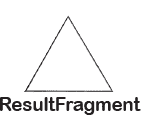
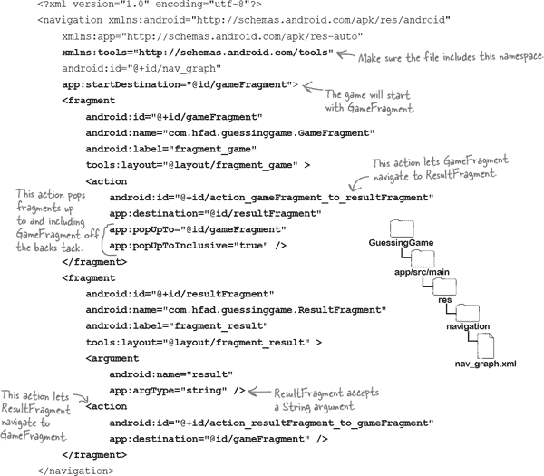
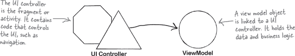
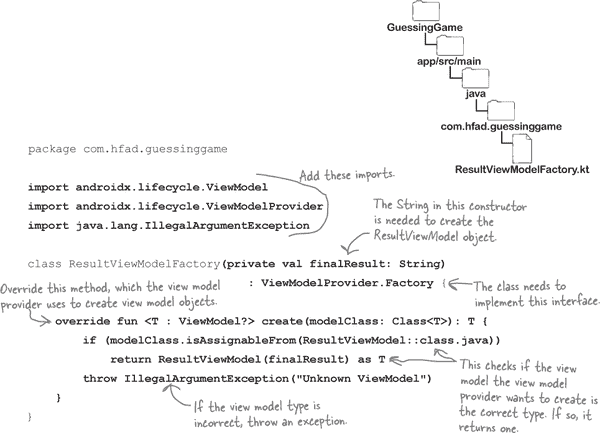
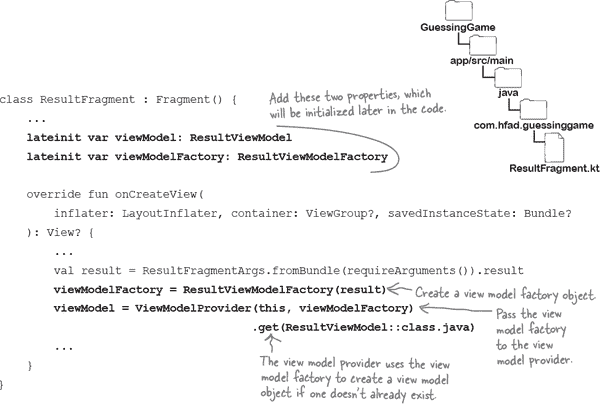
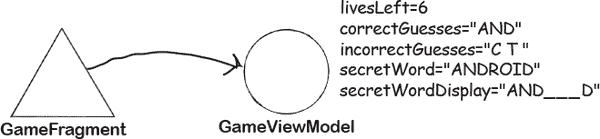

# 第十一章：视图模型：*模型行为*


**随着应用程序变得更加复杂，片段需要处理的任务变得更多。**

如果不小心处理不当，这可能导致试图做所有事情的**臃肿代码**。业务逻辑、导航、控制 UI、处理配置更改……所有这些都在其中。在本章中，您将学习如何使用**视图模型**来处理这种情况。您将发现它们如何简化您的活动和片段代码。您将了解它们如何在配置更改时保持存活状态，确保应用程序的状态安全和完整。最后，我们将向您展示如何构建**视图模型工厂**，以及何时可能需要它。

# 重新讨论配置更改

正如您在第五章中学到的，当您在运行应用程序时旋转屏幕，可能会发生一些问题。更改屏幕方向是一种配置更改，这会导致 Android 销毁并重新创建当前活动。因此，视图和属性可能会丢失其状态并重新设置：


在第五章中，您学习了如何通过活动的`onSaveInstanceState`方法来处理此问题。此方法在活动被销毁之前触发，并用于保存可能在`Bundle`中丢失的任何值。当活动重新创建时，您可以使用这些保存的值来恢复活动视图和属性的状态。

###### 注意

片段也有一个`onSaveInstanceState`方法。尽管我们只向您展示了如何在活动中使用此方法，但它也适用于片段。


使用`Bundle`来保存状态对于相对简单的应用程序效果很好，但对于更复杂的应用程序来说并不是理想的解决方案。这是因为`Bundle`只能保存少量数据，并且仅适用于有限数量的类型。

## 还有其他问题

应用程序可能面临的另一个问题是，活动和片段代码可能会迅速变得臃肿。代码可能需要控制导航、更新 UI、保存状态，并包括更一般的业务逻辑以控制应用程序的行为。将所有这些内容放在一个地方会使代码变得更长，这样就更难阅读和维护。

在本章中，我们将学习如何使用**视图模型**来解决所有这些问题。

# 引入视图模型

视图模型是一个独立的类，与活动或片段代码并列。它负责屏幕上显示的所有数据，以及任何业务逻辑。每当片段需要更新其布局时，它会请求视图模型提供最新的需要显示的值，如果需要访问一些业务逻辑，则调用视图模型中的方法。


## 为什么要使用视图模型？

您可能希望使用视图模型的原因有几个。

使用视图模型简化您的活动或片段代码。您的片段不再需要包含与应用程序业务逻辑相关的代码，因为这些代码都保存在一个独立的类中。相反，它可以专注于更新屏幕或导航等事项。

另一个原因是**视图模型可以在配置更改时保持存活**。当用户旋转设备屏幕时，它不会被销毁，因此任何变量的状态不会丢失。这样可以在无需将值存储在`Bundle`中的情况下恢复应用程序的状态。


我们将通过构建一个猜字游戏来了解如何使用视图模型。在我们开始编写代码之前，让我们先了解游戏的运作方式。

# 猜字游戏的功能

猜字游戏应用程序的目标是让用户尝试猜出一个秘密单词。

游戏开始时，它从一个数组中随机选择一个单词，并显示每个字母的空白：


用户建议一个她认为在秘密单词中的字母。如果她猜对了，游戏会显示字母在秘密单词中的位置。如果她猜错了，游戏会显示错误的猜测，并且她会失去一条生命。


用户将继续猜测，直到找到所有的字母或耗尽生命。当这种情况发生时，一个新的屏幕将出现，告诉她秘密单词是什么，以及她是否赢得了游戏。她可以选择开始另一场游戏。


# 应用程序的结构

应用程序将包含一个名为`MainActivity`的单一活动，用于显示游戏的片段：`GameFragment`和`ResultFragment`。

`GameFragment`是游戏的主要屏幕。它将显示秘密单词的空白，让用户进行猜测，并显示任何错误的选择和剩余的生命次数。

当游戏结束时，`GameFragment`将使用导航组件导航到`ResultFragment`，并向其传递一个结果的`String`。`ResultFragment`将显示该`String`和一个按钮，让用户开始新游戏。


我们将在构建应用程序时详细介绍其结构。首先，让我们逐步完成我们将采取的步骤。

# 这是我们要做的事情

这是我们将用来编写应用程序的步骤：

1.  **编写基本游戏。**

    我们将创建`GameFragment`和`ResultFragment`，编写游戏逻辑，并使用导航组件在这两个片段之间进行导航。

    

1.  **为 GameFragment 添加一个视图模型。**

    我们将创建一个视图模型，名为`GameViewModel`，用于保存`GameFragment`的游戏逻辑和数据。这将简化`GameFragment`的代码，并确保游戏在配置更改时仍然存在。

    

1.  **为 ResultFragment 添加一个视图模型。**

    我们将为`ResultFragment`添加第二个视图模型`ResultViewModel`。这个视图模型将保存用户刚刚玩过的游戏的结果。

    

## 创建猜谜游戏项目

我们将为猜谜游戏应用使用一个新项目，因此现在使用与前几章相同的步骤创建一个。选择“空活动”选项，输入名称“猜谜游戏”和包名称“com.hfad.guessinggame”，接受默认保存位置。确保语言设置为 Kotlin，最低 SDK 为 API 21，以便在大多数 Android 设备上运行。

猜谜游戏应用将使用视图绑定来引用其视图，并使用导航组件在其片段之间导航。让我们更新项目和应用的*build.gradle*文件以包含这些库。

# 更新项目的 build.gradle 文件…


我们将在项目的*build.gradle*文件中添加一个新变量，以指定我们将使用的导航组件的版本，以及一个 Safe Args 类路径。

打开文件*GuessingGame/build.gradle*，并将以下行（用粗体表示）添加到所示的部分：


## …并更新应用的 build.gradle 文件

在应用的*build.gradle*文件中，我们需要启用视图绑定，添加导航组件库的依赖项，并应用 Safe Args 插件，以便我们可以向片段传递参数。

打开文件*GuessingGame/app/build.gradle*，并将以下行（用粗体表示）添加到相应的部分：


完成这些更改后，点击“立即同步”选项，将您所做的更改与项目的其余部分同步。

接下来，我们将创建应用的片段。

# 猜谜游戏应用有两个片段

猜谜游戏应用需要两个片段：`GameFragment` 和 `ResultFragment`。`GameFragment` 是应用的主屏幕，而 `ResultFragment` 将用于显示结果：


让我们继续向项目添加这两个片段。

## 创建 GameFragment…

我们将首先向项目添加`GameFragment`。

在*app/src/main/java*文件夹中突出显示*com.hfad.guessinggame*包，然后转到文件→新建→片段→片段（空白）。将片段命名为“GameFragment”，将其布局命名为“fragment_game”，并确保语言设置为 Kotlin。


###### 注意

暂时不用担心这些片段的代码。在将它们添加到导航图后，我们将对其进行更新。

## …然后创建 ResultFragment

接下来，通过再次在*app/src/main/java*文件夹中突出显示*com.hfad.guessinggame*包，并选择文件→新建→片段→片段（空白）来添加`ResultFragment`。这次，将片段命名为`ResultFragment`，将其布局命名为“fragment_result”，并确保语言设置为 Kotlin。



###### 注意

暂时不用担心这些片段的代码。在将它们添加到导航图后，我们会更新它们。

在接下来的几页中，我们将更新这两个片段的代码。在此之前，我们将在项目中添加一个导航图，告诉应用如何在这两个片段之间导航。

# 导航工作原理

你知道的，导航图告诉 Android 应用可能的目标位置以及如何导航到它们。

在猜谜游戏应用中，我们希望导航按以下方式工作：

1.  **当应用启动时，显示 GameFragment。**

    

1.  **当游戏赢了或输了时，GameFragment 导航到 ResultFragment，并向其传递结果。**

    

1.  **当用户点击“New Game”按钮时，导航到 GameFragment。**

    

为了实现这一点，我们将把 `GameFragment` 和 `ResultFragment` 添加到一个新的导航图中（我们将创建），并指定每个片段可以导航到另一个片段。

我们还将说，`GameFragment` 将向 `ResultFragment` 传递一个 `String` 参数，指定一个消息，指示用户是赢了还是输了他们刚刚玩的游戏。当导航到 `ResultFragment` 时，将显示此消息。

## 创建导航图

要创建导航图，选择项目资源管理器中的 *GuessingGame/app/src/main/res* 文件夹，然后选择 文件→新建→Android 资源文件。在提示时，输入文件名“nav_graph”，选择资源类型“导航”，然后点击确定。这将创建一个名为 *nav_graph.xml* 的导航图。

我们需要更新导航图，包括 `GameFragment` 和 `ResultFragment`，以及每个片段的导航操作。接下来我们将完成这部分工作。

> **导航图包含了所有应用可能的目标位置的详细信息，以及如何到达它们。**

# 更新导航图

要更新导航图，打开文件 *nav_graph.xml*（如果尚未打开），切换到代码视图，并更新其代码以包含这里显示的更改（用粗体标出）：



现在你已经更新了导航图，让我们将其链接到 `MainActivity`，以便在导航到每个片段时显示它。

# 在 MainActivity 的布局中显示当前片段

要显示每个片段，我们需要向 `MainActivity` 的布局添加一个与我们刚刚创建的导航图链接的导航宿主。我们将使用 `FragmentContainerView` 来实现，就像我们在前几章中所做的那样。

你已经熟悉如何完成这项任务的代码，所以请更新 *activity_main.xml*，使其与下面的代码匹配：


当你更新了布局后，打开 *MainActivity.kt* 并确保其与这里显示的代码匹配：


这就是 `MainActivity` 需要的一切。接下来，让我们从两个片段的代码开始更新，首先是 `GameFragment`。

# 更新 GameFragment 的布局

`GameFragment`是应用程序的主屏幕，用户将使用它来玩猜字游戏。我们需要向其布局中添加几个视图以实现这一点：三个文本视图用于猜测的单词、剩余生命值和已经猜错的猜测，一个用于输入猜测的编辑文本，以及一个用于进行猜测的按钮。

通过更新*fragment_game.xml*中的代码，将这些视图添加到布局中，使其与下面显示的代码匹配：


这就是我们需要包含在`GameFragment`布局中的所有内容。接下来，让我们通过更新其 Kotlin 代码告诉游戏如何行为。

## `GameFragment`需要做什么

在应用程序的第一个版本中，*GameFragment.kt*需要包含所有玩游戏所需的代码，以及更新屏幕和启用导航。它需要：

+    **随机选择一个单词。**

    我们将为其提供一个可供选择的可能单词列表。

+    **让用户猜一个字母。**

+    **响应猜测。**

    如果用户猜对了，`GameFragment`需要将该字母添加到正确猜测列表中，并显示该字母在单词中的位置。如果猜测错误，它需要将猜测添加到错误猜测的`String`中，并减少剩余生命值的数量。

+    **在游戏结束时导航到 ResultFragment。**

所有这些代码都是纯 Kotlin，或者是您之前见过的 Android 代码。我们将在接下来的几页中展示完整的代码。

# `GameFragment.kt`代码

这是`GameFragment`的代码；更新*GameFragment.kt*中的代码，使其与下面显示的代码匹配：


这就是我们需要的所有`GameFragment`的代码。接下来，让我们编写`ResultFragment`的代码。

# 更新 ResultFragment 的布局

`ResultFragment`使用文本视图告诉用户她刚刚玩的游戏是赢了还是输了，并使用按钮让她开始另一场游戏。我们需要将这两个视图都添加到片段的布局中。

你已经熟悉如何做到这一点的代码，所以打开*fragment_result.xml*，并更新它，使其与下面显示的代码匹配：


## 我们还需要更新`ResultFragment.kt`

一旦我们将文本视图和按钮添加到`ResultFragment`的布局中，我们需要在片段的 Kotlin 代码中指定它们的行为。我们将更新文本视图的文本为结果，并且当点击按钮时，还将使其导航回`GameFragment`。

我们将在下一页上展示*ResultFragment.kt*的代码。

# `ResultFragment.kt`代码

这是`ResultFragment`的代码；更新*ResultFragment.kt*，使其与下面的代码匹配：


这就是我们这个版本的猜字游戏应用程序所需的所有代码。让我们看看代码运行时会发生什么，并测试一下这个应用程序。

# 应用程序运行时会发生什么

当应用程序运行时发生以下事情：

1.  **应用程序启动并在 MainActivity 中显示 GameFragment。**

    `GameFragment`将`livesLeft`设置为 8，`correctGuesses`和`incorrectGuesses`设置为`""`，`secretWord`设置为随机选择的单词，并将`secretWordDisplay`设置为`deriveSecretWordDisplay()`的值。然后调用其`updateScreen()`方法，显示`livesLeft`，`incorrectGuesses`和`secretWordDisplay`的值。

    

1.  **当用户猜测时，GameFragment 调用其 makeGuess()方法。**

    该方法检查`secretWord`是否包含用户猜测的字母。如果包含，`makeGuess()`将该字母添加到`correctGuesses`并更新`secretWordDisplay`。如果不包含，该方法将字母添加到`incorrectGuesses`，并从`livesLeft`中减去 1。然后再次调用`updateScreen()`，以便显示新值。

    

1.  **每次猜测后，GameFragment 检查 isWon()或 isLost()是否为 true。**

    这些方法检查用户是否猜出了单词中的所有字母，或者是否已经用完了生命。如果任一方法返回*true*，`GameFragment`将结果传递给`ResultFragment`，后者显示结果。

    

#  测试驾驶

运行应用程序时，会显示`GameFragment`。它显示秘密单词有多少个字母，以及我们有多少生命。

我们可以通过在编辑文本中输入一个字母并点击按钮来猜测。如果我们猜对了，它会将字母放入秘密单词中，但如果我们猜错了，我们就会失去一条生命。

如果我们猜出所有字母或用完生命，将在`ResultFragment`中显示告诉我们是否赢了或输了的消息。


游戏似乎可以运行，但如果我们旋转屏幕会发生什么？

# 屏幕旋转时游戏会丢失状态

然而，游戏存在一个问题。如果我们在游戏进行中旋转屏幕，应用程序会丢失状态，游戏将从头开始。


屏幕旋转会改变应用程序的配置，因此游戏会丢失状态，因此 Android 会销毁活动（以及显示的片段）并立即重新创建。这会重置游戏的视图和属性。

我们*可以*使用片段的`onSaveInstanceState`方法来保存任何属性的状态，就像我们在本书中之前所做的那样。然而，这一次，我们将通过**实现视图模型**来解决这个问题。

# 视图模型保存业务逻辑


正如我们之前所说，视图模型是一个与您的活动或片段代码并列的独立类。它负责屏幕上需要显示的数据以及任何业务逻辑。在我们的 Guessing Game 应用中，例如，这意味着视图模型需要保存游戏的属性——例如用户需要猜测的秘密单词和剩余生命值——以及控制游戏如何进行的任何方法。

当你实现一个视图模型时，所有与应用程序数据或业务逻辑相关的代码都会移出活动或片段，并进入视图模型。任何控制 UI 的代码——例如显示文本或获取用户输入——都留在活动或片段代码中。

这种 Android 应用程序的架构方式遵循一个被称为*关注点分离*的设计原则。应用程序被分割成不同的类，每个类处理一个单独的关注点。UI 控制器——活动或片段代码——负责 UI，而视图模型负责业务逻辑和数据：

> **使用视图模型简化你的活动和片段代码，并保存任何属性的状态，以便它们在配置更改后保持不变。**



使用这种类型的应用程序架构有两个关键优势。

+    **它简化了你的活动和片段代码。**

    将应用的数据和业务逻辑移动到视图模型中意味着你需要维护的活动和片段代码更少。

+    **你的应用在配置更改后依然存在。**

    视图模型是一个独立的类，与您的活动或片段代码并列。当您旋转设备屏幕时，它不会被销毁，因此视图模型中保存的任何属性的状态会在配置更改时保持不变，而不需要将它们的值添加到`Bundle`中。

现在您已经了解了使用视图模型的好处，让我们看看如何将其添加到 Guessing Game 应用程序中。

# 在应用的 build.gradle 文件中添加视图模型依赖项…

视图模型库是 Android Jetpack 的一部分，因此您需要更新应用的*build.gradle*文件，以将其包含为一个依赖项。

打开文件*GuessingGame/app/build.gradle*，并在依赖项部分添加以下行（用粗体标注）：


在提示时，同步您的更改。现在您已经准备好继续并创建一个视图模型了。

## …并创建一个视图模型

我们将创建一个名为`GameViewModel`的视图模型，`GameFragment`将用它来处理游戏逻辑和数据。

在*app/src/main/java*文件夹中选择*com.hfad.guessinggame*包，然后转到文件→新建→Kotlin 类/文件。将文件命名为“GameViewModel”，并选择创建一个类的选项。

创建完*GameViewModel.kt*文件后，更新其代码以匹配以下代码（更改部分已用粗体标注）：


如你所见，`GameViewModel` 类继承自 `androidx.lifecycle.ViewModel`。`ViewModel` 是一个抽象类，用于将普通类转变为一个具备身份的视图模型。

现在我们已经将 `GameViewModel` 添加到猜谜游戏项目并将其转变为视图模型，让我们编写其余代码。

# `GameViewModel.kt` 的完整代码如下：

正如你已经学到的，视图模型负责活动或片段的业务逻辑和数据。对于猜谜游戏应用程序，这意味着我们需要将所有与游戏进行相关的 `GameFragment` 的属性和方法移动到 `GameViewModel` 中。我们将任何与导航或 UI 相关的代码留在 `GameFragment` 中。

这是 *GameViewModel.kt* 的完整代码；请更新代码以包含以下更改（加粗显示）：


这就是我们需要的关于 `GameViewModel` 的所有内容。接下来，让我们将其链接到 `GameFragment`，并更新该片段的代码。

# 创建 `GameViewModel` 对象。

要将视图模型链接到活动或片段，您需要在代码中添加 `ViewModel` 属性，并用需要创建的 `ViewModel` 对象进行初始化。代码如下所示：


如你所见，上述代码使用 **视图模型提供程序** 创建 `ViewModel` 对象。那么，使用这个类有什么作用呢？

## 使用 `ViewModelProvider` 创建视图模型。

如其名称所示，`ViewModelProvider` 是一个特殊的类，其工作是为活动和片段提供视图模型。它确保 **只有在不存在视图模型对象时才会创建一个新的视图模型对象**。

如你已了解的，当屏幕旋转时，显示在屏幕上的任何片段都会被销毁并重新创建。在此过程中，视图模型提供程序确保继续使用相同的视图模型对象。视图模型保持其状态，因此片段使用的任何属性都不会被重置。

视图模型提供程序在活动或片段保持活跃时保持视图模型。例如，当片段被分离或从其活动中移除时，视图模型提供程序释放片段的视图模型。下次要求提供视图模型对象时，它会创建一个新的对象。


现在你已经知道如何将视图模型链接到片段，让我们更新 `GameFragment` 的代码。

# `GameFragment.kt` 的更新代码如下：

我们需要从 `GameFragment` 中移除已经转移到 `GameViewModel` 中的属性和方法，并确保片段使用视图模型。

这里是更新后的 `GameFragment` 代码；确保文件 *GameFragment.kt* 包含以下所示的更改（加粗显示）：


这些是我们需要对 `GameFragment` 进行的所有更改。让我们仔细分析代码在运行时的行为，并进行测试。

# 应用程序运行时会发生什么

应用程序运行时发生以下事件：

1.  **GameFragment 向 ViewModelProvider 类请求 GameViewModel 的实例。**

    视图模型提供程序发现该片段尚未关联到现有的`GameViewModel`对象，因此创建一个新对象。

    

1.  **GameViewModel 对象被初始化。**

    将`livesLeft`设置为 8，将`correctGuesses`和`incorrectGuesses`设置为空字符串，将`secretWord`设置为随机选择的单词，并将`secretWordDisplay`设置为`deriveSecretWordDisplay()`。

    

1.  **GameFragment 调用其 updateScreen()方法。**

    该方法访问`GameViewModel`对象的`secretWordDisplay`、`livesLeft`和`incorrectGueses`属性，并在屏幕上显示它们。

    

1.  **当用户猜测时，GameFragment 调用 GameViewModel 对象的 makeGuess()方法。**

    该方法检查`secretWord`是否包含用户猜测的字母。如果是，将字母添加到`correctGuesses`并更新`secretWordDisplay`；如果不是，将其添加到`incorrectGuesses`，并从`livesLeft`中减去 1。

    

1.  **GameFragment 再次调用其 updateScreen()方法。**

    该方法从`GameViewModel`对象获取更新的属性值，并更新屏幕。

    

1.  **每次猜测后，GameFragment 检查视图模型的 isWon()或 isLost()方法是否返回 true。**

    如果任一方法返回*true*，`GameFragment`将结果传递给`ResultFragment`，后者显示结果。

    

#  Test Drive


当我们运行应用程序时，`GameFragment`会像以前一样显示。如果我们开始玩游戏并旋转屏幕，则游戏保留其状态。


现在，您已经学会了如何向您的应用程序添加视图模型，并使用它来避免用户旋转设备屏幕时可能出现的问题。在继续之前，让我们更深入地了解视图模型。

# BE the View Model


**以下代码描述了名为 MyViewModel 的视图模型类。你的任务是扮演视图模型，指出此代码存在的问题以及如何修复。**

```
package com.hfad.myapp

import androidx.lifecycle.ViewModel
import android.util.Log
import android.widget.TextView

class MyViewModel {
    val num = 2

    init {
        Log.i("MyViewModel", "ViewModel created")
    }

    override fun onCleared() {
        Log.i("MyViewModel", "ViewModel cleared")
    }

    fun calculation(val1: Int, val2: Int): Int {
        Log.i("MyViewModel", "Called Calculation")
        return (val1 + val2) * num
    }

    fun joinTogether(text1: TextView, text2: TextView): String {
        Log.i("MyViewModel", "Called JoinTogether")
        return ("${text1.text} ${text2.text}")
    }
}
```

 **答案在 “BE the View Model Solution”。**

# 我们已为 GameFragment 添加了一个视图模型


到目前为止，我们已更新了猜字游戏应用程序，使其使用名为`GameViewModel`的视图模型，该模型负责所有片段的业务逻辑和数据。这种方式使用视图模型简化了*GameFragment.kt*中的代码，并意味着当屏幕旋转时，应用程序不会丢失其状态。


## `ResultFragment`也需要一个视图模型

您创建的每个视图模型都与单个 UI 控制器（活动或片段）相关联。这意味着，如果我们希望`ResultFragment`也使用视图模型，我们需要为此片段创建一个新的视图模型。


现在我们开始吧。在*app/src/main/java*文件夹中突出显示*com.hfad.guessinggame*包，然后转到文件→新建→Kotlin 类/文件。命名文件为“ResultViewModel”，并选择创建类的选项。

创建*ResultViewModel.kt*文件后，请更新其代码以匹配下面的代码（我们的更改用粗体标出）：


这是定义视图模型所需的基本代码。那么我们需要添加哪些其他代码呢？

# ResultViewModel 需要保存结果

正如您可能还记得的那样，`ResultFragment`在其布局中显示一条消息，告诉用户他们刚刚玩的游戏是赢了还是输了。当游戏结束时，`GameFragment`会将此消息传递给`ResultFragment`。

在新版本的应用程序中，`ResultViewModel`负责`ResultFragment`的游戏逻辑和数据，因此我们需要向`ResultViewModel`添加一个属性来存储结果。我们还将使用一个`String`构造函数，以确保此属性在创建`ResultViewModel`时立即设置。

这是*ResultViewModel.kt*的完整代码；更新其代码以包括以下更改（以粗体显示）：


接下来，我们将更新`ResultFragment`，以便它使用新的视图模型。

## 我们需要将 ResultViewModel 链接到 ResultFragment

早些时候，我们能够使用以下代码将`GameViewModel`引用添加到`GameFragment`：


这告诉视图模型提供者获取与片段链接的`GameViewModel`对象，或者如果不存在则创建一个新的对象。

然而，上述方法不能用于向`ResultFragment`添加`ResultViewModel`的引用。这是因为它**仅适用于没有参数构造函数的视图模型**。

该代码适用于`GameViewModel`，因为我们可以在不传递任何参数的情况下构造它。但是，`ResultViewModel`类的构造函数需要一个`String`，因此上述代码不起作用。

# 视图模型工厂创建视图模型

创建视图模型的另一种方法是将视图模型提供者传递给**视图模型工厂**：这是一个单独的类，其唯一目的是创建和初始化视图模型。这种方法意味着视图模型提供者无需自己创建视图模型。相反，它使用视图模型工厂。

虽然视图模型工厂可用于任何类型的视图模型，但它们主要用于需要参数的视图模型。这是因为视图模型提供者无法自己传递参数到构造函数：它需要视图模型工厂来完成。

下面是在猜谜游戏应用程序中使用视图模型工厂的方法：

> **使用视图模型工厂创建一个没有无参构造函数的视图模型。**

1.  **我们将定义一个名为`ResultViewModelFactory`的类，`ResultFragment`将用它来创建一个工厂对象。**

    

1.  **`ResultFragment`将告诉视图模型提供者使用工厂对象。**

    

1.  **当视图模型提供者需要一个新的`ResultViewModel`对象时，它将使用`ResultViewModelFactory`。**

    

让我们继续在猜谜游戏应用中添加一个工厂类。

# 创建`ResultViewModelFactory`类

我们将在猜谜游戏应用中添加一个名为`ResultViewModelFactory`的视图模型工厂类。该类将被视图模型提供者用于创建`ResultViewModel`对象。

要创建该类，请在*app/src/main/java*文件夹中突出显示*com.hfad.guessinggame*包，然后转到“文件”→“新建”→“Kotlin 类/文件”。将文件命名为“ResultViewModelFactory”，并选择创建类。

当*ResultViewModelFactory.kt*文件被创建后，请更新其代码以匹配我们下面展示的（我们的更改用粗体标注）：



正如您所见，`ResultViewModelFactory`类实现了一个名为`ViewModelProvider.Factory`的接口，并重写了其`create()`方法。这将该类转换为视图模型工厂，视图模型提供者可以使用它来创建`ResultViewModel`对象。

上述代码是我们需要的所有`ResultViewModelFactory`。让我们看看如何在`ResultFragment`代码中使用它。

# 使用工厂创建视图模型

正如我们之前所说，您可以通过将工厂传递给视图模型提供者来使用视图模型工厂来创建视图模型。视图模型提供者决定何时需要一个新的视图模型对象，并在必要时使用工厂来创建一个。

为了让视图模型提供者使用视图模型工厂，创建每个想要的视图模型几乎完全相同的代码。看起来是这样的：



正如您所见，上述代码定义了两个属性：`viewModel`和`viewModelFactory`。这些属性在片段的`onCreateView()`方法中设置。

在`onCreateView()`中，代码使用从`GameFragment`传递给它的结果`String`来创建一个新的`ResultViewModelFactory`对象。它将工厂传递给视图模型提供者，后者使用它来获取`ResultViewModel`对象。

现在您知道如何使用工厂将视图模型与片段链接后，让我们更新`ResultFragment`的代码。


# `ResultFragment.kt`的更新代码

这是`ResultFragment`的完整代码，请更新*ResultFragment.kt*文件中的代码，包括下面显示的更改（用粗体标注）：


这就是我们需要对`ResultFragment`进行的所有更改。经过一些问题后，我们将详细说明应用程序运行时发生的情况。

# 应用程序运行时发生的情况

当应用程序运行时，会发生以下事情：

1.  **GameFragment 请求 ViewModelProvider 类获取 GameViewModel 的实例。**

    `GameViewModel`对象被初始化，并随机选择一个单词。

    

1.  **GameFragment 与 GameViewModel 对象交互。**

    `GameViewModel`对象记录用户做出的任何猜测，并跟踪剩余生命次数。

    

1.  **每次猜测后，GameFragment 检查视图模型的 isWon()或 isLost()方法是否返回 true。**

    如果任一方法为*true*，`GameFragment`将导航到`ResultFragment`，并传递结果。

    

1.  **ResultFragment 创建 ResultViewModelFactory 对象，并传递结果字符串。**

    

1.  **ResultFragment 请求 ViewModelProvider 类获取 ResultViewModel 的实例。**

    `ViewModelProvider`类发现没有现有的`ResultViewModel`对象，因此使用`ResultViewModelFactory`创建一个。`ResultViewModel`对象的`result`属性初始化为结果`String`。

    

1.  **ResultFragment 从 ResultViewModel 对象获取结果字符串，并在屏幕上显示。**

    

让我们来测试一下这个应用程序。

#  测试驾驶


运行应用程序时，`GameFragment`像以前一样显示。

如果我们猜对所有字母或失去所有生命，应用程序将导航到`ResultFragment`。会显示一条消息告诉我们是否赢了或输了，以及秘密单词是什么。


游戏的行为方式与以前相同，但在幕后，现在使用视图模型处理游戏逻辑和数据。

# 视图模型磁铁


这是定义名为`GiftViewModel`的视图模型的代码：

```
import androidx.lifecycle.ViewModel

class GiftViewModel(budgetFrom: Int, budgetTo: Int) : ViewModel(){
    val from = budgetFrom
    val to = budgetTo
}
```

看看你能否组合出用于创建`GiftViewModel`对象的视图模型工厂类的代码。


# 视图模型磁铁解决方案


这是定义名为`GiftViewModel`的视图模型的代码：

```
import androidx.lifecycle.ViewModel

class GiftViewModel(budgetFrom: Int, budgetTo: Int) : ViewModel(){
    val from = budgetFrom
    val to = budgetTo
}
```

看看你能否组合出用于创建`GiftViewModel`对象的视图模型工厂类的代码。


# BE the View Model 解决方案


**下面的代码描述了一个名为 MyViewModel 的视图模型类。您的工作是扮演视图模型的角色，并指出代码中存在的问题以及如何修复它们。**


# 您的 Android 工具箱


**您已经掌握了第十一章，现在将视图模型添加到您的工具箱中。**


