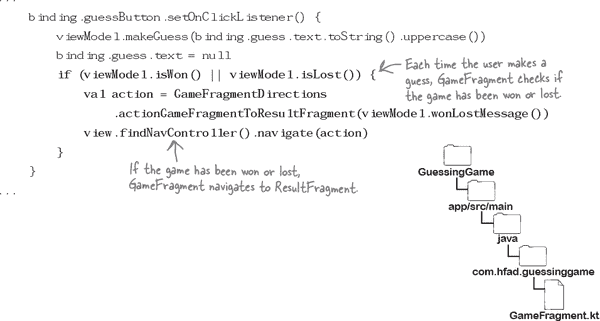

# 第十二章： LiveData：*跃入行动*


**您的代码经常需要对属性值更改做出反应。**

例如，如果视图模型属性更改值，**片段可能需要做出响应**，更新其视图或导航到其他位置。 但是**片段如何知道何时更新属性**？ 在这里，我们将向您介绍**LiveData**：一种**告知感兴趣方何时发生更改**的方法。 您将了解有关***MutableLiveData***的所有信息，以及如何**使您的片段观察此类型的属性**。 您将发现**LiveData 类型如何帮助维护应用程序的完整性**。 很快，您将编写比以往更**响应更快**的应用程序...

# 重新审视 Guessing Game 应用程序

在上一章中，我们构建了一个 Guessing Game 应用程序，让用户猜测秘密单词中包含哪些字母。 当用户猜对所有字母或生命次数用尽时，游戏结束。

为了防止片段代码变得过于臃肿，并在用户旋转设备屏幕时保持应用程序的状态，我们为应用程序的游戏逻辑和数据使用了视图模型。 `GameFragment`使用`GameViewModel`进行逻辑和数据处理，`ResultViewModel`保存`ResultFragment`所需的游戏结果：


每个片段显示时，或用户猜测时，片段从其视图模型获取最新值并在屏幕上显示它们。

尽管这种方法有效，但也存在一些缺点。

# 片段决定何时更新视图

这种方法的缺点是每个片段决定何时从视图模型获取最新的属性值并更新其视图。 有时，这些值不会发生变化。 例如，如果用户猜对了，`GameFragment`会更新显示的剩余生命次数和错误猜测的文本，即使这些值没有发生变化。


## 让视图模型在值更改时发出信号

另一种方法是让`GameViewModel`告知`GameFragment`其每个属性何时已被更新。 如果片段收到这些更改的通知，它将不再需要自行决定何时从视图模型获取最新的属性值并更新其视图。 相反，它只需要在告知底层属性已被更新后更新其视图。


我们将使用 Android 的**LiveData**库来实现 Guessing Game 应用程序中的这一更改：这是 Android Jetpack 的一部分。 LiveData 允许视图模型告知感兴趣的各方（如片段和活动），其属性值已被更新。 然后，它们可以通过更新视图或调用其他方法来对这些更改做出反应。


您将通过本章的其余部分了解如何使用 LiveData。 首先，让我们看看我们将采取的更新应用程序的步骤。

# 这是我们将要做的事情：


以下是我们将要完成的应用程序的步骤：

1.  **使猜谜游戏应用程序使用实时数据。**

    我们将更新`GameViewModel`，使`livesLeft`、`incorrectGuesses`和`secretWordDisplay`属性使用实时数据。然后，当这些属性的值更改时，我们将使`GameFragment`更新其视图。

    

1.  **保护 GameViewModel 的属性和方法。**

    我们将限制对`GameViewModel`的属性的访问，以便只有`GameViewModel`可以更新它们。我们还将确保`GameFragment`只能访问其工作所需的方法。

    

1.  **添加一个 gameOver 属性。**

    我们将使`GameViewModel`使用一个新的`gameOver`属性来决定每个游戏何时结束。当此属性的值更改时，`GameFragment`将导航到`ResultFragment`。

    

## 在应用程序的*build.gradle*文件中添加实时数据依赖项

因为我们将使用实时数据，所以我们将首先在应用程序的*build.gradle*文件中添加实时数据依赖项。

打开 Guessing Game 应用的项目（如果尚未打开），打开文件*GuessingGame/app/build.gradle*，并在`dependencies`部分添加以下行（加粗）：


在提示时，同步您的更改。

# GameViewModel 和 GameFragment 需要使用实时数据

我们希望在猜谜游戏应用程序中使用实时数据，以便当`GameViewModel`的属性值更改时，通知`GameFragment`。然后，`GameFragment`将对这些更改做出反应。

我们将分两个阶段解决这个问题：

1.  **指定 GameViewModel 属性更改 GameFragment 需要知道的内容。**

1.  **告诉 GameFragment 如何响应每个更改。**

现在，我们将专注于`GameViewModel`的代码更改。

## 哪些视图模型属性应该使用实时数据？

`GameViewModel`包括三个属性——`secretWordDisplay`、`incorrectGuesses`和`livesLeft`——这些属性由`GameFragment`用于更新其视图。我们将指定这三个属性使用实时数据，以便在它们的值更改时通知`GameFragment`。

你可以通过将其类型更改为`**MutableLiveData<Type>**`来指定属性使用实时数据，其中`Type`是属性应该保存的数据类型。例如，当前`livesLeft`属性被定义为`Int`类型的代码如下：

```
var livesLeft = 8
```

要使属性使用实时数据，您可以将其类型更改为`MutableLiveData<Int>`，使其看起来像这样：


这指定了`livesLeft`现在是一个`MutableLiveData<Int>`，其初始值为 8。

类似地，我们可以使用以下代码定义`incorrectGuesses`和`secretWordDisplay`属性


在这里，每个属性的类型都设置为`MutableLiveData<String>`。例如，`incorrectGuesses`的值设置为`""`，而`secretWordDisplay`的值将在`GameViewModel`的`init`块中设置。

这就是您如何定义一个 LiveData 属性。接下来是如何更新其值。

# 实时数据对象使用一个值属性

当您使用 `MutableLiveData` 属性时，您使用名为 `**value**` 的属性来更新它们的值。例如，要使用 `deriveSecretWordDisplay()` 方法的返回值更新 `secretWordDisplay` 属性，您不使用以下代码：

```
secretWordDisplay = deriveSecretWordDisplay()
```

就像之前做的一样。您可以改用以下代码：

```
secretWordDisplay.value = deriveSecretWordDisplay()
```

以这种方式更改 `value` 属性非常重要，因为这是任何感兴趣的方——在本例中为 `GameFragment` ——收到任何更改通知的方式。每次更新 `secretWordDisplay` 的 `value` 属性时，都会通知 `GameFragment`，因此它可以通过更新其视图来做出响应。


## 值属性可能为 null

当您使用实时数据时，还有一件额外的事情要注意：`value`的类型是*可空*。这意味着当您在代码中使用实时数据值时，您需要执行空安全检查，否则您的代码将无法编译。

例如，`livesLeft` 属性是使用以下代码定义的：


此属性的类型是 `MutableLiveData<Int>`，因此其 `value` 属性可以接受一个 `Int`，或者为 `null`。

由于 `value` 属性可能为 `null`，因此我们不能使用以下代码从其值中减去 1：

```
livesLeft.value--
```

相反，我们需要使用：


减去 1，直到它不是`null`为止。

类似地，以下 `isLost()` 方法不会编译，因为 `liveLeft.value` 可能为 `null`：

```
fun isLost() = livesLeft.value <= 0
```

我们可以使用 Kotlin 的 Elvis 运算符进行更改，像这样：


**使用 `val` 可以定义 LiveData 属性。**

如您已知，您在 Kotlin 中使用 `val` 和 `var` 来指定属性是否可以引用新对象。

当我们首次定义每个属性时，我们使用 `var` 以便可以更新它。例如，我们使用以下代码定义了 `livesLeft` 属性：

```
var livesLeft = 8
```

它初始化 `livesLeft`，其值为 8 的 `Int` 对象。每当用户猜测不正确时，我们就从 `livesLeft` 减去 1，这使它引用一个新的 `Int` 对象：


使用 LiveData，您更新现有对象的 `value` 属性，而不是将其替换为另一个对象，并通知感兴趣的方进行此更改。由于对象不再被替换，因此您可以像这样使用 `val` 而不是 `var` 来定义属性：


# GameViewModel.kt 的完整代码

现在您已经了解了实时数据的工作原理，请更新 `GameViewModel`，以便其 `livesLeft`、`incorrectGuesses` 和 `secretWordDisplay` 属性都使用实时数据。

这里是完整的代码*GameViewModel.kt*; 更新代码以包括更改（加粗部分）：


这是我们需要为`GameViewModel`做的一切。接下来，让我们让`GameFragment`在更新`livesLeft`、`incorrectGuesses`和`secretWordDisplay`属性时作出响应。

# 该片段观察视图模型属性并对变化作出反应。

通过调用属性的`**observe()**`方法，你可以使一个片段响应视图模型的`MutableLiveData`属性中的`value`变化。例如，如果将以下代码添加到`GameFragment`中，它将观察视图模型的`livesLeft`属性，并在其变化时采取行动：


正如你所见，上述代码向`observe()`方法传递了`viewLifecycleOwner`和`Observer`参数。

`viewLifecycleOwner`指的是片段视图的生命周期。它绑定于片段从其`onCreateView()`方法创建时开始，到其销毁并调用`onDestroyView()`为止。


`Observer`是一个可以接收 LiveData 的类。它与`viewLifecycleOwner`绑定，因此只有在片段可以访问其视图时才活动，并能接收 LiveData 通知。如果在片段无法访问其 UI 时 LiveData 属性的值发生变化，观察者不会收到通知，因此片段不会作出响应。这样可以防止片段在视图不可用时尝试更新视图，从而导致应用程序崩溃。

###### 注意

它还可以使你的编码生活更轻松，因为你不需要自己检查视图是否可用。使用 LiveData 可以为你处理所有这些。

`Observer`类接受一个 lambda 参数，该参数指定如何使用属性的新值。例如，在 Guessing Game 应用程序中，我们希望`GameFragment`每当视图模型的`livesLeft`属性更新时更新其`lives`文本，我们可以使用以下代码实现：


这是我们需要知道的一切，以便在视图模型属性值变化时使`GameFragment`更新其视图。让我们更新它的代码。

# `GameFragment.kt`的完整代码

这是更新后的`GameFragment`代码；确保`GameFragment.kt`文件包含下面显示的更改（**加粗**）：


这些是我们需要对`GameFragment`进行的所有更改，以便它在观察到`incorrectGuesses`、`livesLeft`和`secretWordDisplay`属性的变化时更新其视图。

我们已经在 Guessing Game 应用程序中实现了 LiveData。让我们看看应用程序运行时会发生什么。


**ResultViewModel 不需要使用 LiveData，因此我们不需要更新它。**

正如你可能记得的，`ResultViewModel`有一个属性（名为`result`），当视图模型创建时设置该属性。代码如下所示：

```
class ResultViewModel(finalResult: String) : ViewModel(){
    val result = finalResult
}
```

正如你所见，`result` 是用 `val` 定义的，因此一旦初始化，就不能更新为其他值。 `ResultFragment` 不需要在 `result` 更改时被通知，因为**一旦设置，** `**result**` **就不能改变**。不需要使 `ResultFragment` 响应任何更改，因为不会有任何更改发生。

让我们一起看看代码运行时会发生什么，然后测试一下这个应用程序。

# 应用程序运行时会发生什么

应用程序运行时会发生以下事情：

1.  **GameFragment 请求 `ViewModelProvider` 类获取 `GameViewModel` 的实例。**

    初始化 `GameViewModel` 对象，并设置其三个 `MutableLiveData` 属性的值 — `livesLeft`、`incorrectGuesses` 和 `secretWordDisplay`。

    

1.  **GameFragment 观察 `GameViewModel` 中的 `livesLeft`、`incorrectGuesses` 和 `secretWordDisplay` 属性。**

    

1.  **GameFragment 使用其正在观察的属性的值更新其视图。**

    

1.  **当用户猜对时，`secretWordDisplay` 的值会更新，并将新值传递给 `GameFragment`。**

    `GameFragment` 通过更新其在屏幕上显示的 `word` 视图来响应。

    

1.  **当用户猜错时，会更新 `incorrectGuesses` 和 `livesLeft` 的值，并传递给 `GameFragment`。**

    `GameFragment` 通过更新其视图来响应。

    

1.  **当 `isWon()` 或 `isLost()` 返回 `true` 时，`GameFragment` 导航到 `ResultFragment`，并传递结果。**

    `ResultFragment` 显示结果。

    

让我们来测试一下这个应用程序。

#  测试驾驶

当我们运行应用时，`GameFragment`与以前一样显示。

当我们猜对时，秘密单词显示会更新。当我们猜错时，生命剩余数会更新，并将我们的猜测添加到错误猜测显示中。

如果我们猜对所有字母或失去所有生命，应用程序会导航到 `ResultFragment`，显示结果。


游戏的行为方式与以往相同，但在幕后，它使用实时数据做出响应。

# `Fragments` 可以更新 `GameViewModel` 的属性

到目前为止，我们已经更新了 `GameViewModel` 和 `GameFragment` 中的代码，以便使用实时数据。每当 `GameViewModel` 中的 `MutableLiveData` 属性的值更新时，`GameFragment` 会响应并更新其视图。

然而，代码中存在一个小问题。 `GameFragment` 可以完全访问 `GameViewModel` 的属性和方法，因此如果希望，它可以不恰当地使用它们。没有阻止 `fragment`，比如更新 `livesLeft` 属性为 100，以便用户每次玩游戏时都能做更多猜测并赢得游戏。

为了解决这个问题，我们将限制直接访问 `GameViewModel` 的属性，以便**只有视图模型中的方法才能更新它们**。

> **您可以通过标记为 private 限制对视图模型属性的直接访问，并通过另一个属性的 getter 提供只读访问。**

## 保持私有性

为了保护 `GameViewModel` 的属性，我们将每个属性标记为 `private`，以便只有 `GameViewModel` 中的代码才能更新它们的值。然后，我们将为 `GameFragment` 需要观察的每个 `MutableLiveData` 属性暴露一个*只读版本*。而不是像这样定义 `livesLeft` 属性的代码：

```
val livesLeft = MutableLiveData<Int>(8)
```

我们将使用以下内容：


在这里，`_livesLeft` 属性保存对 `MutableLiveData` 对象的引用。`GameFragment` 无法访问此属性，因为它标记为 `private`。

`GameFragment` 可以通过 `livesLeft` 的 getter 访问该属性的值。`livesLeft` 的类型是 `**LiveData**`，类似于 `MutableLiveData`，但不能用于更新底层对象的 `value` 属性：`GameFragment` 可以读取该值，但不能更新它。

当你以这种方式结构化你的代码时，私有属性有时被称为 **backing property**。它保存了对其他类仅通过另一个属性才能访问的对象的引用。

让我们更新 `GameViewModel` 代码。


# GameViewModel.kt 的完整代码


我们将更新 `GameViewModel` 的代码，使其使用后备属性限制对其 LiveData 属性的直接访问。我们还将标记为 private `GameFragment` 不需要使用的任何属性和方法。

这是 *GameViewModel.kt* 的完整代码；更新代码以包含我们的更改（加粗部分）：


让我们来看看代码运行时会发生什么。

# 应用程序运行时会发生什么

应用程序运行时会发生以下事情：

1.  **GameFragment 请求 ViewModelProvider 类的一个 GameViewModel 实例。**

    

1.  **GameViewModel 的属性已初始化。**

    `livesLeft`、`incorrectGuesses` 和 `secretWordDisplay` 是 `LiveData` 属性，它们引用与其 `MutableLiveData` 后备属性相同的底层对象。

    

1.  **GameFragment 观察 livesLeft、incorrectGuesses 和 secretWordDisplay 属性。**

    `GameFragment` 无法更新这些属性中的任何一个，但当 `GameViewModel` 更新任何后备属性时，它会做出响应，因为它们引用相同的底层对象。

    

1.  **GameFragment 继续响应值更改，直到 isWon() 或 isLost() 返回 true。**

    `GameFragment` 导航到 `ResultFragment`，将结果传递给它。`ResultFragment` 显示结果。

    

让我们测试应用程序。

#  测试驾驶


当我们运行应用程序时，它的工作方式与以前相同。但是，这一次，我们通过限制`GameFragment`对`GameViewModel`的`MutableLiveData`属性的访问来保护它们。


我们几乎完成了更新猜谜游戏应用程序。只剩下一件事需要改变...

# GameFragment 仍包含游戏逻辑


在应用程序的当前版本中，`GameFragment`通过在用户每次猜测后调用`GameViewModel`的`isWon()`和`isLost()`方法来决定游戏何时结束。如果其中任何一个返回*true*，`GameFragment`将导航到`ResultFragment`，并将结果传递给它。

这是当前的代码：



这种方法的问题在于`GameFragment`决定游戏何时结束，而不是`GameViewModel`。确定游戏何时结束是一个游戏决策，这是`GameViewModel`应该负责的，而不是`GameFragment`。

## 让 GameViewModel 决定游戏何时结束

为了解决这个问题，我们将向`GameViewModel`添加一个名为`_gameOver`的`MutableLiveData<Boolean>`属性，我们将使用名为`gameOver`的`LiveData`属性公开其值。当用户赢得或输掉游戏时，我们将将此属性设置为*true*。当这种情况发生时，`GameFragment`将通过导航到`ResultFragment`做出响应。


你已经熟悉了必须进行的更改，因此在向你展示代码之前，请尝试以下练习。

# 池谜题


你的**目标**是向`GameViewModel`添加一个`gameOver`属性（带有一个`_gameOver`支持属性），以便`GameFragment`在其值（一个`Boolean`）更新时做出响应。该属性应初始化为*false*。从池中提取代码片段，并将它们放入代码中的空白行中。你**不能**多次使用相同的片段，也不需要使用所有的片段。

```
package com.hfad.guessinggame

import androidx.lifecycle.ViewModel
import androidx.lifecycle.MutableLiveData
import androidx.lifecycle.LiveData

class GameViewModel : ViewModel() {
    ...
    ............................................................................................
    ............................................................................................
    ............................................................................................
    ...
}
```


###### 注意

**注意：池中的每个元素只能使用一次！**

# 池谜题解决方案


你的**目标**是向`GameViewModel`添加一个`gameOver`属性（带有一个`_gameOver`支持属性），以便`GameFragment`在其值（一个`Boolean`）更新时做出响应。该属性应初始化为*false*。从池中提取代码片段，并将它们放入代码中的空白行中。你**不能**多次使用相同的片段，也不需要使用所有的片段。


# GameViewModel.kt 的完整代码

我们需要在`GameViewModel`中添加一个`gameOver`属性，以及一个`_gameOver`支持属性。当用户猜对了秘密单词中的所有字母，或者耗尽生命时，我们将让`makeGuess()`方法将其设置为*true*。

这里是`GameViewModel`的完整代码；更新*GameViewModel.kt*中的代码，以包含下面显示的更改（用**粗体**标出）：


# 让`GameFragment`观察新属性

现在我们已经添加了`gameOver`属性到`GameViewModel`，我们需要让`GameFragment`响应其更新。我们将使碎片观察该属性，因此当其值更改为*true*时，该碎片将导航到`ResultFragment`。

这里是`GameFragment`的代码；更新*GameFragment.kt*中的代码，以包含以下更改（用**粗体**标出）：


就是这样！让我们看看运行时会发生什么。

# 应用程序运行时会发生什么？

应用程序运行时会发生以下事情：

1.  **GameFragment 请求 ViewModelProvider 类的一个 GameViewModel 实例。**

    

1.  **初始化**了`GameViewModel`的属性。

    `_gameOver`和`gameOver`属性引用的是一个`MutableLiveData<Boolean>`对象，其值被设置为*false*。

    

1.  **GameFragment 观察 GameViewModel 的 gameOver 属性。**

    `GameFragment`无法更新`gameOver`属性引用的`MutableLiveData`对象，但它可以响应其值的变化。

    

1.  **每次调用 GameViewModel 的 makeGuess()方法时，它都会检查 isWon()或 isLost()是否返回 true。**

    如果任何一个是*true*，它将其`_gameOver`属性的值设置为*true*。

    

1.  **GameFragment 通过 GameViewModel 的 gameOver 属性观察到值已更新为 true。**

    新值将传递给`GameFragment`。

    

1.  **GameFragment 响应并导航到 ResultFragment，并将结果传递给它。**

    

在以下练习后，我们将带着这个应用程序试驾。

# 碎片磁铁


有人在冰箱门上写了一个名为`LotteryFragment`的碎片的代码，但是一场疯狂的厨房暴风雪把一些代码吹走了。你能把它重新拼起来吗？

该碎片需要观察`LotteryViewModel`的`winningNumbers`属性，其定义如下：

```
private val _winningNumbers = MutableLiveData<String>()
val winningNumbers: LiveData<String>
    get() = _winningNumbers
```

当`winningNumbers`发生变化时，`LotteryFragment`需要使用新值更新其`numbers`视图。


# 碎片磁铁解决方案


有人在冰箱门上写了一个名为`LotteryFragment`的碎片的代码，但是一场疯狂的厨房暴风雪把一些代码吹走了。你能把它重新拼起来吗？

该碎片需要观察`LotteryViewModel`的`winningNumbers`属性，其定义如下：

```
private val _winningNumbers = MutableLiveData<String>()
val winningNumbers: LiveData<String>
    get() = _winningNumbers
```

当`winningNumbers`发生变化时，`LotteryFragment`需要使用新值更新其`numbers`视图。


#  试驾


当我们运行应用程序时，它的工作方式与以前相同。然而，这一次，`GameViewModel`决定游戏何时结束，而不是`GameFragment`。片段只需观察视图模型的`gameOver`属性，并在其更改为*true*时导航到`ResultFragment`。


恭喜！你现在已经构建了一个应用程序，可以使用实时数据来响应随时发生的更改。在下一章中，我们将进一步利用一种称为数据绑定的新技术。

# 你的安卓工具箱


**你已经掌握了第十二章，现在你已经将实时数据添加到你的工具箱中。**


